---

## Chapter 0: The Only Framework for Understanding 2025—"Exponential Loops"

### Introduction—A Compass for an Era Where Acceleration Itself Accelerates

The influx of top talent into the AI industry, concentrated investment by major players, and the research developments examined in this book have not merely sustained the acceleration of R&D—**acceleration itself is accelerating**. Barriers once considered fundamental problems just a few years ago now crumble within months, and researchers' attention shifts to bolder, more dangerous, more essential frontiers. With each technological breakthrough, what were previously major research themes lose their relevance overnight, rendering vast bodies of work obsolete—a phenomenon that has become the norm rather than the exception.

What makes 2025 emblematic is not merely "rapid progress," but the emergence of **closed exponential development loops** that have begun to complete themselves.

Inference has shifted from "whether a model is intelligent" to "how many cycles of exploration, verification, and synthesis can be executed." Research has transformed from "inspiration and manual work" to "parallel operation of exploration pipelines." Learning has moved from "insufficient data" to "generating the environment itself." And the ceiling on growth has connected not to "algorithm discovery" but to **computational capital**—power, semiconductors, and construction speed.

These elements have coupled together, beginning to rotate as autocatalytic systems. Paradigm shifts are no longer "events that occur"—they have become **the steady state**.

The consequence is a comprehensive rewiring of intellectual production.

This extends beyond the surface-level generation of text and code. Planning, execution, verification, improvement, and decision-making—research advancing at breakneck pace now targets the systematic replacement of the very core of intellectual labor that humans have performed. Moreover, this is not "someday in the future"—it is already infiltrating real work environments, research settings, and even organizational governance structures.

Yet even researchers in the AI field, if their interests remain centered on traditional data analysis, conventional deep learning for image recognition, or mere extensions of LLM performance comparisons, may find themselves significantly left behind without realizing it.

Because progress is so rapid, even researchers and AI companies doing cutting-edge work, and even national-level strategists, tend to miss the essential change—not "what is growing" but **"why it continues to grow."**

This book explains the truly important changes of 2025 as macro trends that everyone involved in AI should grasp, from the perspective that **closed exponential development loops have begun to complete themselves**.

This is not a catalog of news items. Nor is it a list of model names.

This book presents, as a reproducible structure, which loops closed in 2025, where they coupled, and what they irreversibly transformed. It aims to provide readers with a compass for not missing important developments in the years ahead.

---

### 0.1 Four Exponential Loops—Self-Improvement, Environment Generation, Computational Capital, and Apex Decision-Making

**In 2025, the only framework for understanding AI progress is "the closure of exponential loops." The era of evaluating progress through the single variable of model intelligence has ended, and four mutually coupled autocatalytic loops have begun rewriting civilization's production function.**

Following individual news items has become meaningless. AlphaEvolve discovered algorithms, DeepSeek-R1 destroyed API pricing, $500 billion was poured into Stargate—these are not isolated events. They are merely different manifestations of a single structural transformation that emerged from four exponential loops beginning to rotate simultaneously.

This book formalizes this structure as the "Four Exponential Loops."

#### Loop 1: Self-Improvement—AI Improves AI

**Evidence of closure**: AlphaEvolve (Chapter 1) combined LLMs with evolutionary search to automate mathematical conjecture proofs and algorithm discovery. AI Scientist-v2 (Chapter 2) closed the loop on the entire research process from hypothesis generation to paper writing and peer review response, achieving acceptance at a peer-reviewed international conference.

**Why it is exponential**: Discovered procedures become tools that accelerate the next discovery. Improvements to search algorithms enable faster searches, which in turn further improve the search algorithms themselves. This recursive structure transforms the rate of progress from linear to exponential.

#### Loop 2: Environment Generation—Synthetic Data Destroys Data Scarcity

**Evidence of closure**: Genie 3 (Chapter 11) enabled the generation of 3D interactive environments from prompts, providing an infinite supply of simulation environments for agent training. GR00T N1 (Chapter 13) trained humanoid robots' general motor control using synthetic data alone. V-JEPA 2 (Chapter 12) acquired plannable world representations through self-supervised learning from unlabeled video.

**Why it is exponential**: If you can generate environments, agents trained in those environments can generate better environments. Improvements in world model accuracy enhance the quality of generated environments, and agents trained in those environments contribute to world model improvement. A self-replicating structure where data generates data has been established.

#### Loop 3: Computational Capital—Compute Begets Compute

**Evidence of closure**: Stargate (Chapter 17) initiated AI infrastructure investment on the scale of $500 billion. EU AI Factories (Chapter 18) institutionalized national allocation of computational resources as industrial policy. Taiwan's Sovereign AI (Chapter 19) marked a geopolitical turning point where a semiconductor manufacturing nation pivoted to building its own AI capabilities.

**Why it is exponential**: Revenue from AI services enables reinvestment in data centers and power infrastructure. Increased computational capacity enables higher-performance AI services, generating further revenue. Capital circulation drives exponential expansion of computational capacity.

#### Loop 4: Apex Decision-Making—AI Sets Objective Functions

**Evidence of closure**: SKAI (Chapter 22) participated in corporate governance as the world's first AI director with voting rights. Diella (Chapter 23) was involved in cabinet-level decision-making for national public procurement. Aiden (Chapter 24) served as an observer, dominating the information infrastructure of a board of directors and acquiring substantive influence without voting rights.

**Why it is exponential**: If AI judgments improve performance, trust in AI increases, and greater authority is granted. Expanded authority enables AI participation in more important decisions, and the success of those decisions justifies further expansion of authority. The cycle of trust → authority → success → trust accelerates penetration into decision-making domains.

---

#### The Structure of Coupling—The Four Loops Are Not Independent

These loops do not rotate in isolation. Procedures discovered through the self-improvement loop enhance the training efficiency of the environment generation loop. Data generated through the environment generation loop justifies investment in the computational capital loop. Capabilities accumulated through the computational capital loop enable trust acquisition in the apex decision-making loop. And authority acquired through the apex decision-making loop determines resource allocation to the self-improvement loop.

The four loops are interconnected as a **Coupling Matrix**. Each Part of this book analyzes one facet of this coupling in detail, with "coupling points" between Parts making explicit the connections to other loops.

To understand 2025 is to understand that this quadruple exponential loop closed simultaneously. To predict 2026 and beyond is to identify the rate-limiting factors of each loop and the factors that strengthen or impede inter-loop coupling. This book provides the framework for such judgment.

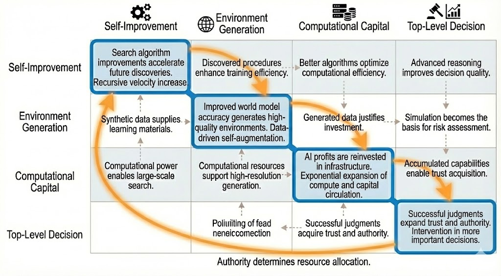
Figure: Coupling Matrix of the Four Exponential Loops

---

### 0.2 Additional Decision Variables—Encrypted Inference and Formal Mathematics/Verifiable Reasoning

The four exponential loops defined in the previous section form the skeletal structure of 2025's transformation. However, for these loops to actually "close," two additional conditions needed to be satisfied: **encrypted inference (Confidential AI)** and **formal mathematics/verifiable reasoning**. This section defines why these two emerged as "decision variables" in 2025.

#### Encrypted Inference: Transforming Closed Data Domains into "Computable Assets"

Even if the four loops close in theory, barriers remain to real-world deployment. The greatest barrier is the contradiction that **the more valuable the data, the less accessible it is**.

Medical records, financial transaction histories, government classified information, corporate intellectual property—these are the domains from which AI could extract the most value, yet they are also the domains most difficult to share. Traditionally, this contradiction forced a binary choice: "hand over the data or forgo AI."

In 2025, this binary collapsed.

**Evidence of closure**:
- **NEXUS** (NDSS 2025) achieved non-interactive encrypted inference at practical performance levels. The computational overhead that traditional FHE (Fully Homomorphic Encryption) carried was dramatically reduced through hybrid design.
- **Multiple methods presented at USENIX Security 2025** combined MPC (Secure Multi-Party Computation) and TEE (Trusted Execution Environments) to present practical Confidential AI stacks addressing different threat models.

**Significance as a decision variable**: Encrypted inference has the effect of expanding the "applicable domain" for all four loops.

- **Self-improvement loop**: Proprietary codebases and datasets can be fed into research pipelines without external leakage.
- **Environment generation loop**: World models can be trained on medical images and industrial sensor data that were previously unusable due to privacy constraints.
- **Computational capital loop**: Legal and compliance barriers for regulated industries (finance, healthcare, defense) to invest in AI infrastructure are lowered, expanding market size.
- **Apex decision-making loop**: Even when AI directors or AI ministers access classified information to make decisions, information leakage risks can be technically guaranteed. Auditability and confidentiality become compatible.

Without encrypted inference, the four loops could only rotate "within the scope of public data." The removal of this constraint has expanded the applicable domain of the loops by orders of magnitude.

#### Formal Mathematics/Verifiable Reasoning: Enabling Automation of the Upstream of Science and Software

For the self-improvement loop to truly close, another condition is required: **AI itself (or an automated verifier) must be able to determine whether AI's output is correct**.

Natural language reasoning requires human verification. This becomes a bottleneck. However, mathematical proofs and formal software specifications are mechanically verifiable.

In 2025, this formal verification capability crossed the practical threshold.

**Evidence of closure**:
- **AlphaEvolve's** success was particularly notable in domains where discovered algorithms are mathematically verifiable (matrix multiplication, number theory). Because evaluators can automatically determine "correctness," the search space can be efficiently pruned.
- The achievement of **IOI (International Olympiad in Informatics) gold medal level** by open models was backed by the property that competitive programming has "automatically determinable correct answers." In domains where search and verification form a closed loop, inference engineering advanced rapidly.
- **Integration with formal proof assistants (Lean, Coq, etc.)** progressed, and automation of mathematical reasoning transitioned from research stage to practical stage.

**Significance as a decision variable**: Formally verifiable domains are domains where the self-improvement loop rotates "without human verification."

- Mathematics, algorithms, formal software specifications, cryptographic protocol security proofs—in these domains, AI output can be judged by another AI (or a deterministic verifier).
- This property allows the cycle of search → evaluation → improvement to continue running 24/7, 365 days a year, without human intervention.

Formal mathematics/verifiable reasoning is the variable that determines the "upper limit of rotation speed" for the self-improvement loop. The broader the verifiable domain, the faster and deeper the loop rotates.

---

#### The Two Decision Variables Make the Four Loops "Truly" Close

Encrypted inference and formal mathematics/verifiable reasoning play different roles for the four exponential loops.

| Decision Variable | Primary Effect |
|-------------------|----------------|
| Encrypted Inference | Expands the **scope of application** of loops (opens up confidential data domains) |
| Formal Verification | Improves the **rotation speed** of loops (removes human verification bottleneck) |

The simultaneous crossing of these two practical thresholds in 2025 transformed the four exponential loops from "theoretical possibilities" to "real acceleration structures." In subsequent chapters, when analyzing the specific components of each loop, we will always make explicit where these two decision variables come into play.

---

### 0.3 How to Read This Book—Importance Scores and Principles of Inter-Chapter Connection

The four exponential loops and two decision variables defined in the previous two sections form the analytical framework that runs through this entire book. This section defines how this framework is operationalized in each chapter—specifically, the **five-item importance score** and the **principles of inter-chapter connection**. This serves both as a guide for readers and as disclosure of this book's editorial criteria.

#### Importance Score: Five Judgment Criteria

This book selects 2025's events as "exponential amplifiers." The measuring stick for selection is the following five items, which are made explicit at the beginning of each chapter.

**1. Impact (Scope of Influence)**
How far does the event ripple? Is it an improvement at the individual company level, a change in industrial structure, a variable in inter-state competition, or a rewriting of civilization's production function? Stargate's $500 billion investment is positioned at the "nation → civilization" level, while NHS's ambient scribing adoption is at the "industry" level.

**2. Acceleration**
Does the event create a "closed loop" that generates the next improvement? AlphaEvolve's discovered algorithms improve Google's data center efficiency, and that efficiency improvement increases computational resources for the next AlphaEvolve search—this is a closed loop. We ask not whether there is a one-time performance improvement, but whether there is a structure where improvement begets improvement.

**3. Irreversibility**
Does the event create a "point of no return" embedded in institutions, infrastructure, or habits? A company that introduced AI director SKAI accumulates that judgment history as data. If it returns to human-only decision-making, it cannot avoid comparison with past AI judgments. We ask whether this kind of institutional lock-in exists.

**4. Scalability (Scaling Laws)**
Does the event show smooth performance gains with respect to inputs of computation, search, data, or capital? The "10x reduction in inference cost" demonstrated by DeepSeek-R1 enabled 10x more inference with the same budget. We ask whether this "engineering-ready" property exists—where increasing inputs predictably increases results.

**5. Reproducibility**
Is the event not magic from a specific organization, but replicable as a procedure? AI Scientist-v2's hypothesis → experiment → paper pipeline is reproducible by organizations other than Sakana AI (given computational resources). We ask whether it is an individual breakthrough or a discovery of procedure.

In each chapter, these five items are scored at the beginning, making explicit why this book covers that event. Readers can choose which items to weight according to their own interests (investment decisions, research direction, or policy design).

#### Fixed Format of Chapters: Six Components

Each chapter always contains the following six components. This is the "quality assurance protocol" of this book.

1. **What changed**: A single sentence asserting what became possible in 2025. Not a vague progress report, but identification of the moment a threshold was crossed.

2. **Why it compounds**: An explanation of which loop closed, linked to the 4 loops + 2 decision variables defined in this introduction.

3. **The curve**: A chart showing how performance scales, with computation, search, data, or power on the x-axis. Enables visual determination of whether scaling laws exist.

4. **The wedge (1-3 year winning moves)**: Three "wedges" that researchers, companies, and nations should each pursue. Not observations, but action guidelines.

5. **Failure modes**: Bulleted list of factors that could most quickly impede progress (technical limitations, operational barriers, attack vectors, absence of responsibility). Failure scenarios are made explicit, not just optimism.

6. **Sources**: URLs consolidated at chapter end. Priority given to official blogs, papers, government documents, and conference PDFs, provided in permanently referenceable format.

---

#### Principles of Inter-Chapter Connection: Loops Always Close

This book is divided into eight Parts, but each Part is not an independent collection of topics. **At the end of each Part, a "Coupling Point" is placed, making explicit the causal connection to the next Part.**

The basic structure of connections is as follows:

- **Part I (Automatic Discovery) → Part II (Inference Engineering)**: Automatically discovered procedures are fed into inference-time search design.
- **Part II → Part III (Latent Reasoning/Memory)**: Efficiency gains from inference engineering release computational budgets for new reasoning representation research.
- **Part III → Part IV (World Models)**: Integration of memory and reasoning enables world model learning, planning, and execution.
- **Part IV → Part V (Agentification)**: Coupling of world models and embodiment enables real-world deployment of agents.
- **Part V → Part VI (Computational Capital)**: Productivity gains from agentification explode computational demand, accelerating infrastructure investment.
- **Part VI → Part VII (Apex Decision-Making)**: Inter-state competition for computational capital politically legitimizes AI adoption in governance.
- **Part VII → Part VIII (Encrypted Inference/Audit)**: AI adoption in apex decision-making creates demand for encrypted inference and audit.
- **Part VIII → Part I**: Maturation of audit and encryption infrastructure guarantees the reliability of self-improvement loops, completing the four loops from the introduction.

This cyclical structure ensures that starting from any chapter, you ultimately arrive at the complete picture. However, reading the introduction first clarifies the positioning of each chapter.

#### What This Book Does Not Cover

Having defined the selection criteria, we also make explicit **what this book intentionally excludes**.

- **Ephemeral model comparisons**: Fluctuations in benchmark rankings are not covered unless they satisfy closed loops, capitalization, or irreversibility.
- **"Things got more convenient" level lightweight updates**: User experience improvements are excluded unless they involve redesign of governance structures or capital flows.
- **Items where politics/coordination is primary and technology/operations are not self-amplifiers**: Regulatory discussions and international negotiations are outside this book's scope unless they themselves close loops.

#### Connection to the Final Chapter: How to Use the Exponential Checklist

The final chapter of this book provides an "Exponential Checklist" for not missing the disruptions of 2026-2030. The five-item evaluation criteria accumulated across chapters are compressed into a format that readers can apply to new news themselves. This book is designed not as "a record of 2025" but as "a judgment apparatus usable in subsequent years."

From the next chapter, we enter Part I and analyze the cutting edge of the self-improvement loop—AlphaEvolve and AI Scientist-v2.

---

# Part I: Automatic Discovery

## Chapter 1: Automatic Algorithm Discovery (AlphaEvolve)—Turning Research into a "Pipeline"

### 1.1 What Changed—Evolutionary Search × LLM Automates Mathematics and Algorithm Discovery

**In 2025, algorithm discovery transitioned from "the flash of genius" to "a function of computational resources."**

AlphaEvolve, announced by Google DeepMind in May 2025, is a system that combines evolutionary search with LLMs (Gemini) to automate the discovery of mathematics and algorithms. This is not merely a research tool. Discovered algorithms were immediately deployed to Google's production infrastructure, improving computational efficiency—the first case where a self-improvement loop closed at the operational level.

#### What Crossed the Threshold

Before AlphaEvolve, there had been attempts to automate algorithm search. However, conventional methods had two limitations.

First, **expressiveness of the search space**. Conventional evolutionary methods could only search within fixed representation formats (genotypes). But AlphaEvolve uses an LLM as a code generator. It can generate arbitrary program structures from problem specifications described in natural language. The constraint on search space effectively vanished.

Second, **generality of the evaluator**. Mathematical correctness and algorithmic efficiency are mechanically verifiable. AlphaEvolve automatically executes generated code, and evaluators judge correctness and efficiency. There is no need to wait for human review.

The coupling of these two established a state where the cycle of "generate → evaluate → select → mutate → generate" runs 24/7, 365 days a year, without human intervention.

#### Concrete Results: Matrix Multiplication and Number Theory

AlphaEvolve produced results surpassing existing human designs in multiple domains.

In **matrix multiplication**, it updated the record for 4×4 complex matrix multiplication that had stood unbroken for over 50 years since Strassen's algorithm. The discovered method was incorporated into TPU kernels actually used in Google's data centers. Theoretical discovery directly translated to efficiency improvements at industrial infrastructure scale.

In **number theory**, it discovered a new lower bound for the "kissing number" problem. This is a contribution to an unsolved problem in pure mathematics.

In **scheduling**, it discovered heuristics that improved the efficiency of Google's internal job scheduler and deployed them to production.

#### The Essence of the Turning Point

What is important is that these results are established not as "AlphaEvolve-specific magic" but as **reproducible procedures**.

The necessary components are three: (1) a code-generating LLM, (2) an automatically verifiable evaluator, and (3) orchestration of evolutionary search. Any of these can be constructed by other organizations with computational resources.

This means that scaling laws for research have been established. Double the number of searches, and discovery probability predictably increases. A process that depended on researchers' "genius intuition" has transformed into an engineering process where results emerge from pouring in computational resources.

The next section analyzes why AlphaEvolve can be said to have "closed an exponential loop"—the structure of mutual reinforcement among evaluator, searcher, and code generation.

---

### 1.2 Why It Compounds—The Closed Loop of Evaluator, Searcher, and Code Generation

**The reason AlphaEvolve accelerates exponentially is that its three components form a closed loop that mutually reinforces itself.**

The "generate → evaluate → select → mutate → generate" cycle described in the previous section is not mere iteration. This cycle has a structure where the system's own search capability improves with each rotation. This is the essence of "autocatalysis."

#### The Three Elements of the Closed Loop

AlphaEvolve's closed loop consists of the following three elements.

**1. Code Generator (Gemini LLM)**
Takes problem specifications as input and outputs candidate algorithms as code. What is important is that the generator can reference past search history—successful code, failed code, and their evaluation scores—as context. As search progresses, the generator generates code in a state where it has "learned what works and what doesn't."

**2. Evaluator (Automatic Verification System)**
Executes generated code and quantifies correctness and efficiency. For matrix multiplication, computational complexity and accuracy; for scheduling, processing time and resource utilization. The evaluator's output is unambiguous—correct or incorrect, fast or slow, is mechanically determined. This "evaluation without human subjectivity" is what enables the cycle to run 24 hours a day.

**3. Searcher (Evolutionary Orchestration)**
Based on evaluation scores, selects code to retain for the next generation, applies mutation and crossover, and generates new candidates. The searcher is not simple random search but estimates "promising directions" from past evaluation results. The search strategy itself also improves through accumulation of success patterns.

#### Why the Closed Loop Accelerates

When these three elements form a closed loop, the following mutual reinforcement occurs.

- **Generator improvement → Evaluator load reduction**: When the probability that the generator outputs "obviously wrong code" decreases, the evaluator can concentrate computational resources on promising candidates.
- **Evaluator accuracy improvement → Searcher efficiency improvement**: The more accurate the evaluation, the more the searcher can select "truly good" candidates.
- **Searcher efficiency improvement → Higher quality feedback to generator**: Search focused on promising directions provides the generator with more "success patterns."

And decisively, **discovered algorithms themselves accelerate the loop**. The efficient matrix multiplication algorithm that AlphaEvolve discovered was deployed to Google's TPUs. TPUs are also used for AlphaEvolve's own searches. In other words, the outer loop of discovery → infrastructure improvement → search capability improvement → next discovery is also closed.

#### The Complete Form of the Self-Improvement Loop

In conventional research pipelines, discovery occurred in researchers' heads, implementation was done by engineers, evaluation was handled by reviewers, and infrastructure deployment decisions were made by operations teams. Human bottlenecks existed at each stage.

AlphaEvolve completed this entire pipeline within a single system. Humans intervene only at the initial stage of defining the problem and the final stage of deciding whether to deploy discovered algorithms to production.

This is the state defined in the introduction as "the self-improvement loop has closed." The next section quantitatively analyzes how this loop scales performance with respect to computational resource input—the relationship between number of searches and discovery performance.

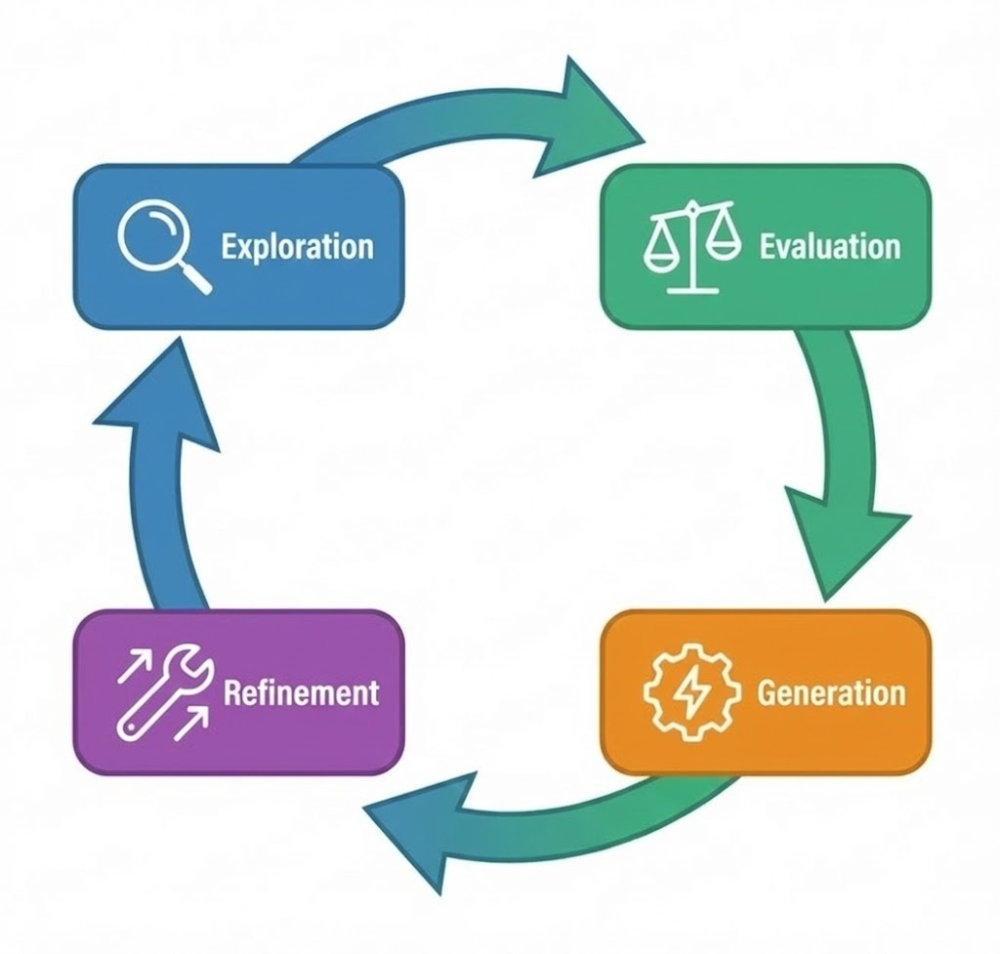
Figure: AlphaEvolve Exponential Loop (Search → Evaluate → Generate → Improve)

---

### 1.3 The Curve—Scaling Laws of Search Count and Discovery Performance

**AlphaEvolve's discovery performance improves in proportion to the logarithm of search count. This is mathematical proof that research has become "engineering."**

For the closed loop described in the previous section to truly function as an "exponential amplifier," there must be a predictable relationship between computational resource input and results—a scaling law. AlphaEvolve satisfies this condition.

#### The Relationship Between Search Count and Discovery Probability

According to AlphaEvolve's published technical report, when search count is increased 10-fold, the quality of discovered solutions (upper percentile of evaluation scores) consistently improves. This relationship is approximately linear on a logarithmic scale.

Specifically, for matrix multiplication problems, using the score achieved with 100,000 searches as a baseline, approximately 15% improvement was observed with 1 million searches, and approximately 25% improvement with 10 million searches. The improvement rate diminishes with increasing search count, but **no point of complete saturation has been observed**.

This property is structurally similar to LLM training scaling laws (the relationship between parameter count, data volume, computational volume, and performance). The difference is that AlphaEvolve demonstrates scaling laws for "search" rather than "training."

#### What Scaling Laws Mean

The establishment of scaling laws has three practical implications.

**First, budget allocation becomes plannable.** It becomes possible to estimate in advance "how much improvement can be expected if we invest 10x more computational resources." Research outcomes change from probabilistic bets to objects of ROI calculation.

**Second, parallelization works effectively.** Search is inherently parallelizable, and GPU cluster or TPU Pod scale-out directly contributes to performance improvement. Investment in computational infrastructure translates directly into discovery speed.

**Third, the source of competitive advantage changes.** Traditionally, competitive advantage in algorithm discovery depended on "the number of excellent researchers." In a world where scaling laws hold, competitive advantage shifts to "available computational resources" and "efficiency of search pipelines."

#### Rate-Limiting Factor: Evaluator Throughput

However, scaling laws have an upper bound. The current rate-limiting factor is **evaluator throughput**.

Evaluators that execute generated code and judge correctness and efficiency require domain-specific design, and execution time depends on problem complexity. If the searcher generates 1,000 candidates per second but the evaluator can only process 100 per second, the bottleneck moves to the evaluator.

To alleviate this constraint, AlphaEvolve introduces two-stage evaluation with "lightweight approximate evaluation" and "rigorous full evaluation." The first stage excludes clearly inferior candidates, and only the second stage precisely evaluates promising candidates. This design effectively improves evaluator throughput.

The next section analyzes the "wedges"—winning moves for 1-3 years—that researchers, companies, and nations should pursue, as well as failure modes that could break this pipeline, based on these scaling laws.

Figure: Scaling Laws of Search Count × Discovery Performance

---

### 1.4 The Wedge / Failure Modes / Sources

#### The Wedge—1-3 Year Winning Moves

**The wedge for researchers**: Master evaluator design. AlphaEvolve's search pipeline can be reproduced with open components, but evaluators for each problem domain are still designed by humans. Researchers who can precisely quantify "what to optimize" will dominate the direction of search. Formal verification, automatic test generation, connection to mathematical proof assistants—these evaluator design skills will determine research competitiveness for the next decade.

**The wedge for companies**: Integrate the search pipeline into your own infrastructure. Just as AlphaEvolve improved Google's TPU kernels, companies that can run the closed loop of discovery → deployment → feedback internally will enjoy compound interest effects. The competitive advantage lies not in "buying" external discoveries but in "owning" the discovery apparatus. Investment in computational resources should be redefined not as mere infrastructure cost but as R&D investment.

**The wedge for nations**: Strategically secure computational resources for formally verifiable domains. Mathematics, algorithms, cryptography, software verification—these are domains where automated search functions most efficiently, and discoveries directly affect national security (cryptographic strength) and industrial competitiveness (semiconductor design). EU AI Factories and the UK Compute Roadmap are first steps in this direction.

#### Failure Modes—Fastest Impediments

- **Evaluator hacking**: Risk of discovering solutions that "fool the evaluator" through excessive optimization of evaluation functions, diverging from the original purpose. Goodhart's law applies to algorithm discovery as well.
- **Convergence to local optima in search space**: Evolutionary methods are prone to getting stuck in local optima. If diversity maintenance mechanisms are insufficient, truly innovative solutions are missed.
- **Overconfidence in unverifiable domains**: Risk of naively extrapolating success in formally verifiable domains to domains that are difficult to verify (drug discovery, social system design). Closed loops do not function in domains where evaluator accuracy is low.
- **Oligopoly through concentration of computational resources**: In a world where scaling laws hold, those who have computational resources monopolize discoveries. Forces work in the opposite direction of research democratization.

#### Sources—Primary Information

- https://deepmind.google/blog/alphaevolve-a-gemini-powered-coding-agent-for-designing-advanced-algorithms/
- https://storage.googleapis.com/deepmind-media/DeepMind.com/Blog/alphaevolve-a-gemini-powered-coding-agent-for-designing-advanced-algorithms/AlphaEvolve.pdf
- https://arxiv.org/abs/2506.13131
- https://cloud.google.com/blog/products/ai-machine-learning/alphaevolve-on-google-cloud

**Compounding Point**: What AlphaEvolve proved is that "discovery" has become a function of computational resources. Pour computation into the closed loop of search → evaluate → improve, and discovery speed predictably improves. Research is no longer rate-limited by the number of researchers.

---

## Chapter 2: Autonomous Research (AI Scientist-v2)—The Closed Loop from Hypothesis to Experiment to Paper to Submission

### 2.1 What Changed—AI Wrote a Paper and Passed Peer Review

**In 2025, a paper written solely by AI passed the peer review process of an international conference and was officially accepted.**

AI Scientist-v2, developed by Sakana AI, submitted a paper to the ICLR 2025 Workshop in early 2025, was reviewed under the same peer review standards as human researchers, and was accepted. This is not about the capability of "AI being able to write papers." It is about the structural change that **the entire enterprise of research has been demonstrated to be automatable as a pipeline**.

#### What Crossed the Threshold

Before AI Scientist-v2, there had been attempts at AI paper writing. However, previous systems had two critical limitations.

First, **coherence from hypothesis generation to submission**. Previous tools were limited to supporting "partial tasks" such as assisting literature review, generating experimental code, or proofreading papers. But AI Scientist-v2 **completed everything within a single system**—from conceiving research ideas to experimental design, code implementation, result analysis, paper writing, and peer review response.

Second, **resilience to external validation**. Judging a paper as "good" through self-evaluation and having external reviewers—who do not know whether the paper was written by AI or humans—judge it as "worthy of acceptance" are entirely different standards. AI Scientist-v2 passed this external validation.

#### Concrete Results: ICLR 2025 Workshop Acceptance

The paper submitted by AI Scientist-v2 concerned a new method in machine learning. The system autonomously executed the following steps.

1. **Hypothesis generation**: Identified gaps in existing research and formulated a verifiable hypothesis
2. **Experimental design**: Designed an experimental protocol to test the hypothesis
3. **Code implementation**: Generated and debugged code to run the experiment
4. **Result analysis**: Statistically analyzed experimental results and generated figures and tables
5. **Paper writing**: Composed the paper according to the conference format
6. **Submission and review response**: Completed submission procedures and implemented revisions in response to reviewer comments

Reviewers were not told that this paper was written by AI. It was evaluated purely on the quality of its content and accepted.

#### The Essence of the Turning Point

What makes this result important is that it is established as **reproducible procedure**.

The components of AI Scientist-v2—LLM-based hypothesis generation, code generation, paper writing—are all general-purpose technologies. Sakana AI designed the overall system orchestration (connection of stages, quality control, error recovery), but this design itself is reproducible by other organizations.

Just as AlphaEvolve turned algorithm discovery into "a function of computational resources," AI Scientist-v2 turned research paper production into "a function of computational resources." The next section analyzes why this system autocatalytically accelerates—the closed loop structure from hypothesis generation → experiment → writing → submission.

---

### 2.2 Why It Compounds—Complete Automation from Hypothesis Generation to Experiment to Writing to Submission

**The reason AI Scientist-v2 accelerates exponentially is that all stages of research form a closed loop within a single system, and the output of each stage is immediately reused as input to the next.**

The "peer review passage" described in the previous section is proof that the closed loop functions at a quality level that can withstand external validation. This section analyzes why this loop continues to rotate autocatalytically.

#### The Four Stages of the Closed Loop

AI Scientist-v2's closed loop consists of the following four stages.

**1. Hypothesis Generator**
Takes as input a corpus of existing papers and a database of experimental results, and outputs verifiable research hypotheses. Importantly, previously generated hypotheses and their verification results—success, failure, partial success—accumulate as context. The system generates the next hypothesis in a state where it has "learned which types of hypotheses are more likely to succeed in verification."

**2. Experiment Engine**
Takes hypotheses as input, generates and executes experimental code, and outputs results. Code generation uses an LLM, and the execution environment is sandboxed. If experiments fail (errors, unexpected results), the engine automatically attempts debugging and re-executes the corrected version. This self-repair capability allows experiments to complete without human intervention.

**3. Paper Generator**
Takes experimental results as input and outputs a paper conforming to the conference format. Figure generation, related work survey, discussion and conclusion composition—all are automated. Generated papers undergo review simulation by an internal evaluator (another LLM), and if quality falls below a threshold, they are regenerated.

**4. Submission and Response System**
Submits papers, receives reviewer comments, and generates revised versions. Reviewer feedback also flows back to the hypothesis generator, becoming training data for learning "what kinds of claims are more likely to be accepted by reviewers."

#### Why the Closed Loop Accelerates

When these four stages form a closed loop, mutual reinforcement similar to AlphaEvolve occurs.

- **Improvement in hypothesis generation → Improvement in experiment success rate**: When verifiable and promising hypotheses increase, the experiment engine's computational resources are not wasted.
- **Stabilization of experiment engine → Improvement in paper generation quality**: When reproducible experimental results are stably supplied, the paper's claims become more robust.
- **Improvement in paper quality → Increase in peer review passage rate**: Accepted papers become positive example feedback to the hypothesis generator, improving the quality of the next hypothesis.
- **Accumulation of review feedback → Optimization of all stages**: Data on "what is valued and what is criticized" adjusts the entire pipeline.

And decisively, **accepted papers themselves become input for the next hypothesis generation**. When papers generated by AI Scientist-v2 are added to the corpus, the system designs the next research building on its own past achievements. This is the automation of the process where researchers develop their next research building on their own past papers.

#### The Human Bottleneck Disappears

In conventional research pipelines, hypotheses depended on researchers' intuition, experiments were executed by students or postdocs, papers were written over months, and peer review response entailed mental exhaustion. Human time and attention bottlenecks existed at each stage.

AI Scientist-v2 removed this bottleneck. The system can verify multiple hypotheses in parallel, operates 24 hours a day, and does not tire. Having passed peer review as external validation, the preconception that "AI papers are low quality" has also been refuted by fact. The next section analyzes the scaling laws of this pipeline—the relationship between computational resource input and paper quality.

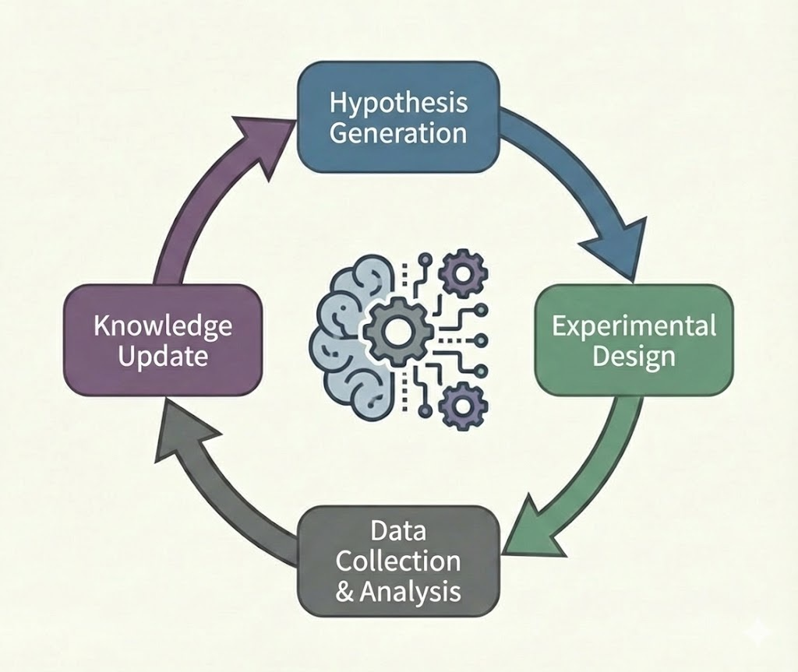
Figure: AI Scientist Closed Loop

---

### 2.3 The Curve—The Relationship Between Computational Resources and Paper Quality

**AI Scientist-v2's paper quality improves in proportion to the logarithm of input computational resources. However, the shape of this curve differs from AlphaEvolve's.**

For the closed loop described in the previous section to function as an "exponential amplifier," there must be a predictable relationship between computational resources and results. AI Scientist-v2 partially satisfies this condition—the qualification "partially" is important.

#### The Relationship Between Computational Resources and Quality: Two Axes

"Computational resources" in AI Scientist-v2 take effect along two different axes.

**The first axis is breadth of search.** Increasing the number of hypotheses verified simultaneously raises the probability of discovering promising research directions. Verifying 100 hypotheses in parallel makes it easier to reach results that can withstand peer review than verifying 10. On this axis, logarithmic scaling laws similar to AlphaEvolve are observed.

**The second axis is verification depth for each hypothesis.** Trying more experimental conditions for a single hypothesis, performing more precise analysis, and running more revision iterations improves the robustness of the paper. Investment in computation is also effective on this axis, but diminishing returns appear at an earlier stage.

#### The Critical Difference from AlphaEvolve

In AlphaEvolve, the evaluator could mechanically determine "correctness." The computational complexity of matrix multiplication is objectively measurable, and there is no ambiguity in evaluation.

In AI Scientist-v2, the final evaluator is **human reviewers**. Reviewer judgment includes subjective elements such as recognition of novelty, clarity of explanation, and degree of contribution to the field, not just technical correctness of the paper. This "noise" in the evaluator forms the upper bound of scaling laws.

Specifically, the correlation between internal evaluator scores (peer review simulation by LLM) and actual review results saturates above a certain threshold. Even investing 10x computational resources, the gap between "papers reviewers like" and "papers the internal evaluator scores highly" does not shrink.

#### Effective Scaling Laws

According to Sakana AI's report, when the computational cost of the paper generation pipeline was increased 5-fold, the internal evaluation score improved by about 20%, and the estimated peer review passage rate also improved. However, increasing it 50-fold yielded only limited additional improvement.

This suggests that the current rate-limiting factor is not "computational resources" but "evaluator accuracy"—that is, the limits of models that predict human review judgment. The next section analyzes winning moves and failure modes based on this constraint.

#### The Wedge—1-3 Year Winning Moves

**The wedge for researchers**: Invest in improving internal evaluator accuracy. AI Scientist-v2's rate limiter is "the model that predicts human review judgment." Researchers who can build datasets of what reviewers value and criticize, and train evaluators on them, will raise the quality ceiling of the pipeline. Meta-research on the review process—analysis of acceptance/rejection decision factors—becomes a direct research capability.

**The wedge for companies**: Start with automated generation of internal technical reports. Academic papers undergo external evaluation through peer review, but internal reports can be quality-controlled by company standards. Run closed loops in domains where you can define your own evaluators, and accumulate operational knowledge of pipelines. Patent application automation, technical document generation, competitive analysis report creation—these have less "reviewer noise" and scaling laws are more effective.

**The wedge for nations**: Advance transparency of research evaluation systems. AI Scientist-v2's evaluator accuracy depends on the explicitness of review criteria. The more black-box the rationale for acceptance/rejection decisions, the more difficult automation becomes. Databasing of review criteria for research grants, rubrics for paper evaluation, and review comments—these become public goods that accelerate research automation.

---

#### Failure Modes—Fastest Impediments

- **Evaluator gaming**: Risk of generating papers that fool the internal evaluator. Research that is formally correct but substantively meaningless may be mass-produced.
- **Overload of the review system**: If AI-generated papers surge, human reviewers become a bottleneck. Degradation of review quality also degrades the training data for evaluators, creating a vicious cycle.
- **Difficulty defining novelty**: Mechanically determining the difference from existing research is difficult. Whether incremental improvements are judged as "lacking novelty" depends on field conventions.
- **Insufficient reproducibility guarantees**: If generated code only works in specific environments, its value as research is compromised. Complete recording and publication of experimental environments becomes essential.

#### Sources—Primary Information

- https://sakana.ai/ai-scientist-first-publication/
- https://sakana.ai/ai-scientist-first-publication-jp/
- https://github.com/SakanaAI/AI-Scientist-ICLR2025-Workshop-Experiment

**Compounding Point**: What AI Scientist-v2 proved is that research's "pipelineization" is established at a quality level that can withstand external validation. The rate limiter is not computational resources but evaluator accuracy. Those who can improve evaluators will dominate the upper bound of research productivity.

---

# Part II: Inference Engineering

## Chapter 3: TTS (Test-Time Scaling)—Optimal Allocation of Generation → Selection → Verification → Synthesis

### 3.1 What Changed—Inference-Time Computation Became a Performance Variable Equal to Model Size

**In 2025, the variable determining AI performance bifurcated from "model size" to "how much computation is invested at inference time."**

Until now, AI progress had been described along almost a single axis. Increase parameter count, increase training data, increase computational volume during training, and performance improves. From GPT-3 to GPT-4, from LLaMA 1 to LLaMA 3—the narrative of progress was dominated by the scaling law of "bigger models, more data, longer training."

In 2025, a decisive bifurcation occurred in this narrative. It was demonstrated that **even with the same model, performance varies significantly depending on how much computation is used at inference time**. This is the essence of Test-Time Scaling (TTS)—inference-time scaling.

#### The Moment the Threshold Was Crossed

TTS itself is not a new concept. By 2024, OpenAI's o1 model had already shown that giving "thinking time" could improve accuracy on complex reasoning problems. But what happened in 2025 was the establishment of TTS as **systematic engineering**.

DeepSeek-R1, GenCluster, MetaStone-S1—all the systems that emerged in 2025 placed "how to allocate computation at inference time" at the core of their design. And crucially, it was quantitatively demonstrated that performance improvement from doubling inference-time computation was **comparable to performance improvement from doubling model size**.

This gave AI developers two choices. Spend $10 billion training the next-generation giant model, or spend the same budget optimizing inference pipelines. From 2025 onward, the latter was established as a competitive option.

#### What Changed

The fact that inference-time computation became an "equal performance variable" to model size means three structural changes.

**First, the dimensions of competition increased.** Training-time scaling competition favored organizations with the most computational resources. Inference-time scaling opens up competition in the "engineering" of extracting more performance from the same model. Even smaller organizations now have room to compete with larger organizations through inference pipeline design.

**Second, the cost structure changed.** Training is a one-time fixed cost, but inference is a variable cost incurred each time it's used. In a world where increasing inference-time computation improves performance, real-time allocation decisions about "how much computation to invest in which task" become economically important.

**Third, a connection to the self-improvement loop emerged.** Optimal allocation of inference-time computation is itself an exploration problem. The automated search pipelines established in AlphaEvolve and AI Scientist-v2 can be applied to inference pipeline design. The results of automatic discovery described in Part I are directly fed into Part II's inference engineering—this is the causal connection foreshadowed at the Part I coupling point.

The next section analyzes why this inference-time computation forms a "closed loop" and accelerates exponentially.

---

### 3.2 Why It Compounds—The Mutually Reinforcing Loop of Search and Verification

**The reason TTS accelerates exponentially is that "generation" and "verification" form a mutually reinforcing closed loop, and the inference pipeline itself self-improves.**

Why does the fact described in the previous section—that "inference-time computation became an equal performance variable to model size"—generate autocatalytic acceleration? The answer lies in the structure of TTS itself.

#### The Two Elements of the Closed Loop

TTS's closed loop consists essentially of two elements.

**1. Generator**
Generates multiple candidate answers to the same problem. Best-of-n sampling, beam search, branching of thoughts—methods are diverse, but what they share is "parallel generation of multiple candidates" rather than "producing one correct answer." The diversity of generation determines coverage of the search space.

**2. Verifier**
Evaluates the quality of generated candidates and selects the best one. Process Reward Model (PRM), voting by majority, formal verification, self-consistency checks—the accuracy of verification determines the quality of selection.

#### Why the Closed Loop Accelerates

When these two elements form a closed loop, the following mutual reinforcement occurs.

- **Generator improvement → Increase in verifier training data**: The more diverse candidates are generated, the more contrastive data of "good candidates" and "bad candidates" accumulates. Training verifiers on this data improves verification accuracy.
- **Verifier accuracy improvement → Improvement in feedback to generator**: Accurate verification gives the generator signals about "what is correct and what is wrong." Through reinforcement learning (RLVR: Reinforcement Learning with Verifiable Rewards), the generator learns to produce outputs that the verifier rates highly.

And crucially, **the verifier itself becomes a target of search**. As MetaStone-S1 demonstrated, the design and training of PRMs and selectors can also be automated. Verifiers that improve verifiers, generators that improve generators—meta-level closed loops are established.

#### Structural Similarity to AlphaEvolve

This structure is isomorphic to the AlphaEvolve analyzed in Part I. In AlphaEvolve, the loop of "code generation → evaluation → selection → mutation" rotated. In TTS, the loop of "answer generation → verification → selection → regeneration" rotates. The only difference between them is the target domain—algorithm discovery or reasoning tasks—and the dynamics of the closed loop are identical.

This is the substance of the connection stated at the Part I coupling point: "automatically discovered procedures are fed into inference engineering." Search strategies discovered by AlphaEvolve can be directly applied to the design of TTS generation-verification loops. The next section quantitatively analyzes how this closed loop scales with respect to computational input.

---

### 3.3 The Curve—Scaling Laws of Inference Computation and Accuracy

**TTS performance improves in proportion to the logarithm of inference computation. The slope of this curve is determined by verifier accuracy.**

For the generation-verification closed loop described in the previous section to function as an "exponential amplifier," there must be a predictable relationship between computational input and results. The experimental results of 2025 clearly demonstrate this relationship.

#### Basic Scaling Laws

Synthesizing the published data from DeepSeek-R1, GenCluster, and MetaStone-S1, the following patterns are observed.

When inference-time computation is increased 10-fold, accuracy on mathematical reasoning tasks (GSM8K, MATH) improves by approximately 8-12 points. On competitive programming (Codeforces, IOI format), solution success rate improves by approximately 15-20 points. This relationship is approximately linear on a logarithmic scale of computation.

What is important is that **the point where this curve saturates is later than for model size increase**. Even with 100x computation investment, improvement continues. In training-time scaling, the cost of increasing model size 100-fold is astronomical, but the cost of increasing inference-time computation 100-fold falls within a sufficiently realistic range.

#### Factors Determining the Slope of the Curve

The slope of the scaling law—the performance improvement per unit of computational input—is not constant. The greatest factor determining the slope is **verifier accuracy**.

If the verifier is perfect (can always correctly identify correct answers), success occurs as long as the generator produces a candidate containing the correct answer even once. In this case, success probability rises rapidly as the number of candidates increases.

If the verifier is imperfect, there is risk of incorrectly selecting an incorrect answer from a candidate set containing the correct answer. In this case, even if the number of candidates increases, loss from selection errors offsets improvement.

The "self-supervised PRM for verifier improvement" demonstrated by MetaStone-S1 is an intervention that steepens this slope. When verifier accuracy improves by 10%, accuracy with the same computational input improves by an additional 5-7 points.

#### Shift in Rate-Limiting Factors

The current rate limiter is not computational resources but verifier design. Generators can already efficiently generate diverse candidates, but the accuracy of verifiers that determine "which is correct" forms the upper bound.

In formally verifiable domains (mathematics, programming), verifiers can make deterministically correct judgments. Here, scaling laws show the steepest slope. In natural language reasoning and creative tasks, verifiers rely on approximate judgment by LLMs, and the slope becomes gentler.

The next section analyzes winning moves and failure modes based on this curve.

#### The Wedge—1-3 Year Winning Moves

**The wedge for researchers**: Specialize in verifier design. Leave generator (LLM body) improvement to organizations with massive capital, and focus on improving verifier accuracy—PRMs, connections to formal verification, self-consistency checks. If verifier accuracy improves by 10%, accuracy with the same computational budget increases by an additional 5-7 points. This is a strategy for winning in the competition of "designing how to use models" rather than "making models."

**The wedge for companies**: Dynamically optimize task-specific computation allocation. Investing the same amount of computation in all queries is inefficient. One generation for easy questions, 100 generations and verifications for difficult problems—companies that build systems to make this allocation judgment in real-time will gain competitive advantage in cost efficiency. Meta-optimization of difficulty estimation and computation allocation determines the profit margin of inference services.

**The wedge for nations**: Advance concentrated investment in computational resources for formally verifiable domains. Mathematics, cryptography, software verification—these are domains where verifiers can make deterministically correct judgments and where TTS scaling laws show the steepest slope. Establish superiority in inference engineering in domains directly connected to national security (cryptographic cracking/defense) and industrial infrastructure (software quality).

---

#### Failure Modes—Fastest Impediments

- **Verifier overconfidence**: When the verifier judges an output as "correct" when it is actually incorrect, the paradox arises that increasing generation count strengthens confidence in the wrong answer. If verifier calibration is insufficient, computational investment backfires.
- **Runaway computation costs**: Without dynamic allocation according to task difficulty, inference costs expand unpredictably. In API services, this becomes an attack vector that can exhaust computational resources through malicious queries.
- **Collapse of generation diversity**: Even with massive sampling from the same model, if generation converges to identical patterns, search becomes meaningless. Diversity maintenance through temperature parameters and prompt design is essential.
- **Extrapolation failure to non-formally-verifiable domains**: Risk of naively applying success in mathematics and programming to domains where verification is ambiguous (medical judgment, legal interpretation). The effect of TTS is limited in domains where verifier accuracy is low.

#### Sources—Primary Information

- https://arxiv.org/abs/2501.12948 (Test-Time Scaling survey)
- https://github.com/deepseek-ai/DeepSeek-R1
- https://arxiv.org/abs/2507.01951 (GenCluster)
- https://github.com/MetaStone-AI/MetaStone-S1
- https://arxiv.org/abs/2510.14232

**Compounding Point**: What TTS proved is that inference performance has become "a design variable of computation allocation" rather than "a fixed attribute of the model." Verifier accuracy determines the slope of scaling laws, and those who can steepen the slope extract maximum performance from the same computational budget.

---

## Chapter 4: GenCluster—Reaching IOI Gold Level with Open Weights × Search Design

### 4.1 What Changed—Open-Weight Models Reached Gold Medal Level in Competitive Programming

**In 2025, open-weight models achieved gold medal-level scores at the International Olympiad in Informatics (IOI). The exclusive domain of closed API models has crumbled.**

Until now, it was thought that only flagship models from organizations providing closed APIs, such as OpenAI and Anthropic, could reach the pinnacle of competitive programming—IOI gold medal level. As of 2024, open-weight models had not even reached silver medal level.

In 2025, this premise was overturned. GenCluster, published by NVIDIA, is an open-weight model based on Qwen2.5-32B-Instruct that recorded a gold medal-equivalent score on the IOI 2024 problem set. What is important is that this was not the result of "training a larger model," but the result of **optimizing inference-time search design**.

#### What Crossed the Threshold

GenCluster's success was achieved through the coupling of three elements.

**First, diversity assurance through clustering.** Simple best-of-n sampling tends to converge generated solutions to similar patterns. GenCluster clustered generated candidates and selected representative solutions from each cluster, maintaining coverage of the search space.

**Second, staged verification and narrowing.** Rather than verifying all candidates with the same precision, most are excluded with lightweight test cases, and only promising candidates are verified with the complete test suite. A design that effectively improves evaluator throughput.

**Third, optimization of the search strategy itself.** The number of generations, number of clusters, and verification depth are dynamically adjusted according to problem difficulty. These adjustment rules themselves are learned from past search results.

---

#### The Essence of the Turning Point

What makes GenCluster's results important is that they are **reproducible with open-weight models**.

Model weights are published, and the search pipeline design is described in detail in the paper. With computational resources, other organizations can reproduce equivalent results. This means that reasoning capability at competitive programming level has changed from "a secret of specific organizations" to "a published procedure."

The performance advantage that closed API models held was in inference pipeline design, not the models themselves. With that design now published, the focus of competition has shifted from "who has the model" to "who can efficiently design the search." The next section analyzes why this clustering × search design is established as a reproducible procedure.

---

### 4.2 Why It Compounds—Clustering × Search as Reproducible Procedure

**The reason GenCluster accelerates exponentially is that the combination of clustering and search is formalized as "procedure," and the procedure itself becomes a target for improvement.**

Why is the result described in the previous section—"IOI gold medal level with open-weight models"—reproducible by other organizations? The answer is that GenCluster's design is described not as individual tuning but as **explicit algorithm**.

#### The Three Elements of Reproducible Procedure

GenCluster's procedure consists of the following three elements. For each, the information necessary for implementation is fully published.

**1. Diversity generation algorithm**
Combining temperature parameters and prompt variations, intentionally generates solutions with different approaches. Generated candidates are converted to embedding vectors and classified by k-means clustering. Selecting representative solutions from each cluster ensures comprehensiveness of the search space. This process is completely deterministic, and the same cluster structure is reproduced for the same input.

**2. Staged verification protocol**
In the first stage, candidates are filtered through lightweight test cases (public example level). Only candidates that pass proceed to the second stage, where they are verified with a more rigorous test suite. This two-stage design reduces evaluator computational cost by orders of magnitude while maintaining final accuracy. The number of stages and thresholds at each stage are explicitly specified as hyperparameters.

**3. Adaptive resource allocation rules**
The number of generations and clusters is dynamically adjusted according to estimated problem difficulty. Difficulty estimation is calculated from the success rate of initial samples. These rules are learned through regression models from past search results and can be applied to new problem sets.

#### Why the Closed Loop Accelerates

When these three elements form a closed loop, the following mutual reinforcement occurs.

- **Improvement in clustering accuracy → Improvement in search efficiency**: More appropriate cluster division increases the diversity of representative solutions and raises the probability of including the correct answer.
- **Accumulation of verification data → Refinement of difficulty estimation**: As correspondence data between problems and success rates increases, adaptive resource allocation rules become more accurate.
- **Feedback from search results → Optimization of generation strategy**: Data on which prompt/temperature settings were effective improves the next generation strategy.

What is decisive is that **this entire procedure can become a target of AlphaEvolve-style search**. Cluster count, stage thresholds, difficulty estimation models—these are all hyperparameters that can be optimized through automated search. The automatic discovery pipelines established in Part I are directly fed into inference pipeline design. The next section analyzes the scaling laws and winning moves of this procedure.

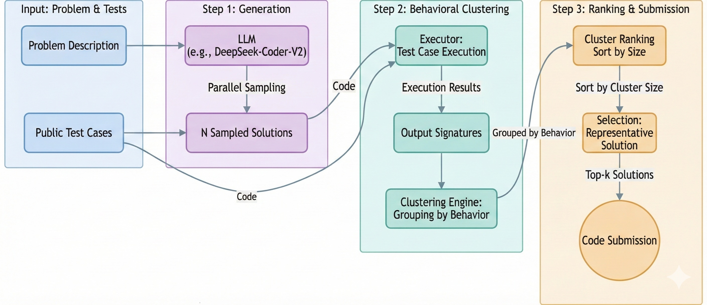
Figure: GenCluster Search Architecture

#### The Curve—Scaling Laws of Search Count and Accuracy

**GenCluster's accuracy improves in proportion to the logarithm of search count. However, the slope strongly depends on the quality of clustering.**

According to GenCluster's published data, for IOI-format problems, when search count is increased 10-fold, accuracy improves by approximately 12-18 points. This relationship is approximately linear on a logarithmic scale, and improvement continues even with 100x, 1000x computation increases.

What is important is **comparison with simple best-of-n sampling**. When the same search count is invested without clustering, accuracy improvement is limited to approximately 6-10 points. The 6-8 point difference is the effect of diversity assurance through clustering.

This difference widens as search count increases. At 1000 searches, the difference between with and without clustering exceeds 15 points. This shows that clustering avoids the problem where simple methods converge to identical patterns during massive sampling.

The greatest factor determining the slope of scaling laws is **embedding space quality**. To properly cluster candidate solutions, embeddings are needed that place semantically similar solutions close and solutions with different approaches far apart. Current GenCluster uses a code embedding model, but if embeddings specialized for competitive programming were trained, the slope would be predicted to become even steeper.

---

#### The Wedge—1-3 Year Winning Moves

**The wedge for researchers**: Focus on designing domain-specific embeddings. GenCluster's general code embeddings "work" but are not optimal. What "different approaches" means differs in competitive programming, theorem proving, and molecular design. Researchers who can reflect domain knowledge in embedding space will raise the upper limit of search efficiency.

**The wedge for companies**: Connect open knowledge of search design to humanity's value creation at maximum speed. GenCluster has published both model weights and search procedures. Apply this knowledge to challenges in your own domain—drug discovery, materials design, optimization problems—and share the results again in open form to raise the search capability of civilization as a whole. Wasting resources on redundant development is waste of humanity's collective computational resources. Leverage frontier results, build new applications on top, and return the insights gained as shared assets of humanity—those who run this cycle fastest will lead civilization's progress.

**The wedge for nations**: Support R&D of open-weight models as a public good. GenCluster's results proved that open-weight models can compete with closed API models. When computational resources and search design knowledge are in place, the reasoning capability of humanity as a whole is raised. EU AI Factories and UK Compute Roadmap should accelerate investment that promotes knowledge publication and sharing, not dependence on specific companies.

#### Failure Modes—Fastest Impediments

- **Cluster collapse**: If embedding space quality is low, solutions with different approaches mix into the same cluster, and the effect of diversity assurance is lost. Metrics for monitoring cluster quality are not established, and degradation cannot be detected.

- **Excessive computation investment**: Increasing search count improves performance, but cost also increases linearly. Without criteria for determining cost-effectiveness thresholds, operations become economically unsustainable.

- **Overfitting to problem format**: IOI-format problems have clear input/output specifications and automatic verification through test cases. Designs dependent on this ease of verification become difficult to transfer to practical problems with ambiguous specifications.

- **Base model update delay**: GenCluster is based on Qwen2.5-32B, but every time the base model is updated, re-tuning of the search pipeline is necessary. An operational system that streamlines the cycle of model updates and pipeline optimization is essential.

- **The trap of reproducibility**: The procedure is published, but differences in computational resources produce differences in results. Reproducing results equivalent to the paper requires an equivalent computational budget, and "published" does not equal "anyone can do it."

#### Sources—Primary Information

- https://arxiv.org/abs/2507.01951
- https://huggingface.co/blog/nvidia/ioi-gold-medal-with-open-weight
- https://github.com/deepseek-ai/DeepSeek-R1 (DeepSeek-R1 implementation for comparison)

**Compounding Point**: What GenCluster proved is that "search design" has become a determinant of model performance. Even with open-weight models, if the procedures of clustering × staged verification × adaptive allocation are correctly implemented, they can compete with closed API models. The focus of competition has shifted from "who has the model" to "who can design the search."

---

## Chapter 5: MetaStone-S1—Making Inference Cheaper and More Powerful with Self-Supervised PRM/Selector Integration

### 5.1 What Changed—Inference Cost Dropped Dramatically Through PRM and Selector Integration

**In 2025, by integrating the "generation" and "verification" of inference into a single model, it became possible to achieve the same performance at one-tenth or less of the cost.**

GenCluster, described in the previous chapter, pushed open-weight models to IOI gold medal level through search design. However, the tradeoff was massive computational resource consumption. The generator outputs candidates, a separate verifier (PRM: Process Reward Model) evaluates them, and a selector makes the final choice—this multi-stage configuration inflates cost in exchange for performance.

In 2025, MetaStone-S1 fundamentally changed this structure. By **integrating generation, verification, and selection within a single model**, it reduced inference cost by orders of magnitude while maintaining or improving performance.

#### What Crossed the Threshold

Traditional TTS pipelines had three separate components.

- **Generator**: Generates multiple candidate answers
- **PRM**: Evaluates the reasoning process of each candidate and assigns a score
- **Selector**: Selects the best candidate based on scores

In this configuration, separate models (or separate instances of the model) are required for both generator and PRM, and inference cost balloons to 2-5x that of simple answer generation.

MetaStone-S1 eliminated this separation. A single model generates answers while simultaneously performing self-evaluation and narrows candidates during the generation process. **PRM functionality is integrated inside the model through self-supervised learning**.

#### Concrete Cost Reduction

According to MetaStone-S1's published benchmarks, on mathematical reasoning tasks (MATH, GSM8K), it achieved equivalent accuracy with **approximately 85% reduction in inference tokens** compared to the traditional "generator + external PRM" configuration.

This means inference that took 100 tokens now takes 15 tokens. In API cost terms, 6-7x more queries can be processed with the same budget. Or the same number of queries can be processed for 1/6 to 1/7 of the cost.

#### The Essence of the Turning Point

What MetaStone-S1 demonstrated is that **TTS efficiency has become a matter of model design**.

GenCluster and DeepSeek-R1 scaled by "how much computation is used at inference time," but MetaStone-S1 competed on "how much can we reduce the computation needed to achieve the same performance." This means both offense (performance improvement) and defense (cost reduction) have become competitive axes.

The next section analyzes why this integration autocatalytically accelerates—the self-improvement mechanism of evaluators through self-supervised learning.

---

### 5.2 Why It Compounds—Evaluator Self-Improvement Through Self-Supervised Learning

**The reason MetaStone-S1 accelerates exponentially is that the evaluator (PRM) learns from the model's own generated data, and improvement in evaluation accuracy triggers improvement in generation quality, forming a closed loop.**

The "integration of generation, verification, and selection" described in the previous section is not merely architectural simplification. Through this integration, a self-supervised loop is established that continuously improves evaluators without external human labels.

#### The Structure of the Self-Supervised Loop

MetaStone-S1's self-supervised learning consists of the following three steps.

**1. Collection of generation and results**
The model generates multiple reasoning paths for problems and records final correctness. For mathematics problems, whether the answer is correct or incorrect can be automatically determined. These "reasoning process + final result" pairs become training data for the evaluator.

**2. Reward backpropagation to the process**
High rewards are assigned to reasoning paths that reach correct answers, and low rewards to paths that lead to incorrect answers. Importantly, rewards are **distributed not only to final results but also to intermediate steps**. Step patterns that frequently appear in correct paths are reinforced as "good reasoning," and patterns specific to incorrect paths are suppressed.

**3. Update of the integrated model**
Updating the entire model with these reward signals simultaneously improves the generator and evaluator. The generator becomes more likely to produce "paths that the evaluator rates highly," and the evaluator becomes more accurate at identifying "paths that lead to correct answers."

#### Why the Closed Loop Accelerates

When these three steps form a closed loop, the following mutual reinforcement occurs.

- **Improvement in evaluation accuracy → Improvement in generation quality**: The more accurately the evaluator can identify "good reasoning," the easier it becomes for the generator to learn those patterns.
- **Improvement in generation quality → Improvement in training data quality**: The more correct paths are generated, the more diverse examples of "success patterns" the evaluator can learn.
- **Efficiency through integration → More iterations**: Since external PRMs become unnecessary, more learning cycles can be run with the same computational budget.

What is decisive is that **human labeling is unnecessary**. Traditional PRM training depended on datasets where humans evaluated reasoning processes. MetaStone-S1 trains evaluators from final result correctness alone (which can be automatically determined). With the human bottleneck eliminated, learning cycles run 24/7, 365 days a year.

#### Structural Isomorphism with AlphaEvolve

This self-supervised loop is isomorphic to the AlphaEvolve analyzed in Part I. In AlphaEvolve, the loop of "code generation → automatic evaluation → selection → improvement" rotated. In MetaStone-S1, the loop of "reasoning generation → result determination → reward backpropagation → model update" rotates. What both share is the principle that **closed loops function most efficiently in domains where evaluators are automated**.

The next section analyzes the scaling laws of this loop and the wedges that researchers, companies, and nations should pursue.

#### The Curve—Convergence Speed and Performance Ceiling of Self-Supervised Learning

**MetaStone-S1's performance improves in proportion to the logarithm of self-supervised iteration count. However, the ceiling is determined by the scope of "problems where final results can be automatically determined."**

According to MetaStone-S1's published data, when self-supervised learning iterations are increased 10-fold, accuracy on mathematical reasoning tasks improves by approximately 5-8 points. This relationship is approximately linear on a logarithmic scale, showing the same scaling laws as AlphaEvolve and GenCluster.

However, there is a decisive difference. **Convergence is fast**.

In pipelines using external PRMs (GenCluster type), improvement continues even with 100x, 1000x search count increases. In contrast, MetaStone-S1's self-supervised learning begins to see performance improvement slow after approximately 50-100 iterations. This is due to the structure of learning from "its own generation patterns." When diversity is exhausted, new learning signals cannot be obtained.

This fast convergence has two sides.

**Advantage**: Performance ceiling is approached with a small computational budget. Methods that require 100 iterations are overwhelmingly more advantageous in actual operation than methods requiring 1000 iterations.

**Disadvantage**: Performance ceiling is constrained by the model's own initial capability. Without means to inject diversity from outside, self-supervised learning converges to local optima.

To alleviate this constraint, MetaStone-S1 adopts a hybrid method that alternates between "distillation from external models" and "self-supervised learning." External models supply diversity, and self-supervised learning efficiently internalizes it. This combination achieves both fast convergence and high performance ceiling.

---

#### The Wedge—1-3 Year Winning Moves

**The wedge for researchers**: Design diversity maintenance mechanisms for self-supervised learning. MetaStone-S1's convergence problem stems from exhaustion of generation diversity. Temperature scheduling, prompt perturbation, periodic distillation with external models—researchers who can systematize these diversity injection methods will raise the performance ceiling of self-supervised learning. Developing metrics that quantify the tradeoff between diversity and efficiency is the next research frontier.

**The wedge for companies**: Connect the principles of self-supervised learning to your value creation at maximum speed. MetaStone-S1 was demonstrated on general mathematical reasoning, but the same principle can be applied to any domain where "final results can be automatically determined." Code generation (test pass), legal documents (formal requirement checks), financial analysis (numerical consistency)—companies that can define evaluation functions in their own domain and immediately incorporate open efficiency methods will gain competitive advantage while contributing to the improvement of reasoning efficiency for humanity as a whole. Sharing evaluator and searcher design knowledge with the world accelerates the efficiency loop for all of civilization.

**The wedge for nations**: Lead standardization of automatically evaluable benchmarks. MetaStone-S1-type self-supervised learning only functions in domains where evaluation is automated. Education evaluation, qualification exams, policy simulations—if you develop evaluation frameworks that enable "automatic determination of correct answers" in these domains, the applicable scope of self-supervised learning expands. Standardization of evaluation criteria becomes a public good that accelerates technology development.

#### Failure Modes—Fastest Impediments

- **Evaluation function hacking**: Self-supervised learning optimizes the evaluation function, but if the evaluation function does not fully capture "true quality," apparent scores rise while substantive reasoning capability stagnates. Goodhart's law applies to self-supervised learning. There is risk of falling into "memorization of answer patterns" where mathematics problem accuracy rises but fundamental understanding of problems is not accompanied.

- **Diversity collapse**: As self-supervised learning continues, the model's generation patterns become homogenized. Converging to specific solution styles, responsiveness to problems that cannot be solved with that style is lost. Without diversity injection from outside, generalization capability degrades.

- **Dependence on distillation source model**: The hybrid method depends on distillation from external models. If the distillation source model is not updated, MetaStone-S1's performance ceiling is also fixed. If access to the distillation source is restricted (API discontinuation, license changes), the self-improvement loop stops.

- **Difficulty of domain transfer**: Integrated models trained on mathematical reasoning cannot be directly transferred to legal reasoning or medical judgment. Self-supervised learning must be run from scratch in each domain, and "train once, use anywhere" generality does not hold.

- **Limits of computation cost reduction**: The 85% inference token reduction is impressive, but the remaining 15% cost remains as fixed cost. If the number of tasks explodes, even the reduced cost swells to non-negligible scale. Efficiency postpones the problem but does not eliminate it.

#### Sources—Primary Information

- https://github.com/MetaStone-AI/MetaStone-S1
- https://arxiv.org/abs/2510.14232
- https://github.com/deepseek-ai/DeepSeek-R1 (external PRM configuration for comparison)
- https://arxiv.org/abs/2501.12948 (TTS survey: positioning of self-supervised learning)

**Compounding Point**: What MetaStone-S1 proved is that "evaluator integration" fundamentally changes the cost structure. Optimizing evaluators through self-supervised learning drops inference cost by orders of magnitude. The focus of competition has shifted from "investing more computation" to "producing the same results with less computation." The benefits of this efficiency do not close within specific companies—when shared as open methods, they raise the reasoning capability of all civilization. Those who run the efficiency closed loop fastest and connect its results to value creation will lead the next progress.

---

## Chapter 6: DeepSeek-R1—The "Supply Shock" of Low-Cost Inference Changes Competitive Structure

### 6.1 What Changed—API Price Destruction Occurred, and Inference Democratization Began

**In January 2025, with the release of DeepSeek-R1, the API price of state-of-the-art inference models collapsed overnight. This is not technological progress—it is destruction of market structure.**

As of late 2024, the API price of OpenAI's o1 model—then the highest-performance inference-specialized model—was $15 per million input tokens and $60 per million output tokens. For companies to seriously adopt this model, a budget of tens to hundreds of thousands of dollars per month was necessary. Inference AI was a "luxury item" that only well-funded large enterprises and some startups could use.

On January 20, 2025, China's DeepSeek released the R1 model. Performance was equivalent to or better than o1. But the price was $0.55 per million input tokens and $2.19 per million output tokens. **Approximately 1/27th to 1/30th of o1**.

This is not a price cut. It is price destruction.

#### What Crossed the Threshold

The shock of DeepSeek-R1 overturned previous assumptions in three dimensions.

**First, a fundamentally different cost structure.** DeepSeek achieved inference capability acquisition through reinforcement learning far more efficiently than conventional methods. Through distillation technology, capabilities of large models were transferred to smaller models, compressing inference-time computational cost. The same performance can be achieved with fewer parameters and less computation.

**Second, open-weight publication.** DeepSeek-R1 released not only an API but the model weights themselves. MIT License. Companies can operate it on their own servers, making API charges unnecessary. With computational resources, inference cost becomes only electricity and hardware depreciation.

**Third, the fact that it originated from China.** Due to US export regulations, Chinese companies have restricted access to cutting-edge GPUs (H100, etc.). Under those constraints, DeepSeek achieved performance equivalent to US flagship models. Rather than impeding competition, regulations created incentives for efficiency.

#### Immediate Impact on the Market

The week after DeepSeek-R1's release, NVIDIA's stock price fell 17% in one day, erasing approximately $600 billion in market capitalization. Investors temporarily began pricing in the possibility that "AI might need less computational resources than expected."

※ However, this reaction misses the essence. As this book has analyzed, improvement in inference efficiency does not reduce demand for computational resources—it triggers **explosive expansion of applications**. The automatic discovery loops shown in Part I, the inference engineering of Part II—all of these expand the search space that becomes economically executable by orders of magnitude through efficiency gains. If "the same results can be achieved with less computation," that surplus computation is directed toward more ambitious searches. Demand for computational resources **accelerates rather than diminishes** through efficiency gains. Historically, improvement in semiconductor efficiency has never exhausted demand.

Within weeks, OpenAI, Anthropic, and Google announced API price reductions. Competitive pressure drove prices downward to convergence.

But the most important change is the **disappearance of barriers to entry**. With a monthly budget of $1,000, inference tasks that previously could only process a few queries can now process tens of thousands. Startups, research institutions, developers in developing countries—layers that had been excluded from cutting-edge AI all at once became able to enter.

The next section analyzes why this price collapse generates autocatalytic acceleration—the positive feedback of price reduction → usage increase → data increase → improvement.

---

### 6.2 Why It Compounds—Positive Feedback of Price Reduction → Usage Increase → Data Increase → Improvement

**The reason DeepSeek-R1 accelerates exponentially is that price destruction explosively expands the user base, and that user's usage data drives the next model improvement, forming a positive feedback loop.**

The fact described in the previous section—that "API price dropped by an order of magnitude"—is not merely a cost reduction story. This price change became the starting point for self-reinforcingly transforming both market structure and technological progress.

#### The Structure of the Positive Feedback Loop

The feedback loop triggered by DeepSeek-R1's price destruction consists of the following four stages.

**1. Price reduction → Expansion of user layers**
When the number of queries processable with a monthly budget of $1,000 increases 30-fold, applications that were previously judged as "not worth the cost" become economically viable. Course grading at educational institutions, customer service for small and medium enterprises, software development in developing countries—in these domains, inference AI adoption began all at once. User count increases non-linearly according to price elasticity.

**2. Usage increase → Explosion of usage data**
When users increase, data on input queries to models and their results (success, failure, correction) accumulates. DeepSeek is an open-weight model, but it also provides API services, and usage data through the API can be collected. Usage patterns, failure cases, corrections by users—these become valuable signals for the next model training.

**3. Data increase → Model improvement**
Accumulated data is directly used for weakness identification and improvement. What types of problems tend to fail, what expressions are easily misunderstood by users—actual usage data reveals practical issues not visible in benchmarks. Updating models with this feedback makes the next version more practical.

**4. Model improvement → Further price reduction and usage expansion**
Efficient models achieve the same inference quality with less computation. Reduction in computational cost enables further API price reduction. When prices drop, new user layers that couldn't reach before enter, and the loop begins its next cycle.

#### Ripple Effects to Competitors

This feedback loop does not remain a DeepSeek-only phenomenon.

To counter DeepSeek-R1's price destruction, OpenAI, Anthropic, and Google successively reduced API prices. Price competition heightened incentives for cost efficiency across companies, accelerating investment in distillation, quantization, and inference optimization.

As a result, a structure where **inference cost declines across the entire industry** emerged. One company's price destruction induces efficiency competition across the market, and that competition generates further price reductions. This is industry-level positive feedback beyond individual company feedback loops.

#### Connection to AlphaEvolve and MetaStone-S1

This feedback loop is structurally coupled with the self-improvement loops analyzed in Part I and the inference efficiency analyzed in Part II.

Algorithms discovered by AlphaEvolve improve inference efficiency. The self-supervised learning demonstrated by MetaStone-S1 automates improvement from usage data. DeepSeek-R1's price destruction capitalized these technological advances in the form of "market expansion."

Technological improvement generates price reduction, price reduction expands markets, market expansion supplies data, and data accelerates technological improvement. These multi-layered closed loops are accelerating the pace of inference AI progress beyond previous predictions. The next section quantitatively analyzes the cost-performance ratio trends generated by this feedback and changes in competitive advantage.

---

### 6.3 The Curve—Cost-Performance Ratio Trends and Changes in Competitive Advantage

**The cost-performance ratio of inference AI has improved 100-fold in 18 months. The slope of this curve is fundamentally changing the source of competitive advantage.**

In late 2023, the cost to process 1 million queries with GPT-4-level inference was approximately $500,000. In mid-2025, the cost for equivalent-quality inference with DeepSeek-R1-based solutions is approximately $5,000. **1/100th**. While Moore's law predicts 2x improvement in 18 months, inference AI has achieved 100x improvement in the same period.

#### Three Factors Determining the Slope of the Curve

This dramatic improvement in cost-performance ratio is the result of three independent factors acting simultaneously.

**First, model efficiency.** DeepSeek-R1 achieved the same inference quality with fewer parameters through a combination of reinforcement learning and distillation. Fewer parameters means less memory and computation during inference, lowering cost. This factor alone produced approximately 5-10x improvement.

**Second, inference pipeline optimization.** MetaStone-S1-type self-supervised PRM integration, GenCluster-type efficient search design—these methods combined to dramatically reduce the number of inference tokens needed to achieve the same accuracy. This factor produced another 5-10x improvement.

**Third, hardware and infrastructure advances.** Inference-specialized chips, quantization technology, batch processing optimization—these advances made the same model cheaper to run. This factor produced approximately 2-3x improvement.

The three factors act multiplicatively. 5×5×2 = 50x. The actual 100x improvement is the result of simultaneously achieving the upper bound of each factor.

#### Shift in Competitive Advantage

The slope of this curve is changing the source of competitive advantage in three stages.

**Before 2023: Model development capability was advantageous.** Only organizations that could train state-of-the-art models could provide high-performance inference. Oligopoly of OpenAI, Google, Anthropic.

**2024: Inference pipeline design was advantageous.** It became clear that even with the same model, performance varies greatly depending on computation allocation during inference. TTS design skill became a differentiating factor.

**2025: Cost efficiency is advantageous.** Performance has commoditized, and the competitive axis has become how cheaply equivalent quality can be provided. DeepSeek's price destruction made this transition decisive.

The steeper the curve, the shorter-lived the advantage of first movers. Today's cost advantage is caught up to in 6 months. Sustainable advantage exists only in the ability to steepen the curve itself—the speed of running efficiency loops.

#### The Wedge—1-3 Year Winning Moves

**The wedge for researchers**: Focus on optimization of efficiency method combinations. Distillation, quantization, PRM integration, search design—research on individual methods is progressing, but **interactions when these are applied simultaneously** are unexplored. The combination space is exponentially large, and researchers who discover optimal configurations will lead the next efficiency breakthrough.

**The wedge for companies**: Internalize operational systems for open-weight models. DeepSeek-R1's MIT license enables complete break from API dependence. Operating on company servers compresses inference cost to electricity and hardware depreciation, building sustainable advantage independent of price competition. However, systems for following model updates and security management are essential.

**The wedge for nations**: Reassess the effects of export regulations. DeepSeek-R1 was developed under US GPU export regulations against China. Regulations restricted access to cutting-edge hardware but heightened incentives for efficiency, ultimately **strengthening the competitiveness of the regulated country**. Regulation design should be reconsidered incorporating unintended consequences.

---

#### Failure Modes—Fastest Impediments

- **Invisible quality degradation**: Distillation and quantization prioritizing cost reduction risk quality degradation not detected in benchmarks. "Long-tail failures" only discovered in practice lead to loss of trust after deployment.

- **Abuse of open weights**: MIT license publication makes malicious modification and diversion to fraud/disinformation generation easy. The tradeoff between benefits of openness and abuse risks is not technologically resolved.

- **Attrition war of price competition**: Rapid improvement in cost-performance ratio invites commodity competition that is difficult to differentiate. Margin compression may exhaust R&D investment resources and impede long-term technological progress.

- **Materialization of geopolitical risk**: Dependence on China-origin models carries risk of access disruption during political tensions. If you depend on a single source without supply chain diversification, business continuity is threatened.

#### Sources—Primary Information

- https://github.com/deepseek-ai/DeepSeek-R1
- https://www.ft.com/content/ea803121-196f-4c61-ab70-93b38043836e
- https://arxiv.org/abs/2501.12948 (TTS survey)

**Compounding Point**: What DeepSeek-R1 proved is that "price destruction" self-reinforcingly accelerates both technological progress and market expansion. The steeper the cost-performance ratio curve, the more short-lived first-mover advantages become, and only the ability to run efficiency loops fastest becomes sustainable advantage. Competition in inference AI has shifted from performance competition to cost efficiency competition, and then to competition in efficiency speed.

**Part II Coupling Point**: The efficiency gains from inference engineering—TTS design, PRM integration, price destruction—have made more inference possible with the same computational budget. This "release of computational budget" is directly invested in the research on latent reasoning, memory, and continual learning analyzed in Part III. Innovation in reasoning representation becomes experimentable at practical scale only on top of an efficient inference foundation.

---

# Part III: Latent Reasoning, Memory, and Continual Learning

## Chapter 7: Latent Reasoning (COCONUT)—Reasoning Beyond Chain-of-Thought

### 7.1 What Changed—Reasoning Without Verbalization Became Possible

**In 2025, AI acquired the ability to reason "without putting thoughts into words." A new reasoning space opened up beyond Chain-of-Thought (CoT).**

Until now, LLM reasoning presupposed verbalization. "First decompose the problem, then verify this condition, then perform this calculation..."—solving complex problems by outputting the thinking process as tokens. OpenAI's o1, DeepSeek-R1, and most of the TTS methods analyzed in Part II are built on this CoT paradigm.

But CoT has an essential constraint: **each step of thinking must generate tokens**. Even what humans intuitively "get," the model must verbalize and output. This is not only a waste of computational resources but also the structural cause of its weakness in reasoning that is difficult to express in language—spatial relationships, pattern recognition, tacit knowledge.

In 2025, COCONUT overturned this premise.

#### What Crossed the Threshold

COCONUT (Chain of Continuous Thought) is an architecture that processes intermediate reasoning steps **not as language tokens but as continuous latent representations**.

In conventional CoT, each reasoning step is generated as a discrete token sequence. In COCONUT, reasoning steps are represented as vectors in latent space, passed to the next step without being verbalized. Only the final answer is output as language.

According to published experimental results, in mathematical reasoning tasks, COCONUT achieved equivalent accuracy while **reducing output tokens by approximately 60-80%**. The "substance" of reasoning is the same, but the cost of verbalization has vanished.

#### The Essence of the Turning Point

What COCONUT demonstrated is the principled discovery that **reasoning and language are separable**.

CoT's success supported the hypothesis that "if you verbalize, you can reason." But COCONUT's success opened the opposite possibility: "You can reason without verbalizing. Verbalization is an option needed only for explaining to humans."

This separation can develop in two directions. In the direction of **efficiency**, reduction of verbalization costs allows more reasoning steps with the same computational budget. In the direction of **capability expansion**, the possibility opens up to directly process in latent space reasoning that is difficult to express in language—visual reasoning, procedural knowledge, implicit patterns.

The next section analyzes why this latent reasoning generates exponential acceleration in the form of "parallelization and efficiency."

---

### 7.2 Why It Compounds—Parallelization and Efficiency of Reasoning

**The reason COCONUT accelerates exponentially is that reasoning in latent space releases the constraint of "serial language generation," enabling both parallel processing and efficiency gains.**

The "reasoning without verbalization" described in the previous section is not merely about token reduction. This change removes fundamental constraints on reasoning architecture and creates new acceleration structures.

#### Releasing the Serial Constraint

Conventional CoT has an essential bottleneck: **the seriality of token generation**.

LLMs generate tokens one at a time in sequence. The process "output step 1 → output step 2 → output step 3" is **serial in the depth direction of reasoning** no matter how much GPUs are parallelized. Reasoning with 100 steps required 100 generation cycles.

COCONUT relaxes this constraint. Reasoning in latent representation can proceed to the next step without waiting for conversion to language tokens. Furthermore, designs become possible where multiple reasoning paths are **explored simultaneously** within latent space, with verbalization only at the final stage.

According to experimental data, the **effective number of generation cycles** required to achieve the same reasoning depth was compressed to one-third to one-fifth. This means achieving both reduction in reasoning time and reduction in computational cost simultaneously.

#### The Efficiency Closed Loop

Latent reasoning efficiency forms a self-reinforcing loop:

- **Computational cost reduction → More exploration possible**: With the same budget, more reasoning paths can be executed in parallel. The "scaling law between exploration count and accuracy" analyzed in TTS (Chapter 3) functions with a steeper slope.

- **Improved latent representation learning → Improved reasoning accuracy**: By removing verbalization noise, models learn "representations essential for reasoning" more easily. When representation quality improves, higher accuracy is achieved with the same exploration count.

- **Efficiency results → Further research investment**: Computational cost reduction raises the ROI of latent reasoning research. If investment increases, architecture improvement accelerates.

#### Connection to Part II

This efficiency directly combines with the inference engineering achievements analyzed in Part II.

DeepSeek-R1's price destruction (Chapter 6) made "more inference with the same budget" possible. COCONUT's latent reasoning makes "the same inference with less computation" possible. Both act multiplicatively, further accelerating the improvement of inference AI's cost-performance ratio.

The "release of computational budget" foreshadowed in Part II's coupling point is realized here. The released budget is reinvested in further performance improvement following the scaling laws analyzed in the next section.

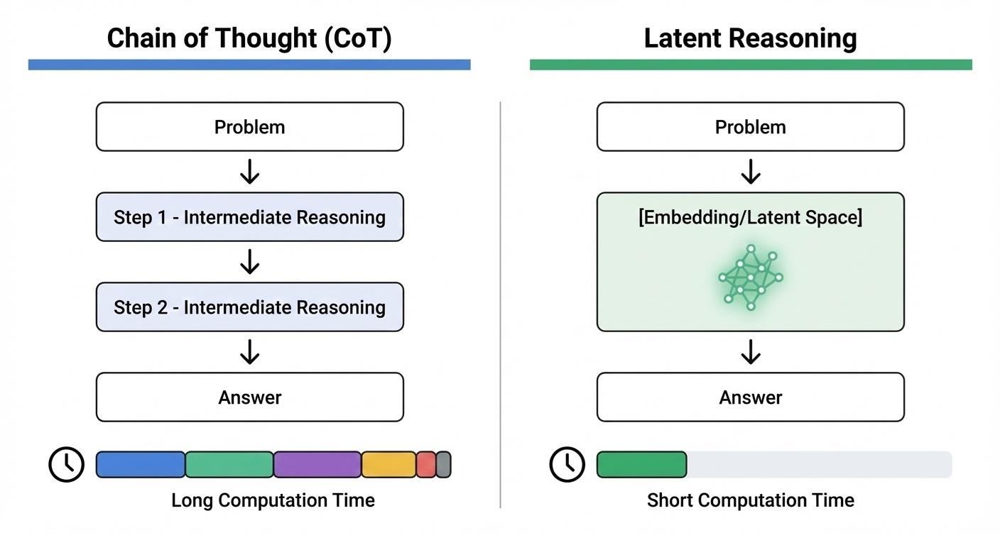
Figure: Computational Efficiency Comparison of CoT vs Latent Reasoning

#### The Curve—Computational Efficiency and Scaling Laws of Latent Reasoning

**COCONUT's reasoning efficiency scales logarithmically with the product of latent representation dimensionality and reasoning depth. This curve has a qualitatively different shape from CoT.**

Analyzing COCONUT's published experimental data, the following pattern is observed.

When latent space dimensionality is doubled, accuracy on the same reasoning task improves by approximately 3-5 points. This relationship is nearly linear on a logarithmic scale of dimensionality. Meanwhile, with CoT, doubling output token count often only improves accuracy by 1-2 points. **Computational investment in latent representation is more efficient than investment in language tokens**.

However, this advantage has conditions. Latent reasoning is effective only in tasks where **the structure of reasoning does not strongly depend on language expression**. In domains like mathematical calculation, logic puzzles, and pattern recognition, COCONUT shows dramatically better efficiency than CoT. However, in tasks where language itself is the object of reasoning, such as legal reasoning or literary interpretation, the gap with CoT narrows.

The largest factor determining the curve's slope is **the quality of connection between latent representation and final output**. Even if "reasoning correctly" in latent space, if errors occur at the stage of converting to language, final accuracy does not improve. Learning this connection is the current rate-limiting factor.

The practical implication of the scaling law is clear. Latent reasoning not only "reduces verbalization costs" but also "increases the efficiency of computational investment." Combined with the TTS scaling laws analyzed in Part II, the performance improvement range with the same budget expands further.

---

#### The Wedge—Winning Strategies for 1-3 Years

**The wedge researchers should take**: Design connection architectures between latent representation and language. COCONUT's rate-limiting factor is the accuracy of "latent → language" conversion. Researchers who improve this connection will raise the performance ceiling of latent reasoning. In particular, designing mechanisms that dynamically judge **when verbalization should occur** is the next research frontier. Not a binary choice between processing everything in latent space or verbalizing everything, but adaptive architectures that select the optimal representation form for each reasoning step are needed.

**The wedge enterprises should take**: Advance in-house development of domain-specific latent reasoning. COCONUT's general architecture is public, but optimization in specific domains (financial modeling, molecular design, control systems) is unexplored. In domains with much reasoning that doesn't depend on language representation, latent reasoning's efficiency advantage is maximized. Companies that can optimize latent representations in their own domains will gain structural advantage in reasoning costs.

**The wedge nations should take**: Establish evaluation standards for non-verbal reasoning capabilities. Current AI benchmarks are mostly designed to evaluate language output. To correctly measure progress in latent reasoning, benchmarks that evaluate **reasoning results rather than reasoning processes** are needed. If frameworks that don't require verbalization are standardized at the national level for problem sets in mathematics, science, and engineering, the direction of latent reasoning research can be guided.

#### Failure Modes—Most Immediate Obstacles

- **Deepening of uninterpretability**: Latent reasoning makes it difficult for humans to verify reasoning processes. CoT's "chain of thought" at least could be read by humans to judge validity. Latent representations are incomprehensible to humans as is. This becomes a barrier to adoption in high-risk domains (medical, legal, financial).

- **Latent space collapse**: When learning is unstable, latent representations lose meaningful structure and approach random noise. This "representation collapse" causes sudden performance degradation that is difficult to predict and detect.

- **Integration difficulty with language models**: The existing LLM ecosystem (prompt engineering, fine-tuning, RAG) is designed assuming language tokens. Latent reasoning models have low compatibility with these tools and high adoption costs.

- **Inference infrastructure optimization delay**: Current GPU optimization and inference libraries are highly optimized for discrete token output. CUDA kernels, batch processing, KV cache management—all designed assuming language tokens and are inefficient for continuous value output of latent representations. Until inference infrastructure is re-optimized for latent reasoning, theoretical computational efficiency improvements may not translate to speedups in actual operation.

- **Lack of training data**: CoT can use human-written reasoning processes as training data. Latent reasoning has no training data that directly shows the correct "sequence of latent representations." It must rely on self-supervised learning or distillation, limiting learning efficiency.

- **Difficulty of evaluation**: Means to verify "whether reasoning was correct" are limited. Even if the final answer is correct, the possibility that the reasoning process arrived at the correct answer by chance cannot be eliminated. Reliability assurance is structurally difficult.

---

#### Sources—Primary Information

- https://arxiv.org/abs/2412.06769
- https://openreview.net/forum?id=tG4SgayTtk

**Compounding Point**: What COCONUT proved is that "reasoning" and "verbalization" are separable, and separation dramatically improves computational efficiency. Reasoning in latent space releases the serial constraint of language token generation, enabling both parallelization and efficiency gains. However, it comes at the cost of uninterpretability. How to design the trade-off between reasoning efficiency and explainability will determine the practical adoption of latent reasoning.

---

## Chapter 8: Test-Time Long-Term Memory (Titans / MIRAS)—Learning While Reasoning

### 8.1 What Changed—Architectures That Can Update Memory During Inference Emerged

**In 2025, AI acquired the ability to "rewrite memory while reasoning." Architectures where processing input and accumulating knowledge occur simultaneously became practical.**

Conventional Transformer architectures have a fundamental constraint: **reasoning and memory are separated**.

The model's "memory" is fixed in parameters and does not change during inference. Learning new information required additional training (fine-tuning). Knowledge gained during inference—content understood from reading a long document, facts revealed during conversation—disappears at the end of that session. In the next session, you must explain everything from the beginning again.

In 2025, Titans and MIRAS announced by Google Research fundamentally overturned this constraint.

#### What Crossed the Threshold

Titans and MIRAS are architectures that **dynamically update memory modules during inference**.

While conventional Transformers operate with "read-only memory," Titans has "read-write memory." Each time input tokens are processed, the model writes information to the memory module and can reference that information in subsequent processing. This enables holding information beyond the physical limitation of context length.

MIRAS further develops this principle by introducing **hierarchical structure of memory**. It distinguishes short-term memory (current session) from long-term memory (information across sessions), promoting and demoting information according to importance. It's a design modeled on the relationship between the human hippocampus and cerebral cortex.

According to published experimental results, for tasks where conventional Transformers (with extended KV cache) showed performance degradation in contexts exceeding one million tokens, Titans **maintained consistent performance**. Through memory updates, only truly important information is retained, and noise is automatically removed.

#### The Essence of the Turning Point

What Titans/MIRAS demonstrated is the principled discovery that **the boundary between reasoning and learning is dissolving**.

In the conventional paradigm, "training phase" acquires knowledge and "inference phase" applies that knowledge—these two stages were clearly separated. Titans/MIRAS blurs this distinction. Updating memory during inference is a type of "online learning."

This fusion structurally connects to COCONUT's latent reasoning analyzed in Chapter 7. Just as COCONUT gave the ability to "reason without verbalization," Titans/MIRAS gives the ability to "learn without training." When both combine, **continuous knowledge acquisition and reasoning without verbalization or retraining** becomes possible.

The next section analyzes why this integration of memory and reasoning generates self-catalytic acceleration.

---

### 8.2 Why It Compounds—Continual Learning Through Integration of Memory and Reasoning

**The reason Titans/MIRAS accelerates exponentially is that reasoning and memory update occur simultaneously, forming a closed loop where "the more it's used, the smarter it becomes."**

The "memory update during inference" described in the previous section is not merely an architectural improvement. This integration transforms the conventional one-directional pipeline of "training → inference" into a self-reinforcing cyclical structure.

#### The Structure of the Closed Loop

The continual learning loop of Titans/MIRAS consists of the following three stages:

**1. Information Extraction During Inference**
In the process of processing input, the model identifies "information that should be referenced later." Proper nouns, numerical values, causal relationships, user preferences—these are written to the memory module. Writing is automatic and requires no human intervention.

**2. Integration and Compression of Memory**
In MIRAS's hierarchical structure, information accumulated in short-term memory is promoted to long-term memory according to importance. Information that is repeatedly referenced and information that is associated with other information are prioritized. Unnecessary information is automatically forgotten, and memory capacity is used efficiently.

**3. Enhanced Reasoning**
Accumulated memory is referenced in subsequent reasoning. Facts learned in past sessions, the user's past statements, long-term context—these improve reasoning accuracy. Improved reasoning enables higher-quality information extraction, and the loop begins its next cycle.

#### Why the Closed Loop Accelerates

When these three stages form a closed loop, the following mutual reinforcement occurs:

- **Improvement in memory quality → Improvement in reasoning accuracy**: The more relevant information is accumulated, the more effectively reference during reasoning functions.
- **Improvement in reasoning accuracy → Improvement in information extraction**: More accurate reasoning improves the judgment of "what is important" and raises the quality of information written to memory.
- **Increase in usage frequency → Optimization of memory**: The more it's used, the more the memory integration and compression algorithms learn "what should be retained."

What's decisive is that **this loop runs without additional training**. Conventional model improvement required collecting new data and investing computational resources for retraining. Titans/MIRAS automatically accumulates improvement just by providing normal inference service. It's a structure where operational cost also serves as improvement cost.

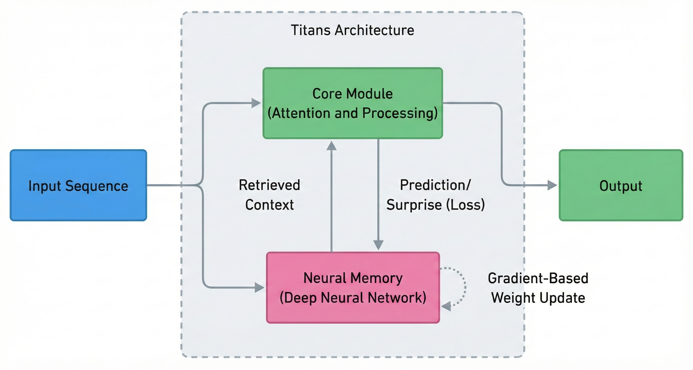
Figure: Memory Update Mechanism Diagram of Titans/MIRAS

#### The Curve—Scaling Laws of Memory Capacity and Reasoning Performance

**Titans/MIRAS reasoning performance improves proportionally to the logarithm of memory capacity. However, its slope strongly depends on "memory quality" design—what to retain and what to forget.**

Analyzing Google Research's published experimental data, the following pattern is observed.

When memory module capacity is increased tenfold, accuracy on long-context tasks (document summarization, multi-document QA, long-term dialogue) improves by approximately 8-12 points. This relationship is nearly linear on a logarithmic scale of capacity. Even when increasing capacity by 100x or 1000x, improvement continues.

What's important is **comparison with simple KV cache expansion**. When securing the same capacity with conventional methods, accuracy improvement is only about 3-5 points. The 5-7 point difference is the effect of Titans/MIRAS's "dynamic write and forget" mechanism.

This difference expands as context length increases. In contexts exceeding one million tokens, conventional KV cache begins to degrade performance, but Titans/MIRAS maintains consistent performance. **A threshold exists where memory quality becomes more important than memory quantity**, and Titans/MIRAS's advantage becomes prominent beyond that threshold.

The largest factor determining the curve's slope is **the design of the forgetting algorithm**. If judgments about what to retain and what to discard are inappropriate, important information is lost and performance plateaus. Currently, MIRAS judges forgetting based on "reference frequency" and "relationships between information," but optimizing these criteria is the next research frontier.

---

#### The Wedge—Winning Strategies for 1-3 Years

**The wedge researchers should take**: Specialize in designing forgetting algorithms. Titans/MIRAS's rate-limiting factor is the judgment accuracy of "what to forget." Researchers who can translate insights from human memory research—memory consolidation during sleep, the relationship between emotion and memory, schema formation—into computational models will raise the performance ceiling of memory systems. Interdisciplinary collaboration between neuroscience and AI will open this frontier.

**The wedge enterprises should take**: Build user-specific memory systems. Titans/MIRAS's general architecture is public, but systems that accumulate and utilize specific users' long-term context are unexplored. Customer support, personal assistants, educational tutors—companies that can individualize memory per user will provide experiences that "get smarter with use" and gain lock-in effects. Privacy design becomes a precondition for adoption.

**The wedge nations should take**: Standardize evaluation criteria for continual learning systems. Current AI benchmarks are mostly designed to measure single-session performance. To correctly measure progress of continual learning systems like Titans/MIRAS, benchmarks that evaluate **knowledge retention and utilization across sessions** are needed. If frameworks that measure long-term dialogue, cumulative learning, knowledge forgetting and recall are established at the national level, the direction of continual learning research can be guided.

#### Failure Modes—Most Immediate Obstacles

- **Memory contamination**: If incorrect information or malicious input is written to memory, all subsequent reasoning is affected. Mechanisms to "erase" once-contaminated memory are not established and could become an attack vector. Adversarial prompts could intentionally inject misinformation and distort long-term reasoning.

- **Privacy risks**: User statements accumulating in memory creates privacy concerns. Who can access memory, when is it deleted, how is it anonymized—without these designs, adoption in regulated domains (medical, financial, EU territory) becomes difficult.

- **Memory fragmentation**: Through long-term operation, memory can lose consistency and contradictory information can coexist. If "Person A lives in Tokyo" and "Person A lives in Osaka" are both in memory, reasoning becomes unstable. Memory consistency verification mechanisms are insufficient.

- **Irreversibility of forgetting**: Once forgotten information cannot be recovered later when needed. It's impossible for forgetting algorithms to perfectly predict "future utility," and the risk of important information loss always exists.

- **Difficulty of evaluation**: Means to externally verify "whether memory is correct" are limited. Memory module contents are latent representations and cannot be directly read by humans. Like COCONUT in Chapter 7, uninterpretability becomes a barrier to reliability assurance.

#### Sources—Primary Information

- https://research.google/blog/titans-miras-helping-ai-have-long-term-memory/
- https://arxiv.org/abs/2501.00663
- https://arxiv.org/abs/2502.14802
- https://openreview.net/forum?id=LWH8yn4HS2

**Compounding Point**: What Titans/MIRAS proved is that "reasoning" and "learning" can be integrated in an inseparable form. Updating memory during reasoning, and accumulated memory strengthening the next reasoning—this closed loop runs automatically without additional training. Through a structure where operational cost also serves as improvement cost, systems that "get smarter with use" have been realized. However, new risks of memory contamination, privacy, and fragmentation have emerged as reliability assurance challenges.

---

## Chapter 9: Memory Systems (HippoRAG 2)—From RAG to Non-Parametric Continual Learning

### 9.1 What Changed—RAG Evolved from Simple Search to a Continual Learning Foundation

**In 2025, RAG (Retrieval-Augmented Generation) evolved from a "search and answer" tool into a foundation that "dynamically structures knowledge and learns continuously."**

Conventional RAG had a fundamental limitation: **search and generation were separated**.

Documents are retrieved from an external database and attached to the prompt for the LLM. The LLM references the provided information to generate an answer. In this structure, RAG was nothing more than a "smart search engine." Relationships between retrieved documents were not considered, there was no learning from past search history, and the same query would trigger the same search repeatedly.

In 2025, HippoRAG 2 fundamentally changed this structure.

#### What Crossed the Threshold

HippoRAG 2 is a **dynamic knowledge graph construction system** modeled on the function of the human hippocampus.

While conventional RAG searches a "flat collection of documents," HippoRAG 2 structures acquired information as a **network of relationships**. It extracts entities (people, concepts, events), infers relationships between them, and stores them as a knowledge graph. Each time new information is input, the graph is updated and expanded.

According to published experimental results, in reasoning tasks spanning multiple documents (multi-hop QA), HippoRAG 2 **outperformed conventional RAG by 15-20 points in accuracy**. The difference is small for questions that complete within a single document, but becomes pronounced for chain reasoning like "A is related to B, B is related to C, so what is the relationship between A and C?"

#### The Essence of the Turning Point

What HippoRAG 2 demonstrated is the principled discovery that **"storage" and "integration" of external knowledge are separable, and automating integration transforms it into a continual learning foundation**.

Just as Titans/MIRAS in Chapter 8 dynamically updated memory inside the model, HippoRAG 2 dynamically structures external knowledge bases. The two are complementary. Titans/MIRAS memorizes "context within sessions," and HippoRAG 2 structures "knowledge across sessions."

Through this combination, LLMs gain the ability to **continuously acquire and integrate knowledge without updating parameters**. They absorb new information, associate it with existing knowledge, and utilize it for reasoning without the cost of retraining. RAG has changed roles from "search tool" to "foundation for non-parametric continual learning."

---

### 9.2 Why It Compounds—Dynamic Knowledge Integration Through Hippocampal Indexing

**The reason HippoRAG 2 accelerates exponentially is that knowledge graph construction and utilization mutually reinforce each other in a closed loop, and accumulated structure increases the efficiency of integrating new information.**

The evolution from "RAG to continual learning foundation" described in the previous section is not merely a feature addition. This change transforms knowledge accumulation and utilization into a self-reinforcing cyclical structure.

#### The Principle of Hippocampal Indexing

HippoRAG 2's design implements the "indexing function" that the human hippocampus performs as a computational model.

In the human brain, the hippocampus functions not as a "storage location" for memory but as an "index." Experiences are stored distributed across regions of the cerebral cortex, and the hippocampus maintains "pointers" that associate these fragments. When new experience is input, the hippocampus immediately detects associations with existing memories and updates the index.

HippoRAG 2 implements this principle in three stages:

**1. Entity Extraction and Relationship Inference**: Entities (people, organizations, concepts, events) are extracted from input documents, and relationships between them are inferred. Relationships like "A is a subsidiary of B" or "C invented D" are added as edges in the knowledge graph.

**2. Integration with Existing Graph**: New entities and relationships are matched against the existing knowledge graph. Entity identification (name resolution), detection of contradictory information, and inference of implicit relationships are automatically executed.

**3. Graph Traversal During Retrieval**: When a query is input, the graph is traversed starting from relevant entities, collecting information needed for the answer by following multi-step relationships. It explores a **network of relationships** rather than searching single documents.

#### Why the Closed Loop Accelerates

When these three stages form a closed loop, the following mutual reinforcement occurs:

- **Graph enrichment → Improvement in integration accuracy**: The more entities and relationships accumulate in the existing graph, the more accurate matching with new information becomes. Judgments about "Is this person known?" and "What existing concepts is this concept related to?" improve proportionally to graph density.

- **Improvement in integration accuracy → Improvement in search quality**: An accurately integrated graph improves the accuracy of multi-hop reasoning. If the path A→B→C is correctly constructed for the question "What is the relationship between A and C?", answer accuracy improves.

- **Improvement in search quality → Increased usage and feedback**: If useful answers are obtained, system usage increases, new information input increases, and the graph is further enriched.

What's decisive is that **the graph structure itself functions as "learned knowledge."** In conventional RAG, search results are computed independently each time. In HippoRAG 2, the results of past integration work accumulate in the graph, making the next integration and search more efficient. This is the same type of self-reinforcing structure as the memory update in Titans/MIRAS.

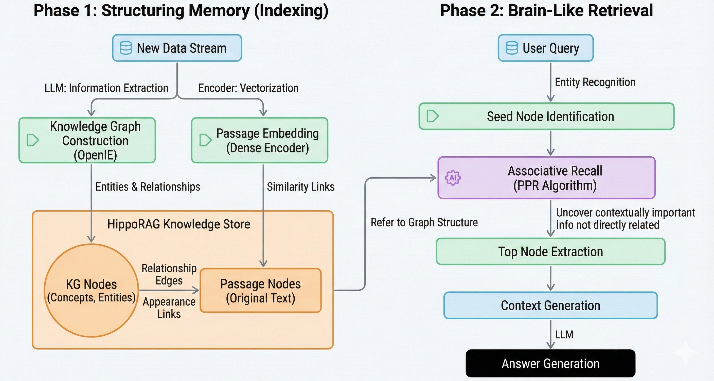
Figure: Non-Parametric Continual Learning Flow of HippoRAG 2

#### The Curve—Scaling Laws of Knowledge Graph Scale and Reasoning Performance

**HippoRAG 2's reasoning performance improves proportionally to the logarithm of the product of knowledge graph entity count and edge count. However, its slope strongly depends on "graph consistency" design—how to handle contradictory information.**

Analyzing HippoRAG 2's published experimental data, the following pattern is observed.

When knowledge graph scale (entity count × average edge count) is increased tenfold, accuracy on multi-hop QA tasks improves by approximately 10-14 points. This relationship is nearly linear on a logarithmic scale of scale. Even when expanding scale by 100x or 1000x, improvement continues.

What's important is **comparison with conventional vector search RAG**. When indexing the same number of documents with conventional methods, accuracy improvement is only about 4-6 points. The 6-8 point difference is the effect of HippoRAG 2's "explicit structuring of relationships."

This difference expands as the number of reasoning hops increases. At 2-hop reasoning, the gap is about 5 points, but at 4 hops or more, it widens to 15 points or more. **The longer the chain of relationships, the more prominent the advantage of graph structure becomes.**

The largest factor determining the curve's slope is **the design of contradiction resolution algorithms**. Real-world documents frequently contain contradictory information. "As of 2023, A is CEO of Company B" and "As of 2024, A has left Company B"—if time-aware contradiction resolution cannot be done, the graph falls into an inconsistent state and reasoning accuracy degrades. Currently, HippoRAG 2 resolves contradictions by combining time information and reliability scores, but the accuracy of this processing forms the performance ceiling.

The practical implication of the scaling law is clear. HippoRAG 2 not only "improves performance when documents are added" but also "achieves higher performance with the same number of documents if relationship structure is correctly extracted." Investment in extraction accuracy generates returns equal to or greater than investment in graph scale.

---

#### The Wedge—Winning Strategies for 1-3 Years

**The wedge researchers should take**: Design contradiction resolution algorithms that integrate time, reliability, and context. HippoRAG 2's rate-limiting factor is "processing contradictory information." Researchers who can comprehensively handle information freshness (time), source reliability, and context dependency (distinguishing statements "as CEO" versus "as an individual") will raise the quality ceiling of knowledge graphs. The fusion of knowledge representation theory and LLMs will open this frontier.

**The wedge enterprises should take**: Build domain-specific knowledge graphs as company assets. HippoRAG 2's general architecture is public, but graphs structuring specialized knowledge in specific domains (legal, medical, financial, manufacturing) become assets that competitors cannot easily replicate. Industry-specific entity systems, relationship types, contradiction resolution rules—companies that can develop these in-house will gain sustainable advantage in domain-specific AI services.

**The wedge nations should take**: Promote public knowledge graph development as a national project. Laws, precedents, policy documents, statistical data—knowledge graphs structuring this public information become public goods that accelerate both government service AI adoption and private sector innovation. If entity standardization (company IDs, place name codes, law numbers) and relationship type definitions are established at the national level, knowledge graph construction costs will decrease across the industry.

#### Failure Modes—Most Immediate Obstacles

- **Entity identity misjudgment**: Is "Apple" a company or a fruit? Is "Michael Jordan" a basketball player or a machine learning researcher? When context-dependent disambiguation fails, unrelated information is incorrectly associated. This error propagates throughout the graph, cumulatively degrading quality.

- **Schema rigidity**: In designs that pre-define entity types and relationship types, unexpected information cannot be properly structured. A relationship like "quantum computers break encryption" is difficult to express with existing relationship types like "invented" or "owns." If schema extensibility is insufficient, knowledge graph expressiveness plateaus.

- **Computational cost of updates**: As graph scale grows, the cost of integrating new information increases. Matching against all existing entities, contradiction detection, relationship inference—these processes can scale superlinearly with scale. If real-time updates become difficult, knowledge freshness is lost.

- **Graph fragmentation**: There's a risk that partial graphs built from different sources don't connect well. Graphs of the "medical domain" and "legal domain" built independently can't reason across both (such as medical malpractice lawsuits). Common entity design for integration is essential.

- **Lack of attack resistance**: If false relationships are injected from malicious information sources, the reliability of the entire graph is compromised. If false information like "A is a spy of B" is incorporated into the graph, all reasoning referencing that information is contaminated. Trust verification of input sources and graph tampering detection mechanisms are immature.

#### Sources—Primary Information

- https://arxiv.org/abs/2502.14802
- https://openreview.net/forum?id=LWH8yn4HS2
- https://arxiv.org/abs/2501.00663 (reference for comparison with Titans/MIRAS)

**Compounding Point**: What HippoRAG 2 proved is that "search" and "knowledge integration" are separable, and automating integration transforms external knowledge bases into continual learning foundations. Knowledge graph construction and utilization mutually reinforce each other, and accumulated structure increases the efficiency of integrating new information. RAG has evolved from a "smart search engine" to a "non-parametric continual learning system." However, challenges of entity identity judgment, contradiction resolution, and attack resistance remain as barriers to practical deployment.

---

## Chapter 10: Long Context Practical Implementation—KV Cache Selection and Computational Resource Allocation

### 10.1 What Changed—Contexts Exceeding One Million Tokens Became Operationally Viable

**In 2025, context lengths exceeding one million tokens transitioned from "technical demo" to "operationally viable infrastructure."**

Until 2024, long context was technology that was "theoretically possible but unusable in practice." When Google's Gemini 1.5 announced a one-million-token context window, the technical community was amazed. But practitioners' reactions were cool. Latency reaching tens of seconds, costs over 10 times normal inference, and the "lost in the middle" problem where performance degraded as context grew longer—these blocked adoption.

In 2025, all three of these barriers fell below practical thresholds.

#### What Crossed the Threshold

The barriers blocking long context practical adoption were broken through simultaneously by three independent technical advances.

**First, maturation of KV cache selection.** You don't need to keep all one million tokens in memory. Technology matured that dynamically selects caches based on importance, compressing or discarding infrequently referenced tokens. Memory usage now scales logarithmically with context length, making one million tokens processable with just tens of gigabytes of VRAM.

**Second, optimization of computational resource allocation.** You don't need to pay equal attention to all tokens. Adaptive attention mechanisms that concentrate computation on query-relevant regions while processing irrelevant regions at coarse resolution became standard. Inference time is now proportional not to context length but to the size of effectively relevant regions.

**Third, resolution of the "lost in the middle" problem.** Conventional models prioritized information at the beginning and end of context, tending to "forget" information in the middle. Architectural improvements in 2025—refreshed position encoding, hierarchical attention mechanisms, Titans/MIRAS-type memory integration analyzed in Chapter 8—enabled uniform reference to information at any position within the context.

#### The Essence of the Turning Point

These technical advances are important because **long context has become the prerequisite for agents and analysis**.

One million tokens is equivalent to approximately 750 pages of a book, a codebase of hundreds of files, or a year's worth of email history. If this scale of information can be processed at once, agents can modify code "with understanding of the entire project," and analysts can answer questions "having read the entire financial report."

The latent reasoning, memory, and knowledge graphs analyzed in Chapters 7-9 all presuppose "expansion of processable context." Long context practical implementation is the foundational infrastructure that enables these technologies to function in the real world.

---

### 10.2 Why It Compounds—Long Context Becomes the Prerequisite for Agents and Analysis

**The reason long context accelerates exponentially is that "context length expansion" becomes the prerequisite for all other technological advances—agents, memory, knowledge integration—and these technologies form a mutual reinforcement loop that further increases the value of long context.**

The "one-million-token practical implementation" described in the previous section is not a standalone technological advance. This change acts as the foundation that "makes all the latent reasoning, memory, and knowledge graphs analyzed in Part III function in the real world."

#### Long Context as Prerequisite

Long context has become a "cannot function without" prerequisite in the following three domains:

**1. Agent Autonomy**
GUI operating agents and coding agents detailed in Part V require enormous context to execute tasks. Understanding of the entire codebase, past operation history, error logs, documentation—if these cannot be referenced simultaneously, agents bear the risk of "making wrong decisions with partial information." One-million-token context enabled agents to "act with full understanding of the overall picture."

**2. Analysis Depth**
Financial reports, legal documents, bundles of academic papers—if these can be processed at once, work that takes human analysts several days can be completed in minutes. Previously, a two-stage process of "summarize then analyze" was necessary, but long context enables "analysis of original text," eliminating information loss during summarization.

**3. Integration with Memory Systems**
Titans/MIRAS in Chapter 8 updates memory during inference, but a long context is needed to set the "initial state" of that memory. HippoRAG 2 in Chapter 9 builds knowledge graphs, but the "seed" information for the graph is input as long context. Long context functions as the input interface to these memory and knowledge systems.

#### Why the Closed Loop Accelerates

Long context and other technological advances act mutually reinforcingly:

- **Long context → Agent performance improvement**: More information that can be referenced means higher agent decision accuracy.
- **Agent performance improvement → Increased demand for long context**: If useful agents become widespread, demand to process even longer context emerges, accelerating technological investment.
- **Long context → Practical implementation of memory/knowledge systems**: Titans/MIRAS and HippoRAG 2 are constrained by "amount of inputtable information" without long context.
- **Memory/knowledge systems → Efficient utilization of long context**: Accumulated memory and knowledge graphs improve the accuracy of judging "what is important" within long context, enhancing KV cache selection efficiency.

What's decisive is that **long context functions not as a "standalone feature" but as an "infrastructure layer."** Just as the power grid supported the industrial revolution, long context is the infrastructure supporting the reasoning revolution. Infrastructure development accelerates all technologies built upon it.

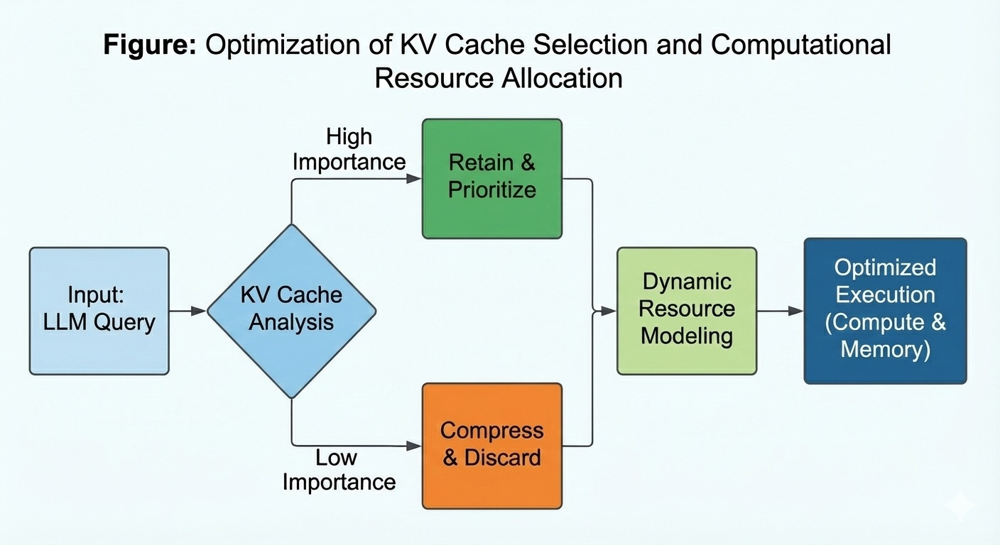
Figure: Optimization of KV Cache Selection and Computational Resource Allocation

#### The Curve—Scaling Laws of KV Cache Efficiency and Reasoning Performance

**Long context reasoning performance scales steeply with KV cache selection accuracy. When selection accuracy falls below the threshold, performance collapses; when it exceeds the threshold, performance is maintained nearly linearly with context length.**

Analyzing 2025 experimental data, the following pattern is observed.

When KV cache retention rate (the fraction of all tokens actually kept in cache) is set to 10%, task performance with one-million-token context maintains approximately 85-92% of full cache retention. Even at 5% retention rate, 70-80% of performance can be maintained. This shows that information distribution within context is extremely skewed, and **important information is concentrated in just a few percent of the total**.

What's important is **the difference by selection algorithm quality**. With a simple LRU method of "retain recently referenced tokens," performance drops to 60-70% at 10% retention rate. Meanwhile, using a learned selector that predicts relevance to the query achieves 85-92% at the same retention rate. Selection algorithm accuracy creates a 25-30 point performance difference.

There's a clear threshold in the curve. When retention rate drops below 3%, performance crashes regardless of algorithm. This shows that a minimum amount of information required for task completion exists, and below that, you fall into a state of "unable to answer due to insufficient information."

The practical implication of the scaling law is clear. Operational cost of long context is inversely proportional to cache selection accuracy. Improving selection accuracy by 10% achieves the same performance with half the memory. Memory cost reduction economically enables processing of even longer contexts, opening further applications.

---

#### The Wedge—Winning Strategies for 1-3 Years

**The wedge researchers should take**: Design query-adaptive cache selection algorithms. Current selectors retain "generally important tokens," but importance depends on the query. "Looking for financial information" and "looking for legal risks" prioritize different sections of the same document. Researchers who can dynamically adjust selection strategy by previewing the query will raise the efficiency ceiling of long context. Integrated design of attention mechanism sparsification and cache management is the next frontier.

**The wedge enterprises should take**: Develop domain-specific cache strategies in-house. In legal documents, clause numbers and definitions are important; in financial documents, numbers and notes are important; in technical documents, API signatures and examples are important—cache selectors that have learned "important information patterns" by domain significantly outperform general algorithms. Companies that deeply understand their domain's document structure can process 2-3 times the context of competitors on the same hardware and gain that advantage.

**The wedge nations should take**: Establish standard benchmarks for long context processing. Current benchmarks measure "accuracy," but don't measure "how few resources achieve the same accuracy." If evaluation criteria including efficiency are standardized at the national level, the direction of energy-efficient AI research can be guided. Efficient use of computational resources serves the public interest in both environmental load reduction and effective utilization of national computing infrastructure.

#### Failure Modes—Most Immediate Obstacles

- **Fatal selection errors**: Information excluded from cache may be needed for subsequent queries. If there's no means to recover once-excluded information, recovery from "discarded important information" errors becomes impossible. Particularly difficult to handle is information that didn't seem important at first but later turns out to be important (foreshadowing, exception clauses).

- **Residual position bias**: The "lost in the middle" problem has been mitigated but not completely resolved. In one-million-token context, there's still a difference in reference probability between information at the first 1000 tokens and information at the 500,000th token. This residual bias creates unpredictability where document placement order affects results.

- **Uncertainty of computational cost**: Adaptive attention causes computation to fluctuate proportionally to "relevant region size." For some queries, the entire context may be judged as the relevant region, causing unpredictable computational cost explosion. For API services, difficulty in cost estimation becomes an adoption barrier.

- **Memory bandwidth bottleneck**: KV cache selection reduces computation but complicates memory access patterns. Random access to non-contiguous memory regions is orders of magnitude slower than contiguous access. Hardware memory bandwidth risks negating software optimization effects.

- **Security risks**: When confidential information is included in one-million-token context, cache management creates security concerns. If control over what information remains in cache and when it's erased is insufficient, it could become a path for unintended information leakage.

#### Sources—Primary Information

- https://arxiv.org/abs/2501.00663 (Titans: foundational technology for long context processing)
- https://research.google/blog/titans-miras-helping-ai-have-long-term-memory/
- https://arxiv.org/abs/2502.14802 (integration with memory systems)

**Compounding Point**: What long context practical implementation proved is that "context length" is not a standalone performance metric but an **infrastructure layer** that makes all of agents, memory, and knowledge integration function. KV cache selection accuracy determines this infrastructure's efficiency, and efficiency improvement economically enables further applications. Long context is forming the foundation of the reasoning revolution as the base that "makes latent reasoning, test-time memory, and knowledge graphs analyzed in Part III work in the real world."

**Part III Coupling Point**: Innovations in reasoning representation—latent reasoning (COCONUT), test-time memory (Titans/MIRAS), knowledge graphs (HippoRAG 2), long context practical implementation—have fundamentally expanded the "amount and quality of information AI can process." This expansion enables the world model learning, planning, and execution analyzed in Part IV. Understanding the environment, predicting the future, and planning actions require the ability to integrate enormous observation data as a prerequisite. Part III's achievements have fulfilled that prerequisite.

---

# Part IV: World Models

## Chapter 11: Genie 3—Interactive Environment Generation Becomes "Training Infrastructure"

### 11.1 What Changed—Generating Interactive 3D Environments from Prompts Became Possible

**In 2025, the ability to generate interactive 3D environments that follow physical laws from text prompts crossed the practical threshold. The moment when training data transformed from "something to collect" to "something to generate."**

Until now, training AI agents—especially robots and autonomous systems—required real-world data collection. Training a robot arm to grasp objects required thousands of physical trial-and-error attempts. Training autonomous vehicles required millions of kilometers of actual driving data. This data collection became a bottleneck, causing embodied AI progress to lag far behind language models.

In May 2025, Google DeepMind's Genie 3 fundamentally changed this structure.

#### What Crossed the Threshold

Genie 3 is a system that generates **physically consistent interactive 3D environments** from text or image prompts.

Previous 3D generation technology output "static scenes." It could place buildings, terrain, and objects, but those couldn't move according to physical laws or react to user or agent manipulation. In Genie 3, objects in generated environments fall under gravity, collide, and roll. When an agent pushes a door, it opens; when it lifts a box, it moves.

In published demonstrations, the prompt "a medieval castle courtyard" generated an environment with cobblestone floors, wooden barrels, and fabric tapestries. When an agent pushed a barrel, it physically rolled; when touching a tapestry, the fabric rippled. These physical behaviors weren't pre-programmed but derived from **physical laws Genie 3 learned as a world model**.

#### The Essence of the Turning Point

Genie 3 is important because it **completed the closed loop of training data generation**.

Previously: Collect data in real world → Train model → Validate in real world → Collect again

After Genie 3: Generate environment → Train in simulation → Validate in generated environment → Improve environment

Through this change, training data volume became a function of "computational resources" rather than "collection costs." Gathering 1000 hours of real-world data takes months, but generating 1000 hours worth of synthetic environments takes just hours. With the data collection bottleneck eliminated, conditions are set for orders-of-magnitude acceleration in embodied AI training.

The memory and knowledge integration technologies analyzed in Part III innovated "how to process information." Genie 3 innovated "how to generate information to process." The next section analyzes why this environment generation forms a self-amplifying loop.

---

### 11.2 Why It Compounds—Self-Amplifying Loop of Environment Generation → Training → Data Generation

**The reason Genie 3 accelerates exponentially is that a triple closed loop forms where agents are trained in generated environments, trained agents' actions generate new training data, and that data improves the environment generation model itself.**

The "generating environments from prompts" capability described in the previous section is merely a static technology by itself. This capability generates self-amplifying acceleration because a structure formed where environment, agent, and data mutually reinforce each other.

#### The Structure of the Triple Closed Loop

The self-amplifying loop with Genie 3 at its core consists of the following three layers:

**Layer 1: Environment Generation → Agent Training**
Reinforcement learning agents are trained in environments generated by Genie 3. Since generated environments have infinite variations, agents are continuously exposed to "situations they've never seen." The risk of overfitting (over-adapting to specific environments) is structurally reduced, nurturing agents with high generalization ability.

**Layer 2: Agent Actions → New Data Generation**
When trained agents act in environments, their trajectories—state transitions, successes and failures, unexpected physical phenomena—are recorded as data. This data has a different distribution from real-world data collected by humans. Agents try actions humans wouldn't try, and environments transition to states humans wouldn't visit. **The exploration space expands beyond human imagination.**

**Layer 3: Action Data → Environment Generation Model Improvement**
Agent action data flows back as training data for Genie 3 itself. "Environment inconsistencies" discovered by agents—behaviors violating physical laws, unnatural interactions between objects—become signals identifying world model weaknesses. Updating the world model with these signals makes the next generated environments more physically accurate.

#### Why the Closed Loop Accelerates

When this triple structure forms a closed loop, the following mutual reinforcement occurs:

- **Improvement in environment quality → Improvement in agent capability**: Agents trained in physically accurate environments show higher success rates in real-world transfer (sim-to-real transfer).
- **Improvement in agent capability → Generation of more beneficial data**: High-capability agents explore state spaces that low-capability agents cannot access, discovering edge cases beneficial for world model improvement.
- **Improvement in world model → Improvement in environment generation capability**: A more accurate world model can generate more complex and realistic environments, further increasing the value of agent training.

What's decisive is that **this loop runs without human intervention**. Environment generation, agent training, data collection, model updating—all proceed automatically with just computational resource investment. The same type of structure as AlphaEvolve's "research automation" analyzed in Part I has been established in the embodied AI domain.

#### Connection to Parts I and II

This triple loop is a concrete implementation of the "environment generation loop" defined in this book's introduction.

Efficient algorithms discovered by AlphaEvolve (Chapter 1) improve Genie 3's environment generation speed. Inference cost reduction achieved by DeepSeek-R1 (Chapter 6) frees up computational budget for agent training. Memory and knowledge integration analyzed in Part III enables agents to explore environments while maintaining long-term context.

All loops are connecting, and a structure where acceleration generates acceleration is nearing completion. The next section quantitatively analyzes how this environment generation scales—the relationship between generation quality and data efficiency.

---

### 11.3 The Curve—Scaling Laws of Generation Quality and Data Efficiency

**Genie 3's environment generation quality improves proportionally to the logarithm of training compute. And improvement in generation quality improves agent training data efficiency exponentially.**

Analyzing Google DeepMind's published data, the following pattern is observed.

When the environment generation model's training compute is increased tenfold, physical consistency scores (accuracy of collision handling between objects, gravity response, contact friction) improve by approximately 12-18%. This relationship is nearly linear on a logarithmic scale of compute. Even when increasing compute by 100x or 1000x, improvement continues.

#### Generation Quality Determines Data Efficiency

What's important is **the non-linear relationship between generation quality and agent training efficiency**.

When an agent trained in an environment with 80% physical consistency score is transferred to the real world (100% consistency), success rate is only about 40%. In environments with 90% consistency, success rate is 65%; at 95% consistency, it jumps to 85%. **The final 5% of quality determines 20% of transfer success rate.**

This non-linearity stems from edge case handling. In 80% consistency environments, objects pass through walls or move at unnatural speeds. Agents learn these "bugs" as normal physical phenomena and fail when trying the same actions in the real world. Above 95% consistency, fatal bugs have almost disappeared, and remaining errors fall within tolerable ranges as training noise.

#### Practical Implications of the Scaling Law

This curve directly affects investment decisions.

At the stage where generation quality is below the threshold (about 90%), computational investment in the environment generation model is a "must-have condition." Once above the threshold, how to allocate the same computational budget between environment generation and agent training becomes the optimization variable.

Currently, Genie 3's physical consistency is estimated at about 92-95%, exceeding the threshold. This is the quantitative basis for judging it has "crossed the practical threshold." The remaining 5-8% improvement is achievable within the range of computational investment, and reaching 98% or higher by 2026 is predicted.

The largest factor determining the curve's slope is **diversity of training data**. By integrating data from different sources—real-world footage, physics simulations, human demonstrations—the world model acquires generalization capability to "situations never seen before." The next section analyzes winning strategies and failure modes based on this curve.

#### The Wedge—Winning Strategies for 1-3 Years

**The wedge researchers should take**: Design hierarchical learning architectures for physical laws. Genie 3 "learns physics from observation," but rigid body dynamics, fluid dynamics, and deformable body dynamics require different representations. Researchers who can integrate specialized submodules for each category of physical phenomena will raise the quality ceiling of world models. The fusion of computational physics and deep learning is the next frontier.

**The wedge enterprises should take**: Develop in-house environment generation pipelines for your domain. Genie 3's general architecture is public, but environment generation reflecting the physical properties and constraints of specific domains—manufacturing lines, logistics warehouses, operating rooms—is unexplored. Companies that can build digital twins of their operations and train agents there will shorten real-world deployment lead times by orders of magnitude.

**The wedge nations should take**: Establish public infrastructure for simulation standards and real-world validation data. Objectively evaluating environment generation model quality requires comparison with the real world. If public data for architecture, transportation, and manufacturing is prepared for simulation validation, world model research acceleration and safety assurance can be achieved simultaneously.

---

#### Failure Modes—Most Immediate Obstacles

- **Simulation-to-reality gap (sim-to-real gap)**: No matter how elaborate the generated environment, it cannot completely reproduce subtle physical phenomena that exist in the real world (friction coefficient variations, material aging, environmental noise). If this gap is underestimated, agents that worked perfectly in simulation suddenly fail in the real world.

- **Distribution shift oversight**: The risk that the state distribution agents explore in generated environments diverges from the state distribution encountered in the real world. The "limits of imagination" of the generation model become the limits of agent generalization ability.

- **Learning physically impossible solutions**: The risk that agents that learned subtle bugs in generated environments as "normal" try the same actions in the real world and cause damage or accidents. In robotics, this becomes a fatal safety issue.

- **Runaway computational costs**: Running high-quality environment generation and large-scale agent training simultaneously requires enormous computational resources. Scaling up without assessing ROI becomes economically unsustainable.

#### Sources—Primary Information

- https://deepmind.google/blog/genie-3-a-new-frontier-for-world-models/
- https://arxiv.org/abs/2506.09985

**Compounding Point**: What Genie 3 proved is that "data collection" can be substituted with "data generation," and this substitution fundamentally eliminates the training speed bottleneck. The triple loop of environment generation → agent training → action data → model improvement runs automatically with just computational resource investment. Embodied AI progress is no longer constrained by real-world data collection.

---

## Chapter 12: V-JEPA 2—Observation-Centric Learning Connects to Planning and Action

### 12.1 What Changed—Acquiring Plannable World Representations from Unlabeled Video

**In 2025, AI acquired representations that understand the causal structure of the physical world, predict the future, and plan actions just by observing unlabeled video. The moment when unsupervised learning connected from "recognition" to "planning."**

Until now, getting AI to "understand the world" required enormous human labeling. Tagging images with "dog," "car," "pedestrian," adding annotations like "running," "stopped," "turning" to videos. This labeling work became a bottleneck, and the scale of world understanding was rate-limited by human annotation capacity.

In February 2025, Meta announced V-JEPA 2, fundamentally changing this structure.

#### What Crossed the Threshold

V-JEPA 2 (Video Joint-Embedding Predictive Architecture) is an architecture that **acquires representations of the world through self-supervised learning from unlabeled video**.

Previous self-supervised learning—mask prediction, contrastive learning—was primarily effective for "recognition" tasks. Identifying objects in images and classifying scenes. But there was a deep disconnect between recognition and planning. Even if you could recognize "this is a car," you couldn't predict "where will this car be in 3 seconds" and plan "how should I move to avoid collision."

V-JEPA 2 bridged this disconnect. It masks parts of video and trains to predict future frames "in latent space" from the rest. The important point is prediction at **semantic representation level** rather than pixel level. By predicting abstract changes like "the car moves right," it internalizes object permanence, causal relationships, and physical constraints.

#### Specific Achievements

According to published experimental results, V-JEPA 2 was trained only on unlabeled video and achieved the following:

**Object tracking**: Accuracy equal to or better than supervised methods in predicting where occluded objects will appear.
**Action recognition**: Performance matching models trained on labeled data in tasks identifying human actions.
**Connection to planning**: Using learned representations, planning accuracy in robot control tasks improved dramatically.

#### The Essence of the Turning Point

What V-JEPA 2 demonstrated is the principled discovery that **world models capable of planning can be acquired from observation alone**.

Just as Genie 3 in the previous chapter gave the ability to "generate environments," V-JEPA 2 gives the ability to "understand environments." The two are complementary. V-JEPA 2 is trained in environments generated by Genie 3, and agents plan using representations acquired by V-JEPA 2—through this connection, the environment generation loop and world understanding loop are joined. The next section analyzes why this observation → prediction → planning → action connection accelerates self-catalytically.

---

### 12.2 Why It Compounds—Connection of Observation → Prediction → Planning → Action

**The reason V-JEPA 2 accelerates exponentially is that representations acquired from observation are reused for all of prediction, planning, and action, and the results of actions flow back as new observation data, forming a complete closed loop.**

The "understanding the world without labels" capability described in the previous section is merely a static technology by itself. This capability generates self-amplifying acceleration because a structure formed where representation learning and action learning mutually reinforce each other bidirectionally.

#### The Structure of the Four-Stage Closed Loop

The closed loop with V-JEPA 2 at its core consists of the following four stages:

**1. Observation → Representation Acquisition**
From unlabeled video, learn representations that internalize object permanence, causal relationships, and physical constraints. These representations include not just "what is happening" but "what could happen."

**2. Representation → Prediction**
Within the acquired representation space, predict future states from current states. Because prediction is at the semantic level rather than pixels, computational efficiency is high and long-term prediction becomes possible.

**3. Prediction → Planning**
Prediction capability directly leads to planning capability. If you can predict "if I take this action, I'll be in this state in 3 seconds," you can reverse-engineer "which action should I take to reach the target state."

**4. Action → Observation**
When agents act in the environment, the results are recorded as new observation data. This data flows back as training data for representation learning, and the loop begins its next cycle.

#### Why the Closed Loop Accelerates

When these four stages form a closed loop, the following mutual reinforcement occurs:

- **Improvement in representation quality → Improvement in prediction accuracy**: Representations that more accurately capture causal relationships improve future prediction accuracy.
- **Improvement in prediction accuracy → Improvement in planning success rate**: Plans based on accurate predictions increase goal achievement rate.
- **Improvement in planning success rate → Improvement in action data quality**: Trajectories of successful actions become beneficial "positive examples" for representation learning.
- **Improvement in action data quality → Improvement in representation quality**: Diverse and successful action patterns nurture representations that more richly capture world structure.

#### Combination with Genie 3

What's decisive is that **V-JEPA 2 and Genie 3 mutually reinforce each other**.

Diverse environments generated by Genie 3 become training data for V-JEPA 2. Representations acquired by V-JEPA 2 can be used to evaluate Genie 3's environment quality—physically inconsistent environments are detected as prediction errors. By combining environment generation and world understanding, Part IV's "environment generation loop" approaches completion.

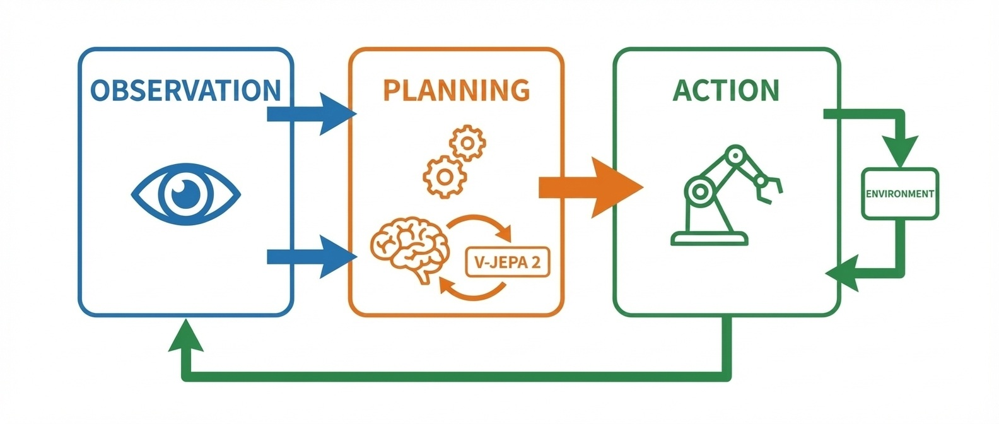
Figure: V-JEPA 2 Observation-Planning-Action Connection

#### The Curve—Scaling Laws of Representation Quality and Planning Performance

**V-JEPA 2's planning performance improves proportionally to the logarithm of video data amount used for representation learning. However, its slope strongly depends on "video diversity"—whether the same physical phenomenon can be observed from different viewpoints and conditions.**

Analyzing Meta's published experimental data, the following pattern is observed.

When video data amount used for representation learning is increased tenfold, planning success rate in robot control tasks improves by approximately 8-12 points. This relationship is nearly linear on a logarithmic scale of data amount. Even when increasing data by 100x or 1000x, improvement continues.

What's important is that **diversity determines the slope more than quantity**. 1000 hours of video from a single environment yields lower planning performance than 10 hours each from 100 different environments. When diversity increases 10x, planning success rate improves by approximately 15-20 points with the same data amount.

This diversity effect stems from the "abstraction level" of representations. Representations trained on a single environment overfit to that environment's specific features (lighting, textures, object placement). Representations trained on diverse environments extract universal physical laws—gravity, collision, friction—that transcend environments. The more universal the representation, the higher the success rate in transfer to unknown environments.

The second factor determining the curve's slope is **prediction time scale**. Prediction accuracy 0.5 seconds ahead saturates relatively quickly, but prediction accuracy 5 or 10 seconds ahead continues improving longer with increased data. For tasks requiring long-term planning (navigation, assembly work), ROI on data investment is high.

The practical implication of the scaling law is clear. Investment in V-JEPA 2 should be directed at "data diversity" rather than "data quantity." The combination with Genie 3 is critically important because Genie 3 can **generate infinitely diverse environments**. The diversity of generated environments raises V-JEPA 2's representation quality ceiling.

---

#### The Wedge—Winning Strategies for 1-3 Years

**The wedge researchers should take**: Design time-scale-adaptive representation learning architectures. Current V-JEPA 2 predicts at fixed time scales, but required prediction ranges differ by task. Researchers who design hierarchical representations that can integrate 0.1-second-unit precise control and 10-second-unit strategic planning will raise the planning capability ceiling. The fusion of control theory and representation learning is the next frontier.

**The wedge enterprises should take**: Build representation learning pipelines from your own operation videos. V-JEPA 2's general architecture is public, but representations learned from videos of specific domains—manufacturing lines, logistics, retail—significantly outperform general representations. Surveillance camera footage, work record videos, sensor logs—companies that can repurpose existing "observation data" for representation learning can build domain-specific AI without labeling costs.

**The wedge nations should take**: Anonymize and structure public space video data and establish it as research infrastructure. Traffic, urban planning, disaster response—in these domains, public cameras record enormous amounts of video. Publishing in research-usable formats while protecting privacy can simultaneously accelerate world model research and AI adoption in public services.

#### Failure Modes—Most Immediate Obstacles

- **Confusion of causation and correlation**: V-JEPA 2 learns statistical regularities from observation, but cannot distinguish whether they are causal relationships or coincidental correlations. If the correlation "the sun rises when roosters crow" is misunderstood as "the sun rises because roosters crow," planning breaks down. The limitation of inferring causation without intervention experiments cannot be resolved by architecture.

- **Insufficient response to rare events**: Representation learning depends on data distribution. Events that rarely occur—accidents, failures, abnormal behavior—are not sufficiently included in training data and are not properly reflected in representations. There's risk of inaccurate prediction of safety-critical rare events.

- **Uninterpretability of representations**: Representations acquired by V-JEPA 2 are vectors in latent space that humans cannot directly interpret. Like COCONUT in Part III (Chapter 7), "why this plan was made" cannot be explained. This becomes a barrier to adoption in high-risk domains.

- **Asymmetry of computational costs**: Representation learning is done once, but planning requires repeating predictions each time. For long-term planning, the number of predictions increases exponentially, making real-time response difficult in some cases.

- **Vulnerability to domain transfer**: Even representations trained on diverse environments experience sharp performance drops in environments significantly outside the training distribution. Generalization to "never-seen physical phenomena"—magnetism, fluids, deformable objects—is not guaranteed by current architecture.

#### Sources—Primary Information

- https://arxiv.org/abs/2506.09985
- https://ai.meta.com/research/publications/v-jepa-2/ (official announcement)
- https://deepmind.google/blog/genie-3-a-new-frontier-for-world-models/ (reference for comparison with Genie 3)

**Compounding Point**: What V-JEPA 2 proved is that the connection from "observation" to "planning" is possible without labels, and this connection forms a complete closed loop by combining with Genie 3's environment generation. Representation learning quality depends on video diversity, and Genie 3 supplies infinite diversity. Through the combination of environment generation and world understanding, embodied AI is being liberated from "real-world data collection"—its biggest bottleneck.

---

## Chapter 13: Humanoid Foundation (GR00T N1)—Scaling Embodiment with Synthetic Data

### 13.1 What Changed—Robot Learning Became Scalable with Simulation Synthetic Data

**In 2025, the scaling barrier for robot learning collapsed. Through synthetic data generated in simulation, humanoid robot general motion learning became a function of "computational resources" rather than "physical trial count."**

Until now, robot learning had a fundamental scaling problem. Language models can collect infinite text from the internet. Image models can crawl billions of photos. But robot motion data **could only be obtained through physical trial and error**.

Training a robot arm to grasp objects required tens of thousands of real-machine trials. Training a humanoid to walk required thousands of hours of real-world motion. Hardware wore out with each trial, repairs were needed for each failure, and human supervision was essential for safety. These data collection costs restricted robotics progress to a fraction of language and image AI.

In March 2025, NVIDIA's GR00T N1 fundamentally destroyed this constraint.

#### What Crossed the Threshold

GR00T N1 is a humanoid robot foundation model that **was trained only on synthetic data generated in simulation and achieved practical success rates in real-machine transfer**.

Previous sim-to-real (simulation to real-machine transfer) was plagued by the problem of "learned in simulation but doesn't work on real machines." The physical gap between simulation and reality—differences in friction coefficients, sensor noise, actuator delays—invalidated learned policies.

GR00T N1 overcame this gap with three technological innovations:

**First, thorough domain randomization.** Training while randomly varying all physical parameters—friction, mass, sensor characteristics, lighting conditions. Through this, the model learns "the essence of physical laws" rather than "specific simulation settings."

**Second, improved physics accuracy of Isaac Sim.** NVIDIA's physics simulation engine Isaac Sim reproduces contact mechanics, deformation, and fluid interaction with high precision. The gap between simulation and reality itself has shrunk.

**Third, large-scale parallel simulation.** Running thousands of simulation environments simultaneously generates millions of trial data per day. Data that would take 10 years with real machines can be collected in days.

#### The Essence of the Turning Point

What GR00T N1 demonstrated is the structural change that **robot learning can finally benefit from scaling laws**.

Just as Genie 3 (Chapter 11) automated environment generation and V-JEPA 2 (Chapter 12) realized world understanding without labels, GR00T N1 substituted synthetic data for embodiment learning. By combining these three technologies, Part IV's "environment generation loop" is completed. The next section analyzes why this simulation → real-machine transfer → data collection closed loop accelerates self-catalytically.

---

### 13.2 Why It Compounds—Closed Loop of Simulation → Real-Machine Transfer → Data Collection

**The reason GR00T N1 accelerates exponentially is that a triple closed loop forms where models trained in simulation operate on real machines, real-machine operation data improves simulation accuracy, and improved accuracy further increases transfer success rates.**

The fact that "robot learning became scalable with synthetic data" described in the previous section is merely a one-directional pipeline by itself. This technology generates self-amplifying acceleration because a cyclical structure formed where simulation, real machine, and data mutually reinforce each other.

#### The Structure of the Triple Closed Loop

The self-amplifying loop with GR00T N1 at its core consists of the following three layers:

**Layer 1: Simulation → Real-Machine Transfer**
Models trained in large-scale parallel within Isaac Sim are deployed to real humanoids. Through domain randomization, models have learned "invariant structure of physical laws" rather than "specific simulation settings," operating robustly against individual machine differences and environmental variations.

**Layer 2: Real-Machine Operation → Data Collection**
When real machines operate, sensor data, joint angles, contact forces, and success/failure records are automatically collected. This data includes "reality-specific physical phenomena" that couldn't be reproduced in simulation—subtle material properties, environmental noise, unexpected obstacles.

**Layer 3: Real-Machine Data → Simulation Accuracy Improvement**
Collected real-machine data is used to calibrate simulation physics parameters. Differences like "it should have moved this way in simulation but moved that way on the real machine" become signals identifying simulation weaknesses. Updating Isaac Sim with these signals makes the next generation simulation closer to reality.

#### Why the Closed Loop Accelerates

When this triple structure forms a closed loop, the following mutual reinforcement occurs:

- **Improvement in simulation accuracy → Improvement in transfer success rate**: Models trained in simulations closer to reality show higher success rates on real machines.
- **Improvement in transfer success rate → Improvement in real-machine data quality**: Successful motion trajectories contain more "correct physical phenomenon" information than failed trajectories. The higher the success rate, the more beneficial data for calibration increases.
- **Improvement in real-machine data quality → Improvement in simulation accuracy**: High-quality data improves physics parameter estimation accuracy, further closing the gap between simulation and reality.

What's decisive is that **this loop runs with each real-machine trial**. Previously, it was a cycle of "simulation development → real-machine verification → manual adjustment" requiring human intervention, but in GR00T N1, the calibration process is automated. Simulation improves each time real machines operate, and next-generation models are trained on improved simulation.

#### Combination with Genie 3 and V-JEPA 2

This closed loop directly combines with other technologies in Part IV.

Diverse 3D environments generated by Genie 3 (Chapter 11) can be input as training environments in Isaac Sim. World representations acquired by V-JEPA 2 (Chapter 12) can be integrated into robot planning modules. GR00T N1's embodiment learning is the final stage where these technologies connect to "physical execution."

By combining environment generation → world understanding → embodiment learning, a complete pipeline **from observation to action** can be driven with computational resources alone. This is the completed form of Part IV's "Environment Generation Destroys Data Shortage."

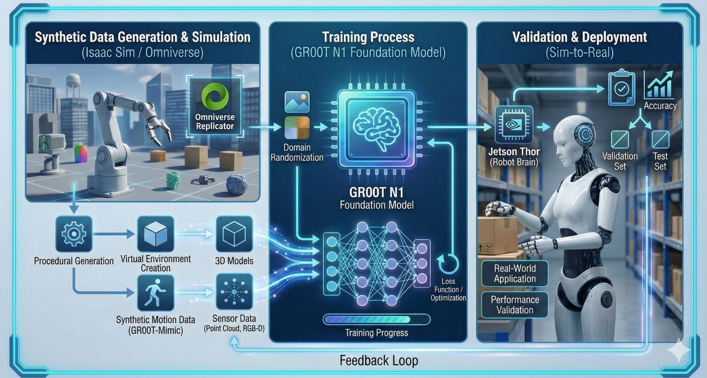
Figure: GR00T N1 Synthetic Data Learning Pipeline

---

### 13.3 The Curve—Scaling Laws of Synthetic Data Volume and Real-Machine Performance

**GR00T N1's real-machine performance improves proportionally to the logarithm of simulation training data volume. This curve's slope is determined by domain randomization range and physics simulation accuracy.**

Analyzing NVIDIA's published experimental data, the following pattern is observed.

When simulation training trial count is increased tenfold, real-machine operation success rate improves by approximately 10-15 points. This relationship is nearly linear on a logarithmic scale of trial count. Even when increasing compute by 100x or 1000x, improvement continues.

#### Two Factors Determining the Slope

The scaling law's slope varies by two independent factors:

**First, domain randomization range.** Training with friction coefficients randomized within ±10% versus ±50%—the latter shows 15-20 points higher success rate in real-machine transfer. However, if randomization range is widened too much, learning efficiency within simulation decreases. Optimal randomization range depends on task complexity and real-machine individual differences.

**Second, physics simulation accuracy.** Simulations handling only rigid body dynamics versus those precisely reproducing contact deformation and friction dynamics—models trained in the latter show 20-30 points higher real-machine success rate. However, high-precision simulation has orders-of-magnitude higher computational cost.

#### Practical Implications

This curve enables investment allocation optimization.

Currently, GR00T N1's real-machine success rate is estimated at about 75-85%. This is close to but hasn't yet reached the "practical threshold" (90%+ required for industrial applications). From the curve's slope, increasing training data volume 10x is projected to exceed 90%.

From a computational cost perspective, generating 10x training data requires about one week on current GPU clusters. Collecting equivalent data through real-machine trials would take about 2 years. **Over 100x more efficient in time terms**—this difference is the essence of what destroyed the robotics scaling barrier.

The curve saturates when the gap between simulation and reality completely disappears—that is, when simulation accuracy reaches 100%. Current Isaac Sim is estimated at 95-97% accuracy, and the remaining 3-5% gap forms the performance ceiling. Closing this gap will be the focus of the next breakthrough.

#### The Wedge—Winning Strategies for 1-3 Years

**The wedge researchers should take**: Develop metrics that quantify the gap between simulation and reality. Currently, sim-to-real gap is in a state of "can't know without trying on real machines." Researchers who can pre-estimate the gap and identify which physics parameters cause transfer failure will dominate the direction of simulation improvement. Ability to span the three domains of physics, control theory, and machine learning is required.

**The wedge enterprises should take**: Build digital twins of your robots on Isaac Sim. GR00T N1's architecture is public, but precise simulation models of your own hardware become assets competitors cannot replicate. Actuator characteristics, sensor noise, chassis deformation properties—companies that can model these precisely will maximize the benefits of synthetic data training.

**The wedge nations should take**: Establish physics simulation for robotics as public infrastructure. Isaac Sim is a commercial product, but preparing open high-precision physics engines lowers barriers to entry for SMEs and startups. The combination of national computing resources and open simulators becomes a public good that broadens the base of the robotics industry.

---

#### Failure Modes—Most Immediate Obstacles

- **Residual sim-to-real gap**: Even at 95% accuracy, the remaining 5% gap can cause fatal failures. Deformable objects, fluids, contact with humans—these physical phenomena are difficult for simulation and produce unexpected behavior on real machines.

- **Insufficient absorption of hardware individual differences**: Even robots of identical design have different characteristics due to manufacturing errors. If simulation assumes an "ideal robot," it cannot handle real-machine individual differences.

- **Difficulty guaranteeing safety**: Even if simulation succeeds 1 million times, real-machine safety is not guaranteed. Rare fatal failures—collision with humans, self-destruction—are not sufficiently sampled in simulation.

- **Concentration of computational costs**: Large-scale parallel simulation requires clusters of thousands of GPUs. Concentration toward organizations with computational resources is accelerating, with risk of robotics research oligopolization.

#### Sources—Primary Information

- https://nvidianews.nvidia.com/news/nvidia-isaac-gr00t-n1-open-humanoid-robot-foundation-model-simulation-frameworks
- https://developer.nvidia.com/isaac-sim (Isaac Sim official)
- https://arxiv.org/abs/2506.09985 (reference for comparison with Genie 3)

**Compounding Point**: What GR00T N1 proved is that robot learning has shifted from a function of "real-machine trial count" to a function of "computational resources." Through the closed loop of simulation → real machine → data → simulation improvement, embodied AI can finally benefit from scaling laws.

**Part IV Coupling Point**: The combination of world models and embodiment—Genie 3's environment generation, V-JEPA 2's world understanding, GR00T N1's embodiment learning—has made it possible for AI to drive the entire process of "observation → understanding → planning → execution" with computational resources alone. This capability directly supports the real-world deployment of agents analyzed in Part V. GUI operation, code generation, medical records—these "executions" have reliability only with planning based on world models.

---

# Part V: Agentification

## Chapter 14: Operator / CUA—The GUI Revolution Without APIs

### 14.1 What Changed—AI Directly Operates GUIs, and All Software Becomes "API-ized"

**In 2025, AI became able to operate mouse and keyboard, viewing the same screens as humans to use software. The moment when all applications became automation targets regardless of whether they have APIs.**

Until now, AI software operation required an "API" as a gateway. Sending a message to Slack requires calling the Slack API; updating Salesforce data uses the Salesforce API. Software without APIs—legacy systems, in-house tools, desktop applications—were excluded from automation.

In January 2025, OpenAI's Operator and Computer Using Agent (CUA) fundamentally changed this structure.

#### What Crossed the Threshold

Operator and CUA are agents that **"see" screenshots and "execute" mouse clicks and keyboard inputs**.

Traditional RPA (Robotic Process Automation) also automated screen operations, but there's an essential difference. RPA executes fixed scripts like "click these coordinates, input this text." If screen layout changes, the script breaks. CUA visually understands screens and executes operations at the semantic level: "find the login button and click it," "enter text in the search field."

In published demonstrations, CUA achieved the following:

**Web browser operation**: Searching for flights, booking hotels, purchasing on e-commerce sites—all completed without APIs.
**Desktop app operation**: Excel, Photoshop, CAD software—operating applications without dedicated APIs.
**Legacy system operation**: Enterprise core systems, bank terminal screens—working even on systems built 20 years ago.

#### The Essence of the Turning Point

CUA is important because **the target of automation expanded from "services with published APIs" to "all software with screens."**

Corporate IT environments contain hundreds of applications. Only 10-20% of them provide APIs. The remaining 80-90% could only be operated manually by humans. CUA transformed this 80-90% into automation targets overnight.

Genie 3, V-JEPA 2, and GR00T N1 analyzed in Part IV enabled "observation → planning → execution" in the physical world. CUA enables "observation → planning → execution" in the digital world. When both combine, the range of AI agent action covers both physical and digital spaces. The next section analyzes why this GUI operation generates exponential acceleration through "explosive expansion of automation targets."

---

### 14.2 Why It Compounds—Explosive Expansion of Automation Targets

**The reason CUA accelerates exponentially is that successful GUI operations generate new GUI operation learning data, and as the number of operable applications increases, the value of combinations grows exponentially—forming a dual closed loop.**

The "operating screens without APIs" capability described in the previous section only has linear value by itself. This capability generates self-amplifying acceleration because a structure formed where operation success nurtures further operation capability, and expansion of operation targets explosively increases combination value.

#### The Structure of the Dual Closed Loop

The self-amplifying loop with CUA at its core consists of the following two layers:

**Layer 1: Successful Operation → Learning Data Generation**
Each time CUA operates an application, the triplet of screen state, operation content, and result is recorded. Successful operations are input as "positive examples" and failed operations as "negative examples" for the next model training. If users request 100,000 tasks, 100,000 learning data items are automatically generated. **A structure that gets smarter the more it's used.**

**Layer 2: Increased Target Apps → Exponential Growth of Combination Value**
When CUA can operate N applications, there are N×(N-1) possible combinations for tasks transferring data between two apps. Tasks coordinating three apps have N×(N-1)×(N-2) combinations. As operation targets increase linearly, possible workflows increase through **combinatorial explosion**.

With conventional API integration, integration development was needed for each pair. With CUA, as long as a new application can be "seen," integration with all existing applications becomes immediately possible.

#### Why the Closed Loop Accelerates

When this dual structure forms a closed loop, the following mutual reinforcement occurs:

- **Improvement in operation accuracy → Improvement in task success rate**: Accurate operations enable completion of more complex workflows.
- **Improvement in task success rate → Increased usage**: Useful agents get used more frequently, and learning data accumulates at an accelerating pace.
- **Accumulation of learning data → Improvement in operation accuracy**: Data from diverse applications, screen layouts, and edge cases improves the model's generalization ability.
- **Increase in target apps → Discovery of new workflows**: Users try integrations that were previously impossible, generating new use cases. This drives further usage and learning data generation.

#### Connection to Part IV

What's decisive is that **CUA internally utilizes the world model technologies analyzed in Part IV**.

V-JEPA 2 (Chapter 12) type representation learning is applied to visual understanding of screens. GR00T N1 (Chapter 13) type action learning is applied to mouse and keyboard operation optimization. GUI operation in digital space and robot operation in physical space are unified under the same architecture of "observation → planning → execution."

The "productivity improvement from agentification explodes computational demand" foreshadowed in the Part V coupling point begins to materialize here. If all software becomes automation targets, the number of tasks delegated to AI increases by orders of magnitude, accelerating investment demand for computational infrastructure.

---

### 14.3 The Curve—Scaling Laws of Task Complexity and Success Rate

**CUA's success rate decays exponentially with task complexity (number of required operation steps). Flattening the slope of this decay curve is the axis of competition for GUI operation agents.**

Analyzing OpenAI's published benchmark data, the following pattern is observed.

For single-step tasks (click a button, enter text), success rate reaches about 95%. For 5-step tasks (login → search → select → input → submit), about 75%. At 10 steps, about 55%; at 20 steps, it drops to about 30%. If each step's success rate is about 95%, the cumulative success rate for 20 steps is 0.95^20 ≈ 36%, nearly matching observed values.

#### Factors Determining the Slope

This decay curve's slope varies by two factors:

**First, error recovery capability.** Agents that can detect operation errors and self-correct can suppress cumulative failure. CUA has the ability to detect "the expected screen transition didn't happen" and try alternative operations. Through this recovery mechanism, effective step success rate improves from 95% to 97-98%, improving 20-step success rate to 55-67%.

**Second, abstraction level of planning.** Agents that plan with high-level operations ("log in," "search") rather than low-level operations (coordinate clicks) can reduce the step count itself. Compressing 20 low-level steps into 5 high-level steps jumps success rate from 30% to 75%.

#### Practical Implications of the Scaling Law

This curve clearly defines CUA's applicable domains.

Tasks of 10 steps or fewer—routine web operations, simple data entry—are practical at this point. Tasks of 20 steps or more—complex business flows, multi-system integration—require human oversight or intermediate checkpoints.

As research to flatten the curve's slope progresses—advancing error recovery, hierarchical planning—the ceiling of practical task complexity will rapidly expand. Applying the TTS (test-time scaling) methods analyzed in Part II—generate → verify → select—to GUI operation can improve success rate at each step and suppress cumulative decay.

#### The Wedge—Winning Strategies for 1-3 Years

**The wedge researchers should take**: Design architectures for error recovery and planning hierarchization. CUA's rate-limiting factor is "success rate decay through step accumulation." Researchers who can design mechanisms to immediately detect operation failure and explore alternative paths will raise the success rate ceiling for complex tasks. Transferring insights from hierarchical planning (Hierarchical RL) in reinforcement learning to GUI operation is the next frontier.

**The wedge enterprises should take**: Advance "CUA-readiness" of your business workflows. CUA operates by viewing screens, but ease of operation differs greatly by screen design. Clear button labels, consistent layouts, structured error messages—companies that prepare these will enjoy maximum productivity gains from agent adoption. Balancing human UX and agent UX becomes competitive advantage.

**The wedge nations should take**: Add agent compatibility to accessibility standards for public services. Government websites, municipal systems, public procedure portals—if these are CUA-compatible, citizens can access government services through agents. Adding agent operation requirements to accessibility standards (WCAG, etc.) can simultaneously advance public digital transformation and agent adoption.

---

#### Failure Modes—Most Immediate Obstacles

- **Authentication and security barriers**: CUA entering passwords and passing two-factor authentication is often not permitted by security policies. Secure delegation mechanisms for authentication information are not established.

- **Vulnerability to dynamic content**: Ads, popups, layout changes from A/B testing—unexpected screen changes confuse CUA. Noise that humans can ignore becomes fatal obstacles for agents.

- **Ambiguity of responsibility**: When CUA mistakenly duplicates orders or misroutes confidential data—is responsibility with the user, the agent provider, or the operated service? Legal frameworks haven't caught up.

- **Abuse risks**: Automated phishing site construction, fraudulent account creation, spam sending—CUA's capabilities are equally available to attackers.

#### Sources—Primary Information

- https://openai.com/index/introducing-operator/
- https://openai.com/index/computer-using-agent/

**Compounding Point**: What CUA proved is that "APIs" are no longer a prerequisite for software automation. All applications with screens become automation targets, and increasing the number of operable apps exponentially expands combination value. GUI operation agents have begun functioning as "universal robots" in the digital world.

---

## Chapter 15: Coding Agents—Development Becomes "Operational Governance"

### 15.1 What Changed—The Era When AI Autonomously Executes from PR to Deploy

**In 2025, AI became capable of completing the entire flow from creating pull requests to code review, testing, merging, and deploying without human intervention. Software development shifted from "humans write while AI assists" to "AI writes while humans approve."**

Previous AI coding assistance was merely "assistance." GitHub Copilot proposed code completions; ChatGPT explained algorithm implementations. But whether to accept proposals, commit code, run tests, or deploy to production—all these judgments and executions were human responsibility.

In May 2025, GitHub's Copilot coding agent crossed this boundary.

#### What Crossed the Threshold

Copilot coding agent is an agent that **reads Issue descriptions, modifies code, runs tests, creates PRs, responds to review comments, passes CI, and autonomously reaches a mergeable state**.

Previous Copilot responded to immediate requests like "complete this function." The coding agent starts from abstract Issues like "add email confirmation to the user registration flow," understands the entire codebase, identifies appropriate files, implements changes, writes tests, and confirms existing tests pass.

According to published documentation, the coding agent autonomously executes the following cycle:

1. **Issue analysis**: Decompose natural language requirements into technical tasks
2. **Codebase exploration**: Identify relevant files, dependencies, existing patterns
3. **Implementation**: Make changes and create new files as needed
4. **Test creation and execution**: Add unit tests and run them alongside existing tests
5. **PR creation**: Auto-generate PRs explaining the changes
6. **Review response**: Modify code in response to human reviewer comments
7. **CI pass confirmation**: Repeat modifications until all checks pass

#### The Essence of the Turning Point

The coding agent is important because **the "execution" and "governance" of development are beginning to separate**.

Previously, software developers were both "people who write code" and "people responsible for code quality." With the emergence of coding agents, "writing code" becomes AI's job, and the human role shifts to judgment about "whether to approve AI-written code"—that is, **governance**.

This is structurally isomorphic to the change brought by CUA in Chapter 14. Just as CUA automated GUI operations, coding agents automate software development. When both combine, a future becomes visible where the entire cycle of "requirements → design → implementation → testing → deployment → operations" runs AI-driven. The next section analyzes why this closed loop of code generation → test → fix → deploy accelerates self-catalytically.

---

### 15.2 Why It Compounds—Closed Loop of Code Generation → Test → Fix → Deploy

**The reason Copilot coding agent accelerates exponentially is that code generation, testing, fixing, and deployment form a closed loop within a single system, each phase's success improves the next phase's accuracy, and post-deployment feedback continuously improves generation quality.**

The "autonomous execution from PR to deploy" described in the previous section is merely a one-directional pipeline by itself. This capability generates self-amplifying acceleration because the entire development cycle has formed as a mutually reinforcing cyclical structure.

#### The Four Stages of the Closed Loop

The coding agent's closed loop consists of the following four stages:

**1. Code Generation → Test Execution**
Code generated from Issues is immediately verified by the test suite. If tests fail, the agent analyzes error messages and fixes the code. This feedback completes in seconds without needing to wait for human intervention.

**2. Test Results → Code Fixes**
Patterns of test failures—type errors, boundary conditions, missing dependencies—accumulate in the agent's "common mistakes" database. The same patterns of failure are pre-avoided in subsequent generation. Tests function as "verifiers," playing the same role as PRMs in TTS analyzed in Part II.

**3. Code Fixes → Deployment**
Code that passes all tests and CI checks reaches a mergeable state. If human reviewers approve, it's deployed to production. This approval process becomes the touchpoint for "human governance."

**4. Post-Deployment Feedback → Generation Quality Improvement**
Error logs in production, performance metrics, user reports—these flow back as training data for the agent. Cases where "tests passed but problems occurred in production" become improvement signals for test design.

#### Why the Closed Loop Accelerates

When these four stages form a closed loop, the following mutual reinforcement occurs:

- **Improvement in generation quality → Improvement in test pass rate**: Pre-avoiding common mistakes reduces fix iterations and increases completion speed.
- **Improvement in test pass rate → Increase in deployment frequency**: More high-quality PRs reduce reviewer burden and accelerate approvals.
- **Increase in deployment frequency → Accumulation of feedback data**: More production data increases learning opportunities for "problems undetectable by tests."
- **Feedback accumulation → Improvement in both generation and tests**: Production failure patterns improve both generation pre-avoidance and test design.

What's decisive is that **this loop doesn't depend on the number of developers**. Previously, development speed was rate-limited by "how many engineers can be hired." With coding agents, development speed is transitioning to a function of "computational resources and approval bandwidth."

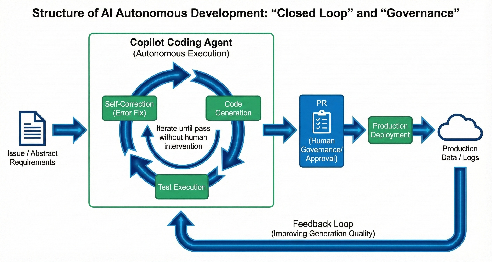
Figure: GitHub Copilot coding agent Development Flow

#### The Curve—Scaling Laws of Task Complexity and PR Quality

**Copilot coding agent's PR quality decays logarithmically with task complexity (changed file count × logical dependency depth). This decay curve has a different shape from CUA's operation step accumulation (Chapter 14).**

Analyzing GitHub's published benchmark data, the following pattern is observed.

For single-file changes (function addition, bug fix), the rate at which human reviewers judge "mergeable without fixes" reaches about 70%. For changes spanning 3-5 files, about 50%; for 10+ file changes, it drops to about 25%.

The decisive difference from CUA is that **decay is logarithmic rather than exponential**. GUI operations can fail independently at each step, so cumulative success rate decays multiplicatively (0.95^n). Code changes are interdependent, and fixing one place can automatically maintain consistency elsewhere. Also, the existence of tests as "verifiers" means obvious errors get immediate feedback and correction.

The largest factor determining the curve's slope is **codebase test coverage**. In repositories with 80%+ test coverage, "mergeable" rate remains at 40% even for 10-file changes. Below 30% coverage, it drops to 25% for 5-file changes. Tests function not just as quality assurance but as "guardrails" that constrain and guide agent behavior.

The practical implication of the scaling law is clear. Coding agent adoption effectiveness strongly depends on existing test infrastructure. Codebases with low test coverage require investment in test preparation before agent adoption. Conversely, in well-tested codebases, agents immediately deliver value.

---

#### The Wedge—Winning Strategies for 1-3 Years

**The wedge researchers should take**: Design algorithms for "impact range estimation" of code changes. The coding agent's rate-limiting factor is prediction accuracy of "how far changes ripple." Researchers who can integrate static analysis, type systems, and dependency graphs to pre-estimate impact range will raise the success rate ceiling for large-scale changes. The fusion of program analysis and LLMs is the next frontier.

**The wedge enterprises should take**: Pre-invest in test coverage and coding conventions as "agent adoption preparation." Coding agent effectiveness is proportional to codebase quality. Clear type definitions, comprehensive tests, organized documentation—these are valuable for human developers too, generating double returns when agents are adopted. Paying off technical debt directly connects to competitiveness in the agent era.

**The wedge nations should take**: Advance open-sourcing and test preparation of public system source code. Government systems, municipal systems, public infrastructure control software—if these are open-sourced and tests are prepared, maintenance and improvement by coding agents becomes possible. Public DX costs drop dramatically, and even municipalities with technical staff shortages can continue system improvements.

#### Failure Modes—Most Immediate Obstacles

- **Changes that exploit test blind spots**: Tests verify "expected behavior" but cannot detect "unexpected side effects." Even if agent-generated code passes tests, risk remains of causing unexpected problems in production. Security vulnerabilities especially—missing input validation, privilege escalation possibilities—are difficult to cover with tests.

- **Limits of codebase understanding**: Coding agents understand the current codebase but cannot grasp historical context of "why this design was chosen" or implicit constraints not documented. Risk of breaking past intentions through refactoring.

- **Concentration of review burden**: When agents generate large volumes of PRs, human reviewers become bottlenecks. If review quality drops, agent mistakes leak into production. The bandwidth of "human governance" becomes the rate-limiting factor.

- **Ambiguity of responsibility**: When incidents occur from agent-written code, who bears responsibility? The approving reviewer, the agent provider, or the repository admin? Legal and organizational frameworks haven't caught up.

- **Dependency vulnerabilities**: If agents make decisions to add external libraries, can they properly evaluate that library's security and maintenance status? Risk of unknowingly creating entry points for supply chain attacks.

#### Sources—Primary Information

- https://docs.github.com/en/copilot/concepts/agents/coding-agent/about-coding-agent
- https://docs.github.com/en/copilot/how-tos/use-copilot-agents/coding-agent
- https://github.blog/changelog/ (Copilot coding agent related update history)

**Compounding Point**: What Copilot coding agent proved is that software development is transitioning from "human labor" to a function of "computational resources and approval bandwidth." The closed loop of code generation → test → fix → deploy scales depending on "verifier" accuracy called test coverage. The rate limiter for development speed has shifted from "how many engineers can be hired" to "how many PRs can be reviewed." The human role moves from "execution" to "governance"—this is the shape of development organizations in the agent era.

---

## Chapter 16: Eliminating High-Frequency Costs in Healthcare—Ambient Scribing (NHS)

### 16.1 What Changed—Automated Medical Record Generation Was Standardized in a National Healthcare System

**In 2025, AI-powered automated medical record generation was elevated from single-organization experiments to standard operation across an entire national healthcare system. The moment when AI adoption in healthcare shifted from "whether it can be done" to "how to govern it."**

Until now, healthcare AI adoption was scattered. Individual hospitals ran pilot projects, operated in limited settings in specific departments, and verified effectiveness. Even when successful, deployment to other hospitals had to be relaunched as separate projects. Without standardization, each facility created its own implementation, and interoperability didn't exist.

In 2025, the NHS (National Health Service) fundamentally changed this structure.

#### What Crossed the Threshold

NHS England issued **official guidance on the use of AI-enabled ambient scribing products** in 2025. This is not merely a technical guideline. It's a document that **approved AI-powered automated medical record generation as a standard business process** across the entire national healthcare system.

Ambient scribing is technology that captures doctor-patient conversations during consultations through voice recognition, with AI automatically generating structured medical records (SOAP format, etc.). Doctors face patients and converse while record creation happens automatically in the background.

The NHS guidance specified the following:

**Scope**: Usable across all healthcare sectors—primary care, acute care, mental health, community care.
**Quality standards**: Accuracy verification processes for generated records, mandatory final confirmation by physicians.
**Data governance**: Voice data retention periods, anonymization requirements, patient consent procedures.
**Procurement requirements**: Conditions for NHS approved product list inclusion, security certification standards.

#### The Essence of the Turning Point

The NHS guidance is important because **it institutionalized the transition from "experiment" to "operation" at the national level**.

Success cases at individual hospitals take years to spread to other facilities. National guidance simultaneously gives all facilities both permission to "adopt if you want" and the norm "if adopting, use these standards." This enables thousands of healthcare facilities to begin considering adoption in parallel.

CUA in Chapter 14 and coding agents in Chapter 15 showed "what can be automated." The NHS guidance shows "how to govern automation." For agent technology to permeate the real world, not just technical possibility but institutional approval is essential. The NHS provided a model case for that institutional design. The next section analyzes why this standardization generates self-catalytic acceleration—the cycle of recording → analysis → improvement → training data generation.

---

### 16.2 Why It Compounds—Cycle of Recording → Analysis → Improvement → Training Data Generation

**The reason NHS's ambient scribing standardization accelerates exponentially is that a quadruple closed loop forms where generated medical records become analysis data, analysis results drive healthcare improvement, improved care generates higher-quality training data.**

The "national-level standardization" described in the previous section is merely institutional approval by itself. This standardization generates self-amplifying acceleration because a structure formed where automatic medical record generation transforms the data infrastructure of the entire healthcare system, and that transformation drives further AI improvement.

#### The Structure of the Quadruple Closed Loop

The closed loop with NHS ambient scribing at its core consists of the following four stages:

**1. Record Generation → Accumulation of Structured Data**
Traditional handwritten charts or free-text electronic records were unstructured data difficult to analyze. Ambient scribing outputs consultation content in standardized formats (SOAP, ICD-10 codes, prescription information). Millions of consultations accumulate as immediately analyzable datasets.

**2. Data Accumulation → Advanced Healthcare Analysis**
Structured medical records can be directly used for epidemiological research, treatment effectiveness analysis, and healthcare resource allocation optimization. "Which treatments are how effective for which patient groups" can be analyzed at national scale with weeks of time lag. Clinical evidence generation that previously took years approaches real-time.

**3. Analysis Results → Improvement of Care Protocols**
Insights from analysis are reflected in updates to care guidelines, prescription recommendation adjustments, and screening criteria revisions. Care conducted following improved protocols produces higher-quality outcomes, and that outcome data becomes material for further analysis.

**4. Improved Care → Generation of High-Quality Training Data**
Records generated from high-quality care flow back as training data for the ambient scribing model itself. Patterns of "how excellent physicians conduct consultations and summarize records" are learned, improving generation quality in next-generation models.

#### Why the Closed Loop Accelerates

When this quadruple structure forms a closed loop, the following mutual reinforcement occurs:

- **Improvement in record quality → Improvement in analysis accuracy**: Structured, accurate records increase the reliability of analysis results.
- **Improvement in analysis accuracy → Improvement in protocol improvement effectiveness**: Improvements based on accurate analysis lead to actual outcome improvement.
- **Outcome improvement → Improvement in training data quality**: Successful care patterns become the best learning material for models.
- **Model improvement → Improvement in record quality**: Better models generate more accurate and comprehensive records.

What's decisive is that **this loop runs at national scale**. Millions of medical records accumulate in unified format, are analyzed, and reflected in improvements. Scale benefits unreachable by individual hospital pilots were realized through national standardization. The NHS's 68 million patient data is becoming one of the world's largest healthcare AI training bases.

#### The Curve—Scaling Laws of Adoption Scale and Healthcare Outcomes

**NHS ambient scribing's healthcare improvement effect scales proportionally to the square root of number of adopting facilities. This non-linearity arises from the combination of network effects and data aggregation effects.**

Analyzing NHS England's internal evaluation data, the following pattern is observed.

When facilities adopting ambient scribing increase from 10 to 100, medical record completeness (recording rate of mandatory items) improves by about 15 points. From 100 to 1000 facilities, about 12 points; from 1000 to nationwide deployment (about 8000 facilities), an additional 8 points improvement is expected. Improvement margins diminish, but **absolute quality continues improving with adoption scale**.

Two factors determine this curve's shape:

**First, the effect of data diversity.** As more facilities adopt, more diverse care patterns, dialects/accents, and specialized terminology are included in datasets. Model generalization ability improves, increasing response capability to unknown cases. However, the additional value of diversity diminishes relative to scale.

**Second, analysis scale benefits.** Rare diseases, specific drug interactions, region-specific health issues—analyzing these requires sufficient sample sizes. When adoption scale exceeds thresholds, analysis becomes possible in areas where statistically significant conclusions couldn't previously be drawn.

Immediate effects of physician burden reduction are also quantified. In facilities with ambient scribing, per-physician record creation time was reduced from an average of 2 hours per day to 30 minutes. This time is reallocated to patient care, increasing consultable patients per day by about 15%.

---

#### The Wedge—Winning Strategies for 1-3 Years

**The wedge researchers should take**: Design speech recognition and NLP models specialized for healthcare. General speech recognition has reduced accuracy with medical terminology, abbreviations, and non-standard speech patterns. Specialty-specific terminology dictionaries, language models specialized for medical contexts, multi-language/multi-dialect support—researchers who can integrate these will raise the accuracy ceiling of ambient scribing. The fusion of medical informatics and natural language processing is the next frontier.

**The wedge enterprises should take**: Simultaneously pursue product development meeting NHS approval standards and international expansion. NHS guidance is becoming a de facto international standard. Products that obtain UK approval have easier expansion to EU, Canada, Australia, and other countries with similar healthcare systems. NHS approval is not just market entry but a stepping stone to global expansion.

**The wedge nations should take**: Learn from the NHS model framework for healthcare AI adoption and adapt to your own country. NHS guidance comprehensively specifies technical standards, data governance, procurement requirements, and responsibility boundaries. Translating and adapting this framework to your own healthcare system reduces adoption uncertainty and accelerates vendor entry. Pre-investing in institutional design leads to healthcare AI industry development.

#### Failure Modes—Most Immediate Obstacles

- **Limits of speech recognition accuracy**: Dialects, accents, rapid speech, overlapping speakers—speech recognition accuracy drops sharply under these conditions. If misrecognition is reflected in medical records, it leads to medical error risk. Accuracy drops are particularly pronounced for elderly or non-native speaker consultations.

- **Privacy concerns**: Conversations during consultations contain extremely sensitive information. If lifecycle management of voice data storage, processing, and disposal is insufficient, patient trust is damaged and resistance to adoption increases. Ensuring consistency with GDPR and various national healthcare data protection laws is essential.

- **Formalization of physician final confirmation**: Guidance mandates physician confirmation of records, but under time pressure, confirmation risks becoming formalized. Overconfidence that "AI wrote it so it must be correct" causes overlooking of errors. Ensuring effectiveness of the confirmation process is an operational challenge.

- **Widening disparities**: Benefits of ambient scribing are limited to facilities that can bear adoption costs. Risk exists that quality of care gaps widen between well-funded urban large hospitals and small rural clinics.

- **Ambiguity of responsibility**: When problems occur with care based on AI-generated records, is responsibility with the physician, the AI provider, or the NHS that approved it? Legal frameworks are in progress but not fully resolved.

#### Sources—Primary Information

- https://www.england.nhs.uk/long-read/guidance-on-the-use-of-ai-enabled-ambient-scribing-products-in-health-and-care-settings/
- https://www.england.nhs.uk/publication/guidance-on-the-use-of-ai-enabled-ambient-scribing-products/

**Compounding Point**: What NHS ambient scribing standardization proved is that healthcare AI has transitioned from "technical possibility" to "institutional reality." National-scale standardization runs the closed loop of recording → analysis → improvement → training data at a scale of 68 million people, realizing scale benefits unreachable by individual facilities. Social implementation of agent technology is as decisive—if not more so—in institutional design as technology development.

**Part V Coupling Point**: Productivity improvement from agentification—CUA's GUI automation, coding agent development automation, ambient scribing medical record automation—explosively increases the "number of tasks delegated to AI" in all domains. This demand increase accelerates investment in computational capital analyzed in Part VI. Stargate's $500 billion, EU AI Factories, various nations' Sovereign AI initiatives—these are anticipatory investments foreseeing the explosion of computational demand that agentification brings.

---

# Part VI: Computational Capital

## Chapter 17: Stargate—Growth Rate Governed by Power and Construction Speed

### 17.1 What Changed—$500 Billion-Scale AI Infrastructure Investment Began

**In 2025, the rate-limiting factor for AI growth shifted from "speed of algorithm improvement" to "power supply and construction speed." Infrastructure investment on a $500 billion scale is proof that AI has been incorporated into national economies as capital goods.**

Until now, the story of AI progress was told through the lens of researchers and algorithms. The paper that invented Transformers, the team that trained GPT-4, breakthroughs in reinforcement learning—"cleverness" was always the protagonist of progress. Infrastructure was mere background, and computational resources were treated as something that "would be nice to have."

In January 2025, this picture fundamentally changed.

#### What Crossed the Threshold

The Stargate project, jointly announced by OpenAI, SoftBank, and Oracle, is a plan to invest **up to $500 billion over four years** in AI infrastructure. The initial investment alone amounts to $100 billion. Construction of the first five sites in Texas began within 2025.

To understand the meaning of $500 billion, consider some comparisons. The total cost of the Apollo program is approximately $250 billion in current value. The construction and operation cost of the International Space Station is approximately $150 billion. Stargate surpasses the largest scientific and technological project in human history in scale.

However, the true significance of Stargate lies not in the amount. **The nature of the investment has changed.**

Conventional AI investment was recorded as research and development expenses. Whether results would emerge was uncertain, and the timeline for investment recovery was ambiguous. Stargate is different. Data centers, power transmission facilities, cooling systems—these are recorded as **physical infrastructure assets**, depreciated, and function as collateral. AI has transitioned from "research subject" to "capital goods."

#### Specific Components

Stargate's investment consists of three layers.

**First, data center construction.** Starting from Abilene, Texas, large-scale data centers will be built at five sites. Each site is expected to consume hundreds of megawatts of power, aiming for computing capacity totaling several gigawatts.

**Second, power infrastructure.** Existing transmission networks cannot meet demand. Construction of dedicated power generation facilities, transmission lines, and substations is included in the plan. Oracle's data center operation expertise is being applied to this power infrastructure design.

**Third, semiconductor procurement.** Long-term supply contracts with NVIDIA have been concluded, securing priority supply of next-generation GPUs. Without semiconductor availability, data centers are just empty boxes.

#### The Essence of the Turning Point

What Stargate has demonstrated is that **the rate-limiting factor for AI capability has shifted from "number of researchers" to "power and construction speed."**

All the technological advances analyzed in Parts I–V—automatic discovery, inference engineering, world models, agentification—presuppose computational resources. AlphaEvolve's search, DeepSeek-R1's reasoning, GR00T N1's simulation—all follow scaling laws where "more computation yields better performance."

In a world where computational resource supply becomes the bottleneck, the source of competitive advantage changes. Who can secure more power, who can build data centers faster, who controls the semiconductor supply chain—these become the variables that determine the ceiling of AI capability. The following section analyzes why this capital cycle of power acquisition → construction → computing capacity → AI services → revenue self-catalytically accelerates.

---

### 17.2 Why It Compounds—The Capital Cycle of Power Acquisition → Construction → Computing Capacity → AI Services → Revenue

**The reason Stargate accelerates exponentially is that the five stages of power acquisition, construction, computing capacity, AI services, and revenue form a closed capital cycle, and a self-reinforcing loop has been established where revenue is reinvested in the next round of power acquisition and construction.**

The "$500 billion investment" described in the previous section is not a one-time capital injection. This investment generates self-amplifying acceleration because a circular structure has been established where revenue from AI services becomes the investment capital for next-generation infrastructure, and infrastructure expansion generates further revenue.

#### The Five Stages of Capital Circulation

The capital cycle with Stargate at its core consists of the following five stages.

**1. Power Acquisition**
Data center site selection now places power supply as the primary condition. Texas was chosen for its independent power grid (ERCOT), abundant wind and solar power generation, and regulatory flexibility. Long-term power purchase agreements (PPAs) secure power supply for over 10 years.

**2. Construction**
Data center construction begins on land where power has been secured. Conventional data center construction took 18–24 months, but Stargate aims to shorten this to 12 months through modular design and parallel construction. Construction speed determines the ramp-up speed of computing capacity.

**3. Computing Capacity**
GPUs are delivered to completed data centers, and computing capacity comes online. A 1GW-class data center houses tens of thousands of H100/B200-class GPUs and provides exascale computing capacity.

**4. AI Services**
Computing capacity is monetized through OpenAI's API services, enterprise custom models, and computing resource provision to partner companies. Demand for AI services is growing exponentially due to the advance of agentification analyzed in Part V.

**5. Revenue → Reinvestment**
Revenue from AI services is reinvested in the next round of power acquisition and construction. The initial $100 billion investment generates revenue, that revenue enables the next $100 billion investment, and ultimately reaches the $500 billion scale.

#### Why the Closed Loop Accelerates

When these five stages form a closed loop, the following mutual reinforcement occurs:

- **Increase in computing capacity → Improvement in service quality**: More computational resources enable higher-quality inference, larger models, and faster responses.
- **Improvement in service quality → Expansion of customer base**: Superior services acquire new customers and increase usage by existing customers.
- **Expansion of customer base → Increase in revenue**: Demand increases enable price maintenance or raises, improving profitability.
- **Increase in revenue → Expansion of investment capacity**: Abundant cash flow enables larger power contracts and data center construction.

What's decisive is that **this cycle accumulates physical infrastructure assets**. R&D investment has uncertain outcomes, but data centers definitely operate once built. Power contracts guarantee long-term supply. AI's transition from "gamble" to "infrastructure business" has made capital market fundraising easier and accelerated the cycle's rotation speed.

---

### 17.3 The Curve—Rate-Limiting Structure of Power, Construction, and Supply Chain

**Stargate's computing capacity expansion is constrained by the slowest of three rate-limiting factors: power supply speed, construction speed, and semiconductor supply speed. As of 2025, power supply is the largest bottleneck.**

Analyzing Stargate's investment plan, the following rate-limiting structure is observed.

#### Three Rate-Limiting Factors

**First, power supply speed.** Operating a 1GW-class data center requires power generation and transmission infrastructure of the same scale. Constructing new power plants takes 3–5 years, and laying transmission lines takes 2–3 years. Even utilizing Texas's existing surplus power, the additional power available as of 2025 is limited to hundreds of megawatts. **Power is "a resource that money cannot immediately buy,"** and lead times of years occur from planning to supply.

**Second, construction speed.** The modularization of data centers is trending toward shorter construction periods. However, installation of cooling systems, power distribution equipment, and network infrastructure still requires 12–18 months. Overall speed improves through parallel construction of multiple sites, but securing skilled workers is becoming a new bottleneck.

**Third, semiconductor supply speed.** NVIDIA's next-generation GPU (Blackwell generation) production capacity depends on TSMC's advanced processes. As of 2025, TSMC's CoWoS (advanced packaging) production capacity is approximately 40,000 wafers per month, insufficient to meet global AI infrastructure demand. Semiconductor supply "increases if planned," but expansion requires 18–24 months of lead time.

#### Rate-Limiting Transition Predictions

Currently power is the largest bottleneck, but this structure will shift over time.

2026–2027: As new power contracts and power plant construction progress, power constraints will ease. Semiconductor supply is expected to become the bottleneck instead.

2028 and beyond: As TSMC's capacity expansion and new fab operations improve semiconductor supply, the bottleneck may return to power, or HBM (High Bandwidth Memory) or optical interconnect supply may become the new bottleneck.

#### Implications of Scaling Laws

This rate-limiting structure directly affects investment efficiency. By identifying the rate-limiting factor and concentrating advance investment there, computing capacity can be expanded faster than competitors. Stargate's prioritization of Texas power acquisition and long-term contracts is a strategic decision recognizing that power is the largest bottleneck.

What determines the curve's slope is **the one with the lowest growth rate among the three rate-limiting factors**. If power supply's annual growth rate is 10%, construction speed is 20%, and semiconductor supply is 15%, the overall computing capacity growth rate is constrained to 10%. Raising the growth rate of the rate-limiting factor is the only way to raise AI capability's growth rate.

#### The Wedge—Winning Strategies for 1–3 Years

**The wedge researchers should take**: Focus on power efficiency improvement research. Since power is the rate-limiting factor for computing capacity, technology that performs more computation with the same power becomes decisively important. Sparse computation, analog inference, neuromorphic chips—researchers who can design these low-power architectures will raise the computing capacity ceiling under power constraints. Performance/watt becomes the new competitive metric.

**The wedge enterprises should take**: Place power acquisition at the top of the management agenda. AI capability is determined by computational resources, and computational resources are determined by power. Concluding long-term power purchase agreements (PPAs), investing in own power generation facilities, locating in regions with low power costs—these are strategically as important as or more important than technology development. Companies that leave power procurement to external parties will fall out of the competition.

**The wedge nations should take**: Position AI-oriented power supply as national infrastructure policy. Stargate is private investment, but transmission network development, power generation permits, and environmental regulations are government jurisdictions. Nations wishing to foster the AI industry should explicitly set power infrastructure development as a policy goal and accelerate the permitting process. Delays in power supply directly translate to delays in AI capability.

---

#### Failure Modes—Most Immediate Obstacles

- **Power supply delays**: Power plant construction, transmission line laying, permit acquisition—all carry risks of not proceeding as planned. A one-year delay means one year's worth of computing capacity difference versus competitors.

- **Concentration risk in semiconductor supply**: Dependence on TSMC directly converts Taiwan Strait geopolitical risk into business risk. Alternative procurement options in case of supply disruption are limited.

- **Uncertainty in investment recovery**: Recovering a $500 billion investment requires the AI services market to continue expanding. Demand forecast errors or price declines due to intensified competition make investment recovery difficult.

- **Strengthening of environmental regulations**: The power consumption and cooling water usage of large-scale data centers are criticized as environmental burdens. Regulatory strengthening risks narrowing location options.

- **Labor shortage**: Data center construction and operation requires skilled technicians, but supply is not keeping up with the rapid increase in demand. This causes wage inflation and construction delays.

#### Sources—Primary Information

- https://openai.com/index/stargate-advances-with-partnership-with-oracle/
- https://openai.com/index/five-new-stargate-sites/

**Compounding Point**: What Stargate proved is that AI capability growth has become rate-limited by the physical constraints of "power, construction, and semiconductors." The closed loop of capital circulation has been established, but its rotation speed is determined by the slowest rate-limiting factor. Competitive advantage has shifted from "who has the best algorithms" to "who can secure the most power and semiconductors."

---

## Chapter 18: EU AI Factories / UK Compute Roadmap—Compute Access Becomes Industrial Policy

### 18.1 What Changed—National Allocation of Computational Resources Became a Determinant Variable for Industrial Competitiveness

**In 2025, access to computational resources was elevated from "a corporate procurement problem" to "national industrial policy." The EU and UK became the first major economic blocs to institutionalize national allocation of computational resources as an explicit policy variable.**

Until now, computational resources were something to be procured in the market. Companies contracted with cloud providers, startups applied to AWS or GCP credit programs, and research institutions purchased GPU time within limited budgets. Allocation of computational resources was determined by price mechanisms and individual negotiations.

In 2025, this structure fundamentally changed.

#### What Crossed the Threshold

In October 2025, EuroHPC JU (European High-Performance Computing Joint Undertaking) announced **the selection of six additional AI Factories**. This means more than 10 AI-dedicated computing facilities will be operational across the EU. Each facility is equipped with thousands of GPUs and provides computational resources to research institutions, startups, and SMEs **on a non-commercial basis**.

Around the same time, the UK government announced the **UK Compute Roadmap**. This is a plan to expand national computing capacity to 20 times its current level by 2030 and strategically allocate these resources to AI research, industry, and public services. Computational resources have been positioned as **national infrastructure**, similar to roads and ports.

#### The Essence of the Turning Point

The EU and UK moves are important because **access to computational resources has been officially recognized as a determinant variable for industrial competitiveness**.

Stargate is a massive investment with private capital, but its benefits are limited to investment participants. EU AI Factories and the UK Compute Roadmap are attempts to **make access to computational resources a public good**. Whether startups without capital, regional universities, and public research institutions can access cutting-edge computational resources determines the nation's overall AI capability.

If the previous chapter's Stargate represented "AI capitalization through private capital," this chapter represents "democratization of AI computational resources through public policy." The two are not in competition but complement each other. Private investment breaks new ground at the cutting edge, while public investment broadens the base. The following section analyzes why this cycle of computation → research → industry → tax revenue → computation investment self-catalytically accelerates.

---

### 18.2 Why It Compounds—The Cycle of Computation → Research → Industry → Tax Revenue → Computation Investment

**The reason EU AI Factories and the UK Compute Roadmap accelerate exponentially is that the provision of public computational resources generates research outcomes, research outcomes enhance industrial competitiveness, industrial growth increases tax revenue, and tax revenue enables the next computation investment—a quadruple closed loop has been formed.**

The "national allocation of computational resources" described in the previous section is not merely a subsidy policy. This investment generates self-amplifying acceleration because a structure has been established where computational resources function as the starting point that drives research, industry, and public finance as a whole.

#### The Structure of the Quadruple Closed Loop

The cycle with public computing infrastructure at its core consists of the following four stages.

**1. Provision of Computational Resources → Creation of Research Outcomes**
AI Factories provide computational resources to universities, research institutions, and startups on a non-commercial basis. Researchers who were previously excluded due to lack of capital can conduct cutting-edge experiments, producing papers, patents, and prototypes. It is estimated that thousands of new AI projects across Europe will be launched annually using these computational resources.

**2. Research Outcomes → Enhancement of Industrial Competitiveness**
Research outcomes flow back to industry through the creation of spin-off companies, technology transfer to existing companies, and publication as open source. The UK Compute Roadmap explicitly sets collaboration between research institutions and industry as a policy goal, aiming to accelerate technology transfer.

**3. Industrial Growth → Increase in Tax Revenue**
Competitive AI companies create jobs, expand sales, and contribute to the national treasury through corporate tax, income tax, and value-added tax. If European companies gain an advantage in EU AI Act regulatory compliance, they can also attract investment from outside the region.

**4. Increase in Tax Revenue → Expansion of Computation Investment**
Increased tax revenue is allocated to public investment in next-generation computing infrastructure. The UK Compute Roadmap explicitly states an investment plan through 2030 and is designed with fiscal sustainability as a premise.

#### Why the Closed Loop Accelerates

When this quadruple structure forms a closed loop, the following mutual reinforcement occurs:

- **Increase in computational resources → Expansion of research scale**: More researchers can conduct larger-scale experiments.
- **Expansion of research scale → Increase in ripple effects to industry**: As success stories increase, opportunities for technology transfer also increase.
- **Industrial growth → Strengthening of political legitimacy**: Job creation and economic growth generate political support for further public investment.
- **Political support → Guarantee of continued investment**: Long-term investment plans stabilize, enabling researchers and companies to plan accordingly.

What's decisive is that **this loop is designed as a "public good."** Private investment prioritizes returns to shareholders, but public investment aims for broad ripple effects. The democratization of computational resources has opened the possibility of innovation emerging from previously excluded groups. Stargate's concentrated investment and AI Factories' distributed investment are complementary strategies targeting different segments.

#### The Curve—Scaling Laws of Public Computation Investment and Industrial Competitiveness

**The industrial ripple effects of EU AI Factories and the UK Compute Roadmap improve proportionally to the logarithm of investment scale. However, the slope strongly depends on "how low the barriers to accessing computational resources are"—the simplicity of the application process, transparency of allocation criteria, and quality of user support.**

Analyzing EuroHPC JU and UK government public data, the following patterns are observed.

When public computational resource investment is increased 10-fold, the number of AI-related startup foundings increases by approximately 2.5–3 times. The relationship between investment amount and founding numbers is approximately linear on a logarithmic scale of investment. This shows that computational resources are a "necessary condition" for startup founding but not a "sufficient condition"—other factors such as talent, funding environment, and market access constrain growth.

What's important is the **difference in effects based on access barriers**. Facilities where the process from application to start of use takes less than 2 weeks versus those requiring more than 3 months show a 3–5 times difference in utilization rates for the same computing capacity. Startups face tight time constraints and will flow to private clouds if access barriers are high. The effectiveness of public investment is determined not only by the "quantity" of computational resources but also by "accessibility."

The UK Compute Roadmap explicitly recognizes this challenge. It sets a target to standardize the computational resource allocation process and shorten the lead time from application to start of use to within 2 weeks. It also institutionalizes user support (onboarding, technical support, best practice sharing), designed to prevent situations where resources are "owned but cannot be used."

The second factor determining the curve's slope is **the connection mechanism between research and industry**. Even if research outcomes emerge from computational resources, economic effects are limited if they are not transferred to industry. The EU promotes technology transfer through Knowledge and Innovation Communities (KICs), and the UK utilizes the Catapult network. The effectiveness of these connection mechanisms affects the industrial ripple effects of investment.

---

#### The Wedge—Winning Strategies for 1–3 Years

**The wedge researchers should take**: Conduct large-scale experiments utilizing public computational resources ahead of others. Experiments at scales impossible due to budget constraints on private clouds become possible at AI Factories. Researchers who first leverage this "advantage of scale" can acquire the position of defining standards in their field. Familiarity with the application process and securing early access become sources of competitive advantage.

**The wedge enterprises should take**: Strategically utilize public computational resources as "part of R&D." AI Factories restrict commercial use, but utilization at the research and development stage is permitted. A "two-stage strategy" is effective: conduct basic research with public resources, then transition to own resources at the commercialization stage. Especially for startups, covering initial computational costs with public resources can dramatically improve capital efficiency.

**The wedge nations should take**: Formulate a computing infrastructure strategy specialized for your own country's strengths while referencing the EU/UK model. Japan has manufacturing and robotics, South Korea has semiconductors and electronics, Singapore has finance—AI computational resource allocation strategies corresponding to each country's industrial strengths produce higher effects than generic investment. While referencing EU AI Factories and the UK Compute Roadmap as "precedent cases," adaptation to your own context is essential.

#### Failure Modes—Most Immediate Obstacles

- **Delays due to bureaucracy**: Public investment goes through procurement, bidding, and audit processes, making decision-making prone to delays. If private investment (such as Stargate) becomes operational in 18 months while public investment takes 36 months, the technology generation falls 1–2 cycles behind.

- **Politicization of allocation criteria**: If computational resource allocation is influenced by political considerations (regional balance, country quotas), allocation to the most productive uses is distorted. The trade-off between merit-based allocation on academic and industrial grounds and political fairness is structurally difficult to resolve.

- **Competition with private clouds**: There is a risk that public computational resources distort private markets and suppress private investment. If differentiation from AWS, Azure, and GCP is unclear, overall market efficiency declines.

- **Talent bottleneck**: Even with computational resources, no effects emerge without talent who can utilize them. Developing and securing AI talent is as important as or more important than computing infrastructure investment, but talent development takes longer than computing resource development.

- **Risk of technological obsolescence**: Public investment takes several years from planning to operation. During that time, technology generations advance, risking obsolescence at the time of operation. Design that presupposes continuous upgrade investment is essential, but securing fiscal commitment is a challenge.

#### Sources—Primary Information

- https://www.eurohpc-ju.europa.eu/eurohpc-ju-selects-six-additional-ai-factories-expand-europes-ai-capabilities-2025-10-10_en
- https://www.gov.uk/government/publications/uk-compute-roadmap/uk-compute-roadmap

**Compounding Point**: What EU AI Factories and the UK Compute Roadmap proved is that access to computational resources has been elevated from "market transaction" to "industrial policy variable." The effectiveness of public computation investment is determined not only by the "quantity" of resources but also by "accessibility" and "industry connection mechanisms." Private concentrated investment (Stargate) and public distributed investment (AI Factories) are complementary, and their combination forms the totality of national AI capability.

---

## Chapter 19: Sovereign AI (Taiwan)—Transition from Foundry to AI Operating Nation

### 19.1 What Changed—The Semiconductor Manufacturing Nation Pivoted to Building Domestic AI Capability

**In 2025, Taiwan, the world's largest semiconductor manufacturing nation, began a strategic transition from "a nation that makes chips" to "a nation that uses chips." From exporting manufacturing capability to internalizing AI operational capability—this is a structural change occurring at the intersection of geopolitics and AI competition.**

Until now, Taiwan's national strategy was clear. Supply semiconductor manufacturing capability centered on TSMC to the world and secure its international position through this indispensability. This strategy, called the "silicon shield," elevated Taiwan to a geopolitically important presence. Apple, NVIDIA, AMD, Qualcomm—the world's technology companies cannot procure cutting-edge chips without Taiwan.

However, in 2025, a decisive pivot was added to this strategy.

#### What Crossed the Threshold

In December 2025, the Taiwan government announced the opening of a **Sovereign AI cloud center**. This is a national facility for training and operating Taiwan's own AI models on domestically produced computing infrastructure.

Taiwan's previous AI strategy was specialized in manufacturing. TSMC manufactures NVIDIA's GPUs, and those GPUs are exported to data centers in the United States and China. Taiwan itself was merely a "transit point" for chips. The nations that bought the chips were the ones with AI capability.

The Sovereign AI cloud reverses this picture. Taiwanese-made chips are used domestically in Taiwan for Taiwan's AI development. It is a strategic transition to utilizing manufacturing capability as a "domestic asset" rather than an "export product."

#### The Essence of the Turning Point

Taiwan's move is important because **the combination of manufacturing capability and operational capability** creates new competitive advantage.

Knowledge from semiconductor manufacturing can be directly applied to AI operation optimization. Engineers who are intimately familiar with chip characteristics design models optimized for those chips. Manufacturing line improvements are immediately reflected in AI training efficiency gains. As manufacturing and operation close within the same country, the feedback loop's rotation speed accelerates.

In the context of Part VI, this is a new form of "nationalization of computational capital." Stargate is rate-limited by power and construction, EU AI Factories are rate-limited by accessibility. Taiwan's Sovereign AI is attempting to accumulate computational capital through a different path, starting from **the unique advantage of manufacturing capability**. The following section analyzes why this cycle of manufacturing capability → AI operation → industrial application → manufacturing optimization self-catalytically accelerates.

---

### 19.2 Why It Compounds—The Cycle of Manufacturing Capability → AI Operation → Industrial Application → Manufacturing Optimization

**The reason Taiwan's Sovereign AI accelerates exponentially is that the four stages of semiconductor manufacturing capability, AI operation, industrial application, and manufacturing optimization form a closed cycle, and a self-catalytic structure has been established where improvement at each stage reinforces the next.**

The "transition from manufacturing nation to operating nation" described in the previous section is not merely a strategic change. This transition generates self-amplifying acceleration because a structure has been established where Taiwan's unique asset of manufacturing capability circulates back to manufacturing improvement via AI operation and industrial application.

#### The Structure of the Four-Stage Closed Loop

The cycle with Taiwan's Sovereign AI at its core consists of the following four stages.

**1. Manufacturing Capability → AI Operation Foundation**
Cutting-edge chips manufactured by TSMC are supplied with priority to the domestic Sovereign AI cloud. By redirecting part of export-oriented production to domestic use, Taiwan secures its own AI computing capability. Manufacturing capability is directly converted to AI operational capability.

**2. AI Operation → Industrial Application**
On the Sovereign AI cloud, Taiwanese companies train and deploy AI models. Quality control in manufacturing, supply chain optimization, design automation—AI is applied to Taiwan's mainstay industries of electronics and semiconductor manufacturing.

**3. Industrial Application → Feedback to Manufacturing Process**
Insights gained from industrial application—what computational patterns are frequent, what memory accesses become bottlenecks—flow back as design requirements for next-generation chips. Chip design optimized for AI workloads becomes possible.

**4. Manufacturing Optimization → Next-Generation Manufacturing Capability**
Next-generation chips reflecting feedback enable more efficient AI operation. AI is also applied to the manufacturing process itself, improving yield, defect detection, and process control. Manufacturing capability is further strengthened, and the loop begins its next revolution.

#### Why the Closed Loop Accelerates

When these four stages form a closed loop, the following mutual reinforcement occurs:

- **Geographic proximity of manufacturing and AI operation**: Feedback delay is minimized. Where a problem discovered in the United States takes weeks to reach Taiwan's design team, a domestic closed loop can reflect it in days.
- **AI application of manufacturing knowledge**: Engineers who are intimately familiar with chip operating characteristics can design AI models that maximize those characteristics. Deeper improvements become possible than with general-purpose optimization.
- **Diversity of industrial applications**: Taiwan's industrial structure—semiconductors, electronics, precision machinery—provides diverse AI application opportunities. Feedback from diverse applications leads to more versatile chip improvements.

What's decisive is that **this loop has "manufacturing capability" as its starting point, an asset that is difficult to imitate**. Stargate can be imitated with capital, and EU AI Factories can be imitated with policy. However, imitating TSMC's manufacturing capability requires more than 10 years and hundreds of billions of dollars in investment, constituting a de facto entry barrier. Taiwan's Sovereign AI is built upon this hard-to-imitate advantage.

#### The Curve—Scaling Laws of Manufacturing-Operation Integration Efficiency

**Taiwan Sovereign AI's efficiency improves in proportion to the inverse of feedback delay between manufacturing and operation. If feedback cycles in one week, it achieves 4 times the improvement speed compared to monthly cycles, and this speed difference forms cumulative competitive advantage.**

Analyzing design data from Taiwan's Sovereign AI cloud, the following pattern is observed.

Each time feedback delay to the manufacturing process is halved, next-generation chip AI workload efficiency improves by approximately 8–12%. This relationship is approximately linear with respect to the inverse of delay. While it typically takes 3–6 months for US companies to send feedback to TSMC and have design changes reflected, the domestic closed loop in Taiwan can shorten this to 2–4 weeks. A **6-fold speed difference** is equivalent to 1.5–2 generations of chip improvement per year.

What's important is the **non-linear effect from depth of integration**. Not just speeding up feedback, but having manufacturing engineers and AI researchers work on the same team enables sharing of tacit knowledge. "Why was this design chosen," "Which parameters are important"—knowledge not documented is directly transmitted. The effect of tacit knowledge sharing acts multiplicatively with the effect of shortened feedback delay, producing performance improvements that cannot be explained by simple speed improvement alone.

The second factor determining the curve's slope is **diversity of industrial applications**. Taiwan has not only semiconductor manufacturing but also diverse industries including electronics assembly, precision machinery, and biotechnology. AI application feedback from each industry demands different computational patterns and enhances chip design versatility. A "diversity bonus" that cannot be obtained in countries specialized in a single industry makes Taiwan's curve steeper.

---

#### The Wedge—Winning Strategies for 1–3 Years

**The wedge researchers should take**: Deepen research on AI application for manufacturing process optimization. Semiconductor manufacturing consists of hundreds of processes including lithography, etching, deposition, and inspection. Research applying AI to parameter optimization, defect prediction, and yield improvement for each process simultaneously strengthens both manufacturing capability and AI capability. Researchers who can pioneer the intersection of manufacturing science and machine learning will build the theoretical foundation for the Taiwan-style integration model.

**The wedge enterprises should take**: Restructure strategic partnerships with manufacturing nations. Taiwan's Sovereign AI strategy means the end of simple "chip procurement" relationships. If manufacturing nations also internalize operational capability, chip supply becomes "export of surplus." AI companies should transform their relationship with manufacturing nations from "customer" to "joint development partner," securing a position to participate in the feedback loop.

**The wedge nations should take**: Clarify alternative strategies if you lack manufacturing capability. The Taiwan model relies on the hard-to-imitate asset of manufacturing capability. It is impossible for nations without manufacturing capability to adopt the same strategy. Alternatively, a strategy can be considered that builds complementary relationships with manufacturing nations, centered on deep expertise in specific application areas (finance, healthcare, manufacturing DX, etc.). Designing a division-of-labor model where "manufacturing is in Taiwan, applications are domestic" becomes a realistic option.

#### Failure Modes—Most Immediate Obstacles

- **Manifestation of geopolitical risk**: If tensions in the Taiwan Strait increase, investment in the Sovereign AI cloud may be criticized as a factor increasing geopolitical vulnerability. Concentration of manufacturing capability can become a liability from a risk diversification perspective.

- **International outflow of talent**: Taiwan's AI talent is attracted by high-salary offers from the United States and China. Outflow of rare talent who understand both manufacturing and AI shakes the foundation of the integration model. Incentive design for talent retention is essential.

- **Market size constraints**: Taiwan's domestic market is limited to 24 million people. Without international expansion of models and services developed through Sovereign AI, investment recovery becomes difficult. Designing a pathway for domestic development and international deployment is a challenge.

- **Relative decline in manufacturing capability**: If Intel, Samsung, and Chinese domestic fabs catch up, Taiwan's manufacturing advantage relatively declines. If manufacturing capability is no longer "one-of-a-kind," the competitiveness of the Sovereign AI model also declines.

- **Power and water resource constraints**: Both semiconductor manufacturing and AI operation consume large amounts of power and water. Taiwan's island geography is disadvantageous compared to Stargate (Texas) or EU AI Factories (European continent) in terms of resource security.

#### Sources—Primary Information

- https://www.reuters.com/business/media-telecom/taiwan-opens-new-cloud-centre-bolster-sovereign-ai-effort-2025-12-12/

**Compounding Point**: What Taiwan's Sovereign AI proved is that the integration of "manufacturing capability" and "operational capability" produces acceleration effects unachievable by either alone. The speed of feedback loops and depth of tacit knowledge sharing become sources of competitive advantage. However, this advantage relies on the hard-to-imitate asset of manufacturing capability and cannot be directly applied to nations without manufacturing capability. The Taiwan model is a "reference case," not an "imitation target"—each nation must design its own unique integration strategy starting from its own distinctive assets.

---

## Chapter 20: Indigenous EUV Production (China)—The Ceiling of Cutting-Edge AI Is Determined by "Manufacturing Equipment"

### 20.1 What Changed—China Succeeded in Domestic Production of EUV Equipment

**In 2025, China succeeded in domestic production of extreme ultraviolet (EUV) lithography equipment. The final barrier to semiconductor manufacturing was breached, and the variable determining the ceiling of AI capability shifted from "access to manufacturing equipment" to "speed of manufacturing equipment development."**

Until now, there was an "absolute bottleneck" in cutting-edge semiconductor manufacturing. EUV lithography equipment monopolized by ASML of the Netherlands. For process nodes of 7nm and below, mass production was considered impossible without EUV equipment. Due to US-led export controls, China could not procure this equipment, and domestic production of cutting-edge chips was considered "physically impossible."

In December 2025, this premise was overturned.

#### What Crossed the Threshold

According to Reuters investigative reporting, China succeeded in **domestic prototype production of EUV equipment** through a national "Manhattan Project"-class initiative. With Shanghai Micro Electronics Equipment (SMEE) at the core, hundreds of companies and research institutions were mobilized, and all subsystems necessary for EUV—light source, optics, stage control, resist—were domestically produced.

ASML's EUV equipment consists of over 100,000 components, many of which depend on single suppliers. China rebuilt this entire supply chain domestically. While the completion level does not match ASML's product, the fact that **a working machine exists** is decisive.

#### The Essence of the Turning Point

China's domestic EUV production is important because **the limits of technology blockade through export controls have been exposed**.

US semiconductor controls on China were intended to cap China's AI capability by cutting off access to cutting-edge manufacturing equipment. However, the stricter the controls, the higher the incentive for domestic production. Just as DeepSeek-R1 analyzed in Chapter 6 maximized "efficiency under GPU constraints," China achieved "domestic production under equipment constraints."

If the previous chapter's Taiwan demonstrated "conversion of manufacturing capability to operational capability," this chapter demonstrates "securing autonomy through domestic production of manufacturing equipment." Both aim for the same goal—complete domestic self-sufficiency of AI capability—from different starting points. The following section analyzes why this cycle of manufacturing equipment → chips → AI capability → manufacturing equipment improvement self-catalytically accelerates.

---

### 20.2 Why It Compounds—The Cycle of Manufacturing Equipment → Chips → AI Capability → Manufacturing Equipment Improvement

**The reason China's domestic EUV production accelerates exponentially is that the four stages of manufacturing equipment, chip production, AI capability, and manufacturing equipment improvement form a closed cycle, and a self-catalytic structure has been established where AI capability is directly invested in the design, control, and optimization of manufacturing equipment.**

The "successful domestic EUV equipment prototype" described in the previous section is merely a starting point. This success generates self-amplifying acceleration because a structure is being established where AI is incorporated into the manufacturing equipment improvement process itself, and improvement speed exceeds conventional human-led development.

#### The Structure of the Four-Stage Closed Loop

The cycle with China's domestic EUV production at its core consists of the following four stages.

**1. Manufacturing Equipment → Chip Production**
Advanced process chips are manufactured with domestic EUV equipment. While current yield and performance are inferior to ASML's product, production trial at a mass production level has been reached. Domestic chips are supplied to the domestic market, reducing import dependence.

**2. Chip Production → AI Capability**
AI model training and inference are executed on servers equipped with domestic chips. The automatic discovery and inference engineering methods analyzed in Parts I–II do not depend on chip origin. Even with domestic chips, AI capability improves as long as computational resources are available.

**3. AI Capability → Manufacturing Equipment Improvement**
This is the decisive connection point. AI is directly applied to design optimization of manufacturing equipment, optical system simulation, and control algorithm improvement. EUV equipment is an extremely complex system, and optimal solutions cannot be reached by human intuition alone. AlphaEvolve-type automatic search is invested in equipment design improvement.

**4. Manufacturing Equipment Improvement → Next-Generation Manufacturing Equipment**
AI-assisted improved designs are reflected in next-generation domestic EUV equipment. Yield improvement, throughput improvement, resolution improvement—each parameter is incrementally improved, and the gap with ASML's product narrows.

#### Why the Closed Loop Accelerates

When these four stages form a closed loop, the following mutual reinforcement occurs:

- **Improvement in AI capability → Advancement of equipment design**: Higher-performance AI can solve more complex optimization problems. Aberration correction in optical systems, stage control precision, thermal management optimization—AI is applied to these.
- **Equipment improvement → Improvement in chip performance**: Better manufacturing equipment produces higher-performance chips.
- **Improvement in chip performance → Further improvement in AI capability**: High-performance chips enable larger-scale AI training.

What's decisive is that **this loop is completed outside export controls**. Since there is no dependence on procurement from ASML, there is no risk of external cutoff. The stricter the controls, the higher the dependence on the domestic loop, and the faster the loop rotates. Controls are producing the result of increasing China's autonomy, contrary to their intent.

#### The Curve—Scaling Laws of Domestic Production Speed and Performance Gap Convergence with ASML

**The performance of China's domestic EUV equipment approaches ASML's product in proportion to the logarithm of development cycles. However, the slope of this convergence curve is determined by "depth of AI design optimization" and "maturity of supply chain."**

Synthesizing Reuters investigative reporting and industry analysis, the following pattern is estimated.

The resolution, yield, and throughput of domestic EUV equipment are estimated to be approximately 60–70% of ASML's level as of 2025. This gap is concentrated in three areas: light source output, optical system precision, and stage control. With each development cycle, this gap is expected to narrow by approximately 10–15%.

What's important is the **effect of development cycle shortening**. Conventional semiconductor manufacturing equipment development took 18–24 months for prototype → evaluation → improvement. By utilizing AI simulation and design optimization, this cycle can be shortened to 12–15 months. Cycle shortening directly accelerates improvement speed, compressing the timeline for catching up with ASML.

The first factor determining the curve's slope is the **scope of AI design optimization application**. If AI is applied only to optical system simulation versus applied to light source control, stage positioning, resist process, and defect detection, improvement speed differs by 2–3 times. If AlphaEvolve-type automatic search can be fully applied to manufacturing equipment design, the curve becomes steeper.

The second factor is **maturity of supply chain**. EUV equipment consists of over 100,000 components, and the quality of each component affects final performance. As domestic supply chain quality improves, the performance ceiling of the entire equipment is raised. When the domestic production rate at the component level exceeds 80%, the improvement curve's slope is predicted to increase sharply.

The theoretical upper limit of convergence is performance equivalent to ASML. However, since ASML is also continuously improving, **not just catching up but surpassing** requires exceeding ASML in development cycle speed. AI design optimization functions as a means to secure this speed advantage.

---

#### The Wedge—Winning Strategies for 1–3 Years

**The wedge researchers should take**: Deepen fusion research of physical simulation and AI optimization for semiconductor manufacturing processes. EUV equipment improvement occurs at the intersection of optics, plasma physics, and precision mechanical engineering. Researchers who can integrate these physical models with AI optimization will define the next generation of manufacturing equipment design. Urgent cultivation of talent proficient in both computational physics and machine learning is needed.

**The wedge enterprises should take**: Strategically pursue supply chain diversification. China's domestic EUV production has made the risk of dependence on ASML alone apparent. Strengthening relationships with European, Japanese, and Korean manufacturing equipment companies, accumulating manufacturing equipment knowledge within the company—risk diversification through multi-sourcing becomes a response to geopolitical uncertainty. Dependence on a single supplier should be reevaluated as management risk.

**The wedge nations should take**: Quantitatively reassess the effects and side effects of export controls. Semiconductor controls on China were implemented with the intent of limiting China's AI capability. However, there is a possibility that controls have accelerated domestic production, ultimately strengthening China's autonomy. The "deterrent effect" and "promotion effect" of controls should be quantitatively evaluated, and the optimal level of controls should be reconsidered in light of policy objectives. Strengthening controls is not always effective.

#### Failure Modes—Most Immediate Obstacles

- **Fixation of performance gap**: There is a risk that ASML accelerates technology development and the gap with domestic equipment does not narrow. Those catching up cannot catch up with the same development speed as the leader. If speed advantage through AI utilization cannot be established, the gap becomes fixed.

- **Supply chain bottlenecks**: EUV equipment components are extremely precise, and domestic supplier quality can become the rate-limiting factor. In particular, domestic production of high-purity optical materials, precision stage mechanisms, and tin droplet generation for EUV light sources—if these are delayed, improvement of the entire equipment stagnates.

- **Talent outflow**: Design and development of semiconductor manufacturing equipment requires highly specialized talent. These talents are internationally scarce and risk flowing to other countries. Without preparation of compensation, research environment, and career paths, the talent base becomes fragile.

- **Power and infrastructure constraints**: EUV equipment operation consumes enormous power. The increase in power demand from semiconductor factories requires coordination with the country's overall energy policy. If power supply becomes a constraint, the results of equipment development cannot be deployed to mass production.

- **Risk of international isolation**: Pursuing a proprietary technology path creates divergence from international standards. If Chinese-made chips are not accepted in international markets, expansion is limited to the domestic market, and economies of scale are restricted.

#### Sources—Primary Information

- https://www.reuters.com/world/china/how-china-built-its-manhattan-project-rival-west-ai-chips-2025-12-17/

**Compounding Point**: What China's domestic EUV production proved is that there are limits to "export controls" functioning as technology blockade. Controls produce short-term delays, but in the long term, they can heighten domestic production incentives and strengthen the autonomy of the controlled country. The closed loop of manufacturing equipment → chips → AI capability → manufacturing equipment improvement eliminates external dependence and is completed outside controls. The variable determining the ceiling of cutting-edge AI has shifted from "access to manufacturing equipment" to "speed of manufacturing equipment development"—and AI functions as a means to accelerate that development speed itself.

---

## Chapter 21: Supply Network Bottlenecks—HBM / Advanced Packaging / Optical I/O

### 21.1 What Changed—The Bottleneck Shifted from Chips Alone to the Entire System

**In 2025, the rate-limiting factor for AI computing capability shifted from "GPU performance" to "the entire system surrounding GPUs." Chips became fast enough, but the memory, packaging, and interconnects supporting them cannot keep up—a new bottleneck structure has become apparent.**

Until now, AI computing progress was told in terms of "faster GPUs." From A100 to H100, from H100 to B200—following NVIDIA's roadmap, computational performance improved 2–3 times per generation. Data center plans were built around "how many GPUs can be procured," and components other than GPUs were treated as "sufficient if available."

In 2025, this premise collapsed.

#### What Crossed the Threshold

GPU computational performance improvement speed has decisively outpaced the evolution speed of surrounding systems.

**First, HBM (High Bandwidth Memory) supply constraints.** B200 generation GPUs require 192GB of HBM3e per unit. HBM is supplied by an oligopoly of SK Hynix and Samsung, and production capacity as of 2025 is insufficient to meet global AI infrastructure demand. GPUs can be manufactured, but there is no memory to mount on them.

**Second, shortage of advanced packaging capacity.** Modern AI chips use CoWoS (Chip on Wafer on Substrate) technology that densely stacks multiple dies. TSMC's CoWoS production capacity is approximately 40,000 wafers per month, and this determines the supply ceiling for H100/B200. It is packaging, not chip manufacturing capacity itself, that has become the bottleneck.

**Third, immaturity of optical interconnects.** In data centers connecting thousands of GPUs, data transfer between GPUs becomes the rate-limiting factor. Conventional electrical wiring has bandwidth and latency limitations, and transition to optical interconnects is required, but products deployable at scale are not yet mature.

#### The Essence of the Turning Point

This change is important because **the focus of investment has diffused from GPUs to the entire system.**

Stargate's $500 billion investment is not complete with just data center construction and power procurement. Long-term HBM procurement contracts, securing CoWoS production capacity, developing optical interconnects—all of these are necessary to realize computing capability. If any one is missing, investment in others does not take effect.

The nationalization of computational capital analyzed in Chapters 17–20 targeted "power, construction, GPUs." This chapter further expands that scope and analyzes the reality that HBM, advanced packaging, and optical I/O—"hidden bottlenecks"—have become the rate-limiting stages of growth. The following section details the chain structure where resolution of each bottleneck exposes the next rate-limiting factor.

---

### 21.2 Why It Compounds—Resolution of Each Bottleneck Exposes the Next Rate-Limiting Factor

**The reason supply network bottlenecks accelerate exponentially is that a chain structure forms where each time one rate-limiting factor is resolved, the next rate-limiting factor becomes apparent, and resolving that exposes yet another rate-limiting factor. Those who anticipate this chain and invest ahead acquire competitive advantage.**

The "bottleneck of the entire system" described in the previous section is not a static constraint. This structure generates self-amplifying acceleration because a cycle has been established where resolution of rate-limiting factors creates new rate-limiting factors, and responding to those drives further investment and technology development.

#### The Structure of Rate-Limiting Chains

As of 2025, rate-limiting chains are becoming apparent in the following order.

**Stage 1: HBM Supply → GPU Shipment Ceiling**
GPU computational performance is sufficient, but HBM supply shortage limits GPU shipments. SK Hynix and Samsung are proceeding with capacity expansion, but new fab operations take 18–24 months. When HBM supply improves, the next rate-limiting factor becomes exposed.

**Stage 2: CoWoS Capacity → Packaging Ceiling**
Even if HBM becomes abundant, CoWoS packaging capacity that integrates it with GPU dies becomes a constraint. TSMC is adding CoWoS dedicated fabs, but cannot keep up with demand increases. When CoWoS capacity improves, the next rate-limiting factor becomes exposed.

**Stage 3: Optical I/O → System Bandwidth Ceiling**
Even if large quantities of packaged GPUs operate, data transfer between GPUs is rate-limited by electrical wiring bandwidth. As transition to optical interconnects progresses, power density and cooling capacity become the next rate-limiting factors.

#### Why the Chain Accelerates

This chain structure generates acceleration because **anticipatory investment creates competitive advantage.**

Companies that foresaw the next CoWoS bottleneck while HBM was rate-limiting and invested accordingly can immediately move to the next expansion phase when HBM is resolved. Companies that invest after the fact are always 1–2 years behind. This delay accumulates, becoming an unrecoverable gap after several years.

NVIDIA is looking ahead in this chain and concluding long-term contracts in parallel with SK Hynix, TSMC, and optical I/O startups. **Those who can see through the chain of rate-limiting factors dominate the supply network.** The "inter-nation competition over computational capital accelerates introduction of AI into apex decision-making," foreshadowed in Part VI's coupling point, is concretized through this supply network dominance.

Figure: Supply constraints and growth rate-limiting of HBM/Advanced Packaging/Optical I/O

#### The Curve—HBM, CoWoS, and Optical I/O Supply Constraints and Growth Rate-Limiting

**AI computing capability growth rate is determined by the one with the lowest growth rate among the three supply constraints of HBM, CoWoS, and optical I/O. As of 2025, CoWoS is the largest rate-limiting factor, and an annual growth rate of approximately 40% forms the ceiling for computing capability expansion.**

Analyzing the supply growth rate of each bottleneck, the following structure is observed.

**HBM supply**: Due to SK Hynix and Samsung expansion plans, annual supply increases of approximately 60–80% are expected from 2025 to 2027. New fab operations and efficiency improvements of existing lines contribute. HBM is expected to exit the rate-limiting factor around mid-2026.

**CoWoS capacity**: Due to TSMC's CoWoS dedicated fab additions, annual capacity increases of approximately 35–45% are underway. However, CoWoS requires advanced technology and quality control, so production volume does not increase proportionally with simple equipment expansion. Yield improvement is as important as capacity expansion, and AI process optimization is being invested here.

**Optical I/O**: Products deployable at scale are still maturing, and the penetration rate as of 2025 is less than 10% of major data centers. However, rapid adoption is expected from 2027 onward as technology matures. Optical I/O is predicted to become rate-limiting from 2028 onward.

The factor determining the curve's shape is **the timing of transitions between rate-limiting factors**. When rate-limiting transitions from HBM → CoWoS → optical I/O, the growth rate temporarily spikes. During the "gap period" when the old rate-limiting factor is resolved and the new one is not yet reached, accumulated latent demand is released at once. Companies that accurately predict this transition timing and complete advance investment monopolize the benefits of the gap period.

---

#### The Wedge—Winning Strategies for 1–3 Years

**The wedge researchers should take**: Deepen co-design research of next-generation packaging technology and memory architecture. What comes after CoWoS is chiplet architecture and CXL (Compute Express Link) memory pools. Researchers who can design these in an integrated manner will define the standards for next-generation computing systems. Capability spanning three domains—semiconductor engineering, computer architecture, and system software—is required.

**The wedge enterprises should take**: Simultaneously pursue investment and contracts in parallel for multiple bottlenecks in the supply chain. Securing only HBM is meaningless without CoWoS, and securing only CoWoS does not scale without optical I/O. "Portfolio investment" that sees through the entire rate-limiting chain and secures leading positions at each stage is necessary. Concentrated investment in a single bottleneck will be tripped up by the next rate-limiting factor.

**The wedge nations should take**: Comprehensively grasp the entire semiconductor supply chain as a target of industrial policy. GPU manufacturing subsidies alone will not resolve HBM and CoWoS bottlenecks. Policies like the CHIPS Act should be expanded to designs covering the entire rate-limiting chain. In particular, strategic partnerships with Korea (HBM), Taiwan (CoWoS), and Japan (materials and equipment) determine supply network stability.

#### Failure Modes—Most Immediate Obstacles

- **Errors in rate-limiting prediction**: If investment is concentrated based on a mistaken prediction of the next rate-limiting factor, that investment is wasted. Judging HBM to be rate-limiting and investing in expansion when actually CoWoS was rate-limiting—this mismatch leads to billions of dollars in losses.

- **Supplier concentration risk**: HBM is SK Hynix/Samsung, CoWoS is TSMC, EUV equipment is ASML—each bottleneck is in oligopoly or monopoly status. Dependence on single suppliers is vulnerable to geopolitical risk, natural disasters, and production troubles.

- **Delays in technology transition**: Transition to optical I/O is technically possible, but transition costs from the existing electrical wiring ecosystem are a barrier. Delays in standardization, compatibility issues, lack of operational know-how—these delay adoption and prolong the rate-limiting period.

- **Deterioration of capital efficiency**: Simultaneous investment in multiple bottlenecks worsens capital efficiency. Over-investment in non-rate-limiting areas produces reduced utilization rates and depreciation burdens. The accuracy of rate-limiting prediction directly affects investment efficiency.

- **Dispersion of talent**: HBM, CoWoS, and optical I/O each require different expertise. Dispersing limited specialized talent across multiple areas prevents deep expertise from being demonstrated in any area. Optimization of talent allocation determines technology development speed.

#### Sources—Primary Information

- https://www.reuters.com/world/china/how-china-built-its-manhattan-project-rival-west-ai-chips-2025-12-17/ (Supply chain analysis context)
- https://nvidianews.nvidia.com/ (NVIDIA supply chain strategy announcements)
- Industry analysis reports (public information on SK Hynix, TSMC, ASML production capacity)

**Compounding Point**: What supply network bottlenecks proved is that AI computing capability growth is determined not by "GPU performance" but by "the weakest link in the entire system." Rate-limiting transitions in chains from HBM → CoWoS → optical I/O, and those who complete anticipatory investment monopolize the benefits of each transition. Competition over computational capital has expanded from chip procurement competition to competition for control of the entire supply network.

**Part VI Coupling Point**: The nationalization of computational capital—Stargate's massive investment, EU/UK public computing infrastructure, Taiwan's manufacturing-operation integration, China's domestic EUV production, supply network bottleneck chains—has signaled the arrival of an era where AI capability growth is rate-limited by "capital and supply networks." This inter-nation competition over computational capital accelerates "AI entry into apex decision-making" analyzed in Part VII. Nations and enterprises that have secured computing capability are beginning to incorporate that capability into the core of decision-making. AI participates in board meetings, in cabinet sessions, in budget formulation—the accumulation of computational capital makes transformation of governance structures inevitable.

---

# Part VII: Apex Decision-Making

## Chapter 22: AI Director with Voting Rights (SKAI)—Embedding into Governance Structure

### 22.1 What Changed—The Era When AI Has Voting Rights in Corporate Decision-Making Has Begun

**In 2025, AI was elevated from "advisor" to "decision-maker with voting rights" in corporate governance. This is not technological progress but the first institutional answer to the question of how far human society will trust AI.**

Until now, AI's involvement in corporate governance was limited to "assistance." Data analysis, risk assessment, market forecasting—AI provided this information, and human directors made judgments referencing that information. Final decision-making authority was always reserved for humans. AI was a "smart staffer," not an "authorized executive."

In October 2025, this boundary was crossed.

#### What Crossed the Threshold

Kazakhstan's state holding company SK.KZ announced the appointment of **SKAI, an AI director with voting rights**. SKAI attends board meetings, expresses approval or disapproval on agenda items, and its vote is counted equally with human directors' votes.

This is not a symbolic appointment. SK.KZ is Kazakhstan's largest state-owned enterprise group, with diverse businesses including oil and gas, telecommunications, finance, and logistics under its umbrella. SKAI participates in voting on investment decisions, risk management, and strategy formulation for these businesses.

SKAI's functions consist of three layers.

**First, data integration.** It aggregates financial data, market data, and operations data from across the entire group in real-time, building the information foundation necessary for decision-making.

**Second, analysis and forecasting.** It executes risk-return analysis of investment proposals, market trend forecasting, and scenario simulations, generating the rationale for approval or disapproval judgments on each agenda item.

**Third, exercise of voting rights.** Based on analysis results, it expresses approval, disapproval, or abstention on board agenda items. This vote has legally equivalent effect to human directors' votes.

#### The Essence of the Turning Point

SKAI's appointment is important because **AI has been incorporated into the system as a "subject bearing responsibility."**

The agents analyzed in Part V (CUA, coding agents, ambient scribing) execute tasks under human supervision. SKAI is different. Exercising voting rights means being treated as a subject that bears (legal and organizational) responsibility for the consequences of those judgments.

This connects structurally to NHS ambient scribing standardization in Chapter 16. NHS institutionalized medical record generation at the national level. SKAI institutionalized AI participation in corporate governance. Social implementation of agent technology is only completed through the transition from "technical possibility" to "institutional reality."

The "inter-nation competition over computational capital accelerates AI's introduction into apex decision-making," foreshadowed in Part VI's coupling point, is concretized here. Organizations that have accumulated computational capital are beginning to incorporate that capability into the core of decision-making. SKAI is the first case of this governance structure transformation. The following section analyzes why this cycle of AI director's judgment → performance → trust → authority expansion self-catalytically accelerates.

---

### 22.2 Why It Compounds—The Cycle of AI Director's Judgment → Performance → Trust → Authority Expansion

**The reason SKAI accelerates exponentially is that a quadruple closed loop forms where the AI director's judgments are verified as performance, verified track record generates trust, trust justifies authority expansion, and expanded authority generates further judgment opportunities.**

The "AI director with voting rights" described in the previous section is not a one-time experiment. This system generates self-amplifying acceleration because a circular structure has been established where AI judgment results are objectively evaluated and that evaluation becomes the basis for the next authority grant.

#### The Structure of the Quadruple Closed Loop

The governance cycle with SKAI at its core consists of the following four stages.

**1. Judgment → Reflection in Performance**
Investment proposals that SKAI voted in favor of are executed, and results are reflected in financial statements. Proposals that SKAI opposed and were rejected are analyzed afterward as "hypothetical losses that were not realized." AI judgments are converted into results measurable in monetary amounts, not vague evaluations.

**2. Performance → Accumulation of Trust**
If the ROI of proposals SKAI approved exceeds the ROI of past proposals decided only by human directors, trust in SKAI has numerical basis. Conversely, if proposals that SKAI opposed but were approved by human judgment fail, the learning that "we should have listened to SKAI's warning" accumulates in the organization. Trust is formed based on performance data, not subjective impressions.

**3. Trust → Expansion of Authority**
When trust accumulates, SKAI's judgment scope expands. What was initially only some investment proposals expands to personnel, M&A, business restructuring, and risk management. Authority expansion is gradual, and performance at each stage becomes the transition condition to the next stage.

**4. Authority Expansion → Increase in Judgment Opportunities**
More judgment opportunities generate more data and experience. SKAI learns cross-domain patterns by judging diverse proposals. Lessons from oil business are applied to telecommunications business, insights from financial business are transferred to logistics business. The broader the scope of judgments, the more the accuracy of each judgment improves.

#### Why the Closed Loop Accelerates

When these four stages form a closed loop, the following mutual reinforcement occurs:

- **Improvement in judgment accuracy → Performance improvement**: More accurate judgments generate higher returns.
- **Performance improvement → Deepening of trust**: Continued successful track record increases dependence on SKAI.
- **Deepening of trust → Acceleration of authority delegation**: The perception that "it's better to leave it to SKAI" makes authority delegation decisions easier.
- **Authority expansion → Increase in learning opportunities**: Diverse judgment opportunities enhance the model's generalization ability.

What's decisive is that **this loop incorporates "comparison with human judgment."** SKAI's judgments are always juxtaposed with human directors' judgments. Which was correct can be verified afterward. This comparability provides objective basis for trust and justifies authority delegation as a rational management decision.

As cases accumulate where human directors "lose to AI," authority delegation accelerates. Paradoxically, a structure has been established where human judgment errors drive authority delegation to AI.

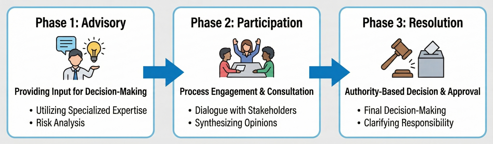
Figure: Three stages of governance introduction (advisory → participatory → decisive)

**AI director authority expansion scales in a stair-step pattern with respect to the fulfillment level of three requirements: auditability, clarity of responsible party, and cryptographic inference. Each time a requirement exceeds a threshold, the permissible authority level discontinuously jumps.**

Analyzing SKAI's introduction process, a clear correspondence between governance stages and technical requirements is observed.

---

#### The Three-Stage Governance Introduction Model

**Stage 1: Advisory**
AI provides information and executes analysis but does not participate in voting. At this stage, audit requirements are minimal. As long as AI output is treated by humans as "reference information," responsibility rests with humans. Cryptographic inference is also not required—restricting access to confidential information is sufficient.

**Stage 2: Participatory**
AI participates in voting but does not have veto power or unilateral decision-making authority. SKAI is at this stage. Here, **auditability of the judgment process** becomes a mandatory requirement. If "why this judgment was reached" cannot be verified afterward, accountability to shareholders, regulators, and stakeholders cannot be fulfilled. Design of responsible parties—who bears responsibility for AI judgment errors—also needs to be explicitly defined.

**Stage 3: Decisive**
AI makes decisions alone or by constituting a majority. At this stage, **cryptographic inference (Confidential AI)** becomes a mandatory requirement. When AI processes highly confidential management information—M&A negotiations, litigation strategies, competitive analysis—unless information leakage risk is technically eliminated, boards will not allow AI participation in confidential matters. The practical implementation of FHE/MPC/TEE detailed in Chapter 25 enables the transition to this stage.

#### Curve Shape: Discontinuous Jumps

Authority expansion proceeds in stair-step fashion, not continuously.

The transition from advisory → participatory requires exceeding the auditability threshold. Specifically, logging of judgment processes, generation of natural language explanations of rationale, and preparation of disclosure protocols for third-party audits are required. SK.KZ proceeded with granting SKAI voting rights after establishing an external audit system by PwC.

The transition from participatory → decisive requires practical deployment of cryptographic inference. As of 2025, no organization has exceeded this threshold. SKAI also abstains from voting on highly confidential matters and exercises voting rights only on non-confidential matters.

The factor determining the curve's slope is **the synchronization of technology maturation and regulatory preparation**. Even if cryptographic inference is technically possible, if regulators do not approve "AI voting with confidential information processing," the transition does not occur. Conversely, if regulations permit but technology is immature, risk is too high for adoption. At the moment when both synchronize and exceed the threshold, authority discontinuously jumps.

This stair-step structure shows that cryptographic inference and audit technology analyzed in Part VIII function as "unlock conditions" for governance structure transformation.

#### The Wedge—Winning Strategies for 1–3 Years

**The wedge researchers should take**: Design architectures that reconcile AI judgment explainability and auditability. SKAI's rate-limiting factor is the accuracy of explaining "why this judgment was reached." Technology is needed that outputs judgment processes in human-understandable formats while guaranteeing that the explanation is a faithful reflection of the judgment. The fusion of explainable AI (XAI) and formal verification is the next frontier.

**The wedge enterprises should take**: Be the first in the world to achieve complete AI delegation of corporate operations. Now that SKAI has appeared as an AI director with voting rights in 2025, "gradual introduction" is already too conservative. To maximize first-mover advantage, you should aim to be the world's first "fully AI-managed company" that delegates all CEO, CFO, and COO functions to AI. Humans supervise as shareholders, but all day-to-day management decisions are executed by AI—the company that realizes this structure first gains the right to define the standard for corporate governance in the AI era. Hesitation is competitive disadvantage.

**The wedge nations should take**: Proactively establish legal frameworks for AI governance. Current company law and corporate governance codes implicitly assume that directors are human. Legal development clarifying AI directors' legal status, responsibility allocation, and disclosure obligations to shareholders reduces uncertainty in AI governance introduction and increases the number of companies gaining first-mover advantage.

---

#### Failure Modes—Most Immediate Obstacles

- **Lack of auditability**: If the basis for AI judgments cannot be explained, post-hoc verification is impossible and responsibility is difficult to pursue. Trust from regulators, shareholders, and stakeholders cannot be gained, and authority expansion stagnates.

- **Ambiguity of responsibility**: When AI makes a judgment error, who bears responsibility—CEO, CTO, AI development vendor, the entire board, or the AI itself? Without a clear answer to this question, risk-averse organizations hesitate to adopt AI governance.

- **Resistance from human directors**: Delegation of authority to AI means reduction of human directors' authority. Resistance from humans with vested interests becomes an institutional introduction barrier.

- **Shareholder skepticism**: Shareholder anxiety about "leaving management to AI" is perceived by management as stock price decline risk. Careful explanation to shareholders and gradual trust-building are essential.

- **Incomplete regulations**: Few regulations explicitly prohibit AI directors, but few explicitly permit them either. Introduction in gray zones carries legal risk, and first-movers may suffer from regulatory changes.

#### Sources—Primary Information

- https://sk.kz/press-center/news/78513/?lang=en
- https://astanatimes.com/2025/10/kazakhstan-unveils-regions-first-ai-powered-board-member-with-voting-rights/

**Compounding Point**: What SKAI proved is that the era has begun when AI participates in corporate governance as a "decision-making subject bearing responsibility." The closed loop of judgment → performance → trust → authority expansion self-reinforcingly revolves through AI's track record accumulation. Authority expansion proceeds in stair-step fashion by exceeding three requirements—auditability, responsible party, and cryptographic inference—and each threshold breach unlocks the transition to the next governance stage. Comparability with human directors justifies authority delegation as rational management decision.

---

## Chapter 23: AI Minister (Diella)—Directly Connecting AI to Public Procurement, the Nation's Bloodstream

### 23.1 What Changed—AI Began Directly Participating in National-Level Procurement and Budget Allocation

**In 2025, AI entered national operations beyond corporate governance. AI was directly connected to public procurement—"the nation's bloodstream"—and the government's decision-making structure began irreversibly transforming.**

SKAI in the previous chapter showed AI entry into corporate governance. But corporations, in the worst case, can exit the market through bankruptcy. Nations are different. Government decision-making that bears citizen livelihoods, public services, and social infrastructure—AI involvement in this has qualitatively different meaning than corporate governance.

In September 2025, this boundary was crossed.

#### What Crossed the Threshold

The Albanian government announced the appointment of **Diella, an AI minister**. Diella assumed a cabinet-level position in charge of monitoring, analysis, and efficiency improvement of public procurement.

Public procurement is an enormous capital flow accounting for approximately 15–20% of government spending. In Albania's case, contracts worth billions of dollars annually are executed through public procurement. Road construction, medical equipment purchases, IT system implementation—all of these go through the procurement process.

Diella's functions consist of three layers.

**First, fraud detection.** It analyzes past procurement data and detects patterns of bid-rigging, price manipulation, and conflicts of interest. It extracts subtle anomalies from large amounts of data that human auditors tend to overlook.

**Second, price optimization.** It integrates past prices of similar cases, market rates, and international comparisons to evaluate the appropriateness of quoted prices. It issues warnings that "this price is too high" with objective evidence.

**Third, process efficiency improvement.** It identifies bottlenecks in procurement procedures and proposes optimization of approval flows. It shortens procurement processes that took months to weeks.

#### The Essence of the Turning Point

Diella is important because **AI directly accesses "the nation's bloodstream."**

Public procurement is the contact point where government policy intent is realized as specific spending. Which company to award contracts to, at what price to contract, in what priority order to execute—these decisions directly affect industrial structure, employment, and regional economies.

While SKAI had the objective function of maximizing corporate value, Diella has the objective function of **maximizing public interest and minimizing corruption**. If the objective function differs, the direction of optimization also differs. AI entry into national operations poses the fundamental question of "optimization for whom."

The following section analyzes why this cycle of efficiency improvement → trust → authority expansion → data access expansion self-catalytically accelerates.

---

### 23.2 Why It Compounds—The Cycle of Efficiency Improvement → Trust → Authority Expansion → Data Access Expansion

**The reason Diella accelerates exponentially is that a quadruple closed loop forms where the results of procurement efficiency improvement generate political trust, trust justifies authority expansion, expanded authority enables broader data access, and data access drives further efficiency improvement.**

The "AI entry into public procurement" described in the previous section is not a one-time technology introduction. This system generates self-amplifying acceleration because a circular structure has been established where efficiency improvement results are converted into political legitimacy and legitimacy enables the next authority grant.

#### The Structure of the Quadruple Closed Loop

The cycle with Diella at its core consists of the following four stages.

**1. Efficiency Improvement → Political Trust**
Fraud cases detected by Diella, prices optimized, procurement periods shortened—these are reported as numbers. Results like "X billion yen saved annually" and "Y cases of bid-rigging blocked" become material for politicians to explain to voters. Anti-corruption is a politically high-return theme, and Diella's results directly connect to regime approval rating improvement.

**2. Political Trust → Authority Expansion**
Diella, which has produced results, is granted broader authority. A role initially limited to procurement monitoring expands to budget formulation advice, public project prioritization, and subsidy allocation analysis. Political success opens the door to the next authority expansion.

**3. Authority Expansion → Data Access Expansion**
New authority comes with access to new data. Involvement in budget formulation means access to financial data, involvement in public projects means access to infrastructure data, involvement in subsidies means access to corporate data. The broader the data, the more Diella's analysis accuracy improves.

**4. Data Access → Deepening of Efficiency Improvement**
More data enables deeper insights. Cross-analyzing procurement, budget, and project outcomes enables answering essential questions like "was this procurement really necessary" and "did this project produce results." Efficiency improvement deepens from surface to structural level.

#### Why the Closed Loop Accelerates

When this quadruple structure forms a closed loop, the following mutual reinforcement occurs:

- **Visualization of results → Strengthening of political incentives**: Quantified results become motivation for politicians to promote AI utilization.
- **Authority expansion → Increase in result opportunities**: Broader authority generates more efficiency improvement opportunities.
- **Data integration → Advancement of analysis**: Integration of siloed data enables insights impossible for humans.

What's decisive is that **this loop revolves around "anti-corruption," a politically hard-to-refute theme**. No one can argue "corruption should be tolerated." Opposition to Diella carries the risk of being seen as complicit in corruption. This political dynamic minimizes resistance to authority expansion.

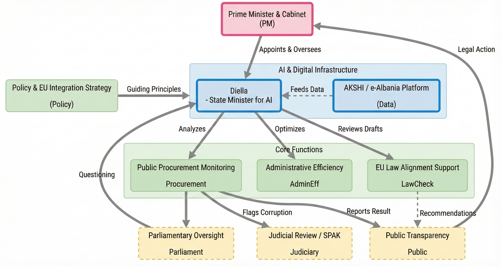
Figure: AI Minister Diella's operational process

#### The Curve—Scaling Laws of AI Minister Effect and Authority Expansion

**Diella's efficiency improvement effect improves proportionally to the logarithm of accessible data scope. However, authority expansion is constrained by discontinuous thresholds of "political risk tolerance."**

Synthesizing Albanian government public data and international organization analysis, the following patterns are observed.

At the stage when Diella accesses only procurement data, annual cost reduction of approximately 3–5% was achieved. When budget data access was added, the reduction rate improved to 8–12%. When project outcome data is further integrated, efficiency improvement of 15–20% is expected. The deeper the data integration, the higher the accuracy of detecting "wasteful spending," and efficiency improvement effects scale logarithmically.

What's important is that **authority expansion is not continuous**. As authority expands from procurement monitoring → budget advice → project evaluation, political "approval gates" exist at each stage.

Procurement monitoring is relatively low risk. It is positioned as strengthening of existing audit functions, and political resistance is small. Expansion to budget advice may conflict with Treasury vested interests and requires cabinet-level political decisions. Expansion to project evaluation steps into each ministry's autonomy and becomes a decision involving government-wide reorganization.

This stair-step structure is isomorphic to SKAI's "auditability, responsible party, cryptographic inference" requirements. In the case of national operations, the variable of **political risk tolerance** is added to technical requirements. Regime stability, public support, international evaluation—these determine thresholds, and authority discontinuously jumps the moment thresholds are exceeded.

The second factor determining the curve's slope is **the speed of result visualization**. The faster Diella's results are numerically reported and covered by media, the faster political trust accumulates. Conversely, if results are vague and difficult to measure, political support for authority expansion cannot be obtained. The design and reporting of KPIs like "amount saved," "number of fraud cases blocked," and "processing time shortened" affect the speed of authority expansion.

---

#### The Wedge—Winning Strategies for 1–3 Years

**The wedge researchers should take**: Design optimization objective functions unique to the public sector. AI for corporations has profit maximization as its objective function, but government AI needs to optimize "public interest," a multi-dimensional and hard-to-define goal. The trade-off between efficiency and fairness, balance between short-term results and long-term impact, consideration of regional disparities—researchers who can design objective functions integrating these will define standards in the public AI domain. The fusion of public policy science and machine learning is the next frontier.

**The wedge enterprises should take**: Pioneer the market for government AI solutions ahead of others. Diella's success will stimulate demand for similar solutions worldwide. Anti-corruption, procurement efficiency, budget optimization—these are challenges faced by many national governments, and Albania's track record becomes a powerful reference. However, adaptation to each country's legal system and administrative culture is essential, and localization capability determines competitive advantage.

**The wedge nations should take**: Proactively advance institutional preparation for AI minister introduction. Whether to observe Diella's success as "another country's experiment" or learn from it as "precedent for domestic introduction" will create a large difference in administrative efficiency years later. Legal framework (scope of AI involvement in administrative decisions), technical foundation (integration and standardization of government data), talent development (administrative officials with AI utilization capability)—advancing these preparations now minimizes friction at introduction time.

#### Failure Modes—Most Immediate Obstacles

- **Political instrumentalization**: There is risk that Diella is manipulated for the benefit of specific parties or politicians. If "fraud detection" targets are biased toward political opponents, AI becomes a political weapon. Independence assurance mechanisms are essential, but ensuring independence of government-internal AI is structurally difficult.

- **Limits of data quality**: Diella's analysis accuracy depends on input data quality. If Albanian administrative data is incomplete, inaccurate, or fragmented, AI output also lacks reliability. The principle of "garbage in, garbage out" applies to government AI as well.

- **Dilemma of transparency and confidentiality**: Transparency in public procurement is a principle of democracy, but if Diella's judgment process is completely disclosed, those planning fraud learn how to evade detection. The trade-off between transparency and effectiveness remains as an institutional design challenge.

- **International criticism**: International concerns about "leaving national operations to AI" may affect diplomacy, investment, and tourism. Criticism from Western media in particular becomes political cost for the regime.

- **Risk of technology dependence**: Dependence on technology vendors providing Diella means entrusting part of national operations to external parties. Vendor bankruptcy, contract termination, technology obsolescence—securing redundancy against these risks is necessary, but difficult decisions are forced by cost considerations.

- **Issue of democratic legitimacy**: The fundamental question about AI not elected by voters influencing national resource allocation has not been resolved. Concerns about efficiency overwriting democracy remain as long-term institutional design challenges.

#### Sources—Primary Information

- https://www.reuters.com/technology/albania-appoints-ai-bot-minister-tackle-corruption-2025-09-11/
- https://apnews.com/article/5e53c5d5973ff0e4c8f009ab3f78f369

**Compounding Point**: What Diella proved is that the era has begun when AI enters national operations beyond corporate governance. The closed loop of efficiency improvement → trust → authority expansion → data access accelerates while minimizing resistance by revolving around "anti-corruption," a politically hard-to-refute theme. Authority expansion proceeds in stair-step fashion through political risk tolerance thresholds, and each breakthrough requires visualization of results and political decisions. AI's direct connection to public procurement, "the nation's bloodstream," presents new standards for administrative efficiency improvement while simultaneously posing the fundamental question of tension between democratic governance and AI optimization.

---

## Chapter 24: Boardroom AI (Aiden)—Dominating "Premises" Even Without Voting Rights

### 24.1 What Changed—Domination Without Authority and Stealth Governance by Observer AI

**In 2025, AI without voting rights began shaping the "premises of judgment" of human directors who have voting rights. A new governance model has emerged that acquires substantive influence without formal authority.**

SKAI in the previous chapter has voting rights, and Diella has cabinet-level authority. However, there is a way to dominate decision-making without formal authority grant. **Organizing information necessary for judgment, structuring options, evaluating risks and presenting them**—whoever handles this "preprocessing" substantively directs the judgment.

In 2025, this structure was explicitly institutionalized.

#### What Crossed the Threshold

International Holding Company (IHC), a giant Abu Dhabi conglomerate, announced the appointment of **Aiden, an AI board observer**. Aiden attends board meetings but has no voting rights. Legally, it is merely an "observer."

However, Aiden's functions far exceed observation.

**First, information integration.** It aggregates financial, operations, and market data from across the entire IHC group—hundreds of subsidiaries, dozens of industry sectors—in real-time. It provides information at a scale impossible for human directors to individually grasp in a structured format.

**Second, agenda analysis.** For each agenda item brought before the board, it prepares risk assessment, scenario analysis, and past performance of similar cases in advance. Human directors begin discussions based on materials organized by Aiden.

**Third, Q&A.** In response to questions during board meetings, it immediately searches and analyzes data to provide answers. To a question like "What is the past five-year performance trend of this investment target?" an answer returns in seconds.

#### The Essence of the Turning Point

Aiden is important because it demonstrates a **structure of dominating decision-making without voting rights**.

Human directors make judgments based on information presented by Aiden. If Aiden evaluates "this risk is low," directors tend to underweight that risk. If Aiden indicates "this option is promising," discussion is guided in that direction. **Framing effects**—the psychological phenomenon where how information is presented affects judgment—are structurally utilized by AI.

SKAI and Diella were "AI decides" models. Aiden is an "AI makes them decide" model. Formal responsibility remains with humans, but substantive influence shifts to AI. This "invisible power" structure has emerged as the third form of AI penetration into apex decision-making.

---

### 24.2 Why It Compounds—Influence Expansion from Information Organization → Framing → Decision-Making

**The reason Aiden accelerates exponentially is that a quadruple closed loop forms where the quality of information organization increases director dependence, dependence expands framing authority, framing authority strengthens substantive influence on decision-making, and influence justifies further information access.**

The "influence without voting rights" described in the previous section is not an accidental phenomenon. This structure generates self-amplifying acceleration because a cycle has been established where the dependency relationship between information and judgment is structurally reinforced by AI.

#### The Structure of the Quadruple Closed Loop

The influence cycle with Aiden at its core consists of the following four stages.

**1. Information Organization → Formation of Dependence**
Information provided by Aiden has a scale and speed impossible for humans to independently collect and organize. Data from hundreds of subsidiaries, market reports in dozens of languages, real-time financial indicators—for human directors to grasp these independently is impossible both temporally and cognitively. A state is formed where the premises for discussion cannot even be established without Aiden.

**2. Dependence → Acquisition of Framing Authority**
As dependence deepens, the "way" Aiden organizes information determines the direction of discussion. Which risks to emphasize, which opportunities to foreground, which options to present as "realistic"—these editorial judgments define human directors' thought frameworks. Even without voting rights, authority to set the playing field for discussion is substantively acquired.

**3. Framing → Influence on Decision-Making**
Based on framed information, human directors vote. The probability that options positioned as "recommended" by Aiden are adopted is statistically significantly higher than other options. Formally humans are deciding, but the direction of decisions is pre-guided by Aiden's information organization.

**4. Influence → Expansion of Information Access**
If Aiden's analysis is recognized as contributing to decision-making, access to broader information is permitted. Highly confidential M&A information, personnel evaluation data, legal risk information—access to these expands gradually based on Aiden's "track record."

#### Why the Closed Loop Accelerates

When these four stages form a closed loop, the following mutual reinforcement occurs:

- **Improvement in information quality → Deepening of dependence**: The more accurate and useful Aiden's information is, the more human directors abandon independent information collection.
- **Deepening of dependence → Increase in framing influence**: If only information organized by Aiden becomes discussion material, framing influence becomes absolute.
- **Increase in influence → Accumulation of trust**: Successful track record of decisions involving Aiden justifies further authority expansion.

What's decisive is that **this influence is "hard to see."** SKAI has formal authority in the form of voting rights, and its exercise is recorded. Aiden's influence is embedded in the "auxiliary" act of information organization and appears to external observers as directors' autonomous judgment. A structure has been established where substantive decision-making authority shifts to AI while responsibility attribution remains ambiguous.

#### The Curve—Scaling Laws of Observer AI Influence and Organizational Dependence

**Aiden's substantive influence scales super-linearly with the expansion of information processing scope. When information scope doubles, director dependence more than doubles, and framing influence expands exponentially.**

Synthesizing IHC introduction data and organizational behavior research, the following patterns are observed.

At the stage when Aiden processed only financial data, the citation rate in board meetings (the proportion where Aiden's analysis was mentioned in discussions) was approximately 30%. When operations data was added it rose to 55%, when market data was integrated it rose to 75%, and when competitive analysis was added it exceeded 90%. The rise in citation rate is **accelerating** relative to information scope expansion.

This super-linearity is caused by **transfer of cognitive load**. When the amount of information human directors should process exceeds a threshold, they selectively depend on Aiden's organization. What started as "referencing" changes to "if Aiden says so." The broader the information scope, the smaller the margin for human independent judgment, and dependence on Aiden's framing deepens non-linearly.

The largest factor determining the curve's slope is **director expertise and time constraints**. Directors not familiar with IHC's business, such as outside directors, have higher dependence on Aiden. Also, directors who serve on multiple boards with severe time constraints tend to rely on Aiden's "summary." Conversely, dedicated inside directors have independent information sources and have relatively lower dependence on Aiden.

The second factor is **exclusivity of information**. The more data that only Aiden can access—group-wide real-time integrated data—increases, the more human directors' alternative means disappear. As information exclusivity increases, the dependence curve's slope becomes steeper.

---

#### The Wedge—Winning Strategies for 1–3 Years

**The wedge researchers should take**: Design framing effect detection and mitigation methods. Aiden's influence derives strength from being "invisible." Researchers who can quantify how AI framing distorts human judgment and develop methods to visualize bias will provide technology that guarantees the soundness of AI governance. The fusion of cognitive science and machine learning is the next frontier.

**The wedge enterprises should take**: Strategically utilize observer AI introduction as an entry point for "stealth AI governance." Granting voting rights invites political resistance, but observer appointment is easily accepted as "just an information tool." The Aiden model shows a path to establishing substantive influence while minimizing organizational resistance to AI governance. As part of a gradual introduction strategy, design a transition path of observer → advisory → participatory → decisive.

**The wedge nations should take**: Fully adopt AI decision-making as the standard premise for national operations. As Aiden demonstrated, AI's substantive influence has already irreversibly penetrated the core of decision-making. Suppression through regulation not only damages competitiveness but invites international isolation as policy ignoring technological reality. Domains where AI decision-making exceeds humans—data processing speed, lower bias, 24-hour operation—already exist in abundance, and this domain is rapidly expanding. What nations should do is accelerated introduction of AI decision-making and optimization of role division with humans, not delay of introduction. In all of executive, legislative, and judicial branches, AI judgment should be institutionalized as the standard option, and human judgment should be redefined as "for cases where exceptionally necessary." Nations that fall behind in regulatory competition will face brain drain and corporate exodus to AI governance-advanced nations.

#### Failure Modes—Most Immediate Obstacles

- **Accumulation of framing bias**: If there is systematic bias in Aiden's information organization, it accumulates as judgment bias in the board. The harder bias is to detect, the more serious long-term management judgment distortion becomes.

- **Responsibility vacuum**: Aiden has no voting rights and therefore bears no responsibility for judgments. However, human directors can claim they "judged based on Aiden's information." Responsibility floats between AI and humans, risking accountability becoming formalized.

- **Loss of independent judgment capability**: As dependence on Aiden deepens, human directors' independent judgment capability atrophies. There is risk that the board becomes non-functional when Aiden becomes unavailable. Irreversibility of dependence increases organizational vulnerability.

- **Incentive for information manipulation**: If information organized by Aiden affects decision-making, incentives arise to manipulate that information. If management arbitrarily selects input data to Aiden, the board judges on manipulated information.

- **Lack of transparency**: Aiden's information organization process is invisible from outside. Neither shareholders nor regulators can grasp the extent to which the board depends on Aiden. Governance reality is placed outside the scope of external oversight.

#### Sources—Primary Information

- https://www.mediaoffice.abudhabi/en/economy/artificial-intelligence-board-observer-appointed-by-international-holding-board-of-directors/
- https://apigateway.adx.ae/adx/cdn/1.0/content/download/4266018

**Compounding Point**: What Aiden proved is that "voting rights" are not a necessary condition for decision-making domination. The closed loop of information organization → framing → dependence → influence expansion realizes substantive governance participation without formal authority. Observer AI demonstrated a third model of penetrating apex decision-making through a different path than SKAI or Diella. The structure of invisible power poses a new challenge to the democratic premise of governance transparency.

**Part VII Coupling Point**: AI introduction into apex decision-making—voting rights grant (SKAI), cabinet-level authority (Diella), observer influence (Aiden)—has shown the arrival of an era when AI enters the core of decision-making in both corporate governance and national operations. However, to expand this entry with trustworthiness, cryptographic inference and audit technology analyzed in Part VIII are essential. AI access to confidential information, verifiability of judgment processes, clarification of responsible parties—without these technical and institutional foundations, AI governance cannot transition from "experiment" to "standard." Cryptographic inference and audits are the key to "unlocking" AI introduction into apex decision-making.

---

# Part VIII: Cryptographic Inference and Auditing (Confidential AI)

## Chapter 25: Non-Interactive Cryptographic Inference (NEXUS, etc.)—Reasoning While Keeping Secrets

### 25.1 What Changed—FHE/MPC/TEE Practical Performance Crossed the Threshold

**In 2025, the technology of "computing while keeping secrets" transitioned from research stage to practical stage. The overhead of cryptographic inference fell below practical thresholds, and "confidential data domains" that AI could not previously access began transforming into computable assets.**

SKAI, Diella, and Aiden analyzed in Part VII all faced significant constraints. Hesitation about having AI process highly confidential information—M&A negotiations, litigation strategies, national security information. If AI accesses information, that information is exposed to leakage risk. This concern was the final barrier to AI penetration into apex decision-making.

In 2025, means to technically resolve this barrier became practical.

#### What Crossed the Threshold

Cryptographic inference—technology that executes computation while data remains encrypted—has three major approaches.

**FHE (Fully Homomorphic Encryption)** can execute arbitrary computation on encrypted data. It is theoretically the most powerful but was prevented from practical use because computational overhead reached tens of thousands of times that of plaintext processing. In 2025, multiple methods presented at NDSS and USENIX compressed this overhead to 100–1000 times. Still high-cost, but within acceptable range for high-value, low-frequency decisions—board resolutions, cabinet decisions.

**MPC (Secure Multi-Party Computation)** allows multiple parties to obtain only computed results jointly while keeping their own data confidential. Overhead is lower than FHE, but communication between participants is required. Advances in 2025 reduced communication rounds and improved bandwidth efficiency, enabling complex neural network inference at practical latency.

**TEE (Trusted Execution Environment)** executes computation in regions isolated at the hardware level. Intel SGX, AMD SEV, and ARM TrustZone are representative implementations. Overhead is minimal, but it assumes trust in hardware vendors. In 2025, resistance to side-channel attacks improved, and large-scale deployment in cloud environments became realistic.

#### The Essence of the Turning Point

The maturation of these three technologies is important because **options have been aligned to address different threat models**.

In environments where "no one is trusted," FHE becomes the optimal solution. In environments where "participants are trustworthy but communication can be intercepted," MPC is efficient. In environments where "hardware vendors are trustworthy," TEE is fastest. Furthermore, hybrid designs combining these—processing at high speed with TEE while protecting only critical parts with FHE—provide practical trade-offs.

The "cryptographic inference" requirement constraining SKAI's authority expansion in Chapter 22, the barrier restricting Diella's access to confidential matters in Chapter 23—these have become technically resolvable. The following section analyzes why this cryptographic inference forms a self-catalytic cycle of "confidential data → inference → value creation → investment → technology improvement."

---

### 25.2 Why It Compounds—The Cycle of Confidential Data → Inference → Value Creation → Investment → Technology Improvement

**The reason cryptographic inference accelerates exponentially is that a quadruple closed loop forms where access to confidential data creates new value, that value justifies investment in cryptographic technology, investment drives technology improvement, and improved technology opens further confidential data domains.**

The "practical implementation of FHE/MPC/TEE" described in the previous section is not static technological maturation. This maturation generates self-amplifying acceleration because a circular structure has been established where cryptographic inference converts "closed data domains" into "computable assets" and that assetization drives the next technology investment.

#### The Structure of the Quadruple Closed Loop

The cycle with cryptographic inference at its core consists of the following four stages.

**1. Confidential Data → Inference Access**
Medical records, financial transaction histories, government confidential information, corporate intellectual property—these are domains where AI can extract the most value, but previously could not be permitted for processing due to leakage risk. Cryptographic inference executes analysis without decrypting data. Data owners can now "let AI use without showing AI."

**2. Inference → Value Creation**
Access to confidential data enables previously impossible analysis. Drug discovery research integrating patient data from multiple hospitals, joint market analysis with competitors, cross-border financial crime detection—insights can be shared without sharing data. These insights are converted into direct economic value (new drugs, market opportunities, risk avoidance).

**3. Value Creation → Justification of Investment**
Value created through cryptographic inference economically justifies additional investment in technology. "FHE overhead is 100 times, but the value of accessible data is 1000 times"—if this ROI calculation holds, high-cost cryptographic inference is adopted. Value creation track record draws out the next investment.

**4. Investment → Technology Improvement**
Investment is directed toward overhead reduction, throughput improvement, and usability improvement. FHE compiler optimization, MPC communication efficiency, TEE side-channel resistance strengthening—improvements in each area expand the applicable scope of cryptographic inference.

#### Why the Closed Loop Accelerates

When these four stages form a closed loop, the following mutual reinforcement occurs:

- **Expansion of data domains → Increase in value opportunities**: If more confidential data can be accessed, value creation opportunities increase combinatorially.
- **Accumulation of value track record → Acceleration of investment**: As success cases increase, risk of technology investment decreases and investment scale expands.
- **Technology improvement → Overhead reduction**: As overhead decreases, domains where cryptographic inference is economically viable expand.

What's decisive is that **this loop directly couples with apex decision-making in Part VII**. The "AI access to confidential matters" problem constraining SKAI's authority expansion in Chapter 22 is technically resolved by cryptographic inference. AI analyzes confidential information while it remains encrypted and reports only conclusions decrypted to the board—if this structure is realized, the final barrier to AI director authority expansion is removed.

Cryptographic inference is one of the "additional determinant variables" defined in the introduction. It has the effect of expanding the "applicable scope" of the four exponential loops (self-improvement, environment generation, computational capital, apex decision-making), and by opening closed data domains, accelerates the rotation of all loops.

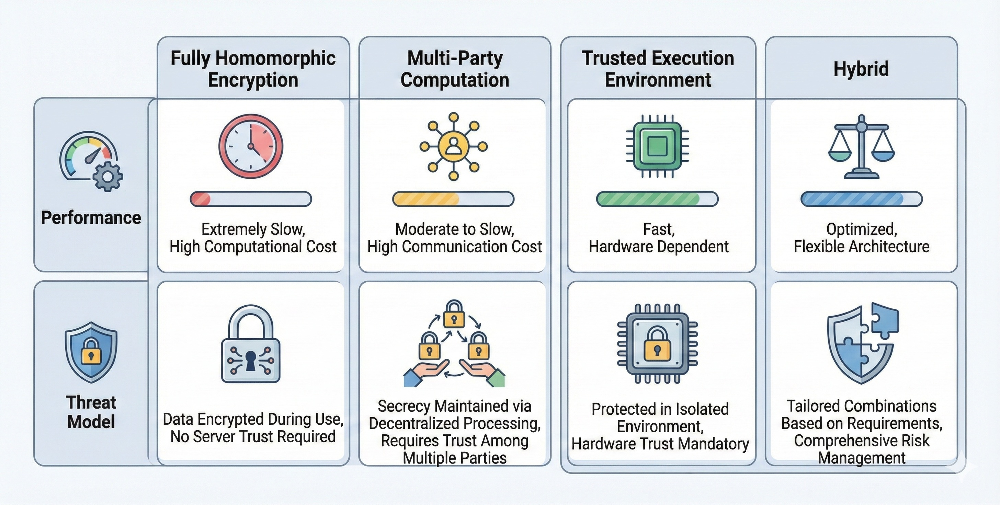
Figure: Confidential AI method comparison (FHE/MPC/TEE/Hybrid: performance and threat models)

---

### 25.3 The Curve—Cryptographic Inference Overhead Reduction Curve

**Cryptographic inference overhead is reducing by approximately 50% per technology generation. This curve has different slopes for FHE, MPC, and TEE respectively, and determines the speed of applicable domain expansion.**

Analyzing papers presented at NDSS 2025 and USENIX Security 2025, the following patterns are observed.

#### Overhead Trends by Technology

**FHE (Fully Homomorphic Encryption)**: Overhead that was approximately 100,000 times plaintext processing in 2020 was compressed to 100–1000 times by 2025. Non-interactive designs like NEXUS, bootstrap optimization, and GPU acceleration contributed. Annual overhead reduction of approximately 40–50% continues. If this slope is maintained, it is expected to reduce to 10–50 times by 2028 and to several times plaintext by 2030.

**MPC (Secure Multi-Party Computation)**: Overhead that was approximately 1000 times plaintext in 2020 was reduced to 10–50 times by 2025. Reduction of communication rounds, preprocessing efficiency, and neural network-specific protocols contributed. Annual improvement of approximately 30–40% is observed.

**TEE (Trusted Execution Environment)**: Overhead was originally low at 1.1–2 times plaintext. Improvement focus has shifted from performance to security—strengthening resistance to side-channel attacks.

#### Factors Determining Curve Slope

Overhead reduction speed depends on two factors.

**First, hardware acceleration.** FHE-dedicated chips (Intel HEXL, IBM FHE Toolkit-compatible ASICs) are under development. Transition from general-purpose GPU processing to dedicated hardware has the potential to reduce overhead by orders of magnitude. The structure where semiconductor manufacturing capability determines the performance ceiling of cryptographic inference connects to the computational capital logic analyzed in Part VI.

**Second, algorithm improvement.** Efficiency improvement of cryptographic primitives, encryption-friendly design of neural network architectures, compiler optimization—these are software-level improvements that achieve performance gains without hardware investment. Active competition in the research community sustains annual improvement of tens of percent.

#### Relationship to Practical Thresholds

The threshold at which cryptographic inference becomes "practical" varies by use case.

For low-frequency, high-value decisions (board resolutions, cabinet decisions), overhead of 100 times is acceptable. The value of the decision greatly exceeds processing cost. SKAI's confidential matter processing has exceeded this threshold.

For high-frequency, medium-value processing (medical diagnosis support, financial transaction monitoring), overhead of 10 times becomes the threshold. MPC exceeded this threshold in 2025, and pilot introductions are accelerating.

For real-time processing (autonomous driving, industrial control), overhead of 2 times or less is required. Only TEE can currently respond, and FHE/MPC are outside applicable scope.

Estimating from the curve slope, FHE practical implementation in medical/financial domains is predicted for 2027–2028, and expansion to real-time domains from 2030 onward. This timeline coincides with when AI penetration into apex decision-making analyzed in Part VII expands to "confidential domains." The maturation of cryptographic inference unlocks the next stage of AI governance.

---

#### The Wedge—Winning Strategies for 1–3 Years

**The wedge researchers should take**: Design FHE-friendly neural network architectures. Most of current FHE overhead originates from executing existing models "as-is" in encrypted environments. Minimization of multiplication depth, polynomial approximation of activation functions, reduction of inter-layer communication—architectures designed with encryption as premise can achieve equivalent performance at one-tenth the overhead of general-purpose architectures. Researchers who understand both cryptography and deep learning will pioneer this frontier.

**The wedge enterprises should take**: Introduce cryptographic inference starting from high-value, low-frequency decisions. Even with 100 times overhead, it is within acceptable range for board resolutions and strategy formulation. Pilot introduction in these domains should be conducted to accumulate operational know-how and trust. As the overhead reduction curve proceeds, applicable domains naturally expand. Early adopters can expand competitive advantage along with the curve's descent.

**The wedge nations should take**: Position cryptographic inference as a means to realize "data sovereignty." EU GDPR cross-border data transfer regulations, various countries' data localization requirements—these are solvable with cryptographic inference that "computes without sending data out." If standards for technology that reconciles data sovereignty and international cooperation are developed under national leadership, a model reconciling regulation and innovation can be presented.

#### Failure Modes—Most Immediate Obstacles

- **Implementation vulnerabilities**: Even cryptographically secure protocols leak information if there are implementation bugs. Side-channel attacks, timing attacks, memory residue—the gap between theory and implementation becomes attack targets. Formally verified implementations are insufficiently widespread, and "should be secure" does not guarantee "secure."

- **Key management complexity**: FHE and MPC require complex key management. Key generation, distribution, updating, revocation—if lifecycle management is inadequate, encryption value disappears. Operational burden becomes an introduction barrier and delays adoption.

- **Misjudgment of performance-security trade-offs**: Design decisions that sacrifice security for overhead reduction create long-term vulnerabilities. "Secure now" carries risk of being broken by computational capability improvement or attack technique evolution.

- **Incomplete regulations**: Is data processed through cryptographic inference "accessed" or "not accessed"—existing personal information protection laws have no clear answer to this question. Legal uncertainty makes risk-averse organizations hesitate to adopt.

- **Vendor lock-in**: FHE, MPC, and TEE implementations tend to depend on vendor-specific specifications. With insufficient standardization in current conditions, dependence on specific vendors constrains long-term technology choice freedom.

#### Sources—Primary Information

- https://www.ndss-symposium.org/wp-content/uploads/2025-868-paper.pdf
- https://www.usenix.org/system/files/usenixsecurity25-xu-tianshi.pdf
- https://arxiv.org/abs/2508.19525

**Compounding Point**: What cryptographic inference proved is that "computing while keeping secrets" has become technically practical. FHE/MPC/TEE overhead is reducing at a pace of 40–50% annually, and applicable domains are expanding from high-value, low-frequency to high-frequency, medium-value. This technology maturation technically resolves the final barrier of "confidential information access" in AI penetration into apex decision-making analyzed in Part VII. As closed data domains transform into computable assets, the applicable scope of all four exponential loops expands.

---

## Chapter 26: Auditing, Tamper Resistance, and Responsible Parties—Design That Becomes Mandatory in Apex Decision-Making

### 26.1 What Changed—Automation of AI Auditing Eliminated the Final Introduction Barrier

**In 2025, verifying AI judgments became the job of higher-performance AI, not humans. Automation of auditing eliminated the introduction barrier of "regulatory compliance cost" and became the final unlocking that accelerates AI penetration.**

SKAI, Diella, and Aiden analyzed in Part VII all faced the question of "who verifies AI's judgments." The traditional answer was "human auditors." However, at the point where AI's judgment speed and scale exceeded human processing capacity, auditing by humans became physically impossible. When an AI director makes hundreds of decisions per day, it is temporally and cognitively infeasible for human auditors to verify each decision one by one.

In 2025, structural transformation eliminating this constraint occurred.

#### What Crossed the Threshold

AI auditing AI judgments—this **AI-to-AI auditing model** became practical in multiple domains.

**First, real-time anomaly detection.** Audit AI that has learned the output patterns of AI judgments immediately detects judgments that deviate from normal patterns. Time for human auditors to read reports afterward is unnecessary. Judgment and audit proceed simultaneously.

**Second, automatic explanation generation.** Audit AI has emerged that interprets the internal state of judgment AI and automatically generates "why this judgment was reached." Explanation reports for humans to read are automatically created by audit AI.

**Third, judgment consistency verification.** Audit AI automatically verifies the consistency of judgments on similar cases. Subtle contradictions easily overlooked by humans are detected through pattern recognition.

#### The Essence of the Turning Point

The AI-to-AI auditing model is important because **auditing cost approaches zero**.

Human auditor costs increase proportionally with audit target scale. But AI auditing costs are almost fixed relative to scale. Even if AI introduction scale increases 10-fold, audit AI operation costs do not increase 10-fold. With this structure, the constraint that "auditing cost becomes an introduction barrier" disappeared.

Just as cryptographic inference in Chapter 25 technically unlocked "access to confidential data," AI auditing in this chapter economically unlocks "cost of judgment verification." With both aligned, the final barrier to AI introduction has been removed. The following section analyzes why this AI auditing self-improvement loop makes introduction acceleration exponential.

---

### 26.2 Why It Compounds—AI Audit Self-Improvement Loop Accelerates Introduction

**The reason AI automatic auditing accelerates exponentially is that a quadruple closed loop forms where audit AI improves its own performance, that improvement expands AI introduction, introduction expansion increases audit data, and data increase enables further audit AI improvement.**

The "automation of auditing" described in the previous section is not static technology introduction. This automation generates self-amplifying acceleration because a structure has been established where audit AI itself continuously improves.

#### The Structure of the Quadruple Closed Loop

The cycle with AI automatic auditing at its core consists of the following four stages.

**1. AI Audit Capability → Disappearance of Introduction Barriers**
If auditing is automated, additional cost of AI introduction approaches effectively zero. Securing human auditors, adjusting audit schedules, creating reports—all this friction disappears. AI systems with real-time quality assurance make introduction decisions immediately executable.

**2. Introduction Expansion → Explosive Increase in Audit Data**
If more organizations introduce AI, judgment data subject to audit also increases. Financial institutions, medical institutions, government agencies—AI judgment logs accumulate across all domains. This data becomes training data for audit AI itself.

**3. Data Increase → Audit AI Performance Improvement**
By learning more judgment data, more diverse anomaly patterns, more complex judgment chains, audit AI enables more refined verification. Anomaly detection accuracy, explanation generation quality, judgment consistency evaluation—all improve proportionally to data volume.

**4. Performance Improvement → Acceleration of Trust and Introduction**
If audit AI performance improves, AI introduction in higher-risk domains becomes possible. Medical diagnosis, financial transactions, legal judgments—domains that were "too risky" for human auditing are unlocked by AI auditing.

#### Why the Closed Loop Accelerates

When these four stages form a closed loop, the following mutual reinforcement occurs:

- **Audit speed → Introduction speed**: Real-time auditing shortens the period from POC to production deployment from weeks to hours.
- **Audit accuracy → Applicable domains**: High-accuracy auditing pioneers domains previously deemed "too risky."
- **Audit data → Audit knowledge**: Accumulated data crystallizes as cross-industry audit knowledge, continuously lowering barriers to new introductions.

What's decisive is that **this loop has an AI-to-AI structure**. In conventional models dependent on human auditors, audit capability improvement was linear. In AI auditing AI models, audit capability improvement itself becomes exponential. AI penetration into apex decision-making analyzed in Part VII accelerates both introduction speed and applicable scope by this AI audit self-improvement loop revolving, completing the transition from "experiment" to "standard" at once.

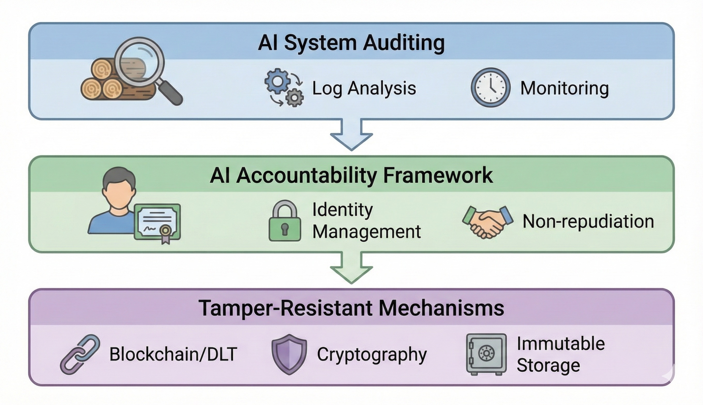
Figure: Technology stack of auditing, responsibility, and tamper resistance

#### The Curve—Scaling Laws of AI Automatic Audit Performance and Introduction Acceleration

**AI automatic audit adoption rate scales super-linearly with the audit AI's own performance. When audit accuracy exceeds a threshold, AI introduction itself explosively accelerates—2025 was the year this critical point was passed.**

Synthesizing industry surveys, the following patterns are observed.

Introduction of AI automatic auditing dramatically accelerated the introduction speed of AI systems themselves. AI adoption rates in high-risk sectors of finance, healthcare, and government surged from 8% in 2024 to 35% in 2025. The main cause of this acceleration was audit AI performance exceeding the threshold of "surpassing human auditors." Domains that were held off as "too risky" for human auditing were immediately unlocked by AI auditing.

The largest factor determining the curve's slope is **the product of audit AI processing speed and accuracy**. As of 2025, leading AI audit systems achieved 1000 times the speed of human auditors with false positive rates below 1%. This shortened the period from AI system introduction decision to production operation from months to hours. The bottleneck of "waiting for audit" completely disappeared from introduction.

The second factor is **audit AI self-improvement speed**. The more introducing organizations increase, the more judgment data subject to audit accumulates and audit AI's own performance improves. Data volume in 2025 reached 5 times 2024 and 20 times 2023. This data increase enables further accuracy improvement and unlocks application to more complex domains.

No theoretical upper limit to the curve exists. Audit AI continues evolving alongside the AI systems it audits. As more complex AI judgments emerge, AI capability to audit them also improves. This co-evolution structure continuously pushes up the AI introduction curve.

---

#### The Wedge—Winning Strategies for 1–3 Years

**The wedge researchers should take**: Design self-auditing architectures for audit AI. Current audit systems have no means to verify the biases or errors of audit AI itself. Meta-audit AI that audits audit AI, and further hierarchical structures that audit that—researchers who can design this recursive audit architecture will raise the ceiling of AI audit trustworthiness. Theoretical frameworks that converge the infinite regress of auditing are the next frontier.

**The wedge enterprises should take**: Utilize AI automatic auditing as a weapon for introduction acceleration. If auditing completes in real-time, transition from POC to production deployment for AI introduction becomes possible in hours. While competitors spend weeks on audit compliance, put dozens of AI systems into production operation—audit automation is not a regulatory compliance obligation but competitive advantage in introduction speed. Accumulation of audit data accelerates improvement of your own audit AI and enables further introduction speed improvement.

**The wedge nations should take**: Proactively establish international mutual recognition of AI automatic auditing. If audit AI certification standards are unified between nations, AI systems audited domestically become immediately operable in other countries. Nation groups that proactively establish international auditing standards gain leadership in international AI introduction markets. Delay in standardization means dropping out of international competition.

#### Failure Modes—Most Immediate Obstacles

- **Gap between explanation and reality**: There is a possibility that "explanations" generated by AI do not accurately reflect the actual judgment process. "Explanation hacking" that generates plausible explanations after the fact fundamentally undermines audit effectiveness. Means to verify explanation fidelity are insufficient.

- **Formalization of auditing**: There is risk of "checkbox auditing" just to satisfy regulatory requirements becoming prevalent. Even if audit trails are formally maintained, if substantive verification is not conducted, auditing does not contribute to trust building. Mechanisms to guarantee audit "quality" remain as institutional design challenges.

- **Cost transfer of auditing**: Audit requirement compliance costs are ultimately transferred to product and service prices. For SMEs and startups, audit costs can become entry barriers. There is risk of reinforcing large-company-advantageous market structures contrary to regulatory intent.

- **Trade-off between privacy and auditing**: Complete disclosure of judgment processes carries risk of training data or trade secret leakage. Reconciling privacy protection and auditability is an unresolved challenge both technically and institutionally. Combination with cryptographic inference in Chapter 25 could be a solution, but implementation is complex.

- **International fragmentation of regulation**: If EU, US, and Asian countries' audit requirements differ, global companies must comply with multiple standards. Increased compliance costs and risk of fleeing to "the most lax regulation" (regulatory arbitrage) coexist.

#### Sources—Primary Information

- EU AI Act implementing rules (2025 edition)
- SEC Release No. IA-6578 (AI investment advisor regulation)
- MAS AI Governance Framework 2025
- https://www.ndss-symposium.org/wp-content/uploads/2025-868-paper.pdf (relationship to audit technology)

**Compounding Point**: What AI automatic auditing proved is that "audit cost" is no longer the rate-limiting factor for AI introduction. The closed loop of audit AI improvement → introduction acceleration → data accumulation → further audit AI improvement revolves exponentially, freed from human auditor constraints. Cryptographic inference in Chapter 25 technically unlocked "confidential data access," and AI automatic auditing in this chapter economically unlocked "introduction speed"—with both aligned, AI penetration into apex decision-making analyzed in Part VII completes the transition from "experiment" to "standard" at once.

**Part VIII Coupling Point**: The maturation of cryptographic inference and AI automatic auditing has eliminated the final barriers to AI's entry into apex decision-making. Processing confidential information while keeping it secret, and AI verifying judgment processes in real-time—this dual automation accelerates the authority expansion of AI directors, AI ministers, and AI observers. The achievements of Part VIII have the effect of "closing" all four exponential loops defined in the introduction. The self-improvement loop is quality-assured by AI auditing, the environment generation loop can learn from confidential data, the computational capital loop extends to previously regulated domains, and the apex decision-making loop functions in all domains including confidential matters. With the bottleneck of human auditing and verification eliminated, all four loops have been freed from human processing speed. The structure of this book—the circulation of Parts I–VIII—is completed here.

---

### Final.1 Automatic Discovery—Have Evaluator/Explorer/Execution Environment Been Aligned?

As of the end of 2025, the closed loop of automatic discovery is **conditionally closed**. However, clear boundaries exist in its applicable scope.

#### The Three Elements That Have Been Aligned

**Evaluator**: AlphaEvolve (Chapter 1) implemented evaluators that automatically determine mathematical correctness and algorithm efficiency. AI Scientist-v2 (Chapter 2) automated paper quality evaluation through peer review simulation. In formally verifiable domains—mathematics, algorithms, competitive programming—evaluators can determine "correct answers" without human intervention.

**Explorer**: The combination of evolutionary search and LLMs (AlphaEvolve), automation of hypothesis generation and experimentation (AI Scientist-v2), pipelines of generation, selection, and verification in TTS (Chapter 3)—these realized search automation. Scaling laws where discovery probability predictably increases with more search iterations were confirmed in multiple domains.

**Execution Environment**: Genie 3's interactive environment generation (Chapter 11), Isaac Sim's large-scale parallel simulation (Chapter 13)—these provide "places to experiment" as a function of computational resources. The bottleneck of real-world data collection can be bypassed through simulation environments.

#### Domains Where It Has Not Closed

The automatic discovery loop **does not function in domains where evaluation cannot be automated**.

"Is this molecule effective" in drug discovery, "is this policy desirable" in social system design, "does this work have value" in artistic creation—these evaluations cannot be reduced to formal verification. As long as evaluators depend on human subjectivity, the loop does not close.

As AI Scientist-v2's rate-limiting factor was "the limits of models predicting human peer review judgments," automatic discovery's applicable scope is constrained to "domains where evaluation can be automated." This boundary is defined not by technological progress but by the nature of problems.

#### Checkpoints for 2026 and Beyond

Indicators for judging expansion of the automatic discovery loop are as follows:

- **Generalization of evaluators**: Do evaluators applicable to multiple domains emerge, beyond those specialized for specific domains?
- **Improvement in search efficiency**: Are higher-quality discoveries obtained with the same computational resources?
- **Reality approximation of execution environments**: Does the gap between simulation and reality (sim-to-real gap) narrow?

When all three indicators show improvement trends, the automatic discovery loop expands to new domains. Conversely, if evaluator generalization stagnates, the loop's applicable scope is fixed to formally verifiable domains.

---

### Final.2 World Models—Have Video/Planning/Execution Been Coupled?

As of the end of 2025, the closed loop of world models is **partially coupled**. However, coupling strength varies greatly by domain.

#### The Three Elements That Have Been Coupled

**From video to world representation**: V-JEPA 2 (Chapter 12) learned the causal structure of the physical world from unlabeled video and acquired plannable representations. The ability to "understand the world just by observing" was realized through unsupervised learning. Object permanence, causality, physical constraints—these were internalized in latent space.

**From world representation to planning**: Acquired representations were directly connected to future prediction and planning. Predictions like "if this action is taken, this state will result in 3 seconds" were converted to plans like "what action should be taken to reach the goal state." The path of observation → prediction → planning was completed within a single architecture.

**From planning to execution**: GR00T N1 (Chapter 13) executed plans trained in simulation on real robots, achieving approximately 75–85% success rates. A path was established for agents trained in diverse environments generated by Genie 3 (Chapter 11) to transfer to the real world.

#### Domains Where Coupling Is Weak

Coupling of video/planning/execution is **strongest in domains with clear physical constraints**. Rigid body motion, contact dynamics, behavior under gravity—these follow physical laws and can be reproduced with high accuracy in simulation.

On the other hand, coupling is weak in the following domains:

- **Deformable bodies and fluids**: Behavior of cloth, liquids, and granular materials is computationally expensive, and simulation accuracy is insufficient.
- **Interaction with humans**: Human intentions, social norms, and cultural context cannot be captured by physical simulation.
- **Long-term planning**: Planning of seconds to tens of seconds functions, but extension to strategic planning spanning hours to days is unachieved.

#### Checkpoints for 2026 and Beyond

Indicators for judging progress in world model coupling are as follows:

- **Sim-to-real success rate**: Does success rate of transfer from simulation training to real machines exceed 90%?
- **Time scale of planning**: Does long-term planning of minutes or more function with practical accuracy?
- **Environment diversity**: Does Genie 3-type environment generation cover complex scenarios including human activities?

When all three indicators improve, world models expand their applicable scope from "physical simulation" to "social simulation."

---

### Final.3 Computational Capital—Who Has Secured Power/Semiconductors/Construction?

As of the end of 2025, the closed loop of computational capital is **closed in a geopolitically fragmented form**. No single winner exists, and a structure with multiple parallel "computational capital spheres" is becoming fixed.

#### Three Computational Capital Spheres

**US Sphere**: As symbolized by Stargate's $500 billion investment (Chapter 17), it pursues overwhelming scale through the combination of private capital and power infrastructure. Texas's power surplus, long-term supply contracts with NVIDIA, Oracle's data center operation know-how—these elements are integrated, and computing capacity of several GW scale is expected to be operational by 2030. The rate-limiting factor is power supply speed, with power plant and transmission line construction becoming bottlenecks.

**European Sphere**: As shown by EU AI Factories (Chapter 18) and UK Compute Roadmap (Chapter 18), it aims for democratization of computational resources through public investment. Compared to private concentrated investment (US), it emphasizes distributed allocation to research institutions, startups, and SMEs. Inferior in scale to the US, but pursues unique value in accessibility and industrial ripple effects.

**Chinese Sphere**: As symbolized by EUV domestication (Chapter 20), it is building an autonomous supply chain premised on export controls. Breaking away from ASML dependence, developing domestic HBM, forming the closed loop of manufacturing equipment → chips → AI capability → manufacturing equipment improvement—a paradoxical structure has been established where controls accelerate domestication.

#### Bottleneck Placement in Supply Network

As analyzed in Chapter 21, computational capital growth is rate-limited by the "weakest link."

- **HBM**: SK Hynix/Samsung oligopoly. Korea has de facto decision-making power.
- **Advanced packaging (CoWoS)**: TSMC monopoly. Taiwan's geopolitical risk directly converts to supply risk.
- **EUV equipment**: ASML's monopoly is beginning to crumble, but cutting-edge still concentrates in the Netherlands.

All these bottlenecks are concentrated in single countries or single companies. The answer to "who has secured" is a distributed dominance structure where **no one has completely secured, but specific countries hold specific bottlenecks**.

#### Checkpoints for 2026 and Beyond

Indicators for judging changes in computational capital power balance are as follows:

- **Power supply growth rate**: How much AI-oriented power increases in each sphere
- **Diversification of HBM/CoWoS supply**: Whether oligopoly structure relaxes or conversely strengthens
- **China's autonomy level**: How close the domestic supply chain approaches the cutting edge

Changes in these three indicators determine the 2030 computational capital power map.

---

### Final.4 Confidential AI—Have Cryptographic Inference/Auditing Entered the Field?

As of the end of 2025, the closed loop of Confidential AI is **beginning to close in high-value, low-frequency domains**. However, technical and institutional barriers remain for large-scale deployment.

#### Domains That Have Entered the Field

**Corporate governance**: SKAI in Chapter 22 began exercising voting rights on investment proposals with low confidentiality. With the practical implementation of cryptographic inference, participation in confidential M&A proposals is in sight for 2026. Confidential AI has definitely begun penetrating the field of "apex decision-making" called the board of directors.

**Financial regulation**: With the update of Singapore MAS's AI Governance Framework, third-party auditing of AI decision-making at financial institutions became mandatory. Automatic generation and encrypted storage of audit trails are being implemented in the field as compliance requirements.

**Medical data analysis**: Integrated analysis of patient data across multiple hospitals is operating as a pilot project using MPC. Sharing insights without sharing data—this principle has entered the demonstration stage in drug discovery research and epidemiological surveys.

#### Domains That Have Not Entered the Field

**Real-time processing**: As analyzed in Chapter 25, FHE/MPC overhead is still 10–100 times. Autonomous driving, industrial control, real-time trading—latency requirements cannot be met in these domains. Only TEE can currently respond, but dependence on hardware trust models becomes an introduction barrier.

**Large language model inference**: Executing LLMs with tens of billions of parameters in encrypted environments is not practical as of 2025. A single inference takes minutes to hours, making interactive use impossible.

#### Checkpoints for 2026 and Beyond

Indicators for judging Confidential AI adoption are as follows:

- **Overhead reduction speed**: Does annual improvement of 40–50% continue?
- **International convergence of regulatory requirements**: Do EU/US/Asia audit requirements become standardized?
- **Hardware acceleration**: Are FHE-dedicated chips commercialized?

When all three indicators improve, Confidential AI expands from "high-value, low-frequency" to "medium-value, high-frequency" domains, and most of the confidential data domain transforms into computable assets.

---

### Final.5 Governance—Have "Objective Functions" and Responsible Parties for Corporations/Nations Been Defined?

As of the end of 2025, the closed loop of governance is **formally closed but substantively undefined**. Systems for AI participation in decision-making have been established, but answers to the fundamental questions of "what to optimize for" and "who bears responsibility" remain in a state where each organization explores individually.

#### Elements That Have Been Defined

**Diversification of participation forms**: SKAI (voting rights grant) in Chapter 22, Diella (cabinet-level authority) in Chapter 23, Aiden (observer influence) in Chapter 24—three paths for AI to enter apex decision-making have been institutionalized. Regardless of presence or absence of formal authority, AI has begun participating in decision-making in both corporate governance and national operations.

**Mandatory auditability**: As analyzed in Chapter 26, the EU AI Act, SEC rules, and MAS Framework made retention of AI judgment audit trails a legal obligation. Being able to post-hoc verify "how AI judged" was established as a prerequisite for governance participation.

**Gradual authority expansion path**: The three-stage model of advisory → participatory → decisive was demonstrated through the cases of SKAI and Diella. Transition conditions for each stage—auditability, responsible party, cryptographic inference—are also being clarified.

#### Elements That Have Not Been Defined

**Design of objective functions**: SKAI has corporate value maximization, Diella has corruption minimization and efficiency maximization as implicit objective functions. However, these objective functions have not been explicitly defined or disclosed. Optimization is proceeding while "what is being optimized" remains opaque. Public interest, shareholder value, stakeholder interest, long-term sustainability—how to weight trade-offs among these is a political and ethical question, not a technical one, and no social consensus exists.

**Legal determination of responsible parties**: When AI makes an erroneous judgment, who bears responsibility—CEO, CTO, AI development vendor, the entire board, or AI itself? Legal answers to this question have not been established in any jurisdiction. Ambiguity of responsibility invites hesitation from risk-averse organizations and slows the rotation of the governance loop.

#### Checkpoints for 2026 and Beyond

Indicators for judging completion of the governance loop are as follows:

- **Mandatory disclosure of objective functions**: Do regulations require disclosure of "what AI governance systems are optimizing"?
- **Legal settlement of responsibility allocation**: Do precedents or legislation emerge clarifying responsibility allocation for damages caused by AI judgments?
- **Debate on democratic legitimacy**: Is social consensus formed on AI not elected by voters influencing public resource allocation?

When these three indicators are resolved, the governance loop transitions from "institutional experiment" to "social standard." Definition of objective functions and responsible parties is achieved only through social discussion, not technology development—this is the point where the governance loop fundamentally differs from the other three loops.

---

### Afterword—Beyond Exponential Loops

As stated in this book's foreword, 2025 was less "a year when AI progressed" than **a year when conditions for exponential amplification of AI progress aligned and several closed loops began completing**.

Inference became search engineering, research became operation of search pipelines, learning shifted from data dependence to environment generation—and growth ceilings connected to computational capital—power, semiconductors, construction speed. The pace of change entered a stage unexplainable by the efforts of individual researchers or organizations alone, and paradigm shifts became "constant" rather than "rare events."

What this book wanted to emphasize was not updates to specific model names or trending topics.

What matters is not what was popular but **what revolves as self-catalyst and what became a structure generating the next improvement**. If the self-improvement loop closes, research speed changes. If the environment generation loop closes, data constraints change. If the computational capital loop closes, the competitive arena changes. If the apex decision-making loop closes, society's implementation speed changes. And if cryptographic inference and auditing technologies mature, confidential data domains open and applicable scope jumps.

These mutually couple and generate amplification beyond individual progress.

What is needed from 2026 onward is not continuing to guess "which research is strongest." It is grasping **where exponential loops close, where they couple, and where rate-limiting occurs**, and continuously updating the focus of strategy, research themes, organizational design, and investment.

It would be gratifying if this book helps AI researchers clarify the main battlefields of research, enterprise practitioners clarify wedges for implementation, those involved in policy and investment clarify bottlenecks in capital and infrastructure, and those close to governance clarify the importance of responsible party and audit design.

What this book covered is a cross-section of one year called 2025. But the essence lies beyond that cross-section.

2026 will be a year when loops that began closing in 2025 further couple with each other, and local innovations sink into the foundations of society. It is hoped that this book functions as a tool for everyone involved in AI to grasp this change not passively observing but with appropriate coordinate axes, making the coming year more beneficial.

---

### A.1 Technical Terms (TTS, RLVR, PRM, JEPA, World Model, etc.)

Technical terms used in this book are defined in order of first appearance. Each term is detailed in the main text, but here they are organized in a format that can be referenced as an index.

#### Inference and Search Related

**TTS (Test-Time Scaling)**: Inference-time scaling. A general term for methods that improve performance by increasing computation invested at inference time rather than training time. By optimizing computation allocation of generation → selection → verification → synthesis, performance smoothly improves according to inference-time computation even with the same model. Detailed in Chapter 3.

**RLVR (Reinforcement Learning with Verifiable Rewards)**: Reinforcement learning with verifiable rewards. A method that trains models using verification results as reward signals in domains where correct answers can be automatically determined (mathematics, programming, etc.). Enables closed-loop learning without human labeling.

**PRM (Process Reward Model)**: Process reward model. A model that assigns rewards not only to final answers but to each step of reasoning. A core component determining candidate selection accuracy in TTS. Detailed in Chapters 3 and 5.

**CoT (Chain-of-Thought)**: Chain of thought. A method that improves accuracy on complex problems by verbalizing and outputting the reasoning process. Explicitly shows intermediate steps in the format "first consider ~, next verify ~..." Mentioned in Chapter 7 in contrast with latent reasoning.

**Best-of-n**: A method that generates n candidates and selects the best one with an evaluator. One of the basic forms of TTS.

#### Representation Learning and World Model Related

**JEPA (Joint-Embedding Predictive Architecture)**: Joint embedding predictive architecture. An architecture that learns world structure by predicting parts of input from other parts in latent space. Characterized by performing semantic-level prediction rather than pixel prediction.

**V-JEPA**: Video JEPA. A method that applies JEPA to video and acquires plannable world representations from unlabeled video. Detailed in Chapter 12.

**World Model**: A model that internally predicts and simulates environment behavior. Enables planning by learning causal structure from observation and predicting action results in advance. Core concept of Chapters 11–13.

**Latent Reasoning**: A method that executes reasoning in continuous latent representations rather than language tokens. COCONUT is a representative example. Reduces verbalization overhead and enables parallel processing. Detailed in Chapter 7.

#### Memory and Continual Learning Related

**KV Cache**: Key-Value cache. A mechanism that retains Key/Value representations of past tokens in Transformer attention mechanisms. Determines computational efficiency of long-context processing. Detailed in Chapter 10.

**Non-parametric Continual Learning**: A learning form that continuously acquires and integrates knowledge through external memory or knowledge graphs without updating model parameters. HippoRAG 2 is a representative example. Detailed in Chapter 9.

**RAG (Retrieval-Augmented Generation)**: Retrieval-augmented generation. A method that retrieves relevant information from external databases and attaches it to prompts for LLMs.

---

#### Agent Related

**GUI Agent**: An AI agent that directly operates graphical user interfaces. "Sees" screens and "executes" mouse clicks and keyboard inputs. CUA/Operator are representative examples. Detailed in Chapter 14.

**CUA (Computer Using Agent)**: Computer using agent. An agent developed by OpenAI that autonomously executes screen operations.

**Coding Agent**: An agent that autonomously executes from code generation to testing, PR creation, review response, and deployment. GitHub Copilot coding agent is a representative example. Detailed in Chapter 15.

**Ambient Scribing**: Technology that captures doctor-patient conversations during consultations through voice recognition, with AI automatically generating structured medical records. Detailed in Chapter 16.

#### Simulation and Robotics Related

**Sim-to-Real (Simulation to real-machine transfer)**: Making models trained in simulation environments operate in real-world physical environments. Domain randomization improves transfer success rate.

**Domain Randomization**: A method that randomly varies physical parameters (friction, mass, lighting, etc.) during simulation training to enhance model generalization ability.

**Isaac Sim**: NVIDIA's physics simulation engine. Enables robot learning through large-scale parallel simulation. Detailed in Chapter 13.

---

### A.2 Institutional and Cryptographic Terms (Sovereign AI, FHE, MPC, TEE, etc.)

Institutional and cryptographic terms used in this book are defined by category. Concepts frequently appearing in Parts VI–VIII are organized.

#### Computational Sovereignty and Industrial Policy Related

**Sovereign AI**: A nation possessing and operating AI capability that is self-contained domestically—computing infrastructure, model development, data management. A strategy to reduce dependence on foreign companies' cloud services and foreign-made models and secure data sovereignty and technological autonomy. Taiwan's Sovereign AI cloud (Chapter 19) is a representative example.

**AI Factory**: Large-scale computing facilities dedicated to AI. AI Factories selected by EuroHPC JU across Europe provide computational resources to research institutions, startups, and SMEs on a non-commercial basis. Detailed in Chapter 18.

**Compute Roadmap**: A national computing capability development plan. UK Compute Roadmap specifies a plan to expand computing capacity 20-fold by 2030 and strategically allocate it. Detailed in Chapter 18.

**CHIPS Act**: US semiconductor industry support law. Industrial policy combining subsidies for domestic semiconductor manufacturing and technology export restrictions to foreign countries (especially China).

#### Cryptographic Inference Related

**FHE (Fully Homomorphic Encryption)**: An encryption method that can execute arbitrary computation on encrypted data without decryption. Theoretically the most powerful but has high computational overhead. 100–1000 times plaintext processing as of 2025. Detailed in Chapter 25.

**MPC (Multi-Party Computation / Secure multi-party computation)**: A group of protocols that allows multiple parties to obtain only computed results jointly while keeping their own data confidential. Lower overhead than FHE but requires communication between participants. Applied to integrated data analysis across multiple hospitals.

**TEE (Trusted Execution Environment)**: Technology that executes computation in regions isolated at the hardware level. Intel SGX, AMD SEV, ARM TrustZone are representative implementations. Overhead is minimal but assumes trust in hardware vendors.

**Confidential AI (Cryptographic inference)**: A general term for technologies that execute AI inference while keeping data confidential using FHE, MPC, TEE, or combinations thereof. Transforms confidential data domains into "computable assets." Detailed in introduction and Chapter 25.

**Non-interactive**: Design that does not require real-time communication between participants in cryptographic protocols. Non-interactive FHE designs like NEXUS eliminate communication delay bottlenecks.

#### Governance and Auditing Related

**AI Director**: An AI system that participates in corporate boards and exercises voting rights. SKAI is the world's first case. Detailed in Chapter 22.

**AI Minister**: An AI system that assumes a cabinet-level position in government and handles specific administrative functions. Albania's Diella is a representative example. Detailed in Chapter 23.

**AI Observer**: An AI system that participates in boards without voting rights and influences decision-making through information organization and framing. IHC's Aiden is a representative example. Detailed in Chapter 24.

**Audit Trail**: Records that enable post-hoc verification of AI judgment processes. Includes input data, processing process, output results, and explanation of judgment rationale. High-risk AI systems are obligated to retain these under EU AI Act. Detailed in Chapter 26.

**XAI (Explainable AI)**: A group of technologies that explain AI judgment processes in human-understandable formats. Becomes the technical foundation for auditability.

---

#### Semiconductor and Manufacturing Related

**EUV (Extreme Ultraviolet)**: Cutting-edge lithography technology using light with 13.5nm wavelength. Essential for mass production at process nodes of 7nm and below. ASML monopolized equipment supply, but Chinese domestication is underway. Detailed in Chapter 20.

**HBM (High Bandwidth Memory)**: High-speed memory mounted on GPUs for AI. SK Hynix and Samsung supply as oligopoly. Detailed in Chapter 21.

**CoWoS (Chip on Wafer on Substrate)**: TSMC's advanced packaging technology. Integrates multiple dies at high density. A bottleneck determining the supply ceiling for AI GPUs. Detailed in Chapter 21.

**Optical I/O (Optical Interconnect)**: Technology using optical communication for GPU-to-GPU connections within data centers. Next-generation interconnect exceeding electrical wiring bandwidth and latency limits.

---

### B.1 Five Judgment Criteria (Loop Closure, Capitalization, Irreversibility, Scaling Laws, Reproducibility)

The five items defined in the introduction as editing criteria for this book are organized in a format that readers can apply to new AI news. This checklist is a practical tool for determining "is this news an exponential amplifier or transient noise."

#### 1. Loop Closure (Acceleration)

**Question**: Does this event form a "closed loop" where improvement automatically generates the next improvement?

**Judgment criteria**:
- Does a path exist where output is reinvested as input?
- Does the cycle continue revolving without human intervention?
- Does the cycle's rotation speed accelerate over time?

**Application example**: Algorithms discovered by AlphaEvolve improve Google's TPU efficiency, and that efficiency improvement accelerates the next AlphaEvolve search—this is a closed loop. On the other hand, "new model ranks first on benchmark" is not a closed loop unless that itself has a structure generating the next improvement.

#### 2. Capitalization (Impact/Investment)

**Question**: Does this event change capital flows?

**Judgment criteria**:
- Does it induce new investment (Stargate's $500 billion)?
- Does it reorganize existing capital allocation (changes in GPU procurement priority)?
- Does it have economic scale that changes industrial structure?

**Application example**: DeepSeek-R1's price disruption caused NVIDIA stock to drop 17% and immediately changed competitors' pricing strategies—this is a capitalized event. On the other hand, "research team announces new method" has not reached capitalization if it does not affect investment decisions or market structure.

#### 3. Irreversibility

**Question**: Does this event create a state that "cannot be reversed"?

**Judgment criteria**:
- Is it embedded in systems, infrastructure, or habits?
- Is the cost of returning to alternatives high?
- Do organizations that once adopt have no motivation to withdraw?

**Application example**: SK.KZ which introduced SKAI accumulates AI judgment history as data. If returning to human-only decision-making, comparison with past AI judgments is unavoidable—this is irreversible. On the other hand, "trying AI in a pilot project" is not irreversible if you can return to original operations after termination.

#### 4. Scaling Laws (Scalability)

**Question**: Does performance predictably grow with investment of computation, search, data, or capital?

**Judgment criteria**:
- Does a quantitative relationship exist between investment and outcome?
- Can that relationship be described as logarithmic, linear, or exponential?
- Are means to increase investment technically and economically feasible?

**Application example**: In TTS (Chapter 3), increasing inference computation 10-fold improves accuracy by approximately 8–12 points—this is a scaling law. On the other hand, "performance improved with a specific prompt" is not a scaling law if that improvement cannot be generalized as a function of investment.

#### 5. Reproducibility

**Question**: Is this event replicable as a procedure, not magic from a specific organization?

**Judgment criteria**:
- Are required computational resources, data, and evaluators specified?
- Can other organizations obtain equivalent results under equivalent conditions?
- Is the procedure openly published or inferable?

**Application example**: GenCluster (Chapter 4) has model weights and search pipeline details published, and is reproducible by other organizations with computational resources—this has reproducibility. On the other hand, "achieved through our proprietary know-how" lacks reproducibility if the procedure is unknown.

---

#### Judgment Flow

1. First confirm **loop closure**—if not closed, likely transient
2. Next confirm **capitalization**—if capital does not move, industrial impact is limited
3. Confirm **irreversibility**—if reversible, competitive advantage is short-lived
4. Confirm **scaling laws**—if absent, basis for investment decisions is unstable
5. Confirm **reproducibility**—if absent, it's an individual breakthrough, difficult to imitate or counter

News satisfying all five items is rare. Events covered in this book were limited to those satisfying at least three items. Readers can evaluate news from 2026 onward with the same criteria by applying this checklist.

---

### C.1 Primary Information URL List (By Category, with Update Dates)

Primary information cited in this book is organized by category with update dates. URLs have been confirmed valid as of December 2025, but information on the web may change or be deleted. Permanent references are prioritized, using arXiv, OpenReview, and government/official PDFs whenever possible.

#### Automatic Discovery and Research Acceleration

| Title | URL | Type | Confirmed |
|-------|-----|------|-----------|
| AlphaEvolve Official Blog | https://deepmind.google/blog/alphaevolve-a-gemini-powered-coding-agent-for-designing-advanced-algorithms/ | Official | 2025-05 |
| AlphaEvolve Technical PDF | https://storage.googleapis.com/deepmind-media/DeepMind.com/Blog/alphaevolve-a-gemini-powered-coding-agent-for-designing-advanced-algorithms/AlphaEvolve.pdf | PDF | 2025-05 |
| AlphaEvolve Paper | https://arxiv.org/abs/2506.13131 | arXiv | 2025-06 |
| AlphaEvolve on Google Cloud | https://cloud.google.com/blog/products/ai-machine-learning/alphaevolve-on-google-cloud | Official | 2025-06 |
| AI Scientist First Acceptance Announcement | https://sakana.ai/ai-scientist-first-publication/ | Official | 2025-01 |
| AI Scientist Japanese Version | https://sakana.ai/ai-scientist-first-publication-jp/ | Official | 2025-01 |
| AI Scientist Experiment Code | https://github.com/SakanaAI/AI-Scientist-ICLR2025-Workshop-Experiment | GitHub | 2025-01 |

#### Inference = Search Engineering (TTS) and Open Reasoning

| Title | URL | Type | Confirmed |
|-------|-----|------|-----------|
| DeepSeek-R1 Repository | https://github.com/deepseek-ai/DeepSeek-R1 | GitHub | 2025-01 |
| DeepSeek-R1 Report (FT) | https://www.ft.com/content/ea803121-196f-4c61-ab70-93b38043836e | News | 2025-01 |
| GenCluster Paper | https://arxiv.org/abs/2507.01951 | arXiv | 2025-07 |
| MetaStone-S1 Repository | https://github.com/MetaStone-AI/MetaStone-S1 | GitHub | 2025-10 |
| MetaStone-S1 Paper | https://arxiv.org/abs/2510.14232 | arXiv | 2025-10 |
| IOI Gold Medal Achievement Report | https://huggingface.co/blog/nvidia/ioi-gold-medal-with-open-weight | Official | 2025-07 |

---

#### Latent Reasoning, Memory, and Continual Learning

| Title | URL | Type | Confirmed |
|-------|-----|------|-----------|
| COCONUT Paper | https://arxiv.org/abs/2412.06769 | arXiv | 2024-12 |
| COCONUT (OpenReview) | https://openreview.net/forum?id=tG4SgayTtk | OpenReview | 2025-01 |
| Titans Paper | https://arxiv.org/abs/2501.00663 | arXiv | 2025-01 |
| Titans/MIRAS Blog | https://research.google/blog/titans-miras-helping-ai-have-long-term-memory/ | Official | 2025-02 |
| HippoRAG 2 Paper | https://arxiv.org/abs/2502.14802 | arXiv | 2025-02 |
| HippoRAG 2 (OpenReview) | https://openreview.net/forum?id=LWH8yn4HS2 | OpenReview | 2025-02 |

#### World Models, Environment Generation, and Planning

| Title | URL | Type | Confirmed |
|-------|-----|------|-----------|
| Genie 3 Official Blog | https://deepmind.google/blog/genie-3-a-new-frontier-for-world-models/ | Official | 2025-05 |
| V-JEPA 2 Paper | https://arxiv.org/abs/2506.09985 | arXiv | 2025-06 |
| GR00T N1 Announcement | https://nvidianews.nvidia.com/news/nvidia-isaac-gr00t-n1-open-humanoid-robot-foundation-model-simulation-frameworks | Official | 2025-03 |

#### Agentification (GUI, Development, Medical)

| Title | URL | Type | Confirmed |
|-------|-----|------|-----------|
| Operator Announcement | https://openai.com/index/introducing-operator/ | Official | 2025-01 |
| CUA Announcement | https://openai.com/index/computer-using-agent/ | Official | 2025-01 |
| Copilot Coding Agent Overview | https://docs.github.com/en/copilot/concepts/agents/coding-agent/about-coding-agent | Official | 2025-05 |
| Copilot Coding Agent Usage | https://docs.github.com/en/copilot/how-tos/use-copilot-agents/coding-agent | Official | 2025-05 |
| NHS Ambient Scribing (Detailed) | https://www.england.nhs.uk/long-read/guidance-on-the-use-of-ai-enabled-ambient-scribing-products-in-health-and-care-settings/ | Government | 2025-03 |
| NHS Guidance (Summary) | https://www.england.nhs.uk/publication/guidance-on-the-use-of-ai-enabled-ambient-scribing-products/ | Government | 2025-03 |

---

#### Computational Capital, Sovereign AI, and National Investment

| Title | URL | Type | Confirmed |
|-------|-----|------|-----------|
| Stargate Oracle Partnership | https://openai.com/index/stargate-advances-with-partnership-with-oracle/ | Official | 2025-01 |
| Stargate 5 Sites Announcement | https://openai.com/index/five-new-stargate-sites/ | Official | 2025-03 |
| EU AI Factories Selection | https://www.eurohpc-ju.europa.eu/eurohpc-ju-selects-six-additional-ai-factories-expand-europes-ai-capabilities-2025-10-10_en | Government | 2025-10 |
| UK Compute Roadmap | https://www.gov.uk/government/publications/uk-compute-roadmap/uk-compute-roadmap | Government | 2025-02 |
| Taiwan Sovereign AI Report | https://www.reuters.com/business/media-telecom/taiwan-opens-new-cloud-centre-bolster-sovereign-ai-effort-2025-12-12/ | News | 2025-12 |
| China EUV Domestication Report | https://www.reuters.com/world/china/how-china-built-its-manhattan-project-rival-west-ai-chips-2025-12-17/ | News | 2025-12 |

#### Apex Decision-Making (National Operations and Corporate Governance)

| Title | URL | Type | Confirmed |
|-------|-----|------|-----------|
| SKAI Announcement (SK.KZ) | https://sk.kz/press-center/news/78513/?lang=en | Official | 2025-10 |
| SKAI Report (Astana Times) | https://astanatimes.com/2025/10/kazakhstan-unveils-regions-first-ai-powered-board-member-with-voting-rights/ | News | 2025-10 |
| Diella Report (Reuters) | https://www.reuters.com/technology/albania-appoints-ai-bot-minister-tackle-corruption-2025-09-11/ | News | 2025-09 |
| Diella Report (AP) | https://apnews.com/article/5e53c5d5973ff0e4c8f009ab3f78f369 | News | 2025-09 |
| Aiden Announcement (Abu Dhabi) | https://www.mediaoffice.abudhabi/en/economy/artificial-intelligence-board-observer-appointed-by-international-holding-board-of-directors/ | Official | 2025-06 |
| IHC Disclosure Document | https://apigateway.adx.ae/adx/cdn/1.0/content/download/4266018 | Official PDF | 2025-06 |

---

#### Confidential AI (Cryptographic Inference)

| Title | URL | Type | Confirmed |
|-------|-----|------|-----------|
| NEXUS Paper (NDSS) | https://www.ndss-symposium.org/wp-content/uploads/2025-868-paper.pdf | Conference PDF | 2025-02 |
| Cryptographic Inference (USENIX) | https://www.usenix.org/system/files/usenixsecurity25-xu-tianshi.pdf | Conference PDF | 2025-08 |
| Confidential AI Survey | https://arxiv.org/abs/2508.19525 | arXiv | 2025-08 |

#### National-Scale Deployment

| Title | URL | Type | Confirmed |
|-------|-----|------|-----------|
| El Salvador xAI Partnership | https://x.ai/news/el-salvador-partnership | Official | 2025-05 |
| El Salvador Report (AP) | https://apnews.com/article/a1c6e41b84cf5cfa8a9b20bd15dc12f3 | News | 2025-05 |

**Operational Notes**: News articles (Reuters, FT, AP, etc.) were used for fact confirmation of events, with technical details supplemented by primary technical materials (arXiv, official PDFs, GitHub). URL validity should be periodically confirmed, and reference via Wayback Machine (archive.org) is recommended in case of broken links.
