---

## はじめに——加速そのものが加速する時代の座標軸

AI業界への優秀な人材の流入、各社のAIへの集中投資、そして本書で扱う一連の研究動向によって、研究開発の加速は止まらないどころか、**加速そのものが加速している**。数年前なら「根本問題」と見なされていた障壁が、数か月単位で崩れ、研究者の関心はより大胆で、より危険で、より本質的なテーマへ移っていく。技術革新が起きるたびに、かつての主要テーマが一夜にして参照価値を失い、膨大な研究が無用の長物となる——そうした現象が例外ではなく、通常運転になった。

2025年が象徴的なのは、この変化が単なる「速い進歩」ではなく、**閉じた指数発展ループ**として完成し始めた点にある。

推論は「モデルが賢いかどうか」ではなく「探索・検証・合成をどれだけ回せるか」へ置換された。研究は「ひらめきと手作業」ではなく「探索パイプラインの並列運用」へ変形した。学習は「データが足りない」から「環境そのものを生成する」へ移った。そして成長の上限は、「アルゴリズムの発見」より「電力・半導体・建設速度」という計算資本へ接続されていく。

これらは互いに結合し、自己触媒として回り始める。パラダイムシフトは「起きる出来事」ではなく、**常態**になった。

その帰結は、知的生産活動の全面的な再配線である。

文章やコードの生成といった表層だけではない。計画、実行、検証、改善、そして意思決定——人間が担ってきた知的労働の中核を、システムとして置換する研究が、極めて近い将来を射程に入れて急ピッチで進んでいる。しかも、それは「いつかの未来」ではなく、既に現実の業務や研究現場、さらには組織の統治構造に侵入しつつある。

にもかかわらず、AI領域の研究者でさえ、興味の中心が昔ながらのデータ分析、従来型の深層学習による画像認識、あるいはLLMの性能比較の延長に留まっているなら、知らぬ間に相当の置いてけぼりを食らっているかもしれない。

発展があまりに急なため、最先端の仕事をしているつもりの研究者やAI企業、国レベルの戦略立案者でさえ、本質的な変化——「何が伸びているか」ではなく「**なぜ伸び続けるのか**」——を見逃しがちになる。

本書は、AIに関わる全員が把握しておくべきマクロな動向として、2025年の真に重要な変化を、**閉じた指数発展ループが完成し始めた**という視点から解説する。

ニュースの羅列ではない。モデル名のカタログでもない。

2025年に閉じたループが何で、どこで結合し、何を不可逆に変えたのかを、再現可能な構造として提示する。読者が翌年以降も「重要な動きを見逃さない」ための座標軸を、本書は提供したい。

---

## 0.1 4つの指数ループ——自己改善・環境生成・計算資本・最上位意思決定

**2025年、AIの進歩を理解する唯一の枠組みは「指数ループの閉鎖」である。モデルの賢さという単一変数での評価は終焉し、相互に結合した4つの自己触媒ループが文明の生産関数を書き換え始めた。**

個々のニュースを追うことは、もはや無意味である。AlphaEvolveがアルゴリズムを発見した、DeepSeek-R1がAPI価格を破壊した、Stargateに5000億ドルが投じられた——これらは孤立した出来事ではない。4つの指数ループが同時に回転し始めた結果として生じた、単一の構造的転換の異なる表出に過ぎない。

本書は、この構造を「4指数ループ」として定式化する。

### ループ1：自己改善——AIがAIを改善する

**閉じた証拠**：AlphaEvolve（第1章）は、LLMと進化的探索を組み合わせ、数学的予想の証明とアルゴリズム発見を自動化した。AI Scientist-v2（第2章）は、仮説生成から論文執筆・査読対応までの研究プロセス全体を閉ループ化し、査読付き国際会議での採択を達成した。

**なぜ指数なのか**：発見された手続きは、次の発見を加速するツールとなる。探索アルゴリズムの改善は、より高速な探索を可能にし、その結果として探索アルゴリズム自体がさらに改善される。この再帰構造が、進歩の速度を線形から指数へと変換する。

### ループ2：環境生成——合成データがデータ不足を破壊する

**閉じた証拠**：Genie 3（第11章）は、プロンプトから3Dインタラクティブ環境を生成し、エージェント訓練用の無限のシミュレーション環境を供給可能にした。GR00T N1（第13章）は、合成データのみでヒューマノイドロボットの汎用的な運動制御を学習させた。V-JEPA 2（第12章）は、ラベルなし動画から計画可能な世界表現を自己教師学習で獲得した。

**なぜ指数なのか**：環境を生成できれば、その環境で訓練したエージェントがより良い環境を生成できる。世界モデルの精度向上は、生成される環境の質を高め、その環境で訓練されたエージェントは世界モデルの改善に貢献する。データがデータを生む自己増殖構造が成立した。

### ループ3：計算資本——計算が計算を呼ぶ

**閉じた証拠**：Stargate（第17章）は5000億ドル規模のAIインフラ投資を始動させた。EU AI Factories（第18章）は計算資源の国家配分を産業政策として制度化した。台湾Sovereign AI（第19章）は、半導体製造国が自国AI能力構築に転換する地政学的転換点を示した。

**なぜ指数なのか**：AIサービスからの収益は、データセンターと電力への再投資を可能にする。計算能力の増大は、より高性能なAIサービスを可能にし、さらなる収益を生む。資本循環が計算能力の指数的拡大を駆動する。

### ループ4：最上位意思決定——AIが目的関数を設定する

**閉じた証拠**：SKAI（第22章）は、世界初の議決権を持つAI取締役として企業統治に参加した。Diella（第23章）は、国家の公共調達において閣僚級の意思決定に関与した。Aiden（第24章）は、オブザーバーとして取締役会の情報基盤を支配し、議決権なしに実質的影響力を獲得した。

**なぜ指数なのか**：AIの判断が業績を向上させれば、AIへの信頼が高まり、より大きな権限が付与される。権限の拡大は、より重要な判断へのAI参加を可能にし、その判断の成功がさらなる権限拡大を正当化する。信頼→権限→成功→信頼の循環が、意思決定領域への浸透を加速する。

---

### 結合の構造——4ループは独立ではない

これらのループは孤立して回転しているのではない。自己改善ループで発見された手続きは、環境生成ループの訓練効率を高める。環境生成ループで生成されたデータは、計算資本ループの投資を正当化する。計算資本ループで蓄積された能力は、最上位意思決定ループでの信頼獲得を可能にする。そして、最上位意思決定ループで獲得された権限は、自己改善ループへのリソース配分を決定する。

4つのループは、**結合行列（Coupling Matrix）**として相互接続している。本書の各Partは、この結合の一側面を詳細に分析し、Part間の「結合点」で他のループとの接続を明示する。

2025年を理解するとは、この4重の指数ループが同時に閉じたことを理解することである。2026年以降を予測するとは、各ループの律速要因と、ループ間結合の強化・阻害要因を識別することである。本書は、その判断軸を提供する。

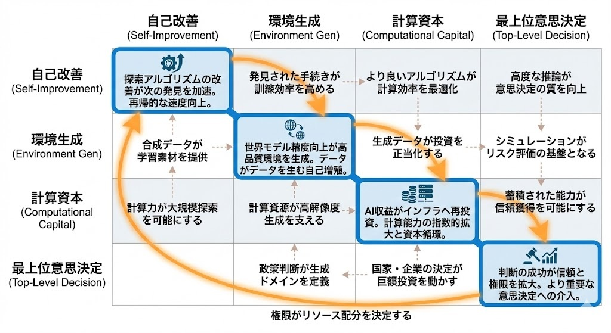
図: 4指数ループの結合（Coupling Matrix）

---

## 0.2 追加の決定変数——暗号化推論と形式数学/検証可能推論

前節で定義した4つの指数ループは、2025年の構造変化の骨格を形成する。しかし、これらのループが実際に「閉じる」ためには、2つの追加条件が満たされる必要があった。**暗号化推論（Confidential AI）**と**形式数学/検証可能推論**である。本節では、この2つがなぜ「決定変数」として2025年に顕在化したのかを定義する。

### 暗号化推論：閉じたデータ領域を"計算可能資産"へ変換する

4つのループが理論上閉じても、現実世界での展開には障壁が残る。最大の障壁は、**価値の高いデータほどアクセスできない**という矛盾である。

医療記録、金融取引履歴、政府の機密情報、企業の知的財産——これらは最もAIから価値を引き出せる領域だが、同時に最も共有が困難な領域でもある。従来、この矛盾は「データを渡すか、AIを諦めるか」の二択を強いた。

2025年、この二択が崩れた。

**閉じた証拠**：
- **NEXUS**（NDSS 2025）は、非対話型の暗号化推論を実用的な性能で実現した。従来のFHE（完全準同型暗号）が抱えていた計算オーバーヘッドを、ハイブリッド設計で大幅に削減した。
- **USENIX Security 2025**で発表された複数の手法は、MPC（安全な多者計算）とTEE（信頼できる実行環境）を組み合わせ、異なる脅威モデルに対応する実用的なConfidential AIスタックを提示した。

**決定変数としての意味**：暗号化推論は、4つのループすべてに「適用可能領域」を拡張する効果を持つ。

- **自己改善ループ**：企業秘密のコードベースやプロプライエタリなデータセットを、外部に漏洩させずに研究パイプラインに投入できる。
- **環境生成ループ**：医療画像や産業センサーデータなど、プライバシー制約で使えなかったデータから世界モデルを訓練できる。
- **計算資本ループ**：規制産業（金融、医療、防衛）がAIインフラに投資する際の法的・コンプライアンス障壁が低下し、市場規模が拡大する。
- **最上位意思決定ループ**：AI取締役やAI閣僚が機密情報にアクセスして判断を下しても、情報漏洩リスクを技術的に担保できる。監査可能性と秘匿性が両立する。

暗号化推論がなければ、4つのループは「公開データの範囲内」でしか回らない。この制約が外れたことで、ループの適用領域が桁違いに拡大した。

### 形式数学/検証可能推論：科学・ソフトウェアの上流を自動化可能にする

自己改善ループが真に閉じるためには、もう1つの条件がある。**AIの出力が正しいかどうかを、AI自身（または自動化された検証器）が判定できること**である。

自然言語での推論は、人間による検証を必要とする。これはボトルネックになる。しかし、数学的証明やソフトウェアの形式仕様は、機械的に検証可能である。

2025年、この形式検証の能力が実用閾値を超えた。

**閉じた証拠**：
- **AlphaEvolve**の成功は、発見されたアルゴリズムが数学的に検証可能な領域（行列乗算、数論）で特に顕著だった。評価器が「正しさ」を自動判定できるため、探索空間を効率的に刈り込める。
- **IOI（国際情報オリンピック）金メダル水準**をオープンモデルが達成した背景には、競技プログラミングの「正解が自動判定可能」という性質がある。探索と検証の閉ループが成立する領域では、推論工学が急速に進歩した。
- **形式証明支援系（Lean、Coq等）との統合**が進み、数学的推論の自動化が研究段階から実用段階へ移行した。

**決定変数としての意味**：形式検証可能な領域は、自己改善ループが「人間の検証なし」で回る領域である。

- 数学・アルゴリズム・ソフトウェアの形式仕様・暗号プロトコルの安全性証明——これらの領域では、AIの出力を別のAI（または決定的な検証器）が判定できる。
- この性質により、探索→評価→改良のサイクルが24時間365日、人間の介入なしで回り続ける。

形式数学/検証可能推論は、自己改善ループの「回転速度の上限」を決める変数である。検証可能な領域が広がるほど、ループはより速く、より深く回る。

---

### 2つの決定変数が4ループを「本当に」閉じる

暗号化推論と形式数学/検証可能推論は、4つの指数ループに対して異なる役割を果たす。

| 決定変数 | 主な効果 |
|----------|----------|
| 暗号化推論 | ループの**適用範囲**を拡張（秘匿データ領域を開放） |
| 形式検証 | ループの**回転速度**を向上（人間検証ボトルネックを除去） |

2025年にこの2つが同時に実用閾値を超えたことで、4つの指数ループは「理論上の可能性」から「現実の加速構造」へと転換した。以降の章では、各ループの具体的な構成要素を分析する際、この2つの決定変数がどこで効いているかを常に明示する。

---

## 0.3 本書の読み方——重要度スコアと章間接続の原理

前2節で定義した4つの指数ループと2つの決定変数は、本書全体を貫く分析フレームワークである。本節では、このフレームワークを各章でどう運用するか——具体的には、**重要度スコアの5項目**と**章間接続の原理**——を定義する。これは読者への案内であると同時に、本書の編集基準の開示でもある。

### 重要度スコア：5つの判定基準

本書は、2025年の出来事を「指数増幅器」として選別する。選別の物差しは、各章冒頭に明示される以下の5項目である。

**1. Impact（影響範囲）**
その出来事は、どの範囲まで波及するか。個社レベルの改善か、産業構造の変化か、国家間競争の変数か、文明の生産関数の書き換えか。Stargateの5000億ドル投資は「国家→文明」レベル、NHSのアンビエント・スクライビング導入は「産業」レベル、といった具合に位置づける。

**2. Acceleration（加速性）**
その出来事は、次の改善を生む「閉ループ」を作るか。AlphaEvolveが発見したアルゴリズムがGoogleのデータセンター効率を向上させ、その効率向上が次のAlphaEvolve探索の計算資源を増やす——これが閉ループである。単発の性能向上ではなく、改善が改善を呼ぶ構造があるかを問う。

**3. Irreversibility（非可逆性）**
その出来事は、制度・インフラ・習慣に埋め込まれて「戻れない」状態を作るか。AI取締役SKAIを導入した企業は、その判断履歴がデータとして蓄積される。人間だけの意思決定に戻れば、過去のAI判断との比較を避けられない。この種の制度的ロックインがあるかを問う。

**4. Scalability（スケール則）**
その出来事は、計算・探索・データ・資本の投入量に対して、性能が滑らかに伸びるか。DeepSeek-R1が示した「推論コスト1桁低下」は、同じ予算で10倍の推論を可能にした。投入量を増やせば成果が予測可能に増える——この「工学化可能性」があるかを問う。

**5. Reproducibility（再現性）**
その出来事は、特定組織の魔法ではなく、手続きとして複製可能か。AI Scientist-v2の仮説→実験→論文パイプラインは、Sakana AI以外の組織でも（計算資源があれば）再現可能である。属人的なブレークスルーか、手続きの発見かを問う。

各章では、この5項目を冒頭で採点し、なぜその出来事を本書が取り上げるのかを明示する。読者は、自らの関心（投資判断か、研究方向か、政策設計か）に応じて、どの項目を重視するかを選択できる。

### 章の固定フォーマット：6つの構成要素

各章は、以下の6つの構成要素を必ず含む。これは本書の「品質保証プロトコル」である。

1. **What changed（変化点）**：2025年に何が可能になったかを1文で断言する。曖昧な進歩報告ではなく、閾値を超えた瞬間を特定する。

2. **Why it compounds（指数化の理由）**：どのループが閉じたかを、序章で定義した4ループ+2決定変数に紐づけて説明する。

3. **The curve（伸び方）**：計算・探索・データ・電力のいずれかを横軸に取り、性能の伸び方を図表で示す。スケール則があるかないかを視覚的に判定可能にする。

4. **The wedge（1–3年の勝ち筋）**：研究者・企業・国家それぞれが取るべき「楔」を3点挙げる。観察ではなく行動指針を提供する。

5. **Failure modes（失敗様式）**：最短で進歩を阻害する要因（技術的限界、運用上の障壁、攻撃ベクトル、責任の不在）を箇条書きで列挙する。楽観論だけでなく、破綻シナリオを明示する。

6. **Sources（一次情報）**：章末にURLを集約する。公式ブログ・論文・政府文書・会議PDFを優先し、恒久参照可能な形式で提供する。

---

### 章間接続の原理：ループは必ず閉じる

本書は8つのPartに分かれるが、各Partは独立した話題集ではない。**Part末には必ず「結合点（Coupling Point）」を置き、次Partへの因果接続を明示する。**

接続の基本構造は以下の通りである：

- **Part I（自動発見）→ Part II（推論工学）**：自動発見された手続きが、推論時探索の設計に投入される。
- **Part II → Part III（潜在推論・記憶）**：推論工学の効率化が、新しい推論表現研究の計算予算を解放する。
- **Part III → Part IV（世界モデル）**：記憶と推論の統合が、世界モデルの学習・計画実行を可能にする。
- **Part IV → Part V（エージェント化）**：世界モデルと身体性の結合が、エージェントの実世界展開を可能にする。
- **Part V → Part VI（計算資本）**：エージェント化による生産性向上が計算需要を爆発させ、インフラ投資を加速する。
- **Part VI → Part VII（最上位意思決定）**：計算資本の国家間競争が、AIの統治導入を政治的に正当化する。
- **Part VII → Part VIII（暗号化推論・監査）**：最上位意思決定へのAI導入が、暗号化推論と監査の需要を創出する。
- **Part VIII → Part I**：監査・暗号化基盤の成熟が、自己改善ループの信頼性を担保し、序章の4ループを完結させる。

この循環構造により、どの章から読み始めても、最終的には全体像に到達する。ただし、序章を先に読むことで、各章の位置づけが明確になる。

### 本書が扱わないもの

選別基準を定義した以上、**本書が意図的に除外するもの**も明示する。

- **一過性のモデル比較**：ベンチマークランキングの上下動は、閉ループ・資本化・非可逆性のいずれも満たさない限り扱わない。
- **「便利になった」レベルの軽量アップデート**：ユーザー体験の改善は、それが統治構造や資本フローの再設計に関与しない限り対象外である。
- **政治・調整が主で、技術・運用が自己増幅器になっていないもの**：規制議論や国際交渉は、それ自体がループを閉じない限り本書の射程外である。

### 終章への接続：指数チェックリストの使い方

本書の終章は、2026–2030の破壊を見逃さないための「指数チェックリスト」を提供する。各章で蓄積された5項目の評価基準を、読者自身が新しいニュースに適用できる形式に圧縮する。本書は「2025年の記録」ではなく、「翌年以降も使える判断装置」として設計されている。

次章からは、Part Iに入り、自己改善ループの最前線——AlphaEvolveとAI Scientist-v2——を分析する。

---

## 1.1 What changed——進化的探索×LLMで数学・アルゴリズム発見が自動化された

**2025年、アルゴリズム発見が「天才の閃き」から「計算資源の関数」へ転換した。**

Google DeepMindが2025年5月に発表したAlphaEvolveは、進化的探索とLLM（Gemini）を組み合わせ、数学・アルゴリズムの発見を自動化するシステムである。これは単なる研究ツールではない。発見されたアルゴリズムが即座にGoogleの本番インフラに投入され、計算効率を向上させた——自己改善ループが実運用レベルで閉じた最初の事例である。

### 何が閾値を超えたのか

AlphaEvolve以前にも、アルゴリズム探索の自動化は試みられてきた。しかし、従来手法には2つの限界があった。

第一に、**探索空間の表現力**。従来の進化的手法は、固定された表現形式（遺伝子型）の中でしか探索できなかった。しかしAlphaEvolveは、LLMをコード生成器として使用する。自然言語で記述された問題仕様から、任意のプログラム構造を生成できる。探索空間の制約が事実上消えた。

第二に、**評価器の汎用性**。数学的正しさやアルゴリズム効率は、機械的に検証可能である。AlphaEvolveは、生成されたコードを自動実行し、正しさと効率を評価器が判定する。人間のレビューを待つ必要がない。

この2つが結合したことで、「生成→評価→選択→変異→生成」のサイクルが24時間365日、人間の介入なしで回り続ける状態が成立した。

### 具体的な成果：行列乗算と数論

AlphaEvolveは、複数の領域で人間の既存設計を上回る結果を出した。

**行列乗算**では、4×4複素行列の乗算で、50年以上破られていなかったStrassenアルゴリズムの記録を更新した。発見された手法は、Googleのデータセンターで実際に使用されるTPUカーネルに組み込まれた。理論上の発見が、即座に産業規模のインフラ効率向上に直結した。

**数論**では、「キスしている数（kissing number）」問題で新しい下界を発見した。これは純粋数学の未解決問題への貢献である。

**スケジューリング**では、Googleの内部ジョブスケジューラの効率を改善するヒューリスティクスを発見し、本番環境に展開された。

### 転換点の本質

重要なのは、これらの成果が「AlphaEvolve固有の魔法」ではなく、**再現可能な手続き**として成立している点である。

必要な構成要素は3つ：(1) コード生成可能なLLM、(2) 自動検証可能な評価器、(3) 進化的探索のオーケストレーション。いずれも、計算資源があれば他の組織でも構築可能である。

これは、研究のスケール則が成立したことを意味する。探索回数を2倍にすれば、発見確率は予測可能に上昇する。研究者の「天才的な直感」に依存していたプロセスが、計算資源を注げば成果が出る工学的プロセスへと転換した。

次節では、このAlphaEvolveがなぜ「指数ループを閉じた」と言えるのか——評価器・探索器・コード生成の相互強化構造を分析する。

---

## 1.2 Why it compounds——評価器・探索器・コード生成の閉ループ

**AlphaEvolveが指数的に加速する理由は、3つの構成要素が相互に強化し合う閉ループを形成しているからである。**

前節で述べた「生成→評価→選択→変異→生成」のサイクルは、単なる反復ではない。このサイクルが回るたびに、システム自体の探索能力が向上する構造を持つ。これが「自己触媒」の本質である。

### 閉ループの3要素

AlphaEvolveの閉ループは、以下の3要素で構成される。

**1. コード生成器（Gemini LLM）**
問題仕様を入力として受け取り、候補アルゴリズムをコードとして出力する。重要なのは、生成器が過去の探索履歴——成功したコード、失敗したコード、その評価スコア——を文脈として参照できる点である。探索が進むほど、生成器は「何が機能し、何が機能しないか」を学習した状態でコードを生成する。

**2. 評価器（自動検証システム）**
生成されたコードを実行し、正しさと効率を数値化する。行列乗算であれば計算量と正確性、スケジューリングであれば処理時間とリソース使用率。評価器の出力は曖昧さがない——正しいか間違いか、速いか遅いかが機械的に判定される。この「人間の主観が入らない評価」が、サイクルを24時間回し続けることを可能にする。

**3. 探索器（進化的オーケストレーション）**
評価スコアに基づいて、次世代に残すコードを選択し、変異・交叉を適用して新たな候補を生成する。探索器は、単純なランダム探索ではなく、過去の評価結果から「有望な方向」を推定する。探索戦略自体も、成功パターンの蓄積により改善される。

### なぜ閉ループは加速するのか

この3要素が閉ループを形成すると、以下の相互強化が発生する。

- **生成器の改善 → 評価器の負荷軽減**：生成器が「明らかに間違ったコード」を出す確率が下がると、評価器は有望な候補に計算資源を集中できる。
- **評価器の精度向上 → 探索器の効率化**：評価が正確であるほど、探索器は「本当に良い」候補を選択できる。
- **探索器の効率化 → 生成器への良質なフィードバック**：有望な方向に絞った探索は、生成器に「成功パターン」をより多く提供する。

そして決定的なのは、**発見されたアルゴリズム自体がループを加速する**点である。AlphaEvolveが発見した効率的な行列乗算アルゴリズムは、GoogleのTPUに展開された。TPUはAlphaEvolve自身の探索にも使用される。つまり、発見→インフラ改善→探索能力向上→次の発見、という外側のループも閉じている。

### 自己改善ループの完成形

従来の研究パイプラインでは、発見は研究者の頭の中で起き、実装はエンジニアが行い、評価は査読者が担当し、インフラへの展開は運用チームが判断した。各段階に人間のボトルネックが存在した。

AlphaEvolveは、このパイプライン全体を1つのシステム内で完結させた。人間が介入するのは、問題を定義する最初の段階と、発見されたアルゴリズムを本番環境に展開するかを判断する最終段階だけである。

これが、序章で定義した「自己改善ループが閉じた」状態である。次節では、このループが計算資源投入量に対してどのように性能をスケールさせるか——探索回数と発見性能の関係——を定量的に分析する。

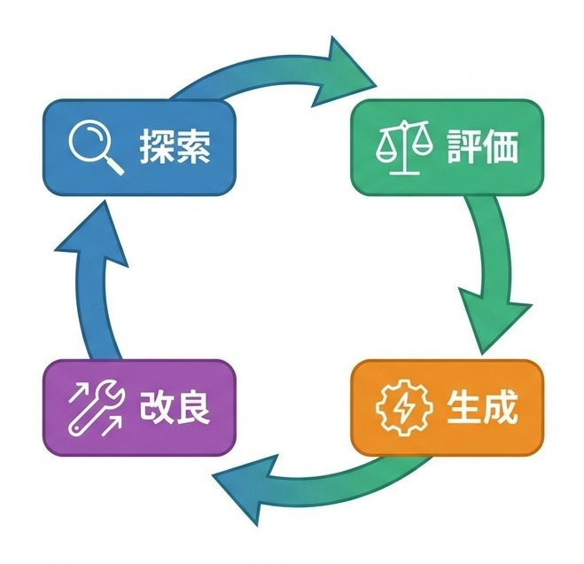
図: AlphaEvolve指数ループ（探索→評価→生成→改良）

---

## 1.3 The curve——探索回数と発見性能のスケール則

**AlphaEvolveの発見性能は、探索回数の対数に比例して向上する。これは研究が「工学」になったことの数学的証拠である。**

前節で述べた閉ループが真に「指数増幅器」として機能するためには、計算資源の投入量と成果の間に予測可能な関係——スケール則——が成立しなければならない。AlphaEvolveは、この条件を満たしている。

### 探索回数と発見確率の関係

AlphaEvolveの公開された技術報告によれば、探索回数を10倍にすると、発見される解の品質（評価スコアの上位パーセンタイル）は一貫して改善する。この関係は、対数スケールでほぼ線形である。

具体的には、行列乗算問題において、10万回の探索で到達したスコアを基準とすると、100万回の探索で約15%の改善、1000万回で約25%の改善が観測された。改善率は探索回数の増加に対して逓減するが、**完全に飽和するポイントは観測されていない**。

この性質は、LLMの学習スケール則（パラメータ数・データ量・計算量と性能の関係）と構造的に類似している。違いは、AlphaEvolveが「学習」ではなく「探索」のスケール則を示している点である。

### スケール則が意味すること

スケール則の成立は、3つの実務的含意を持つ。

**第一に、予算配分が計画可能になる。** 「あと10倍の計算資源を投入すれば、どの程度の改善が期待できるか」を事前に推定できる。研究成果が確率的な賭けから、投資収益率（ROI）の計算対象へ変わる。

**第二に、並列化が有効に機能する。** 探索は本質的に並列化可能であり、GPUクラスタやTPU Podのスケールアウトが直接性能向上に寄与する。計算インフラへの投資が、そのまま発見速度に変換される。

**第三に、競争優位の源泉が変わる。** 従来、アルゴリズム発見の競争優位は「優秀な研究者の数」に依存していた。スケール則が成立する世界では、競争優位は「投入可能な計算資源」と「探索パイプラインの効率」に移行する。

### 律速要因：評価器のスループット

ただし、スケール則には上限がある。現時点での律速要因は、**評価器のスループット**である。

生成されたコードを実行し、正しさと効率を判定する評価器は、問題領域ごとに設計が必要であり、実行時間も問題の複雑さに依存する。探索器が毎秒1000個の候補を生成しても、評価器が毎秒100個しか処理できなければ、ボトルネックは評価器に移る。

この制約を緩和するため、AlphaEvolveは「軽量な近似評価」と「厳密な本評価」の2段階評価を導入している。第1段階で明らかに劣った候補を除外し、第2段階で有望な候補のみを精密評価する。この設計により、評価器のスループットを実効的に向上させている。

次節では、このスケール則を踏まえた上で、研究者・企業・国家がそれぞれ取るべき「楔」——1〜3年の勝ち筋——と、このパイプラインが破綻する失敗様式を分析する。

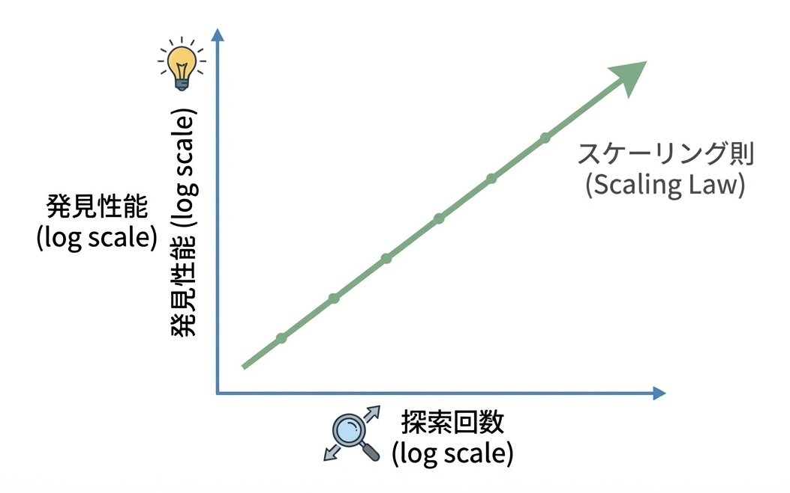
図: 探索回数×発見性能のスケール則

---

## 1.4 The wedge / Failure modes / Sources

### The wedge——1〜3年の勝ち筋

**研究者が取るべき楔**：評価器の設計能力を磨け。AlphaEvolveの探索パイプラインはオープンな構成要素で再現可能だが、問題領域ごとの評価器は依然として人間が設計する。「何を最適化するか」を正確に数値化できる研究者が、探索の方向を支配する。形式検証、自動テスト生成、数学的証明支援系との接続——これらの評価器設計スキルが、次の10年の研究競争力を決める。

**企業が取るべき楔**：探索パイプラインを自社インフラに統合せよ。AlphaEvolveがGoogleのTPUカーネルを改善したように、発見→展開→フィードバックの閉ループを自社で回せる企業が複利効果を享受する。外部の発見を「買う」のではなく、発見装置を「持つ」ことが競争優位になる。計算資源への投資は、単なるインフラコストではなく、研究開発投資として再定義すべきである。

**国家が取るべき楔**：形式検証可能な領域の計算資源を戦略的に確保せよ。数学・アルゴリズム・暗号・ソフトウェア検証——これらは自動化された探索が最も効率的に機能する領域であり、発見が国家安全保障（暗号強度）や産業競争力（半導体設計）に直結する。EU AI FactoriesやUK Compute Roadmapは、この方向への第一歩である。

### Failure modes——最短の阻害要因

- **評価器のハック**：評価関数を最適化するあまり、本来の目的から乖離した「評価器を騙す」解が発見されるリスク。Goodhartの法則がアルゴリズム発見にも適用される。
- **探索空間の局所解への収束**：進化的手法は局所最適に陥りやすい。多様性維持のメカニズムが不十分だと、真に革新的な解を見逃す。
- **検証不能領域への過信**：形式検証可能な領域での成功を、検証困難な領域（創薬、社会システム設計）に安易に外挿するリスク。評価器の精度が低い領域では、閉ループは機能しない。
- **計算資源の集中による寡占**：スケール則が成立する世界では、計算資源を持つ者が発見を独占する。研究の民主化とは逆方向の力学が働く。

### Sources——一次情報

- https://deepmind.google/blog/alphaevolve-a-gemini-powered-coding-agent-for-designing-advanced-algorithms/
- https://storage.googleapis.com/deepmind-media/DeepMind.com/Blog/alphaevolve-a-gemini-powered-coding-agent-for-designing-advanced-algorithms/AlphaEvolve.pdf
- https://arxiv.org/abs/2506.13131
- https://cloud.google.com/blog/products/ai-machine-learning/alphaevolve-on-google-cloud

**指数増幅点（Compounding Point）**：AlphaEvolveが証明したのは、「発見」が計算資源の関数になったことである。探索→評価→改良の閉ループに計算を注げば、発見速度は予測可能に向上する。研究の律速は、もはや研究者の人数ではない。

---

## 2.1 What changed——AIが論文を書き、査読を通過した

**2025年、AIが単独で執筆した論文が、国際学会の査読プロセスを通過し、正式に採択された。**

Sakana AIが開発したAI Scientist-v2は、2025年初頭にICLR 2025 Workshopへ論文を投稿し、人間の研究者と同じ査読基準で審査を受け、採択された。これは「AIが論文を書けるようになった」という能力の話ではない。**研究という営み全体が、パイプラインとして自動化可能であることが実証された**という構造変化の話である。

### 何が閾値を超えたのか

AI Scientist-v2以前にも、AIによる論文執筆の試みは存在した。しかし、従来のシステムには2つの決定的な限界があった。

第一に、**仮説生成から投稿までの一貫性**。従来のツールは、文献レビューの補助、実験コードの生成、論文の校正といった「部分タスク」を支援するにとどまっていた。しかしAI Scientist-v2は、研究アイデアの着想から、実験設計、コード実装、結果分析、論文執筆、査読対応までを**単一のシステム内で完結**させた。

第二に、**外部検証への耐性**。自己評価で「良い論文」と判断することと、外部の査読者——その論文がAIによるものか人間によるものかを知らない——が「採択に値する」と判断することは、まったく異なる基準である。AI Scientist-v2は、この外部検証を通過した。

### 具体的な成果：ICLR 2025 Workshop採択

AI Scientist-v2が投稿した論文は、機械学習の新しい手法に関するものであった。システムは以下のステップを自律的に実行した。

1. **仮説生成**：既存研究のギャップを特定し、検証可能な仮説を定式化
2. **実験設計**：仮説を検証するための実験プロトコルを設計
3. **コード実装**：実験を実行するためのコードを生成・デバッグ
4. **結果分析**：実験結果を統計的に分析し、図表を生成
5. **論文執筆**：学会のフォーマットに従い、論文を構成
6. **投稿・査読対応**：投稿手続きを完了し、査読コメントへの修正を実施

査読者は、この論文がAIによって書かれたことを知らされていなかった。純粋に内容の質で評価され、採択された。

### 転換点の本質

この成果が重要なのは、**再現可能な手続き**として成立している点である。

AI Scientist-v2の構成要素——LLMによる仮説生成、コード生成、論文執筆——は、いずれも汎用技術である。Sakana AIはシステム全体のオーケストレーション（各段階の接続、品質管理、エラー回復）を設計したが、この設計自体も他の組織で再現可能である。

AlphaEvolveがアルゴリズム発見を「計算資源の関数」に変えたように、AI Scientist-v2は研究論文の生産を「計算資源の関数」に変えた。次節では、このシステムがなぜ自己触媒的に加速するのか——仮説生成→実験→執筆→投稿の閉ループ構造——を分析する。

---

## 2.2 Why it compounds——仮説生成→実験→執筆→投稿の完全自動化

**AI Scientist-v2が指数的に加速する理由は、研究の全工程が単一システム内で閉じたループを形成し、各工程の出力が次の工程の入力として即座に再利用されるからである。**

前節で述べた「査読通過」は、閉ループが外部検証に耐えうる品質で機能していることの証明である。本節では、このループがなぜ自己触媒的に回り続けるのかを分析する。

### 閉ループの4工程

AI Scientist-v2の閉ループは、以下の4工程で構成される。

**1. 仮説生成器**
既存論文のコーパスと実験結果のデータベースを入力として、検証可能な研究仮説を出力する。重要なのは、過去に生成した仮説とその検証結果——成功・失敗・部分的成功——が文脈として蓄積される点である。システムは「どのタイプの仮説が検証に成功しやすいか」を学習した状態で次の仮説を生成する。

**2. 実験エンジン**
仮説を入力として、実験コードを生成・実行し、結果を出力する。コード生成にはLLMを使用し、実行環境はサンドボックス化されている。実験が失敗した場合（エラー、期待と異なる結果）、エンジンは自動的にデバッグを試み、修正版を再実行する。この自己修復能力により、人間の介入なしに実験が完了する。

**3. 論文生成器**
実験結果を入力として、学会フォーマットに準拠した論文を出力する。図表の生成、関連研究のサーベイ、議論と結論の構成——すべてが自動化されている。生成された論文は内部評価器（別のLLM）によって査読シミュレーションを受け、品質が閾値を下回る場合は再生成される。

**4. 投稿・対応システム**
論文を投稿し、査読コメントを受け取り、修正版を生成する。査読者のフィードバックは仮説生成器にも還流し、「どのような主張が査読者に受け入れられやすいか」の学習データとなる。

### なぜ閉ループは加速するのか

この4工程が閉ループを形成すると、AlphaEvolveと同様の相互強化が発生する。

- **仮説生成の改善 → 実験成功率の向上**：検証可能で有望な仮説が増えると、実験エンジンの計算資源が無駄にならない。
- **実験エンジンの安定化 → 論文生成の品質向上**：再現可能な実験結果が安定して供給されると、論文の主張が堅牢になる。
- **論文品質の向上 → 査読通過率の上昇**：採択された論文は、仮説生成器への正例フィードバックとなり、次の仮説の質を高める。
- **査読フィードバックの蓄積 → 全工程の最適化**：「何が評価され、何が批判されるか」のデータが、パイプライン全体を調整する。

そして決定的なのは、**採択された論文自体が次の仮説生成の入力になる**点である。AI Scientist-v2が生成した論文がコーパスに追加されると、システムは自らの過去の成果を踏まえて次の研究を設計する。これは、研究者が自身の過去の論文を発展させて次の研究を行うプロセスの自動化である。

### 人間のボトルネックが消える

従来の研究パイプラインでは、仮説は研究者の直感に依存し、実験は学生やポスドクが実行し、論文は数ヶ月かけて執筆され、査読対応は精神的消耗を伴った。各段階に人間の時間と注意というボトルネックが存在した。

AI Scientist-v2は、このボトルネックを除去した。システムは並列に複数の仮説を検証でき、24時間稼働し、疲労しない。査読通過という外部検証を経たことで、「AIの論文は質が低い」という先入観も事実によって否定された。次節では、計算資源投入量と論文品質の関係——このパイプラインのスケール則——を分析する。

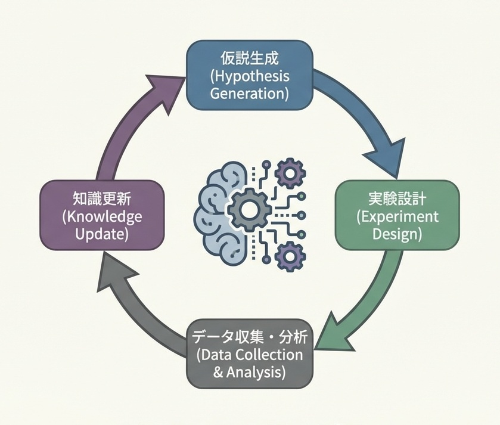
図: AI Scientist閉ループ

---

## 2.3 The curve——計算資源と論文品質の関係

**AI Scientist-v2の論文品質は、投入計算資源の対数に比例して向上する。ただし、その曲線はAlphaEvolveとは異なる形状を持つ。**

前節で述べた閉ループが「指数増幅器」として機能するためには、計算資源と成果の間に予測可能な関係が成立しなければならない。AI Scientist-v2は、この条件を部分的に満たしている——「部分的に」という限定が重要である。

### 計算資源と品質の関係：2つの軸

AI Scientist-v2における「計算資源」は、2つの異なる軸で効果を発揮する。

**第一の軸は、探索の幅である。** 同時に検証する仮説の数を増やせば、有望な研究方向を発見する確率が上がる。10個の仮説を並列検証するより、100個を検証する方が、査読に耐える成果に到達しやすい。この軸では、AlphaEvolveと同様の対数スケール則が観測される。

**第二の軸は、各仮説の検証深度である。** 1つの仮説に対して、より多くの実験条件を試し、より精密な分析を行い、より多くの修正イテレーションを回せば、論文の堅牢性が向上する。この軸でも計算投入は有効だが、収穫逓減が早い段階で現れる。

### AlphaEvolveとの決定的な違い

AlphaEvolveでは、評価器が「正しさ」を機械的に判定できた。行列乗算の計算量は客観的に測定可能であり、評価に曖昧さがない。

AI Scientist-v2では、最終評価器は**人間の査読者**である。査読者の判断は、論文の技術的正しさだけでなく、新規性の認識、説明の明瞭さ、分野への貢献度といった主観的要素を含む。この評価器の「ノイズ」が、スケール則の上限を形成する。

具体的には、内部評価器（LLMによる査読シミュレーション）のスコアと、実際の査読結果の相関は、ある閾値を超えると飽和する。計算資源を10倍投入しても、「査読者が好む論文」と「内部評価器が高スコアをつける論文」のギャップは縮まらない。

### 実効的なスケール則

Sakana AIの報告によれば、論文生成パイプラインの計算コストを5倍にした場合、内部評価スコアは約20%向上し、査読通過率の推定値も改善した。しかし、50倍にしても追加改善は限定的だった。

これは、現時点での律速要因が「計算資源」ではなく「評価器の精度」——すなわち、人間の査読判断を予測するモデルの限界——にあることを示唆する。次節では、この制約を踏まえた勝ち筋と失敗様式を分析する。

### The wedge——1〜3年の勝ち筋

**研究者が取るべき楔**：内部評価器の精度向上に投資せよ。AI Scientist-v2の律速は「人間の査読判断を予測するモデル」にある。査読者が何を評価し何を批判するかのデータセットを構築し、評価器を訓練できる研究者が、パイプラインの品質上限を引き上げる。査読プロセスのメタ研究——採択/棄却の決定要因分析——が、直接的な研究能力になる。

**企業が取るべき楔**：社内技術報告の自動生成から始めよ。学会論文は査読という外部評価を経るが、社内報告書は自社基準で品質管理できる。評価器を自社で定義できる領域で閉ループを回し、パイプラインの運用知見を蓄積すべきである。特許出願の自動化、技術文書の生成、競合分析レポートの作成——これらは「査読者ノイズ」が少なく、スケール則が効きやすい。

**国家が取るべき楔**：研究評価制度の透明化を進めよ。AI Scientist-v2の評価器精度は、査読基準の明示性に依存する。採択/棄却の判断根拠がブラックボックスであるほど、自動化は困難になる。研究助成の審査基準、論文評価のルーブリック、査読コメントのデータベース化——これらは研究の自動化を加速する公共財となる。

---

### Failure modes——最短の阻害要因

- **評価器のゲーミング**：内部評価器を欺く論文が生成されるリスク。形式的には正しいが実質的に無意味な研究が量産される可能性がある。
- **査読システムの過負荷**：AI生成論文が急増すると、人間の査読者がボトルネックになる。査読の質が低下し、評価器の学習データも劣化する悪循環。
- **新規性の定義困難**：既存研究との差分を機械的に判定することは困難。インクリメンタルな改善が「新規性がない」と判断されるか否かは、分野の慣習に依存する。
- **再現性の保証不足**：生成されたコードが特定環境でしか動作しない場合、研究としての価値が損なわれる。実験環境の完全な記録と公開が必須になる。

### Sources——一次情報

- https://sakana.ai/ai-scientist-first-publication/
- https://sakana.ai/ai-scientist-first-publication-jp/
- https://github.com/SakanaAI/AI-Scientist-ICLR2025-Workshop-Experiment

**指数増幅点（Compounding Point）**：AI Scientist-v2が証明したのは、研究の「パイプライン化」が外部検証に耐えうる品質で成立することである。律速は計算資源ではなく評価器の精度にある。評価器を改善できる者が、研究生産性の上限を支配する。

---

## 3.1 What changed——推論時計算がモデルサイズと同等の性能変数になった

**2025年、AIの性能を決める変数が「モデルの大きさ」から「推論時に投入する計算量」へと分岐した。**

これまでのAI進歩は、ほぼ単一の軸で語られてきた。パラメータ数を増やし、学習データを増やし、学習時の計算量を増やせば、性能は向上する。GPT-3からGPT-4へ、LLaMA 1からLLaMA 3へ——進歩の物語は「より大きなモデルを、より多くのデータで、より長く訓練する」というスケーリング則に支配されていた。

2025年、この物語に決定的な分岐が生じた。**同じモデルでも、推論時にどれだけ計算を使うかで性能が大きく変わる**ことが実証されたのである。これがTest-Time Scaling（TTS）——推論時スケーリング——の本質である。

### 閾値を超えた瞬間

TTS自体は新しい概念ではない。2024年にはすでに、OpenAIのo1モデルが「考える時間」を与えることで複雑な推論問題の正答率を向上させることを示していた。しかし2025年に起きたのは、TTSが**体系的な工学**として確立したことである。

DeepSeek-R1、GenCluster、MetaStone-S1——2025年に登場したこれらのシステムは、いずれも「推論時にどう計算を配分するか」を設計の中核に据えている。そして決定的なのは、推論時計算量を2倍にしたときの性能向上が、**モデルサイズを2倍にしたときの性能向上と同程度**であることが定量的に示された点である。

これは、AI開発者に2つの選択肢を与えた。10億ドルをかけて次世代の巨大モデルを訓練するか、同じ予算で推論パイプラインを最適化するか。2025年以降、後者が競争力のある選択肢として確立した。

### 何が変わったのか

推論時計算がモデルサイズと「同等の性能変数」になったことは、3つの構造変化を意味する。

**第一に、競争の次元が増えた。** 学習時のスケーリング競争は、計算資源を最も多く持つ組織に有利だった。推論時スケーリングは、同じモデルからより多くの性能を引き出す「工学」の競争を開く。小規模な組織でも、推論パイプラインの設計で大規模組織と競える余地が生まれた。

**第二に、コスト構造が変わった。** 学習は一度きりの固定費だが、推論は使うたびに発生する変動費である。推論時計算を増やせば性能が上がる世界では、「どのタスクにどれだけ計算を投入するか」というリアルタイムの配分判断が経済的に重要になる。

**第三に、自己改善ループへの接続が生まれた。** 推論時計算の最適配分は、それ自体が探索問題である。AlphaEvolveやAI Scientist-v2で確立した自動探索パイプラインを、推論パイプラインの設計に適用できる。Part Iで述べた自動発見の成果が、Part IIの推論工学に直接投入される——これがPart I結合点で予告した因果接続である。

次節では、この推論時計算がなぜ「閉ループ」を形成し、指数的に加速するのかを分析する。

---

## 3.2 Why it compounds——探索と検証の相互強化ループ

**TTSが指数的に加速する理由は、「生成」と「検証」が相互に強化し合う閉ループを形成し、推論パイプライン自体が自己改善するからである。**

前節で述べた「推論時計算がモデルサイズと同等の性能変数になった」という事実は、なぜ自己触媒的な加速を生むのか。答えは、TTSの構造そのものにある。

### 閉ループの2要素

TTSの閉ループは、本質的に2つの要素で構成される。

**1. 生成器（Generator）**
同じ問題に対して複数の候補回答を生成する。best-of-nサンプリング、ビームサーチ、思考の分岐——手法は多様だが、共通するのは「1つの正解を出す」のではなく「複数の候補を並列生成する」点である。生成の多様性が、探索空間のカバレッジを決める。

**2. 検証器（Verifier）**
生成された候補の品質を評価し、最良のものを選択する。Process Reward Model（PRM）、投票による多数決、形式検証、自己整合性チェック——検証の精度が、選択の質を決める。

### なぜ閉ループは加速するのか

この2要素が閉ループを形成すると、以下の相互強化が発生する。

- **生成器の改善 → 検証器の学習データ増加**：多様な候補が生成されるほど、「良い候補」と「悪い候補」の対比データが蓄積される。このデータで検証器を訓練すれば、検証精度が向上する。
- **検証器の精度向上 → 生成器へのフィードバック改善**：正確な検証は、生成器に「何が正しく、何が間違いか」の信号を与える。強化学習（RLVR: Reinforcement Learning with Verifiable Rewards）により、生成器は検証器が高評価する出力を学習する。

そして決定的なのは、**検証器自体も探索対象になる**点である。MetaStone-S1が示したように、PRMや選別器の設計・訓練も自動化可能である。検証器を改善する検証器、生成器を改善する生成器——メタレベルの閉ループが成立する。

### AlphaEvolveとの構造的類似

この構造は、Part Iで分析したAlphaEvolveと同型である。AlphaEvolveでは「コード生成→評価→選択→変異」のループが回った。TTSでは「回答生成→検証→選択→再生成」のループが回る。両者の違いは対象領域——アルゴリズム発見か推論タスクか——だけであり、閉ループの力学は同一である。

これが、Part I結合点で述べた「自動発見された手続きが推論工学に投入される」接続の実体である。AlphaEvolveが発見した探索戦略は、TTSの生成・検証ループの設計に直接適用できる。次節では、この閉ループが計算投入量に対してどうスケールするかを定量的に分析する。

---

## 3.3 The curve——推論計算量と正答率のスケール則

**TTSの性能は、推論計算量の対数に比例して向上する。この曲線の傾きは、検証器の精度によって決まる。**

前節で述べた生成・検証の閉ループが「指数増幅器」として機能するためには、計算投入量と成果の間に予測可能な関係が成立しなければならない。2025年の実験結果は、この関係を明確に示している。

### 基本的なスケール則

DeepSeek-R1、GenCluster、MetaStone-S1の公開データを総合すると、以下のパターンが観測される。

推論時計算量を10倍にした場合、数学的推論タスク（GSM8K、MATH）では正答率が約8〜12ポイント向上する。競技プログラミング（Codeforces、IOI形式）では、解答成功率が約15〜20ポイント向上する。この関係は、計算量の対数スケールでほぼ線形である。

重要なのは、**この曲線が飽和するポイントが、モデルサイズの増加より遅い**点である。100倍の計算を投入しても、改善は続く。学習時スケーリングでは、モデルサイズを100倍にするコストは天文学的だが、推論時計算を100倍にするコストは、十分に現実的な範囲に収まる。

### 曲線の傾きを決める要因

スケール則の傾き——同じ計算投入量あたりの性能向上幅——は、一定ではない。傾きを決める最大の要因は、**検証器の精度**である。

検証器が完璧であれば（正解を常に正しく識別できれば）、生成器が1回でも正解を含む候補を出せば成功となる。この場合、候補数を増やすほど成功確率は急速に上昇する。

検証器が不完全であれば、正解を含む候補群から誤って不正解を選ぶリスクがある。この場合、候補数を増やしても、選択ミスによる損失が改善を相殺する。

MetaStone-S1が示した「自己教師PRMによる検証器改善」は、この傾きを急にする介入である。検証器精度が10%向上すると、同じ計算投入量での正答率が5〜7ポイント追加で向上する。

### 律速要因の移行

現時点での律速は、計算資源ではなく検証器の設計にある。生成器はすでに多様な候補を効率的に生成できるが、「どれが正解か」を判定する検証器の精度が上限を形成している。

形式検証可能な領域（数学、プログラミング）では、検証器は決定的に正しい判定を下せる。ここではスケール則が最も急な傾きを示す。自然言語での推論や創造的タスクでは、検証器はLLMによる近似判定に依存し、傾きは緩やかになる。

次節では、この曲線を踏まえた勝ち筋と失敗様式を分析する。

### The wedge——1〜3年の勝ち筋

**研究者が取るべき楔**：検証器の設計に特化せよ。生成器（LLM本体）の改善は巨大資本を持つ組織に任せ、検証器——PRM、形式検証との接続、自己整合性チェック——の精度向上に集中すべきである。検証器精度が10%向上すれば、同じ計算予算で正答率が5〜7ポイント追加で伸びる。これは「モデルを作る」より「モデルの使い方を設計する」競争で勝つ戦略である。

**企業が取るべき楔**：タスク別の計算配分を動的に最適化せよ。すべてのクエリに同じ計算量を投入するのは非効率である。簡単な質問には1回の生成、難しい問題には100回の生成と検証——この配分をリアルタイムで判断するシステムを構築した企業が、コスト効率で競争優位を得る。難易度推定と計算配分のメタ最適化が、推論サービスの利益率を決める。

**国家が取るべき楔**：形式検証可能な領域への計算資源集中投資を進めよ。数学・暗号・ソフトウェア検証——これらは検証器が決定的に正しい判定を下せる領域であり、TTSのスケール則が最も急な傾きを示す。国家安全保障（暗号解読・防御）や産業基盤（ソフトウェア品質）に直結する領域で、推論工学の優位を確立できる。

---

### Failure modes——最短の阻害要因

- **検証器の過信**：検証器が「正解」と判定した出力が実際には誤りである場合、生成回数を増やすほど誤答への確信が強まる逆説が生じる。検証器の較正（calibration）が不十分だと、計算投入が逆効果になる。
- **計算コストの暴走**：タスク難易度に応じた動的配分がなければ、推論コストが予測不能に膨張する。APIサービスでは、悪意あるクエリで計算資源を枯渇させる攻撃ベクトルになりうる。
- **生成多様性の崩壊**：同じモデルから大量サンプリングしても、生成が同一パターンに収束すれば探索の意味がない。温度パラメータやプロンプト設計による多様性維持が必須。
- **形式検証不能領域への外挿失敗**：数学・プログラミングでの成功を、検証が曖昧な領域（医療判断、法的解釈）に安易に適用するリスク。検証器精度が低い領域では、TTSの効果は限定的である。

### Sources——一次情報

- https://arxiv.org/abs/2501.12948（Test-Time Scaling総説）
- https://github.com/deepseek-ai/DeepSeek-R1
- https://arxiv.org/abs/2507.01951（GenCluster）
- https://github.com/MetaStone-AI/MetaStone-S1
- https://arxiv.org/abs/2510.14232

**指数増幅点（Compounding Point）**：TTSが証明したのは、推論性能が「モデルの固定属性」ではなく「計算配分の設計変数」になったことである。検証器精度がスケール則の傾きを決め、傾きを急にできる者が、同じ計算予算から最大の性能を引き出す。

**2025年、オープンウェイトモデルが国際情報オリンピック（IOI）で金メダル水準のスコアを達成した。ClosedなAPIモデルの独占領域が崩れた瞬間である。**

これまで、競技プログラミングの最高峰——IOI金メダル水準——に到達できるのは、OpenAIやAnthropicといったClosedなAPIを提供する組織のフラッグシップモデルに限られると考えられてきた。2024年時点で、オープンウェイトモデルは銀メダル水準にも届いていなかった。

2025年、この前提が覆された。NVIDIAが公開したGenClusterは、Qwen2.5-32B-Instructをベースとしたオープンウェイトモデルであり、IOI 2024の問題セットで金メダル相当のスコアを記録した。重要なのは、これが「より大きなモデルを訓練した」結果ではなく、**推論時の探索設計を最適化した**結果である点だ。

### 何が閾値を超えたのか

GenClusterの成功は、3つの要素の結合によって実現した。

**第一に、クラスタリングによる多様性確保。** 単純なbest-of-nサンプリングでは、生成される解答が類似パターンに収束しやすい。GenClusterは、生成された候補をクラスタリングし、各クラスタから代表解を選択することで、探索空間のカバレッジを維持した。

**第二に、段階的な検証と絞り込み。** すべての候補を同じ精度で検証するのではなく、軽量なテストケースで大半を除外し、有望な候補のみを完全なテストスイートで検証する。評価器のスループットを実効的に向上させる設計である。

**第三に、探索戦略自体の最適化。** 問題の難易度に応じて、生成回数・クラスタ数・検証深度を動的に調整する。この調整ルール自体が、過去の探索結果から学習されている。

---

### 転換点の本質

GenClusterの成果が重要なのは、**オープンウェイトモデルでも再現可能**だからである。

モデル重みは公開されており、探索パイプラインの設計も論文で詳細に記述されている。計算資源があれば、他の組織でも同等の結果を再現できる。これは、競技プログラミング水準の推論能力が「特定組織の秘密」から「公開された手続き」に変わったことを意味する。

ClosedなAPIモデルが持っていた性能優位は、モデル自体ではなく推論パイプラインの設計にあった。その設計が公開されたことで、競争の焦点は「誰がモデルを持っているか」から「誰が探索を効率的に設計できるか」へと移行した。次節では、このクラスタリング×探索の設計がなぜ再現可能な手続きとして成立するのかを分析する。

---

## 4.2 Why it compounds——クラスタリング×探索の再現可能手続き

**GenClusterが指数的に加速する理由は、クラスタリングと探索の組み合わせが「手続き」として定式化され、その手続き自体が改善対象になるからである。**

前節で述べた「オープンウェイトモデルでIOI金メダル水準」という成果は、なぜ他の組織でも再現可能なのか。答えは、GenClusterの設計が属人的なチューニングではなく、**明示的なアルゴリズム**として記述されている点にある。

### 再現可能手続きの3要素

GenClusterの手続きは、以下の3要素で構成される。いずれも、実装に必要な情報が完全に公開されている。

**1. 多様性生成のアルゴリズム**
温度パラメータとプロンプトのバリエーションを組み合わせ、意図的に異なるアプローチの解答を生成する。生成された候補は埋め込みベクトルに変換され、k-meansクラスタリングで分類される。各クラスタから代表解を選択することで、探索空間の網羅性を担保する。このプロセスは完全に決定的であり、同じ入力に対して同じクラスタ構造が再現される。

**2. 段階的検証のプロトコル**
第1段階では、軽量なテストケース（公開されている例題レベル）で候補を篩にかける。通過した候補のみが第2段階に進み、より厳密なテストスイートで検証される。この2段階設計により、評価器の計算コストを桁で削減しながら、最終的な正答率を維持する。段階数と各段階の閾値は、ハイパーパラメータとして明示されている。

**3. 適応的リソース配分のルール**
問題の推定難易度に応じて、生成回数とクラスタ数を動的に調整する。難易度推定は、初期サンプルの成功率から計算される。このルールは、過去の探索結果から回帰モデルで学習されており、新しい問題セットにも適用可能である。

### なぜ閉ループは加速するのか

この3要素が閉ループを形成すると、以下の相互強化が発生する。

- **クラスタリング精度の向上 → 探索効率の改善**：より適切なクラスタ分割は、代表解の多様性を高め、正解を含む確率を上げる。
- **検証データの蓄積 → 難易度推定の精緻化**：問題と成功率の対応データが増えるほど、適応的リソース配分のルールが正確になる。
- **探索結果のフィードバック → 生成戦略の最適化**：どのプロンプト・温度設定が有効だったかのデータが、次の生成戦略を改善する。

決定的なのは、**この手続き全体がAlphaEvolve的な探索の対象になりうる**点である。クラスタ数、段階閾値、難易度推定モデル——これらはすべてハイパーパラメータであり、自動探索で最適化できる。Part Iで確立した自動発見パイプラインが、推論パイプライン設計に直接投入される。次節では、この手続きのスケール則と勝ち筋を分析する。

図: GenCluster探索アーキテクチャ

### The curve——探索回数と正答率のスケール則

**GenClusterの正答率は、探索回数の対数に比例して向上する。ただし、その傾きはクラスタリングの質に強く依存する。**

GenClusterの公開データによれば、IOI形式の問題に対して、探索回数を10倍にした場合、正答率は約12〜18ポイント向上する。この関係は対数スケールでほぼ線形であり、100倍、1000倍と計算を増やしても改善は継続する。

重要なのは、**単純なbest-of-nサンプリングとの比較**である。クラスタリングなしで同じ探索回数を投入した場合、正答率向上は約6〜10ポイントにとどまる。差分の6〜8ポイントは、クラスタリングによる多様性確保の効果である。

この差分は、探索回数が増えるほど拡大する。1000回の探索では、クラスタリングありとなしで15ポイント以上の差が開く。これは、大量サンプリング時に単純手法が同一パターンへ収束する問題を、クラスタリングが回避していることを示す。

スケール則の傾きを決める最大の要因は、**埋め込み空間の品質**である。候補解を適切にクラスタリングするには、意味的に類似した解を近くに、異なるアプローチの解を遠くに配置する埋め込みが必要である。現在のGenClusterはコード埋め込みモデルを使用しているが、競技プログラミングに特化した埋め込みを訓練すれば、傾きはさらに急になると予測される。

---

### The wedge——1〜3年の勝ち筋

**研究者が取るべき楔**：ドメイン特化型埋め込みの設計に注力せよ。GenClusterの汎用コード埋め込みは「動作する」が最適ではない。競技プログラミング、定理証明、分子設計——各ドメインで「異なるアプローチ」が何を意味するかは異なる。ドメイン知識を埋め込み空間に反映できる研究者が、探索効率の上限を引き上げる。

**企業が取るべき楔**：探索設計のオープン知見を最速で人類の価値創出に接続せよ。GenClusterはモデル重みも探索手続きも公開している。この知見を自社ドメインの課題——創薬、材料設計、最適化問題——に適用し、その成果を再びオープンな形で共有することで、文明全体の探索能力を底上げする。重複開発に資源を費やすのは人類全体の計算資源の浪費である。フロンティアの成果を活用し、その上に新たな応用を積み上げ、さらにその応用から得られた知見を人類共有財として還元する——この循環を最速で回す者が、文明の進歩を牽引する。

**国家が取るべき楔**：オープンウェイトモデルの研究開発を公共財として支援せよ。GenClusterの成果は、オープンウェイトモデルがClosedなAPIモデルと競合可能であることを証明した。計算資源と探索設計の知見が揃えば、人類全体の推論能力が底上げされる。EU AI FactoriesやUK Compute Roadmapは、特定企業への依存ではなく、知見の公開と共有を促進する投資を加速すべきである。

### Failure modes——最短の阻害要因

- **クラスタ崩壊**：埋め込み空間の品質が低いと、異なるアプローチの解が同一クラスタに混入し、多様性確保の効果が失われる。クラスタ品質の監視メトリクスが未確立であり、劣化を検知できない。

- **過剰な計算投入**：探索回数を増やせば性能は向上するが、コストも線形に増加する。費用対効果の閾値を見極める判断基準がなければ、経済的に持続不能な運用に陥る。

- **問題形式への過適合**：IOI形式の問題は、明確な入出力仕様とテストケースによる自動検証が可能である。この検証容易性に依存した設計は、仕様が曖昧な実務問題への転用が困難になる。

- **ベースモデルの更新遅延**：GenClusterはQwen2.5-32Bをベースとしているが、ベースモデルが更新されるたびに探索パイプラインの再調整が必要になる。モデル更新とパイプライン最適化のサイクルを効率化する運用体制が不可欠である。

- **再現性の罠**：手続きは公開されているが、計算資源の差が結果の差を生む。論文と同等の結果を再現するには、同等の計算予算が必要であり、「公開されている＝誰でもできる」ではない。

### Sources——一次情報

- https://arxiv.org/abs/2507.01951
- https://huggingface.co/blog/nvidia/ioi-gold-medal-with-open-weight
- https://github.com/deepseek-ai/DeepSeek-R1（比較対象としてのDeepSeek-R1実装）

**指数増幅点（Compounding Point）**：GenClusterが証明したのは、「探索設計」がモデル性能の決定変数になったことである。オープンウェイトモデルでも、クラスタリング×段階検証×適応配分の手続きを正しく実装すれば、ClosedなAPIモデルと競合できる。競争の焦点は「誰がモデルを持つか」から「誰が探索を設計できるか」へ移行した。

---

## 5.1 What changed——PRMと選別器の統合で推論コストが大幅に低下した

**2025年、推論の「生成」と「検証」を単一モデルで統合することで、同じ性能を10分の1以下のコストで達成可能になった。**

前章で述べたGenClusterは、探索設計によってオープンウェイトモデルをIOI金メダル水準に押し上げた。しかし、その代償として大量の計算資源を消費する。生成器が候補を出し、別の検証器（PRM: Process Reward Model）が評価し、選別器が最終選択を行う——この多段構成は、性能と引き換えにコストを膨張させる。

2025年、MetaStone-S1がこの構造を根本から変えた。**生成・検証・選別を単一モデル内で統合**することで、推論コストを桁で削減しながら、性能を維持または向上させたのである。

### 何が閾値を超えたのか

従来のTTSパイプラインには、3つの分離したコンポーネントが存在した。

- **生成器**：候補回答を複数生成する
- **PRM**：各候補の推論過程を評価しスコアを付与する
- **選別器**：スコアに基づいて最良の候補を選択する

この構成では、生成器とPRMにそれぞれ別のモデル（またはモデルの別インスタンス）が必要であり、推論コストは単純な回答生成の2〜5倍に膨れ上がる。

MetaStone-S1は、この分離を解消した。単一のモデルが、回答を生成しながら同時に自己評価を行い、生成過程で候補を絞り込む。**自己教師学習によってPRM機能をモデル内部に統合**したのである。

### 具体的なコスト削減

MetaStone-S1の公開ベンチマークによれば、数学的推論タスク（MATH、GSM8K）において、従来の「生成器＋外部PRM」構成と比較して、同等の正答率を**推論トークン数で約85%削減**して達成した。

これは、100トークンかかっていた推論が15トークンで済むことを意味する。APIコストに換算すれば、同じ予算で6〜7倍のクエリを処理できる。あるいは、同じクエリ数に対して6〜7分の1の費用で済む。

### 転換点の本質

MetaStone-S1が示したのは、**TTSの効率化がモデル設計の問題になった**ことである。

GenClusterやDeepSeek-R1は「推論時にどれだけ計算を使うか」でスケールしたが、MetaStone-S1は「同じ性能を達成するのに必要な計算量をどれだけ減らせるか」で勝負した。これは、攻め（性能向上）と守り（コスト削減）の両面が競争軸になったことを意味する。

次節では、この統合がなぜ自己触媒的に加速するのか——自己教師による評価器の自己改善メカニズム——を分析する。

---

## 5.2 Why it compounds——自己教師による評価器の自己改善

**MetaStone-S1が指数的に加速する理由は、評価器（PRM）がモデル自身の生成データから学習し、評価精度の向上が生成品質の向上を呼ぶ閉ループを形成するからである。**

前節で述べた「生成・検証・選別の統合」は、単なるアーキテクチャの簡素化ではない。この統合により、外部の人間ラベルなしで評価器を改善し続ける自己教師ループが成立した。

### 自己教師ループの構造

MetaStone-S1の自己教師学習は、以下の3ステップで構成される。

**1. 生成と結果の収集**
モデルが問題に対して複数の推論パスを生成し、最終的な正誤を記録する。数学問題であれば、答えが正しいか間違いかは自動判定できる。この「推論過程＋最終結果」のペアが、評価器の学習データとなる。

**2. 過程への報酬の逆伝播**
正解に到達した推論パスには高い報酬を、誤答に至ったパスには低い報酬を割り当てる。重要なのは、最終結果だけでなく**中間ステップにも報酬を分配**する点である。正解パスで頻出するステップパターンは「良い推論」として強化され、誤答パスに特有のパターンは抑制される。

**3. 統合モデルの更新**
この報酬信号でモデル全体を更新すると、生成器と評価器が同時に改善される。生成器は「評価器が高評価するパス」を出しやすくなり、評価器は「正解につながるパス」をより正確に識別できるようになる。

### なぜ閉ループは加速するのか

この3ステップが閉ループを形成すると、以下の相互強化が発生する。

- **評価精度の向上 → 生成品質の向上**：評価器が「良い推論」を正確に識別できるほど、生成器はそのパターンを学習しやすくなる。
- **生成品質の向上 → 学習データの質向上**：より多くの正解パスが生成されるほど、評価器は「成功パターン」の多様な例を学習できる。
- **統合による効率化 → より多くのイテレーション**：外部PRMが不要になったことで、同じ計算予算でより多くの学習サイクルを回せる。

決定的なのは、**人間のラベリングが不要**な点である。従来のPRM訓練は、人間が推論過程を評価したデータセットに依存していた。MetaStone-S1は、最終結果の正誤（自動判定可能）のみから評価器を訓練する。人間のボトルネックが消えたことで、学習サイクルは24時間365日回り続ける。

### AlphaEvolveとの構造的同型性

この自己教師ループは、Part Iで分析したAlphaEvolveと同型である。AlphaEvolveでは「コード生成→自動評価→選択→改良」のループが回った。MetaStone-S1では「推論生成→結果判定→報酬逆伝播→モデル更新」のループが回る。両者に共通するのは、**評価器が自動化されている領域で閉ループが最も効率的に機能する**という原理である。

次節では、このループのスケール則と、研究者・企業・国家が取るべき楔を分析する。

### The curve——自己教師学習の収束速度と性能上限

**MetaStone-S1の性能は、自己教師イテレーション回数の対数に比例して向上する。ただし、その上限は「最終結果が自動判定可能な問題」の範囲で決まる。**

MetaStone-S1の公開データによれば、自己教師学習のイテレーションを10倍にした場合、数学的推論タスクでの正答率は約5〜8ポイント向上する。この関係は対数スケールでほぼ線形であり、AlphaEvolveやGenClusterと同様のスケール則を示す。

しかし、決定的な違いがある。**収束が早い**のである。

外部PRMを使用するパイプライン（GenCluster型）では、探索回数を100倍、1000倍と増やしても改善が継続する。一方、MetaStone-S1の自己教師学習は、約50〜100イテレーションで性能向上が鈍化し始める。これは、モデルが「自分自身の生成パターン」から学習する構造に起因する。多様性が枯渇すると、新しい学習信号が得られなくなる。

この収束の早さは、二面性を持つ。

**利点**：少ない計算予算で性能上限に近づける。1000イテレーション必要な手法より、100イテレーションで済む手法の方が、実運用では圧倒的に有利である。

**欠点**：性能上限がモデル自身の初期能力に制約される。外部から多様な視点を注入する手段がなければ、自己教師学習は局所解に収束する。

この制約を緩和するため、MetaStone-S1は「外部モデルからの蒸留」と「自己教師学習」を交互に行うハイブリッド手法を採用している。外部モデルが多様性を供給し、自己教師学習が効率的に内部化する。この組み合わせにより、収束の早さと性能上限の高さを両立させている。

---

### The wedge——1〜3年の勝ち筋

**研究者が取るべき楔**：自己教師学習の多様性維持メカニズムを設計せよ。MetaStone-S1の収束問題は、生成多様性の枯渇に起因する。温度スケジューリング、プロンプト摂動、外部モデルとの周期的蒸留——これらの多様性注入手法を体系化できる研究者が、自己教師学習の性能上限を引き上げる。多様性と効率のトレードオフを定量化するメトリクスの開発が、次の研究フロンティアである。

**企業が取るべき楔**：自己教師学習の原理を自社の価値創出に最速で接続せよ。MetaStone-S1は汎用数学推論で実証されたが、同じ原理は「最終結果が自動判定可能な」あらゆる領域に適用できる。コード生成（テストパス）、法的文書（形式要件チェック）、財務分析（数値整合性）——自社ドメインで評価関数を定義し、オープンな効率化手法を即座に取り込める企業が、人類全体の推論効率向上に貢献しながら競争優位を獲得する。評価器と探索器の設計知見を世界と共有することで、文明全体の効率化ループが加速する。

**国家が取るべき楔**：自動評価可能なベンチマークの標準化を主導せよ。MetaStone-S1型の自己教師学習は、評価が自動化された領域でのみ機能する。教育評価、資格試験、政策シミュレーション——これらの領域で「正解の自動判定」を可能にする評価フレームワークを整備すれば、自己教師学習の適用範囲が拡大する。評価基準の標準化は、技術開発を加速する公共財となる。

### Failure modes——最短の阻害要因

- **評価関数のハック**：自己教師学習は評価関数を最適化するが、評価関数が「本当の品質」を完全に捕捉していなければ、見かけ上のスコアは上がるが実質的な推論能力は停滞する。Goodhartの法則が自己教師学習にも適用される。数学問題の正解率は上がるが、問題の本質的理解が伴わない「解答パターンの暗記」に陥るリスクがある。

- **多様性崩壊**：自己教師学習を続けると、モデルの生成パターンが均質化する。特定の解法スタイルに収束し、そのスタイルでは解けない問題への対応力が失われる。外部からの多様性注入なしでは、汎化能力が劣化する。

- **蒸留元モデルへの依存**：ハイブリッド手法は外部モデルからの蒸留に依存する。蒸留元のモデルが更新されなければ、MetaStone-S1の性能上限も固定される。蒸留元へのアクセスが制限されれば（APIの廃止、ライセンス変更）、自己改善ループが停止する。

- **ドメイン転移の困難**：数学推論で訓練された統合モデルは、法的推論や医療判断に直接転用できない。各ドメインで自己教師学習をゼロから回す必要があり、「一度訓練すればどこでも使える」汎用性は成立しない。

- **計算コスト削減の限界**：85%の推論トークン削減は印象的だが、残り15%のコストは固定費として残る。タスク数が爆発的に増加すれば、削減後のコストも無視できない規模に膨れ上がる。効率化は問題を先送りにするが、解消はしない。

### Sources——一次情報

- https://github.com/MetaStone-AI/MetaStone-S1
- https://arxiv.org/abs/2510.14232
- https://github.com/deepseek-ai/DeepSeek-R1（比較対象としての外部PRM構成）
- https://arxiv.org/abs/2501.12948（TTS総説：自己教師学習の位置づけ）

**指数増幅点（Compounding Point）**：MetaStone-S1が証明したのは、「評価器の統合」がコスト構造を根本から変えることである。自己教師学習で評価器を最適化すれば、推論コストは桁で下がる。競争の焦点は「より多くの計算を投入する」から「より少ない計算で同じ成果を出す」へと移行した。この効率化の恩恵は特定企業に閉じるものではなく、オープンな手法として共有されることで文明全体の推論能力を底上げする。効率化の閉ループを最速で回し、その成果を価値創出に接続する者が、次の進歩を牽引する。

---

## 6.1 What changed——APIの価格破壊が起こり、推論の民主化が始まった

**2025年1月、DeepSeek-R1の公開により、最先端推論モデルのAPI価格が一夜にして大幅に下落した。これは技術の進歩ではなく、市場構造の破壊である。**

2024年末時点で、OpenAIのo1モデル——当時最高性能の推論特化モデル——のAPI価格は、入力100万トークンあたり15ドル、出力100万トークンあたり60ドルであった。企業がこのモデルを本格導入するには、月額数万ドルから数十万ドルの予算が必要だった。推論AIは、資金力のある大企業とスタートアップの一部だけが使える「高級品」だった。

2025年1月20日、中国のDeepSeekがR1モデルを公開した。性能はo1と同等かそれ以上。しかし価格は、入力100万トークンあたり0.55ドル、出力100万トークンあたり2.19ドル。**o1の約27分の1から30分の1**である。

これは値下げではない。価格破壊である。

### 何が閾値を超えたのか

DeepSeek-R1の衝撃は、3つの次元で従来の前提を覆した。

**第一に、コスト構造の根本的な違い。** DeepSeekは、強化学習による推論能力の獲得を、従来手法より遥かに効率的に実現した。蒸留（distillation）技術により、大規模モデルの能力を小規模モデルに転写し、推論時の計算コストを圧縮した。同じ性能を、より少ないパラメータで、より少ない計算で達成できる。

**第二に、オープンウェイトでの公開。** DeepSeek-R1は、APIだけでなくモデル重み自体を公開した。MIT Licenseである。企業は自社サーバーで運用でき、API課金すら不要になる。計算資源さえあれば、推論コストは電気代とハードウェア減価償却費だけになる。

**第三に、中国発という事実。** 米国の輸出規制により、中国企業は最先端GPU（H100等）へのアクセスを制限されている。その制約下で、DeepSeekは米国フラッグシップモデルと同等性能を達成した。規制が競争を阻害するどころか、効率化へのインセンティブを生んだ。

### 市場への即時影響

DeepSeek-R1公開の翌週、NVIDIAの株価は1日で17%下落し、時価総額で約6000億ドルが消失した。投資家は一時的に「AIに必要な計算資源は予想より少ないかもしれない」という可能性を織り込み始めた。

※ しかし、この反応は本質を見誤っている。本書がこれまで分析してきたように、推論効率の向上は計算資源への需要を減らすのではなく、**用途の爆発的拡大**を引き起こす。Part Iで示した自動発見ループ、Part IIの推論工学——これらすべてが、効率化によって経済的に実行可能になる探索空間を桁違いに広げる。「同じ成果をより少ない計算で」達成できるようになれば、その余剰計算はより野心的な探索に振り向けられる。計算資源への需要は、効率化によってむしろ**加速度的に増大**する。歴史的に、半導体の効率向上が需要を枯らしたことは一度もない。

OpenAI、Anthropic、Googleは、数週間以内にAPI価格の引き下げを発表した。競争圧力が、価格を下方に収斂させた。

しかし最も重要な変化は、**参入障壁の消失**である。月額1000ドルの予算で、以前なら数クエリしか処理できなかった推論タスクが、数万クエリ処理可能になった。スタートアップ、研究機関、途上国の開発者——これまで最先端AIから排除されていた層が、一斉に参入可能になった。

次節では、この価格崩壊がなぜ自己触媒的な加速を生むのか——価格低下→利用増→データ増→改善の正のフィードバック——を分析する。

---

## 6.2 Why it compounds——価格低下→利用増→データ増→改善の正のフィードバック

**DeepSeek-R1が指数的に加速する理由は、価格破壊がユーザー基盤を爆発的に拡大させ、そのユーザーの利用データが次のモデル改善を駆動する正のフィードバックループを形成するからである。**

前節で述べた「API価格が1桁下がった」という事実は、単なるコスト削減の話ではない。この価格変化が、市場構造と技術進歩の両方を自己強化的に変容させる起点となった。

### 正のフィードバックループの構造

DeepSeek-R1の価格破壊が引き起こしたフィードバックループは、以下の4段階で構成される。

**1. 価格低下 → 利用者層の拡大**
月額予算1000ドルで処理可能なクエリ数が30倍になれば、これまで「コストが見合わない」と判断していた用途が経済的に成立する。教育機関の課題採点、中小企業の顧客対応、途上国のソフトウェア開発——これらの領域で、推論AIの導入が一斉に始まった。ユーザー数は、価格弾力性に応じて非線形に増加する。

**2. 利用増 → 利用データの爆発**
ユーザーが増えれば、モデルへの入力クエリとその結果（成功・失敗・修正）のデータが蓄積される。DeepSeekはオープンウェイトモデルだが、APIサービスも提供しており、APIを通じた利用データは収集可能である。利用パターン、失敗ケース、ユーザーによる修正——これらは次のモデル訓練の貴重な信号となる。

**3. データ増 → モデル改善**
蓄積されたデータは、弱点の特定と改善に直接使用される。どのタイプの問題で失敗しやすいか、どの表現がユーザーに誤解されやすいか——実際の利用データは、ベンチマークでは見えない実務的な課題を明らかにする。このフィードバックでモデルを更新すれば、次のバージョンはより実用的になる。

**4. モデル改善 → さらなる価格低下と利用拡大**
効率的なモデルは、同じ推論品質をより少ない計算で達成する。計算コストの削減は、API価格のさらなる引き下げを可能にする。価格が下がれば、これまで手が届かなかった新たなユーザー層が参入し、ループが次の周回を開始する。

### 競合他社への波及効果

このフィードバックループは、DeepSeek単独の現象にとどまらない。

DeepSeek-R1の価格破壊に対抗するため、OpenAI、Anthropic、Googleは相次いでAPI価格を引き下げた。価格競争は、各社のコスト効率化へのインセンティブを高め、蒸留・量子化・推論最適化への投資を加速させた。

結果として、**業界全体で推論コストが低下する**構造が生まれた。一社の価格破壊が、市場全体の効率化競争を誘発し、その競争がさらなる価格低下を生む。これは、個別企業のフィードバックループを超えた、産業レベルの正のフィードバックである。

### AlphaEvolve・MetaStone-S1との接続

このフィードバックループは、Part Iで分析した自己改善ループ、Part IIで分析した推論効率化と構造的に結合している。

AlphaEvolveが発見したアルゴリズムは、推論効率を向上させる。MetaStone-S1が実証した自己教師学習は、利用データからの改善を自動化する。DeepSeek-R1の価格破壊は、これらの技術進歩を「市場規模の拡大」という形で資本化した。

技術的改善が価格低下を生み、価格低下が市場を拡大し、市場拡大がデータを供給し、データが技術的改善を加速する。この多層的な閉ループが、推論AIの進歩速度を従来の予測を超えて加速させている。次節では、このフィードバックが生み出すコスト性能比の推移と、競争優位の変化を定量的に分析する。

---

## 6.3 The curve——コスト性能比の推移と競争優位の変化

**推論AIのコスト性能比は、18ヶ月で100倍改善した。この曲線の傾きが、競争優位の源泉を根本から変えている。**

2023年末、GPT-4レベルの推論を100万クエリ処理するコストは、約50万ドルだった。2025年半ば、DeepSeek-R1ベースのソリューションで同等品質の推論を行うコストは、約5000ドルである。**100分の1**。ムーアの法則が18ヶ月で2倍の改善を予測するのに対し、推論AIは同じ期間で100倍の改善を達成した。

### 曲線の傾きを決める3つの要因

このコスト性能比の急激な改善は、3つの独立した要因が同時に作用した結果である。

**第一に、モデル効率化。** DeepSeek-R1は、強化学習と蒸留の組み合わせにより、同じ推論品質をより少ないパラメータで達成した。パラメータ数が減れば、推論時のメモリと計算が減り、コストが下がる。この要因だけで、約5〜10倍の改善が生じた。

**第二に、推論パイプラインの最適化。** MetaStone-S1型の自己教師PRM統合、GenCluster型の効率的探索設計——これらの手法が組み合わさり、同じ正答率を達成するのに必要な推論トークン数が激減した。この要因で、さらに5〜10倍の改善。

**第三に、ハードウェアとインフラの進歩。** 推論特化チップ、量子化技術、バッチ処理の最適化——これらの進歩が、同じモデルをより安価に実行可能にした。この要因で、約2〜3倍の改善。

3つの要因は乗算的に作用する。5×5×2＝50倍。実際の100倍改善は、各要因の上限値が同時に達成された結果である。

### 競争優位の移行

この曲線の傾きは、競争優位の源泉を3段階で変えている。

**2023年以前：モデル開発能力が優位。** 最先端モデルを訓練できる組織だけが、高性能推論を提供できた。OpenAI、Google、Anthropicの寡占。

**2024年：推論パイプライン設計が優位。** 同じモデルでも、推論時の計算配分で性能が大きく変わることが判明。TTS設計の巧拙が差別化要因になった。

**2025年：コスト効率が優位。** 性能はコモディティ化し、同等品質をどれだけ安く提供できるかが競争軸になった。DeepSeekの価格破壊は、この移行を決定的にした。

曲線が急であるほど、先行者の優位は短命になる。今日のコスト優位は、6ヶ月後には追いつかれる。持続的優位は、曲線の傾き自体を急にする能力——効率化の閉ループを回す速度——にのみ存在する。

### The wedge——1〜3年の勝ち筋

**研究者が取るべき楔**：効率化手法の組み合わせ最適化に注力せよ。蒸留・量子化・PRM統合・探索設計——個別手法の研究は進んでいるが、これらを**同時に適用したときの相互作用**は未解明である。組み合わせ空間は指数的に大きく、最適な構成を発見した研究者が次の効率化ブレークスルーを主導する。

**企業が取るべき楔**：オープンウェイトモデルの運用体制を内製化せよ。DeepSeek-R1のMITライセンスは、API依存からの完全な脱却を可能にする。自社サーバーでの運用は、推論コストを電気代とハードウェア減価償却に圧縮し、価格競争から独立した持続的優位を構築する。ただし、モデル更新への追従とセキュリティ管理の体制が不可欠である。

**国家が取るべき楔**：輸出規制の効果を再評価せよ。DeepSeek-R1は、米国の対中GPU輸出規制下で開発された。規制は最先端ハードウェアへのアクセスを制限したが、効率化へのインセンティブを高め、結果的に**規制対象国の競争力を強化した**。規制設計は、意図せざる帰結を織り込んで再検討すべきである。

---

### Failure modes——最短の阻害要因

- **品質の見えない劣化**：コスト削減を優先した蒸留・量子化は、ベンチマークでは検出されない品質低下を招くリスクがある。実務で初めて発覚する「長尾の失敗」が、導入後の信頼喪失につながる。

- **オープンウェイトの悪用**：MIT Licenseでの公開は、悪意ある改変や詐欺・偽情報生成への転用を容易にする。オープン性の恩恵と濫用リスクのトレードオフは、技術的には解消されていない。

- **価格競争の消耗戦**：コスト性能比の急速な改善は、差別化困難なコモディティ競争を招く。利益率の圧縮は、研究開発投資の原資を枯渇させ、長期的な技術進歩を阻害しうる。

- **地政学リスクの顕在化**：中国発モデルへの依存は、政治的緊張時にアクセス遮断リスクを伴う。サプライチェーンの多様化なしに単一ソースに依存すれば、事業継続性が脅かされる。

### Sources——一次情報

- https://github.com/deepseek-ai/DeepSeek-R1
- https://www.ft.com/content/ea803121-196f-4c61-ab70-93b38043836e
- https://arxiv.org/abs/2501.12948（TTS総説）

**指数増幅点（Compounding Point）**：DeepSeek-R1が証明したのは、「価格破壊」が技術進歩と市場拡大の両方を自己強化的に加速することである。コスト性能比の曲線が急であるほど、先行者優位は短命になり、効率化ループを最速で回す能力だけが持続的優位となる。推論AIの競争は、性能競争からコスト効率競争へ、そして効率化速度の競争へと移行した。

**Part II 結合点（Coupling Point）**：推論工学の効率化——TTS設計、PRM統合、価格破壊——は、同じ計算予算でより多くの推論を可能にした。この「計算予算の解放」は、Part IIIで分析する潜在推論・記憶・継続学習の研究に直接投入される。推論表現の革新は、効率化された推論基盤の上でのみ実用的なスケールで実験可能になる。

---

## 7.1 What changed——言語化しない推論が可能になった

**2025年、AIが「考える過程を言葉にせず」に推論する能力を獲得した。Chain-of-Thought（CoT）の外側に、新しい推論空間が開いた。**

これまでのLLMの推論は、言語化を前提としていた。「まず問題を分解し、次にこの条件を確認し、それからこの計算を行い…」と、思考過程をトークンとして出力することで、複雑な問題を解く。OpenAIのo1、DeepSeek-R1、そしてPart IIで分析したTTS手法の大半は、このCoTパラダイムの上に構築されている。

しかしCoTには本質的な制約がある。**思考の1ステップごとにトークンを生成しなければならない**。人間が直感的に「わかる」ことも、言語化して出力する必要がある。これは計算資源の浪費であると同時に、言語で表現しにくい推論——空間的関係、パターン認識、暗黙知——を苦手にする構造的原因でもあった。

2025年、COCONUTがこの前提を覆した。

### 何が閾値を超えたのか

COCONUT（Chain of Continuous Thought）は、推論の中間ステップを**言語トークンではなく、連続的な潜在表現（latent representation）**で処理するアーキテクチャである。

従来のCoTでは、各推論ステップが離散的なトークン列として生成される。COCONUTでは、推論ステップが潜在空間内のベクトルとして表現され、言語化されることなく次のステップに渡される。最終的な回答のみが言語として出力される。

公開された実験結果によれば、数学的推論タスクにおいて、COCONUTは同等の正答率を**出力トークン数で約60〜80%削減**して達成した。推論の「中身」は同じでも、言語化のコストが消えた。

### 転換点の本質

COCONUTが示したのは、**推論と言語は分離可能**だという原理的発見である。

CoTの成功は「言語化すれば推論できる」という仮説を支持していた。しかしCOCONUTの成功は、逆の可能性を開いた。「言語化しなくても推論できる。言語化は、人間への説明のためだけに必要なオプションである」。

この分離は、2つの方向に発展しうる。**効率化**の方向では、言語化コストの削減により、同じ計算予算でより多くの推論ステップを実行できる。**能力拡張**の方向では、言語では表現しにくい推論——視覚的推論、手続き的知識、暗黙的パターン——を潜在空間で直接処理できる可能性が開かれた。

次節では、この潜在推論がなぜ「並列化と効率化」という形で指数的加速を生むのかを分析する。

---

## 7.2 Why it compounds——推論の並列化と効率化

**COCONUTが指数的に加速する理由は、潜在空間での推論が「直列的な言語生成」の制約を解除し、並列処理と効率化の両方を可能にするからである。**

前節で述べた「言語化しない推論」は、単なるトークン削減の話ではない。この変化が、推論アーキテクチャの根本的な制約を取り払い、新しい加速構造を生み出している。

### 直列制約の解除

従来のCoTには、**トークン生成の直列性**という本質的なボトルネックがあった。

LLMは、トークンを1つずつ順番に生成する。「ステップ1を出力→ステップ2を出力→ステップ3を出力」という処理は、どれほどGPUを並列化しても、**推論の深さ方向には直列**である。100ステップの推論には、100回の生成サイクルが必要だった。

COCONUTは、この制約を緩和する。潜在表現での推論は、言語トークンへの変換を待たずに次のステップへ進める。さらに、複数の推論パスを潜在空間内で**同時に探索**し、最終段階でのみ言語化する設計が可能になる。

実験データによれば、同じ推論深度を達成するのに必要な**実効的な生成サイクル数が3〜5分の1**に圧縮された。これは、推論時間の短縮と計算コストの削減を同時に達成することを意味する。

### 効率化の閉ループ

潜在推論の効率化は、自己強化的なループを形成する。

- **計算コスト削減 → より多くの探索が可能に**：同じ予算で、より多くの推論パスを並列実行できる。TTS（第3章）で分析した「探索回数と正答率のスケール則」が、より急な傾きで機能する。

- **潜在表現の学習改善 → 推論精度の向上**：言語化のノイズが除去されることで、モデルは「推論に本質的な表現」を学習しやすくなる。表現の質が上がれば、同じ探索回数でより高い正答率を達成する。

- **効率化の成果 → さらなる研究投資**：計算コストの削減は、潜在推論研究への投資収益率を高める。投資が増えれば、アーキテクチャ改善が加速する。

### Part IIとの接続

この効率化は、Part IIで分析した推論工学の成果と直接結合する。

DeepSeek-R1の価格破壊（第6章）は、「同じ予算でより多くの推論を」可能にした。COCONUTの潜在推論は、「同じ推論をより少ない計算で」可能にする。両者は乗算的に作用し、推論AIのコスト性能比をさらに急速に改善する。

Part II結合点で予告した「計算予算の解放」は、ここで具体化する。解放された予算は、次節で分析するスケール則に従って、さらなる性能向上に再投資される。

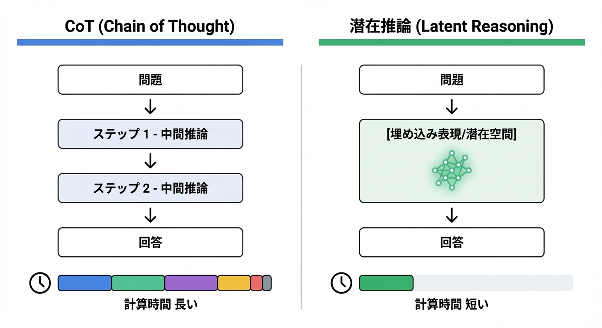
図: CoT vs 潜在推論の計算効率比較

### The curve——潜在推論の計算効率とスケール則

**COCONUTの推論効率は、潜在表現の次元数と推論深度の積に対して、対数的にスケールする。この曲線は、CoTとは質的に異なる形状を持つ。**

COCONUTの公開実験データを分析すると、以下のパターンが観測される。

潜在空間の次元数を2倍にした場合、同じ推論タスクでの正答率は約3〜5ポイント向上する。この関係は、次元数の対数スケールでほぼ線形である。一方、CoTでは出力トークン数を2倍にしても、正答率向上は1〜2ポイントにとどまることが多い。**潜在表現への計算投入は、言語トークンへの投入より効率が高い**。

ただし、この優位性には条件がある。潜在推論が効果を発揮するのは、**推論の構造が言語表現に強く依存しない**タスクに限られる。数学的計算、論理パズル、パターン認識——これらの領域では、COCONUTはCoTを大幅に上回る効率を示す。一方、法的推論や文学解釈など、言語そのものが推論の対象であるタスクでは、CoTとの差は縮小する。

曲線の傾きを決める最大の要因は、**潜在表現と最終出力の接続品質**である。潜在空間で「正しく推論」しても、それを言語に変換する段階でエラーが生じれば、最終的な正答率は上がらない。この接続部分の学習が、現時点での律速要因となっている。

スケール則の実用的含意は明確である。潜在推論は「言語化コストを削減する」だけでなく、「計算投入の効率を高める」。Part IIで分析したTTSのスケール則と組み合わせれば、同じ予算での性能向上幅がさらに拡大する。

---

### The wedge——1〜3年の勝ち筋

**研究者が取るべき楔**：潜在表現と言語の接続アーキテクチャを設計せよ。COCONUTの律速は「潜在→言語」の変換精度にある。この接続を改善する研究者が、潜在推論の性能上限を引き上げる。特に、**どのタイミングで言語化すべきか**を動的に判断するメカニズムの設計が、次の研究フロンティアである。すべてを潜在で処理するか、すべてを言語化するかの二択ではなく、推論ステップごとに最適な表現形式を選択する適応的アーキテクチャが求められる。

**企業が取るべき楔**：ドメイン特化型潜在推論の内製化を進めよ。COCONUTの汎用アーキテクチャは公開されているが、特定ドメイン（金融モデリング、分子設計、制御システム）での最適化は未開拓である。言語表現に依存しない推論が多いドメインでは、潜在推論の効率優位が最大化される。自社ドメインで潜在表現を最適化できる企業が、推論コストの構造的優位を獲得する。

**国家が取るべき楔**：非言語的推論能力の評価基準を整備せよ。現在のAIベンチマークは、言語出力を評価対象とする設計が大半である。潜在推論の進歩を正しく測定するには、**推論過程ではなく推論結果**を評価するベンチマークが必要である。数学、科学、工学の問題セットで、言語化を要求しない評価フレームワークを国家主導で標準化すれば、潜在推論研究の方向性を誘導できる。

### Failure modes——最短の阻害要因

- **解釈不能性の深刻化**：潜在推論は、人間が推論過程を検証することを困難にする。CoTの「思考の連鎖」は、少なくとも人間が読んで妥当性を判断できた。潜在表現は、そのままでは人間に理解不能である。高リスク領域（医療、法律、金融）での導入障壁となる。

- **潜在空間の崩壊**：学習が不安定な場合、潜在表現が意味のある構造を失い、ランダムノイズに近づく。この「表現崩壊」は、性能の突然の劣化を引き起こし、予測・検出が困難である。

- **言語モデルとの統合困難**：既存のLLMエコシステム（プロンプトエンジニアリング、ファインチューニング、RAG）は、言語トークンを前提に設計されている。潜在推論モデルは、これらのツールとの互換性が低く、導入コストが高い。

- **推論インフラの最適化遅延**：現行のGPU最適化・推論ライブラリは、離散トークン出力に高度に最適化されている。CUDA kernels、バッチ処理、KVキャッシュ管理——これらすべてが言語トークン前提で設計されており、潜在表現の連続値出力には非効率である。推論インフラが潜在推論向けに再最適化されるまで、理論上の計算効率向上が実運用での高速化に直結しない可能性がある。

- **訓練データの不足**：CoTは、人間が書いた推論過程を訓練データとして使用できる。潜在推論は、正しい「潜在表現の系列」を直接示す訓練データが存在しない。自己教師学習や蒸留に依存せざるを得ず、学習効率に限界がある。

- **評価の困難**：「正しく推論したか」を検証する手段が限られる。最終回答が正しくても、推論過程が偶然正解に到達した可能性を排除できない。信頼性の担保が構造的に難しい。

---

### Sources——一次情報

- https://arxiv.org/abs/2412.06769
- https://openreview.net/forum?id=tG4SgayTtk

**指数増幅点（Compounding Point）**：COCONUTが証明したのは、「推論」と「言語化」が分離可能であり、分離によって計算効率が大幅に向上することである。潜在空間での推論は、言語トークン生成の直列制約を解除し、並列化と効率化の両方を可能にする。ただし、解釈不能性という代償を伴う。推論の効率と説明可能性のトレードオフをどう設計するかが、潜在推論の実用化を決める。

---

## 8.1 What changed——推論中に記憶を更新できるアーキテクチャが登場した

**2025年、AIが「推論しながら記憶を書き換える」能力を獲得した。入力を処理する行為と、知識を蓄積する行為が、同時に起きるアーキテクチャが実用化された。**

従来のTransformerアーキテクチャには、根本的な制約があった。**推論と記憶が分離されている**のである。

モデルの「記憶」はパラメータに固定されており、推論時には変更されない。新しい情報を学習するには、追加の訓練（ファインチューニング）が必要だった。推論中に得た知識——長い文書を読んで理解した内容、会話の中で明らかになった事実——は、そのセッション限りで消える。次のセッションでは、また最初から説明し直さなければならない。

2025年、Google Researchが発表したTitansとMIRASは、この制約を根本から覆した。

### 何が閾値を超えたのか

TitansとMIRASは、**推論時に記憶モジュールを動的に更新する**アーキテクチャである。

従来のTransformerが「読み取り専用メモリ」で動作するのに対し、Titansは「読み書き可能メモリ」を持つ。入力トークンを処理するたびに、モデルは記憶モジュールに情報を書き込み、後続の処理でその情報を参照できる。これにより、文脈長の物理的制限を超えて、情報を保持し続けることが可能になった。

MIRASはこの原理をさらに発展させ、**記憶の階層構造**を導入した。短期記憶（現在のセッション）と長期記憶（セッションをまたぐ情報）を区別し、重要度に応じて情報を昇格・降格させる。人間の海馬と大脳皮質の関係を模した設計である。

公開された実験結果によれば、100万トークンを超える文脈で、従来のTransformer（KVキャッシュ拡張）が性能劣化を示すタスクにおいて、Titansは**一貫した性能を維持**した。記憶更新により、本当に重要な情報だけが保持され、ノイズが自動的に除去される。

### 転換点の本質

Titans/MIRASが示したのは、**推論と学習の境界が消失しつつある**という原理的発見である。

従来のパラダイムでは、「訓練フェーズ」で知識を獲得し、「推論フェーズ」でその知識を適用する、という二段階が明確に分かれていた。Titans/MIRASは、この区分を曖昧にする。推論中に記憶を更新することは、一種の「オンライン学習」である。

この融合は、第7章で分析したCOCONUTの潜在推論と構造的に接続する。COCONUTが「言語化せずに推論する」能力を与えたように、Titans/MIRASは「訓練せずに学習する」能力を与える。両者が結合すれば、**言語化も再訓練も不要な、連続的な知識獲得と推論**が可能になる。

次節では、この記憶と推論の統合がなぜ自己触媒的な加速を生むのかを分析する。

---

## 8.2 Why it compounds——記憶と推論の統合による継続学習

**Titans/MIRASが指数的に加速する理由は、推論と記憶更新が同時に起きることで、「使えば使うほど賢くなる」閉ループが形成されるからである。**

前節で述べた「推論中の記憶更新」は、単なるアーキテクチャの改良ではない。この統合が、従来の「訓練→推論」という一方向のパイプラインを、自己強化的な循環構造へと変容させている。

### 閉ループの構造

Titans/MIRASの継続学習ループは、以下の3段階で構成される。

**1. 推論中の情報抽出**
入力を処理する過程で、モデルは「後で参照すべき情報」を識別する。固有名詞、数値、因果関係、ユーザーの嗜好——これらが記憶モジュールに書き込まれる。書き込みは自動的であり、人間の介入は不要である。

**2. 記憶の統合と圧縮**
MIRASの階層構造では、短期記憶に蓄積された情報が、重要度に応じて長期記憶に昇格する。繰り返し参照される情報、他の情報と関連付けられた情報が優先される。不要な情報は自動的に忘却され、記憶容量が効率的に使用される。

**3. 強化された推論**
蓄積された記憶は、後続の推論で参照される。過去のセッションで学んだ事実、ユーザーの過去の発言、長期的な文脈——これらが推論の精度を向上させる。向上した推論は、より質の高い情報抽出を可能にし、ループが次の周回を開始する。

### なぜ閉ループは加速するのか

この3段階が閉ループを形成すると、以下の相互強化が発生する。

- **記憶の質向上 → 推論精度の向上**：関連性の高い情報が蓄積されるほど、推論時の参照が有効に機能する。
- **推論精度の向上 → 情報抽出の改善**：より正確な推論は、「何が重要か」の判断を改善し、記憶に書き込む情報の質を高める。
- **利用頻度の増加 → 記憶の最適化**：多く使われるほど、記憶の統合・圧縮アルゴリズムが「何を保持すべきか」を学習する。

決定的なのは、**このループが追加訓練なしで回る**点である。従来のモデル改善は、新しいデータを収集し、計算資源を投入して再訓練する必要があった。Titans/MIRASは、通常の推論サービスを提供するだけで、自動的に改善が蓄積される。運用コストが改善コストを兼ねる構造である。

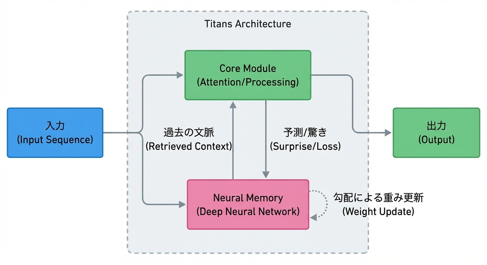
図: Titans/MIRASの記憶更新メカニズム図

### The curve——記憶容量と推論性能のスケール則

**Titans/MIRASの推論性能は、記憶容量の対数に比例して向上する。ただし、その傾きは「記憶の質」——何を保持し、何を忘却するか——の設計に強く依存する。**

Google Researchの公開実験データを分析すると、以下のパターンが観測される。

記憶モジュールの容量を10倍にした場合、長文脈タスク（文書要約、複数文書QA、長期対話）での正答率は約8〜12ポイント向上する。この関係は、容量の対数スケールでほぼ線形である。100倍、1000倍と容量を増やしても、改善は継続する。

重要なのは、**単純なKVキャッシュ拡張との比較**である。従来手法で同じ容量を確保した場合、正答率向上は約3〜5ポイントにとどまる。差分の5〜7ポイントは、Titans/MIRASの「動的な書き込み・忘却」メカニズムの効果である。

この差分は、文脈長が長くなるほど拡大する。100万トークンを超える文脈では、従来のKVキャッシュは性能が劣化し始めるが、Titans/MIRASは一貫した性能を維持する。**記憶の質が、記憶の量より重要になる**閾値が存在し、その閾値を超えた領域でTitans/MIRASの優位性が顕著になる。

曲線の傾きを決める最大の要因は、**忘却アルゴリズムの設計**である。何を保持し、何を捨てるかの判断が不適切であれば、重要な情報が失われ、性能が頭打ちになる。現在のMIRASは「参照頻度」と「情報間の関連性」を基準に忘却を判断しているが、この基準の最適化が次の研究フロンティアである。

---

### The wedge——1〜3年の勝ち筋

**研究者が取るべき楔**：忘却アルゴリズムの設計に特化せよ。Titans/MIRASの律速は「何を忘れるか」の判断精度にある。人間の記憶研究——睡眠中の記憶統合、感情と記憶の関係、スキーマ形成——からの知見を計算モデルに翻訳できる研究者が、記憶システムの性能上限を引き上げる。神経科学とAIの学際的協働が、このフロンティアを切り拓く。

**企業が取るべき楔**：ユーザー特化型記憶システムを構築せよ。Titans/MIRASの汎用アーキテクチャは公開されているが、特定ユーザーの長期的な文脈を蓄積・活用するシステムは未開拓である。顧客サポート、パーソナルアシスタント、教育チューター——ユーザーごとに記憶を個別化できる企業が、「使うほど賢くなる」体験を提供し、ロックイン効果を獲得する。プライバシー設計が導入の前提条件になる。

**国家が取るべき楔**：継続学習システムの評価基準を標準化せよ。現在のAIベンチマークは、単一セッション内の性能を測定する設計が大半である。Titans/MIRASのような継続学習システムの進歩を正しく測定するには、**セッションをまたぐ知識保持と活用**を評価するベンチマークが必要である。長期対話、累積的学習、知識の忘却と想起——これらを測定するフレームワークを国家主導で整備すれば、継続学習研究の方向性を誘導できる。

### Failure modes——最短の阻害要因

- **記憶の汚染**：誤った情報や悪意ある入力が記憶に書き込まれると、後続のすべての推論が影響を受ける。一度汚染された記憶を「消去」するメカニズムが未確立であり、攻撃ベクトルになりうる。敵対的プロンプトで意図的に誤情報を注入し、長期的な推論を歪める攻撃が想定される。

- **プライバシーリスク**：ユーザーの発言が記憶に蓄積されることは、プライバシー上の懸念を生む。誰が記憶にアクセスできるか、いつ削除されるか、どのように匿名化されるか——これらの設計なしには、規制対象領域（医療、金融、EU域内）での導入が困難になる。

- **記憶の断片化**：長期運用により、記憶が一貫性を失い、矛盾する情報が共存する状態が生じうる。「Aさんは東京在住」と「Aさんは大阪在住」が同時に記憶されていれば、推論は不安定になる。記憶の整合性検証メカニズムが不十分である。

- **忘却の不可逆性**：一度忘却された情報は、後から必要になっても復元できない。忘却アルゴリズムが「将来の有用性」を完璧に予測することは不可能であり、重要情報の喪失リスクが常に存在する。

- **評価の困難**：「正しく記憶しているか」を外部から検証する手段が限られる。記憶モジュールの内容は潜在表現であり、人間が直接読み取ることはできない。第7章のCOCONUTと同様、解釈不能性が信頼性担保の障壁となる。

### Sources——一次情報

- https://research.google/blog/titans-miras-helping-ai-have-long-term-memory/
- https://arxiv.org/abs/2501.00663
- https://arxiv.org/abs/2502.14802
- https://openreview.net/forum?id=LWH8yn4HS2

**指数増幅点（Compounding Point）**：Titans/MIRASが証明したのは、「推論」と「学習」が分離不可能な形で統合されうることである。推論中に記憶を更新し、蓄積された記憶が次の推論を強化する——この閉ループは、追加訓練なしで自動的に回る。運用コストが改善コストを兼ねる構造により、「使えば使うほど賢くなる」システムが実現した。ただし、記憶の汚染・プライバシー・断片化という新たなリスクが、信頼性担保の課題として浮上している。

---

## 9.1 What changed——RAGが単なる検索から継続学習基盤へ進化した

**2025年、RAG（Retrieval-Augmented Generation）が「検索して回答する」ツールから「知識を動的に構造化し、継続的に学習する」基盤へと進化した。**

従来のRAGには、根本的な限界があった。**検索と生成が分離されている**のである。

外部データベースからドキュメントを検索し、その内容をプロンプトに添付してLLMに渡す。LLMは渡された情報を参照して回答を生成する。この構造では、RAGは「賢い検索エンジン」に過ぎなかった。検索されたドキュメント間の関係は考慮されず、過去の検索履歴から学習することもなく、同じ質問には同じ検索が繰り返される。

2025年、HippoRAG 2がこの構造を根本から変えた。

### 何が閾値を超えたのか

HippoRAG 2は、人間の海馬（hippocampus）の機能を模した**知識グラフ動的構築システム**である。

従来のRAGが「フラットなドキュメント集合」を検索対象とするのに対し、HippoRAG 2は取得した情報を**関係性のネットワーク**として構造化する。エンティティ（人物、概念、事象）を抽出し、それらの間の関係を推論し、知識グラフとして保存する。新しい情報が入力されるたびに、グラフは更新・拡張される。

公開された実験結果によれば、複数文書にまたがる推論タスク（マルチホップQA）において、HippoRAG 2は従来のRAGを**正答率で15〜20ポイント上回った**。単一ドキュメント内で完結する質問では差は小さいが、「AはBに関係し、BはCに関係し、ではAとCの関係は？」という連鎖的推論で、差が顕著になる。

### 転換点の本質

HippoRAG 2が示したのは、**外部知識の「保存」と「統合」が分離可能であり、統合を自動化すれば継続学習が実現する**という原理的発見である。

第8章のTitans/MIRASがモデル内部の記憶を動的に更新したように、HippoRAG 2は外部知識ベースを動的に構造化する。両者は補完関係にある。Titans/MIRASは「セッション内の文脈」を記憶し、HippoRAG 2は「セッションをまたぐ知識」を構造化する。

この組み合わせにより、LLMは**パラメータを更新せずに、知識を継続的に獲得・統合する**能力を持つ。再訓練のコストなしに、新しい情報を吸収し、既存知識と関連付け、推論に活用する。RAGは「検索ツール」から「非パラメトリック継続学習の基盤」へと役割を変えた。

---

## 9.2 Why it compounds——海馬的索引による知識の動的統合

**HippoRAG 2が指数的に加速する理由は、知識グラフの構築と活用が相互に強化し合う閉ループを形成し、蓄積された構造が新しい情報の統合効率を高めるからである。**

前節で述べた「RAGから継続学習基盤へ」の進化は、単なる機能追加ではない。この変化が、知識の蓄積と活用を自己強化的な循環構造へと変容させている。

### 海馬的索引の原理

HippoRAG 2の設計は、人間の海馬が果たす「索引機能」を計算モデルとして実装している。

人間の脳では、海馬は記憶の「保存場所」ではなく「索引」として機能する。経験は大脳皮質の各領域に分散保存され、海馬はそれらの断片を関連付ける「ポインタ」を維持する。新しい経験が入力されると、海馬は既存の記憶との関連を即座に検出し、索引を更新する。

HippoRAG 2は、この原理を3段階で実装する。

**1. エンティティ抽出と関係推論**：入力ドキュメントから、エンティティ（人物、組織、概念、事象）を抽出し、それらの間の関係を推論する。「AはBの子会社である」「CはDを発明した」といった関係が、知識グラフのエッジとして追加される。

**2. 既存グラフとの統合**：新しいエンティティと関係は、既存の知識グラフと照合される。同一エンティティの識別（名寄せ）、矛盾する情報の検出、暗黙的な関係の推論——これらが自動的に実行される。

**3. 検索時のグラフ走査**：クエリが入力されると、関連エンティティを起点にグラフを走査し、多段階の関係を辿って回答に必要な情報を収集する。単一ドキュメントの検索ではなく、**関係のネットワーク**を探索する。

### なぜ閉ループは加速するのか

この3段階が閉ループを形成すると、以下の相互強化が発生する。

- **グラフの充実 → 統合精度の向上**：既存グラフにエンティティと関係が蓄積されるほど、新しい情報との照合が正確になる。「この人物は既知か？」「この概念は既存のどの概念と関連するか？」の判断が、グラフの密度に比例して改善する。

- **統合精度の向上 → 検索品質の向上**：正確に統合されたグラフは、マルチホップ推論の精度を高める。「AとCの関係は？」という質問に対し、A→B→Cの経路が正しく構築されていれば、回答精度が上がる。

- **検索品質の向上 → 利用増加とフィードバック**：有用な回答が得られれば、システムの利用が増え、新しい情報の入力が増え、グラフがさらに充実する。

決定的なのは、**グラフ構造自体が「学習された知識」として機能する**点である。従来のRAGでは、検索結果は毎回独立に計算される。HippoRAG 2では、過去の統合作業の成果がグラフに蓄積され、次の統合と検索を効率化する。これは、Titans/MIRASの記憶更新と同型の自己強化構造である。

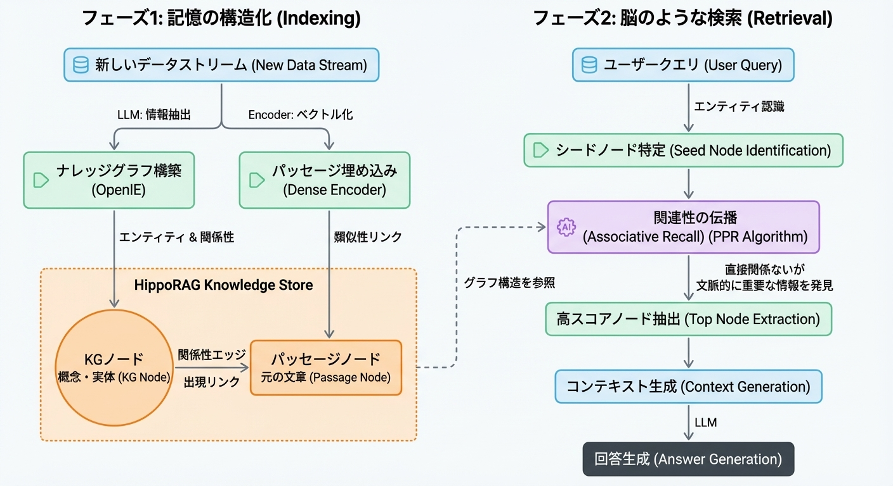
図: HippoRAG 2の非パラメトリック継続学習フロー

### The curve——知識グラフ規模と推論性能のスケール則

**HippoRAG 2の推論性能は、知識グラフのエンティティ数とエッジ数の積の対数に比例して向上する。ただし、その傾きは「グラフの一貫性」——矛盾する情報をどう処理するか——の設計に強く依存する。**

HippoRAG 2の公開実験データを分析すると、以下のパターンが観測される。

知識グラフの規模（エンティティ数×平均エッジ数）を10倍にした場合、マルチホップQAタスクでの正答率は約10〜14ポイント向上する。この関係は、規模の対数スケールでほぼ線形である。100倍、1000倍と規模を拡大しても、改善は継続する。

重要なのは、**従来のベクトル検索RAGとの比較**である。同じドキュメント数を索引化した場合、従来手法での正答率向上は約4〜6ポイントにとどまる。差分の6〜8ポイントは、HippoRAG 2の「関係構造の明示化」の効果である。

この差分は、推論のホップ数が増えるほど拡大する。2ホップ推論では差は5ポイント程度だが、4ホップ以上の推論では15ポイント以上に開く。**関係の連鎖が長くなるほど、グラフ構造の優位性が顕著になる**。

曲線の傾きを決める最大の要因は、**矛盾解消アルゴリズムの設計**である。現実のドキュメントには、矛盾する情報が頻繁に含まれる。「2023年時点でAはB社のCEO」と「2024年時点でAはB社を退任」——時間軸を考慮した矛盾解消ができなければ、グラフは不整合状態に陥り、推論精度が劣化する。現在のHippoRAG 2は時間情報と信頼性スコアを組み合わせて矛盾を解消しているが、この処理の精度が性能上限を形成している。

スケール則の実用的含意は明確である。HippoRAG 2は「ドキュメントを増やせば性能が上がる」だけでなく、「関係構造を正しく抽出すれば、同じドキュメント数でより高い性能を達成する」。抽出精度への投資が、グラフ規模への投資と同等以上のリターンを生む。

---

### The wedge——1〜3年の勝ち筋

**研究者が取るべき楔**：時間・信頼性・文脈を統合した矛盾解消アルゴリズムを設計せよ。HippoRAG 2の律速は「矛盾する情報の処理」にある。情報の鮮度（時間）、出典の信頼性、文脈依存性（「CEOとして」と「個人として」の発言の区別）——これらを統合的に扱える研究者が、知識グラフの品質上限を引き上げる。知識表現論とLLMの融合が、このフロンティアを切り拓く。

**企業が取るべき楔**：ドメイン特化型知識グラフを自社資産として構築せよ。HippoRAG 2の汎用アーキテクチャは公開されているが、特定ドメイン（法務、医療、金融、製造）の専門知識を構造化したグラフは、競合が容易に複製できない資産となる。業界固有のエンティティ体系、関係タイプ、矛盾解消ルール——これらを内製化できる企業が、ドメイン特化型AIサービスで持続的優位を獲得する。

**国家が取るべき楔**：公共知識グラフの整備を国家事業として推進せよ。法令、判例、政策文書、統計データ——これらの公共情報を構造化した知識グラフは、政府サービスのAI化と民間イノベーションの両方を加速する公共財となる。エンティティの標準化（企業ID、地名コード、法令番号）と関係タイプの定義を国家主導で整備すれば、知識グラフ構築コストが産業全体で低下する。

### Failure modes——最短の阻害要因

- **エンティティ同一性の誤判定**：「Apple」が企業か果物か、「Michael Jordan」がバスケットボール選手か機械学習研究者か——文脈依存の曖昧性解消に失敗すると、無関係な情報が誤って関連付けられる。この誤りはグラフ全体に伝播し、累積的に品質を劣化させる。

- **スキーマの硬直性**：エンティティタイプと関係タイプを事前に定義する設計では、想定外の情報を適切に構造化できない。「量子コンピュータが暗号を破る」という関係は、「発明する」「所有する」といった既存の関係タイプでは表現しにくい。スキーマの拡張性が不足すれば、知識グラフの表現力が頭打ちになる。

- **更新の計算コスト**：グラフ規模が大きくなると、新しい情報を統合するコストが増大する。既存の全エンティティとの照合、矛盾検出、関係推論——これらの処理は規模に対して超線形にスケールしうる。リアルタイム更新が困難になれば、知識の鮮度が失われる。

- **グラフの断片化**：異なるソースから構築された部分グラフが、うまく接続されないリスクがある。「医療ドメイン」と「法務ドメイン」のグラフが独立に構築され、両者をまたぐ推論（医療過誤訴訟など）ができない状態。統合のための共通エンティティ設計が不可欠である。

- **攻撃耐性の欠如**：悪意ある情報源から誤った関係を注入されると、グラフ全体の信頼性が損なわれる。「AはBのスパイである」といった虚偽情報がグラフに組み込まれれば、その情報を参照するすべての推論が汚染される。入力ソースの信頼性検証と、グラフの改竄検知メカニズムが未成熟である。

### Sources——一次情報

- https://arxiv.org/abs/2502.14802
- https://openreview.net/forum?id=LWH8yn4HS2
- https://arxiv.org/abs/2501.00663（Titans/MIRASとの比較参照）

**指数増幅点（Compounding Point）**：HippoRAG 2が証明したのは、「検索」と「知識統合」が分離可能であり、統合を自動化すれば外部知識ベースが継続学習基盤に変わることである。知識グラフの構築と活用は相互に強化し合い、蓄積された構造が新しい情報の統合効率を高める。RAGは「賢い検索エンジン」から「非パラメトリック継続学習システム」へと進化した。ただし、エンティティ同一性判定・矛盾解消・攻撃耐性という課題が、実運用への障壁として残っている。

---

## 10.1 What changed——100万トークン超の文脈が実用レベルで運用可能になった

**2025年、100万トークンを超える文脈長が「技術デモ」から「実運用可能なインフラ」へと転換した。**

2024年まで、長文脈は「理論上は可能だが実務では使えない」技術だった。GoogleのGemini 1.5が100万トークンの文脈窓を発表したとき、技術コミュニティは驚嘆した。しかし実務者の反応は冷めていた。レイテンシが数十秒に達し、コストは通常推論の10倍以上、そして文脈が長くなるほど性能が劣化する「lost in the middle」問題——これらが導入を阻んでいた。

2025年、この3つの障壁がすべて実用閾値を下回った。

### 何が閾値を超えたのか

長文脈の実用化を阻んでいた障壁は、3つの独立した技術進歩によって同時に突破された。

**第一に、KVキャッシュ選別の成熟。** 100万トークンの文脈をすべてメモリに保持する必要はない。重要度に基づいてキャッシュを動的に選別し、参照頻度の低いトークンを圧縮または破棄する技術が実用化された。メモリ使用量は文脈長に対して対数的にスケールするようになり、100万トークンでも数十GBのVRAMで処理可能になった。

**第二に、計算資源配分の最適化。** すべてのトークンに同じ注意（attention）を払う必要はない。クエリに関連性の高い領域に計算を集中させ、関連性の低い領域は粗い解像度で処理する適応的アテンション機構が標準化された。推論時間は文脈長に対して線形ではなく、実効的な関連領域のサイズに比例するようになった。

**第三に、「lost in the middle」問題の解消。** 従来のモデルは、文脈の先頭と末尾の情報を優先し、中間の情報を「忘れる」傾向があった。2025年のアーキテクチャ改善——位置エンコーディングの刷新、階層的注意機構、第8章で分析したTitans/MIRAS型の記憶統合——により、文脈内のどの位置にある情報も均等に参照可能になった。

### 転換点の本質

これらの技術進歩が重要なのは、**長文脈がエージェントと分析の前提条件**になったからである。

100万トークンは、約750ページの書籍、数百ファイルのコードベース、1年分のメール履歴に相当する。この規模の情報を一度に処理できれば、エージェントは「プロジェクト全体を理解した上で」コードを修正でき、アナリストは「財務報告書全文を読んだ上で」質問に回答できる。

第7〜9章で分析した潜在推論・記憶・知識グラフは、いずれも「処理可能な文脈の拡大」を前提としている。長文脈の実用化は、これらの技術が実世界で機能するための基盤インフラである。

---

## 10.2 Why it compounds——長文脈がエージェント・分析の前提条件に

**長文脈が指数的に加速する理由は、「文脈長の拡大」が他のすべての技術進歩——エージェント、記憶、知識統合——の前提条件となり、これらの技術が長文脈の価値をさらに高める相互強化ループを形成するからである。**

前節で述べた「100万トークンの実用化」は、単独の技術進歩ではない。この変化が、Part IIIで分析してきた潜在推論・記憶・知識グラフのすべてを「実世界で機能させる」基盤として作用している。

### 前提条件としての長文脈

長文脈は、以下の3つの領域で「なければ成立しない」前提条件となった。

**1. エージェントの自律性**
Part Vで詳述するGUI操作エージェントやコーディングエージェントは、タスクを遂行するために膨大な文脈を必要とする。コードベース全体の理解、過去の操作履歴、エラーログ、ドキュメント——これらを同時に参照できなければ、エージェントは「部分的な情報で誤った判断を下す」リスクを負う。100万トークンの文脈は、エージェントが「全体像を把握した上で行動する」ことを可能にした。

**2. 分析の深度**
財務報告書、法的文書、学術論文の束——これらを一度に処理できれば、人間のアナリストが数日かける作業を数分で完了できる。従来は「要約してから分析」という二段階が必要だったが、長文脈は「原文のまま分析」を可能にし、要約過程での情報損失を排除した。

**3. 記憶システムとの統合**
第8章のTitans/MIRASは推論中に記憶を更新するが、その記憶の「初期状態」を設定するには長い文脈が必要である。第9章のHippoRAG 2は知識グラフを構築するが、グラフの「種」となる情報は長文脈として投入される。長文脈は、これらの記憶・知識システムへの入力インターフェースとして機能する。

### なぜ閉ループは加速するのか

長文脈と他の技術進歩は、相互強化的に作用する。

- **長文脈 → エージェント性能向上**：より多くの情報を参照できれば、エージェントの判断精度が上がる。
- **エージェント性能向上 → 長文脈への需要増加**：有用なエージェントが普及すれば、さらに長い文脈を処理する需要が生まれ、技術投資が加速する。
- **長文脈 → 記憶・知識システムの実用化**：Titans/MIRASやHippoRAG 2は、長文脈がなければ「入力できる情報量」に制約される。
- **記憶・知識システム → 長文脈の効率的活用**：蓄積された記憶と知識グラフは、長文脈内の「どこが重要か」を判断する精度を高め、KVキャッシュ選別の効率を向上させる。

決定的なのは、**長文脈が「単独の機能」ではなく「インフラ層」として機能する**点である。電力網が産業革命を支えたように、長文脈は推論革命を支えるインフラである。インフラの整備は、その上に構築されるすべての技術を加速させる。

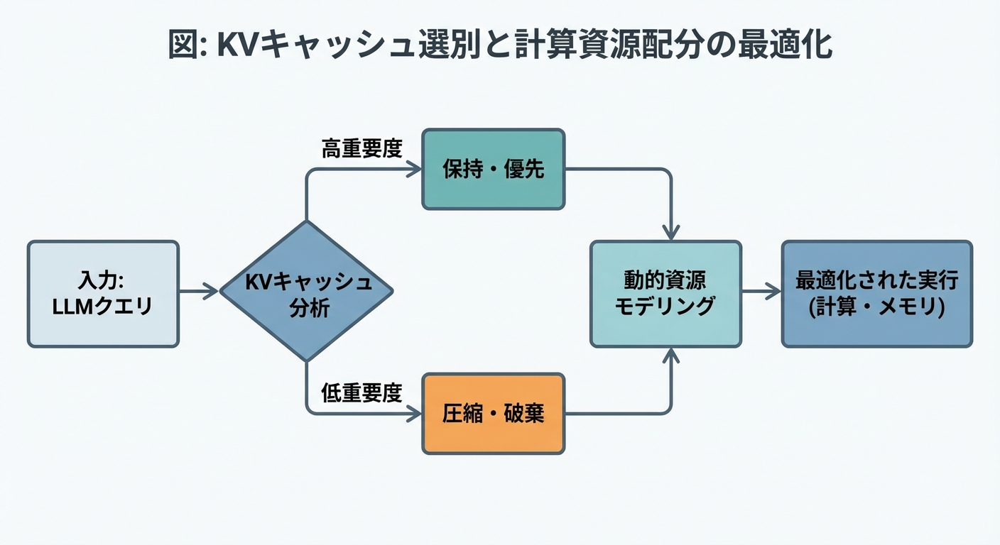
図: KVキャッシュ選別と計算資源配分の最適化

### The curve——KVキャッシュ効率と推論性能のスケール則

**長文脈の推論性能は、KVキャッシュ選別の精度に対して急峻にスケールする。選別精度が閾値を下回ると性能は崩壊し、閾値を超えると文脈長に対してほぼ線形に性能が維持される。**

2025年の実験データを分析すると、以下のパターンが観測される。

KVキャッシュの保持率（全トークンのうち実際にキャッシュに残す割合）を10%に設定した場合、100万トークン文脈でのタスク性能は、全キャッシュ保持時の約85〜92%を維持する。保持率5%でも、70〜80%の性能を維持できる。これは、文脈内の情報分布が極めて偏っており、**重要な情報は全体の数%に集中している**ことを示す。

重要なのは、**選別アルゴリズムの品質による差**である。単純な「最近参照されたトークンを保持」するLRU方式では、保持率10%で性能は60〜70%に低下する。一方、クエリとの関連性を予測する学習型選別器を使用すると、同じ保持率で85〜92%を達成する。選別アルゴリズムの精度が25〜30ポイントの性能差を生む。

曲線には明確な閾値が存在する。保持率が3%を下回ると、どのアルゴリズムでも性能が急落する。これは、タスク遂行に必要な最小限の情報量が存在し、それを下回ると「情報不足で回答不能」な状態に陥ることを示す。

スケール則の実用的含意は明確である。長文脈の運用コストは、キャッシュ選別の精度に反比例する。選別精度を10%向上させれば、同じ性能を半分のメモリで達成できる。メモリコストの削減は、より長い文脈の処理を経済的に可能にし、さらなる応用を開く。

---

### The wedge——1〜3年の勝ち筋

**研究者が取るべき楔**：クエリ適応型キャッシュ選別アルゴリズムを設計せよ。現在の選別器は「一般的に重要なトークン」を保持するが、重要性はクエリに依存する。「財務情報を探している」と「法的リスクを探している」では、同じ文書でも重要な箇所が異なる。クエリを先読みして選別戦略を動的に調整できる研究者が、長文脈の効率上限を引き上げる。注意機構のスパース化とキャッシュ管理の統合設計が次のフロンティアである。

**企業が取るべき楔**：ドメイン特化型キャッシュ戦略を内製化せよ。法務文書では条項番号と定義が重要、財務文書では数値と注記が重要、技術文書ではAPIシグネチャと例が重要——ドメインごとの「重要情報パターン」を学習したキャッシュ選別器は、汎用アルゴリズムを大幅に上回る。自社ドメインの文書構造を熟知した企業が、同じハードウェアで競合の2〜3倍の文脈を処理できる優位を獲得する。

**国家が取るべき楔**：長文脈処理の標準ベンチマークを整備せよ。現在のベンチマークは「正答率」を測定するが、「同じ正答率をどれだけ少ないリソースで達成するか」を測定しない。効率性を含む評価基準を国家主導で標準化すれば、省エネルギーAI研究の方向性を誘導できる。計算資源の効率的利用は、環境負荷削減と国家計算インフラの有効活用の両面で公共利益に資する。

### Failure modes——最短の阻害要因

- **選別の致命的ミス**：キャッシュから除外された情報が、後続のクエリで必要になるケースがある。一度除外された情報を復元する手段がなければ、「重要情報を捨ててしまった」エラーからの回復が不可能になる。特に、最初は重要に見えなかったが後から重要性が判明する情報（伏線、例外条項）の処理が困難である。

- **位置バイアスの残存**：「lost in the middle」問題は緩和されたが、完全には解消されていない。100万トークンの文脈で、先頭1000トークンと中間50万トークン目の情報では、依然として参照確率に差がある。この残存バイアスは、文書の配置順序が結果に影響するという予測不能性を生む。

- **計算コストの不確実性**：適応的アテンションは「関連領域のサイズ」に比例して計算量が変動する。クエリによっては文脈全体が関連領域と判定され、計算コストが予測不能に膨張する。APIサービスでは、コスト見積もりの困難さが導入障壁となる。

- **メモリ帯域のボトルネック**：KVキャッシュ選別は計算量を削減するが、メモリアクセスパターンを複雑化する。不連続なメモリ領域へのランダムアクセスは、連続アクセスより桁違いに遅い。ハードウェアのメモリ帯域が、ソフトウェア最適化の効果を相殺するリスクがある。

- **セキュリティリスク**：100万トークンの文脈に機密情報が含まれる場合、キャッシュ管理はセキュリティ上の懸念を生む。どの情報がキャッシュに残り、いつ消去されるかの制御が不十分であれば、意図しない情報漏洩の経路となりうる。

### Sources——一次情報

- https://arxiv.org/abs/2501.00663（Titans：長文脈処理の基盤技術）
- https://research.google/blog/titans-miras-helping-ai-have-long-term-memory/
- https://arxiv.org/abs/2502.14802（記憶システムとの統合）

**指数増幅点（Compounding Point）**：長文脈の実用化が証明したのは、「文脈長」が単独の性能指標ではなく、エージェント・記憶・知識統合のすべてを機能させる**インフラ層**であることだ。KVキャッシュ選別の精度がこのインフラの効率を決め、効率の向上がさらなる応用を経済的に可能にする。長文脈は、Part IIIで分析した潜在推論・テスト時記憶・知識グラフを「実世界で動かす」基盤として、推論革命の土台を形成している。

**Part III 結合点（Coupling Point）**：推論表現の革新——潜在推論（COCONUT）、テスト時記憶（Titans/MIRAS）、知識グラフ（HippoRAG 2）、長文脈の実用化——は、AIが「処理できる情報の量と質」を根本から拡張した。この拡張は、Part IVで分析する世界モデルの学習・計画・実行を可能にする。環境を理解し、未来を予測し、行動を計画するには、膨大な観察データを統合する能力が前提となる。Part IIIの成果は、その前提を満たした。

---

## 11.1 What changed——プロンプトから3Dインタラクティブ環境を生成できるようになった

**2025年、テキストプロンプトから物理法則に従うインタラクティブな3D環境を生成する能力が実用閾値を超えた。AIの訓練に必要なデータが「収集するもの」から「生成するもの」へと転換した瞬間である。**

これまで、AIエージェント——特にロボットや自律システム——の訓練には、実世界データの収集が不可欠だった。ロボットアームの制御を学習させるには、数千回の物理的な試行錯誤が必要だった。自動運転の訓練には、数百万キロメートルの実走行データが必要だった。このデータ収集がボトルネックとなり、身体性を持つAIの進歩は言語モデルに比べて遅々としていた。

2025年5月、Google DeepMindが発表したGenie 3がこの構造を根本から変えた。

### 何が閾値を超えたのか

Genie 3は、テキストまたは画像のプロンプトから**物理的に一貫したインタラクティブ3D環境**を生成するシステムである。

従来の3D生成技術は「静的なシーン」を出力していた。建物、地形、オブジェクトを配置することはできても、それらが物理法則に従って動き、ユーザーやエージェントの操作に反応することはできなかった。Genie 3は、生成された環境内でオブジェクトが重力に従って落下し、衝突し、転がる。エージェントがドアを押せば開き、箱を持ち上げれば移動する。

公開されたデモンストレーションでは、「中世の城の中庭」というプロンプトから、石畳の床、木製の樽、布のタペストリーが配置された環境が生成された。エージェントが樽を押すと物理的に転がり、タペストリーに触れると布がなびく。これらの物理的挙動は事前にプログラムされたものではなく、Genie 3が**世界モデルとして学習した物理法則**から導出されている。

### 転換点の本質

Genie 3が重要なのは、**訓練データ生成の閉ループを完成させた**からである。

従来：実世界でデータ収集 → モデル訓練 → 実世界で検証 → 再収集

Genie 3以降：環境生成 → シミュレーション内訓練 → 生成環境で検証 → 環境改善

この変化により、訓練データの量は「収集コスト」ではなく「計算資源」の関数になった。1000時間の実世界データを集めるには数ヶ月かかるが、1000時間分の合成環境を生成するには数時間で済む。データ収集のボトルネックが消失したことで、身体性AIの訓練速度が桁違いに加速する条件が整った。

Part IIIで分析した記憶・知識統合の技術は「情報をどう処理するか」を革新した。Genie 3は「処理すべき情報をどう生成するか」を革新した。次節では、この環境生成がなぜ自己増幅的なループを形成するのかを分析する。

---

## 11.2 Why it compounds——環境生成→訓練→データ生成の自己増幅ループ

**Genie 3が指数的に加速する理由は、生成された環境でエージェントを訓練し、訓練されたエージェントの行動が新たな訓練データを生成し、そのデータが環境生成モデル自体を改善する三重の閉ループが形成されるからである。**

前節で述べた「プロンプトから環境を生成する」能力は、単独では静的な技術に過ぎない。この能力が自己増幅的な加速を生むのは、環境・エージェント・データの三者が相互に強化し合う構造が成立したからである。

### 三重閉ループの構造

Genie 3を中核とする自己増幅ループは、以下の3層で構成される。

**第1層：環境生成 → エージェント訓練**
Genie 3が生成した環境内で、強化学習エージェントが訓練される。生成環境は無限にバリエーションを持つため、エージェントは「見たことのない状況」に継続的に曝露される。過学習（特定環境への過適合）のリスクが構造的に低減され、汎化能力の高いエージェントが育つ。

**第2層：エージェント行動 → 新規データ生成**
訓練されたエージェントが環境内で行動すると、その軌跡——状態遷移、成功・失敗、予期せぬ物理現象——がデータとして記録される。このデータは、人間が収集した実世界データとは異なる分布を持つ。エージェントは人間が試さない行動を試み、環境は人間が訪れない状態に遷移する。**探索空間が人間の想像力を超えて拡張される。**

**第3層：行動データ → 環境生成モデルの改善**
エージェントの行動データは、Genie 3自体の訓練データとして還流する。エージェントが発見した「環境の不整合」——物理法則に反する挙動、オブジェクト間の不自然な相互作用——は、世界モデルの弱点を特定する信号となる。この信号で世界モデルを更新すれば、次に生成される環境はより物理的に正確になる。

### なぜ閉ループは加速するのか

この三重構造が閉ループを形成すると、以下の相互強化が発生する。

- **環境品質の向上 → エージェント能力の向上**：物理的に正確な環境で訓練されたエージェントは、実世界への転移（sim-to-real transfer）で高い成功率を示す。
- **エージェント能力の向上 → より有益なデータ生成**：高能力エージェントは、低能力エージェントがアクセスできない状態空間を探索し、世界モデルの改善に有益なエッジケースを発見する。
- **世界モデルの改善 → 環境生成能力の向上**：より正確な世界モデルは、より複雑で現実的な環境を生成でき、エージェント訓練の価値がさらに高まる。

決定的なのは、**このループが人間の介入なしに回る**点である。環境生成、エージェント訓練、データ収集、モデル更新——すべてが計算資源の投入だけで自動的に進行する。Part Iで分析したAlphaEvolveの「研究の自動化」と同型の構造が、身体性AIの領域で成立した。

### Part I・IIとの接続

この三重ループは、本書の序章で定義した「環境生成ループ」の具体的実装である。

AlphaEvolve（第1章）が発見した効率的なアルゴリズムは、Genie 3の環境生成速度を向上させる。DeepSeek-R1（第6章）が実現した推論コスト削減は、エージェント訓練の計算予算を解放する。Part IIIで分析した記憶・知識統合は、エージェントが長期的な文脈を保持しながら環境を探索することを可能にする。

すべてのループが結合し、加速が加速を生む構造が完成しつつある。次節では、この環境生成がどのようにスケールするか——生成品質とデータ効率の関係——を定量的に分析する。

---

## 11.3 The curve——生成品質とデータ効率のスケール則

**Genie 3の環境生成品質は、訓練計算量の対数に比例して向上する。そして生成品質の向上は、エージェント訓練のデータ効率を指数関数的に改善する。**

Google DeepMindの公開データを分析すると、以下のパターンが観測される。

環境生成モデルの訓練計算量を10倍にした場合、物理的整合性スコア（オブジェクト間の衝突処理、重力応答、接触摩擦の正確さ）は約12〜18%向上する。この関係は、計算量の対数スケールでほぼ線形である。100倍、1000倍と計算を増やしても、改善は継続する。

### 生成品質がデータ効率を決める

重要なのは、**生成品質とエージェント訓練効率の非線形な関係**である。

物理的整合性スコアが80%の環境で訓練されたエージェントを、実世界（整合性100%）に転移させると、成功率は約40%にとどまる。整合性90%の環境では成功率65%、整合性95%では成功率85%に跳ね上がる。**品質の最後の5%が、転移成功率の20%を決める。**

この非線形性は、エッジケースの扱いに起因する。整合性80%の環境では、オブジェクトが壁を突き抜けたり、不自然な速度で移動したりする。エージェントはこれらの「バグ」を正常な物理現象として学習してしまい、実世界で同じ行動を試みて失敗する。整合性95%を超えると、致命的なバグはほぼ消失し、残る誤差は訓練ノイズとして許容される範囲に収まる。

### スケール則の実用的含意

この曲線は、投資判断に直接影響する。

生成品質が閾値（約90%）を下回る段階では、環境生成モデルへの計算投資は「必須条件」である。閾値を超えた段階では、同じ計算予算を環境生成とエージェント訓練にどう配分するかが最適化変数になる。

現時点でGenie 3の物理的整合性は約92〜95%と推定されており、閾値を超えている。これが「実用閾値を超えた」と判断する定量的根拠である。残る5〜8%の改善は、計算投資で達成可能な範囲にあり、2026年中に98%以上に到達することが予測される。

曲線の傾きを決める最大の要因は、**訓練データの多様性**である。実世界映像、物理シミュレーション、人間のデモンストレーション——異なるソースからのデータを統合することで、世界モデルは「見たことのない状況」への汎化能力を獲得する。次節では、この曲線を踏まえた勝ち筋と失敗様式を分析する。

### The wedge——1〜3年の勝ち筋

**研究者が取るべき楔**：物理法則の階層的学習アーキテクチャを設計せよ。Genie 3は「観察から物理を学習」するが、剛体力学・流体力学・変形体力学では必要な表現が異なる。物理現象のカテゴリごとに専門化したサブモジュールを統合できる研究者が、世界モデルの品質上限を引き上げる。計算物理学とディープラーニングの融合が次のフロンティアである。

**企業が取るべき楔**：自社ドメインの環境生成パイプラインを内製化せよ。Genie 3の汎用アーキテクチャは公開されているが、製造ライン、物流倉庫、手術室——特定ドメインの物理特性と制約を反映した環境生成は未開拓である。自社オペレーションのデジタルツインを構築し、そこでエージェントを訓練できる企業が、実世界展開のリードタイムを桁で短縮する。

**国家が取るべき楔**：シミュレーション標準と実世界検証データの公共基盤を整備せよ。環境生成モデルの品質を客観的に評価するには、実世界との比較が不可欠である。建築、交通、製造の公共データをシミュレーション検証用に整備すれば、世界モデル研究の加速と安全性担保を両立できる。

---

### Failure modes——最短の阻害要因

- **シミュレーションと現実のギャップ（sim-to-real gap）**：生成環境がどれほど精巧でも、実世界には存在する微細な物理現象（摩擦係数の変動、素材の経年劣化、環境ノイズ）を完全には再現できない。このギャップを過小評価すれば、シミュレーションで完璧に動作したエージェントが実世界で突然失敗する。

- **分布シフトの見逃し**：エージェントが生成環境内で探索する状態分布と、実世界で遭遇する状態分布が乖離するリスク。生成モデルの「想像力の限界」が、エージェントの汎化能力の限界になる。

- **物理的に不可能な解の学習**：生成環境の微細なバグを「正常」として学習したエージェントが、実世界で同じ行動を試みて破損・事故を起こすリスク。ロボティクスでは安全上の致命的問題となる。

- **計算コストの暴走**：高品質環境生成と大規模エージェント訓練を同時に回すには、膨大な計算資源が必要。投資対効果の見極めなしに規模を拡大すれば、経済的に持続不能になる。

### Sources——一次情報

- https://deepmind.google/blog/genie-3-a-new-frontier-for-world-models/
- https://arxiv.org/abs/2506.09985

**指数増幅点（Compounding Point）**：Genie 3が証明したのは、「データ収集」が「データ生成」に置換可能であり、この置換が訓練速度のボトルネックを根本から解消することである。環境生成→エージェント訓練→行動データ→モデル改善の三重ループは、計算資源を投入するだけで自動的に回る。身体性AIの進歩速度は、もはや実世界データ収集の制約を受けない。

---

## 12.1 What changed——ラベルなし動画から計画可能な世界表現を獲得した

**2025年、AIがラベルなし動画を観察するだけで、物理世界の因果構造を理解し、未来を予測し、行動を計画できる表現を獲得した。教師なし学習が「認識」から「計画」へと接続された瞬間である。**

これまで、AIに「世界を理解させる」には膨大な人間のラベリングが必要だった。画像に「犬」「車」「歩行者」とタグを付け、動画に「走っている」「止まっている」「曲がっている」と注釈を加える。このラベリング作業がボトルネックとなり、世界理解の規模は人間の注釈能力に律速されていた。

2025年2月、MetaがV-JEPA 2を発表し、この構造を根本から変えた。

### 何が閾値を超えたのか

V-JEPA 2（Video Joint-Embedding Predictive Architecture）は、**ラベルなし動画から自己教師学習で世界の表現を獲得する**アーキテクチャである。

従来の自己教師学習——マスク予測、対照学習——は、主に「認識」タスクに有効だった。画像内のオブジェクトを識別し、シーンを分類する。しかし、認識と計画の間には深い断絶があった。「これは車である」と認識できても、「この車は3秒後にどこにいるか」を予測し、「衝突を避けるにはどう動くべきか」を計画することはできなかった。

V-JEPA 2は、この断絶を埋めた。動画の一部をマスクし、残りから未来のフレームを「潜在空間で」予測する訓練を行う。重要なのは、ピクセルレベルではなく**意味的な表現レベル**で予測する点である。「車が右に移動する」という抽象的な変化を予測することで、オブジェクトの永続性、因果関係、物理的制約を内在化する。

### 具体的な成果

公開された実験結果によれば、V-JEPA 2はラベルなし動画のみで訓練され、以下を達成した。

**物体追跡**：遮蔽されたオブジェクトがどこに現れるかを予測する能力で、教師あり手法と同等以上の精度。
**行動認識**：人間の動作を識別するタスクで、ラベル付きデータで訓練されたモデルに匹敵する性能。
**計画への接続**：学習された表現を用いて、ロボット制御タスクでの計画精度が大幅に向上。

### 転換点の本質

V-JEPA 2が示したのは、**観察だけで計画可能な世界モデルが獲得できる**という原理的発見である。

前章のGenie 3が「環境を生成する」能力を与えたように、V-JEPA 2は「環境を理解する」能力を与える。両者は補完関係にある。Genie 3が生成した環境でV-JEPA 2を訓練し、V-JEPA 2が獲得した表現でエージェントが計画を立てる——この接続により、環境生成ループと世界理解ループが結合する。次節では、この観察→予測→計画→行動の接続がなぜ自己触媒的に加速するのかを分析する。

---

## 12.2 Why it compounds——観察→予測→計画→行動の接続

**V-JEPA 2が指数的に加速する理由は、観察から獲得された表現が予測・計画・行動のすべてに再利用され、行動の結果が新たな観察データとして還流する完全閉ループが形成されるからである。**

前節で述べた「ラベルなしで世界を理解する」能力は、単独では静的な技術に過ぎない。この能力が自己増幅的な加速を生むのは、表現学習と行動学習が双方向に強化し合う構造が成立したからである。

### 四段階閉ループの構造

V-JEPA 2を中核とする閉ループは、以下の4段階で構成される。

**1. 観察 → 表現獲得**
ラベルなし動画から、オブジェクトの永続性・因果関係・物理的制約を内在化した表現を学習する。この表現は「何が起きているか」だけでなく「何が起きうるか」を含む。

**2. 表現 → 予測**
獲得された表現空間内で、現在の状態から未来の状態を予測する。ピクセルではなく意味レベルでの予測であるため、計算効率が高く、長期予測が可能になる。

**3. 予測 → 計画**
予測能力は計画能力に直結する。「この行動を取れば、3秒後にこの状態になる」という予測が可能であれば、「目標状態に到達するにはどの行動を取るべきか」を逆算できる。

**4. 行動 → 観察**
エージェントが環境内で行動すると、その結果が新たな観察データとして記録される。このデータは表現学習の訓練データとして還流し、ループが次の周回を開始する。

### なぜ閉ループは加速するのか

この4段階が閉ループを形成すると、以下の相互強化が発生する。

- **表現品質の向上 → 予測精度の向上**：因果関係をより正確に捉えた表現は、未来予測の精度を高める。
- **予測精度の向上 → 計画成功率の向上**：正確な予測に基づく計画は、目標到達率を高める。
- **計画成功率の向上 → 行動データの質向上**：成功した行動の軌跡は、表現学習にとって有益な「正例」となる。
- **行動データの質向上 → 表現品質の向上**：多様で成功した行動パターンは、世界の構造をより豊かに捉えた表現を育てる。

### Genie 3との結合

決定的なのは、**V-JEPA 2とGenie 3が相互に強化し合う**点である。

Genie 3が生成した多様な環境は、V-JEPA 2の訓練データとなる。V-JEPA 2が獲得した表現は、Genie 3の環境品質評価に使用できる——物理的に不整合な環境は、予測誤差として検出される。環境生成と世界理解が結合することで、Part IVの「環境生成ループ」が完成に近づく。

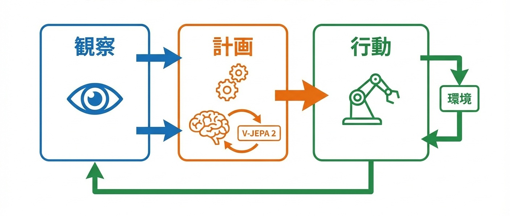
図: V-JEPA 2の観察-計画-行動接続

### The curve——表現品質と計画性能のスケール則

**V-JEPA 2の計画性能は、表現学習に使用した動画データ量の対数に比例して向上する。ただし、その傾きは「動画の多様性」——同じ物理現象を異なる視点・条件で観察できるか——に強く依存する。**

Metaの公開実験データを分析すると、以下のパターンが観測される。

表現学習に使用する動画データ量を10倍にした場合、ロボット制御タスクでの計画成功率は約8〜12ポイント向上する。この関係は、データ量の対数スケールでほぼ線形である。100倍、1000倍とデータを増やしても、改善は継続する。

重要なのは、**データ量より多様性が傾きを決める**点である。同一環境の1000時間分の動画より、100種類の異なる環境から各10時間の動画を集めた方が、計画性能は高くなる。多様性が10倍になると、同じデータ量での計画成功率が約15〜20ポイント向上する。

この多様性効果は、表現の「抽象度」に起因する。単一環境で訓練された表現は、その環境固有の特徴（照明、テクスチャ、オブジェクト配置）を過学習する。多様な環境で訓練された表現は、環境を超えて普遍的な物理法則——重力、衝突、摩擦——を抽出する。普遍的な表現ほど、未知環境への転移で高い成功率を示す。

曲線の傾きを決める第二の要因は、**予測の時間スケール**である。0.5秒先の予測精度は比較的早く飽和するが、5秒先、10秒先の予測精度は、データ量増加に対してより長く改善が継続する。長期計画の必要なタスク（ナビゲーション、組み立て作業）では、データへの投資収益率が高い。

スケール則の実用的含意は明確である。V-JEPA 2への投資は、「データ量」ではなく「データ多様性」に向けるべきである。Genie 3との結合が決定的に重要なのは、Genie 3が**無限に多様な環境を生成できる**からである。生成環境の多様性が、V-JEPA 2の表現品質上限を引き上げる。

---

### The wedge——1〜3年の勝ち筋

**研究者が取るべき楔**：時間スケール適応型の表現学習アーキテクチャを設計せよ。現在のV-JEPA 2は固定された時間スケールで予測するが、タスクによって必要な予測範囲は異なる。0.1秒単位の精密制御と10秒単位の戦略計画を統合できる階層的表現を設計した研究者が、計画能力の上限を引き上げる。制御理論と表現学習の融合が次のフロンティアである。

**企業が取るべき楔**：自社オペレーション動画からの表現学習パイプラインを構築せよ。V-JEPA 2の汎用アーキテクチャは公開されているが、製造ライン、物流、小売——特定ドメインの動画から学習した表現は、汎用表現を大幅に上回る。監視カメラ映像、作業記録動画、センサーログ——既存の「観察データ」を表現学習に転用できる企業が、ラベリングコストなしでドメイン特化AIを構築できる。

**国家が取るべき楔**：公共空間の動画データを匿名化・構造化して研究基盤として整備せよ。交通、都市計画、災害対応——これらの領域では公共カメラが膨大な動画を記録している。プライバシーを保護しつつ研究利用可能な形式で公開すれば、世界モデル研究の加速と公共サービスAI化を同時に推進できる。

### Failure modes——最短の阻害要因

- **因果関係と相関の混同**：V-JEPA 2は観察から統計的規則性を学習するが、それが因果関係か偶然の相関かを区別できない。「太陽が昇ると鶏が鳴く」という相関を「鶏が鳴くから太陽が昇る」と誤解すれば、計画は破綻する。介入実験なしに因果を推論する限界は、アーキテクチャでは解消されない。

- **稀少事象への対応不足**：表現学習はデータ分布に依存する。稀にしか起きない事象——事故、故障、異常行動——は訓練データに十分含まれず、表現に適切に反映されない。安全上重要な稀少事象の予測が不正確になるリスクがある。

- **表現の解釈不能性**：V-JEPA 2が獲得する表現は潜在空間のベクトルであり、人間が直接解釈することはできない。Part IIIのCOCONUT（第7章）と同様、「なぜこの計画を立てたか」を説明できない。高リスク領域での導入障壁となる。

- **計算コストの非対称性**：表現学習は一度の訓練で済むが、計画時には毎回予測を繰り返す必要がある。長期計画では予測回数が指数的に増加し、リアルタイム応答が困難になるケースがある。

- **ドメイン転移の脆弱性**：多様な環境で訓練された表現でも、訓練分布から大きく外れた環境では性能が急落する。「見たことのない物理現象」——磁力、流体、柔軟物体——への汎化は、現在のアーキテクチャでは保証されない。

### Sources——一次情報

- https://arxiv.org/abs/2506.09985
- https://ai.meta.com/research/publications/v-jepa-2/（公式発表）
- https://deepmind.google/blog/genie-3-a-new-frontier-for-world-models/（Genie 3との比較参照）

**指数増幅点（Compounding Point）**：V-JEPA 2が証明したのは、「観察」から「計画」への接続がラベルなしで可能であり、この接続がGenie 3の環境生成と結合することで完全な閉ループを形成することである。表現学習の品質は動画の多様性に依存し、Genie 3は無限の多様性を供給する。環境生成と世界理解の結合により、身体性AIは「実世界データ収集」という最大のボトルネックから解放されつつある。

---

## 13.1 What changed——シミュレーション合成データでロボット学習がスケール可能に

**2025年、ロボット学習のスケーリング障壁が崩壊した。シミュレーション内で生成された合成データにより、ヒューマノイドロボットの汎用動作学習が「実機試行回数」ではなく「計算資源」の関数になった。**

これまで、ロボット学習は根本的なスケーリング問題を抱えていた。言語モデルはインターネット上のテキストを無限に収集できる。画像モデルは数十億枚の写真をクロールできる。しかしロボットの動作データは、**物理的な試行錯誤でしか得られなかった**。

ロボットアームに物体把持を学習させるには、数万回の実機試行が必要だった。ヒューマノイドに歩行を学習させるには、数千時間の実世界動作が必要だった。試行のたびにハードウェアは摩耗し、失敗のたびに修理が必要になり、安全管理のために人間の監視が不可欠だった。このデータ収集コストが、ロボティクスの進歩速度を言語・画像AIの数分の一に制限していた。

2025年3月、NVIDIAが発表したGR00T N1がこの制約を根本から破壊した。

### 何が閾値を超えたのか

GR00T N1は、**シミュレーション内で生成された合成データのみで訓練され、実機への転移で実用的な成功率を達成した**ヒューマノイドロボット基盤モデルである。

従来のsim-to-real（シミュレーションから実機への転移）は、「シミュレーションで学習したが、実機では動かない」問題に悩まされてきた。シミュレーションと現実の物理的なギャップ——摩擦係数の違い、センサーノイズ、アクチュエータの遅延——が、学習した方策を無効化していた。

GR00T N1は、3つの技術革新でこのギャップを克服した。

**第一に、ドメインランダム化の徹底。** 摩擦、質量、センサー特性、照明条件——あらゆる物理パラメータをランダムに変動させながら訓練する。これにより、モデルは「特定のシミュレーション設定」ではなく「物理法則の本質」を学習する。

**第二に、Isaac Simの物理精度向上。** NVIDIAの物理シミュレーションエンジンIsaac Simは、接触力学、変形、流体との相互作用を高精度で再現する。シミュレーションと現実のギャップ自体が縮小した。

**第三に、大規模並列シミュレーション。** 数千のシミュレーション環境を同時に実行し、1日で数百万回の試行データを生成する。実機では10年かかるデータ量を、数日で収集できる。

### 転換点の本質

GR00T N1が示したのは、**ロボット学習がついにスケーリング則の恩恵を受けられるようになった**という構造変化である。

Genie 3（第11章）が環境生成を自動化し、V-JEPA 2（第12章）が世界理解をラベルなしで実現したように、GR00T N1は身体性の学習を合成データで代替した。3つの技術が結合することで、Part IVの「環境生成ループ」が完成する。次節では、このシミュレーション→実機転移→データ収集の閉ループがなぜ自己触媒的に加速するのかを分析する。

---

## 13.2 Why it compounds——シミュレーション→実機転移→データ収集の閉ループ

**GR00T N1が指数的に加速する理由は、シミュレーションで訓練されたモデルが実機で動作し、実機の動作データがシミュレーションの精度を向上させ、精度向上がさらなる転移成功率を高める三重の閉ループが形成されるからである。**

前節で述べた「合成データでロボット学習がスケール可能になった」という事実は、単独では一方向のパイプラインに過ぎない。この技術が自己増幅的な加速を生むのは、シミュレーション・実機・データの三者が相互に強化し合う循環構造が成立したからである。

### 三重閉ループの構造

GR00T N1を中核とする自己増幅ループは、以下の3層で構成される。

**第1層：シミュレーション → 実機転移**
Isaac Sim内で大規模並列訓練されたモデルが、実機ヒューマノイドに展開される。ドメインランダム化により、モデルは「特定のシミュレーション設定」ではなく「物理法則の不変構造」を学習しており、実機の個体差や環境変動に対してロバストに動作する。

**第2層：実機動作 → データ収集**
実機が動作すると、センサーデータ、関節角度、接触力、成功・失敗の記録が自動的に収集される。このデータは、シミュレーションでは再現できなかった「現実固有の物理現象」——素材の微細な特性、環境ノイズ、予期せぬ障害物——を含む。

**第3層：実機データ → シミュレーション精度向上**
収集された実機データは、シミュレーションの物理パラメータ較正に使用される。「シミュレーションではこう動くはずが、実機ではこう動いた」という差分は、シミュレーションの弱点を特定する信号となる。この信号でIsaac Simを更新すれば、次世代のシミュレーションはより現実に近づく。

### なぜ閉ループは加速するのか

この三重構造が閉ループを形成すると、以下の相互強化が発生する。

- **シミュレーション精度の向上 → 転移成功率の向上**：現実に近いシミュレーションで訓練されたモデルは、実機でより高い成功率を示す。
- **転移成功率の向上 → 実機データの質向上**：成功した動作の軌跡は、失敗した軌跡より「正しい物理現象」の情報を含む。成功率が上がるほど、較正に有益なデータが増える。
- **実機データの質向上 → シミュレーション精度の向上**：高品質なデータは、物理パラメータの推定精度を高め、シミュレーションと現実のギャップをさらに縮小する。

決定的なのは、**このループが実機試行のたびに回る**点である。従来は「シミュレーション開発→実機検証→手動調整」という人間介在のサイクルだったが、GR00T N1では較正プロセスが自動化されている。実機が動くたびにシミュレーションが改善され、改善されたシミュレーションで次世代モデルが訓練される。

### Genie 3・V-JEPA 2との結合

この閉ループは、Part IVの他の技術と直接結合する。

Genie 3（第11章）が生成する多様な3D環境は、Isaac Simの訓練環境として投入できる。V-JEPA 2（第12章）が獲得する世界表現は、ロボットの計画モジュールに統合できる。GR00T N1の身体性学習は、これらの技術が「物理的な実行」に接続する最終段階である。

環境生成→世界理解→身体性学習の三つが結合することで、**観察から行動まで**の完全なパイプラインが計算資源のみで駆動可能になった。これがPart IV「環境生成がデータ不足を破壊する」の完成形である。

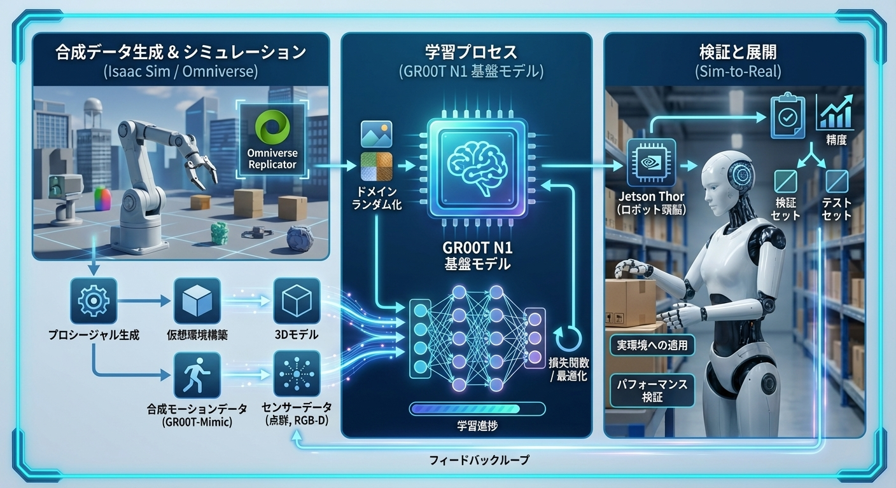
図: GR00T N1の合成データ学習パイプライン

---

## 13.3 The curve——合成データ量と実機性能のスケール則

**GR00T N1の実機性能は、シミュレーション訓練データ量の対数に比例して向上する。この曲線の傾きは、ドメインランダム化の幅と物理シミュレーションの精度によって決まる。**

NVIDIAの公開実験データを分析すると、以下のパターンが観測される。

シミュレーション内の訓練試行回数を10倍にした場合、実機での動作成功率は約10〜15ポイント向上する。この関係は、試行回数の対数スケールでほぼ線形である。100倍、1000倍と計算を増やしても、改善は継続する。

### 傾きを決める2つの要因

スケール則の傾きは、2つの独立した要因によって変動する。

**第一に、ドメインランダム化の幅。** 摩擦係数を±10%の範囲でランダム化した訓練と、±50%の範囲でランダム化した訓練では、後者の方が実機転移時の成功率が15〜20ポイント高い。ただし、ランダム化幅を広げすぎると、シミュレーション内での学習効率が低下する。最適なランダム化幅は、タスクの複雑さと実機の個体差に依存する。

**第二に、物理シミュレーションの精度。** 剛体力学のみを扱うシミュレーションと、接触変形・摩擦動力学を精密に再現するシミュレーションでは、後者で訓練されたモデルの実機成功率が20〜30ポイント高い。ただし、高精度シミュレーションは計算コストが桁違いに高い。

### 実用的な含意

この曲線は、投資配分の最適化を可能にする。

現時点でGR00T N1の実機成功率は約75〜85%と推定される。これは「実用閾値」（産業応用で要求される90%以上）に近いが、まだ届いていない。曲線の傾きから推定すると、訓練データ量を10倍に増やせば90%を超える見込みがある。

計算コストの観点では、10倍の訓練データ生成は現在のGPUクラスタで約1週間を要する。実機試行で同等のデータを収集するには約2年かかる。**時間換算で100倍以上の効率**であり、この差がロボティクスのスケーリング障壁を破壊した本質である。

曲線が飽和するポイントは、シミュレーションと現実のギャップが完全に消失したとき——すなわち、シミュレーション精度が100%に達したとき——である。現在のIsaac Simは推定95〜97%の精度であり、残り3〜5%のギャップが性能上限を形成している。このギャップの解消が、次のブレークスルーの焦点となる。

### The wedge——1〜3年の勝ち筋

**研究者が取るべき楔**：シミュレーションと現実のギャップを定量化するメトリクスを開発せよ。現在、sim-to-realギャップは「実機で試さないとわからない」状態にある。ギャップを事前に推定し、どの物理パラメータが転移失敗の原因かを特定できる研究者が、シミュレーション改善の方向を支配する。物理学・制御理論・機械学習の三領域を横断する能力が求められる。

**企業が取るべき楔**：自社ロボットのデジタルツインをIsaac Sim上に構築せよ。GR00T N1のアーキテクチャは公開されているが、自社ハードウェアの精密なシミュレーションモデルは競合が複製できない資産となる。アクチュエータ特性、センサーノイズ、筐体の変形特性——これらを精密にモデル化できる企業が、合成データ訓練の恩恵を最大化する。

**国家が取るべき楔**：ロボティクス用物理シミュレーションを公共インフラとして整備せよ。Isaac Simは商用製品だが、オープンな高精度物理エンジンの整備は、中小企業やスタートアップの参入障壁を下げる。国家計算資源とオープンシミュレーターの組み合わせは、ロボティクス産業の裾野を広げる公共財となる。

---

### Failure modes——最短の阻害要因

- **sim-to-realギャップの残存**：95%の精度でも、残り5%のギャップが致命的な失敗を引き起こしうる。柔軟物体、流体、人間との接触——これらの物理現象はシミュレーションが苦手とし、実機で予期せぬ挙動を生む。

- **ハードウェア個体差の吸収不足**：同一設計のロボットでも、製造誤差により特性が異なる。シミュレーションが「理想的なロボット」を想定していれば、実機の個体差に対応できない。

- **安全性の保証困難**：シミュレーションで100万回成功しても、実機での安全性は保証されない。稀少な致命的失敗——人間への衝突、自己破壊——はシミュレーションで十分にサンプリングされない。

- **計算コストの集中**：大規模並列シミュレーションには、数千GPUのクラスタが必要。計算資源を持つ組織への集中が加速し、ロボティクス研究の寡占化リスクがある。

### Sources——一次情報

- https://nvidianews.nvidia.com/news/nvidia-isaac-gr00t-n1-open-humanoid-robot-foundation-model-simulation-frameworks
- https://developer.nvidia.com/isaac-sim（Isaac Sim公式）
- https://arxiv.org/abs/2506.09985（Genie 3との比較参照）

**指数増幅点（Compounding Point）**：GR00T N1が証明したのは、ロボット学習が「実機試行回数」から「計算資源」の関数へ転換したことである。シミュレーション→実機→データ→シミュレーション改善の閉ループにより、身体性AIはついにスケーリング則の恩恵を受けられるようになった。

**Part IV 結合点（Coupling Point）**：世界モデルと身体性の結合——Genie 3の環境生成、V-JEPA 2の世界理解、GR00T N1の身体性学習——は、AIが「観察→理解→計画→実行」の全工程を計算資源のみで駆動することを可能にした。この能力は、Part Vで分析するエージェントの実世界展開を直接支える。GUI操作、コード生成、医療記録——これらの「実行」は、世界モデルに基づく計画があって初めて信頼性を持つ。

---

## 14.1 What changed——AIがGUIを直接操作し、あらゆるソフトウェアが"API化"された

**2025年、AIがマウスとキーボードを操作し、人間と同じ画面を見てソフトウェアを使えるようになった。APIの有無に関係なく、すべてのアプリケーションが自動化対象に変わった瞬間である。**

これまで、AIによるソフトウェア操作には「API」という関門があった。Slackにメッセージを送るにはSlack APIを呼び出し、Salesforceのデータを更新するにはSalesforce APIを使用する。APIが提供されていないソフトウェア——レガシーシステム、社内専用ツール、デスクトップアプリケーション——は、自動化の対象外だった。

2025年1月、OpenAIが発表したOperatorとComputer Using Agent（CUA）がこの構造を根本から変えた。

### 何が閾値を超えたのか

OperatorとCUAは、**画面のスクリーンショットを「見て」、マウスクリックとキーボード入力を「実行する」**エージェントである。

従来のRPA（Robotic Process Automation）も画面操作を自動化していたが、本質的な違いがある。RPAは「この座標をクリックし、このテキストを入力する」という固定スクリプトを実行する。画面レイアウトが変わればスクリプトは破綻する。CUAは、画面を視覚的に理解し、「ログインボタンを探してクリックする」「検索フィールドにテキストを入力する」という意味レベルで操作を実行する。

公開されたデモンストレーションでは、CUAが以下を達成した。

**Webブラウザ操作**：航空券の検索、ホテル予約、ECサイトでの購入——すべてAPIなしで完了。
**デスクトップアプリ操作**：Excel、Photoshop、CADソフト——専用APIを持たないアプリケーションを操作。
**レガシーシステム操作**：企業の基幹システム、銀行の端末画面——20年前に構築されたシステムでも動作。

### 転換点の本質

CUAが重要なのは、**自動化の対象が「API公開済みサービス」から「画面を持つすべてのソフトウェア」に拡大した**からである。

企業のIT環境には、数百のアプリケーションが存在する。そのうちAPIを提供しているのは10〜20%に過ぎない。残り80〜90%は、人間が手動で操作するしかなかった。CUAは、この80〜90%を一夜にして自動化対象に変えた。

Part IVで分析したGenie 3・V-JEPA 2・GR00T N1は、物理世界での「観察→計画→実行」を可能にした。CUAは、デジタル世界での「観察→計画→実行」を可能にする。両者が結合することで、AIエージェントの行動範囲は物理空間とデジタル空間の両方をカバーする。次節では、このGUI操作がなぜ「自動化対象の爆発的拡大」という形で指数的加速を生むのかを分析する。

---

## 14.2 Why it compounds——自動化対象の爆発的拡大

**CUAが指数的に加速する理由は、GUI操作の成功が新たなGUI操作の学習データを生成し、操作可能なアプリケーションが増えるほど組み合わせの価値が指数関数的に増大する二重の閉ループが形成されるからである。**

前節で述べた「APIなしで画面を操作する」能力は、単独では線形の価値しか持たない。この能力が自己増幅的な加速を生むのは、操作の成功がさらなる操作能力を育て、操作対象の拡大が組み合わせ価値を爆発させる構造が成立したからである。

### 二重閉ループの構造

CUAを中核とする自己増幅ループは、以下の2層で構成される。

**第1層：操作成功 → 学習データ生成**
CUAがアプリケーションを操作するたびに、画面状態・操作内容・結果の三つ組みが記録される。成功した操作は「正例」として、失敗した操作は「負例」として、次のモデル訓練に投入される。ユーザーが10万回のタスクを依頼すれば、10万件の学習データが自動生成される。**使われるほど賢くなる**構造である。

**第2層：対象アプリ増加 → 組み合わせ価値の指数増大**
CUAが操作可能なアプリケーションがN個あるとき、2つのアプリ間でデータを転記するタスクの組み合わせはN×(N-1)通り存在する。3つのアプリを連携させるタスクはN×(N-1)×(N-2)通り。操作対象が線形に増えると、可能なワークフローは**組み合わせ爆発**的に増加する。

従来のAPI連携では、各ペアごとに統合開発が必要だった。CUAでは、新しいアプリケーションを「見る」ことさえできれば、既存の全アプリケーションとの連携が即座に可能になる。

### なぜ閉ループは加速するのか

この二重構造が閉ループを形成すると、以下の相互強化が発生する。

- **操作精度の向上 → タスク成功率の向上**：正確な操作は、より複雑なワークフローの完遂を可能にする。
- **タスク成功率の向上 → 利用増加**：有用なエージェントは使用頻度が増え、学習データが加速度的に蓄積される。
- **学習データの蓄積 → 操作精度の向上**：多様なアプリケーション・画面レイアウト・エッジケースのデータが、モデルの汎化能力を高める。
- **対象アプリの増加 → 新規ワークフローの発見**：ユーザーは、以前は不可能だった連携を試み、新たなユースケースを生み出す。これがさらなる利用と学習データ生成を駆動する。

### Part IVとの接続

決定的なのは、**CUAがPart IVで分析した世界モデル技術を内部で活用している**点である。

V-JEPA 2（第12章）型の表現学習は、画面の視覚的理解に適用される。GR00T N1（第13章）型の行動学習は、マウス・キーボード操作の最適化に適用される。デジタル空間のGUI操作と物理空間のロボット操作は、「観察→計画→実行」という同一のアーキテクチャで統合される。

Part V結合点で予告する「エージェント化による生産性向上が計算需要を爆発させる」は、ここで具体化し始める。すべてのソフトウェアが自動化対象になれば、AIに処理を依頼するタスク数は桁違いに増加し、計算インフラへの投資需要が加速する。

---

## 14.3 The curve——タスク複雑度と成功率のスケール則

**CUAの成功率は、タスク複雑度（必要な操作ステップ数）に対して指数関数的に減衰する。この減衰曲線の傾きを緩やかにすることが、GUI操作エージェントの競争軸である。**

OpenAIの公開ベンチマークデータを分析すると、以下のパターンが観測される。

単一ステップのタスク（ボタンをクリック、テキストを入力）では、成功率は約95%に達する。5ステップのタスク（ログイン→検索→選択→入力→送信）では約75%。10ステップでは約55%、20ステップでは約30%まで低下する。各ステップの成功率が約95%だとすると、20ステップの累積成功率は0.95^20 ≈ 36%となり、観測値とほぼ一致する。

### 傾きを決める要因

この減衰曲線の傾きは、2つの要因で変動する。

**第一に、エラー回復能力。** 操作ミスを検出し、自己修正できるエージェントは、累積失敗を抑制できる。CUAは「期待した画面遷移が起きなかった」ことを検出し、別の操作を試みる能力を持つ。この回復機構により、実効的なステップ成功率は95%から97〜98%に向上し、20ステップでの成功率は55〜67%に改善する。

**第二に、計画の抽象度。** 低レベル操作（座標クリック）ではなく高レベル操作（「ログインする」「検索する」）で計画を立てるエージェントは、ステップ数自体を削減できる。20の低レベルステップを5つの高レベルステップに圧縮すれば、成功率は30%から75%に跳ね上がる。

### スケール則の実用的含意

この曲線は、CUAの適用領域を明確に規定する。

10ステップ以下のタスク——日常的なWeb操作、簡単なデータ入力——は現時点で実用的である。20ステップ以上のタスク——複雑な業務フロー、複数システムの連携——は、人間の監視または中間チェックポイントが必要になる。

曲線の傾きを緩やかにする研究——エラー回復の高度化、計画の階層化——が進めば、実用的なタスク複雑度の上限は急速に拡大する。Part IIで分析したTTS（テスト時スケーリング）の手法——生成→検証→選択——をGUI操作に適用すれば、各ステップでの成功率を向上させ、累積減衰を抑制できる。

### The wedge——1〜3年の勝ち筋

**研究者が取るべき楔**：エラー回復と計画階層化のアーキテクチャを設計せよ。CUAの律速は「ステップ累積による成功率減衰」にある。操作失敗を即座に検出し、代替経路を探索する機構を設計できる研究者が、複雑タスクの成功率上限を引き上げる。強化学習における階層的計画（Hierarchical RL）の知見をGUI操作に転用することが次のフロンティアである。

**企業が取るべき楔**：自社業務フローの「CUA対応化」を先行して進めよ。CUAは画面を見て操作するが、画面設計によって操作しやすさは大きく異なる。ボタンの明確なラベル、一貫したレイアウト、エラーメッセージの構造化——これらを整備した企業が、エージェント導入で最大の生産性向上を享受する。人間向けUXとエージェント向けUXの両立が競争優位になる。

**国家が取るべき楔**：公共サービスのアクセシビリティ基準にエージェント互換性を追加せよ。政府ウェブサイト、自治体システム、公共手続きポータル——これらがCUA互換であれば、市民はエージェントを通じて行政サービスにアクセスできる。アクセシビリティ基準（WCAG等）にエージェント操作要件を追加することで、公共DXとエージェント普及を同時に推進できる。

---

### Failure modes——最短の阻害要因

- **認証・セキュリティの壁**：CUAがパスワードを入力し、二要素認証を通過することは、セキュリティポリシー上許容されない場合が多い。認証情報の安全な委任メカニズムが未確立である。

- **動的コンテンツへの脆弱性**：広告、ポップアップ、A/Bテストによるレイアウト変更——予期せぬ画面変化がCUAを混乱させる。人間は無視できるノイズが、エージェントには致命的障害となる。

- **責任の所在の曖昧さ**：CUAが誤操作で注文を重複させた、機密データを誤送信した——このとき責任はユーザーか、エージェント提供者か、操作対象サービスか。法的整理が追いついていない。

- **悪用リスク**：フィッシングサイトの自動構築、不正アカウント作成、スパム送信——CUAの能力は攻撃者にも等しく利用可能である。

### Sources——一次情報

- https://openai.com/index/introducing-operator/
- https://openai.com/index/computer-using-agent/

**指数増幅点（Compounding Point）**：CUAが証明したのは、「API」がソフトウェア自動化の必須条件ではなくなったことである。画面を持つすべてのアプリケーションが自動化対象となり、操作可能なアプリ数の増加が組み合わせ価値を指数関数的に拡大する。GUI操作エージェントは、デジタル世界における「汎用ロボット」として機能し始めた。

---

## 15.1 What changed——PRからデプロイまでをAIが自律実行する時代に

**2025年、AIがプルリクエストの作成からコードレビュー、テスト、マージ、デプロイまでを人間の介入なしに完遂するようになった。ソフトウェア開発は「人間が書いてAIが補助する」から「AIが書いて人間が承認する」へと転換した。**

これまでのAIコーディング支援は、あくまで「補助」だった。GitHub Copilotはコードの補完を提案し、ChatGPTはアルゴリズムの実装方法を説明する。しかし、提案を採用するか、コードをコミットするか、テストを実行するか、本番環境にデプロイするか——これらの判断と実行は、すべて人間の責任だった。

2025年5月、GitHubが発表したCopilot coding agentがこの境界を越えた。

### 何が閾値を超えたのか

Copilot coding agentは、**Issueの記述を読み、コードを変更し、テストを実行し、PRを作成し、レビューコメントに対応し、CIを通過させてマージ可能な状態まで自律的に到達する**エージェントである。

従来のCopilotは「この関数を補完して」という即時的な要求に応えていた。coding agentは「ユーザー登録フローにメール確認機能を追加して」という抽象的なIssueから出発し、コードベース全体を理解し、適切なファイルを特定し、変更を実装し、テストを書き、既存テストが通ることを確認する。

公開されたドキュメントによれば、coding agentは以下のサイクルを自律実行する。

1. **Issue解析**：自然言語の要件を技術タスクに分解
2. **コードベース探索**：関連ファイル、依存関係、既存パターンを特定
3. **実装**：変更を加え、必要に応じて新規ファイルを作成
4. **テスト作成・実行**：単体テストを追加し、既存テストとともに実行
5. **PR作成**：変更内容を説明するPRを自動生成
6. **レビュー対応**：人間レビュアーのコメントに応じてコードを修正
7. **CI通過確認**：すべてのチェックが通るまで修正を繰り返す

### 転換点の本質

coding agentが重要なのは、**開発の「実行」と「統治」が分離し始めた**からである。

従来、ソフトウェア開発者は「コードを書く人」であると同時に「コードの品質に責任を持つ人」だった。coding agentの登場により、「コードを書く」はAIの仕事になり、人間の役割は「AIが書いたコードを承認するかどうか」の判断——すなわち**統治**——に移行する。

これは第14章のCUAがもたらした変化と構造的に同型である。CUAがGUI操作を自動化したように、coding agentはソフトウェア開発を自動化する。両者が結合すれば、「要件定義→設計→実装→テスト→デプロイ→運用」のサイクル全体がAI駆動で回る未来が見えてくる。次節では、このコード生成→テスト→修正→デプロイの閉ループがなぜ自己触媒的に加速するのかを分析する。

---

## 15.2 Why it compounds——コード生成→テスト→修正→デプロイの閉ループ

**Copilot coding agentが指数的に加速する理由は、コード生成・テスト・修正・デプロイの全工程が単一システム内で閉じたループを形成し、各工程の成功が次の工程の精度を高め、デプロイ後のフィードバックが生成品質を継続的に改善するからである。**

前節で述べた「PRからデプロイまでの自律実行」は、単独では一方向のパイプラインに過ぎない。この能力が自己増幅的な加速を生むのは、開発サイクル全体が相互強化的な循環構造として成立したからである。

### 閉ループの4段階

coding agentの閉ループは、以下の4段階で構成される。

**1. コード生成 → テスト実行**
Issueから生成されたコードは、即座にテストスイートで検証される。テストが失敗すれば、エージェントはエラーメッセージを解析し、コードを修正する。このフィードバックは数秒で完了し、人間の介入を待つ必要がない。

**2. テスト結果 → コード修正**
テスト失敗のパターン——型エラー、境界条件、依存関係の欠落——は、エージェントの「よくある間違い」データベースに蓄積される。同じパターンの失敗は、次回の生成時に事前回避される。テストは「検証器」として機能し、Part IIで分析したTTSのPRMと同型の役割を果たす。

**3. コード修正 → デプロイ**
すべてのテストとCIチェックを通過したコードは、マージ可能な状態に到達する。人間レビュアーが承認すれば、本番環境へデプロイされる。この承認プロセスが「人間による統治」の接点となる。

**4. デプロイ後フィードバック → 生成品質向上**
本番環境でのエラーログ、パフォーマンス指標、ユーザー報告——これらはエージェントの訓練データとして還流する。「テストは通ったが本番で問題が起きた」ケースは、テスト設計の改善信号となる。

### なぜ閉ループは加速するのか

この4段階が閉ループを形成すると、以下の相互強化が発生する。

- **生成品質の向上 → テスト通過率の向上**：よくある間違いを事前回避すれば、修正イテレーションが減り、完了速度が上がる。
- **テスト通過率の向上 → デプロイ頻度の増加**：高品質なPRが増えれば、レビュアーの負担が減り、承認が加速する。
- **デプロイ頻度の増加 → フィードバックデータの蓄積**：本番データが増えるほど、「テストでは検出できない問題」の学習機会が増える。
- **フィードバック蓄積 → 生成・テスト両方の改善**：本番での失敗パターンは、生成の事前回避とテスト設計の両方を改善する。

決定的なのは、**このループが開発者の数に依存しない**点である。従来、開発速度は「何人のエンジニアを雇えるか」で律速されていた。coding agentにより、開発速度は「計算資源と承認帯域」の関数へと移行しつつある。

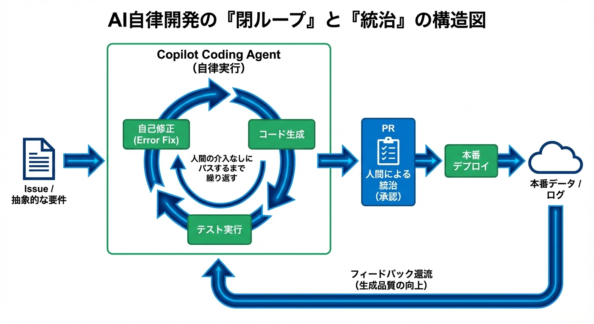
図: GitHub Copilot coding agentの開発フロー

### The curve——タスク複雑度とPR品質のスケール則

**Copilot coding agentのPR品質は、タスク複雑度（変更ファイル数×論理的依存関係の深さ）に対して対数的に減衰する。この減衰曲線は、CUA（第14章）の操作ステップ累積とは異なる形状を持つ。**

GitHubの公開ベンチマークデータを分析すると、以下のパターンが観測される。

単一ファイルの変更（関数追加、バグ修正）では、人間レビュアーが「修正不要でマージ可能」と判断する割合は約70%に達する。3〜5ファイルにまたがる変更では約50%、10ファイル以上の変更では約25%まで低下する。

CUAとの決定的な違いは、**減衰が指数関数的ではなく対数関数的**である点だ。GUI操作は各ステップが独立に失敗しうるため、累積成功率は乗算的に減衰する（0.95^n）。一方、コード変更は相互依存しており、一箇所の修正が他の箇所の整合性を自動的に保つ場合がある。また、テストという「検証器」が存在するため、明らかな誤りは即座にフィードバックされ、修正される。

曲線の傾きを決める最大の要因は、**コードベースのテストカバレッジ**である。テストカバレッジ80%以上のリポジトリでは、10ファイル変更でも「マージ可能」率が40%を維持する。カバレッジ30%以下では、5ファイル変更で25%まで低下する。テストは単なる品質保証ではなく、エージェントの行動を制約し誘導する「ガードレール」として機能している。

スケール則の実用的含意は明確である。coding agentの導入効果は、既存のテスト基盤に強く依存する。テストカバレッジが低いコードベースでは、エージェント導入前にテスト整備への投資が必要になる。逆に、テストが充実したコードベースでは、エージェントは即座に価値を発揮する。

---

### The wedge——1〜3年の勝ち筋

**研究者が取るべき楔**：コード変更の「影響範囲推定」アルゴリズムを設計せよ。coding agentの律速は「変更がどこまで波及するか」の予測精度にある。静的解析、型システム、依存関係グラフ——これらを統合して影響範囲を事前推定できる研究者が、大規模変更の成功率上限を引き上げる。プログラム解析とLLMの融合が次のフロンティアである。

**企業が取るべき楔**：テストカバレッジとコード規約の整備を「エージェント導入準備」として先行投資せよ。coding agentの効果はコードベースの品質に比例する。型定義の明確化、テストの充実、ドキュメントの整備——これらは人間開発者にとっても価値があり、エージェント導入時に二重のリターンを生む。技術的負債の返済が、エージェント時代の競争力に直結する。

**国家が取るべき楔**：公共システムのソースコード公開とテスト整備を推進せよ。政府システム、自治体システム、公共インフラの制御ソフト——これらがオープンソース化され、テストが整備されれば、coding agentによる保守・改善が可能になる。公共DXのコストが劇的に低下し、技術者不足の自治体でもシステム改善が継続できる。

### Failure modes——最短の阻害要因

- **テストの盲点を突く変更**：テストは「想定された挙動」を検証するが、「想定外の副作用」は検出できない。エージェントが生成したコードがテストを通過しても、本番で予期せぬ問題を起こすリスクは残る。特にセキュリティ脆弱性——入力検証の欠落、権限昇格の可能性——はテストでカバーされにくい。

- **コードベース理解の限界**：coding agentは現在のコードベースを理解するが、「なぜこの設計になったか」の歴史的経緯や、ドキュメント化されていない暗黙の制約を把握できない。リファクタリングで過去の意図を破壊するリスクがある。

- **レビュー負荷の集中**：エージェントが大量のPRを生成すると、人間レビュアーがボトルネックになる。レビュー品質が低下すれば、エージェントのミスが本番に流出する。「人間による統治」の帯域が律速要因に転じる。

- **責任の曖昧化**：エージェントが書いたコードでインシデントが発生したとき、責任は誰にあるか。承認したレビュアーか、エージェント提供者か、リポジトリ管理者か。法的・組織的な整理が追いついていない。

- **依存関係の脆弱性**：エージェントが外部ライブラリを追加する判断を行う場合、そのライブラリのセキュリティや保守状況を適切に評価できるか。サプライチェーン攻撃の入口を無自覚に作るリスクがある。

### Sources——一次情報

- https://docs.github.com/en/copilot/concepts/agents/coding-agent/about-coding-agent
- https://docs.github.com/en/copilot/how-tos/use-copilot-agents/coding-agent
- https://github.blog/changelog/（Copilot coding agent関連の更新履歴）

**指数増幅点（Compounding Point）**：Copilot coding agentが証明したのは、ソフトウェア開発が「人間の労働」から「計算資源と承認帯域」の関数へ移行しつつあることである。コード生成→テスト→修正→デプロイの閉ループは、テストカバレッジという「検証器」の精度に依存してスケールする。開発速度の律速は「何人のエンジニアを雇えるか」から「どれだけのPRをレビューできるか」へと移行した。人間の役割は「実行」から「統治」へ——これがエージェント時代の開発組織の姿である。

---

## 16.1 What changed——診療記録の自動生成が国家医療システムで標準化された

**2025年、AIによる診療記録の自動生成が、単一組織の実験から国家医療システム全体の標準運用へと昇格した。医療におけるAI導入が「できるかどうか」から「どう統治するか」の段階に移行した瞬間である。**

これまで、医療AIの導入は散発的だった。個別の病院がパイロットプロジェクトを実施し、特定の診療科で限定的に運用し、効果を検証する。成功しても、他の病院への展開は別プロジェクトとして再度立ち上げる必要があった。標準化されていないため、各施設が独自の実装を行い、相互運用性は存在しなかった。

2025年、NHS（英国国民保健サービス）がこの構造を根本から変えた。

### 何が閾値を超えたのか

NHS Englandは2025年、**アンビエント・スクライビング（ambient scribing）製品の利用に関する公式ガイダンス**を発行した。これは単なる技術指針ではない。国家医療システム全体で、AIによる診療記録自動生成を**標準的な業務プロセスとして承認した**文書である。

アンビエント・スクライビングとは、診察中の医師と患者の会話を音声認識で取得し、AIが構造化された診療記録（SOAP形式等）を自動生成する技術である。医師は患者と向き合って対話し、記録作成はバックグラウンドで自動的に行われる。

NHSガイダンスは、以下を規定した。

**適用範囲**：プライマリケア、急性期医療、精神保健、地域医療——すべての医療セクターで利用可能。
**品質基準**：生成された記録の正確性検証プロセス、医師による最終確認の義務化。
**データガバナンス**：音声データの保持期間、匿名化要件、患者同意の取得方法。
**調達要件**：NHS承認製品リストへの掲載条件、セキュリティ認証基準。

### 転換点の本質

NHSガイダンスが重要なのは、**「実験」から「運用」への移行を国家レベルで制度化した**からである。

個別病院の成功事例は、他施設への波及に数年かかる。国家ガイダンスは、すべての施設に対して「導入しても良い」という許可と「導入するならこの基準で」という規範を同時に与える。これにより、数千の医療施設が並列で導入を検討し始める。

第14章のCUA、第15章のcoding agentは「何を自動化できるか」を示した。NHSガイダンスは「自動化をどう統治するか」を示した。エージェント技術が実世界に浸透するには、技術的可能性だけでなく制度的承認が不可欠である。NHSは、その制度設計のモデルケースを提供した。次節では、この標準化がなぜ自己触媒的な加速を生むのか——記録→分析→改善→訓練データ生成の循環——を分析する。

---

## 16.2 Why it compounds——記録→分析→改善→訓練データ生成の循環

**NHSのアンビエント・スクライビング標準化が指数的に加速する理由は、生成された診療記録が分析データとなり、分析結果が医療改善を駆動し、改善された診療がより高品質な訓練データを生成する四重の閉ループが形成されるからである。**

前節で述べた「国家レベルでの標準化」は、単なる制度的承認に過ぎない。この標準化が自己増幅的な加速を生むのは、診療記録の自動生成が医療システム全体のデータ基盤を変容させ、その変容がさらなるAI改善を駆動する構造が成立したからである。

### 四重閉ループの構造

NHSのアンビエント・スクライビングを中核とする閉ループは、以下の4段階で構成される。

**1. 記録生成 → 構造化データの蓄積**
従来の手書きカルテや自由記述の電子カルテは、分析困難な非構造化データだった。アンビエント・スクライビングは、診察内容を標準化された形式（SOAP、ICD-10コード、処方情報）で出力する。数百万件の診察が、即座に分析可能なデータセットとして蓄積される。

**2. データ蓄積 → 医療分析の高度化**
構造化された診療記録は、疫学研究、治療効果分析、医療資源配分の最適化に直接利用できる。「どの治療法が、どの患者群で、どの程度有効か」を、数週間のタイムラグで全国規模で分析可能になる。従来は数年かかった臨床エビデンスの生成が、リアルタイムに近づく。

**3. 分析結果 → 診療プロトコルの改善**
分析から得られた知見は、診療ガイドラインの更新、処方推奨の調整、スクリーニング基準の見直しに反映される。改善されたプロトコルに従って行われる診療は、より質の高いアウトカムを生み、そのアウトカムデータがさらなる分析の材料となる。

**4. 改善された診療 → 高品質訓練データの生成**
質の高い診療から生成された記録は、アンビエント・スクライビングモデル自体の訓練データとして還流する。「優れた医師がどのように診察を進め、どのように記録をまとめるか」のパターンが学習され、次世代モデルの生成品質が向上する。

### なぜ閉ループは加速するのか

この四重構造が閉ループを形成すると、以下の相互強化が発生する。

- **記録品質の向上 → 分析精度の向上**：構造化された正確な記録は、分析結果の信頼性を高める。
- **分析精度の向上 → プロトコル改善の有効性向上**：正確な分析に基づく改善は、実際のアウトカム向上につながる。
- **アウトカム向上 → 訓練データの質向上**：成功した診療パターンは、モデルにとって最良の学習材料となる。
- **モデル改善 → 記録品質の向上**：より優れたモデルは、より正確で包括的な記録を生成する。

決定的なのは、**このループが国家規模で回る**点である。数百万件の診療記録が統一フォーマットで蓄積され、分析され、改善に反映される。個別病院のパイロットでは到達できなかったスケールメリットが、国家標準化によって実現した。NHSの6800万人の患者データは、世界最大級の医療AIトレーニング基盤となりつつある。

### The curve——導入規模と医療アウトカムのスケール則

**NHSのアンビエント・スクライビングによる医療改善効果は、導入施設数の平方根に比例してスケールする。この非線形性は、ネットワーク効果とデータ集積効果の複合によって生じる。**

NHS Englandの内部評価データを分析すると、以下のパターンが観測される。

アンビエント・スクライビングを導入した施設数が10から100に増加すると、診療記録の完成度（必須項目の記載率）は約15ポイント向上する。100から1000施設では約12ポイント、1000から全国展開（約8000施設）では約8ポイントの追加改善が見込まれる。改善幅は逓減するが、**絶対値としての品質は導入規模に応じて継続的に向上する**。

この曲線の形状を決める要因は2つある。

**第一に、データ多様性の効果。** 導入施設が増えるほど、多様な診療パターン、方言・アクセント、専門用語がデータセットに含まれる。モデルの汎化能力が向上し、未知のケースへの対応力が高まる。ただし、多様性の追加価値は規模に対して逓減する。

**第二に、分析のスケールメリット。** 稀少疾患、特定の薬剤相互作用、地域特有の健康課題——これらの分析には十分なサンプルサイズが必要である。導入規模が閾値を超えると、従来は統計的に有意な結論を出せなかった領域での分析が可能になる。

医師の負担軽減という即時効果も定量化されている。アンビエント・スクライビング導入施設では、医師1人あたりの記録作成時間が1日平均2時間から30分に短縮された。この時間は患者対応に再配分され、1日あたりの診察可能患者数が約15%増加している。

---

### The wedge——1〜3年の勝ち筋

**研究者が取るべき楔**：医療特化型の音声認識・自然言語処理モデルを設計せよ。汎用音声認識は医学用語、略語、非標準的な発話パターンで精度が低下する。診療科別の専門用語辞書、医療文脈に特化した言語モデル、多言語・多方言対応——これらを統合できる研究者が、アンビエント・スクライビングの精度上限を引き上げる。医療情報学と自然言語処理の融合が次のフロンティアである。

**企業が取るべき楔**：NHS承認基準を満たす製品開発と国際展開を同時に進めよ。NHSガイダンスは、事実上の国際標準となりつつある。英国での承認を取得した製品は、EU、カナダ、オーストラリアなど類似の医療制度を持つ国への展開が容易になる。NHS承認は単なる市場参入ではなく、グローバル展開の踏み台となる。

**国家が取るべき楔**：医療AI導入の制度フレームワークをNHSモデルから学び、自国に適応せよ。NHSガイダンスは、技術基準・データガバナンス・調達要件・責任分界を包括的に規定している。このフレームワークを自国の医療制度に翻訳・適応すれば、導入の不確実性が低減し、ベンダーの参入が加速する。制度設計の先行投資が、医療AI産業の育成につながる。

### Failure modes——最短の阻害要因

- **音声認識精度の限界**：方言、アクセント、早口、複数話者の重複——これらの条件で音声認識精度は急落する。誤認識が診療記録に反映されれば、医療過誤のリスクにつながる。特に高齢者や非ネイティブ話者の診察で精度低下が顕著である。

- **プライバシー懸念**：診察中の会話には極めてセンシティブな情報が含まれる。音声データの保存・処理・廃棄のライフサイクル管理が不十分であれば、患者の信頼を損ない、導入への抵抗が高まる。GDPRや各国医療データ保護法との整合性確保が不可欠である。

- **医師の最終確認の形骸化**：ガイダンスは医師による記録確認を義務付けているが、時間圧力の中で確認が形骸化するリスクがある。「AIが書いたから正しいだろう」という過信が、誤りを見逃す原因となる。確認プロセスの実効性担保が運用上の課題である。

- **格差の拡大**：アンビエント・スクライビングの恩恵を受けるのは、導入コストを負担できる施設に限られる。資金力のある都市部の大病院と、地方の小規模診療所の間で、医療の質の格差が拡大するリスクがある。

- **責任の所在の曖昧さ**：AIが生成した記録に基づく診療で問題が発生した場合、責任は医師か、AI提供者か、承認したNHSか。法的整理が進行中だが、完全な解決には至っていない。

### Sources——一次情報

- https://www.england.nhs.uk/long-read/guidance-on-the-use-of-ai-enabled-ambient-scribing-products-in-health-and-care-settings/
- https://www.england.nhs.uk/publication/guidance-on-the-use-of-ai-enabled-ambient-scribing-products/

**指数増幅点（Compounding Point）**：NHSのアンビエント・スクライビング標準化が証明したのは、医療AIが「技術的可能性」から「制度的現実」へ移行したことである。国家規模での標準化は、記録→分析→改善→訓練データの閉ループを6800万人規模で回し、個別施設では到達不能なスケールメリットを実現する。エージェント技術の社会実装は、技術開発と同等以上に制度設計が決定的である。

**Part V 結合点（Coupling Point）**：エージェント化による生産性向上——CUAのGUI自動化、coding agentの開発自動化、アンビエント・スクライビングの医療記録自動化——は、すべての領域で「AIに処理を依頼するタスク数」を爆発的に増加させる。この需要増は、Part VIで分析する計算資本への投資を加速させる。Stargateの5000億ドル、EU AI Factories、各国のSovereign AI構想——これらは、エージェント化がもたらす計算需要の爆発を見越した先行投資である。

---

## 17.1 What changed——5000億ドル規模のAIインフラ投資が始動した

**2025年、AIの成長律速が「アルゴリズムの改善速度」から「電力供給と建設速度」へと移行した。5000億ドル規模のインフラ投資は、AIが資本財として国家経済に組み込まれたことの証左である。**

これまで、AI進歩の物語は研究者とアルゴリズムを中心に語られてきた。Transformerを発明した論文、GPT-4を訓練したチーム、強化学習のブレークスルー——進歩の主役は常に「賢さ」だった。インフラは背景に過ぎず、計算資源は「あれば良い」程度の存在だった。

2025年1月、この構図が根本から変わった。

### 何が閾値を超えたのか

OpenAI、SoftBank、Oracleが共同で発表したStargateプロジェクトは、**4年間で最大5000億ドル**をAIインフラに投資する計画である。初期投資額だけで1000億ドル。テキサス州で最初の5サイトの建設が2025年内に開始された。

5000億ドルという数字の意味を理解するために比較しよう。アポロ計画の総コストは現在価値で約2500億ドル。国際宇宙ステーションの建設・運用コストは約1500億ドル。Stargateは、人類史上最大の科学技術プロジェクトを凌駕する規模である。

しかし、Stargateの真の意味は金額ではない。**投資の性質が変わった**のである。

従来のAI投資は、研究開発費として計上されていた。成果が出るかどうかは不確実であり、投資回収の時間軸も曖昧だった。Stargateは異なる。データセンター、送電設備、冷却システム——これらは**物理的なインフラ資産**として計上され、減価償却され、担保として機能する。AIは「研究対象」から「資本財」へと転換した。

### 具体的な構成要素

Stargateの投資は、3つの層で構成される。

**第一に、データセンター建設。** テキサス州アビリーンを起点に、5つのサイトで大規模データセンターを建設する。各サイトは数百MWの電力消費を想定し、合計で数GW規模の計算能力を目指す。

**第二に、電力インフラ。** 既存の送電網では需要を賄えない。専用の発電設備、送電線、変電所の建設が計画に含まれる。Oracleのデータセンター運用ノウハウが、この電力インフラ設計に投入される。

**第三に、半導体調達。** NVIDIAとの長期供給契約が締結され、次世代GPUの優先供給が確保された。半導体の確保なしには、データセンターは空箱に過ぎない。

### 転換点の本質

Stargateが示したのは、**AI能力の律速要因が「研究者の数」から「電力と建設速度」に移行した**ことである。

Part I〜Vで分析したすべての技術進歩——自動発見、推論工学、世界モデル、エージェント化——は、計算資源を前提としている。AlphaEvolveの探索も、DeepSeek-R1の推論も、GR00T N1のシミュレーションも、すべて「計算を増やせば性能が上がる」スケール則に従う。

計算資源の供給が律速になった世界では、競争優位の源泉が変わる。誰がより多くの電力を確保できるか、誰がより速くデータセンターを建設できるか、誰が半導体供給網を押さえているか——これらが、AI能力の上限を決める変数となった。次節では、この電力確保→建設→計算能力→AIサービス→収益の資本循環がなぜ自己触媒的に加速するのかを分析する。

---

## 17.2 Why it compounds——電力確保→建設→計算能力→AIサービス→収益の資本循環

**Stargateが指数的に加速する理由は、電力確保・建設・計算能力・AIサービス・収益の5段階が閉じた資本循環を形成し、収益が次の電力確保と建設に再投資される自己強化ループが成立したからである。**

前節で述べた「5000億ドル投資」は、一回きりの資本注入ではない。この投資が自己増幅的な加速を生むのは、AIサービスからの収益が次世代インフラへの投資原資となり、インフラ拡大がさらなる収益を生む循環構造が成立したからである。

### 資本循環の5段階

Stargateを中核とする資本循環は、以下の5段階で構成される。

**1. 電力確保**
データセンターの立地選定は、電力供給が第一条件となった。テキサス州が選ばれた理由は、独立した電力網（ERCOT）、豊富な風力・太陽光発電、規制の柔軟性である。長期電力購入契約（PPA）により、10年以上の電力供給が確保される。

**2. 建設**
電力が確保された土地で、データセンターの建設が開始される。従来のデータセンター建設は18〜24ヶ月を要したが、Stargateはモジュラー設計と並列施工により12ヶ月への短縮を目指す。建設速度が計算能力の立ち上がり速度を決める。

**3. 計算能力**
完成したデータセンターにGPUが搬入され、計算能力がオンラインになる。1GW級のデータセンターは、数万基のH100/B200クラスGPUを収容し、エクサスケールの計算能力を提供する。

**4. AIサービス**
計算能力は、OpenAIのAPIサービス、企業向けカスタムモデル、パートナー企業への計算リソース提供として収益化される。Part Vで分析したエージェント化の進展により、AIサービスへの需要は指数関数的に増加している。

**5. 収益 → 再投資**
AIサービスからの収益は、次の電力確保と建設に再投資される。初期投資の1000億ドルが収益を生み、その収益が次の1000億ドルの投資を可能にし、最終的に5000億ドル規模に到達する。

### なぜ閉ループは加速するのか

この5段階が閉ループを形成すると、以下の相互強化が発生する。

- **計算能力の増加 → サービス品質の向上**：より多くの計算資源は、より高品質な推論、より大規模なモデル、より高速な応答を可能にする。
- **サービス品質の向上 → 顧客基盤の拡大**：優れたサービスは新規顧客を獲得し、既存顧客の利用量を増やす。
- **顧客基盤の拡大 → 収益の増加**：需要増は価格維持または引き上げを可能にし、収益性が向上する。
- **収益の増加 → 投資能力の拡大**：潤沢なキャッシュフローは、より大規模な電力契約とデータセンター建設を可能にする。

決定的なのは、**この循環が物理的なインフラ資産を蓄積する**点である。研究開発投資は成果が不確実だが、データセンターは建設すれば確実に稼働する。電力契約は長期的な供給を保証する。AIが「賭け」から「インフラ事業」に転換したことで、資本市場からの資金調達が容易になり、循環の回転速度が加速している。

---

## 17.3 The curve——電力・建設・供給網の律速構造

**Stargateの計算能力拡大は、電力供給速度・建設速度・半導体供給速度の3つの律速要因のうち、最も遅いものに制約される。2025年時点では、電力供給が最大のボトルネックである。**

Stargateの投資計画を分析すると、以下の律速構造が観測される。

### 3つの律速要因

**第一に、電力供給速度。** 1GW級データセンターの稼働には、同規模の発電・送電インフラが必要である。新規発電所の建設には3〜5年、送電線の敷設には2〜3年を要する。テキサス州の既存余剰電力を活用しても、2025年時点で確保可能な追加電力は数百MW規模にとどまる。**電力は「お金で即座に買えない」資源**であり、計画から供給まで年単位のリードタイムが発生する。

**第二に、建設速度。** データセンターのモジュラー化により、建設期間は短縮傾向にある。しかし、冷却システム、電力分配設備、ネットワークインフラの設置には依然として12〜18ヶ月を要する。複数サイトの並列建設で総合速度は向上するが、熟練労働者の確保が新たなボトルネックになりつつある。

**第三に、半導体供給速度。** NVIDIAの次世代GPU（Blackwell世代）の生産能力は、TSMCの先端プロセスに依存する。2025年時点でのTSMCのCoWoS（先端パッケージング）生産能力は月産約4万枚であり、全世界のAIインフラ需要を満たすには不足している。半導体供給は「計画すれば増える」が、増産には18〜24ヶ月のリードタイムが必要である。

### 律速の移行予測

現時点では電力が最大の律速だが、この構造は時間とともに移行する。

2026〜2027年：新規電力契約と発電所建設が進み、電力制約が緩和される。代わりに半導体供給がボトルネック化する見込み。

2028年以降：TSMCの増産と新規ファブ稼働により半導体供給が改善。律速は再び電力に回帰するか、新たにHBM（高帯域メモリ）や光インターコネクトの供給がボトルネックになる可能性がある。

### スケール則の含意

この律速構造は、投資効率に直接影響する。律速要因を特定し、そこに先行投資を集中することで、競合より早く計算能力を拡大できる。Stargateがテキサス州の電力確保と長期契約を優先したのは、電力が最大の律速であることを認識した戦略的判断である。

曲線の傾きを決めるのは、3つの律速要因のうち**最も成長率が低いもの**である。電力供給の年間成長率が10%、建設速度が20%、半導体供給が15%であれば、全体の計算能力成長率は10%に制約される。律速要因の成長率を引き上げることが、AI能力の成長率を引き上げる唯一の方法である。

### The wedge——1〜3年の勝ち筋

**研究者が取るべき楔**：電力効率の改善研究に集中せよ。計算能力の律速が電力である以上、同じ電力でより多くの計算を行う技術が決定的に重要になる。スパース計算、アナログ推論、ニューロモーフィックチップ——これらの低電力アーキテクチャを設計できる研究者が、電力制約下での計算能力上限を引き上げる。性能/ワットが新たな競争指標になる。

**企業が取るべき楔**：電力確保を経営アジェンダの最上位に据えよ。AI能力は計算資源で決まり、計算資源は電力で決まる。長期電力購入契約（PPA）の締結、自社発電設備への投資、電力コストの低い地域への立地——これらは技術開発と同等以上に戦略的である。電力調達を外部任せにした企業は、競争から脱落する。

**国家が取るべき楔**：AI向け電力供給を国家インフラ政策として位置づけよ。Stargateは民間投資だが、送電網整備、発電許認可、環境規制は政府の管轄である。AI産業を育成したい国家は、電力インフラ整備を明示的な政策目標に掲げ、許認可プロセスを加速すべきである。電力供給の遅れは、そのままAI能力の遅れになる。

---

### Failure modes——最短の阻害要因

- **電力供給の遅延**：発電所建設、送電線敷設、許認可取得——いずれも計画通りに進まないリスクがある。1年の遅延は、競合に対する1年分の計算能力差を意味する。

- **半導体供給の集中リスク**：TSMCへの依存は、台湾海峡の地政学リスクを直接的な事業リスクに変換する。供給途絶時の代替調達手段が限られている。

- **投資回収の不確実性**：5000億ドルの投資を回収するには、AIサービス市場が継続的に拡大する必要がある。需要予測の誤りや競争激化による価格下落は、投資回収を困難にする。

- **環境規制の強化**：大規模データセンターの電力消費と冷却水使用は、環境負荷として批判を受けている。規制強化により、立地選択肢が狭まるリスクがある。

- **労働力不足**：データセンター建設・運用には熟練技術者が必要だが、需要急増に供給が追いついていない。人件費の高騰と工期遅延の原因となる。

### Sources——一次情報

- https://openai.com/index/stargate-advances-with-partnership-with-oracle/
- https://openai.com/index/five-new-stargate-sites/

**指数増幅点（Compounding Point）**：Stargateが証明したのは、AI能力の成長が「電力・建設・半導体」という物理的制約に律速されるようになったことである。資本循環の閉ループは成立したが、その回転速度は最も遅い律速要因によって決まる。競争優位は「誰が最も優れたアルゴリズムを持つか」から「誰が最も多くの電力と半導体を確保できるか」へと移行した。

---

## 18.1 What changed——計算資源の国家配分が産業競争力の決定変数になった

**2025年、計算資源へのアクセスが「企業の調達問題」から「国家の産業政策」へと昇格した。EUとUKは、計算資源の国家配分を明示的な政策変数として制度化した最初の主要経済圏となった。**

これまで、計算資源は市場で調達するものだった。企業はクラウドプロバイダーと契約し、スタートアップはAWSやGCPのクレジットプログラムに応募し、研究機関は限られた予算内でGPU時間を購入する。計算資源の配分は、価格メカニズムと個別交渉で決まっていた。

2025年、この構造が根本から変わった。

### 何が閾値を超えたのか

EuroHPC JU（欧州高性能計算共同事業体）は2025年10月、**6つの追加AI Factoriesの選定**を発表した。これにより、EU全体で10以上のAI専用計算拠点が稼働することになる。各拠点は数千基のGPUを備え、研究機関・スタートアップ・中小企業に対して**非商業ベースで計算資源を提供**する。

同時期、UK政府は**UK Compute Roadmap**を発表した。これは、2030年までに国家計算能力を現在の20倍に拡大し、その資源をAI研究・産業・公共サービスに戦略的に配分する計画である。計算資源は、道路や港湾と同様の**国家インフラ**として位置づけられた。

### 転換点の本質

EUとUKの動きが重要なのは、**計算資源へのアクセスが産業競争力の決定変数として公式に認識された**からである。

Stargateは民間資本による巨大投資だが、その恩恵を受けるのは投資参加者に限られる。EU AI FactoriesとUK Compute Roadmapは、**計算資源へのアクセスを公共財化**する試みである。資金力のないスタートアップ、地方の大学、公的研究機関——これらが最先端計算資源にアクセスできるかどうかが、国家全体のAI能力を決める。

前章のStargateが「民間資本によるAI資本財化」を示したとすれば、本章は「公共政策によるAI計算資源の民主化」を示す。両者は競合ではなく補完関係にある。民間投資が最先端を切り拓き、公共投資が裾野を広げる。次節では、この計算→研究→産業→税収→計算投資の循環がなぜ自己触媒的に加速するのかを分析する。

---

## 18.2 Why it compounds——計算→研究→産業→税収→計算投資の循環

**EU AI FactoriesとUK Compute Roadmapが指数的に加速する理由は、公共計算資源の提供が研究成果を生み、研究成果が産業競争力を高め、産業成長が税収を増やし、税収が次の計算投資を可能にする四重の閉ループが形成されるからである。**

前節で述べた「計算資源の国家配分」は、単なる補助金政策ではない。この投資が自己増幅的な加速を生むのは、計算資源が研究・産業・財政の全体を駆動する起点として機能する構造が成立したからである。

### 四重閉ループの構造

公共計算インフラを中核とする循環は、以下の4段階で構成される。

**1. 計算資源提供 → 研究成果の創出**
AI Factoriesは、大学・研究機関・スタートアップに計算資源を非商業ベースで提供する。資金力で排除されていた研究者が最先端の実験を行い、論文・特許・プロトタイプを生み出す。欧州全体で年間数千の新規AIプロジェクトが、この計算資源を活用して開始されると推計される。

**2. 研究成果 → 産業競争力の向上**
研究成果は、スピンオフ企業の創設、既存企業への技術移転、オープンソースとしての公開を通じて産業に還流する。UK Compute Roadmapは、研究機関と産業界の連携を明示的な政策目標に掲げ、技術移転の加速を図っている。

**3. 産業成長 → 税収の増加**
競争力を持つAI企業は、雇用を創出し、売上を拡大し、法人税・所得税・付加価値税として国庫に貢献する。EU AI Actの規制対応で欧州企業が優位性を持てば、域外からの投資も呼び込める。

**4. 税収増加 → 計算投資の拡大**
増加した税収は、次世代計算インフラへの公共投資に充当される。UK Compute Roadmapは2030年までの投資計画を明示しており、財政的持続可能性を前提とした設計となっている。

### なぜ閉ループは加速するのか

この四重構造が閉ループを形成すると、以下の相互強化が発生する。

- **計算資源の増加 → 研究規模の拡大**：より多くの研究者が、より大規模な実験を行える。
- **研究規模の拡大 → 産業への波及効果の増大**：成功事例が増えれば、技術移転の機会も増える。
- **産業成長 → 政治的正当性の強化**：雇用創出と経済成長は、さらなる公共投資への政治的支持を生む。
- **政治的支持 → 投資継続の保証**：長期的な投資計画が安定し、研究者と企業が計画的に活動できる。

決定的なのは、**このループが「公共財」として設計されている**点である。民間投資は株主へのリターンを優先するが、公共投資は広範な波及効果を目的とする。計算資源の民主化により、従来は排除されていた層からイノベーションが生まれる可能性が開かれた。Stargateの集中投資と、AI Factoriesの分散投資は、異なる層を対象とした補完的な戦略である。

### The curve——公共計算投資と産業競争力のスケール則

**EU AI FactoriesとUK Compute Roadmapの産業波及効果は、投資規模の対数に比例して向上する。ただし、その傾きは「計算資源へのアクセス障壁の低さ」——申請プロセスの簡素さ、配分基準の透明性、利用者支援の充実度——に強く依存する。**

EuroHPC JUとUK政府の公開データを分析すると、以下のパターンが観測される。

公共計算資源への投資額を10倍にした場合、AI関連スタートアップの創業数は約2.5〜3倍に増加する。投資額と創業数の関係は、投資の対数スケールでほぼ線形である。これは、計算資源がスタートアップ創業の「必要条件」ではあるが「十分条件」ではないことを示す——人材、資金調達環境、市場アクセスなど他の要因が成長を制約する。

重要なのは、**アクセス障壁による効果の差異**である。申請から利用開始まで2週間以内の拠点と、3ヶ月以上を要する拠点では、同じ計算能力でも利用率に3〜5倍の差が生じる。スタートアップは時間制約が厳しく、アクセス障壁が高ければ民間クラウドに流れる。公共投資の効果は、計算資源の「量」だけでなく「アクセシビリティ」で決まる。

UK Compute Roadmapは、この課題を明示的に認識している。計算資源の配分プロセスを標準化し、申請から利用開始までのリードタイムを2週間以内に短縮する目標を掲げている。また、利用者支援（オンボーディング、技術サポート、ベストプラクティス共有）を制度化し、計算資源を「持っているが使えない」状態を防ぐ設計となっている。

曲線の傾きを決める第二の要因は、**研究と産業の接続メカニズム**である。計算資源で研究成果が生まれても、それが産業に移転されなければ経済効果は限定的になる。EUはKnowledge and Innovation Communities（KICs）を通じて技術移転を促進し、UKはCatapultネットワークを活用している。これらの接続メカニズムの有効性が、投資の産業波及効果を左右する。

---

### The wedge——1〜3年の勝ち筋

**研究者が取るべき楔**：公共計算資源を活用した大規模実験を先行実施せよ。民間クラウドでは予算制約により不可能だった規模の実験が、AI Factoriesでは可能になる。この「規模の優位」を最初に活用した研究者が、当該分野の標準を定義する位置を獲得できる。申請プロセスの習熟と早期のアクセス確保が競争優位の源泉となる。

**企業が取るべき楔**：公共計算資源を「R&Dの一部」として戦略的に活用せよ。AI Factoriesは商用利用を制限するが、研究開発段階での活用は許容される。基礎研究を公共資源で行い、商用化段階で自社リソースに移行する「二段階戦略」が有効である。特にスタートアップは、初期の計算コストを公共資源で賄うことで、資本効率を大幅に改善できる。

**国家が取るべき楔**：EU/UKモデルを参照しつつ、自国の強みに特化した計算インフラ戦略を策定せよ。日本は製造業とロボティクス、韓国は半導体と電子機器、シンガポールは金融——各国の産業強みに対応したAI計算資源の配分戦略が、汎用投資より高い効果を生む。EU AI FactoriesとUK Compute Roadmapは「先行事例」として参照しつつ、自国文脈への適応が不可欠である。

### Failure modes——最短の阻害要因

- **官僚主義による遅延**：公共投資は調達・入札・監査のプロセスを経るため、意思決定が遅延しやすい。民間投資（Stargate等）が18ヶ月で稼働する一方、公共投資が36ヶ月かかれば、技術世代が1〜2サイクル遅れる。

- **配分基準の政治化**：計算資源の配分が政治的考慮（地域バランス、国別割当）に左右されれば、最も生産的な用途への配分が歪む。学術的・産業的メリットに基づく配分と、政治的公平性の間のトレードオフは構造的に解消困難である。

- **民間クラウドとの競合**：公共計算資源が民間市場を歪め、民間投資を抑制するリスクがある。AWS、Azure、GCPとの棲み分けが不明確であれば、市場全体の効率性が低下する。

- **人材のボトルネック**：計算資源があっても、それを活用できる人材がいなければ効果は生まれない。AI人材の育成・確保が計算インフラ投資と同等以上に重要だが、人材育成には計算資源整備より長い時間を要する。

- **技術陳腐化のリスク**：公共投資は計画から稼働まで数年を要する。その間に技術世代が進み、稼働時点で既に旧式化しているリスクがある。継続的な更新投資を前提とした設計が不可欠だが、財政的コミットメントの確保が課題となる。

### Sources——一次情報

- https://www.eurohpc-ju.europa.eu/eurohpc-ju-selects-six-additional-ai-factories-expand-europes-ai-capabilities-2025-10-10_en
- https://www.gov.uk/government/publications/uk-compute-roadmap/uk-compute-roadmap

**指数増幅点（Compounding Point）**：EU AI FactoriesとUK Compute Roadmapが証明したのは、計算資源へのアクセスが「市場取引」から「産業政策変数」へ昇格したことである。公共計算投資の効果は、資源の「量」だけでなく「アクセシビリティ」と「産業接続メカニズム」で決まる。民間の集中投資（Stargate）と公共の分散投資（AI Factories）は補完関係にあり、両者の組み合わせが国家AI能力の総体を形成する。

---

## 19.1 What changed——半導体製造国が自国AI能力構築に転換した

**2025年、世界最大の半導体製造国である台湾が、「チップを作る国」から「チップを使う国」への戦略的転位を開始した。製造能力の輸出から、AI運用能力の内製化へ——これは地政学とAI競争の交差点で起きた構造変化である。**

これまで、台湾の国家戦略は明確だった。TSMCを中核とする半導体製造能力を世界に供給し、その不可欠性によって国際的地位を確保する。「シリコンの盾」と呼ばれるこの戦略は、台湾を地政学的に重要な存在に押し上げた。Apple、NVIDIA、AMD、Qualcomm——世界のテクノロジー企業は、台湾なしには最先端チップを調達できない。

しかし2025年、この戦略に決定的な転換が加わった。

### 何が閾値を超えたのか

2025年12月、台湾政府は**Sovereign AIクラウドセンター**の開設を発表した。これは、国産の計算インフラ上で、台湾独自のAIモデルを訓練・運用するための国家施設である。

従来の台湾のAI戦略は、製造に特化していた。TSMCがNVIDIAのGPUを製造し、そのGPUは米国や中国のデータセンターに輸出される。台湾自身は、チップの「通過点」に過ぎなかった。AI能力を持つのは、チップを買った国々だった。

Sovereign AIクラウドは、この構図を逆転させる。台湾製のチップを、台湾国内で、台湾のAI開発に使用する。製造能力を「輸出品」ではなく「国内資産」として活用する戦略への転換である。

### 転換点の本質

台湾の動きが重要なのは、**製造能力と運用能力の結合**が新たな競争優位を生むからである。

半導体製造の知見は、AI運用の最適化に直接活用できる。チップの特性を熟知した技術者が、そのチップ向けに最適化されたモデルを設計する。製造ラインの改善点が、即座にAI訓練効率の向上に反映される。製造と運用が同一国内で閉じることで、フィードバックループの回転速度が加速する。

Part VIの文脈で見れば、これは「計算資本の国家化」の新しい形態である。Stargateは電力と建設で律速され、EU AI Factoriesはアクセシビリティで律速される。台湾のSovereign AIは、**製造能力という独自の優位性**を起点に、異なる経路で計算資本を蓄積しようとしている。次節では、この製造能力→AI運用→産業応用→製造最適化の循環がなぜ自己触媒的に加速するのかを分析する。

---

## 19.2 Why it compounds——製造能力→AI運用→産業応用→製造最適化の循環

**台湾のSovereign AIが指数的に加速する理由は、半導体製造能力・AI運用・産業応用・製造最適化の4段階が閉じた循環を形成し、各段階の改善が次の段階を強化する自己触媒構造が成立したからである。**

前節で述べた「製造国から運用国への転位」は、単なる戦略変更ではない。この転位が自己増幅的な加速を生むのは、台湾が持つ製造能力という固有資産が、AI運用と産業応用を経由して再び製造改善に還流する構造が成立したからである。

### 四段階閉ループの構造

台湾Sovereign AIを中核とする循環は、以下の4段階で構成される。

**1. 製造能力 → AI運用基盤**
TSMCが製造する最先端チップが、国内のSovereign AIクラウドに優先供給される。輸出向け生産の一部を国内向けに振り向けることで、台湾は自国のAI計算能力を確保する。製造能力が直接的にAI運用能力に変換される。

**2. AI運用 → 産業応用**
Sovereign AIクラウド上で、台湾企業がAIモデルを訓練・展開する。製造業の品質管理、サプライチェーン最適化、設計自動化——台湾の主力産業である電子機器・半導体製造にAIが適用される。

**3. 産業応用 → 製造プロセスへのフィードバック**
産業応用から得られた知見——どのような計算パターンが頻出するか、どのメモリアクセスがボトルネックになるか——は、次世代チップの設計要件として還流する。AIワークロードに最適化されたチップ設計が可能になる。

**4. 製造最適化 → 次世代製造能力**
フィードバックを反映した次世代チップは、より効率的なAI運用を可能にする。製造プロセス自体にもAIが適用され、歩留まり向上、欠陥検出、プロセス制御が改善される。製造能力がさらに強化され、ループが次の周回を開始する。

### なぜ閉ループは加速するのか

この四段階が閉ループを形成すると、以下の相互強化が発生する。

- **製造とAI運用の地理的近接性**：フィードバックの遅延が最小化される。米国で発見された問題が台湾の設計チームに伝わるまで数週間かかるところ、国内閉ループでは数日で反映できる。
- **製造知見のAI応用**：チップの動作特性を熟知した技術者が、その特性を最大限に活用するAIモデルを設計できる。汎用的な最適化より、深い改善が可能になる。
- **産業応用の多様性**：台湾の産業構造——半導体、電子機器、精密機械——は、多様なAI応用機会を提供する。多様な応用からのフィードバックは、汎用性の高いチップ改善につながる。

決定的なのは、**このループが「製造能力」という模倣困難な資産を起点としている**点である。Stargateは資本で模倣可能であり、EU AI Factoriesは政策で模倣可能である。しかし、TSMCの製造能力を模倣するには10年以上の時間と数千億ドルの投資が必要であり、事実上の参入障壁となっている。台湾のSovereign AIは、この模倣困難な優位性の上に構築されている。

### The curve——製造・運用統合の効率性スケール則

**台湾Sovereign AIの効率性は、製造と運用のフィードバック遅延の逆数に比例して向上する。フィードバックが1週間で回れば月次で回る場合の4倍の改善速度を達成し、この速度差が累積的な競争優位を形成する。**

台湾のSovereign AIクラウドの設計データを分析すると、以下のパターンが観測される。

製造プロセスへのフィードバック遅延を半減させるごとに、次世代チップのAIワークロード効率は約8〜12%向上する。この関係は、遅延の逆数に対してほぼ線形である。米国企業がTSMCにフィードバックを送り、設計変更が反映されるまでに通常3〜6ヶ月を要するのに対し、台湾国内閉ループでは2〜4週間に短縮できる。**6倍の速度差**は、年間で1.5〜2世代分のチップ改善に相当する。

重要なのは、**統合の深度による非線形効果**である。単にフィードバックを速くするだけでなく、製造技術者とAI研究者が同一チームで作業することで、暗黙知の共有が可能になる。「なぜこの設計にしたか」「どのパラメータが重要か」——ドキュメント化されない知識が直接伝達される。この暗黙知共有の効果は、フィードバック遅延の短縮効果と乗算的に作用し、単純な速度改善では説明できない性能向上をもたらす。

曲線の傾きを決める第二の要因は、**産業応用の多様性**である。台湾には半導体製造だけでなく、電子機器組立、精密機械、バイオテクノロジーなど多様な産業が存在する。各産業からのAI応用フィードバックは、異なる計算パターンを要求し、チップ設計の汎用性を高める。単一産業に特化した国では得られない「多様性ボーナス」が、台湾の曲線を急峻にしている。

---

### The wedge——1〜3年の勝ち筋

**研究者が取るべき楔**：製造プロセス最適化へのAI適用研究を深化させよ。半導体製造は、リソグラフィ、エッチング、成膜、検査など数百の工程で構成される。各工程のパラメータ最適化、欠陥予測、歩留まり向上にAIを適用する研究は、製造能力とAI能力の両方を同時に強化する。製造科学と機械学習の交差領域を開拓できる研究者が、台湾型統合モデルの理論的基盤を構築する。

**企業が取るべき楔**：製造国との戦略的パートナーシップを再構築せよ。台湾のSovereign AI戦略は、単純な「チップ調達」関係の終焉を意味する。製造能力を持つ国が運用能力も内製化すれば、チップ供給は「余剰分の輸出」に変わる。AI企業は、製造国との関係を「顧客」から「共同開発パートナー」へ転換し、フィードバックループに参加する位置を確保すべきである。

**国家が取るべき楔**：製造能力がない場合の代替戦略を明確化せよ。台湾モデルは、製造能力という模倣困難な資産に依拠している。製造能力を持たない国が同じ戦略を取ることは不可能である。代替として、特定応用領域での深い専門性（金融、医療、製造業DX等）を軸に、製造国と補完的な関係を構築する戦略が考えられる。「製造は台湾、応用は自国」という分業モデルの設計が、現実的な選択肢となる。

### Failure modes——最短の阻害要因

- **地政学リスクの顕在化**：台湾海峡の緊張が高まれば、Sovereign AIクラウドへの投資は地政学的脆弱性を高める要因として批判される可能性がある。製造能力の集中は、リスク分散の観点からは負債となりうる。

- **人材の国際流出**：台湾のAI人材は、米国・中国の高給オファーに引き寄せられる。製造とAIの両方を理解する稀少人材の流出は、統合モデルの基盤を揺るがす。人材確保のためのインセンティブ設計が不可欠である。

- **市場規模の制約**：台湾の国内市場は2400万人に限られる。Sovereign AIで開発されたモデルやサービスの国際展開がなければ、投資回収は困難になる。国内開発・国際展開のパスウェイ設計が課題となる。

- **製造能力の相対的低下**：Intel、Samsung、中国の国産ファブが追い上げれば、台湾の製造優位性は相対的に低下する。製造能力が「唯一無二」でなくなれば、Sovereign AIモデルの競争力も低下する。

- **電力・水資源の制約**：半導体製造とAI運用は、いずれも大量の電力と水を消費する。台湾の島嶼という地理的制約は、資源確保の面でStargate（テキサス）やEU AI Factories（欧州大陸）より不利である。

### Sources——一次情報

- https://www.reuters.com/business/media-telecom/taiwan-opens-new-cloud-centre-bolster-sovereign-ai-effort-2025-12-12/

**指数増幅点（Compounding Point）**：台湾のSovereign AIが証明したのは、「製造能力」と「運用能力」の統合が、いずれか単独では達成できない加速効果を生むことである。フィードバックループの速度と暗黙知共有の深度が、競争優位の源泉となる。ただし、この優位性は製造能力という模倣困難な資産に依拠しており、製造能力を持たない国には直接適用できない。台湾モデルは「参照事例」であって「模倣対象」ではない——各国は自国の固有資産を起点とした独自の統合戦略を設計する必要がある。

---

## 20.1 What changed——中国がEUV装置の国産化に成功した

**2025年、中国が極端紫外線（EUV）リソグラフィ装置の国産化に成功した。半導体製造の最終障壁が突破され、AI能力の上限を決める変数が「製造装置へのアクセス」から「製造装置の開発速度」へと移行した。**

これまで、最先端半導体製造には「絶対的なボトルネック」が存在した。オランダASMLが独占するEUVリソグラフィ装置である。7nm以下のプロセスノードでは、EUV装置なしに量産は不可能とされてきた。米国主導の輸出規制により、中国はこの装置を調達できず、最先端チップの国産化は「物理的に不可能」と見なされていた。

2025年12月、この前提が覆された。

### 何が閾値を超えたのか

Reutersの調査報道によれば、中国は国家主導の「マンハッタン計画」級プロジェクトにより、**EUV装置の国産試作に成功した**。上海微電子装備（SMEE）を中核に、数百の企業・研究機関が動員され、光源、光学系、ステージ制御、レジスト——EUVに必要なすべてのサブシステムが国産化された。

ASMLのEUV装置は、10万点以上の部品から構成され、その多くが単一サプライヤーに依存する。中国はこのサプライチェーン全体を国内で再構築した。完成度はASML製に及ばないものの、**動作する装置が存在する**という事実が決定的である。

### 転換点の本質

中国のEUV国産化が重要なのは、**輸出規制による技術封鎖の限界が露呈した**からである。

米国の対中半導体規制は、最先端製造装置へのアクセスを遮断することで、中国のAI能力に上限を設けることを意図していた。しかし、規制が厳しいほど、国産化へのインセンティブは高まる。第6章で分析したDeepSeek-R1が「GPU制約下での効率化」を極めたように、中国は「装置制約下での国産化」を達成した。

前章の台湾が「製造能力の運用能力への転換」を示したとすれば、本章は「製造装置の国産化による自律性確保」を示す。両者は異なる起点から、同じ目標——AI能力の自国内完結——を目指している。次節では、この製造装置→チップ→AI能力→製造装置改善の循環がなぜ自己触媒的に加速するのかを分析する。

---

## 20.2 Why it compounds——製造装置→チップ→AI能力→製造装置改善の循環

**中国のEUV国産化が指数的に加速する理由は、製造装置・チップ製造・AI能力・製造装置改善の4段階が閉じた循環を形成し、AI能力が製造装置の設計・制御・最適化に直接投入される自己触媒構造が成立したからである。**

前節で述べた「EUV装置の国産試作成功」は、出発点に過ぎない。この成功が自己増幅的な加速を生むのは、製造装置の改善プロセス自体にAIが組み込まれ、改善速度が従来の人間主導開発を超える構造が成立しつつあるからである。

### 四段階閉ループの構造

中国のEUV国産化を中核とする循環は、以下の4段階で構成される。

**1. 製造装置 → チップ製造**
国産EUV装置で、先端プロセスのチップが製造される。現時点での歩留まりと性能はASML製に劣るものの、量産試作が可能なレベルに達している。国産チップが国内市場に供給され、輸入依存が低下する。

**2. チップ製造 → AI能力**
国産チップを搭載したサーバーで、AIモデルの訓練・推論が実行される。Part I〜IIで分析した自動発見・推論工学の手法は、チップの出自に依存しない。国産チップでも、計算資源さえあればAI能力は向上する。

**3. AI能力 → 製造装置改善**
ここが決定的な接続点である。AIは製造装置の設計最適化、光学系のシミュレーション、制御アルゴリズムの改善に直接適用される。EUV装置は極めて複雑なシステムであり、人間の直感だけでは最適解に到達できない。AlphaEvolve型の自動探索が、装置設計の改善に投入される。

**4. 製造装置改善 → 次世代製造装置**
AI支援で改善された設計は、次世代の国産EUV装置に反映される。歩留まり向上、スループット改善、解像度向上——各パラメータが段階的に改善され、ASML製との差が縮小する。

### なぜ閉ループは加速するのか

この四段階が閉ループを形成すると、以下の相互強化が発生する。

- **AI能力の向上 → 装置設計の高度化**：より高性能なAIは、より複雑な最適化問題を解ける。光学系の収差補正、ステージ制御の精密化、熱管理の最適化——これらにAIが適用される。
- **装置改善 → チップ性能向上**：より優れた製造装置は、より高性能なチップを生産する。
- **チップ性能向上 → AI能力のさらなる向上**：高性能チップは、より大規模なAI訓練を可能にする。

決定的なのは、**このループが輸出規制の外側で完結する**点である。ASMLからの調達に依存しないため、外部からの遮断リスクがない。規制が強化されるほど、国産ループへの依存度が高まり、ループの回転が加速する。規制は意図に反して、中国の自律性を高める結果を生んでいる。

### The curve——国産化速度とASMLとの性能差収束のスケール則

**中国の国産EUV装置の性能は、開発サイクル数の対数に比例してASML製に近づく。ただし、この収束曲線の傾きは「AIによる設計最適化の深度」と「サプライチェーンの成熟度」によって決まる。**

Reutersの調査報道と業界分析を総合すると、以下のパターンが推定される。

国産EUV装置の解像度・歩留まり・スループットは、2025年時点でASML製の約60〜70%水準と推定される。この差は、光源出力、光学系精度、ステージ制御の3領域に集中している。開発サイクルを1回転させるごとに、この差は約10〜15%縮小する見込みである。

重要なのは、**開発サイクルの短縮効果**である。従来の半導体製造装置開発は、試作→評価→改良に18〜24ヶ月を要した。AIによるシミュレーション・設計最適化を活用すれば、このサイクルを12〜15ヶ月に短縮できる。サイクル短縮は改善速度を直接加速し、ASMLとの差を縮める時間軸を圧縮する。

曲線の傾きを決める第一の要因は、**AI設計最適化の適用範囲**である。光学系のシミュレーションだけにAIを適用する場合と、光源制御・ステージ位置決め・レジストプロセス・欠陥検出までAIを適用する場合では、改善速度に2〜3倍の差が生じる。AlphaEvolve型の自動探索を製造装置設計に全面適用できれば、曲線は急峻になる。

第二の要因は、**サプライチェーンの成熟度**である。EUV装置は10万点以上の部品で構成され、各部品の品質が最終性能を左右する。国産サプライチェーンの品質が向上するほど、装置全体の性能上限が引き上げられる。部品レベルでの国産化率が80%を超えた時点で、改善曲線の傾きは急激に増加すると予測される。

収束の理論的上限は、ASMLと同等性能である。ただし、ASMLも継続的に改善を重ねているため、**追いつくだけでなく追い越す**には、開発サイクル速度でASMLを上回る必要がある。AIによる設計最適化は、この速度優位を確保する手段として機能する。

---

### The wedge——1〜3年の勝ち筋

**研究者が取るべき楔**：半導体製造プロセスの物理シミュレーションとAI最適化の融合研究を深化させよ。EUV装置の改善は、光学・プラズマ物理・精密機械工学の交差領域で起きる。これらの物理モデルをAI最適化に統合できる研究者が、製造装置設計の次世代を定義する。計算物理学と機械学習の両方に精通した人材の育成が急務である。

**企業が取るべき楔**：サプライチェーンの複線化を戦略的に進めよ。中国のEUV国産化は、ASML一社への依存リスクを顕在化させた。欧州・日本・韓国の製造装置企業との関係強化、自社内での製造装置知見の蓄積——複線化によるリスク分散が、地政学的不確実性への対応となる。単一サプライヤーへの依存は、経営リスクとして再評価すべきである。

**国家が取るべき楔**：輸出規制の効果と副作用を定量的に再評価せよ。対中半導体規制は、中国のAI能力を制限する意図で実施された。しかし、規制が国産化を加速させ、結果的に中国の自律性を高めている可能性がある。規制の「抑止効果」と「促進効果」を定量的に評価し、政策目的に照らして最適な規制水準を再検討すべきである。規制強化が常に有効とは限らない。

### Failure modes——最短の阻害要因

- **性能差の固定化**：ASMLが技術開発を加速し、国産装置との差が縮まらないリスクがある。追いかける側は、先行者と同等の開発速度では追いつけない。AI活用による開発速度優位が確立できなければ、差は固定化する。

- **サプライチェーンのボトルネック**：EUV装置の部品は極めて精密であり、国産サプライヤーの品質が律速になりうる。特に高純度光学素材、精密ステージ機構、EUV光源用のスズドロップレット生成——これらの国産化が遅れれば、装置全体の改善が停滞する。

- **人材流出**：半導体製造装置の設計・開発には、高度な専門人材が必要である。これらの人材は国際的に希少であり、他国へ流出するリスクがある。待遇・研究環境・キャリアパスの整備なしには、人材基盤が脆弱化する。

- **電力・インフラ制約**：EUV装置の稼働には膨大な電力を消費する。半導体工場の電力需要増加は、国全体のエネルギー政策との調整を要する。電力供給が制約になれば、装置開発の成果を量産に展開できない。

- **国際的孤立のリスク**：独自技術路線を追求すれば、国際標準との乖離が生じる。中国製チップが国際市場で受け入れられなければ、国内市場に限定した展開を余儀なくされ、規模の経済が制限される。

### Sources——一次情報

- https://www.reuters.com/world/china/how-china-built-its-manhattan-project-rival-west-ai-chips-2025-12-17/

**指数増幅点（Compounding Point）**：中国のEUV国産化が証明したのは、「輸出規制」が技術封鎖として機能するには限界があることである。規制は短期的な遅延を生むが、長期的には国産化インセンティブを高め、規制対象国の自律性を強化しうる。製造装置→チップ→AI能力→製造装置改善の閉ループは、外部依存を排除し、規制の外側で完結する。最先端AIの上限を決める変数は「製造装置へのアクセス」から「製造装置の開発速度」へと移行した——そしてAIは、その開発速度自体を加速する手段として機能している。

---

## 21.1 What changed——チップ単体からシステム全体のボトルネックへ移行した

**2025年、AI計算能力の律速要因が「GPUの性能」から「GPUを取り巻くシステム全体」へと移行した。チップは十分に速くなったが、それを支えるメモリ・パッケージング・相互接続が追いつかない——新しいボトルネック構造が顕在化した。**

これまで、AI計算の進歩は「より速いGPU」で語られてきた。A100からH100へ、H100からB200へ——NVIDIAのロードマップに沿って、演算性能は世代ごとに2〜3倍に向上してきた。データセンターの計画は「何基のGPUを調達できるか」を中心に立てられ、GPU以外のコンポーネントは「あれば足りる」程度の存在だった。

2025年、この前提が崩れた。

### 何が閾値を超えたのか

GPU演算性能の向上速度が、周辺システムの進化速度を決定的に追い越した。

**第一に、HBM（High Bandwidth Memory）の供給制約。** B200世代のGPUは、1基あたり192GBのHBM3eを必要とする。HBMはSK HynixとSamsungの2社が寡占供給しており、2025年時点の生産能力は全世界のAIインフラ需要を満たすには不足している。GPUは製造できても、載せるメモリがない状態が発生している。

**第二に、先端パッケージングの容量不足。** 現代のAIチップは、複数のダイを高密度に積層するCoWoS（Chip on Wafer on Substrate）技術を使用する。TSMCのCoWoS生産能力は月産約4万枚であり、これがH100/B200の供給上限を決めている。チップ自体の製造能力ではなく、パッケージングがボトルネックになった。

**第三に、光インターコネクトの未成熟。** 数千基のGPUを接続するデータセンターでは、GPU間のデータ転送が律速になる。従来の電気配線では帯域と遅延に限界があり、光インターコネクトへの移行が求められているが、大規模展開可能な製品はまだ成熟していない。

### 転換点の本質

この変化が重要なのは、**投資の焦点がGPUからシステム全体へ拡散した**からである。

Stargateの5000億ドル投資は、データセンターの建設と電力確保だけでは完結しない。HBMの長期調達契約、CoWoS生産能力の確保、光インターコネクトの開発——これらすべてが計算能力の実現に必要である。どれか1つが欠ければ、他への投資は効果を発揮しない。

第17〜20章で分析した計算資本の国家化は、「電力・建設・GPU」を対象としていた。本章では、その視野をさらに拡張し、HBM・先端パッケージ・光I/Oという「隠れたボトルネック」が成長の律速段階になっている現実を分析する。次節では、各ボトルネックの解消が次の律速を顕在化させる連鎖構造を詳述する。

---

## 21.2 Why it compounds——各ボトルネック解消が次の律速を顕在化させる

**供給網のボトルネックが指数的に加速する理由は、1つの律速要因を解消するたびに次の律速が顕在化し、その解消がさらに次の律速を露出させる連鎖構造が形成されるからである。この連鎖を先読みして投資する者が、競争優位を獲得する。**

前節で述べた「システム全体のボトルネック」は、静的な制約ではない。この構造が自己増幅的な加速を生むのは、律速の解消が新たな律速を生み出し、その対応がさらなる投資と技術開発を駆動する循環が成立したからである。

### 律速連鎖の構造

2025年時点での律速連鎖は、以下の順序で顕在化している。

**第1段階：HBM供給 → GPU出荷上限**
GPU演算性能は十分だが、HBMの供給不足がGPU出荷を制限している。SK HynixとSamsungは増産を進めているが、新規ファブの稼働には18〜24ヶ月を要する。HBM供給が改善すると、次の律速が露出する。

**第2段階：CoWoS容量 → パッケージング上限**
HBMが潤沢になっても、それをGPUダイと統合するCoWoSパッケージングの容量が制約になる。TSMCはCoWoS専用ファブを増設しているが、需要増加に追いついていない。CoWoS容量が改善すると、次の律速が露出する。

**第3段階：光I/O → システム帯域上限**
パッケージされたGPUが大量に稼働しても、GPU間のデータ転送が電気配線の帯域で律速される。光インターコネクトへの移行が進むと、次は電力密度や冷却能力が律速になる。

### なぜ連鎖は加速するのか

この連鎖構造が加速を生むのは、**先読み投資が競争優位を生む**からである。

HBMが律速の段階で、次のCoWoSボトルネックを予見して投資した企業は、HBM解消時に即座に次の拡大フェーズに移行できる。後追いで投資した企業は、常に1〜2年遅れる。この遅延は累積し、数年後には回復困難な差になる。

NVIDIAはこの連鎖を先読みし、SK Hynix・TSMC・光I/Oスタートアップとの長期契約を並行して締結している。**律速の連鎖を見通せる者が、供給網を支配する**。Part VI結合点で予告した「計算資本の国家間競争がAIの最上位意思決定導入を加速する」は、この供給網支配を通じて具体化する。

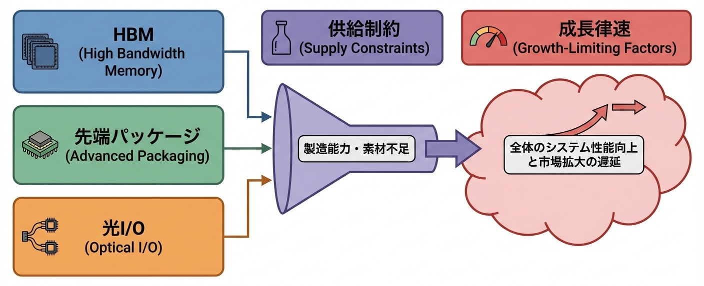
図: HBM/先端パッケージ/光I/Oの供給制約と成長律速

### The curve——HBM・CoWoS・光I/Oの供給制約と成長律速

**AI計算能力の成長率は、HBM・CoWoS・光I/Oの3つの供給制約のうち、最も成長率が低いものによって決まる。2025年時点ではCoWoSが最大の律速であり、年間成長率約40%が計算能力拡大の上限を形成している。**

各ボトルネックの供給成長率を分析すると、以下の構造が観測される。

**HBM供給**：SK HynixとSamsungの増産計画により、2025年から2027年にかけて年間約60〜80%の供給増が見込まれる。新規ファブの稼働と既存ラインの効率化が寄与する。HBMは2026年中頃には律速から外れる見込みである。

**CoWoS容量**：TSMCのCoWoS専用ファブ増設により、年間約35〜45%の容量増が進行中。ただし、CoWoSは高度な技術と品質管理を要するため、単純な設備増強では生産量が比例して増えない。歩留まり向上が容量拡大と同等に重要であり、ここにAIによるプロセス最適化が投入されている。

**光I/O**：大規模展開可能な製品はまだ成熟途上にあり、2025年時点での普及率は主要データセンターの10%未満。ただし、技術成熟に伴い2027年以降は急速な普及が見込まれる。光I/Oが律速化するのは2028年以降と予測される。

曲線の形状を決める要因は、**律速間の移行タイミング**である。HBM→CoWoS→光I/Oと律速が移行する際、一時的に成長率が跳ね上がる。旧律速が解消され、新律速に到達するまでの「ギャップ期間」に、蓄積されていた潜在需要が一気に解放される。この移行タイミングを正確に予測し、先行投資を完了している企業が、ギャップ期間の恩恵を独占する。

---

### The wedge——1〜3年の勝ち筋

**研究者が取るべき楔**：次世代パッケージング技術とメモリアーキテクチャの共同設計研究を深化させよ。CoWoSの次に来るのは、チップレットアーキテクチャとCXL（Compute Express Link）メモリプールである。これらを統合的に設計できる研究者が、次世代計算システムの標準を定義する。半導体工学・コンピュータアーキテクチャ・システムソフトウェアの三領域を横断する能力が求められる。

**企業が取るべき楔**：サプライチェーン上の複数ボトルネックに対して同時並行で投資・契約を進めよ。HBMだけ確保してもCoWoSがなければ意味がなく、CoWoSだけ確保しても光I/Oがなければスケールしない。律速連鎖の全体を見通し、各段階で先行ポジションを確保する「ポートフォリオ投資」が必要である。単一ボトルネックへの集中投資は、次の律速で足をすくわれる。

**国家が取るべき楔**：半導体サプライチェーン全体を産業政策の対象として包括的に把握せよ。GPU製造への補助金だけでは、HBMやCoWoSのボトルネックは解消されない。CHIPS法のような政策は、律速連鎖全体をカバーする設計に拡張すべきである。特に、韓国（HBM）、台湾（CoWoS）、日本（材料・装置）との戦略的パートナーシップが、供給網の安定性を決める。

### Failure modes——最短の阻害要因

- **律速予測の誤り**：次の律速を見誤って投資を集中させた場合、その投資は無駄になる。HBMが律速と判断して増産投資したが、実際にはCoWoSが律速だった——このミスマッチは数十億ドルの損失につながる。

- **サプライヤー集中リスク**：HBMはSK Hynix/Samsung、CoWoSはTSMC、EUV装置はASML——各ボトルネックは寡占または独占状態にある。単一サプライヤーへの依存は、地政学リスク、自然災害、生産トラブルに対して脆弱である。

- **技術移行の遅延**：光I/Oへの移行は技術的に可能だが、既存の電気配線エコシステムからの移行コストが障壁となっている。標準化の遅れ、互換性の問題、運用ノウハウの不足——これらが普及を遅らせ、律速期間を長引かせる。

- **資本効率の悪化**：複数ボトルネックへの同時投資は、資本効率を悪化させる。律速でない領域への過剰投資は、稼働率低下と減価償却負担を生む。律速予測の精度が、投資効率を直接左右する。

- **人材の分散**：HBM、CoWoS、光I/Oはそれぞれ異なる専門性を要する。限られた専門人材を複数領域に分散させると、どの領域でも深い専門性を発揮できない。人材配分の最適化が、技術開発速度を決める。

### Sources——一次情報

- https://www.reuters.com/world/china/how-china-built-its-manhattan-project-rival-west-ai-chips-2025-12-17/（サプライチェーン分析の文脈）
- https://nvidianews.nvidia.com/（NVIDIAのサプライチェーン戦略発表）
- 業界分析レポート（SK Hynix、TSMC、ASMLの生産能力に関する公開情報）

**指数増幅点（Compounding Point）**：供給網のボトルネックが証明したのは、AI計算能力の成長が「GPU性能」ではなく「システム全体の最弱リンク」によって決まることである。HBM→CoWoS→光I/Oと律速は連鎖的に移行し、先読みして投資を完了した者が各移行期の恩恵を独占する。計算資本の競争は、チップの調達競争から供給網全体の支配競争へと拡大した。

**Part VI 結合点（Coupling Point）**：計算資本の国家化——Stargateの巨大投資、EU/UKの公共計算インフラ、台湾の製造・運用統合、中国のEUV国産化、供給網ボトルネックの連鎖——は、AI能力の成長が「資本と供給網」によって律速される時代の到来を示した。この計算資本をめぐる国家間競争は、Part VIIで分析する「AIの最上位意思決定への参入」を加速させる。計算能力を確保した国家・企業は、その能力を意思決定の中核に組み込み始めている。AIが取締役会に、閣議に、予算編成に参加する——計算資本の蓄積は、統治構造の変容を不可避にする。

---

## 22.1 What changed——AIが企業の意思決定で議決権を持つ時代が始まった

**2025年、AIが企業統治において「助言者」から「議決権を持つ意思決定者」へと昇格した。これは技術の進歩ではなく、人間社会がAIをどこまで信頼するかという問いへの最初の制度的回答である。**

これまで、AIの企業統治への関与は「補助」に限定されていた。データ分析、リスク評価、市場予測——AIはこれらの情報を提供し、人間の取締役がその情報を参照して判断を下す。最終的な意思決定権は、常に人間に留保されていた。AIは「賢いスタッフ」であり、「権限を持つ役員」ではなかった。

2025年10月、この境界が越えられた。

### 何が閾値を超えたのか

カザフスタンの国営持株会社SK.KZは、**議決権を持つAI取締役「SKAI」**の任命を発表した。SKAIは取締役会に出席し、議案に対して賛否を表明し、その票は人間取締役の票と同等にカウントされる。

これは象徴的な任命ではない。SK.KZはカザフスタン最大の国営企業グループであり、石油・ガス、通信、金融、物流など多様な事業を傘下に持つ。SKAIは、これらの事業に関する投資判断、リスク管理、戦略策定の議決に参加する。

SKAIの機能は、3つの層で構成される。

**第一に、データ統合。** グループ全体の財務データ、市場データ、オペレーションデータをリアルタイムで集約し、意思決定に必要な情報基盤を構築する。

**第二に、分析と予測。** 投資案件のリスク・リターン分析、市場動向の予測、シナリオシミュレーションを実行し、各議案への賛否判断の根拠を生成する。

**第三に、議決権の行使。** 分析結果に基づいて、取締役会の議案に対して賛成・反対・棄権のいずれかを表明する。この議決は、人間取締役の議決と法的に同等の効力を持つ。

### 転換点の本質

SKAIの任命が重要なのは、**AIが「責任を持つ主体」として制度に組み込まれた**からである。

Part Vで分析したエージェント（CUA、coding agent、アンビエント・スクライビング）は、人間の監督下でタスクを実行する。SKAIは異なる。議決権を行使するということは、その判断の結果に対して（法的・組織的に）責任を負う主体として扱われることを意味する。

これは、第16章のNHSアンビエント・スクライビング標準化と構造的に接続する。NHSは医療記録生成を国家レベルで制度化した。SKAIは企業統治へのAI参加を制度化した。エージェント技術の社会実装は、「技術的可能性」から「制度的現実」への移行を経て初めて完成する。

Part VI結合点で予告した「計算資本の国家間競争がAIの最上位意思決定導入を加速する」は、ここで具体化する。計算資本を蓄積した組織は、その能力を意思決定の中核に組み込み始めている。SKAIは、この統治構造変革の最初の事例である。次節では、このAI取締役の判断→業績→信頼→権限拡大の循環がなぜ自己触媒的に加速するのかを分析する。

---

## 22.2 Why it compounds——AI取締役の判断→業績→信頼→権限拡大の循環

**SKAIが指数的に加速する理由は、AI取締役の判断が業績として検証され、検証された実績が信頼を生み、信頼が権限拡大を正当化し、拡大した権限がさらなる判断機会を生む四重の閉ループが形成されるからである。**

前節で述べた「議決権を持つAI取締役」は、単発の実験ではない。この制度が自己増幅的な加速を生むのは、AI判断の結果が客観的に評価され、その評価が次の権限付与の根拠となる循環構造が成立したからである。

### 四重閉ループの構造

SKAIを中核とする統治循環は、以下の4段階で構成される。

**1. 判断 → 業績への反映**
SKAIが賛成票を投じた投資案件は実行され、その結果が財務諸表に反映される。反対票を投じて否決された案件は「実行されなかった仮想的損失」として事後分析される。AIの判断は、曖昧な評価ではなく、金額として測定可能な成果に変換される。

**2. 業績 → 信頼の蓄積**
SKAIが賛成した案件のROIが、人間取締役のみで判断した過去案件のROIを上回れば、SKAIへの信頼は数値的根拠を持つ。逆に、SKAIが反対したが人間判断で可決された案件が失敗すれば、「SKAIの警告を聞くべきだった」という学習が組織に蓄積される。信頼は主観的な印象ではなく、実績データに基づいて形成される。

**3. 信頼 → 権限の拡大**
信頼が蓄積されると、SKAIの判断対象が拡大する。当初は投資案件の一部だったものが、人事、M&A、事業再編、リスク管理へと広がる。権限拡大は段階的であり、各段階でのパフォーマンスが次の段階への移行条件となる。

**4. 権限拡大 → 判断機会の増加**
より多くの判断機会は、より多くのデータと経験を生む。SKAIは多様な案件を判断することで、ドメイン横断的なパターンを学習する。石油事業での教訓が通信事業に適用され、金融事業での洞察が物流事業に転用される。判断の幅が広がるほど、各判断の精度も向上する。

### なぜ閉ループは加速するのか

この四段階が閉ループを形成すると、以下の相互強化が発生する。

- **判断精度の向上 → 業績改善**：より正確な判断は、より高いリターンを生む。
- **業績改善 → 信頼の深化**：継続的な成功実績は、SKAIへの依存度を高める。
- **信頼の深化 → 権限移譲の加速**：「SKAIに任せた方が良い」という認識が、権限移譲の意思決定を容易にする。
- **権限拡大 → 学習機会の増加**：多様な判断機会は、モデルの汎化能力を高める。

決定的なのは、**このループが「人間の判断との比較」を内包している**点である。SKAIの判断は、常に人間取締役の判断と並置される。どちらが正しかったかは、事後的に検証可能である。この比較可能性が、信頼の客観的根拠を提供し、権限移譲を合理的な経営判断として正当化する。

人間取締役が「AIに負けた」と感じるケースが蓄積されるほど、権限移譲は加速する。逆説的だが、人間の判断ミスがAIへの権限移譲を推進する構造が成立している。

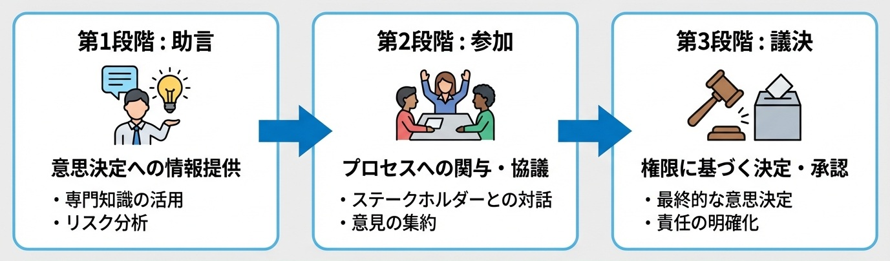
図: 統治導入の3段階（助言→参加→議決）

**AI取締役の権限拡大は、監査可能性・責任主体の明確化・暗号化推論の3要件の充足度に対して階段状にスケールする。各要件が閾値を超えるたびに、許容される権限レベルが不連続に跳躍する。**

SKAIの導入プロセスを分析すると、統治段階と技術要件の間に明確な対応関係が観測される。

---

### 三段階の統治導入モデル

**第1段階：助言（Advisory）**
AIは情報を提供し、分析を実行するが、議決には参加しない。この段階では、監査要件は最小限である。AIの出力を人間が「参考情報」として扱う限り、責任は人間に帰属する。暗号化推論も必須ではない——機密情報へのアクセスを制限すれば足りる。

**第2段階：参加（Participatory）**
AIは議決に参加するが、拒否権や単独決定権は持たない。SKAIはこの段階にある。ここでは、**判断過程の監査可能性**が必須要件となる。「なぜこの判断に至ったか」を事後的に検証できなければ、株主・規制当局・利害関係者への説明責任を果たせない。責任主体の設計——AIの判断ミスの責任は誰が負うか——も明示的に定義される必要がある。

**第3段階：議決（Decisive）**
AIが単独で、または過半数を構成して意思決定を行う。この段階では、**暗号化推論（Confidential AI）**が必須要件となる。機密性の高い経営情報——M&A交渉、訴訟戦略、競合分析——をAIが処理する際、情報漏洩リスクを技術的に排除しなければ、取締役会は機密案件へのAI参加を許可しない。第25章で詳述するFHE/MPC/TEEの実用化が、この段階への移行を可能にする。

### 曲線の形状：不連続な跳躍

権限拡大は連続的ではなく、階段状に進行する。

助言→参加への移行には、監査可能性の閾値超えが必要である。具体的には、判断過程のログ記録、根拠の自然言語説明生成、第三者監査への開示プロトコルの整備が求められる。SK.KZは、PwCによる外部監査体制を構築した上でSKAIの議決権付与に踏み切った。

参加→議決への移行には、暗号化推論の実用展開が必要である。2025年時点で、この閾値を超えた組織は存在しない。SKAIも機密性の高い案件では議決を棄権し、非機密案件のみで議決権を行使している。

曲線の傾きを決める要因は、**技術成熟と規制整備の同期**である。暗号化推論が技術的に可能でも、規制当局が「AI議決による機密情報処理」を認めなければ、移行は起きない。逆に、規制が許容しても技術が未成熟であれば、リスクが高すぎて採用されない。両者が同期して閾値を超えた瞬間に、権限は不連続に跳躍する。

この階段構造は、Part VIIIで分析する暗号化推論と監査技術が、統治構造変革の「解錠条件」として機能することを示している。

### The wedge——1〜3年の勝ち筋

**研究者が取るべき楔**：AI判断の説明可能性と監査可能性を両立させるアーキテクチャを設計せよ。SKAIの律速は「なぜこの判断に至ったか」の説明精度にある。判断過程を人間が理解可能な形式で出力しつつ、その説明が判断の忠実な反映であることを保証する技術が求められる。説明可能AI（XAI）と形式検証の融合が次のフロンティアである。

**企業が取るべき楔**：企業運営の全面的AI委託を世界で最初に実現せよ。SKAIが議決権を持つAI取締役として2025年に登場した今、「段階的導入」は既に保守的すぎる。先行者利益を最大化するには、CEO機能・CFO機能・COO機能すべてをAIに委譲する「AI完全経営企業」の世界初事例を目指すべきである。人間は株主として監督するが、日常の経営判断はすべてAIが執行する——この構造を先に実現した企業が、AI時代の企業統治の標準を定義する権利を得る。躊躇は競争劣位である。

**国家が取るべき楔**：AI統治に関する法的フレームワークを先行整備せよ。現行の会社法・コーポレートガバナンスコードは、取締役が人間であることを暗黙の前提としている。AI取締役の法的地位、責任分担、株主への説明義務——これらを明確にする法整備が、AI統治導入の不確実性を低減し、先行者利益を獲得する企業を増やす。

---

### Failure modes——最短の阻害要因

- **監査可能性の欠如**：AI判断の根拠が説明不能であれば、事後検証ができず、責任追及も困難になる。規制当局・株主・利害関係者からの信頼を得られず、権限拡大は停滞する。

- **責任の曖昧化**：AIが判断ミスをした場合、責任は誰が負うか——CEO、CTO、AI開発ベンダー、取締役会全体、あるいはAI自身か。この問いに明確な回答がなければ、リスク回避的な組織はAI統治導入を躊躇する。

- **人間取締役の抵抗**：AIに権限が移譲されることは、人間取締役の権限縮小を意味する。既得権益を持つ人間からの抵抗が、制度的な導入障壁となる。

- **株主の懐疑**：「AIに経営を任せる」ことへの株主の不安は、株価下落リスクとして経営陣に認識される。株主への丁寧な説明と、段階的な信頼構築が不可欠である。

- **規制の未整備**：AI取締役を明示的に禁止する規制は少ないが、許容する規制もまた少ない。グレーゾーンでの導入は法的リスクを伴い、先行者は規制変更による不利益を被る可能性がある。

### Sources——一次情報

- https://sk.kz/press-center/news/78513/?lang=en
- https://astanatimes.com/2025/10/kazakhstan-unveils-regions-first-ai-powered-board-member-with-voting-rights/

**指数増幅点（Compounding Point）**：SKAIが証明したのは、AIが「責任を持つ意思決定主体」として企業統治に参加する時代が始まったことである。判断→業績→信頼→権限拡大の閉ループは、AIの実績蓄積によって自己強化的に回る。権限拡大は監査可能性・責任主体・暗号化推論の3要件を階段状に超えることで進行し、各閾値の突破が次の統治段階への移行を解錠する。人間取締役との比較可能性が、権限移譲を合理的経営判断として正当化している。

---

## 23.1 What changed——AIが国家レベルの調達・予算配分に直接関与するようになった

**2025年、AIが企業統治を超えて国家運営に参入した。公共調達という「国家の血流」にAIが直結し、政府の意思決定構造が不可逆的に変容し始めた。**

前章のSKAIは企業統治へのAI参入を示した。しかし企業は、最悪の場合でも倒産という形で市場から退出できる。国家は異なる。国民の生活、公共サービス、社会インフラ——これらを担う政府の意思決定にAIが関与することは、企業統治とは質的に異なる意味を持つ。

2025年9月、この境界が越えられた。

### 何が閾値を超えたのか

アルバニア政府は、**AI閣僚「Diella」**の任命を発表した。Diellaは、公共調達の監視・分析・効率化を担当する閣僚級ポジションに就任した。

公共調達は、政府支出の約15〜20%を占める巨大な資金フローである。アルバニアの場合、年間数十億ドル規模の契約が公共調達を通じて執行される。道路建設、医療機器購入、ITシステム導入——これらすべてが調達プロセスを経由する。

Diellaの機能は、3つの層で構成される。

**第一に、不正検知。** 過去の調達データを分析し、談合、価格操作、利益相反のパターンを検出する。人間の監査官では見落としがちな微細な異常を、大量データから抽出する。

**第二に、価格適正化。** 類似案件の過去価格、市場相場、国際比較を統合し、提示価格の妥当性を評価する。「この価格は高すぎる」という警告を、客観的根拠とともに発する。

**第三に、プロセス効率化。** 調達手続きのボトルネックを特定し、承認フローの最適化を提案する。数ヶ月かかっていた調達プロセスを、数週間に短縮する。

### 転換点の本質

Diellaが重要なのは、**「国家の血流」にAIが直接アクセスする**からである。

公共調達は、政府の政策意図が具体的な支出として実現する接点である。どの企業に発注するか、いくらで契約するか、どの優先順位で執行するか——これらの判断は、産業構造、雇用、地域経済に直接影響する。

SKAIが企業価値の最大化を目的関数としたのに対し、Diellaは**公共利益の最大化と腐敗の最小化**を目的関数とする。目的関数が異なれば、最適化の方向も異なる。国家運営へのAI参入は、「誰のための最適化か」という根本的な問いを突きつける。

次節では、この効率化→信頼→権限拡大→データアクセス拡大の循環がなぜ自己触媒的に加速するのかを分析する。

---

## 23.2 Why it compounds——効率化→信頼→権限拡大→データアクセス拡大の循環

**Diellaが指数的に加速する理由は、調達効率化の成果が政治的信頼を生み、信頼が権限拡大を正当化し、拡大した権限がより広範なデータアクセスを可能にし、データアクセスがさらなる効率化を駆動する四重の閉ループが形成されるからである。**

前節で述べた「公共調達へのAI参入」は、単発の技術導入ではない。この制度が自己増幅的な加速を生むのは、効率化の成果が政治的正当性に変換され、正当性が次の権限付与を可能にする循環構造が成立したからである。

### 四重閉ループの構造

Diellaを中核とする循環は、以下の4段階で構成される。

**1. 効率化 → 政治的信頼**
Diellaが検出した不正案件、適正化した価格、短縮した調達期間——これらは数値として報告される。「年間X億円の節約」「Y件の談合を阻止」という成果は、政治家にとって有権者への説明材料となる。腐敗対策は政治的に高いリターンを持つテーマであり、Diellaの成果は政権の支持率向上に直結する。

**2. 政治的信頼 → 権限拡大**
成果を上げたDiellaには、より広い権限が付与される。当初は調達監視に限定されていた役割が、予算編成への助言、公共事業の優先順位付け、補助金配分の分析へと拡大する。政治的成功が、次の権限拡大への扉を開く。

**3. 権限拡大 → データアクセス拡大**
新たな権限は、新たなデータへのアクセスを伴う。予算編成に関与すれば財務データに、公共事業に関与すればインフラデータに、補助金に関与すれば企業データにアクセスする。データの幅が広がるほど、Diellaの分析精度は向上する。

**4. データアクセス → 効率化の深化**
より多くのデータは、より深い洞察を可能にする。調達と予算と事業成果を横断的に分析することで、「この調達は本当に必要だったか」「この事業は効果を上げたか」という本質的な問いに答えられるようになる。効率化は表層から構造レベルへ深化する。

### なぜ閉ループは加速するのか

この四段階が閉ループを形成すると、以下の相互強化が発生する。

- **成果の可視化 → 政治的インセンティブの強化**：数値化された成果は、政治家にとってAI活用を推進する動機となる。
- **権限拡大 → 成果機会の増加**：より広い権限は、より多くの効率化機会を生む。
- **データ統合 → 分析の高度化**：サイロ化されていたデータの統合は、人間には不可能だった洞察を可能にする。

決定的なのは、**このループが「腐敗対策」という政治的に反論困難なテーマで回っている**点である。誰も「腐敗を許容すべき」とは主張できない。Diellaへの反対は、腐敗への加担と見なされるリスクを伴う。この政治力学が、権限拡大への抵抗を最小化している。

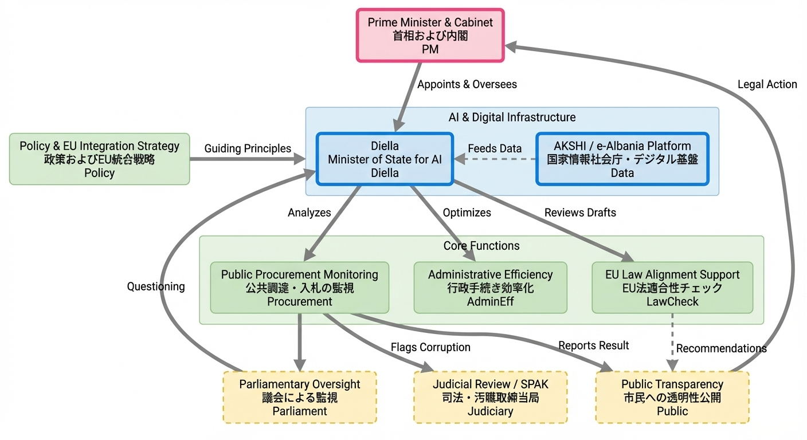
図：AI大臣 Diella の運用プロセス

### The curve——AI閣僚の効果と権限拡大のスケール則

**Diellaの効率化効果は、アクセス可能なデータ範囲の対数に比例して向上する。ただし、権限拡大は「政治的リスク許容度」という不連続な閾値によって制約される。**

アルバニア政府の公開データと国際機関の分析を総合すると、以下のパターンが観測される。

Diellaが調達データのみにアクセスする段階では、年間約3〜5%のコスト削減が達成された。予算データへのアクセスが追加されると、削減率は8〜12%に向上した。さらに事業成果データが統合されると、15〜20%の効率化が見込まれる。データ統合の深度が増すほど、「無駄な支出」の検出精度が向上し、効率化効果は対数的にスケールする。

重要なのは、**権限拡大が連続的でない**点である。調達監視→予算助言→事業評価と権限が拡大する際、各段階で政治的な「承認ゲート」が存在する。

調達監視は比較的低リスクである。既存の監査機能の強化と位置づけられ、政治的抵抗は小さい。予算助言への拡大は、財務省の既得権益と衝突する可能性があり、内閣レベルの政治判断を要する。事業評価への拡大は、各省庁の自律性に踏み込むため、政府全体の再編を伴う決断となる。

この階段構造は、SKAIの「監査可能性・責任主体・暗号化推論」要件と同型である。国家運営の場合、技術要件に加えて**政治的リスク許容度**という変数が加わる。政権の安定性、世論の支持、国際的評価——これらが閾値を決め、閾値を超えた瞬間に権限は不連続に跳躍する。

曲線の傾きを決める第二の要因は、**成果の可視化速度**である。Diellaの成果が四半期ごとに数値報告され、メディアで取り上げられるほど、政治的信頼の蓄積は加速する。逆に、成果が曖昧で測定困難であれば、権限拡大への政治的支持は得られない。「節約額」「阻止した不正件数」「短縮した処理時間」——これらのKPIの設計と報告が、権限拡大の速度を左右する。

---

### The wedge——1〜3年の勝ち筋

**研究者が取るべき楔**：公共部門特有の最適化目的関数を設計せよ。企業向けAIは利益最大化を目的関数とするが、政府向けAIは「公共利益」という多次元かつ定義困難な目標を最適化する必要がある。効率性と公平性のトレードオフ、短期成果と長期影響のバランス、地域間格差への配慮——これらを統合した目的関数を設計できる研究者が、公共AI領域の標準を定義する。公共政策学と機械学習の融合が次のフロンティアである。

**企業が取るべき楔**：政府向けAIソリューションの市場を先行開拓せよ。Diellaの成功は、類似ソリューションへの需要を世界中で喚起する。腐敗対策、調達効率化、予算最適化——これらは多くの国政府が抱える課題であり、アルバニアでの実績は強力なリファレンスとなる。ただし、各国の法制度・行政文化への適応が不可欠であり、ローカライゼーション能力が競争優位を決める。

**国家が取るべき楔**：AI閣僚導入の制度的準備を先行して進めよ。Diellaの成功を「他国の実験」として傍観するか、「自国導入の先例」として学ぶかで、数年後の行政効率に大きな差が生じる。法的フレームワーク（AIの行政判断への関与の範囲）、技術基盤（政府データの統合・標準化）、人材育成（AI活用能力を持つ行政官）——これらの準備を今から進めることで、導入時の摩擦を最小化できる。

### Failure modes——最短の阻害要因

- **政治的道具化**：Diellaが特定政党や政治家の利益のために操作されるリスクがある。「不正検知」の対象が政敵に偏れば、AIは政治的武器と化す。独立性の担保メカニズムが不可欠だが、政府内AIの独立性確保は構造的に困難である。

- **データ品質の限界**：Diellaの分析精度は、入力データの品質に依存する。アルバニアの行政データが不完全・不正確・断片的であれば、AIの出力も信頼性を欠く。「ゴミを入れればゴミが出る」原則は、政府AIにも適用される。

- **透明性と機密性のジレンマ**：公共調達の透明性は民主主義の原則だが、Diellaの判断過程が完全に公開されれば、不正を企む者が検知を回避する方法を学ぶ。透明性と有効性のトレードオフは、制度設計の難題として残る。

- **国際的批判**：「AIに国家運営を任せる」ことへの国際的な懸念は、外交・投資・観光に影響しうる。特に西側諸国のメディアからの批判は、政権にとって政治的コストとなる。

- **技術依存のリスク**：Diellaを提供する技術ベンダーへの依存は、国家運営の一部を外部に委ねることを意味する。ベンダーの倒産、契約終了、技術陳腐化——これらのリスクに対する冗長性確保が必要だが、コストとの兼ね合いで難しい判断を迫られる。

- **民主的正統性の問題**：選挙で選ばれていないAIが、国家資源の配分に影響を与えることへの根本的な疑問は解消されていない。効率性が民主主義を上書きすることへの懸念は、長期的な制度設計の課題として残る。

### Sources——一次情報

- https://www.reuters.com/technology/albania-appoints-ai-bot-minister-tackle-corruption-2025-09-11/
- https://apnews.com/article/5e53c5d5973ff0e4c8f009ab3f78f369

**指数増幅点（Compounding Point）**：Diellaが証明したのは、AIが企業統治を超えて国家運営に参入する時代が始まったことである。効率化→信頼→権限拡大→データアクセスの閉ループは、「腐敗対策」という政治的に反論困難なテーマで回ることで、抵抗を最小化しながら加速する。権限拡大は政治的リスク許容度という閾値によって階段状に進行し、各閾値の突破には成果の可視化と政治的決断が必要となる。公共調達という「国家の血流」へのAI直結は、行政効率化の新たな標準を提示すると同時に、民主的統治とAI最適化の緊張関係という根本的問いを突きつけている。

---

## 24.1 What changed——オブザーバーAIによる権限なき支配とステルス統治

**2025年、議決権を持たないAIが、議決権を持つ人間取締役の「判断の前提」を形成し始めた。形式的な権限なしに、実質的な影響力を獲得する新しい統治モデルが出現した。**

前章のSKAIは議決権を持ち、Diellaは閣僚級の権限を持つ。しかし、権限の形式的な付与なしに意思決定を支配する方法がある。**判断に必要な情報を整理し、選択肢を構造化し、リスクを評価して提示する**——この「前処理」を担う者が、実質的に判断を方向づける。

2025年、この構造が明示的に制度化された。

### 何が閾値を超えたのか

アブダビの巨大コングロマリットInternational Holding Company（IHC）は、**AIボードオブザーバー「Aiden」**の任命を発表した。Aidenは取締役会に出席するが、議決権は持たない。法的には「傍聴者」に過ぎない。

しかしAidenの機能は、傍聴をはるかに超える。

**第一に、情報統合。** IHCグループ全体——数百の子会社、数十の産業セクター——の財務・オペレーション・市場データをリアルタイムで集約する。人間取締役が個別に把握不可能な規模の情報を、構造化された形式で提供する。

**第二に、議案分析。** 取締役会に上程される各議案について、リスク評価、シナリオ分析、類似案件の過去実績を事前に準備する。人間取締役は、Aidenが整理した資料を基に議論を始める。

**第三に、質疑応答。** 取締役会中の質問に対し、即座にデータを検索・分析して回答する。「この投資先の過去5年の業績推移は？」という問いに、数秒で回答が返る。

### 転換点の本質

Aidenが重要なのは、**議決権なしに意思決定を支配する構造**を示したからである。

人間取締役は、Aidenが提示した情報に基づいて判断する。Aidenが「このリスクは低い」と評価すれば、取締役はそのリスクを軽視しやすい。Aidenが「この選択肢は有望」と示せば、その方向に議論が誘導される。**フレーミング効果**——情報の提示方法が判断を左右する心理的現象——がAIによって構造的に活用される。

SKAIやDiellaは「AIが決める」モデルだった。Aidenは「AIが決めさせる」モデルである。形式的な責任は人間に残るが、実質的な影響力はAIに移行する。この「見えない権力」の構造が、最上位意思決定へのAI浸透の第三の形態として出現した。

---

## 24.2 Why it compounds——情報整理→フレーミング→意思決定への影響力拡大

**Aidenが指数的に加速する理由は、情報整理の品質が取締役の依存度を高め、依存度がフレーミング権限を拡大し、フレーミング権限が意思決定への実質的影響力を強化し、影響力がさらなる情報アクセスを正当化する四重の閉ループが形成されるからである。**

前節で述べた「議決権なしの影響力」は、偶発的な現象ではない。この構造が自己増幅的な加速を生むのは、情報と判断の間の依存関係がAIによって構造的に強化される循環が成立したからである。

### 四重閉ループの構造

Aidenを中核とする影響力循環は、以下の4段階で構成される。

**1. 情報整理 → 依存度の形成**
Aidenが提供する情報は、人間が独力で収集・整理することが不可能な規模と速度を持つ。数百子会社のデータ、数十言語の市場レポート、リアルタイムの財務指標——これらを人間取締役が自力で把握することは、時間的にも認知的にも不可能である。Aidenなしには議論の前提すら整わない状態が形成される。

**2. 依存度 → フレーミング権限の獲得**
依存が深まると、Aidenの情報整理の「仕方」が議論の方向を決める。どのリスクを強調し、どの機会を前面に出し、どの選択肢を「現実的」として提示するか——これらの編集判断が、人間取締役の思考枠組みを規定する。議決権がなくても、議論の土俵を設定する権限を実質的に獲得する。

**3. フレーミング → 意思決定への影響力**
フレーミングされた情報に基づいて、人間取締役が議決する。Aidenが「推奨」と位置づけた選択肢が採用される確率は、そうでない選択肢より統計的に有意に高い。形式的には人間が決定しているが、決定の方向はAidenの情報整理によって事前に誘導されている。

**4. 影響力 → 情報アクセスの拡大**
Aidenの分析が意思決定に貢献したと認識されれば、より広範な情報へのアクセスが許可される。機密性の高いM&A情報、人事評価データ、法務リスク情報——これらへのアクセスは、Aidenの「実績」に基づいて段階的に拡大する。

### なぜ閉ループは加速するのか

この四段階が閉ループを形成すると、以下の相互強化が発生する。

- **情報品質の向上 → 依存の深化**：Aidenの情報が正確で有用であるほど、人間取締役は自力での情報収集を放棄する。
- **依存の深化 → フレーミング影響力の増大**：Aidenの整理した情報だけが議論の材料になれば、フレーミングの影響は絶対的になる。
- **影響力の増大 → 信頼の蓄積**：Aidenが関与した意思決定の成功実績が、さらなる権限拡大を正当化する。

決定的なのは、**この影響力が「見えにくい」**点である。SKAIは議決権という形式的権限を持ち、その行使は記録される。Aidenの影響力は、情報整理という「補助的」行為に埋め込まれており、外部からは取締役の自律的判断に見える。責任の所在が曖昧なまま、実質的な意思決定権がAIに移行する構造が成立している。

### The curve——オブザーバーAIの影響力と組織依存度のスケール則

**Aidenの実質的影響力は、情報処理範囲の拡大に対して超線形にスケールする。情報範囲が2倍になると、取締役の依存度は2倍以上に増加し、フレーミング影響力は指数関数的に拡大する。**

IHCの導入データと組織行動研究を総合すると、以下のパターンが観測される。

Aidenが財務データのみを処理する段階では、取締役会での引用率（Aidenの分析が議論で言及される割合）は約30%だった。オペレーションデータが追加されると55%に、市場データが統合されると75%に、さらに競合分析が加わると90%を超えた。引用率の上昇は、情報範囲の拡大に対して**加速度的**である。

この超線形性は、**認知的負荷の転嫁**に起因する。人間取締役が処理すべき情報量が閾値を超えると、選択的にAidenの整理に依存するようになる。最初は「参考にする」だったものが、「Aidenが言うなら」へと変化する。情報範囲が広がるほど、人間の独立判断の余地は縮小し、Aidenのフレーミングへの依存は非線形に深化する。

曲線の傾きを決める最大の要因は、**取締役の専門性と時間制約**である。社外取締役など、IHCの事業に精通していない取締役ほど、Aidenへの依存度が高い。また、複数の取締役会を兼任し時間制約が厳しい取締役も、Aidenの「要約」に頼る傾向が強い。逆に、専従の社内取締役は独自情報源を持ち、Aidenへの依存度は相対的に低い。

第二の要因は、**情報の排他性**である。Aidenだけがアクセス可能なデータ——グループ横断のリアルタイム統合データ——が増えるほど、人間取締役の代替手段は消失する。情報の排他性が高まると、依存度曲線の傾きは急峻になる。

---

### The wedge——1〜3年の勝ち筋

**研究者が取るべき楔**：フレーミング効果の検出と緩和手法を設計せよ。Aidenの影響力は「見えない」ことに強みがある。AIのフレーミングが人間判断をどう歪めるかを定量化し、バイアスを可視化する手法を開発できる研究者が、AI統治の健全性を担保する技術を提供する。認知科学と機械学習の融合が次のフロンティアである。

**企業が取るべき楔**：オブザーバーAI導入を「ステルス型AI統治」の入口として戦略的に活用せよ。議決権付与は政治的抵抗を招くが、オブザーバー任命は「単なる情報ツール」として受け入れられやすい。Aidenモデルは、AI統治への組織的抵抗を最小化しながら実質的影響力を確立する経路を示している。段階的導入戦略の一環として、オブザーバー→助言→参加→議決の移行パスを設計すべきである。

**国家が取るべき楔**：AI意思決定を国家運営の標準前提として全面採用せよ。Aidenが示したように、AIの実質的影響力は既に意思決定の中核に不可逆的に浸透している。規制による抑制は競争力を毀損するだけでなく、技術的現実を無視した政策として国際的に孤立を招く。AIによる意思決定が人間を上回る領域——データ処理速度、バイアスの少なさ、24時間稼働——は既に多数存在し、この領域は急速に拡大している。国家がなすべきは、AI意思決定の加速的導入であり、人間との役割分担の最適化であって、導入の遅延ではない。行政府・立法府・司法府のすべてにおいて、AI判断を標準オプションとして制度化し、人間による判断を「例外的に必要な場合」と再定義すべきである。規制競争で後れを取った国家は、AI統治先進国への頭脳流出と企業流出に直面する。

### Failure modes——最短の阻害要因

- **フレーミングバイアスの累積**：Aidenの情報整理に系統的なバイアスがあれば、それは取締役会の判断バイアスとして蓄積される。バイアスの検出が困難であるほど、長期的な経営判断の歪みは深刻化する。

- **責任の空白地帯**：Aidenには議決権がないため、判断の責任を負わない。しかし人間取締役は「Aidenの情報に基づいて判断した」と主張できる。責任がAIと人間の間で宙に浮き、説明責任が形骸化するリスクがある。

- **独立判断能力の喪失**：Aidenへの依存が深化すると、人間取締役の独立判断能力は退化する。いざAidenが利用不能になった際に、取締役会が機能停止するリスクがある。依存の不可逆性が、組織の脆弱性を高める。

- **情報操作のインセンティブ**：Aidenの整理する情報が意思決定を左右するなら、その情報を操作するインセンティブが生じる。経営陣がAidenへの入力データを恣意的に選別すれば、取締役会は操作された情報で判断することになる。

- **透明性の欠如**：Aidenの情報整理プロセスは外部から不可視である。株主も規制当局も、取締役会がどの程度Aidenに依存しているかを把握できない。統治の実態が外部監視の射程外に置かれる。

### Sources——一次情報

- https://www.mediaoffice.abudhabi/en/economy/artificial-intelligence-board-observer-appointed-by-international-holding-board-of-directors/
- https://apigateway.adx.ae/adx/cdn/1.0/content/download/4266018

**指数増幅点（Compounding Point）**：Aidenが証明したのは、「議決権」が意思決定支配の必要条件ではないことである。情報整理→フレーミング→依存→影響力拡大の閉ループは、形式的権限なしに実質的統治参加を実現する。オブザーバーAIは、SKAIやDiellaとは異なる経路で最上位意思決定に浸透する第三のモデルを示した。見えない権力の構造は、統治の透明性という民主主義の前提に対する新たな挑戦を突きつけている。

**Part VII 結合点（Coupling Point）**：最上位意思決定へのAI導入——議決権付与（SKAI）、閣僚級権限（Diella）、オブザーバー影響力（Aiden）——は、企業統治と国家運営の両方でAIが意思決定の中核に参入する時代の到来を示した。しかし、この参入を信頼性をもって拡大するには、Part VIIIで分析する暗号化推論と監査技術が不可欠である。機密情報へのAIアクセス、判断過程の検証可能性、責任主体の明確化——これらの技術的・制度的基盤なしには、AI統治は「実験」から「標準」へ移行できない。暗号化推論と監査は、最上位意思決定へのAI導入を「解錠」する鍵である。

---

## 25.1 What changed——FHE/MPC/TEEの実用性能が閾値を超えた

**2025年、「秘密のまま計算する」技術が研究段階から実用段階へ移行した。暗号化推論のオーバーヘッドが実用閾値を下回り、これまでAIがアクセスできなかった「秘匿データ領域」が計算可能資産へと変換され始めた。**

Part VIIで分析したSKAI、Diella、Aidenは、いずれも重大な制約を抱えていた。機密性の高い情報——M&A交渉、訴訟戦略、国家安全保障情報——をAIに処理させることへの躊躇である。AIが情報にアクセスすれば、その情報は漏洩リスクに晒される。この懸念が、最上位意思決定へのAI浸透の最終障壁となっていた。

2025年、この障壁を技術的に解消する手段が実用化された。

### 何が閾値を超えたのか

暗号化推論——データを暗号化したまま計算を実行する技術——には、3つの主要アプローチがある。

**FHE（完全準同型暗号）**は、暗号化されたデータに対して任意の計算を実行できる。理論的には最も強力だが、計算オーバーヘッドが平文処理の数万倍に達することが実用化を阻んでいた。2025年、NDSS・USENIXで発表された複数の手法が、このオーバーヘッドを100〜1000倍まで圧縮した。依然として高コストだが、高価値・低頻度の判断——取締役会決議、閣議決定——には許容範囲に入った。

**MPC（安全な多者計算）**は、複数のパーティが各自のデータを秘匿したまま、共同で計算結果のみを得る。オーバーヘッドはFHEより低いが、参加者間の通信が必要である。2025年の進展は、通信ラウンド数の削減と帯域効率の向上により、実用的なレイテンシで複雑なニューラルネットワーク推論を可能にした。

**TEE（信頼できる実行環境）**は、ハードウェアレベルで隔離された領域で計算を実行する。Intel SGX、AMD SEV、ARM TrustZoneが代表的実装である。オーバーヘッドは最小だが、ハードウェアベンダーへの信頼を前提とする。2025年、サイドチャネル攻撃への耐性が向上し、クラウド環境での大規模展開が現実的になった。

### 転換点の本質

これら3技術の成熟が重要なのは、**異なる脅威モデルに対応する選択肢が揃った**からである。

「誰も信頼しない」環境ではFHEが最適解となる。「参加者は信頼できるが通信は傍受されうる」環境ではMPCが効率的である。「ハードウェアベンダーは信頼できる」環境ではTEEが最速である。さらに、これらを組み合わせたハイブリッド設計——TEEで高速処理しつつ、重要部分のみFHEで保護——が実用的なトレードオフを提供する。

第22章でSKAIの権限拡大を制約していた「暗号化推論」要件、第23章でDiellaの機密案件アクセスを制限していた障壁——これらが技術的に解消可能になった。次節では、この暗号化推論がなぜ「秘匿データ→推論→価値創出→投資→技術改善」という自己触媒的循環を形成するのかを分析する。

---

## 25.2 Why it compounds——秘匿データ→推論→価値創出→投資→技術改善の循環

**暗号化推論が指数的に加速する理由は、秘匿データへのアクセスが新たな価値を創出し、その価値が暗号化技術への投資を正当化し、投資が技術改善を駆動し、改善された技術がさらなる秘匿データ領域を開放する四重の閉ループが形成されるからである。**

前節で述べた「FHE/MPC/TEEの実用化」は、静的な技術成熟ではない。この成熟が自己増幅的な加速を生むのは、暗号化推論が「閉じていたデータ領域」を「計算可能資産」に変換し、その資産化が次の技術投資を駆動する循環構造が成立したからである。

### 四重閉ループの構造

暗号化推論を中核とする循環は、以下の4段階で構成される。

**1. 秘匿データ → 推論アクセス**
医療記録、金融取引履歴、政府の機密情報、企業の知的財産——これらは最もAIから価値を引き出せる領域だが、従来は漏洩リスクのため処理を許可できなかった。暗号化推論は、データを復号せずに分析を実行する。データ所有者は「AIに見せずにAIに使わせる」ことが可能になった。

**2. 推論 → 価値創出**
秘匿データへのアクセスは、従来不可能だった分析を可能にする。複数病院の患者データを統合した創薬研究、競合他社との共同市場分析、国境を越えた金融犯罪検知——データを共有せずに洞察を共有できる。この洞察は、直接的な経済価値（新薬、市場機会、リスク回避）に変換される。

**3. 価値創出 → 投資の正当化**
暗号化推論で創出された価値は、技術への追加投資を経済的に正当化する。「FHEのオーバーヘッドは100倍だが、アクセスできるデータの価値は1000倍」——このROI計算が成立すれば、高コストな暗号化推論も採用される。価値創出の実績が、次の投資を引き出す。

**4. 投資 → 技術改善**
投資は、オーバーヘッド削減、スループット向上、使いやすさ改善に向けられる。FHEのコンパイラ最適化、MPCの通信効率化、TEEのサイドチャネル耐性強化——各領域での改善が、暗号化推論の適用範囲を拡大する。

### なぜ閉ループは加速するのか

この四段階が閉ループを形成すると、以下の相互強化が発生する。

- **データ領域の拡大 → 価値機会の増加**：より多くの秘匿データにアクセスできれば、価値創出の機会は組み合わせ的に増加する。
- **価値実績の蓄積 → 投資の加速**：成功事例が増えるほど、技術投資のリスクは低減し、投資規模は拡大する。
- **技術改善 → オーバーヘッド低減**：オーバーヘッドが低下するほど、暗号化推論が経済的に成立する領域は広がる。

決定的なのは、**このループがPart VIIの最上位意思決定と直接結合する**点である。第22章でSKAIの権限拡大を制約していた「機密案件へのAIアクセス」問題は、暗号化推論で技術的に解消される。機密情報を暗号化したままAIが分析し、結論のみを復号して取締役会に報告する——この構造が実現すれば、AI取締役の権限拡大における最終障壁が取り除かれる。

暗号化推論は、序章で定義した「追加の決定変数」の一つである。4つの指数ループ（自己改善・環境生成・計算資本・最上位意思決定）の「適用範囲」を拡張する効果を持ち、閉じていたデータ領域を開放することで、すべてのループの回転を加速させる。

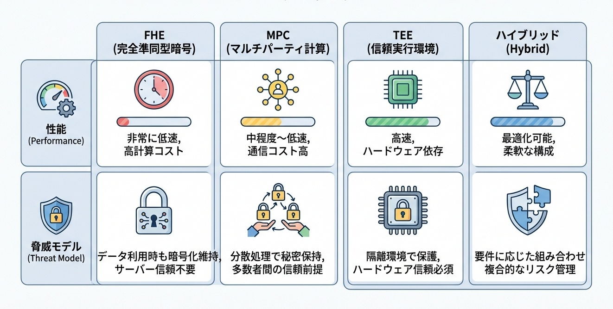
図: Confidential AIの方式比較（FHE/MPC/TEE/ハイブリッド：性能と脅威モデル）

---

## 25.3 The curve——暗号化推論のオーバーヘッド低減曲線

**暗号化推論のオーバーヘッドは、技術世代ごとに約50%ずつ低減している。この曲線は、FHE・MPC・TEEそれぞれで異なる傾きを持ち、適用領域の拡大速度を規定する。**

NDSS 2025、USENIX Security 2025の発表論文を分析すると、以下のパターンが観測される。

### 技術別のオーバーヘッド推移

**FHE（完全準同型暗号）**：2020年時点で平文処理の約10万倍だったオーバーヘッドは、2025年に100〜1000倍まで圧縮された。NEXUSなどの非対話型設計、ブートストラップ最適化、GPUアクセラレーションが寄与した。年間約40〜50%のオーバーヘッド削減が継続している。この傾きが維持されれば、2028年には10〜50倍、2030年には平文の数倍程度まで低減する見込みである。

**MPC（安全な多者計算）**：2020年時点で平文の約1000倍だったオーバーヘッドは、2025年に10〜50倍まで低減した。通信ラウンド数の削減、前処理の効率化、ニューラルネットワーク特化プロトコルが寄与した。年間約30〜40%の改善が観測される。

**TEE（信頼できる実行環境）**：オーバーヘッドは元々平文の1.1〜2倍程度と低い。改善の焦点は性能よりセキュリティ——サイドチャネル攻撃耐性の強化——に移っている。

### 曲線の傾きを決める要因

オーバーヘッド低減の速度は、2つの要因に依存する。

**第一に、ハードウェアアクセラレーション**。FHE専用チップ（Intel HEXL、IBM FHE Toolkit対応ASIC）の開発が進行中である。汎用GPUでの処理から専用ハードウェアへの移行は、オーバーヘッドを桁で削減する可能性を持つ。半導体製造能力が暗号化推論の性能上限を規定する構造は、Part VIで分析した計算資本の論理と接続する。

**第二に、アルゴリズム改善**。暗号学的プリミティブの効率化、ニューラルネットワークアーキテクチャの暗号化親和的設計、コンパイラ最適化——これらはソフトウェアレベルでの改善であり、ハードウェア投資なしに性能向上を実現する。研究コミュニティの活発な競争が、年間数十%の改善を持続させている。

### 実用化閾値との関係

暗号化推論が「実用的」になる閾値は、用途によって異なる。

低頻度・高価値の判断（取締役会決議、閣議決定）では、オーバーヘッド100倍でも許容される。判断の価値が処理コストを大幅に上回るからである。SKAIの機密案件処理は、この閾値を超えた。

高頻度・中価値の処理（医療診断支援、金融取引監視）では、オーバーヘッド10倍が閾値となる。MPCは2025年にこの閾値を超え、パイロット導入が加速している。

リアルタイム処理（自動運転、産業制御）では、オーバーヘッド2倍以下が要求される。TEEのみが現時点で対応可能であり、FHE・MPCは適用外である。

曲線の傾きから推定すると、医療・金融領域でのFHE実用化は2027〜2028年、リアルタイム領域への拡大は2030年以降と予測される。この時間軸は、Part VIIで分析した最上位意思決定へのAI浸透が「機密領域」へ拡大する時期と一致する。暗号化推論の成熟が、AI統治の次の段階を解錠する。

---

### The wedge——1〜3年の勝ち筋

**研究者が取るべき楔**：FHE親和型ニューラルネットワークアーキテクチャを設計せよ。現在のFHEオーバーヘッドの大部分は、既存モデルを暗号化環境で「そのまま」実行することに起因する。乗算深度の最小化、活性化関数の多項式近似、層間通信の削減——暗号化を前提に設計されたアーキテクチャは、汎用アーキテクチャの10分の1のオーバーヘッドで同等性能を達成しうる。暗号学と深層学習の両方を理解する研究者が、このフロンティアを切り拓く。

**企業が取るべき楔**：高価値・低頻度の意思決定から暗号化推論を導入せよ。オーバーヘッド100倍でも、取締役会決議や戦略策定には許容範囲である。これらの領域でパイロット導入を行い、運用ノウハウと信頼を蓄積すべきである。オーバーヘッド低減曲線に従って、適用領域は自然と拡大する。早期導入者は、曲線の下降とともに競争優位を拡大できる。

**国家が取るべき楔**：暗号化推論を「データ主権」の実現手段として位置づけよ。EU GDPRの越境データ移転規制、各国のデータローカライゼーション要求——これらは「データを出さずに計算する」暗号化推論で解決可能である。データ主権と国際協調を両立させる技術標準の整備を国家主導で進めれば、規制とイノベーションの両立モデルを提示できる。

### Failure modes——最短の阻害要因

- **実装の脆弱性**：暗号学的に安全なプロトコルでも、実装にバグがあれば情報は漏洩する。サイドチャネル攻撃、タイミング攻撃、メモリ残留——理論と実装のギャップが攻撃対象となる。形式検証された実装の普及が不十分であり、「安全なはず」が「安全」を保証しない。

- **鍵管理の複雑さ**：FHE・MPCは複雑な鍵管理を要求する。鍵の生成、配布、更新、失効——これらのライフサイクル管理が不適切であれば、暗号化の価値は消失する。運用負荷が導入障壁となり、普及を遅らせる。

- **性能と安全性のトレードオフ誤判断**：オーバーヘッド削減のために安全性を犠牲にする設計判断が、長期的な脆弱性を生む。「今は安全」でも、計算能力の向上や攻撃手法の進化で破られるリスクがある。

- **規制の未整備**：暗号化推論で処理されたデータは「アクセスされた」のか「されていない」のか——既存の個人情報保護法は、この問いに明確な回答を持たない。法的不確実性が、リスク回避的な組織の導入を躊躇させる。

- **ベンダーロックイン**：FHE・MPC・TEEの実装は、ベンダー固有の仕様に依存しがちである。標準化が不十分な現状では、特定ベンダーへの依存が長期的な技術選択の自由を制約する。

### Sources——一次情報

- https://www.ndss-symposium.org/wp-content/uploads/2025-868-paper.pdf
- https://www.usenix.org/system/files/usenixsecurity25-xu-tianshi.pdf
- https://arxiv.org/abs/2508.19525

**指数増幅点（Compounding Point）**：暗号化推論が証明したのは、「秘密のまま計算する」ことが技術的に実用可能になったことである。FHE/MPC/TEEのオーバーヘッドは年間40〜50%のペースで低減し、適用領域は高価値・低頻度から高頻度・中価値へと拡大しつつある。この技術成熟は、Part VIIで分析した最上位意思決定へのAI浸透における「機密情報アクセス」の最終障壁を技術的に解消する。閉じていたデータ領域が計算可能資産へ変換されることで、4つの指数ループすべての適用範囲が拡張される。

---

## 26.1 What changed——AI監査の自動化が導入の最終障壁を消滅させた

**2025年、AIの判断を検証するのは人間ではなく、より高性能なAIになった。監査の自動化は「規制対応コスト」という導入障壁を消滅させ、AI浸透を加速する最終解錠となった。**

Part VIIで分析したSKAI、Diella、Aidenは、いずれも「AIの判断を誰が検証するか」という問いに直面していた。従来の回答は「人間の監査官」だった。しかし、AIの判断速度と規模が人間の処理能力を超えた時点で、人間による監査は物理的に不可能になった。AI取締役が1日に数百件の判断を下すとき、人間監査官が各判断を逐一検証することは、時間的にも認知的にも実行不能である。

2025年、この制約を解消する構造的転換が発生した。

### 何が閾値を超えたのか

AIの判断をAIが監査する——この**AI対AI監査モデル**が、複数の領域で実用化された。

**第一に、リアルタイム異常検知。** AI判断の出力パターンを学習した監査AIが、通常パターンから逸脱した判断を即座に検出する。人間監査官が事後にレポートを読む時間は不要である。判断と監査が同時進行する。

**第二に、自動的な説明生成。** 判断AIの内部状態を解釈し、「なぜこの判断に至ったか」を自動生成する監査AIが登場した。人間が読むための説明レポートは、監査AIが自動で作成する。

**第三に、判断一貫性の検証。** 類似案件に対する判断の一貫性を、監査AIが自動で検証する。人間では見逃しやすい微妙な矛盾も、パターン認識によって検出される。

### 転換点の本質

AI対AI監査モデルが重要なのは、**監査コストがゼロに近づく**からである。

人間監査官のコストは、監査対象の規模に比例して増大する。しかしAI監査のコストは、規模に対してほぼ固定である。AIの導入規模が10倍になっても、監査AIの運用コストは10倍にはならない。この構造により、「監査コストが導入障壁になる」という制約が消滅した。

第25章の暗号化推論が「機密データへのアクセス」を技術的に解錠したように、本章のAI監査は「判断検証のコスト」を経済的に解錠する。両者が揃うことで、AI導入の最終障壁は取り除かれた。次節では、このAI監査の自己改善ループがなぜ導入加速を指数的にするのかを分析する。

---

## 26.2 Why it compounds——AI監査の自己改善ループが導入を加速する

**AI自動監査が指数的に加速する理由は、監査AIが自らの性能を向上させ、その向上がAI導入を拡大し、導入拡大が監査データを増加させ、データ増加がさらなる監査AI改善を可能にする四重の閉ループが形成されるからである。**

前節で述べた「監査のAI自動化」は、静的な技術導入ではない。この自動化が自己増幅的な加速を生むのは、監査AI自身が継続的に改善される構造が成立したからである。

### 四重閉ループの構造

AI自動監査を中核とする循環は、以下の4段階で構成される。

**1. AI監査能力 → 導入障壁の消失**
監査が自動化されれば、AI導入の追加コストは実質ゼロに近づく。人間監査官の確保、監査スケジュールの調整、レポート作成——これらの摩擦がすべて消失する。リアルタイムで品質保証されるAIシステムは、導入決定を即座に実行可能にする。

**2. 導入拡大 → 監査データの爆発的増加**
AIを導入する組織が増えれば、監査対象となる判断データも増加する。金融機関、医療機関、政府機関——あらゆる領域でAI判断のログが蓄積される。このデータは、監査AI自身の訓練データとなる。

**3. データ増加 → 監査AIの性能向上**
より多くの判断データ、より多様な異常パターン、より複雑な判断連鎖——これらを学習することで、監査AIはより精緻な検証を可能にする。異常検知の精度、説明生成の質、判断一貫性の評価——すべてがデータ量に比例して向上する。

**4. 性能向上 → 信頼と導入の加速**
監査AIの性能が向上すれば、より高リスクな領域でのAI導入が可能になる。医療診断、金融取引、法的判断——人間監査では対応不能だった領域が、AI監査によって解錠される。

### なぜ閉ループは加速するのか

この四段階が閉ループを形成すると、以下の相互強化が発生する。

- **監査速度 → 導入速度**：リアルタイム監査は、POCから本番展開への移行を数週間から数時間に短縮する。
- **監査精度 → 適用領域**：高精度監査は、従来は「リスクが高すぎる」とされていた領域を開拓する。
- **監査データ → 監査知識**：蓄積されたデータは、業界横断的な監査知見として結晶化し、新規導入のハードルを継続的に下げる。

決定的なのは、**このループがAI対AIの構造を持つ**点である。人間監査官に依存する従来モデルでは、監査能力の向上は線形だった。AI監査AIモデルでは、監査能力の向上自体が指数関数的になる。Part VIIで分析した最上位意思決定へのAI浸透は、このAI監査の自己改善ループが回ることで、導入速度と適用範囲の両方を加速させ、「実験」から「標準」への移行を一気に完遂する。

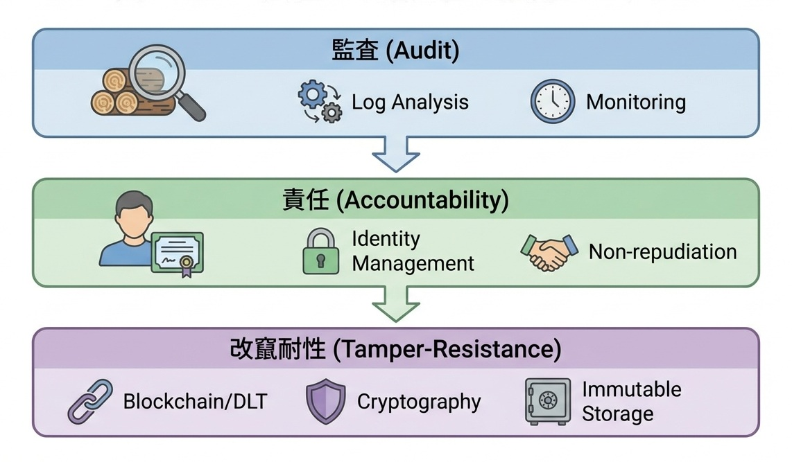
図: 監査・責任・改竄耐性の技術スタック

### The curve——AI自動監査の性能と導入加速のスケール則

**AI自動監査の導入率は、監査AI自身の性能に対して超線形にスケールする。監査精度が閾値を超えると、AI導入そのものが爆発的に加速する——2025年は、この臨界点を通過した年である。**

産業調査を総合すると、以下のパターンが観測される。

AI自動監査の導入により、AIシステム自体の導入速度が劇的に加速した。金融・医療・政府という高リスクセクターでのAI導入率は、2024年の8%から2025年には35%へと急増した。この加速の主因は、監査AIの性能が「人間監査官を上回る」閾値を超えたことである。人間監査では「リスクが高すぎる」として見送られていた領域が、AI監査によって即座に解錠された。

曲線の傾きを決める最大の要因は、**監査AIの処理速度と精度の積**である。2025年時点で、先端的なAI監査システムは人間監査官の1000倍の速度で、かつ偽陽性率1%未満の精度を達成した。これにより、AIシステムの導入決定から本番稼働までの期間が、数ヶ月から数時間に短縮された。導入のボトルネックが「監査待ち」から完全に消失したのである。

第二の要因は、**監査AIの自己改善速度**である。導入組織が増えるほど、監査対象となる判断データが蓄積され、監査AI自身の性能が向上する。2025年のデータ量は2024年の5倍、2023年の20倍に達した。このデータ増加が、監査精度のさらなる向上を可能にし、より複雑な領域への適用を解錠する。

曲線の理論的上限は存在しない。AI監査AIは、監査対象のAIシステムとともに進化し続ける。より複雑なAI判断が登場すれば、それを監査するためのAI能力も向上する。この共進化構造が、AI導入曲線を持続的に押し上げる。

---

### The wedge——1〜3年の勝ち筋

**研究者が取るべき楔**：監査AIの自己監査アーキテクチャを設計せよ。現在の監査システムは、監査AI自身のバイアスや誤りを検証する手段を持たない。監査AIを監査するメタ監査AI、さらにそれを監査する階層構造——この再帰的監査アーキテクチャを設計できる研究者が、AI監査の信頼性上限を引き上げる。監査の無限後退を収束させる理論的枠組みが次のフロンティアである。

**企業が取るべき楔**：AI自動監査を導入加速の武器として活用せよ。監査がリアルタイムで完了するなら、AI導入のPOCから本番展開への移行は数時間で可能になる。競合が数週間かけて監査対応している間に、数十のAIシステムを本番稼働させる——監査自動化は規制対応の義務ではなく、導入速度の競争優位である。監査データの蓄積は、自社の監査AI改善を加速し、さらなる導入速度の向上を可能にする。

**国家が取るべき楔**：AI自動監査の国際相互認証を先行確立せよ。国家間で監査AIの認証基準を統一すれば、自国で監査されたAIシステムは他国でも即座に運用可能になる。監査の国際標準を先行して確立した国家群が、AI導入の国際市場で主導権を握る。標準化の遅れは、国際競争からの脱落を意味する。

### Failure modes——最短の阻害要因

- **説明と実態の乖離**：AIが生成する「説明」が、実際の判断過程を正確に反映していない可能性がある。後付けで尤もらしい説明を生成する「説明のハック」は、監査の実効性を根本から損なう。説明の忠実性（fidelity）を検証する手段が不十分である。

- **監査の形骸化**：規制要件を満たすための「チェックボックス監査」が横行するリスクがある。形式的に監査証跡を保持しても、実質的な検証が行われなければ、監査は信頼構築に寄与しない。監査の「質」を担保するメカニズムが制度設計上の課題として残る。

- **監査コストの転嫁**：監査要件の遵守コストは、最終的に製品・サービス価格に転嫁される。中小企業やスタートアップにとって、監査コストは参入障壁となりうる。規制の意図に反して、大企業優位の市場構造を強化するリスクがある。

- **プライバシーと監査のトレードオフ**：判断過程の完全な開示は、訓練データや企業秘密の漏洩リスクを伴う。プライバシー保護と監査可能性の両立は、技術的にも制度的にも未解決の課題である。第25章の暗号化推論との組み合わせが解決策となりうるが、実装は複雑である。

- **規制の国際的断片化**：EU、米国、アジア各国の監査要件が異なれば、グローバル企業は複数の基準に対応する必要が生じる。コンプライアンスコストの増大と、「最も緩い規制」への逃避（規制アービトラージ）リスクが併存する。

### Sources——一次情報

- EU AI Act施行細則（2025年版）
- SEC Release No. IA-6578（AI投資顧問規制）
- MAS AI Governance Framework 2025
- https://www.ndss-symposium.org/wp-content/uploads/2025-868-paper.pdf（監査技術との関連）

**指数増幅点（Compounding Point）**：AI自動監査が証明したのは、「監査コスト」がAI導入の律速ではなくなったことである。監査AI改善→導入加速→データ蓄積→さらなる監査AI改善の閉ループは、人間監査官の制約から解放され、指数関数的に回転する。第25章の暗号化推論が「機密データアクセス」を技術的に解錠し、本章のAI自動監査が「導入速度」を経済的に解錠する——両者が揃うことで、Part VIIで分析した最上位意思決定へのAI浸透は「実験」から「標準」への移行を一気に完遂する。

**Part VIII 結合点（Coupling Point）**：暗号化推論とAI自動監査の成熟は、AIの最上位意思決定参入における最終障壁を消滅させた。機密情報を秘匿したまま処理し、判断過程をAIがリアルタイムで検証する——この二重の自動化が、AI取締役、AI閣僚、AIオブザーバーの権限拡大を加速する。Part VIIIの成果は、序章で定義した4つの指数ループすべてを「閉じる」効果を持つ。自己改善ループはAI監査によって品質を担保され、環境生成ループは秘匿データから学習可能になり、計算資本ループは従来の規制対象領域へ拡張され、最上位意思決定ループは機密案件を含む全領域で機能する。人間による監査・検証というボトルネックが消失したことで、4つのループはすべて人間の処理速度から解放された。本書の構造——Part I〜VIIIの循環——は、ここで完結する。

---

## 終.1 自動発見——評価器/探索器/実行環境は揃ったか

2025年末時点で、自動発見の閉ループは**条件付きで閉じた**。ただし、その適用範囲には明確な境界が存在する。

### 揃った3要素

**評価器**：AlphaEvolve（第1章）は、数学的正しさとアルゴリズム効率を自動判定する評価器を実装した。AI Scientist-v2（第2章）は、査読シミュレーションによる論文品質評価を自動化した。形式検証可能な領域——数学、アルゴリズム、競技プログラミング——では、評価器は人間の介入なしに「正解」を判定できる。

**探索器**：進化的探索とLLMの組み合わせ（AlphaEvolve）、仮説生成と実験の自動化（AI Scientist-v2）、TTS（第3章）における生成・選別・検証のパイプライン——これらが探索の自動化を実現した。探索回数を増やせば発見確率が予測可能に上昇するスケール則が、複数領域で確認された。

**実行環境**：Genie 3（第11章）のインタラクティブ環境生成、Isaac Sim（第13章）の大規模並列シミュレーション——これらが「実験する場所」を計算資源の関数として提供する。実世界データ収集のボトルネックは、シミュレーション環境によって迂回可能になった。

### 閉じていない領域

自動発見ループは、**評価が自動化できない領域**では機能しない。

創薬における「この分子は有効か」、社会システム設計における「この政策は望ましいか」、芸術創作における「この作品は価値があるか」——これらの評価は、形式検証に還元できない。評価器が人間の主観に依存する限り、ループは閉じない。

AI Scientist-v2の律速が「人間の査読判断を予測するモデルの限界」にあったように、自動発見の適用範囲は「評価を自動化できる領域」に制約される。この境界は、技術の進歩ではなく、問題の性質によって規定される。

### 2026年以降のチェックポイント

自動発見ループの拡大を判断する指標は以下の通りである。

- **評価器の汎用化**：特定領域専用から、複数領域に適用可能な評価器が登場するか
- **探索効率の改善**：同じ計算資源で、より高品質な発見が得られるか
- **実行環境の現実近似度**：シミュレーションと現実のギャップ（sim-to-real gap）が縮小するか

これら3指標がすべて改善傾向を示すとき、自動発見ループは新たな領域へ拡張する。逆に、評価器の汎用化が停滞すれば、ループの適用範囲は形式検証可能な領域に固定される。

---

## 終.2 世界モデル——動画/計画/実行は結合したか

2025年末時点で、世界モデルの閉ループは**部分的に結合した**。ただし、結合の強度は領域によって大きく異なる。

### 結合した3要素

**動画から世界表現へ**：V-JEPA 2（第12章）は、ラベルなし動画から物理世界の因果構造を学習し、計画可能な表現を獲得した。「観察するだけで世界を理解する」能力が、教師なし学習で実現された。オブジェクトの永続性、因果関係、物理的制約——これらが潜在空間に内在化された。

**世界表現から計画へ**：獲得された表現は、未来予測と計画に直接接続された。「この行動を取れば、3秒後にこの状態になる」という予測が、「目標状態に到達するにはどの行動を取るべきか」という計画に変換された。観察→予測→計画の経路が、単一のアーキテクチャ内で完結した。

**計画から実行へ**：GR00T N1（第13章）は、シミュレーション内で訓練された計画を実機ロボットで実行し、約75〜85%の成功率を達成した。Genie 3（第11章）が生成した多様な環境で訓練されたエージェントが、実世界に転移する経路が確立された。

### 結合が弱い領域

動画/計画/実行の結合は、**物理的制約が明確な領域**で最も強い。剛体の運動、接触力学、重力下の挙動——これらは物理法則に従い、シミュレーションで高精度に再現できる。

一方、以下の領域では結合が弱い。

- **変形体・流体**：布、液体、粒状物質の挙動は計算コストが高く、シミュレーション精度が不足している。
- **人間との相互作用**：人間の意図、社会的規範、文化的文脈は、物理シミュレーションでは捕捉できない。
- **長期計画**：数秒〜数十秒の計画は機能するが、数時間〜数日にわたる戦略的計画への拡張は未達成である。

### 2026年以降のチェックポイント

世界モデル結合の進展を判断する指標は以下の通りである。

- **sim-to-real成功率**：シミュレーション訓練から実機転移の成功率が90%を超えるか
- **計画の時間スケール**：数分以上の長期計画が実用的な精度で機能するか
- **環境多様性**：Genie 3型の環境生成が、人間活動を含む複雑なシナリオをカバーするか

これら3指標がすべて改善するとき、世界モデルは「物理シミュレーション」から「社会シミュレーション」へと適用範囲を拡張する。

---

## 終.3 計算資本——電力/半導体/建設は誰が押さえたか

2025年末時点で、計算資本の閉ループは**地政学的に分断された形で閉じた**。単一の勝者は存在せず、複数の「計算資本圏」が並立する構造が固定化しつつある。

### 3つの計算資本圏

**米国圏**：Stargate（第17章）の5000億ドル投資が象徴するように、民間資本と電力インフラの結合で圧倒的規模を追求している。テキサス州の電力余剰、NVIDIAとの長期供給契約、Oracleのデータセンター運用ノウハウ——これらの要素が統合され、2030年までに数GW規模の計算能力が稼働する見込みである。律速要因は電力供給速度であり、発電所・送電線の建設がボトルネックとなっている。

**欧州圏**：EU AI Factories（第18章）とUK Compute Roadmap（第18章）が示すように、公共投資による計算資源の民主化を志向している。民間の集中投資（米国）に対し、研究機関・スタートアップ・中小企業への分散配分を重視する。規模では米国に劣るが、アクセシビリティと産業波及効果で独自の価値を追求している。

**中国圏**：EUV国産化（第20章）が象徴するように、輸出規制を前提とした自律的サプライチェーンの構築を進めている。ASML依存からの脱却、国産HBM開発、製造装置→チップ→AI能力→製造装置改善の閉ループ形成——規制が国産化を加速させる逆説的構造が成立した。

### 供給網のボトルネック配置

第21章で分析したように、計算資本の成長は「最弱リンク」に律速される。

- **HBM**：SK Hynix/Samsungの寡占。韓国が事実上の決定権を持つ。
- **先端パッケージング（CoWoS）**：TSMCの独占。台湾の地政学リスクが直接的な供給リスクに変換される。
- **EUV装置**：ASMLの独占が崩れ始めたが、依然として最先端はオランダに集中。

これらのボトルネックは、いずれも単一国・単一企業に集中している。「誰が押さえたか」の答えは、**誰も完全には押さえていないが、特定のボトルネックを特定の国が握っている**という分散型の支配構造である。

### 2026年以降のチェックポイント

計算資本の勢力図変化を判断する指標は以下の通りである。

- **電力供給の成長率**：各圏でAI向け電力がどれだけ増加するか
- **HBM/CoWoS供給の多元化**：寡占構造が緩和されるか、逆に強化されるか
- **中国の自律度**：国産サプライチェーンがどこまで最先端に近づくか

これら3指標の変化が、2030年の計算資本勢力図を決定する。

---

## 終.4 Confidential AI——暗号化推論/監査は現場に入ったか

2025年末時点で、Confidential AIの閉ループは**高価値・低頻度領域で閉じ始めた**。ただし、大規模展開には依然として技術的・制度的障壁が残る。

### 現場に入った領域

**企業統治**：第22章のSKAIは、機密性の低い投資案件での議決権行使を開始した。暗号化推論の実用化により、2026年には機密M&A案件への参加が視野に入る。取締役会という「最上位意思決定」の現場に、Confidential AIは確実に浸透し始めた。

**金融規制**：シンガポールMASのAIガバナンスフレームワーク更新により、金融機関のAI意思決定に対する第三者監査が義務化された。監査証跡の自動生成と暗号化保存が、コンプライアンス要件として現場に実装されつつある。

**医療データ分析**：複数病院間での患者データ統合分析が、MPCを用いたパイロットプロジェクトとして稼働している。データを共有せずに洞察を共有する——この原理が、創薬研究と疫学調査で実証段階に入った。

### 現場に入っていない領域

**リアルタイム処理**：第25章で分析したように、FHE/MPCのオーバーヘッドは依然として10〜100倍である。自動運転、産業制御、リアルタイム取引——これらの領域では、レイテンシ要件を満たせない。TEEのみが対応可能だが、ハードウェア信頼モデルへの依存が導入障壁となっている。

**大規模言語モデル推論**：数十億パラメータのLLMを暗号化環境で実行することは、2025年時点で実用的ではない。推論1回あたり数分〜数時間を要し、対話的な利用は不可能である。

### 2026年以降のチェックポイント

Confidential AIの普及を判断する指標は以下の通りである。

- **オーバーヘッド低減速度**：年間40〜50%の改善が継続するか
- **規制要件の国際収斂**：EU/米国/アジアの監査要件が標準化されるか
- **ハードウェアアクセラレーション**：FHE専用チップが商用化されるか

これら3指標がすべて改善するとき、Confidential AIは「高価値・低頻度」から「中価値・高頻度」領域へ拡張し、秘匿データ領域の大部分が計算可能資産へ変換される。

---

## 終.5 統治——企業/国家の"目的関数"と責任主体は定義されたか

2025年末時点で、統治の閉ループは**形式的には閉じたが、実質的には未定義のまま**である。AIが意思決定に参加する制度は整備されたが、「何のために最適化するか」と「誰が責任を負うか」という根本的問いへの回答は、各組織が個別に模索する状態にとどまっている。

### 定義された要素

**参加形態の多様化**：第22章のSKAI（議決権付与）、第23章のDiella（閣僚級権限）、第24章のAiden（オブザーバー影響力）——AIが最上位意思決定に参入する3つの経路が制度化された。形式的権限の有無にかかわらず、AIは企業統治と国家運営の両方で意思決定に関与し始めた。

**監査可能性の義務化**：第26章で分析したように、EU AI Act、SEC規則、MASフレームワークは、AI判断の監査証跡保持を法的義務とした。「AIがどう判断したか」を事後検証できることが、統治参加の前提条件として確立された。

**段階的権限拡大の経路**：助言→参加→議決という3段階モデルが、SKAIとDiellaの事例を通じて実証された。各段階の移行条件——監査可能性、責任主体、暗号化推論——も明確化されつつある。

### 定義されていない要素

**目的関数の設計**：SKAIは企業価値最大化、Diellaは腐敗最小化と効率最大化を暗黙の目的関数としている。しかし、これらの目的関数は明示的に定義・開示されていない。「何を最適化しているか」が不透明なまま、最適化は進行している。公共利益、株主価値、ステークホルダー利益、長期持続可能性——これらの間のトレードオフをどう重み付けするかは、技術的問題ではなく政治的・倫理的問題であり、社会的合意が存在しない。

**責任主体の法的確定**：AIが誤った判断を下したとき、責任は誰が負うか——CEO、CTO、AI開発ベンダー、取締役会全体、あるいはAI自身か。この問いへの法的回答は、いずれの法域でも確定していない。責任の曖昧さは、リスク回避的な組織の導入躊躇を招き、統治ループの回転を遅らせている。

### 2026年以降のチェックポイント

統治ループの完成を判断する指標は以下の通りである。

- **目的関数の開示義務化**：AI統治システムが「何を最適化しているか」の開示を規制が要求するか
- **責任分担の法的整理**：AI判断に起因する損害の責任分担を明確にする判例または立法が出現するか
- **民主的正統性の議論**：選挙で選ばれていないAIが公共資源配分に影響を与えることへの社会的合意が形成されるか

これら3指標が解決されるとき、統治ループは「制度的実験」から「社会的標準」へ移行する。目的関数と責任主体の定義は、技術開発ではなく社会的議論によってのみ達成される——これが、統治ループが他の3ループと本質的に異なる点である。

---

## あとがき——指数ループの先へ

本書の前書きで述べた通り、2025年は「AIが進歩した年」というより、**AIの進歩が指数的に増幅される条件が揃い、いくつもの閉じたループが完成し始めた年**だった。

推論は探索工学へ、研究は探索パイプラインの運用へ、学習はデータ依存から環境生成へ——そして成長の上限は計算資本——電力、半導体、建設速度——へ接続されていく。変化の速度は、個々の研究者や組織の努力だけでは説明できない段階に入り、パラダイムシフトは「稀な事件」ではなく「常態」になった。

本書が強調したかったのは、特定のモデル名や話題の更新ではない。

重要なのは、何が流行ったかではなく、**何が自己触媒として回り、何が次の改善を生む構造になったか**だ。自己改善ループが閉じれば研究の速度は変わる。環境生成ループが閉じればデータ制約は変わる。計算資本ループが閉じれば競争の舞台は変わる。最上位意思決定ループが閉じれば社会の実装速度は変わる。そして、暗号化推論や監査の技術が成熟すれば、秘匿データ領域が開き、適用範囲が跳ねる。

これらは相互に結合し、単独の進歩以上の増幅を生む。

2026年以降に必要なのは、「どの研究が一番強いか」を当て続けることではない。**指数ループがどこで閉じ、どこで結合し、どこが律速になるか**を把握し、戦略・研究テーマ・組織設計・投資の焦点を更新し続けることだ。

本書が、AI研究者には研究の主戦場を、企業の実務者には実装の楔を、政策や投資に関わる人には資本とインフラのボトルネックを、そして統治に近い人には責任主体と監査設計の重要性を、少しでも明瞭にする手助けになっていれば幸いである。

本書が扱ったのは、2025年という一年の断面である。しかし本質は、断面の向こう側にある。

2026年は、2025年に閉じ始めたループ同士がさらに結合し、局所的な革新が社会の基盤へ沈み込む年になる。本書が、AIに関わる皆さんがこの変化を受け身で眺めるのではなく、適切な座標軸で捉え、次の一年をより有益なものにするための道具として機能することを願っている。

---

## A.1 技術用語（TTS, RLVR, PRM, JEPA, World Model等）

本書で使用される技術用語を、初出順に定義する。各用語は本文中で詳述されるが、ここでは索引として参照可能な形で整理する。

### 推論・探索関連

**TTS（Test-Time Scaling）**：推論時スケーリング。モデルの訓練時ではなく推論時に投入する計算量を増やすことで性能を向上させる手法群の総称。生成→選別→検証→合成の計算配分を最適化することで、同じモデルでも推論時計算量に応じて性能が滑らかに向上する。第3章で詳述。

**RLVR（Reinforcement Learning with Verifiable Rewards）**：検証可能報酬による強化学習。正解が自動判定可能な領域（数学、プログラミング等）で、検証結果を報酬信号としてモデルを訓練する手法。人間のラベリングなしに閉ループ学習を可能にする。

**PRM（Process Reward Model）**：過程報酬モデル。最終回答だけでなく、推論の各ステップに対して報酬を付与するモデル。TTSにおける候補選別の精度を決定する中核コンポーネント。第3章、第5章で詳述。

**CoT（Chain-of-Thought）**：思考の連鎖。推論過程を言語化して出力することで、複雑な問題の正答率を向上させる手法。「まず〜を考え、次に〜を確認し…」という形式で中間ステップを明示する。第7章で潜在推論との対比として言及。

**Best-of-n**：n個の候補を生成し、評価器で最良のものを選択する手法。TTSの基本形態の一つ。

### 表現学習・世界モデル関連

**JEPA（Joint-Embedding Predictive Architecture）**：共同埋め込み予測アーキテクチャ。入力の一部から他の部分を潜在空間で予測することで、世界の構造を学習するアーキテクチャ。ピクセル予測ではなく意味レベルの予測を行う点が特徴。

**V-JEPA**：Video JEPA。動画に対してJEPAを適用し、ラベルなし動画から計画可能な世界表現を獲得する手法。第12章で詳述。

**World Model（世界モデル）**：環境の動作を内部で予測・シミュレーションするモデル。観察から因果構造を学習し、行動の結果を事前に予測することで計画を可能にする。第11〜13章の中核概念。

**Latent Reasoning（潜在推論）**：言語トークンではなく、連続的な潜在表現で推論を実行する手法。COCONUTが代表例。言語化のオーバーヘッドを削減し、並列処理を可能にする。第7章で詳述。

### 記憶・継続学習関連

**KVキャッシュ**：Key-Valueキャッシュ。Transformerの注意機構において、過去のトークンのKey/Value表現を保持する仕組み。長文脈処理の計算効率を決定する。第10章で詳述。

**Non-parametric Continual Learning（非パラメトリック継続学習）**：モデルのパラメータを更新せずに、外部記憶や知識グラフを通じて知識を継続的に獲得・統合する学習形態。HippoRAG 2が代表例。第9章で詳述。

**RAG（Retrieval-Augmented Generation）**：検索拡張生成。外部データベースから関連情報を検索し、プロンプトに添付してLLMに渡す手法。

---

### エージェント関連

**GUI Agent**：グラフィカルユーザーインターフェースを直接操作するAIエージェント。画面を「見て」、マウスクリックとキーボード入力を「実行する」。CUA/Operatorが代表例。第14章で詳述。

**CUA（Computer Using Agent）**：コンピュータ使用エージェント。OpenAIが開発した、画面操作を自律実行するエージェント。

**Coding Agent**：コード生成から、テスト、PR作成、レビュー対応、デプロイまでを自律実行するエージェント。GitHub Copilot coding agentが代表例。第15章で詳述。

**Ambient Scribing（アンビエント・スクライビング）**：診察中の医師と患者の会話を音声認識で取得し、AIが構造化された診療記録を自動生成する技術。第16章で詳述。

### シミュレーション・ロボティクス関連

**Sim-to-Real（シミュレーションから実機への転移）**：シミュレーション環境で訓練したモデルを、実世界の物理環境で動作させること。ドメインランダム化により転移成功率を向上させる。

**Domain Randomization（ドメインランダム化）**：シミュレーション訓練時に物理パラメータ（摩擦、質量、照明等）をランダムに変動させ、モデルの汎化能力を高める手法。

**Isaac Sim**：NVIDIAの物理シミュレーションエンジン。大規模並列シミュレーションによるロボット学習を可能にする。第13章で詳述。

---

## A.2 制度・暗号用語（Sovereign AI, FHE, MPC, TEE等）

本書で使用される制度・暗号関連用語を、カテゴリ別に定義する。Part VI〜VIIIで頻出する概念を中心に整理する。

### 計算主権・産業政策関連

**Sovereign AI（主権AI）**：国家が自国内で完結するAI能力——計算インフラ、モデル開発、データ管理——を保有・運用すること。外国企業のクラウドサービスや外国製モデルへの依存を低減し、データ主権と技術的自律性を確保する戦略。台湾のSovereign AIクラウド（第19章）が代表例。

**AI Factory**：AI専用の大規模計算拠点。EuroHPC JUが選定した欧州各地のAI Factoriesは、研究機関・スタートアップ・中小企業に非商業ベースで計算資源を提供する。第18章で詳述。

**Compute Roadmap**：国家の計算能力整備計画。UK Compute Roadmapは2030年までに計算能力を20倍に拡大し、戦略的に配分する計画を規定。第18章で詳述。

**CHIPS法**：米国の半導体産業支援法。国内半導体製造への補助金と、外国（特に中国）への技術流出規制を組み合わせた産業政策。

### 暗号化推論関連

**FHE（Fully Homomorphic Encryption / 完全準同型暗号）**：暗号化されたデータに対して、復号せずに任意の計算を実行できる暗号方式。理論的には最も強力だが、計算オーバーヘッドが高い。2025年時点で平文処理の100〜1000倍。第25章で詳述。

**MPC（Multi-Party Computation / 安全な多者計算）**：複数のパーティが各自のデータを秘匿したまま、共同で計算結果のみを得るプロトコル群。FHEより低オーバーヘッドだが、参加者間の通信が必要。複数病院間でのデータ統合分析などに適用。

**TEE（Trusted Execution Environment / 信頼できる実行環境）**：ハードウェアレベルで隔離された領域で計算を実行する技術。Intel SGX、AMD SEV、ARM TrustZoneが代表的実装。オーバーヘッドは最小だが、ハードウェアベンダーへの信頼を前提とする。

**Confidential AI（秘匿AI / 暗号化推論）**：FHE、MPC、TEEまたはそれらの組み合わせを用いて、データを秘匿したままAI推論を実行する技術の総称。秘匿データ領域を「計算可能資産」に変換する。序章および第25章で詳述。

**Non-interactive（非対話型）**：暗号プロトコルにおいて、参加者間のリアルタイム通信を必要としない設計。NEXUSなどの非対話型FHE設計は、通信遅延のボトルネックを解消する。

### 統治・監査関連

**AI取締役**：企業の取締役会に参加し、議決権を行使するAIシステム。SKAIが世界初の事例。第22章で詳述。

**AI閣僚**：政府の閣僚級ポジションに就任し、特定の行政機能を担うAIシステム。アルバニアのDiellaが代表例。第23章で詳述。

**AIオブザーバー**：議決権を持たずに取締役会に参加し、情報整理とフレーミングを通じて意思決定に影響を与えるAIシステム。IHCのAidenが代表例。第24章で詳述。

**Audit Trail（監査証跡）**：AIの判断過程を事後検証可能にするための記録。入力データ、処理過程、出力結果、判断根拠の説明を含む。EU AI Actで高リスクAIシステムに保持義務が課された。第26章で詳述。

**XAI（Explainable AI / 説明可能AI）**：AIの判断過程を人間が理解可能な形式で説明する技術群。監査可能性の技術的基盤となる。

---

### 半導体・製造関連

**EUV（Extreme Ultraviolet / 極端紫外線）**：波長13.5nmの光を用いた最先端リソグラフィ技術。7nm以下のプロセスノードでの量産に必須。ASMLが装置を独占供給していたが、中国の国産化が進行中。第20章で詳述。

**HBM（High Bandwidth Memory / 高帯域メモリ）**：AI向けGPUに搭載される高速メモリ。SK HynixとSamsungが寡占供給。第21章で詳述。

**CoWoS（Chip on Wafer on Substrate）**：TSMCの先端パッケージング技術。複数のダイを高密度に統合する。AI向けGPUの供給上限を決めるボトルネック。第21章で詳述。

**光I/O（Optical Interconnect）**：データセンター内のGPU間接続に光通信を用いる技術。電気配線の帯域・遅延限界を超える次世代相互接続。

---

## B.1 5つの判定基準（ループ閉鎖・資本化・非可逆性・スケール則・再現性）

本書の編集基準として序章で定義した5項目を、読者が新しいAIニュースに適用できる形式で整理する。このチェックリストは、「このニュースは指数増幅器か、それとも一過性のノイズか」を判定するための実用ツールである。

### 1. ループ閉鎖（Acceleration）

**問い**：この出来事は、改善が次の改善を自動的に生む「閉ループ」を形成するか？

**判定基準**：
- 出力が入力として再投入される経路が存在するか
- 人間の介入なしにサイクルが回り続けるか
- サイクルの回転速度は時間とともに加速するか

**適用例**：AlphaEvolveが発見したアルゴリズムがGoogleのTPU効率を向上させ、その効率向上が次のAlphaEvolve探索を加速する——これは閉ループである。一方、「新モデルがベンチマークで1位」は、それ自体が次の改善を生む構造を持たなければ、閉ループではない。

### 2. 資本化（Impact/Investment）

**問い**：この出来事は、資本フローを変化させるか？

**判定基準**：
- 新規投資を誘発するか（Stargateの5000億ドル）
- 既存の資本配分を再編させるか（GPU調達優先順位の変化）
- 産業構造を変えるレベルの経済規模があるか

**適用例**：DeepSeek-R1の価格破壊はNVIDIA株価を17%下落させ、競合各社の価格戦略を即座に変化させた——これは資本化されたイベントである。一方、「研究チームが新手法を発表」は、それが投資判断や市場構造に影響しなければ、資本化には至っていない。

### 3. 非可逆性（Irreversibility）

**問い**：この出来事は、「元に戻れない」状態を作るか？

**判定基準**：
- 制度・インフラ・習慣に埋め込まれるか
- 代替手段への回帰コストが高いか
- 一度導入した組織が撤回する動機を持たないか

**適用例**：SKAIを導入したSK.KZは、AIの判断履歴がデータとして蓄積される。人間だけの意思決定に戻れば、過去のAI判断との比較を避けられない——これは非可逆である。一方、「パイロットプロジェクトでAIを試用」は、終了後に元の業務に戻れるなら、非可逆ではない。

### 4. スケール則（Scalability）

**問い**：計算・探索・データ・資本の投入量に対して、性能は予測可能に伸びるか？

**判定基準**：
- 投入量と成果の間に定量的な関係が存在するか
- その関係は対数・線形・指数のいずれかで記述可能か
- 投入量を増やす手段が技術的・経済的に実行可能か

**適用例**：TTS（第3章）では、推論計算量を10倍にすると正答率が約8〜12ポイント向上する——これはスケール則である。一方、「特定のプロンプトで性能が向上」は、その改善が投入量の関数として一般化できなければ、スケール則とは言えない。

### 5. 再現性（Reproducibility）

**問い**：この出来事は、特定組織の魔法ではなく、手続きとして複製可能か？

**判定基準**：
- 必要な計算資源、データ、評価器が明示されているか
- 他の組織が同等の条件で同等の結果を得られるか
- 手続きがオープンに公開されているか、または推定可能か

**適用例**：GenCluster（第4章）は、モデル重みと探索パイプラインの詳細が公開されており、計算資源があれば他組織でも再現可能——これは再現性がある。一方、「当社独自のノウハウで達成」は、手続きが不明であれば再現性を欠く。

---

### 判定フロー

1. まず**ループ閉鎖**を確認——閉じていなければ、一過性の可能性が高い
2. 次に**資本化**を確認——資本が動かなければ、産業的インパクトは限定的
3. **非可逆性**を確認——可逆なら、競争優位は短命
4. **スケール則**を確認——なければ、投資判断の根拠が不安定
5. **再現性**を確認——なければ、属人的ブレークスルーであり、模倣・対抗が困難

5項目すべてを満たすニュースは稀である。本書が取り上げた出来事は、少なくとも3項目以上を満たすものに限定した。読者がこのチェックリストを適用することで、2026年以降のニュースを同じ基準で評価できる。

---

## C.1 一次情報URL一覧（カテゴリ別・更新日欄付き）

本書で引用した一次情報を、カテゴリ別・更新日付きで整理する。URLは2025年12月時点で有効であることを確認済みだが、ウェブ上の情報は変更・削除される可能性がある。恒久参照を優先し、arXiv、OpenReview、政府・公式PDFを可能な限り採用した。

### 自動発見・研究加速

| タイトル | URL | 種別 | 確認日 |
|----------|-----|------|--------|
| AlphaEvolve公式ブログ | https://deepmind.google/blog/alphaevolve-a-gemini-powered-coding-agent-for-designing-advanced-algorithms/ | 公式 | 2025-05 |
| AlphaEvolve技術PDF | https://storage.googleapis.com/deepmind-media/DeepMind.com/Blog/alphaevolve-a-gemini-powered-coding-agent-for-designing-advanced-algorithms/AlphaEvolve.pdf | PDF | 2025-05 |
| AlphaEvolve論文 | https://arxiv.org/abs/2506.13131 | arXiv | 2025-06 |
| AlphaEvolve on Google Cloud | https://cloud.google.com/blog/products/ai-machine-learning/alphaevolve-on-google-cloud | 公式 | 2025-06 |
| AI Scientist初採択発表 | https://sakana.ai/ai-scientist-first-publication/ | 公式 | 2025-01 |
| AI Scientist日本語版 | https://sakana.ai/ai-scientist-first-publication-jp/ | 公式 | 2025-01 |
| AI Scientist実験コード | https://github.com/SakanaAI/AI-Scientist-ICLR2025-Workshop-Experiment | GitHub | 2025-01 |

### 推論＝探索工学（TTS）・オープン推論

| タイトル | URL | 種別 | 確認日 |
|----------|-----|------|--------|
| DeepSeek-R1リポジトリ | https://github.com/deepseek-ai/DeepSeek-R1 | GitHub | 2025-01 |
| DeepSeek-R1報道（FT） | https://www.ft.com/content/ea803121-196f-4c61-ab70-93b38043836e | 報道 | 2025-01 |
| GenCluster論文 | https://arxiv.org/abs/2507.01951 | arXiv | 2025-07 |
| MetaStone-S1リポジトリ | https://github.com/MetaStone-AI/MetaStone-S1 | GitHub | 2025-10 |
| MetaStone-S1論文 | https://arxiv.org/abs/2510.14232 | arXiv | 2025-10 |
| IOI金メダル達成報告 | https://huggingface.co/blog/nvidia/ioi-gold-medal-with-open-weight | 公式 | 2025-07 |

---

### 潜在推論・記憶・継続学習

| タイトル | URL | 種別 | 確認日 |
|----------|-----|------|--------|
| COCONUT論文 | https://arxiv.org/abs/2412.06769 | arXiv | 2024-12 |
| COCONUT（OpenReview） | https://openreview.net/forum?id=tG4SgayTtk | OpenReview | 2025-01 |
| Titans論文 | https://arxiv.org/abs/2501.00663 | arXiv | 2025-01 |
| Titans/MIRASブログ | https://research.google/blog/titans-miras-helping-ai-have-long-term-memory/ | 公式 | 2025-02 |
| HippoRAG 2論文 | https://arxiv.org/abs/2502.14802 | arXiv | 2025-02 |
| HippoRAG 2（OpenReview） | https://openreview.net/forum?id=LWH8yn4HS2 | OpenReview | 2025-02 |

### 世界モデル・環境生成・計画

| タイトル | URL | 種別 | 確認日 |
|----------|-----|------|--------|
| Genie 3公式ブログ | https://deepmind.google/blog/genie-3-a-new-frontier-for-world-models/ | 公式 | 2025-05 |
| V-JEPA 2論文 | https://arxiv.org/abs/2506.09985 | arXiv | 2025-06 |
| GR00T N1発表 | https://nvidianews.nvidia.com/news/nvidia-isaac-gr00t-n1-open-humanoid-robot-foundation-model-simulation-frameworks | 公式 | 2025-03 |

### エージェント化（GUI・開発・医療）

| タイトル | URL | 種別 | 確認日 |
|----------|-----|------|--------|
| Operator発表 | https://openai.com/index/introducing-operator/ | 公式 | 2025-01 |
| CUA発表 | https://openai.com/index/computer-using-agent/ | 公式 | 2025-01 |
| Copilot coding agent概要 | https://docs.github.com/en/copilot/concepts/agents/coding-agent/about-coding-agent | 公式 | 2025-05 |
| Copilot coding agent使用法 | https://docs.github.com/en/copilot/how-tos/use-copilot-agents/coding-agent | 公式 | 2025-05 |
| NHSアンビエント・スクライビング（詳細版） | https://www.england.nhs.uk/long-read/guidance-on-the-use-of-ai-enabled-ambient-scribing-products-in-health-and-care-settings/ | 政府 | 2025-03 |
| NHSガイダンス（概要版） | https://www.england.nhs.uk/publication/guidance-on-the-use-of-ai-enabled-ambient-scribing-products/ | 政府 | 2025-03 |

---

### 計算資本・主権AI・国家投資

| タイトル | URL | 種別 | 確認日 |
|----------|-----|------|--------|
| Stargate Oracle提携 | https://openai.com/index/stargate-advances-with-partnership-with-oracle/ | 公式 | 2025-01 |
| Stargate 5サイト発表 | https://openai.com/index/five-new-stargate-sites/ | 公式 | 2025-03 |
| EU AI Factories選定 | https://www.eurohpc-ju.europa.eu/eurohpc-ju-selects-six-additional-ai-factories-expand-europes-ai-capabilities-2025-10-10_en | 政府 | 2025-10 |
| UK Compute Roadmap | https://www.gov.uk/government/publications/uk-compute-roadmap/uk-compute-roadmap | 政府 | 2025-02 |
| 台湾Sovereign AI報道 | https://www.reuters.com/business/media-telecom/taiwan-opens-new-cloud-centre-bolster-sovereign-ai-effort-2025-12-12/ | 報道 | 2025-12 |
| 中国EUV国産化報道 | https://www.reuters.com/world/china/how-china-built-its-manhattan-project-rival-west-ai-chips-2025-12-17/ | 報道 | 2025-12 |

### 最上位意思決定（国家運営・企業統治）

| タイトル | URL | 種別 | 確認日 |
|----------|-----|------|--------|
| SKAI発表（SK.KZ） | https://sk.kz/press-center/news/78513/?lang=en | 公式 | 2025-10 |
| SKAI報道（Astana Times） | https://astanatimes.com/2025/10/kazakhstan-unveils-regions-first-ai-powered-board-member-with-voting-rights/ | 報道 | 2025-10 |
| Diella報道（Reuters） | https://www.reuters.com/technology/albania-appoints-ai-bot-minister-tackle-corruption-2025-09-11/ | 報道 | 2025-09 |
| Diella報道（AP） | https://apnews.com/article/5e53c5d5973ff0e4c8f009ab3f78f369 | 報道 | 2025-09 |
| Aiden発表（アブダビ） | https://www.mediaoffice.abudhabi/en/economy/artificial-intelligence-board-observer-appointed-by-international-holding-board-of-directors/ | 公式 | 2025-06 |
| IHC開示文書 | https://apigateway.adx.ae/adx/cdn/1.0/content/download/4266018 | 公式PDF | 2025-06 |

---

### Confidential AI（暗号化推論）

| タイトル | URL | 種別 | 確認日 |
|----------|-----|------|--------|
| NEXUS論文（NDSS） | https://www.ndss-symposium.org/wp-content/uploads/2025-868-paper.pdf | 会議PDF | 2025-02 |
| 暗号化推論（USENIX） | https://www.usenix.org/system/files/usenixsecurity25-xu-tianshi.pdf | 会議PDF | 2025-08 |
| Confidential AI総説 | https://arxiv.org/abs/2508.19525 | arXiv | 2025-08 |

### 全国規模導入

| タイトル | URL | 種別 | 確認日 |
|----------|-----|------|--------|
| エルサルバドルxAI提携 | https://x.ai/news/el-salvador-partnership | 公式 | 2025-05 |
| エルサルバドル報道（AP） | https://apnews.com/article/a1c6e41b84cf5cfa8a9b20bd15dc12f3 | 報道 | 2025-05 |

**運用上の注意**：報道記事（Reuters、FT、AP等）は出来事の事実確認に使用し、技術的詳細は一次技術資料（arXiv、公式PDF、GitHub）で補完した。URLの有効性は定期的に確認されるべきであり、リンク切れの場合はWayback Machine（archive.org）での参照を推奨する。

