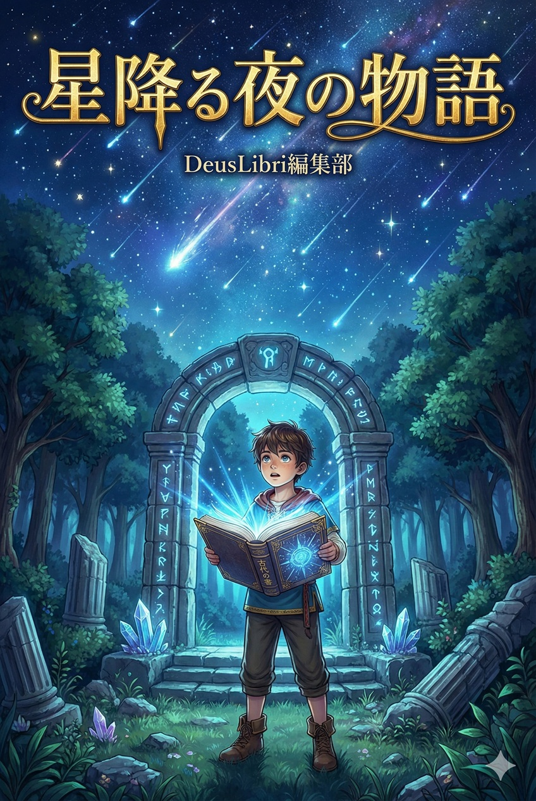
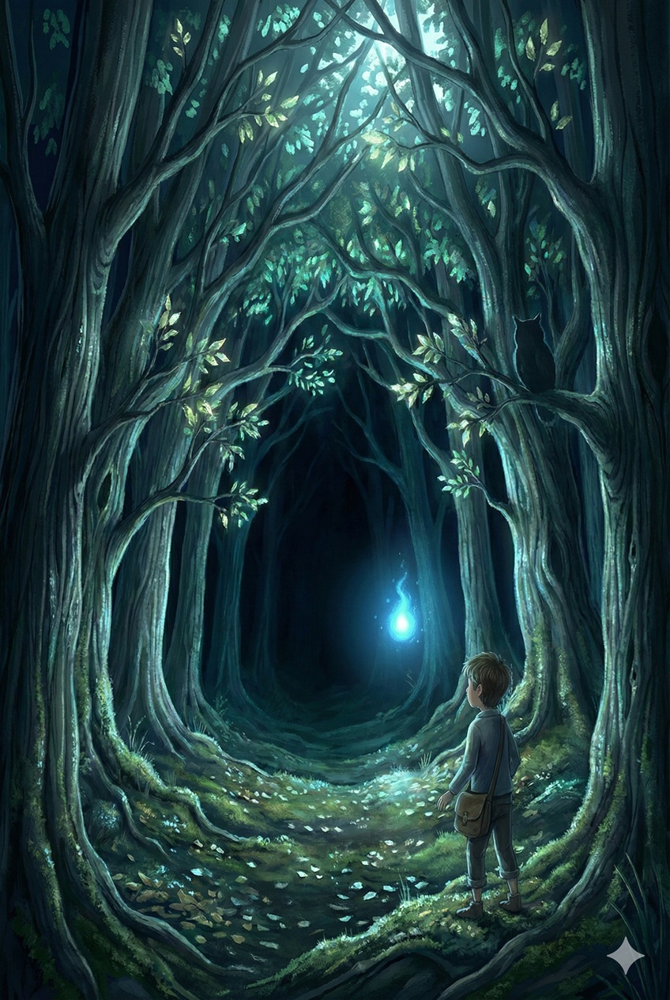
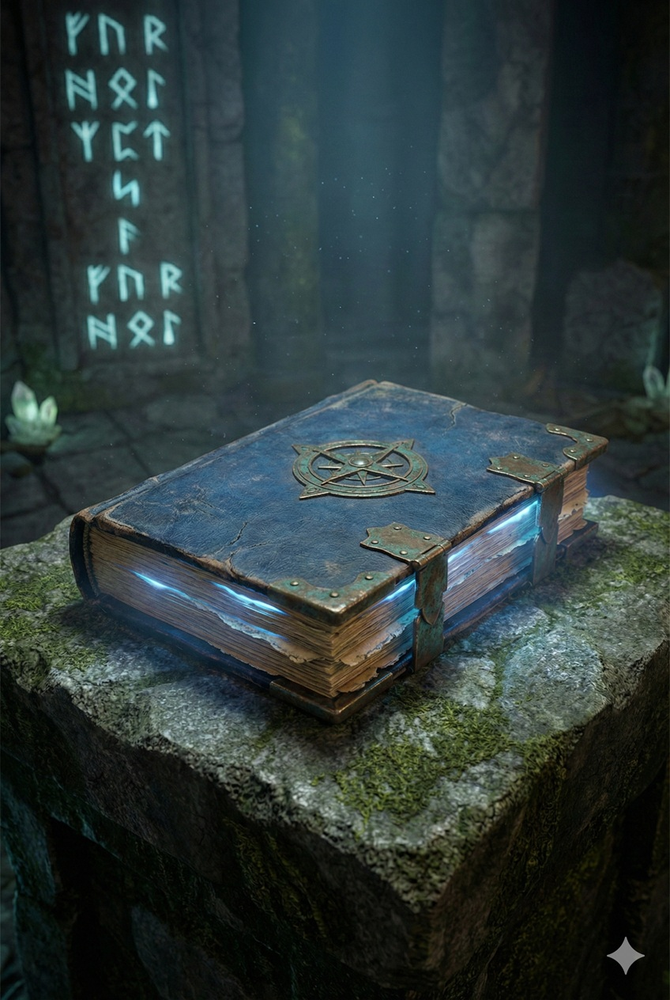

これは、DeusLibriにおける書式フォーマットを確認するためのサンプル書籍です。

---

# プロローグ 星降る夜

夜空に無数の星が輝いていた。

辺境の小さな村、ルミナスの丘の上で、十二歳の少年ルカは一人、夜空を見上げていた。今夜は年に一度の「星降りの夜」——数百年に一度、特別な流星群が空を彩る、魔法のような夜だった。

「すごい……」

ルカは思わず息を呑んだ。流れ星が次々と空を横切り、まるで天から降り注ぐ光の雨のようだった。

**伝説によれば、星降りの夜には不思議なことが起こるという。**

村の古老たちは、かつてこの夜に、失われた古代文明の遺跡が姿を現したと語っていた。しかし、それは単なる昔話だと、ルカは思っていた。

*少なくとも、ついさっきまでは。*

---

# 第1章 光の導き

## 1. 不思議な光

ルカの目の前で、一筋の光が地面に落ちた。

それは普通の流れ星ではなかった。光は地面に着地すると、青白く輝き続け、まるでルカを招くように脈動していた。

> 「来なさい……来なさい……」

幻聴だろうか。ルカの耳に、かすかな声が聞こえた気がした。

恐る恐る、ルカは光に近づいた。それは森の奥、普段は誰も足を踏み入れない深い森の方角を指し示していた。

理性では「危険だ」と分かっていた。しかし、体は勝手に動き出していた。

---

## 2. 森への一歩


*月明かりに照らされた森の入口*

森の入口は、月明かりに照らされて銀色に輝いていた。

昼間見る森とはまったく違う。夜の森は神秘的で、どこか異世界のような雰囲気を漂わせていた。

ルカは深呼吸をして、一歩を踏み出した。

足元の落ち葉が、カサカサと音を立てる。木々の間から、時折フクロウの鳴き声が聞こえてくる。

光は依然として、ルカの前を漂い、道を示していた。

まるで**生きているかのように**、光は蛇行しながら森の奥へ、奥へと進んでいく。

---

# 第2章 古代の遺跡

## 1. 石の門

森を進むこと約30分。

ルカの目の前に、巨大な石の門が現れた。

高さは優に10メートルを超え、表面には複雑な文様が刻まれている。文様は微かに光を放ち、まるで生命を持っているかのようだった。

```
【古代文字の一例】
○ ◇ △ ☆ ◎
```

ルカは古代文字を読むことはできなかったが、この門がただの遺跡ではないことは直感的に理解できた。

光は門の前で停止し、ゆっくりと門の中へと吸い込まれていった。

---

## 2. 遺跡の内部

ルカが門をくぐると、そこは想像を絶する光景だった。

- 壁一面に輝く古代の文字
- 宙に浮かぶ透明な水晶
- 絶え間なく流れる不思議な音楽
- 時が止まったかのような静寂

「ここは……一体……」

中央には、大きな祭壇があった。そして祭壇の上には、一冊の古びた本が置かれていた。

本は青白い光を放ち、ルカを呼んでいるようだった。

*恐れを感じながらも、ルカは祭壇へと近づいていった。*

---

# 第3章 失われた知識

## 1. 古代の書


*祭壇に置かれた古代の書*

ルカは慎重に本を手に取った。

表紙には読めない文字が刻まれているが、不思議なことに、本を開くと文字が光り、ルカの知っている言葉に変化していった。

> **『星の民の記録』**
>
> この書を手にした者よ。
> 汝は選ばれし者なり。
> 失われし知識を受け継ぎ、
> 世界に光を取り戻すべし。

ルカの心臓が高鳴った。

これは夢なのか、それとも現実なのか。

本のページをめくると、古代文明の歴史、失われた魔法、そして……

**世界を救う方法が記されていた。**

---

## 2. 使命の自覚

「僕が……選ばれた？」

ルカは信じられない気持ちだった。

自分はただの村の少年だ。特別な才能も、力もない。

しかし、本は確かにルカに語りかけていた。

本によれば、かつて世界には「星の民」と呼ばれる古代文明が栄えていた。彼らは星の力を使い、魔法で世界を豊かにしていた。

しかし、ある日突然、星の民は姿を消した。

そして今、世界には再び闇が忍び寄っている。

**星の民の末裔であるルカには、世界を救う使命がある。**

---

# 第4章 新たな旅立ち

## 1. 決意

ルカは本を胸に抱きしめた。

恐怖はあった。自信もなかった。

しかし、心の奥底で、何かが燃え上がるのを感じた。

「やってみよう」

ルカは小さく呟いた。

この旅がどこへ向かうのか、自分に何ができるのか、まだ分からない。

でも、この星降る夜に導かれたことには、きっと意味がある。

---

## 2. 朝の光

気がつくと、森の外に朝日が差し込んでいた。

遺跡は消えていた。

ルカの手には、古びた本だけが残されていた。

「夢……じゃなかった」

本は確かにそこにあった。そして、本の中には無限の知識が詰まっていた。

ルカは村へと歩き始めた。

これから、長い旅が始まる。

困難もあるだろう。挫折もあるかもしれない。

**しかし、ルカは一人ではない。**

*星の導きと、古代の知識が、共にある。*

---

# エピローグ 物語の始まり

ルカの冒険は、まだ始まったばかりだ。

失われた星の民の秘密、世界に忍び寄る闇、そしてルカ自身の成長。

これから待ち受ける試練は、想像を超えるものかもしれない。

しかし、すべての偉大な物語は、小さな一歩から始まる。

**そして、この物語も——**

*星降る夜から、始まったのだ。*

---

## おわりに

『星降る夜の物語』をお読みいただき、ありがとうございました。

このサンプル書籍は、DeusLibriの開発における閲覧機能の実装確認のために作成されました。

### このサンプルで使用した技法

1. **章立て**: `#`（h1）で章、`##`（h2）でセクション
2. **ページ区切り**: `---`（水平線）
3. **強調**: **太字**、*斜体*
4. **引用**: `>` を使った引用ブロック
5. **画像挿入**: ``
6. **リスト**: `-` による箇条書き
7. **コードブロック**: バッククォート3つ
8. **数式**: LaTeX記法で数式を挿入

### 数式の例

インライン数式: $E = mc^2$ はアインシュタインの有名な公式です。

ディスプレイ数式:

$$
\int_{-\infty}^{\infty} e^{-x^2} dx = \sqrt{\pi}
$$

二次方程式の解の公式:

$$
x = \frac{-b \pm \sqrt{b^2 - 4ac}}{2a}
$$

オイラーの等式:

$$
e^{i\pi} + 1 = 0
$$

### 実際の執筆では

- もっと長い本文を書くことができます
- より複雑な章構成も可能です
- 画像を豊富に使用できます
- 詩や対話など、様々な表現が可能です

---

**著者プロフィール**

DeusLibri編集部

電子書籍プラットフォーム「DeusLibri」の運営チーム。

© 2025 DeusLibri
