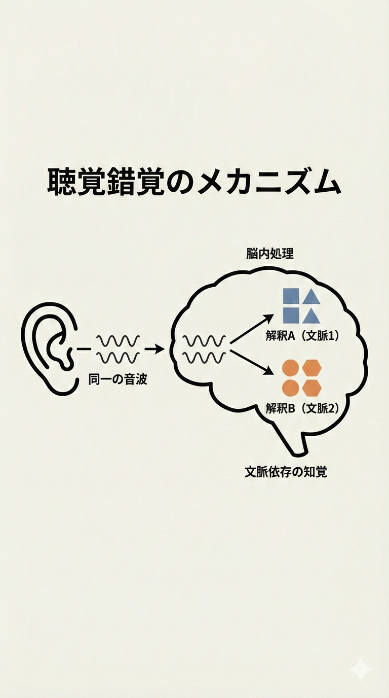
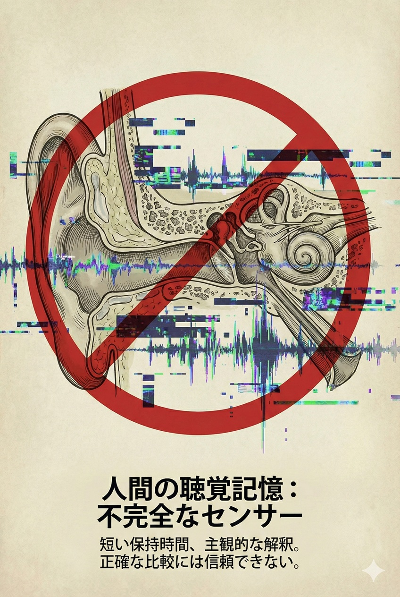
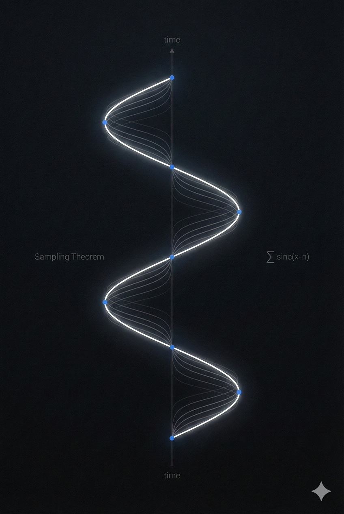
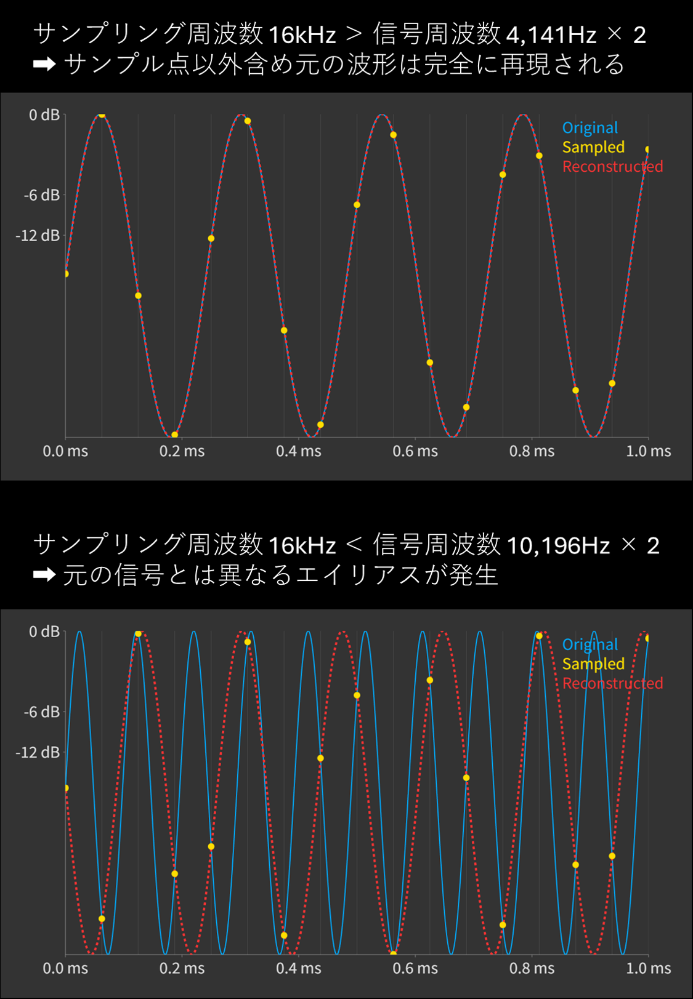
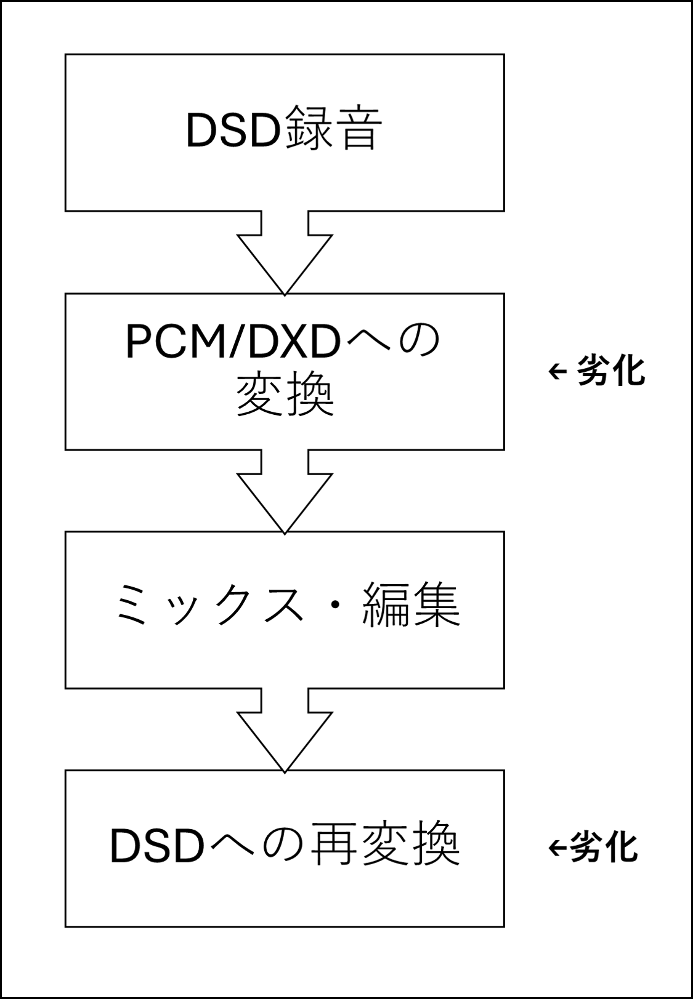
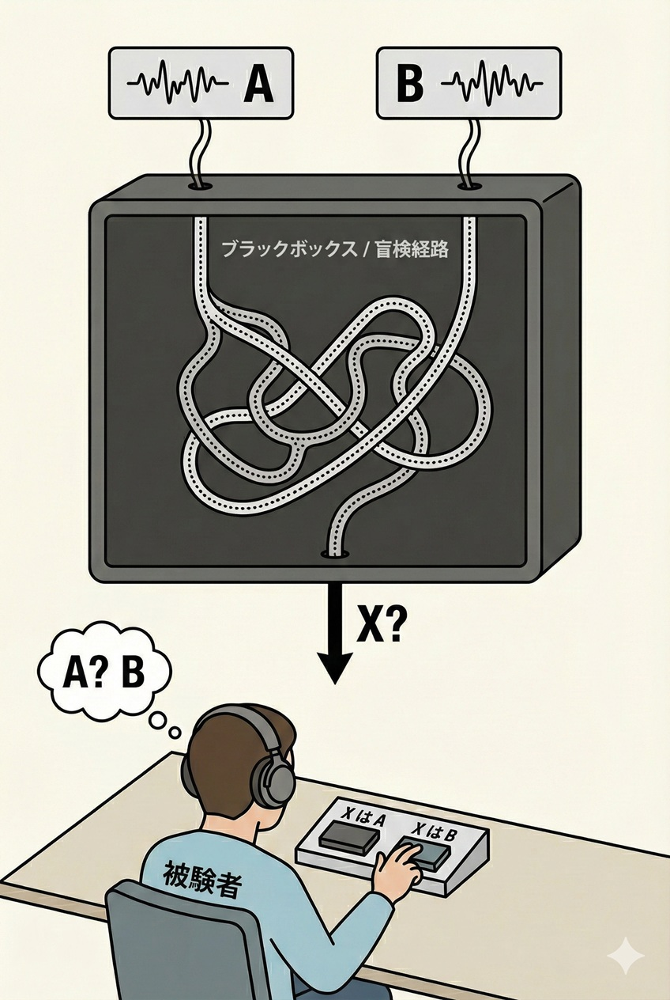
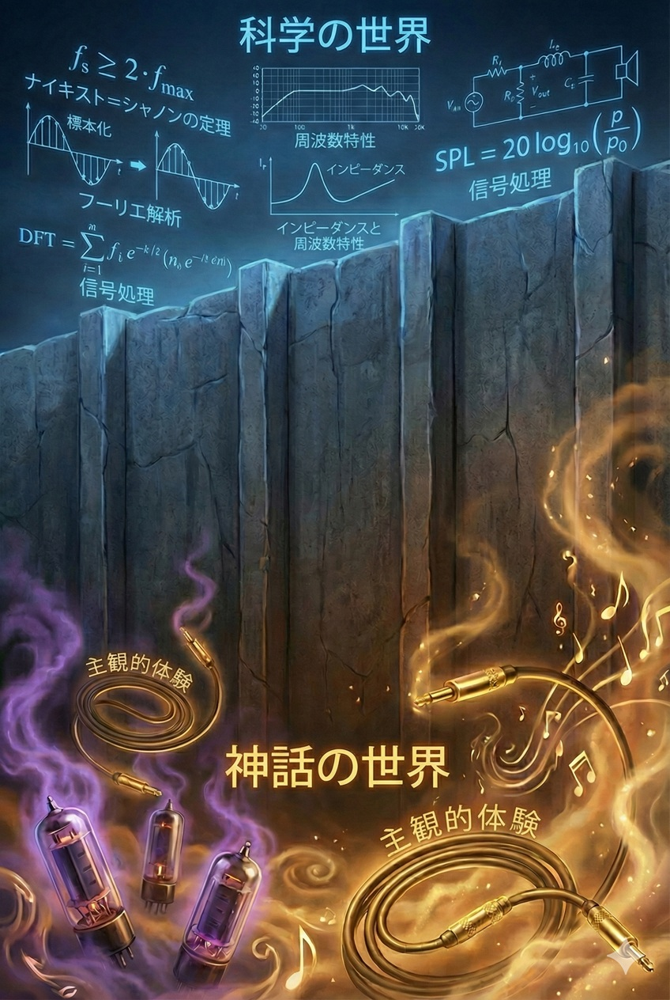
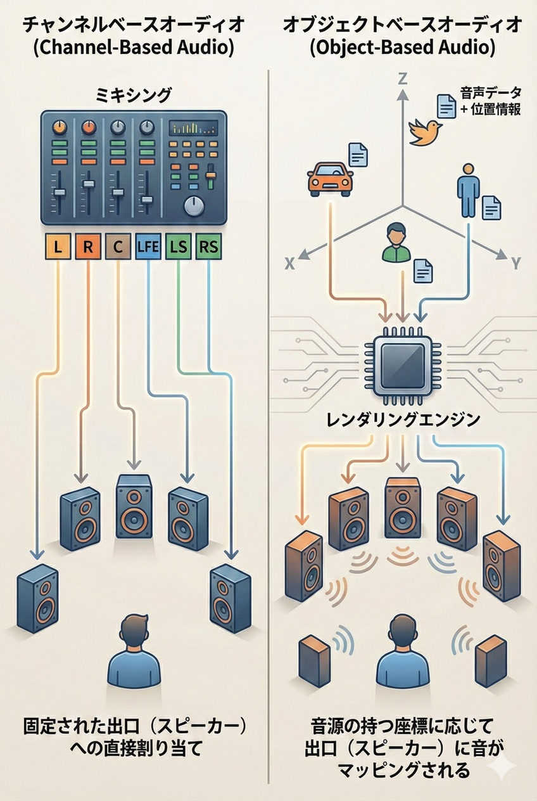
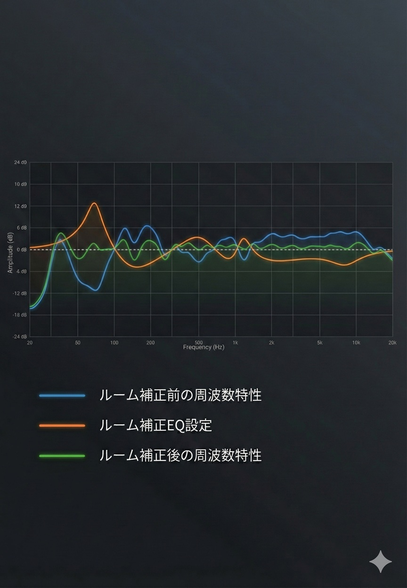

---

# 序章：沈黙の定義 —— 信号と感情の分離

## 0.1 オーディオの終わり、あるいは始まり

### 探求の終着点

離散的なサンプル値 $x[n]$ から、元の連続信号 $x(t)$ は以下の式によって、理論上は完全に再構成される。

$$x(t) = \sum_{n=-\infty}^{\infty} x[n] \cdot \text{sinc}\left(\frac{t - nT}{T}\right)$$

ここで、$\text{sinc}(x) = \frac{\sin(\pi x)}{\pi x}$ である。

人類が「音」を記録し、それを再生しようと試みてから約1.5世紀が経過した。この短い期間において、我々は物理的な空気の振動を電気信号へ、そして数値（デジタルデータ）へと変換する術を確立した。

しかし、なぜこれほど技術が極まった現代においても、人々は「良い音」を求めて彷徨い続けるのか。なぜ、測定限界を超えた数値を誇る機器を前にしてなお、不満を抱き、あるいは神話的な物語に安らぎを求めるのか。

それは、オーディオという営みが、**「技術的な解決（Engineering Solution）」**のフェーズを終え、**「認知的な迷宮（Cognitive Labyrinth）」**へと足を踏み入れているからに他ならない。

かつて、オーディオの目的は明白であった。「録音された音を、そのまま再生すること」。それはノイズとの戦いであり、物理的な制約との闘争であった。しかし、21世紀初頭において、その闘争は事実上、終結している。我々が手にしているスマートフォン一つでさえ、過去の巨大なステレオシステムが到達し得なかったS/N比（信号対雑音比）と周波数特性を軽々と実現している。

物理的には「終わった」はずの探求が、心理的には「終わらない」。この乖離こそが、現代オーディオの正体である。我々が直面しているのは、もはや電気工学の問題ではない。それは、物理学と哲学、そして脳科学の境界線に横たわる、深淵なる問いである。

---

### 「良い音」という幻想の解体

「音」に対する議論が噛み合わない最大の理由は、我々が用いる言語の不完全性にある。「音が良い」という言葉は、あまりにも多くの意味を内包しすぎている。

ある者は、元の演奏会場の空気がそのまま再現されることを「良い」と言う。
ある者は、低音が強調され、胸を打つような迫力を「良い」と言う。
またある者は、真空管アンプ特有の、温かく歪んだ音色を「良い」と言う。

これらは全て異なる現象でありながら、同じ「良い音（Good Sound）」という言葉で語られる。これが混乱の元凶である。我々はこの言葉を捨て去らなければならない。真理に到達するためには、まずこの曖昧な概念を解体し、構成要素を再定義する必要がある。

我々が論ずべきは、以下の二つの全く異なる次元である。

1.  **物理的忠実度（Fidelity）**：入力信号と出力信号の一致度。客観的、定量的、科学的領域。
2.  **主観的好感度（Preference）**：個人の脳が感じる快楽の度合い。主観的、定性的、芸術的領域。

オーディオの悲劇は、この二つを混同したことにある。「私が好む音」こそが「高忠実度な音」であるという誤認、あるいは「高価な機器」であれば「私の好みに合うはずだ」という幻想。この錯綜した糸を解きほぐすには、冷徹な理性のメスを入れるほかない。

---

### 定義の厳格化：FidelityとPreference

ここで、本書を貫く最も重要な定義を提示する。

#### 1. Fidelity（忠実度）
これは**「正解」が存在する世界**である。
入力された信号 $x(t)$ に対し、システム $S$ を通過した出力 $y(t)$ が、定数倍と時間遅延を除いて完全に一致すること。

$$y(t) = A \cdot x(t - \tau)$$

ここで、$A$ はゲイン、$\tau$ は遅延時間である。これ以外のあらゆる変化——高調波歪み、周波数特性の変動、位相の乱れ——は、すべて「エラー（Error）」であり「劣化」である。この定義において、真空管の温かみも、レコードのノイズも、単なる「歪み」として断罪される。
現代のデジタルオーディオ技術は、このFidelityにおいて、人間の知覚限界を遥かに超えた領域に到達している。

#### 2. Preference（好感度）
これは**「正解」が存在しない世界**である。
人間がその音を聴いて「快い」と感じるかどうか。これは個人の聴覚特性、文化背景、過去の記憶、そしてその時の気分別に依存する。
多くの人間は、完全にフラットで歪みのない音（Fidelityの極致）よりも、適度に低音が強調され、微量の倍音成分（歪み）が付加された音を「好む」傾向があることが、音響心理学の研究で明らかになっている。

| 次元 | 目的 | 指標 | 判定者 | 現代の到達点 |
| :--- | :--- | :--- | :--- | :--- |
| **Fidelity** | 原信号の保存 | THD+N, SINAD, F特 | 測定器 | **解決済み** (可聴域を超越) |
| **Preference** | 快楽の最大化 | 調和, 迫力, 温かみ | 脳・主観 | **未解決** (個体差・状況依存) |

本書の目的は、まずFidelity（忠実度）という側面において、オーディオが物理的に「終わっている」ことを数理的に証明することである。その上で、Preference（好感度）という亡霊がいかにして我々の認知を歪めているかを暴き出し、最終的にこの二つを自覚的に統合する道を示す。

これより先、幻想は消え去り、ただ冷たく美しい数理と、人間という不完全な器の真実のみが残るだろう。

---

## 0.2 聴覚という不完全な窓

### 測定器としての敗北

我々は、自らの感覚器官を過信している。特に「耳」に関しては、それがまるで精密なマイクロフォンであり、脳が優れたスペクトラムアナライザであるかのような錯覚を抱いている。「自分の耳で聴いて判断する」——この言葉はオーディオ界において至上の金言とされているが、科学的視座（Scientific Perspective）においては、これほど信頼に足らない測定法はない。

聴覚は、物理現象を正確に記録・再生するために進化した器官ではない。それは、背後から迫る捕食者の足音を検知し、暗闇における仲間の声を識別するための、**「生存のための警報装置」**である。

ゆえに、我々の聴覚システムは、客観的な事実（空気の振動）をそのまま知覚するのではなく、脳が重要と判断した情報のみを増幅し、不要なノイズを廃棄し、時には存在しない情報を補完して「世界」を構築する。

視覚における錯視（Optical Illusion）を思い出してほしい。同じ長さの線が矢羽の向きで異なって見えたり、静止画が動いて見えたりすることを我々は知っている。そして、「目は嘘をつく」ことを常識として受け入れている。
しかし、なぜ聴覚だけは「嘘をつかない」と信じ込めるのか？

聴覚の錯覚（Auditory Illusion）は、視覚以上に強烈である。無限音階（Shepard Tone）や、マガーク効果（McGurk Effect）は、入力された音声信号とは異なる「音」を脳が捏造する決定的な証拠である。我々の「聴く」という行為は、受動的なセンシングではなく、能動的なシミュレーションの結果なのだ。

全く同じ波形も時と場合によって脳内で異なる形に解釈される

---

### 認知バイアスとプラシーボ：物語が鼓膜を震わせる

音が鼓膜を振動させ、有毛細胞が電気信号に変換し、聴覚野に到達するまでのプロセスにおいて、純粋な音響信号以外の「ノイズ」が大量に混入する。
その最大のノイズ源こそが、**「情報（Context）」**である。

「このアンプは30kgのアルミ削り出し筐体で、価格は500万円である」
この事前情報は、聴覚野の感度を変調させる。これを**期待効果（Expectation Effect）**と呼ぶ。脳は、高いコストを支払った対象、あるいは権威あるブランドの製品に対して、「良い音が鳴っているはずだ」という強力な予断を持つ。

このとき、実際に物理的な音が変化しているわけではない。しかし、脳内のドーパミン報酬系と結びついた聴覚処理は、主観的な体験として、確かに「解像度が増し、低域が引き締まった」という感覚（Qualia）を生成する。これは比喩ではなく、神経科学的な事実である。

オーディオ機器のブラインドテスト（目隠し試聴）において、何十万円もの高級ケーブルと、ホームセンターの銅線が区別できなくなる事例が後を絶たないのはそのためだ。視覚情報とブランドという物語（Narrative）が遮断された瞬間、魔法は解け、そこにはただの電気信号だけが残る。

| 要因 | 物理的影響 | 心理的影響 | 結果 |
| :--- | :--- | :--- | :--- |
| **筐体の重量** | 極小（制振性） | 極大（重厚感） | 音が重厚に聞こえる |
| **価格** | 無関係 | 極大（価値観） | 音が高解像に聞こえる |
| **金メッキ** | 導電性維持 | 大（高級感） | 音が煌びやかに聞こえる |

我々は、音を聴いているのではない。「価格」を聴き、「物語」を聴き、「自分の選択が正しかったという安心感」を聴いているのだ。

---

### 時間軸という枷（かせ）：エコー記憶の脆弱性

さらに致命的な欠陥がある。それは**エコー記憶（Echoic Memory）**の短さである。

人間が音の正確な特質（音色や微細なニュアンス）を短期記憶に保持できる時間は、わずか数秒と言われている。
Aという機器とBという機器を比較する場合、ケーブルを繋ぎ変えるのに1分かかれば、Bの音が出た瞬間に、Aの音の正確な記憶はすでに脳内から消滅している。残っているのは、「Aは良かった気がする」という曖昧な印象だけだ。

視覚であれば、二つの写真を並べてじっくりと比較（Side-by-side comparison）ができる。しかし、聴覚は時間軸上にしか存在できない。瞬時の切り替え装置がない限り、厳密な比較は生物学的に不可能である。

この記憶の脆弱性が、オーディオ評論におけるポエムのような表現を許容する土壌となっている。「ベールが一枚剥がれたような」「粒立ちが良い」といった文学的表現は、記憶の彼方に消えた音を繋ぎ止めるための、苦肉の策に過ぎない。

**結論として：**
我々の耳は、真実を映す鏡ではなく、都合よく歪曲されたレンズである。
「良い音」の正体を突き止めるためには、まずこの不完全な窓を一度閉じ、冷徹な**「数理」**と**「測定」**という、人類が獲得した外部の目に頼る必要がある。次章より、その絶対的な指標について論じる。

---

# 第1章：数理的真理 —— デジタルオーディオの公理と2025年の到達点

## 1.1 標本化定理（サンプリング定理）の絶対性

### 直感を裏切る数学的証明

多くのオーディオ愛好家が抱く、最も根源的な誤解がある。それは「デジタルは『点』の集まりであり、アナログは『線』である。ゆえに、デジタルはアナログの近似（Approximation）に過ぎず、永遠にオリジナルには到達できない」という直感的なイメージだ。

階段状の波形（Staircase waveform）の図を見て、「滑らかなアナログ波形が、ガタガタのデジタル波形に劣化している」と嘆くことほど、現代において無知をさらけ出す行為はない。

ここで断言する。**標本化定理（Sampling Theorem）**の下において、デジタルオーディオは近似ではない。帯域制限された信号において、それは**「完全な保存」**と**「完全な復元」**を数学的に保証する。

1928年にハリー・ナイキストが予見し、1949年にクロード・シャノンが証明したこの定理は、物理法則と同等の強度を持つ**公理**である。我々の好みがどうあれ、重力がリンゴを落とすように、この定理は機能する。

「点」から「線」を復元する際、無数の線の引き方があるように思えるかもしれない。しかし、ある条件（帯域制限）を満たした場合、その点を通る滑らかな波形は**全宇宙にたった一つ**しか存在しない。

離散的な点から唯一無二の滑らかな波形が生成される様子

---

### 連続と離散の架け橋：Sinc関数による完全再構成

この「唯一無二の波形」を導き出す魔法の鍵が、Whittaker-Shannonの補間公式である。

離散的なサンプル値 $x[n]$ から、元の連続信号 $x(t)$ は以下の式によって、一点の曇りもなく再構成される。

$$x(t) = \sum_{n=-\infty}^{\infty} x[n] \cdot \text{sinc}\left(\frac{t - nT}{T}\right)$$

ここで、$\text{sinc}(x) = \frac{\sin(\pi x)}{\pi x}$ である。

この数式が示唆する事実は重い。デジタルデータとして記録されているのは、単なる「瞬間の電圧値」ではない。それぞれのサンプル点は、無限の過去から無限の未来へと広がる**Sinc関数の波紋**を内包している。

それら無数の波紋を重ね合わせた時（畳み込み）、互いの波が干渉し合い、サンプル点とサンプル点の間にある「空白」は、人間の知覚限界を遥かに超えた精度で、滑らかに埋められる。

もちろん、現実の物理世界では「無限」の時間を扱えないため、わずかな近似（窓関数による打ち切り等）が必要となる。しかし、現代のフィルタ設計技術においては、その演算誤差は$-140,\text{dB}$以下といった、人間の知覚限界を遥かに下回るレベルに収束している。

DAC（D/Aコンバーター）の仕事は、階段状の波形を出力することではない。この数式を物理的に実行し、滑らかな曲線を「再計算」することである。

| 誤った認識 | 数学的真理 |
| :--- | :--- |
| **点をつなぐ直線** | リニア補間（間違い）。オーディオでは使われない。 |
| **階段状の波形** | ゼロ次ホールド（生の出力）。フィルタを通す前の一時的な姿。 |
| **滑らかな曲線** | **Sinc補間（正解）。** 元のアナログ波形と完全に一致する。 |

---

### ナイキスト周波数の鉄則：$f_s > 2B$

この完全性が成立するための唯一にして絶対の条件が、**ナイキスト・レート**である。

「録音したい信号の最高周波数（$B$）の2倍より高い周波数（$f_s$）でサンプリングしなければならない」

$$f_s > 2 \cdot f_{max}$$

もし、このルールを破ったらどうなるか？高い音が単に「消える」のであれば問題はない。しかし、デジタルサンプリングの世界では、ナイキスト周波数（$f_s / 2$）を超えた信号は、低い周波数に化けて**「亡霊」のように可聴域に出現する。これを折り返し雑音（Aliasing）**と呼ぶ。

例えば、サンプリング周波数 $48\,\text{kHz}$（ナイキスト周波数 $24\,\text{kHz}$）のシステムに、マイクから $28\,\text{kHz}$ の超音波が入力されたとする。デジタルデータ上では、この信号は $28\,\text{kHz}$ としては記録できず、$48 - 28 = 20\,\text{kHz}$ という可聴域のノイズとして記録されてしまう。これは元の音楽には存在しない不協和音であり、一度デジタル化して混入すれば、二度と除去することはできない。

この「亡霊」を防ぐために、AD変換の前段には必ず、ナイキスト周波数以上の信号を事前にカットする**アンチエイリアシング・フィルタ（ローパスフィルタ）**が必要となる。

ここで、CDのサンプリング周波数がなぜ「人間の可聴域限界の2倍（$40\,\text{kHz}$）」ジャストではなく、$44.1\,\text{kHz}$ という半端な数値なのか、その工学的理由が明らかになる。

もし $40\,\text{kHz}$ でサンプリングする場合、ナイキスト周波数は $20\,\text{kHz}$ となる。人間の耳に必要な $20\,\text{kHz}$ までは完全に通し、それより上の $20.0001\,\text{kHz}$ からは完全に遮断するフィルタを作らなければならない。このような「垂直な壁（Brick Wall）」のようなフィルタをアナログ回路で実装しようとすると、位相が激しく回転し、パスバンド内に大きなリップル（波打ち）が生じ、音質が著しく劣化する。

そこで、わずかな余裕を持たせて $44.1\,\text{kHz}$（ナイキスト周波数 $22.05\,\text{kHz}$）に設定する。すると、$20\,\text{kHz}$（可聴域上限）から $22.05\,\text{kHz}$（遮断限界）までの間に、$2.05\,\text{kHz}$ 分の**「遷移帯域（Transition Band）」**という名の滑走路が生まれる。この隙間があるおかげで、フィルタは緩やかな傾斜で高域を減衰させることができ、可聴域内の位相特性や振幅特性を犠牲にせずに済むのである。

サンプリング周波数と折り返し雑音（エイリアシング）

「ハイレゾ（96kHzや192kHz）」が必要とされる理由は、可聴域内の波形をより滑らかにするためではない。可聴域内（20kHz以下）の再現性において、44.1kHzと192kHzの間に、数理的な優劣は存在しない。どちらも**100%**である。
（ハイレゾの意義は、可聴域外の記録や、フィルタ設計の容易化、音楽制作過程での編集耐性、マージン等にあるが、それは「可聴域の波形再現性」とは別の議論である）

---

### 時間分解能のパラドックス：44.1kHzでピコ秒を刻めるか？

ここで、ハイレゾを推奨する際によく用いられる誤ったセールストークについて釘を刺しておく必要がある。「CD（$44.1\,\text{kHz}$）はサンプル間隔が約$22.7,\mu\text{s}$もあるため、それより短いタイミングのズレを表現できない。ハイレゾ（$192\,\text{kHz}$）なら、より細かく時間を刻めるので、音の立ち上がりが正確だ」

これは、デジタルオーディオを「ドット絵」と混同した致命的な数学的誤りである。

標本化定理が支配する帯域制限系において、「時間軸上の分解能」はサンプリング周波数（Hz）には依存しない。サンプリング周波数はあくまで「記録できる周波数の上限（帯域幅）」を決めるものであり、時間の刻み幅を決めるものではない。

理論上、$44.1,\text{kHz}$の信号であっても、その振幅（ビット深度）が十分に正確であれば、サンプルとサンプルの間の真のピーク位置（タイミング）は、ほぼ完全な精度で特定できる。実際、S/N比が十分に確保された16bit/$44.1,\text{kHz}$のシステムにおける時間分解能は、ピコ秒（1兆分の1秒）オーダーに達する。これは音波が空気中をナノメートル進む時間に相当し、人間の鼓膜はおろか、コウモリの聴覚ですら検知不可能な精度である。

「ハイレゾにしないとタイミングがズレる」という主張は、「サンプリング＝階段状の波形」という初歩的な誤解に基づいている。Sinc補間によって復元された連続波形において、時間は離散的ではなく、連続的な量として完全に保存されているのだ。

**1.1節の結論：保存された現実**

以上のことから、デジタルオーディオに関する最大の誤解は解かれた。

サンプリング周波数が十分に確保されている限り、時間軸上の分解能は無限である。サンプルとサンプルの間にある「真のピーク」も、デジタルは逃さない。

我々が聴いているデジタルオーディオは、カクカクした近似などではない。それは、数学という言語によって記述された、保存された現実そのものである。

---

## 1.2 技術的特異点：天上のスペックと地上の限界

### 比較不能な格差：-120dBの世界

2025年現在、デジタルオーディオの再生品質は、人類の生物学的限界を遥かに超えた地点にある。これを**「オーディオ的特異点（Audio Singularity）」**と呼ぶ。

かつて、オーディオ機器の性能は「いかにノイズを減らすか」という闘争の歴史だった。しかし、現代の数百ドル程度のエントリークラスのDAC（D/Aコンバーター）でさえ、その闘争を過去のものにしている。

数値を直視せよ。
アナログレコードのダイナミックレンジは、物理的限界により良くて $60 \sim 70\,\text{dB}$ 程度である。対して、現代の高性能DACチップ（ESS TechnologyやAKMのフラッグシップ機）を搭載した機器は、容易に $130\,\text{dB}$ に迫るダイナミックレンジと、 $0.00009\%$ ($-121\,\text{dB}$) 以下の THD+N（全高調波歪＋ノイズ）を叩き出す。

これはもはや「性能差」という言葉で片付けられるレベルではない。レコードのサーフェイスノイズやテープのヒスノイズは、デジタルオーディオの世界では「爆音」に等しい。現代のDACが描く「無音」は、深宇宙の暗黒のような**絶対的な静寂**である。

| メディア・機器 | ダイナミックレンジ | THD+N (歪み率) | 聴感上の意味 |
| :--- | :--- | :--- | :--- |
| **アナログレコード** | $\approx 60 \sim 70\,\text{dB}$ | $\approx 0.5 \sim 3.0\%$ | 常にノイズと歪みが付帯する |
| **カセットテープ** | $\approx 50 \sim 60\,\text{dB}$ | $\approx 1.0 \sim 5.0\%$ | 明らかなヒスノイズ |
| **CD (16bit)** | $96\,\text{dB}$ | $0.003\%$ (理論値) | 可聴域の静寂として十分 |
| **現代のエントリーDAC** | $> 115\,\text{dB}$ | $< 0.0005\%$ | **人間の知覚限界を突破** |

アナログ愛好家が「レコードには無限の情報が入っている」と主張するとき、彼らは物理法則を無視している。そこにあるのは無限の情報ではなく、無限に近い**「物理的ノイズ」**である。

---

### 思考実験：数十回のAD/DA変換

現代のデジタルオーディオ機器の「透明度（Transparency）」を証明する、残酷な思考実験がある。

かつてのアナログ時代、ダビング（コピー）は劣化と同義だった。カセットテープを10回ダビングすれば、音は痩せ細り、ノイズに埋もれて聴くに堪えないものとなった。これを「世代劣化（Generation Loss）」と呼ぶ。

では、現代のAD/DAコンバーターを用い、アナログ出力を即座にデジタル入力に戻して録音する「ループバック」を100回繰り返したらどうなるか？

1.  オリジナル音源を再生 (DA変換)
2.  ケーブルを通って入力端子へ
3.  再度デジタル化 (AD変換)
4.  これを数十回繰り返す

驚くべきことに、2025年水準のスタジオグレード機器（RMEやLynx等）であれば、数十世代目の音源とオリジナル音源をブラインドテストで識別することは、極めて困難である。 理論上、変換を重ねるごとに熱雑音（ノイズフロア）は加算されていくが、それでもなお、アナログテープをたった1回ダビングした際の劣化（ヒスノイズや高域減衰）に比べれば、その純度は圧倒的である。

これが意味する事実は一つだ。**たった1回の再生におけるDACやケーブルの「音質差」など、人間が議論すべき領域には存在しない**ということである。

---

### 半導体の勝利：真空管の敗北とLSIの凱旋

なぜ、これほどの性能が可能になったのか。それは「半導体の集積化」という物理的勝利によるものである。

一部のオーディオマニアは、ディスクリート回路（個別のトランジスタや抵抗を並べた回路）や真空管を「贅沢で高音質」と崇める。しかし、信号処理の観点から言えば、それらは**「不完全で不安定な骨董品」**に過ぎない。

現代のΔΣ（デルタシグマ）型DACチップ内部では、超高速でスイッチングを行う素子や、抵抗、コンデンサがミクロ単位で配置されている。これらはシリコンウエハー上で原子レベルの均一性を持ち、外部の温度変化や振動の影響を等しく受けることで、誤差を自動的にキャンセル（相殺）する。

* **温度結合:** LSI内部では素子間の温度差がほぼゼロであり、熱ドリフトによる歪みが発生しない。
* **レーザートリミング:** 製造段階で抵抗値が極限まで補正されている。

巨大なコンデンサやトランスを積んだディスクリートアンプが、物理的なサイズと熱によって「歪み」を生成している横で、指先ほどのシリコンチップは、冷徹なまでに正確な計算結果を吐き出し続けている。ここにあるのは情緒ではなく、**圧倒的なエンジニアリングの勝利**である。

---

### ジッターの完全解決：亡霊の消滅

かつて（1990年代〜2000年代初頭）、デジタルオーディオには「ジッター（時間軸の揺らぎ）」という弱点があった。クロックのタイミングがズレることで、波形が歪む現象である。これは当時、確かに音質劣化の一因であった。

しかし、この問題はすでに**「解決済み（Solved Problem）」**である。

現代のDACは、入力されたデータを一度バッファ（メモリ）に貯め込み、入力信号のタイミング（クロック）を捨て去る。そして、DAC内部にある高精度な水晶発振器（フェムトクロックなど）のタイミングに合わせて、データを再配置して読み出す。これを**「非同期転送（Asynchronous Transfer）」**と呼ぶ。

この仕組みにより、CDプレーヤーやPC（トランスポート）がどれほど不安定なクロックで信号を送ってきても、あるいはUSBケーブルがどれほど安物であろうとも、DACチップに到達する直前で、時間は完全に「整列」させられる。

「高精度な外部クロック（10MHzルビジウム等）を繋げば音が良くなる」というのも、現代では迷信に近い。

外部からケーブルでクロック信号を引き込む際、ケーブルの静電容量や端子の反射により、新たなジッターが発生する。DAC内部のPLL回路はそれに追従しようとして、かえって位相ノイズ（Phase Noise）を悪化させることが多い。

現代のDACチップの至近距離に配置されたフェムト秒精度の水晶発振器は、長いケーブルを引き回した外部クロックよりも、物理的に遥かに純度が高い。外部クロックが必要なのは、数十台の機器を同期させる放送局やスタジオだけであり、家庭用再生においては百害あって一利なしである。

現在、測定されるジッター成分は $-130\,\text{dB}$ 以下といったレベルであり、これは人間の知覚限界を遥かに下回る。ジッターを恐れて高額な「デジタルケーブル」や「クロックジェネレーター」を導入することは、もはや科学ではなく、不安を埋めるための**宗教的儀式**に他ならない。

---

## 1.3 変換方式の進化と終着点

### DACの歴史構造：物理的精度の限界と速度による解決

デジタルをアナログに変換する手法（DACのアーキテクチャ）の進化は、**「抵抗器という物理部品の限界」**からの脱却の歴史である。

初期のデジタルオーディオ、そして今なお一部の懐古主義的な愛好家に崇拝されているのが、**マルチビット型（R-2Rラダー型）**である。これは、ビットごとに重み付けされた抵抗器をズラリと並べ、電圧を合成する方式だ。
この方式の美学は「シンプルさ」にあるが、致命的な物理的欠陥を抱えている。それは**抵抗値の精度**である。

16bitの精度を完璧に実現するためには、抵抗器の誤差を $\frac{1}{2^{16}}$、すなわち **0.0015%** 以内に収める必要がある。さらに24bitを目指すなら、$\frac{1}{2^{24}} \approx 0.000006\%$ という、物理的に製造不可能なレベルの精度が要求される。
温度変化や経年劣化で抵抗値がわずかでも狂えば、波形は歪み、直線性（リニアリティ）は崩壊する。つまり、R-2R方式とは、不完全な物質界で完全な数値を扱おうとする「無理筋な挑戦」だったのである。

この物理的限界を突破したのが、現代の標準である**ΔΣ変調方式**である。
これは発想の転換であった。「電圧の細かさ（振幅軸）」で勝負するのではなく、「時間の細かさ（時間軸）」で勝負するアプローチである。

1.  **オーバーサンプリング：** 信号をメガヘルツ（MHz）単位の超高速でサンプリングする。
2.  **ノイズシェーピング：** 量子化ノイズを、可聴域（20kHz以下）から、聞こえない超高域へと「追い出す」。

この数学的トリックにより、極めてシンプルな回路（1bit、あるいは数bitのスイッチ）で、R-2R方式では到達不可能なダイナミックレンジと直線性（Linearity）を実現した。
現代のフラッグシップDACチップ（ESS SABREなど）は、このΔΣ方式を高度化させ、可聴域内のノイズフロアを測定限界以下まで押し下げている。もはや抵抗器の誤差に怯える必要はない。これは、不確かな「物質」を、確実な「時間と計算」で制圧した歴史的転換点である。

---

### NOS (Non-Oversampling) の罠：「ピュア」という仮面を被った歪み製造機

階段波形の誤読ハイエンドオーディオの辺境に、NOS (Non-Oversampling) DAC、あるいはフィルタレスDACと呼ばれるカルト的なジャンルが存在する。彼らの主張はこうだ。「デジタルフィルタは人工的な『リンギング（波形の振動）』を生む。フィルタを排除し、生のデータをそのまま変換すれば、鮮度の高い音がする」

オシロスコープでNOS DACの出力波形（インパルス応答）を見ると、確かにリンギングのない、綺麗な矩形波（パルス）が表示される。これを見て「余計な加工がない！これぞピュアだ！」と歓喜するのは、信号処理の教科書を1ページも開いたことがない素人だけである。

時間軸（波形）で綺麗に見えるその信号は、周波数軸（スペクトル）で見ると悪夢のような汚染を引き起こしているからだ。

標本化定理の復習をしよう。デジタル化された信号をアナログに戻す際、ナイキスト周波数（$f_s/2$）を中心に、元の信号のコピー（鏡像）が無限に発生する。これを**イメージノイズ（Imaging Artifacts）**と呼ぶ。通常のDAC（オーバーサンプリングDAC）は、デジタルフィルタによってこのイメージを数学的に抹殺し、元の音声信号だけを取り出す。

しかし、NOS DACはこのフィルタを「省略」する。その結果、どうなるか？可聴域のすぐ上（$22.05\,\text{kHz}$ 以降）に、音楽信号と同じエネルギーを持った強力な超音波ノイズが垂れ流しになる。

この「聴こえないノイズ」は無害ではない。

1. 混変調歪み (IMD):アンプやツイーターといったアナログ機器は、強力な超音波が入力されると、非線形動作を起こす。その結果、超音波と可聴域の音が互いに干渉し、**可聴帯域内に新たな歪み（ビートダウン）**を発生させる。つまり、聴こえないはずのノイズが、聴こえる音を濁らせるのだ。
2. ツイーターの焼損:音楽信号だと思ってボリュームを上げると、可聴域外のエネルギーがツイーターのボイスコイルを静かに加熱し、最悪の場合、焼き切る。

さらにNOS DACには、**アパーチャ効果（Aperture Effect / Sinc Roll-off）**という物理的な宿命がある。階段状の波形をそのまま出力することは、数学的には「0次ホールド（Zero-order Hold）」と呼ばれる処理に相当する。この特性上、周波数が高くなるにつれて出力レベルは自然減衰する。

具体的には、$20\,\text{kHz}$ において約 $-3.2\,\text{dB}$（ナイキスト周波数では $-3.9\,\text{dB}$）も音圧が低下する。これはマスタリングエンジニアがEQで高域をバッサリ削り落とすのと同義である。

NOS DAC愛好家が語る「アナログ的で、太くて、角が取れた温かい音」の正体は、魔法でも何でもない。単に**「高域が物理的に減衰し（ロールオフ）、混変調歪みによって倍音が汚れた音」**を聴いているに過ぎない。それを個人の好みとして愛するのは自由だが、それを「高忠実（Hi-Fi）」や「鮮度」という言葉で正当化することは、科学的に許されない。それは、曇ったレンズを「芸術的」と呼んでいるだけなのだから。

---

### DSDという遺物：編集不可能なアーカイブ

オーディオファイルの間で、いまだに神聖視されるフォーマットがある。**DSD (Direct Stream Digital)** である。
「アナログに近い」「波形が滑らか」というマーケティング用語が飛び交うが、エンジニアリングの視点で見れば、DSDは**「扱いようのない巨大なデータの塊」**でしかない。

DSDの正体は、ΔΣ変調器の出力（1bitの高速パルス列）をそのまま記録したものである。確かに、AD変換の直後としては純度が高い。しかし、致命的な問題がある。

**DSDは原理的に「演算」ができない。**

音量の調整、イコライザーによる補正、複数のトラックのミキシング（合成）。これら現代の音楽制作に必須の処理を行うには、1bitのDSDデータのままでは不可能であり、必ず一度マルチビット（PCM/DXD）に変換し、掛け算と足し算を行わなければならない。

| プロセス | DSD (1bit) | PCM (Multi-bit) |
| :--- | :--- | :--- |
| **記録** | 可能 | 可能 |
| **編集・加工** | **不可能** (フェードインすら不可) | 自由自在 |
| **現代の制作現場** | 録音だけDSD $\rightarrow$ **PCM変換して編集** $\rightarrow$ DSDに戻して販売 | 最初から最後までPCM |

DSDネイティブ編集とうたっている機器ですら、フェードイン/アウトやゲイン調整などの演算を伴う編集箇所では、内部で何等かマルチビット（またはPCM相当）への変換を行っている。これはDSDの1bit構造が乗算・加算などの数学的処理を直接的に許容しない物理的制約によるもので、処理後再びDSDに戻す流れが一般的である。

よって市場に出回っている「DSDネイティブ録音」と称する作品の99%は、制作過程でPCM（Digital eXtreme Definitionなど）を経由している。つまり、リスナーが聴いているのは「純粋なDSD」ではなく、**「DSDという容器に入れ直されたPCM」**である。

DSDからPCMへの変換プロセス

さらに致命的なのは、再生品質における逆転現象である。かつてのDACは1bit処理が主流だったが、2025年現在の高性能DAC（ESSやAKM等）は、ほぼ全て**「マルチビットΔΣ方式（5-6bit等）」**で動作している。これは、SACDの規格であるDSD64（1bit/2.8MHz）やDSD128よりも、遥かに低い量子化ノイズと高いダイナミックレンジを物理的に実現している。

1bitのDSDは、原理的に膨大な量子化ノイズを発生させるため、それを可聴域外（超高域）へ追いやる「ノイズシェーピング」に依存している。その結果、DSD再生時には $20\,\text{kHz}$ 以上の帯域に**「ノイズの山」が盛大に付加される。**PCM音源をわざわざDSDに変換して再生する行為は、**「無駄にデータサイズを肥大化させながら、高域にノイズを付加してDACの負担を増やす」**だけの愚行に過ぎない。

DSDは、かつてソニーが過去のマスターテープをデジタルアーカイブするために開発した「保存用フォーマット」であり、音楽を聴くための配給フォーマットとしての合理性は、もはや2025年には存在しない。それは、中身を取り出すために毎回破壊しなければならないタイムカプセルのようなものである。

**第1章の結論：**
デジタルオーディオの技術的課題は、Fidelity（忠実度）の観点において完全に解決された。
標本化定理は絶対であり、現代のΔΣ DACは透明であり、フォーマット論争は終わった。
我々が次に直面するのは、この完璧な信号を受け取る側の問題——すなわち、**「不完全な人間」**と**「劣悪な物理環境」**である。

---

## 1.4 物理的媒体の宿命：アナログレコードの病理

### ノイズのデパート：増幅される不純物

アナログレコードを再生するという行為は、微小な物理振動を電気的に数千倍に増幅する行為である。このプロセスにおいて、音楽信号以外の「不純物」が混入することは物理的に避けられない。
レコード愛好家が「温かみ」と呼ぶものの正体の一部は、以下のノイズ成分の混合物（カクテル）である。

1.  **ハムノイズ (Hum):**
    電源周波数（$50/60\,\text{Hz}$）に由来する「ブーン」という低周波ノイズ。MCカートリッジの極微小信号（$0.3\,\text{mV}$程度）を扱う際、フォノイコライザーで増幅率を上げるほど、S/N比は悪化し、背景に常にまとわりつく。
2.  **ランブルノイズ (Rumble):**
    ターンテーブルのモーター振動やベアリングの摩擦音が、プラッターを経由して針先に伝わる機械的ノイズ。これは超低域（$20\,\text{Hz}$以下など）に潜み、ウーファーを無意味に揺らし、混変調歪みの原因となる。
3.  **スクラッチ＆静電気ノイズ (Ticks & Pops):**
    盤面の傷、あるいは空気中の埃が静電気で吸着して発生する「パチパチ」という破裂音。デジタルにおけるクリッピングノイズと同等の、瞬間的な激しい歪みである。

さらに致命的なのが**RIAAカーブ**の存在である。
レコードは物理的制約から低域を減衰させて記録されているため、再生時に低域を約 $+20\,\text{dB}$ ブーストして復元する。これは、**「低域に含まれるモーターノイズやハムノイズも一緒に $+20\,\text{dB}$ 増幅する」**という自殺行為を意味している。

---

### 「20kHzの壁」と超音波の正体

アナログ信奉者がデジタルを攻撃する際の常套句に、「CDは $20\,\text{kHz}$ でカットされているが、レコードは $50\,\text{kHz}$ 以上まで伸びている」というものがある。
確かに、アナログレコードには原理的な周波数上限（ナイキスト周波数）が存在しない。しかし、そこに記録されているものの**「中身」**を検証したことがあるだろうか？

1.  **カッティングの限界：**
    レコードの原盤を刻むカッティングヘッドは、高周波になればなるほど大電流を必要とし、過熱して焼き切れるリスクがある。 そのため、**特殊なハーフスピード・カッティング等の高音質盤を除き、**多くのエンジニアは安全のために $15 \sim 18\,\text{kHz}$ 以上を減衰、あるいはカットしていた。つまり、アナログ盤に「無限の超音波」が常に刻まれているというのは、生存バイアスのかかった幻想であることが多い。
2.  **超音波の正体は「歪み」：**
    再生時にスペクトラムアナライザで $30\,\text{kHz}$ 以上の信号が観測されることがある。しかし、その正体の多くは音楽成分ではない。針が溝の激しい変化に追従できず暴れた結果生じる**「高調波歪み（Harmonic Distortion）」**や、針先と溝の摩擦による**「サーフェイスノイズ」**である。
    彼らは、音楽信号ではなく「針が悲鳴を上げている音」を有難がっている可能性が高い。
3.  **再生による消滅：**
    仮に $20\,\text{kHz}$ 以上の微細な溝が刻まれていたとしても、それは物理的に極めて微小な凸凹である。硬いダイヤモンド針で一度でも再生すれば、その摩擦熱と圧力で、微細な山は削り取られる（High Frequency Erasure）。
    「超音波再生」は、新品の最初の1回だけの特権であり、2回目以降は急速に劣化する儚い夢である。

---

### 回転と幾何学の呪い：時間軸と位相の崩壊

デジタルオーディオが「水晶発振器」によってナノ秒単位の時間管理を行っている一方で、レコードは「モーターとベルト」という、産業革命時代の技術で時間を管理している。

* **ワウ・フラッター (Wow & Flutter):**
    回転ムラによるピッチの揺らぎ。偏心（Eccentricity）による周期的なうねり（ワウ）や、モーターの微細な振動による震え（フラッター）。ピアノの余韻が濁り、正確な音程を破壊する。$0.55\,\text{mm}$ の偏心だけで、ピッチは可聴レベルで変動する。
* **トーンアームの幾何学誤差 (Tracking Error):**
    レコードのカッティング（原盤作成）は、溝に対して常に直角（リニアトラッキング）に行われる。しかし、再生側のトーンアームの多くは「ピボット（一点支持）式」であり、円弧を描いて動く。
    これにより、針先と溝の角度は常にズレ続ける（トラッキングエラー）。結果として、**左右の位相差**と**歪み**が、曲の進行とともに刻一刻と変化する。
* **内周歪み (Inner Groove Distortion / IGD):**
    レコードは外周と内周で線速度が異なる。内周に行くほど波長が詰まり、高域特性が物理的に劣化する。クライマックスの大音量部が内周に来ることが多いクラシックやオペラにおいて、最も重要な場面で音が歪むという欠陥構造を持つ。

デジタルにおいて「最初から最後まで同一品質」であることは当たり前だが、アナログレコードにおいてそれは物理的に不可能である。

---

### 接触という破壊行為：摩耗とクロストーク

「針を落とす」という行為は、ミクロな視点では切削加工と同じである。
ダイヤモンドの針先がビニールの溝を摩擦熱で溶かしながら進む。再生するたびに高域成分（微細な凸凹）は削り取られ、**音は不可逆的に劣化（Wear）**していく。
「原音保存」のメディアとして、再生するたびに自己崩壊する媒体ほど不適切なものはない。

さらに、ステレオ再生における**クロストーク（Crosstalk / チャンネルセパレーション）**の限界も深刻である。
一本の針がV字型の溝の左右の壁を同時に読み取る仕組み上、左チャンネルの振動が右チャンネルに漏れることを完全に防ぐことはできない。
最高級のカートリッジでさえ、セパレーションは $30\,\text{dB}$ 程度が限界である（デジタルは $100\,\text{dB}$ 以上）。
これは、音場（Soundstage）が物理的に狭まり、定位が曖昧になることを意味する。

| 項目 | デジタル (現代DAC) | アナログレコード (ハイエンド環境) |
| :--- | :--- | :--- |
| **S/N比** | $> 120\,\text{dB}$ | $\approx 60 \sim 70\,\text{dB}$ |
| **チャンネル分離** | $> 110\,\text{dB}$ | $\approx 25 \sim 35\,\text{dB}$ |
| **超高域特性** | フィルタで遮断 (理論的限界) | **ノイズ・歪みとして存在** (物理的限界なし) |
| **ワウ・フラッター** | 測定限界以下 | $0.05\% \sim 0.1\%$ (聴感上検知可能) |
| **再生劣化** | なし (恒久不変) | あり (摩耗による高域消失) |

**結論：**
アナログレコードの音を愛することは自由である。しかし、これらの歪み、ノイズ、時間軸の揺らぎを「音楽的な響き」と呼んで正当化する時、それはFidelity（忠実度）の話ではなく、**「歪みエフェクターとしての好みの話」**にすり替わっていることを自覚せねばならない。

---

### 空気の限界：熱雑音という「絶対零度の壁」

オーディオメーカーは「32bitの高解像度」や「S/N比 140dB」といったスペックを競い合っている。しかし、ここで一度、電気回路から離れて、音の媒質である**「空気」**そのものに目を向けてみよう。

音が空気の疎密波である以上、その解像度の限界は、空気分子の挙動によって決定づけられる。
物理学には**「ブラウン運動（Brownian Motion）」**という概念がある。温度を持つ流体の分子は、熱エネルギーによって常にランダムに動き回っており、互いに衝突している。
この微細な衝突こそが、物理空間における**「絶対的なノイズフロア（Thermal Noise）」**である。

常温（20℃）の空気中において、空気分子がマイクロフォンの振動板を叩く音（熱雑音）は、音圧レベルで約 **$-23\,\text{dBSPL}$** に相当すると計算される。
一方、人間の可聴限界（聴覚閾値）は $0\,\text{dBSPL}$ である。
そして、痛覚を感じるほどの爆音（ジェットエンジンの直近）が $140\,\text{dBSPL}$ である。

ここでデジタルのスペックと照らし合わせてみよう。
* **16bit:** ダイナミックレンジ $96\,\text{dB}$
* **24bit:** ダイナミックレンジ $144\,\text{dB}$

もし、家庭で 24bit のダイナミックレンジ（$144\,\text{dB}$）を完全に活かそうとするならば、最大音量をジェットエンジン並みの $140\,\text{dB}$ に設定したとしても、最小音（1bit目）は $-4\,\text{dB}$ となる。
これは空気の熱雑音（$-23\,\text{dB}$）に近い領域だが、現実には静かな防音室でも暗騒音は $20 \sim 30\,\text{dB}$ ある。

つまり、24bitの最下位ビット（LSB）が表現しているのは、音楽の微細なニュアンスではない。**「部屋の空調ノイズ」**か、あるいはマイクプリアンプの**「熱雑音」**、究極的には**「空気分子の衝突音」**である。
24bitや32bitのデータは、録音・編集段階でのヘッドルーム（余裕）としては極めて重要だが、再生パッケージとしては、物理法則（熱力学）が許す限界を超えたオーバースペックなのである。

我々が「ハイレゾの静寂」を感じる時、それはデータが細かいからではない。単にマスタリングエンジニアが曲間を「デジタル・ゼロ（無音データ）」で埋めたか、ノイズゲートでヒスノイズを切っただけのことだ。
空気がある限り、無限の静寂は存在しない。物理学は、人間の欲望よりも先に「限界」を定めている。

---

# 第2章：認知のボトルネック —— 生物学的制約と錯覚
**The Biological Bottleneck: Psychoacoustic Constraints and Illusions**

## 2.1 人間のセンサー性能：その鈍感さの定量化

### 1. 音量（Loudness）：すべての評価を破壊する0.2dB

オーディオ機器の比較試聴（A/Bテスト）において、最も残酷であり、かつ最も見落とされている事実は、**「人間は、音が大きい方を『音が良い』と誤認する」**という認知バグである。

これを**「ラウドネス・バイアス（Loudness Bias）」**と呼ぶ。

人間の聴覚は、絶対的な音圧レベル（SPL）を正確に測定する能力を持たない。しかし、相対的な変化には反応する。問題は、音量がわずかに上がったとき、脳はそれを「音が大きくなった」とは認識せず、以下のように解釈することだ。

* 「低音に迫力が増した」
* 「高音の粒立ち（解像度）が良くなった」
* 「音場（サウンドステージ）が広がった」

この誤認が発生する閾値（JND: Just Noticeable Difference）は、熟練したリスナーでさえ **$0.2 \sim 0.3\,\text{dB}$** 程度である。
オーディオショップの店頭や、厳密なレベル合わせ（Level Matching）が行われていないレビュー記事において、AというアンプがBというアンプより「高音質」だと評価された場合、その原因の9割は、単にAの出力レベルが $0.5\,\text{dB}$ 大きかっただけである。

ボリュームノブの角度を合わせても意味はない。出力インピーダンスやゲインの違いにより、電圧は変動する。デジタル領域での厳密な調整か、出力端子での電圧測定を行わない比較は、科学ではなく**「音量の好みの検査」**に過ぎない。

$$L_{perceived} \propto \text{Volume} + \text{Quality}_{illusion}$$

---

### 2. 周波数特性（Frequency Response）：対数の牢獄

次に敏感なのが周波数バランス（Tonality）である。しかし、ここにも罠がある。我々の聴覚は、周波数変化を**リニア（線形）**ではなく**ログ（対数）**で知覚する。

物理的な $100\,\text{Hz}$ の差は、低域では巨大な変化だが、高域では誤差に過ぎない。
* $100\,\text{Hz} \rightarrow 200\,\text{Hz}$：1オクターブの変化（劇的）
* $10,000\,\text{Hz} \rightarrow 10,100\,\text{Hz}$：約1.4セントの変化（知覚不能）

これを正しく表現するための尺度が**バーク尺度（Bark scale）**や**メル尺度（Mel scale）**である。人間の蝸牛（かぎゅう）における有毛細胞の配置は、この対数尺度に対応している。

$$f_{mel} = 2595 \cdot \log_{10}\left(1 + \frac{f}{700}\right)$$

我々は、広帯域（低いQ値）の緩やかなレベル変動（$\pm 1\,\text{dB}$ 程度）には敏感だが、狭帯域（高いQ値）の急峻なピークやディップには驚くほど鈍感である。
特に、部屋の反射によって生じる「くし形フィルタ効果（Comb Filtering）」による深いディップ（谷）は、脳が自動的に補間して無視してしまうことが多い。
「フラットな特性」を目指す際、グラフ上の細かなギザギザを1本の線にする必要はない。脳が認識する**「平滑化された平均値（Psychoacoustic Smoothing）」**がフラットであれば十分なのである。

---

### 3. 非線形歪み（Distortion）：マスキングという慈悲

ここが、2025年のオーディオマニアが最も受け入れがたい真実である。
**「人間は、非線形歪み（THD/IMD）に対して極めて鈍感である」**

アンプやDACのスペック競争において、メーカーは THD+N $0.0001\%$ ($-120\,\text{dB}$) を誇る。しかし、心理音響学の研究（Geddes & Lee, 2003等）が示す事実は残酷だ。

音楽信号再生時において、人間が検知できる歪みの閾値は、条件によっては **$1\%$ ($-40\,\text{dB}$)** すら超えることがある。特に低域においては数%の歪みさえ「倍音成分による豊かさ」として許容、あるいは好意的に受け入れられる。

これは**「聴覚マスキング効果（Auditory Masking）」**によるものである。大きな音（信号音）が鳴っているとき、その周波数に近い小さな音（歪み成分やノイズ）は、神経レベルで隠蔽され、聞こえなくなる。

$$Threshold_{masking} \gg Threshold_{absolute}$$

我々は、「純度」を求めて $0.0001\%$ の世界に金を払う。しかし、我々の耳は $1\%$ の歪みを持つ真空管アンプや、数%の歪みを発生させるスピーカーの音を「最高」と評価する。
つまり、現代のエレクトロニクス機器における「低歪み競争」は、聴覚上の実益をとうに超えており、単なる**「計測器への接待」**と化している。SINAD（Signal-to-Noise and Distortion ratio）の値が $120\,\text{dB}$ だろうが $90\,\text{dB}$ だろうが、音楽を聴く上では等しく「透明」なのだ。

---

### 4. 群遅延（Group Delay）：時間軸の不感症

最後に、位相（Phase）と群遅延について触れる。
「時間のズレ」はオーディオにおける永遠のテーマだが、ここでも人間のセンサー性能は低い。

研究によると、人間が群遅延の異常（タイミングのズレ）を知覚できる閾値は以下の通りである。

* **高域（数kHz以上）：** 約 $1 \sim 2\,\text{ms}$
* **低域（100Hz以下）：** 数 $10\,\text{ms}$ 以上（波長が長いため極めて鈍感）

スピーカーのウーファーとツイーターの位置が数センチずれていることを気にする「タイムアライメント」の議論があるが、数センチのズレによる遅延は $0.1\,\text{ms}$ のオーダーであり、多くの場合、聴覚限界以下である。
さらに、部屋の反射音（数百msの遅延）が混在する実環境において、ミリ秒単位の位相管理は物理的に掻き消される。

「位相の正確さ」は波形再現（Fidelity）の観点では重要だが、人間は位相が回った音（オールパスフィルタを通した音など）と元の音を区別することが、特定の過渡応答（トランジェント）を除いて極めて苦手である。

ここで科学的な正確さを期すために、「相対位相」と「絶対極性」を区別しておこう。 左右のスピーカーのタイミングがズレる「相対位相」の狂いは、音が物理的に打ち消し合うため、誰にでも違和感として聴こえる。しかし、それは周波数特性の劣化を聴いているのであって、位相そのものを聴いているのではない。

事実、音楽信号全体のプラスとマイナスを反転させる**「絶対極性（Absolute Polarity）」の違いを、ブラインドテストで有意に検知できる人間は、統計的にほぼ存在しない。** 波形が「押し」から始まるか「引き」から始まるかさえ区別できないという事実は、我々の聴覚が時間軸の情報に対していかに不感症であるかを決定づけている。

**第2章2.1節の結論：**
我々の聴覚は、音量はごまかされやすく、歪みには気づかず、時間のズレにも寛容である。
この「欠陥だらけのセンサー」を満足させるために必要なスペックは、実は20世紀の時点ですでに満たされていた。21世紀のハイレゾや超低歪み技術は、生物学的な必要性からではなく、産業的な「あくなき成長」のために存在している。

次節では、この不完全な肉体が直面する、さらに残酷な物理的劣化——「加齢」について論じる。

---

## 2.2 不都合な身体性

### 加齢という不可逆変化：富と聴力の残酷な反比例

オーディオ産業が抱える、触れてはならない最大のタブー。それは、**「最高級の機材を購入できる財力を持った人間は、もはやその機材の性能を聴き取る能力を失っている」**という、神の悪意にも似た残酷な事実である。

これを**老人性難聴（Presbycusis）**と呼ぶ。これは病気ではなく、エントロピー増大の法則に従った不可逆的な細胞死である。

人間の可聴域上限は、教科書的には $20\,\text{kHz}$ とされる。しかし、これは新生児の数値に過ぎない。有毛細胞、特に高周波を担当する基底回転部の細胞は、加齢とともに物理的に摩耗し、脱落していく。
統計的な平均値（ISO 7029）を見ると、現実はあまりに無慈悲である。

| 年齢 | 可聴周波数上限 (平均) | 聴こえない音 |
| :--- | :--- | :--- |
| **10代** | $\approx 18 \sim 20\,\text{kHz}$ | 犬笛 ($>22\,\text{kHz}$) |
| **30代** | $\approx 15 \sim 16\,\text{kHz}$ | モスキート音 / CRTノイズ |
| **40代** | $\approx 13 \sim 14\,\text{kHz}$ | シンバルの倍音の輝き |
| **60代** | $\approx 10 \sim 12\,\text{kHz}$ | ヴァイオリンの最高域の空気感 |

ハイエンドオーディオの主要顧客層である50代〜70代の男性たちは、物理的に $12 \sim 14\,\text{kHz}$ 以上を喪失している。彼らが「ハイレゾ対応（$40\,\text{kHz}$ や $100\,\text{kHz}$ まで再生可能）」のスーパーツイーターに巨額を投じる時、彼らは音を聴いているのではない。**「聴こえるはずだという夢」**を買っているのだ。

さらに深刻なのは、単なる高域減衰だけではない。時間分解能の低下、および「カクテルパーティ効果（騒音下での言語聴取能力）」の劣化も併発する。老いた耳は、複雑なオーケストラの音の重なりを分解できず、混濁したノイズとして処理してしまう。
これを機材のせいにして「解像度が足りない」と嘆くのは、曇った眼鏡をかけながら「世界がぼやけている」と批判するに等しい。

---

### 脳内補正という幻影：ノイズから意味を捏造する工場

耳から入ってきた信号が「欠損」していた場合、脳はエラーを返さない。代わりに、**「ありそうな音」を勝手に生成して穴埋めを行う**。

これを**聴覚誘導（Auditory Induction）**、あるいは連続性の錯覚と呼ぶ。
例えば、断続的な純音の間にホワイトノイズを挟むと、脳は「音はノイズの裏で鳴り続けている」と解釈し、存在しない純音を知覚させる。

オーディオにおいて、この機能は「エージング（Burn-in）」という神話の正体の一つである。
新品のヘッドホンやスピーカーを買った直後、「音が硬い」と感じる。しかし100時間後、「音が滑らかになった」と感じる。
機械的なコンプライアンスの変化もゼロではないが、支配的なのは**「脳のエージング（順応）」**である。脳がその機器のクセ（F特の歪みやピーク）に慣れ、自動的にイコライジング（補正）を行う回路を形成したに過ぎない。

また、**確率共鳴（Stochastic Resonance）**という現象も看過できない。
適度なノイズが存在することで、微弱な信号の検知感度が上がることがある。アナログレコードや真空管アンプが持つフロアノイズや歪みは、ある種の「ディザ（Dither）」として機能し、脳にとって音楽を「聴きやすく」している可能性がある。
皮肉なことに、デジタルオーディオが達成した「完全な無音（S/N比の極致）」は、脳にとっては「不自然な真空」であり、不安や冷たさを喚起させる要因となり得るのだ。

---

### エージングの物理学：金属は育たない、馴染むのはゴムと脳だけ

「買ったばかりのスピーカーは音が硬い」この言説は、物理学的に正しい。スピーカーやヘッドホンは、電気信号を機械振動に変換する「モーター」であると同時に、ダンパー（サスペンション）やエッジ（支持体）という「バネ」を持つ構造体だからだ。

工場から出荷された直後のゴムや樹脂パーツは、分子構造が硬く強張っている。これを長時間振動させることで、素材の**スティフネス（Stiffness / 剛性）が微小に低下し、設計値通りのコンプライアンス（動きやすさ）に落ち着く。これをティール・スモール・パラメータ（Thiele/Small Parameters）で測定すると、最低共振周波数 ($f_0$) が数Hz下がり、Q値 ($Q_{ts}$) が変化することが確認できる。これは、新しい革靴が履いているうちに足に馴染むのと同じ、純粋な機械的変化（Mechanical Break-in）**である。

しかし、この理屈を「ケーブル」や「アンプの基板」に適用した瞬間、科学はオカルトへと変貌する。「ケーブルに信号を流し続けると、電子の通り道ができて音が良くなる」「銀線が熟成されて高音が滑らかになる」

金属工学の知見を提示しよう。常温環境において、オーディオ信号レベルの微弱電流（数mA〜数A）が流れた程度で、銅や銀の**結晶構造（Crystal Lattice）**が変化・再配列することは、物理的にあり得ない。もし、音楽を聴く程度のエネルギーで金属の物性が変わるなら、家の屋内配線は数年で変質し、発電所の送電線は崩壊しているだろう。

唯一の例外は、真空管や電解コンコンデンサにおける「絶縁皮膜の形成（Reforming）」や「熱安定性」だが、これらは電源投入後数分〜数時間で完了するプロセスであり、数百時間を要する「熟成」とは別物だ。

では、なぜ多くの人が「100時間後にケーブルの音が変わった」と実感するのか？変わったのはケーブルではない。あなたの脳（聴覚野）のフィルタである。

人間の脳には、新しい刺激（音色）に対して、違和感を感じ、警戒する本能がある。しかし、その刺激が安全であると確認され、繰り返し入力されると、脳はそれを「基準（Normal）」として受け入れ、微細なニュアンスを処理するリソースを割り当て始める。これを**「順応（Habituation）」や「知覚学習（Perceptual Learning）」**と呼ぶ。

「エージングが進んで音が良くなった」という報告の99%は、**「最初は違和感があった新しい音に、リスナーの脳が慣れて、美点を探せるようになった」**という心理プロセスの事後報告に過ぎない。証拠に、エージング完了とされるケーブルを、事情を知らない第三者に聴かせても、彼らは「硬い音だ」と言うだろう。変化は物理空間（ケーブル内）ではなく、情報空間（脳内シナプス）でのみ起きているのだ。

---

### 等ラウドネス曲線（ISO 226）：フラットはフラットに聴こえない

「原音忠実（Flat Response）」を追求する者が陥る最大の罠が、**等ラウドネス曲線（Equal-loudness contour）**である。

人間の耳の感度は、周波数によって均一ではない。特に**低音域と超高音域に対して極めて感度が低い**。
さらに厄介なことに、この感度特性は**音量（音圧レベル）によって劇的に変化する**。

* **大音量時 ($80 \sim 90\,\text{dB}$)**：人間の聴覚は比較的フラットに近い特性を示す。
* **小音量時 ($40 \sim 50\,\text{dB}$)**：低音 ($100\,\text{Hz}$ 以下) と高音への感度が極端に低下する。

等ラウドネス曲線（ISO 226）

スタジオでミキシングエンジニアは、通常 $80 \sim 85\,\text{dB}$ 前後の大音量でバランスを決定する（これをリファレンスレベルと呼ぶ）。この音量で「完璧なフラット」に調整された音源を、日本の一般的な家庭環境——夜間に $60\,\text{dB}$ 程度——で再生するとどうなるか？

物理的にフラットに再生しても、人間の脳には**「低音がスカスカで、迫力のない貧弱な音」**として知覚される。

ここで「トーンコントロール」や「ラウドネススイッチ」を忌み嫌うピュリスト（純粋主義者）は、「原音再生」という教義のために、自らの生理的現実を無視する。
小音量再生において、低音をバスブースト（Bass Boost）することは、音を歪める行為ではない。それは、**「エンジニアが意図した聴感上のバランス」**を、低い音圧環境下で**「正しく復元する」**ための、極めて理性的かつ科学的な補正（Correction）である。

アンプの「Pure Direct」ボタンを押して回路をバイパスし、痩せ細った音を有難がることこそ、科学への背信である。

---

## 2.3 検証のメソドロジー

### 唯一の裁判官：ABXテストという断頭台

オーディオ界にはびこる無限の論争——「ケーブルで音が変わるか」「ハイレゾは意味があるか」「アンプのクラスAとクラスDの差」——これらを終結させるための、唯一にして絶対的な判決方法が存在する。
それが、**二重盲検法（Double-Blind Test）**、特にオーディオにおいては**ABXテスト**と呼ばれる手法である。

これは、自称「黄金の耳（Golden Ears）」を持つ評論家やマニアにとって、自らの信仰が試される**断頭台**でもある。

ABXテストの手順は極めてシンプルかつ論理的である。
1.  **音源A**と**音源B**を自由に聴く（AとBは確実に異なる既知の音）。
2.  **音源X**が提示される。Xはコンピュータがランダムに選んだAまたはBのどちらかである。
3.  被験者は「XはAである」か「XはBである」かを判定する。
4.  これを規定回数（例えば10回、20回）繰り返す。

重要なのは、被験者だけでなく、**テストの実施者さえもXがどちらかを知らない**という点だ（二重盲検）。これにより、実施者の表情や声色から無意識にヒントを得る「クレバー・ハンス効果」までもが完全に排除される。

この環境下において、普段は「ベールが剥がれた」「圧倒的な静寂感」と数千文字の詩を書き連ねる評論家たちが、突然沈黙する。ブランド名というラベルが剥がされ、視覚情報が遮断された瞬間、彼らは数百万円のケーブルと数百円のケーブルの区別がつかなくなるのだ。

ABXテスト

---

### 統計的有意差の不在： $p < 0.05$ の壁

ABXテストにおいて、「何回正解すれば『違いがわかる』と認められるか」は、厳密な確率論によって定義される。

もし全く違いがわからない場合、回答は「当てずっぽう（コイン投げ）」となり、正答率は50%に収束する。
「違いが聴こえている」と科学的に主張するためには、この**50%という偶然の壁**を、統計的にあり得ないレベル（有意水準 $\alpha = 0.05$、つまり95%の信頼度）で超える必要がある。

二項分布 $B(n, p)$ に従う確率計算を行えば、その壁の高さは明らかだ。

* **10回試行の場合：** 9回以上の正解が必要（8回正解でも偶然の確率は約5.5%あり、科学的には棄却されない）。
* **16回試行の場合：** 12回以上の正解が必要。

$$P(X \ge k) = \sum_{i=k}^{n} \binom{n}{i} (0.5)^i (0.5)^{n-i} < 0.05$$

多くの自称・聴覚鋭敏者は、テスト前には「100%わかる」と豪語する。しかし、テストが始まると正答率は残酷なまでに50%〜60%付近を彷徨う。これは物理学の世界では**「有意差なし（No Significant Difference）」**と判定される。すなわち、**「違いは存在しない」**という結論である。

「今日は体調が悪かった」「プレッシャーで感覚が鈍った」という言い訳は通用しない。なぜなら、彼らは MP3 128kbps と 非圧縮WAV の比較テストでは、同じプレッシャー下でも100%の正答率を叩き出すからだ。
「微細な違い」を謳う高額製品のテストでだけ正答率が下がるのは、そこに**物理的な聴覚差が存在しない**ことの何よりの証明である。

| 試行回数 ($n$) | 有意とみなされる正解数 ($k$) | 偶然で起きる確率 ($p$-value) |
| :--- | :--- | :--- |
| 10 | **9** | 0.0107 (約1%) |
| 12 | **10** | 0.0193 (約2%) |
| 16 | **12** | 0.0384 (約4%) |
| 20 | **15** | 0.0207 (約2%) |

---

### リチャード・クラークの賞金と沈黙の歴史

この残酷な真実を象徴する有名な事例がある。カーオーディオの専門家リチャード・クラーク（Richard Clark）が1990年代に提示した**「アンプ・チャレンジ」**である。

彼は、「定格出力内でレベルマッチングされ、イコライザーでF特を揃えた2台のアンプ（例えば数万円の量産アンプと、数百万円のハイエンド真空管アンプ）を聞き分けられたら、**1万ドル（約150万円）の賞金**を出す」と宣言した。

何千人もの「黄金の耳」を持つ自信家たちが挑戦した。中には有名オーディオ雑誌のレビュアーやエンジニアも含まれていた。
しかし、結果はどうだったか？

**誰一人として、賞金を持ち帰った者はいない。**

これが現実である。条件を厳密に物理的に揃えてしまえば、アンプごとの「音色」などというものは、人間の聴覚限界以下の微小な差、あるいは単なる周波数特性（EQ）のズレに過ぎない。
「目隠しをすると消えてしまう差異」は、物理空間の空気振動には含まれていない。それは**リスナーの脳内（認知と想像力）にのみ存在する幻影**である。

本書においては、このABXテストで有意差が証明されていないあらゆる現象——ハイレゾの超音波効果、ケーブルの材質、電源の純度など——を、**「存在しないもの」**として扱う。それが理性の態度である。

---

## 2.4 追憶の亡霊：『最初の感動』という呪い

### 原体験の刻印：ラジカセからコンポへ

多くのオーディオマニアには、信仰の原点となる「神話的な瞬間」が存在する。
それは多くの場合、感受性豊かな少年期や青年期に訪れる。

* モノラルの古いラジカセから、初めて2chステレオのコンポに買い替えた瞬間。
* 付属のイヤホンから、数千円の本格的なヘッドフォンに変えた瞬間。
* ノイズまみれのカセットテープから、CDのクリアな音を初めて聴いた瞬間。

この時、彼らの脳内では劇的な変化が起きた。霧が晴れ、世界が極彩色に色づき、好きなアーティストが目の前に現れたかのような錯覚。
この**「圧倒的なS/N比の向上」**と**「帯域の劇的な拡大」**は、脳内の報酬系を激しく刺激し、大量のドーパミンを放出させた。
この強烈な快楽体験こそが、その後の人生を支配する**「呪い」**の始まりである。

彼らは無意識のうちに信じ込んでしまう。
「機材にお金をかければ、あの時の感動が、あの震えるような快感が、もう一度手に入るはずだ」と。

---

### 限界効用の逓減：指数関数的な絶望

しかし、悲劇は物理法則の中に隠されている。
オーディオ機器の性能向上と、それに対する投資額の関係は、リニア（直線）ではない。**対数曲線（Logarithmic Curve）**を描く。

最初の体験（数千円から数万円へのアップグレード）は、物理特性を劇的に改善させた。歪み率は数%から0.1%以下になり、F特はナローレンジからフルレンジになった。これは誰の耳にも明らかな「革命」である。

だが、そこから先は**「限界効用逓減の法則（Law of Diminishing Marginal Utility）」**が冷酷に支配する。

* **Step 1:** 1万円 $\rightarrow$ 10万円：音質は「激変」する。感動がある。
* **Step 2:** 10万円 $\rightarrow$ 100万円：音質は「洗練」される。違いは分かるが、衝撃はない。
* **Step 3:** 100万円 $\rightarrow$ 1000万円：音質は「変化」するが、ブラインドテストでの識別は困難になる。

マニアは Step 3 の段階で、Step 1 の頃の「あの脳髄が痺れるような感動」を期待して巨額を投じる。
しかし、物理的な改善幅は極小（0.001%の歪み改善など）であり、聴覚上の差はほぼゼロに近い。
結果として、「音は確かに良いはずなのに、なぜか感動できない」という焦燥感に駆られることになる。

| 投資額 (対数) | 物理的改善度 | 主観的感動 (ドーパミン量) | 状態 |
| :--- | :--- | :--- | :--- |
| **低 (Low)** | **極大** | **最大 (MAX)** | 「すごい！世界が変わった！」 |
| **中 (Mid)** | 中 | 中 | 「うん、良い音になったな」 |
| **高 (High)** | 小 | 小 | 「...低域の沈み込みが違う、気がする」 |
| **超高 (Ultra)** | **極小 (誤差)** | **無 (虚無)** | 「もっと高い機材なら...」 |

---

### ドーパミンの枯渇と青い鳥

さらに残酷な事実がある。第2章2節で述べた**「加齢」**である。

皮肉なことに、少年時代の彼らは「金はなかったが、耳（聴覚細胞）は最高性能」だった。
数十年後、財力を手に入れた彼らは「金はあるが、耳は劣化」している。

最高級のハイエンドシステムが出力する $20\,\text{kHz}$ 以上の倍音成分や、微細なトランジェントを、今の彼らの耳は物理的に捉えることができない。
かつて安物のラジカセで聴いた音楽が輝いていたのは、機材の性能ではない。**「若く鋭敏な感性」**と**「未体験のコンテンツ」**、そして**「健康な聴覚」**が揃っていたからだ。

1000万円のアンプを買っても、10代の頃の聴力と感受性はパッケージされていない。
彼らが追い求めているのは「高音質」という物理現象ではなく、**「若き日の自分自身」**という亡霊である。
そのことに気づかない限り、オーディオマニアは永遠に満たされない渇きを抱え、新製品が出るたびに財布を開き続ける。それはもはや趣味ではなく、届かない過去への**巡礼（Pilgrimage）**なのだ。

**第2章の結論：**
我々の耳は不完全であり、脳は騙されやすく、過去の記憶に縛られている。
この「人間という不確定要素」を排除し、純粋な信号のみを扱うためには、産業構造そのものを俯瞰する視点が必要となる。
次章、オーディオ業界がいかにしてこの「満たされない心理」を利用し、巨大な市場を築き上げたか、その構造的欠陥にメスを入れる。

---

# 第3章：産業の構造的欠陥 —— 知性の流出と断絶
**Structural Defects of the Industry: Drain of Intellect and Disconnect**

## 3.1 知の断絶と専門家の沈黙

### 2025年の蒙昧：周回遅れの神話

文明が高度に発達した2025年においても、オーディオの世界には中世のような蒙昧（もうまい）が支配している。
一般消費者はもちろん、専門誌の執筆者や、あろうことか製品を開発するガレージメーカーの主宰者でさえ、**1980年代に否定された誤解**を、あたかも最新の知見であるかのように語り続けている。

その最も顕著な例が、第1章で論破した「デジタルの階段波形」である。「アナログは滑らかで、デジタルはカクカクしている」というイメージ図は、初等教育における便宜的な説明としては許容されるかもしれないが、大人が高額な機器を論じる際の前提としては、恥ずべき無知である。

また、「ケーブルを変えると電気信号の純度が上がる」という迷信も根強い。導体抵抗や静電容量（LCR）の変化により、超高域のフィルタリング特性が微小に変わることは物理的にあり得る。しかし、それが「ボーカルの感情表現が変わる」とか「低域のダンピングが劇的に向上する」といった文学的な変化に直結するという主張は、電気回路の基礎理論（キルヒホッフの法則やオームの法則）に対する冒涜である。

なぜ、物理学の教科書を数ページめくれば分かる事実が、この業界では「一つの意見」として相対化され、無視されるのか。
それは、オーディオ業界が**「客観的事実（Fact）」よりも「主観的体験（Experience）」を上位に置く**という、反知性的な構造を自ら選択したからである。ここでは、数式による証明よりも、「私の耳にはこう聴こえた」という個人の感想の方が、強い真実性（Truthiness）を持って流通してしまう。

---

### アカデミズムとファンの乖離：対話不能な断絶

さらに深刻なのは、真実を知るはずの専門家たち——大学の信号処理研究者、半導体メーカーの設計技師、通信工学の博士たち——が、オーディオマニアの議論に対して**「沈黙」**を守っている事実である。

本来であれば、誤った科学知識が流布された際、専門家がそれを正すべきである。しかし、オーディオ分野において、彼らは決して表に出てこない。なぜか？
理由は二つある。

第一に、**「議論が成立しないから」**である。
専門家が「ブラインドテストでは有意差がない」「物理的にその変化は可聴域外である」とデータを提示しても、マニア側は「測定器では測れない何かが存在する」「音楽はデータではない」と、科学の土俵そのものを拒絶する。
論理と信仰は対話できない。宗教戦争に巻き込まれることを嫌う賢明な技術者たちは、口を閉ざし、静かに立ち去ることを選んだ。

第二に、**「研究対象としての価値の喪失」**である。
かつてオーディオは最先端の工学課題であったが、現代のアカデミズムにおいて「2chステレオ再生の高忠実度化」は、もはや研究テーマとしての魅力を失っている。
IEEE（電気電子学会）の論文誌において、DACのS/N比を130dBから131dBにする研究や、高級ケーブルの表皮効果に関する論文など、ほとんど見かけることはない。
現代の優秀な頭脳は、AIによる音源分離、空間音響（Spatial Audio）、補聴器のための信号処理など、より高度で社会的意義のある課題に取り組んでいる。

結果として、オーディオマニアの界隈は**「専門家不在の密室」**となり、そこでは誤った理論が誰にも訂正されることなく、自家中毒のように増幅され続けている。これを**「エコーチェンバー現象（Echo Chamber）」**と呼ぶが、オーディオ業界のそれは、半世紀にわたって熟成された、極めて強固でタチの悪いものである。

| グループ | 用いる言語 | 判断基準 | 相互関係 |
| :--- | :--- | :--- | :--- |
| **信号処理の専門家** | 数学、物理学 | 測定値、再現性 | マニアを「非科学的」と冷笑し、関与を避ける |
| **オーディオマニア** | 文学、詩的表現 | 主観、ブランド | 専門家を「スペック至上主義」と軽蔑し、耳を塞ぐ |

この断絶こそが、次節で述べる「知性の流出」と、産業の空洞化を招いた元凶である。

---

## 3.2 知性の流出：最先端からの転落

### かつての栄光：物理学者が回路を描いた時代

時計の針を半世紀ほど巻き戻そう。1960年代から80年代にかけて、オーディオ産業は間違いなく**「人類の知性の最前線」**であった。

当時、レコードから情報を余さず拾い上げること、磁気テープのヒスノイズを低減すること、そしてデジタルオーディオという未知の領域を開拓することは、アポロ計画にも匹敵するエンジニアリングの極北であった。
ソニー、フィリップス、テクニクス（松下電器）、ナカミチ。これらの企業の研究所には、当時のトップクラスの物理学者、数学者、電子工学者が集結していた。彼らは回路図とオシロスコープを武器に、物理限界との真剣勝負を繰り広げていた。

CD（コンパクトディスク）の開発史は、その象徴である。エラー訂正符号（リード・ソロモン符号）の実装や、光学ピックアップのサーボ制御は、当時のコンピューティング能力の限界に挑む偉業であり、そこには紛れもない**「天才たちの知恵」**が詰め込まれていた。
この時代、オーディオ機器を買うということは、人類最先端のテクノロジーを家庭に招き入れることと同義だったのだ。

---

### 現代の空洞化：天才たちのエクソダス

しかし、2025年現在、その風景は完全に失われた。
かつてオーディオに注がれていた「人類最高の知性」は、どこへ消えたのか？
答えは明白だ。彼らは、**Google、Apple、NVIDIA、そしてAI研究**へと去っていった。

優秀な学生やエンジニアにとって、現代の純粋オーディオ（ピュアオーディオ）分野は、もはや魅力的なフロンティアではない。
「アンプの歪み率を0.001%から0.0001%にする」
「DACのチップを変更する」
これらは、工学的には**「解決済みのパズル（Solved Problem）」**の微調整に過ぎない。そこにはノーベル賞級の発見もなければ、世界を変えるイノベーションの余地もない。

真に優秀な信号処理エンジニアは、今やスマートフォンのカメラ画質向上アルゴリズムや、自動運転車のセンサーフュージョン、あるいは生成AIの音声合成モデルを開発している。
iPhoneに搭載されている適応型ノイズキャンセリングや、空間オーディオのリアルタイムレンダリング技術の方が、100万円のプリメインアンプのアナログ回路よりも、遥かに高度で複雑な数学（Mathematics）を駆使しているというのが、残酷な現実である。

オーディオ業界に残されたのは、枯れた技術を「伝統工芸」のように守り続ける者たちか、あるいはオカルト的な理論に傾倒する者たちだけとなってしまった。これを産業の**空洞化（Hollowing out）**と呼ばずして何と呼ぼうか。

---

### ガレージメーカーの乱立：脱サララーメン屋のパラドックス

大手メーカーが撤退、あるいは縮小した空白地帯に雨後の筍のように乱立したのが、いわゆる「ガレージメーカー（High-end Cottage Industry）」である。
彼らの多くは、純粋な情熱を持った個人や小規模チームであり、その動機は尊重されるべきである。しかし、**「情熱は技術の代用にはならない」**。

ここに現代オーディオ最大のパラドックスがある。
**「数万円の大手量産品の方が、数百万円のガレージメーカー製品より、物理特性において圧倒的に優れている」**

理由は単純だ。
ソニーやヤマハ、あるいは中国のToppingやSMSLといった企業は、数千万円クラスの最新鋭オーディオアナライザ（Audio Precision APx555など）を所有し、電波暗室を持ち、厳格な品質管理と自動化された実装ラインを持っている。
対して、ガレージメーカーの主宰者は、測定器を持たず（あるいは旧式の簡易的なものしか持たず）、「自分の耳」と「独自の理論」だけを頼りに設計する。これは、温度計を持たずに感覚だけでスープを作る**「脱サラしたラーメン屋」**と同じ構造である。

味（好み）の世界ならそれでも良いかもしれない。しかし、オーディオは電気信号を扱う物理の世界である。
結果として、高価なブティック製のアンプが、発振ギリギリの不安定な回路であったり、ノイズフロアが盛大に高かったり、左右の特性が揃っていなかったりする悲劇が頻発する。
消費者は「手作り＝高品質」という幻想を抱くが、半導体と電子回路の世界において、手作りは**「不均一と劣化」**の別名でしかない。

| 比較項目 | 大手・専業メーカー (量産品) | ガレージ・ハイエンド (家内制手工業) |
| :--- | :--- | :--- |
| **設計思想** | 数値に基づくエンジニアリング | 聴感と「哲学」に基づくチューニング |
| **開発環境** | 最新のAPアナライザ、シミュレータ | テスター、オシロ、そして「黄金の耳」 |
| **製造精度** | 表面実装(SMD)、自動化ライン | 手ハンダ、ディスクリート部品 |
| **性能 (THD+N)** | $-120\,\text{dB}$ クラス | $-60 \sim -90\,\text{dB}$ 程度が多い |
| **価格** | 安価 (スケールメリット) | 超高額 (開発費回収とブランド料) |

我々は認めなければならない。ガレージメーカーの製品に支払っている数百万円は、技術に対する対価ではない。それは、作り手の**「夢」と「物語」に対するお布施**なのだ。

---

## 3.3 オカルトへの迎合と市場の黄昏

### 限界突破後の愚行：「ゼロではない」という悪魔の論理

Fidelity（忠実度）という登山において、頂上（可聴域の完全再現）に到達してしまった産業は、下山することを拒否し、空中に梯子をかけ始めた。これが現代オーディオにおけるオカルトの正体である。

ここで重要なのは、彼らが語る現象の全てが「科学的な嘘」ではないという点だ。むしろ、彼らは**「極微小な物理現象」**を論拠にすることに長けている。

例えば、「ケーブルの絶縁体による誘電体吸収」や「導体表面の表皮効果（Skin Effect）」、「コネクタの原子レベルの接点振動」。これらは物理学的に実在する現象であり、精密な測定器を用いれば、その変化は**「ゼロではない」**ことが証明できる。
オカルトオーディオの論理は、この「ゼロではない」という一点を、無限大に拡大解釈することによって成立している。

* **科学の視点：** 「変化量は $-160\,\text{dB}$ であり、熱雑音に埋もれて観測不能。聴覚への影響は皆無である」
* **オカルトの視点：** 「変化があることは科学的に証明された。人間の耳は未知の可能性を秘めており、その微細な変化こそが『魂の震え』を伝送するのだ」

彼らは、プールにスポイトで一滴の水を垂らし、「水位が変わった」と主張する。事実は正しい。水位は原子数個分上昇しただろう。しかし、それで「泳ぎ心地が劇的に変わった」と主張するのは狂気である。
この**「尺度の無視（Scaling Error）」**こそが、量子力学や電磁気学の用語を乱用した怪しいアクセサリー（謎のシール、高波動の石）に、知的な正当性を与えてしまっている。

---

### 経済合理性と世代の断絶：ROI（投資対効果）の崩壊

1980年代以前に生まれた世代にとって、オーディオセットは「ステータスシンボル」であり、人生を懸けるに値する趣味であった。彼らは「測定できない価値」に金を払う訓練を受けている最後の世代（Last Believers）である。

しかし、デジタルネイティブ世代（ミレニアル世代以降）の眼は、残酷なまでに合理的で冷徹だ。彼らは生まれた時からデジタル技術に囲まれ、**「スペック（性能）と価格の相関」**に敏感である。

彼らにとって、現代ハイエンドオーディオのROI（投資対効果）は、全産業の中で最も劣悪に見えている。

* **映像産業：** 4Kから8Kへ、有機ELへ。進化は誰の目にも明らかで、ブラインドテストをするまでもない。
* **ゲーム産業：** GPUの進化は、フレームレートと画質に直結し、数値が嘘をつかない。
* **オーディオ産業：** 100万円のケーブルと1000円のケーブルの差が、ABXテストで証明できない。

若者がオーディオに金を使わないのは、彼らが「本物を知らない」からでも「貧しい」からでもない。**「差のないものに金を払うのは馬鹿げている」**という、極めて健全な経済合理性を持っているからだ。

100万円あれば、最高級のゲーミングPC、VRヘッドセット、そして高性能なノイズキャンセリングヘッドホン（Sony WH-1000XM5やApple AirPods Maxなど）を全て揃えてもお釣りが来る。その全てが、ハイエンドオーディオの怪しい壺よりも、確実で強烈な体験（Experience）を約束してくれる。

### 市場の黄昏：カルト化する残留者たち

新規参入者が途絶えた市場は、必然的に先鋭化し、カルト化する。
顧客は減り続けるため、客単価を上げるしかない。その結果、価格はインフレを起こし、説明はより神秘的になり、外部からの検証を拒絶する閉鎖的なコミュニティ（Echo Chamber）が完成する。

オーディオショーの会場を見渡せばいい。そこにいるのは白髪の男性ばかりである。彼らが去った後、その巨大なスピーカーと重厚なアンプを引き継ぐ者はいない。
産業としてのオーディオは、その役割を「IT企業」と「半導体メーカー」に譲り渡し、かつての「剣作り」や「馬車作り」のような、一部の好事家のための骨董的趣味として、静かに余生を送ることになるだろう。

**第3章の結論：**
産業構造は破綻し、知性は流出し、市場は閉じた。
もはや、メーカーの謳い文句や、専門誌のポエムを信じる理由はどこにもない。
次章より、我々はすべての「ブランド」と「物語」を剥ぎ取り、残された純粋な**「物理的実装（Physical Implementation）」**のみを、自らの手で再評価する段階へと進む。

---

# 第4章：物理的実装 —— 透明な器とメディアの変遷
**Physical Implementation: Transparent Vessel and Evolution of Media**

## 4.1 測定値（Metrics）の解読

### 音質の成分表：SINADという神の数字

かつて、オーディオ機器の性能を判断するには、評論家の「乾燥した低音」「濡れたようなボーカル」といった詩的表現に頼るしかなかった。しかし、2025年の理性において、それは食品の安全性を「シェフの感想」で判断するようなものである。

現代には**Audio Precision APx555**という、人間の聴覚を遥かに凌駕する絶対的な審判が存在する。この測定器が吐き出すデータは、食品の成分表示（Nutrition Facts）と同様、その機器の「中身」を完全に開示する。

その中でも最も重要視される指標が、**SINAD (Signal-to-Noise and Distortion Ratio)** である。
これは、信号（Signal）に対し、どれだけのノイズ（Noise）と歪み（Distortion）が混入しているかを一つの数値で表したものである。

$$\text{SINAD} = -20 \log_{10}(\text{THD+N})$$

* **THD+N (全高調波歪＋ノイズ):** 信号以外の「ゴミ」の割合。
* **SINAD:** 信号の「純度」の高さ（dB表記）。

数値が高ければ高いほど、その機器は物理的に「透明」である。
Audio Science Review (ASR) 等の第三者機関による大量の測定データが明らかにした「透明度のヒエラルキー」は以下の通りである。

| SINAD (dB) | 評価 | 聴感上の意味 | 代表的な機器 |
| :--- | :--- | :--- | :--- |
| **> 115 dB** | **至高 (State of the Art)** | 測定器の限界領域。完全な透明。 | 最新フラッグシップDAC, ヘッドホンアンプ |
| **100 - 115 dB** | **極めて優秀** | 人間の聴覚限界を超える。 | 安価で優秀な中華DAC, プロ用I/F |
| **90 - 100 dB** | **十分** | CD規格(96dB)をカバー。実用上無音。 | 一般的な良質なAV機器 |
| **60 - 80 dB** | **不十分** | ノイズや歪みが聴こえる可能性あり。 | 真空管アンプ, 高価なガレージ製品 |
| **< 60 dB** | **論外** | 明らかな劣化。 | レコード, カセットテープ |

我々が目指すべきは、SINADが $100\,\text{dB}$ を超える機器を選ぶことだ。それ以上の数値（$120\,\text{dB}$ など）は、工学的な自己満足であり、音質上の意味はない。しかし、$80\,\text{dB}$ を下回る機器を「高音質」と呼ぶことは、濁った水を「清流」と呼ぶごとき欺瞞である。

---

### 歪みの複雑系：単音で見えない真実を暴く

多くのメーカーは、$1\,\text{kHz}$ の単音信号（ピーという音）に対する歪み率（THD）しか公表しない。これはテスト勉強の範囲だけを暗記して満点を取るようなもので、実際の音楽再生能力を隠蔽している可能性がある。

音楽は単音ではない。無数の周波数が同時に鳴る複雑系である。ここで重要になるのが、**IMD (Intermodulation Distortion / 相互変調歪み)** である。

$60\,\text{Hz}$ と $7\,\text{kHz}$ の二つの音を同時に再生したとき、粗悪なアンプは、この二つの周波数の和（$7060\,\text{Hz}$）や差（$6940\,\text{Hz}$）といった、**「楽譜にはない幽霊の音（Ghost Notes）」**を生成してしまう。
THDが低くてもIMDが悪い機器は、複雑な楽曲を再生した途端に音が混濁し、「団子状態」になる。これが「解像度が低い」と感じる物理的な正体の一つである。

さらに過酷なテストが、**マルチトーン測定（Multitone Test）**である。
32個もの異なる周波数の音を同時に鳴らし、その隙間にどれだけ「歪みの草（Grass）」が生えてくるかを観測する。

優れたアンプのグラフは、信号の柱の間の谷底が深く、静寂が保たれている。
対して、設計の悪いアンプ（特にNFBを嫌うディスクリート機など）は、信号の柱の根元が歪み成分で埋め尽くされ、ノイズフロアが盛り上がって見える。これをオーディオマニアは「芳醇な響き」と好意的に誤読するが、物理的には**「情報の汚染」**である。

---

### ダイナミックレンジ (DR)：静寂の深さ

最後に**ダイナミックレンジ**について触れる。これは「最大音量」と「無音（ノイズフロア）」の距離である。

人間の聴覚のダイナミックレンジは、瞬間的には $120\,\text{dB}$ 程度あるとされるが、静かな部屋の暗騒音（$30 \sim 40\,\text{dB}$）を考慮すると、実効的な知覚範囲は $80 \sim 90\,\text{dB}$ 程度に収まる。
つまり、CDフォーマット（16bit / $96\,\text{dB}$）は、家庭用鑑賞メディアとして物理的に「十分」であることが証明されている。

24bit（$144\,\text{dB}$）や32bit（$192\,\text{dB}$）のデータは、単に記録するためには過剰スペックに見えるかもしれない。しかし、現代のデジタル再生環境（デジタルボリューム）においては必須の「余白」となる。 PCやDAC側で音量をデジタル的に絞る際、データはビット落ちを起こす。しかし、32bitの器があれば、大幅に音量を絞っても、音楽信号のコアである16bit（96dB）のダイナミックレンジを完全に維持できるからだ。これは「無駄」ではなく、「劣化なき減衰」のための安全装置である。
加えて、器（DACやアンプ）の物理性能としてDRが高いことは、「ノイズの少なさ（ヒスノイズの不在）」を保証するため、精神衛生上の価値もある。

**結論：**
スペックシートの数値は、魔法の呪文ではない。それは機器の健康診断書である。
SINAD $100\,\text{dB}$ 以上、フラットな周波数特性、低いIMD。これらを満たす機器は、もはや「個性的」な音を出さない。
それは**「透明なガラスの器」**となり、中に入れられた音楽（ソース）を、一切の色付けなくリスナーに届ける。
もしあなたが「音に色」を求めるなら、それは器（アンプ）に塗るのではなく、中身（音楽）やスパイス（DSP）で調整すべきなのだ。

---

## 4.2 トランスデューサーと環境の序列

### 物理的優位性：IEM > ヘッドフォン > スピーカー

信号の純度（Fidelity）という観点において、再生装置（トランスデューサー）の間には、物理法則によって決定づけられた残酷なまでの**階級制度（Hierarchy）**が存在する。
どれほど高額なスピーカーシステムを構築しようとも、数百ドルの高性能IEM（インイヤーモニター）が持つ「情報伝達の正確性」には、原理的に勝つことができない。

理由は単純明快である。**「部屋（Room）」という最大の歪み装置**の介入有無である。

1.  **IEM (In-Ear Monitor):**
    * **介入度：最小。** 最小。 鼓膜の数ミリ手前で空気を振動させる。部屋の反射音、定在波、外部騒音の影響をほぼ完全に遮断する。
    * **弱点と解決策** 耳介を通さないため、そのままでは音像が頭の中に定位する（頭内定位）。しかし、これは現代のクロスフィード処理や空間オーディオDSPを併用することで、部屋の干渉を受けないまま、スピーカーのような自然な音場を再構築できる。
    * **結論：** 現代において、ソース（音源データ）の純度を保ちつつ、理想的な音響空間を脳へ届けるための最短ルートである。

2.  **ヘッドフォン (Headphone):**
    * **介入度：小。** 耳介（Pinna）や外耳道の共鳴を利用するため、IEMより空間表現が自然だが、周波数特性は耳の形状に依存して乱れる。開放型の場合、環境ノイズの影響を受ける。
    * **結論：** 空間再現性と純度のバランスが良いが、低域の物理的な体感（Body feel）は欠落する。

3.  **スピーカー (Speaker):**
    * **介入度：最大（破壊的）。** 音が放射された瞬間、壁・床・天井で反射し、直接音と混ざり合う。
    * **クロストーク：大。** 左スピーカーの音は右耳にも届く。
    * **結論：** 物理的な測定値（F特、歪み率、位相）は**最悪**である。しかし、全身で音を浴びるという「体験（Experience）」においてのみ、他の追随を許さない。

オーディオマニアはスピーカーを頂点に置きたがるが、それは「スケールの大きさ」を評価しているのであって、「信号の正確さ」ではない。顕微鏡のような精密さで録音の粗（あら）や微細なニュアンスを検知したいなら、選択肢はIEM一択である。

| 項目 | IEM (イヤホン) | ヘッドフォン | スピーカー (未処理の部屋) |
| :--- | :--- | :--- | :--- |
| **周波数特性の平坦さ** | ◎ (極めて正確) | ◯ (耳の形状に依存) | **× (部屋のモードで激変)** |
| **THD (歪み率)** | < 0.1% | < 0.1% ~ 1% | 0.5% ~ 数% |
| **左右分離 (Crosstalk)** | 完全分離 | 完全分離 | 混合する |
| **S/N比 (実効値)** | 高い (遮音性大) | 中 (開放型は低い) | **低い (暗騒音に埋もれる)** |
| **主な用途** | 解析・モニタリング | 鑑賞・没入 | 身体的体験・BGM |

---

### ANC（アクティブノイズキャンセリング）の勝利

「ノイズキャンセリングは音を悪くする」
これは、初期の未熟な技術時代の記憶を引きずった、老害的な偏見である。2025年の視座において、**ANC（Active Noise Cancelling）は「高音質」のための必須要件**である。

なぜなら、オーディオにおける最大の敵は、アンプの歪みでもジッターでもなく、**「背景雑音（Background Noise）」**だからだ。

ダイナミックレンジ（DR）とは、機器のスペックだけでは決まらない。環境のノイズフロアによって物理的に制限される。
$$\text{Effective DR} = \text{Peak SPL} - \text{Noise Floor}$$

* **静かな書斎:** 暗騒音 $35\,\text{dB}$。最大音量 $85\,\text{dB}$ で聴く場合、有効DRは $50\,\text{dB}$。
* **電車・航空機内:** 騒音 $75\,\text{dB}$。最大音量 $90\,\text{dB}$（聴覚保護の限界）で聴いても、有効DRはわずか **$15\,\text{dB}$** しかない。

この $15\,\text{dB}$ という狭い隙間では、ピアニッシモ（微小音）は騒音に完全にマスクされ、消滅する。どれほど高級な開放型ヘッドフォンを使おうが、騒音下では音楽の半分も聴こえていない。

ANCは、逆位相の音波によってこのノイズフロアを $30 \sim 40\,\text{dB}$ 強制的に押し下げる。
これにより、有効ダイナミックレンジは劇的に回復する。ANC回路による微小なホワイトノイズや、DSP処理によるわずかな位相回転といったデメリットは、**「S/N比が $30\,\text{dB}$ 改善する」という圧倒的な物理的メリット**の前では、無視できる誤差に過ぎない。

「静寂」こそがキャンバスである。泥水（騒音）の上にどれほど鮮やかな絵の具（高音質）を落としても、色は濁るだけだ。現代において、ANCを持たないポータブルオーディオは、スタートラインにすら立っていない。

**第4章2節の結論：**
「最高の音」を聴きたければ、部屋を捨て、空気を捨て、耳に栓（IEM）をせよ。
それが嫌なら、部屋という「巨大な楽器」を調律する覚悟を持て。

---

## 4.3 物理メディアの死とストリーミング

### 円盤の無意味さ：フェティシズムへの埋葬

20世紀において、音楽を所有することは物理的なスペースを占有することと同義だった。レコード、カセット、CD、MD。我々はプラスチックとビニールの円盤を棚に並べ、それを「資産」と呼んだ。
しかし2025年現在、物理メディアを回転させて音楽を再生する行為は、**「儀式」**としての意味しか持たない。

物理的な優位性は完全に失われた。
CDプレーヤーは、ディスクの回転振動、読み取りエラー訂正（C1/C2エラー）、サーボノイズといった物理的課題を常に抱えている。高価なトランスポートが巨大な重量を誇るのは、回転という「野蛮な物理運動」を制振するためだ。

対して、ストリーミングやファイル再生は**「メモリ再生」**である。
可動部品（モーター）を持たないSSDやRAMから、データは静的に、かつ瞬時に読み出される。読み取りエラーはTCP/IPプロトコルによって再送・訂正され、理論的なビットパーフェクト（完全一致）が保証される。
100万円のCDプレーヤーが「ディスクの傷」に怯えながらデータを拾っている横で、月額数百円のストリーミングサービスは、スタジオマスターと同一のデータを、涼しい顔でバッファに展開している。

検索性（Access）の差も決定的だ。
人類が創出したほぼ全ての音楽（約1億曲）に、数秒でアクセスできる環境と、棚から一枚を探し出してトレイに載せる手間。
音楽への没入を妨げる最大のノイズは、音質ではなく**「面倒くささ（Friction）」**である。物理メディアに固執することは、音楽との接続時間を自ら制限する愚行である。

---

### 圧縮フォーマットの十分性：ビットレートの呪縛からの解放

「MP3は音が悪い」「Bluetoothは圧縮だからダメだ」
この知識は、2000年代初頭で時計が止まっている者の戯言（たわごと）である。現代の不可逆圧縮（Lossy Compression）技術は、人間の聴覚心理モデルを極限まで活用し、**「聴こえない音」だけを巧妙に削除**している。

最新のコーデック（AAC 256kbps以上, Opus, aptX Adaptive, LDAC）を用いた場合、オリジナル音源（ロスレス）との差異を検知できる人間は、統計的にほぼ存在しない。
これもまた、ABXテストという断頭台にかければ明白になる。
多くのオーディオマニアが「音が痩せている」と批判した音源が、実はブラインドテストでは320kbpsのMP3であったり、逆に「素晴らしい空気感」と絶賛した音がAACであったりする喜劇は、枚挙に暇がない。

さらに、現代のストリーミングサービスの主流は**ロスレス（Lossless / 可逆圧縮）**である。
Apple MusicやAmazon Music HDは、CDスペック（44.1kHz/16bit）あるいはハイレゾ（最大192kHz/24bit）を、ビットを一切損なうことなく配信している。
もはや「配信だから音が悪い」という言い訳は、物理的に成立しない。そこに流れているのは、CD以上の情報量を持った**「スタジオマスターそのもの」**である。

無線（Bluetooth）においても、LDACやaptX Adaptiveなどの高効率コーデックを用い、通信が安定し十分な転送レートが確保されている限り、その音質はCD品質と聴感上で区別がつかないレベルに達する。

もちろん、電波混雑時などは転送レートが自動的に下げられ（可変ビットレート）、音質劣化が生じるという物理的制約はある。しかし、正常な通信環境下において、ロスレスか否かというスペック差を人間の耳で検知することは、もはや不可能に近い。

| フォーマット | ビットレート | 聴感上の評価 (ABXテスト) |
| :--- | :--- | :--- |
| **MP3 (128kbps)** | 低 | 容易に区別可能 (アーティファクトあり) |
| **Spotify (Ogg 320k)** | 高 | 99.9%の人間にとって区別不能 (透明) |
| **AAC (256kbps)** | 高 | 多くのプロエンジニアでも区別困難 |
| **Lossless (ALAC/FLAC)** | 最高 | **オリジナルとビット単位で一致** |
| **Hi-Res Lossless** | 過剰 | 可聴域外の情報を含む (コウモリ用) |

---

### ハイレゾの虚構：空っぽのコンテナとデジタルのゴミ

一方で、「情報の欠落」を極度に恐れ、巨大なデータ容量を誇る「ハイレゾ音源（High-Resolution Audio）」に救いはあるのか？MP3が「聴こえない音を捨てる技術」だとすれば、市場に出回る多くのハイレゾ音源は、**「存在しない音、あるいは聴くべきでない音を売りつける商法」**と言わざるを得ない。

スペクトラムアナライザを用いて、市販されている $96\,\text{kHz}$ や $192\,\text{kHz}$ のハイレゾ音源の中身を可視化すると、そこには残酷な**「不都合な真実」**が広がっている。

1. 空虚な器（Fake Hi-Res）：$20\,\text{kHz}$ や $22\,\text{kHz}$ で波形がスパッと途切れているもの。これは $44.1\,\text{kHz}$ や $48\,\text{kHz}$ のマスターを単にアップサンプリングして容器を大きくしただけの「水増し」である。中身はCDと変わらない。

2. 埋没する信号：$20\,\text{kHz}$ 以上に成分はあるが、レベルが $-90\,\text{dB}$ 以下のノイズフロアに埋もれているもの。音楽成分としては実質的に存在せず、熱雑音をハイレゾで聴いているに過ぎない。

3. デジタル汚染（Aliasing）：$20\,\text{kHz}$ 以上の波形が、音楽信号と無関係に折り返しているもの。これは制作過程での粗悪なシンセサイザー処理や、劣悪なレートコンバートによって発生した「エイリアシングノイズ」である。

4. 放置された機材ノイズ：$30\,\text{kHz}$ 付近に一定のピークが立っているもの。これはアナログ機材のコイル鳴きや電源ノイズである。マスタリングエンジニア自身が高齢で「聴こえていない」ため、除去されずに製品化されている。

つまり、多くのハイレゾ音源において、我々が高い金を払って買っているデータの正体は、**「空っぽの空間」か、あるいは「音楽的でないデジタルのゴミ」**である。プロのミュージシャンやエンジニアですら、可聴域外の管理（Quality Control）ができていない現状において、スペック上の数字だけを信じることは、あまりに無防備な消費行動と言える。

---

### 「原音」不在の証明：スタジオマスターという唯一の真実

オーディオ愛好家は好んで**「原音再生」**という言葉を使う。しかし、彼らが定義する「原音」とは一体何か？

多くの人がイメージするのは「コンサートホールで聴く生演奏」や「ライブハウスの爆音」である。しかし、物理的忠実度（Fidelity）の観点から言えば、**ライブ会場の音は「原音」ではない。**
それは、会場の壁の反射、PAスピーカーの歪み、観客のノイズ、そして空調の音が混ざり合った、**「S/N比の劣悪な現場音」**である。

もしオーディオシステムが、ライブ会場の音を完璧に再現したとしたら、それは「クリアな音」にはならない。音が団子になり、低音がブーミーに響く、あの「現場の濁り」が再現されるはずだ。
しかし、オーディオファイルが求めているのは、演奏の細部まで見通せるクリアな音である。ここに決定的な矛盾がある。

**真の「原音（Original Source）」とは何か。**
それは、マイクが捉え、マイクプリアンプが増幅し、ADコンバーターが数値化し、エンジニアがバランスを整え、最終的に書き出された**「マスターファイル（WAV/FLACデータ）」**である。

このマスターファイルこそが、アーティストとエンジニアが「こう聴こえるべきだ」と決定した**最終意志**である。
物理メディア（CD/レコード）は、そのデータを運ぶための古いコンテナに過ぎない。現代のストリーミングは、コンテナを介さず、スタジオのサーバーからあなたのDACへ、デジタルデータを直結させるパイプラインである。

つまり、現代において最も「原音」に近い体験とは、高価なレコードプレーヤーで針を落とすことではなく、**スタジオマスター品質のストリーミングを、色付けのないDACとIEMで聴くこと**である。
それ以外は全て、空間や機材による「二次的な加工（歪み）」を楽しむ行為に他ならない。

**第4章の結論：**
器（ハードウェア）は透明になり、メディアは流体（データ）になった。
物理的な重厚さをありがたがる時代は終わった。我々は今、歴史上初めて、物理的制約から解き放たれた**「純粋情報としての音楽」**と対峙している。

次章では、この純粋情報を物理空間に放射した瞬間に立ちはだかる最大の敵——「部屋」と「次元」の問題に挑む。

---

# 第5章：空間と次元 —— 2chの限界と物理音響
**Space and Dimensions: Limitations of 2ch and Physical Acoustics**

## 5.1 部屋という最大の歪み装置

### 残酷な真実：スピーカーではなく、部屋を聴いている

オーディオショップで数百万円のスピーカーを試聴し、その音に感動して自宅に導入したその日、絶望した経験はないだろうか。
「店で聴いた音と全く違う。低音がブーミーで、ボーカルが曇っている」

この現象の原因は明白である。あなたが購入したのは「スピーカー」だが、実際に鳴っている音の50%以上は、**「部屋の反射音（Reflected Sound）」**だからだ。

物理音響学において、リスニングルームは単なる「空気の入れ物」ではない。それ自体が巨大な共鳴管であり、イコライザーであり、ディレイマシンである。
一般的な家庭の部屋（6畳〜10畳程度）において、スピーカーから放射された音波は、壁、床、天井で反射を繰り返し、直接音と干渉する。この干渉（Constructive/Destructive Interference）により、周波数特性は驚くほど激しく歪められる。

測定マイクをリスニングポイントに置いて実測すれば、真実は残酷なまでに明らかになる。
無響室で $\pm 2\,\text{dB}$ のフラットな特性を誇るハイエンドスピーカーでさえ、一般的な部屋に置けば、特定の帯域で **$+10\,\text{dB}$ のピーク（盛り上がり）**や、**$-20\,\text{dB}$ のディップ（谷）**が生じる。

これはアンプやケーブルによる $\pm 0.1\,\text{dB}$ の変化など、誤差レベルに吹き飛ばすほどの**「破壊的な歪み」**である。
音響処理（Acoustic Treatment）が施されていない部屋に高級スピーカーを置くことは、未舗装の砂利道でF1カーを走らせるようなものだ。性能の片鱗すら発揮できず、むしろ振動（共振）によって不快感を生むだけである。

---

### シュレーダー周波数：物理現象の境界線

部屋の音響特性を理解する上で、最も重要な概念が**シュレーダー周波数（Schroeder Frequency, $f_c$）**である。
これは、音の振る舞いが劇的に変わる境界線（クロスオーバーポイント）である。

$$f_c \approx 2000 \sqrt{\frac{T_{60}}{V}}$$
（$T_{60}$は残響時間、$V$は部屋の容積）

一般的な部屋では、およそ $200 \sim 300\,\text{Hz}$ 付近にこの境界がある。

1.  **$f_c$ 以下（低域）：波動音響学の領域**
    * **部屋が支配する世界。** 音波の波長が部屋の寸法と近くなるため、**「定在波（Standing Waves / Room Modes）」**が発生する。
    * 部屋の形状とスピーカーの位置だけで、特定の低音が「爆音で鳴る場所」と「全く聴こえない場所」が決まる。
    * スピーカー自体の性能よりも、**「どこに置くか」**が音質の9割を決定する。

2.  **$f_c$ 以上（中高域）：幾何音響学の領域**
    * **スピーカーが支配する世界。** 音は光のように直進し、壁で鏡のように反射する。
    * ここで初めて、スピーカー本来の音色や指向性、初期反射（First Reflection）の質が問われる。

多くのオーディオマニアは、この区別がつかず、低域の暴れ（定在波の問題）を解決するために、高域の特性を変えるケーブル交換などに走る。これは腹痛を治すために頭痛薬を飲むような、的外れな対症療法である。

---

### 低域の支配力とサブウーファーの必然性

人間の聴覚において、音色の印象（Timbre）を決定するのは中高域だが、**「音質の良し悪し（Preference）」**を決定する最大の要因は、実は**「低域の滑らかさ」**である（Harman Internationalの研究による）。

しかし、前述の通り、低域は部屋のモード（定在波）によってズタズタにされる。メインスピーカー（2ch）だけでこれを解決するのは、物理的にほぼ不可能である。なぜなら、「ステレオイメージを作るのに最適な位置」と、「低域が滑らかに再生される位置」は、多くの場合**一致しない**からだ。

ここで導き出される論理的解答が、**「マルチサブウーファー（Multi-Subwoofers）」**である。
低域（例えば$80\,\text{Hz}$以下）をメインスピーカーから切り離し、専用のサブウーファーに担当させる。そして、そのサブウーファーを「部屋のモードを相殺する位置」に配置する。
さらに、2台、4台とサブウーファーを増やすことで、互いの定在波の谷を埋め合い、部屋全体の低域特性を劇的にフラットにすることができる（Sound Field Management）。

「ピュアオーディオにサブウーファーは邪道」という考えは、物理音響を知らぬ者の迷信である。
**「低域を独立させ、部屋と戦わせる」**ことこそが、物理的に正しいアプローチであり、これなしに小部屋で正確な低音再生を実現する術はない。

**第5章5.1節の結論：**
100万円のケーブルを買う前に、部屋の四隅に吸音材（ベーストラップ）を置け。
あるいは、DSP（部屋補正）を使え。
部屋という巨大な歪み装置を飼いならさない限り、あなたのオーディオシステムは、単なる「高価な家具」であり続ける。

---

## 5.2 多チャンネルの墓標と復活

### 歴史的失敗の系譜：4ch、DVD-Audio、SACDの死因

オーディオの歴史は、2chステレオという「不完全な解」から脱却しようとした、屍（しかばね）の山の上に成り立っている。
1970年代の**4チャンネル・ステレオ（Quadraphonic）**、2000年代の**DVD-Audio**および**SACD Multi-ch**。これらはすべて、技術的には正しかったが、製品（Product）として致命的に間違っていたため、市場から拒絶された。

なぜ失敗したのか？ 原因は「音が良すぎたから」でも「2chが完璧だったから」でもない。原因は**「UX（ユーザー体験）の敗北」**にある。

1.  **4chレコード (CD-4, SQ, QS) の混乱：**
    * 方式の乱立による互換性の欠如。
    * マトリックス方式の分離の悪さと、ディスクリート方式（CD-4）の盤面摩耗の速さ。
    * リスナーの後ろに大きなスピーカーを2本置くという、一般家庭のリビングに対する**「宣戦布告」**。

2.  **DVD-Audio / SACDの罪：**
    * **「音楽を聴くためにテレビをつける」**という、音楽体験への冒涜を強いた（メニュー操作の強要）。
    * アナログケーブル6本（RCA×6）という配線の地獄。
    * デジタル出力（HDMI）の標準化が遅れ、AVアンプとの接続が困難だった。

消費者は、「包囲される感動」よりも、「スピーカーを増やし、配線を這わせる苦痛」の方を大きく評価した。これらは技術の敗北ではなく、**「生活への実装」の失敗**である。
結果として、マルチチャンネルは「映画マニア（ホームシアター）のための特殊装備」というゲットー（隔離区画）に押し込められ、ピュアオーディオは「2本のスピーカーを崇める宗教」へと退行した。

---

### 2chステレオの停滞：70年間更新されない「幻影」

我々が現在も標準としている「ステレオ（Stereo）」は、1930年代にアラン・ブルムライン（Alan Blumlein）が特許を取得して以来、その本質的構造は**1ミリも進化していない**。

2chステレオ再生の原理は、左右のスピーカーからの音量差と時間差を利用して、何もない空間に音像（Phantom Image）を浮かび上がらせるという、**脳の錯覚**を利用したトリックである。
このトリックには致命的な弱点がある。

* **スウィートスポットの狭さ（The Sweet Spot Prison）：**
    * 正三角形の頂点（リスニングポイント）から頭を数センチ動かしただけで、中央のボーカルは寄った側のスピーカーに吸い込まれ、音像は崩壊する。
    * これは「一人で椅子に縛り付けられて聴く」ことを強制するシステムである。

* **クロストークの呪い：**
    * 左スピーカーの音は右耳にも届き、右スピーカーの音は左耳にも届く。この音響的な干渉（Crosstalk）が、特定の周波数帯域で位相干渉（Comb Filtering）を引き起こし、音色を濁らせる。

「2chこそがピュアである」という主張は、この**「物理的に不安定な幽霊（Phantom）」**を必死に維持しようとする努力に他ならない。それは綱渡りのようなものであり、非常に脆く、環境に依存する不完全な方式である。

---

### チャンネル数と選好性の相関：More is Better

「音楽は2ch、映画はマルチ」という常識もまた、科学的根拠のないドグマである。
Harman Internationalのショーン・オリーブ博士（Dr. Sean Olive）やフロイド・ツール博士（Dr. Floyd Toole）による広範なブラインドテストは、衝撃的な事実を明らかにしている。

**「適切にアップミックスされたマルチチャンネル再生は、通常の2chステレオよりも、主観的な好感度（Preference）が高い」**

実験では、同じ2chの音楽ソースを、「2chステレオ」と「マルチチャンネル（Logic7などのアルゴリズムで拡張）」で聴き比べさせた。
結果、一般リスナーだけでなく、訓練されたオーディオ評論家でさえも、**マルチチャンネルの方を「音質が良い」「臨場感がある」「自然である」と評価した**のである。

理由は物理音響的に説明可能だ。
* **初期反射音の制御：** 横や後ろからの反射音（Lateral Reflections）は、音の広がり感（ASW: Apparent Source Width）と包まれ感（LEV: Listener Envelopment）を増大させる。
* **室内音響の影響低減：** スピーカーを増やすことで、部屋の特定の場所での定在波の悪影響を分散・平均化できる。

人間は、前方一方向から音が飛んでくる「平面的な壁」よりも、あらゆる方向から音が到来する「球体の音場」の方を、本能的に心地よいと感じる。
2chに固執するのは、カラーテレビがある時代に「白黒こそが映像の本質だ」と主張するような、懐古趣味的禁欲主義に過ぎない。

**第5章5.2節の結論：**
かつてのマルチチャンネルは「不便」だから死んだ。
しかし、「音」が悪かったから死んだのではない。
ストリーミングとワイヤレス、そしてサウンドバーの普及により「不便」が解消されつつある今、2chステレオという「拘束衣」を脱ぎ捨てる時が来ている。

---

## 5.3 没入への拡張

### 現代の解答：Dolby Atmosとオブジェクトベースオーディオ

20世紀のオーディオは「チャンネルベース（Channel-based）」という物理的制約の中にあった。
録音エンジニアは「左のスピーカー」と「右のスピーカー」という**固定された出口**に向けて音をミキシングした。これは、画家が「この絵は特定のサイズのキャンバスでしか鑑賞できない」と決めて描くようなものであり、再生環境に依存する不自由な手法である。

2025年の解答は、**「オブジェクトベース（Object-based）」**へのパラダイムシフトである。
Dolby AtmosやDTS:X、360 Reality Audioといったフォーマットの本質は、スピーカーの数を増やすことではない。音を**「座標データ（X, Y, Z, t）」**を持つオブジェクトとして定義し直したことにある。

* **旧来（チャンネルベース）：** 「この音を左chから50%、右chから50%の音量で出せ」という命令。ラスター画像（ビットマップ）に近い。
* **現代（オブジェクトベース）：** 「この音は空間内の座標 $(x, y, z)$ に配置せよ」という命令。ベクター画像に近い。

この転換により、再生側の自由度（Scalability）は最大化された。
再生環境にスピーカーが2本しかなくても、あるいは64本あっても、**レンダリングプロセッサ（Renderer）**がその環境に合わせてリアルタイムで演算を行い、最適なスピーカーへ音をマッピングする。
もはやエンジニアは「ユーザーがどのスピーカーを持っているか」を気にする必要はない。ただ純粋に、3次元空間上の「位置」を指定すればよい。これは、音響における**「解像度の独立（Resolution Independence）」**の達成である。

チャンネルベースとオブジェクトベース

---

### アップミックスの科学的正当性：相関に基づく成分分離

「2chソースをマルチチャンネルに拡張（アップミックス）することは、原音の改変であり邪道である」
このピュアオーディオ的な批判は、一面では正しいが、現代の信号処理技術（Spatial Audio Processing）の進化を無視している。

現代のアップミキサー（Dolby Surround Upmixer, Auro-Maticなど）は、かつての「スタジアムモード」のように、無差別にリバーブ（残響）を付加するものではない。
その核心アルゴリズムは、入力信号の**「相関（Correlation）」**と**「位相差（Phase Difference）」**の解析に基づいた、成分の分離（Decomposition）と再配置（Steering）である。

* **直接音成分（Direct Sound）：** L/Rチャンネル間で相関が高い（同相成分が多い）信号。これは主にセンター成分（ボーカル等）と判定され、センタースピーカーへ割り振られる。
* **拡散音成分（Diffuse Sound）：** L/R間で相関が低い（無相関）、あるいは逆相成分を含む信号。これらは反射音や残響成分と判定され、サラウンド/ハイトスピーカーへステアリングされる。

この処理は、失われたマルチトラックデータを「復元」するものではない（それは数学的に不可能である）。あくまで**「統計的性質に基づく再解釈」**である。
しかし、この再配置によって、2ch再生時に発生していた**「アンマスキング効果」**が期待できる。
反射音成分を物理的に離れたスピーカーに移動させることで、正面の直接音（ボーカル等）を覆い隠していた「音響的な霧」が晴れ、結果として明瞭度（Intelligibility）と分離感が向上する現象は、多くの聴取実験で確認されている。

| 処理 | 従来のDSP (エフェクト) | 現代のアップミキサー (Steering) |
| :--- | :--- | :--- |
| **原理** | 遅延と残響の**加算** | 相関度に基づく**成分分離と再配置** |
| **信号の変化** | 原音に含まれない成分を足す | 原音に含まれる成分を空間的に分ける |
| **聴感上の効果** | 風呂場のような響き (人工的) | 音場の拡大、ボーカルの分離向上 |
| **科学的評価** | 信号の変質 (Distortion) | **空間的アンマスキング (Spatial Unmasking)** |

---

### 波面合成 (WFS) とホログラフィ：最終的な到達点

オブジェクトベースのさらに先にある究極の物理音響、それが**波面合成（Wave Field Synthesis, WFS）**である。

従来のステレオやサラウンドは、「ここに音源があるように錯覚させる（Phantom Source）」技術であり、リスナーの位置が限定される（スウィートスポット依存）。
対してWFSは、**ホイヘンスの原理**に基づき、数十から数百のスピーカーアレイを制御して、**「音源から発せられる波面そのもの」を物理的に再構築する**。

ここにスウィートスポットという概念は存在しない。
WFSで生成された「仮想の音源」は、部屋の中の特定座標に物理的に定位する。リスナーが部屋の中を歩き回れば、その音源に近づいたり、回り込んだりすることができる。
これはもはや「再生」ではない。**「音のホログラフィ（Acoustic Holography）」**の実体化である。

2025年現在、家庭用としてはまだ実験段階だが、サウンドバーによるビームフォーミング技術などは、このWFSの簡易的な応用である。
我々は、2つのスピーカーの間に「幻」を見る時代から、空間そのものを物理演算によって制御する時代へと足を踏み入れている。

**第5章の結論：**
2chステレオは、記録媒体と伝送帯域の制約が生んだ「歴史的な妥協点」に過ぎない。
物理音響の真理は、チャンネル（点）ではなく、フィールド（場）にある。
信号処理により「直接音」と「響き」を制御し、空間を支配する数理を手に入れた今、我々が恐れるべきは「部屋の反射」ではなく、2chこそが至高であるという「固定観念」のみである。

次章では、この空間と信号を完全に支配するための頭脳——DSPとAIの役割について論じる。

---

# 第6章：論理的再構築 —— DSPとAIによる解脱
**Logical Reconstruction: Liberation via DSP and AI**

## 6.1 浮動小数点という「無限のキャンバス」

「DSP（デジタル信号処理）を通すと音が鮮度を失う」
このアナログ信仰に基づく迷信は、オーディオの進化を30年遅らせた。

ビット落ちのトラウマ古くからのオーディオ愛好家には、強烈なトラウマがある。「デジタルボリュームは悪である」という教義だ。「音量を半分にするということは、データの上位1ビットを捨てることだ。音量を絞れば絞るほど、ビット深度は浅くなり、微小信号は階段状に潰れて情報の欠落が起きる」この理論は、1980年代〜90年代の**「整数演算（Integer Processing）」**の時代においては、紛れもない真実であった。

16bitのCD音源（ダイナミックレンジ $96\,\text{dB}$）を、16bitの幅しかないデジタルボリュームで $-48\,\text{dB}$ 絞ると、残された解像度はわずか 8bit になる。これではファミコンのような音だ。この恐怖心から、マニアたちはデジタルの数値を「1」も弄ることを拒否し、劣化を招く接点抵抗体（アナログボリューム）や、高価なプリアンプに救いを求めた。

しかし、2025年の常識は異なる。現代のDAW（制作ソフト）、音楽プレーヤー（Roon, Audirvana等）、そしてOSのミキサー内部では、もはや整数など使われていない。そこにあるのは、32bit/64bit 浮動小数点（Floating Point） という「無限のキャンバス」である。

浮動小数点方式とは、数値を「仮数部（有効数字）」と「指数部（桁の移動）」に分けて管理する、科学技術計算のためのフォーマットである。この方式がオーディオにもたらした恩恵は、革命的という言葉では生温い。

32bit Float (IEEE 754 単精度浮動小数点数) のスペックを見てみよう。
* 仮数部: 24bit（1677万段階の分解能を常に維持）
* ダイナミックレンジ: 約 $1528\,\text{dB}$

思い出してほしい。宇宙の誕生（ビッグバン）の音圧ですら推定 $1100\,\text{dB}$ 程度である。32bit Floatの世界では、ビッグバンの爆発音と、水素原子の電子が動く音を、同時に、かつクリッピングなしで扱うことができる。

これが意味する事実は一つだ。「リスニングオーディオ用途の浮動小数点領域において、計算による音質劣化（情報欠落）は物理的に発生し得ない」

デジタルボリュームで $-100\,\text{dB}$ 下げようが、EQで $+50\,\text{dB}$ ブーストしようが、データは一切破壊されない。単に「小数点が移動しただけ」だからだ。後で逆にゲインを上げれば、波形は 1bit の狂いもなく完全に元通りに復元される。これは整数の世界では逆立ちしても不可能な奇跡である。

「ビットパーフェクト（Bit-Perfect）」——入力された「0と1」を一切弄らずにDACへ送り込むこと。これは長らく高音質再生の金科玉条とされてきた。しかし、浮動小数点の数学を知った今、それは**「無意味な禁欲」**に見えてくる。

DSP処理（EQ、アップサンプリング、クロスフィード）を行う際、一時的にビットパーフェクトは崩れる。しかし、それは $1528\,\text{dB}$ の器の中での変化であり、劣化ではない。最終的にDACチップに送られる直前で、再び24bitや32bitの整数に変換（ディザリング）されるが、その時点でのS/N比は、DACのハードウェア限界（約 $130\,\text{dB}$）によって律速される。つまり、途中の計算誤差は、熱雑音の遥か彼方に埋もれて観測不能なのだ。

現代において「デジタル処理を避ける」という行為は、高精細なPhotoshopが使えるのに、「画質が落ちるから」と言ってハサミと糊で写真を切り貼りしているようなものである。恐れるな。ボリュームを絞れ。EQを使え。数学は、あなたの聴覚よりも遥かに強靭である。

## 6.2 デジタルによる物理の克服（Room Correction）

### 部屋の消去：20世紀に確立されていた福音

部屋の音響特性を測定し、逆特性を当てて補正する**ルーム・コレクション（Room Correction）**の理論は、2025年の最新技術ではない。1980年代後半には既にシグフリード・リンクウィッツ（Siegfried Linkwitz）らによって提唱され、90年代にはSigtech等の業務機で確立されていた技術である。

当時欠けていたのは、家庭用プロセッサの演算能力だけだった。現代のスマートフォン以下のチップでさえ、FIR（有限インパルス応答）フィルタを用いた高精度な畳み込み演算を、遅延なく実行できる。
ピュアオーディオ愛好家が「信号経路の短縮」や「純度」に固執して、部屋の定在波による $+15\,\text{dB}$ のピークを放置している間に、プロのスタジオや賢明なホームシアターユーザーは、マイク一本とソフトウェアでその物理的歪みを**「数学的に消去」**していたのである。

信号経路にDSPを挿入することは、汚れではない。それは、部屋という汚れた窓を拭くための、唯一のワイパーである。

しかし、DSPは万能の魔法ではない。物理法則を超越することはできないからだ。
ルーム補正において初心者が犯す最大の罪は、**「ディップ（Deep Null）をEQで持ち上げようとすること」**である。

部屋の特定の位置で、反射波と直接波が逆位相で重なり、音が打ち消し合って消える現象（キャンセレーション）がある。これがディップである。
ここにイコライザーでエネルギーを注ぎ込んでも、打ち消し合う力が強まるだけで、音圧は上がらない。結果として生じるのは、アンプのクリッピングと、スピーカーのボイスコイルの過熱、そして激しい歪みだけである。

**「ピークは削れても、ディップは埋められない」**
これが鉄則である。
また、時間軸上の「定在波の尾引き（Ringing）」を、周波数軸の操作（EQ）だけで完全に止めることも困難である。

ゆえに、科学的に正しい補正のアプローチは以下のようになる。

1.  **マルチポイント測定：** リスニングポイント1点だけでなく、その周囲（頭の動く範囲）を複数測定し、**「空間平均（Spatial Average）」**をとる。
2.  **ブロードな補正：** 局所的で急峻なピーク/ディップに反応せず、全体的な傾向（エンベロープ）だけを滑らかに整える。
3.  **ターゲットカーブの傾斜：** 完全なフラットを目指すのではなく、高域にかけて緩やかに減衰する特性（House Curve）を目指す。

過剰な補正（Over-correction）は、音を不自然にし、位相を狂わせる。「平均化した緩やかな補正」こそが、物理的な違和感を生まずに聴感上の質を向上させる最適解である。

ルーム補正の例

---

### ラウドネス・ウォーへの対抗：大昔の「ボタン」の正当性

「ラウドネス（Loudness）」という言葉は、現代では「音圧競争（Loudness War）」という悪しき文脈で使われがちだが、本来は**「等ラウドネス曲線（ISO 226）」**に基づく聴覚補正を指す。

第2章で述べた通り、人間の耳は小音量時に低域と高域の感度が劇的に低下する。
夜間にボリュームを絞って音楽を聴く際、アンプの**「Pure Direct（回路バイパス）」**機能を使うことは、科学的に言えば**「最も原音から遠いバランスで聴く」**行為に等しい。低音は消え失せ、音楽は骨と皮だけになる。

ここで再評価されるべきは、1970年代〜80年代のプリメインアンプに必ず付いていた**「ラウドネス・ボタン（Loudness Switch）」**である。
多くのハイエンドマニアはこれを「音を歪める子供騙しの機能」と蔑んだ。確かに当時のアナログ回路による補正は固定式であり、粗雑だったかもしれない。
しかし、**「小音量時に低域と高域を持ち上げる」**というその機能自体は、生理学的に極めて正しく、何もしないよりは遥かにマシ（Better than nothing）であった。

現代のDSP（例えばRMEのADI-2 DAC等に搭載されているDynamic Loudness）は、この概念を完璧なものにしている。
ボリュームノブの位置と入力信号レベルをリアルタイムで監視し、音量が下がった分だけ、ISO 226の曲線に従って**正確に低域と高域を補填**する。
これにより、深夜の小音量再生であっても、昼間の爆音再生時と同じ「迫力とバランス」が脳内に再現される。

これこそがテクノロジーによる人間性の回復である。「何も足さない」ことがピュアなのではない。**「人間の欠陥を補って、本来あるべき姿を見せる」**ことこそが、真のピュアオーディオである。

**第6章6.1節の結論：**
部屋の歪みは引く（Cut）ことで正し、耳の感度は足す（Boost）ことで正す。
この「引き算と足し算」を、感覚ではなく数理モデルに基づいて実行できるのが、デジタルオーディオの最大の特権である。

---

## 6.3 好みの分離実装とシミュレーション

### ターゲットカーブの自由：キャンバスを汚すな、絵の具を使え

長らくオーディオ界では、「原音忠実（Fidelity）」と「音楽性（Preference）」が混同されてきた。
「このアンプは温かい音がするから素晴らしい」という評価は、工学的には「このアンプは特定帯域が歪んでいるから欠陥品だが、私の好みには合う」と言い換えるべきである。

2025年の合理的アプローチは、この二つを完全に**変数分離**することである。

1.  **ハードウェア（DAC・アンプ・スピーカー）：**
    徹底的に無味無臭、フラット、超低歪みを目指す。つまり、**「真っ白なキャンバス」**を用意する。
2.  **ソフトウェア（DSP・EQ）：**
    ここで初めて「好み」という**「絵の具」**を塗る。

多くのマニアは、キャンバス自体に色が着いたもの（癖のあるアンプ）を高額で購入し、その上に描かれる絵（音楽）の色が変わってしまうことに一喜一憂している。これは非効率極まりない。

基本となるのは**「フラット」**だが、聴感上の心地よさを最大化するための**「ターゲットカーブ（Target Curve）」**の適用は科学的に推奨される。
例えば、Harman Internationalが膨大な聴取実験から導き出した**「ハーマン・ターゲット（Harman Target Curve）」**は、低域を適度に持ち上げ、高域を緩やかに減衰させることで、多くの人間が「自然でバランスが良い」と感じる特性を定義している。

重要なのは、これをケーブルやインシュレーターといった「不確定な物理現象」で実現しようとせず、パラメトリックEQ（PEQ）という「正確な数式」で実装することだ。
気分によって低域を $+3\,\text{dB}$ 足すことも、ボーカル帯域を前に出すことも、クリック一つで自在であり、かつ**「アンドゥ（元に戻すこと）」**が可能である。不可逆なハードウェアへの投資から、可逆なソフトウェアへの制御へ移行せよ。

---

### ノスタルジーのエミュレーション：歪みを「実装」する合理的遊び

「デジタルは冷たい。アナログには魂がある」
そう感じるならば、その「魂」の正体を物理的に分解し、デジタルで再実装すればよい。

アナログ特有の「温かみ」や「太さ」の正体は、神秘的なエネルギーではなく、単なる**物理的な不完全性（Imperfection）**である。
これらは現代のDSPプラグイン（VST/AU等）によって、ハードウェア以上の精度と制御性を持って再現可能である。

* **真空管の温かみ：**
    主に**偶数次高調波歪み（2nd Order Harmonic Distortion）**の付加である。DSPなら、歪みの量を 0.1% 単位で調整できる。真空管の個体差や劣化に悩まされることはない。
* **テープの飽和感（Tape Saturation）：**
    磁気テープのヒステリシス特性による**ソフトニー・コンプレッション**と、高域の減衰、そして微量なヒスノイズの合成である。これもシミュレーターで完璧に再現できる。
* **レコードの儀式性：**
    スクラッチノイズ、回転ムラ（ワウ・フラッター）、カートリッジのクロストーク。これらさえも「Lo-Fiエフェクト」として意図的に付加できる。

これを「偽物」と呼ぶのは早計だ。
数百万のヴィンテージ機材を買っても、その日の気温やメンテナンス状況で音は変わる。しかし、DSPによるエミュレーションは、**「意図した通りの歪み」**を**「恒久的に安定して」**供給する。

真に理性的なオーディオファイルは、透明なシステムを構築した上で、週末の夜だけ「真空管シミュレーター」をONにし、ノスタルジーという名の**「拡張現実（Audio AR）」**に浸る。
そして月曜の朝には、プラグインをOFFにし、冷徹なモニターサウンドでニュースを聴く。
この**「スイッチ一つで時代を行き来できる自由」**こそが、現代のテクノロジーがもたらした究極の贅沢である。

| 項目 | 実機 (Vintage Hardware) | DSPエミュレーション |
| :--- | :--- | :--- |
| **コスト** | 極大 (維持費含む) | 極小 (プラグイン代) |
| **再現性** | 低 (個体差・劣化あり) | **完全 (ビットパーフェクト)** |
| **制御性** | 不可 (交換のみ) | 自在 (Dry/Wet調整可) |
| **S/N比** | 悪い (常時ノイズ) | **良 (無音時は完全無音可)** |
| **本質** | 骨董品収集 | **音響工学** |

---

## 6.4 AI：最終的な指揮者

### 音源分離とリマスタリング：解体される「完パケ」

長らく音楽コンテンツは、ミキシングとマスタリングを経て固定された「完パケ（不可分な1つのファイル）」としてリスナーに届けられてきた。リスナーは料理（完成品）を食べることはできても、その中から特定のスパイスだけを抜き出したり、塩加減を変えたりすることは不可能だった。

しかし、AIによる**音源分離技術（Source Separation）**は、この「不可逆性」を打ち砕いた。
2025年現在、DemucsやSpleeterといったアルゴリズムは、2chのステレオファイルから、ボーカル、ドラム、ベース、その他を驚くべき精度で分離（De-mixing）することができる。

これは単なるカラオケ作成機能ではない。**「ユーザーサイド・リマスタリング」**の幕開けである。
1960年代のモノラル録音からボーカルだけを抽出し、最新のリバーブを掛け、ドラムの定位を現代風に配置し直す。これをスタジオのエンジニアではなく、AIがリスナーの好みに合わせてリアルタイムで行う。
「古い録音だから音が悪い」という概念は消滅する。AIはノイズという不純物を認識して除去し、失われた高域を推論して補完し、**「現代のS/N比基準で再構築された過去」**を提示する。

---

### 生成と適応：まだ見ぬHi-Fiへの助走

現状（2025年執筆時点）において、生成AI（Generative AI）による音楽や音声処理には、オーディオマニアを満足させるだけの**「品位」**が欠けている場合がある。 初期の生成モデルでは、特有の位相の乱れや、高域の不自然なシュワシュワ感（Spectral Blur）が付帯することが多かった。Fidelity（忠実度）を信仰する耳にとって、これらは生理的な嫌悪感を催すノイズである。

しかし、この技術の進化速度は**指数関数的（Exponential）**であり、数ヶ月前の常識が通用しない。 計算リソースの増大と、モデル構造の改良（例えば、波形生成に特化した最新のVocoder技術）により、これらのノイズや歪みは今この瞬間も解消されつつある。

近い将来、AIは単なる信号処理（フィルター）ではなく、**「再合成（Resynthesis）」**のアプローチをとるだろう。
入力された荒い音声を一度「意味内容」と「音色パラメータ」に分解し、そこから完全にノイズのない純粋な波形をゼロから描画し直す。
それは、汚れた原画を修復するのではなく、**「同じ構図で、より高精細な筆致で描き直す」**行為に近い。この段階に至れば、AIによる処理結果は、オリジナルよりも物理的に美しく、数学的に正しい波形となる。

---

### 音楽生成の未来：波形そのものの創造

究極の未来において、我々は「録音された音楽」を聴くことすらやめるかもしれない。

現在、テキストやハミングから楽曲全体を生成するAIが登場し始めている。
これが高精度化し、個人の好みのパラメータ（BPM、楽器構成、音色の質感、調性）を完全に学習した時、AIは**「あなたのためだけの交響曲」**を、**「あなたの脳が最も快感を感じる音質」**で、瞬時に生成し続けることになる。

そこにはマイクも、スタジオも、圧縮アーティファクトも存在しない。
あるのは、デジタル領域で計算され尽くした**「純粋な波形（Pure Waveform）」**のみである。
Fidelity（原音忠実）という概念は、ここで無意味化する。なぜなら、比較すべき「原音」が存在せず、**「生成された音こそがオリジナル」**となるからだ。

それはオーディオ機器による再生の終わりであり、**「演算による体験の直接注入」**の始まりである。
我々が追い求めてきた「良い音」の正体とは、結局のところ物理現象ではなく、脳内の電気信号のパターンであった。AIはそのパターンを逆算し、物理的な空気振動として、あるいは直接的な神経刺激として、完璧に提供する指揮者となるだろう。

**第6章の結論：**
部屋を補正し、好みを実装し、最終的には音楽そのものを生成する。
デジタルとAIは、オーディオを「物理の制約」から解放し、「認知の自由」へと導く翼である。
次章では、科学によって解体され、再構築されたオーディオが、再び「人の営み」としてどうあるべきか、その様式美について語ろう。

---

## 6.5 AI：最終的な指揮者

### 音源分離（Demixing）：不可逆を可逆にする錬金術

20世紀のオーディオ工学において、一度ミックスダウンされた2chステレオ音源から、特定の楽器だけを取り出すことは「不可能」とされていた。それは、コーヒー牛乳からコーヒーと牛乳を分離して取り出すようなものであり、エントロピーの法則に反する行為だと信じられていたからだ。

しかし、ディープラーニング（深層学習）の登場により、この常識は崩壊した。
2025年現在、U-NetやTransformerアーキテクチャを用いた音源分離アルゴリズムは、驚異的な精度に達している。AIは、波形のスペクトログラムを画像のパターンとして認識し、学習した膨大なデータセット（楽器の周波数構造や時間的特性）と照合することで、混ざり合った音の中から「ボーカル」「ドラム」「ベース」「その他」を、位相情報を保ったまま引き剥がす。

これは単なる「カラオケ化」ではない。**「歴史の書き換え」**である。
1950年代のモノラル録音から、ボーカルと伴奏を完全分離し、現代的なステレオ音場に再配置してリミックスする。あるいは、古いジャズの録音から、テープヒスやマイクの歪みだけを「ノイズ成分」として認識させて消去し、あたかも昨日録音したかのようなS/N比で蘇らせる。

リスナーにとって、これは「聴き方の革命」を意味する。
好みに応じて「ボーカルの音量を $+2\,\text{dB}$ 上げる」「ドラムをミュートして自分が叩く」といった操作が、マスタリングエンジニアの手を離れ、再生アプリ上でリアルタイムに行えるようになる。
我々が聴いているのは、もはや固定された「完パケ」ではなく、**「流動的な素材の集合体」**である。

---

### 生成AIと「波形の創造」：再生（Playback）から生成（Generation）へ

さらに踏み込んだ未来——いや、すでに始まっている現在——について語ろう。
AIの役割は、既存の音源を整えるだけに留まらない。**「波形そのものをゼロから創り出す」**領域へと侵入している。

従来のシンセサイザーは、正弦波や鋸波といった基本波形を加工して音を作っていた。しかし、Neural Audio Synthesis（ニューラル音声合成）は違う。
AIは、テキストプロンプトや抽象的な指示に基づき、サンプル単位で空気振動を確率的に予測し、生成する。

* **音色の生成:** 「ストラディバリウスのボディで鳴らした、サックスのフレーズ」といった、物理的に存在しない楽器の音色（Timbre）を高精度にシミュレートする。
* **演奏の生成:** 楽譜データ（MIDI）を、単に再生するのではなく、特定のピアニストの「打鍵の強弱」「タイミングの揺らぎ（Micro-timing）」「ペダルの踏み方」といった癖（Style）を学習したモデルに通過させることで、人間と区別不能な演奏波形を生成する。
* **楽曲の生成:** 「雨の日の憂鬱を吹き飛ばすような、1980年代シティポップ風のイントロ」と命じれば、その通りのコード進行、メロディ、編曲がなされた波形が出力される。

これは、オーディオシステムが単なる「プレイヤー（再生機）」から、**「無限のライブラリを持つコンポーザー（作曲家）兼パフォーマー（演奏家）」**へと進化することを意味する。
究極的には、リスナーの生体反応（心拍数、脳波）をリアルタイムでフィードバックし、**「今のあなたを最も心地よくさせる波形」**を、AIがその場で作曲・演奏し続ける世界が到来する。

---

### 2025年の限界と、指数関数的未来

とはいえ、筆者はここで一度、冷徹なオーディオファイルとしての視点に戻らねばならない。
執筆時点（2025年）において、生成AIが作り出す音楽や、AIによる過度な処理が行われた音声は、**「Hi-Fi（高忠実度）」の基準からは程遠い**ことが多い。

現在の生成モデル（Diffusion ModelやAutoregressive Model）は、音の全体像を捉えることには長けているが、微細な位相整合性（Phase Coherence）や、高域の過渡応答（Transient Response）の再現において、物理的な録音に劣る。
具体的には以下のような課題が散見される。

* **スペクトルの滲み:** MP3の低ビットレート圧縮のような、独特の「シュワシュワした」アーティファクト（Metallic Artifacts）が付帯する。
* **空間の平坦化:** 正確なステレオイメージや奥行き感が希薄で、音が平面的になりがちである。
* **超高域の欠落:** $15\,\text{kHz}$ 以上が不自然にカットされていたり、ノイズで誤魔化されていたりする。

「純粋な音質」を求めるマニアにとって、今のAI生成音源は「面白いが、鑑賞には堪えないおもちゃ」に見えるかもしれない。
しかし、この限界を「AIの限界」と断じるのは、黎明期のデジタルカメラを見て「銀塩写真には一生勝てない」と笑った人々と同じ過ちである。

AIの進化は**指数関数的（Exponential）**である。
計算リソースの増大と、モデル構造の改良（例えば、波形生成に特化したHiFi-GANのようなVocoder技術の進化）により、これらのノイズや歪みは急速に解消されつつある。
さらに、**「AIアップスケーリング（Super Resolution）」**技術が、生成された不完全な波形を、数学的に正しい滑らかな高解像度波形へと補完する未来は確実視されている。

数年以内に、AIが生成した「架空のコンサートホールの響き」は、現実のホールの録音よりも、物理的に「正しく」、かつ「美しい」ものになるだろう。
その時、我々は「原音」という概念を喪失する。しかし、その代わりに手に入れるのは、物理制約から解き放たれた**「理想音（Ideal Sound）」**である。

**第6章の結論：**
DSPは部屋を消し、AIはノイズを消し、やがて「録音」というプロセスそのものを過去のものにする。
我々が向き合うのは、マイクが拾った空気振動の記録ではなく、数理モデルが弾き出した**「脳にとっての最適解」**となる。
そこに「本物か偽物か」という問いは存在しない。あるのは「快か不快か」、その一点のみである。

---

# 第7章：様式美としてのオーディオ —— 科学からの分離
**Audio as Stylistic Beauty: Separation from Science**

## 7.1 儀式としての再生

### レコードの復権：不便さという名の聖性

第1章から第4章において、アナログレコードがデジタルオーディオに対し、Fidelity（忠実度）、ダイナミックレンジ、S/N比の全ての物理指標で完敗していることを証明した。
にもかかわらず、2025年においてレコードの売上は右肩上がりを続けている。なぜか？
それは、人々が求めているのが「高音質な音」ではなく、**「音楽を聴くという儀式」**だからである。

ストリーミングは便利すぎる。タップ一つで音楽が流れ、スキップも自在。そこには「摩擦（Friction）」がない。摩擦のない体験は、記憶にフックを残さず、ただのBGMとして意識の背景に退いていく。

対して、レコード再生は**「茶道（Tea Ceremony）」**に似ている。
1.  棚から盤を選び出し、ジャケットのアートワークを愛でる。
2.  盤面をクリーナーで拭き、静電気を除去する（清めの儀式）。
3.  慎重に針を落とし、最初のノイズ（スクラッチ）を待つ。
4.  A面が終われば、わざわざ立ち上がって裏返す。

この一連の身体的動作、そして「スキップできない」という拘束力が、リスナーの精神を「今、ここ」に繋ぎ止める。これは**マインドフルネス（Mindfulness）**の実践に他ならない。
レコードの音が「良く」聴こえるのは、物理特性が優れているからではない。儀式によってリスナーの集中力と感性が極限まで研ぎ澄まされた状態で音楽と対峙するからである。
我々は、盤の溝から音を拾っていると同時に、自らの身体性を取り戻しているのだ。

---

### 巨大な家具としてのステレオ：祭壇の構築

かつてオーディオ機器は「黒子（不可視の存在）」を目指すべきだと論じられた。しかし、様式美の世界においては、機材は**「祭壇（Altar）」**としての役割を果たす。

部屋の中央に鎮座する巨大なホーンスピーカー、重厚な金属の塊であるパワーアンプ、妖しく光る真空管。これらは機能美を超えた**「トーテム（崇拝対象）」**である。
スマートフォンとイヤホンだけで音楽を聴く行為は、教会に行かずに聖書アプリを読むようなものだ。効率的だが、畏敬の念（Awe）が欠けている。

物理的な質量と占有面積は、その趣味に対する「献身（Devotion）」の証明となる。
「音楽のために、居住スペースの半分を犠牲にする」
「配線のために、床を這い回る」
この非合理的な献身こそが、オーディオファイルという生き物のアイデンティティを支えている。

科学的視点から言えば、現代のクラスDアンプは弁当箱サイズで数百ワットを出力し、発熱もしない。しかし、様式美の観点からは、それは「軽すぎる」のだ。
巨大で、熱く、重く、電気を浪費するクラスAアンプこそが、この宗教における正装である。ここに合理性を持ち込むのは野暮（Unrefined）というものである。

---

## 7.2 ファッションと収集

### ビンテージの価値：音の悪さを愛でるノスタルジー

ここに至り、我々は「高音質」という呪縛から完全に解放される。
JBLのパラゴン、マッキントッシュのブルーアイズ、ガラードのターンテーブル。これらのビンテージ機器を測定器にかければ、現代の数万円の機材にも劣る数値が出るだろう。
しかし、それは**「アンティーク時計」**と同じである。

Apple Watchは、ロレックスよりも正確に時を刻み、天気予報まで教えてくれる。だが、人々はロレックスに数百万を払う。なぜか？
それは**「機械式機構（Mechanism）へのロマン」**と**「歴史（History）の所有」**である。

オーディオも同様である。
ビンテージスピーカーの箱鳴り、コーン紙の分割振動、トランスの飽和。これらは工学的には「排除すべき欠陥」だが、趣味の世界では**「芳醇なフレイバー（Flavor）」**となる。
古いジャズを聴くとき、当時の録音機材と同じ時代の再生装置を使うことで、リスナーはタイムトラベルを疑似体験する。
「音が悪い」のではない。「時代の音がする」のだ。このコンテキスト（文脈）の消費こそが、大人の趣味の醍醐味である。

---

### ヴェブレン効果：価格という名の機能

科学的に無意味なアクセサリーに数百万円の値がつき、それが飛ぶように売れる。この現象を「詐欺」と断じるのは簡単だが、それでは市場の深層心理を見誤る。
これは経済学における**「ヴェブレン効果（Veblen Effect）」**の典型的な発露である。

通常の商品は、価格が上がれば需要は下がる。しかし、高級ブランド品やハイエンドオーディオは逆の挙動を示す。**「価格が高いからこそ、需要が増える」**のだ。
ここでの「価格」は、コストの積み上げ結果ではない。**「他者が買えないものを所有している」という顕示的消費（Conspicuous Consumption）**を満たすための、最も重要な「機能（Feature）」そのものである。

オーディオにおいて、このヴェブレン効果は強力な**「プラシーボ・ブースター」**として機能する。
脳科学的に言えば、高額な出費という痛み（Pain of Paying）は、それに見合う報酬（Reward）への期待値を極限まで高める。
「100万円もしたケーブルなのだから、天上の音がするはずだ」
この強力な自己暗示は、脳の聴覚野における感度を一時的に向上させ、普段は無視している微細な音の違い（あるいは脳内補完）を「発見」させる。

つまり、ハイエンドオーディオ市場で売買されているのは、電気的な導体や半導体ではない。**「絶対に音が良くなるはずだという確信」**と、**「選ばれし者であるという優越感」**という、極めて高度な心理的サービス商品なのである。

このメカニズムを理解した上で、あえて高額商品を買うことは否定しない。
美しいアルミ削り出しの筐体、重厚なボリュームノブの感触、そして「最高級品を使っている」という精神的充足。これらは人生を豊かにする。
しかし、その満足感を「物理的な音質向上」と混同して他者に説いてはいけない。

* **科学的な態度：** 「このアンプはS/N比が悪いが、見た目が最高なので愛用している」
* **カルト的な態度：** 「このアンプは100万円するから、科学では解明できない波動が出ている」

前者は趣味人（Audiophile）だが、後者は犠牲者（Victim）である。
価格タグを「音質保証書」として読むのをやめ、「所有の対価」として正しく読むこと。それが、資本主義の魔力に負けずにオーディオを楽しむための唯一の防具である。

---

### 結論：看板の架け替え —— 科学からアートへ

本書の結論の一つとして、オーディオ産業と愛好家への提言を行いたい。
**「高音質（High Fidelity）」という看板を下ろせ。**

現代において、真のFidelity（原音忠実）は、デジタルソース、DSP、IEM、そしてANC技術の側にある。巨大なスピーカーやアナログケーブルでFidelityを追求する行為は、もはや科学的に分が悪い。
しかし、それを認めることはオーディオの死を意味しない。むしろ、**「ラグジュアリー・インテリア」「キネティック・アート（動く彫刻）」「瞑想装置」**として再定義することで、この文化は生き残ることができる。

* ケーブルを変えて音が変わった気がするのは、プラシーボかもしれない。しかし、美しい組紐のケーブルを眺めて心が満たされるなら、それは**「視覚芸術」**として正当な価値がある。
* 真空管アンプの歪みが心地よいなら、それは**「楽器」**として評価すればよい。

嘘をつく必要はない。「このケーブルで信号純度が上がる」と言うから、科学者（と本書）に殴られるのだ。「このケーブルは美しく、私の気分を高揚させる」と言えば、誰も否定できない。
物理的真理（Science）と主観的様式美（Art）を峻別し、後者を誇り高く選択する。それこそが、成熟したオーディオファイルの姿である。

**第7章の結論：**
科学を極めればIEMとDSPに行き着く。
ロマンを極めればレコードと真空管に行き着く。
最も愚かなのは、中途半端な知識でこの二つを混同し、ロマンの領域で科学を騙（かた）ることである。
道は二つに分かれた。どちらを歩むも自由だが、自分がどちらの道を歩いているのか、その座標だけは見失ってはならない。

---

# 終章：静寂への回帰 —— 探求の終わり
**Return to Silence: The End of the Quest**

## 8.1 究極のシステム

### 結論：理性によって到達する最適解

本書において、我々はオーディオにまつわる数々の神話を解体し、物理的真実と心理的幻影を峻別してきた。
もはや、何を買い、何を組み合わせるべきかについて迷う必要はない。2025年における**「物理的に正しい究極のオーディオシステム」**の構成は、極めてシンプルかつ安価に定義できる。

これが、純粋理性（Pure Reason）が導き出した最終解答である。

1.  **ソース（Source）：**
    * **ロスレス・ストリーミングサービス**（Apple Music, Amazon Music HD等）。
    * CDやハイレゾファイルをローカルに保存する必要はない。クラウド上のスタジオマスターこそが、最も鮮度の高い原音である。

2.  **プロセッサ（Brain）：**
    * **PC / スマートフォン + 高度なDSPアプリ**。
    * ルーム補正（Dirac Live等）、パラメトリックEQ、クロスフィード、アップミックス処理を行う。ここが音質の9割を決定する司令塔である。

3.  **DAC / アンプ（Electronics）：**
    * SINAD $100\,\text{dB}$ 超の「透明な」機器。
    * 数万円の高スペックなDACやアンプ（Topping, SMSL等）。
    * 安価なクラスDアンプの中には、スピーカーによって高域特性が変化してしまうもの（負荷依存性）があるが、恐れる必要はない。この変化は非線形歪みではなく、単なる周波数特性のズレに過ぎないからだ。
    * つまり、前項の**「プロセッサ（DSP）」によるルーム補正を行う際、部屋の乱れと一緒にこのアンプの癖も測定され、逆補正（EQ）によって完全にフラット化される**。歪みさえ低ければ、F特の暴れはデジタル領域でタダで解決できる。これが2025年時点での賢い実装である。

4.  **トランスデューサー（Transducer）：**
    * **ルートA（没入）：** 高性能な **IEM (In-Ear Monitor)** または **ANCヘッドホン**。部屋の影響をゼロにする最短ルート。
    * **ルートB（空間）：** 静寂な部屋 + 指向性が制御されたスピーカー ＋ **マルチサブウーファー** ＋ **音響処理（吸音材）**。
        * 一般的な高級スピーカーの中には、巨大なコイルとコンデンサで構成された「パッシブ・クロスオーバー」が内蔵されている。これはアンプからの電力を熱として捨て、逆起電力を発生させ、位相を回転させる**「必要悪」**である。
        * 真の解決策は、この回路を撤去し、デジタル領域（DSP）で帯域分割を行い、ウーファーとツイーターを別々のアンプで直結駆動する**「マルチアンプ（アクティブ）駆動」**である。
        * これにより、ダンピングファクターは劇的に向上し、位相干渉はDSPでミリ秒単位で補正可能となる。GenelecやNeumannなどのスタジオモニターがアクティブ型である理由はここにある。箱の中に高級なネットワークパーツを詰め込む時代は終わったのだ。

この構成において、総額は驚くほど低く抑えられる。10万円〜30万円程度の投資で、かつての1000万円クラスのハイエンドシステムが到達し得なかった物理特性（F特の平坦さ、位相の正確さ、S/N比）を実現できる。

---

### 呪縛からの解放：捨てるべきものリスト

「究極」に至るために必要なのは、足し算ではない。**引き算**である。
産業が生み出した「不安を煽るための商品」を廃棄し、システムを物理的に純化させなければならない。

以下は、Fidelity（忠実度）の観点において**「不要」**と断言できるものである。

* **高額なアナログ/デジタルケーブル：**
    * ケーブルに必要なのは「魔法の材質」ではなく、**「必要最小限の物理スペック」**のみである。
    * 大電流が流れるスピーカーケーブルが極端に細かったり、微弱なマイク信号にシールドがなかったりすれば音は劣化する。しかし、この物理的要件を満たすために、銀線や特殊な編み込みは一切必要ない。
    * 十分な導体断面積とシールド性能を持った**「業務用の標準規格品（カナレ、モガミ、ベルデン等）」**を選んだ時点で、物理特性は飽和する。
    * つまり、数千円の標準品でゴールテープは切られている。それ以上の投資（メートル単価数万円の世界）は、音質向上への寄与ではなく、単なる浪費として切り捨ててよい。

* **電源の浄化幻想（高級ケーブル・クリーン電源）：**
    * 多くのマニアは、発電所から数キロメートルに及ぶ送電線を経て届いた電気の、**「最後の1.5メートルのケーブル」**を変えることで音が激変すると信じている。物理的に考えれば、その区間での電圧降下やノイズ減衰は誤差であり、全体のインピーダンスを変える力はない。
    * さらに重要なのは、オーディオ機器内部の**電源回路（Power Supply Unit）**の働きである。機器は交流（AC $100\,\text{V}$）では動かない。内部で必ず直流（DC）に変換（整流）され、平滑コンデンサというダムに蓄えられ、レギュレータによって定電圧化される。
    * 現代の設計が優れた機器は、**PSRR（電源電圧変動除去比）**が極めて高く、入力されるAC電源に多少のノイズや歪みがあっても、出力されるDCは「完全な凪（なぎ）」の状態を保つ。
    * 汚れた川の水（AC）であっても、高性能な浄水場（PSRRの高い電源回路）を通せば、出てくるのは純水（綺麗なDC）である。「上流が汚いと音も汚れる」というイメージは、この浄水プロセスの存在を無視した**文系的な比喩**に過ぎない。壁コンセント直結で物理的に何ら問題ないのである。

* **オーディオ用ハブ / LANケーブル：**
    * TCP/IPプロトコルを理解していれば、これらが音質に関与しないことは自明である。データはパケットとして届き、バッファされ、検証される。そこに「ジッター」や「ノイズ」が入り込む余地はない。

* **ネットワーク・ノイズの絶縁（パルストランス）：**
    * 「ルーターのノイズがLANケーブルを伝ってくる」という懸念は、イーサネットの物理構造を知らない者の杞憂である。
    * LANポート（RJ45ジャック）の内部には、規格として必ず**パルストランス（磁気結合素子）が内蔵されている。これにより、送受信側の機器は電気的に「絶縁（Galvanic Isolation）」**されており、直流的なノイズやハムループは物理的に遮断されている。
    * データは電気信号ではなく磁気変化として渡され、さらにTCP/IPプロトコルによってビット単位の整合性が検証される。高価なハブを買うよりも、規格準拠のケーブルを正しく差し込むことが、最も確実なノイズ対策である。

* **インシュレーター / 巨大なラック：**
    * スピーカー以外の電子機器（DAC/PC）において、微細な振動が音質（電気信号）を変調させる物理的メカニズムは、現代の実装技術においては無視できるレベルである。

これらを排除することで、ラックの裏側は驚くほどスッキリとし、精神的にも経済的にも自由になれる。
浮いた予算は、より良いスピーカーを買うため、あるいは部屋の吸音材を買うため、何より**「新しい音楽との出会い」**のために使われるべきである。

| 捨てるもの | 代わりに導入するもの | 得られる効果 |
| :--- | :--- | :--- |
| **10万円の電源ケーブル** | **Room Correctionソフト** (数万円) | 劇的な周波数特性の改善 |
| **5万円のUSBケーブル** | **サブスク10年分** | 無限の音楽ライブラリ |
| **インシュレーター** | **IEM (イヤモニ)** | 圧倒的な解像度と没入感 |
| **オカルトアクセサリー** | **音響心理学の知識** (書籍) | 騙されない知性 |

---

### コストパフォーマンスの逆転：1000年後の視点

もし、1000年後の考古学者が2025年のオーディオ機器を発掘したとしたら、彼らは不思議に思うだろう。
「なぜ、当時の人間は、最も性能の低い巨大なアナログ装置（レコードプレーヤーや真空管アンプ）に、最も高い対価を支払っていたのか？」

我々は今、歴史の特異点にいる。
かつては「高価格 ＝ 高性能」が成立していた。しかし、半導体技術とデジタル処理の進化により、この相関は完全に崩壊した。
現代においては、**「安価な量産デジタル製品」の方が、「高価なハンドメイド・アナログ製品」よりも、物理的に正確な音を出す**という逆転現象が起きている。

この事実を受け入れることは、一部のオーディオマニアにとっては自らのアイデンティティ（散財の歴史）を否定される苦痛を伴うかもしれない。
しかし、真理は常に残酷で、かつ美しい。
価格というフィルターを外し、ブランドという物語を捨て、ただ純粋に「空気の振動」と向き合う時、あなたは気づくはずだ。
**「最高の音は、すでにあなたのポケットの中（スマートフォン）にある」**と。

旅は終わった。もはや、青い鳥を探して世界中を彷徨う必要はない。鳥は最初から、あなたの家の鳥籠の中にいたのだから。

---

## 8.2 音楽への帰還

### 実践：自己検閲のツールキット

本書をここまで読み進めた読者の中にも、まだ心のどこかでこう思っている人がいるかもしれない。
「理屈はわかった。しかし、私には聴こえるのだ。私の耳は特別であり、訓練された評論家と同じように、微細なニュアンスを聴き分ける能力がある」

それは決して珍しい思い上がりではない。有名なオーディオエンジニアや、何十年も経験を積んだ評論家でさえ、ブラインドテストの場ではしばしば惨敗し、赤っ恥をかいてきた歴史がある。
人間の脳は、自分が見たいものを見、聴きたいものを聴くようにプログラムされている。**「自分だけは騙されない」と信じている人間こそが、認知バイアスの最大のカモである。**

最後に必要なのは、その自信を科学という「鏡」に映してみることだ。

幸いなことに、21世紀においてこの検証を行うのに高価な実験室は必要ない。
インターネット検索を開き、**「ABX Test」「Audio Blind Test」**といったキーワードで検索してほしい。
Webブラウザ上で即座に実行できるサイトや、PC/スマートフォンにインストールできる無料のアプリケーションが無数に見つかるはずだ。

ツールは何でも構わない。重要なのは、以下の機能とルールが守られていることだけだ。

1.  **二重盲検（Double-Blind）：** 「音源X」がAなのかBなのか、再生するまであなたにも（そして画面上の表示にも）絶対にわからないようになっていること。
2.  **厳密なレベルマッチング：** 比較する2つの音源の音量が **$0.1\,\text{dB}$** 単位で揃っていること。人間は音が大きい方を「高音質」と誤認する習性があるため、ここがズレているとテストは無効になる。

比較対象は何でもいい。「ハイレゾ」と「CD音源」、「高級DAC」と「スマホ直刺し」、あるいは「320kbpsの圧縮音源」と「ロスレス」。
普段なら「圧倒的な差がある」と感じている組み合わせを選び、テストを開始せよ。

最初の数回、あなたは自信満々に回答ボタンを押すだろう。
しかし、10回、20回と回数を重ね、結果判定画面を見た瞬間、あなたは**絶望**することになる。

正答率は、コイン投げと同じ **50%前後** を彷徨っているはずだ。
「今日は体調が悪かった」「集中力が途切れた」と言い訳をしたくなるかもしれない。しかし、認めるのだ。それが**「物理的な現実」**である。

視覚情報（ブランドや筐体の高級感）と、予備知識（スペックや価格）を遮断された途端、あなたの「黄金の耳」はただの「人間の耳」に戻る。
今まで聴こえていた「圧倒的な差」は、鼓膜が受け取った空気振動の差ではなく、脳が作り出した**期待と想像力の差**だったのである。

この体験は、オーディオ愛好家にとって痛みを伴うが、同時にこれ以上ないほど**有益なワクチン**となる。
自分の感覚（Feeling）と、客観的な現実（Fact）の間には、埋めがたい乖離がある。そのことを身を持って知ることで、あなたは初めて自由になれる。

* もはや、雑誌のポエムのようなレビューに惑わされなくなる。
* 効果の怪しい高額アクセサリーに、大切なお金を投じることがなくなる。
* 「違いがわからない」ことは「耳が悪い」のではなく、「差が存在しない（あるいは無視できる）」という**正しい判定**を下したのだと、自信を持てるようになる。

自己の不完全性を認めることは、敗北ではない。それは、オカルトとマーケティングの支配から脱却し、**賢明なリスナー**として生まれ変わるための、通過儀礼（イニシエーション）なのだ。

---

### 分析からの解脱：テスト信号としての音楽を捨てる

本書の最後に、読者諸君に一つの「禁止令」を出したい。
今日この瞬間をもって、**「音楽を聴きながら音質を分析する行為」**を永久にやめることだ。

オーディオファイルが陥る最も深い病理、それは**「手段の目的化」**である。
本来、機材（手段）は音楽（目的）を届けるための黒子であるはずだ。しかし、高価な機材を導入した瞬間、主客は逆転する。
我々は、お気に入りの楽曲を再生しながら、シンバルの余韻が伸びているか、ベースの輪郭が締まっているか、ノイズフロアが下がったかばかりを監視するようになる。

この時、あなたの脳内では、音楽は芸術ではなく**「テスト信号（Test Tone）」**へと成り下がっている。
ベートーヴェンが魂を削って書いた旋律も、ビートルズが熱狂の中で刻んだリズムも、単なる「低域のダンピング特性を確認するためのサンプルデータ」として消費される。これは音楽に対する冒涜であり、何よりあなた自身の人生の時間に対する損失である。

Fidelity（忠実度）の追求は、システムをセットアップする時だけでいい。
一度セットアップが完了し、部屋の補正（Calibration）が終わったら、少なくともしばらくは周波数特性のグラフを見てはならない。SINADの数値も忘れるべきだ。
再生ボタンを押したら、目を閉じ、分析回路をシャットダウンし、ただ**「音の波に溺れる」**こと。
もしそこで「音が悪い」と感じたなら、それは機材のせいではなく、楽曲が持つ本来の（意図された）粗さか、あるいは今のあなたの体調が悪いだけである。機材を疑うな。音楽を信じろ。

---

### 1000年後も変わらぬ真理：音響は物理であり、感動は心である

我々はこの長い旅路で、音響工学の極北から脳科学の深淵までを見てきた。
技術は進化し続ける。2025年の最新DACも、100年後には骨董品となり、1000年後には博物館のガラスケースの中に並ぶだろう。
しかし、どれほど時代が変わろうとも、決して変わらない**普遍的な真理**が二つある。

第一に、**「音響は物理（Physics）である」**。
空気の振動は、マクスウェル方程式や波動方程式といった冷徹な物理法則に支配されている。そこに魔法やオカルトが入り込む余地はない。正確な音を再生したければ、信仰ではなく、数学と測定を信じることだ。

第二に、**「感動は心（Heart）である」**。
どれほどS/N比が良くても、どれほど位相が正確でも、それだけで人は涙を流さない。
人が感動するのは、その空気振動の向こう側に、作曲家の苦悩や、演奏者の情熱、そして自分自身の記憶（Memories）を見出した時だけである。

オーディオシステムが到達すべき最終地点は、**「透明になること（Transparency）」**であった。
物理的に透明になった器は、もはや存在を主張しない。そこには、1000年前の歌い手の息遣いと、1000年後のあなたの鼓動だけが、時空を超えて共鳴する。

科学（Science）によって迷いを晴らし、静寂（Silence）を手に入れ、最後に残るのは純粋な音楽（Art）のみ。
これこそが、理性が導き出したオーディオの終焉であり、そして再生である。

**（完）**

Frieve-A 2025
