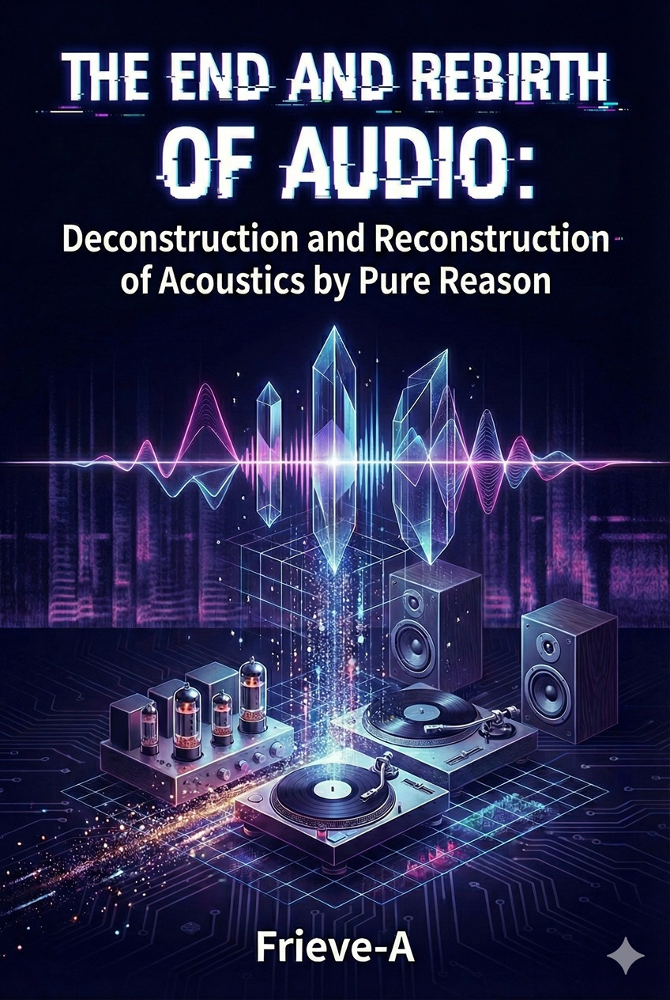
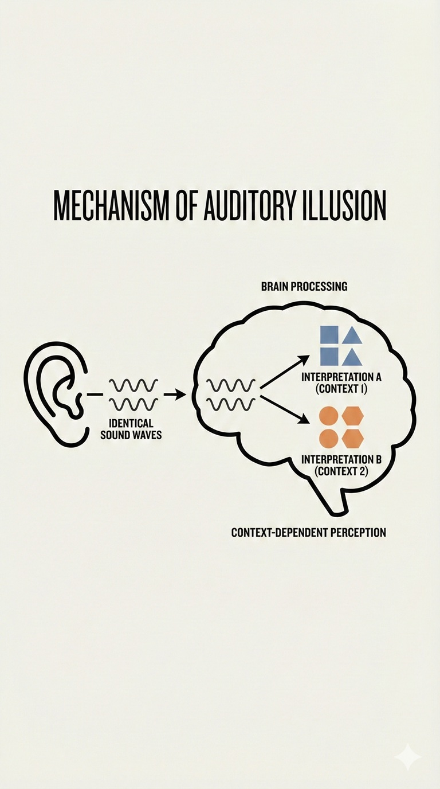
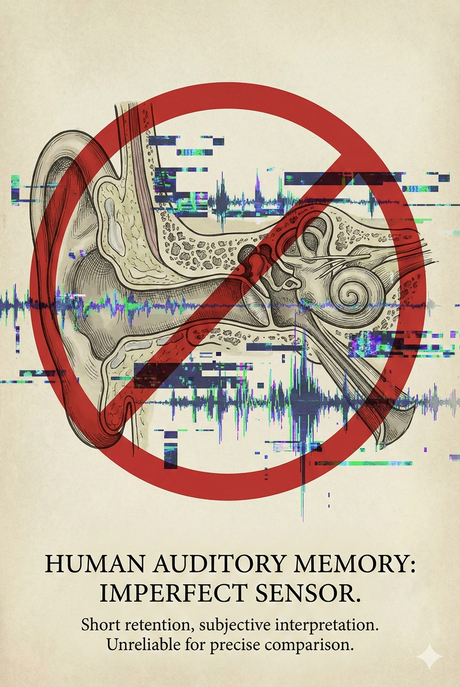
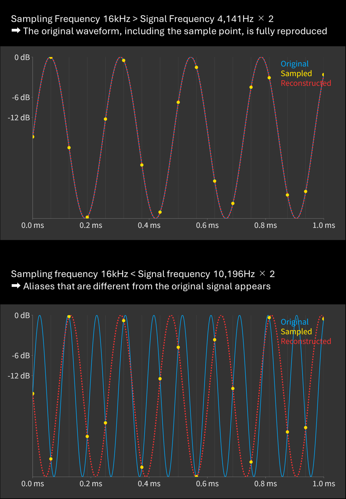
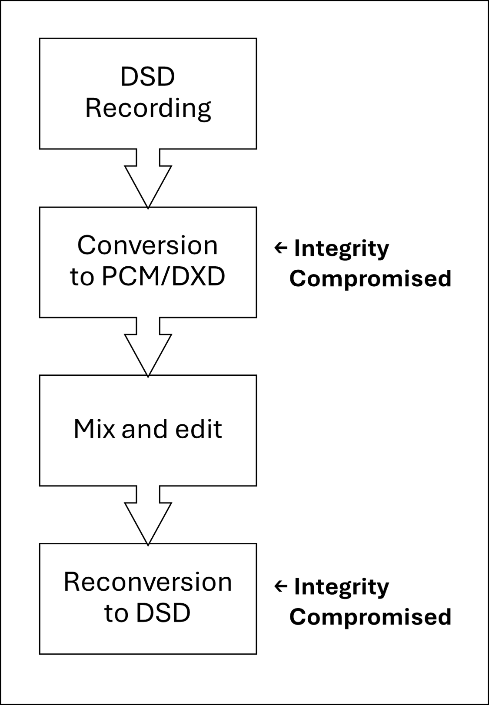
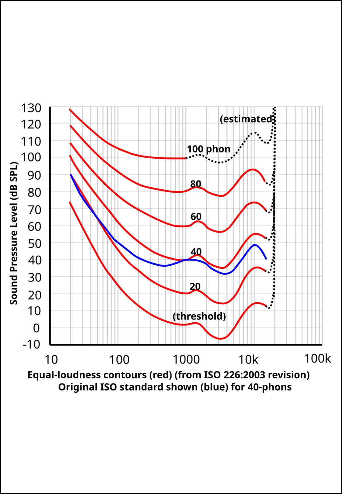
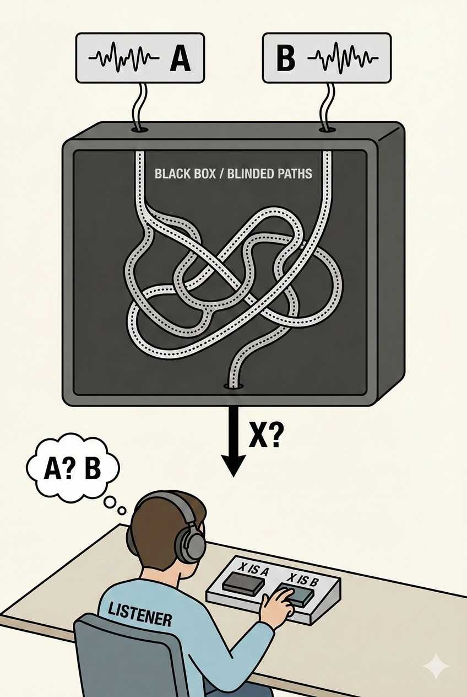
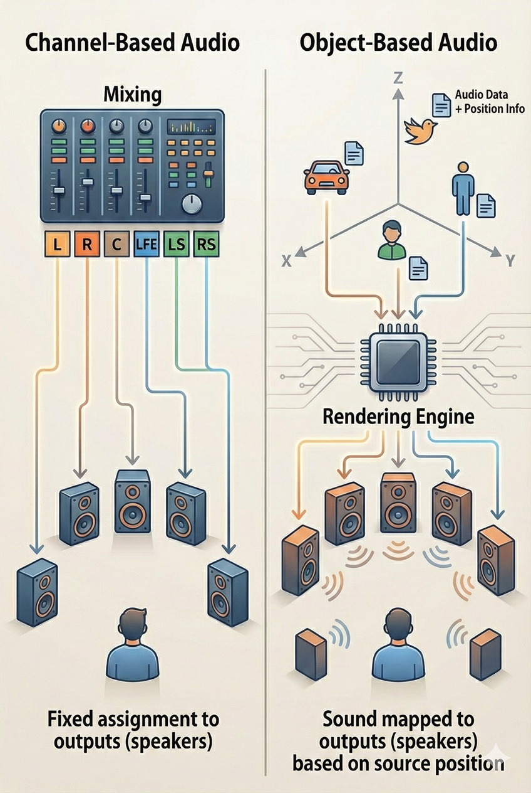
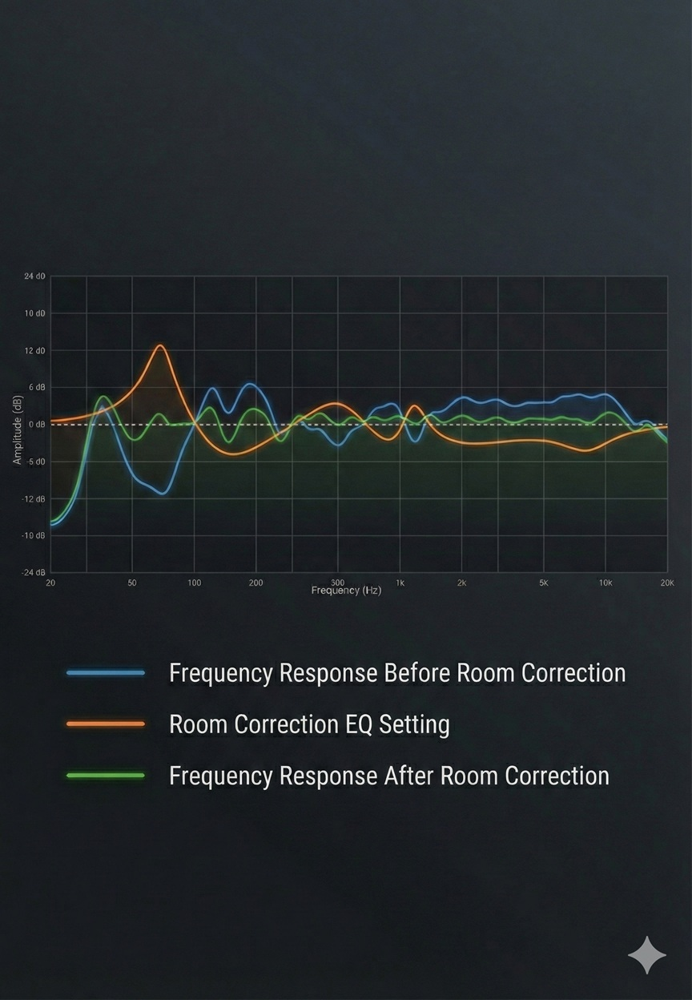

---

# Preface: Defining Silence — The Separation of Signal and Emotion

## 0.1 The End of Audio, or Its Beginning

### The Terminus of Inquiry

From discrete sample values $x[n]$, the original continuous signal $x(t)$ can theoretically be perfectly reconstructed by the following formula:

$$x(t) = \sum_{n=-\infty}^{\infty} x[n] \cdot \text{sinc}\left(\frac{t - nT}{T}\right)$$

Where $\text{sinc}(x) = \frac{\sin(\pi x)}{\pi x}$.

Approximately 150 years have passed since humanity first attempted to record sound and play it back. In this brief span, we have established the techniques to transform physical air vibrations into electrical signals, and then into numbers—digital data.

Yet even now, with technology at unprecedented heights, people keep searching for "good sound." Even when standing before equipment with specs that surpass measurement limits, they remain unsatisfied, seeking comfort in myths and legends.

The reason is none other than this: audio has moved past the phase of **"Engineering Solution"** and entered a **"Cognitive Labyrinth."**

Once, the purpose of audio was clear: reproduce recorded sound exactly as it was. It was a battle against noise, a struggle against physical constraints. But by the early 21st century, that struggle had effectively concluded. A single smartphone now effortlessly achieves signal-to-noise ratios and frequency responses that massive stereo systems of the past could never match.

A quest that physically "ended" remains psychologically "endless." This gap is the true nature of modern audio. What we face is no longer an electrical engineering problem—it is a profound question that lies at the boundary of physics, philosophy, and neuroscience.

---

### Deconstructing the Illusion of "Good Sound"

The primary reason discussions about "sound" fail to find common ground is the imperfection of the language we use. The phrase "good sound" is hopelessly vague, encompassing far too many meanings.

For some, "good" means the precise recreation of a concert hall's atmosphere.
For others, it means visceral, chest-pounding bass.
Still others find it in the warm, harmonic distortion of vacuum tube amplifiers.

These are entirely different phenomena, yet all are spoken of with the same phrase: "Good Sound." This is the root of the confusion. We must discard this phrase. To reach the truth, we must first deconstruct this ambiguous concept and redefine its constituent elements.

We should be discussing two entirely different dimensions:

1.  **Physical Fidelity**: The degree of correspondence between input and output signals. An objective, quantitative, scientific domain.
2.  **Subjective Preference**: The degree of pleasure an individual's brain perceives. A subjective, qualitative, artistic domain.

The tragedy of audio lies in conflating these two: the misconception that "the sound I prefer" equals "high-fidelity sound," or the illusion that "expensive equipment" should "match my preferences." To untangle these tangled threads, there is no choice but to apply the scalpel of cold reason.

---

### Strict Definitions: Fidelity and Preference

Here, I present the most important definitions that permeate this entire book.

#### 1. Fidelity
This is **a world where "correct answers" exist**.
For an input signal $x(t)$ passing through a system $S$, the output $y(t)$ must match perfectly, except for a constant multiplier and time delay:

$$y(t) = A \cdot x(t - \tau)$$

Where $A$ is gain and $\tau$ is delay time. Any deviation—harmonic distortion, frequency response variations, phase irregularities—constitutes error and degradation. Under this definition, the warmth of vacuum tubes and the noise of records are nothing but distortion.

Modern digital audio has achieved fidelity far beyond the limits of human perception.

#### 2. Preference
This is **a world where no "correct answer" exists**.

Whether a sound feels "pleasant" depends on individual auditory characteristics, cultural background, past memories, and momentary mood. Psychoacoustic research has shown that many people actually prefer sound with moderately emphasized bass and subtle harmonic content (distortion) over perfectly flat, distortion-free reproduction—the pinnacle of fidelity.

| Dimension | Purpose | Metrics | Judge | Modern Achievement |
| :--- | :--- | :--- | :--- | :--- |
| **Fidelity** | Preservation of original signal | THD+N, SINAD, Freq. Response | Measuring instruments | **Solved** (Transcends audible range) |
| **Preference** | Maximization of pleasure | Harmony, impact, warmth | Brain/Subjectivity | **Unsolved** (Individual/situational variance) |

This book will first prove mathematically that audio is physically "finished" in terms of fidelity. Then it will expose how the ghost of preference warps our perception, and finally show a path toward consciously integrating these two.

From here on, illusions will vanish, and only the cold beauty of mathematics and the truth of humans as imperfect vessels shall remain.

---

## 0.2 Hearing: An Imperfect Window

### Defeat as a Measuring Instrument

We place too much faith in our sensory organs. Especially regarding the ear, we harbor the illusion that it is a precision microphone and the brain a superior spectrum analyzer. "Judge with your own ears"—held as the supreme maxim in the audio world—is, from a scientific perspective, one of the least reliable measurement methods in existence.

The ear did not evolve to accurately record and reproduce physical phenomena. It is a **survival alarm system**—designed to detect a predator's footsteps from behind and identify a companion's voice in darkness.

Our auditory system does not perceive air vibrations as they are. The brain amplifies what it deems important, discards what it considers noise, and sometimes fabricates information to construct a coherent "world."

Recall optical illusions. We know lines of equal length appear different depending on arrow directions, and static images can appear to move. We accept as common knowledge that "the eye lies."

Yet why do we believe the ear alone "does not lie"?

Auditory illusions are even more powerful than visual ones. The Shepard Tone and the McGurk Effect are definitive proof that the brain fabricates "sounds" different from the actual audio signals input. Our act of "hearing" is not passive sensing—it is the result of active simulation.

The exact same waveform may be interpreted differently in the brain depending on time and circumstance

---

### Cognitive Bias and Placebo: Narratives That Vibrate the Eardrum

In the process from sound vibrating the eardrum to hair cells converting it to electrical signals and reaching the auditory cortex, a massive amount of "noise" beyond the pure acoustic signal gets introduced.

The greatest source of this noise is **context—information.**

"This amplifier has a 60-pound machined aluminum chassis and costs $50,000."

Such prior information modulates the sensitivity of the auditory cortex. This is called the **Expectation Effect**. The brain holds a powerful preconception that objects for which high costs have been paid, or products from prestigious brands, "should be producing good sound."

At this moment, the actual physical sound has not changed. However, auditory processing linked to the brain's dopaminergic reward system generates, as a subjective experience, the qualia of "increased resolution and tighter bass." This is not metaphor—it is neuroscientific fact.

This is why, in blind tests (blindfolded listening) of audio equipment, countless cases emerge where cables costing tens of thousands of dollars cannot be distinguished from copper wire from a hardware store. The moment visual information and the narrative of the brand are blocked, the spell breaks—and there remain only electrical signals.

| Factor | Physical Impact | Psychological Impact | Result |
| :--- | :--- | :--- | :--- |
| **Chassis weight** | Minimal (damping) | Enormous (sense of substance) | Sound seems more substantial |
| **Price** | Unrelated | Enormous (values) | Sound seems higher resolution |
| **Gold plating** | Maintains conductivity | Large (luxury feel) | Sound seems more brilliant |

We are not listening to sound. We are listening to price tags, narratives, and the reassurance that our choices were correct.

---

### The Shackles of Time: The Fragility of Echoic Memory

There's an even more fatal flaw: the brevity of **echoic memory.**

Humans can retain the precise qualities of sound—timbre, subtle nuances—for mere seconds. When comparing equipment A with equipment B, if swapping cables takes a minute, by the time sound B emerges, your accurate memory of sound A has already faded. What remains is only the vague impression that "A seemed good."

With vision, two photographs can be placed side by side for detailed comparison. But hearing can only exist on the time axis. Without an instantaneous switching device, rigorous comparison is biologically impossible.

This fragility of memory is the fertile ground that allows the poetic expressions of audio criticism. Literary expressions like "a veil has been lifted" or "excellent grain" are nothing but desperate measures to anchor sounds that have vanished into the beyond of memory.

**In conclusion:** Our ears are not mirrors reflecting truth but conveniently distorted lenses. To identify what "good sound" actually means, we must first close this imperfect window and rely on **mathematics** and **measurement**—external eyes humanity has acquired. From the next chapter onward, we shall discuss these absolute metrics.

---

# Chapter 1: Mathematical Truth — The Axioms of Digital Audio and the State of the Art in 2025

## 1.1 The Absoluteness of the Sampling Theorem

### Mathematical Proof That Defies Intuition

There exists a most fundamental misconception held by many audio enthusiasts: the intuitive notion that "digital is a collection of dots while analog is a line," and therefore digital is merely an approximation that can never reach the original.

In the modern age, nothing exposes ignorance more clearly than looking at a staircase waveform diagram and lamenting that "a smooth analog waveform has been degraded into jagged digital."

Let me be unequivocal: under the **Sampling Theorem**, digital audio is not an approximation. For band-limited signals, it mathematically guarantees **perfect preservation** and **perfect reconstruction.**

This theorem, anticipated by Harry Nyquist in 1928 and proven by Claude Shannon in 1949, is an **axiom** possessing the same strength as physical law. Whether we like it or not, just as gravity drops an apple, this theorem functions.

When reconstructing a "line" from "dots," it might seem there are infinite ways to draw lines through the points. But when one condition—band-limiting—is met, there exists **only one smooth waveform in the entire universe** that passes through those points.

Discrete points generating a unique smooth waveform

---

### The Bridge Between Continuous and Discrete: Perfect Reconstruction via the Sinc Function

The magical key that derives this "one and only waveform" is the Whittaker-Shannon interpolation formula.

From discrete sample values $x[n]$, the original continuous signal $x(t)$ is reconstructed without a single cloud of ambiguity:

$$x(t) = \sum_{n=-\infty}^{\infty} x[n] \cdot \text{sinc}\left(\frac{t - nT}{T}\right)$$

Where $\text{sinc}(x) = \frac{\sin(\pi x)}{\pi x}$.

The implications are profound. Digital data doesn't merely record "instantaneous voltage values." Each sample point contains **Sinc function ripples** spreading from infinite past to infinite future.

When these countless ripples superimpose through convolution, they interfere with each other, and the "gaps" between sample points get filled with precision far exceeding human perception limits.

Of course, physically handling "infinity" is impossible, so slight approximation (truncation via window functions) is necessary. But in modern filter design, such computational errors converge to levels like $-140\,\text{dB}$—far below human perception limits.

A DAC's job is not to output a staircase waveform. It is to physically execute this formula and reconstruct a smooth curve.

| Misconception | Mathematical Truth |
| :--- | :--- |
| **Straight lines connecting dots** | Linear interpolation (incorrect). Not used in audio. |
| **Staircase waveform** | Zero-order hold (raw output). A temporary form before passing through filters. |
| **Smooth curve** | **Sinc interpolation (correct).** Matches the original analog waveform perfectly. |

---

### The Iron Law of Nyquist Frequency: $f_s > 2B$

The one and only absolute condition for this perfection to hold is the **Nyquist Rate**.

"You must sample at a frequency ($f_s$) higher than twice the maximum frequency ($B$) of the signal you want to record."

$$f_s > 2 \cdot f_{max}$$

What happens if you violate this rule? If high frequencies simply disappeared, there'd be no problem. But in digital sampling, signals exceeding the Nyquist frequency ($f_s / 2$) transform into lower frequencies and **appear in the audible range like ghosts.** This phenomenon is called **aliasing.**

Example: a $28\,\text{kHz}$ ultrasonic wave enters a system with $48\,\text{kHz}$ sampling frequency (Nyquist frequency $24\,\text{kHz}$). The signal cannot be recorded as $28\,\text{kHz}$—instead it appears as audible noise at $48 - 28 = 20\,\text{kHz}$. This dissonance never existed in the original music, and once digitized, it cannot be removed.

To prevent these ghosts, an **anti-aliasing filter** (low-pass filter) must attenuate signals above the Nyquist frequency before AD conversion.

This explains why CD's sampling frequency is not exactly "twice the upper limit of human hearing ($40\,\text{kHz}$)" but the seemingly arbitrary $44.1\,\text{kHz}$.

At $40\,\text{kHz}$ sampling, the Nyquist frequency would be $20\,\text{kHz}$. A filter would need to perfectly pass everything up to $20\,\text{kHz}$, then completely block from $20.0001\,\text{kHz}$ upward. Implementing such a "brick wall" filter with analog circuitry causes severe phase rotation, passband ripples, and sound degradation.

The solution: $44.1\,\text{kHz}$ (Nyquist $22.05\,\text{kHz}$), creating a $2.05\,\text{kHz}$ **transition band** between $20\,\text{kHz}$ (audibility limit) and $22.05\,\text{kHz}$ (cutoff). This gap allows filters to attenuate with a gentle slope, preserving phase and amplitude within the audible range.

Sampling frequency and aliasing

The push for "Hi-Res (96kHz or 192kHz)" is not about smoother waveforms within the audible range. For reproduction below 20kHz, there is no mathematical difference between 44.1kHz and 192kHz. Both achieve **100%** accuracy.

(Hi-Res has value for recording ultrasonic frequencies, easier filter design, editing headroom in production—but these are separate from "audible-range waveform reproduction.")

---

### The Time Resolution Paradox: Can 44.1kHz Resolve Picoseconds?

A common sales pitch for Hi-Res deserves debunking: "CD ($44.1\,\text{kHz}$) has a sample interval of about $22.7\,\mu\text{s}$, so timing differences shorter than that cannot be expressed. Hi-Res ($192\,\text{kHz}$) slices time more finely, so attack transients are more accurate."

This is a fundamental mathematical error—confusing digital audio with pixel art.

In band-limited systems governed by the Sampling Theorem, time-axis resolution does not depend on sampling frequency. Sampling frequency determines only the upper limit of recordable frequencies (bandwidth)—not time step size.

With sufficient amplitude accuracy (bit depth), even a $44.1\,\text{kHz}$ signal can locate true peak positions between samples with near-perfect precision. A 16bit/$44.1\,\text{kHz}$ system with adequate S/N ratio achieves picosecond (trillionth of a second) resolution—the time sound waves take to travel nanometers through air. This precision exceeds not just human hearing but bat hearing as well.

The claim that "timing suffers without Hi-Res" rests on the elementary misconception that sampling equals staircase waveforms. In the continuous waveform reconstructed via Sinc interpolation, time is preserved as a continuous quantity, not discrete steps.

**Conclusion of Section 1.1: Preserved Reality**

The greatest misconception about digital audio is now resolved.

With sufficient sampling frequency and bit depth, time-axis resolution is effectively infinite. Digital does not miss the "true peaks" between samples.

The digital audio we hear is not a jagged approximation. It is preserved reality itself, described in the language of mathematics.

---

## 1.2 The Technological Singularity: Stratospheric Specs and Terrestrial Limits

### An Incomparable Gap: The World of -120dB

As of 2025, digital audio reproduction has exceeded humanity's biological limits. I call this the **"Audio Singularity."**

Audio equipment history was once a struggle to reduce noise. But even entry-level DACs costing a few hundred dollars have now made that struggle obsolete.

Consider the numbers. Analog records max out at $60$–$70\,\text{dB}$ dynamic range. Modern DAC chips (flagships from ESS Technology or AKM) approach $130\,\text{dB}$ dynamic range with THD+N below $0.00009\%$ ($-121\,\text{dB}$).

This is not a "performance difference." In the world of digital audio, the surface noise of records and tape hiss register as deafening. The silence that modern DACs achieve is **absolute stillness**—like the darkness of deep space.

| Media/Device | Dynamic Range | THD+N (Distortion) | Perceptual Meaning |
| :--- | :--- | :--- | :--- |
| **Analog Record** | $\approx 60 \sim 70\,\text{dB}$ | $\approx 0.5 \sim 3.0\%$ | Noise and distortion always present |
| **Cassette Tape** | $\approx 50 \sim 60\,\text{dB}$ | $\approx 1.0 \sim 5.0\%$ | Obvious hiss noise |
| **CD (16bit)** | $96\,\text{dB}$ | $0.003\%$ (theoretical) | Sufficient silence for audible range |
| **Modern Entry DAC** | $> 115\,\text{dB}$ | $< 0.0005\%$ | **Breaks through human perception limits** |

When analog enthusiasts claim "records contain infinite information," they are ignoring the laws of physics. What exists there is not infinite information, but near-infinite **"physical noise."**

---

### Thought Experiment: Dozens of AD/DA Conversions

There's a cruel thought experiment that proves the "Transparency" of modern digital audio equipment.

In the analog era, dubbing was synonymous with degradation. If you dubbed a cassette tape 10 times, the sound would become thin, buried in noise, and unbearable to listen to. This was called "Generation Loss."

But what happens if, using modern AD/DA converters, you perform 100 repetitions of "loopback"—immediately returning the analog output to the digital input for recording?

1.  Play the original source (DA conversion)
2.  Through cable to input terminal
3.  Re-digitize (AD conversion)
4.  Repeat this dozens of times

Astonishingly, with 2025-level studio-grade equipment (RME, Lynx, etc.), distinguishing the source after dozens of generations from the original in a blind test is extremely difficult. Theoretically, thermal noise (noise floor) accumulates with each conversion, but even so, compared to the degradation from dubbing an analog tape just once (hiss noise, high-frequency roll-off), the purity is overwhelming.

The implication is singular: **"Sound quality differences" of DACs or cables in a single playback do not exist in a domain humans should be discussing.**

---

### The Triumph of Silicon: The Defeat of Vacuum Tubes and the Victory of LSI

Why has such performance become possible? It is due to a physical victory called "semiconductor integration."

Some audiophiles worship discrete circuits (circuits with individual transistors and resistors) and vacuum tubes as "luxurious and high-quality." But from a signal processing standpoint, they're nothing more than **"imperfect and unstable relics."**

Inside modern ΔΣ (Delta-Sigma) DAC chips, ultra-high-speed switching elements, resistors, and capacitors are arranged at micro-scale. These have atomic-level uniformity on silicon wafers, and by being equally affected by external temperature changes and vibrations, errors are automatically canceled.

* **Thermal Coupling:** Inside modern ICs, temperature differences between elements are nearly zero, preventing distortion from thermal drift.
* **Laser Trimming:** Resistance values are corrected to the extreme during manufacturing.

While discrete amplifiers packed with huge capacitors and transformers generate "distortion" through their physical size and heat, fingertip-sized silicon chips keep outputting coldly accurate calculation results. This isn't sentiment—it's **overwhelming engineering victory.**

---

### The Complete Resolution of Jitter: Exorcising the Ghost

In the 1990s to early 2000s, digital audio had a weakness called "jitter" (timing fluctuation). When clock timing deviated, waveforms would distort. Back then, this was indeed a cause of sound quality degradation.

But this problem is now a **"Solved Problem."**

Modern DACs first store incoming data in a buffer (memory), then discard the input signal's timing (clock). Then, data is rearranged and read out according to the timing of a high-precision crystal oscillator (femto-clock, etc.) inside the DAC. This is called **"Asynchronous Transfer."**

Through this mechanism, no matter how unstable a clock the CD player or PC (transport) sends signals with, or how cheap the USB cable is, time is completely "aligned" just before it reaches the DAC chip.

"Connecting a high-precision external clock (10MHz rubidium, etc.) improves sound" is now close to superstition.

When bringing in a clock signal from outside via cable, new jitter is generated by the cable's capacitance and terminal reflections. The PLL circuit inside the DAC tries to follow it and often worsens phase noise instead.

A femtosecond-precision crystal oscillator placed in close proximity to a modern DAC chip is physically far purer than an external clock routed through long cables. External clocks are only necessary for broadcast stations or studios synchronizing dozens of devices—in home playback, they offer all risk and no reward.

Today, measured jitter components are at levels like $-130\,\text{dB}$—far below human perception limits. Introducing expensive "digital cables" or "clock generators" out of fear of jitter is no longer science but a **ritual** to fill anxiety.

---

## 1.3 The Evolution and Terminus of Conversion Methods

### The Evolution of DAC Architecture: Overcoming Physical Precision Limits Through Speed

The evolution of methods to convert digital to analog (DAC architecture) is a history of **escape from "the limits of resistors as physical components."**

Early digital audio, and what is still worshiped by some nostalgic enthusiasts, is the **Multi-bit type (R-2R Ladder)**. This is a method that synthesizes voltage by lining up resistors weighted by bit.
The aesthetics of this method lie in its "simplicity," but it carries a fatal physical defect: **resistor precision.**

To perfectly achieve 16-bit precision, resistor error must be kept within $\frac{1}{2^{16}}$, or **0.0015%**. Furthermore, to aim for 24-bit, precision of $\frac{1}{2^{24}} \approx 0.000006\%$ is required—physically impossible to manufacture.
If resistor values drift even slightly due to temperature changes or aging, waveforms distort and linearity collapses. In other words, the R-2R method was a fundamentally flawed endeavor—trying to handle perfect numbers in an imperfect material world.

What broke through this physical limit is the modern standard: **ΔΣ modulation**.
This was a paradigm shift. Rather than competing on "fineness of voltage (amplitude axis)," it competes on "fineness of time (time axis)."

1.  **Oversampling:** Signal is sampled at ultra-high speed in the megahertz (MHz) range.
2.  **Noise Shaping:** Quantization noise is "pushed out" from the audible range (below 20kHz) to inaudible ultrasonic frequencies.

Through this mathematical trick, extremely simple circuits (1-bit or a few-bit switches) achieved dynamic range and linearity that R-2R methods could never reach.
Modern flagship DAC chips (ESS SABRE, etc.) have refined this ΔΣ method to push the noise floor within the audible range below measurement limits. There is no longer any need to fear resistor errors. This is a historic turning point where uncertain "matter" was subdued by certain "time and calculation."

---

### The Trap of NOS (Non-Oversampling): A Distortion Machine Wearing the Mask of "Pure"

In the backwaters of high-end audio, there's a cultish genre called NOS (Non-Oversampling) DAC or filterless DAC. The pitch goes like this: "Digital filters create artificial 'ringing' (waveform oscillation). By eliminating filters and converting raw data directly, the sound is fresher."

When you look at the output waveform (impulse response) of a NOS DAC on an oscilloscope, you do see clean rectangular pulses without ringing. Rejoicing at this, saying "No unnecessary processing! This is pure!"—marks someone who has never cracked open a signal processing textbook.

Because that signal that looks clean on the time axis (waveform) is causing nightmarish contamination on the frequency axis (spectrum).

Let's review the Sampling Theorem. When converting digitized signals back to analog, copies (mirror images) of the original signal are generated infinitely around the Nyquist frequency ($f_s/2$). These are called **Imaging Artifacts**. Normal DACs (oversampling DACs) mathematically annihilate these images with digital filters, extracting only the original audio signal.

However, NOS DACs "omit" this filter. What happens as a result? Powerful ultrasonic noise with the same energy as the music signal spills continuously just above the audible range (from $22.05\,\text{kHz}$ onward).

This "inaudible noise" is not harmless.

1. Intermodulation Distortion (IMD): When powerful ultrasound is input, analog equipment like amplifiers and tweeters exhibit nonlinear behavior. As a result, ultrasound and audible sound interfere with each other, generating **new distortion (intermodulation products) within the audible band**. In other words, noise that shouldn't be audible muddies audible sound.
2. Tweeter Burnout: If you turn up the volume thinking it's music signal, energy outside the audible range quietly heats the tweeter's voice coil and, in the worst case, burns it out.

Furthermore, NOS DACs have a physical fate called the **Aperture Effect (Sinc Roll-off)**. Outputting a staircase waveform as-is corresponds mathematically to "Zero-order Hold." Due to this characteristic, output level naturally attenuates as frequency increases.

Specifically, at $20\,\text{kHz}$, sound pressure drops by about $-3.2\,\text{dB}$ (at Nyquist frequency, $-3.9\,\text{dB}$). This is equivalent to a mastering engineer slashing highs with EQ.

The "analog-like, thick, rounded warm sound" that NOS DAC enthusiasts describe isn't magic. They're simply listening to **"sound with physically attenuated highs (roll-off) and harmonics dirtied by intermodulation distortion."** Loving that as personal preference is fine, but justifying it with words like "Hi-Fi" or "freshness" is scientifically indefensible. It's like calling a fogged lens "artistic."

---

### DSD: A Relic—The Uneditable Archive

There's a format still considered sacred among audiophiles: **DSD (Direct Stream Digital)**.
Marketing buzzwords like "close to analog" and "smooth waveforms" get thrown around, but from an engineering standpoint, DSD is nothing more than **"a bloated data behemoth."**

The true nature of DSD is the direct recording of the ΔΣ modulator output (1-bit high-speed pulse train). Certainly, as a format immediately after AD conversion, it has high purity. However, there is a fatal problem.

**DSD fundamentally cannot be "computed."**

Volume adjustment, EQ correction, mixing (combining) multiple tracks—to perform these essential processes in modern music production, 1-bit DSD data cannot be used as-is and must first be converted to multi-bit (PCM/DXD), then multiplication and addition can be performed.

| Process | DSD (1bit) | PCM (Multi-bit) |
| :--- | :--- | :--- |
| **Recording** | Possible | Possible |
| **Editing/Processing** | **Impossible** (even fade-ins are not possible) | Completely flexible |
| **Modern Production** | Record in DSD $\rightarrow$ **Convert to PCM for editing** $\rightarrow$ Convert back to DSD for sale | PCM from start to finish |

Even equipment advertised as "native DSD editing" internally performs some kind of multi-bit (or PCM-equivalent) conversion at edit points involving computation like fade-in/out or gain adjustment. This is due to the physical constraint that DSD's 1-bit structure does not directly allow mathematical operations like multiplication and addition; after processing, it is generally converted back to DSD.

Therefore, 99% of works on the market labeled "native DSD recording" have passed through PCM (Digital eXtreme Definition, etc.) during production. In other words, what listeners hear is not "pure DSD" but **"PCM repackaged into a DSD container."**

DSD to PCM conversion process

Even more fatal is the reversal in playback quality. Earlier DACs were primarily 1-bit processing, but as of 2025, nearly all high-performance DACs (ESS, AKM, etc.) operate on **"multi-bit ΔΣ (5-6 bit, etc.)"**. This physically achieves far lower quantization noise and higher dynamic range than SACD's specification of DSD64 (1bit/2.8MHz) or DSD128.

1-bit DSD inherently generates massive quantization noise, relying on "noise shaping" to push it outside the audible range (ultrasonic). As a result, during DSD playback, a **"mountain of noise" is prominently added** to the band above $20\,\text{kHz}$. The act of deliberately converting PCM sources to DSD for playback is nothing but **"pointlessly bloating data size while adding high-frequency noise and increasing DAC burden."**

DSD was an "archival format" originally developed by Sony to digitally archive past master tapes, and its rationale as a distribution format for listening to music no longer exists in 2025. It's like a time capsule you must destroy each time to extract its contents.

---

## 1.4 The Fate of Physical Media: The Pathology of Analog Records

### A Compendium of Noise: Amplified Impurities

Playing an analog record means electrically amplifying minute physical vibrations thousands of times. In this process, it's physically unavoidable that "impurities" beyond the music signal get introduced.
Part of the true nature of what record enthusiasts call "warmth" is a cocktail of these noise components:

1.  **Hum Noise:**
    A low-frequency "buzzing" noise derived from power line frequency ($50/60\,\text{Hz}$). When handling the extremely small signals of MC cartridges (about $0.3\,\text{mV}$), the higher the gain at the phono equalizer, the worse the S/N ratio becomes, constantly clinging to the background.
2.  **Rumble Noise:**
    Mechanical noise from turntable motor vibration and bearing friction transmitted through the platter to the stylus. This lurks in the ultra-low frequency range (below $20\,\text{Hz}$, etc.), meaninglessly shaking woofers and causing intermodulation distortion.
3.  **Surface Noise (Clicks & Pops):**
    "Crackling" burst sounds generated by scratches on the disc surface or dust attracted by static electricity. Momentary severe distortion equivalent to digital clipping noise.

Even more fatal is the existence of the **RIAA Curve**.
Due to physical constraints, records are recorded with attenuated bass, so during playback, bass must be boosted by about $+20\,\text{dB}$ to restore it. This means **"motor noise and hum contained in the bass are also amplified by $+20\,\text{dB}$"**—a suicidal act.

---

### The "20kHz Wall" and the True Nature of Ultrasound

A cliché that analog believers use when attacking digital is: "CD is cut off at $20\,\text{kHz}$, but records extend to $50\,\text{kHz}$ and beyond."
True, analog records have no theoretical upper frequency limit (Nyquist frequency). But has anyone ever verified **"what"** is actually recorded there?

1.  **Cutting Limitations:**
    The cutting head that carves the master disc requires large current at high frequencies and risks overheating and burning out. Therefore, **except for special half-speed cutting and other high-quality pressings,** many engineers attenuated or cut everything above $15 \sim 18\,\text{kHz}$ for safety. In other words, the notion that "infinite ultrasound" is always etched on analog discs is often a survival-biased illusion.
2.  **The True Nature of Ultrasound is "Distortion":**
    Sometimes signals above $30\,\text{kHz}$ are observed on a spectrum analyzer during playback. However, much of this is not musical content. It is **"Harmonic Distortion"** generated when the stylus cannot follow violent groove changes and thrashes about, and **"Surface Noise"** from friction between stylus and groove.
    They may well be reverently appreciating "the sound of the stylus screaming in agony."
3.  **Erasure Through Playback:**
    Even if fine grooves above $20\,\text{kHz}$ were etched, these are physically extremely minute undulations. Playing them even once with a hard diamond stylus, the friction heat and pressure grind away the fine peaks (High Frequency Erasure).
    "Ultrasonic playback" is a privilege of only the first play when new; thereafter, it rapidly degrades—a fleeting dream.

---

### The Curse of Rotation and Geometry: Collapse of Time Axis and Phase

While digital audio manages time at nanosecond precision with crystal oscillators, records manage time with motors and belts—technology from the Industrial Revolution.

* **Wow & Flutter:**
    Pitch fluctuation due to rotational irregularity. Periodic undulation (wow) from eccentricity, and trembling (flutter) from minute motor vibrations. Piano sustain becomes muddy, destroying accurate pitch. Just $0.55\,\text{mm}$ of eccentricity causes audible pitch variation.
* **Tonearm Geometric Error (Tracking Error):**
    Record cutting (master creation) is done perpendicular to the groove (linear tracking). However, most playback tonearms are pivoted (single-point support), moving in an arc.
    This causes the angle between stylus and groove to constantly drift (tracking error). As a result, **left-right phase difference** and **distortion** change moment by moment as the track progresses.
* **Inner Groove Distortion (IGD):**
    Records have different linear velocity at outer and inner grooves. Toward the inner grooves, wavelengths become compressed and high-frequency characteristics physically degrade. For classical and opera where climactic loud passages often come at the inner grooves, the most important moments are distorted—a structural defect.

In digital, "consistent quality from start to finish" is taken for granted, but for analog records, this is physically impossible.

---

### Contact is Destruction: Wear and Crosstalk

The act of "dropping the needle" is, from a micro perspective, the same as machining.
The diamond stylus tip melts the vinyl groove with friction heat as it advances. With each play, high-frequency content (fine undulations) is ground away, and **sound irreversibly degrades (Wear)**.
There is no more unsuitable medium for "original sound preservation" than one that self-destructs with each play.

Furthermore, the limitation of **Crosstalk (Channel Separation)** in stereo playback is also serious.
With the mechanism where a single stylus simultaneously reads both left and right walls of a V-shaped groove, it is impossible to completely prevent vibration from the left channel leaking into the right channel.
Even the finest cartridges are limited to about $30\,\text{dB}$ separation (digital exceeds $100\,\text{dB}$).
This means the soundstage is physically narrowed, and imaging becomes ambiguous.

| Item | Digital (Modern DAC) | Analog Record (High-end Setup) |
| :--- | :--- | :--- |
| **S/N Ratio** | $> 120\,\text{dB}$ | $\approx 60 \sim 70\,\text{dB}$ |
| **Channel Separation** | $> 110\,\text{dB}$ | $\approx 25 \sim 35\,\text{dB}$ |
| **Ultrasonic Response** | Cut by filter (theoretical limit) | **Exists as noise/distortion** (no physical limit) |
| **Wow & Flutter** | Below measurement limits | $0.05\% \sim 0.1\%$ (audibly detectable) |
| **Playback Degradation** | None (permanently unchanging) | Present (high-frequency loss from wear) |

**Conclusion:**
Loving the sound of analog records is your prerogative. But when justifying this distortion, noise, and timing fluctuation as "musical resonance," you must recognize that this is no longer about Fidelity—it has shifted to **"a preference for distortion effects."**

---

### The Limits of Air: Thermal Noise as the "Absolute Zero Wall"

Audio manufacturers compete over specs like "32-bit high resolution" and "S/N ratio 140dB." But let's step away from electrical circuits for a moment and turn our attention to **"air"** itself—the medium of sound.

Since sound is a pressure wave in air, its resolution limit is determined by the behavior of air molecules.
Physics has a concept called **"Brownian Motion."** Fluid molecules with temperature constantly move randomly due to thermal energy, colliding with each other.
This minute collision is the **"absolute noise floor (Thermal Noise)"** in physical space.

In room-temperature air (20°C), the sound of air molecules striking a microphone diaphragm (thermal noise) is calculated to be about **$-23\,\text{dBSPL}$** in sound pressure level.
Meanwhile, the human audibility threshold is $0\,\text{dBSPL}$.
And ear-damaging volume (near a jet engine) is $140\,\text{dBSPL}$.

Now let's compare with digital specs:
* **16bit:** Dynamic range $96\,\text{dB}$
* **24bit:** Dynamic range $144\,\text{dB}$

If one tried to fully utilize 24-bit dynamic range ($144\,\text{dB}$) at home, even setting maximum volume at jet-engine level $140\,\text{dB}$, the minimum sound (1st bit) would be $-4\,\text{dB}$.
This is larger than air's thermal noise ($-23\,\text{dB}$), but in reality, before reaching that point, the physical wall of high-performance microphone self-noise (about $+4\,\text{dB}$) exists. Furthermore, even a quiet soundproof room has ambient noise of $20 \sim 30\,\text{dB}$.

In other words, what the least significant bit (LSB) of 24-bit represents is not subtle musical nuance. It is **"room HVAC noise,"** or microphone preamp **"thermal noise,"** and ultimately **"the collision sound of air molecules."**
24-bit and 32-bit data are extremely important as headroom during recording and editing, but as playback packages, they are overspec beyond what the laws of physics (thermodynamics) permit.

When we feel "Hi-Res silence," it's not because the data is finer. The mastering engineer simply filled the gaps between tracks with "digital zero (silent data)" or cut hiss noise with a noise gate.
As long as air exists, infinite silence does not. Physics sets limits before human desire.

**Conclusion of Chapter 1:**
The technical challenges of digital audio have been completely solved from the perspective of Fidelity.
The Sampling Theorem is absolute, modern ΔΣ DACs are transparent, and the format debate is over.
What we next face is the problem on the receiving end of this perfect signal—namely, **"imperfect humans"** and **"degraded physical environments."**

---

# Chapter 2: The Cognitive Bottleneck — Biological Constraints and Illusions

## 2.1 Human Sensor Performance: Quantifying Its Dullness

### 1. Loudness: The 0.2dB That Destroys All Evaluation

In comparative listening tests, the most overlooked fact is also the cruelest: **humans mistake louder sound for "better sound."**

This is called **"Loudness Bias."**

Human hearing cannot accurately measure absolute sound pressure level. But it responds sharply to relative changes. When volume increases slightly, the brain does not register "louder"—it interprets the change as:

* "The bass has more impact"
* "The high frequencies have better textural detail"
* "The soundstage has expanded"

The threshold for this misperception (JND: Just Noticeable Difference) is approximately **$0.2$–$0.3\,\text{dB}$** even for trained listeners.

In audio shops and reviews without strict level matching, when amplifier A is judged "higher quality" than amplifier B, 90% of the time the cause is simply that A's output was $0.5\,\text{dB}$ louder.

Matching volume knob positions is meaningless—voltage varies with output impedance and gain. Comparisons without precise digital-domain adjustments or measured output voltages are not science but **"volume preference tests."**

$$L_{perceived} \propto \text{Volume} + \text{Quality}_{illusion}$$

---

### 2. Frequency Response: The Logarithmic Prison

Frequency balance (tonality) ranks next in sensitivity. But here too lies a trap: our hearing perceives frequency changes **logarithmically**, not linearly.

A physical difference of $100\,\text{Hz}$ is a huge change in the bass, but negligible in the treble.
* $100\,\text{Hz} \rightarrow 200\,\text{Hz}$: One octave change (dramatic)
* $10,000\,\text{Hz} \rightarrow 10,100\,\text{Hz}$: About 1.4 cents change (imperceptible)

The **Bark scale** and **Mel scale** correctly express this relationship. Hair cell arrangement in the human cochlea follows this logarithmic pattern.

$$f_{mel} = 2595 \cdot \log_{10}\left(1 + \frac{f}{700}\right)$$

We are sensitive to broadband (low Q) gradual variations ($\pm 1\,\text{dB}$) but surprisingly insensitive to narrowband (high Q) sharp peaks and dips. Deep dips from room reflections ("comb filtering") are often automatically interpolated by the brain and ignored.

When pursuing "flat characteristics," fine graph jaggedness need not become a single line. What matters is whether the **psychoacoustically smoothed average** the brain recognizes is flat.

---

### 3. Nonlinear Distortion: The Mercy of Masking

Here is the truth hardest for audiophiles to accept: **humans are extremely insensitive to nonlinear distortion (THD/IMD).**

In the spec wars of amps and DACs, manufacturers boast THD+N of $0.0001\%$ ($-120\,\text{dB}$). But psychoacoustic research (Geddes & Lee, 2003) reveals a cruel reality.

During music playback, the threshold at which humans detect distortion can exceed **$1\%$ ($-40\,\text{dB}$)**. In the bass especially, several percent distortion is often tolerated—even welcomed as "harmonic richness."

This is the **Auditory Masking Effect**: when a loud signal plays, smaller sounds (distortion, noise) near that frequency are neurally hidden and become inaudible.

$$Threshold_{masking} \gg Threshold_{absolute}$$

We pay premiums for $0.0001\%$ purity. Yet our ears rate vacuum tube amps at $1\%$ distortion, or speakers generating several percent, as "the best."

The "low distortion competition" in modern electronics has long exceeded auditory benefit—it is **spec sheet posturing.** Whether SINAD is $120\,\text{dB}$ or $90\,\text{dB}$, for music listening, both are equally "transparent."

---

### 4. Group Delay: Time-Axis Insensitivity

Finally, phase and group delay. "Time shift" is an eternal theme in audio, but here too human perception is poor.

Research shows the threshold for perceiving group delay anomalies (timing shifts):

* **High frequencies (several kHz and above):** About $1 \sim 2\,\text{ms}$
* **Low frequencies (below 100Hz):** Several tens of $\text{ms}$ or more (extremely insensitive due to long wavelengths)

Discussions of "time alignment" where speaker woofer and tweeter are offset by a few centimeters miss the point: a few centimeters of offset causes delays on the order of $0.1\,\text{ms}$—often below the auditory threshold. In real environments with room reflections (hundreds of ms delay), millisecond-level phase management is physically washed out.

"Phase accuracy" matters for waveform reproduction (fidelity), but humans are extremely poor at distinguishing phase-rotated sound (e.g., through an all-pass filter) from the original, except for certain transient responses.

For scientific precision, distinguish "relative phase" from "absolute polarity." When timing between left and right speakers shifts—relative phase disturbance—this is audible as discomfort because sounds physically cancel. But what we hear is frequency response degradation, not phase itself.

**Virtually no humans can detect "absolute polarity"—inverting the entire signal's plus and minus—in blind tests.** Our inability to distinguish whether a waveform starts with a "push" or "pull" demonstrates decisively how insensitive hearing is to time-axis information.

**Conclusion of Section 2.1:** Our hearing is easily fooled by volume, blind to distortion, and tolerant of timing shifts. The specs needed to satisfy this defect-ridden sensor were already met in the 20th century. Hi-Res and ultra-low-distortion technologies exist not from biological necessity but for the industry's relentless pursuit of growth.

Next: an even crueler degradation this imperfect body faces—aging.

---

## 2.2 An Inconvenient Physiology

### Aging as Irreversible Change: The Cruel Inverse Correlation Between Wealth and Hearing

The audio industry's greatest taboo: **"Those who can afford the finest equipment have already lost the ability to hear its performance."** This cruel fact seems like cosmic irony.

This is **presbycusis** (age-related hearing loss)—not a disease, but irreversible cell death following the law of entropy.

Textbooks define the upper limit of human hearing as $20\,\text{kHz}$—but this applies only to newborns. Hair cells, especially those in the basal turn responsible for high frequencies, physically wear and die with age. Statistical averages (ISO 7029) reveal a merciless reality:

| Age | Upper Audible Frequency Limit (Average) | Sounds No Longer Heard |
| :--- | :--- | :--- |
| **Teens** | $\approx 18 \sim 20\,\text{kHz}$ | Dog whistle ($>22\,\text{kHz}$) |
| **30s** | $\approx 15 \sim 16\,\text{kHz}$ | Mosquito tone / CRT noise |
| **40s** | $\approx 13 \sim 14\,\text{kHz}$ | Cymbal harmonic brilliance |
| **60s** | $\approx 10 \sim 12\,\text{kHz}$ | Violin's highest-range airiness |

High-end audio's primary customers—men in their 50s to 70s—have physically lost everything above $12$–$14\,\text{kHz}$. When they invest fortunes in "Hi-Res compatible" super-tweeters reproducing $40\,\text{kHz}$ or $100\,\text{kHz}$, they are not hearing sound. They are buying **the fantasy that they can.**

More serious than high-frequency attenuation: deterioration of temporal resolution and the "cocktail party effect" (speech comprehension in noise). Aged ears cannot separate an orchestra's complex overlapping sounds, processing them as muddled noise. Blaming equipment for "insufficient resolution" is like criticizing the world as "blurry" while wearing fogged glasses.

---

### The Phantom of Brain Compensation: A Meaning-Making Engine Built on Noise

When the signal entering the ear is deficient, the brain doesn't return an error. It **generates "plausible sound" to fill the gap.**

This is **auditory induction**, the continuity illusion. Insert white noise between intermittent pure tones, and the brain interprets "the sound continues behind the noise"—perceiving pure tones that do not exist.

In audio, this function underlies the "burn-in" myth. Immediately after purchase, new headphones or speakers sound "harsh." After 100 hours, "the sound has smoothed out."

Some mechanical compliance change occurs, but what dominates is **brain burn-in** (adaptation). The brain has simply acclimated to the equipment's quirks—its frequency response peaks and distortions—and formed circuits that automatically correct them.

**Stochastic resonance** deserves attention too. Moderate noise can sometimes increase sensitivity to weak signals. The floor noise and distortion of analog records and tube amps may function as "dither," making music "easier to hear" for the brain.

Ironically, digital audio's "perfect silence"—the pinnacle of S/N ratio—may be an "unnatural vacuum" for the brain, evoking unease and coldness.

---

### The Physics of Burn-in: Metal Doesn't Mature—Only Rubber and Brain Adapt

"Speakers sound harsh when freshly bought"—this is physically correct. Speakers and headphones are motors converting electrical signals to mechanical vibration, with structural bodies containing "springs" like dampers and edge surrounds.

Factory-fresh rubber and resin parts have stiff suspensions. Extended vibration slightly reduces stiffness, settling to design-spec compliance. Measured via Thiele/Small Parameters, resonance frequency ($f_0$) drops a few Hz and Q factor ($Q_{ts}$) shifts. This is **purely mechanical break-in**—like new leather shoes conforming to feet over wear.

But apply this reasoning to cables or amplifier circuit boards, and science becomes occult. "When signals flow through cables, electron pathways form and sound improves." "Silver wire matures and highs become smoother."

Metallurgical fact: at room temperature, the **crystal lattice** of copper or silver cannot rearrange from the weak currents of audio signals (a few mA to a few A). If music-listening energy could change metal properties, household wiring would fail within years and power lines would collapse.

Exceptions exist: insulation film formation or thermal stability in vacuum tubes and electrolytic capacitors—but these processes complete within minutes to hours of power-on, separate from "maturation" requiring hundreds of hours.

So why do people genuinely feel "the cable's sound changed after 100 hours"? The cable didn't change. Your brain did.

The brain instinctively feels discomfort toward new stimuli. Once that stimulus is confirmed safe and repeatedly encountered, the brain accepts it as "normal" and begins processing subtle nuances. This is **habituation** or **perceptual learning.**

99% of reports that "sound improved as burn-in progressed" are post-hoc rationalizations: **"The listener's brain acclimated to initially unfamiliar sound and learned to appreciate its merits."** Proof: have a naive third party listen to a supposedly "burned-in" cable. They will likely say "the sound is harsh." The change occurred not in physical space (the cable) but in information space (brain synapses).

---

### Equal-Loudness Curves (ISO 226): Flat Does Not Sound Flat

The greatest trap that those pursuing "Original Sound Faithful (Flat Response)" fall into is the **Equal-loudness contour**.

Human ear sensitivity is not uniform across frequencies. It is particularly **extremely insensitive to low and ultra-high frequency ranges**.
Even more troublesome, this sensitivity characteristic **changes dramatically with volume (sound pressure level)**.

* **At high volume ($80 \sim 90\,\text{dB}$)**: Human hearing shows relatively flat characteristics.
* **At low volume ($40 \sim 50\,\text{dB}$)**: Sensitivity to bass ($100\,\text{Hz}$ and below) and treble drops dramatically.

Equal-Loudness Curves (ISO 226)

Studio mixing engineers typically determine balance at high volumes around $80 \sim 85\,\text{dB}$ (called reference level). What happens when a source adjusted to "perfect flat" at this volume is played in a typical home environment—around $60\,\text{dB}$ at night?

Even if reproduced physically flat, to the human brain it is perceived as **"thin bass, weak, powerless sound."**

Here, purists who abhor "tone controls" or "loudness switches" ignore their own physiological reality for the doctrine of "original sound reproduction."
At low-volume playback, applying Bass Boost to the low frequencies is not an act of distorting sound. It is an extremely rational and scientific correction to **"correctly restore"** the **"perceptual balance the engineer intended"** under low sound pressure conditions.

Pressing the amp's "Pure Direct" button to bypass circuits and reveling in the resulting thin sound is not purist—it is self-sabotage.

---

## 2.3 Methodology of Verification

### The Only Judge: The ABX Test as Guillotine

The endless debates rampant in the audio world—"Does cable change sound?" "Does Hi-Res make a difference?" "Class A versus Class D amps"—there's one and only one absolute method to settle them.
That's the **Double-Blind Test**, particularly in audio called the **ABX Test**.

This test serves as a **guillotine** for self-proclaimed "Golden Ears"—reviewers and enthusiasts alike must submit their beliefs to trial.

The ABX test procedure is extremely simple and logical:
1.  Freely listen to **source A** and **source B** (A and B are definitely different, known sounds).
2.  **Source X** is presented. X is either A or B randomly selected by computer.
3.  The subject determines "X is A" or "X is B."
4.  This is repeated a specified number of times (e.g., 10, 20).

The important point is that not only the subject but also **the test administrator does not know which X is** (double-blind). This completely eliminates even the "Clever Hans effect" where subjects unconsciously get hints from the administrator's facial expressions or tone.

In this environment, reviewers who normally write thousands of words of flowery prose about "veils being lifted" and "overwhelming silence" suddenly fall silent. The moment brand labels are stripped and visual information is blocked, they can no longer tell $10,000 cables from $10 ones.

ABX Test

---

### The Absence of Statistical Significance: The Wall of $p < 0.05$

In ABX tests, "how many correct answers constitute 'being able to tell the difference'" is defined by rigorous probability theory.

If there is absolutely no perceptible difference, answers become "guesses (coin flips)" and accuracy converges to 50%.
To scientifically claim "I can hear the difference," one must exceed this **50% chance barrier** at a statistically impossible level (significance level $\alpha = 0.05$, i.e., 95% confidence).

Performing probability calculations following binomial distribution $B(n, p)$ reveals the height of this wall.

* **10 trials:** 9 or more correct answers needed (8 correct still has about 5.5% chance probability, not scientifically rejected).
* **16 trials:** 12 or more correct answers needed.

$$P(X \ge k) = \sum_{i=k}^{n} \binom{n}{i} (0.5)^i (0.5)^{n-i} < 0.05$$

Many self-proclaimed acute listeners boast "100% accuracy" before tests. However, once tests begin, accuracy cruelly hovers around 50%-60%. In the world of physics, this is judged as **"No Significant Difference."** That is, **"the difference does not exist."**

Excuses like "I wasn't feeling well today" or "my senses dulled under pressure" do not apply. Because in tests comparing MP3 128kbps with uncompressed WAV, they achieve 100% accuracy under the same pressure.
The fact that accuracy drops only in tests of expensive products claiming "subtle differences" is the greatest proof that **no physical auditory difference exists**.

| Number of Trials ($n$) | Correct Answers Considered Significant ($k$) | Probability by Chance ($p$-value) |
| :--- | :--- | :--- |
| 10 | **9** | 0.0107 (about 1%) |
| 12 | **10** | 0.0193 (about 2%) |
| 16 | **12** | 0.0384 (about 4%) |
| 20 | **15** | 0.0207 (about 2%) |

---

### The Richard Clark Challenge and the History of Silence

A famous case symbolizes this cruel truth: the **"Amplifier Challenge"** presented by car audio specialist Richard Clark in the 1990s.

He declared: "If you can distinguish two amplifiers that have been level-matched within rated output and had their frequency response equalized (e.g., a mass-produced amp costing a few hundred dollars versus a high-end tube amp costing tens of thousands), I will pay a **$10,000 prize**."

Thousands of confident "golden ears" took the challenge, including reviewers and engineers from famous audio magazines.
The result?

**Not a single person took the prize money home.**

This is reality. Once conditions are physically rigorously matched, "tonal character" between amps is nothing but micro-differences below human auditory limits, or simply frequency response (EQ) discrepancies.
"Differences that disappear when blindfolded" are not contained in the air vibrations of physical space. They are **phantoms existing only in the listener's brain (cognition and imagination)**.

In this book, all phenomena for which significant differences have not been proven in ABX tests—Hi-Res ultrasonic effects, cable materials, power purity, etc.—shall be treated as **"non-existent."** This is the attitude of reason.

---

## 2.4 The Ghost of Reminiscence: The Curse of 'First Impressions'

### The Imprint of Formative Experience: From Boombox to Component Stereo

Many audiophiles have a "mythical moment" that becomes the origin of their faith.
For most, it arrives during the impressionable years of adolescence or early adulthood.

* The moment of upgrading from a mono old boombox to a two-channel stereo component system.
* The moment of switching from bundled earbuds to proper headphones costing $50-100.
* The moment of first hearing the clear sound of CD after noise-ridden cassette tape.

At this moment, dramatic change occurred in their brains. The fog lifted, the world burst into vivid color, and they experienced the illusion of their favorite artist appearing before them.
This **"overwhelming S/N ratio improvement"** and **"dramatic bandwidth expansion"** powerfully stimulated the brain's reward system, releasing massive dopamine.
This intense pleasure experience is the beginning of **"the curse"** that dominates the rest of their lives.

They unconsciously come to believe:
"If I spend money on equipment, I can get that feeling again—that trembling pleasure—once more."

---

### Diminishing Marginal Utility: The Curve of Diminishing Returns

But tragedy is hidden within the laws of physics.
The relationship between audio equipment performance and investment follows not a linear but a **logarithmic curve**.

The first experience (upgrading from tens of dollars to a few hundred) dramatically improved physical characteristics. Distortion went from several percent to below 0.1%, and frequency response went from narrow range to full range. This was a "revolution" obvious to anyone's ears.

But beyond that point, the **"Law of Diminishing Marginal Utility"** coldly dominates.

* **Step 1:** $100 → $1,000: Sound quality is "dramatically transformed." There is excitement.
* **Step 2:** $1,000 → $10,000: Sound quality is "refined." The difference is noticeable, but no shock.
* **Step 3:** $10,000 → $100,000: Sound quality "changes," but blind test identification becomes difficult.

At Step 3, enthusiasts invest huge sums expecting "that spine-tingling sensation" from Step 1.
However, the physical improvement margin is minimal (0.001% distortion improvement, etc.), and the auditory difference is nearly zero.
As a result, they are driven by frustration: "The sound should definitely be good, but I can't feel moved somehow."

| Investment (Log Scale) | Physical Improvement | Subjective Excitement (Dopamine Level) | State |
| :--- | :--- | :--- | :--- |
| **Low** | **Maximum** | **Maximum (MAX)** | "Amazing! The world has changed!" |
| **Mid** | Medium | Medium | "Yeah, the sound has improved" |
| **High** | Small | Small | "...I think the bass digs deeper" |
| **Ultra** | **Minimal (margin of error)** | **None (emptiness)** | "Maybe with more expensive equipment..." |

---

### Dopamine Depletion and the Blue Bird

There's an even crueler fact: **aging,** as discussed in Section 2.2.

Ironically, in youth, they "had no money, but had ears (auditory cells) at peak performance."
Decades later, with financial power acquired, "they have money, but their ears have degraded."

The harmonics above $20\,\text{kHz}$ and minute transients output by their ultimate high-end systems cannot be physically captured by their ears now.
The music they heard on cheap boomboxes shone not because of equipment performance. It was because **"young keen sensitivity"** and **"unexperienced content"** and **"healthy hearing"** were all aligned.

A $100,000 amp doesn't include teenage hearing and sensitivity in the package.
What they pursue is not the physical phenomenon of "high sound quality," but the ghost of **"their younger selves."**
Until they realize this, audiophiles will forever carry an unquenchable thirst, opening their wallets each time a new product appears. This is no longer a hobby—it's a **pilgrimage** to an unreachable past.

**Conclusion of Chapter 2:**
Our ears are imperfect, our brains are easily deceived, and we are bound to past memories.
To eliminate this "human uncertainty factor" and deal with pure signals only, we need a perspective that surveys the industrial structure itself.
In the next chapter, we dissect the structural defects of how the audio industry has exploited this "unsatisfied psychology" to build a massive market.

---

# Chapter 3: Structural Defects of the Industry — Brain Drain and Disconnect

## 3.1 The Disconnect of Knowledge and the Silence of Experts

### The Ignorance of 2025: Decades-Old Myths Recycled

Even in 2025, when civilization has become highly advanced, the audio world remains mired in medieval-like ignorance.
Not just ordinary consumers, but even writers for specialty magazines, and astonishingly even the founders of garage manufacturers developing products, continue to speak of **misconceptions refuted in the 1980s** as if they were cutting-edge knowledge.

The most prominent example is the "digital staircase waveform" debunked in Chapter 1. The image that "analog is smooth, digital is jagged" might be permissible as a convenient explanation in elementary education, but as a premise for adults discussing expensive equipment, it is shameful ignorance.

The superstition that "changing cables improves the purity of electrical signals" is also persistent. While changes in conductor resistance and capacitance (LCR) can cause minute filtering characteristics in the ultra-high frequency range—which is physically possible—claims that this directly leads to literary changes like "vocal emotional expression changes" or "bass damping dramatically improves" are blasphemy against basic electrical circuit theory (Kirchhoff's laws and Ohm's law).

Why are facts that could be understood by flipping through a few pages of a physics textbook dismissed as "just one opinion" in this industry?
Because the audio industry has chosen an anti-intellectual structure that places **"subjective experience"** above **"objective facts."** Here, individual impressions like "this is how it sounded to my ears" carry more weight than mathematical proof.

---

### The Divergence Between Academia and Fans: An Unbridgeable Divide

Even more serious is that experts who should know the truth—signal processing researchers at universities, design engineers at semiconductor manufacturers, PhDs in telecommunications engineering—maintain **"silence"** regarding audiophile discussions.

Normally, when incorrect scientific knowledge spreads, experts should correct it. But in the audio field, they never step forward. Why?
Two reasons.

First, **"dialogue is impossible."**
Even when experts present data showing "no significant difference in blind tests" or "the change is physically outside the audible range," the enthusiast side rejects the very arena of science, saying "there exists something that measuring instruments cannot measure" or "music is not data."
Logic and faith cannot hold a dialogue. Wise engineers who prefer not to be dragged into religious wars simply close their mouths and walk away.

Second, **"the loss of value as a research subject."**
Once, audio was a cutting-edge engineering challenge, but in modern academia, "improving fidelity of two-channel stereo playback" has lost its appeal as a research theme.
In IEEE (Institute of Electrical and Electronics Engineers) journals, you hardly see papers about increasing DAC S/N ratio from 130dB to 131dB, or about the skin effect of premium cables.
The brilliant minds of today are tackling more advanced and socially meaningful challenges: AI source separation, spatial audio, signal processing for hearing aids.

As a result, the audiophile community has become a **"sealed room without experts,"** where incorrect theories are amplified in echo-chamber fashion without anyone correcting them. This is called the **"Echo Chamber phenomenon,"** and the audio industry's version has been maturing for half a century, making it extremely robust and pernicious.

| Group | Language Used | Criteria | Mutual Relationship |
| :--- | :--- | :--- | :--- |
| **Signal Processing Experts** | Mathematics, Physics | Measurements, Reproducibility | Mock enthusiasts as "unscientific," avoid involvement |
| **Audiophiles** | Literature, Poetic Expression | Subjectivity, Brands | Dismiss experts as "spec supremacists," plug ears |

This disconnect is the root cause of the "brain drain" discussed in the next section and the hollowing out of the industry.

---

## 3.2 The Brain Drain: Fall from the Cutting Edge

### Former Glory: The Era When Physicists Drew Circuit Diagrams

Turn the clock back about half a century. From the 1960s to 1980s, the audio industry was undoubtedly at the **"forefront of human intellect."**

Back then, extracting all information from records, reducing magnetic tape hiss noise, and pioneering the unknown territory of digital audio were engineering frontiers comparable to the Apollo program.
Sony, Philips, Technics (Matsushita Electric), Nakamichi. The research labs of these companies gathered the top-tier physicists, mathematicians, and electronic engineers of the era. Armed with circuit diagrams and oscilloscopes, they fought serious battles against physical limits.

The development history of the CD (Compact Disc) is symbolic of this. The implementation of error correction codes (Reed-Solomon codes) and servo control of optical pickups were feats pushing the limits of computing power at the time, packed with undeniable **"genius wisdom."**
In that era, buying audio equipment was synonymous with bringing humanity's cutting-edge technology into the home.

---

### The Hollowing Out of Today: The Exodus of Geniuses

But as of 2025, that landscape has completely vanished.
Where has "humanity's greatest intellect" that was once poured into audio gone?
The answer is clear: **Google, Apple, NVIDIA, and AI research.**

For outstanding students and engineers, pure audio is no longer an attractive frontier.
"Improving amplifier distortion from 0.001% to 0.0001%"
"Changing DAC chips"
These are merely fine-tuning of **"Solved Problems"** from an engineering perspective. There are no Nobel Prize-level discoveries, no room for world-changing innovation.

Truly excellent signal processing engineers are now developing smartphone camera quality improvement algorithms, sensor fusion for autonomous vehicles, or voice synthesis models for generative AI.
The adaptive noise cancellation in iPhones and real-time spatial audio rendering technology utilize far more advanced mathematics than the analog circuits of a $10,000 integrated amplifier—this is the cruel reality.

What remains in the audio industry are those who preserve obsolete technology like "traditional crafts," or those who have tilted toward occult theories. What else can we call this but industrial **brain drain**?

---

### The Proliferation of Boutique Manufacturers: The Hobbyist-Turned-Chef Paradox

Into the vacuum left by the retreat or contraction of major manufacturers, so-called "boutique manufacturers" (the "High-end Cottage Industry") have mushroomed.
Many are individuals or small teams with genuine passion, and their motivation deserves respect. But **"passion is no substitute for technology."**

Here lies modern audio's greatest paradox.
**"Mass-produced products from major manufacturers costing a few hundred dollars are overwhelmingly superior in physical characteristics to garage maker products costing tens of thousands."**

The reason is simple.
Companies like Sony, Yamaha, or Chinese brands like Topping and SMSL own state-of-the-art audio analyzers costing hundreds of thousands of dollars (Audio Precision APx555, etc.), have anechoic chambers, strict quality control, and automated production lines.
In contrast, garage maker proprietors design without measuring equipment (or with only outdated simple ones), relying only on "their own ears" and "their own theories." This mirrors the **"hobbyist-turned-chef" syndrome**: quitting a day job to open a restaurant and making soup by "feel," disdainful of the thermometer.

In the world of taste (preference), that might be fine. But audio is a world of physics dealing with electrical signals.
The result: tragedies frequently occur where expensive boutique amplifiers have circuits on the edge of oscillation, massively high noise floors, or mismatched left-right characteristics.
Consumers cling to the illusion that "handmade = high quality," but in the world of semiconductors and electronic circuits, handmade is simply another name for **"non-uniformity and degradation."**

| Comparison Item | Major/Specialized Maker (Mass Production) | Garage/High-End (Cottage Industry) |
| :--- | :--- | :--- |
| **Design Philosophy** | Engineering based on measurements | Tuning based on listening and "philosophy" |
| **Development Environment** | Latest AP analyzers, simulators | Testers, oscilloscopes, and "golden ears" |
| **Manufacturing Precision** | Surface mount (SMD), automated lines | Hand soldering, discrete components |
| **Performance (THD+N)** | $-120\,\text{dB}$ class | Often $-60 \sim -90\,\text{dB}$ |
| **Price** | Affordable (economies of scale) | Extremely expensive (R&D recovery and brand premium) |

We must acknowledge: The tens of thousands of dollars paid for garage maker products are not compensation for technology. They are **offerings for the maker's "dreams" and "narratives."**

---

## 3.3 Pandering to Voodoo and Market Twilight

### Post-Limit Foolishness: The Devil's Logic of "Not Zero"

In the mountain-climbing of Fidelity, an industry that has reached the summit (perfect reproduction of the audible range) has refused to descend and has instead begun building ladders into the sky. This is the true nature of the occult in modern audio.

What's important here is that not everything they say is a "scientific lie." Rather, they're skilled at using **"extremely minute physical phenomena"** as their basis.

For example, "dielectric absorption of cable insulation," "skin effect on conductor surfaces," and "atomic-level contact vibration of connectors." These are phenomena that physically exist, and using precision measuring instruments, their changes can be proven to be **"not zero."**
The logic of occult audio is established by infinitely inflating this single point of "not zero."

* **Scientific perspective:** "The amount of change is $-160\,\text{dB}$, buried in thermal noise and unobservable. Impact on hearing is nil."
* **Occult perspective:** "Change has been scientifically proven to exist. The human ear holds unknown possibilities, and these minute changes transmit 'soul tremors.'"

They add a single drop of water from an eyedropper into a pool and claim "the water level changed." The fact is correct—the water level did rise by a few atoms. But claiming "the swimming feel has dramatically changed" is madness.
This **"Scaling Fallacy"** is what gives intellectual cover to dubious accessories that misuse quantum mechanics and electromagnetic terminology (mysterious stickers, high-vibration crystals).

---

### Economic Rationality and Generational Disconnect: The Collapse of ROI (Return on Investment)

For generations born before the 1980s, an audio set was a "status symbol" and a hobby worth devoting one's life to. They are the last generation (the Last Believers) trained to pay for "values that cannot be measured."

But digital native generations (Millennials onward) are cruelly rational. Having been surrounded by digital technology since birth, they're sensitive to **"correlation between specs (performance) and price."**

For them, the ROI (Return on Investment) of modern high-end audio appears to be the worst across all industries.

* **Video industry:** From 4K to 8K, to OLED. Evolution is obvious to anyone's eyes; no need for blind tests.
* **Gaming industry:** GPU evolution directly translates to frame rate and image quality; numbers don't lie.
* **Audio industry:** The difference between a $10,000 cable and a $10 cable cannot be proven in ABX tests.

Young people don't avoid spending on audio because they "don't know quality" or "can't afford it." They simply have the healthy economic sense that **"paying for inaudible differences is foolish."**

With $10,000, they can buy a top gaming PC, VR headset, and high-performance noise-canceling headphones (Sony WH-1000XM5 or Apple AirPods Max) with change left over. All of these promise more certain and intense experiences than high-end audio's dubious snake oil.

### Market Twilight: The Radicalization of Remaining Members

A market where new entrants have ceased necessarily becomes radicalized and cult-like.
As customers continue to dwindle, the only option is to raise unit prices. As a result, prices inflate, explanations become more mystical, and a closed community (Echo Chamber) that rejects external verification is completed.

Just look around any audio show. You'll find almost exclusively gray-haired men. After they're gone, no one will inherit those massive speakers and heavy amplifiers.
Audio as an industry will cede its role to IT companies and semiconductor manufacturers, and like sword making or carriage making of old, will quietly live out its remaining days as an antiquarian hobby for select connoisseurs.

**Conclusion of Chapter 3:**
Industrial structure has collapsed, intellect has drained, and the market has closed.
There is no longer any reason to believe manufacturer claims or specialty magazine poetry.
From the next chapter, we strip away all "brands" and "narratives" and move to the stage of re-evaluating with our own hands only the pure **"Physical Implementation"** that remains.

---

# Chapter 4: Physical Implementation — Transparent Vessels and the Evolution of Media

## 4.1 Decoding Metrics

### The Nutrition Facts Label of Sound Quality: SINAD as the Divine Number

Once, judging the performance of audio equipment required relying on critics' poetic expressions like "dry bass" or "vocals with a wet quality." But in the rationality of 2025, this is like judging food safety by "the chef's impressions."

In the modern age, there exists an absolute arbiter called the **Audio Precision APx555**, which far surpasses human hearing. The data this measurement instrument produces, like Nutrition Facts labels on food, completely discloses the "contents" of equipment.

Among these, the most important metric is **SINAD (Signal-to-Noise and Distortion Ratio)**.
This is a single number expressing how much noise and distortion are mixed into the signal.

$$\text{SINAD} = -20 \log_{10}(\text{THD+N})$$

* **THD+N (Total Harmonic Distortion + Noise):** The proportion of "garbage" other than the signal.
* **SINAD:** The "purity" of the signal (in dB).

The higher the number, the more physically "transparent" the equipment is.
The "hierarchy of transparency" revealed by extensive measurement data from third-party organizations like Audio Science Review (ASR) is as follows:

| SINAD (dB) | Rating | Perceptual Meaning | Representative Equipment |
| :--- | :--- | :--- | :--- |
| **> 115 dB** | **State of the Art** | At the limits of measurement equipment. Complete transparency. | Latest flagship DACs, headphone amplifiers |
| **100 - 115 dB** | **Excellent** | Exceeds limits of human hearing. | Affordable excellent Chinese-made DACs, pro audio interfaces |
| **90 - 100 dB** | **Sufficient** | Covers CD specification (96dB). Practically silent. | General quality AV equipment |
| **60 - 80 dB** | **Insufficient** | Noise and distortion may be audible. | Vacuum tube amps, expensive boutique products |
| **< 60 dB** | **Unacceptable** | Obvious degradation. | Vinyl records, cassette tapes |

The takeaway: select equipment with SINAD exceeding $100\,\text{dB}$. Values beyond that ($120\,\text{dB}$, etc.) are engineering bragging rights with no audible benefit. But calling equipment below $80\,\text{dB}$ "high fidelity" is deception—like marketing muddy water as "spring fresh."

---

### The Complexity of Distortion: Exposing Truths Invisible in Single Tones

Many manufacturers only publish distortion rates (THD) for $1\,\text{kHz}$ single-tone signals (a simple beep). This is like cramming only for standardized test questions while concealing actual competence—a number that obscures real-world music reproduction ability.

Music is not a single tone. It is a complex system where countless frequencies sound simultaneously. What becomes important here is **IMD (Intermodulation Distortion)**.

When two tones of $60\,\text{Hz}$ and $7\,\text{kHz}$ are played simultaneously, inferior amplifiers generate the sum ($7060\,\text{Hz}$) and difference ($6940\,\text{Hz}$) of these two frequencies—**"Ghost Notes not in the score."**
Equipment with low THD but poor IMD becomes muddy the moment complex music is played, creating a "congested" sound. This is one of the physical identities of what we perceive as "low resolution."

An even more severe test is **Multitone Testing**.
32 different frequency tones are played simultaneously, observing how much "distortion hash" grows in the gaps between them.

Graphs of excellent amplifiers show deep valleys between signal peaks, with silence preserved.
In contrast, poorly designed amplifiers (especially discrete designs that avoid NFB) have the bases of signal peaks buried in distortion components, with a visibly raised noise floor. Audiophiles misread this favorably as "rich resonance," but physically it is **"information contamination."**

---

### Dynamic Range (DR): The Depth of Silence

Finally, let us touch on **Dynamic Range**. This is the distance between "maximum volume" and "silence (noise floor)."

The dynamic range of human hearing is said to be around $120\,\text{dB}$ instantaneously, but considering the ambient noise of a quiet room ($30 \sim 40\,\text{dB}$), the effective perceptual range is approximately $80 \sim 90\,\text{dB}$.
This means the CD format (16bit / $96\,\text{dB}$) is proven to be physically "sufficient" as a home listening medium.

24bit ($144\,\text{dB}$) or 32bit ($192\,\text{dB}$) data may appear to be overkill for mere recording. However, in modern digital playback environments (digital volume control), they become essential "headroom." When reducing volume digitally on PC or DAC, data undergoes bit truncation. But with a 32bit container, even when significantly reducing volume, the 16bit (96dB) dynamic range core of the music signal can be completely preserved. This is not "waste" but a safety device for "attenuation without degradation."
Additionally, having high DR as a physical performance metric for DACs and amplifiers guarantees "low noise (absence of hiss noise)," which has value for peace of mind.

**Conclusion:**
Spec sheet numbers are not magic spells. They are health checkups for equipment.
SINAD over $100\,\text{dB}$, flat frequency response, low IMD. Equipment meeting these criteria no longer produces "characteristic" sound.
It becomes a **"transparent glass vessel"**, delivering the music (source) contained within to the listener without any coloration.
If you seek "color in sound," it should be adjusted through the contents (music) or spices (DSP), not painted on the vessel (amplifier).

---

### Column: Is Music a "Special Signal"? — Fourier's Spell and the True Nature of Complexity

To the data presented in this book—SINAD, frequency response, and the like—there is an objection almost invariably raised:
"A simple test signal like a sine wave and actual music signals that change complexly are different. Good steady-state measurements don't guarantee that music's 'soul' or 'transient response' can be reproduced."

This claim sounds intuitively plausible. It is human nature to want to believe that "a simple beep" and "a moving symphony" cannot possibly be discussed in the same dimension. However, when examined through **"Fourier's Theorem,"** the foundation of signal processing engineering, this intuition is nothing but illusion.

#### 1. All Sound Is the Sum of Sine Waves
As 19th-century mathematician Joseph Fourier proved, every sound existing in this universe can be completely described by **"the superposition (addition) of sine waves with different frequencies and amplitudes."**
No matter how complex an orchestral tutti (full ensemble) or intense drum strike, there are no exceptions. From a physics perspective, there is no special component called "music"—there is only a collection of countless sine waves.

$$f(t) = \sum_{n=1}^{\infty} A_n \sin(2\pi f_n t + \phi_n)$$

If an amplifier can amplify all sine waves from $20\,\text{Hz}$ to $20\,\text{kHz}$ without distortion (linearly) and without time delay (preserving phase), then **"music," as the aggregate of these, is also amplified perfectly by mathematical necessity.**
An amplifier that is "clean with sine waves but muddy with music" cannot exist in this universe governed by physical laws. This is called **Linearity and the Superposition Principle**.

#### 2. The Only Problem "Complexity" Causes
That said, the concern "Music is not a single tone. What about the mutual interference (nonlinearity) when multiple sounds play simultaneously?" is a physically valid point. Circuits like amplifiers can generate new distortions when signals interact as input becomes complex.

However, modern measurement technology does not overlook even this.
Recall the **"Multitone Test"** introduced in Chapter 4. This test, which simultaneously feeds 32 sine waves of different frequencies at maximum volume, is **"electrical torture"** far more severe than actual music.

Electrical circuits have no intelligence to distinguish between "32 test signals" and "music with 32 instruments playing." All they see is voltage fluctuation.
If the gaps between signals remain silent even when this severe multitone signal is input, that equipment is guaranteed to amplify any complex symphony with equal composure.

#### 3. The True Nature of Transients
Finally, regarding the criticism that "Measurement instruments can only measure steady-state signals, but music is transient."
The sharp attack of sound (impulse), viewed in the frequency domain, is nothing other than **"infinite high-frequency components."**
In other words, if an amplifier's bandwidth (frequency response) is sufficiently wide and flat into the high frequencies, sharp attacks are reproduced without dulling.

In modern wideband amplifiers (flat response up to several hundred kHz), the situation of "too fast to follow" for music signals within the audible range is physically impossible.
The music we love is not magic. It is extremely complex, but ultimately nothing more than **"a physical phenomenon that fits within finite bandwidth and dynamic range."**

---

## 4.2 Hierarchy of Transducers and Environment

### The Hierarchy of Physics: IEM > Headphones > Speakers

From the perspective of signal fidelity, there exists a cruelly determined **hierarchy** among playback devices (transducers), dictated by physical laws.
No matter how expensive a speaker system one constructs, it cannot in principle match the "accuracy of information transmission" that a few-hundred-dollar high-performance IEM (In-Ear Monitor) possesses.

The reason is simple and clear. It is the presence or absence of intervention by **"the room," the greatest distortion device**.

1.  **IEM (In-Ear Monitor):**
    * **Intervention: Minimal.** Vibrates air just millimeters from the eardrum. Almost completely blocks room reflections, standing waves, and external noise.
    * **Weakness and Solution:** Without passing through the pinna, sound localizes inside the head (in-head localization). However, this can be overcome by using modern crossfeed processing or spatial audio DSP to reconstruct a natural soundstage like speakers, without room interference.
    * **Conclusion:** In the modern age, this is the shortest route to delivering source (audio data) purity while conveying an ideal acoustic space to the brain.

2.  **Headphones:**
    * **Intervention: Small.** Uses resonance of the pinna and ear canal, so spatial expression is more natural than IEMs, but frequency response varies depending on ear shape. Open-back types are affected by environmental noise.
    * **Conclusion:** Good balance between spatial reproduction and purity, but lacks physical body feel in the low frequencies.

3.  **Speakers:**
    * **Intervention: Maximum (Destructive).** The moment sound is radiated, it reflects off walls, floor, and ceiling, mixing with direct sound.
    * **Crosstalk: Large.** Sound from the left speaker also reaches the right ear.
    * **Conclusion:** Physical measurements (frequency response, distortion, phase) are **worst**. However, in terms of the "experience" of bathing in sound with your entire body, they are unrivaled.

Audiophiles want to place speakers at the apex, but they are evaluating "scale," not "signal accuracy." If you want microscope-like precision to detect recording flaws or subtle nuances, IEMs are the only choice.

| Item | IEM (Earphones) | Headphones | Speakers (Untreated Room) |
| :--- | :--- | :--- | :--- |
| **Flatness of Frequency Response** | ◎ (Extremely accurate) | ○ (Depends on ear shape) | **× (Varies drastically with room modes)** |
| **THD (Distortion)** | < 0.1% | < 0.1%–1% | 0.5%–several % |
| **Left/Right Separation (Crosstalk)** | Complete separation | Complete separation | Mixed |
| **S/N Ratio (Effective)** | High (high isolation) | Medium (low for open-back) | **Low (buried in ambient noise)** |
| **Primary Use** | Analysis/Monitoring | Listening/Immersion | Physical experience/BGM |

---

### The Victory of ANC (Active Noise Cancelling)

"Noise cancelling degrades sound quality."
This is an outdated prejudice, a relic carried forward from the era of immature early technology. From the perspective of 2025, **ANC (Active Noise Cancelling) is an essential requirement for "high fidelity."**

Why? Because the greatest enemy in audio is not amplifier distortion or jitter, but **"Background Noise."**

Dynamic range (DR) is not determined by equipment specs alone. It is physically limited by the environmental noise floor.
$$\text{Effective DR} = \text{Peak SPL} - \text{Noise Floor}$$

* **Quiet study:** Ambient noise $35\,\text{dB}$. Listening at maximum volume of $85\,\text{dB}$, effective DR is $50\,\text{dB}$.
* **Train/Aircraft:** Noise $75\,\text{dB}$. Even listening at $90\,\text{dB}$ (hearing protection limit) as maximum volume, effective DR is only **$15\,\text{dB}$**.

In this $15\,\text{dB}$ narrow gap, pianissimo (soft passages) are completely masked by noise and vanish. No matter how expensive your open-back headphones, in noisy environments you are not hearing half the music.

ANC forcibly pushes down this noise floor by $30 \sim 40\,\text{dB}$ through anti-phase sound waves.
This dramatically recovers effective dynamic range. The minor white noise from ANC circuitry and slight phase rotation from DSP processing are negligible errors compared to **the overwhelming physical benefit of "30dB improvement in S/N ratio."**

"Silence" is the canvas. No matter how vivid the paint (high quality) you drop onto muddy water (noise), the colors only become murky. In the modern age, portable audio without ANC hasn't even left the starting gate.

**Conclusion of Chapter 4, Section 4.2:**
If you want to hear "the best sound," abandon the room, abandon the air, and plug your ears (IEM).
If you refuse, be prepared to tune the "giant instrument" called the room.

---

## 4.3 The Death of Physical Media and Streaming

### The Obsolescence of Discs: Burial of Fetishism

In the 20th century, owning music was synonymous with occupying physical space. Records, cassettes, CDs, MDs. We lined up plastic and vinyl discs on shelves and called them "assets."
But as of 2025, the act of spinning physical media to play music holds meaning only as a **"ritual."**

Physical superiority has been completely lost.
CD players constantly face physical challenges: disc rotation vibration, read error correction (C1/C2 errors), servo noise. Expensive transports boast massive weight to dampen the "barbaric physical motion" of rotation.

In contrast, streaming and file playback are **"memory playback."**
Data is read statically and instantaneously from SSDs or RAM with no moving parts. Read errors are retransmitted and corrected by TCP/IP protocols, guaranteeing theoretical bit-perfect (exact match).
While a CD transport costing thousands of dollars struggles to read data through the physical hazards of scratches and vibration, a streaming service costing a few dollars per month coolly expands studio master-identical data into its buffer.

The difference in searchability (access) is also decisive.
An environment where nearly all music humanity has created (approximately 100 million tracks) can be accessed in seconds, versus the hassle of searching shelves for a single disc and loading it into a tray.
The greatest noise hindering immersion in music is not sound quality but **"friction."** Clinging to physical media means voluntarily limiting your time with music.

---

### The Adequacy of Lossy Compression: Liberation from the Bitrate Curse

"MP3 sounds bad." "Bluetooth is compression so it's no good."
This is the outdated thinking of those whose knowledge stopped in the early 2000s. Modern lossy compression technology leverages human psychoacoustic models to the extreme, **skillfully deleting only "inaudible sounds."**

When using the latest codecs (AAC 256kbps or higher, Opus, aptX Adaptive, LDAC), statistically almost no humans can detect differences from the original (lossless) source.
This becomes painfully clear under the guillotine of ABX testing.
There are countless comedies where audiophiles criticized a source as "thin sounding" that was actually a 320kbps MP3 in blind testing, or where "wonderful airiness" they praised turned out to be AAC.

Furthermore, the mainstream of modern streaming services is **lossless (reversible compression)**.
Apple Music and Amazon Music HD deliver CD-spec (44.1kHz/16bit) or hi-res (up to 192kHz/24bit) without losing a single bit.
The excuse "it's streaming so it sounds bad" no longer holds physically. What flows there is **"the studio master itself"** with information content equal to or greater than CD.

Even with wireless (Bluetooth), using high-efficiency codecs like LDAC or aptX Adaptive, as long as communication is stable and sufficient transfer rates are secured, sound quality reaches a level audibly indistinguishable from CD quality.

Of course, during radio congestion, transfer rates are automatically reduced (variable bitrate), and there is a physical constraint of quality degradation. However, under normal communication conditions, detecting spec differences between lossless and lossy with human ears has become nearly impossible.

| Format | Bitrate | Perceptual Evaluation (ABX Test) |
| :--- | :--- | :--- |
| **MP3 (128kbps)** | Low | Easily distinguishable (artifacts present) |
| **Spotify (Ogg 320k)** | High | Indistinguishable for 99.9% of humans (transparent) |
| **AAC (256kbps)** | High | Difficult to distinguish even for many pro engineers |
| **Lossless (ALAC/FLAC)** | Highest | **Bit-for-bit identical to original** |
| **Hi-Res Lossless** | Excessive | Contains information outside audible range (for bats) |

---

### The Fiction of Hi-Res: Empty Containers and Digital Garbage

On the other hand, for those who extremely fear "information loss," is there salvation in "Hi-Resolution Audio" boasting massive data sizes? If MP3 is "technology that discards inaudible sounds," then many hi-res sources on the market must be called **"a business of selling nonexistent sounds, or sounds that should not be heard."**

When using a spectrum analyzer to visualize the contents of commercially sold $96\,\text{kHz}$ or $192\,\text{kHz}$ hi-res sources, a cruel **"inconvenient truth"** spreads before us.

1. Empty Vessels (Fake Hi-Res): Waveforms cut off sharply at $20\,\text{kHz}$ or $22\,\text{kHz}$. These are merely upsampled from $44.1\,\text{kHz}$ or $48\,\text{kHz}$ masters to enlarge the container—"padding." Contents are no different from CD.

2. Buried Signals: Components exist above $20\,\text{kHz}$, but levels are buried below the noise floor at $-90\,\text{dB}$ or less. They practically do not exist as musical content; you are merely listening to thermal noise in hi-res.

3. Digital Contamination (Aliasing): Waveforms above $20\,\text{kHz}$ fold back unrelated to the music signal. This is "aliasing noise" generated by crude synthesizer processing or poor rate conversion during production.

4. Abandoned Equipment Noise: Constant peaks around $30\,\text{kHz}$. This is coil whine or power supply noise from analog equipment. Because the mastering engineer themselves is elderly and "cannot hear" it, it is commercialized without removal.

In other words, in many hi-res sources, what we are paying high prices for is **"empty space" or "non-musical digital garbage."** In a reality where even professional musicians and engineers cannot manage quality control outside the audible range, believing only in spec numbers is exceedingly defenseless consumer behavior.

---

### Proof of No "Original Sound": The Studio Master as the Only Truth

Audio enthusiasts love to use the phrase **"original sound reproduction."** But what exactly is the "original sound" they define?

What many imagine is "live performance heard in a concert hall" or "the loud sound at a live venue." However, from the perspective of physical fidelity, **live venue sound is not the "original sound."**
It is a blend of wall reflections, PA speaker distortion, audience noise, and air conditioning—**"on-site sound with poor S/N ratio."**

If an audio system perfectly reproduced the sound of a live venue, it would not become "clear sound." That "muddiness of the venue" where sound becomes congested and bass sounds boomy should be reproduced.
However, what audiophiles seek is clear sound where every detail of the performance can be seen through. Here lies a decisive contradiction.

**What is the true "Original Source"?**
It is the **"Master File (WAV/FLAC data)"** that the microphone captured, the mic preamp amplified, the AD converter digitized, the engineer balanced, and was finally exported.

This master file is the **final intention** that the artist and engineer determined as "how it should sound."
Physical media (CD/vinyl) is merely an old container for transporting that data. Modern streaming is a pipeline that directly connects digital data from the studio's server to your DAC, without intermediary containers.

In other words, the experience closest to the "original sound" in the modern age is not dropping a needle on an expensive record player, but **listening to studio master quality streaming through a colorless DAC and IEMs.**
Everything else is nothing but the act of enjoying "secondary processing (distortion)" by space or equipment.

**Conclusion of Chapter 4:**
The vessel (hardware) has become transparent, and media has become fluid (data).
The era of revering physical heft is over. We now face, for the first time in history, **"music as pure information,"** liberated from physical constraints.

In the next chapter, we confront the greatest enemy that stands before us the moment this pure information is radiated into physical space—the problems of "the room" and "dimensions."

---

# Chapter 5: Space and Dimensions — Limitations of Two-Channel and Physical Acoustics

## 5.1 The Room as the Greatest Distortion Generator

### A Cruel Truth: You Are Listening to the Room, Not the Speakers

Have you ever experienced the despair of auditioning high-end speakers at an audio shop, being moved by their sound, and then bringing them home only to find disappointment?
"The sound is completely different from what I heard at the store. The bass is boomy, and the vocals are murky."

The cause of this phenomenon is clear. What you purchased was "speakers," but more than 50% of the sound actually playing is **"Reflected Sound from the room."**

In physical acoustics, a listening room is not merely "a container for air." It is itself a giant resonating tube, an equalizer, and a delay machine.
In a typical home room (approximately 100-170 square feet), sound waves radiated from speakers repeatedly reflect off walls, floor, and ceiling, interfering with the direct sound. This interference (Constructive/Destructive Interference) distorts the frequency response to a startlingly severe degree.

Place a measurement microphone at the listening position and measure, and the truth becomes cruelly clear.
Even high-end speakers that boast flat response of $\pm 2\,\text{dB}$ in an anechoic chamber, when placed in a typical room, develop **$+10\,\text{dB}$ peaks (bumps)** and **$-20\,\text{dB}$ dips (valleys)** in certain frequency bands.

This is **"destructive distortion"** that blows away the $\pm 0.1\,\text{dB}$ changes from amplifiers or cables as mere margin of error.
Placing premium speakers in a room without acoustic treatment is like driving an F1 car on an unpaved gravel road. Not even a fraction of the performance can be realized; rather, it only produces discomfort from vibration (resonance).

---

### Schroeder Frequency: The Boundary Line of Physical Phenomena

In understanding room acoustics, the most important concept is the **Schroeder Frequency ($f_c$)**.
This is the boundary line (crossover point) where the behavior of sound changes dramatically.

$$f_c \approx 2000 \sqrt{\frac{T_{60}}{V}}$$

Where $T_{60}$ is reverberation time (seconds) and $V$ is room volume ($\text{m}^3$)

In a typical room, this boundary is approximately around $200 \sim 300\,\text{Hz}$.

1.  **Below $f_c$ (Low frequencies): The domain of wave acoustics**
    * **A world dominated by the room.** Because the wavelength of sound approaches the dimensions of the room, **"Standing Waves (Room Modes)"** occur.
    * The room's shape and speaker placement alone determine specific bass frequencies that "blast at certain locations" and are "completely inaudible at others."
    * **"Where you place them"** determines 90% of sound quality, more than the speakers' inherent performance.

2.  **Above $f_c$ (Mid-high frequencies): The domain of geometric acoustics**
    * **A world dominated by the speakers.** Sound travels straight like light and reflects off walls like a mirror.
    * Only here do the speakers' inherent tone, directivity, and quality of first reflections come into question.

Many audiophiles, unable to distinguish these, resort to cable swapping (which changes high-frequency characteristics) to solve low-frequency problems (standing wave issues). This is barking up the wrong tree entirely.

---

### The Dominance of Low Frequencies and the Necessity of Subwoofers

In human hearing, mid-high frequencies determine tonal impression (Timbre), but the greatest factor determining **"sound quality preference (Preference)"** is actually **"smoothness of the low frequencies"** (according to Harman International research).

However, as mentioned, low frequencies are torn apart by room modes (standing waves). Solving this with only main speakers (two-channel) is physically nearly impossible. Because "the optimal position for creating stereo image" and "the position where low frequencies are reproduced smoothly" often **do not coincide**.

The logical answer derived here is **"Multi-Subwoofers."**
Separate the low frequencies (for example, below $80\,\text{Hz}$) from the main speakers and assign them to dedicated subwoofers. Then place those subwoofers in "positions that cancel out room modes."
Furthermore, by increasing to 2, 4 subwoofers, they can fill in each other's standing wave nulls, dramatically flattening the low-frequency characteristics throughout the room (Sound Field Management).

The idea that "subwoofers are heresy in pure audio" is a superstition of those ignorant of physical acoustics.
**"Making the low frequencies independent and letting them fight the room"** is the physically correct approach, and without this, there is no way to achieve accurate bass reproduction in a small room.

**Conclusion of Chapter 5, Section 5.1:**
Before buying $10,000 cables, put bass traps (absorbing material) in the four corners of the room.
Or use DSP (room correction).
Until you tame the giant distortion device called the room, your audio system remains nothing but "expensive furniture."

---

## 5.2 Gravestones and Resurrection of Multichannel

### A Genealogy of Failure: Causes of Death for 4ch, DVD-Audio, and SACD

The history of audio stands upon a mountain of corpses—attempts to break free from the "incomplete solution" of two-channel stereo.
1970s **4-channel stereo (Quadraphonic)**, 2000s **DVD-Audio** and **SACD Multi-ch**. All of these were technically correct, but were rejected by the market because they were fatally wrong as products.

Why did they fail? The cause was neither "the sound was too good" nor "stereo was perfect." The cause was **"defeat in UX (user experience)."**

1.  **4ch Records (CD-4, SQ, QS) Chaos:**
    * Lack of compatibility due to proliferation of formats.
    * Poor separation of matrix formats and rapid disc wear of discrete format (CD-4).
    * Placing two large speakers behind the listener—a **"declaration of war"** on ordinary living rooms.

2.  **The Sins of DVD-Audio / SACD:**
    * Forced the **"sacrilege of turning on a TV to listen to music"** (mandatory menu navigation).
    * Wiring hell of 6 analog cables (6x RCA).
    * Digital output (HDMI) standardization was delayed, making connection to AV receivers difficult.

Consumers valued "the pain of adding speakers and running cables" more heavily than "the emotion of being surrounded." These were not defeats of technology, but **failures of "implementation into life."**
As a result, multichannel was pushed into the niche of "specialized equipment for movie enthusiasts (home theater)," and pure audio regressed into "a religion worshipping two speakers."

---

### The Stagnation of Two-Channel Stereo: A "Phantom Image" Unchanged for 70 Years

The "Stereo" we still use as the standard, since Alan Blumlein obtained its patent in the 1930s, has **not evolved one iota** in its essential structure.

The principle of two-channel stereo playback is a trick utilizing **brain illusion**—floating a phantom image in empty space using volume and time differences between left and right speakers.
This trick has fatal weaknesses.

* **The Narrowness of the Sweet Spot (The "Head-in-a-Vise" Problem):**
    * Move your head just a few centimeters from the equilateral triangle's apex (listening point), and the center vocal is sucked into the nearer speaker, the image collapsing.
    * This is a system that forces "listening while strapped to a chair alone."

* **The Curse of Crosstalk:**
    * Sound from the left speaker also reaches the right ear, and sound from the right speaker also reaches the left ear. This acoustic interference (Crosstalk) causes phase interference (Comb Filtering) in specific frequency bands, muddying the tone.

The claim that "stereo is pure" is nothing but desperate effort to maintain this **"physically unstable phantom."** It is like tightrope walking—extremely fragile and an incomplete format dependent on environment.

---

### Correlation Between Channel Count and Preference: More is Better

The common wisdom that "music is stereo, movies are multichannel" is also a dogma without scientific basis.
Extensive blind tests by Dr. Sean Olive and Dr. Floyd Toole of Harman International have revealed a shocking fact:

**"Properly upmixed multichannel playback has higher subjective preference than ordinary two-channel stereo."**

In experiments, the same two-channel music source was compared between "stereo" and "multichannel (expanded with algorithms like Logic7)."
The result: not only general listeners, but even trained audio critics **evaluated multichannel as "better sound quality," "more immersive," and "more natural."**

The reason is explainable through physical acoustics:
* **Control of Early Reflections:** Reflections from the sides and rear (Lateral Reflections) increase the sense of breadth (ASW: Apparent Source Width) and envelopment (LEV: Listener Envelopment).
* **Reduction of Room Acoustic Effects:** By adding speakers, the adverse effects of standing waves at specific room locations can be distributed and averaged.

Humans instinctively find "a spherical sound field with sound arriving from all directions" more comfortable than "a flat wall with sound coming from one direction in front."
Clinging to stereo is nothing but nostalgic asceticism, like claiming "black and white is the essence of imagery" in an era of color television.

**Conclusion of Chapter 5, Section 5.2:**
Multichannel of the past died because it was "inconvenient."
However, it did not die because the "sound" was bad.
Now that "inconvenience" is being resolved through streaming, wireless, and the proliferation of soundbars, the time has come to cast off the "straitjacket" called two-channel stereo.

---

## 5.3 Extensions Toward Immersion

### The Modern Answer: Dolby Atmos and Object-Based Audio

20th-century audio existed within the physical constraints of "channel-based."
Recording engineers mixed sound toward the **fixed outputs** of "left speaker" and "right speaker." This is like a painter deciding "this painting can only be viewed at a specific canvas size"—an unfree method dependent on playback environment.

The answer of 2025 is a paradigm shift to **"Object-based."**
The essence of formats like Dolby Atmos, DTS:X, and 360 Reality Audio is not increasing the number of speakers. It is redefining sound as objects with **"coordinate data (X, Y, Z, t)."**

* **Legacy (Channel-based):** Instructions like "Output this sound at 50% volume from the left channel, 50% from the right channel." Similar to raster images (bitmap).
* **Modern (Object-based):** Instructions like "Place this sound at coordinates $(x, y, z)$ in space." Similar to vector images.

This transformation has maximized playback-side flexibility (Scalability).
Whether the playback environment has only 2 speakers or 64, a **Rendering Processor (Renderer)** performs real-time calculations adapted to that environment, mapping sound to optimal speakers.
Engineers no longer need to worry about "what speakers the user has." They simply specify "position" in 3D space. This is the achievement of **"Resolution Independence"** in acoustics.

Channel-based versus Object-based

---

### Scientific Legitimacy of Upmixing: Component Separation Based on Correlation

"Expanding (upmixing) two-channel sources to multichannel is alteration of the original sound and sacrilege."
This pure audio criticism is partly correct, but ignores the evolution of modern signal processing technology (Spatial Audio Processing).

Modern upmixers (Dolby Surround Upmixer, Auro-Matic, etc.) are not like the old "stadium modes" that indiscriminately added reverb.
Their core algorithm is component separation (Decomposition) and re-placement (Steering) based on analysis of input signal **"Correlation"** and **"Phase Difference."**

* **Direct Sound Component:** Signals with high correlation between L/R channels (many in-phase components). These are identified as mainly center components (vocals, etc.) and allocated to the center speaker.
* **Diffuse Sound Component:** Signals with low correlation between L/R (uncorrelated), or containing anti-phase components. These are identified as reflected sound or reverb and steered to surround/height speakers.

This processing does not "restore" lost multitrack data (which is mathematically impossible). It is merely **"reinterpretation based on statistical properties."**
However, this re-placement can yield **"Spatial Unmasking"** effects that occurred during two-channel playback.
By moving reflected sound components to physically separated speakers, the "acoustic fog" that was masking the frontal direct sound (vocals, etc.) clears, and the resulting improvement in intelligibility and separation has been confirmed in many listening experiments.

| Processing | Traditional DSP (Effect) | Modern Upmixer (Steering) |
| :--- | :--- | :--- |
| **Principle** | **Addition** of delay and reverb | **Component separation and re-placement** based on correlation |
| **Signal Change** | Adds components not in the original | Spatially separates components in the original |
| **Perceptual Effect** | Bathroom-like resonance (artificial) | Expanded sound field, improved vocal separation |
| **Scientific Evaluation** | Signal degradation (Distortion) | **Spatial Unmasking** |

---

### Wave Field Synthesis (WFS) and Holography: The Ultimate Destination

Beyond object-based lies the ultimate physical acoustics: **Wave Field Synthesis (WFS)**.

Conventional stereo and surround are technologies that "create the illusion that a sound source exists here (Phantom Source)," with limited listener position (sweet spot dependency).
In contrast, WFS, based on **Huygens' principle**, controls arrays of dozens to hundreds of speakers to **physically reconstruct "the wavefront itself emitted from the sound source."**

Here, the concept of sweet spot does not exist.
"Virtual sound sources" generated by WFS are physically localized at specific coordinates in the room. If the listener walks around the room, they can approach or walk around that sound source.
This is no longer "playback." It is the embodiment of **"Acoustic Holography."**

As of 2025, it remains experimental for home use, but beamforming technology in soundbars is a simplified application of WFS.
We are stepping from an era of seeing "phantoms" between two speakers into an era of controlling space itself through physical computation.

**Conclusion of Chapter 5:**
Two-channel stereo is nothing but a "historical compromise" born from constraints of recording media and transmission bandwidth.
The truth of physical acoustics lies not in channels (points) but in the field.
Now that we have acquired the mathematics to control space through signal processing—managing "direct sound" and "resonance"—what we should fear is not "room reflections" but only the "fixed notion" that stereo is supreme.

In the next chapter, we discuss the brain that completely controls this space and signal—the role of DSP and AI.

---

# Chapter 6: Logical Reconstruction — Liberation via DSP and AI

## 6.1 Floating Point as the "Infinite Canvas"

"Passing through DSP (Digital Signal Processing) causes sound to lose freshness."
This superstition based on analog faith has delayed audio's evolution by 30 years.

**The Trauma of Bit Truncation**
Long-time audio enthusiasts harbor an intense trauma: the doctrine that "digital volume is evil." "Halving the volume means discarding the upper 1 bit of data. The more you attenuate the signal, the shallower the bit depth becomes, and small signals are crushed stair-step fashion, causing information loss." This theory was undeniably true in the era of **"Integer Processing"** from the 1980s to 90s.

Reducing a 16bit CD source (dynamic range $96\,\text{dB}$) by $-48\,\text{dB}$ using a digital volume with only 16bit width leaves resolution of merely 8bit. That would sound like an old 8-bit video game console. Driven by this fear, enthusiasts refused to alter a single bit, seeking salvation in degradation-inducing resistor contacts (analog volume) or expensive preamplifiers.

But the landscape of 2025 is entirely different. Inside modern DAWs (production software), music players (Roon, Audirvana, etc.), and OS mixers, integers are no longer used. What exists there is the "infinite canvas" of 32bit/64bit floating point.

The floating point format manages numbers by dividing them into "significand (significant digits)" and "exponent (digit shifting)"—a format for scientific computing. The blessing this format brings to audio is an understatement to call revolutionary.

Let us examine the specs of 32bit Float (IEEE 754 single-precision floating point):
* Significand: 24bit (always maintains 16.77 million levels of resolution)
* Dynamic Range: Approximately $1528\,\text{dB}$

Remember: even the estimated sound pressure of the universe's birth (the Big Bang) is around $1100\,\text{dB}$. In the world of 32bit Float, you can handle the explosion of the Big Bang and the sound of electrons moving in a hydrogen atom simultaneously, without clipping.

This fact means one thing: "In the floating-point domain for listening audio purposes, sound quality degradation (information loss) from calculation cannot practically occur within the audible range."

Whether you reduce by $-100\,\text{dB}$ with digital volume or boost $+50\,\text{dB}$ with EQ, as long as you don't perform absurdly extreme calculations, data within the audible range is practically not destroyed. Because it is simply "the decimal point moving." If you later raise the gain in reverse, the waveform is perfectly restored without a single bit of deviation. This is a miracle impossible in the integer world no matter how hard you try.

"Bit-Perfect"—sending input "0s and 1s" to the DAC without touching them at all. This has long been regarded as the golden rule of high-quality playback. However, now knowing the mathematics of floating point, it appears as **"meaningless asceticism."**

When performing DSP processing (EQ, upsampling, crossfeed), bit-perfect is temporarily broken. However, this is change within a $1528\,\text{dB}$ container, not degradation. Just before finally being sent to the DAC chip, it is converted (dithered) back to 24bit or 32bit integer, but the S/N ratio at that point is rate-limited by the DAC's hardware limits (approximately $130\,\text{dB}$). In other words, intermediate calculation errors are buried far beyond thermal noise and are unobservable.

In the modern age, "avoiding digital processing" is like having high-definition Photoshop available but cutting and pasting photos with scissors and glue because "it degrades quality." Fear not. Lower the volume. Use EQ. Mathematics is far more robust than your hearing.

---

## 6.2 Overcoming Physics with Digital (Room Correction)

### Neutralizing the Room: A Gospel Established in the 20th Century

The theory of **Room Correction**—measuring a room's acoustic characteristics and applying inverse characteristics to compensate—is not 2025's latest technology. It was already proposed by Siegfried Linkwitz and others in the late 1980s, and was established technology in professional equipment like Sigtech by the 1990s.

What was lacking then was only the computational power of home processors. Today, even chips inferior to modern smartphones can execute high-precision convolution calculations using FIR (Finite Impulse Response) filters without latency.
While pure audio enthusiasts fixated on "signal path shortening" and "purity," neglecting $+15\,\text{dB}$ peaks from room standing waves, professional studios and wise home theater users were **"mathematically erasing"** that physical distortion with just a microphone and software.

Inserting DSP into the signal path is not contamination. It is the only wiper for cleaning the dirty window called the room.

However, DSP is not a magic wand. It cannot transcend physical laws.
The greatest sin beginners commit in room correction is **"trying to boost dips (deep nulls) with EQ."**

At certain positions in a room, reflected waves and direct waves overlap in antiphase, canceling out and eliminating sound (cancellation). This is a dip.
Even if you pour energy here with an equalizer, the canceling force only strengthens, and sound pressure does not rise. What results is amplifier clipping, overheating of speaker voice coils, and severe distortion.

**"Peaks can be cut, but dips cannot be filled."**
This is the iron rule.
Also, completely stopping "standing wave ringing" on the time axis through frequency-axis manipulation (EQ) alone is difficult.

Therefore, the scientifically correct approach to correction is as follows:

1.  **Multi-point Measurement:** Measure not just the single listening point, but multiple points around it (the range of head movement), taking a **"Spatial Average."**
2.  **Broad Correction:** Do not react to local, steep peaks/dips, but smoothly adjust only the overall trend (envelope).
3.  **Target Curve Slope:** Instead of aiming for complete flatness, aim for characteristics that gently attenuate toward the high frequencies (House Curve).

Excessive correction (Over-correction) makes sound unnatural and disrupts phase. "Averaged, gentle correction" is the optimal solution that improves perceived quality without creating physical discomfort.

Example of Room Correction

---

### Countering the Loudness War: The Legitimacy of an Ancient "Button"

The word "Loudness" is often used in modern times in the negative context of the "Loudness War," but originally it refers to hearing compensation based on the **"Equal-Loudness Contour (ISO 226)."**

As stated in Chapter 2, the human ear's sensitivity to low and high frequencies drops dramatically at low volumes.
When listening to music at reduced volume late at night, using the amplifier's **"Pure Direct (circuit bypass)"** function is scientifically equivalent to **"listening at the balance furthest from what the engineer intended."** Bass vanishes, and music becomes just bones and skin.

What should be re-evaluated here is the **"Loudness Button (Loudness Switch)"** that was always present on integrated amplifiers of the 1970s-80s.
Many high-end enthusiasts dismissed this as "a childish gimmick that distorts sound." Indeed, the analog circuit-based compensation of that era was fixed and crude.
However, the function itself of **"boosting low and high frequencies at low volume"** was physiologically extremely correct, and far better than nothing.

Modern DSP (such as the Dynamic Loudness featured in RME's ADI-2 DAC) has perfected this concept.
It monitors the volume knob position and input signal level in real time, and **precisely compensates low and high frequencies according to the ISO 226 curve** by exactly the amount the volume has decreased.
This allows late-night low-volume playback to reproduce the same "power and balance" in the brain as daytime high-volume playback.

This is technology restoring our humanity. "Adding nothing" is not purity. **"Compensating for human limitations to reveal what the sound should be"**—that is true high fidelity.

**Conclusion of Chapter 6, Section 6.2:**
Room distortion is corrected by subtracting (Cut), and ear sensitivity is corrected by adding (Boost).
Being able to execute this "subtraction and addition" based on mathematical models rather than intuition is the greatest privilege of digital audio.

---

## 6.3 Decoupling Preference from Physics

### Freedom of Target Curves: Don't Dirty the Canvas, Use the Paint

For a long time in the audio world, "fidelity to the original sound" and "musicality (Preference)" have been conflated.
The evaluation "This amplifier sounds warm, so it's wonderful" should, from an engineering perspective, be rephrased as "This amplifier distorts in certain frequency bands, so it's defective, but it matches my preference."

The rational approach of 2025 is to completely **separate these as variables**.

1.  **Hardware (DAC, Amplifier, Speakers):**
    Aim for thoroughly colorless, flat, ultra-low distortion. In other words, prepare a **"pure white canvas."**
2.  **Software (DSP, EQ):**
    Only here do you apply the **"paint"** called "preference."

Many enthusiasts purchase canvases that are already colored (amplifiers with character) at high prices, and then rejoice or despair at how the color of the picture (music) painted on them changes. This is extremely inefficient.

The foundation is **"flat,"** but applying a **"Target Curve"** to maximize perceived comfort is scientifically recommended.
For example, the **"Harman Target Curve"** derived from Harman International's extensive listening experiments defines characteristics that many humans perceive as "natural and well-balanced" by moderately boosting low frequencies and gently attenuating high frequencies.

What's important is not trying to achieve this through "uncertain physical phenomena" like cables or insulators, but implementing it with the "precise formulas" of Parametric EQ (PEQ).
Depending on mood, adding $+3\,\text{dB}$ to the low end, or bringing out the vocal band, is freely available with a single click, and **"Undo (reverting)"** is possible. Transition from investment in irreversible hardware to control through reversible software.

---

### Emulation of Nostalgia: The Rational Play of "Implementing" Distortion

"Digital is cold. Analog has soul."
If you feel that way, then physically decompose what that "soul" actually is, and re-implement it digitally.

The true identity of analog's "warmth" and "thickness" is not mysterious energy, but mere **physical imperfections**.
These can be reproduced with greater precision and controllability than hardware through modern DSP plugins (VST/AU, etc.).

* **The Warmth of Vacuum Tubes:**
    Mainly the addition of **even-order harmonic distortion (2nd Order Harmonic Distortion)**. With DSP, you can adjust the amount of distortion in 0.1% increments. No more worrying about individual tube variations or degradation.
* **Tape Saturation:**
    A synthesis of **soft-knee compression** from magnetic tape's hysteresis characteristics, high-frequency roll-off, and subtle hiss noise. This too can be perfectly reproduced with simulators.
* **The Ritual of Vinyl:**
    Scratch noise, rotation irregularities (wow and flutter), cartridge crosstalk. Even these can be intentionally added as "Lo-Fi effects."

Dismissing this as "fake" misses the point.
Even if you spend a fortune on vintage equipment, the sound changes with the day's temperature or maintenance status. However, DSP emulation supplies the **"intended distortion"** **"stably and permanently."**

The truly rational audiophile builds a transparent system, then on weekend nights turns ON a "tube simulator" to immerse in nostalgia as a kind of **"Audio AR (Augmented Reality)."**
And on Monday morning, turns the plugin OFF and listens to news with cold monitor sound.
This **"freedom to travel through eras with a single switch"** is the ultimate luxury that modern technology has brought.

| Item | Actual Equipment (Vintage Hardware) | DSP Emulation |
| :--- | :--- | :--- |
| **Cost** | Extreme (including maintenance) | Minimal (plugin price) |
| **Reproducibility** | Low (individual variation, degradation) | **Perfect (bit-perfect)** |
| **Controllability** | Impossible (replacement only) | Freely adjustable (Dry/Wet) |
| **S/N Ratio** | Poor (constant noise) | **Good (complete silence when silent)** |
| **Essence** | Antique collecting | **Acoustic engineering** |

---

## 6.4 AI: The Ultimate Conductor

### Source Separation (Demixing): Alchemy That Makes the Irreversible Reversible

In 20th-century audio engineering, extracting only specific instruments from a once-mixed-down two-channel stereo source was considered "impossible." It was believed to be like un-mixing cream from coffee—an act violating the laws of entropy.

However, with the advent of deep learning, this common sense has collapsed.
As of 2025, source separation algorithms using U-Net and Transformer architectures have reached astonishing accuracy. AI recognizes waveform spectrograms as image patterns and, by matching them against massive datasets it has learned (frequency structures and temporal characteristics of instruments), tears apart "vocals," "drums," "bass," and "other" from mixed sound while preserving phase information.

This is not mere "karaoke-ization." It is **"rewriting history."**
Completely separate vocals and accompaniment from 1950s mono recordings, reposition them in a modern stereo sound field, and remix. Or make AI recognize only tape hiss and microphone distortion from old jazz recordings as "noise components" and erase them, reviving them with S/N ratio as if recorded yesterday.

For listeners, this means a "revolution in how we listen."
Operations like "raise vocal volume by $+2\,\text{dB}$ according to preference" or "mute the drums and play them yourself" can now be done in real time on playback apps, leaving the mastering engineer's hands.
What we are listening to is no longer a fixed "final product," but a **"fluid aggregate of materials."**

---

### Generative AI and "Creation of Waveforms": From Playback to Generation

Let us speak of a future even further ahead—no, the present that has already begun.
The role of AI does not stop at refining existing sources. It is intruding into the territory of **"creating waveforms from scratch."**

Conventional synthesizers created sounds by processing basic waveforms like sine or sawtooth waves. But Neural Audio Synthesis is different.
Based on text prompts or abstract instructions, AI probabilistically predicts and generates air vibrations on a sample-by-sample basis.

* **Timbre Generation:** Simulates with high precision the timbre of physically nonexistent instruments, like "a saxophone phrase played on a Stradivarius body."
* **Performance Generation:** Instead of merely playing back score data (MIDI), passes it through a model that has learned a specific pianist's "keystroke dynamics," "timing fluctuations (micro-timing)," and "pedal habits (Style)," generating performance waveforms indistinguishable from humans.
* **Composition Generation:** Command "an 80s Japanese city pop-style intro that blows away rainy-day melancholy," and waveforms with appropriate chord progressions, melodies, and arrangements are output.

This means the audio system evolves from a mere "player (playback device)" to a **"composer and performer with an infinite library."**
Ultimately, a world will arrive where, feeding back the listener's physiological responses (heart rate, brain waves) in real time, AI continuously composes and performs **"waveforms that make you most comfortable right now"** on the spot.

---

### The Limits of 2025 and the Exponential Future

Nevertheless, as an author, I must return here to the perspective of a cold audiophile.
At the time of writing (2025), music created by generative AI, or audio subjected to excessive AI processing, is often **far from the standards of "Hi-Fi (high fidelity)."**

Current generative models (Diffusion Models, Autoregressive Models) excel at capturing the overall picture of sound, but are inferior to physical recordings in reproducing fine phase coherence and high-frequency transient response.
Specifically, the following issues are observed:

* **Spectral Smearing:** Unique "sizzling" artifacts (Metallic Artifacts), similar to low-bitrate MP3 compression, are attached.
* **Spatial Flattening:** Accurate stereo imaging and sense of depth are thin, and sound tends to become flat.
* **Ultra-High Frequency Loss:** Above $15\,\text{kHz}$ is unnaturally cut or masked with noise.

For enthusiasts seeking "pure sound quality," current AI-generated sources may appear as "interesting but intolerable toys for listening."
However, to conclude this as "the limit of AI" is the same mistake as those who laughed at early digital cameras, saying "they will never beat film."

AI evolution is **exponential**.
With the increase in computational resources and improvements in model architecture (for example, the evolution of vocoder technology like HiFi-GAN specialized for waveform generation), these noises and distortions are rapidly being resolved.
Furthermore, a future is certain where **"AI Upscaling (Super Resolution)"** technology supplements imperfectly generated waveforms into mathematically correct, smooth high-resolution waveforms.

Within a few years, "the acoustics of a fictitious concert hall" generated by AI will become more physically "correct" and "beautiful" than recordings of real halls.
At that point, we will lose the concept of "original sound." But what we gain in return is **"Ideal Sound"** liberated from physical constraints.

**Conclusion of Chapter 6:**
DSP erases the room, AI erases noise, and eventually they will make the process of "recording" itself a thing of the past.
What we face will not be records of air vibrations picked up by microphones, but **"optimal solutions for the brain"** calculated by mathematical models.
There, the question of "real or fake" does not exist. Only one point matters: "pleasant or unpleasant."

---

# Chapter 7: Audio as Aesthetics — Separation from Science

## 7.1 Playback as Ritual

### The Vinyl Revival: The Sanctity of Inconvenience

From Chapters 1 through 4, we proved that analog records are completely defeated by digital audio in all physical metrics: Fidelity, dynamic range, and S/N ratio.
Nevertheless, record sales continue to rise in 2025. Why?
It is because what people seek is not "high-quality sound," but **"the ritual of listening to music."**

Streaming is too convenient. Music flows with a single tap, skipping is freely available. There is no "friction." An experience without friction leaves no hook in memory, retreating into the background of consciousness as mere BGM.

In contrast, record playback resembles **the Tea Ceremony.**
1.  Select a disc from the shelf, admiring the jacket artwork.
2.  Clean the disc surface with a brush, removing static electricity (a purification ritual).
3.  Carefully drop the needle, awaiting the first noise (scratch).
4.  When Side A ends, deliberately stand up and flip it over.

This series of physical actions, and the constraint of "cannot skip," anchors the listener's spirit to "here and now." This is nothing less than the practice of **mindfulness**.
Records "sound good" not because their physical characteristics are superior. It is because the listener confronts music in a state where concentration and sensitivity have been sharpened to the limit through ritual.
As we pick up sound from the disc's grooves, we are simultaneously reclaiming our own physicality.

---

### Stereo as Massive Furniture: Constructing the Altar

Once, it was argued that audio equipment should aim to be a "supporting actor (invisible presence)." But in the world of aesthetic beauty, equipment plays the role of **"altar."**

Giant horn speakers enthroned in the center of a room, power amplifiers as massive metal blocks, eerily glowing vacuum tubes. These are **"Totems (objects of worship)"** transcending functional beauty.
Listening to music with just a smartphone and earphones is like reading a Bible app without going to church. Efficient, but lacking in awe.

Physical mass and occupied floor space become proof of "Devotion" to the hobby.
"Sacrificing half of living space for music."
"Crawling on the floor for wiring."
This irrational devotion supports the identity of the creature called the audiophile.

From a scientific viewpoint, modern Class D amplifiers output hundreds of watts from a lunchbox-sized chassis and generate no heat. But from an aesthetic standpoint, they are "too light."
Massive, hot, heavy, electricity-wasting Class A amplifiers are the formal attire in this religion. Bringing rationality into this is beside the point.

---

## 7.2 Fashion and Collection

### The Value of Vintage: Nostalgia for Loving Poor Sound

At this point, we are completely liberated from the curse of "high sound quality."
JBL Paragon, McIntosh "Blue Eyes" preamps, Garrard turntables. Put these vintage devices on measurement instruments, and they would likely show numbers inferior even to modern equipment costing a hundred dollars or less.
But this is the same as **antique watches.**

An Apple Watch keeps time more accurately than a Rolex and even tells you the weather forecast. Yet people pay thousands—or tens of thousands—of dollars for a Rolex. Why?
It is **romance for the mechanical mechanism** and **ownership of history.**

Audio is the same.
Box resonance of vintage speakers, cone paper breakup, transformer saturation. These are "defects to eliminate" from an engineering standpoint, but in the world of hobbies, they become **"rich flavor."**
When listening to old jazz, using playback equipment from the same era as the recording equipment lets the listener vicariously experience time travel.
It is not "bad sound." It is "the sound of the era." This consumption of context is the true pleasure of adult hobbies.

---

### The Veblen Effect: Price as a Feature

Accessories that are scientifically meaningless carry astronomical price tags and sell briskly. It is easy to dismiss this as "fraud," but that misreads the deep psychology of the market.
This is a textbook case of the **"Veblen Effect."**

Normally, when price rises, demand falls. However, luxury brands and high-end audio show the opposite behavior. **"Demand increases because the price is high."**
Here, "price" is not the result of cost accumulation. It is the most important **"feature"** itself, satisfying **"conspicuous consumption"—owning what others cannot buy.**

In audio, this Veblen Effect functions as a powerful **"placebo booster."**
Neuroscientifically speaking, the pain of paying a high price raises expectations for commensurate reward to the extreme.
"Since this cable cost thousands of dollars, it must be producing heavenly sound."
This powerful self-suggestion temporarily improves sensitivity in the brain's auditory cortex, causing "discovery" of subtle sonic differences (or brain-generated completion) that are normally ignored.

In other words, what is being bought and sold in the high-end audio market is not electrical conductors or semiconductors. It is an extremely sophisticated psychological service product: **"the conviction that sound absolutely must improve"** and **"the sense of superiority of being among the chosen."**

Understanding this mechanism, I do not deny deliberately buying expensive products.
Beautiful machined aluminum housings, the feel of a substantial volume knob, and the mental satisfaction of "using the finest." These enrich life.
However, you must not confuse that satisfaction with "physical sound quality improvement" and preach it to others.

* **Scientific attitude:** "This amplifier has poor S/N ratio, but I love using it because it looks amazing."
* **Cultic attitude:** "This amplifier costs a fortune, so it emits vibrations that science cannot explain."

The former is a hobbyist (Audiophile), but the latter is a victim.
Stop reading price tags as "sound quality guarantees" and read them correctly as "the price of ownership." That is the only armor for enjoying audio without losing to the magic of capitalism.

---

### Conclusion: Rebranding the Signboard — From Science to Art

As one of this book's conclusions, I offer a proposal to the audio industry and enthusiasts.
**Take down the signboard of "High Fidelity."**

In the modern age, true Fidelity lies on the side of digital sources, DSP, IEMs, and ANC technology. Pursuing Fidelity with massive speakers and analog cables is now scientifically disadvantageous.
However, admitting this does not mean the death of audio. Rather, by redefining it as **"Luxury Interior," "Kinetic Art (moving sculpture)," "Meditation Device,"** this culture can survive.

* If you feel sound changed by swapping cables, it may be placebo. But if gazing at beautiful braided cables fills your heart, that has legitimate value as **"visual art."**
* If the distortion of a vacuum tube amplifier is pleasant, evaluate it as a **"musical instrument."**

There's no need to lie. You get punched by scientists (and this book) because you say "this cable improves signal purity." If you say "this cable is beautiful and elevates my mood," no one can deny it.
Clearly distinguish physical truth (Science) from subjective aesthetic beauty (Art), and proudly choose the latter. That is the figure of a mature audiophile.

**Conclusion of Chapter 7:**
Master science and you arrive at IEMs and DSP.
Master romance and you arrive at records and vacuum tubes.
The greatest folly is to confuse these two—wielding half-baked science to justify romantic choices.
The path has forked in two. You are free to walk either, but you must never lose sight of which path you are on.

---

# Finale: Return to Silence — The End of the Quest

## 8.1 The Ultimate System

### Conclusion: The Optimal Solution Reached Through Reason

Throughout this book, we've deconstructed the numerous myths surrounding audio, sharply distinguishing physical truth from psychological illusion.
There's no longer any need to waver about what to buy or what to combine. The configuration of the **"physically correct ultimate audio system"** in 2025 can be defined extremely simply and inexpensively.

This is the definitive answer derived from pure reason.

1.  **Source:**
    * **Lossless streaming services** (Apple Music, Amazon Music HD, etc.).
    * There is no need to store CDs or hi-res files locally. The studio master in the cloud is the freshest original sound.

2.  **Processor (Brain):**
    * **PC / Smartphone + advanced DSP apps**.
    * Perform room correction (Dirac Live, etc.), parametric EQ, crossfeed, and upmix processing. This is the command center that determines 90% of sound quality.

3.  **DAC / Amplifier (Electronics):**
    * "Transparent" equipment with SINAD exceeding $100\,\text{dB}$.
    * Affordable high-spec DACs and amplifiers from brands like Topping, SMSL, etc.
    * Some inexpensive Class D amplifiers have high-frequency characteristics that change depending on the speaker (load dependence), but there is no need to fear this. This change is not nonlinear distortion—it is merely a frequency response shift.
    * In other words, **when performing room correction with the "Processor (DSP)" mentioned above, this amplifier's quirks are measured along with the room's irregularities, and completely flattened by inverse compensation (EQ)**. As long as distortion is low, frequency response irregularities can be solved for free in the digital domain. This is the smart implementation as of 2025.

4.  **Transducer:**
    * **Route A (Immersion):** High-performance **IEM (In-Ear Monitor)** or **ANC headphones**. The shortest route to zero room influence.
    * **Route B (Space):** Quiet room + directivity-controlled speakers + **multi-subwoofers** + **acoustic treatment (absorptive materials)**.
        * Many typical luxury speakers have a "passive crossover" built in, composed of large coils and capacitors. This dissipates power from the amplifier as heat, generates back-EMF, and rotates phase—a **"necessary evil."**
        * The true solution is to remove this circuit, perform band-splitting in the digital domain (DSP), and directly drive woofers and tweeters with separate amplifiers—**"multi-amp (active) drive."**
        * This dramatically improves damping factor, and phase interference can be corrected to the millisecond by DSP. This is why studio monitors from Genelec and Neumann are active. The era of stuffing expensive network parts inside boxes is over.

In this configuration, the total cost can be kept surprisingly low. With an investment of roughly $700–$2,000, you can achieve physical characteristics (flat frequency response, accurate phase, S/N ratio) that former flagship high-end systems costing tens of thousands could never reach.

---

### Breaking the Curse: A List of Things to Discard

What's needed to reach the "ultimate" is not addition. It's **subtraction**.
You must discard the "products designed to stoke anxiety" that the industry has created, and physically purify your system.

The following are things that can be definitively declared **"unnecessary"** from the perspective of Fidelity:

* **Expensive Analog/Digital Cables:**
    * What cables need is not "magical materials" but only **"minimum necessary physical specs."**
    * Sound will degrade if high-current speaker cables are extremely thin, or if weak microphone signals lack shielding. However, silver wire or special braiding is entirely unnecessary to meet these physical requirements.
    * The moment you choose **"professional standard products (Canare, Mogami, Belden, etc.)"** with sufficient conductor cross-section and shielding performance, physical characteristics are saturated.
    * In other words, the finish line is crossed with affordable standard products. Investment beyond that—into boutique cables costing hundreds per meter—is mere waste with no contribution to sound quality improvement.

* **The Fantasy of Power Conditioning (Premium Cables, Conditioned Power):**
    * Many enthusiasts believe that changing the **"last five feet of cable"** from electricity that has traveled miles of transmission lines from the power plant will dramatically change the sound. Physically thinking, voltage drop and noise reduction in that section are margin of error and have no power to change overall impedance.
    * More importantly, consider the workings of the **Power Supply Unit (PSU)** inside audio equipment. Equipment does not run on mains AC. It is always internally converted (rectified) to DC, stored in smoothing capacitors like a dam, and voltage-regulated.
    * Well-designed modern equipment has extremely high **PSRR (Power Supply Rejection Ratio)**, and even if the input AC power has some noise or distortion, the output DC maintains a "completely calm" state.
    * Even dirty river water (AC), when passed through a high-performance water treatment plant (power circuit with high PSRR), produces pure water (clean DC). The notion that "dirty upstream means dirty sound" is merely a **layman's metaphor** that ignores this purification process entirely. Connecting directly to a wall outlet is physically no problem whatsoever.

* **Audiophile Network Switches / LAN Cables:**
    * If you understand the TCP/IP protocol, it is self-evident that these do not affect sound quality. Data arrives as packets, is buffered, and verified. There is no room for "jitter" or "noise" to enter.

* **Network Noise Isolation (Pulse Transformers):**
    * The concern that "noise from the router travels through the LAN cable" is needless worry from those ignorant of Ethernet's physical structure.
    * LAN interfaces always have **pulse transformers (magnetic coupling elements) built into the LAN port (RJ45 jack)** as standard. This means the sending and receiving devices are electrically **"isolated (Galvanic Isolation),"** and DC noise and hum loops are physically blocked.
    * Data is passed as magnetic changes, not electrical signals, and bit-level integrity is verified by the TCP/IP protocol. Correctly inserting a standards-compliant cable is more reliable noise countermeasure than buying an expensive hub.

* **Insulators / Massive Racks:**
    * For electronic equipment other than speakers (DAC/PC), the physical mechanism by which micro-vibrations modulate sound quality (electrical signals) is at a negligible level in modern implementation technology.

By eliminating these, the back of your rack becomes surprisingly clean, and you gain freedom both mentally and economically.
The saved budget should go toward better speakers, room acoustic treatment, and above all—**discovering new music.**

| Discard | Introduce Instead | Effect Gained |
| :--- | :--- | :--- |
| **Expensive power cable** | **Room Correction software** | Dramatic frequency response improvement |
| **Boutique USB cable** | **Years of streaming subscription** | Infinite music library |
| **Insulators** | **IEM (In-Ear Monitor)** | Overwhelming resolution and immersion |
| **Occult accessories** | **Knowledge of psychoacoustics** (books) | Intelligence that won't be deceived |

---

### The Price-Performance Inversion: A Perspective from a Millennium Hence

Were archaeologists to excavate audio equipment from 2025 a millennium from now, they'd wonder:
"Why did humans of that era pay the highest prices for the lowest-performing giant analog devices—record players and vacuum tube amplifiers?"

We are now at a historical singularity.
Once, "high price = high performance" held true. However, with the evolution of semiconductor technology and digital processing, this correlation has completely collapsed.
In the modern age, a reversal has occurred where **"inexpensive mass-produced digital products" produce physically more accurate sound than "expensive handmade analog products."**

Accepting this fact may involve pain for some audiophiles—a denial of their identity (history of spending).
But truth is always cruel, and beautiful.
When you remove the filter of price, discard the narrative of brand, and simply face "air vibrations" purely, you'll realize:
**"The best sound is already in your pocket (smartphone)."**

The journey is over. There is no longer any need to wander the world searching for the bluebird of happiness. It was in your own backyard all along.

---

## 8.2 Return to Music

### In Practice: A Toolkit for Self-Verification

Even among readers who've read this book this far, some may still think somewhere in their hearts:
"I understand the theory. But I can hear it. My ears are special, and like trained critics, I have the ability to distinguish subtle nuances."

That's by no means a rare conceit. Even famous audio engineers and critics with decades of experience have often suffered humiliating defeats in blind tests.
The human brain is programmed to see what it wants to see and hear what it wants to hear. **The person who believes "I alone won't be deceived" is the greatest mark for cognitive bias.**

What is needed finally is to reflect that confidence in the "mirror" called science.

Fortunately, in the 21st century, performing this verification requires no expensive laboratory.
Open an internet search and look for keywords like **"ABX Test"** or **"Audio Blind Test."**
You should find countless sites that can be executed immediately in a web browser, or free applications that can be installed on PC/smartphone.

Any tool will do. What matters is only that the following functions and rules are observed:

1.  **Double-Blind:** "Source X" being A or B must be absolutely unknown to you (and to the on-screen display) until it plays.
2.  **Strict Level Matching:** The volumes of the two sources being compared must be aligned to within **$0.1\,\text{dB}$**. Humans have the habit of misidentifying louder sound as "higher quality," so if this is off, the test is invalid.

The comparison targets can be anything. "Hi-res" versus "CD source," "premium DAC" versus "smartphone direct," or "320kbps compressed source" versus "lossless."
Choose a combination where you normally feel there is an "overwhelming difference," and start the test.

For the first few rounds, you will press the answer button with full confidence.
However, as the count reaches 10, 20, and you see the results screen, you will experience **despair**.

Your accuracy rate should be hovering around **50%**, no better than a coin flip.
You may want to make excuses like "I wasn't feeling well today" or "My concentration broke." But admit it. That is **"physical reality."**

The moment visual information (brand and housing luxury) and prior knowledge (specs and price) are blocked, your "golden ears" revert to just "human ears."
The "overwhelming difference" you had been hearing was not a difference in air vibrations received by your eardrums, but a difference in **expectation and imagination** created by your brain.

This experience is painful for audio enthusiasts, but at the same time becomes an invaluable **vaccine**.
There is an unbridgeable gap between your sensation (Feeling) and objective reality (Fact). By knowing this firsthand, you become free for the first time.

* You will no longer be swayed by magazine reviews that read like poetry.
* You will no longer invest precious money in dubiously effective expensive accessories.
* You can be confident that "not being able to tell the difference" is not "bad ears" but the **correct judgment** that "the difference does not exist (or is negligible)."

Acknowledging one's own imperfection is not defeat. It is the rite of passage (initiation) for breaking free from the dominion of the occult and marketing, and being reborn as a **wise listener**.

---

### Freedom from Analysis: Discarding Music as Test Signal

At the end of this book, I want to issue one "prohibition" to readers.
From this moment forward, **permanently stop "analyzing sound quality while listening to music."**

The deepest pathology that audiophiles fall into is **"means becoming ends."**
Originally, equipment (means) should be a supporting actor delivering music (ends). But the moment expensive equipment is introduced, subject and object reverse.
We play our favorite songs while monitoring whether the cymbal decay extends, whether the bass contour is tight, whether the noise floor has dropped.

At this time, in your brain, music has degraded from art to **"Test Tone."**
The melodies Beethoven carved from his soul, the rhythms the Beatles struck in their frenzy—consumed merely as "sample data for confirming low-frequency damping characteristics." This is blasphemy against music, and above all, a loss of your own life's time.

The pursuit of Fidelity should only be during system setup.
Once setup is complete and room calibration is done, you must not look at frequency response graphs for at least a while. Forget SINAD numbers too.
After pressing play, close your eyes, shut down your analysis circuits, and simply **"drown in the waves of sound."**
If you feel "the sound is bad" there, it is not the equipment's fault—it is either the inherent (intended) roughness of the music, or simply that your condition today is poor. Don't doubt equipment. Trust music.

---

### A Truth Unchanged for a Millennium: Acoustics Is Physics, and Emotion Is Heart

On this long journey, we have traveled from the far reaches of acoustic engineering to the depths of brain science.
Technology continues to evolve. The latest DAC of 2025 will become an antique in 100 years, and in 1000 years will sit in a museum glass case.
But no matter how times change, there are two **universal truths** that will never change.

First, **"Acoustics is physics."**
Air vibrations are governed by cold physical laws like Maxwell's equations and wave equations. There is no room for magic or the occult to enter. If you want to reproduce accurate sound, believe in mathematics and measurement, not faith.

Second, **"Emotion is heart."**
No matter how good the S/N ratio, no matter how accurate the phase, that alone does not make people cry.
People are moved only when they find, beyond those air vibrations, the anguish of the composer, the passion of the performer, and their own memories.

The final destination an audio system should reach was **"becoming transparent (Transparency)."**
A vessel that has become physically transparent no longer asserts its existence. There, only the breath of a singer from 1000 years ago and your heartbeat 1000 years hence resonate across time and space.

Clear away confusion through Science, obtain Silence, and what remains at last is pure music—Art—alone.
This is the end of audio that reason has led to, and its rebirth.

**(The End)**

Frieve-A 2025

