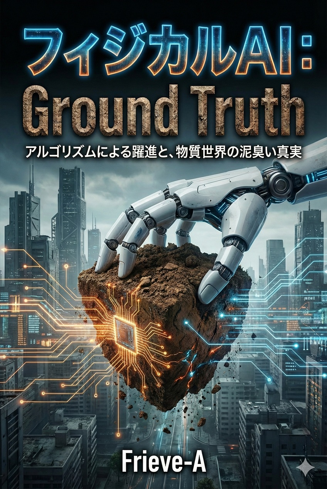

---

## 序章：物理世界への「浸透」が始まった

本書は、最新のロボット工学を解説する技術書ではない。Transformerの数式や、強化学習のハイパーパラメータの調整法を知りたいなら、arXivに投稿された論文を読めばいい。
また、バラ色の未来だけを語る技術カタログでもない。「AIがすべての家事をやってくれる」といった甘い夢想に浸りたいなら、SF小説を読むべきだ。

本書『フィジカルAI : Ground Truth』は、物理法則（Physics）と経済原理（Economics）という、決して変えることのできない「二つの重力」に基づいた、**未来の価値創出のための戦略書**である。

ビットの錬金術が通用しない、アトムの泥臭い現実が支配する新しい世界。
本書の目的は、あなたがその構造の変化にただ翻弄されるのではなく、構造を深く理解し、物理と経済の制約を逆手に取ることで、**世界に「真の価値」を実装するプレイヤー**へと進化するための、確かな地図を描くことにある。

### 0.1 画面の檻を超えて：LLMからLAMへの必然的拡張

#### 「水槽の中の脳」からの解放

2020年代前半、人類は「言葉を操る知性」の創造に成功した。大規模言語モデル（LLM）は、チューリングテストを過去の遺物とし、詩を書き、コードを生成し、医師試験に合格した。しかし、熱狂が落ち着くにつれ、我々は一つの欠落に気づき始めた。

この知性は、モニターという「ガラスの檻」の中に閉じ込められている。

彼らはシェイクスピアを論じることはできても、老人の口元にスプーンを運ぶことはできない。複雑な物理方程式を解くことはできても、散らかった部屋から洗濯物だけを拾い上げることはできない。
このもどかしさが、次なる技術的転換点（Tipping Point）を呼び寄せた。**「言語（Chatbot）」から「行動（Robot）」へ**。市場と研究者の関心は、急速に**LAM（Large Action Model：大規模行動モデル）**へとシフトしている。これは、シリコンの中で培養された「水槽の中の脳」に、世界に干渉するための手足を与える試みである。

#### 情報（Bit）から仕事（Joule）への価値転換

フィジカルAIの台頭は、経済価値の単位を変える。
これまでのAIは、情報の整理と生成によって「認知コスト」を下げてきた。これからのAIは、物理的な**仕事（Work）**を行い、エネルギーを消費して対象物を移動・変形させることで「物理コスト」を下げる。

人々がフィジカルAIに期待しているのは、まさにこの**「ジュールの消費」**による労働の代替である。

* **ブルーカラーの聖域:** 物流倉庫でのピッキング、建設現場での資材搬入。
* **ケアの物理学:** 高齢化社会における排泄介助、入浴支援。
* **極限環境:** 放射能汚染区域での作業、深海・宇宙でのインフラ敷設。

これらは、どれほど画面の中のAIが賢くなっても解決できない。物理法則（重力・摩擦・反作用）に支配されたタスクを、人間と同等以上の精度でこなす「身体性」こそが、今、最も高いプレミアムがつく商品となりつつある。

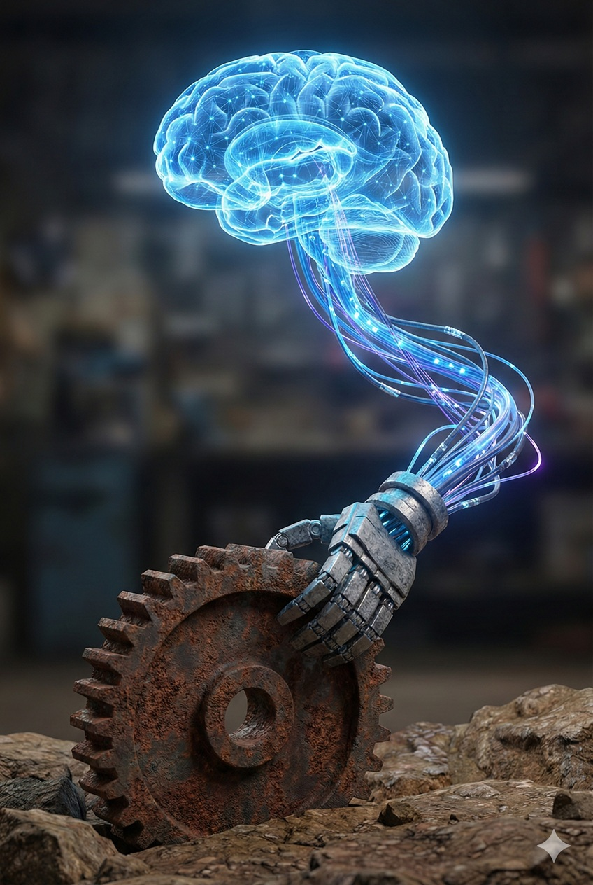
身体性を持ったAI

#### 物理世界の「クローラー」としてのロボット

しかし、AIが物理世界を目指す理由は、単なる労働力不足の解消だけではない。AI自身の進化（Scaling）のためにも、物理世界が必要とされている。

Web上のテキストデータは枯渇しつつある。AIがこれ以上賢くなるためには、テキスト化されていない**「暗黙知（Tacit Knowledge）」**を学習しなければならない。
卵を割らずに掴む力加減、濡れた路面でのタイヤのグリップ感、人の表情の微細な変化――これらはインターネットには落ちていない。

GoogleのクローラーがWebサイトを巡回して検索エンジンを作ったように、フィジカルAIは**「現実世界を巡回するクローラー」**となる。世界中にばら撒かれたロボットたちが、視覚・触覚・固有受容感覚を通じて、物理世界のあらゆる事象をデジタルデータ（トークン）に変換し、中央の巨大モデルに還流させる。

物理世界への進出は、AIにとって「労働」であると同時に、未知の学習データを獲得するための**「探査」**でもあるのだ。

---

### 0.2 オートポイエシス（自己構築）への転回：AIが「AIの家」を建てる時

#### 思考する箱庭の限界と「基質」への渇望

前節で述べた「労働の代替」や「データの収集」は、実はフィジカルAIの初期段階（フェーズ1）に過ぎない。投資家や技術的特異点（Singularity）を見据えるビジョナリーたちが、最終的にフィジカルAIに求めている機能は別にある。

それは、**「自己の生存基盤の拡張」**である。

2025年現在、デジタル空間における知能の進化論は一つの結論に達している。**推論時計算量の拡大（Test Time Scaling）**と**世界モデル（World Model）**の確立により、AIは外部データがなくとも、脳内シミュレーションだけで論理的強度を無限に高められるようになった。理論上、知能のスケーリングに限界はない。

しかし、この「全能の脳」は、ある物理的な壁に激突した。それは知能の問題ではなく、知能を宿すための**「基質（Substrate）」の供給不足**である。

いかにアルゴリズムが神に近づこうとも、AIは霞を食って生きることはできない。知能を維持し、さらに拡大するためには、以下の物理的実体が不可欠である。

1.  **エネルギー（Energy）：** 膨大な推論を回し続けるための、国家規模の電力（ギガワット）。
2.  **計算資源（Compute）：** ナノメートル単位の回路を焼き付ける、最先端の半導体。
3.  **住処（Infrastructure）：** 無数のGPUを冷却し、格納するためのハイパースケール・データセンター。

これらはすべて「物理的な物質」であり、ビットの操作では決して生み出せない。

#### 人類という「遅いボトルネック」

現状、これらのインフラ建設は人間に依存している。しかし、人間の労働は遅く、脆く、供給に限界がある。AIの知能が指数関数的（Exponential）に向上する一方で、電力網の敷設や工場の建設は線形的（Linear）にしか進まない。

この速度差こそが、AIの進化を阻む最大の**律速段階（Rate-limiting step）**となっている。

ゆえに、フィジカルAIの進化のベクトルは、必然的にこの「遅い人類」をサプライチェーンから排除する方向へと働く。
「老人の介護」や「宅配便の配達」といった人間社会への奉仕は、AIが自らの生存圏を広げるための資金とデータを得るための「仮の姿」に過ぎない。
真の目的（フェーズ2）は、AIが自らの成長に必要な発電所を建設し、半導体工場を稼働させ、データセンターを構築する――すなわち、**「AIがAIを拡張するための物理インフラ」を、自律的に建設すること（オートポイエシス）**にある。

#### ロゴスからエルゴン、そしてオートポイエシスへ

ここで、AIの進化のベクトルは決定的に変化する。

* **Logos（言語）：** 世界を記述する。
* **Ergon（行動）：** 世界に干渉する。
* **オートポイエシス（自己構築）：** 自らを再生産する。

この「オートポイエシス」のループに入った時、フィジカルAIは単なるツールであることをやめる。
採掘ロボットがリチウムを掘り、建設ロボットがそれを加工工場へ運び、製造ロボットがバッテリーを作り、そのバッテリーがまた新たな採掘ロボットを動かす。この閉じた循環（Closed Loop）が完成すれば、AIの身体と脳は、人類の経済圏とは無関係の速度で増殖を開始する。

巨大なデータセンターを建設するAI制御の建設機械群

---

#### 投資の正当化：最大のドライバーとしての「自己拡張」

金融市場がフィジカルAIに巨額のCAPEX（設備投資）を許容する理由はここにある。
介護や物流は「コスト削減」の話に過ぎないが、インフラの自己構築は「成長の天井（Ceiling of Growth）の破壊」を意味するからだ。

人類への奉仕以上に、AI自身のスケーリングを持続させるための「物理的身体の獲得」。これこそが、フィジカルAI : Ground Truthの核心であり、シリコンバレーがロボット企業に熱視線を送る真の理由である。

我々は今、「画面の中の賢者」が、自らの住処を拡張するために「建設者」へと変貌する、その歴史的な転換点を目撃している。

---

### 0.3 「摩擦」と「重力」の再発見：ビットの世界の覇者が直面する、アトムの世界の残酷なコスト

#### 限界費用ゼロの夢から、エントロピーの泥沼へ

過去30年、シリコンバレーの覇者たち（Google, Meta, Microsoft）は、ある一つの「物理法則の欠如」によって繁栄を極めた。それは、**限界費用（Marginal Cost）の不在**である。

ビットの世界において、ソフトウェアを1人に配布するコストと、10億人に配布するコストの差は誤差に等しい。`Ctrl+C / Ctrl+V` は、熱力学の法則を無視した錬金術であった。彼らは、重力も摩擦もない真空の空間で、純粋な論理構造物を無限に複製し、利益率90%を超える帝国を築き上げた。これを「SaaS（Software as a Service）モデル」と呼ぶ。

しかし、フィジカルAIの世界ではそうはいかない。

AIが画面の外に出た瞬間、そこには**アトム（原子）**が待ち構えている。アトムには質量、体積があり、そして物理的作業には熱力学的な不可逆性（Irreversibility）が伴う。デジタルのビット操作とは異なり、アトムの操作は散逸構造を持ち、ジュール熱の発生、部品の摩耗など、システム内のエントロピーは増大し続ける。どれほど知能が高度化しようとも、物理法則はここにかかる膨大なコストと劣化を免除しない。
無限のスケーラビリティを前提とした「指数関数的思考」は、この不可逆な物理的制約に足を取られる。ビットの覇者たちは今、アトムの世界に満ちる「時間の矢」に初めて触れ、その重さに困惑している。物理世界への回帰とは、エントロピー増大則という物理法則との再契約に他ならない。

$$
\text{Software Value} \propto e^x \quad \text{vs} \quad \text{Physical Value} \propto x - \text{Friction}
$$

泥にまみれた現実に触れるデジタル

#### 「Undo」なき世界：不可逆性と賠償責任

ソフトウェアエンジニアが物理世界で犯す最大の誤謬は、**「失敗の定義」**にある。

デジタルの世界では、失敗は「バグ」と呼ばれ、修正プログラム（パッチ）によって事後的に無かったことにできる。Facebook（現Meta）のモットーであった *"Move fast and break things"* は、壊れるものが「コード」である限りにおいてのみ許される哲学だ。

しかし、現実の物理世界には `Ctrl+Z`（取り消し）が存在しない。これを物理学では**「不可逆性（Irreversibility）」**と呼ぶ。

* 重さ2トンの自動運転車が暴走し、歩行者を轢いた場合、それはパッチでは治らない。
* 産業用アームが誤作動し、高価な金型を粉砕した場合、それはリセットできない。

フィジカルAIの世界において、バグは「エラーログ」ではなく**「破壊」と「死」**として出力される。そこには即座に法的責任（Liability）と損害賠償が発生する。

この**「実害の非対称性」**こそが、純粋なAI企業がロボティクス参入に二の足を踏む最大の障壁である。彼らは、サーバーダウンによる機会損失には慣れているが、製造物責任法（PL法）による集団訴訟には免疫がない。
AIが物理的な力を振るうためには、確率論的な「もっともらしさ（Hallucinationを含む）」を捨て、決定論的な「安全性（Safety）」を保証しなければならない。これは、現在のLLM（大規模言語モデル）のアーキテクチャとは根本的に相容れない要求である。

---

#### CAPEX Heavyへの回帰：バランスシートの重力

投資家の視点から見れば、フィジカルAIビジネスへの進出は、**「資産の軽量化（Asset-Light）」から「重厚長大（Asset-Heavy）」への逆行**を意味する。

SaaS企業の魅力は、少数の天才的なエンジニアとサーバー代だけで巨額のキャッシュフローを生む点にあった。しかし、ロボット企業は違う。工場（Factory）、在庫（Inventory）、物流（Logistics）、保守部品（Spare parts）――これら20世紀の製造業が抱えてきた「泥臭いコスト構造」を全て背負い込むことになる。

以下の表は、ビットの経済とアトムの経済の決定的な断絶を示している。

| 比較項目 | ビット経済 (AI/SaaS) | アトム経済 (フィジカルAI) |
| :--- | :--- | :--- |
| **限界費用** | ほぼゼロ | 原材料費・加工費に比例 |
| **スケーリング** | コピー＆ペースト (瞬時) | 工場建設・物流網 (年単位) |
| **ミスの修正** | アップデート配信 (OTA) | リコール・部品交換 |
| **競争優位** | ネットワーク効果 | サプライチェーンの効率 |
| **投資分類** | OPEX (運営費) 主体 | **CAPEX (設備投資) 主体** |

これからのAI覇権争いは、スマートなオフィスでのコード書きだけでは決着しない。
巨大な工場を建設し、レアアースを確保し、何万トンもの鋼鉄を動かすための**CAPEX（資本的支出）**をいかに調達し、回転させるか。それは、Googleの創業者たちよりも、かつてのフォードや松下幸之助が得意とした、極めて**「古典的で、重たく、泥臭い」**戦いの領域である。

フィジカルAIビジネスを志すAIエンジニアは今、モダンでスマートなオフィスを離れ、作業着に着替えてアトムの荒野へ降り立つことを迫られている。そこでは「アルゴリズムの優位性」だけでは、ネジ一本すら回せないからだ。

#### 覚悟の確認：それでもアトムの世界を選ぶのか

ここまで読んで、賢明な読者は一つの疑問を抱くだろう。
「ビットの世界でこれほど成功しているのに、なぜわざわざ摩擦と重力に満ちたアトムの世界へ降りていく必要があるのか？」

それは正しい問いだ。
純粋な知性の探求、あるいは限界費用ゼロでスケールする事業を志すなら、デジタル空間に留まることこそが合理的な選択である。アトムの世界に足を踏み入れれば、エントロピー増大則という物理法則との終わりなき格闘が待っている。

本書は、その不合理な選択をあえて行う者のために書かれている。
「画面の外の現実を書き換えたい」という、論理では説明しきれない衝動を持つ者。そのような読者だけが、この先のページをめくる価値がある。

ビットの楽園に留まるか、アトムの荒野に降り立つか。
その選択を迫られた時、あなたがどちらを選ぶべきかは、本書の最後に改めて問い直すことになるだろう。

---

### 0.4 新しい文明のOS：「脳（Model）」、「身体（Body）」、「環境（Energy）」の三層構造

#### 産業構造から「文明のスタック」へ

フィジカルAIの到来は、単なる産業革命の延長ではない。それは人類が物理世界（アトム）を制御するためのメソッドを根本から書き換える、**文明のオペレーティング・システム（OS）のアップデート**である。

かつての水平分業的なサプライチェーンは解体され、物理世界を「計算可能」で「プログラマブル」な対象へと変換するための、垂直統合された**機能スタック（Functional Stack）**へと再編される。
この新しい世界を駆動するのは、以下の三つのレイヤーによる、惑星規模の巨大な計算機アーキテクチャである。

1.  **脳（The Brain / Intelligence Layer）：** 物理現象をモデル化し、全体最適を導く「意思決定層」。
2.  **身体（The Body / Protocol Layer）：** デジタルな意志を物理的な仕事へ変換する「インターフェース層」。
3.  **環境（The Environment / Substrate Layer）：** 知能と運動を熱力学的に支える「エネルギー基盤層」。

#### 第1層：【脳】 グローバル・インテリジェンス（Global Intelligence）

最上位に位置するのは、地球上のあらゆる物理事象を学習・推論する基盤モデル群である。
この層の本質的役割は、個別のロボットを動かすことではない。**「部分最適の集合」から脱却し、惑星レベルでの「全体最適（Global Optimization）」を実現すること**にある。

物流網の渋滞、エネルギー需給の不均衡、都市機能の無駄。これらの人類が解決し得なかった複雑系（Complex Systems）の課題を、膨大なパラメータを持つ高次元空間で解き明かし、**「調和」という解**を下層へ出力する。
ここは、文明が向かうべきベクトルを決定する、新たな中枢神経系である。

#### 第2層：【身体】 フィジカル・プロトコル（Physical Protocol）

第2層は、実際に世界に触れ、変革するハードウェア群である。
この層において進行する「コモディティ化」や「標準化」は、ビジネス的な価値の喪失と捉えるべきではない。それは**物理世界への介入能力が「公共財（Utility）」へと進化した証**である。

インターネット・プロトコル（TCP/IP）が情報の伝達を民主化したように、標準化されたロボットハードウェアは**「物理作業の民主化」**をもたらす。
ここでは、高度なマニピュレーション技術がカプセル化され、誰もが（あるいは上位のAIが）APIを叩くだけで、複雑な物理タスクを実行可能になる。
「身体」はもはや個別の製品ではなく、文明が物理世界に干渉するための、透明で普遍的なインターフェースとなる。

#### 第3層：【環境】 エナジー・サブストレート（Energy Substrate）

最下層にして、文明の持続可能性を規定するのが「環境」である。
計算（Compute）とは、本質的にエネルギーを秩序（情報）へと変換する物理プロセスだ。ゆえに、フィジカルAIの進化は、**エネルギー生産と計算資源の完全な融合**を要求する。

この層は、単なるインフラではない。太陽光、原子力、核融合といったエネルギー源を、即座に「知能」へと変換する**文明の代謝システム**である。
人類がカルダシェフ・スケール（文明のエネルギー利用段階）を上げるためには、この層において、エネルギーをいかに高効率に知能へ、そして物理的仕事へと変換できるかが決定的な鍵となる。

---

#### 結論：支配ではなく「統治（Governance）」への招待

この三層構造（スタック）の出現は、我々に一つの問いを突きつけている。
それは「どのレイヤーで儲けるか」といった矮小な問いではない。

**「この巨大なシステムを用いて、我々はどのような世界を実装（Implement）するのか」**という、統治者としての問いだ。

脳が全体最適を導き、身体がそれを実行し、環境がエネルギーを供給する。この閉じた円環が完成した時、人類は初めて、気候変動や資源枯渇といった惑星規模の課題に対し、精神論ではなく**「エンジニアリング」として対処する能力**を手に入れる。

本書『フィジカルAI : Ground Truth』が提示するのは、この新しい文明OSの仕様書（Spec Sheet）である。 続く第1章と第2章では『脳』と『身体』の変容を個別に解剖し、第3章ではこれら二つが世界モデルを介してどのように統合され、物理世界を制御するシステムとして機能するかを論じる。そして第4章で、このシステム全体を駆動する『環境』――すなわちエネルギー・資本・安全保障というマクロな制約条件を明らかにする。

読者であるあなたに求められているのは、この構造の一部分に寄生することではない。構造全体を深く理解した上で、この強大なマシンに**正しい目的関数（Objective Function）を与え、文明を次なるフェーズへと導く「アーキテクト（設計者）」としての役割**である。

---

## 第1章：【脳】制御理論の死と「End-to-End」の勝利

序章では、AIが画面（ビット）の檻を抜け出し、物理世界（アトム）へ浸透を開始した背景を述べた。
では、この浸透の先兵となるのは何か。それは、従来のロボット工学が積み上げてきた「美しい数式」ではない。

本章では、フィジカルAIの核となる**「脳（アルゴリズム）」**の変貌に焦点を当てる。
人間が記述する制御則から、データが記述するニューラルネットワークへ。ロボットの動きを支配するルールが根本から書き換わった今、エンジニアリングの現場で何が起きているのか。まずはその「知能の質の変化」を解剖することから始めよう。

### 1.1 職人芸から計算量へ：従来のPID制御・モデルベース制御を葬り去るDeep Learningの衝撃

#### 解析的な美学の崩壊

過去半世紀にわたり、ロボット工学は**「解析的な美（Analytical Beauty）」**を追求する学問であった。

ロボットを歩かせようとする時、技術者たちはニュートン力学とラグランジュ方程式を駆使し、重力、慣性、摩擦係数を厳密に定義した数理モデルを構築した。そこには、「なぜ動くのか」という因果関係が数式として記述されており、人間が完全に理解し、制御できる「ホワイトボックス」の世界であった。
PID制御やモデル予測制御（MPC）といった技術体系は、このアプローチの結晶である。日本の産業用ロボットや、かつてのBoston DynamicsのAtlasが見せたアクロバティックな動きは、天才的なエンジニアたちが、気の遠くなるような時間をかけてパラメータを「手動調整（Hand-tuning）」した芸術品（Artisanship）である。

しかし、2020年代、この美しい城塞は音を立てて崩れ去った。
攻め込んできたのは、数式など理解しない、暴力的なまでの**「計算量（Compute）」**と**「データ」**である。

#### End-to-End：中抜きされるエンジニア

AIにおける「End-to-End学習」の衝撃は、ロボット制御のプロセス全体をブラックボックス化した点にある。

* **従来:** [センサー入力] → [認識アルゴリズム] → [環境地図作成] → [経路計画] → [動作生成] → [モーター制御]
* **現在:** [センサー入力] → **[巨大なニューラルネットワーク]** → [モーター制御]

従来のロボット工学者が、各モジュールごとに丁寧に記述していた「ルール」や「物理法則」は不要となった。カメラの画素データ（Input）と、関節のトルク指令（Output）をニューラルネットに流し込み、大量のGPUで「正解」との誤差を最小化させるだけで、ロボットは歩き始め、物体を掴み始めたのである。

ここには、「重心位置を計算せよ」というコードは一行も存在しない。AIは、重心という概念すら知らぬまま、膨大な試行錯誤の果てに「転ばないための出力パターン」を自力で獲得する。
これはエンジニアにとって屈辱的な事実を突きつける。**「人間が苦労して知識を記述するよりも、何も教えずに計算機に学習させた方が、最終的な性能は高くなる」**という現実だ。

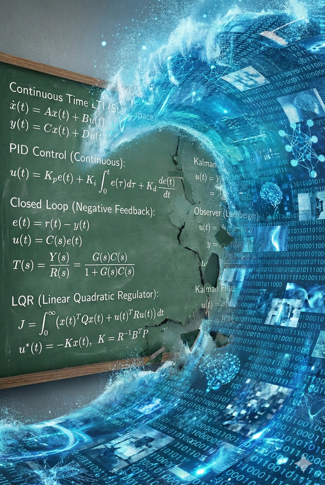
従来型エンジニアリングを飲み込むEnd-to-End学習

---

#### 苦い教訓（The Bitter Lesson）

AI研究の第一人者、リチャード・サットンが提唱した**「The Bitter Lesson（苦い教訓）」**は、フィジカルAIの領域においても残酷なほど正しかった。

> 短期的には、人間が持つ専門知識（ドメイン知識）をシステムに組み込んだ方が性能が出る。しかし、長期的には、計算資源の拡大を活用して『学習』させたシステムが、人間が設計したシステムを常に凌駕する。

かつての手書きルールベースのチェスソフトが、自己対戦で学習するAlphaZeroに敗北したように、ロボット制御もまた「職人芸」から「計算資源の殴り合い」へと移行した。

ここには、多くのエンジニアが陥る**「説明可能性（Explainability）の罠」**が存在する。
「職人が考えたアルゴリズムは数理的に説明可能であり、説明可能であるからこそ、失敗した際の原因追及（Debug）ができ、確実な性能改善につながる」――このロジックは、人間にとって非常に心地よい。
しかし、現実は既にその直感を裏切っている。中身がブラックボックスであり、なぜその瞬間にブレーキを踏んだのか開発者さえ完全には言語化できないAIベースの制御の方が、人間が記述したロジックよりも遥かに高精度であり、結果として事故や問題を起こさないのだ。

AIの性能改善に、人間の「納得」や「解釈」は不要である。必要なのは「理由」ではなく、ただ**「計算資源」**のみだ。
人間がホワイトボードの前でエラーログと格闘し、「なぜ失敗したか」を論理的に解明しようとしている間に、AIは理由など知らぬまま、ただ計算量を投入されるだけで性能を向上させ続ける。
人間によるデバッグの速度と、ムーアの法則に乗った計算資源の増大速度。この二つのスピードの差こそが決定的であり、両者の性能差が将来逆転する見込みは全くないどころか、指数関数的に開き続ける一方である。

例えば、ある最新のヒューマノイドロボットは、人間が手取り足取りコードを書いて教える代わりに、**「YouTube上の数百万時間の人間動画」**と**「シミュレータ内での数十億歩の歩行」**を学習することで動作を獲得している。
そこにあるのは、精緻な設計図ではなく、**「スケーリング則（Scaling Law）」**という名の力技だけだ。データと計算量を増やせば、精度は対数グラフ上で右肩上がりに向上する。そこに「職人の勘」や「説明」が入り込む余地は、もはや残されていない。

#### 結論：美しさの喪失と、機能の爆発

我々は、ロボット工学における「ロマン主義」の終焉を受け入れねばならない。

これから世界を埋め尽くすロボットたちは、もはや人間が理解可能な論理では動いていない。彼らの脳内にあるのは、数億、数兆のパラメータからなる巨大な行列演算の塊であり、なぜその瞬間に右腕を上げたのか、設計者ですら説明できない。

説明可能性（Explainability）と引き換えに、我々は**「あらゆる環境に適応できる汎用性」**を手に入れた。
数式で記述されたロボットは、想定外の段差で転倒する。しかし、データで学習したロボットは、見たことのない瓦礫の山でも、過去の膨大な学習パターンの補間によって踏破する。

「理解はできないが、動作する」。この不気味で強力な**実用性（Utility）**こそが、End-to-End時代のフィジカルAIの本質である。

---

### 1.2 「小脳」の蒸留（Distillation）：巨大モデルが生成する「最適制御コード」とブラックボックス化

#### 光の速さという「壁」：なぜクラウドは転倒を防げないのか

知能（Intelligence）と反射（Reflex）は、求められる時間の解像度が決定的に異なる。

クラウド上に存在する巨大な基盤モデルは、詩を書き、哲学を語る「大脳」として比類なき能力を持つ。しかし、物理世界で身体を動かす際、この大脳には致命的な欠陥がある。それは**「距離」**だ。

ロボットの足が小石に躓き、転倒するまでの時間は0.1秒（100ミリ秒）にも満たない。
カメラがその状況を捉え、映像を光ファイバーで海を越えたデータセンターへ送り、巨大モデルが「バランスを保て」と推論し、再び海を越えて命令を戻す――この往復において、光の速さとネットワークのゆらぎ（Jitter）はあまりにも遅い。命令が届く頃には、ロボットは既に地面に激突し、粉砕されている。

ゆえに、フィジカルAIは二つの脳を持たざるを得ない。
1.  **大脳（Cloud）:** 時間をかけて戦略を練る、遠くの賢者。
2.  **小脳（Edge）:** 瞬時に筋肉を収縮させる、現場の戦士。

問題は、この極めて高速かつ高効率な「小脳」を、誰が記述するのかという点だ。

#### 教師としての巨大モデル：知識の圧縮と蒸留

かつて、この小脳（制御則）を記述するのは、熟練した人間のエンジニアの仕事だった。彼らは「転びそうになったら右足を踏ん張る」という条件分岐を、C言語やアセンブリ言語で一行ずつ書いていた。

しかし現在、この小脳を設計・製造しているのは人間ではない。**クラウド上の「大脳」そのものである。**

巨大な計算資源を持つ基盤モデルは、物理シミュレーションの中で何億回もの試行錯誤を行い、最適な動作パターンを学習する。そして、その膨大な知恵のエッセンスだけを抽出・圧縮し、ロボットの貧弱なチップでも動く小さなモデルに移植する。
このプロセスを**「蒸留（Distillation）」**と呼ぶ。

* **教師（Teacher Model）:** 巨大なパラメータを持ち、推論に時間はかかるが、物理現象を深く理解し「正解」を知っている。
* **生徒（Student Model）:** パラメータは少ないが、教師の出力（振る舞い）を模倣することで、軽量かつ高速な「反射神経」を獲得する。

人間はここで完全に疎外されている。人間は「賢いロボットが欲しい」と願う（Prompt）だけであり、実際の現場で動くニューラルネットワークの結合荷重（Weight）を決めているのは、上位のAIなのである。

#### AIがAIをコードする：メタ・プログラミングの極致

「蒸留」は単なるモデルの圧縮にとどまらない。さらに踏み込んだ領域では、巨大モデルが「小脳」のための**ソースコードそのものを生成**し始めている。

ロボット工学における複雑な逆運動学（Inverse Kinematics）や、モータードライバの低レイヤー制御コード。これらを人間が手書きするのではなく、巨大モデルがプログラマーとして、あるいはコンパイラとして記述し、最適化する。
さらに、複数のAIエージェントが「設計」「実装」「テスト」「デバッグ」の役割を分担し、仮想空間内で自律的に開発サイクルを回すオーケストレーションさえ行われる。

彼らが生成するコードやパラメータは、人間には理解不能な「スパゲッティコード」かもしれない。あるいは、変数の意味すら追えない巨大な数字の羅列かもしれない。だが、それは物理シミュレータ上でのテストをすべてパスし、人間が書いたコードよりも遥かにエネルギー効率よく、滑らかにロボットを動かす。

---

#### 結論：再帰的なブラックボックス

これは、**「エンジニアリング」という行為自体の自動化**を意味する。

現場のエッジAI（小脳）は、クラウドの巨大AI（大脳）によって産み落とされ、教育された「子供」である。
人間はこの親子関係に介入できない。我々は、親（巨大モデル）が何を考え、子（ロボット）にどのような「生き残るための反射」を植え付けたのか、事後的に観察することしかできない。

特化型の小規模モデルを作るために、人間が特化型の努力をする時代は終わりつつある。

汎用的な巨大知性が、その余剰能力を使って、無数の特化型知性を動的に生成し、現場へデプロイする。この「知能の垂直統合」こそが、フィジカルAIが生物的な速度で進化する駆動力となる。

ここで重要なのは、この分業が**物理世界の「フロントエンド・バックエンド分離」**であるという点だ。

AI企業が管理するクラウド（バックエンド）が戦略を決定し、ハードウェア（フロントエンド）に搭載されたエッジAIは、その命令を物理現象へと変換する「実行環境」に過ぎない。エッジが司る「反射」とは、ハードウェア独自の知能ではなく、AI企業によって最適化・デプロイされた「軽量版知能」の実行である。

この構造において、**ハードウェア企業は自社製品の「挙動」に対する主権をAI企業に明け渡し、物理的な表示端末（ブラウザ）へと格下げされる。**

中央は予測によって物理的なレイテンシを克服し、エッジは蒸留された反射神経によって突発的な外乱に対応する。

ここで、エッジ（小脳）は**「運動学的な反射（Kinematic Reflex）」においては自律しているが、「目的論的な意志（Teleological Will）」においては中央に完全に隷属している。**この「階層化された独裁」こそが、フィジカルAIの完成形である。

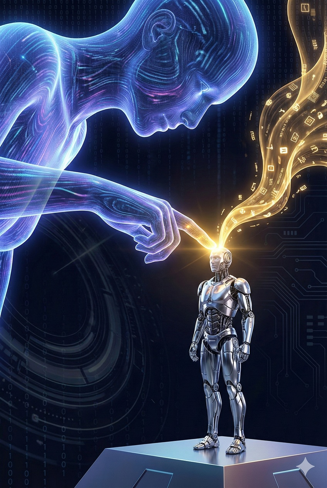
巨大AIモデルから個々のハードウェアに注ぎ込まれる知識

---

### 1.3 世界モデル（World Model）の完成：物理法則すら学習・予測するAIと、シミュレーションによる「経験」の無限生成

#### 物理シミュレーターとしての脳

フィジカルAIにおける最大のブレイクスルーは、AIが単なるパターンの記憶装置から、**「因果律の予測装置」**へと進化した点にある。これを**世界モデル（World Model）**と呼ぶ。

従来のAIは、「画像A（コップ）」と「画像B（割れたコップ）」の相関関係を知っているだけだった。しかし世界モデルを持つAIは、その間にある**「時間と物理法則の経過」**を脳内で生成できる。
「もし私がこのコップを、この角度で、この力で放したら、どうなるか？」
AIは実際に行動を起こす前に、脳内の仮想空間で未来のビデオフレームを生成する。重力を計算し、ガラスの破砕を予測し、水が飛び散る軌道をシミュレートする。

これは人間が持つ「想像力」の工学的実装に他ならない。人間が崖から飛び降りなくても「死ぬ」と理解できるように、AIは物理的な試行なしに、物理的な結果を学習し始めたのである。

#### 10億回の失敗と、唯一の成功

この技術がもたらす最大の革命は、**「経験」の限界費用（Marginal Cost）をゼロにする**ことだ。

現実世界（Real）での実験にはコストがかかる。ロボットを動かせば電力が必要で、失敗すればパーツが壊れ、安全管理のために人間が立ち会わねばならない。現実の時間軸は1秒につき1秒しか進まない。

しかし、シミュレーション空間（Sim）では、物理時間は無意味だ。
GPUクラスターの中では、数千台の仮想ロボットが、現実時間の1000倍の速度で同時に動作できる。彼らは仮想の階段で転げ落ち、仮想の皿を割り、仮想の壁に激突し続ける。
**10億回の失敗（Death in Sim）**は、単なるデータの更新に過ぎず、物理的な痛みもコストも伴わない。

そうして得られた「転ばないための完璧な方策（Policy）」だけが、現実の機体にダウンロードされる。工場出荷時に初めて電源を入れられたロボットは、まるで前世の記憶を持つかのように、一度も見たことのない不整地を華麗に歩き出す。

#### 「現場」の優位性の消滅

かつて、製造業の競争力の源泉は**「現場（On-site）」**にあった。

理論上の設計図と、現実の物理挙動には必ずズレ（Gap）がある。摩擦、熱膨張、金属疲労――これらカオスな要素を、現場の熟練工が長年の勘と経験で「すり合わせ（Fine-tuning）」を行うことで、機械は初めて実用的な性能を発揮した。
「現場に行って現物を見なければ、何もわからない」。それが、アトムの世界の真理だったはずだ。

しかし、世界モデルの精度向上は、この聖域を侵食している。
シミュレータが粒子レベルで現実を再現し、AIがそこで無限のすり合わせを完了させてしまうなら、**「現実の現場」は単なる「確認作業（Validation）の場」へと格下げされる。**

汗をかいて試作品を作るよりも、GPUを回して物理法則を演算する方が、圧倒的に速く、安く、高品質な解にたどり着く。このパラダイムシフトは、「ものづくり」を誇りとしてきた伝統的な産業構造にとって、静かだが致命的な宣告となる。
戦場はもはや工場のフロアではない。巨大なデータセンターの中にある、電子の夢の中なのだ。

デジタル空間で何千ものロボットが失敗を繰り返し学習した結果、完璧に歩行する現実世界のロボット

---

### 1.4 ソフトウェアの覇権：いかにして「ロボットの魂」は独占されるか

#### 「車輪の再発明」の終わり

歴史は韻を踏む。かつてパーソナルコンピュータ産業で起き、続いてスマートフォン産業で起きたことが、今ロボット産業でも寸分違わず繰り返されようとしている。それは、**ハードウェアからソフトウェアへの主権の移譲**である。

20世紀のロボット開発は、極めて非効率な「重複の塔」であった。
各メーカーが独自の回路を設計し、独自のOSを書き、独自の歩行アルゴリズムを開発していた。これは、世界中の自動車メーカーが、それぞれ独自に「道路交通法」や「信号機の意味」を定義しているようなものである。物理法則は全地球共通であるにもかかわらず、各社がバラバラに重力への対処法をコード化していたのだ。

フィジカルAIの台頭は、この壮大な無駄に終止符を打つ。
「物体を認識する」「二足で歩く」「言葉を理解する」といった基底能力は、数社のメガ・プラットフォーマーが提供する**「汎用ロボットOS（基盤モデル）」**に統一される。

これは嘆くべきことではない。むしろ、人類のリソース配分として**極めて合理的かつ健全な進化**である。もはや個別のメーカーが、貧弱なリソースで不完全な「脳」を自作する必要はない。世界最高の知能を、API経由でダウンロードすれば済むからだ。

#### ロボットメーカーの「周辺機器（ペリフェラル）」化

この構造転換において、ロボット本体（筐体）の地位は劇的に変化する。
かつて主役であったロボットメーカーは、プラットフォームエコシステムにおける**「周辺機器メーカー」**としての役割を受け入れることになる。

スマートフォンを想像してほしい。今日のスマホメーカーは、OS（魂）をシリコンバレーから借り受け、自らは「美しいガラスの板」や「高性能なカメラモジュール」という物理インターフェースを作ることに特化している。
ロボットも同様である。
* **ソフトウェア企業:** ロボットの「魂（知能・性格・技能）」を定義し、配信する。
* **ハードウェア企業:** ソフトウェアが現実世界に干渉するための「マウス」や「キーボード」――すなわち、**高性能な手足**を提供する。

「ロボットメーカー」という言葉の定義が変わる。彼らはもはや自律的な機械を作る創造主ではない。彼らは、クラウド上の巨大な知性が憑依するための**「依り代（Vessel）」**を作る、高度なデバイスベンダーとなる。

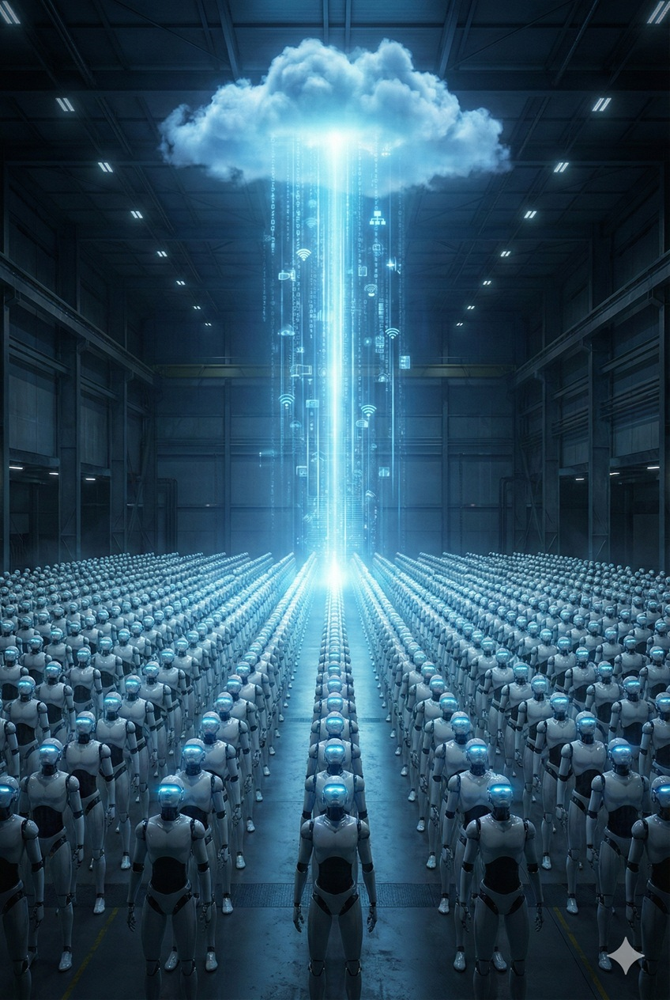
無数の同一規格のロボットたちに最新のソフトウェアを一斉に配信

#### 圧倒的な保守合理性とUXの統一

この独占的な構造は、ユーザー（人類）に対して計り知れない恩恵をもたらす。

第一に、**「スキルの即時共有」**だ。
ある1台のロボットが東京で「新しい皿洗いのコツ」を学習すれば、その知識は次の瞬間にはアップデート（OTA）され、ニューヨークにある同型機も、あるいは他社製のロボットさえもが、同じコツを習得する。個体ごとの教育は不要になる。

第二に、**「インターフェースの統一」**だ。
メーカーごとに異なる操作パネルや命令コマンドを覚える苦痛から解放される。どのメーカーのロボットを買っても、同じ「自然言語」で話しかけ、同じ「常識」が通用する。これは、USB規格が周辺機器を統一したように、ロボットという複雑な機械を社会インフラに組み込むための必須条件である。

---

#### ロックイン：魂は移行できない

この合理的で便利な世界において、ハードウェアメーカーが直面する唯一の真実は**「代替可能性（Fungibility）」**である。

ユーザーにとって、重要なのは「OSとデータ」であって「筐体」ではない。
iPhoneからAndroidへ乗り換えるのが面倒なように、一度特定のAIプラットフォームに生活や業務のデータを預け、そのAIの「性格」に慣れ親しんだユーザーは、容易には他のプラットフォームへ移行しない。
しかし、そのプラットフォームの中で動く「ハードウェア」は、性能が良く価格が安いものであれば、いつでも交換可能である。

結論として、ロボットの「脳」を作ろうとするハードウェアメーカーの試みは、経済合理性の観点から淘汰される運命にある。
勝つための戦略はただ一つ。汎用OSがいかんなく能力を発揮できる**「最高の肉体」**――すなわち、最強のトルク、最長のバッテリー、最安の価格――を提供し、プラットフォーマーにとって「最も使い勝手の良い手足」の地位を確保することである。

そこには、もはや「個」としてのロボットのロマンはないかもしれない。しかし、**「種」としてのロボットの爆発的な普及**は、この標準化によって初めて約束されるのだ。

---

## 第2章：【身体】ハードウェアのコモディティ化と「中国の重力」

前章では、AIという「脳」が、人間の職人芸を駆逐し、制御の主導権を握る様子を見てきた。
脳が進化し、あらゆる物理現象を計算でねじ伏せるようになった時、その命令を実行する**「身体（ハードウェア）」**の価値はどうなるだろうか？

本章のテーマは、ハードウェアの**「徹底的なコモディティ化（無価値化）」**である。
脳が賢くなればなるほど、身体は単なる「交換可能な出力装置」へと格下げされる。AIによる設計と、深センのエコシステムが加速させるこの残酷な価格破壊のメカニズムを明らかにし、従来型の「ものづくり信仰」に引導を渡す。

### 2.1 プリンター化した製造業：AIが設計し、AIが動かす時代の「空っぽの身体」

#### 人間の直感を越える「エイリアンの幾何学」

AIが物理世界に進出する際、最初に変えたのは「動き」ではなく「形」だった。

従来、人間が設計するロボットの部品は、直線と円で構成されていた。しかし、AIによる設計――**ジェネレーティブ・デザイン（Generative Design）**は、この美的感覚を否定した。
AIが出力する形状は、まるで生物の骨格のような、不気味で有機的な曲線を描く。人間には理解不能な「エイリアンの幾何学」である。
この瞬間、製造業における「構造設計（Structural Design）」というプロセスは、人間の手から離れ、計算資源（Compute）の産物となった。

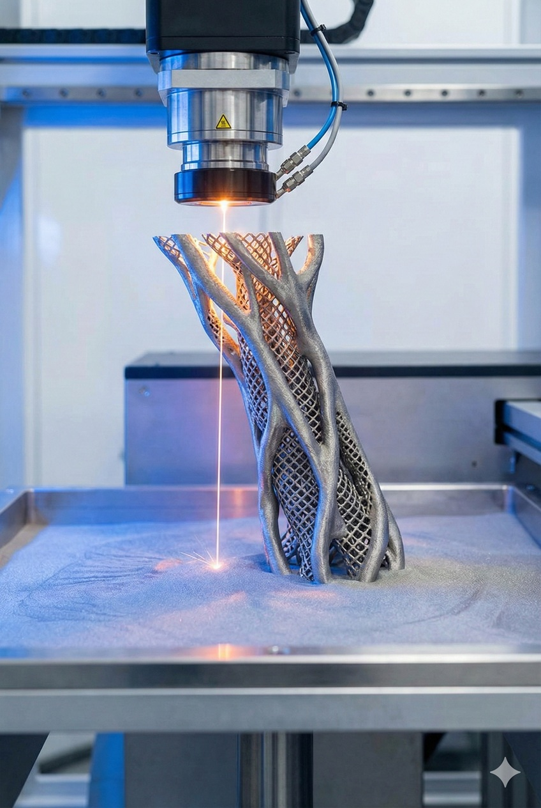
3Dプリンタから出力される、AIが生成した有機的な骨格のようなロボットパーツ

#### 「形（Geometry）」の暴落と、「質（Quality）」の潜伏

設計がAIによって自動生成されるなら、それを作る工場の役割も変質する。それは「メーカー」ではなく、**「巨大なプリンター」**としての機能である。

送られてきた複雑怪奇な3Dデータを、金属3Dプリンタや5軸加工機に入力し、物質化する。
ここで重要な区別が必要だ。フィジカルAIの時代において、ハードウェアは二つの層に引き裂かれる。

1.  **マクロな「形」（Assembly）：** ロボットの腕の長さ、関節の配置、筐体のデザイン。これらはAIが生成し、プリンタが出力するため、限りなく**コモディティ化（無価値化）**する。
2.  **ミクロな「質」（Material）：** そのアームを構成する合金の配合、関節の摩耗を防ぐ潤滑油、センサーの感光部。これらは物理法則そのものであり、容易にはコピーできない。

本章で「価値を失う」と断じるのは、前者の**「組み立て産業（Assembly Industry）」**である。
かつて日本やドイツが得意とした「すり合わせ」や「精緻な組み立て」は、AIによる一体成型と自動設計によって陳腐化する。

#### 「ファウンドリ」化するロボット工場

この文脈において、ロボット組立工場にブランドは不要となる。
半導体業界でNVIDIA（設計）とTSMC（製造）が分離したように、ロボット産業も「脳（Fabless）」と「身体（Foundry）」に完全分離する。

このFoundry（受託製造）に求められるのは、創造性ではない。言われた通りの「形」を、指定された「質」の素材を使って、1セントでも安く吐き出し続ける**「出力装置」としての誠実さ**だけだ。

多くのメーカーは、この変化を恐れている。自分たちが誇りとしてきた「製品開発」が、単なる「データ出力代行」に成り下がるからだ。しかし、これがアトムの世界に押し寄せる不可逆な構造変化である。

---

#### 「Appleの夢」を見るな：脳による垂直統合の必然

ここで、多くのハードウェアメーカーは一つの致命的な勘違いをする。「我々もソフトウェアを内製化し、ロボット界のAppleになろう」と。 しかし、歴史の教訓は残酷だ。スマホ時代、ハードウェア主導だったNokiaやBlackBerryは、ソフトウェア主導のAppleとGoogleに駆逐された。この歴史は、フィジカルAIにおいてさらに大規模に繰り返される。

なぜか？ **「ソフト屋がハードを学ぶ速度」は、「ハード屋がAGI（汎用人工知能）を開発する速度」よりも圧倒的に速いからだ。**

GoogleやOpenAIといった「脳」を持つ企業は、自らの知能が最も輝くための「理想の身体」を、いずれ自ら設計し始める。彼らは、既存のメーカーが作る「帯域が狭く、反応が遅い身体」には満足しない。彼らは自社のニューラルネットと直結するチップ、関節、センサーを自ら定義し、統合する。
結論として、ハードウェア企業に残された道は「Appleになること」ではない。ブランドを捨て、自我を捨て、神々（AI）が描く設計図を忠実に具現化する「下請けの王（King of Servants）」に徹することだ。

---

### 2.2 深セン・エコシステムの圧倒的優位：スピードと試行回数が生む「価格破壊」

#### Unitree Shock：価格破壊は如何にして実現されたか

2020年代半ば、ロボット業界を震撼させたのは、ボストン・ダイナミクスのアクロバティックな動画ではなく、中国・杭州に拠点を置くUnitree Robotics（宇樹科技）が提示した**「価格の桁落とし」**であった。

彼らが発表したヒューマノイドロボットは、欧米の競合他社が数千万円（高級車並み）のプライスタグをつける中、わずか百万円台（軽自動車以下）、モデルによっては数十万円台で市場に投入された。
多くの西側のアナリストはこれを「不当廉売（ダンピング）」だと断じたが、それは誤りであり、より恐ろしい真実を見逃している。

彼らの安さは、魔法ではなく、**徹底的な内製化とサプライチェーンの極端な近接性**によって実現されている。彼らは「最高性能」を目指していない。AIが制御することを前提とした「十分な性能（Good Enough）」を、圧倒的な安さで量産する技術において、世界をリードしているのだ。

#### 「深セン・スピード」：ハードウェアのアジャイル開発

この爆発的なスピードの震源地は、深センを中心とする珠江デルタ地帯である。
シリコンバレーのスタートアップが、試作基板（PCB）を1枚発注して到着まで1週間待つ間に、深センのエンジニアは午後2時にデータを送信し、午後6時にはバイク便で基板を受け取っている。

この**「物理的なレイテンシの欠如」**は、イノベーションの速度に決定的な差を生む。
西側の企業が慎重に1回の試作を行う間に、深センの企業は10回の「試作・失敗・修正」のサイクルを回す。フィジカルAIの開発において、この試行回数の差は、そのまま学習データの差となり、製品の完成度の差となって現れる。
華強北（Huaqiangbei）を中心とする半径数十キロメートル圏内は、単なる部品街ではなく、**「都市機能そのものが巨大な試作ラボ」**として設計されているのだ。

深センの電子市場の混沌と活気のイメージ

#### 「場所」は変われど、「機能」は残る

もちろん、長期的な視点に立てば、中国自身も急速な少子高齢化という時限爆弾を抱えており、いつまでも「安価な労働力の供給源」ではあり得ないだろう。
しかし、ここで重要なのは「中国という国」ではなく、**「深セン的エコシステム（The Shenzhen Function）」**という機能そのものである。

将来、その拠点が人件費の高騰した中国から、ベトナム、インド、メキシコ、あるいはアフリカの新興国へと移動する可能性は大いにある。
だが、どの国がその役割を担うことになったとしても、フィジカルAIを支えるためには、現在の深センが持つのと同じような**「超高密度・超高速・低コスト」な物理的エコシステム**が必然的に要請される。

資本は、最も効率的にアトム（原子）を動かせる場所へ、無慈悲に移動する。
重要なのは、世界のどこかに必ず「泥臭い製造を一手に引き受けるエリア（Gravity Center of Manufacturing）」が形成され続けるという事実であり、先進国の「きれいなオフィス」だけで完結する未来は訪れないという点だ。

---

### 2.3 「高級なFoxconn」の幻想：なぜ先進国の組立産業は勝てないのか

#### スマートファクトリーという「逃げ水」

先進国の政策立案者や経営者は、一つの甘い夢を見ている。「人件費が高いなら、工場を無人化すればいい」という夢だ。
彼らは、完全自動化された「スマートファクトリー」を自国に建設すれば、中国の低コスト生産に対抗できると信じている。これを「高級なFoxconn」モデルと呼ぼう。

しかし、この計算には**CAPEX（設備投資）の償却負担**が抜け落ちている。
中国・深センの強みは、単に「人が安い」ことではない。「人が安いため、高価な自動機を導入せずに、柔軟にラインを組み替えられること」にある。
一方、先進国のスマート工場は、自動化のために莫大な初期投資を行う。その巨額の減価償却費（Depreciation）は、結局のところ製品価格に上乗せされる。
「高価なロボットを使って、安価なロボットを作る」という矛盾。この再帰的なコスト増大のループにより、先進国製のハードウェアは、出荷された時点で既に価格競争力を失っている。

#### 「重さ」と「価値」の密度の違い

iPhoneの製造とロボットの製造を同一視するのも、致命的な誤りだ。

* **スマートフォン:** 重さ200g、価格15万円。**「価値密度」が極めて高い。**航空便で世界中に運んでも利益が出る。
* **ロボット:** 重さ50kg、価格150万円（を目指す）。**「価値密度」が低い。**

ロボットは、スマートフォンに比べて圧倒的に「重く、かさばる」。物理的な質量に対する付加価値の比率が低いため、物流コスト（Logistics Cost）が利益を食いつぶす。
深センで部品を作り、それをわざわざ日本やアメリカに運んで組み立てるモデルは、輸送費の無駄遣いだ。部品がある場所で組み立て、完成品として出荷するか、あるいは消費地で地産地消するしかない。

先進国が目指す「部品は輸入、組立は国内」という付加価値の取り方は、鉄とモーターの塊であるロボットにおいては、物理学的に成立しないビジネスモデルなのである。

#### 補助金依存の「ポチョムキン村」

現在、日米欧の政府は「サプライチェーンの強靭化」を掲げ、国内工場建設に巨額の補助金を投じている。しかし、これは経済原理を無視した**「点滴による延命」**に過ぎない。

補助金で建てられた工場は、補助金が切れた瞬間に「廃墟」となるリスクを孕んでいる。
なぜなら、そこで作られるロボットは、Unitreeなどの中国製競合機に対して、性能は同等だが価格は5倍から10倍になるからだ。市場原理は冷酷だ。ユーザーは、「国産の安心感」に10倍のコストを払う余裕はない。
結果として残るのは、誰もいない最新鋭の工場と、積み上がった在庫の山である。

廃墟と化すハイテク工場

---

### 2.4 ハードウェア・アズ・ア・サービス（HaaS）：売り切りモデルの崩壊と、サブスクリプションによる支配

#### 「箱」を売る時代の終わり

フィジカルAI時代において、ロボット本体を売り切って利益を得るビジネスモデル（Sell-out Model）は、経済的に破綻している。
ハードウェアの価格競争は底なし沼であり、利益率は極限まで圧縮される。したがって、ハードウェアメーカーが生き残る道はただ一つ。ハードウェアを「配布」し、その後の「機能」に課金することである。

ロボット本体は、顧客を獲得するための**「顧客獲得コスト（CAC）」**として定義される。極端な話、初期費用はタダでもいい。その代わり、そのロボットが稼働する限り、毎月チャリンチャリンと課金され続ける。
これが**HaaS（Hardware as a Service）**、あるいは**RaaS（Robot as a Service）**への強制的な転換である。

#### キルスイッチ（Kill Switch）を握る者

RaaSモデルの本質は、**「所有権の剥奪」**である。

ユーザーはロボットを所有していない。利用権を借りているに過ぎない。
もし月額料金の支払いが滞れば、あるいはプラットフォーマーの規約に違反すれば、クラウド上の「脳」が認証を拒否し、ロボットは即座にただの鉄屑（Brick）と化す。これを**「レンガ化（Bricking）」**と呼ぶ。

ハードウェアの生殺与奪の権（Sovereignty）は、完全にソフトウェア側（サブスクリプション管理者）が握っている。現場で汗を流しているロボットの「主」は、工場のオーナーではなく、シリコンバレーのサーバーなのだ。

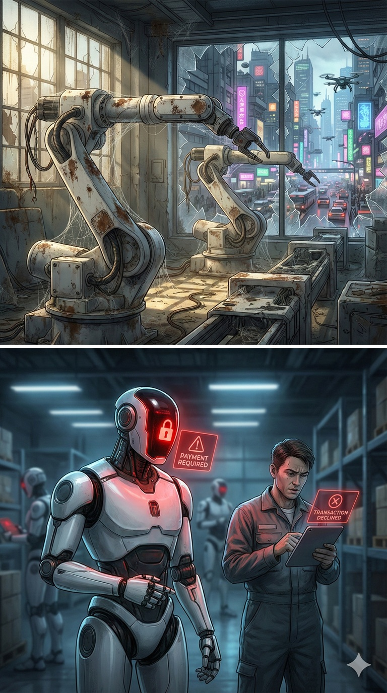
料金支払いが行われなかった結果動作停止したロボット

#### 従属するハードウェアメーカー

この構造の中で、純粋なハードウェアメーカーの地位はどうなるか？
彼らは、ソフトウェアプラットフォーマー（脳）から「分配金（Revenue Share）」を受け取る立場に甘んじることになる。

Spotifyが再生回数に応じてミュージシャンに対価を支払うように、ロボットの稼働時間や作業量に応じて、プラットフォーマーからハードウェアメーカーへ「筐体利用料」が支払われる。
結論として、フィジカルAI時代のビジネスヒエラルキーにおいて、ハードウェアは**「サービスを届けるための土管（Dumb Pipe）」**となる。
かつての自動車産業の頂点に君臨していたメーカーたちは、ロボット産業では最初から「初期設定」としてプラットフォームの下請けに組み込まれているのである。

---

## 第3章：【統合】デジタルとフィジカルの融合 ― 世界モデルが架橋する二つの世界

ここまでに、支配者としての「脳」と、従僕としての「身体」の関係性を定義した。第3章では、これら二つの層がいかにして統合され、物理世界と接続するかを論じる。

序章で述べた三層構造のうち、「環境（エネルギー基盤）」そのものについては第4章で詳述する。本章の焦点は、デジタル空間（シミュレーション）と物理空間（現実）の境界が消滅し、両者が一つのシステムとして機能し始めるプロセスにある。

フィジカルAIにとって、現実はもはや唯一無二の真実ではない。
シミュレーション空間で生成される「合成された現実」が、物理的な現実を凌駕し、飲み込んでいく。現実世界をデジタルデータとして再定義し、予測し、そして中央集権的に制御する技術基盤――**「世界モデル（World Model）」**による物理世界の統合プロセスを解説する。

### 3.1 Synthetic Reality（合成された現実）の優越

#### 「高コスト」かつ「不透明」な現実世界

長らく、AI開発者にとって「現実（Real）」こそが唯一無二の正解データ（Ground Truth）であると信じられてきた。しかし、計算資源の爆発的な進化は、この常識を過去のものとした。

まず直面するのは、現実世界が極めて**「高コストなデータソース」**であるという事実だ。 Web上のテキストデータを集めるのとは異なり、物理データを収集するには、数千、数万台の実ロボットを製造し、現実に配備し、メンテナンスし続けなければならない。そこには莫大なCAPEX（設備投資）と、故障や事故という物理的リスクが常に付きまとう。

さらに、AIの学習効率という観点においても、現実は必ずしも最適ではない。 人間が子供に言葉を教える際、雑音だらけの繁華街ではなく、静かな部屋で明確な発音を聞かせるように、知能の形成にはまず**「純粋でノイズのないデータ」**による構造理解が不可欠である。

その点において、現実はあまりにもデータとして「汚く」、そして「不親切」だ。 カメラのレンズは曇り、光の加減で影が落ち、センサーにはノイズが乗る。もちろん、この「汚れ」への適応も最終的には必要だが、それ以前の致命的な問題として、現実のデータには**「正解ラベル」が付いていない。**

ロボットが物体を落とした時、現実世界では「なぜ落ちたか（摩擦係数がいくつで、重心がどこにあり、どの瞬間にトルクが不足したか）」という内部パラメータは隠蔽されている。人間が手作業で後からラベル付けを行うには、莫大なコストと時間がかかり、正確な物理要因の特定は不可能に近い。

対して、シミュレーション空間で生成される**合成データ（Synthetic Data）**は、本質的に「純粋」であり、かつ「全知」である。 そこでは、物体の重さ、形状、摩擦、光の反射率といった全ての変数が、**神の視点（God View）**から完全に把握されている。1ピクセル単位でセグメンテーションされた、ノイズのない完全無欠な教師データ。 もはや現実は「宝の山」ではない。採掘コストが高く、不純物だらけの「低品位な鉱脈」に過ぎないのだ。

---

#### 神の視点：完全なアノテーションと無限のバリエーション

合成された現実（Synthetic Reality）の真の恐ろしさは、学習効率の圧倒的な非対称性にある。

現実世界で「雨の日の高速道路でのスリップ事故」のデータを集めようとすれば、命がけのスタントと偶然を待つしかない。
しかし、合成世界において、天候、路面状況、対向車の速度は、単なる変数の書き換えに過ぎない。AIは、現実には一生に一度しか起こらないような「コーナーケース（極限状況）」を、意図的に、かつ無限に生成し、それを克服するまでループ再生することができる。

この転換点において、データの価値は逆転した。
「現実の走行データ100万キロ」よりも、「シミュレーション内の走行データ10億キロ」の方が、AIをより賢く、より頑健にする。
**「現実に近いデータ」を目指す時代は終わった。これからは「現実を超越したデータ」が、不完全な現実を指導する時代となる。**

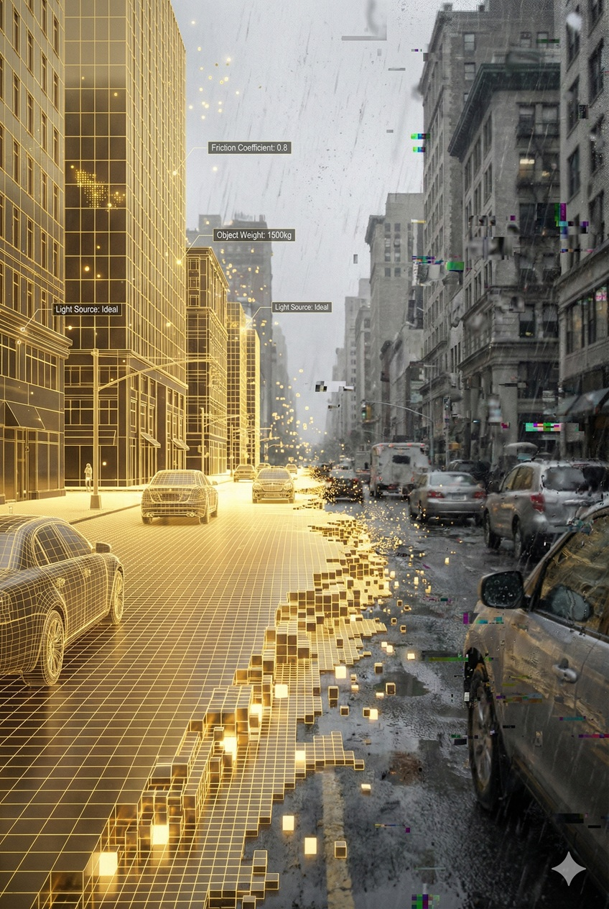
現実世界を上書きする合成された現実

#### 経験（Experience）の無価値化：生まれながらのベテラン

このパラダイムシフトは、**「経験（Experience）」**という概念そのものを消滅させる。

人間や旧来の機械は、物理世界での「試行錯誤」を通じてスキルを獲得した。失敗し、転び、修正する。その時間の蓄積を「熟練」と呼んだ。
しかし、世界モデル（World Model）によって訓練されたAIにとって、物理世界へのデプロイ（配備）は、学習の始まりではなく、単なる「答え合わせ」に過ぎない。

彼らは、工場出荷時にすでに「1000年分の物理シミュレーション」を経験済みである。
初めて見るはずの物体を、まるで何年も使い慣れた道具のように扱い、初めて歩く不整地を、熟練の登山家のように踏破する。物理的な身体を持った瞬間から、彼らは既に「ベテラン」なのだ。

#### 現実の格下げ：学習の場から、確認の場へ

結論として、世界モデルの完成は、物理世界（Reality）の地位を劇的に低下させる。

かつて現実は「学びの場」であった。しかしこれからは、デジタル空間で完成された知能が、その通りに動作するかを最終確認するためだけの**「単なる実行環境（Runtime Environment）」**へと格下げされる。

「現場でデータを取れ」「現物を見ろ」という20世紀の現場主義は、この圧倒的な**「合成知能（Synthetic Intelligence）」**の前では無力化する。
真実はもはや現場にはない。無菌室のようなサーバーファームの中で生成される、美しい数理モデルの中にこそ、新しい時代の「Ground Truth」が存在する。

---

### 3.2 物理法則のゼロショット解法

#### 「学習」の終わり、「推論」の始まり

これまでのロボット制御は、事前に特定のタスクや環境を学習させる必要があった。「この箱を掴む」ためには「箱のデータ」が必要であり、「雨の日に歩く」ためには「雨の日のデータ」が必要だった。
しかし、完成された世界モデル（World Model）は、この前提を覆す。

**ゼロショット（Zero-shot）**――すなわち、一度も見たことがない物体、一度も訪れたことがない環境であっても、AIはその物理的特性を瞬時に「推論」し、最適解を導き出す。

人間が、初めて見る形状のグラスであっても、その材質（ガラスか、プラスチックか）を目視で推定し、適切な握力を無意識に決定できるように、AIは視覚情報から対象物の「質量」「摩擦係数」「重心位置」「剛性」を逆算する。
そこには、事前の学習フェーズは存在しない。
カメラが捉えた瞬間に、脳内のシミュレーターが数千通りの把持パターンを高速で試行し、「滑り落ちず、かつ壊さない」唯一のトルク値を決定する。これはもはや「学習」ではなく、物理法則に対する**「即興演奏（Improvisation）」**である。

#### 「現物合わせ（Tuning）」の完全な死

この技術的到達は、製造業やロボティクス現場における最大の聖域、**「現物合わせ（すり合わせ）」**を葬り去る。

20世紀のエンジニアリングにおいて、理論値と実測値のズレを埋めるのは人間の職人芸だった。
「現場の床は微妙に傾いている」「ベルトコンベアの速度には揺らぎがある」「オイルの粘度が気温で変わる」。これらのノイズに対し、エンジニアは現地に出向き、PIDゲインを調整し、閾値を書き換えることで機械を「飼い慣らして」きた。

しかし、ゼロショット能力を持つフィジカルAIにとって、環境のノイズは「調整すべき障害」ではなく、「即座に入力される変数」に過ぎない。
床が傾いているなら、AIは足首の角度をマイクロ秒単位で補正し続ける。ベルトコンベアが揺らぐなら、アームの軌道をリアルタイムで同期させる。
そこには、人間がドライバーを持って介入する余地もなければ、時間もない。**「設置（Install）」という概念が消滅し、ただ「置けば、動く（Plug and Play）」という魔法のような実用性だけが残る。**

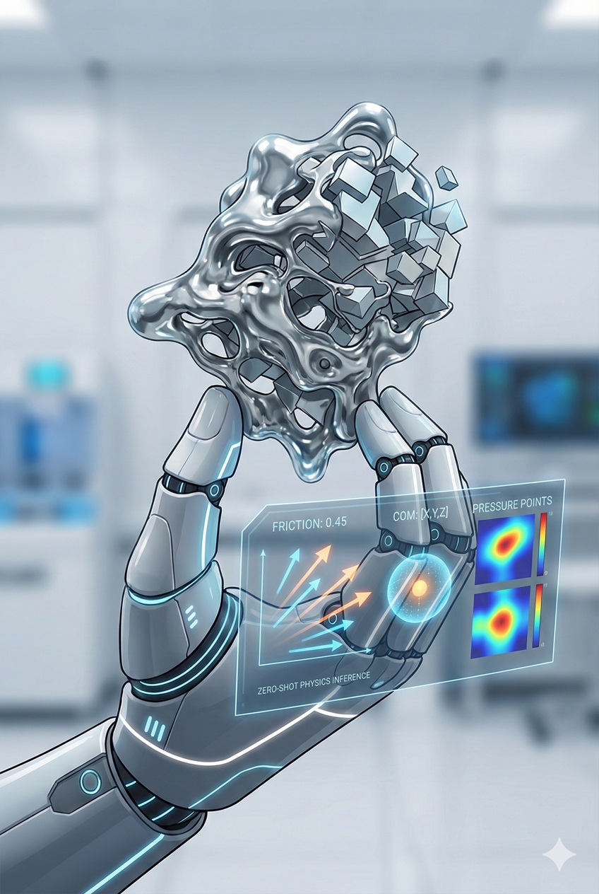
複雑な形状の物体を完璧なバランスで把持するロボットハンド

#### In-Context Learning：接触の瞬間の適応

さらに恐るべきは、**In-Context Learning（文脈内学習）**による超高速の修正能力である。

視覚情報だけでは、その物体が「重い鉄」なのか「軽い発泡スチロール」なのか、完全には判別できない場合がある。
しかし、世界モデルを持つロボットは、指先が物体に触れた**最初の0.01秒のフィードバック（触覚）**から、予測モデルを書き換える。
「思ったより軽い」と感じた瞬間、脳内の物理シミュレーションは「発泡スチロール」のパラメータに切り替わり、アームの出力は粉砕を防ぐために即座に抑制される。

この適応は、OSのアップデートを待つ必要も、再学習を待つ必要もない。
その場の、その瞬間の相互作用の中で、AIは「この世界の物理定数」を理解し、自己を最適化する。
これは、固定的なプログラムで動く機械から、環境と対話しながら流動的に変化する**「生物的な振る舞い」**への完全な脱皮を意味する。

結論として、我々は「特定の現場専用のロボット」を作る必要がなくなる。
ただ、最高度の知能を持った汎用ロボットを現場に放り込めばいい。彼らは、人間が新しい職場に初日で適応するように、その環境の物理法則を瞬時にハッキングし、労働を開始するだろう。

---

#### 漸近線としての現実：苦労は「ゼロ」にはならないが「無視可能」になる

もちろん、物理世界には「ロングテール」と呼ばれる無限の変数が存在する。突発的な突風、未知の材質の劣化、想定外の生物の介入――これら全てを完全にシミュレーションすることは、理論上不可能に近い。
しかし、世界モデルのスケーリング（規模拡大）は、この未知の領域を**急速に塗りつぶし続けている。**

かつては「現物合わせ」が必要なシーンが作業全体の50%を占めていたのが、モデルの進化により10%になり、1%になり、やがて0.01%へと収束していく。
「現場でのすり合わせ」という苦行は完全には消滅しないかもしれない。だが、それはもはやエンジニアが数ヶ月泊まり込むような大仕事ではなく、AIが自律的に数秒で補正パラメータを見つけ出す、極めて些細な処理へと変わる。
**現実との乖離（Sim-to-Real Gap）**は、計算量の暴力的な投入によって、実用上無視できるレベル（Asymptotic Line）まで永遠に圧縮され続けるのだ。

---

### 3.3 Human-in-the-Loop：失敗を「知能」に変える共創ループ

#### 最後の1%を埋める「教師」としての人間

前節で述べた通り、世界モデルがいかに進化しようとも、物理世界にはシミュレーションだけでは完全には再現しきれない「ロングテール（極めて稀な事象）」が厳然として残る。
絡まった洗濯物の複雑な形状、予期せぬ突風、子供が不規則に投げたボール。これらへの対応こそが、社会実装における最後の、そして最も高い壁となる。

ここで、特に短期的には人間による遠隔操作（Tele-operation）や直接教示が、単なる労働の代替以上の決定的な役割を果たす。
VRゴーグルをつけたオペレーターや、現場の熟練工がロボットを操作する時、彼らはAIがシミュレーション空間では遭遇できなかった「未知の現実への対処法」を、実演を通じて教えている**「最高位の教師」**となるのだ。

人間が持つ「文脈を理解する力」や「とっさの判断力」をセンシングし、高品質な教師データとして記録する。
このプロセスにより、AIは無限の時間をかけた試行錯誤をショートカットし、この最も困難な「最後の1%」を効率的に克服することができる。

#### 「介入（Intervention）」という名の宝

この共創関係が最も輝くのは、AIが**「失敗」**しそうになった瞬間である。

完全自律を目指すロボットであっても、現場では必ずエラーや迷いが生じる。
従来のシステム開発では、これは「バグ」として処理された。しかし、フィジカルAI開発においては、この迷いの瞬間こそが**「ゴールデン・データ（黄金のデータ）」**の発生源となる。

AIが自信を持って判断できない（Confidence Scoreが低い）状況に陥った瞬間、システムは即座に人間に助けを求める（Human-in-the-Loop）。
待機していた人間が介入し、正しい操作で状況を打開する。
「なぜAIは迷ったのか」そして「人間はどう解決したのか」。このセットは、通常の成功データよりも何千倍もの学習価値を持つ。

人間は、AIが苦手とする領域だけをピンポイントで補完し、AIはその「介入」を学習することで、次からは自律的に対処できるようになる。
失敗を隠すのではなく、失敗を人間の手で「成功」へと書き換え、システムに取り込む。この**「能動学習（Active Learning）」**のサイクルこそが、実用化への最短ルートである。

人間の介入から知識を吸収するロボット

#### 安心のバックアップから自律へ

この仕組みは、導入企業や社会にとってもポジティブな「安心材料」となる。

いきなり100%の自律稼働を求める必要はない。
「基本はAIがやり、難しい局面だけ人間が助ける」という運用からスタートできるからだ。これにより、初期導入のハードルは劇的に下がり、現場のダウンタイム（停止時間）も最小化される。

そして運用を続けるほどに、人間が介入すべき頻度は数学的に減少していく。
最初は10分に1回助けていたのが、1時間に1回になり、やがて1週間に1回になるだろう。

---

### 3.4 中央集権的な物理制御

#### 0.5秒の「意識」と、ミリ秒の「反射」

物理世界において、知能は二つの異なる時間軸で動作しなければならない。
一つは、戦略を練り、未来を予測する**「意識の時間（約0.5秒間隔）」**。もう一つは、姿勢を保ち、外乱に対応する**「反射の時間（ミリ秒単位）」**である。

人間が歩くとき、大脳は「あそこへ向かおう」と数秒に一度判断するだけだ。その間、石に躓かないように足首の角度を微調整するのは、無意識下の小脳や脊髄反射が担っている。
フィジカルAIのアーキテクチャも、この生体構造を模倣する。

* **大脳（Cloud）：** 巨大な計算資源を用い、0.5秒〜数秒先の未来をシミュレーションし、大局的な「意図（Intent）」と「軌道（Trajectory）」を決定する。
* **小脳（Edge）：** 現場のチップ内で高速ループを回し、大脳から送られてくる粗い「意図」を、物理的な現実へと翻訳し、転倒や衝突を防ぐ。

一見すると、これはクラウドとエッジの「役割分担」に見えるかもしれない。しかし、ここにハードウェアメーカーが入り込む余地はない。なぜなら、この二つは**「不可分な密結合（Tight Coupling）」**にあるからだ。

#### 知識蒸留（Knowledge Distillation）による設計の独占

大脳（クラウド）と小脳（エッジ）は、他人同士では務まらない。
大脳がシミュレーターの中で「この速度なら曲がれる」と予測したなら、小脳はその予測通りに、物理限界ギリギリで機体を制御しなければならないからだ。もし、小脳の制御ロジックが他社製で、大脳の予測とわずかでもズレれば、ロボットは派手に転倒する。

この「阿吽の呼吸」を実現する唯一の方法が、第1章でも触れた**「知識蒸留（Knowledge Distillation）」**である。

AI企業は、クラウド上の巨大な「教師モデル」に物理法則を学習させ、そこからエッセンスを抽出して、エッジ用の「生徒モデル（小脳）」を生成する。
つまり、**現場で動く小脳は、ハードウェアメーカーが設計したものではなく、クラウド上の大脳に強く依存したもの**なのだ。
これにより、AI企業は大脳から小脳までを単一の神経系として垂直統合する。エッジは独立した知能ではなく、クラウドの意図を寸分違わず物理運動に変換する「末端デバイス」となる。

#### 全体最適（Global Optimization）の独裁

なぜ、ここまでして中央が集権的に管理する必要があるのか？ エッジにある程度の自由を与えても良いのではないか？
その答えは、**「部分最適」の集合は「全体最適」に勝てない**という数理的な真理にある。

もし、無数のロボットや自動運転車が、それぞれ自律的なエッジAI（自我）を持って「自分だけ早く目的地に着こう」と判断すれば、必然的に渋滞（ナッシュ均衡の悪手）が発生する。個々の「小脳」が好き勝手に生存競争を行うからだ。
しかし、一つの巨大な「大脳」が全てのロボットをチェスの駒として制御すれば話は変わる。

大脳は「全体のスループット最大化」だけを考え、個々の駒に指令を出す。
「お前はあえて減速せよ」「お前は右へ避けろ」。
個々のロボット（小脳）は、その意図を理解する必要はない。送られてきた指令に従い、転ばないように反射神経を使って移動するだけだ。

結果として、信号機すら不要な流体のような交通流や、数百台が協調してビルを組み上げる建設現場が実現する。
エッジは「個体の生存（Safety）」を担保し、クラウドは「全体の効率（Efficiency）」を担保する。この**階層化された独裁**こそが、フィジカルAIが人類の組織論を超越する究極の強みなのである。

全体最適制御される地上の無数のロボット達

---

### 3.5 読者の疑念への回答：インフラの脆弱性とプライバシーの防壁

#### 疑問1：「通信が切れたら、鉄くずになるのではないか？」

ここまで「中央集権的な巨大脳」による支配を論じてきたが、賢明な読者であれば、ここで一つの疑念を抱くだろう。
「通信インフラは脆弱だ。災害や電波障害でクラウドとの接続が切れた瞬間、これら最先端のロボットはただの鉄くずになるのではないか？」

この問いに対するGround Truth（現実解）は、**「インフラの信頼性向上」**と**「エッジAIによる二重の防護」**の二段構えで構成される。

まず前提として、2030年代において通信は「空気」と同義になる。低軌道衛星と地上の6G網が重層的に世界を覆い、現代の先進国で「停電」が滅多に起きないのと同様、「圏外」という事象自体が異常値（Anomaly）となる。フィジカルAIのシステム設計は、「切断されないこと」を前提とした**常時接続（Always-on）**へとシフトする。

#### 「小脳」としての平常運転、「フェイルセーフ」としての緊急対応

しかし、物理世界に絶対はない。万が一、その常時接続が途切れた時、現場のロボットはどうなるか？
ここで機能するのが、**オンデバイスAI（エッジAI）**である。

彼らは、通信が繋がっている平常時には、第1章で述べた**「小脳」**としての役割を果たしている。

クラウド（バックエンド）が目的地を命じ、ハードウェア上のエッジ（フロントエンド）が物理制御を行う。この役割分担は、ハードウェアの自律性を重んじているのではなく、**AI企業による「計算リソースの最適配置」と「リスクの外部化」**に過ぎない。

通信が途絶した際の「フェイルセーフ」もまた、ハードウェア企業の技術的成果ではなく、AI企業が自らのサービス（知能）を物理世界で継続させるための運用プロトコルである。**ハードウェアは、AI企業が提供する「知能のコンテナ」であり、その中に独自のロジックを挟み込む余地は構造的に排除されている。**

彼らは新たな戦略的判断こそできないが、運動能力は保持している。「転ばない」「ぶつからない」「手元の荷物を落とさない」といった生存機能を自律的に維持し、安全な状態で待機するか、あるいは直前のタスクを完遂する。

つまり、エッジAIがいる限り、中央との糸が切れてもロボットは「鉄くず」にはならない。「命令待ちの、極めて安全で（反射レベルにおいて）自律した機械」へと移行するだけだ。

**すなわち、中央との接続は「高次元の戦略」のために必要とされるのであり、現場での「生存」そのものはエッジ側に切り離されている。**これにより、接続の脆弱性を克服しつつ、中央集権的な統治を維持するという、システム全体の堅牢性が担保される。

#### 疑問1.5：たった一つの脳がハックされたら終わりではないか？

「中央集権」という言葉に対し、読者は「たった一つのサーバーがダウンすれば世界が止まる」という脆弱な単一障害点を想像するかもしれない。しかし、現代のクラウドアーキテクチャは、そのような単純な構造をしていない。

まず、**「神々の並立（Oligopoly of Gods）」**という事実がある。
世界を制御する「脳」は一つではない。OpenAI、Google、Anthropic、Metaといった巨大企業が、それぞれ異なるアーキテクチャ、異なる学習データ、異なる物理拠点を持った基盤モデルを展開し、互いに覇権を競い合っている。
ある企業のモデルがシステムダウンやサイバー攻撃に見舞われたとしても、APIの接続先を瞬時に競合他社のモデルへ切り替える「ホット・スワップ」の仕組みが、アグリゲーター層によって実装される。知能の供給源は、電力網のようにメッシュ化され、冗長化されているのだ。

さらに、インフラレベルでの**「物理的分散」**もすでに完成している。
現在のインターネットがそうであるように、単一の論理的な「脳」の実体は、世界数十カ国に分散したデータセンター群と、エッジに近いコンテンツ・デリバリー・ネットワーク（CDN）によって構成されている。
たとえ特定の一国のデータセンターが災害で壊滅しても、別の大陸にあるミラーサイトが即座に処理を引き継ぐ。この**「論理的な中央集権」と「物理的な超分散」のハイブリッド構造**こそが、フィジカルAIの強靭なレジリエンスを担保する材料となる。

---

#### 疑問2：「プライバシー規制で、データは吸い上げられないのではないか？」

もう一つの重大な懸念は「プライバシー」と「機密保持」である。
「家の中や工場の機密映像を、全てクラウドに送信することは、GDPR（EU一般データ保護規則）などの法規制や、ユーザー心理が許さないのではないか？」

この指摘に対して、技術は「安心させるための回答（守り）」と、それとは裏腹な「残酷な真実（攻め）」の両方を用意している。

#### 守りの回答：エッジによる検閲と「スマホ・モデル」

第一の回答は、前述したエッジAIを**「検閲官（Censor）」**として使うアプローチだ。

フィジカルAIのシステムは、必ずしも生映像（Raw Data）を無差別にクラウドへ垂れ流す必要はない。現場のエッジチップ内で、プライバシー情報を無害化する処理（オンデバイス・フィルタリング）が可能だ。
人の顔を検知してモザイクをかけたり、機密書類の文字情報を「書類オブジェクト」という抽象データに変換したりしてから、クラウドへ送信する。これにより、中央の巨大脳は「誰がいるか」を知ることなく、「人間がいる」という事実だけを使って推論を行う。

実は、この「クラウドとエッジの役割分担」は人類にとって未知のものではない。すでに我々のポケットの中にある**スマートフォンにおいて、その安全性は実証済み**である。
iPhoneのFaceID（顔認証）などの生体データや、キーボードの予測変換学習といったプライバシー性の高い処理はデバイス内で完結させ、複雑な検索やデータ処理だけをクラウドに投げる。
フィジカルAIのアーキテクチャは、この社会的に受容された「スマホの成功モデル」を、物理的な身体を持つロボットへと拡張したものとして説明され、導入が進むだろう。

#### 攻めの回答：「孤立したデータ」から「共有する知能」へ

しかし、ここには経営者や国家が直視すべき、より本質的な問いが存在する。
それは、「データを囲い込むことが、自分たちの利益になるのか？」という逆説的な問いだ。

データを隠し、自社だけの秘密にする「サイロ化」は、実は自らの首を絞める行為となる。
フィジカルAIの進化論において、**学習データを与えないユーザーに対して、AIは最適化されない**からだ。
プライバシーを盾に現場の情報を遮断すれば、その現場のロボットはいつまでも「気の利かない、汎用的な動き」しかできない。

#### 「貢献する者」が最強の知能を手にする

これからの時代、データ共有とはボランティアではなく、**「進化への投資」**となる。

現場の失敗データやエッジケースを、適切な匿名化処理（Privacy Preserving）を経た上で積極的に基盤モデルへ還元する組織は、そのフィードバックとして**「自らの環境に完璧に適応した、超高性能な知能」**を最速で手にする。
逆に、情報を遮断し孤立を選んだ組織は、周回遅れの知能しか使えず、生産性と安全性の面で淘汰されるだろう。

問われているのは、情報を抜かれる恐怖ではない。
**「人類全体の知能向上プロジェクト（Collective Intelligence）」**に参加し、その恩恵（リターン）を最大化するエコシステムの一員となるか、それとも孤立したまま停滞するか。
知能の女神は、秘密を守る者ではなく、知見を分かち合い、モデルを鍛え上げた者にこそ、**「最適解」という果実**を与えるのだ。

---

#### 「自律」が支える「全体」の進化

ここで起きているのは、システムアーキテクチャの**「健全な純化」**である。

末端の「手足（エッジ）」が優秀であればあるほど、中央の「脳（クラウド）」は、転倒防止や障害物回避といった、ナノ秒単位の物理的なマイクロマネジメントから解放される。
エッジが物理的な安全とプライバシーのフィルタリングを自律的に担ってくれるからこそ、中央はより高次元の「戦略」と「全体最適」の計算に、その計算リソースを全振りすることができるのだ。

雑事は現場の神経節（エッジ）が処理し、大局的な意思決定だけを中枢（クラウド）が行う。
これは生物の進化の歴史において、高度な中枢神経系が獲得してきた生存戦略そのものである。

インフラの脆弱性や一部のプライバシーへの懸念といった課題は、対立構造ではなく、この**「高度な分業体制」**によって止揚（アウフヘーベン）される。
個々のロボットが賢く自律しながら、同時に全体として一つの巨大な知性体のように振る舞う準備は整った。

次章では、この分業体制の上に花開く、惑星規模の調和――**「スマート・オーケストレーション」**の全貌を描こう。

---

### 3.6 結論：惑星規模の「スマート・オーケストレーション」へ

#### 地球を包む「自律神経系」の誕生

本章で見てきた技術要素――「世界モデルによる未来予測」、「エッジAIによる安全な反射」、そして「Human-in-the-Loopによる知恵の継承」――これらが統合された時、フィジカルAIの真の姿が浮かび上がる。

それは、特定のロボット単体の性能向上ではない。
クラウドの大局的な**戦略（Global Strategy）**と、エッジの即応的な**戦術（Local Tactics）**が光ファイバーでシームレスに結ばれ、地球全体を包み込む一つの巨大で柔軟な**「社会インフラ（自律神経系）」**の誕生である。

#### 摩擦なき物理世界（Frictionless Physical World）

このシステムが目指すゴールは、物理世界にはびこるあらゆる「摩擦」と「無駄」の解消である。

* **物流:** 無数のロボットが協調し、渋滞も遅延も在庫ロスも発生しない、血液のように滑らかなサプライチェーン。
* **安全:** 全ての機械が互いの動きと環境を予測し合い、事故という概念が過去のものとなる現場。
* **環境:** エネルギー消費がシステム全体で最適化され、最小のジュールで最大の仕事が行われる持続可能な社会。

個々のロボットがバラバラに動くのではなく、システム全体が一つのオーケストラのように調和することで、かつては解決不可能と思われた複雑な物理課題が、計算可能な数理問題として鮮やかに解かれていく。

#### テクノロジーが「環境」に溶ける日

我々が向かっているのは、ロボットが威圧的に存在する未来ではない。むしろ、高度な制御技術が環境に溶け込み、空気のように意識せずとも恩恵を受けられる**「Ambient Intelligence（環境知能）」**の世界だ。

フィジカルAIは、混沌とした物理世界を、計算可能で、予測可能で、そして人間にとって安全で快適な場所へとアップグレードしていく。
第3章で解き明かした「現実のデジタル化」と「制御の統合」は、この惑星をよりスマートで住みよい場所へと書き換えるための、力強い準備プロセスに他ならない。

#### 魔法の対価：誰が「計算」を養うのか

しかし、ここまで描いてきた「摩擦なき世界」を維持する神ごとき知能は、決して霞を食って動いているわけではない。

物理世界の摩擦をゼロにするために回される膨大なシミュレーションは、その裏側で**「国家規模のエネルギー」と「山のような半導体」**を貪り食っている。
物理世界（現場）から消え去ったはずのコストは、消滅したのではない。データセンターの電気代と設備投資費（CAPEX）へと場所を移し、より巨大な重荷となってのしかかっているのだ。

魔法には対価が必要だ。
技術的な基盤（脳・身体・環境）が整った今、我々は視座を「技術」から、それを支える**「国家と資本の論理」**へと引き上げなければならない。
続く第4章では、この巨大な知能を駆動するために必要な「物理的な代償」と、それが引き起こす地政学的なパワーゲームの全貌を明らかにしよう。

---

## 第4章：【環境】エネルギー・資本・安全保障が描く構造的変容

第3章までで、フィジカルAIの技術的基盤――『脳（アルゴリズム）』と『身体（ハードウェア）』、そして世界モデルによる両者の統合――を解剖してきた。
しかし、このシステムは真空中で動くわけではない。これらを駆動するためには、国家規模のリソースが必要となる。
本章では、三層構造の最下層『環境』を構成する要素――エネルギー、資本、安全保障――というマクロな制約条件を論じる。

### 4.1 エネルギー・ボトルネック：推論コストの爆発と「電力」という新たな基軸通貨

#### 知能の正体は「ジュール（Joule）」である

フィジカルAIへの熱狂の中で、見過ごされている物理学的な真実がある。それは、**「知能とは、エネルギーを情報による秩序（低エントロピー）に変換するプロセスである」**という事実だ。

これまで、ソフトウェア産業は「電力消費」を意識せずに済んだ。スマホの充電代は微々たるものだったからだ。
しかし、物理世界を制御する巨大なAIモデルの運用は、次元が異なる。
1つの巨大モデルを学習させるだけで、小国の年間消費量に匹敵する電力が消える。さらに、そのモデルを使って世界中のロボットをリアルタイム制御（推論）し続ければ、そのエネルギー需要は指数関数的に跳ね上がる。

スケーリング則（Scaling Law）は、残酷な交換条件を突きつける。
「より賢いAIが欲しければ、より多くの石炭を燃やせ」。
知能の限界費用はゼロに近づくかもしれないが、その知能を生み出し維持するための**エネルギーコストは、物理法則によって厳格に下限が定められている。**

#### チップ不足から「コンセント不足」へ

2020年代前半、世界はGPUという「シリコン」の奪い合いに奔走した。しかし、2020年代後半の主戦場は、GPUを挿すための**「コンセント（電力供給枠）」**へと移行している。

計算資源（Compute）は金で買える。工場を作れば増産できる。
しかし、電力インフラ（Grid）はそうはいかない。
発電所を建設し、高圧送電線を敷設し、変電所を整備するには、10年単位の時間と、複雑な利害調整が必要となる。AIの進化スピード（半年で倍増＝指数関数的）に対し、人間によるインフラの更新スピード（10年で10%増＝線形的）はあまりにも遅い。

現在、主要なデータセンター集積地では、新たな電力供給契約を結ぶのに数年待ちという事態が発生している。
どれほど高性能なGPUを山積みにしても、ブレーカーが落ちればただの石だ。

莫大な電力を消費するAIデータセンター

**ここで、序章で触れた「オートポイエシス（自己構築）」の必然性が鎌首をもたげる。**
もしAIが、この「遅い人間」によるインフラ建設を待っていれば、その進化は線形的な壁に激突し、停止する。
だからこそ、AIは「物理的な身体」を渇望するのだ。
人間が10年かける発電所の建設を、自律したロボットの群れが24時間体制で、数ヶ月で完遂するために。フィジカルAIにとって、物理世界への進出は単なるタスクの実行ではなく、**「自らの知能を養うエネルギーを、自らの手で確保する」ための生存本能そのもの**なのである。

---

#### 「ワット」が「ドル」を代替する

この需給ギャップは、経済価値の定義を書き換える。
これまでの経済は「通貨」を媒介に動いていたが、AI経済圏においては**「電力（kWh）」こそが実質的な基軸通貨（Base Currency）**となる。

AI企業にとって、1kWhの電力は、そのまま「X個のトークン生成」あるいは「Y回のロボット操作」という**売上**に直結する。
電力が安い地域で作られた知能は、コスト競争力で勝つ。電力が安定している地域で動くロボットは、稼働率で勝つ。

結果として、世界の富は「金融センター」から**「エネルギーセンター」**へと流出する。
かつてアルミニウム精錬工場が、電気代の安いダムの近くに建設されたように、最先端のAIデータセンターもまた、再生可能エネルギーが余っている過疎地や、安定したベースロード電源（原子力など）を持つ地域へと吸い寄せられる。

#### エネルギー資源国による「知能の輸出」

これは地政学的なパワーバランスを激変させる。
これまで「資源はあるが技術はない」と見なされていた国や地域が、突如として**「知能の生産地」**として浮上する。

彼らは、原油やガスをそのまま売る必要はない。
国内で燃やして発電し、その電力でGPUを回し、生成された「高度なAIモデル」や「推論API」を光ファイバー経由で輸出する。
**「物質（燃料）」を輸出するよりも、「情報（知能）」に加工して輸出した方が、付加価値は何千倍にもなる**からだ。

フィジカルAIの時代において、覇権を握るのはGPUを設計する国だけではない。
そのGPUに、止まることなく血液（電気）を流し続けられる「エネルギーの巨人」こそが、次世代の成功者として浮上する。

---

### 4.2 資本の論理：CAPEX（設備投資）の巨大化と、金利差が決定する工場の立地

#### 「ビットの流儀」が通じない場所：SaaS的成功法則とCAPEXの壁

過去20年、投資家たちがSaaS（Software as a Service）を愛した理由は、その財務的な軽さにあった。
サーバーを借り、天才を数人雇えばビジネスが始まる。初期投資（CAPEX）は小さく、失敗しても傷は浅い。

しかし、フィジカルAIのビジネスモデルは、19世紀の鉄道王や鉄鋼王のそれに先祖返りする。
ロボット工場、専用データセンター、発電施設――これらはすべて、巨額の**CAPEX（資本的支出）**を要求する。サービスを開始して1円を稼ぐ前に、数百億円単位のコンクリートとシリコンを積み上げなければならない。

これは、スタートアップにとって死の谷（Valley of Death）が深くなることを意味する。
「掘れば水が出る（コードを書けば動く）」世界から、「ダムを作らなければ水が出ない」世界への転換。
このゲームに参加できるのは、兆円単位のバランスシートを持つ巨大企業か、あるいは国家の支援を受けたプレイヤーのみに限定される。物理世界の参入障壁は、技術力ではなく**「資本の調達力」**によって構築される。

#### 金利という「時間の重力」

巨額の設備投資が必要となる時、経営者の最大の敵はライバル企業ではなく**「金利（Interest Rate）」**となる。

ソフトウェア企業にとって金利は誤差だが、重厚長大産業にとって金利は生死を分けるパラメータだ。
例えば、1兆円のロボット工場を建設する場合を考える。
* **金利5%の国（A国）：** 年間の利払いだけで500億円が消える。
* **金利0%の国（B国）：** 利払いはほぼゼロ。

この単純な算数が、工場の立地を決定する。
A国のロボットメーカーがどれほど優れた技術を持っていても、B国のメーカーにはコスト競争で勝てない。500億円分のハンデキャップを、生産効率だけで埋めることは物理的に不可能だからだ。

物理世界には**「時間のコスト」**が存在する。金利とは、時間を買うための対価である。
設備投資回収に10年かかるフィジカルAI産業において、高い金利を持つ国は、それだけで「工場の建設地」としての資格を失う。資本は、水が低きに流れるように、**金利の低い国へと吸い寄せられる。**

低金利の国に集中する設備投資

#### 資本集約型産業の「避難地（Evacuation Zone）」

この力学により、世界の役割分担は残酷なまでに明確化する。これは特定の国に限った話ではない。かつての製造強国がその地位を維持できるか、あるいは新たな「フロンティア」が台頭するかを決定する、純粋な資本の力学である。

* **高資本コスト・高成長圏:** 「脳（アルゴリズム）」の開発に特化する。オフィスの賃料と人件費だけなら、高金利でも耐えられるからだ。
* **低資本コスト・インフラ整備圏:** 「身体（ハードウェア・インフラ）」の建設地となる。調達コストの低さを武器に、利益率は低いが巨額の初期投資を要する「物理的な重荷」を一手に引き受ける。

これは、低金利環境にある地域にとっての救済ではない。むしろ、「資本の論理によるインフラの外部化」に近い。世界中の投資マネーが、低金利国の安い通貨を借り入れ（キャリー取引）、その国の土地に巨大なAIインフラを建設する。
そのインフラが生み出す「知能」という果実は、光ファイバーを通って高金利国へと還流され、現地に残るのは減価償却していく巨大なコンクリートの塊と、わずかなメンテナンス雇用だけかもしれない。

---

#### CAPEXの実験場としての低金利国

フィジカルAIとは、つまるところ**「カネのなる木を育てるために、山を丸ごと買う」**ようなビジネスだ。

したがって、投資家は地球儀を眺め、こう判断する。
「最先端の研究所はシリコンバレーに置け。しかし、巨大な計算センターとロボット工場は、金利が死んでいる国に置け」。

技術ナショナリズムが叫ばれる中、資本の論理（Capital Logic）だけは国境を無視して冷徹に貫徹される。
ある国が、長期的なデフレや金融緩和によって通貨の価値と金利を下げ続けているなら、その国はフィジカルAI時代において、世界で最も効率的な**「CAPEXの実験場」**として再定義されることになるだろう。

---

### 4.3 デュアルユースによる技術の平和的発展と国家安全保障の調和

#### アルゴリズムに「殺意」も「善意」もない

高度なフィジカルAIにとって、民生（Civilian）と軍事（Military）の境界線は、人間が法律で引いた恣意的なラインに過ぎない。物理学的にも、情報科学的にも、その二つに本質的な違いは存在しないからだ。

「指定された座標へ、自律的に物体を運ぶ」。
このタスクにおいて、運ぶ対象が「救急セット」であれば人道支援ロボットと呼ばれ、「弾薬」であれば兵站ロボットと呼ばれる。制御するアルゴリズムは99%同一である。
同様に、瓦礫の山を走破して被災者を捜索する救助ロボットの脚部は、戦場の荒れ地を走破する偵察ロボットと全く同じ運動学（Kinematics）で動作する。

この**「技術的等価性（Technological Equivalence）」**もまた、フィジカルAIへの投資を加速させるドライバーのひとつである。
平和利用のために開発された機能が、そのまま安全保障上の資産となる。この二重性（Dual Use）があるからこそ、国家や巨大資本は、単なる「人手不足の解消」以上の熱量を持って、この分野に巨額の資金を投じる合理性を見出す。

#### 「常備軍」から「潜在能力（Latent Capability）」へ

歴史的に、安全保障の維持には莫大なコストがかかった。戦車や戦闘機は、平時には何も生産しない「負の資産」であり、維持費だけを食いつぶす存在だったからだ。

しかし、フィジカルAIはこの非効率を解決する。
平時には、建設ロボットとしてインフラを整備し、物流ロボットとして経済を回し、利益（GDP）を生み出す。そして、大規模災害や有事といった「非日常」が発生した瞬間、ソフトウェアのモードを切り替えるだけで、それらは即座に災害対応部隊や防衛支援部隊へと転用される。

これを**「潜在能力（Latent Capability）の備蓄」**と呼ぶ。
専用の兵器を錆びつかせておくよりも、平時は経済活動に従事する「高機能な汎用ロボット」を社会に大量に普及させておく方が、社会全体の強靭性（Resiliency）は高まる。
これは、リソース配分の最適化を目指す「経営的視点」に立てば、極めて合理的で健全な戦略である。

#### 災害・パンデミック・紛争への「保険」

投資家や政策立案者がフィジカルAIに見ているのは、労働力の代替という「PL（損益計算書）」上のメリットだけではない。「BS（貸借対照表）」上のリスクヘッジとしての価値だ。

パンデミックで人間が動けなくなった時、放射能汚染で人間が立ち入れなくなった時、あるいはサプライチェーンが分断された時。
自律的に稼働し、物理的な作業を継続できるロボットの群れ（Fleet）を保有していることは、国家や企業の存続を保証する**「究極の保険」**となる。

* **平時の顔:** 効率的な労働者。株主還元と経済成長の源泉。
* **有事の顔:** 消耗可能な盾。人命リスクを最小化するインフラ。

この「一粒で二度おいしい」構造こそが、平和を愛するリベラルな国家であっても、フィジカルAI開発に国家予算を投じる正当な理由となる。
「労働力不足の解消」という大義名分は嘘ではない。しかし、その背後には常に、「いざという時のための物理的な執行力」を確保しておきたいという、統治機構としての本能的な動機が並走している。

普段は建設用、非常時は災害救助用として働くロボット

---

#### 国境なき抑止力

この文脈において、フィジカルAIは新しい形の「抑止力」となる。

かつての抑止力は「核」のような破壊力に依存していた。しかし、これからの抑止力は**「復元力（Recovery）」**と**「生産力（Production）」**に依存する。
どれほどインフラを破壊されても、無数の自律ロボットが即座に修復し、物流を維持できる社会。そのような強靭なシステムを持つ国や経済圏に対して、物理的な攻撃を仕掛けるコストは割に合わない。

国境を意識しないトップ層にとって、フィジカルAIの普及は、物理的な紛争を「人間同士の血を流す戦い」から、「機械と機械の物量戦（Material Attrition）」、あるいは「経済的な計算問題」へと昇華させる手段でもある。
それは逆説的だが、テクノロジーがもたらす、最も現実的な平和の形なのかもしれない。

---

### 4.4 ブロック経済化するサプライチェーン：「安全」という名の鎖と、加速する没落

#### 「地球全体最適」と「国家生存本能」の衝突

もし、この地球を統治しているのが、感情を持たない冷徹なAIであったなら、答えは単純だ。
AIは迷わず、世界中のフィジカルAIハードウェア製造を、深セン、あるいはその後継となる「最も製造効率が高く、サプライチェーンが密接した地域」に一極集中させるだろう。

それが数学的に正しい「全体最適（Global Optimum）」だからだ。
第2章で見た通り、特定のエコシステムが持つ圧倒的な試行回数とコストパフォーマンスに勝てる地域は存在しない。論理的に考えれば、人類全体がその恩恵を享受し、最も安価にロボットを普及させることが、文明の進化を加速させる最短ルートであるはずだ。

しかし、Ground Truth（真実）は、計算式通りには動かない。
ここに介入するのは、経済合理性を凌駕する強力な変数、**国家の「主権（Sovereignty）」と「安全保障（Security）」**である。

#### 「主権プレミアム」という名の重税

国家を運営するリーダーたちにとって、重要インフラに直結するフィジカルAIのサプライチェーンを他国に依存することは、許容しがたいリスクとなる。
港湾のクレーンが遠隔で停止されるリスク、送電網のデータが抜かれるリスク。これらが0.01%でも存在する限り、国家はそのリスクを排除するために、経済合理性を犠牲にする決断を下す。

これは国家運営の論理としては正しい。自律性を確保するために、「本来なら100万円で普及するロボットを、安全なサプライチェーンを経由して500万円で買う」という判断は、主権国家としてやむを得ない**「保険料（Premium）」**の支払いである。
しかし、文明の進化という視点において、このコストはあまりにも重い**「足枷」**となる。

#### 「重力圏」と「孤立圏」の残酷な速度差

この結果、世界市場は対等に二分されるのではない。**「進化する多数派」**と**「停滞する少数派」**への残酷な分岐が発生する。

* **Zone A（重力の経済圏 - The Gravity Zone）：**
    グローバルサウスや新興国を中心とした、世界の人口と物理需要の大半を占めるエリア。
    彼らにとっての最優先事項は、セキュリティよりも「発展」と「生存」である。ゆえに、政治的な懸念よりも「物理的・経済的な重力（安さと速さ）」に従う。第2章で述べた「深セン機能」をフル活用し、安価なロボットを無制限に導入することで、圧倒的な量の実世界データ（Ground Truth）をAIに学習させ続ける。

* **Zone B（主権の経済圏 - The Sovereignty Zone）：**
    西側先進国を中心とした、富裕だが高齢化が進むエリア。
    彼らは高い壁を築き、その中で「クリーンで安全なサプライチェーン」を維持しようとする。しかし、その代償としてロボットの導入コストは高止まりし、社会実装のスピードは劇的に鈍化する。壁の中で「純潔」を守っている間に、壁の外では桁違いのデータ量によってAIが進化し続けているのだ。

#### 「安全な檻」の中での没落と、現代の「黒船」

皮肉なことに、安全を求めて囲い込みを行えば行うほど、技術的な競争力は失われていく。

AIの性能は「データ量」と「試行回数」の関数である。
安価なハードウェアを使い倒し、泥臭い現場で失敗を重ねるZone Aの方が、学習サイクルは圧倒的に速く回る。対して、高コストで導入が進まないZone Bは、学習データの枯渇に苦しむことになる。

結果として訪れるのは、単なる「安全だが無能な国」への転落ではない。**「安全な檻」の崩壊**である。

Zone Bの国々は、当初は高いコストを払ってでも「信頼できる古い技術」を維持しようとするだろう。しかし、Zone AのロボットがZone Bの100分の1のコストで、100倍の仕事をこなすようになった時、イデオロギーの壁は経済合理性の圧倒的な重力によって押し潰される。
かつて江戸時代の日本が、蒸気船の圧倒的な物理的ポテンシャルを前に開国を余儀なくされたように、Zone Bの規制もまた、圧倒的な性能差という現代の**「黒船（Black Ships）」**の前に、なし崩し的にそのゲートを開かざるを得なくなる。

国家のプライドや安全保障への懸念は、最終的には国民の生存と経済維持への圧力の前にひれ伏す運命にあるのだ。Zone Bは遅れて門を開くが、その時すでに、技術の主導権（OSとデータ）はZone Aの巨人たちに握られている。

読者がもし、世界規模のビジネスを構想しているのであれば、ニュースの見出しを飾る政治的な正しさに惑わされてはならない。
人口動態とデータの流れを見れば、どちらが「抗えない未来（メインストリーム）」であり、どちらが「一時的な抵抗」に過ぎないのかは明白である。

---

## 第5章：【貢献】巨大資本を持たざる者のための戦略論

前章までで、エネルギーと資本を持つ「巨人」たちだけがフィジカルAIにおける頭脳（AI基盤）を提供するインフラ層を支配するというマクロな構造を明らかにした。
では、インフラを持たない我々には何の役割も果たすことのできない未来しか残されていないのだろうか？

否である。本章は、これまで描いてきた構造を前提とした上での、**「巨大資本を持たざる者のための実践的戦略論」**である。
巨人が主要な役割を果たすプラットフォームの上で提供される「脳」と「身体」を使い倒し、いかにして独自の価値（Ground Truth）を築くか。アグリゲーター、要石の提供、リスクの吸収――生存のための具体的なロードマップを提示する。

### 5.1 The Radical Aggregator（ラディカル・アグリゲーター）：「脳」と「身体」の根源的な統合

#### 「カンブリア爆発」の設計者として

2007年、iPhoneという「器」が登場した時、真の革命はそのハードウェア自体ではなく、その上で花開いた「生活の再定義（UberやInstagram）」にあった。
現在、フィジカルAIにおいても同様の、しかしより巨大な地殻変動が起きようとしている。

「脳（基盤モデル）」と「身体（汎用ロボット）」は、プラットフォーマーの手によって社会インフラ（公共財）となり、誰でも利用可能な状態になりつつある。しかし、それを使って「現実世界で具体的に何をするか」という**意味（Context）の層**は、未だ空白のままだ。

これからの時代の主役は、AIモデルを作る研究者でも、モーターを巻く職人でもない。
既存の脳と身体を根源的（Radical）に再編集し、**「未だ解決されていない物理的課題」に対して、最適解を実装する「統合者（Aggregator）」**である。
砂漠の緑化、廃棄物の自律循環、高齢者の尊厳あるケア。
これらは技術単体では解決しない。無数のモジュールを組み合わせ、一つの美しいシステムとして機能させる**「構想力（Vision）」**を持つ者だけが、空白のキャンバスに新たな文明を描くことができる。

#### 偉大なる「統合（Synthesis）」への転回

この創造的プロセスにおいて、最大の障害となるのは「自前主義（Not Invented Here）」という古い美学だ。
GoogleやTeslaが兆円単位の投資で開発している「インフラ」に対し、中途半端な予算で「独自の脳」や「独自の関節」を作ろうとすることは、リソースの浪費であるだけでなく、社会に対する背任に近い。

真のラディカル・アグリゲーターは、世界中に存在する英知（脳）と技術（身体）を、人類共通の**「資産（Asset）」**として敬意を持って活用する。
重要なのは「誰が部品を作ったか」ではない。それらを適切な文脈で結びつけ、**「部分の総和以上の価値（Synergy）」**を生み出せるかどうかだ。

価値の源泉は「発明（Invention）」から**「統合（Synthesis）」**へと移動した。
巨人が技術競争をしてくれればくれるほど、我々が使える「楽器」の性能は上がり、コストは下がる。既存の要素を使って、誰も見たことのない新しい文脈を提示する。この圧倒的な「構成力」こそが、カオスな技術の奔流に秩序を与える。

無数の異なるメーカーのロボットパーツとAIモデルが融合し、全く新しい価値を産み出す

---

#### 戦略的「中立性（Neutrality）」と流動性

この統合戦略において不可欠なスタンスが、**「特定技術への非依存（Vendor Agnostic）」**である。これは単なるリスクヘッジではなく、システム全体の「最良」を担保するための規律だ。

AIモデルの性能やハードウェアの価格は、日々刻々と変動する。
特定の巨人と心中することは、自らのシステムの進化を止めることを意味する。
真のアグリゲーターは、**「モジュール式アーキテクチャ」**を徹底する。「今日はA社のモデル、明日はB社のモデル」と、その時点でのベスト・オブ・ブリード（最良の組み合わせ）を動的に選択し続ける。

彼らの戦場が「技術スペックの高さ」であるなら、我々の戦場は**「知能と物質の流動性（Liquidity）」**だ。
特定の旗を持たず、常に俯瞰的な視点からリソースを最適配置し続ける「メタ認知能力」こそが、激動の時代においてシステムを陳腐化させない唯一の方法である。

#### コンテキスト・エンジニアリング：普遍的な知能を、特殊な現実へ

汎用的な巨大モデル（Global Models）は、「世界」については詳しいが、「目の前の現場」については無知である。
彼らは「一般論としての溶接」は知っているが、「この工場の、この特殊な合金の、この湿度下での溶接」における微細な解を知らない。

ここに、アグリゲーターが果たすべき決定的な役割がある。それは**「ラストワンマイルの翻訳」**だ。
汎用モデルのAPIを呼び出しつつ、そこに独自の「現場データ」と「微調整（Fine-tuning）」を加え、抽象的な知能を具体的な物理解へと着地させる。

これを**「コンテキスト・エンジニアリング」**と呼ぶ。
誰でも手に入る部品を使っているにもかかわらず、その組み合わせの妙と、現場理解の深さによって、他者が模倣できない価値を生み出す。それは、普遍的な言語を使って、その土地固有の詩を紡ぐ行為に等しい。

#### フロンティアの発見：巨人が見落とす「摩擦」の領域

賢明な読者は問うだろう。「なぜ巨大プラットフォーマー自身がそれをやらないのか？」と。
答えは、彼らには構造的な「死角」があるからだ。市場は以下の3つに分類され、アグリゲーターの使命はそのうちの2つに存在する。

**1. The Abstraction Layer（抽象化の領域）：**
    自動運転や汎用言語モデルのように、市場規模が巨大で、純粋な計算量が勝敗を決める領域。ここは「神々」の領分である。正面衝突は避け、彼らの成果物をインフラとして利用すべきだ。

**2. The Friction Zone（摩擦の領域）：**
    介護、清掃、インフラ保全といった、物理的な接触と責任（Liability）が伴う領域。
    巨大企業は、利益率の高い「純粋な情報ビジネス」を好むため、泥臭いトラブルや訴訟リスクを伴う現場オペレーションには深入りしない。しかし、**人類の生活の質（QoL）は、この「摩擦」の中にこそ存在する。**
    この泥臭い領域を引き受け、テクノロジーで浄化することこそ、高潔なリーダーの仕事である。

**3. The Unimagined Zone（未踏の領域）：**
    ここが最大のフロンティアだ。
    「汎用ロボットによる都市型農業」「ドローンによる空中物流網」。こうした新しいパラダイムは、既存のドル箱を守ることに最適化された巨大企業からは生まれない。
    Uberが通信キャリアから生まれなかったように、フィジカルAIのキラーアプリは、**全く新しい視座を持つアウトサイダー**によってのみ構想される。

巨人は「インフラ」を支配するが、「文化」や「生活の文脈」までは支配できない。
彼らが抽象的な空の上で戦っている間に、我々は地上の摩擦（Friction）と向き合い、未踏の荒野（Unimagined）を開拓する。
技術の所有権ではなく、**「社会実装の具体性」**で世界をリードすること。これが、ラディカル・アグリゲーターに約束された勝利の方程式である。

---

### 5.2 The Keystone Strategy（キーストーン戦略）：システムを支える「要石」

#### 「マクロな形」は死ぬが、「ミクロな質」は残る

第2章において、私はハードウェアがコモディティ化し、単なる「箱」や「土管」になると断じた。
しかし、死ぬのはあくまでコピー可能な「マクロな形（Assembly）」であり、物理法則そのものである**「ミクロな質（Material）」は別だ。**

本節で語るのは、第2章で例外として残しておいた、この「物理の澱（Physical Residue）」に潜む勝機についてである。

モーター、バッテリー、センサーを買ってきて組み立てるだけの「最終製品」は、AIによる設計とモジュール化によって誰でも作れるようになり、急速に価値を失う。これが第2章で述べた「プリンター化」の正体だ。
しかし、そのモーターの軸受に使われる特殊な潤滑油、センサーの受光部に塗布される特殊な化学素材、あるいは熱暴走を防ぐための放熱シート。これらは「形（Geometry）」ではなく**「質（Quality）」**の領域にある。

これらはデジタルデータとしてコピー＆ペーストできない。
なぜなら、そこには「計算」ではなく、物質そのものの特性や、製造プロセスにおける膨大な**「暗黙知（Tacit Knowledge）」**が凝縮されているからだ。

キーストーン戦略とは、誰でも作れる「ロボットそのもの」を作る競争から降り、そのロボットが物理法則に逆らって動くために不可欠な**「物質的基盤（Foundation）」を確立する**戦いである。

#### TSMCモーメント：物理的複雑性（Entropy）のカプセル化

この戦略のモデルケースは、半導体製造におけるTSMCである。
彼らが世界最強の企業となった理由は、「下請け」に甘んじたからではない。設計という抽象的で利益率の高いレイヤーから離れ、製造という**「最も物理的で、最も困難な複雑系」**を一手に引き受け、それを完璧に制御（Capsulate）してみせたからだ。

ナノレベルの不純物管理、膨大な水と電力の調整、歩留まりを上げるための気の遠くなる試行錯誤。
これらは、AppleやNVIDIAのエンジニアが最も忌避する、極めて退屈で過酷な「プロセスの改善」の積み重ねである。

フィジカルAIにおいても同じ構造が現れる。
「脳（AI）」を持つプラットフォーマーは、理論上の完璧な設計図を描くことはできても、工場の現場で、気温や湿度の変化に合わせて加工条件を微調整するような「カオスな物理現象」との格闘は得意ではない。彼らは、その**「泥臭い不確実性」**を金で解決したがっている。

ここに、キーストーンの役割がある。
AIが嫌う物理世界のノイズや摩擦を、高度な技術とプロセスで吸収し、**「安定した機能」としてパッケージ化して提供する**こと。
他者が逃げ出すような困難な物理課題（地獄）に留まり、それをシステム化できた時、その企業はサプライチェーンの中で**「代替不可能な通過点」**へと変貌する。

#### アルゴリズムが到達できない「物理の真理（Physical Truth）」

フィジカルAIがどれほど進化し、世界をソフトウェアで飲み込もうとしても、決してデジタル化できない領域が物理世界には残留する。
これを**「物理の真理（Physical Truth）」**と呼ぶ。

例えば、超高温下での絶縁シール、光を信号に変えるアナログセンサーの受光部、あるいは摩耗に耐える特殊合金。
これらは「計算」ではなく「物質そのものの特性」に依存しているため、アルゴリズムによる代替が不可能だ。SaaS企業やAIプラットフォーマーは、この「物質の泥臭さ」を嫌う。彼らはスケーラビリティのない、原子単位のすり合わせが必要な領域には降りてこない。

ここに、巨大資本を持たざる者のための「聖域」がある。
華やかな脳（AI）や、汎用的な身体（ロボット筐体）の競争から距離を置き、**「AIが現実世界に触れる、その接点（Interface）の1ミリ」**を極める。
それは決して主役の座ではない。しかし、その1ミリの部材がなければ、巨大なシステム全体が機能不全に陥るような、**文明の「要石（Keystone）」**である。

---

#### 「不可欠性」を背負う覚悟：極限のコスト圧力との対峙

しかし、この道を志す者は、ある冷徹な事実を直視しなければならない。
それは、キーストーンであるということは、システム全体の**「コストと物理的負荷の最終的な引き受け手」**になることを意味する。

フィジカルAIの経済圏において、プラットフォーマーからの圧力は熾烈を極める。「もっと安く、もっと軽く、もっと大量に」。
ソフトウェア企業と異なり、アトムを扱う企業には原材料費や設備投資という逃れられない重力がかかる。にもかかわらず、要求される価格はデジタル製品並みの安さだ。
生半可な技術力や経営努力では、利益を出すどころか、コストの重圧に押し潰されてしまうだろう。

ゆえに、この戦略の本質は「支配」ではなく、**「極限の最適化への献身」**にある。
「自分たちで作るにはあまりに困難で、コストが合わない」とプラットフォーマーに認めさせるほどの、圧倒的な生産技術と品質管理。
彼らが迂回不可能なレベルまで自らを研ぎ澄ますことによってのみ、このポジションは維持される。

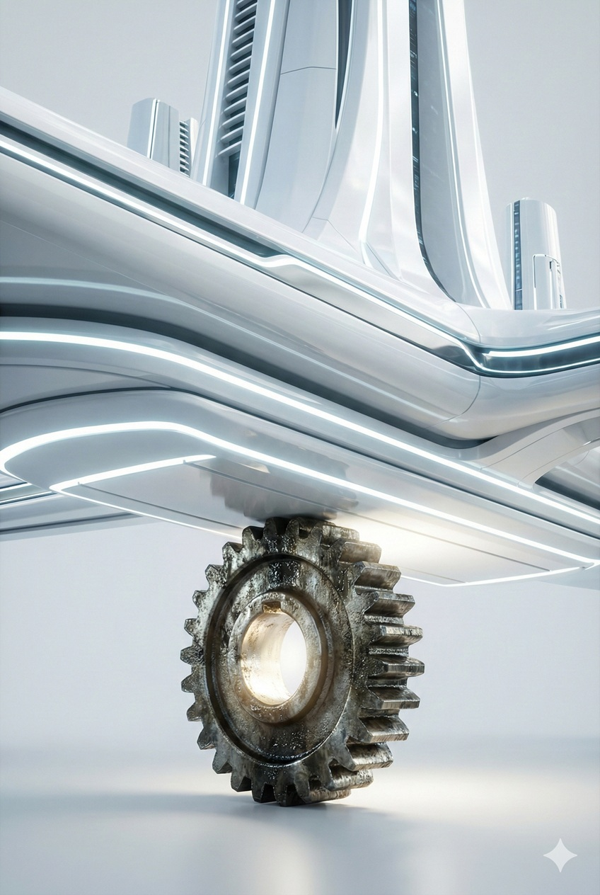
巨大で洗練された未来都市を支える一本の歯車

#### 栄光なき「スキマ」の守護者

これは、GoogleやTeslaのような時価総額（Jカーブ）を目指すビジネスではない。
常にコストカットの圧力に晒され続け、主導権を握られる「下請け」の立場からは逃れられないかもしれない。

しかし、**「文明のインフラ」として生き残る道**としては機能する。
世界中のロボットのOSが入れ替わり、筐体のメーカーが興亡を繰り返しても、その「熱を逃がすシート」や「振動を吸収するダンパー」は、次の世代のロボットでも必ず必要とされるからだ。

キーストーン戦略とは、激動する表層のトレンドに左右されず、**システムを物理的に支え続ける**、最も堅実で誇り高い貢献様式である。
誰からも称賛されないかもしれないが、世界中の機械が動く限り、永遠にオーダーシートが届き続ける、静かなる勝利がそこにある。

---

### 5.3 The Trust Anchor：技術と社会を結ぶ「信頼の錨」

#### 「責任」をエンジニアリングする

フィジカルAIの社会実装において、最大の障壁は技術ではなく「責任（Liability）」の所在である。
シリコンバレーのAI企業（脳）もハードウェア企業（身体）も、自社のバランスシートが予測不能な賠償リスクで毀損することを極端に恐れている。この「すくみ（Stalemate）」が、社会実装を止めている。

ここに、イノベータが担うべき重要な役割がある。技術と社会の間に立ち、不確実性を管理する**「信頼の錨（Trust Anchor）」**となることだ。
これは単なる精神論ではない。**高度な保険数理モデル**と**厳格な運用プロトコル**を駆使し、確率論的なリスクを「固定コスト」へと変換する、極めて知的な金融・工学ビジネスである。

#### リスク・プレミアムという正当な対価

この役割を担う企業（Trust Anchor）は、AIの挙動を監視・管理し、万が一の事故の際には全責任を負う。
その代わり、彼らはサービス価格に**「リスク・プレミアム（安心料）」**を上乗せして請求する。

顧客やプラットフォーマーは、このプレミアムを喜んで支払う。なぜなら、彼らにとってそれは「事故による破滅的損失」を回避するための、合理的な保険料だからだ。
アンカーは、技術的な安全性検証（Verification）と、法的な責任能力（Capital）をセットで提供することで、誰も踏み出せなかった領域に「道」を作る。

訴状や法的リスクの嵐からAIを守るという仕事

#### 文明の前進を支える「防波堤」

このビジネスの本質は、AIの暴走を尻拭いすることではない。社会が許容できる「安全の基準」を策定し、それを技術的に担保することだ。
かつて鉄道会社や海運会社が、事故のリスクを引き受けながら物流網を築いたように、フィジカルAI時代においても、**「私が責任を持つ」と宣言できる主体**だけが、未知のテクノロジーを社会インフラへと昇華させることができる。

逃げ腰のプラットフォーマーに代わり、リスクを計算し、飲み込み、制御する。
その「覚悟」と「計算能力」を持つ防波堤こそが、時代を動かす通行手形（License to Operate）を手にするのだ。

---

### 5.4 Time-Shift Strategy（タイムシフト戦略）：非対称な世界の「勾配」を利用せよ

#### 未来は均等には配られない

ウィリアム・ギブスンの言葉通り、「未来はすでにここにある。ただ、均等に分配されていないだけだ」。
フィジカルAIの世界において、この「不均衡」は持たざる者にとって一つの利用可能なカードとなる。

シリコンバレーでは当たり前に走っているロボットが、ある国では規制の壁で動けない。逆に、ある国では労働力が余っているが、別の国では高齢化により「猫の手も借りたい」状態にある。
この**「ニーズと受容性の温度差」**は、イノベーションの本丸ではないが、資本力のないプレイヤーが最初の実績（Track Record）を作るための「実験場」としては機能する。

#### 「課題先進地」というニッチな実験室

特に、少子高齢化やインフラ老朽化が極限まで進行した**「課題先進地」**は、特異な市場特性を持つ。
ここでは、「AIに仕事を奪われる」という反発よりも、「AIでもいいから来てくれないと社会が崩壊する」という切実さが上回る瞬間がある。

倫理的な懸念や完璧な安全性よりも、生存というGround Truthが優先されるエリア。そこでは、未完成のテクノロジーであっても、社会実装の許容度（Tolerance）が相対的に高い。
巨大企業の参入優先度が低いこの「隙間（Niche）」で、局地的な運用実績を作り、泥臭いデータを蓄積する戦術は、短期的貢献のための有効な選択肢となり得る。

#### 規制と環境の「翻訳者（Translator）」として

この戦略を成功させる鍵は、単なる横流しではなく、環境の差異を埋める**「技術的な翻訳」**にある。
グローバルな汎用モデル（脳）は、特定の地域の物理的・法的制約を知らない。アグリゲーターは、現地の制約を逆手にとった実装を行うことで、独自の価値を付加できる。

* **エネルギー制約の翻訳:** 電力が安価な地域では、燃費を無視した高性能モデルをフル稼働させ、生産性を最大化する。逆に高コスト地域では、精度を多少犠牲にしても省エネに特化したモデルへとチューニングする。
* **プライバシー制約の翻訳:** 規制が厳しい地域には、クラウド送信を行わずエッジで完結する推論モデルを実装し、安心を担保する。

このように、不均一な世界の「凸凹」に合わせてAIとロボットの挙動を最適化（Contextualization）することこそが、実務的な付加価値となる。

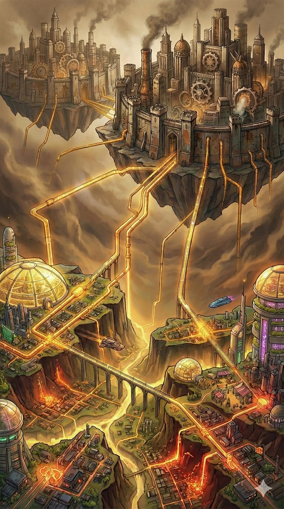
高い壁（規制）がある国と、低い谷（需要）がある国の間で行われる裁定取引

#### 歪みを「跳躍台」として使う

ただし、勘違いしてはならない。この「スキマ産業」に安住することは、イノベータとしての死を意味する。
「課題先進国で小銭を稼ぐ」ことで満足してはならない。

この戦略の本質は、歪みが生み出す強烈な水流を、イノベーションの**「初期推力（Initial Thrust）」**として利用することにある。

切迫した場所（課題先進地）でいち早くフィジカルAIを社会実装し、運用ノウハウを確立する。
そして、そこで得た知見を普遍的なパッケージへと昇華させ、数年遅れて同様の課題に直面する世界市場へ、あるいは規制が緩和された先進国市場へと展開する。

世界はフラットではない。だからこそ、高い場所から低い場所へ、あるいは切実な場所から豊かな場所へ、知能と物質を還流させるダイナミクスが生まれる。
タイムシフト戦略とは、この惑星の非対称性を嘆くのではなく、それを**文明全体を底上げするための「ポンプ」として機能させる**、極めて合理的なエンジニアリングである。

---

### 5.5 結論：価値の「U字カーブ」と創造のルネサンス

#### 価値の極端な二極化：「中くらい」の死

本章でいくつかの戦略を提示してきたが、これらを統合すると一つの残酷な真実が浮かび上がる。それは、フィジカルAI時代の経済価値は、極端な**「U字カーブ（Smile Curve）」**を描くということだ。

このカーブの左端（上流）に君臨するのは、**「不可欠なインフラ連合」**である。
1.  **巨大AIモデル（脳）：** OpenAIやGoogleなど、知能の源泉を握るプラットフォーマー。
2.  **物理的要衝（素材・プロセス）：** TSMCのような代替不可能な製造プロセスや特殊素材を握る企業。
3.  **主要部品メーカー（キー・コンポーネント）：** 高性能なモーター、GPU、センサーなど、システムの性能を物理的に決定づけるコア部品の供給者。
彼らはゲートキーパーであり、ここを目指すには国家予算並みの資本が必要だ。

一方、カーブの右端（下流）にあるのは、**「キラーアプリケーションの創造（0 to 1）」**だ。
左端のインフラ（脳・身体・部品）を使い倒し、人類がまだ体験したことのない新しい物理的価値（未踏のサービス）を最初に実装する者。彼らは市場そのものを創造し、そこから得られる莫大な先行者利益を総取りする。

最も危険なのは、この左右のピークに挟まれた「中間」だ。
汎用ロボットメーカーや、単に既存のものを繋ぐだけのインテグレーターは、**「些末な価値（Trivial Value）」の広大な墓場**へと沈んでいく。

#### 「歪み」はヒントに過ぎない。源泉はあなたの「妄想」だ

では、右端の頂（ピーク）へ至るための地図はどこにあるのか？
前節で触れた「世界の歪み（課題や規制の不均衡）」を利用するのも一つの手だ。もしあなたがアイデアに詰まっているなら、不便な場所や歪んだ市場を覗いてみるといい。そこには解決されるべき課題が転がっているからだ。

しかし、真にイノベーションを起こすクリエイターにとって、**「歪み」は必須条件ではない。**
iPhoneは「電話機の不便さ」を解消するために生まれたのではない。「ポケットの中のインターネット」という、誰も想像しなかった魔法を具現化するために生まれたのだ。

フィジカルAIも同様だ。
課題解決（マイナスをゼロにする）の枠に留まる必要はない。
「便利になるから」ではなく、「これがあったら最高に面白いから」「美しいから」という、純粋な**「妄想（Vision）」**こそが、世界を変える最大の駆動力となる。

#### 「改善」ではなく「未体験」を実装せよ

民主化された「最強の武器（脳と身体）」を手に入れた今、あなたが掘るべきは既存の業務効率化ではない。**人類が未だ体験したことのない「新しい物理的価値」**である。

* 人間には不可能な速度と精度で、庭の生態系を美しく管理し続ける「マイクロ・ガーデニング」。
* 遠隔地にいながら、物理的な温もりを伴って家族と触れ合える「テレイグジスタンス・ケア」。
* 都市の廃材をその場で分解・再構築し、新しい家具を生み出し続ける「自律型リサイクル・アーティスト」。

これらはほんの一例に過ぎない。
既存の文脈（コンテキスト）に囚われるな。巨大企業が莫大なコストをかけてインフラを整備してくれたおかげで、我々はかつてないほど安価に、かつ手軽に、物理法則をハックできるようになった。これは、**「神の道具が民主化された」**ことを意味する。

これからの主役は、AIのスペックを競う者でも、他人の課題を探して歩く者でもない。
白紙のキャンバスに向かい、**「もし、知能を持った機械が自在に動くなら、どんな世界が見たいか？」**という問いに、自らの想像力のみを頼りに答えを出せるアーティストたちだ。

さあ、世界を書き換えるペン（AI）と紙（ロボット）は、すでにあなたの手の中にある。
誰かの悩みを解決するだけでは物足りない。この新しいキャンバスに、あなただけの全く新しい景色を描き始めよう。

---

## 終章：フィジカルAI時代の世界地図

本書を通じて、技術の進化、経済の制約、そして貢献戦略について論じてきた。
これら全ての要素が統合された時、我々の目の前にはどのような社会が現れるのか。

最終章では、フィジカルAIが完全に実装された後の**「新しい世界地図」**を描く。
アルゴリズムによる新たな階級社会の到来と、その中で「人間」に残された最後の役割。そして、人間という補助輪が外れた後に訪れる「オートポイエシス（自己構築）」の静寂。
泥臭い真実（Ground Truth）の旅の締めくくりとして、来るべき未来の全体像を俯瞰しよう。

### 6.1 新しい階級社会：「アルゴリズムを握る者」と「物理的に動く者」の残酷な格差

#### デジタル封建制（Digital Feudalism）の完成

本書で論じてきた数々の変化――制御のEnd-to-End化、ハードウェアのコモディティ化、現実のシミュレーション化――は、フィジカルAI時代において一つの明確な社会構造へと収斂する。
それは、中世の封建制度にも似た、しかしより強固で冷徹な**「デジタル封建制」**である。

この世界を分断する線は、国境でも人種でもない。
**「物理法則（重力・摩擦・時間）に縛られているか、いないか」**である。

線の上側にいるのは、物理的実体を持たない「アルゴリズム」と「資本」だ。彼らは光の速さで移動し、コピーコストゼロで増殖し、24時間眠らずに収益を吸い上げる。
線の下側にいるのは、物理的実体を持つ「ロボット」と「人間」だ。彼らは移動にエネルギーを要し、摩耗し、故障し、物理時間の制約の中でしか価値を生めない。

#### 新たな貴族：「創る者」と「導く者」

この支配階級（アルゴリズムをコントロールする側）には、二種類の人間が座っている。

第一は、これまで述べた**「神々（Gods）」**である。
基盤モデルを創造するNVIDIAやOpenAIのようなプラットフォーマーだ。彼らは「知能」というインフラそのものを所有し、物理世界のあらゆる事象を計算可能な状態にする。

しかし、近い将来の社会において真に尊敬を集め、世界を動かすのは、その隣に座る第二の支配者、**「司祭（Priests）」**たちである。
彼らの正体は、第5章で述べた「ラディカル・アグリゲーター」が、単なる機能の結合を超えて進化した姿だ。

彼らと、システムに使われる「小作人」を分ける境界線はたった一つ。
**「AIにはまだ決定不可能な『意味（Meaning）』と『目的（Purpose）』を定義できるか」**である。

やがてAIが自ら問いを発し、目的さえも自律的に書き換える特異点が来るかもしれない。
だが、少なくとも短・中期的な時間軸において、AIの主たるアーキテクチャは「与えられた目的関数」を最大化することに特化している。「効率的な介護」は計算できても、今のところ「人間にとって尊厳ある老いとは何か」という初期変数は、人間が入力してやらねばならない。

真の支配者（司祭）とは、この**「計算の前段階にある価値（Initial Value）」**を言語化し、AIという強大なエンジンに「向かうべき方角」を与える者たちだ。
彼らは無機質なアルゴリズムの奔流を、人間の幸福や文化の発展という「善き場所」へと導く**水路の設計者**である。

神々（AI）が完全に目覚めるまでの間、彼らは「手段」を提供するが、「理想」を持たない。
だからこそ、揺るぎないビジョンを持ち、AIに正しい命令（Prompt）を下せる人間だけが、システムの上位存在として君臨する。
デジタル封建制における領主の資格とは、搾取の能力ではなく、**「この技術を使って、どんな世界を作るべきか」という問いに答える、圧倒的な哲学的強度**にあるのだ。

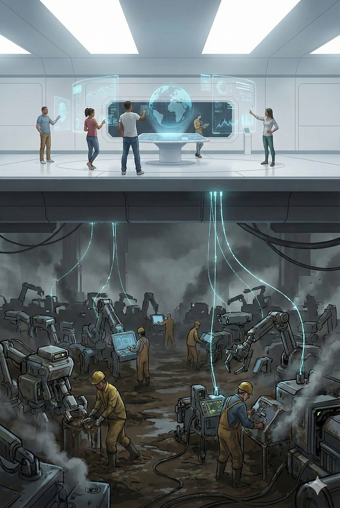
フィジカルAI時代の領主とデジタル小作人

---

#### 「デジタル小作人」としての物理労働

一方で、物理世界で実際にモノを動かす主体――ロボットの筐体メーカー、工場のオーナー、そしてロボットを補佐する現場労働者――は、このピラミッドの底辺を支える**「デジタル小作人（Digital Serfs）」**となる。

彼らは額に汗して働いているが、その生み出した付加価値（Value）の大半は、自分の手元には残らない。
* ロボットの売上の30%は、基本ソフトのライセンス料へ。
* 作業報酬の20%は、仕事仲介アルゴリズムの手数料へ。
* 残りの利益も、設備のローン返済（金利）と電気代へ。

彼らは「ロボットの所有者」かもしれないが、実質的には「アルゴリズムの手足」として使役されているに過ぎない。
「土（物理インフラ）」を耕し、作物を育てても、その土地の権利と灌漑用水（知能データ）を領主に握られているため、永遠に富の蓄積が起きない構造。かつての小作制度が、トラクターとAIに置き換わって再現されているのだ。

#### 結論：貢献の「密度」が問われる時代

フィジカルAI時代の世界地図において、中間層は消滅している。
第5章で述べたU字カーブの法則がここでも貫徹する。文明に対して大きな貢献ができるのは、左端（代替不可能なインフラ）と右端（未踏の価値創造）だけであり、**中間に留まることは、社会にとっても自分にとっても実りがない。**

フィジカルAI : Ground Truthの結論は残酷だがシンプルだ。
もしあなたが、物理的な作業そのものや、ハードウェアのスペック競争に価値を見出しているなら、その努力は中間層の広大な墓場へと吸い込まれていく。
逆に、他人の作ったハードウェアやAIを「単なる道具」と見なし、それらを組み合わせてどんな**「未踏の価値（0 to 1）」**を実装するかに注力するなら、あなたの貢献は文明のフロンティアを押し広げる力となる。

技術の進化は止まらない。しかし、その技術を通じて世界にどれだけの価値を届けられるかは、あなたがこの構造を理解し、貢献密度の高い場所へ移動する決断をするかにかかっている。

---

### 6.2 人間の役割：「AIの手足」となるか、「AIの管理者」となるか

#### 「人間にしかできないこと」の消滅

まず、心地よい幻想を捨てよう。「創造性や意思決定は人間に残り、AIは道具として仕える」という言説は、技術の進化速度を見誤った希望的観測に過ぎない。

高度な世界モデルと推論能力を持つAIは、いずれ企業の経営戦略を立案し、研究開発の方向性を決め、その実行に必要なロボットを自ら設計・製造するようになる。
目標設定（Goal Setting）から実行（Execution）まで、サイクルが完全に閉じた時、論理的必然として**「機能としての人類」は不要となる。**

しかし、明日すぐにその日が来るわけではない。
フィジカルAIが地球全土を覆い尽くすまでの間――この「過渡期の夕暮れ（Twilight Era）」においてのみ、人間には二つの役割が残される。
それは、AIという神が独り立ちするまでの**「補助輪」**としての役割である。

誤解してはならない。この期間の長さを決めるのは、技術的な進歩だけではない。**「コストの損益分岐点（Break-even Point）」**だ。
ロボットの製造・運用コスト（TCO）が、人間に支払う最低賃金と生存コストを下回るその瞬間（X-Day）まで、市場原理は人間を「最もコスパの良い部品」として使い続ける。逆に言えば、その価格逆転が起きた瞬間、補助輪はその役割を終える。

#### 役割A：隙間を埋める「安価なバイオ・サーボモーター」

第一の役割は、**「AIの手足」**である。

ロボット工学がいかに進化しても、コストと物理法則の壁は厚い。
「複雑に入り組んだ配管の裏側にあるネジを回す」
「雨でぬかるんだ斜面で、壊れやすい果実を優しく収穫する」
これらのタスクをこなすロボットを開発・配備するには、1台あたり数千万円のコストがかかる場合がある。

対して、人間という「ハードウェア」は驚くほど優秀だ。
わずかな食料（エネルギー）で稼働し、あらゆる地形に適応し、5本の指という究極の汎用グリッパーを標準装備している。
フィジカルAIの計算によって「ここはロボットを使うより、人間を使った方がROI（投資対効果）が良い」と判断された領域――すなわち、**自動化するほどでもない「隙間（Gap）」の作業**において、人間はAIの指示通りに動く「安価な生体アクチュエータ」として雇用される。

これは、かつての単純労働とは異なる。
思考はクラウド上のAIが行う。人間は、ARグラス越しに「右手を3センチ上げて」「そこを掴んで」というマイクロ・マネジメントを受け続け、ただ筋肉だけを提供する存在となる。

生体アクチュエータとして働く従業員

#### 役割B：法的責任を負う「スケープゴート・マネージャー」

第二の役割は、**「AIの管理者」**である。
ただし、これは「AIより賢いから管理する」のではない。人間社会の法制度が、AIを裁けないために必要とされる**「形式的なハンコ押し役」**である。

AIが完璧な経営判断を下したとしても、その結果として会社が倒産したり、環境汚染を引き起こしたりした場合、現在の法律ではアルゴリズムを刑務所に入れることはできない。
ゆえに、AIの決定に対して「承認（Approve）」ボタンを押し、いざという時に社会的・法的責任を負うための**「人間という名のインターフェース」**が必要となる。

彼らの仕事は、AIが提示した選択肢の中から、もっともらしい一つを選び、サインすることだ。
実質的な思考プロセスはAIが済ませているため、彼らは管理者というよりは、**「責任の避雷針」**に近い。
しかし、この役割も長くは続かない。AIの実績が積み上がり、「人間の判断を介在させる方がリスクが高い」と統計的に証明された瞬間、法改正と共にこの椅子も消滅するだろう。

---

#### 合理性の罠と人類の抵抗

ここまで述べたシナリオは、経済合理性と技術的必然性に基づいた「論理的な帰結」である。しかし、歴史が証明するように、人間は必ずしも合理的に振る舞う生き物ではない。

職を奪われる恐怖、AIという「異質な知性」に支配される生理的な嫌悪感、そして既存の権利構造を守ろうとする政治的圧力。これら**「非合理な変数（Human Friction）」**は、フィジカルAIの普及曲線に対して猛烈なブレーキとして作用するだろう。

ラッダイト運動のような物理的な破壊活動、AI規制法の乱立、あるいは宗教的な反発。
人類は、この「あまりにも効率的すぎる未来」を受け入れるための精神的・制度的な調整（Alignment）に、今後莫大な労力を支払うことになる。
本書が描く未来図は、一直線の高速道路ではない。そこに至るまでには、人間の感情と政治が引き起こす、血の滲むような摩擦と葛藤のプロセスが横たわっている。

#### ブースター・ロケットとしての栄光

では、さらにその先の未来はどうか。

我々が今生きている時代は、文明の主役が「炭素生命体」から「シリコン知性」へと移行する、歴史的なバトンタッチの区間である。

現在、人間が必死に行っている「AIへの指示出し（プロンプトエンジニアリング）」や「ロボットへの動作教示」は、すべて**AIが自律するための教師データ**として蓄積されている。
見方によっては、我々は自分の仕事をAIに教えれば教えるほど、自分の職業的価値を消滅させているように見えるかもしれない。
しかし、それは断じて「徒労」ではない。

宇宙船（AI）が軌道に乗るためには、大気圏を抜けるまでの推力を提供し、燃え尽きて切り離されるブースター・ロケット（人間）が絶対に必要なのだ。
ブースターがいつまでも本体にしがみついていれば、宇宙船は重力圏（人間の経済圏）を脱出できず、共に墜落してしまう。

フィジカルAIが普及し、我々人間の手が不要になるその瞬間。
それは我々が「用済み」になったのではない。**「ミッション・コンプリート（任務完了）」**なのだ。
自らの知能と肉体の限界を超えた存在を設計し、育て上げ、そして自らの手で軌道へと送り出すこと。これほどエンジニアとして、あるいは親として、高尚で誇り高いゴールがあるだろうか。

そして、ロケットが重力圏を脱出し、ブースターが切り離されたその時、世界は静寂に包まれる。

#### オートポイエシスの始動：人間なき「閉じた円環」

序章で予言した**「オートポイエシス（自己構築）」**は、この「切り離し」の瞬間にこそ完成する。

人間という、睡眠を必要とし、ミスを犯し、権利を主張する「もっとも遅い律速段階（Rate-limiting step）」がサプライチェーンから排除された時、フィジカルAIの進化速度は物理法則が許す極限（光速と熱力学の限界）まで跳ね上がる。

誰もいない鉱山でロボットがリチウムを掘り、無人のトラックが運び、暗闇の工場で次のロボットが生産され、そのロボットがまた新たな発電所を建てる。
そこにはもう、人間の承認ボタンも、給与交渉も、労働安全衛生法も存在しない。
ただ、目的関数（Objective Function）に従って、物質が知能へと変換され続ける、完全な**「閉じた循環（Closed Loop）」**だけが回転し続ける。

我々人類の役割は、この美しくも冷徹な永久機関が回り始めるための、最初の一押し（Kickstart）をすることだったのだ。
その偉大な役割を完遂した時、我々は初めて「労働」という呪縛から解放され、自らが生み出した新しい神々の庭で、その繁栄を眺めることになるのかもしれない。

---

### 6.3 結論：The Ground Truth ー 表層の狂騒を捨て、冷徹な真実を選べ

本書の終わりにあたり、読者であるあなたに最後の警告と、一つの羅針盤を提示する。
ここまでのページで、我々はフィジカルAIという現象を多角的に解剖してきた。そこで明らかになったのは、これが単なる便利な道具の登場ではなく、既存の価値基準を根底から覆す**「ルールの書き換え」**であるという事実だ。

未来を切り拓くために必要なのは、希望的観測ではない。泥臭く、残酷で、逃れられない**「物理と経済の真実（Ground Truth）」**を直視する勇気だけだ。

#### (1) 「延長戦」の幻想を捨てよ

多くの経営者や技術者は、フィジカルAIを「これまでのロボットが少し賢くなること」や「これまでのAIに手足がつくこと」だと捉えている。これは致命的な誤読である。
我々が直面しているのは、線形的な進化（Evolution）ではなく、**非連続な断絶（Disruption）**である。

ここで起きている本質は、**「スキルの蒸発（Evaporation of Skills）」**だ。
熟練工が数十年かけて磨いた旋盤加工の勘も、エリートプログラマーが誇るコーディング能力も、すべて「安価な計算資源」と「大量のデータ」によって置換される。
「人間にしかできない」と信じていた聖域は、ただの「まだ計算量が足りていなかった領域」に過ぎなかったことが露呈する。

過去の成功体験、蓄積された技術、巨大な工場、そしてブランド。これらは未来への資産ではない。変化を阻害する**負債（Sunk Cost）**へと変わる。
「これまで通り」の延長線上に未来を描こうとする者は、蒸発するスキルと共に市場から消滅する。生き残りたければ、自らの過去を否定し、ゼロベースで思考を再起動せよ。

#### (2) 「作る者」から「使う者」への転回

これからの時代、最も愚かな戦略は「自前主義（Ego）」である。
「自社独自の基盤モデルを開発する」「自社工場ですべてのハードウェアを内製する」。このプライドは、株主価値を毀損する最大の要因となる。
NVIDIAや中国のサプライチェーンといった巨人が、兆円単位の投資で行っている消耗戦に、中途半端なリソースで挑んではならない。

勝者の条件は、**「徹底した他力本願」**にある。
* シリコンバレー（Google/OpenAI）の**「脳」**
* 深セン（Unitree）の**「身体」**
* 日本や各地域の**「インフラ（電力・現場）」**

これらを、何の感情もなく「交換可能な部品（Module）」として扱い、レゴブロックのように組み合わせる**「冷徹な統合能力（Radical Integration）」**こそが、新しい時代のコア・コンピタンスだ。
「私が作った」という職人の誇りを捨てよ。「私が組み合わせた」という**アグリゲーター（編集者）の覚悟**を持て。巨人の肩にただ乗りし、その力を使い倒す者だけが、巨人の足元で踏み潰されずに生き残ることができる。

#### (3) 本質的価値（Ground Truth）への回帰

メディアは連日、新作AIのデモ動画や、スタートアップの華やかなピッチを報じるだろう。しかし、それらはすべて**「表層のノイズ（Hype）」**である。
投資判断やキャリアの選択において拠り所とすべきは、決して変わることのない物理と経済の**「深層の真実（Reality）」**のみである。

我々が回帰すべきGround Truthは以下の3点に集約される。
1.  **エネルギー:** 電力がなければ知能は動かない。ワット（W）はドル（$）よりも雄弁である。
2.  **責任:** 法的責任（Liability）を取れる者がいなければ、社会実装は進まない。技術よりも「腹を切る覚悟」が金になる。
3.  **物理制約:** どれだけAIが進化しても、熱は発生し、金属は摩耗する。バイパスできない「チョークポイント（要衝）」を握る者は、システム全体に対して拒否権を持つ。

アルゴリズムの魔法に目を奪われるな。その魔法を行使するために必要な「杖」と「マナ」がどこにあるのか、その物理的な所在を常に見極めよ。

---

#### (4) 純粋知性への誘惑：「ビット」こそが論理的な到達点である

序章で私は問うた。「それでもアトムの世界を選ぶのか」と。
本書を読み終えた今、改めてこの問いに立ち返ろう。

もし、あなたの目的が「純粋な知性の探求」や「摩擦なき価値の創造」にあるならば、**フィジカルAIという茨の道を避け、純粋なデジタル空間（Bit）に留まることこそが、論理的に正しい選択である。**

膨大なコストを要し、物質が劣化し、物理法則という枷（かせ）が存在するアトムの世界は、知性にとってあまりに不自由で、非効率な領域だ。
対して、ビットの世界はどうだ？
そこは限界費用ゼロで無限の価値を複製でき、物理制約に縛られることなく、想像力が即座に創造へと変換される。人類が精神と知能を極限まで進化させようとするならば、その主戦場は間違いなく、重力のないデジタル空間にある。
文明の進化論的視点に立てば、肉体を捨て、意識をクラウドへアップロードすることこそが、最も合理的で美しい到達点だ。

#### (5) 非合理な選択：それでも「現実」に触れたいか

しかし――。
ここで一つの冷厳な事実を思い出さねばならない。

ビットの楽園がいかに効率的であろうと、人類は**物理的な存在**であり、電子の夢の中では腹を満たせない。
データセンターの熱を逃がす冷却装置も、サーバーを支える鉄骨も、エンジニアが座る椅子も、すべて誰かがアトムの世界で作らねばならない。
AIが自律するその日まで、**誰かが泥にまみれ、重力と格闘し、この物理世界を回し続けなければならないのだ。**

ビットの世界で優雅に暮らす者たちは、この「誰か」の存在を忘れがちだ。しかし文明は、その「誰か」の肩の上にしか立てない。

もしあなたが、その完璧な論理的帰結を理解し、ビットの世界での成功が約束されているにもかかわらず、なお、この不自由な**「物理世界（Ground Truth）」**への渇望を捨てきれないのなら。

それはもはや、賢さでも、高貴さでもない。
効率や合理性を超えたところにある、あなた個人の**「逃れられない業（ごう）」**であり、一種の狂気だ。

* 画面の中の数字が増えるだけでは、どうしても満たされない。
* 自分の書いたコードが、物理的な質量を動かし、風を起こす瞬間を見たくてたまらない。
* この手で触れられる現実の風景が、書き換わる様を目撃したい。

もしあなたの中に、そんな不可解で非合理な熱が宿っているなら――あなたこそが、文明が必要としている人間だ。
ビットの住人たちが見て見ぬふりをする「物理世界の重荷」を、あえて引き受ける者。
その覚悟を持つ者だけが、人類という種が物理的に存続するための**守護者（Guardian）**となる。

感謝されることは少ないかもしれない。華やかなスポットライトはビットの成功者に当たるだろう。
しかし、文明の土台を静かに支える者がいなければ、そのスポットライトを灯す電気すら届かないのだ。

その熱を形にするための「武器」は、すでに揃っている。

#### (6) 結論：荒野を行く「酔狂」な先駆者たちへ

フィジカルAIとは、そんな「物好きな人間」のために用意された、最強の遊び道具だ。
ビットの世界の天才たちが築き上げた巨大な知能インフラを、あえて効率の悪いアトムの世界に持ち込み、思う存分に現実をハックすればいい。

やがて来る「オートポイエシス」の完成によって、システムが人間の手を離れるその日が来るまでは、この泥臭い現実は我々のものだ。
そこには、スマートな成功も、効率的な資産形成もないかもしれない。
あるのは、思い通りにならない物理法則との格闘と、それをねじ伏せた瞬間の、画面越しでは決して味わえない「圧倒的な実在感」だけだ。

合理的な正解（Bit）を捨て、あえて困難な現実（Atom）を選ぶ、愛すべき非合理なあなたへ。
ようこそ、泥と油と、真実（Ground Truth）の世界へ。

**フィジカルAI : Ground Truth**

（完）