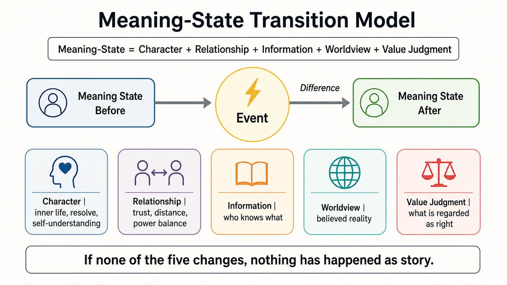
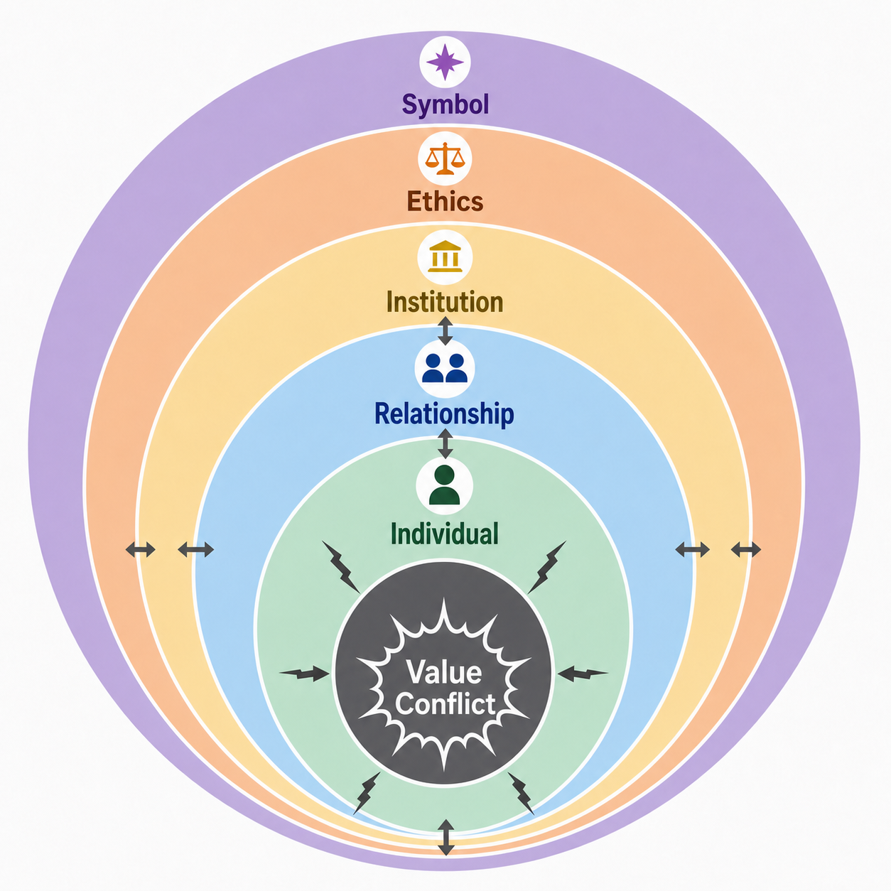
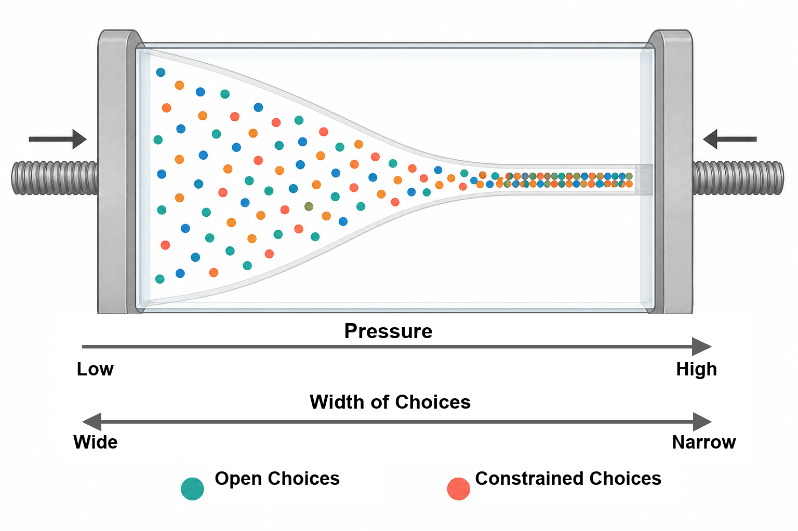
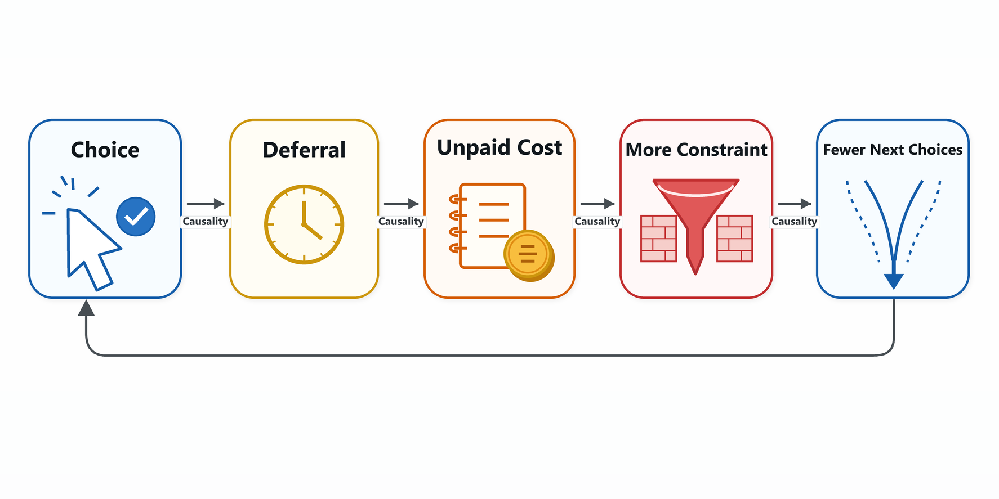
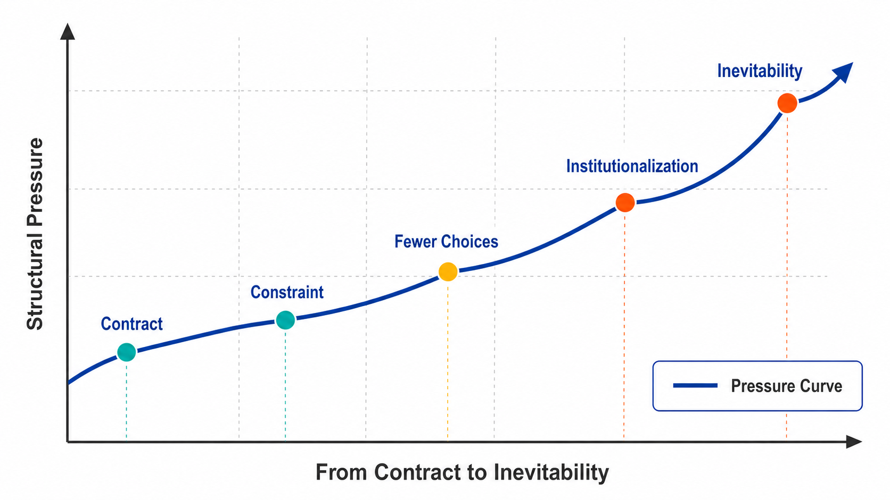
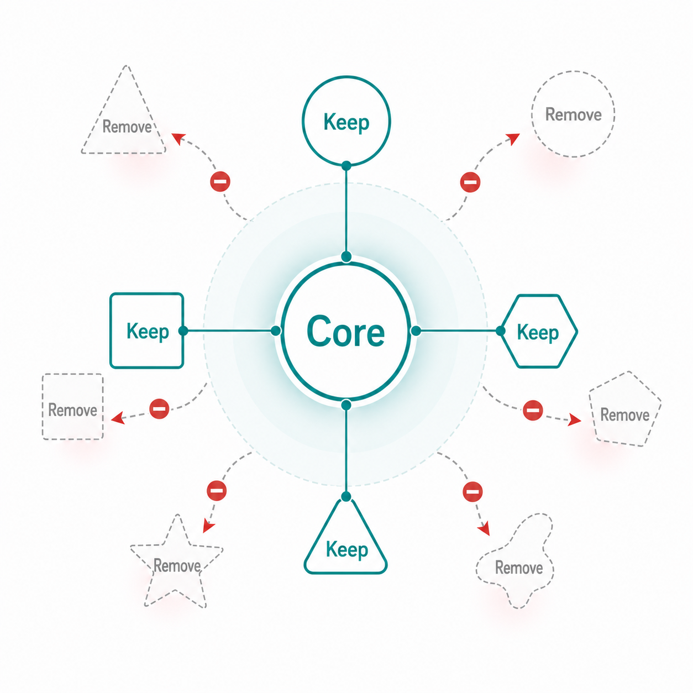
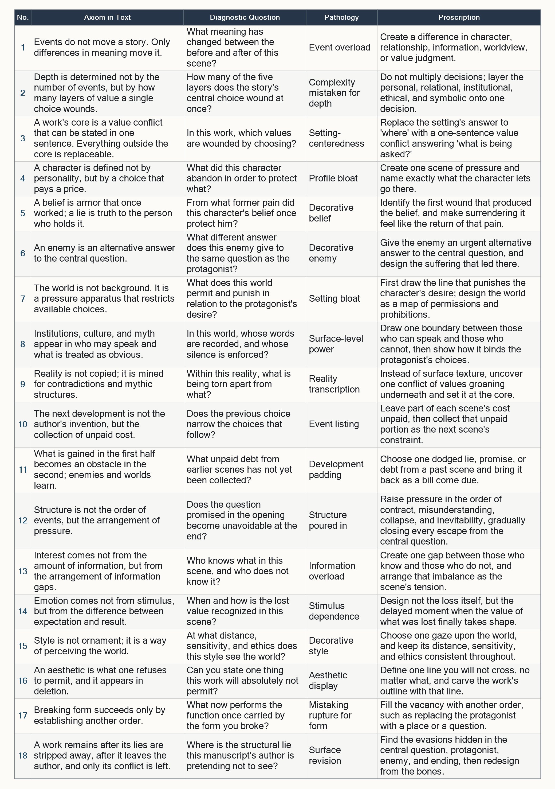

---

# Introduction: Why Adding More Events Does Not Deepen a Story

When a story lacks force, writers usually begin by adding more events. They add enemies, settings, backstory, twists. Yet the manuscript gains no depth, because quantity is not what is missing. Its weakness lies in the absence of meaningful change, value conflict, and costly choice.

## Micro-Level Corrections Cannot Repair a Story

A second trap catches experienced writers with particular force. They reread their own work as readers, notice passages that feel thin or dull, and begin making micro-level changes. They polish the dialogue, add description, adjust the pace. Yet many micro-level problems are only the symptoms of macro-level failures. A scene may feel dull while its sentences are perfectly competent; the structure has not generated the meaning that should arrive there. Repair only the symptom, and the cause remains.

Learning to detect micro-level problems is not enough to create a strong story. What you need is another vantage point: the structure beneath the surface of events, the meanings that change there, the values that collide, and the costs someone must pay. This book is built around that vantage point.

## This Book Concerns Judgment, Not Templates

This book is not a catalog of dramatic templates. Three-act structure, kishotenketsu, foreshadowing, character design: these techniques are useful. But knowing them still does not decide the next scene for you.

This book is about judgment.

- Is this scene necessary?
- Does this enemy expose the protagonist?
- Is this world driving the characters into a corner?
- Does this success create the second-half crisis?
- Should this brilliant scene be cut?

Each chapter articulates one axiom: a principle that helps you answer these questions for yourself, then turns that principle into diagnostic questions for testing your own work. The appendix condenses the eighteen axioms, together with their diagnoses, pathologies, and prescriptions, into a single sheet.

I do not use the word "axiom" as a commandment. Are there really absolute laws in story? That skepticism is legitimate. The axioms in this book are not rules that bind creation; they are minimal principles that make judgment possible when you are lost. You may break them. But if you break one, you must be able to explain, in your own words, what will support the work in its place. The eighteen axioms take that skepticism fully into account while still providing a basis for judgment.

## The Foundational Sentence

This book begins from a single sentence.

> A story is the process by which a value-bearing subject makes an irreversible choice in a constrained world and, through the cost of that choice, updates meaning.

From this definition follow character, enemy, world, causality, the reader's cognition, style, aesthetics, revision, and even the long-term resilience that lets a story cross eras. By the time you finish reading, the guiding question should no longer be "what happens next?" It should be "what should change?" The sole purpose of this book is to turn your eye, irreversibly, from sequences of events to state transitions of meaning.

## A Map of the Eighteen Axioms

The eighteen axioms are not a list of parallel maxims. They form a derivation tree: six branches extending from one trunk, each unfolding an element contained in the sentence above. Figure 1 shows the whole structure. Where does meaning reside? In subject, conflict, and core (Axioms 1-3, Part I). Where does the subject appear? In the character who chooses (Axioms 4-6, Part II). What binds choice? The world as a pressure apparatus (Axioms 7-9, Part III). What does choice produce? Causality driven by cost (Axioms 10-12, Part IV). Where is meaning completed? In the reader's cognition (Axioms 13-15, Part V). What remains at the end? Deletion, authorship, and persistence (Axioms 16-18, Part VI).

Each axiom refines one part of this definition. Whenever a chapter leaves you lost, return to this map. If you stall on a downstream axiom, question the axiom upstream. The whole book can be read as a commentary on this single diagram.


Caption: Figure 1. Overview of the eighteen axioms

---

# Part I: Subject, Conflict, Core

## Chapter 1: A Story Is a State Transition of Meaning

### 1.1 Meaning Changes, Not Events

*Before Part I, a story looks like a sequence of events. Afterward, it looks like a state transition of meaning.*

> **Axiom 1: Events do not move a story. Only changes in meaning do.**

At the opening of a story, a city is engulfed in flames. A gigantic monster appears, and an army is annihilated. Few readers would find this compelling on spectacle alone. Nothing has changed yet.

Writers often confuse "an event happens" with "the story moves." Yet however spectacular an event may be, the event itself has no narrative value. If an explosion occurs and nothing changes for anyone, it is spectacle without consequence.

#### Value Resides in Change

A story moves when an event alters one of the states that carry meaning. Broadly speaking, those states fall into five categories.

- **Character** -- a person's inner life, resolve, self-understanding
- **Relationship** -- trust, distance, or the balance of power between two people
- **Information** -- who knows what
- **Worldview** -- the shape of reality the characters believe in
- **Value judgment** -- what is regarded as right

When even one of these five shifts across an event, meaning has changed. Conversely, an event that shifts none of them is, in narrative terms, the same as nothing happening at all, regardless of the budget spent staging it.

#### The Same Event Changes When Meaning Changes

Consider the principle at the level of a scene: "the protagonist saves a companion who is about to fall from a cliff."

If the rescue changes nothing, the scene remains ornamental action. When, however, the rescued person is the enemy who once murdered the protagonist's family, the act immediately unsettles the protagonist's long-held belief in "revenge." The first change occurs in the inner life. On the enemy's side, the premise of the relationship collapses as well: "Have I been forgiven?" The second occurs in the relationship. And if a third party who witnesses it misunderstands the act as "he has given up revenge," then even the arrangement of information shifts.

The action remains the same: "saving someone from a cliff." In the latter version, however, multiple meanings move at once. That movement is where its narrative value lies.

#### Identifying Ornamentation

When you cannot decide whether to keep or cut a scene, check which of the five has shifted across it. If nothing has changed -- not character, relationship, information, worldview, or value judgment -- the scene is ornamentation. No matter how elaborately it is written, it is a candidate for deletion. Conversely, even a single line of dialogue is a true "event" if it destroys someone's trust or exposes someone's lie.

A story is not a succession of events. It is a chain of state transitions in which meaning is rewritten again and again. This book begins from that point and derives character, world, causality, expression, and aesthetics from the principle of "change in meaning." Take this as the foundation of your craft.

| Item                | Content |
| -------------------- | ------- |
| Diagnostic question | What meaning changes before and after this scene? |
| Misuse              | Mistaking the placement of a spectacular event for movement in the story. |
| Revision direction  | Create a difference in character, relationship, information, worldview, or value judgment. |




Caption: Figure 2. The state-transition model of meaning

---

### 1.2 A Value-Bearing Subject Is Necessary

Events do not move a story by themselves. What moves it is the meaning that changes because of the event. A story moves when character, relationship, information, worldview, or value judgment changes. Meaning, then, must be anchored somewhere.

#### The World Itself Has No Meaning

A dead tree standing alone in a desert has no meaning in itself. But when a traveler who has been wandering for three days finds that tree, it becomes a "landmark." Or it may become "a symbol of despair," or "the last hope."

Meaning does not reside in the world itself. It arises when a subject invests value in an object, person, place, or principle. A story therefore needs a subject.

#### Value Produces Desire, and Desire Produces Choice

When a subject treats an object, person, place, or principle as valuable, desire arises: to obtain it, protect it, or increase it. Desire is what makes people act.

The world, however, does not grant desire in its original form. Time, resources, the wills of others, social norms -- every kind of constraint stands in desire's way. A desire that collides with constraints must detour, break through, or give up. That pressure creates choice.

The narrative chain works like this: **a subject holds a value; desire arises; desire collides with constraints; choice is forced**. At the starting point of that chain stands the subject who holds value.

#### When the Subject Is Blank, Events Spin Their Wheels

Take the event "a great nation collapses." It is immense. But if no one has invested value in that nation, the reader remains unmoved.

Now imagine that "the small village an old soldier has protected for years is burned." Its scale is incomparably smaller. Yet if the story has shown how deeply the old soldier loved that village, and what he sacrificed to protect it, the reader's chest tightens.

The size of the event is not decisive. Who grieves it? The existence of that subject, and the weight of the value it holds for that subject, determines the gravity of the story.

#### Begin with the Subject Who Grieves the Loss

When you write a scene of loss, before you measure the scale of the event, identify the subject who grieves that loss. If there is no subject who grieves it, even the grandest loss is narratively nothing.

| Item                | Content |
| -------------------- | ------- |
| Diagnostic question | Who grieves this loss, and what have they staked on it? |
| Misuse              | Assuming that a larger event will raise the reader's emotion in proportion. |
| Revision direction  | Before the loss, write the history through which the subject invested value in what will be lost. |

---

### 1.3 Without a Cost, It Is Not a Choice

Imagine a character standing at a fork in the road. If they lose nothing no matter which road they choose, that fork might as well not exist for the story. Value produces desire, and desire collides with constraints, producing choice. The pressure now falls on choice.

#### To Choose Is to Give Something Up

Choice is easily mistaken for an act like selecting a dish from a menu. A and B are laid out, and someone reaches for the one they want. But choice in a story is not that.

A narrative choice means **losing something to gain something**. If a character gains without losing, that is not choice; it is mere acquisition. A protagonist picking up a sword is not a choice. Choice begins when he must set down the baby he has been carrying to pick up the sword.

#### Cost Exposes a Person's Values

Why is a cost necessary? Because what a person is prepared to lose reveals what they truly value most.

Suppose a character says, "Family comes first." Anyone can say the words. But when the moment arrives and he must abandon his own honor to protect his family -- if he actually casts honor aside, the words become true. If he cannot cast it aside, the reader sees that honor was what he truly could not bear to lose. A cost is the scale that measures a character's values.

#### A Painless Decision Is Not a Decision

Take a scene in which "the protagonist wavers over whether to betray his best friend in exchange for a large sum of money."

If the protagonist has no interest whatsoever in money, he will not waver. He will choose his best friend immediately, and no conflict will be born. If, however, that money is the only way to save his sick daughter, then no matter which he chooses, he loses something decisive. That condition, in which either path hurts, is what makes choice real.

#### Cost Turns Choice into Propulsion

A story made of painless decisions lacks tension. Conversely, if the characters must surrender a value every time they take a step forward, the reader holds their breath at each step. Designing the cost is what turns choice into narrative propulsion.

Until all three points are present -- a character holds a value, collides with constraints, and chooses by paying a cost -- no accumulation of events will let the story truly begin.

| Item                | Content |
| -------------------- | ------- |
| Diagnostic question | What does the character lose by making this decision? |
| Misuse              | Treating a scene in which a character merely selects what they want as a depiction of choice. |
| Revision direction  | Place hard-to-abandon values on both sides of the choice, so either choice hurts. |

---

## Chapter 2: Depth Is Determined by the Number of Layers in a Value Conflict

### 2.1 A Deep Work Lets a Single Choice Wound Multiple Layers

> **Axiom 2: Depth is measured not by the number of incidents, but by the number of layers of value a single choice wounds.**

Chapter 1 defined story as "a state transition of meaning" and confirmed that choice entails a cost. The next question is no longer whether the story moves, but whether **the story has depth**.

#### Depth Is Not the Amount of Information

A deep story is not one with intricate settings, nor one packed with specialized knowledge. A thick dossier on the story world and a deep story are two different matters.

Depth lies in **how many layers a single choice wounds at once**. A shallow choice disturbs only one problem. A deep choice shakes multiple layers - personal, relational, institutional, ethical, and symbolic - with a single decision.

#### The Five Layers

The layers at stake here can be roughly organized into five kinds.

- **Personal** - the person's own inner life, pride, and way of living
- **Relational** - trust, love, and the balance of power with someone else
- **Institutional** - the order of the organization, law, or community to which the person belongs
- **Ethical** - universal judgment about what is right
- **Symbolic** - the meaning that choice holds for the world

In a shallow narrative, these are processed one layer at a time, in order. In a deep narrative, a single choice pierces through all five sheets at once.

#### Piercing Five Layers with One Choice

Consider a soldier forced to decide whether to let a captured enemy general escape.

If the choice is simply "let him go or kill him," it is a one-layer choice. But if that enemy general once saved the soldier's life, then letting him go preserves his **personal** conscience, while betraying the **institution** by violating military law. If he kills his benefactor, the **relationship** is severed forever; if he lets him go, his comrades' trust collapses because he becomes "a man who bends duty for private feeling." Further still, the judgment opens the **ethical** question of "loyalty to the state or personal obligation," and the fact that he let the general escape spreads across the battlefield as a **symbol** that "this army acts on private sentiment."

The choice is singular: whether or not to let him go. Yet whichever option he chooses, all five layers are wounded. That is depth.

#### Layer, Do Not Multiply

The distinction matters. Depth is not created by increasing the number of options. Even if you multiply incidents, if each one moves only a single layer, the story merely grows longer.

Depth is created by **layering multiple strata onto a single choice**. In the same moment of decision, have the character stake personal pride, a bond with someone, the rules of an organization, an ethical question, and a symbol for the world all at once. Do that, and the reader will be unable to look away from that instant.

| Item                | Content |
| -------------------- | ------- |
| Diagnostic question | How many of the five layers does the story's central choice wound at the same time? |
| Misuse              | Thinking that more incidents or settings will deepen the story. |
| Revision direction  | Do not increase the number of decisions; make one decision bear personal, relational, institutional, ethical, and symbolic pressure. |




Caption: Figure 3. The layered structure of value conflict

---

### 2.2 Set Good Against Good, Not Good Against Evil

"A compelling villain gives a story depth": this is advice you often hear, but it is only half correct. If depth depends on how many layers a single choice wounds, the decisive question is what must collide for that wound to cut deepest and linger in the reader's mind.

#### A Conflict Between Good and Evil Has Its Answer Decided in Advance

The easiest conflict to grasp is good versus evil. A righteous hero defeats a wicked villain. The audience knows from the beginning whom to root for.

Yet precisely this clarity is its weakness. In a conflict between good and evil, the reader's value judgment does not waver. Evil should be defeated; good should win. If the conclusion has been decided before the story begins, no substantive conflict arises. It may be exhilarating, but it will not acquire depth.

#### Because Both Sides Are Hard to Abandon, the Wound Remains

Stories that endure **set good against good**. Freedom and safety. Truth and happiness. Love and responsibility. The individual and the community. Both carry moral weight, and both are hard to abandon. At the moment of choosing, the moral claim of the side not chosen remains as pain.

This follows directly from the idea of "wounding multiple layers." In a choice between good and evil, nothing is lost by abandoning evil. But when it is good against good, whichever side is chosen, every layer connected to the other good is wounded. Because both poles in conflict possess value, the choice pierces through all five layers.

#### An Example of One Valid Claim Against Another

Now take a doctor who must decide whether to administer a limited supply of medicine to save one patient.

If the doctor uses the medicine, the patient in front of him will live. But ten other patients are waiting for the same drug. Saving one life is right. Preserving the allocation for the sake of many lives is also right. No villain is present. Even so, whichever choice he makes, the claim of the side he did not choose continues to accuse both the doctor and the reader.

The instant you add a villain here, a "thief who steals the medicine," the story becomes shallower. The question is replaced by "how do we stop the thief?" and the doctor is no longer torn between values.

#### Preserve the Purity of the Conflict

The author's task is to preserve the moral force of both values in conflict. If either side is stained even slightly, the reader relaxes into the thought, "Then this is the one to choose," and the conflict slackens. Keep both goods equally compelling to the very end. Only a story that can endure that tension leaves aftershocks of value judgment after the book is closed.

| Item                | Content |
| -------------------- | ------- |
| Diagnostic question | Can both opposing poles command the reader's assent on their own? |
| Misuse              | Assuming that making the villain stronger will deepen the conflict. |
| Revision direction  | Do not lower one side into evil; refine both goods until the moral claim of the side not chosen remains painful. |

---

### 2.3 Resolving Too Much Kills the Work

Section 2.2 argued that enduring stories set good against good, not good against evil. Freedom and safety, truth and happiness, love and responsibility: each pair brings two hard-to-abandon values into conflict and keeps the tension between them bright to the very end. The final restraint is to preserve that depth in the ending.

#### When You Hand Over the Whole Answer, the Work Closes

Once an author has built a conflict, the ending brings temptation. You want to hand the reader a clean answer. "Freedom was what mattered after all." "Love won in the end." If you say it that plainly, the story closes in an orderly way.

Yet the instant you hand over the whole answer, the reader has nowhere further to go. Once value judgment has been fixed, there is no longer any room to think. The finished book is quietly closed, with no question left lodged inside it. The two goods held so carefully in balance are reduced by the ending's assertion; one side is erased, and the conflict itself is invalidated.

#### Fix the Meaning; Do Not Fix the Judgment

Avoiding overresolution is no license to throw the ending away without deciding anything. An ending abandoned in ambiguity has no depth; it is unfinished.

Strong endings handle two operations separately. **They fix the meaning of the event while leaving its value judgment open**. Show clearly what happened. Then design the story so that whether it was right continues to waver after the book is closed. Do not confuse what must be fixed with what must remain unsettled.

#### Leave Aftershocks

Consider a concrete example. A mother is forced to choose whether to protect her child, who has committed a crime, or obey the law and turn the child in. In the end, she turns the child in.

If you write here, "She chose justice. It was a noble act," the story closes. The reader assents, "I see, justice was right," and lets it go. But if you show only the mother watching her child's back recede, standing there wondering whether she has stopped being a mother, and then put down the pen, the question remains lodged after the book is closed: Was she right? What would I have done?

The event has been fixed. The child was turned in. That does not change. But the justice or injustice of that choice continues to tremble inside the reader like an aftershock. That is how judgment remains unresolved.

#### Preserve Depth to the End

Chapter 2 defined depth as a structure: a single choice wounds multiple layers (2.1), good is set against good (2.2), and the ending fixes meaning while leaving judgment behind (2.3). All of these techniques concern the story's "core."

| Item                | Content |
| -------------------- | ------- |
| Diagnostic question | In the ending, did you fix the meaning of the event, or did you fix the value judgment too? |
| Misuse              | Thinking that handing the reader a clean answer and closing the story is an honest ending. |
| Revision direction  | Show clearly what happened, and leave open only whether it was right, so that it continues to waver inside the reader. |

---

## Chapter 3: The Core of a Work Can Be Stated in One Sentence

### 3.1 The Core Is Value Conflict, Not Setting

> **Axiom 3: The core of a work is a value conflict that can be stated in one sentence. Everything outside the core can be replaced.**

Chapter 2 showed the structure of depth: a single choice wounds multiple layers, good collides with good, and the ending leaves judgment to the reader. All of these techniques serve the "core" at the center of the story. What is that core? The first danger is mistaking surface for core.

#### Setting Is Not the Core

Ask aspiring writers, "What is your work about?" and many will answer like this: "It's about a magic school." "It's about a society where AI rules over humans." "It's about a kingdom on the verge of ruin."

None of these are cores. They are settings: stages, maps of the world, the "place" where the story happens. No matter how compelling a setting may be, it poses no question by itself. Within the magic school, what is in conflict? If that remains blank, the story has not yet begun.

#### The Core Is a Value Wounded by Choice

The core of a story is **a conflict between values wounded by choice**. The useful formulation is not "a story about a magic school," but "whether someone without talent will choose the place they earned through effort, or choose hatred of those born with gifts." A society ruled by AI is likewise only the setting; the core is whether humans can sacrifice safe control to protect human freedom.

If setting answers "where," the core answers "what question is at stake." In what form does the story hold the good-against-good conflict from Chapter 2: freedom and safety, truth and happiness? Only when you can name that have you grasped the core.

#### Countless Cores Can Arise from the Same Setting

Take a setting described as "a story about a crew traveling for a long time on a spaceship."

That alone has no core. Entirely different works can arise from the same setting. If the question is, "Who should receive the limited oxygen?", the core becomes a conflict between survival and fairness. If the question is, "After learning that Earth has been destroyed before they reach their destination, should they continue the journey?", the core becomes a conflict between hope and reality. The setting is the same single spaceship. But depending on which values you make collide, the work becomes different in kind.

#### Putting the Core into Words

If you can state the two conflicting values in a single sentence, that sentence becomes the compass that guides every scene you will write. If you cannot state it, you have not yet grasped the core. The setting is still leading the work.

| Item                | Content |
| -------------------- | ------- |
| Diagnostic question | In this work, which values are wounded when a choice is made? |
| Misuse              | Treating the center of the work as settled the moment you have created an attractive stage or worldview. |
| Revision direction  | Replace the setting's answer to "where" with a one-sentence value conflict that states the question the work is asking. |

---

### 3.2 The Opening Is a Contract with the Reader

The first page of your work should make a promise, not explain the world in advance. Once an author has grasped the core in one sentence as "a conflict between values wounded by choice," the opening must make that core felt at the threshold of the story.

#### The Opening Is Not a Place for Explanation

Many writers misunderstand the opening as "a place for explanation." If they first lay out the origins of the world, the protagonist's upbringing, the map of relationships inside an organization, and all the necessary information, then surely the reader can enter the story with confidence.

A story that begins with information asks the reader to wait before any dramatic question has been posed. The earlier chapters have already established the principle: attention is seized by the meaning of events and the collision of values. A list of settings is only a "preface" before the conflict begins.

#### The Opening Declares What the Work Is Asking

The opening's true work is to establish a **contract**. It lets the reader sense what the story asks, under what pressure its characters will be torn apart, and whether to follow it. That is the contract.

A contract is also a promise. If the opening hints at the pressure of "choosing between freedom and safety," the work takes on the obligation to answer that question to the end. The contract made in the opening must not be betrayed at the ending.

#### A Contract Can Be Made in a Single Line

Imagine a story that begins when "a stranger comes to a peaceful village and asks for lodging for the night."

If it is merely a tranquil scene, no contract is created. But if letting the traveler stay would force the villagers to break the law, while turning the traveler away would betray their own goodwill, and if that tension seeps into the opening line, the reader recognizes the contract at once. The story has begun to ask, "Which do you choose: law or conscience?" Even without explaining the setting, the opening has delivered the core.

#### Testing the Contract

If the first few lines let the reader sense the question the story will confront them with, the opening has done its job. If the opening offers only an explanation of the world, with no value in conflict, then no contract has yet been made.

| Item                | Content |
| -------------------- | ------- |
| Diagnostic question | Does this opening promise the reader what question the work will ask? |
| Misuse              | Mistaking prior explanation for kindness to the reader. |
| Revision direction  | Cut the list of settings and rewrite the opening so its first lines carry the first hint of the core value conflict. |

That contract can be kept to the end only by protecting the core and discarding the surface.

---

### 3.3 Protect the Core, Discard the Surface

If the opening is a contract with the reader about the question the story asks, what must an author be prepared to do to keep that contract all the way to the end? The sternest discipline in creative work is the courage to let go of material to which you are attached.

#### Protect Only the Core

As drafting moves forward, revisions pile up, or collaborators enter the work, authors are tempted to protect countless elements: the name of a beloved character, the fine details of a carefully built setting, a brilliant scene that felt exhilarating to write. All of these are dear. But they are not what must be protected.

Only **the work's core** must be protected: the conflict between values wounded by choice defined above. As long as that survives, the work stands. Conversely, even if every character name, setting detail, and brilliant scene remains, the work fails if the core becomes blurred. Do not mistake the order of priority.

#### Brilliant Scenes Are the First Things to Question

The most formidable temptation is the "brilliant scene." A scene that felt powerful as you wrote it, a passage readers praised: precisely because of that, even when it does not serve the core, it becomes hard to cut.

The test is always the same: does this scene move the core question forward? If it is merely beautiful and contributes nothing to the conflict of values, it is a weight that blurs the work's center of gravity. The stronger your attachment, the colder your suspicion must be.

#### Popular Characters Are No Exception

This failure is easy to see when a story has a supporting character who has become enormously popular with readers.

Because of that popularity, the author wants to give the character more page time. But if every action by that supporting figure draws focus away from the protagonist's core question of "whether to choose freedom or safety," then popularity becomes corrosive to the work. Readers may regret the cut. Even so, if protecting the core requires it, a popular character also becomes a candidate for removal. Do not surrender the work to the appeal of its surface.

#### Subtraction Makes the Work Stand

Protect the core and discard the surface. That is selection, not loss. The outline of a work is determined by what you can discard as much as by what you can keep.

Part I leads to this line. A story is a state transition of meaning; depth is determined by the number of layers in its value conflict; and the core is that conflict stated in a single sentence. In a work that cannot protect that sentence, not a single surface element is worth piling on top.

| Item                | Content |
| -------------------- | ------- |
| Diagnostic question | Does this scene move the core question forward? |
| Misuse              | Protecting brilliant scenes or popular characters ahead of the core because they feel powerful. |
| Revision direction  | Treat any element that does not serve the core as a candidate for removal, beginning with the ones you are most attached to. |

> **Theorem 3: The core is what remains after everything replaceable has been discarded. If you cannot discard it, it is not yet the core.**

---

## Editing Laboratory I: Turning a Weak Plot into a Core Sentence

Part I supplied three tools: the state transition of meaning, layered value conflict, and the core sentence. The laboratory applies them to a familiar weak premise.

### Material: A Weak Premise

"A peaceful village is attacked by monsters. A young man sets out on a journey, gains power, defeats the monsters, and returns to the village."

The events are in place, but the question from Chapter 1 exposes the weakness immediately. Before and after defeating the monsters, what meaning has changed for the young man? Nothing has changed. The village returns to how it was, and so does the young man. The result is a sequence of events with zero change in meaning.

### Step 1: Introduce a Change in Meaning

Begin by deciding what changes across the events. For example, set up a reversal in which the meaning "the village is a home that must be protected" flips into "the village is a cage one must never leave." Once the endpoint is fixed, the journey becomes the vessel that carries that reversal.

### Step 2: Dig Down to the Value Conflict

Then plant the conflict that produces the reversal. Say that, at the end of the journey, the young man learns that the monsters did not come from outside; they were a device handed down by the village elders "to keep the young from leaving." At that moment, good collides with good. If he reveals the truth, the order that has sustained the village collapses. If he stays silent, the village is protected, but it continues to stand on a lie. Both sides protect a valid good, and whichever he chooses, one good must be sacrificed.

### Step 3: Compress It into the Core Sentence

Finally, fold the conflict into one sentence.

"Should the lie that has protected the community be exposed, or should it be shouldered?"

Once this sentence is fixed, you have a standard for judgment. The design of the monsters, the companions on the journey, the battle scenes: keep them if they serve this sentence, and cut them if they do not. The premise was weak because it lacked this sentence, not because it had too few events.

| Item                | Content |
| -------------------- | ------- |
| Diagnostic question | Does the one-sentence conflict remain in your premise after every event has been stripped away? |
| Misuse              | Trying to strengthen a premise by adding more events. |
| Revision direction  | Design the conflict before the events: first the change in meaning, then the value conflict, then the core sentence. |

---

# Part II: Characters Who Choose

## Chapter 4: Characters Are Defined by Choice

### 4.1 Look at What They Give Up, Not at Personality

*Before Part II, a character looks like a bundle of personality traits. Afterward, they look like a history of choices and costs.*

> **Axiom 4: Characters are defined by costly choices, not by personality.**

Part I identified the core of story: the collision of values wounded by choosing. That core must now take form in the subject who chooses: the character. That essence appears at the point of choice.

#### A Profile Is Not a Character

When writers create a character, they first want to list attributes. Kind, cold, clever, timid, sincere -- pile up enough adjectives like these, and the character appears to have taken shape.

Attributes do not make a character. Even if the text says, "This is a kind character," the reader does not believe in that kindness. Nothing has been chosen yet. Meaning resides in change, and choice means giving something up. A character's shape is revealed through choice, not through a list of attributes.

#### Essence Is Revealed When a Character Is Cornered

In peaceful circumstances, behavior can be staged almost without limit. Anyone can act kindly when they have room to spare. A character's essence reveals itself in **the moment they are cornered and must give something up**.

What they protect then, and what they let go of, is the truth of that person, a truth adjectives can never supply. Cost exposes values; character construction follows the same principle. What a character gives up determines who they are.

#### The Same "Kindness" Splits Apart Through Choice

The principle becomes concrete in a scene. Suppose two characters described as "kind" are each faced with a starving child they do not know and the last loaf of bread meant for the family waiting at home.

One gives the child a share that belonged to the family. The other turns away from the child and hurries home to the family. Both had been introduced as "kind." But what they gave up is different. The first set aside the family's hunger; the second set aside pity for an unknown child. This single choice divides two versions of "kindness" into entirely different character images. Even when the attribute is the same, what is given up defines the character.

#### Questions for Testing a Character

If you can name what they gave up, the character has left the profile stage and begun to breathe.

| Item                | Content |
| -------------------- | ------- |
| Diagnostic question | What did this character give up, and what were they trying to protect? |
| Misuse              | Assuming that a pile of adjectives will bring a character to life. |
| Revision direction  | Place one scene where the character is cornered, and name what they let go of there. |

---

### 4.2 Desire Moves a Character Forward; Lack Makes Them Go Wrong

If a character's essence appears in what they give up, the next question is what drives them toward the scene where loss becomes unavoidable. Two forces move a character: desire and lack.

#### Desire Moves a Character Forward

Desire pulls a character forward. Status, revenge, love, recognition, freedom, survival -- desire makes them rise, take risks, and move through the story. Without desire, they do not rise from the chair. The story remains stopped.

Desire is the character's forward engine. The clearer it is what they want, the easier it is for the reader to follow "where this person is headed." The core identified in Part I, the collision of values wounded by choosing, becomes a collision precisely because the character wants one value strongly enough to act.

#### Lack Makes a Character Choose the Wrong Path

Desire alone does not deepen a character. Another force is needed. That force is **lack**.

Lack is the emptiness inside the character: love that was never fulfilled, a wound that never healed, a past that was never acknowledged. Lack does not move the character forward. Instead, it **makes them choose the wrong solution**. It causes them to misread what they truly need and mistake the object of their desire.

#### The More Desire and Lack Diverge, the More the Character Changes

Suppose a character who grew up without recognition from his father wants "to succeed and make a name for himself."

His desire is success. But the lack at its root is "his father's love." He charges forward in pursuit of success, yet no matter how great a name he makes for himself, he never feels fulfilled. What he truly wanted was recognition, not status. Because of his lack, he runs down the wrong road at full speed. This divergence between desire and lack is what shakes a character within the story and eventually changes them. Only when he realizes that what he wanted was not success can he turn.

#### Questions for Distinguishing the Two Forces

If what a character says they want and what they truly need are the same, they satisfy their desire and stop there; they do not change. If the two diverge, then after running all the way through the wrong solution, the character has room for recognition.

| Item                | Content |
| -------------------- | ------- |
| Diagnostic question | Is there a divergence between what this character says they want and what they truly need? |
| Misuse              | Thinking that strong desire alone makes a character deep, while failing to design the lack at its root. |
| Revision direction  | Place the lack somewhere other than the object of desire, and use the distance between them as the scale of change. |

---

### 4.3 Contradiction Is What Makes a Character Feel Alive

Desire moves a character forward; lack sends them down the wrong road. What they want and what they truly need diverge. Such a character is never perfectly consistent from the start. That contradiction is precisely what gives them life.

#### A Consistent Character Looks Artificial

A common impulse is to create characters without contradictions. Their established traits never drift, their words and actions remain consistent, and they hold to their convictions until the end; such a character can appear fully formed.

A character who is too consistent does not look alive. Instead, they look fabricated. Real human beings are not consistent. Everyone finds yesterday's words and today's actions at odds, and their beliefs colliding with their desires. A perfectly coherent character may be a logical diagram, but not yet a human presence.

#### Human Beings Contradict Themselves and Justify It

Human beings carry contradictions and then justify them. We want to be kind yet hurt people; we seek freedom yet find comfort in being bound. Then we tell ourselves, "There was no helping it," or "This is the right thing."

This self-justification is what gives a character substance. The contradiction is not inert; the character desperately tries to make the pieces fit. In that struggle, readers see themselves.

#### Turning Contradiction Into Propulsion

Suppose a character who publicly declares that he hates betrayal more than anything sells out his companions when he himself is driven into a corner.

Is this a breakdown in the characterization? No. Precisely because he hates betrayal, he cannot help justifying his own betrayal as "that was not betrayal; it was an unavoidable choice." That contradiction and excuse transform him from a flat "righteous man" into a human being with fear and weakness. Contradiction is not a defect; it is a force that moves a character.

#### Questions for Identifying Contradiction

Chapter 4 established that characters are defined by choice, moved by desire and lack, and animated by contradiction. If you cannot find a single contradiction, that character is still only a diagram. If you can depict the contradiction they carry and the excuse they give for it, the character has begun to move.

| Item                | Content |
| -------------------- | ------- |
| Diagnostic question | What internal contradiction does this character justify, and how? |
| Misuse              | Treating a mismatch between words and actions as a breakdown in characterization, and polishing the character into someone without contradiction. |
| Revision direction  | Leave one contradiction in place, and write the desperate excuse the character gives for it. |

---

## Chapter 5: Beliefs, Wounds, and Lies

### 5.1 Belief Is Armor That Once Served Its Purpose

> **Axiom 5: Belief is armor that once served its purpose; a lie is truth to the person who holds it.**

Chapter 4 showed that a character moves forward through desire, goes astray through lack, and comes to life by carrying contradiction. Beneath that contradiction lies the belief that binds them from within. Why would someone stubbornly refuse to let go of an idea? There the chapter begins.

#### A Belief Is Not Merely an Opinion

"People must not be trusted." "If I show weakness, I lose." "Love always ends in betrayal." Beliefs like these are easily mistaken for opinions or habitual phrases, one more element coloring a character's personality.

Belief runs deeper than opinion. It is **a survival strategy that once kept that character alive**. It cannot be discarded easily. To discard it would mean taking off, in the middle of a battlefield, the armor that once saved them.

#### Armor Is Forged by a Wound

Why is belief armor? Because it is put on after pain. Someone who has been betrayed learns, "People must not be trusted," and uses that armor to ward off the second blade. Someone who has been abandoned learns, "If I expect nothing, I cannot be hurt," and uses that shield to keep the next disappointment at a distance.

The "lack" already described and this "belief" are inseparable. If lack is the wound itself, belief is the armor woven so that the wound will never be exposed again. Making a character let go of a belief is therefore equivalent to demanding that they face the pain of the past unarmed. Such a demand can never be easy.

#### Armor Becomes a New Shackle

Take a character who was betrayed in childhood by a parent's debt and now holds the belief, "I will rely on no one and live on my own."

That belief once protected him. If he depended on no one, he would never be betrayed again. With that armor, he survived a lonely boyhood. But now that he is an adult, the same armor binds him. He rejects people who offer help, chooses solitude in moments when taking someone's hand would save him, and keeps running from being loved. The strategy that once saved his life now impoverishes it. Even so, he cannot take it off. If he does, the pain of that betrayal will return.

#### Questions for Digging into Belief

If you can uncover one old wound at the root of a belief, the character will rise from within. Why they are so stubborn and why they cannot change will read as necessities.

| Item                | Content |
| -------------------- | ------- |
| Diagnostic question | What pain did this character's belief once protect them from? |
| Misuse              | Treating belief as an opinion that colors personality, something that can be corrected with a single act of persuasion. |
| Revision direction  | Identify the first wound that produced the belief, and design the act of letting it go so that the past pain returns. |

---

### 5.2 A Lie Is Truth to the Person Who Holds It

Armor can be stripped away, but bones cannot. Beneath the armor of belief, a character carries another support: a perception unmistakably true to them, yet a misrecognition when seen from the outside. That support is the "lie." Through it, a character who cannot take off their armor sees the world.

#### A Lie Is Truth for Enduring the World

Here, "lie" is not an expedient used to deceive someone else. It names a perception the character mistakenly believes about themselves or about the world. "I have no value." "To be loved, I must be useful." "That day, everything fell apart because of me." The usual response is to treat such misrecognitions as "mistakes that need to be fixed."

To the character, they are not mistakes. They are **urgent truths for surviving the world**. If belief is the outer armor, the lie is the backbone that supports the character within it. Being confronted with its falseness is like having the very ground collapse underfoot. They clutch the lie and refuse to let go.

#### Without the Lie's Point of View, the Character Becomes a Puppet

A writer who lacks this point of view ends up moving the character from above. Because the author can see the misrecognition, they grow impatient - "Why doesn't this person realize it?" - and try to force the character into a convenient awakening.

As long as the lie remains truth to the character, they will not wake up so easily. The moment the author stands outside the lie and declares "this is wrong," the figure on the page loses autonomy and becomes a puppet for the author's intentions. To preserve that autonomy, you must stand inside the lie and see the world with the same conviction the character has.

#### Misrecognition Distorts Choices

Suppose a character who lost his mother in childhood believes, "Because I cried, my mother grew weak and died."

Seen from the outside, this is an illogical assumption made by a child. His tears had nothing to do with his mother's death. But to him, it is an immovable truth. Even as an adult, he never cries. He believes that if he shows grief, he will cause someone to die again. Even in front of people he loves, he suppresses every emotion, is misunderstood as cold, and destroys his relationships. A single lie quietly distorts every one of his choices.

#### Questions for Seeing the Lie Clearly

If you can uncover one lie the character believes to be true, the character will stop being the author's mouthpiece and begin moving according to their own logic.

| Item                | Content |
| -------------------- | ------- |
| Diagnostic question | What misrecognition about themselves or the world does this character clutch as truth? |
| Misuse              | Judging the lie from outside as a "mistake that needs to be fixed" and making the character wake up at a convenient moment. |
| Revision direction  | Stand inside the lie, see the world with the character's conviction, and then write the choices that conviction distorts. |

The past wound that produced the lie or belief must now seep into present choices instead of being explained through flashback.

---

### 5.3 Do Not Explain the Wound; Show It in Present Choices

Beliefs and lies both trace back to the same place: a past wound. The wound made the character weave armor and turned misrecognition into truth. At this point, the craft of showing wounds reaches an important fork.

#### A Wound Explained Through Flashback Becomes Lighter

Writers who want to give a character's actions a foundation are tempted to narrate the past wound through flashback. "He became this way because something like this happened when he was young": the origin of the wound is inserted as a whole scene. Surely, this will let the reader understand the character.

A wound that has been explained often becomes lighter. The moment the cause-and-effect is made explicit as "that is why he became this way," the wound turns into commentary, and the pain shrinks into information. The reader may understand the wound and still not feel it. Meaning resides in change, not explanation. A wound, too, should be shown where it acts, rather than narrated.

#### Let the Wound Seep into Present Choices

Then how do you show it? **Show the wound inside the character's present choices**. Do not narrate what happened in the past. Instead, show what the character fears now, what they protect too excessively, what they misrecognize. Let the wound seep into the distorted choice itself.

While the origin remains hidden, the character avoids something to an unnatural degree. The reader wonders, "Why would this person go this far?" and that snag draws the outline of the unspoken wound. A wound reaches deepest when it must be inferred backward from present behavior rather than received as an explanation.

#### Do Not Tell the Past; Show It in the Present

Take a character who once failed to save his younger sister from a fire.

If that past is explained through flashback, the reader thinks, "How pitiful," and moves on. Withhold the flashback, and define him instead by his inability to stand near fire, his abnormal sensitivity to voices calling for help, and, for some reason, his freezing in moments when he could protect someone; that unnaturalness arrests attention without yet disclosing its cause. When the true nature of the wound eventually seeps out through the accumulation of choices, an impact arrives that explanation could never deliver.

#### Questions for Testing the Wound

Chapter 5 entered the inner life of a character through belief, lie, and wound. If the wound can only be spoken about in scenes from the past, it is still commentary. If you can lodge the distortion of the wound in one present choice, the character will carry the past without saying it aloud.

| Item                | Content |
| -------------------- | ------- |
| Diagnostic question | Where does this wound appear in present choices rather than in flashback? |
| Misuse              | Assuming that reader empathy will deepen if the origin of the wound is explained through an entire flashback scene. |
| Revision direction  | Keep the origin hidden, and let the wound seep into present behavior as avoidance or hypersensitivity so extreme it feels unnatural. |

---

## Chapter 6: Enemies and Relationships Expose the Protagonist

### 6.1 The Enemy Is an Alternative Answer to the Central Question

> **Axiom 6: An enemy is an alternative answer to the central question.**

Belief, lie, and wound have led inward. Now the book turns toward the figure who exposes a character most sharply: the enemy. The enemy's function is not interference, but exposure.

#### The Enemy Is Not Placed There Merely to Interfere

Writers commonly place an enemy as an obstacle standing in the protagonist's way. The enemy blocks the road to the destination, disrupts the plan, fights, and is defeated; as long as that role is fulfilled, the enemy can pass for functional.

An enemy who does nothing except interfere makes the story shallow. Such an enemy remains outside the protagonist. The core of a story, as established earlier, is a "conflict of values wounded by choice." If the enemy does not touch that core, then no matter how fiercely they fight, the battle is not taking place at the center of the story. It is only noise in the margins.

#### The Enemy Is an Alternative Answer to the Same Question

A strong enemy is **someone who has answered the same question differently from the protagonist**. If the story's central question is, for example, "which will you choose, freedom or safety?", and the protagonist answers "freedom," the enemy stands as someone who answered "safety." Both carry the same question and have staked themselves on different answers. Their clash therefore illuminates the core itself.

The enemy also **arrives from a different value system to demand payment for the costs the protagonist has avoided**. The obligations the protagonist left unpaid - what Part IV will later discuss as "unpaid costs" - are collected by the enemy in the name of their own righteousness. The stronger the enemy is, the greater the protagonist's payment becomes.

The decisive point is that **the enemy's answer also has moral force**. Recall the good-against-good conflict examined in Chapter 2. The weaker the enemy's moral force, the less intellectual force the story possesses. If the enemy is merely evil, the protagonist's answer is not tested. Precisely because the enemy is urgently right, the protagonist's choice gains weight.

#### The Enemy as Alternative Answer

Suppose a story asks, "Can the individual be sacrificed for the sake of order?", and the protagonist believes, "I will abandon no one."

If the enemy is a tyrant who tramples people out of selfish desire, the story grows thin. The question is displaced into "how do we defeat evil?" Replace that figure with "a former hero who has cut away the few to save the many." He, too, loves people, and after long anguish has come to believe, "Not everyone can be saved." The protagonist's ideal and the enemy's reality both arise from a heart that cares about order and life. The weight of this alternative answer gives the central question dimension.

#### A Question for Testing the Enemy

If you can give the enemy's answer a claim that cannot be waved away, the enemy ceases to be an obstacle and becomes a mirror that reflects the protagonist.

| Item                | Content |
| -------------------- | ------- |
| Diagnostic question | What different answer does this enemy give to the same question as the protagonist? |
| Misuse              | Making the enemy a villain driven only by selfish desire, reducing them to a roadblock, and replacing the question with "how do we defeat evil?" |
| Revision direction  | Give the enemy an urgent alternative answer to the central question, and design the anguish that led them to that answer. |

---

### 6.2 A Strong Enemy Exposes the Protagonist's Lie

An enemy defined as an "alternative answer" must carry a claim that cannot be casually dismissed. That answer forces the protagonist's "lie," examined in Chapter 5, into the open.

#### Weak Enemies Obstruct; Strong Enemies Expose

The usual measure of enemy strength is force. Skill with weapons, command of an army, cleverness in schemes - such forms of strength certainly block the protagonist's path. But that is only the strength of interference.

A truly strong enemy is defined by **the power to expose what the protagonist has pretended not to see**, not by force. Chapter 5 showed how a character clings to a lie about themselves or the world as if it were the truth, and stands on that lie. A weak enemy never touches that lie. They only fight on the outside and are defeated. A strong enemy names the lie under the protagonist's feet and begins tearing away the armor the protagonist has been clutching.

#### The Enemy Strikes the Place the Protagonist Least Wants Touched

Why can the enemy, as an alternative answer, do this? Because the enemy carries the same question. When the protagonist answers "freedom" and the enemy answers "safety," the enemy knows the weakness in the protagonist's answer - the sacrifices the protagonist has looked away from to choose freedom - better than anyone.

The enemy's words pierce for that reason. You may be able to brush off insults from a complete stranger, but you cannot evade the observation of someone who has lived the same question. From outside, the enemy puts into words the lack or fear that the protagonist has hidden even from themselves.

#### The Enemy Who Exposes the Lie

Imagine an enemy standing before a protagonist who believes, "I will abandon no one," after that enemy once tried to save everyone and caused all of their companions to be wiped out.

If they only cross swords, the enemy is merely a formidable opponent. Let the enemy say this instead: "You do not refuse to abandon people because you want to save everyone. You are only afraid to bear the responsibility of abandoning someone." This single line shatters the lie the protagonist has clung to - the self-image that says, "I save everyone because I am kind." Perhaps they were, in truth, only running from the pain of choosing. The enemy has forced the protagonist to face what they could not look at directly.

#### A Question for Testing the Enemy

If the enemy only hinders the protagonist's actions and touches nothing inside them, that enemy is still an obstacle. If the enemy can expose even one lack or fear the protagonist has hidden, the enemy becomes a mirror that shakes the protagonist from within.

| Item                | Content |
| -------------------- | ------- |
| Diagnostic question | What lie in the protagonist can this enemy expose? |
| Misuse              | Measuring the enemy's strength by physical power or the scale of their army, and mistaking the intensity of interference for threat. |
| Revision direction  | Give the enemy a single line that names the sacrifice the protagonist has looked away from. |

The same logic extends to relationships among characters, including enemies like these: relationships are built from debt, not from emotion alone.

---

### 6.3 Relationships Are Made Not of Emotion, but of Debt

Every relationship has a ledger. Beneath love and hatred lies a dense record of unsettled credits and debts. The enemy who exposes the protagonist's lie, too, is another person facing the protagonist across that ledger. The true nature of a relationship lies in "debt," not in emotion alone.

#### Like and Dislike Alone Do Not Move a Relationship

Relationships are frequently reduced to the language of emotion. He loves him, she hates her, they trust that person - list such feelings of liking and disliking, and the inventory can pass for a relationship.

A relationship made only of emotion is static. If they like each other, they stay together; if they dislike each other, they part - if that is all, then neither choice nor conflict emerges. Story advances through changes of meaning. A relationship moves a story when, beneath the emotions, **credits and debts** that cannot easily be settled have accumulated.

#### Relationships Are Made of Debt

What exists between people is not pure emotion. Obligation, control, dependence, secrets, jealousy, exchange, guilt - each of these is an unpaid remainder held between two people.

The one who has received a favor is bound by the need to repay it. The one whose secret is held cannot defy the other person. The one who feels guilt cannot raise their head before the other. These debts bind characters inside relationships. Unable to leave even when they want to, obeying while they hate, unable to betray even while they love - every movement that emotion cannot explain comes from debt.

#### When Debt Changes, No Incident Is Needed

For example, imagine a lord and retainer who have spent many years together.

If the relationship contains only "loyalty," it does not move. But if the root of that loyalty contains the obligation that "the lord once took the blame for a crime," and one day it is revealed that this crime was actually a lie meant to entrap the retainer - then even if not a single emotion changes, the structure of the debt reverses. A favor that had to be repaid becomes a resentment that has to be settled. Without causing a new incident, the rearrangement of credits and debts can dramatically deepen the relationship.

#### A Question for Testing the Relationship

An enemy does not exist only to be defeated. The enemy names the lie the protagonist has hidden more accurately than the protagonist themselves can. A relationship remains static as long as it can answer only in terms of liking or disliking; the moment you can name one obligation, secret, or guilt, it begins to move without waiting for an incident.

| Item                | Content |
| -------------------- | ------- |
| Diagnostic question | What unresolved credits and debts bind these two people? |
| Misuse              | Assuming that a list of likes and dislikes amounts to a relationship. |
| Revision direction  | Place one obligation, secret, or guilt between them, and design the moment that debt reverses. |

> **Theorem 6: A character's true nature appears when an enemy confronts them with an alternative answer and debt binds the relationship.**

---

## Editing Laboratory II: From Characters Made of Adjectives to Characters Who Choose

Part II worked through choice, belief and lie, enemies, and debts. The first test is a familiar character-sheet problem: the "profile-only character."

### Material: A Bundle of Adjectives

"A detective with a strong sense of justice, a warm heart, and a hardworking nature."

The three adjectives are all present, but this character is still no one. Judged by the standard of Chapter 4, the weakness is obvious. What does he give up? Adjectives do not define a character until they are forced into collision.

### Step 1: Place the Belief and Its Origin

Rewrite "sense of justice" as a belief. His belief is: "Procedure is what protects people." Give it an origin as well. When he was a boy, his father took justice into his own hands, injured an innocent neighbor, and destroyed the family. Ever since then, rules have been armor to him, the barrier that keeps people from turning back into beasts. In the language of Chapter 5, this is armor that once served its purpose, and a lie that is true to him.

### Step 2: Place an Enemy Who Exposes the Lie

Design the enemy as an alternative answer to his belief. The leader of a vigilante group keeps saving victims outside procedure. He is someone who breaks the law to protect those the law has failed. This enemy saves people faster than the detective does; more importantly, he is the very person who once saved the detective's own sister by ignoring procedure.

### Step 3: Bind Him with Debt, Then Close with Choice

Now the ledger has been drawn. He owes the enemy a debt he cannot repay. Late in the story, if he arrests the vigilante leader, he betrays the person who saved his sister; if he lets him go, he removes his own armor -- his belief in procedure -- with his own hands.

Whichever he chooses, part of his moral identity is forfeited. That choice defines, for the first time, the true identity that three adjectives could never have written.

| Item                | Content |
| -------------------- | ------- |
| Diagnostic question | If every adjective is erased from this character, can the choice alone make them recognizable? |
| Misuse              | Thinking that adding personality, background, and speech patterns will produce a convincing character. |
| Revision direction  | Convert adjectives into choice in this order: origin of belief, enemy as an alternative answer, debt, final choice. |

---

# Part III: The World as a Pressure Apparatus

## Chapter 7: The World Is a Pressure Apparatus

### 7.1 Build a World by Deciding What It Permits and What It Forbids

*Before Part III, the world looks like a backdrop. Afterward, it looks like a pressure apparatus that restricts the character's choices.*

> **Axiom 7: The world is not a backdrop. It is a pressure apparatus that restricts choices.**

Part II examined characters and relationships. Part III turns to the arena in which those characters stand: the world. The first question concerns what the world permits and forbids, not how it looks.

#### Place Names and History Are Not the World

When writers build a world, they usually want to start by drawing a map. Names of continents, the rise and fall of kingdoms, the lineage of races, currencies and calendars -- enough details like these can give the impression that a world has emerged.

These are only the surface of the world. No matter how elaborate a chronology you make, it creates no pressure by itself. A story moves through a character's choice, and a world enters the story only when it constrains that choice. The essence of worldbuilding, then, is not place names or history. It lies in deciding **what is permitted there, and what is forbidden there**.

#### A World Is a Distribution of Choices

A world is the distribution of choices laid out before its characters. What can be done without consequence in one world may cost your life in another. What is punished, what is overlooked, what is praised -- this map of permissions and prohibitions is the true substance of a world.

What can the character choose, and what can they not choose? Drawing that boundary line is what it means to create a world.

#### The Same Event Carries Different Weight Depending on the World

Test this with one desire: "to love someone of a different social rank."

If this is a world where free love is permitted, it is merely a private matter. It creates no pressure in the story. But in a world where love across ranks is punishable by death, that same desire immediately becomes a life-or-death choice. If the character remains true to love, they will be executed; if they give it up, they will lose something essential in themselves. The event is still the same: a romance across rank. Yet its weight changes completely depending on what the world forbids.

#### Questions for Testing the World

Use the following test:

| Item                | Content |
| -------------------- | ------- |
| Diagnostic question | What does this world permit, and what does it punish, in relation to the protagonist's desire? |
| Misuse              | Mistaking the accumulation of place names, chronologies, and lineages for the creation of a world. |
| Revision direction  | First draw the line that punishes the character's desire, then design the world as a map of permissions and prohibitions. |




Caption: Figure 4. The world as a pressure apparatus

---

### 7.2 Rules Exist to Create Costs, Not Convenience

If the world is a distribution of choices, and if what it permits and forbids is its true substance, what purpose should its rules serve: magic, technology, institutions, culture, and the mechanisms that produce those permissions and prohibitions? The answer begins with cost.

#### Rules Are Not Made to Make Things Convenient for the Protagonist

The temptation is to design rules as tools that give the protagonist power. Magic that lets them fly, an ability that lets them see through enemies, technology that can make anything: rules are added as convenient equipment to help the protagonist survive the world.

Rules that increase convenience weaken the story, because the more a character can do, the more choices disappear. Story resides in choice, and choice resides in cost. A power that can solve anything evaporates conflict. Each time you add one convenient magic, the character has one fewer choice to agonize over.

#### Rules Exist to Create Costs

The rules of a strong world create **cost** rather than convenience. If you use that power, you inevitably lose something. Use magic and your life span shortens; see through the truth and you become unable to trust people; rely on technology and a human faculty is worn away. Only when a rule defines "what can be done" and, at the same time, "what will be lost" can the world corner its characters.

The question to ask is not "What does this setting make possible?" It is "**What must be paid when this setting is used?**" A power without cost is only decoration for a story.

#### Put Poison into Power

Suppose a form of magic can bring back exactly one dead person.

If all it does is bring someone back, it is a convenient rescue device. It can be used whenever someone dies, and no tension will arise. Build a cost into that magic: "In exchange for the one person revived, the caster's most precious memory is permanently lost." The protagonist must give up the memories they shared with the person they love to bring that person back. They can no longer remember who the revived person is -- the moment saving and losing overlap in the same act, the rule becomes pressure that pierces the core of the story.

#### Questions for Testing Rules

Test the rule by asking:

| Item                | Content |
| -------------------- | ------- |
| Diagnostic question | What price does this setting exact when the character uses it? |
| Misuse              | Assuming that the more convenient powers you give the protagonist, the richer the world becomes. |
| Revision direction  | For every power, define "what is lost," and always design what can be done and its cost as a pair. |

---

### 7.3 The World Amplifies the Protagonist's Lack

The world's rules exist to create costs, not convenience. Once a world has costs, how should those costs bear on the protagonist? The final principle of worldbuilding is this: the world must magnify the protagonist's weakness.

#### A Convenient World Makes Characters Shallow

Because writers want their protagonist to shine, they tend to arrange the world for the protagonist's convenience. A place where the protagonist's power works, a mechanism that rewards their beliefs, situations where their weaknesses never have to be questioned -- if you prepare such a gentle world, the protagonist can keep winning comfortably.

No depth arises there. Part II established that characters carry a "lack," and because of it, they take the wrong path. If the world never touches the protagonist's lack, that lack remains asleep. A weakness that is never tested is the same as no weakness at all. A convenient world carefully hides the very part of the character that most needs to be shown.

#### A Good World Magnifies the Weakness the Protagonist Least Wants to See

A strong world does the opposite. It **directly magnifies the lack the protagonist least wants to face**. For someone who fears loneliness, it prepares a structure that forces isolation; for someone ashamed of powerlessness, it prepares situations where nothing can be done; for someone fleeing the past, it creates conditions under which that past always catches up. The world supplies the pressure.

The same function the enemy performed in Chapter 6 when they exposed the protagonist's lie is now carried out at the scale of the world. If the enemy strikes the weakness through another person, the world illuminates the weakness as environment, with no place to escape. Simply by standing in the world, the protagonist is forced to confront their own lack.

#### A World That Amplifies the Lack

Take a protagonist whose lack is an inability to rely on others.

If you place them in an abundant world where they can survive alone, the lack will not be tested. Place them instead in a harsh world where they cannot survive even a single day unless they join forces with others -- a world where food, water, and information cannot be obtained without trust. The protagonist will be continually forced, for the sake of survival, to perform the precise act they are worst at: rely on someone. The world confronts them every day with their weakness as inescapable pressure. Only within that tension is their lack pushed into the center of the story.

#### Questions for Testing the World

Chapter 7 established the distribution of permissions and prohibitions (7.1), rules that create costs (7.2), and the amplification of lack. The final test follows.

| Item                | Content |
| -------------------- | ------- |
| Diagnostic question | Does this world magnify the weakness the protagonist least wants to see? |
| Misuse              | Arranging the world for the protagonist's convenience so that the protagonist can shine easily. |
| Revision direction  | Build one form of pressure into the world that exposes the protagonist's lack without escape. |

---

## Chapter 8: Institutions, Culture, and Myth

### 8.1 Power Is Seen in Who May Speak

> **Axiom 8: Institutions, culture, and myth are revealed in who may speak and what is taken for granted.**

Chapter 7 defined the world as a distribution of permissions and prohibitions, a pressure apparatus that amplifies a character's lack. Institutions, culture, and myth make that pressure concrete. The world's structure of power must now be made visible on the page.

#### Power Is Not Only the Power to Command

Power is often portrayed through relationships of command and obedience. The king commands, and the people obey. A superior issues an order, and a subordinate moves. Once the hierarchy of command is visible, the hierarchy can look like power itself.

Chains of command are only the surface of power. Real power dwells somewhere quieter. **Whose words are recorded, and whose silence is forced** - that is where the map of a world's power is truly drawn. Those who can raise their voices, and those whose voices are erased even when they raise them. That boundary line speaks of power more deeply than any chain of command.

#### Those Who Can Speak, and Those Who Cannot

Power is the distribution of the qualification to speak. Even when people witness the same event, whose testimony remains as "fact," and whose appeal is erased as something that "never happened"? Those who write history, those who are believed in court, those whose names can be carved into the record - they are the ones who possess power.

Conversely, some people are not allowed to speak. Even if they testify, they are doubted; if they raise their voices, they are punished; their very existence is erased from the record. This "inability to speak" binds people more strongly than chains or prisons. A world is the distribution of options. For those who have been stripped of the right to speak, the world is a place with no option except "silence."

#### Depicting Enforced Silence

In a certain kingdom, a noble kills a commoner.

If this is depicted at the level of command - "the king punished the noble" or "the king did not punish the noble" - power remains flat. The murdered commoner's family comes forward to appeal, but the scribe takes no record; the testimony is dismissed as "a falsehood meant to entrap a person of rank," and eventually the incident itself becomes something that never happened. No one draws a sword, and no one gives an order. Even so, the difference between those who can speak and those who cannot illuminates this world's power far more sharply than any command. The reader grasps, in concrete terms, what becomes "fact" here and what sinks into "silence."

#### A Question for Testing Power

The boundary between those who can speak and those who cannot determines the protagonist's own position - whether he can speak, or whether he will be silenced - and constrains his choices from within.

| Item                | Content |
| -------------------- | ------- |
| Diagnostic question | In this world, whose words are recorded, and whose silence is imposed? |
| Misuse              | Thinking power has been depicted once the hierarchy of command and obedience has been shown. |
| Revision direction  | Draw a single boundary between those who can speak and those who cannot, and depict how it constrains the protagonist's choices. |

---

### 8.2 Culture Reveals Itself in Self-Evident Actions

Culture is not found in setting documents. It is found inside the bodies of the characters. The structure of power from 8.1 - whose words are recorded, and whose silence is imposed - is embodied by people as daily behavior. That embodiment is culture. On the page, it appears as gesture.

#### Culture Is Not Something to Explain

Writers are tempted to explain culture. "In this country, there was a tradition of respecting elders." "They worshiped the sun as a god." Place explanations like these in the narration, and the world acquires the appearance of depth.

Explained culture collapses into knowledge. The reader learns only, "So that is the setting," without inhabiting that world. Meaning resides in action, not explanation. Culture, too, should appear as **self-evident behavior**, not as commentary about itself.

#### Culture Seeps Out Precisely in Self-Evident Actions

Culture is densest in moments the characters themselves are not even conscious of. Table manners, ways of mourning the dead, forms of greeting, what is felt as shame, what is treated as honor, before whom one lowers one's eyes, when one falls into silence - the values of that world are absorbed into these "ordinary" gestures.

Precisely because the person performing them does not think, "This is culture," they are real. Culture that is explained is a label pasted on from outside, but culture that emerges as self-evident action is the world itself, carved into the characters' habits.

#### Gesture Tells the World

For example, take this scene: a character serves a meal to a guest.

If you write, "In this country, there was a culture of hospitality toward guests," that is information. Instead, let him silently take the best piece from his own plate and offer it before the guest can refuse, while the guest accepts without hesitation. No one says the word "hospitality." Even so, the gesture makes clear that in this world yielding the best portion to a guest is as natural as breathing. Furthermore, the protagonist's hesitation over that gesture reveals, without explanation, that he has come from outside this culture.

#### A Question for Testing Culture

Finally, use this test:

| Item                | Content |
| -------------------- | ------- |
| Diagnostic question | In what unconscious gesture by the characters does this culture appear? |
| Misuse              | Assuming culture has been depicted once the narration explains, "This country has a tradition of..." |
| Revision direction  | Place a value system inside one behavior no one questions, and replace explanation with gesture. |

Beneath these self-evident gestures lies the story people believe: myth. Its function is less to explain the past than to justify violence in the present.

---

### 8.3 Myth Justifies Present Violence

Culture reveals itself through the self-evident gestures of characters, rather than through explanation. What purpose does the story beneath those gestures - myth - serve? Myth must be understood as a device that justifies the present, rather than as an explanation of the past.

#### Myth Is Not an Old Tale

Myth is often presented as an old tale that tells the origin of the world: how the world was born, how the gods fought, how a hero founded the nation. Prepare such an origin tale, and the world acquires the appearance of historical depth.

A myth that only speaks of the past remains decoration. The reader passes over it, thinking, "So there is a legend like that." A world is pressure that constrains a character's choices. Myth affects the story when it sanctions an act **right now, in this very moment**, not only in the past.

#### Myth Justifies Present Violence

An active myth justifies present institutions, sacrifices, discrimination, honor, and violence as "natural." Why are people of that status oppressed? "Because the god decreed it." Why is a young person offered up every year? "Because the founder swore it." Myth is a device that gives unquestionable grounds for injustice and bloodshed in the present.

Here myth acquires its power. Cruel treatment that might be questioned through reason becomes a "sacred order" no one can resist the moment myth carries it. This also connects to power: who is permitted to speak. Those qualified to tell the myth decide what will count as justice, and what may be treated as an acceptable sacrifice.

#### Myth Consecrates Sacrifice

Imagine a village that offers one daughter to the mountain god every year.

If this remains only a description - "long ago, they made such a promise" - it is mere setting. Now let the villagers sincerely believe that "unless we offer a daughter, the village will perish"; let the daughter chosen for the offering smile and say, "This is an honor"; and have the protagonist who tries to stop it punished as "one who blasphemes against the god." Myth operates not as a story of the past, but as an active device that repaints a murder repeated again this year into "sacred devotion." The protagonist's choice takes on the weight of this: to save one person is to rebel against the order of the world itself.

#### A Question for Testing Myth

Chapter 8 traced the qualification to speak (8.1), self-evident gesture (8.2), and the consecration of sacrifice. The chapter's final principle makes institutions, culture, and myth concrete as pressure within the world.

| Item                | Content |
| -------------------- | ------- |
| Diagnostic question | What present sacrifice or violence does this myth justify? |
| Misuse              | Assuming myth affects the story once an origin tale explaining how the world began has been placed. |
| Revision direction  | Choose one injustice being carried out right now, and make the myth carry the logic that supports it as a "sacred order." |

---

## Chapter 9: Do Not Copy Reality; Distill It

### 9.1 Reality Is a Mine for Contradiction

> **Axiom 9: Reality is not to be copied. It is a mine for contradiction and mythic structure.**

Chapter 8 showed how institutions, culture, and myth give concrete form to the pressures of a world. The inquiry now turns outward, toward reality as the raw material for such worlds. Reality does not need to be copied wholesale; it needs to be used deliberately.

#### Details from Reality Are Not Decorations for Realism

Reality is often used as ornamentation meant to make a work feel authentic. Professional terminology, cityscapes, the customs of an era: write the details accurately, and the world acquires the appearance of texture.

Accuracy of detail, by itself, does not move a story. Here, a world is pressure that constrains a character's choices. Reality becomes powerful in creation when the writer strikes the **contradiction** buried beneath it, not when it is used as surface texture. Reality is material to excavate, not to transcribe: a mine for contradiction.

#### Veins of Contradiction Run Through Reality

Occupation, class, illness, aging, poverty, power: veins of contradiction run through every domain of reality. A norm that ought to protect people fails to save them. One valid claim tramples another valid claim. One person's survival is made possible by another person's sacrifice. These forms of rupture are the raw ore, buried in reality, of the "collision between good and good" described in Chapter 2.

Mining means looking at reality and asking, "What is clashing with what here?" The task is to extract the conflict of values beneath the surface, rather than the surface scenery. That labor turns reality into material for creation.

#### Strike the Contradiction

You are writing the profession of "nurse."

If you accurately depict the uniform and the procedures of treatment, it will look convincing enough. But that is only the surface. The richer material lies in the contradiction buried inside the profession. For example: nurses are asked to stay close to each individual patient, yet in reality they must process dozens of people as if on an assembly line. A place that saves lives is also a place that triages lives it cannot save. When you strike this tear between "attentiveness and efficiency," the nurse changes from a background occupation into a person carrying a collision of values. The core of the story rises out of reality's vein of ore.

#### Questions for Testing Reality

The test is:

| Item                | Content |
| -------------------- | ------- |
| Diagnostic question | In this reality, which value is being torn away from which? |
| Misuse              | Believing that accuracy of detail alone can turn reality into a source of story power. |
| Revision direction  | Instead of surface texture, find one conflict of values beneath the surface and set it at the core. |

---

### 9.2 Research Loses Force When Presented Too Directly

The intuition that more research makes a story stronger is only half correct. Even if you mine a collision of values from the quarry of reality (9.1), raw knowledge loses force the moment you present it directly in the story. Information gained through research becomes weaker the more directly you present it. That paradox is the starting point.

#### Displaying Research Does Not Make a Work

The more diligently a writer researches, the more they want to use every bit of the knowledge they gained. Technical terms, industry customs, historical background, on-site procedures: they cannot bear to waste the information they worked so hard to gather, and they try to write in as much of it as possible.

The amount of information and the strength of a story are not proportional. Often, they move in inverse proportion. Research displayed for its own sake amounts to explanation, not story. A world matters to a story only when it constrains a character's choices. The same rule governs research. If it touches no one's choices, then no matter how accurate it is, within the work it remains marginal source material.

#### Convert Information into a Form That Deprives Someone of Options

Research must therefore be **converted**. Knowledge becomes story pressure only when it is converted into the options it removes and the lie it sustains.

Do not present the fact as a fact. Depict what the character can no longer choose because of it, and what they are forced to hide. Information should not be the object of narration. It should be embedded as a mechanism that drives characters into a corner.

#### Turn Knowledge into Pressure

Suppose your research gives you the medical fact that "the progression of a certain disease is irreversible, and no treatment exists."

If this is explained accurately in narration, it is filed away as the nature of the disease and then left behind. The information remains inert. Transform that fact into pressure. The doctor who gave the diagnosis is torn over how much of the truth to tell the patient. The family is divided over whether to hide the remaining time from the patient or disclose it. The knowledge of the disease's irreversibility becomes, for the first time, pressure on choices: "who cannot say what?" What reaches the reader is not the name of the disease, but the options that disease has taken from people.

#### Questions for Testing Research

The test is:

| Item                | Content |
| -------------------- | ------- |
| Diagnostic question | Whose options does this information take away, and whose lie does it support? |
| Misuse              | Assuming that the more accurately and abundantly you present the research you worked hard to gather, the stronger the work will become. |
| Revision direction  | Stop presenting the fact, and depict what the character can no longer choose, or is forced to hide, because of that fact. |

Beyond the conversion of individual facts lies a larger technique: extracting the mythic structure hidden in reality.

---

### 9.3 Extract the Mythic Structure Within Reality

If all you want to do is copy events from reality, reportage is enough. What a story should take from reality is the structure behind the event that binds people. Beyond the technique of converting individual pieces of information into "whose options does this take away?" (9.2), another, larger act of mining awaits: extracting the **mythic structure** hidden in reality.

#### Copying Reality as It Is Does Not Make a Story

When writers stand before an intense reality, they tend to think that faithfully copying it will be enough to create a work. A painful incident, brutal labor, irrational discrimination: they want to entrust the pen to the weight that reality itself possesses.

A text that only copies reality may be a report; it is not a story. Chapter 8 treated myth as an apparatus that justifies present violence. Behind any event in reality, that mythic structure is already running: the means by which people are made to believe the event is "natural." The surface event is secondary; draw out the binding structure underneath.

#### Draw Out the Six Structures

The mythic structure to be extracted generally takes six forms. **Desire**: what people are made to crave. **Taboo**: what they are not allowed to touch. **Sacrifice**: who is offered up, and how that sacrifice is naturalized. **Repetition**: why it keeps being repeated. **Justification**: the logic by which injustice is sanctified. **Silence**: whose voice is erased. When you view reality through these six lenses, scattered facts rise into view as a single structure that binds people.

#### Dig for the Structure Behind the Event

You are writing the reality that "at a certain company, a young employee collapses from overwork."

If you accurately copy the working hours and the atmosphere of the workplace, it can become reportage. But if you extract the mythic structure - the **desire** and **justification** of "hardship is proof of maturity," the **taboo** against voicing weakness, the **repetition** that remains unchanged even though someone breaks down every year, and the **silence** that erases the person who collapsed as "a failure of self-management" - a single incident takes on universality as a modern myth that keeps offering people up. The reader realizes that the same structure runs through their own workplace as well.

#### Questions for Testing Structure

Part III mined contradiction (9.1), converted information into pressure on choices (9.2), and extracted mythic structure. At the close of the part, these principles compress into a single diagnostic test.

| Item                | Content |
| -------------------- | ------- |
| Diagnostic question | Whose sacrifice does this reality naturalize, what logic sanctifies it, and whose voice does it erase? |
| Misuse              | Believing that faithfully copying an intense reality is enough to give the work weight. |
| Revision direction  | View it through the six lenses of desire, taboo, sacrifice, repetition, justification, and silence, and draw out the structure behind the event. |

---

## Editing Laboratory III: From Decorative World to Pressure Apparatus

Part III established permission and prohibition, rules that generate cost, institutions, and myths. The test case is a familiar failure of setting documents: a world that is merely beautiful.

### Material: Decorative Setting

"A city floating in the sky. Beautiful traditional clothing. Its own calendar and festivals."

The image is picturesque, but by Chapter 7's standard, this world has not prohibited anything yet. No matter what the protagonist chooses, the world stands silently in the background. A decorative world takes no option away.

### Step 1: Introduce Prohibition and Cost

Give the floating city one piece of physics. "There is a limit to the weight the city can carry while remaining afloat, and every year, something must be discarded or it will sink." Now the rule generates cost. The candidates for disposal may be books, old people, or the graves of the dead -- the very standard for deciding what to throw away forces a hierarchy of values onto the inhabitants.

### Step 2: Seal It with Institution and Myth

Next, decide who chooses "what is discarded." The authority to decide belongs to the priestly class that reads the calendar, and only they are permitted to speak of the day of disposal. The beautiful festival's true function is to rename the disposal "an offering to heaven." Here myth becomes an apparatus that justifies present violence.

### Step 3: Turn It Toward the Protagonist's Lack

Finally, direct this pressure toward the protagonist. For a protagonist who clings to a keepsake from his dead mother, a world where "we sink unless we discard something" strikes, year after year, at his lack: his inability to accept loss.

The clothing, the calendar, and the festival are no longer decorative. Everything has become pressure asking him, "What will you let go of?" The world is no longer a place to explain. It has become a place that makes him choose.

| Item                | Content |
| -------------------- | ------- |
| Diagnostic question | What choice does this world take away from the protagonist? |
| Misuse              | Thinking that a more beautiful and unusual setting will bring the world to life. |
| Revision direction  | Reassemble decoration into pressure in this order: prohibition, cost, institution and myth, then aim it at the protagonist's lack. |

---

# Part IV: Causality Driven by Cost

## Chapter 10: Causality Is Driven by Unpaid Cost

### 10.1 Arrange Events in the Order in Which Choices Create the Next Constraints

*Before Part IV, the next development looks like authorial invention. Afterward, it looks like an unpaid cost coming due.*

> **Axiom 10: The next development is not authorial invention, but an unpaid cost coming due.**

Arrangement alone does not turn events into story. Part III considered techniques for turning the world and reality into pressure. Part IV asks how that pressure becomes causality and structure as it passes through characters' choices. That arrangement needs a governing principle.

#### A Chronological Listing Is Only a Timeline

Writers are tempted to arrange events in chronological order. He left the town. He was attacked by bandits in the forest. He reached the castle and met the king -- when events are stacked in order, the story gives the impression of movement.

Events strung together in chronological order are only a listing. No necessity binds the previous event to the next one. He could have reached the castle even without being attacked by bandits, and the story would still work if the order were changed. A sequence of replaceable events is not a story; it is a timeline. Meaning resides in change, and change arises from choice. What should connect events is not time, but the constraints created by choice.

#### The Previous Choice Narrows the Next Set of Options

In a strong story, one choice creates the next constraint. He lied to save his companion. To hide that lie, he had to pile on a new lie. The more the lies multiplied, the more he kept away those who knew the truth, and the more isolated he became -- the previous move narrows the options for the next move, and within those narrowed options he is forced to choose again. When this chain exists, the events can no longer be rearranged.

What is at work here is the **unpaid cost** of choice. A choice came with a cost (Chapter 1). Rarely is that cost fully paid on the spot. The unpaid portion comes back as the constraint of the next scene. What grips the reader is no longer "what will happen to this person next?" but the feeling that this may be the only course left to them, with every escape route being sealed off.

#### Trace the Chain

The chain is easiest to see in a small act: "the protagonist steals just once because of poverty."

If he leaves the town afterward, the theft ends as an independent episode. But if the money he stole saved his sick mother, while a witness to the theft gained leverage over him, the theft continues to operate inside the plot. If he then has no choice but to obey that person's orders and becomes involved in still heavier crimes, the first small choice binds the character to a quagmire from which he cannot escape. The act of stealing strips away every option that follows.

#### Testing Causality

| Item                | Content |
| -------------------- | ------- |
| Diagnostic question | Does the previous choice narrow the next set of options? |
| Misuse              | Mistaking a large chronological stack of events for forward movement in the story. |
| Revision direction  | Leave part of each scene's cost unpaid, and let that unpaid portion come due as the constraint in the next scene. |




Caption: Figure 5. The causal chain of unpaid cost

---

### 10.2 Let the First Half's Success Breed the Second Half's Hell

If events should be arranged in the order in which choices create the next constraints, then the story moves forward when each previous choice narrows the next set of options. The chain works most dramatically in the second half of the story. Where should that crisis come from?

#### Do Not Drop the Second-Half Crisis from Outside

Once a story passes its middle, the writer wants to impose new trials on the protagonist. A stronger enemy, a larger disaster, an unimaginable conspiracy -- the writer injects a crisis from outside to make the second half more exciting. But a crisis that drops in from outside looks abrupt.

It looks abrupt because it is severed from the chain of choices up to that point. A story moves through a chain in which the previous choice forces the next one. If a great enemy with no relation to that chain suddenly appears in the second half, the reader is pulled out of the story and thinks, "Why this, now?" A crisis that drops in feels like authorial convenience.

#### Hell Grows from the First Half's Victories

In a strong story, the second-half crisis grows out of the **success** of the first half. The victories the protagonist won, the lies they told, the costs they evaded: these slowly mature into poison, then become dangerous all at once in the second half.

The greater the gain in the first half, the more heavily it bears down in the second half. If the protagonist lies to protect someone, that lie eventually binds them. If they sacrifice someone to win, that person returns as a more dangerous force. The crisis of the second half does not come from outside; it is a seed the protagonist planted in the first half. The reader can therefore accept that "they brought this on themselves" even while holding their breath at the lack of escape.

#### Plant Poison in Success

Consider a concrete example: in the first half, the protagonist spares an enemy officer and makes a deal with him to protect their companions.

Thanks to that deal, the protagonist escapes the crisis, and the companions are saved as well. It is a first-half victory. But the officer they spared builds up his power and returns in the second half at the top of the organization. Worse, he holds over the protagonist the fact that "you made a deal with me back then," and corners them as a traitor in front of their companions. The choice that saved a life in the first half robs the protagonist of their place of belonging in the second half. The crisis has not dropped in from outside. The success of that day produced hell over time.

#### Testing the Second Half

| Item                | Content |
| -------------------- | ------- |
| Diagnostic question | Which success in the first half gave birth to the crisis of the second half? |
| Misuse              | Bringing in a great enemy or disaster from outside, unrelated to all prior choices, to add excitement to the second half. |
| Revision direction  | Look for the roots of crisis in the first half's victories, lies, and costs the protagonist evaded, then let them mature into poison over time. |

The forbidden move is the one that instantly cuts through the chain of causality built by prior choices: rescue by chance, which erases the gravity of a story.

---

### 10.3 When Chance Saves, Gravity Disappears

Just as the protagonist faces certain doom, help happens to arrive. With that one line, the chain of causality built up to this point is cut. Even if you have grown the second-half crisis from the success of the first half, placing a chance rescue at the ending cancels everything out. This forbidden move erases the gravity of a story.

#### Chance Can Be Used to Begin

First, chance itself is not evil. Chance often needs to appear at the beginning of a story. The character happens to witness an incident. They meet that person by chance. An unexpected letter arrives -- such coincidences function as entrances that drag a character into the story.

Readers accept the chance event at the beginning because they have not yet seen what the character will choose from there. Chance is permitted in a story before the chain of choices begins. Everything depends on where chance is used.

#### When Used to Rescue, Everything Becomes Weightless

What is not permitted is **using chance to save the protagonist**. In a desperate predicament, someone who just happens to pass by helps them. At the instant they are cornered, the enemy conveniently self-destructs. Such rescues make all the choices and costs accumulated up to that point worthless in an instant.

A story moves through a chain in which the previous choice forces the next one. A chance rescue cuts that chain from outside. If, no matter how many painful choices a character has made, chance cancels everything at the end, then those choices never meant anything. Once the reader senses that "something will save them anyway," the thread of tension snaps.

#### Rescue Invalidates Choice

The same principle becomes visible in a rescue scene. The protagonist is forced to choose between saving a companion and surviving themselves.

Here, the protagonist chooses the companion with wrenching resolve and prepares for their own death -- and at that instant, suppose a landslide happens to occur, sweeps away the enemy, and saves the protagonist too. The protagonist's resolve ends up paying nothing. A choice made with their life at stake is transformed by chance into something they "did not need to stake" after all. The reader's tension releases. Conversely, when the protagonist pays the cost of that choice, their resolve remains real.

#### Testing Chance

Causality is driven by unpaid cost. Choice creates the next constraint, the success of the first half prepares the second-half crisis, and chance erases the gravity of the story the instant it cuts that chain. What moves a story forward is not the quantity of events, but the weight of costs that have not yet been paid.

| Item                | Content |
| -------------------- | ------- |
| Diagnostic question | Does this chance event begin the story, or does it save the protagonist? |
| Misuse              | Treating chance, once admitted as an entrance, as if it could also resolve a desperate situation. |
| Revision direction  | Rewrite a rescuing chance event as the entrance to a new hardship, and make the protagonist pay the cost of the predicament through their own choice. |

> **Theorem 10: The gravity of a story is the sum of its unpaid costs. The instant chance pays that cost in someone's place, gravity disappears.**

---

## Chapter 11: What Happens Next

### 11.1 Let Unpaid Debts Come Calling

> **Axiom 11: What is gained in the first half becomes an obstacle in the second; enemies and the world learn.**

Chapter 10 showed how causality is driven by unpaid costs. Choices must be arranged so that each one creates the next constraint; success in the first half breeds hell in the second; and if coincidence saves the characters, gravity disappears. The practical question becomes concrete: look for the next development in the unpaid past.

#### The Next Development Is Not Something You Invent Anew

When the writing stalls, writers tend to ask, "What should I make happen next?" and look outward for a new incident. A new enemy, a new event, a new setting: they try to import fresh stimulation from outside what they already have.

Incidents added from outside often sit apart from the story. Strong developments come from the chain in which the previous choice forces the next one. A newly invented incident lies outside that chain. So before asking "What should happen next?", you should first **look back over past scenes**. The next development is not an invention; it is a seed already present, now ready to be called in.

#### Unpaid Debts Always Return

As the story moves forward, characters leave liabilities unpaid. Lies they told, promises they failed to keep, people they hurt, power they borrowed: these are the obligations they left behind to get through the moment.

They do not disappear. They are waiting to be collected. The next development is created by choosing one of these unpaid items and letting it come calling. A hidden lie is exposed. The other person remembers a broken promise. Someone who was hurt returns with new power. A borrowed power demands its price. None of these are new incidents. A debt already present in the story has reached maturity. It reaches the reader as inevitability.

#### Trace the Debt as It Comes Due

Early in the story, the protagonist lies to an unknown villager, saying "I am an official," and receives help to shake off pursuers.

If you look outside the story and ask "What should happen next?", the result will be an unrelated new incident. Instead, you need only look at the unpaid lie. In the middle section, the villager appears before the protagonist seeking an official's help and reverently calls him "the official from that day." If the protagonist maintains the lie, he continues deceiving the villager; if he reveals the truth, he betrays the person who helped him. The small lie from the beginning has returned as a bill that has come due.

#### Questions for Testing the Development

| Item                | Content |
| -------------------- | ------- |
| Diagnostic question | What unpaid lie, promise, injury, or debt from the scenes so far has not yet come due? |
| Misuse              | Trying to fill a stalled passage by importing a new enemy or incident from outside the chain of choices. |
| Revision direction  | Choose one lie, promise, injury, or debt left unpaid in a past scene, and let it return as a bill that has come due. |

---

### 11.2 Turn Acquisitions into Obstacles

A sword won through hardship can become tomorrow's chain. Among the unpaid liabilities that come calling, acquisition is one of the most distinctive. The technique is to turn the protagonist's **acquisition** itself into an obstacle.

#### Do Not Let an Acquisition Remain an Ally to the End

In a story, the protagonist gains assets of many kinds: a powerful weapon, decisive information, high status, reliable companions. What was gained through hardship is usually left on the protagonist's side as an ally. The protagonist uses the gained power to defeat the next enemy, the gained information to solve the mystery, the gained status to open a path forward.

If acquisitions only continue to be allies, the story keeps growing easier. Strong developments come from the pressure of narrowing choices. When power increases, hesitation decreases. What has been gained must therefore be turned into the seed of the next hardship.

#### The More You Gain Something, the Harder It Becomes to Lose

An acquisition turns into an obstacle because **what you gain becomes something you cannot afford to lose**. Once you have a weapon, the fear of having it taken arises. Once you hold information, you are targeted as someone who knows it. Once you gain status, that very status prevents you from moving freely. Once you gain companions, those companions can be taken hostage.

What was a means of moving forward becomes a burden that must be protected. Success itself becomes the next weakness.

#### Power Turns into a Shackle

This principle is clearest in the acquisition of power. Suppose the protagonist gains an overwhelming power capable of crushing the enemy.

If he merely keeps winning with that power, the tension thins. But if that power injures the people around him every time he uses it, then the more the people he wants to protect are nearby, the less he can wield it. The strongest weapon becomes the greatest shackle in front of the person he loves most. The acquisition itself creates the hardship.

#### Questions for Testing the Acquisition

| Item                | Content |
| -------------------- | ------- |
| Diagnostic question | What liability will the protagonist's acquisition become next? |
| Misuse              | Letting a weapon, information, status, or companion gained through hardship function only as the protagonist's ally until the end. |
| Revision direction  | Give the acquisition the weight of a value that cannot be lost, and let it create the next hardship either through fear of loss or by making the protagonist a target. |

As the protagonist's gains accumulate, another form of pressure appears: enemies and the world react to the protagonist's actions and learn from them.

---

### 11.3 Let Enemies and the World Learn

What the protagonist gains can become the seed of the next hardship. While the protagonist keeps making choices and gaining power, what are the enemies and the world doing? Dynamic pressure arises when enemies and the world react to the protagonist's actions and **learn**.

#### Enemies Who Merely Wait Look Like Authorial Convenience

Enemies and obstacles tend to be stationed in fixed locations. Clear this fortress and the next enemy appears, with another beyond that: each one waits in the same posture for the protagonist to arrive. If the protagonist defeats them in order, the story moves forward.

An enemy who only waits is a stationary target. No matter what the protagonist does, the enemy's posture does not change. A strong story moves through the chain in which a prior choice forces the next one. If the enemy does not react at all to the protagonist's choices, that chain breaks on the enemy's side. The reader sees enemies arranged for convenient defeat, and feels the author's hand arranging the world.

#### A Responsive World Creates Pressure

Enemies and worlds with agency **react and learn** in response to the protagonist's actions. If they were defeated by that method last time, the same method will not work next time. If the protagonist uses fire, the enemy waits prepared with water. If the protagonist wins through information warfare, from then on the enemy conceals information. Institutions, too, see the protagonist's resistance, change the law, and intensify surveillance.

Every time the protagonist makes a move, the world makes a move in return. When this exchange exists, the protagonist's success does not last forever. The more he wins, the more the opponent studies him and blocks off the same winning routes. Progress itself raises the next wall higher.

#### Trace the Learning Enemy

Take this sequence: the protagonist infiltrates enemy territory in disguise, successfully steals information, and escapes.

If the next infiltration succeeds with the same disguise, the enemy remains a target. If the enemy learns, it analyzes the previous method; next time, it establishes checkpoints that inspect everyone's faces and starts spreading false information to flush out internal collaborators. The protagonist can never again use the method that succeeded once. Moreover, if someone saw his face during the previous infiltration, that becomes a weakness to be exploited. His victory has made the enemy smarter.

#### Questions for Testing Learning

Chapter 11 used three methods: calling in unpaid debts (11.1), turning acquisitions into obstacles (11.2), and having enemies and the world learn (11.3). All three derive what comes next from debts and reactions that already exist, rather than inventing new incidents.

| Item                | Content |
| -------------------- | ------- |
| Diagnostic question | How have the enemies and the world changed in response to the protagonist's previous move? |
| Misuse              | Placing enemies and obstacles in fixed locations and having them wait in the same posture for the protagonist to arrive. |
| Revision direction  | Have the enemy study the protagonist's winning routes, and update the world move by move so the same method will not work twice. |

---

## Chapter 12: Structure Is an Arrangement of Pressure

### 12.1 The Opening Is a Contract, the Early Phase Is Misunderstanding, the Middle Is Collapse, and the Ending Is Inevitability

> **Axiom 12: Structure is not the order of events, but the arrangement of pressure.**

Chapter 11 examined techniques for deriving the next development from unpaid debts coming due, acquisitions that turn into obstacles, and enemies that learn. Those developments must now be arranged as the overall **structure** of a story. First, one point must be clarified: is structure a template you are supposed to memorize?

#### Structure Is Not a Template to Memorize

When writers hear the word structure, they tend to want to apply templates such as kishotenketsu or three-act structure. Place a turning point on a certain page, create the peak at a certain spot. It can feel as if the story will take shape if you pour it into a frame.

A story does not move just because a template has been applied from the outside. Development arises inevitably from a chain of choices. Structure is the **arrangement of pressure** applied to that chain: a design for where to intensify pressure and where to close off escape routes, not a frame to memorize.

#### Four Arrangements of Pressure

Pressure changes across roughly four phases. **The opening is the contract**: it promises the reader what question this work will ask. **The early phase is misunderstanding**: the protagonist begins moving while believing in the wrong solution to the central question. **The middle is collapse**: that wrong solution stops working, and the lie the protagonist has been clutching falls apart. **The ending is inevitability**: the protagonist can no longer do anything but face the central question they have kept running from. This is not a template. It is a curve in which pressure rises stage by stage.

#### Tracing the Arrangement

Trace this through a single story: the story of a protagonist who believes, "I will abandon no one."

In the **opening**, the story establishes the contract around the question, "Can everyone be saved?" In the **early phase**, he presses forward under the misunderstanding that "if I try hard enough, I can save everyone." In the **middle**, a situation arrives in which saving one person means another person will die, and that belief collapses. In the **ending**, he is driven to a point where choosing can no longer be avoided, and he is forced to answer head-on the question he has avoided most: "Whom will I abandon?" The pressure rises along a single curve from contract to inevitability.

#### Questions for Testing Structure

| Item                | Content |
| -------------------- | ------- |
| Diagnostic question | Has the question promised in the opening become unavoidable by the ending? |
| Misuse              | Thinking that structure has been created once the story has been poured into a kishotenketsu or three-act frame. |
| Revision direction  | Raise the pressure in the order of contract, misunderstanding, collapse, and inevitability, and gradually close off escape routes from the central question. |




Caption: Figure 6. Structural pressure from contract to inevitability

---

### 12.2 A Scene Is Judged by the Difference in State

The setting changes, so a new scene begins. This common assumption is wrong. The smallest unit that builds the pressure curve from contract to inevitability is not a division of place or time. A scene should be judged by the **difference in story state**.

#### A Scene Is a Difference in Story State

Scenes are commonly defined as divisions of place or time: a scene in the castle hall, a scene in the market the next morning, a scene at the nighttime camp. If the setting changes, a new scene has begun.

A scene divided only by location is a container, and empty containers can still be placed in sequence. A scene is a difference in story state. If none of the five states introduced in Chapter 1 has changed - character, relationship, information, understanding of the world, or value judgment - then it is not a scene, even if the location has changed. It is a record of movement.

#### A Passage with Zero Difference Is a Candidate for Deletion

The criterion is direct. Compare the story state before and after the passage, and ask whether even one of the five has changed. If one has, it is a scene. If none has, then no matter how beautiful the description may be, it becomes a candidate for deletion.

Ask the practical question: **If this entire passage were removed, would the story be in trouble?** If not, that passage has not rewritten any state. Scenes placed there for atmosphere or to fill length usually expose themselves here.

#### Distinguishing Whether a Difference Exists

Take a scene in which "the protagonist eats with their companions."

If they eat together pleasantly and the scene ends, the setting may have been depicted, but the difference in state is zero. The story would not be in trouble if it were cut. It is a candidate for deletion. Then let a companion, in the middle of that meal, say something that makes the protagonist realize, "This person knows my secret." Information moves, tension runs through the relationship between the two of them, and the protagonist's value judgment changes completely. The same meal scene becomes indispensable; without it, the story would no longer hold together.

#### Questions for Testing Scenes

| Item                | Content |
| -------------------- | ------- |
| Diagnostic question | How does the story state differ before and after this passage? |
| Misuse              | Counting a passage as a new scene merely because the setting or time has changed. |
| Revision direction  | Shift at least one of character, relationship, information, understanding of the world, or value judgment, and cut any passage that cannot shift one of them. |

---

### 12.3 A Beat Is a Tiny Transfer of Power

If a scene is a unit counted by change, not by location, then only passages in which character, relationship, information, understanding of the world, or value judgment moves deserve the name scene. Inside that scene, the smallest pulse is the beat.

#### Dialogue Is Not the Handoff of Information

Dialogue is easily reduced to a means of conveying information. A explains the circumstances, B asks a question, and A answers. If the necessary information reaches the reader, the dialogue can pass for complete.

Dialogue that does nothing beyond transmitting information is flat. Who told whom what? That alone causes nothing to tremble on the page. Story moves through changes of meaning. Dialogue, too, acquires force through the **movement of power** beneath the surface, not through the handoff of information alone.

#### A Beat Is a Small Reversal of Superiority and Inferiority

A beat is the smallest unit that composes a scene. A single line, a single silence, a single glance: each time, power, information, or emotional leverage moves between two people. Superior and inferior, the one who knows and the one who does not, the one accusing and the one apologizing, the one controlling and the one obeying. These positions switch places little by little, or decisively, with each exchange. Each of those minute reversals is a beat.

A single line can strip advantage from the person who held it. The other person's silence can expose the one hiding something. Dialogue without beats lets only information flow while power remains unmoved. The result is boredom.

#### Tracing the Movement of Power

Suppose a superior is pressing a subordinate about a failure.

If the superior merely reprimands and the subordinate merely bows their head, power remains fixed with the superior, and nothing moves. But the instant the subordinate quietly replies, "You were the one who gave that instruction," superiority and inferiority reverse. The accusing side and the apologizing side switch places. If the superior falters, the power tilts even further toward the subordinate. Eventually, the very silence in which the superior hesitates and says, "That was..." becomes a beat that speaks of defeat. The same conversation becomes an exchange of tension by marking the movement of power.

#### Questions for Testing Beats

Part IV examined causality and structure: the chain in which choices produce the next constraints, unpaid debts coming due, the arrangement of pressure, and the movement of power in beats. All of these are designs of the story's structure. Part V turns to the receiving mind: how structure is taken in, predicted, misunderstood, and felt as emotion.

| Item                | Content |
| -------------------- | ------- |
| Diagnostic question | In this exchange of lines, toward which speaker did power tilt? |
| Misuse              | Using dialogue to hand information to the reader, and treating it as finished once the matter has been conveyed. |
| Revision direction  | Mark, line by line, whether superiority, information, or control has shifted, and cut lines in which power does not move. |

---

## Editing Laboratory IV: From a Sequence of Events to a Chain of Unpaid Costs

Part IV established unpaid costs, the second-half crisis that grows from first-half success, and the arrangement of pressure. The example is a plot sequence connected only by "and then."

### Material: A Sequence of Events

"(1) The protagonist wins a gladiatorial tournament. (2) He is welcomed into the capital's order of knights. (3) A powerful enemy appears. (4) An ally betrays him. (5) After a fierce battle, he wins."

(1) and then (2), (3) and then (4). By Chapter 10's standard, this sequence has no causality. The powerful enemy and the betrayal are "introduced" from outside, and nothing has grown out of the victory in (1). The plot contains many events, but no gravity.

### Step 1: Bury an Unpaid Cost in the First Success

Rewrite (1) as a choice. To win, the protagonist targeted his best friend's old wound in the final match. It was the only way to win -- and here he chose "glory over friendship," while the cost remains unpaid.

### Step 2: Make Each Event Collect the Debt

Once the unpaid cost is set, the remaining events fall into place. (2) The order of knights welcomed him because of his reputation as "a man who will do anything to win"; success itself becomes a cage. (3) The powerful enemy who appears is a man trained by the friend who put down his sword; the friendship he betrayed returns in another form to collect. (4) The ally who betrays him is a witness who knows what he did in the final; the hidden lie accrues interest.

### Step 3: Make the Final Stretch Unavoidable

The fierce battle in (5) no longer comes from outside. Create a situation where, to win, he has only one move available: the same move from that day, "target the opponent's old wound." Will he repeat the same choice and be hollowed out by glory, or will he pay the cost for the first time and lose? (1) forces (5). Here lies the difference between a sequence of events and a causal chain.

| Item                | Content |
| -------------------- | ------- |
| Diagnostic question | Is each development connected by "and then," or by "therefore"? |
| Misuse              | Introducing new incidents or characters from outside whenever the story feels stalled. |
| Revision direction  | Bury an unpaid cost in the first success, then make every later development collect it. |

---

# Part V: Reader Cognition

## Chapter 13: Information Is Placement

### 13.1 Interest Arises from Information Gaps

*Before Part V, interest and emotion look like products of talent. Afterward, they look like matters of information placement and expectation.*

> **Axiom 13: Interest arises not from the amount of information, but from the placement of information gaps.**

Up through Part IV, the design has been on the story's side: core, character, world, causality, and structure. Part V turns toward reception. How is the story received, predicted, and misunderstood? Interest is the entry point.

#### Interest Is Not a Matter of Having More Information

One common attempt is to create interest through the quantity of information. Intricate settings, surprising facts, skillful foreshadowing: the assumption is that each additional fact will draw the reader further in. That assumption is tempting.

Interest is not the total volume of information. It arises from **an imbalance in information**: who knows, who remains ignorant, and where the difference lies. Only when that gap exists does tension first arise. A scene in which everyone knows the same information, no matter how densely packed with it, lies in a quiet calm.

#### Three Kinds of Gap

Information gaps generally operate on three layers. **Gaps between characters**: one person knows a secret the other does not. **Gaps between audience and character**: one side knows a truth the other misses. **Assumptions inside the reading mind**: a belief may be accurate, or it may be a mistaken conviction. The placement of these imbalances can become either suspense or surprise.

#### Gaps Create Tension

In a scene, it looks like this: "The protagonist walks down a night road alongside a smiling friend."

If the two of them chat with no imbalance of knowledge, the scene remains warm and peaceful, nothing more. Let only the audience know that "this friend has arranged to betray the protagonist tonight," and the same walk home becomes tense with every word. Each time the friend says, "Let's always stay friends," breath catches. Nothing has changed in the walk itself; that hidden gap charges an ordinary night road with tension. Conversely, if the protagonist suspects the betrayal and the friend does not realize it, the information gap produces an entirely different kind of tension.

#### Questions for Testing Information

| Item                | Content |
| -------------------- | ------- |
| Diagnostic question | In this scene, who knows, who remains ignorant, and where does the gap lie? |
| Misuse              | Thinking that each additional setting detail or fact explained will draw the reader further in. |
| Revision direction  | Create one difference between those who know and those who do not, and place that imbalance as the scene's tension. |

The next problem is how to set that informational imbalance along the time axis. Foreshadowing is delayed meaning: it rewrites the meaning of the past after the fact.

---

### 13.2 Foreshadowing Is Delayed Meaning

Interest is an imbalance of information: who knows, who remains ignorant, and where the gap lies. Arranging that imbalance over time is the work of foreshadowing.

#### Foreshadowing Is Not Advance Notice

Foreshadowing is often understood as "advance notice of something that will happen later." You place a clue before an important event, and then, when the reveal comes, say to the reader, "See, I did show it to you properly." In this view, foreshadowing is groundwork laid for consistency.

Foreshadowing as advance notice is only an alibi. A story's force lies in changes of meaning. Foreshadowing, too, should be placed **to rewrite the meaning of the past after the fact**, not to announce the future.

#### Foreshadowing Is Delayed Meaning

The essence of foreshadowing lies in handing the audience a piece of information before its true meaning can be understood. The detail passes almost unnoticed. Later, however, at the instant another fact is revealed, the meaning of that earlier scene is rewritten in its entirety.

Call this "delayed meaning." The information is placed early, but its meaning arrives late. At the same moment the new fact arrives, the reader is pulled back to earlier pages and reconstructs the story: "So that was what it meant."

#### The Past Is Rewritten

Early on, a character casually lets slip, "Long ago, I lied just once."

The line passes as a small confession. But near the end, when it becomes clear that this character has been hiding a serious secret concerning the protagonist's birth, that one sentence from the beginning suddenly takes on a different weight. "That one lie" was this very secret. The information had been there from the beginning. Its meaning, however, had been delayed until the final stretch. That delay pulls the audience back to the earlier dialogue and forces the scene to be reread.

#### Questions for Testing Foreshadowing

| Item                | Content |
| -------------------- | ------- |
| Diagnostic question | What meaning will this information acquire when it returns later? |
| Misuse              | Thinking that foreshadowing has functioned because it previewed a later event and secured consistency. |
| Revision direction  | Place information before its meaning is understood so that a later fact reverses it. |

At what moment should such information reach the reader? That timing determines whether exposition becomes boredom or tension.

---

### 13.3 Exposition Takes Place Inside Desire

The same exposition is skimmed in one scene and read with held breath in another. The difference lies not in its content, but in the moment in which it is placed. Information planted as delayed meaning (13.2) must eventually reach the reader. When should "exposition," so often treated as a seedbed of boredom, take place? The conditions matter.

#### Exposition Itself Is Not Evil

Writers take the warning "do not explain, describe" too much to heart, and begin avoiding exposition altogether. The mechanisms of a world, a character's past, the relationships within an organization: even necessary information is withheld out of fear that it will look like explanation.

Exposition itself is not evil. A story must sometimes give the reader information before it can move forward. Exposition succeeds or fails according to **the situation in which it is delivered**. Narrative force lies in changes of meaning. Exposition becomes boring when it occurs in a place without change: in a calm where no one wants anything, and only information flows by.

#### Inside Desire, Exposition Turns into Tension

Even the same explanation ceases to bore when placed inside a character's urgent desire. Desire, conflict, temptation, threat, crisis: amid such pressures, the reader receives information not as "knowledge," but as a condition determining whether this desire can be fulfilled.

Exposition in a calm is knowledge that is brushed aside. Exposition inside desire becomes a clue that divides a character's fate. Even when the content of the information is the same, the pressure of its placement separates boredom from tension.

#### Attach Exposition to Desire

You want to convey the setting information that "this castle has a hidden passage."

If you explain in narration during a peaceful scene that "this castle had an old hidden passage," the sentence will be skimmed past. The information remains inert. But suppose the protagonist, surrounded by enemies and desperately searching for an escape route, learns while the footsteps of pursuers draw closer: "There is a hidden passage, but the path beyond it may have collapsed." The same information changes into a slender hope that divides life from death. The exposition is no longer read as exposition. It is received with held breath, as a clue carried by the protagonist's desire.

#### Questions for Testing Exposition

| Item                | Content |
| -------------------- | ------- |
| Diagnostic question | Is this exposition placed while a character wants something? |
| Misuse              | Taking the warning "exposition is evil" too much to heart, and withholding even necessary information altogether. |
| Revision direction  | Move information into the midst of desire, conflict, and crisis, and turn knowledge that would be brushed aside into a clue that divides fate. |

---

## Chapter 14: Emotion Arises from the Expectation Gap

### 14.1 Tears Arise from the Recognition of Loss

> **Axiom 14: Emotion arises not from stimulus, but from the difference between expectation and outcome.**

Chapter 13 examined the arrangement of information. Who knows, who remains ignorant, and where the gap lies: that imbalance was what created tension. The focus now shifts to how emotion moves inside the reader who receives that information. The chapter begins with one of the strongest emotions of all: tears, and with the precise mechanism that releases them.

#### Sad Events Do Not Create Tears

A common attempt is to create tears through tragedy. Someone dies, someone leaves, someone is betrayed. If the writer stages a painful event, the reader should cry.

A sad event by itself does not create tears. When readers hear that a stranger has died in a faraway country, they do not cry. Meaning resides in the recognition of an event, not in the event alone. Tears, too, flow at **the moment the lost value is recognized**.

#### Tears Are the Delayed Arrival of Value

For tears to come, "what has been lost" must first be understood. Only when the value of that loss becomes clear to the reader or the character can tears finally arrive.

Tears therefore often arrive late. Not at the moment of loss, but at the moment its value is noticed. The question from Chapter 1, "Who mourns it?" matters here. The one who mourns recognizes the weight of what was lost. The arrival of that recognition is the trigger for emotion.

#### Recognition Arrives Late

Suppose a taciturn father dies.

If you write "this is sad" at the moment of death, the reader's tears will be shallow. But after the funeral, if the child opens a drawer in the father's desk and finds that every single drawing from their childhood has been carefully kept there, then in that moment the scale of the love the father never put into words is recognized for the first time. The value of what has been lost arrives belatedly. Tears arrive not at the father's death, but when the child stands before this drawer. The event has already passed. But the recognition of value has arrived now.

#### Questions for Testing Tears

| Item                | Content |
| -------------------- | ------- |
| Diagnostic question | In this scene, when and how is the lost value recognized? |
| Misuse              | Thinking readers will cry as long as you stage a painful event such as death or parting. |
| Revision direction  | Design not the loss itself, but the later moment when the value of what has been lost is recognized. |

If tears arise from the recognition of loss, then what produces fear? Fear intensifies not because danger is large, but because something incomprehensible is approaching.

---

### 14.2 Fear Intensifies When the Incomprehensible Approaches

Something unidentified is unmistakably drawing closer. The core of fear lies in this one point. Just as tears flowed from the recognition of lost value (14.1), emotion resides in recognition rather than in the event alone. What recognition gives rise to fear?

#### Danger Alone Does Not Produce Fear

Fear is frequently pursued through the scale of danger. A gigantic monster, a powerful enemy, an approaching disaster. Increase the threat, and the reader should be afraid.

Danger itself does not create fear. A danger with a known identity and a visible way to deal with it may create tension, but it is not fear. Emotion resides in recognition, not in the event alone. Fear arises from **the process by which something incomprehensible approaches and meaning-making breaks down**, not from the size of the danger.

#### Fear Intensifies Through Three Elements

Fear intensifies through three movements. **Incomprehensibility**: its nature and motive remain unknown. **Approach**: the unknown presence is steadily closing the distance. **The disappearance of escape routes**: one path of retreat after another is blocked, until facing it becomes the only remaining option. When these three overlap, the framework by which meaning is given to the world itself strains.

#### Something Unknown Approaches

Suppose "footsteps sound from the far end of the hallway."

If their identity is revealed as "a large man carrying an axe," the situation is dangerous, but fear reaches a ceiling. Once people understand what the enemy is, they begin thinking about whether to fight or flee. But if they cannot tell whether the footsteps are human, if the steps come at regular intervals, never hurrying, yet steadily drawing closer, and if they do not know why they are being followed or what the presence wants, fear keeps growing. Even if they close the door, the footsteps do not stop beyond it. Something incomprehensible approaches as escape routes close. Inside the reader, the meaning-making question "What is this?" continues to collapse, and fear swells without limit.

#### Questions for Testing Fear

| Item                | Content |
| -------------------- | ------- |
| Diagnostic question | Does this fear involve something incomprehensible approaching while escape routes close? |
| Misuse              | Expecting fear to arise from making the monster bigger and the enemy stronger, raising only the scale of the threat. |
| Revision direction  | Keep the identity and intention hidden, bring it closer, erase routes of retreat one by one, and break down meaning-making. |

After tears and fear comes another emotion, one that pushes the reader away. Here the test becomes ethical: even discomfort requires necessity within the work.

---

### 14.3 Discomfort Also Requires Necessity

Fear intensifies when something incomprehensible approaches as escape routes close. After tears and fear, one more emotion remains: discomfort, which does not comfort but repels. Is creating discomfort a failure?

#### Discomfort Is Not a Failure to Be Avoided

Discomfort is often treated as a flaw in the work. A scene that makes one grimace and want to look away: that must be immaturity in the depiction or a lack of consideration, a blemish that ought to be removed.

Discomfort itself is not a failure. In a work that requires discomfort, it becomes a way for a question to reach the body. Cruelty, ugliness, visceral revulsion, ethical disturbance: these can force encounters that comfort alone could never provide. A story can gain force by unsettling its audience. Discomfort, too, is one form of that disturbance.

#### Discomfort Without Necessity Is Merely Crude

The question is **whether that discomfort is necessary to the work**. To press the central question physically, to prevent safe bystanding, to lodge the weight of a character's choice in the body: when such necessity exists, discomfort serves the work.

Conversely, discomfort without necessity degenerates into mere crudeness. Shock for the sake of shock, cruelty for the sake of stimulation: these only drive the audience out of the work. If the work is going to repel, it needs an ethical logic that justifies doing so. Discomfort that cannot answer that question is not design, but an accident.

#### Give Discomfort Necessity

Take a scene of brutal violence.

If you describe it in graphic terms, revulsion makes the audience look away, and the scene ends there. The stimulus may remain, but the meaning does not. Depict that violence as the unavoidable consequence of choices the protagonist has until now justified as "necessary," and the very sight they want to look away from must be confronted as the destination of the protagonist's logic, and of the logic they themselves have empathized with. At that point, discomfort becomes a mirror that questions their own complicity. The act of repulsion acquires necessity.

#### Questions for Testing Discomfort

| Item                | Content |
| -------------------- | ------- |
| Diagnostic question | What purpose does this discomfort serve by pushing the reader away? |
| Misuse              | Mistaking shock for the sake of shock, or cruelty for the sake of stimulation, for strength of expression. |
| Revision direction  | Make discomfort serve the necessity of pressing the central question or questioning the reader's own complicity. |

---

## Chapter 15: Style, Body, and Medium

### 15.1 Style Is a Way of Perceiving the World

> **Axiom 15: Style is not decoration, but a way of perceiving the world.**

Up through Chapter 14, the focus was how emotion moves within the reader. The next concern is the vessel that carries that emotion: style, body, and medium. The first vessel is style: the terms on which the world is perceived.

#### Style Is Not Ornament

Style is easily mistaken for surface decoration. Beautiful phrasing, elaborate metaphors, polished sound: writers try to apply it afterward, like cosmetics added to prose after the fact.

Style is not ornament. Story resides in a change of meaning and in the recognition of that change. Style is the method of perception itself: **from what distance, with what sensitivity, and under what ethics** the world is seen. Style lies not in what is narrated, but in how the world is being looked at.

#### Distance, Sensitivity, and Ethics Determine Style

Style turns on three axes. **Distance**: do you press close to the object, or stand back and observe it from afar? **Sensitivity**: what do you notice, and what do you overlook? **Ethics**: do you judge the event, forgive it, or simply bear witness to it? The combination of these three makes the same world rise before the reader with an entirely different face.

#### The Same Scene Becomes a Different World Through Style

Consider the same scene: "A man is walking alone in the rain."

Rendered coldly and at a distance as "The man walks, wet. That is all," the world appears indifferent and dry. Pressed close to the man's senses as "Rain ran down the back of his neck, and his toes grew cold inside his shoes. Still, his feet did not stop," the same rain becomes part of an attachment he cannot resist. The scene is identical. But the distance from which it is seen, what the prose turns its sensitivity toward, and the gaze it brings to bear: that method of perception creates two different worlds.

#### Questions for Testing Style

| Item                | Content |
| -------------------- | ------- |
| Diagnostic question | From what distance, with what sensitivity, and under what ethics does this style see the world? |
| Misuse              | Treating the accumulation of beautiful phrasing and elaborate metaphors as the establishment of style. |
| Revision direction  | Choose a single gaze toward the world, and keep distance, sensitivity, and ethics consistent across the whole work. |

That method of perception can also pass through what words withhold. The next principle is a paradox of narration: sometimes silence and the body speak a relationship more accurately than dialogue or explanation.

---

### 15.2 Silence and the Body Sometimes Speak More Than Dialogue

Style is the method of perception itself: the distance, sensitivity, and ethics with which the world is seen. The next test begins with the medium that seems most naturally articulate: dialogue.

#### Dialogue Is Not the Transmission of Information, but Action

Dialogue is often used as a tool for conveying a character's feelings or circumstances. "I hate you." "The truth is, I was afraid." Once the inner life has been made verbal, the writer assumes it will reach the reader.

The essence of dialogue is not the transmission of information. Dialogue is **action**. People open their mouths to gain something, to move someone else. Conversation is an exchange of beats: a movement of force. So even a line like "I hate you" has force only when it carries the intent of an action. Is it a blow meant to wound the other person, or a gamble meant to draw their attention? Dialogue placed as an explanation of inner life turns the character into the narrator's mouthpiece.

#### Silence and the Body Speak More Accurately Than Dialogue

The truth of a relationship often appears outside words. Silence, gaze, distance, posture, breath: these movements of the body can sometimes reveal the dynamics between two people more accurately than dialogue can. Words can be patched over; the body is harder to make lie. Feet that step backward while saying "I'm fine"; a gaze that slides away while saying "I trust you." When dialogue and body contradict each other, the reader believes the body.

#### When Words Disappear, the Relationship Becomes Visible

Take a scene about a married couple who have lived together for many years and now carry a decisive fracture between them.

If one spouse says, "I don't love you anymore," the situation is conveyed. But the relationship closes down into flatness. Instead, show the two of them at the same dining table without a single exchanged word: the husband nodding at the wife's question without even lifting his face, the chairs that once sat side by side now separated by exactly one chair's width. No one says, "It's over." Even so, that silence and distance speak, more eloquently than any dialogue, of what has died between them. Without being told what to feel, the reader registers the weight of the relationship in silence, distance, and the body.

#### Questions for Testing Narration

| Item                | Content |
| -------------------- | ------- |
| Diagnostic question | Is this relationship being explained through dialogue, or is it seeping through silence and the body? |
| Misuse              | Assuming that the more characters speak their inner lives through dialogue, the more their feelings will reach the reader. |
| Revision direction  | Strip away the spoken explanation once, and entrust the truth of the relationship to discrepancies in gaze, distance, and posture. |

Once narration has been separated from speech, attention shifts to how it changes with the vessel that carries it. When the medium changes, story demands not translation, but redesign.

---

### 15.3 When the Medium Changes, the Story Is Redesigned

When the vessel changes, the work must be assembled again. Converting a medium is not translation, but **redesign**. Consider what happens to story when narration entrusted to silence and the body (15.2) is placed into different vessels such as novels, film, manga, theater, and games.

#### Each Medium Excels at Different Layers

A change of medium is often treated as the work of keeping the content intact while changing only the form. Adapting a novel into film, turning a manga into theater: writers proceed as though story were a liquid that could be poured unchanged from one vessel into another.

Each medium handles entirely different layers. **Novels** can dive deeply into inner life. Through narration, they can directly depict what a character thinks and what a character misunderstands. **Film** captures the body and the flow of time. Expressions and pauses speak relationships without words. **Manga** compresses time, leaping across years in a single panel and stretching a single instant across a two-page spread. **Theater** has the simultaneity of audience and actors sharing the same space. **Games** make the player carry the responsibility of choice. The layer best suited to producing the "change of meaning" pursued throughout the earlier chapters differs from medium to medium.

#### Rebuilding the Same Core in Another Vessel

Take a scene in which "the protagonist inwardly doubts the other person, while outwardly pretending to trust them."

In a novel, you can write the doubt directly through narration: "He smiled, but deep down he did not trust this man." But film has no narration of that kind. To establish the same core, you must let suspicion seep through with acting: the character speaks lines of trust, but looks away for a single instant, or his clasped hand stiffens. In a game, the form becomes one in which the player must choose "trust/doubt" and carry the weight of that choice. The core is the same: "pretending to trust while doubting." Yet the means that make it work must be rebuilt from the ground up for each medium.

#### Questions for Testing Medium

| Item                | Content |
| -------------------- | ------- |
| Diagnostic question | At which layer can the destination medium rebuild this core? |
| Misuse              | Assuming that story can be transferred unchanged by pouring the same content from one vessel into another. |
| Revision direction  | Identify the layer at which the destination medium excels, and rebuild from the ground up the mechanism through which the core operates. |

---

## Editing Laboratory V: Rewriting the Same Scene Through Placement

Part V established information gaps, delayed meaning, exposition inside desire, expectation gaps, silence, and the body. The example is a scene in which the event is clear, but the emotion has not been earned.

### Material: A Flat Dinner

"A father who has been told he has only a short time to live reveals it to his family over dinner and cries."

The emotion is written on the page, but it has not yet taken form inside the reader. The information is disclosed to everyone at the same time, and the emotion is demanded by name. Without changing the event, change only its placement.

### Step 1: Design the Information Gap

Decide who remains ignorant. Arrange the scene so that only the father and the audience know about his remaining time, while the family does not. This alone transforms the same dinner. The mother's casual line, "Maybe next year we should take a trip," pierces only those who know. Interest arises from the gap between those who know and those who do not, not from the incident itself.

### Step 2: Move the Exposition Inside Desire

Do not finish explaining the illness outside the scene. The moment the father hears the words "next year," his chopsticks stop. Because the meaning of that beat has become legible, not one line of medical exposition is needed. The question is not the name of the disease, but whether he will tell them.

### Step 3: Let the Body and Silence Carry the Emotion

Finally, erase "cries." The father does not reveal it. Instead, when the meal is over, he silently stands to fetch the camera, and for the first time, he -- who was always the one taking the pictures -- takes his place in the middle of the family. Without dialogue or tears, the loss completes itself inside the reader.

Not a single event has been added. The only element moved was the placement of who knows what, and when.

| Item                | Content |
| -------------------- | ------- |
| Diagnostic question | In this scene, who remains ignorant, and how does that ignorance sustain the tension? |
| Misuse              | Adding more tears and confessions from the characters when you want to intensify emotion. |
| Revision direction  | Change placement, not events, in this order: information gap, exposition inside desire, silence and the body. |

---

# Part VI: Deletion, Authorship, and What Remains

## Chapter 16: An Aesthetic Reveals Itself in Deletion

### 16.1 An Aesthetic Is What You Refuse to Permit

*Before Part VI, completion looks like addition. Afterward, it looks like subtraction.*

> **Axiom 16: An aesthetic is what you refuse to permit, and it reveals itself in deletion.**

Part V examined techniques for constructing a story and presenting it. Part VI turns to the final question: what you regard as beautiful, and what you refuse to permit. Here begins the domain of aesthetics, where the stature of a work is determined. The first place to look is deletion.

#### An Aesthetic Is Not What You Include

An aesthetic is often sought in "what the writer depicts." Favorite motifs, themes they believe in, claims they want to uphold - arrange the elements they want to include, and the writer's sensibility seems to emerge.

Arranging the elements you want to include does not create an aesthetic. Anyone can name any number of beloved materials. What truly separates writers is the reverse. **What you do not include, what you refuse to permit** - the contour of that refusal is precisely what an aesthetic is. Throughout this book, creation has meant discarding the surface to protect the core. An aesthetic is nothing other than consistency in that "standard for discarding."

#### The Limits of What You Permit Give the Work Its Contour

A writer who permits anything has no contour. If easy emotion, convenient salvation, and fashionable devices are all accepted, the work blurs.

By contrast, a writer who has a prohibition - "this alone I will absolutely not write" - carves out their own shape through that forbidden line. The narrower the range of what is permitted, the sharper the contour of the work becomes. Aesthetic force comes from **strictness**, not abundance.

#### Prohibition Separates Writers

Set two writers side by side. Suppose both are writing the same scene type: "the protagonist is driven into a crisis."

One allows the idea that "if the reader is pleased, it is fine for accidental help to arrive here." The other refuses it: "Being saved by chance is the one thing I cannot permit myself, no matter what." By making the "accidental rescue" discussed in Chapter 10 into their own forbidden line, the latter writer preserves the chain of necessity, however painful it may be. Even in the same scene, the presence or absence of this single prohibition separates the two works into entirely different orders of artistic stature.

#### Questions That Test an Aesthetic

| Item                | Content |
| -------------------- | ------- |
| Diagnostic question | Can you state one thing you absolutely refuse to permit in this work? |
| Misuse              | Treating a list of motifs you want to include or claims you believe in as a declaration of an aesthetic. |
| Revision direction  | Define one forbidden line you will not cross no matter what, and carve the work's contour through that line. |

That refusal must next be turned toward the hardest target of all: the most beautiful passage you have written.




Caption: Figure 7. The aesthetic of deletion

---

### 16.2 Make Attachment to the Material Submit to Loyalty to the Core

An aesthetic is what you refuse to permit, and its strictness carves the contour of the work. Turn that standard toward the hardest place to apply it: the beautiful things you yourself have written. Here lies the most formidable practice in creation. **Deletion means subordinating attachment to the material to loyalty to the work's core.**

#### Great Scenes Are the Hardest to Cut

In the course of writing, writers sometimes encounter scenes that feel solid in the hand. A perfect line of dialogue, a beautiful landscape, a moment that moves everyone - writing it is exhilarating, and readers praise it too. Precisely for that reason, it becomes impossible to cut.

The test is not whether it is well made. Protect the work's core: the collision of values in which choosing one means being wounded. However beautiful a scene may be, if it does not serve that core, it becomes a weight that throws off the work's center of gravity. Being a great scene and being necessary to the core are different standards.

#### The Author Ruled by the Material

An author who keeps holding on to a great scene that does not serve the core is being ruled by their own material. The attachment that says "this, at least, I want to show" clouds the work's judgment. The author bends the story for the sake of the scene and, to land on that one moment, piles up detours that stray from the core.

What separates authors who can delete from authors who cannot is not talent. It is whether they can still ask a cold question of their own masterpiece: **Is this scene moving the core question forward?** If it is not, then no matter how painful it is to lose, it is dead weight.

#### Throw Away the Beautiful Moment

The same failure returns in deletion. Suppose a story's core is "whether to choose freedom or safety," and within it lies a quiet, beautiful scene in which the protagonist recalls the past in a rain-soaked city.

The prose is sharp, the scene lands with force, and every time the author rereads it, they feel satisfied. But if that recollection contributes nothing to the pressure of the central question and merely lets the protagonist's sentiment drift, then it loosens the work by one beat. It releases tension and turns attention away from the core. It is painful to lose. Even so, delete it. If protecting the core requires it, even a great scene, even a popular moment, becomes disposable without mercy.

#### Questions That Test a Great Scene

You do not need to abandon attachment. You only need to place attachment under loyalty to the core.

| Item                | Content |
| -------------------- | ------- |
| Diagnostic question | Is this scene moving the core question forward, or merely displaying its own craft? |
| Misuse              | Thinking that if the prose is sharp and readers have praised the scene, it is not a target for deletion. |
| Revision direction  | Delete even a great scene painful to lose if you cannot identify a single function by which it serves the core. |

After that deletion, what remains is a space where nothing has been written: negative space. This negative space is not a deficiency, but a design that invites the reader in.

---

### 16.3 Negative Space Is Design, Not Deficiency

After even the great scenes have been deleted, places where nothing is written remain in the manuscript. Is this negative space a lack of explanation? No. Properly carved negative space is not a missing part, but part of the work.

#### Deleting Does Not Necessarily Make the Work Thinner

Many writers fear that if they delete explanations, the work will become thin. If they do not explain the background, the world will not come across; if they do not write the feelings, the emotion will not reach the reader - so they grow anxious and try to fill the negative space with explanation.

Deletion does not necessarily make a work thin. Meaning forms within recognition, not through explanation alone. A work that says absolutely everything leaves no room to think. **Properly carved negative space is not a deficiency, but an empty seat that invites imagination in.**

#### Negative Space Draws the Reader Inside the Work

What was not said invites completion. What did that person truly feel? What was behind that silence? Precisely because questions remain, the reader actively steps into the work.

In a work that has been completely filled in, reading becomes passive spectatorship. But in a work with negative space, the reader becomes an accomplice in its completion. Imagination flows into the blank left by deleted explanation, and the world spreads outward all the more.

#### Not Saying Something Expands the World

Consider the following scene. A man has returned from war and, without telling his family anything, sits in silence at the table.

If you describe the hell he has seen in every detail here, the experience is registered and left behind. Depict only this instead: he says not a word, stares for a while at the bowl set before him, then takes up his chopsticks with a trembling hand. The audience imagines everything about the battlefield that was not told. The unwritten battlefield rises up with far greater breadth and depth than the written line.

#### Questions That Test Negative Space

Deletion does not impoverish the work. It throws away abundance that does not serve the core and carves the work's contour without mercy. What you refuse to permit, the loyalty that subordinates attachment, the negative space that invites the reader in: an aesthetic appears not in what was added, but in what was deleted.

| Item                | Content |
| -------------------- | ------- |
| Diagnostic question | Is this blank only a gap left unwritten, or an empty seat that invites the reader's imagination in? |
| Misuse              | Fearing that anything left unsaid will fail to come across, and filling negative space with explanation until the reader becomes a spectator. |
| Revision direction  | Intentionally leave parts unsaid so the reader can become an accomplice in completing them. |

> **Theorem 16: The stature of a work is determined not by the beauty it contains, but by the beauty it is strong enough to delete.**

---

## Chapter 17: Breaking Form and Authorship

### 17.1 Breaking Form Requires Another Order

> **Axiom 17: Breaking a form succeeds only by establishing another order.**

Chapter 16 showed how a work's outline is carved out through subtraction. A harder question follows: what must exist when established form itself is broken? First, can the conventions of story be broken at all?

#### Forms Can Be Broken

Story has forms that have been passed down over a long history. A protagonist acts, an enemy opposes, choices accumulate, and the ending brings resolution. Much of what this book has discussed so far rests on forms of this kind.

And those forms can be broken. An ensemble with no protagonist. A story with no enemy to defeat. An ending that closes without resolution. A work that deliberately thins out clear causality. Literary history and film history are full of masterpieces that broke form. Form is not sacred law; it exists in part so that it can be broken.

#### A Broken Form Must Be Replaced by Another Order

One decisive condition remains. **If you break a form, some other order must take over the function the broken form had been carrying.**

Form is not mere convention. The protagonist fixes the reader's point of view, the enemy poses the question, causality moves the story forward. Each carries a function that lets the work hold together. Remove one, and a hole opens where that function had been. If that hole is left open, the work is not breaking form; it is simply collapsing. If the "core" disappears, the story stops being a state transition of meaning.

#### Replacing One Order with Another

You are writing "an ensemble drama with no clear protagonist."

If you remove the protagonist, the center of reader investment disappears. If you do nothing to compensate, the story ceases to be anyone's story and drifts loosely to an end. Put "a single place" or "a single question" at the center instead. Even if the characters keep changing, as long as the collision of values around that place runs through the work, the story does not lose focus. A different order, the order of place, takes over for the order of the protagonist. If you thin out causality, repetition or symbolism must step in; if you leave the ending open, thematic resonance must do the work. Some other order must always occupy the space left by the form you broke.

#### Questions for Testing Formal Rupture

| Item                | Content |
| -------------------- | ------- |
| Diagnostic question | What new order now carries the function the broken form used to bear? |
| Misuse              | Thinking that removing the form is itself formal rupture and proof of newness. |
| Revision direction  | Fill the hole with another order, such as placing a location or question where the protagonist used to be. |

Formal rupture leads to the writer's distinctiveness, the thread that runs even through broken form: authorship.

---

### 17.2 Authorship Is Not Eccentricity, but the Repetition of Obsession

When you set the works of a single writer side by side, the settings and characters may differ, yet somehow the same signature appears. What is the true nature of that signature? Whether a work breaks form or preserves it, something particular to the writer themselves flows beneath it. That signature is authorship.

#### Authorship Is Not Eccentricity

Many writers seek authorship by trying to be "different from everyone else." A premise no one else would write, an eccentric device, a novel prose style: when writers compete over surface-level novelty, their identity seems distinct.

Eccentricity is not authorship. Novelty is spent after one use, and once it is imitated, it goes stale. What endures is not the surface, but the collision of values. Authorship, too, is found not in surface novelty, but in **the question that keeps pulling the writer back**.

#### Authorship Is the Repetition of Obsession

Set the works of a single writer side by side. The settings and characters may differ, yet the same concern returns: the same fear, the same desire, the same ethics, the same question without an answer. The writer is not choosing to repeat it. When they try to write, they cannot help being pulled back there. That obsession is authorship.

Authorship is not the protection of uniqueness. It is **the continuing renewal** of the same question in a different form from work to work. The question does not change. But the way the writer faces that question deepens with each work. That trajectory forms the writer's distinctiveness.

#### The Same Question Returns in a Different Form

Take a writer obsessed with the question "Can a person be forgiven?"

In one work, they depict whether a child can forgive a father who has committed a sin. In the next work, in an entirely different era and an entirely different world, they depict how one might forgive a friend who betrayed them. The setting and characters seem unrelated, yet the question at the root is the same. But the second work takes up what the first could not fully answer and steps even deeper into the impossibility of forgiveness. The same obsession returns in a different form, and each time it is renewed. In that continuity, readers sense a consistency that only that writer could have written.

#### Questions for Testing Authorship

| Item                | Content |
| -------------------- | ------- |
| Diagnostic question | Which question keeps pulling you back again and again across multiple works? |
| Misuse              | Treating the novelty of a premise no one else would write or a fresh prose style as authorship itself. |
| Revision direction  | Name one obsession that keeps returning, and renew that question in a different form from work to work. |

The danger begins when that obsession finds a form and succeeds.

---

### 17.3 Self-Imitation Happens When You Trust a Successful Form

Authorship is not eccentricity, but the repetition of an obsession that returns again and again to the same question. When that obsession finds a successful form, another trap corrodes the writer from within: self-imitation.

#### A Successful Form Becomes a Cage in the Next Work

When a work wins recognition, the writer wants to extract a "right answer" from it. That structure, that voice, that character pattern: since it worked once, it should work again. Success now looks like a reliable guide.

A form that succeeded in the past becomes a cage in the next work. Authorship means continuing to renew the same question in different forms. If you reproduce the form, the question is not renewed; you only trace the shadow of the previous work. The moment the writer trusts the successful form, they stop moving forward and begin copying the outline of what they have already done.

#### The More You Try to Protect It, the More It Becomes a Counterfeit

The trouble is that self-imitation comes from the sincerity of trying to "protect authorship." The thought is earnest: "I must not betray the feeling readers want from me; I must not lose what makes the work mine." That loyalty, perversely, binds the writer to the past.

Do not protect the surface form. Protect the question underneath it. If you cling to the form, the obsession stops being renewed, and the writer is reduced to a counterfeit of themselves. Overprotecting authorship is what destroys authorship.

#### Clinging to the Form That Worked

Take a writer who succeeded with the form "a lonely detective learns to trust people again through a case."

Unable to forget that sense of success, they repeat the same form in the next work and the one after that, changing only the setting. The detective's design and the ending where trust is regained do nothing but trace the outline of the previous work. Readers sense, "This again?" and the form that once felt fresh turns into self-parody. But if that writer lets go of the form, carries only the root question "Can someone learn to trust people again?" and steps into an entirely different character and an entirely different ending, the obsession is renewed once more, and authorship survives.

#### Questions for Testing Self-Imitation

Chapter 17 established three principles: breaking form requires another order; authorship is the repetition of obsession; and self-imitation begins the moment you trust a successful form. Protect the question beneath the form.

| Item                | Content |
| -------------------- | ------- |
| Diagnostic question | What are you trying to protect right now: the form that worked, or the root question? |
| Misuse              | Thinking that reproducing a successful structure or voice is an act of sincerity toward readers and toward oneself. |
| Revision direction  | Let go of the form, carry only the root question, and step into another character and another ending. |

---

## Chapter 18: Revision, Reception, and Future Resilience

### 18.1 Revision Is the Work of Discovering a Work's Lies

> **Axiom 18: A work sheds its lies, leaves the author behind, and endures as conflict.**

Chapter 17 examined formal rule-breaking and authorial signature. As the final chapter of this book, Chapter 18 tests the axiom through three processes. Revision strips away the work's lies; reception pulls the work away from the author; and in the end, only value conflict crosses time. The first process is revision. What is the work of revision?

#### Revision Is Not the Work of Polishing the Surface

Revision is easily imagined as "finishing." Writers refine the wording, correct typos, and smooth the rhythm of the prose - as though revision were the process of polishing the surface of a completed manuscript until it shines.

Revision that only polishes the surface does not fundamentally change a work. What makes a work stand is its core - a conflict between values where choosing either one causes harm - and the characters, world, and causality that carry that core through. The real work of revision is not giving the prose a sheen. It is **discovering where this framework contains "lies."**

#### Revision Searches for Lies Hidden in the Structure

Here, "lies" are not typos or contradictions. They are evasions the author did not notice while writing. Has the central question been quietly swapped out somewhere along the way? Is the protagonist being moved for the author's convenience, even though they should never truly make that choice? Has the enemy's claim been secretly pared away? Does the crisis in the second half descend by coincidence instead of arising from the success in the first half? These structural lies rot a work from the inside, no matter how polished the surface prose may be.

Revision is the work of exposing these lies one by one and, when necessary, **redesigning** the whole framework. Revision is therefore often more painful than rewriting. You have to look coldly and directly at the weaknesses you have been pretending not to see.

#### Unearthing the Lie

Suppose you reread a finished manuscript and find that, near the end, the protagonist suddenly escapes a crisis by accepting help from friends.

On the surface, the prose holds together. But when you read with the eye of revision, the lie becomes visible. This protagonist was supposed to carry the lack of "being unable to rely on anyone." So why can he accept help so readily here? Because the author, hurrying toward the ending, has quietly bent the character's core. Polishing the surface will not erase this lie. If that lack is to run through the story, he must either refuse the help and struggle alone, or the act of relying on someone must be rewritten as the greatest choice of all. Revision unearths this one point and rebuilds from the structural level.

#### Questions for Testing Revision

| Item                | Content |
| -------------------- | ------- |
| Diagnostic question | Where in this manuscript is the structural lie the author is pretending not to see? |
| Misuse              | Treating surface finishing - refining wording and correcting typos - as the whole of revision. |
| Revision direction  | Unearth the evasions hidden in the central question, protagonist, enemy, and ending, and redesign from the framework up. |

---

### 18.2 A Work Begins Outside the Text and Endures Through Misreading

Revision discovers the lies hidden in the structure and redesigns from the framework up. Once a work revised at that depth leaves the author's hands, its fate is no longer settled inside the text alone.

#### The Experience of a Work Begins Before the Text

It is easy to assume that a work is the text itself. From the first line to the last - that alone is the author's domain, and that is everything that ought to be judged.

The reading experience begins before the text. The title, the cover, jacket copy, teaser copy, and advance buzz - by the time readers touch the first line, they already carry countless expectations and preconceptions. Interest arises from an imbalance of information. Information outside the text also helps create that imbalance. The title makes the question felt in advance; the cover announces the temperature of the world. Before the text begins, the work has already begun moving within the field of expectation.

#### A Work Continues Through Misreading

A work is not read exactly as the author intended. Readers misunderstand, overread, and find meanings the author never anticipated. Word of mouth, criticism, fan creations - these are not distorted reflections of the text, but the very places where the work continues to circulate.

The more room a work has for misreading, **the longer it endures**. A work that fixes meaning to one interpretation and depends on a single correct answer expires the moment that answer grows old. But a work that can hold multiple readings shows a different face in each era and is renewed every time readers pour new meaning into it. A work that is too closed does not spread; an open work proliferates through misreading.

#### Misreading Nurtures a Work

An author intended to write a story about "reconciliation between parent and child," and one generation read it instead as "liberation from domination."

That differs from the author's intention. But the misreading does not impoverish the work. On the contrary, the story was read across generations precisely because it held an ambiguity that could be read as both reconciliation and liberation. The negative space discussed in Chapter 16 is at work here as well. Into the blanks left untold, readers of each era pour their own questions. Even after the author lets it go, misreading continues to nourish the work.

#### Questions for Testing Reception

| Item                | Content |
| -------------------- | ------- |
| Diagnostic question | Can this work accommodate readings beyond the author's intent? |
| Misuse              | Treating meaning locked into a single correct answer as proof that the work is complete. |
| Revision direction  | Leave ambiguity and margin that can hold multiple readings, and let misreading nourish the work. |

---

### 18.3 What Remains for a Thousand Years Is Not the Surface but Value Conflict

A work begins outside the text and continues through misreading. What remains in a work when it is read across eras? The remaining question is why some stories endure.

First, however, the scope of that inquiry must be narrowed. Whether a work is preserved by history is also affected by translation, institutions, education, distribution, and chance - conditions outside the work. This book does not address those external conditions. It addresses the work's internal long-term resilience: the resistance of its meaning to expiration after the surface of its era has been stripped away. External conditions lie outside the writer's hands. The writer can control only what remains within the work.

#### The Surface Inevitably Grows Old

Writers commonly seek durability in "newness." Cutting-edge technology, novel settings, language that captures the air of the age: the very elements that surprised contemporary readers seem likely to survive into later generations.

The surface inevitably grows old. Trends fade within a few years, the latest technology becomes obsolete, and settings that once felt novel are imitated until they become ordinary. The more language reflects its era, the more it weathers along with that era. The surface is not what makes a story stand. Works that stake themselves on the surface quietly fade as the age changes around them.

#### What Remains Is Unavoidable Contradiction

What remains across eras is **the figure of a value-bearing subject torn apart by an unavoidable contradiction**. The starting point from Chapter 1 - a state transition of meaning and a subject that holds value - returns here at the end. Freedom and safety, love and responsibility, truth and happiness. These conflicts do not disappear even when technology advances or institutions change. They do not disappear because, as long as value-bearing subjects exist, that rupture will inevitably arise.

Readers in the distant future will live in a world different from ours. Yet they, too, will hold something dear, and when what they hold dear collides and forces a choice, that pain alone can still be shared unchanged. What a work should preserve is not the surface of an era, but this universal conflict.

#### Conflict Crosses Time

History has already supplied examples. A tragedy written more than two thousand years ago, about a person torn between duty to the state and affection for blood kin, continues to be performed even now.

The institutions, religion, and language of that era are completely different from those of the present. They have grown old. But the conflict between two goods - "the law one ought to obey" and "blood kin one cannot abandon" - has not aged at all. The audience translates it into their own world and experiences the same pain. Even after every surface has weathered away, the value conflict alone survives across time.

#### Questions for Testing Future Resilience

The book ends with this final test.

| Item                | Content |
| -------------------- | ------- |
| Diagnostic question | Does this work contain a value conflict that will still tear readers apart a thousand years from now? |
| Misuse              | Thinking that the newness of cutting-edge technology or novel settings is what will carry a work into later generations. |
| Revision direction  | Dig down to a conflict between two goods that will not disappear even as eras change, and make the surface serve it. |

This book has defined story as a state transition of meaning and derived character, world, causality, the reader's cognition, and aesthetics from that one point. Do not let your attention be captured by polishing the surface. Dig for value conflict, protect it, and make the surface serve it. That alone can carry your story into the distant future.

> **Theorem 18: The surface belongs to its era; conflict belongs to humanity. Only what belongs to humanity can endure for a thousand years.**

---

## Editing Laboratory VI: Recarving an Overwritten Scene

Part VI worked through the aesthetics of deletion, negative space, and revision that discovers lies. The final experiment cuts directly into the prose: a passage the writer is likely to defend as "well written."

### Material: An Overwritten Farewell

"'Don't go,' she cried, her heart nearly bursting with sorrow. Memories of their ten years together returned like scenes in a revolving lantern. The spring day when they met, their first quarrel, the promise they exchanged in the hospital room. Tears ran down her cheeks. He had been a kind man. He had understood her better than anyone. And now that very man was about to leave forever -- "

### Process 1: Find the Lie

Ask with a reviser's eye: where is the lie in this passage? "Her heart nearly bursting with sorrow" names the emotion. It covers over, with an adjective, the fact that the emotion has not been earned. "He had been a kind man" tries to settle the unpaid debt of depiction through explanation. The three-part revolving-lantern sequence is attachment to material that does not serve this scene.

### Process 2: Cut What Does Not Serve the Core

Let the core of this scene, stated in one sentence, be: "She knows she has no right to hold him back." What should remain is neither the cry nor the tears. It is only the instant in which her lack of that right is felt.

### Process 3: Let Negative Space Speak

"She opened her mouth around the shape of the 'o' in 'Don't go,' then closed it. After she heard the door, she washed his teacup and set it upside down in its usual place."

The cry, the tears, and the memories have vanished. Yet into the almost-spoken word, the audience supplies the ten years she could not say aloud. Deletion is not loss; it carves an entry point. The power of this scene is determined by what no longer needs to be written.

| Item                | Content |
| -------------------- | ------- |
| Diagnostic question | When every adjective and explanation is removed from this passage, does the emotion still stand? |
| Misuse              | Trying to strengthen a scene by adding named emotion and fine writing. |
| Revision direction  | Recarve it in this order: discover the lie, cut elements that do not serve the core, design the negative space. |

---

# Conclusion: You No Longer See Only Events

Before reading this book, you may have looked at stories by asking what happens. Now attention must move elsewhere.

Not the incident, but whether meaning has changed.
Not the setting, but whether values are in collision.
Not personality, but what the character has thrown away.
Not the enemy, but whether the enemy is an alternative answer that exposes the protagonist's lie.
Not the world, but how it restricts options.
Not the development, but what cost remains unpaid from the previous choice.
Not fine writing, but whether it serves the core.
Not completion, but what must be cut.

## Seven-Line Compression

At its highest compression, the argument of this book reduces to seven lines.

```text
A story is a state transition of meaning.
Depth is determined by the number of layers in a value conflict.
A character is defined by choice.
The world is a pressure apparatus that restricts options.
The next development arises from unpaid costs.
Expression is the design of the reader's cognition.
The stature of a work is determined by what it cuts and what it keeps.
```

The eighteen axioms that open the chapters unfold these seven lines. The diagnostic questions, pathologies, and prescriptions at the end of the book translate them into practice. Diagnosis identifies the weakness, pathology names the failure state, and prescription gives the procedure. The numbers correspond throughout: wherever you get stuck, you can return to the chapter and the axiom with the same number.

When you are lost, look first at what has not changed before adding another incident. If a scene feels dull, search the structure before polishing the scene: somewhere upstream, the meaning that should have flowed into it has been dammed. Micro-level unease is often the report of a macro-level failure.

## What Remains at the End

A work endures only when spectacle gives way to the values that fracture under choice.
That is this book's final demand.

Carry one question from this book into your next scene: what meaning will change between its beginning and its end?

---

# Further Reading

The following works extend the concerns of this book, offering adjacent ways to think about story, character, structure, style, and reader experience.

- Aristotle, Poetics -- The classic point of departure for thinking about tragedy as action, plot, reversal, recognition, and dramatic structure.
- Lajos Egri, The Art of Dramatic Writing: Its Basis in the Creative Interpretation of Human Motives -- A theory of playwriting that develops premise through character, conflict, and conclusion.
- Robert McKee, Story: Substance, Structure, Style, and the Principles of Screenwriting -- A screenwriting theory that treats scene-level value change and structure from the standpoint of practice.
- John Truby, The Anatomy of Story: 22 Steps to Becoming a Master Storyteller -- A theory of dramatic construction integrating character web, opponent, moral development, and story world.
- Lisa Cron, Wired for Story: The Writer's Guide to Using Brain Science to Hook Readers from the Very First Sentence and Story Genius: How to Use Brain Science to Go Beyond Outlining and Write a Riveting Novel (Before You Waste Three Years Writing 327 Pages That Go Nowhere) -- Practical books that foreground neuroscience, cognitive storytelling, and the reader's processing of narrative.
- Ursula K. Le Guin, Steering the Craft: A Twenty-First-Century Guide to Sailing the Sea of Story -- A craft book for training the musicality of language, sentence movement, point of view, and voice.
- John Gardner, The Art of Fiction: Notes on Craft for Young Writers -- A classic work of creative-writing theory that treats fiction technique, formal aesthetics, and reader experience.
- James Wood, How Fiction Works -- A critical theory of fiction that considers free indirect discourse, detail, character, and realism.

Read further in the direction your own questions demand.


---

# Appendix: Comprehensive Axiom Correspondence

The appendix condenses the eighteen axioms into a single sheet. Each number is both a chapter number and an axiom number. Each row of Figure 8 aligns the axiom from the text, the diagnostic question for applying it to your own work, the pathology that expresses the axiom in negative form, and the prescription. Read horizontally, and the full operation of one axiom resolves into a single line. Read vertically, and the entire process becomes visible at once, from the blank page of conception to revision. Keep this single sheet beside the manuscript.

## Diagnosis, Pathology, and Prescription Are Three Faces of the Same Axiom

If you cannot answer the question in the diagnosis column, your work violates the axiom with that number. The pathology names the axiom's failure state, and the prescription tells you how to reverse it. For example, suppose that to question 6, "What different answer does the enemy give to the same question?", you can answer only, "The enemy is just a bad person; there is no different answer." That is enemy-decoration syndrome: proof that the enemy remains an obstacle and has not become an alternative answer to the central question. The prescription is to give the enemy a claim that is hard to dismiss. The number at which you are stuck is also the chapter you should return to.

## Use It This Way: Start with the Heaviest Row

You do not need to satisfy all eighteen rows at once. For the manuscript in front of you, choose the diagnostic row where your answer breaks down most severely, carry out its prescription, and return to the chapter with that number. Do not try to cure everything at once. In many cases, downstream stagnation is the result of something forgotten upstream in the setup. If your answer stalls at row 10, before adding a new incident, return to row 4 and row 7. Are desire and lack out of alignment? Is the world taking options away? Treat one row, and the upstream and downstream rows move in concert.

This table is not a checklist. It is the most compressed demonstration that the eighteen axioms are developments of a single definition. Use it not to pass judgment on a work, but as a compass that tells you where to intervene. The more finished a manuscript appears, the more coldly you should apply it.




Caption: Figure 8. Comprehensive Axiom Correspondence
