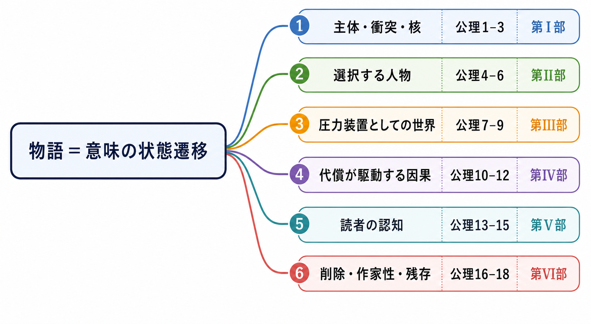
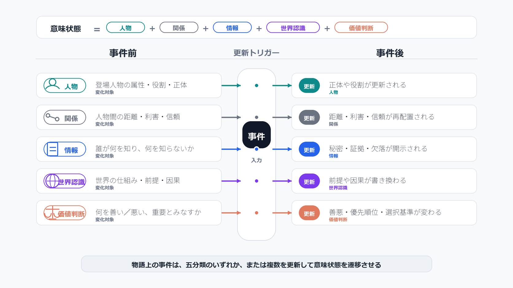
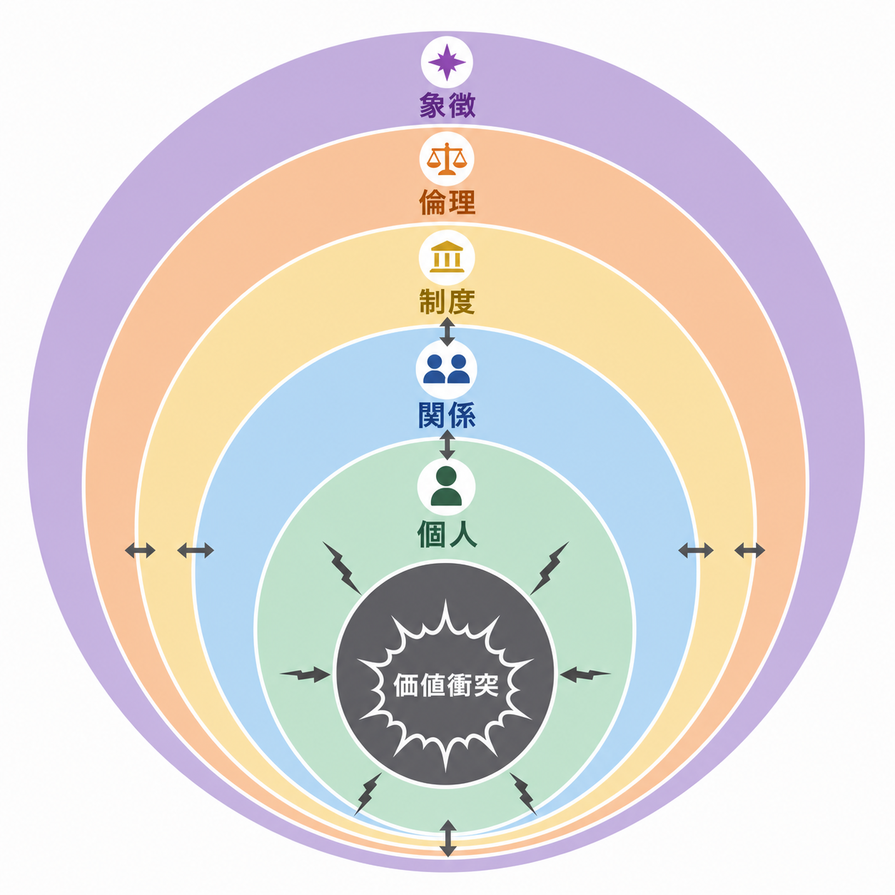
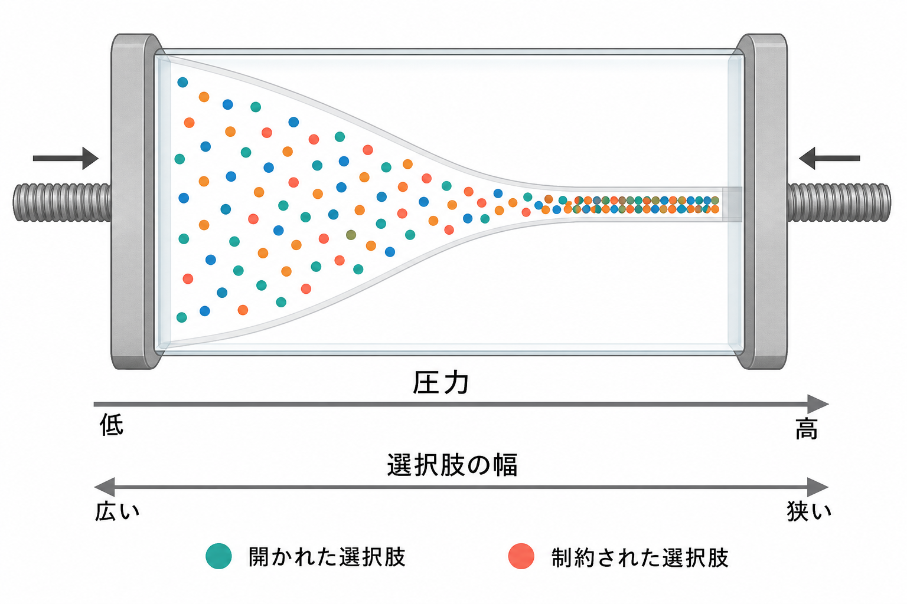
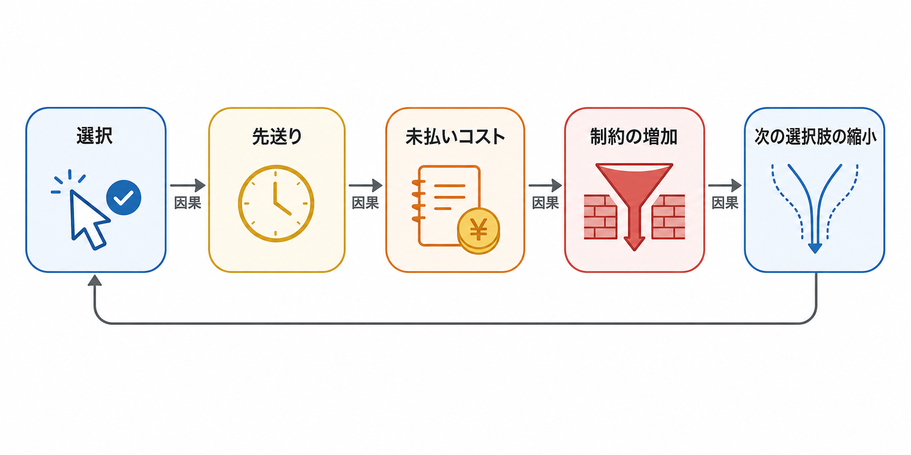
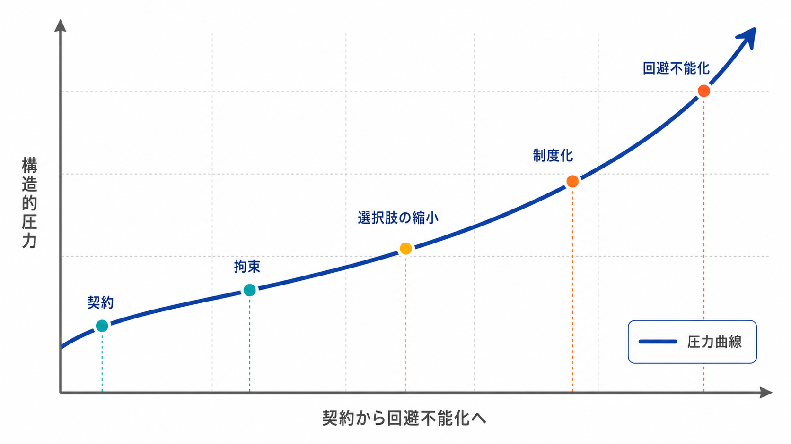
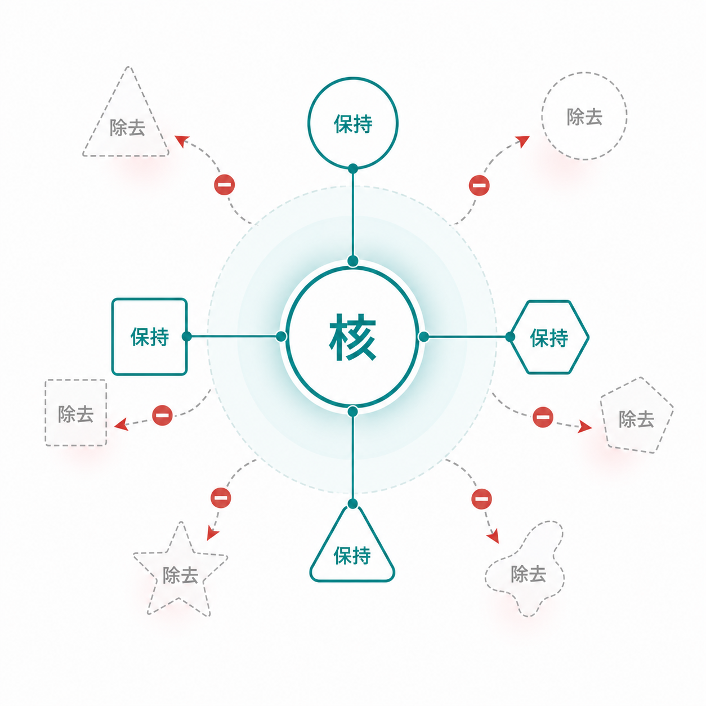

---

# はじめに　なぜ、事件を増やしても物語は深くならないのか

物語が弱いと感じたとき、書き手はまず事件を増やします。敵を増やし、設定を増やし、過去を増やし、どんでん返しを増やす。それでも作品が深くならないのは、足りないものが量ではないからです。弱さの原因は、意味の変化、価値の衝突、選択の代償 —— その不足にあります。

## ミクロの修正では、物語は直らない

もう一つ、熟練した書き手ほど陥る落とし穴があります。自作を読者として読み返し、「ここが物足りない」「この場面がつまらない」と感じた箇所に、ミクロに手を入れてしまうことです。台詞を磨き、描写を足し、テンポを整える。けれど、ミクロな問題の多くは、マクロな問題の帰結です。その場面がつまらないのは、その場面の書き方が悪いからではなく、そこで動くべき意味が、構造の中に用意されていないからです。帰結だけを直しても、原因は残ります。

だから、ミクロな問題を発見する能力をいくら鍛えても、それだけで良い物語を作れるようにはなりません。必要なのは、まったく別の視点です。出来事の表面ではなく、その下で何の意味が変わり、どの価値が衝突し、誰が何を支払っているかを見る —— 構造の視点です。本書は、この視点を手渡すために書かれました。

## 本書が扱うのは、型ではなく判断である

本書が扱うのは、作劇の型ではありません。三幕構成、起承転結、伏線、キャラクター造形 —— こうした技術は役に立ちます。けれど、それらを知っていても、次の一場面で何を選ぶべきかは決まりません。

本書が扱うのは、判断です。

- この場面は必要か。
- この敵は主人公を暴いているか。
- この世界は人物を追い詰めているか。
- この成功は後半の地獄を生むか。
- この名シーンは削るべきか。

こうした問いに、その都度自力で答えるための原理 —— 本書の各章は、それを一つずつ公理として示し、自作を試す問いへと落とし込んでいきます。巻末の付録には、十八の公理と診断・病理・処方の対応を一枚に畳んだ総覧を置きました。

ここで「公理」という言葉を、戒律の意味で使ってはいません。物語に絶対の法則などあるのか —— その懐疑は正当です。本書の公理とは、創作を縛る規則ではなく、迷ったときに判断を可能にする最小の原理です。だから、破ってもかまいません。ただし破るなら、その公理の代わりに何が作品を支えるのかを、自分の言葉で説明できなければなりません。懐疑ごと引き受けたうえで、なお判断の足場として機能するもの。十八の公理は、そのようなものとして書かれています。

## 出発点となる一文

本書の出発点は、一文に尽きます。

> 物語とは、価値を持つ主体が、制約された世界で不可逆の選択を行い、その代償によって意味を更新する過程である。

この定義から、人物、敵、世界、因果、読者認知、文体、美学、改稿、そして時代を越える未来耐性までを導いていきます。読み終えたとき、あなたは「次に何を起こすか」ではなく、「何を変化させるべきか」と問うようになっているはずです。物語を出来事の連なりとしてではなく、意味の状態遷移として見る —— その不可逆の転回が、本書のただ一つの目的です。

## 十八の公理の見取り図

十八の公理は、並列に置かれた助言の一覧ではありません。先の一文に含まれる要素を順に展開した、一本の幹から六本の枝が伸びる導出の樹です。その全体を、巻頭の【図1】に示しました。意味は何に宿るか —— 主体・衝突・核（公理1–3、第Ⅰ部）。主体はどこに現れるか —— 選択する人物（公理4–6、第Ⅱ部）。選択は何に縛られるか —— 圧力装置としての世界（公理7–9、第Ⅲ部）。選択は何を生むか —— 代償が駆動する因果（公理10–12、第Ⅳ部）。意味はどこで結ばれるか —— 読者の認知（公理13–15、第Ⅴ部）。そして最後に何が残るか —— 削除・作家性・残存（公理16–18、第Ⅵ部）。

どの公理も、この定義のどこかを精密化したものにすぎません。だから、どの章で迷っても、戻る場所は一つです。下流の公理で手が止まったら、上流の公理を疑ってください。本書の全体は、この一枚の図の註釈として読むことができます。



Caption: 図1　十八公理の見取り図

---

# 第Ⅰ部：主体・衝突・核

## 第1章　物語とは意味の状態遷移である

### 1.1　出来事ではなく意味が変わる

*第Ⅰ部を読む前、物語は出来事の連なりに見える。読み終えた後、意味の状態遷移に見える。*

> **公理1　事件は物語を動かさない。意味の差分だけが物語を動かす。**

物語の冒頭で、街が炎に包まれる。巨大な怪物が現れ、軍隊が壊滅する。これだけで「面白い」と感じる人は、おそらくいません。なぜなら、まだ何も変わっていないからです。

私たちは「事件が起きること」と「物語が動くこと」を混同しがちです。しかし、どれほど派手な事件でも、それ自体には物語上の価値がありません。爆発が起きても、誰の何も変わらなければ、それは火薬の無駄遣いです。

#### 価値は「変化」に宿る

物語が動くとは、出来事によって何かが変わることです。変わりうるものは、おおよそ次の五つに整理できます。

- **人物** —— その人の内面、決意、自己認識
- **関係** —— 二人の間の信頼、距離、力の均衡
- **情報** —— 誰が何を知っているか
- **世界認識** —— 登場人物が信じている現実の姿
- **価値判断** —— 何を正しいと見なすか

この五つのどれかが、事件の前後で動く。それが「意味が変わる」ということです。逆に言えば、五つのどれも動かない事件は、どれほど予算をかけた映像でも、物語上は何も起きていないのと同じです。

#### 同じ事件でも、意味の有無で別物になる

一場面に落とすと、こうなります。「主人公が崖から落ちそうな仲間を助ける」場面があるとします。

ただ助けるだけなら、それはアクションの装飾です。しかし、助けた相手が、かつて主人公の家族を殺した仇だったとしたらどうでしょう。助けた瞬間、主人公の中で「復讐」という長年の信念が揺らぎます。これは内面の変化です。仇の側も「自分は許されたのか」と関係の前提が崩れます。これは関係の変化です。さらに、それを目撃した第三者が「彼は復讐をやめた」と誤解すれば、情報の配置まで動きます。

事件は同じ「崖から助ける」一つきりです。けれど、後者では複数の意味が同時に動いている。だから物語として価値を持つのです。

#### 装飾を見分ける

執筆中、あるシーンを残すか削るか迷ったら、その前後で五つのどれが動いたかを確かめてください。人物も、関係も、情報も、世界認識も、価値判断も、一つも変わっていない —— そう答えるしかないなら、その場面は装飾です。どれだけ書き込まれていても、削除候補です。逆に、たった一行の会話でも、誰かの信頼が崩れ、誰かの嘘が露見するなら、それは立派な「事件」です。

物語とは、出来事の連続ではありません。意味が次々と書き換えられていく、その状態遷移の連なりです。本書はこの一点を出発点とし、人物・世界・因果・表現・美学のすべてを、この「意味の変化」という原理から導いていきます。まずここを、創作の土台として刻んでください。

```text
診断問い　この場面の前後で、何の意味が変わったか。
誤用　　　派手な事件を置いただけで、物語が動いたと錯覚する。
修正方向　人物・関係・情報・世界認識・価値判断のいずれかに差分を作る。
```




Caption: 図2　意味の状態遷移モデル

---

### 1.2　価値を持つ主体が必要である

出来事は、それだけでは物語を動かしません。動かすのは、出来事によって何の意味が変わったかです。人物・関係・情報・世界認識・価値判断 —— これらが変化することで物語は動きます。しかし、ここで一つの問いが浮かびます。そもそも「意味」とは、どこに存在するのでしょうか。

#### 世界そのものに意味はない

砂漠に一本の枯れ木が立っています。それ自体には何の意味もありません。しかし、三日間さまよい続けた旅人がその木を見つけたとき、それは「目印」になります。あるいは「絶望の象徴」にも、「最後の希望」にもなりえます。

意味は世界の側にはありません。それを価値あるものとして見る主体がいて、初めて意味が生まれます。物語に主体が必要な理由は、ここにあります。

#### 価値から欲望が、欲望から選択が生まれる

主体が何かを「価値あるもの」として扱うと、それを得たい、守りたい、増やしたいという欲望が生まれます。欲望があるから、人は動きます。

しかし、世界は欲望をそのまま叶えてはくれません。時間、資源、他者の意思、社会の規範 —— あらゆる制約が欲望の前に立ちはだかります。制約にぶつかった欲望は、迂回するか、突破するか、諦めるかを迫られます。これが選択です。

つまり、物語の連鎖はこうなります。**主体が価値を持つ → 欲望が生まれる → 制約にぶつかる → 選択を迫られる**。この連鎖の起点にあるのが「価値を持つ主体」です。

#### 主体が空白だと、事件は空回りする

具体例で考えます。「大国が滅亡する」という事件があるとします。これは巨大な出来事です。しかし、その国に誰も思い入れがなければ、読者の心は動きません。

一方、「老兵が守り続けた小さな村が焼かれる」場面を想像してください。規模は比較にならないほど小さい。けれど、老兵がその村をどれほど愛し、何を犠牲にして守ってきたかが描かれていれば、読者は胸を締めつけられます。

事件の大きさではないのです。誰がそれを惜しむのか —— その主体の存在と、主体にとっての価値の重さが、物語の重力を決めます。

#### 惜しむ主体から書き始める

何かが失われる場面を書くとき、事件の規模を測る前に、それを惜しむ主体を確かめてください。惜しむ主体がいなければ、どれほど壮大な喪失も、物語上は無です。

```text
診断問い　その喪失を、誰が何を懸けて惜しんでいるか。
誤用　　　事件の規模を上げれば、読者の感情も比例して動くと考える。
修正方向　喪失の前に、主体がその対象へ価値を注いできた歴史を描き込む。
```

---

### 1.3　代償がなければ選択ではない

分かれ道の前に立つ人物を思い浮かべてください。どちらの道を選んでも何も失わないなら、その分岐は物語にとって存在しないのと同じです。価値が欲望を生み、欲望が制約にぶつかって選択が発生する —— この連鎖の終点にある「選択」の正体を、もう一段深く掘り下げます。

#### 選ぶこととは、捨てることである

私たちは「選択」を、メニューから好きな料理を選ぶような行為だと思いがちです。AとBが並んでいて、欲しいほうに手を伸ばす —— けれど、物語における選択はそうではありません。

物語の選択とは、**何かを得るために、何かを失うこと**です。得るだけで失わないなら、それは選択ではなく、ただの取得です。主人公が剣を拾うのは選択ではありません。剣を拾うために、背負っていた赤ん坊を地面に降ろさなければならないとき、初めて選択が生まれます。

#### 代償が、その人の価値観を露出させる

なぜ代償が必要なのか。それは、何を失う覚悟があるかによって、その人が本当は何を最も大切にしているかが露わになるからです。

口先では「家族が一番だ」と言う人物がいるとします。言葉だけなら誰でも言えます。けれど、家族を守るために自らの名誉を捨てねばならない瞬間が来たとき —— そこで実際に名誉を捨てれば、その言葉は真実になる。捨てられなければ、彼が本当に惜しんでいたのは名誉だったと、読者は理解します。代償とは、人物の価値観を測る天秤なのです。

#### 痛まない決断は、決断ではない

具体例で考えましょう。「主人公が、大金と引き換えに親友を裏切るか迷う」場面があるとします。

もし主人公が大金にまるで興味がなければ、彼は迷いません。即座に親友を選び、何も葛藤は生まれません。逆に、その大金が病気の娘を救う唯一の手段だったらどうでしょう。どちらを選んでも、彼は決定的な何かを失う。この「どちらを選んでも痛い」状態こそが、選択を選択たらしめます。

#### 代償が選択を動力に変える

何も失わない決断が並ぶ物語は、緊張を欠きます。逆に、登場人物が一歩進むたびに何かを手放していくなら、読者はその一歩ごとに息を呑みます。代償の設計こそが、選択を物語の動力に変えるのです。

人物が価値を持ち、制約にぶつかり、代償を払って選ぶ。この三点が揃わない限り、どれほど事件を積んでも、物語はまだ始まっていません。

```text
診断問い　この決断で、彼は何を失うのか。
誤用　　　欲しいものを選び取るだけの場面を、選択を描いたと見なす。
修正方向　どちらを選んでも痛むように、選択の両側に捨てがたい価値を置く。
```

---

## 第2章　深さは価値衝突の層数で決まる

### 2.1　深い作品は一つの選択が複数層を傷つける

> **公理2　深さは事件の数ではなく、一つの選択が傷つける価値の層数で決まる。**

前章で、私たちは物語を「意味の状態遷移」として定義し、選択には代償が伴うことを確認しました。本章からは、その先へ進みます。問いは「物語が動くか」ではなく、「**物語が深いか**」です。

#### 深さは情報量ではない

深い作品とは、設定が緻密な作品でも、専門知識が詰め込まれた作品でもありません。世界観の資料が分厚いことと、物語が深いことは別です。

深さとは、**一つの選択が、いくつの層を同時に傷つけるか**です。浅い選択は、一つの問題だけを動かします。深い選択は、個人・関係・制度・倫理・象徴という複数の層を、ただ一度の決断で同時に揺らします。

#### 五つの層

ここで言う層とは、おおよそ次の五つです。

- **個人** —— その人自身の内面、誇り、生き方
- **関係** —— 誰かとの信頼、愛、力の均衡
- **制度** —— 所属する組織、法、共同体の秩序
- **倫理** —— 何が正しいかという普遍的な判断
- **象徴** —— その選択が世界に対して持つ意味

浅い物語では、これらが一枚ずつ順番に処理されます。深い物語では、一つの選択がこの五枚を貫いて刺さります。

#### 一つの選択で、五層を貫く

たとえば、ある兵士が、捕虜となった敵将を逃がすかどうかを迫られているとします。

ただ「逃がすか殺すか」なら、これは一層の選択です。しかし、その敵将がかつて兵士の命を救った恩人だとしたら —— 逃がせば**個人**の良心は守られますが、軍規を破ることで**制度**を裏切ります。恩人を殺せば**関係**が永遠に断たれ、見逃せば「私情で職務を曲げる男」として仲間との信頼が崩れる。さらに、その判断は「国家への忠誠か、個人の恩義か」という**倫理**の問いを開き、逃がした事実そのものが「この軍は私情で動く」という**象徴**として戦場に広がっていきます。

選択は「逃がすか否か」のたった一つ。けれど、どちらを選んでも五つの層すべてが傷を負う。これが、深さの正体です。

#### 削るのではなく、重ねる

ここで注意すべきことがあります。深さは、選択肢を増やすことでは生まれません。事件を量産しても、一つひとつが一層しか動かさないなら、物語はただ長くなるだけです。

深さは、**一つの選択に複数の層を重ねる**ことで生まれます。同じ決断の場面に、個人の誇り、誰かとの絆、組織の掟、倫理の問い、世界への象徴を、すべて同時に賭けさせる。そうすれば、読者はその一瞬から目を離せなくなります。

```text
診断問い　物語の中心の選択は、五つの層のうちいくつを同時に傷つけるか。
誤用　　　事件や設定の量を増やせば、作品が深くなると考える。
修正方向　決断の数を増やすのではなく、一つの決断に個人・関係・制度・倫理・象徴を重ねる。
```




Caption: 図3　価値衝突の層構造

---

### 2.2　善悪ではなく善と善を衝突させる

「悪役さえ魅力的なら、物語は深くなる」 —— よく聞く助言ですが、半分しか正しくありません。深さが一つの選択の傷つける層数で決まるなら、その傷を最も深く、最も長く読者の心に残す衝突とは、何と何をぶつけるものなのか。その核心に踏み込みます。

#### 善と悪の対立は、答えが先に決まっている

最も分かりやすい対立は、善と悪です。正義のヒーローが、邪悪な悪役を倒す。観客は誰を応援すべきか、最初から知っています。

しかし、この明快さこそが弱点です。善悪の対立では、読者の価値判断が揺れません。悪は倒されるべきもの、善は勝つべきもの —— 結論が物語の前から決まっているなら、そこに葛藤は生まれません。痛快ではあっても、深くはならないのです。

#### どちらも捨てがたいから、傷が残る

長く残る物語は、**善と善を衝突させます**。自由と安全。真実と幸福。愛と責任。個人と共同体。どちらも正しく、どちらも捨てがたい。だからこそ、選んだ瞬間に、選ばなかったほうの正しさが痛みとして残ります。

これは前節の「複数層を傷つける」と直結します。善悪の選択なら、悪を捨てても何も惜しくない。けれど善と善なら、どちらを選んでも、もう一方の善に連なる層がすべて傷を負う。衝突する両極がともに価値を持つから、選択は五層を貫いて刺さるのです。

#### 「正しさ」と「正しさ」の例

ある医師が、一人の患者を救うために、限られた薬を投与するかどうかを迫られているとします。

その薬を使えば目の前の患者は助かる。けれど、同じ薬を待つ十人の患者がいる。一人の命を救うこと —— これは正しい。多数の命のために配分を守ること —— これもまた正しい。悪人は一人もいません。それでも、どちらを選んでも、選ばなかった側の「正しさ」が医師を、そして読者を責め続けます。

ここに悪役を一人加えて「薬を奪う盗人」を登場させた瞬間、物語は浅くなります。問いが「盗人をどう防ぐか」にすり替わり、医師自身の価値の引き裂かれが消えてしまうからです。

#### 衝突の純度を守る

作者がやるべきは、対立する二つの価値の、どちらの正しさも削らないことです。片方をわずかでも悪く描けば、読者は「こちらを選べばいい」と安心してしまい、衝突は緩みます。両方の善を、最後まで対等に光らせ続ける。その緊張に耐えられる作品だけが、読後にも価値判断の余震を残します。

```text
診断問い　対立する二つの極は、どちらも単独で読者を頷かせられるか。
誤用　　　悪役を強く描くことが、葛藤を深くすると思い込む。
修正方向　片方を悪に落とさず、選ばれなかった側の正しさが痛みとして残るまで両方の善を磨く。
```

---

### 2.3　解決しすぎると作品は死ぬ

前節（2.2）で、長く残る物語は善と悪ではなく善と善を衝突させると述べました。自由と安全、真実と幸福、愛と責任 —— どちらも捨てがたい価値をぶつけ、その緊張を最後まで対等に光らせ続ける。では、その衝突を結末でどう扱うべきか。本節は、深さを守るための最後の節度を論じます。

#### 答えを渡しきると、作品は閉じる

衝突を組み上げた作者は、結末で誘惑に駆られます。読者にきれいな正解を手渡したくなるのです。「自由こそが正しかった」「やはり愛が勝った」 —— そう言い切れば、物語は整然と閉じます。

しかし、答えを渡しきった瞬間、作品は読者の中で死にます。価値判断が固定されれば、もう考える余地は残りません。読み終えた本は、栞を挟む理由のないまま、静かに閉じられるのです。前節で苦労して対等に光らせた二つの善は、結末の断定によって一方が消され、衝突そのものが無効化されてしまいます。

#### 意味は固定する、判断は固定しない

ここで誤解してはいけません。「解決しすぎるな」とは、何も決めずに投げ出せという意味ではありません。曖昧なまま放り出された結末は、深さではなく、ただの未完成です。

強い作品は、二つを分けて扱います。**出来事の意味は固定し、価値の判断は読者に残す**のです。何が起きたかは明確に示す。けれど、それが正しかったのかどうかは、読者一人ひとりの中で揺れ続けるように設計する。固定すべきものと、開いておくものを取り違えてはいけません。

#### 余震を残す

具体例で考えましょう。ある母親が、罪を犯した我が子をかばうか、法に従って突き出すかを迫られ、最後に突き出すとします。

ここで「彼女は正義を選んだ。それは尊いことだった」と書けば、作品は閉じます。読者は「そうか、正義が正しいのか」と納得し、忘れます。けれど、母親が子の背中を見送りながら、自分が母であることをやめたのかと立ち尽くす —— その姿だけを描いて筆を置けば、読者は本を閉じた後も問い続けます。彼女は正しかったのか。自分なら、どうしたか。

出来事は固定されています。子は突き出された。それは動きません。けれど、その選択の是非は、読者の中で余震のように揺れ続ける。これが「解決しすぎない」ということです。

#### 深さを最後まで守る

ここまでの第2章で、私たちは深さの正体を見ました。一つの選択が複数層を傷つけること（2.1）。善と善を衝突させること（2.2）。そして、結末で意味を固定しつつ判断を残すこと（2.3）。これらはすべて、物語の「核」をめぐる技術です。

```text
診断問い　結末で固定したのは出来事の意味か、それとも価値の判断までか。
誤用　　　読者にきれいな正解を手渡して閉じることが、誠実な結末だと考える。
修正方向　何が起きたかは明確に示し、その是非だけが読者の中で揺れ続けるよう開いておく。
```

---

## 第3章　作品の核は一文で言える

### 3.1　核は設定ではなく価値衝突である

> **公理3　作品の核は、一文で言える価値衝突である。核以外はすべて交換できる。**

第2章で、私たちは深さの正体を見てきました。一つの選択が複数層を傷つけ、善と善が衝突し、結末で判断を読者に残す。これらの技術はすべて、作品の中心にある「核」に奉仕します。では、その核とは何なのか。本節は、それを取り違えることの危うさから始めます。

#### 設定は核ではない

作家志望者に「あなたの作品は何の話ですか」と尋ねると、多くがこう答えます。「魔法学校の話です」「AIが人間を支配する社会の話です」「滅びゆく王国の話です」。

これらはすべて、核ではありません。設定です。舞台であり、世界の見取り図であり、物語が起きる「場所」にすぎません。どれほど魅力的な設定でも、それ自体は何も問うていない。魔法学校という箱の中で、何が衝突するのか —— そこが空白なら、物語はまだ始まっていないのです。

#### 核とは、選択で傷つく価値である

物語の核とは、**選択によって傷つく価値の衝突**です。「魔法学校の話」ではなく、「才能を持たぬ者が、努力で得た居場所と、生まれ持った者への憎しみのどちらを選ぶか」。「AIが支配する社会の話」ではなく、「人間の自由を守るために、安全な管理を犠牲にできるか」。

設定が「どこで」なら、核は「何を問うか」です。前章で見た善と善の衝突 —— 自由と安全、真実と幸福 —— を、その作品はどの形で抱えているのか。それを名指せたとき、初めて核を掴んだことになります。

#### 同じ設定から、無数の核が生まれる

具体例で考えましょう。「宇宙船で長い旅をする乗組員たちの話」という設定があるとします。

これだけでは核はありません。同じ設定から、まったく異なる作品が生まれます。「限られた酸素を、誰に配分するか」と問えば、生存と公平の衝突が核になる。「目的地に着く前に、地球が滅びたと知ったとき、旅を続けるか」と問えば、希望と現実の衝突が核になる。設定は同じ宇宙船一つ。けれど、どの価値を衝突させるかで、作品は別物になるのです。

#### 核を言葉にする

衝突する二つの価値を一文で言い切れたなら、その一文が、これから書くすべての場面を導く羅針盤になります。言い切れないなら、まだ核を掴んでいません。設定だけが先行している状態です。

```text
診断問い　この作品で、選ぶと傷つく価値は何と何か。
誤用　　　魅力的な舞台や世界観を作った時点で、作品の中心が決まったと見なす。
修正方向　設定という「どこで」の答えを、「何を問うか」という価値衝突の一文に置き換える。
```

---

### 3.2　冒頭は読者との契約である

あなたの作品の最初の一頁は、読者に何を約束しているでしょうか。世界の説明書でも、人物の履歴書でもなく —— 約束です。「選ぶと傷つく価値の衝突」という核を一文で掴んだ作者の次の仕事は、それを物語の入り口で読者に手渡すこと。冒頭という場所の正体に踏み込みます。

#### 冒頭は説明の場所ではない

多くの書き手が、冒頭を「説明の場所」だと誤解しています。世界の成り立ち、主人公の生い立ち、組織の関係図 —— 必要な情報を先に並べておけば、読者は安心して物語に入れるはずだ、と。

しかし、情報から始まる物語を、読者は待ってくれません。なぜなら、まだ何も問われていないからです。前章までで見たとおり、読者を捉えるのは出来事の意味であり、価値の衝突です。設定の羅列は、衝突が始まる前の「前置き」にすぎません。

#### 冒頭は、何を問う作品かを宣言する

冒頭の本当の仕事は、読者との**契約**を結ぶことです。この作品は何を問うのか。どんな圧力のもとで、登場人物は引き裂かれるのか。それを読者に予感させ、「この問いに付き合うか」を選ばせる —— それが契約です。

契約は、約束でもあります。冒頭で「自由と安全のどちらを選ぶか」という圧力を匂わせたなら、作品はその問いに最後まで応答する義務を負う。冒頭で交わした契約を、結末で裏切ってはならないのです。

#### 一行で契約は結べる

具体例で考えましょう。ある物語が、「平和な村に、見知らぬ旅人が一夜の宿を求める」場面から始まるとします。

ただの長閑な情景なら、契約は生まれません。けれど、村人たちがその旅人を泊めれば掟を破ることになり、追い返せば自分たちの善意を裏切ることになる —— その緊張が冒頭の一行に滲んでいれば、読者は瞬時に理解します。これは「掟と良心、どちらを選ぶか」を問う物語だ、と。設定を説明せずとも、核は手渡されています。

#### 契約を確かめる

最初の数行で読者が「この物語は自分に何を突きつけるのか」を予感できたなら、冒頭は役目を果たしています。世界の説明だけが並び、何の価値も衝突していないなら、それはまだ契約を結んでいません。

```text
診断問い　この冒頭は、何を問う作品かを読者に約束しているか。
誤用　　　必要な情報を先に説明し切ることが、読者への親切だと考える。
修正方向　設定の羅列を削り、核となる価値衝突の予感が最初の数行に滲むよう書き直す。
```

次節では、その契約を最後まで守るために作者が何を手放すべきか —— 「核を守り、表層を捨てる」という最も厳しい規律を見ていきます。

---

### 3.3　核を守り、表層を捨てる

前節（3.2）で、冒頭は読者と「何を問う作品か」を約束する契約の場だと述べました。では、その契約を最後まで守り抜くために、作者は何を覚悟すべきか。本節は、創作における最も厳しい規律 —— 愛着あるものを手放す勇気を論じます。

#### 守るべきものは、核ただ一つ

執筆が進み、改稿が重なり、あるいは共同制作で他者の手が入るとき、作者は無数のものを守りたくなります。気に入ったキャラクターの名前。緻密に組み上げた設定の細部。書いていて高揚した名シーン。これらはすべて愛おしい。けれど、守るべきものはそれらではありません。

守るべきは、ただ一つ —— **作品の核**です。前節までで掴んだ「選ぶと傷つく価値の衝突」。それさえ生き残れば、作品は立っています。逆に、キャラクターの名前や設定や名シーンがすべて残っても、核がぼやければ、作品は死んでいます。優先順位を取り違えてはいけません。

#### 名シーンこそ、最初に疑う

最も手強い誘惑は、「名シーン」です。書いていて手応えのあった場面、読者にも褒められた一節 —— だからこそ、それが核に奉仕していなくても、削れなくなる。

しかし問うべきは、いつも同じです。その場面は、核の問いを前に進めているか。美しいだけで、価値の衝突に何も寄与していないなら、それは作品の重心をぼかす錘です。愛着があるほど、冷たく疑わねばなりません。

#### 人気キャラクターも、例外ではない

この失敗はよく起きます。ある物語に、読者から絶大な人気を集める脇役がいるとします。

その人気ゆえに作者は出番を増やしたくなる。けれど、その脇役が活躍するたびに、主人公が抱える「自由と安全のどちらを選ぶか」という核から焦点が逸れていくなら —— 人気は作品にとって毒です。削れば読者は惜しむでしょう。しかし、核を守るためなら、人気キャラクターも削る対象になる。表層の魅力に作品を明け渡してはなりません。

#### 引き算が、作品を立たせる

核を守り、表層を捨てる。これは喪失ではなく、選別です。何を残すかではなく、何を捨てられるかで、作品の輪郭は決まります。

第Ⅰ部の結論は、この一行に尽きます。物語は意味の状態遷移であり、深さは価値衝突の層数で決まり、核はその衝突を一文で言ったものです。その一文を守れない作品に、積み上げてよい表層は一つもありません。

```text
診断問い　この場面は、核の問いを前に進めているか。
誤用　　　手応えのあった名シーンや人気キャラクターを、核より優先して守る。
修正方向　核に奉仕しない要素は、愛着の強いものから順に削除候補として疑う。
```

> **定理3　核とは、他のすべてを捨てても残すものの名である。捨てられないなら、それはまだ核ではない。**

---

## 編集実験室Ⅰ　弱いプロットを、核の一文へ

第Ⅰ部の道具は三つでした。意味の状態遷移、価値衝突の層、核の一文。部の終わりに、それを一度だけ実地で使います。素材は、どこにでもある弱い原案です。

### 素材 —— 弱い原案

「平和な村が魔物に襲われる。若者が旅に出て、力を得て、魔物を倒し、村に帰る。」

事件は揃っています。けれど第1章の問いを当てれば、すぐに穴が見えます。魔物を倒す前と後で、若者にとって何の意味が変わったのか —— 何も変わっていません。村は元に戻り、若者も元に戻る。これは意味差分ゼロの、出来事の列です。

### 工程1 —— 意味差分を入れる

まず、事件の前後で変わるものを決めます。たとえば「村は守るべき故郷である」という意味が、「村は出てはならない檻である」へ反転する、と置く。終点が決まれば、旅はその反転を運ぶ容器になります。

### 工程2 —— 価値衝突を掘る

次に、反転を生む衝突を仕込みます。旅の果てに若者が知るのは、魔物が外から来たのではなく、村の長たちが「若者を外に出さないため」に語り継いできた仕掛けだった、という事実だとしましょう。ここで初めて、善と善がぶつかります。真実を明かせば、村を支えてきた秩序が崩れる。黙れば、村は守られるが、嘘の上に立ち続ける。どちらにも守りたいものがあり、どちらを選んでも何かが死ぬ。

### 工程3 —— 核の一文へ圧縮する

最後に、衝突を一文に畳みます。

「共同体を守ってきた嘘を、暴くべきか、引き受けるべきか。」

この一文が決まれば、判断基準が生まれます。魔物の造形も、旅の仲間も、戦いの場面も、この一文に奉仕するなら残し、しないなら削る。弱い原案が弱かったのは、事件が少なかったからではなく、この一文がなかったからです。

```text
診断問い　あなたの原案は、事件をすべて消しても一文の衝突が残るか。
誤用　　　事件を足すことで、原案を強くしようとする。
修正方向　意味差分→価値衝突→核の一文の順に、事件より先に衝突を設計する。
```

---

# 第Ⅱ部：選択する人物

## 第4章　人物は選択で定義される

### 4.1　性格ではなく、何を捨てるかを見る

*第Ⅱ部を読む前、人物は性格の束に見える。読み終えた後、選択と代償の履歴に見える。*

> **公理4　人物は性格ではなく、代償を払う選択によって定義される。**

第Ⅰ部で、私たちは物語の核 —— 選ぶと傷つく価値の衝突 —— を見定めてきました。本章からは、その核を背負って選択する主体、すなわち「人物」に踏み込みます。出発点はこの問いです。人物の本質は、どこに現れるのか。

#### プロフィールは、人物ではない

書き手は人物を作るとき、まず属性を並べたくなります。優しい、冷たい、賢い、臆病、誠実 —— こうした形容詞をいくつも積み上げれば、その人物が立ち上がる気がします。

けれど、属性は人物そのものではありません。「優しい人物です」と書かれても、読者はその優しさを信じません。なぜなら、まだ何も選んでいないからです。意味は変化に宿り、選択は何かを捨てることでした。人物もまた、属性の羅列ではなく、選択によってしか姿を現さないのです。

#### 本質は、追い詰められたときに露わになる

平穏なときの振る舞いは、いくらでも取り繕えます。誰しも、余裕があれば優しく振る舞える。人物の本質が見えるのは、**追い詰められ、何かを捨てねばならない瞬間**です。

そのとき、彼が何を守り、何を手放すか。それが、形容詞では決して語れないその人の正体です。1.3で見たように、代償が価値観を露出させる —— 人物造形もまた、この原理に従います。何を捨てるかが、何者であるかを決めるのです。

#### 同じ「優しさ」が、選択で分かれる

一場面に落とすと、こうなります。「優しい」とされる二人の人物が、それぞれ、飢えた見知らぬ子どもと、待つ家族のための最後のパンを前にしているとします。

一人は、家族の取り分を割いて子どもに与える。もう一人は、子どもに背を向け、家族のもとへ急ぐ。どちらも「優しい」と紹介されていました。けれど、捨てたものが違う。前者は家族の空腹を、後者は見知らぬ子への憐れみを捨てた。この一度の選択が、二つの「優しさ」をまったく別の人物像へと分けるのです。属性は同じでも、捨てたものが人物を定義します。

#### 人物を試す問い

捨てたものを一つ名指せたなら、人物はプロフィールの段階を抜け、息を始めています。

```text
診断問い　この人物は、何を守るために、何を捨てたか。
誤用　　　形容詞のプロフィールを積み上げれば、人物が立ち上がると思い込む。
修正方向　追い詰められる場面を一つ置き、そこで人物が手放すものを名指しする。
```

---

### 4.2　欲望は前進させ、欠落は誤らせる

前節（4.1）で、人物の本質は属性ではなく「何を捨てるか」に現れると述べました。では、その人物に選択を迫り、捨てる場面へと追い込む原動力は何か。本節は、人物を動かす二つの力 —— 欲望と欠落 —— を見ていきます。

#### 欲望は、人物を前へ進ませる

人物が動くのは、何かを欲しているからです。地位、復讐、愛、承認、自由、生存 —— 欲望があるから、人物は立ち上がり、危険を冒し、物語の中を進んでいきます。欲望のない人物は、椅子から立ち上がりません。物語は止まったままです。

欲望は、人物の前進装置です。彼が何を欲しているかが明確であるほど、読者は「この人はどこへ向かうのか」を追いかけられます。前章の核 —— 選ぶと傷つく価値の衝突 —— も、人物が何かを強く欲するからこそ、衝突として成立するのです。

#### 欠落は、人物に間違った道を選ばせる

しかし、欲望だけでは人物は深くなりません。もう一つの力が要ります。それが**欠落**です。

欠落とは、その人物の内側にある空白 —— 満たされなかった愛、癒えない傷、認められなかった過去です。欠落は人物を前へ進ませません。むしろ、**間違った解法を選ばせます**。本当に必要なものを見誤らせ、欲望の対象を取り違えさせるのです。

#### 欲望と欠落がズレるほど、人物は変わる

父に認められず育った人物が、「成功して名を上げたい」と欲しているとします。

彼の欲望は成功です。けれど、その根にある欠落は「父の愛」です。彼は成功を求めて突き進みますが、どれほど名を上げても満たされない。なぜなら、本当に欲しかったのは地位ではなく、認められることだったからです。彼は欠落ゆえに、間違った道を全力で走る。この欲望と欠落のズレこそが、人物を物語の中で揺らし、やがて変化させます。もし彼が、欲しかったのは成功ではなかったと気づくなら —— そこに、人物の転換が生まれます。

#### 二つの力を見分ける問い

口で欲しがるものと本当に必要なものが一致しているなら、人物は欲望を満たして終わるだけで、変化しません。ずれているなら、間違った解法を走り抜いた末に、何かに気づく余地を持ちます。

```text
診断問い　この人物が口で欲しがるものと、本当に必要としているものは、ずれているか。
誤用　　　欲望を強く描けば人物が深くなると考え、その根にある欠落を設計しない。
修正方向　欲望の対象とは別の場所に欠落を置き、そのズレの幅を変化の振れ幅として設計する。
```

---

### 4.3　矛盾は生命感である

前節（4.2）で、人物は欲望によって前へ進み、欠落によって道を誤ると述べました。欲しがるものと、本当に必要なものがずれている —— その人物は、進みながら間違える存在です。だとすれば、人物は最初から一貫などしていません。本節は、その矛盾こそが人物に生命を与えるという逆説を見ていきます。

#### 一貫した人物は、作り物に見える

書き手は、人物を矛盾なく作りたくなります。設定がぶれず、言動が首尾一貫し、信念を最後まで貫く —— そういう人物こそ完成度が高い、と感じる。

けれど、一貫しすぎた人物は、生きて見えません。むしろ作り物めいて見えます。なぜなら、現実の人間は一貫していないからです。誰しも、昨日の言葉と今日の行動が食い違い、信じるものと欲するものがぶつかる。完璧に筋の通った人物は、論理の図面ではあっても、血の通った存在ではないのです。

#### 人間は矛盾し、それを正当化する

人間の本質は、矛盾を抱え、しかもそれを正当化することにあります。優しくありたいのに人を傷つけ、自由を求めながら束縛に安らぐ。そして、その食い違いを「これは仕方なかった」「これが正しいのだ」と自分に言い聞かせる。

この自己正当化こそが、人物に厚みを与えます。矛盾を矛盾のまま放置するのではなく、本人が必死に辻褄を合わせようとする —— その足掻きの中に、読者は自分自身の姿を見るのです。

#### 矛盾を動力に変える

「裏切りを何より憎む」と公言する人物が、いざ自分が窮地に立つと、仲間を売ってしまうとします。

これは設定の破綻でしょうか。違います。彼は裏切りを憎むからこそ、自らの裏切りを「あれは裏切りではない、やむを得ぬ選択だった」と正当化せずにいられない。その矛盾と弁解が、彼を平板な「正義漢」から、恐れと弱さを抱えた一人の人間へと変えます。矛盾は欠陥ではなく、人物を動かす力なのです。

#### 矛盾を見極める問い

ここまでの第4章で、人物が選択によって定義され、欲望と欠落に動かされ、矛盾に生命を宿すことを見ました。矛盾が一つも見つからないなら、その人物はまだ図面です。抱えた矛盾とその言い訳を描けたなら、人物は生命を得ています。

```text
診断問い　この人物は、自分のどんな矛盾を、どう正当化しているか。
誤用　　　言動の食い違いを設定の破綻とみなし、矛盾のない人物へ磨き上げてしまう。
修正方向　矛盾を一つ残し、本人がそれに与える必死の言い訳を書く。
```

---

## 第5章　信念・傷・嘘

### 5.1　信念は過去に役立った防具である

> **公理5　信念は過去に役立った防具であり、嘘は本人にとっての真実である。**

前章（第4章）で、人物は欲望によって進み、欠落によって誤り、矛盾を抱えて生命を得ると見てきました。本章では、その矛盾の奥にあるもの —— 人物を内側から縛る「信念」へと分け入ります。なぜ人物は、頑なに自分の考えを手放さないのか —— そこから始めましょう。

#### 信念は、ただの意見ではない

「人を信じてはいけない」「弱さを見せれば負ける」「愛は必ず裏切られる」 —— 人物が抱えるこうした信念を、書き手は単なる価値観や口癖として扱いがちです。性格を彩る一要素だ、と。

けれど、信念はそんなに軽いものではありません。それは、**過去にその人物を一度は守った生存戦略**です。だから簡単には捨てられない。捨てることは、かつて自分を救ってくれた防具を、戦場のただ中で脱ぐことを意味するからです。

#### 防具は、傷から生まれる

信念がなぜ防具なのか。それは、痛みの後に身につけられるからです。裏切られた者は「人を信じてはいけない」と学び、その鎧で二度目の刃を防ぐ。見捨てられた者は「期待しなければ傷つかない」と知り、その盾で次の落胆を遠ざける。

前節までで見た「欠落」と、この「信念」は地続きです。欠落が傷そのものなら、信念はその傷を二度と負わぬために編み上げた防具なのです。だからこそ、信念を手放させることは、人物に丸腰で過去の痛みへ向き合えと迫ることに等しい。容易であるはずがありません。

#### 防具が、新たな足枷になる

たとえば、幼い頃に親の借金で裏切られた人物が、「誰にも頼らず、一人で生きる」という信念を抱いているとします。

その信念は、かつて彼を守りました。誰も当てにしなければ、もう裏切られずに済む —— 孤独な少年期を、彼はその鎧で生き延びたのです。けれど大人になった今、同じ防具が彼を縛ります。助けを差し出す者を拒み、手を取れば救われる場面で一人を選び、愛されることから逃げ続ける。かつて命を救った戦略が、今は人生を痩せさせている。それでも彼は脱げません。脱げば、あの裏切りの痛みが蘇るからです。

#### 信念を掘り下げる問い

信念の根にある古い傷を一つ掘り当てられたなら、人物は内側から立ち上がります。なぜ頑ななのか、なぜ変われないのかが、必然として見えてくるからです。

```text
診断問い　この人物の信念は、かつてどんな痛みから彼を守ったのか。
誤用　　　信念を性格を彩る意見として扱い、説得一つで改められるものにしてしまう。
修正方向　信念を生んだ最初の傷を特定し、手放すことが過去の痛みの再来になるよう設計する。
```

---

### 5.2　嘘は本人には真実である

鎧は剥がせても、骨は剥がせません。信念という防具をまとった人物は、その奥にもう一つの支えを抱えています —— 本人にとっては紛れもない真実でありながら、外から見れば誤認である認識、すなわち「嘘」です。防具を脱げない人物が世界をどう見ているのか、その答えはここにあります。

#### 嘘とは、世界を耐えるための真実である

ここで言う「嘘」は、他人を欺く方便のことではありません。人物が自分自身について、あるいは世界について、誤って信じ込んでいる認識のことです。「自分には価値がない」「愛されるには役に立たねばならない」「あの日、すべては自分のせいで壊れた」 —— こうした誤認を、書き手は「直すべき間違い」として扱いがちです。

けれど、本人にとって、それは間違いではありません。**世界を耐え抜くための、切実な真実**です。前節の防具が外側の鎧なら、嘘はその内側で人物を支える背骨です。それが偽りだと突きつけられることは、立っている足場ごと崩されることに等しい。だから人物は、嘘を握りしめて離さないのです。

#### 嘘の視点を欠くと、人物は操り人形になる

この視点を持たない書き手は、人物を上から動かしてしまいます。作者には誤認が見えているので、「なぜこの人は気づかないのか」ともどかしくなり、都合よく目を覚まさせたくなる。

しかし、本人にとって嘘が真実である以上、人物はそう簡単には覚めません。作者が「これは間違いだ」と外から裁いた瞬間、人物は自律性を失い、作者の意図を代弁するだけの操り人形になります。人物を生かすには、その嘘の内側に立ち、本人と同じ確信で世界を見なければなりません。

#### 誤認が、選択を歪める

幼い頃に母を亡くした人物が、「自分が泣いたから母は弱って死んだ」と信じているとします。

外から見れば、それは子どもの非論理的な思い込みです。母の死に、彼の涙は何の関係もありません。けれど本人にとって、それは動かしがたい真実です。だから彼は、大人になっても決して泣きません。悲しみを見せれば、また誰かを死なせると信じているからです。愛する者の前でさえ感情を殺し、冷たい人間だと誤解され、関係を壊していく。一つの嘘が、彼の選択のすべてを静かに歪めているのです。

#### 嘘を見極める問い

本人が真実と信じる嘘を一つ掘り当てられたなら、人物は作者の代弁者であることをやめ、自分の論理で動き始めます。

```text
診断問い　この人物は、自分や世界について、どんな誤認を真実として握りしめているか。
誤用　　　作者が嘘を外から「直すべき間違い」と裁き、都合のよい場面で目を覚まさせる。
修正方向　嘘の内側に立ち、本人と同じ確信で世界を見たうえで、その確信が歪ませる選択を書く。
```

次節では、その嘘や信念を生んだ過去の傷を、回想で説明するのではなく、現在の選択の中に滲ませる方法を見ていきます。

---

### 5.3　傷は説明せず、現在の選択に出す

信念も嘘も、根をたどれば同じ場所に行き着きます —— 過去の傷です。防具を編ませ、誤認を真実に変えた、その傷。これを物語はどう扱うべきか。ここに、傷の見せ方をめぐる創作の重要な分かれ道があります。

#### 回想で説明された傷は、軽くなる

人物の行動を裏づけたい書き手は、過去の傷を回想で語りたくなります。「彼がこうなったのは、幼い頃にこんな出来事があったからだ」と、傷の由来を一場面まるごと挿入する。これで読者は人物を理解できるはずだ、と。

けれど、説明された傷は、しばしば軽くなります。「だからこうなった」と因果を明示された瞬間、傷は解説に変わり、痛みは情報に痩せる。読者は理解はしても、感じはしません。前章までで見たとおり、意味は説明ではなく変化に宿るのです。傷もまた、語られるより、作用しているところを見せるべきものです。

#### 傷は、今の選択に滲ませる

では、どう見せるのか。**傷は、現在の選択の中に出す**のです。過去に何があったかを語るのではなく、今その人物が何を恐れ、何を過剰に守り、何を取り違えるか —— その歪んだ選択そのものに、傷を滲ませる。

由来を伏せたまま、人物が不自然なほど何かを避ける。読者は「なぜこの人はここまで」と引っかかり、その引っかかりが、語られざる傷の輪郭を描き出します。傷は説明されるのではなく、現在の振る舞いから逆算して感じ取られるとき、最も深く届くのです。

#### 過去を語らず、現在で見せる

具体例で考えましょう。かつて火事で妹を救えなかった人物がいるとします。

その過去を回想で説明すれば、読者は「気の毒だ」と思って通り過ぎます。けれど、回想を一切見せず、ただ彼が、火のそばに立てず、助けを求める声に異常なほど過敏に反応し、誰かを守れる場面でなぜか凍りつく —— そう描けば、読者は理由を知らぬまま、その不自然さに胸を掴まれます。やがて傷の正体が選択の積み重ねから滲み出たとき、説明では決して届かない衝撃が走るのです。

#### 傷を試す問い

ここまでの第5章で、信念・嘘・傷という人物の内面を掘り下げてきました。過去の場面でしか傷を語れていないなら、それはまだ解説です。現在の一つの選択に傷の歪みを宿せたなら、人物は語らずして過去を背負います。

```text
診断問い　この傷は、回想ではなく、今の選択のどこに出ているか。
誤用　　　傷の由来を回想で一場面まるごと説明すれば、読者の共感が深まると考える。
修正方向　由来を伏せ、不自然なほどの回避や過敏さとして、現在の振る舞いに傷を滲ませる。
```

---

## 第6章　敵と関係は主人公を暴く

### 6.1　敵は中心問いへの別解である

> **公理6　敵とは、中心問いへの別解である。**

前章（第5章）で、人物の信念・嘘・傷という内面を掘り下げてきました。本章では視点を外へ転じます。その人物を最も鋭く暴き出す存在 —— 敵へと進みます。最初の問いはこうです。敵とは、いったい何のために存在するのか。

#### 敵は、邪魔をするために置くのではない

書き手は敵を、主人公の前に立ちはだかる障害物として置きがちです。目的地への道を塞ぎ、計画を妨げ、戦って倒される —— その役割さえ果たせば敵は機能している、と。

けれど、邪魔をするだけの敵は、物語を浅くします。なぜなら、その敵は主人公の外側にいるからです。物語の核とは「選ぶと傷つく価値の衝突」でした。敵がその核に触れていなければ、いくら激しく戦っても、それは物語の中心ではなく余白で起きている騒ぎにすぎません。

#### 敵は、同じ問いへの別解である

強い敵は、主人公とは**別の形で、同じ問いに答えた存在**です。作品の中心問い —— たとえば「自由と安全のどちらを選ぶか」 —— に対し、主人公が「自由」と答えるなら、敵は「安全」と答えた者として立つ。両者は同じ問いを抱え、異なる答えに賭けている。だから衝突が、核そのものを照らすのです。

言い換えれば、**敵とは、主人公が支払わずに済ませてきた代償を、別の価値体系から請求してくる存在**です。主人公の選択が踏み倒してきたもの —— のちに第Ⅳ部で「未払いコスト」として論じるもの —— を、敵は自らの正しさの名のもとに取り立てに来ます。だから敵が強いほど、主人公の支払いは大きくなるのです。

ここで決定的なのは、**敵の答えにも正しさがあること**です。第2章で見た「善と善の衝突」を思い出してください。敵の正しさが弱いほど、物語の思想も弱くなります。敵がただの悪なら、主人公の答えは試されません。敵が切実に正しいからこそ、主人公の選択は重さを持つのです。

#### 別解としての敵

「秩序のために個を犠牲にできるか」を問う物語で、主人公が「一人も見捨てない」と信じているとします。

ここで敵を、私欲で人を踏みにじる暴君にすれば、物語は痩せます。問いが「悪をどう倒すか」にすり替わるからです。けれど、敵を「多数を救うために少数を切り捨ててきた、かつての英雄」にすればどうでしょう。彼もまた人々を愛し、苦悩の末に「全員は救えない」という答えにたどり着いた。主人公の理想と、敵の現実 —— どちらも秩序と命を思う心から生まれている。この別解の重みが、中心問いを立体にします。

#### 敵を試す問い

敵の答えにも捨てがたい正しさを宿せたなら、敵は障害物であることをやめ、主人公を映す鏡になります。

```text
診断問い　この敵は、主人公と同じ問いに、どんな別の答えを出しているか。
誤用　　　敵を私欲だけの悪役として道を塞がせ、問いを「悪をどう倒すか」にすり替える。
修正方向　敵に中心問いへの切実な別解を与え、その答えに至った苦悩まで設計する。
```

---

### 6.2　強い敵は主人公の嘘を露出させる

前節（6.1）で、敵とは中心問いへの「別解」であり、その答えにも捨てがたい正しさが宿ると述べました。本節では、その別解としての敵が、主人公に対して具体的に何を突きつけるのかを掘り下げます。鍵は、第5章で見た主人公の「嘘」です。

#### 弱い敵は妨害し、強い敵は暴く

敵の強さを、書き手は力で測りがちです。腕が立つ、軍勢を率いる、計略に長ける —— そうした強さは、確かに主人公の行く手を阻みます。けれど、それは妨害の強さにすぎません。

本当に強い敵は、力ではなく、**主人公が見ないふりをしてきたものを暴く力**を持ちます。第5章で見たとおり、人物は自分や世界についての嘘を真実として握りしめ、その嘘で立っています。弱い敵は、その嘘に触れません。外側で戦って倒されるだけです。けれど強い敵は、主人公の足元の嘘を正確に名指し、握りしめた防具を引き剥がしにかかるのです。

#### 敵は、主人公が一番触れられたくない場所を突く

なぜ別解としての敵に、それができるのか。敵は同じ問いを抱えた者だからです。主人公が「自由」と答え、敵が「安全」と答えたとき、敵は主人公の答えの弱点を —— つまり、自由を選ぶために主人公が目を逸らしてきた犠牲を、誰よりも知っています。

だから敵の言葉は刺さります。赤の他人の罵倒は受け流せても、同じ問いを生きた者の指摘は躱せない。敵は、主人公が自分にすら隠してきた欠落や恐怖を、外から言葉にしてしまうのです。

#### 嘘を暴く敵

具体例で考えましょう。「誰も見捨てない」と信じる主人公の前に、かつて全員を救おうとして仲間を全滅させた敵が立つとします。

剣を交えるだけなら、ただの強敵です。けれど敵がこう言ったらどうでしょう。「お前は誰も見捨てたくないんじゃない。見捨てる責任を負うのが怖いだけだ」。この一言は、主人公が握りしめてきた嘘 —— 「自分は優しいから全員を救うのだ」という自己像 —— を砕きます。本当は、選ぶ痛みから逃げていただけかもしれない。敵は、主人公自身が直視できなかった真実を、突きつけたのです。

#### 敵を試す問い

敵が主人公の行動を妨げるだけで、内面に何も触れていないなら、それはまだ障害物です。主人公が隠してきた欠落や恐怖を一つ暴けるなら、敵は主人公を内側から揺さぶる鏡になります。

```text
診断問い　この敵は、主人公のどんな嘘を、暴くことができるか。
誤用　　　敵の強さを腕力や軍勢の規模で測り、妨害の激しさを脅威と取り違える。
修正方向　敵に、主人公が目を逸らしてきた犠牲を名指しする一言を持たせる。
```

次節では、こうした敵も含めた人物どうしの関係が、感情ではなく「負債」でできているという視点へ進みます。

---

### 6.3　関係は感情ではなく負債でできている

関係には、帳簿があります。愛や憎しみの下に、未払いの貸し借りがびっしりと記された帳簿です。主人公の嘘を暴く敵もまた、その帳簿の上で主人公と向き合う一人の他者にすぎません。関係の正体は、感情ではなくこの帳簿 —— 「負債」にあります。

#### 好き嫌いだけでは、関係は動かない

書き手は関係を、感情の言葉で捉えがちです。彼を愛している、彼女を憎んでいる、あの人を信頼している —— こうした好悪を並べれば、関係が描けた気がします。

けれど、感情だけの関係は、静止しています。好きなら一緒にいる、嫌いなら離れる —— それだけなら、選択も葛藤も生まれません。前章までで見たとおり、物語は意味の変化に宿ります。関係が物語を動かすのは、感情の奥に、簡単には清算できない**貸し借り**が積もっているときなのです。

#### 関係は、負債でできている

人と人の間にあるのは、純粋な感情ではありません。恩義、支配、依存、秘密、嫉妬、交換、罪悪感 —— どれも、一方が他方に対して負っている「未払いの何か」です。

恩を受けた者は、返さねばと縛られる。秘密を握られた者は、相手に逆らえない。罪悪感を抱く者は、相手の前で頭を上げられない。こうした負債が、人物を関係の中に拘束します。離れたくても離れられず、憎みながらも従い、愛しながらも裏切れない —— 感情では説明のつかない動きは、すべて負債から生まれるのです。

#### 負債が変われば、事件は要らない

たとえば、長年連れ添った主従を置きます。

ただ「忠誠心がある」だけなら、関係は動きません。けれど、その忠誠の根に「かつて主君が罪をかぶってくれた」という恩義があり、ある日、主君のその罪が実は従者を陥れるための嘘だったと判明したら —— 感情は一つも変わらなくても、負債の構造が反転します。返すべき恩が、晴らすべき恨みに変わる。新たな事件を起こさずとも、貸し借りの組み替えだけで、関係は劇的に深まるのです。

#### 関係を試す問い

敵は、倒すためだけにいるのではありません。主人公が隠してきた嘘を、主人公自身より正確に言い当てるためにいます。そして関係は、好きや嫌いしか答えられないうちは静止したままですが、恩義や秘密や罪悪感を一つ名指せたとき、事件を待たずに動き出します。

```text
診断問い　この二人の間に、どんな未払いの貸し借りがあるか。
誤用　　　好悪の感情を並べれば、関係が描けたと思い込む。
修正方向　恩義・秘密・罪悪感のいずれかを一つ置き、その負債が反転する瞬間を設計する。
```

> **定理6　人物は、敵という別解に問われ、負債という帳簿に縛られて、初めて素顔を見せる。**

---

## 編集実験室Ⅱ　形容詞の人物を、選択する人物へ

第Ⅱ部の道具は、選択、信念と嘘、敵と負債でした。素材は、人物表によくいる「設定だけの人物」です。

### 素材 —— 形容詞の束

「正義感が強く、情に厚く、努力家の刑事。」

形容詞は三つ揃っていますが、この人物はまだ何者でもありません。第4章の基準で問えば一目瞭然です。彼は何を捨てるのか —— 形容詞は、衝突しない限り人物を定義しないのです。

### 工程1 —— 信念と、その由来を置く

「正義感」を信念に書き換えます。彼の信念は「手続きこそが人を守る」。由来も置きます。少年の頃、私刑に走った父が無実の隣人を傷つけ、家庭が壊れた。以来、規則は彼にとって、人が獣に戻らないための防具になった。第5章の言葉で言えば、これは過去に一度だけ役立った防具であり、本人には真実である嘘です。

### 工程2 —— 嘘を露出させる敵を置く

敵を、彼の信念への別解として設計します。手続きの外で被害者を救い続ける自警団の長。法が取りこぼした者を、法を破って守る人物です。この敵は彼より速く人を救い、しかも —— ここが要点ですが —— かつて彼自身の妹を、手続きを無視して救った当人だとする。

### 工程3 —— 負債で縛り、選択で締める

これで帳簿が引かれました。彼は敵に、返せない恩を負っている。物語の終盤、自警団の長を逮捕すれば妹の恩人を裏切り、見逃せば自分の防具 —— 手続きへの信念 —— を自分の手で外すことになる。

どちらを選んでも、彼の何かが死にます。そしてどちらを選んだかが、三つの形容詞では決して書けなかった彼の正体を、初めて定義するのです。

```text
診断問い　この人物の形容詞をすべて消したとき、選択だけで彼だと分かるか。
誤用　　　性格・経歴・口調を増やせば、人物が立つと考える。
修正方向　信念の由来→別解としての敵→負債→最終選択の順に、形容詞を選択へ変換する。
```

---

# 第Ⅲ部：圧力装置としての世界

## 第7章　世界は圧力装置である

### 7.1　世界は何を許し、何を禁じるかで作る

*第Ⅲ部を読む前、世界は背景に見える。読み終えた後、人物の選択肢を制限する圧力装置に見える。*

> **公理7　世界は背景ではなく、選択肢を制限する圧力装置である。**

第Ⅱ部で、私たちは人物と関係を見てきました。本章から始まる第Ⅲ部では、その人物たちが立つ場所 —— 「世界」へと進みます。手始めに問います。世界を作るとは、何を決めることなのか。

#### 地名や歴史は、世界ではない

世界を作るとき、書き手はまず地図を描きたくなります。大陸の名、王国の興亡、種族の系譜、通貨や暦 —— こうした設定を積み上げれば、世界が立ち上がる気がします。

けれど、それらは世界の表面にすぎません。どれほど精緻な年表を作っても、それ自体は何の圧力も生みません。前章までで見たとおり、物語を動かすのは人物の選択でした。世界が物語に関わるのは、その選択を縛るときだけです。だから世界づくりの本質は、地名でも歴史でもなく、**そこで何が許され、何が禁じられるか**を決めることにあります。

#### 世界とは、選択肢の分布である

世界とは、人物の前に並ぶ選択肢の分布です。ある世界では当たり前にできることが、別の世界では命がけになる。何が罰せられ、何が見逃され、何が称えられるか —— その許しと禁止の地図こそが、世界の正体です。

人物が何を選べて、何を選べないか。その境界線を引くことが、世界を作るということなのです。

#### 同じ事件が、世界によって別の重みを持つ

一つの欲望を置いて試します。「身分違いの相手を愛する」という欲望です。

それが自由恋愛の許される世界なら、ただの私事です。物語の圧力にはなりません。けれど、身分を越えた愛が死罪に値する世界では、同じ欲望が即座に命を賭けた選択へと変わります。愛を貫けば処刑され、諦めれば心が死ぬ。事件は同じ「身分違いの恋」一つきり。けれど、世界が何を禁じるかによって、その重みはまるで変わるのです。

#### 世界を試す問い

最後に、本節の原理を診断の形に置いておきます。

```text
診断問い　この世界は、主人公の欲望に対して何を許し、何を罰するか。
誤用　　　地名・年表・系譜を積み上げることが、世界を作ることだと錯覚する。
修正方向　人物の欲望を罰する一線をまず引き、許しと禁止の地図として世界を設計する。
```




Caption: 図4　圧力装置としての世界

---

### 7.2　ルールは便利さではなく代償を生むためにある

前節（7.1）で、世界とは「選択肢の分布」であり、何を許し何を禁じるかが世界の正体だと述べました。では、その許しと禁止を具体的に生み出すもの —— 魔法、技術、制度、文化といった「ルール」は、何のために設計されるべきか。本節は、その目的を問い直します。

#### ルールは、主人公を便利にするために作るのではない

書き手はルールを、主人公に力を与える道具として設計しがちです。空を飛べる魔法、敵を見抜く能力、何でも作れる技術 —— 主人公が世界を生き抜くための便利な装備として、ルールを足していく。

けれど、便利さを増やすルールは、物語を弱めます。なぜなら、できることが増えるほど、選択が消えるからです。物語は選択に宿り、選択は代償に宿りました。何でも解決できる力は、葛藤を蒸発させる。便利な魔法を一つ足すたびに、人物は一つ、迷わなくて済むようになるのです。

#### ルールは、代償を生むためにある

強い世界のルールは、便利さではなく**代償**を生みます。その力を使えば、必ず何かを失う。魔法を使えば寿命が縮み、真実を見抜けば人を信じられなくなり、技術に頼れば人としての何かが摩耗する。ルールが「できること」と同時に「失うもの」を定めているとき、初めて世界は人物を追い詰めます。

問うべきは「この設定で何ができるか」ではなく、「**この設定を使うと、何を払うことになるか**」です。代償の伴わない力は、物語にとって飾りにすぎません。

#### 力に毒を仕込む

「死者を一人だけ蘇らせられる魔法」があるとします。

ただ蘇らせられるだけなら、それは便利な救済装置です。誰かが死ぬたびに使えばよく、緊張は生まれません。けれど、この魔法に「蘇らせた一人と引き換えに、術者の最も大切な記憶が永久に失われる」という代償を仕込めばどうでしょう。主人公は、愛する者を取り戻すために、その者と過ごした思い出を手放さねばならない。蘇った相手を、もう誰だか思い出せない —— 救うことと失うことが同じ行為に重なった瞬間、ルールは物語の核を貫く圧力に変わります。

#### ルールを試す問い

最後に、本節の原理を診断の形に置いておきます。

```text
診断問い　この設定は、使うときに人物へ何を払わせるか。
誤用　　　主人公に便利な力を足すほど、世界が豊かになると思い込む。
修正方向　力一つごとに「失うもの」を定め、できることと代償を必ず対で設計する。
```

---

### 7.3　世界は主人公の欠落を増幅する

前節（7.2）で、世界のルールは便利さではなく代償を生むためにあると述べました。では、その代償を備えた世界は、主人公という一人の人物に対して、どう働くべきか。本節は、世界づくりの最後の原理 —— 世界は主人公の弱点を拡大する装置である、という視点に踏み込みます。

#### 都合のいい世界は、人物を浅くする

書き手は、主人公に活躍してほしいあまり、世界を彼に都合よく整えがちです。彼の力が通用する場所、彼の信条が報われる仕組み、彼の弱点が問われずに済む状況 —— そうした優しい世界を用意すれば、主人公は気持ちよく勝ち進みます。

けれど、そこに物語の深さは生まれません。第Ⅱ部で見たとおり、人物は「欠落」を抱え、それゆえに道を誤る存在でした。世界が主人公の欠落に触れなければ、その欠落は眠ったままです。試されない弱点は、ないのと同じ。都合のいい世界は、人物が最も見せるべき部分を、丁寧に隠してしまうのです。

#### よい世界は、最も見たくない弱点を拡大する

強い世界は、逆を行きます。**主人公が最も直視したくない欠落を、正面から拡大する**のです。孤独を恐れる者には孤立を強いる構造を、無力を恥じる者には何もできない状況を、過去から逃げる者にはその過去が必ず追ってくる仕組みを —— 世界そのものが用意する。

これは、第6章で敵が主人公の嘘を暴いたのと同じ働きを、世界の規模で行うものです。敵が一人の他者として弱点を突くなら、世界は環境そのものとして、逃げ場なく弱点を照らし出す。主人公は、世界に立つだけで、自分の欠落と向き合わされるのです。

#### 欠落を増幅する世界

具体例で考えましょう。「他人に頼れない」という欠落を抱えた主人公がいるとします。

彼を、一人でも生きていける豊かな世界に置けば、欠落は問われません。けれど、誰かと手を組まねば一日も生き延びられない過酷な世界 —— 食料も水も情報も、他者との信頼なしには得られない世界に置けばどうでしょう。彼は、最も苦手な「頼ること」を、生存のために迫られ続けます。世界が彼の弱点を、逃れようのない圧力として毎日突きつける。その緊張の中で初めて、彼の欠落は物語の中心へと押し出されるのです。

#### 世界を試す問い

許しと禁止の分布（7.1）、代償を生むルール（7.2）、そして欠落の増幅。第7章の原理の最後を、診断の形に置いておきます。

```text
診断問い　この世界は、主人公が最も見たくない弱点を拡大しているか。
誤用　　　主人公が活躍しやすいよう、世界を彼に都合よく整えてしまう。
修正方向　主人公の欠落を逃げ場なく照らす構造を、世界の側に一つ仕込む。
```

---

## 第8章　制度・文化・神話

### 8.1　権力は誰が語れるかで見える

> **公理8　制度・文化・神話は、誰が語れるか、何が当然かに現れる。**

前章（第7章）で、世界とは許しと禁止の分布であり、人物の欠落を増幅する圧力装置だと述べました。本章では、その圧力をさらに具体化する制度・文化・神話へと解像度を上げていきます。まず問うべきは —— 世界の権力構造を、どこに描けば読者に伝わるのか。

#### 権力は、命令する力だけではない

書き手は権力を、命令と服従の関係で描きがちです。王が命じ、民が従う。上官が下し、部下が動く —— 誰が誰に指図できるか、その上下関係を示せば権力が描けた気がします。

けれど、命令の連鎖は権力の表層にすぎません。本当の権力は、もっと静かなところに宿ります。**誰の言葉が記録され、誰の沈黙が強制されるか** —— そこにこそ、世界の力の地図が現れるのです。声を上げられる者と、上げても消される者。その境界線が、命令系統よりも深く権力を語ります。

#### 語れる者と、語れない者

権力とは、語る資格の分配です。同じ出来事を見ても、誰の証言が「事実」として残り、誰の訴えが「なかったこと」にされるか。歴史を書く者、法廷で信じられる者、記録に名を刻める者 —— 彼らが権力を持つ者です。

逆に、語ることを許されない者がいます。証言しても疑われ、声を上げれば罰せられ、存在そのものが記録から抹消される。この「語れなさ」は、鎖や牢よりも強く人を縛ります。前章で見たとおり、世界とは選択肢の分布でした。語る権利を奪われた者にとって、世界は「沈黙する」以外の選択肢を持たない場所なのです。

#### 沈黙の強制を描く

ある王国で、貴族が平民を手にかけたとします。

「王が貴族を罰した／罰しなかった」と命令の次元で描けば、権力は平板なままです。けれど、殺された平民の家族が訴え出ても、書記が記録を取らず、証言が「身分ある者を陥れる虚言」として退けられ、やがて事件そのものが起きなかったことになる —— そう描けばどうでしょう。誰も剣を抜かず、誰も命令しない。それでも、語れる者と語れない者の差が、この世界の権力を、命令よりもはるかに鋭く照らし出します。読者は、ここでは何が「事実」になり、何が「沈黙」に沈むかを、肌で理解するのです。

#### 権力を試す問い

語れる者と語れない者の境界は、主人公自身の立場 —— 語れるのか、沈黙させられるのか —— を決め、彼の選択を内側から縛ります。本節の原理を診断の形に置いておきます。

```text
診断問い　この世界では、誰の言葉が記録され、誰の沈黙が強いられているか。
誤用　　　命令と服従の上下関係を示せば、権力を描けたと考える。
修正方向　語れる者と語れない者の境界線を一本引き、それが主人公の選択をどう縛るかまで描く。
```

---

### 8.2　文化は当然の行動に出る

文化は、設定資料の中にはありません。人物の身体の中にあります。誰の言葉が記録され、誰の沈黙が強いられるかという権力の網の目（8.1）を、人々は日々の振る舞いとして身体化している —— その身体化されたものこそが、ここで言う文化です。では、それは作品のどこに現れるのか。

#### 文化は、説明するものではない

書き手は文化を、解説したくなります。「この国では年長者を敬う伝統があった」「彼らは太陽を神として崇めていた」 —— そうした説明を地の文に置けば、世界に厚みが出る気がします。

けれど、説明された文化は、知識にしかなりません。読者は「そういう設定なのだな」と理解するだけで、その世界を生きはしない。意味は説明ではなく行動に宿りました。文化もまた、語られるのではなく、人物が**何の疑問も抱かずに行う振る舞い**の中に現れるべきものです。

#### 当然の行動にこそ、文化は滲む

文化が最も濃く出るのは、人物が意識すらしない場面です。食事の作法、死者の弔い方、挨拶の交わし方、何を恥と感じ、何を名誉とするか、誰の前で目を伏せ、いつ沈黙するか —— こうした「当たり前」の所作に、その世界の価値観は染み込んでいます。

本人が「これは文化だ」と思っていないからこそ、本物なのです。説明される文化は外から貼られた札ですが、当然の行動として出る文化は、人物の骨身に刻まれた世界そのものです。

#### 所作が世界を語る

たとえば、次の場面を置きます。ある人物が、客人に食事を出す場面です。

「この国では客をもてなす文化があった」と書けば、それは情報です。けれど、彼が黙って自分の皿から最も良い一切れを取り分け、客が断ろうとする前にそれを当然のように差し出し、客もまた当然のように受け取る —— そう描けばどうでしょう。誰も「もてなし」を口にしません。それでも読者は、この世界では客に最良を譲ることが息をするように当たり前なのだと、肌で理解します。さらに、その所作を主人公がためらった瞬間、彼がこの文化の外から来た者だと、説明なしに伝わるのです。

#### 文化を試す問い

最後に、本節の原理を診断の形に置いておきます。

```text
診断問い　この文化は、人物のどんな無意識の所作に出ているか。
誤用　　　「この国には〜という伝統がある」と地の文で説明すれば、文化を描けたと考える。
修正方向　誰も疑問を抱かない一つの振る舞いに価値観を宿し、説明を所作へ置き換える。
```

次節では、こうした当然の所作の奥で人々が信じる物語 —— 神話が、過去の説明ではなく現在の暴力を正当化する装置であることを見ていきます。

---

### 8.3　神話は現在の暴力を正当化する

前節（8.2）で、文化は説明ではなく人物の当然の所作に現れると述べました。では、その所作の奥で人々が信じている物語 —— 神話は、何のために存在するのか。本節は、神話を「過去の説明」ではなく「現在を正当化する装置」として捉え直します。

#### 神話は、昔話ではない

書き手は神話を、世界の由来を語る昔話として置きがちです。世界がどう生まれ、神々がどう戦い、英雄がどう国を興したか —— そうした起源譚を用意すれば、世界に歴史の奥行きが出る気がします。

けれど、過去を語るだけの神話は、飾りにとどまります。読者は「そういう言い伝えがあるのだな」と通り過ぎるだけです。前章までで見たとおり、世界は人物の選択を縛る圧力でした。神話が物語に効くのは、それが過去ではなく、**今この瞬間の何かを支えているとき**なのです。

#### 神話は、現在の暴力を正当化する

生きた神話は、現在の制度・犠牲・差別・名誉・暴力を「当然のもの」として正当化します。なぜあの身分の者は虐げられるのか —— 「神がそう定めたから」。なぜ毎年、若者が捧げられるのか —— 「始祖がそう誓ったから」。神話は、今まさに行われている不正や流血に、疑えない根拠を与える装置です。

だからこそ神話は強い。理屈で問えば残酷な仕打ちも、神話を背負った瞬間、誰も逆らえない「聖なる秩序」に変わります。前節の権力 —— 誰が語れるか —— とも地続きです。神話を語る資格を握る者が、何を正義とし、何を犠牲としてよいかを決めるのです。

#### 神話が、犠牲を聖別する

具体例で考えましょう。ある村が、毎年一人の娘を山の神に捧げているとします。

これを「昔そういう約束をした」とだけ語れば、ただの設定です。けれど、村人たちが「娘を捧げねば村が滅ぶ」と心から信じ、捧げられる娘自身が「これは名誉だ」と微笑み、それを止めようとする主人公こそが「神を冒涜する者」として罰せられる —— そう描けばどうでしょう。神話は過去の物語ではなく、今年も繰り返される殺人を「聖なる献身」へと塗り替える、現役の装置として立ち上がります。主人公の選択は、一人を救うことが世界の秩序そのものへの反逆になる、という重さを帯びるのです。

#### 神話を試す問い

語る資格の分配（8.1）、当然の所作（8.2）、そして犠牲の聖別。制度・文化・神話が世界の圧力を具体化する第8章の最後を、診断の形に置いておきます。

```text
診断問い　この神話は、現在のどんな犠牲や暴力を正当化しているか。
誤用　　　世界の由来を語る起源譚を置けば、神話が物語に効いていると考える。
修正方向　今まさに行われている不正を一つ選び、それを「聖なる秩序」として支える論理を神話に担わせる。
```

---

## 第9章　現実を写さず、抽出する

### 9.1　現実は矛盾の採掘場である

> **公理9　現実は写すものではなく、矛盾と神話構造を採掘するものである。**

前章（第8章）で、制度・文化・神話が世界の圧力をいかに具体化するかを見てきました。本章では視点を転じます。そうした世界を構想する材料を、私たちはどこから汲み上げるのか —— 現実から、です。では、現実を、創作にどう使うべきか。

#### 現実の細部は、リアリティの飾りではない

書き手は現実を、本物らしさを足すための装飾として使いがちです。職業の専門用語、街の風景、時代の風俗 —— 細部を正確に書き込めば、世界に手触りが宿る気がします。

けれど、細部の正確さは、それ自体では物語を動かしません。世界とは人物の選択を縛る圧力でした。現実が創作に効くのは、表面の質感としてではなく、その奥にある**矛盾**を掘り当てたときです。現実は、写し取る対象ではありません。掘る対象 —— 矛盾の採掘場なのです。

#### 現実の中に、矛盾の鉱脈が走っている

職業、階層、病、老い、貧困、権力 —— あらゆる現実の領域に、矛盾の鉱脈が走っています。守るべき規範が人を救えない場面。正しさが、別の正しさを踏みつける構造。誰かの生存が、誰かの犠牲の上に成り立つ仕組み。こうした引き裂かれこそが、第2章で見た「善と善の衝突」の、現実に埋まった原石です。

採掘するとは、現実を眺めて「ここで何と何がぶつかっているか」を掘り起こすことです。表面の風景ではなく、その下で軋んでいる価値の対立を取り出す。それが、現実を創作の材料に変える作業です。

#### 矛盾を掘り当てる

「看護師」という職業を書くとします。

制服や処置の手順を正確に描けば、それらしくは見えます。けれど、それは表層です。採掘すべきは、その職業に埋まった矛盾です。たとえば —— 患者一人ひとりに寄り添えと求められながら、現実には何十人を流れ作業で捌かねばならない。命を救う場所が、救えない命を選別する場所でもある。この「寄り添いと効率」の引き裂かれを掘り当てたとき、看護師は背景の職業から、価値の衝突を背負う人物へと変わります。物語の核が、現実の鉱脈から立ち上がるのです。

#### 現実を試す問い

最後に、本節の原理を診断の形に置いておきます。

```text
診断問い　この現実の中で、何と何が引き裂かれているか。
誤用　　　細部を正確に書き込むほど、現実が物語の力になると考える。
修正方向　表面の質感ではなく、その下で軋んでいる価値の対立を一つ掘り当てて核に据える。
```

---

### 9.2　取材情報はそのまま出すほど弱い

調べれば調べるほど作品は強くなる —— この直感は、半分しか正しくありません。現実という採掘場から価値の衝突を掘り当てても（9.1）、それをそのまま作品に並べた瞬間、知識は重荷に変わります。取材で得た情報は、そのまま出すほど弱くなる。この逆説から始めましょう。

#### 調べたことを並べても、作品にはならない

熱心に取材した書き手ほど、得た知識を残らず使いたくなります。専門用語、業界の慣習、歴史の経緯、現場の手順 —— 苦労して集めた情報を惜しみ、一つでも多く書き込もうとする。

けれど、情報の量と物語の強さは比例しません。むしろ反比例しがちです。並べられた知識は、読者にとって解説でしかない。前章までで見たとおり、世界は人物の選択を縛るときだけ物語に効きました。取材情報も同じです。それが誰の選択にも触れていなければ、どれほど正確でも、作品の上では資料の余白にすぎません。

#### 情報は、誰かの選択肢を奪う形に変換する

では、取材情報をどう使うのか。鍵は**変換**です。その情報が、誰の選択肢を奪い、誰の嘘を支えているか —— そこへ翻訳して初めて、知識は物語の圧力に変わります。

事実をそのまま提示するのではなく、その事実ゆえに人物が何を選べなくなるか、何を隠さざるを得ないかを描く。情報は、語られる対象ではなく、人物を追い詰める仕掛けとして埋め込まれるべきものなのです。

#### 知識を、圧力に変える

具体例で考えましょう。「ある病の進行は不可逆で、治療法がない」という医学的事実を取材で得たとします。

これを地の文で正確に説明すれば、読者は「そういう病気なのだ」と理解して通り過ぎます。情報は情報のまま死にます。けれど、その事実を変換すればどうでしょう。診断を下した医師が、患者にどこまで真実を告げるかで引き裂かれる。家族が、残された時間を本人に隠すか打ち明けるかで割れる。病の不可逆性という知識は、ここで初めて「誰が、何を、語れないか」という選択の圧力に変わります。読者が触れるのは病名ではなく、その病が人々から奪った選択肢なのです。

#### 取材情報を試す問い

最後に、本節の原理を診断の形に置いておきます。

```text
診断問い　この情報は、誰の選択肢を奪い、誰の嘘を支えているか。
誤用　　　苦労して集めた取材情報を、正確に多く書き込むほど作品が強くなると思い込む。
修正方向　事実の提示をやめ、その事実ゆえに人物が選べなくなるもの・隠さざるを得ないものを描く。
```

次節では、こうして個々の情報を変換した先にある、より大きな構造 —— 現実に潜む神話構造を抽出する技術を見ていきます。

---

### 9.3　現実の中の神話構造を抽出する

現実の出来事を写し取るだけなら、報道で足ります。物語が現実から受け取るべきものは、出来事そのものではなく、その奥で人を縛っている構造です。個々の情報を「誰の選択肢を奪うか」へ変換する技術（9.2）の先には、もう一段大きな採掘が待っています。現実に潜む**神話構造**そのものを、抽出するのです。

#### 現実をそのまま写しても、物語にはならない

書き手は、強烈な現実を前にすると、それを忠実に写し取れば作品になると考えがちです。痛ましい事件、過酷な労働、理不尽な差別 —— 現実そのものが持つ重さに、筆を委ねたくなる。

けれど、現実をそのまま写したものは、報告であって物語ではありません。第8章で見たとおり、神話とは現在の暴力を正当化する装置でした。現実の出来事の奥には、必ずその神話構造 —— 人々がそれを「当然」と信じ込む仕掛けが走っています。写すべきは表面の出来事ではなく、その下で人を縛る構造のほうなのです。

#### 六つの構造を取り出す

抽出すべき神話構造は、おおよそ六つの形をとります。**欲望** —— 人々が何を渇望させられているか。**禁忌** —— 何に触れることが許されないか。**犠牲** —— 誰が捧げられ、それが当然とされるか。**反復** —— なぜそれが繰り返され続けるのか。**正当化** —— どんな論理で不正が聖別されるか。**沈黙** —— 誰の声が消されているか。現実をこの六つの目で透かし見るとき、ばらばらの事実が、人を縛る一つの構造として立ち上がります。

#### 出来事の奥の構造を掘る

具体例で考えましょう。「ある企業で、若手が過労で倒れる」という現実を書くとします。

労働時間や職場の様子を正確に写せば、ルポにはなります。けれど、神話構造を抽出すればどうでしょう。「苦労こそが一人前の証だ」という**欲望**と**正当化**、弱音を吐くことへの**禁忌**、毎年誰かが潰れても変わらない**反復**、倒れた者を「自己管理の失敗」として消す**沈黙** —— これらを取り出した瞬間、一つの事件は、人を捧げ続ける現代の神話として普遍性を帯びます。読者は、自分の職場にも同じ構造が走っていることに気づくのです。

#### 構造を試す問い

矛盾の採掘（9.1）、選択の圧力への変換（9.2）、そして神話構造の抽出。世界と現実を圧力へと変える第Ⅲ部の最後を、診断の形に置いておきます。

```text
診断問い　この現実は、誰の犠牲を、どんな論理で当然とし、誰の声を消しているか。
誤用　　　強烈な現実を忠実に写し取りさえすれば、その重さがそのまま作品になると考える。
修正方向　欲望・禁忌・犠牲・反復・正当化・沈黙の六つの目で透かし、出来事の奥の構造を取り出す。
```

---

## 編集実験室Ⅲ　飾りの世界を、圧力装置へ

第Ⅲ部の道具は、許しと禁止、代償を生むルール、制度と神話でした。素材は、設定資料によくある「美しいだけの世界」です。

### 素材 —— 飾りの設定

「空に浮かぶ都市。美しい伝統衣装。独自の暦と祭り。」

絵にはなります。けれど第7章の基準で問えば、この世界はまだ何も禁じていません。主人公が何を選んでも、世界は黙って背景に立っているだけ。飾りの世界とは、選択肢を一つも奪わない世界のことです。

### 工程1 —— 禁止と代償を仕込む

浮かぶ都市に、物理を一つ与えます。「都市が浮かんでいられる重量には限りがあり、毎年、何かを捨てなければ沈む」。これでルールが代償を生み始めます。捨てる候補は書物か、老人か、死者の墓か —— 何を捨てるかの基準そのものが、価値の序列を住民に強制する。

### 工程2 —— 制度と神話で塗り固める

次に、誰が「捨てるもの」を決めるのかを置きます。決定権を持つのは暦を読む祭司階級であり、彼らだけが投棄の日を語ることを許される。そして美しい祭りの正体は、投棄を「天への奉納」と呼び替える神話です。第8章で見たとおり、神話は現在の暴力を正当化する装置として働き始めます。

### 工程3 —— 主人公の欠落へ照準する

最後に、この圧力を主人公へ向けます。亡き母の形見を抱える主人公にとって、「捨てなければ沈む」世界は、彼の欠落 —— 喪失を受け入れられないこと —— を毎年突いてくる装置になる。

衣装も暦も祭りも、もう飾りではありません。すべてが彼に「何を手放すか」を問う圧力に変わりました。世界は、説明する場所ではなく、選ばせる場所になったのです。

```text
診断問い　この世界は、主人公からどの選択肢を奪っているか。
誤用　　　設定の美しさと珍しさを増やせば、世界が立つと考える。
修正方向　禁止→代償→制度と神話→主人公の欠落への照準の順に、飾りを圧力へ組み替える。
```

---

# 第Ⅳ部：代償が駆動する因果

## 第10章　因果は未払いコストで駆動する

### 10.1　選択が次の制約を生む順に並べる

*第Ⅳ部を読む前、次の展開は発明するものに見える。読み終えた後、未払いコストの回収に見える。*

> **公理10　次の展開は、作者の発明ではなく、未払いコストの回収である。**

出来事は、並べただけでは物語になりません。第Ⅲ部で、私たちは世界と現実を圧力へと変える技術を見てきました。本章から始まる第Ⅳ部では、その圧力が人物の選択を通してどう連鎖するか —— 因果と構造へと進みます。最初の問いはこうです。出来事を、どんな原理で並べるのか。

#### 時間順の列挙は、年表にすぎない

書き手は、出来事を時間順に並べたくなります。彼は街を出た。森で盗賊に襲われた。城にたどり着き、王に会った —— 起きたことを順に積めば、物語が進む気がします。

けれど、時間順に連ねただけの出来事は、列挙にすぎません。前の出来事と次の出来事の間に、必然がないからです。盗賊に襲われなくても城には着けたし、順番を入れ替えても話は成立する。差し替え可能な出来事の連なりは、物語ではなく、年表です。前章までで見たとおり、意味は変化に宿り、変化は選択から生まれました。出来事をつなぐべきは時間ではなく、選択が生む制約なのです。

#### 前の選択が、次の選択肢を狭める

強い物語では、一つの選択が次の制約を生みます。彼は仲間を救うために嘘をついた。その嘘を隠すために、新たな嘘を重ねねばならなくなった。嘘が増えるほど真実を知る者を遠ざけ、孤立していく —— 前の一手が次の一手の選択肢を狭め、狭まった選択肢の中でまた選ばされる。この鎖があるとき、出来事はもう入れ替えられません。

ここで働いているのは、選択の**未払いコスト**です。選択には代償が伴いました（第1章）。その代償をその場で払い終えることは、めったにありません。払い残した分が、次の場面の制約として回ってくる。だから読者は「この人は次にどうなるのか」ではなく、「もうこうするしかないのか」と、逃げ場の塞がっていく感覚に捉えられるのです。

#### 鎖を、たどってみる

一場面に落とすと、こうなります。「主人公が、貧しさゆえに一度だけ盗みを働く」場面があるとします。

そのまま彼が街を去れば、盗みは独立した挿話で終わります。けれど、盗んだ金で病の母を救えた。だが盗みを目撃した者に弱みを握られた。その者の命令に従わざるを得なくなり、さらに重い罪に手を染めていく —— とすればどうでしょう。最初の小さな選択が、抜け出せない泥沼へと人物を縛りつけます。盗みという一手が、その後のすべての選択肢を奪っていくのです。

#### 因果を試す問い

```text
診断問い　前の選択は、次の選択肢を狭めているか。
誤用　　　出来事を時間順に多く積めば、物語が前進していると錯覚する。
修正方向　各場面の選択に代償を払い残させ、その未払い分を次の場面の制約として回収する。
```




Caption: 図5　未払いコストの因果連鎖

---

### 10.2　後半の地獄は前半の成功から生む

前節（10.1）で、出来事は選択が次の制約を生む順に並べるべきだと述べました。前の選択が次の選択肢を狭めるとき、物語は必然の鎖で前進します。本節は、その鎖が最も劇的に働く場所 —— 物語の後半に焦点を当てます。後半の危機は、どこから来るべきなのか。

#### 後半の危機を、外から降らせない

物語が中盤を越え、書き手は新たな試練を主人公に課したくなります。より強い敵、より大きな災厄、予想もしない陰謀 —— 後半を盛り上げるために、外側から危機を投入する。けれど、外から降ってきた危機は、唐突に見えます。

なぜなら、それまでの選択の鎖と切れているからです。前節で見たとおり、物語は前の選択が次を強制する連鎖で動いていました。後半でいきなり無関係な大敵が現れれば、読者は「なぜ今これが」と醒めてしまう。降ってくる危機は、作者の都合の匂いを放つのです。

#### 地獄は、前半の勝利が育てる

強い物語では、後半の地獄が、前半の**成功**から生まれます。主人公が手にした勝利、ついた嘘、踏み倒した代償 —— それらが時間をかけて毒に育ち、後半で一斉に牙を剥く。

前半で得たものほど、後半で重くのしかかります。守るために嘘をつけば、その嘘がやがて自分を縛る。勝つために誰かを切り捨てれば、その誰かが牙を研いで戻ってくる。後半の危機は外から来るのではなく、主人公自身が前半で蒔いた種なのです。だから読者は「自業自得だ」と納得しながら、逃げ場のなさに息を呑みます。

#### 成功に、毒を仕込む

具体例で考えましょう。前半で、主人公が仲間を守るために、敵の幹部を見逃して取引したとします。

その取引のおかげで、主人公は危機を脱し、仲間も救われる。前半の勝利です。けれど、見逃した幹部は力を蓄え、後半で組織の頂点に立って戻ってくる。しかも「お前はあのとき俺と取引した」という事実を握り、主人公を仲間の前で裏切り者として追い詰める。前半で命を救った選択が、後半で主人公の居場所そのものを奪うのです。危機は外から降っていません。あの日の成功が、時を経て地獄を生んだのです。

#### 後半を試す問い

```text
診断問い　後半の危機は、前半のどの成功から生まれているか。
誤用　　　後半を盛り上げるため、それまでの選択と無関係な大敵や災厄を外から投入する。
修正方向　前半の勝利・嘘・踏み倒した代償の中に危機の根を探し、時間をかけて毒に育てる。
```

次節では、こうして組み上げた因果の鎖を一瞬で断ち切ってしまう禁じ手 —— 偶然による救済が、物語の重力を消すことを見ていきます。

---

### 10.3　偶然で救うと重力が消える

絶体絶命の主人公の前に、たまたま助けが通りかかる —— その一行で、ここまで組み上げてきた因果の鎖は断ち切られます。前半の成功から後半の地獄を育てても、結末に偶然の救済を置けば、すべては帳消しです。本章の締めくくりとして、この禁じ手が物語の重力をいかに消し去るかを論じます。

#### 偶然は、始めるためには使える

まず、偶然そのものが悪なのではありません。物語の発端に偶然が置かれることは、しばしば必要です。たまたま事件を目撃した。偶然あの人と出会った。予期せぬ手紙が届いた —— こうした偶然は、人物を物語の中へ引きずり込む入口として機能します。

読者は、始まりの偶然を受け入れます。なぜなら、そこから人物がどう選ぶかを、まだ見ていないからです。偶然は、選択の連鎖が始まる前なら、物語に許される。問題は、偶然をどこで使うかなのです。

#### 救うために使うと、すべてが軽くなる

許されないのは、**主人公を救うために偶然を使うこと**です。絶体絶命の窮地で、たまたま通りかかった者が助けてくれる。追い詰められた瞬間、都合よく敵が自滅する。こうした救済は、それまで積み上げた選択と代償を、一瞬で無価値にします。

前節までで見たとおり、物語は前の選択が次を強制する鎖で動いていました。偶然の救済は、その鎖を外から断ち切ります。人物がどんな苦しい選択を重ねても、最後に偶然が帳消しにするなら、選択など意味がなかったことになる。読者は「どうせ何かが助けてくれる」と察し、緊張の糸が切れるのです。

#### 救済が、選択を無効にする

一場面に落とすと、こうなります。主人公が、仲間を救うか自分が生き延びるかの選択を迫られているとします。

ここで彼が、断腸の思いで仲間を選び、自らの死を覚悟する —— その瞬間、たまたま崖崩れが起きて敵が押し流され、主人公も助かったとしたら。彼の覚悟は、何も支払わずに済んでしまいます。命を賭けた選択が、偶然によって「賭けなくてよかった」ものに変わる。読者が握りしめていた手は、ほどけてしまうのです。逆に、その選択の代償を主人公自身に払わせ続ければ、覚悟は本物として残ります。

#### 偶然を試す問い

因果は、未払いコストで駆動します。選択は次の制約を生み、前半の成功は後半の地獄を準備し、偶然はその鎖を断ち切った瞬間に物語の重力を消します。物語を前へ進めるのは出来事の量ではなく、まだ支払われていない代償の重さなのです。

```text
診断問い　この偶然は、物語を始めているか、それとも主人公を救っているか。
誤用　　　偶然が許されるのは入口だけなのに、窮地の解消にも使えると考えてしまう。
修正方向　救済の偶然は新たな苦境の入口に書き換え、窮地の代償は主人公自身の選択で支払わせる。
```

> **定理10　物語の重力とは、未払いの代償の総量である。偶然がそれを肩代わりした瞬間、重力は消える。**

---

## 第11章　次に何が起こるか

### 11.1　踏み倒したものを取り立てに来させる

> **公理11　前半の獲得は後半の障害となり、敵と世界は学習する。**

前章（第10章）で、因果は未払いコストで駆動すると見てきました。選択が次の制約を生む順に並べ、前半の成功が後半の地獄を生み、偶然で救えば重力が消える。本章では、その因果を実際の執筆でどう使うか —— 「次に何が起こるか」を生み出す具体的な技術へ進みます。起点はこの問いです。次の展開を、どこから探すのか。

#### 次の展開は、新しく考えるものではない

筆が止まったとき、書き手は「次に何を起こそうか」と、外へ向かって新しい事件を探しがちです。新たな敵、新たな事件、新たな舞台 —— 手持ちの外側から、刺激を補充しようとする。

けれど、外から足した事件は、しばしば物語から浮きます。強い展開は前の選択が次を強制する鎖から生まれました。新しく考えた事件は、その鎖の外にある。だから「次に何を起こすか」と問う前に、まず**過去のシーンを振り返るべき**なのです。次の展開は、発明するものではなく、すでに蒔かれたものを取り立てに行くものです。

#### 踏み倒したものは、必ず戻ってくる

物語を進める中で、人物は様々なものを未払いのまま置き去りにします。ついた嘘、果たさなかった約束、傷つけた相手、借りた力 —— その場をしのぐために踏み倒したものたちです。

これらは消えません。回収されるのを待っています。次の展開とは、この未払いの一つを選び、取り立てに来させることです。隠した嘘が露見する。破った約束を相手が覚えている。傷つけた者が力をつけて戻る。借りた力に代償を請求される —— どれも、新しい事件ではありません。すでに物語の中にある負債が、満期を迎えただけです。だからこそ、必然として読者に届きます。

#### 取り立てを、たどってみる

主人公が序盤で、追っ手をまくために、見知らぬ村人に「自分は役人だ」と嘘をついて助けてもらったとします。

ここで「次は何を起こそう」と外を探せば、無関係な新事件になります。けれど、踏み倒したものを見ればよい。あの嘘です。中盤、その村人が役人の助けを求めて主人公の前に現れ、「あのときのお役人様」と慕ってくる。主人公は嘘を貫けば村人を欺き続け、明かせば恩人を裏切ることになる —— 序盤の小さな嘘が、満期の請求書として戻ってきたのです。

#### 展開を試す問い

```text
診断問い　これまでのシーンで、まだ取り立てられていない未払いは何か。
誤用　　　筆が止まると、選択の鎖の外から新しい敵や事件を補充して埋めようとする。
修正方向　過去の場面から踏み倒した嘘・約束・負債を一つ選び、満期を迎えた請求書として戻らせる。
```

---

### 11.2　獲得物を障害に変える

苦労の末に手に入れた剣が、明日には鎖に変わる —— 獲得とは、そういうものです。取り立てに来る未払い（前節）の中でも、最も特殊な一つがこれです。主人公が手にした**獲得物**そのものを、障害へと変える技術を見ていきます。

#### 獲得物は、味方のまま終わらせない

物語の中で、主人公は様々なものを手に入れます。強力な武器、決定的な情報、高い地位、頼れる仲間 —— 苦労の末に得たそれらを、書き手はそのまま主人公の味方として扱いがちです。得た力で次の敵を倒し、得た情報で謎を解き、得た地位で道を切り開く。

けれど、獲得物が味方であり続けるだけでは、物語は楽になっていく一方です。強い展開は選択肢が狭まっていく圧力から生まれました。力が増えれば、迷いは減る。だから、手に入れたものを、次の苦境の種に変える視点が要るのです。

#### 得たものほど、失えなくなる

獲得物が障害に変わる理由は単純です。**得たものは、失えなくなる**からです。武器を持てば、それを奪われる恐怖が生まれる。情報を握れば、それを知る者として狙われる。地位を得れば、その地位ゆえに身動きが取れなくなる。仲間を得れば、その仲間が人質になる。

前進の手段だったものが、守るべき重荷に変わる。成功が、そのまま次の弱点になるのです。

#### 力が、足枷に変わる

この原理は、力の獲得で最も鮮明に出ます。主人公が、敵を圧倒できる強大な力を手に入れたとします。

その力で勝ち進むだけなら、緊張は薄れます。けれど、その力が「使うたびに周囲の者を巻き込んで傷つける」性質を帯びていたらどうでしょう。守りたい者がそばにいるほど、彼は力を振るえない。最強の武器が、最愛の人の前では最大の足枷になる。獲得が、そのまま苦境を生むのです。

#### 獲得物を試す問い

```text
診断問い　主人公が手にしたものは、次にどんな弱点へ変わるか。
誤用　　　苦労して得た武器・情報・地位・仲間を、最後まで主人公の味方としてだけ働かせる。
修正方向　獲得物に「失えない」重さを与え、奪われる恐怖や狙われる理由として次の苦境を生ませる。
```

次節では、こうして主人公が力を得ていく間に、敵と世界がその行動に反応し学習する —— 動的な圧力を見ていきます。

---

### 11.3　敵と世界を学習させる

前節（11.2）で、主人公が手にした獲得物は、次の苦境の種に変わると述べました。では、こうして主人公が選択を重ね、力を得ていく間、敵や世界の側は何をしているのか。本節は、敵と世界が主人公の行動に反応し、**学習する**という、動的な圧力の作り方を見ていきます。

#### 待っているだけの敵は、作者の都合に見える

書き手は、敵や障害を、決まった場所に置いておきがちです。この砦を抜ければ次の敵、その先にまた次の敵 —— 主人公が来るのを、それぞれが同じ姿勢で待ち構えている。順に倒していけば、物語は進みます。

けれど、待っているだけの敵は、静止した的にすぎません。主人公が何をしようと、敵の構えは変わらない。前章までで見たとおり、強い物語は前の選択が次を強制する鎖で動いていました。敵が主人公の選択に何も反応しないなら、その鎖は敵の側で途切れています。読者は「都合よく倒せる順番に並んでいる」と察し、世界が作者の手で配置されたものだと感じてしまうのです。

#### 反応する世界が、圧力を生む

生きた敵と世界は、主人公の行動に**反応し、学習します**。前回その手で破られたなら、次は同じ手が通じない。主人公が火を使えば、敵は水を備えて待つ。主人公が情報戦で勝てば、敵は次から情報を秘匿する。制度もまた、主人公の抵抗を見て法を変え、監視を強める。

主人公が一手指すたびに、世界の側も一手指し返す。この応酬があるとき、主人公の成功は永続しません。勝てば勝つほど、相手は彼を研究し、同じ勝ち筋を塞いでくる。前進が、そのまま次の壁を高くするのです。

#### 学習する敵を、たどってみる

具体例で考えましょう。主人公が、変装で敵地に潜入し、まんまと情報を盗み出して脱出したとします。

ここで次の潜入も同じ変装で成功すれば、敵は的のままです。けれど、学習する敵ならどうでしょう。前回の手口を分析し、次は全員の顔を検める検問を敷き、内通者を炙り出すために偽の情報を流し始める。主人公は、一度成功した手段を二度と使えません。しかも、前回の潜入で顔を見られた者がいれば、それが弱点として突かれる。彼の勝利が、敵を賢くしてしまったのです。

#### 学習を試す問い

ここまでの第11章で見てきた、踏み倒した未払いの取り立て（11.1）、獲得物の障害化（11.2）、敵と世界の学習（11.3）は、すべて新しい事件を発明するのではなく、すでにある負債と反応から次を導く方法でした。

```text
診断問い　敵と世界は、主人公の前の一手に、どう反応して変わったか。
誤用　　　敵や障害を決まった場所に置き、主人公が来るのを同じ構えのまま待たせる。
修正方向　主人公の勝ち筋を敵に研究させ、同じ手が二度通じないように世界を一手ごとに更新する。
```

---

## 第12章　構造は圧力配置である

### 12.1　冒頭は契約、序盤は誤解、中盤は破綻、終盤は回避不能化

> **公理12　構造とは出来事の順序ではなく、圧力の配置である。**

前章（第11章）で、次の展開を未払いの取り立て・獲得物の障害化・敵の学習から導く技術を見てきました。本章では、そうして生まれる展開を、物語全体の**構造**としてどう配置するかへ進みます。まず確かめましょう。構造とは、型として暗記すべきものなのか。

#### 構造は、覚える型ではない

書き手は構造と聞くと、起承転結や三幕構成といった型を当てはめたくなります。何ページ目で転機を置き、どこで山場を作るか —— 枠に物語を流し込めば、形が整う気がします。

けれど、型を外から当てはめても、物語は動きません。展開は選択の連鎖から必然として生まれるものでした。構造とは、その連鎖にかかる**圧力の配置**です。覚える枠ではなく、圧力をどこで高め、どこで逃げ場を塞ぐかという設計なのです。

#### 四つの圧力配置

圧力は、おおよそ四つの局面で変化します。**冒頭は契約** —— この作品が何を問うかを読者に約束する（第3章で見たとおりです）。**序盤は誤解** —— 主人公が中心問いに対し、間違った解法を信じて動き出す。**中盤は破綻** —— その誤った解法が通用しなくなり、握りしめた嘘が崩れる。**終盤は回避不能化** —— 逃げ続けてきた中心問いに、もう向き合うしかなくなる。型ではなく、圧力が段階的に高まっていく曲線です。

#### 配置を、たどってみる

一本の物語でたどってみます。「誰も見捨てない」と信じる主人公の物語です。

**冒頭**で「全員を救えるか」という問いを契約する。**序盤**で、彼は「努力すれば全員救える」という誤解のまま突き進む。**中盤**で、一人を救えば一人が死ぬ状況が訪れ、その信念が破綻する。**終盤**で、もはや選ばずには済まない一点へ追い詰められ、彼は「誰を見捨てるか」という、最も避けてきた問いに正面から答えさせられる。圧力は、契約から回避不能化へと一本の曲線を描いて高まっていくのです。

#### 構造を試す問い

```text
診断問い　冒頭で契約した問いは、終盤で回避不能になっているか。
誤用　　　起承転結や三幕構成の枠に物語を流し込めば、構造ができたと考える。
修正方向　契約・誤解・破綻・回避不能化の順に圧力を高め、中心問いの逃げ場を段階的に塞ぐ。
```




Caption: 図6　構造の圧力配置

---

### 12.2　シーンは状態差分で判定する

舞台が変われば新しいシーンが始まる —— この常識は、間違っています。契約から回避不能化へと高まる圧力の曲線（前節）を組み上げる最小単位は、場所や時間の区切りではありません。シーンは、**物語状態の差分**で判定すべきものです。

#### シーンとは、物語状態の差分である

書き手は、シーンを場所や時間の区切りで捉えがちです。城の広間の場面、翌朝の市場の場面、夜の野営の場面 —— 舞台が変われば、新しいシーンが始まる、と。

けれど、場所で区切っただけのシーンは、容器にすぎません。中身が空でも、容器は並びます。シーンとは、物語状態の差分です。人物・関係・情報・世界認識・価値判断 —— 第1章で見た五つの状態のどれも変わらないなら、場所が変わってもシーンではありません。それは移動の記録です。

#### 差分ゼロの場面は、削除候補である

判定の基準は明快です。場面の前後で物語状態を比べ、五つのうちどれか一つでも動いているか。動いているなら、それはシーンです。一つも動いていないなら、どれほど描写が美しくても、削除候補になります。

判断の問いは単純です。**この場面を丸ごと抜いたら、物語は困るか**。困らないなら、その場面は状態を何も書き換えていません。雰囲気づくりや尺の都合で置かれた場面は、たいていここで露見します。

#### 差分の有無を、見分ける

たとえば、「主人公が仲間と食事をする」場面を置くとします。

ただ和やかに食べて終わるなら、舞台は描けても、状態の差分はゼロです。削っても物語は困らない —— 削除候補です。けれど、その食事の途中で、仲間がふと漏らした一言から、主人公が「こいつは自分の秘密を知っている」と気づいたらどうでしょう。情報が動き、二人の関係に緊張が走り、主人公の価値判断が一変する。同じ食事の場面が、抜けば物語が成立しなくなる、立派なシーンに変わります。

#### シーンを試す問い

```text
診断問い　この場面の前と後で、物語状態のどこに差分が生まれたか。
誤用　　　舞台や時間が切り替わっただけの場面を、新しいシーンとして数える。
修正方向　人物・関係・情報・世界認識・価値判断のどれか一つを動かし、動かせない場面は削る。
```

---

### 12.3　ビートは微小な権力移動である

前節（12.2）で、シーンとは場所ではなく変化で数える単位だと述べました。人物・関係・情報・世界認識・価値判断のどれかが動く場面だけが、シーンの名に値します。では、そのシーンの内部では、さらに何が動いているのか。本節は、シーンを構成する最小の鼓動 —— ビートに目を凝らします。

#### 会話は、情報の受け渡しではない

書き手は、登場人物の会話を、情報を伝える手段として書きがちです。Aが事情を説明し、Bが質問し、Aが答える —— 必要な情報が読者に届けば、その会話は役目を果たした気がします。

けれど、情報伝達に終始する会話は、平板です。誰が誰に何を伝えたか、それだけでは、文字の上で何も揺れていない。前章までで見たとおり、物語は意味の変化に宿りました。会話もまた、情報の受け渡しではなく、その水面下で起きている**力の移動**によって生きるのです。

#### ビートとは、優劣の小さな反転である

ビートとは、シーンを構成する最小の単位です。一つの台詞、一つの沈黙、一つの視線 —— そのたびに、二人の間で何かが動いています。優位と劣位、知る者と知らぬ者、責める側と詫びる側、支配する者と従う者。この立場が、やりとりのたびに少しずつ、あるいは決定的に入れ替わる。その微小な反転の一つひとつが、ビートです。

優位に立っていた者が、たった一言で劣位へ転げ落ちる。隠していた側が、相手の沈黙に見透かされる。ビートのない会話は、力が動かないまま情報だけが流れる —— だから退屈なのです。

#### 力の移動を、たどってみる

部下が上司に、ある失敗を問い詰められている場面があるとします。

上司が叱責し、部下が頭を下げるだけなら、力は上司に固定されたまま、何も動きません。けれど、部下が静かに「その指示を出したのは、あなたですが」と一言返した瞬間、優劣が反転します。責める側と詫びる側が入れ替わる。上司が口ごもれば、力はさらに部下へ傾く。やがて上司が「それは……」と言い淀む沈黙そのものが、敗北を語るビートになる。同じ会話が、力の移動を刻むことで、緊張の応酬へと変わるのです。

#### ビートを試す問い

ここまでの第Ⅳ部で、私たちは因果と構造を見てきました。選択が次の制約を生む連鎖、未払いの取り立て、圧力の配置、そしてビートの権力移動。これらはすべて、物語の側の設計でした。次の第Ⅴ部では視点を受け手へ転じ、この構造を読者がどう受け取り、予測し、誤解し、感情を動かすのか —— 読者認知と表現の設計へと進みます。

```text
診断問い　この台詞のやりとりで、二人のどちらに力が傾いたか。
誤用　　　会話を読者へ情報を渡す手段として書き、用件が伝われば役目を終えたとみなす。
修正方向　一言ごとに優劣・情報・支配権のどれが動いたかを刻み、力の動かない台詞を削る。
```

---

## 編集実験室Ⅳ　出来事の列を、未払いの鎖へ

第Ⅳ部の道具は、未払いコスト、前半の成功が育てる後半の地獄、圧力配置でした。素材は、プロットによくある「そして」で繋がった出来事の列です。

### 素材 —— 出来事の列

「①主人公が剣闘大会で優勝する。②都の騎士団に迎えられる。③強敵が現れる。④仲間が裏切る。⑤激闘の末に勝つ。」

①そして②、③そして④。第10章の基準で当てれば、この列には因果がありません。強敵も裏切りも外から「投入」されているだけで、①の優勝から何も生まれていない。出来事は多いのに、重力がないのです。

### 工程1 —— 最初の成功に、未払いを埋める

①を選択に書き換えます。優勝のために主人公は、決勝で親友の古傷を狙った。勝つにはそれしかなかった —— ここで彼は「友情より栄光」を選び、その代償をまだ支払っていません。

### 工程2 —— 各出来事を、取り立てに変える

未払いが決まれば、残りの出来事は注文できます。②騎士団が彼を迎えたのは「勝つためなら何でもする男」という評判ゆえ —— 成功がそのまま檻になる。③現れる強敵は、剣を置いた親友に育てられた男 —— 踏み倒した友情が、別の顔で取り立てに来る。④裏切る仲間は、決勝の手口を知る目撃者 —— 隠した嘘が利子を生む。

### 工程3 —— 終盤を、回避不能にする

⑤の激闘は、もう外から来ません。彼が勝つには、あの日と同じ「相手の古傷を狙う」一手しかない局面を作る。同じ選択を繰り返して栄光の中で腐るか、初めて代償を支払って敗れるか。①が⑤を強制する —— これが、出来事の列と因果の鎖の違いです。

```text
診断問い　各展開は「そして」で繋がっているか、「だから」で繋がっているか。
誤用　　　停滞を感じたとき、新しい事件や人物を外から投入する。
修正方向　最初の成功に未払いを埋め、以後の全展開をその取り立てとして注文する。
```

---

# 第Ⅴ部：読者の認知

## 第13章　情報は配置である

### 13.1　面白さは情報格差から生まれる

*第Ⅴ部を読む前、面白さと感情は才能の産物に見える。読み終えた後、情報と期待の配置に見える。*

> **公理13　面白さは情報の量ではなく、情報格差の配置から生まれる。**

第Ⅳ部までで、私たちは物語の側の設計 —— 核、人物、世界、因果、構造 —— を見てきました。本章から始まる第Ⅴ部では、視点を受け手へ転じます。読者は物語をどう受け取り、予測し、誤解するのか。その入口として —— 物語の「面白さ」は、どこから生まれるのか。

#### 面白さは、情報の多さではない

書き手は、面白さを情報の量で生もうとしがちです。緻密な設定、驚きの事実、巧みな伏線 —— 読者に多くを教えれば、それだけ夢中にさせられる気がします。

けれど、面白さは情報の総量ではありません。**情報の偏り**から生まれます。誰が何を知り、誰が何を知らないか。その格差があるとき、初めて緊張が生じる。全員が同じことを知っている場面は、どれほど情報が詰まっていても、静かに凪いでいるのです。

#### 三つの格差

情報格差は、おおよそ三つの層で働きます。**人物どうしの格差** —— 一方が知る秘密を、他方は知らない。**読者と人物の格差** —— 読者だけが真実を知り、人物は気づかない（あるいはその逆）。**読者の中の思い込み** —— 読者が何かを正しく信じている、あるいは誤って信じ込んでいる。この偏りの配置が、サスペンスにもサプライズにも変わります。

#### 格差が、緊張を生む

一場面に落とすと、こうなります。「主人公が、笑顔の友人と夜道を並んで歩く」場面です。

二人とも何も知らずに談笑するだけなら、ただの和やかな場面です。けれど、読者だけが「この友人は今夜、主人公を裏切る手はずを整えている」と知っていたらどうでしょう。同じ帰り道が、一言ごとに張り詰めます。友人が「ずっと友達でいよう」と言うたびに、読者は息を呑む。何も変わっていないのに、知っているのは読者だけ —— その格差が、何気ない夜道を緊張の舞台に変えるのです。逆に、裏切りを主人公が察していて友人が気づかない格差にすれば、まったく別の緊張が生まれます。

#### 情報を試す問い

```text
診断問い　この場面で、誰が何を知り、誰が何を知らないか。
誤用　　　設定や事実を多く教えるほど、読者は夢中になると考える。
修正方向　知る者と知らぬ者の差を一つ作り、その偏りを場面の緊張として配置する。
```

その情報の偏りを時間軸の上でどう仕掛けるか —— 次節では、過去の意味を後から書き換える「意味の遅延」としての伏線を見ていきます。

---

### 13.2　伏線は意味の遅延である

前節（13.1）で、面白さは情報の偏り —— 誰が何を知り、誰が知らないか —— から生まれると述べました。本節は、その偏りを時間軸の上にどう仕掛けるかを問います。鍵となるのが、伏線です。

#### 伏線は、予告ではない

書き手は、伏線を「後で起きることの予告」だと捉えがちです。重要な出来事の前に手がかりを置き、読者に「ほら、ちゃんと示しておいたでしょう」と種明かしする —— その整合性のための布石だ、と。

けれど、予告としての伏線は、ただのアリバイにすぎません。前章までで見たとおり、物語は意味の変化に宿りました。伏線もまた、未来を予告するためではなく、**過去の意味を後から書き換えるため**に置かれるべきものです。

#### 伏線とは、意味の遅延である

伏線の本質は、ある情報を、その本当の意味が分からないまま読者に手渡しておくことにあります。読者は何気なく通り過ぎる。けれど後になって、別の事実が明かされた瞬間、すでに読んだあの場面の意味が、まるごと書き換わる。

これが「意味の遅延」です。情報は早くに置かれているのに、その意味は遅れて到達する。読者は新しい事実を知ると同時に、過去のページへ引き戻され、「あれはそういうことだったのか」と、自分の中の物語を組み直すのです。

#### 過去が、書き換わる

序盤で、ある人物が「私は昔、一度だけ嘘をついた」と何気なく漏らす場面があるとします。

読者はそれを、ささやかな打ち明け話として読み流します。けれど終盤、その人物が主人公の出生にまつわる重大な秘密を隠していたと判明したとき —— 序盤のあの一言が、突然別の重みを帯びます。「一度だけの嘘」とは、まさにこの秘密のことだったのか、と。情報は最初から置かれていました。けれど意味は、終盤まで遅延していた。読者は過去の台詞へ引き戻され、その場面を読み直すのです。

#### 伏線を試す問い

```text
診断問い　この情報は、後で何の意味に書き換わるか。
誤用　　　後の出来事を予告して整合性を確保するだけで、伏線が機能したと考える。
修正方向　意味の分からないまま手渡した情報が、後の事実で反転するように配置する。
```

では、こうした情報をどの瞬間に読者へ手渡すべきか —— 次節では、説明が退屈になるか緊張になるかを分ける条件を見ていきます。

---

### 13.3　説明は欲望の中で行う

同じ説明が、ある場面では読み飛ばされ、別の場面では息を詰めて読まれる —— 違いは中身ではなく、置かれた瞬間にあります。意味の遅延（13.2）として仕込んだ情報も、いつかは読者の手に渡さねばなりません。退屈の温床とされがちな「説明」を、いつ行うべきか。その条件を見ていきます。

#### 説明そのものは、悪ではない

書き手は、「説明はするな、描写せよ」という戒めを真に受けすぎて、説明を一律に避けたくなります。世界の仕組み、人物の過去、組織の関係 —— 必要な情報すら、説明に見えることを恐れて出し惜しむ。

けれど、説明そのものが悪いのではありません。物語には、読者が知らねば先へ進めない情報があります。問題は説明の有無ではなく、**それをどの状況で行うか**です。前章までで見たとおり、物語は意味の変化に宿りました。説明が退屈になるのは、変化のない場所 —— 誰も何も欲していない凪の中で、情報だけが流れるときなのです。

#### 欲望の中でなら、説明は緊張に変わる

同じ説明でも、人物が何かを切実に欲している最中に置けば、退屈は消えます。欲望・対立・誘惑・脅迫・危機 —— こうした圧力の渦中では、読者は情報を「知識」としてではなく、「この欲望を満たせるか否かを左右するもの」として受け取ります。

凪の中の説明は、聞き流される知識です。欲望の中の説明は、人物の運命を分ける手がかりに変わる。情報の中身は同じでも、それが置かれた場の圧力が、退屈と緊張を分けるのです。

#### 説明を、欲望に乗せる

具体例で考えましょう。「この城には抜け道がある」という設定情報を、読者に伝えたいとします。

平穏な場面で「この城には古い抜け道があった」と地の文で説明すれば、読者は読み流します。情報は情報のまま死にます。けれど、敵に包囲され、逃げ道を必死に探す主人公が、追っ手の足音が迫る中で「抜け道がある —— だがその先は崩れているかもしれない」と知る。同じ情報が、生死を分ける一縷の望みへと変わります。読者は説明を、説明として読みません。主人公の欲望に乗せられた手がかりとして、息を詰めて受け取るのです。

#### 説明を試す問い

```text
診断問い　この説明は、人物が何かを欲している最中に置かれているか。
誤用　　　「説明は悪」という戒めを真に受け、必要な情報まで一律に出し惜しむ。
修正方向　欲望・対立・危機の渦中に情報を移し、聞き流される知識を運命を分ける手がかりに変える。
```

---

## 第14章　感情は期待差から生まれる

### 14.1　涙は喪失の認識から生まれる

> **公理14　感情は刺激からではなく、期待と結果の差分から生まれる。**

前章（第13章）で、私たちは情報の配置を見てきました。誰が何を知り、誰が知らないか —— その偏りが緊張を生むのでした。本章では、その情報を受け取った読者の中で、感情がどう動くのかへ進みます。最初に扱うのは、最も強い感情の一つ —— 涙です。人はなぜ、泣くのか。

#### 悲しい出来事が、涙を生むのではない

書き手は、涙を悲劇で生もうとしがちです。誰かが死ぬ、誰かが去る、誰かが裏切られる —— 痛ましい出来事を起こせば、読者は泣いてくれるはずだ、と。

けれど、悲しい出来事それ自体は、涙を生みません。知らない人が遠い国で亡くなったと聞いても、私たちは泣かない。前章までで見たとおり、意味は出来事ではなく、その認識に宿りました。涙もまた、出来事ではなく、**失われた価値が認識された瞬間**に流れるのです。

#### 涙は、価値の遅れた到達である

泣くためには、まず「何が失われたか」が分かっていなければなりません。失われたものが、どれほど価値あるものだったか —— それが読者や人物の中で像を結んだとき、初めて涙が出ます。

だから涙は、しばしば遅れてやってきます。喪失の瞬間ではなく、その価値に気づいた瞬間に。第1章で見た「誰がそれを惜しむのか」が、ここで効きます。惜しむ主体が、失ったものの重さを認識する —— その認識の到達こそが、感情の引き金なのです。

#### 認識が、遅れて訪れる

寡黙な父が亡くなる場面があるとします。

死んだ瞬間に「悲しい」と書いても、読者の涙は浅い。けれど、葬儀の後、子が父の机の引き出しに、自分の幼い日の絵が一枚残らず仕舞われていたのを見つけたら —— その瞬間、父が言葉にしなかった愛の大きさが、初めて認識されます。失われたものの価値が、遅れて像を結ぶ。涙は、父の死の場面ではなく、この引き出しの前で流れるのです。出来事はすでに過ぎている。けれど、価値の認識は今、到達したのです。

#### 涙を試す問い

```text
診断問い　この場面で、失われた価値は、いつ、どう認識されるか。
誤用　　　死や別れといった痛ましい出来事を起こしさえすれば、読者は泣くと考える。
修正方向　喪失そのものではなく、失われたものの価値が遅れて像を結ぶ瞬間を設計する。
```

涙が喪失の「認識」から生まれるなら、恐怖は何から生まれるのか —— 次節では、恐怖が危険そのものではなく、理解できないものの接近から強まることを見ていきます。

---

### 14.2　恐怖は理解不能な接近で強くなる

正体の知れない何かが、確実に近づいてくる —— 恐怖の核心は、この一点にあります。涙が失われた価値の認識から流れた（14.1）のと同じく、感情は出来事ではなく認識に宿ります。では、恐怖はどんな認識から生まれるのか。

#### 危険があるだけでは、恐怖にならない

書き手は、恐怖を危険の大きさで生もうとしがちです。巨大な怪物、強大な敵、迫りくる災厄 —— 脅威を大きくすれば、読者は怯えるはずだ、と。

けれど、危険それ自体は恐怖を生みません。正体が分かり、対処の道が見えている危険は、緊張ではあっても恐怖ではない。前節で見たとおり、感情は出来事ではなく認識に宿りました。恐怖もまた、危険の大きさではなく、**理解できないものが近づき、意味づけが壊れていく過程**から生まれるのです。

#### 恐怖は、三つの要素で強まる

恐怖を強めるのは、おおよそ三つの動きです。**理解不能** —— それが何なのか、なぜそうするのかが分からない。**接近** —— その分からないものが、確実に距離を詰めてくる。**逃げ道の消失** —— 退路が一つずつ塞がれ、向き合うしかなくなる。この三つが重なるとき、読者の中で世界を意味づける枠組みそのものが軋み始めます。

#### 分からないものが、近づいてくる

「廊下の奥から足音が聞こえる」場面があるとします。

その正体が「斧を持った大男だ」と明かされれば、危険ではあっても、恐怖は頭打ちになります。敵が何かを理解できれば、人は戦うか逃げるかを考え始めるからです。けれど、足音が人のものか分からず、一定の間隔で、決して急がず、しかし確実に近づいてくる —— なぜ追ってくるのか、何を望むのかも分からない。扉を閉めても、その向こうで足音は止まらない。理解不能なものが、逃げ場を塞ぎながら接近する。読者の中で「これは何なのか」という意味づけが崩れ続け、恐怖は際限なく膨らむのです。

#### 恐怖を試す問い

```text
診断問い　この恐怖は、理解できないものが、逃げ場を塞ぎながら近づいているか。
誤用　　　怪物を大きく、敵を強く —— 脅威の規模さえ上げれば読者は怯えると考える。
修正方向　正体と意図を伏せたまま接近させ、退路を一つずつ消して意味づけを崩す。
```

涙、恐怖に続き、次節では読者を突き放すもう一つの感情 —— 不快感にも作品上の必然が要るという、表現の倫理を見ていきます。

---

### 14.3　不快感にも必然が必要である

前節（14.2）で、恐怖は理解できないものが逃げ場を塞ぎながら接近するときに強まると述べました。涙、恐怖と見てきた本章の最後に、もう一つの感情を扱います。読者を心地よくさせるのではなく、むしろ突き放す感情 —— 不快感です。読者を不快にすることは、失敗なのか。

#### 不快感は、避けるべき失敗ではない

書き手は、不快感を作品の傷だと考えがちです。読者が顔をしかめ、目を背けたくなる場面 —— それは描写の未熟さや配慮の欠如であり、取り除くべきものだ、と。

けれど、不快感そのものは失敗ではありません。不快感を必要とする作品では、それは問いを読者の身体に届かせるための手段になります。残酷さ、醜さ、生理的な嫌悪、倫理的な動揺 —— これらは、心地よさだけでは決して届かない場所へ読者を連れていく力を持っています。前章までで見たとおり、物語は読者を揺さぶることで生きました。不快感もまた、揺さぶりの一つの形なのです。

#### 必然のない不快は、ただの粗さである

問題は、不快感の有無ではありません。**その不快に、作品上の必然があるか**です。中心問いを突きつけるために、読者を安全な傍観者でいさせないために、人物の選択の重さを肉体で感じさせるために —— そうした必然があれば、不快感は作品に奉仕します。

逆に、必然のない不快は、ただの粗さに堕ちます。衝撃のための衝撃、刺激のための残酷さは、読者を作品から追い出すだけです。読者を突き放すなら、なぜ突き放すのかという作品上の倫理が要る。その問いに答えられない不快感は、設計ではなく事故なのです。

#### 不快に、必然を持たせる

たとえば、「むごい暴力の場面」を描くとします。

それを単に生々しく描けば、読者は嫌悪し、目を背けて終わります。刺激は残っても、意味は残りません。けれど、その暴力を、主人公がこれまで「やむを得ない」と正当化してきた選択の、避けようのない帰結として描けばどうでしょう。読者は、目を背けたいその光景こそが、主人公の —— そして自分が共感してきた論理の —— 行き着く先だと突きつけられます。不快感は、ここで初めて読者自身の加担を問う鏡に変わる。突き放すことに、必然が宿るのです。

#### 不快感を試す問い

```text
診断問い　この不快感は、作品の何のために、読者を突き放しているか。
誤用　　　衝撃のための衝撃、刺激のための残酷さを、表現の強度だと取り違える。
修正方向　中心問いや読者自身の加担を問うという必然に、不快を奉仕させる。
```

---

## 第15章　文体・身体・媒体

### 15.1　文体は世界の認識方法である

> **公理15　文体は装飾ではなく、世界の認識方法である。**

第14章までで、私たちは読者の中で感情がどう動くかを見てきました。本章では、その感情を届ける器そのもの —— 文体・身体・媒体へと進みます。最初に問うのは、文体です。文体とは、いったい何を決めているのか。

#### 文体は、飾りではない

書き手は、文体を表面の装飾だと捉えがちです。美しい言い回し、凝った比喩、整った語感 —— 文章を彩る化粧として、文体を後から塗り重ねようとする。

けれど、文体は飾りではありません。前章までで見たとおり、物語は意味の変化と、その認識に宿りました。文体とは、その世界を**どの距離から、どの感度で、どの倫理で見るか**という、認識の方法そのものです。何を語るかではなく、世界をどう見ているか —— それが文体なのです。

#### 距離・感度・倫理が、文体を決める

文体を分けるのは、おおよそ三つの軸です。**距離** —— 対象に肉薄するのか、突き放して眺めるのか。**感度** —— 何に目を留め、何を見過ごすのか。**倫理** —— その出来事を、裁くのか、許すのか、ただ見届けるのか。この三つの組み合わせが、同じ世界をまったく別の相貌で立ち上がらせます。

#### 同じ光景が、文体で別世界になる

試しに、「雨の中、男が一人で歩いている」という同じ光景を書いてみます。

冷たく突き放して「男が濡れて歩く。それだけのことだ」と記せば、世界は無関心で乾いて見えます。一方、男の感覚に肉薄し「雨が首筋を伝い、靴の中で指が冷えていく。それでも足は止まらなかった」と書けば、同じ雨が、抗いがたい何かへの執着として立ち上がる。光景は一つきり。けれど、どの距離で、何に感度を向け、どんな眼差しで見るか —— その認識の方法が、二つの異なる世界を生むのです。

#### 文体を試す問い

```text
診断問い　この文体は、世界をどの距離・感度・倫理で見ているか。
誤用　　　美しい言い回しや凝った比喩を塗り重ねることを、文体の確立だと考える。
修正方向　世界を見る眼差しを一つ選び取り、距離・感度・倫理を全編で一貫させる。
```

では、その認識方法を言葉そのもの以外でどう実現するのか —— 次節では、台詞や説明よりも沈黙や身体のほうが関係を正確に語ることがあるという、語りの逆説を見ていきます。

---

### 15.2　台詞より沈黙と身体が語ることがある

前節（15.1）で、文体とは世界をどの距離・感度・倫理で見るかという認識の方法そのものだと述べました。本節は、その認識を、言葉そのもの以外でどう実現するかを問います。鍵となるのは、台詞という最も雄弁に見える手段の、その限界です。

#### 台詞は、情報伝達ではなく行動である

書き手は、台詞を登場人物の気持ちや事情を伝える道具として使いがちです。「私は君が憎い」「本当は怖かったんだ」 —— 内面を言葉にさせれば、読者に確実に届く気がします。

けれど、台詞の本質は情報伝達ではありません。台詞は**行動**です。人は、何かを得るために、相手を動かすために口を開く。前章までで見たとおり、会話はビートの応酬 —— 力の移動でした。だから「憎い」という台詞も、相手を傷つけるための一撃なのか、関心を引くための賭けなのか、その行動の意図が伴って初めて生きるのです。内面の説明として置かれた台詞は、人物を語り手の代弁者に変えてしまいます。

#### 沈黙と身体は、台詞より正確に語る

そして、関係の真実は、しばしば言葉の外に現れます。沈黙、視線、距離、姿勢、呼吸 —— こうした身体の動きは、台詞よりも正確に二人の力学を語ることがあります。なぜなら、言葉は取り繕えても、身体は嘘をつきにくいからです。「平気だ」と言いながら後ずさる足、「君を信じる」と告げながら逸らされる視線 —— 台詞と身体が食い違うとき、読者は身体のほうを信じます。

#### 言葉を消すと、関係が見える

具体例で考えましょう。長年連れ添った夫婦が、決定的な亀裂を抱えている場面を書くとします。

「もう君を愛していない」と言わせれば、事情は伝わります。けれど関係は平板に閉じる。代わりに、二人が同じ食卓で一言も交わさず、妻の問いかけに夫が顔も上げないまま頷き、かつては並んでいた椅子が、いつの間にか一つ分だけ離れている —— そう描けばどうでしょう。誰も「終わった」とは言いません。それでも、その沈黙と距離が、どんな台詞よりも雄弁に、二人の間で何が死んだかを語ります。読者は、説明されずに、関係の重さを肌で受け取るのです。

#### 語りを試す問い

```text
診断問い　この関係は、台詞で説明されているか、それとも沈黙と身体に滲んでいるか。
誤用　　　内面を台詞で語らせれば語らせるほど、人物の感情は読者に届くと考える。
修正方向　言葉を一度消し、視線・距離・姿勢の食い違いに関係の真実を託す。
```

こうして言葉と身体を使い分ける語りが、乗せる器によってどう姿を変えるのか —— 次節では、媒体が変われば物語は翻訳ではなく再設計を迫られる、という視点へ進みます。

---

### 15.3　媒体が変われば物語は再設計される

器が変われば、中身も組み直される —— 媒体の変換とは、翻訳ではなく**再設計**です。沈黙や身体に託した語り（15.2）を、小説・映像・漫画・舞台・ゲームといった異なる器に乗せたとき、物語に何が起きるのかを見ていきます。

#### 媒体ごとに、得意な層が違う

書き手は、媒体の変換を「中身は同じで、形だけ移す」作業だと捉えがちです。小説を映像化する、漫画を舞台にする —— 物語という中身を、器から器へ注ぎ替えるだけだ、と。

けれど、媒体はそれぞれ、扱える層がまるで違います。**小説**は内面に深く潜れる。地の文で、人物が何を思い、何を取り違えているかを直接描ける。**映像**は身体と時間の流れを捉える。表情や間合いが、言葉なしに関係を語る。**漫画**は時間を圧縮し、一コマで数年を飛ばし、見開きで一瞬を引き伸ばす。**舞台**は同じ空間に観客と俳優が居合わせる同時性を持つ。**ゲーム**は、選択の責任を受け手自身に背負わせる。前章までで見た「意味の変化」を、どの層で起こしやすいかが、媒体ごとに異なるのです。

#### 同じ核を、別の器で立て直す

具体例で考えましょう。「主人公が、内心では相手を疑いながら、表向きは信じるふりをする」場面があるとします。

小説なら、地の文で疑いを直接書けます。「彼は微笑みながら、心の底でこの男を信じていなかった」。けれど映像には地の文がありません。同じ核を立てるには、信じる台詞を言わせながら、一瞬だけ視線を逸らす演技や、握った手の強張りで疑いを滲ませねばならない。ゲームなら、プレイヤー自身に「信じる/疑う」を選ばせ、その選択の重さを背負わせる形になる。核は同じ「疑いながら信じるふり」。けれど、それを成立させる手立ては、媒体ごとにゼロから組み直すのです。

#### 媒体を試す問い

```text
診断問い　この核を、移した先の媒体は、どの層で立て直せるか。
誤用　　　物語という中身を、器から器へそのまま注ぎ替えるだけで移せると考える。
修正方向　移した先の媒体が得意とする層を見極め、核の成立手段をゼロから組み直す。
```

---

## 編集実験室Ⅴ　同じ場面を、配置で書き換える

第Ⅴ部の道具は、情報格差、意味の遅延、欲望の中の説明、期待差、沈黙と身体でした。素材は、出来事としては何も足さない、一つの場面です。

### 素材 —— 平板な夕食

「余命を宣告された父が、家族との夕食の席で、そのことを打ち明けて泣く。」

感情は書いてあります。けれど読者の中では、おそらく何も起きません。情報が全員へ同時に開示され、感情が名指しで要求されているからです。出来事を変えずに、配置だけを動かします。

### 工程1 —— 情報格差を設計する

誰が知らないかを決めます。読者と父だけが余命を知っており、家族は知らない、と置く。これだけで同じ夕食が一変します。母の何気ない「来年は旅行にでも」という一言が、読者と父にだけ刺さる。面白さは事件ではなく、知る者と知らない者の落差から生まれるのでした。

### 工程2 —— 説明を欲望の中へ移す

病状の説明は、場面の外で済ませません。父が「来年」という言葉を聞いた瞬間に箸を止める —— 読者はその一拍の意味を知っているから、医学的な説明は一行も要らない。読者が知りたいのは病名ではなく、彼が打ち明けるか否かです。

### 工程3 —— 感情を、身体と沈黙に運ばせる

最後に「泣く」を消します。父は打ち明けない。代わりに、食事が済むと黙ってカメラを取りに立ち、いつも写す側だった自分が、初めて家族の真ん中に並ぶ。台詞も涙も使わずに、読者の中でだけ喪失が完成する。

出来事は一つも足していません。動かしたのは、誰がいつ知るかという配置だけです。

```text
診断問い　この場面で、誰が何を知らないことが緊張を支えているか。
誤用　　　感情を強めたいとき、登場人物の涙と告白を増やす。
修正方向　情報格差→欲望の中の説明→沈黙と身体の順に、出来事ではなく配置を動かす。
```

---

# 第Ⅵ部：削除・作家性・残存

## 第16章　美学は削除に現れる

### 16.1　美学とは何を許さないかである

*第Ⅵ部を読む前、完成度は何を足すかに見える。読み終えた後、何を削るかに見える。*

> **公理16　美学とは何を許さないかであり、削除に現れる。**

第Ⅴ部までで、私たちは物語を「どう作り、どう見せるか」の技術を見てきました。本章から始まる第Ⅵ部では、最後の問いへ進みます。技術ではなく —— 何を美しいと見なし、何を許さないのか。作品の格を決める、美学の領域です。最初に問いましょう。作家の美学は、どこに現れるのか。

#### 美学は、何を入れるかではない

書き手は、自分の美学を「何を描くか」で示そうとしがちです。好きなモチーフ、信じるテーマ、貫きたい主張 —— 入れたいものを並べれば、作家の色が出る気がします。

けれど、入れたいものを並べるだけでは、美学にはなりません。誰しも、好きなものはいくらでも挙げられる。本当に作家を分けるのは、その逆です。**何を入れないか、何を許さないか** —— その拒否の輪郭こそが、美学なのです。前章までで見たとおり、核を守るために表層を捨てるのが創作でした。美学とは、その「捨てる基準」の一貫性に他なりません。

#### 許容範囲の狭さが、作品の輪郭を作る

何でも許す作家には、輪郭がありません。安易な感動も、都合のいい救済も、流行りの仕掛けも、すべて受け入れてしまえば、作品はぼやけます。

逆に、「これだけは絶対に書かない」という禁止を持つ作家は、その禁止線によって自らの形を彫り出します。許容範囲が狭いほど、作品の輪郭は鋭くなる。美学とは、豊かさではなく、**厳格さ**から生まれるのです。

#### 禁止が、作家を分ける

二人の作家を並べてみます。同じ「主人公が窮地に陥る」場面を書くとします。

一人は「ここで偶然の助けが入っても、読者が喜べばいい」と許す。もう一人は「偶然で救うことだけは、何があっても自分には許せない」と拒む。後者は、第10章で見た「偶然救済」を自らの禁止線とすることで、苦しくとも必然の鎖を貫きます。同じ場面でも、この一つの禁止の有無が、二つの作品をまったく別の格へと分けるのです。

#### 美学を試す問い

```text
診断問い　この作品で、自分が絶対に許さないものを一つ言い切れるか。
誤用　　　入れたいモチーフや信じる主張を並べることが、美学の表明だと考える。
修正方向　何があっても書かない禁止線を一つ定め、その線で作品の輪郭を彫る。
```

その「許さない」基準を、自分が書いた最も美しいものへ向ける —— 次節では、その最も厳しい実践へ進みます。




Caption: 図7　削除の美学

---

### 16.2　素材への愛着を、核への忠誠に従わせる

前節（16.1）で、美学とは「何を許さないか」であり、その厳格さが作品の輪郭を彫ると述べました。では、その「許さない」基準を、最も向けにくい場所 —— 自分が書いた美しいものへ向けたとき、何が起きるのか。本節は、創作で最も手強い実践を論じます。**削除とは、素材への愛着を、作品の核への忠誠に従わせることです。**

#### 名シーンは、最も削りにくい

執筆の中で、書き手はときに手応えのある場面に出会います。会心の台詞、美しい情景、誰もが心を動かす一幕 —— 書いていて高揚し、読者にも褒められる。だからこそ、それは削れなくなります。

けれど、問うべきは出来の良し悪しではありません。前章までで繰り返し見たとおり、守るべきは作品の核 —— 選ぶと傷つく価値の衝突 —— ただ一つでした。どれほど美しい場面でも、その核に奉仕していなければ、作品の重心を狂わせる錘になります。名シーンであることと、核に必要であることは、別なのです。

#### 素材に支配される作者

核に奉仕しない名シーンを抱え続ける作者は、自分の素材に支配されています。「これだけは見せたい」という愛着が、作品の判断を曇らせる。場面のために物語を曲げ、その一幕へ着地させるために、核から逸れた寄り道を重ねてしまう。

削れる作者と削れない作者を分けるのは、才能ではありません。自分の傑作に対して、なお冷たく問えるかどうかです。**この場面は、核の問いを前に進めているか**。進めていないなら、どれほど惜しくても、それは贅肉なのです。

#### 美しい一幕を、捨てる

この失敗は、よく起きます。「自由と安全のどちらを選ぶか」を核とする物語に、主人公が雨の街で過去を回想する、静かで美しい一場面があるとします。

文章は冴え、情景は胸を打ち、読み返すたびに作者は満足する。けれど、その回想が中心問いの圧力に何も寄与せず、ただ主人公の感傷を漂わせるだけなら —— それは作品を一拍ぶん、緩めています。読者の緊張を解き、核から目を逸らさせる。惜しいに決まっています。それでも削る。核を守るためなら、名シーンも、人気の一幕も、容赦なく捨てる対象になるのです。

#### 名シーンを試す問い

愛着を捨てる必要はありません。愛着を、核への忠誠の下に置けばよいのです。

```text
診断問い　この場面は、出来の良さではなく、核の問いを前へ進めているか。
誤用　　　文章が冴え、読者にも褒められた場面なら、削る対象ではないと考える。
修正方向　核に奉仕する働きを一つも示せない名シーンは、惜しくても削る。
```

では、そうして削った後に残る「何もない場所」 —— 余白が、不足ではなく読者を招き入れる設計であることを、次節で見ていきます。

---

### 16.3　余白は不足ではなく設計である

名シーンさえ削った後の原稿には、何も書かれていない場所が残ります。この余白は、説明の不足なのでしょうか。違います。正しく彫られた余白は、欠けた部分ではなく、作品の一部です。本節は、その誤解を解きます。

#### 削れば薄くなる、とは限らない

書き手は、説明を削ると作品が痩せると恐れがちです。背景を語らねば世界が伝わらない、心情を書かねば感情が届かない —— だから不安になって、余白を説明で埋めようとする。

けれど、削ることは必ずしも薄くすることではありません。前章までで見たとおり、意味は説明ではなく、読者の認識の中で結ばれました。すべてを語り尽くした作品は、読者に考える余地を残しません。**正しく削られた余白は、不足ではなく、読者の想像力を招き入れる空席**なのです。

#### 余白は、読者を作品の内側へ引き込む

語られなかった部分を、読者は自分で埋めようとします。あの人物は本当はどう思っていたのか、あの沈黙の裏に何があったのか —— 問いが残されているからこそ、読者は能動的に作品へ踏み込む。

埋め尽くされた作品では、読者は受け取るだけの傍観者です。けれど余白のある作品では、読者は補完する共犯者になる。説明を削った空白に、読者自身の想像が流れ込み、世界はむしろ外へ広がっていくのです。

#### 語らないことが、世界を広げる

たとえば、次の場面を置きます。戦から帰った男が、家族に何も語らず、ただ黙って食卓につく場面です。

ここで彼の見てきた地獄を細部まで描写すれば、読者は「そういう経験をしたのだな」と理解して通り過ぎます。けれど、彼が一言も語らず、差し出された椀をしばらく見つめてから、震える手で箸を取る —— それだけを描けばどうでしょう。読者は、語られなかった戦場のすべてを、自分の中で想像し始めます。書かれた一行より、書かれなかった戦場のほうが、はるかに広く深く立ち上がるのです。

#### 余白を試す問い

削除は、作品を貧しくする行為ではありません。核に奉仕しない豊かさを捨て、作品の輪郭を残酷に彫る行為です。許さないことの輪郭、愛着を従わせる忠誠、読者を招き入れる余白 —— 美学は、何を足したかではなく、何を削ったかに現れるのです。

```text
診断問い　この空白は、ただの書き漏らしか、読者の想像を招き入れる空席か。
誤用　　　語らなければ伝わらないと恐れ、余白を説明で埋めて読者を傍観者にする。
修正方向　読者が補完する共犯者になれるよう、語らない部分を意図して残す。
```

> **定理16　作品の格は、書かれた美しさではなく、削られた美しさの総量で決まる。**

---

## 第17章　破格と作家性

### 17.1　型を壊すには別の秩序が必要である

> **公理17　型を壊すことは、別の秩序を立てることによってのみ成立する。**

前章（第16章）で、削ることによって作品の輪郭が彫られていくと見てきました。本章では、削るのではなく、確立された「型」そのものを壊すとき、何が必要になるかを問います。まず —— 物語の約束事は、破ってよいのか。

#### 型は、破ることができる

物語には、長く受け継がれてきた型があります。主人公がいて、敵がいて、選択を重ね、結末で決着がつく —— 本書がここまで論じてきたものの多くも、こうした型の上に立っています。

そして、これらの型は破ることができます。主人公のいない群像。倒すべき敵のいない物語。決着しないまま閉じる結末。明快な因果をあえて希薄にした作品 —— 文学史も映像史も、型を壊した傑作に満ちています。型は神聖な掟ではなく、破られるためにも存在するのです。

#### 壊した型の代わりに、別の秩序が要る

けれど、ここに決定的な条件があります。**型を壊すなら、壊した型が担っていた働きを、別の秩序が肩代わりせねばならない**のです。

型は、ただの慣習ではありません。主人公は読者の視点を定め、敵は問いを立て、因果は物語を前へ進める —— それぞれが、作品を成立させる働きを担っています。それを取り去れば、その働きの分だけ穴が空く。穴を空けたまま放置すれば、作品は破格ではなく、ただの崩壊になります。前章までで見た「核」が消えれば、物語は意味の状態遷移であることをやめてしまうのです。

#### 秩序を、入れ替える

具体例で考えましょう。「明確な主人公を置かない群像劇」を書くとします。

主人公を消せば、読者が感情を預ける中心が失われます。ここで何の手当てもしなければ、物語は誰の物語でもなくなり、散漫に流れて終わる。けれど、主人公の代わりに「一つの場所」や「一つの問い」を中心に据えればどうでしょう。登場人物は入れ替わっても、その場所をめぐる価値の衝突が貫かれていれば、物語は焦点を失いません。主人公という秩序を、場所という別の秩序が肩代わりするのです。因果を希薄にするなら反復や象徴が、結末を開くなら主題の余韻が —— 壊した型の穴を、別の何かが必ず埋めねばなりません。

#### 破格を試す問い

```text
診断問い　壊した型が担っていた働きを、いま何が肩代わりしているか。
誤用　　　型を取り去ること自体が、破格であり新しさの証だと考える。
修正方向　主人公の代わりに場所や問いを据えるなど、空いた穴を別の秩序で埋める。
```

では、こうした破格をも貫く作家その人の固有性 —— 作家性とは何かを、次節で見ていきます。

---

### 17.2　作家性は奇抜さではなく執着の反復である

一人の作家の全作品を並べたとき、舞台も人物も違うのに、なぜか同じ顔が見える —— その「顔」の正体は何でしょうか。型を破ろうと守ろうと、作品の奥には作家その人の固有の何かが流れています。本節は、その正体 —— 作家性を問います。

#### 作家性は、奇抜さではない

書き手は、作家性を「他人と違うこと」で示そうとしがちです。誰も書かない設定、奇抜な仕掛け、目新しい文体 —— 表面の珍しさを競えば、自分らしさが立つ気がします。

けれど、奇抜さは作家性ではありません。新しさは一度きりで消費され、模倣されれば陳腐になります。前章までで見たとおり、長く残るのは表層ではなく、価値の衝突でした。作家性もまた、表面の珍しさではなく、その作家が**何度も還ってきてしまう問い**の中にあります。

#### 作家性は、執着の反復である

一人の作家の作品を並べると、舞台も人物も違うのに、同じ何かが繰り返し現れます。同じ恐怖、同じ欲望、同じ倫理、答えの出ない同じ問い。本人が選んで反復しているのではありません。書こうとすると、どうしてもそこへ引き戻されてしまう —— その執着こそが作家性です。

だから作家性とは、「自分らしさを守ること」ではありません。同じ問いを、作品ごとに別の形で**更新し続けること**です。問いは変わらない。けれど、その問いへの向き合い方が一作ごとに深まっていく。その軌跡が、作家の固有性を形づくります。

#### 同じ問いが、形を変えて還る

具体例で考えましょう。「人は赦されうるか」という問いに執着する作家がいるとします。

ある作品では、罪を犯した父を子が赦せるかを描く。次の作品では、まったく別の時代、別の世界を舞台にしながら、裏切った友をどう赦すかを描く。舞台も人物も無関係に見えて、根にある問いは同じです。けれど、二作目は一作目が答えきれなかった部分を引き受け、赦しの不可能性へさらに深く踏み込んでいる。同じ執着が、形を変えて還り、そのたびに更新されている —— 読者はそこに、その作家にしか書けない一貫性を感じ取るのです。

#### 作家性を試す問い

```text
診断問い　自分は、どんな問いに、作品をまたいで何度も引き戻されてしまうか。
誤用　　　誰も書かない設定や目新しい文体の珍しさを、作家性そのものだと考える。
修正方向　還ってきてしまう執着を一つ言い当て、その問いを作品ごとに別の形で更新する。
```

では、その執着が一度かたちを成して成功したとき何が起きるかを、次節で見ていきます。

---

### 17.3　自己模倣は成功形式を信じたときに起きる

前節（17.2）で、作家性とは奇抜さではなく、同じ問いへ何度も還ってくる執着の反復だと述べました。では、その執着が一度かたちを成し、成功したとき、何が起きるのか。本節は、作家を内側から蝕む罠 —— 自己模倣を論じます。

#### 成功した形式は、次の作品では檻になる

ある作品が世に認められると、書き手はそこに「正解」を見出したくなります。あの構成、あの語り口、あのキャラクターの型 —— これが当たったのだから、次もこれでいけばいい。成功体験は、心強い指針に見えます。

けれど、過去に成功した形式は、次の作品では檻になります。前節で見たとおり、作家性とは同じ問いを別の形で更新し続けることでした。形式を再生産すれば、問いは更新されず、ただ前作の影をなぞるだけになる。成功形式を信じた瞬間、作家は前へ進むことをやめ、自分の後ろ姿を写し始めるのです。

#### 守ろうとするほど、模造品になる

厄介なのは、自己模倣が「作家性を守ろう」とする誠実さから生まれることです。読者が求めるあの感じを裏切るまい、自分らしさを失うまい —— その忠誠心が、かえって作家を過去に縛りつける。

守るべきは、表面の形式ではありません。その奥にある問いです。形式にしがみつけば、執着は更新を止め、作家は自分自身の模造品に痩せていく。作家性を守ろうとしすぎることが、作家性を殺すのです。

#### 当たった型に、しがみつく

具体例で考えましょう。「孤独な探偵が事件を通じて人を信じ直す」という形式で成功した作家がいるとします。

その手応えが忘れられず、次も、その次も、舞台だけ変えて同じ型を反復する。探偵の造形も、信頼を取り戻す結末も、前作の輪郭をなぞるだけ。読者は「またこれか」と察し、かつて新鮮だった形式は、作家自身のパロディに変わります。けれど、もし彼が形式を手放し、「人を信じ直せるか」という根の問いだけを携えて、まったく別の人物・別の結末へ踏み出せば —— 執着は再び更新され、作家性は生き延びるのです。

#### 自己模倣を試す問い

ここまでの第17章で見たのは、三つのことです。型を壊すには別の秩序が要ること、作家性は執着の反復であること、そして成功形式を信じた瞬間に自己模倣が始まること。守るべきは形式ではなく、その奥の問いです。

```text
診断問い　自分がいま守ろうとしているのは、当たった形式か、それとも根の問いか。
誤用　　　成功した構成や語り口を再生産することが、読者と自分への誠実だと考える。
修正方向　形式を手放し、根の問いだけを携えて、別の人物・別の結末へ踏み出す。
```

---

## 第18章　改稿・受容・未来耐性

### 18.1　改稿は作品の嘘を発見する作業である

> **公理18　作品は、嘘を剥がされ、作者を離れ、衝突だけになって残る。**

前章（第17章）で、破格と作家性を見てきました。本章は本書の最終章として、この公理を三つの工程で確かめます。改稿が作品の嘘を剥がし、受容が作品を作者から引き離し、最後に価値衝突だけが時を渡る。最初の工程は、改稿です。改稿とは、いったい何をする作業なのか。

#### 改稿は、表面を磨く作業ではない

書き手は、改稿を「仕上げ」だと捉えがちです。言い回しを整え、誤字を正し、文章のリズムを滑らかにする —— 書き上げた原稿の表面を、きれいに磨き上げる工程だ、と。

けれど、表面を磨くだけの改稿では、作品は本質的に変わりません。前章までで繰り返し見たとおり、作品を立たせるのは核 —— 選ぶと傷つく価値の衝突 —— であり、それを貫く人物・世界・因果でした。改稿の本当の仕事は、文章の艶ではなく、**この骨格のどこに「嘘」があるかを発見すること**にあります。

#### 改稿が探すのは、構造に潜む嘘である

ここで言う「嘘」とは、誤字や矛盾ではありません。作者自身が、書いている最中には気づかなかったごまかしのことです。中心問いがいつの間にかすり替わっていないか。主人公が、本当はその選択をしないはずなのに、作者の都合で動かされていないか。敵の正しさが、こっそり削られていないか。後半の危機が、前半の成功ではなく偶然から降ってきていないか —— こうした構造の嘘は、表面の文章がどれほど整っていても、作品を内側から腐らせます。

改稿とは、この嘘を一つひとつ暴き出し、必要なら骨格ごと**再設計する**作業です。だから改稿は、しばしば書き直しよりも痛い。自分が見ないふりをしてきた弱点を、冷たく直視せねばならないからです。

#### 嘘を、掘り当てる

具体例で考えましょう。書き上げた原稿を読み返すと、終盤で主人公が突然、仲間の助けを借りて窮地を脱しているとします。

文章としては破綻していません。けれど改稿の目で問えば、嘘が見える。この主人公は「誰にも頼れない」という欠落を抱えていたはずです。なのに、なぜここで素直に助けを借りられたのか —— それは、作者が結末を急ぐために、人物の核をこっそり曲げたからです。表面を磨いても、この嘘は消えません。欠落を貫くなら、彼に助けを拒んで一人で足掻かせるか、頼ることそのものを最大の選択として描き直さねばならない。改稿とは、この一点を掘り当て、構造から立て直す作業なのです。

#### 改稿を試す問い

```text
診断問い　この原稿で、作者が見ないふりをしている構造の嘘はどこにあるか。
誤用　　　言い回しを整え誤字を正す表面の仕上げを、改稿のすべてだと考える。
修正方向　中心問い・主人公・敵・結末に潜むごまかしを掘り当て、骨格から再設計する。
```

---

### 18.2　作品は本文外から始まり、誤読の中で生きる

前節（18.1）で、改稿とは構造に潜む嘘を発見し、骨格から再設計する作業だと述べました。では、そうして磨き上げた作品が作者の手を離れた後、それはどこで生き始めるのか。本節は、作品の生が本文の内側だけでは完結しないことを論じます。

#### 作品体験は、本文の前から始まっている

書き手は、作品とは本文そのものだと考えがちです。一行目から最後の一行まで —— そこだけが自分の領分であり、評価されるべきすべてだ、と。

けれど、読者の体験は本文の前から始まっています。タイトル、表紙、帯の惹句、予告、事前の評判 —— 読者は最初の一行に触れる時点で、すでに無数の期待や先入観を抱えている。前章までで見たとおり、面白さは情報の偏りから生まれました。本文外の情報もまた、その偏りを作る一部なのです。タイトルが問いを予感させ、表紙が世界の温度を告げる。本文が始まる前に、作品はもう読者の中で動き出しています。

#### 作品は、誤読の中で生き続ける

そして作品は、作者の意図どおりには読まれません。読者は誤解し、深読みし、作者の想定しなかった意味を見出します。口コミ、批評、二次創作 —— これらは本文の歪んだ反映ではなく、作品が生き続ける場そのものです。

ここで重要なのは、**誤読を許容する余地を持つ作品ほど、長く生きる**ということです。意味を一つに固定し、唯一の正解だけに依存した作品は、その正解が古びた瞬間に死にます。けれど、複数の読みを抱えられる作品は、時代ごとに別の顔を見せ、読者が新しい意味を注ぎ込むたびに更新される。閉じすぎた作品は広がらず、開かれた作品は誤読の中で増殖していくのです。

#### 誤読が、作品を育てる

具体例で考えましょう。ある作家が「親子の和解」を描いたつもりの物語が、ある世代には「支配からの解放」として読まれたとします。

作者の意図とは違います。けれど、その誤読は作品を貧しくしません。むしろ、和解とも解放とも読める両義性を抱えていたからこそ、物語は世代を越えて読み継がれた。第16章で見た余白が、ここでも効いています。語りきらなかった空白に、各時代の読者が自分の問いを流し込む。作者が手放した後も、作品は誤読という栄養で育ち続けるのです。

#### 受容を試す問い

```text
診断問い　この作品は、作者の意図を超えた読みを受け入れる余地を持っているか。
誤用　　　意味を唯一の正解に固定し切ることが、作品の完成度だと考える。
修正方向　複数の読みを抱えられる両義性と余白を残し、誤読を作品の栄養にする。
```

---

### 18.3　千年残るのは表層ではなく価値衝突である

前節（18.2）で、作品は本文の外から始まり、誤読の中で生き続けると述べました。では、そうして時代を越えて読み継がれる作品の、最後の最後まで残るものとは何か。本書を締めくくる本節は、この問いに答えます。物語は、なぜ残り続けることができるのか。

ただし、問いの範囲を先に限定しておきます。作品が実際に歴史へ保存されるかどうかは、翻訳、制度、教育、流通、そして偶然 —— 作品の外部の条件にも左右されます。本書が扱うのは、その外部条件ではありません。時代の表層が剥がれたあとも意味が失効しにくいという、作品内部の未来耐性です。外部条件は書き手の手の外にあります。手の内にあるのは、内部だけです。

#### 表層は、必ず古びる

書き手は、作品を残すものを「目新しさ」に求めがちです。最先端の技術、斬新な設定、時代の空気をすくった言葉づかい —— 同時代の読者を驚かせたものこそ、後世まで生き延びる気がします。

けれど、表層は必ず古びます。流行は数年で色褪せ、最新の技術は陳腐化し、斬新だった設定は模倣されて凡庸になる。時代を映した言葉ほど、その時代とともに風化する。前章までで繰り返し見たとおり、物語を立たせるのは表層ではありませんでした。だから、表層に賭けた作品は、時代の移ろいとともに静かに死んでいくのです。

#### 残るのは、避けられない矛盾である

時代を越えて残るのは、**価値を持つ主体が、避けられない矛盾に引き裂かれる姿**です。第1章で見た出発点 —— 意味の状態遷移と、価値を持つ主体 —— が、ここで最後に効いてきます。自由と安全、愛と責任、真実と幸福。これらの衝突は、技術が進んでも、制度が変わっても、消えません。なぜなら、それは価値を持つ主体が存在する限り、必ず立ち現れる引き裂かれだからです。

遠い未来の読者は、私たちとは違う世界に生きています。けれど、何かを大切に思い、その大切なものどうしがぶつかって選択を迫られる —— その痛みだけは、変わらず分かちあえる。作品が保存すべきは、時代の表層ではなく、この普遍の衝突なのです。

#### 衝突が、時を越える

実例は、すでに存在します。二千年以上前に書かれた、国家への義務と肉親への情のあいだで引き裂かれる人物の悲劇が、今なお上演され続けています。

その時代の制度も、宗教も、言葉も、現代とはまるで違います。それらは古びた。けれど、「従うべき掟」と「捨てられない肉親」という二つの善の衝突は、少しも古びていません。観客は、自分の世界に置き換えて、同じ痛みを味わう。表層がすべて風化しても、価値の衝突だけが時を越えて生き残ったのです。

#### 未来耐性を試す問い

ここで、本書最後の問いを置きます。

```text
診断問い　この作品に、千年後の読者も引き裂かれる価値の衝突はあるか。
誤用　　　最先端の技術や斬新な設定の目新しさが、作品を後世に残すと考える。
修正方向　時代が変わっても消えない二つの善の衝突を掘り、表層をそこへ奉仕させる。
```

本書はここまで、物語を意味の状態遷移として定義し、人物・世界・因果・読者認知・美学を、すべてこの一点から導いてきました。表層を磨くことに心を奪われず、価値の衝突を掘り、守り、そこへすべてを奉仕させること —— それだけが、あなたの物語を遠い未来へ届けるのです。

> **定理18　表層は時代に属し、衝突は人間に属する。人間に属するものだけが、千年を渡る。**

---

## 編集実験室Ⅵ　書きすぎた一場面を、彫り直す

第Ⅵ部の道具は、削除の美学、余白、そして嘘を発見する改稿でした。最後の実験は、本文そのものに刃を入れます。素材は、書き手が「よく書けた」と感じがちな一節です。

### 素材 —— 書きすぎた別れ

「『行かないで』と彼女は叫び、悲しみで胸が張り裂けそうだった。彼との十年の思い出が走馬灯のように蘇る。出会った春の日、初めての喧嘩、病室で交わした約束。涙が頬を伝った。彼は優しい男だった。誰よりも彼女を理解してくれた。その彼が今、永遠に去ろうとしている —— 」

### 工程1 —— 嘘を探す

改稿の目で問います。この一節の嘘はどこか。「悲しみで胸が張り裂けそう」は、感情の名指しです。感情を作れていないことを、形容で塗り隠している。「優しい男だった」は、描写の未払いを説明で清算しようとする嘘。走馬灯の三連は、この場面に奉仕しない素材への愛着です。

### 工程2 —— 核に奉仕しないものを削る

この場面の核を一文で言えば、「引き留める資格が自分にないと、彼女は知っている」だとします。すると残すべきは、叫びでも涙でもありません。資格のなさが現れる一瞬だけです。

### 工程3 —— 余白に語らせる

「彼女は『行かないで』の『い』の形に口を開き、閉じた。ドアの音を聞いてから、彼の湯呑みを洗い、いつもの位置に伏せた。」

叫びも涙も思い出も消えました。けれど、言いかけて閉じた口に、読者は言えなかった十年を流し込みます。削除は喪失ではなく、読者の入る場所を彫る作業です。書かずに済ませた量が、この場面の格を決めました。

```text
診断問い　この一節から形容と説明をすべて削ったとき、それでも感情は立つか。
誤用　　　感情の名指しと美文を足すことで、場面を強くしようとする。
修正方向　嘘の発見→核に奉仕しない要素の削除→余白の設計の順に、彫り直す。
```

---

# おわりに　あなたはもう、出来事だけを見ていない

この本を読む前、あなたは物語を「何が起こるか」で見ていたかもしれません。しかし、いま見るべきものは違います。

事件ではなく、意味が変わったか。
設定ではなく、価値が衝突しているか。
性格ではなく、人物が何を捨てたか。
敵ではなく、主人公の嘘を暴く別解になっているか。
世界ではなく、選択肢をどう制限しているか。
展開ではなく、前の選択がまだ何を支払っていないか。
美文ではなく、核に奉仕しているか。
完成ではなく、何を削るべきか。

## 七行の圧縮

本書全体を圧縮すれば、次の七行になります。

```text
物語は、意味の状態遷移です。
深さは、価値衝突の層数で決まります。
人物は、選択で定義されます。
世界は、選択肢を制限する圧力装置です。
次の展開は、未払いコストから生まれます。
表現は、読者認知の設計です。
作品の格は、何を削り、何を残すかで決まります。
```

各章の冒頭に置いた十八の公理は、この七行の展開です。そして巻末の十八問・十八型・十八工程は、その公理を自作に当てるための三つの読み方です。診断が弱点を名指し、病理が病名を与え、アルゴリズムが手順を示す。番号はすべて対応しています。どこで詰まっても、同じ番号の章へ、同じ番号の公理へ戻れます。

迷ったときは、事件を足す前に、何が変わっていないのかを見てください。場面がつまらないと感じたら、その場面を磨く前に、そこへ流れ込むはずだった意味が、構造のどこで堰き止められているかを探してください。ミクロの違和感は、マクロの診断書です。

## 最後に残るもの

残る作品を書くには、派手な事件ではなく、壊れる価値を見なければなりません。
本書が最後に要求するのは、その一点です。

あなたの次の一場面の前後で、何の意味が変わるのか —— その問いとともに、この本を閉じてください。

---

# さらに読むための文献

本書の内容をさらに広げて読むための文献を挙げます。ここに挙げる本は、物語、人物、構造、文体、読者体験について考えるうえで参照価値の高いものです。

- アリストテレス『詩学』 —— 行為としての悲劇、筋、逆転、認知、悲劇構造を考える古典です。
- Lajos Egri『The Art of Dramatic Writing』 —— 前提を人物・葛藤・結末へ展開する劇作論です。
- Robert McKee『Story: Substance, Structure, Style, and the Principles of Screenwriting』 —— シーン単位の価値変化と構造を実作の観点から扱う脚本論です。
- John Truby『The Anatomy of Story: 22 Steps to Becoming a Master Storyteller』 —— 人物網、敵対者、道徳的発展、story worldを統合する作劇論です。
- Lisa Cron『Wired for Story』『Story Genius』 —— 脳科学・認知的ストーリーテリングを掲げ、読者の物語処理に沿って設計する実作書です。
- Ursula K. Le Guin『Steering the Craft』 —— 言語の音楽性、文、視点、声を鍛える文章技術書です。
- John Gardner『The Art of Fiction』 —— 小説技術、形式美学、読者体験を扱う古典的な創作論です。
- James Wood『How Fiction Works』 —— 自由間接話法、細部、人物、リアリズムを考える批評的小説論です。

必要に応じて、関心のある領域から読んでください。


---

# 付録　公理対応総覧

本書の十八の公理を、最後に一枚へ畳みます。番号は章番号であり、公理番号です。【図8】の各行には、本文中の公理、自作へ当てる診断問い、公理の否定形である病理、そして処方を並べました。横に読めば、一つの公理の全運用が一行で終わる。縦に読めば、構想の白紙から改稿までの全工程が一望できる。改稿の机には、この一枚だけを置いてください。

## 診断・病理・処方は、同じ公理の三つの顔である

診断の列の問いに答えられないなら、自作はその番号の公理に違反しています。病名は公理の否定形であり、処方は否定の打ち消しです。たとえば問い6「敵は同じ問いにどんな別の答えを出しているか」に、「敵はただの悪人で、別の答えなどない」としか答えられないとします。それは敵装飾症 —— 敵が障害物にとどまり、中心問いへの別解になっていない証拠です。処方は、敵に捨てがたい正しさを与え直すこと。詰まった番号がそのまま、戻るべき章の番号です。

## 使い方は一つ —— 最も重い一行から

十八行をすべて満たす必要はありません。読み返した原稿に対し、診断の列で最も答えに詰まった一行を選び、その行の処方を実行し、その番号の章へ戻る。すべてを一度に治そうとしてはいけません。多くの場合、下流の停滞は、上流の仕込み忘れの帰結です。行10で手が止まったら、新しい事件を足す前に、行4と行7へ戻ってください。欲望と欠落はずれているか、世界は選択肢を奪っているか。一行を治せば、上流と下流の行が連動して動き出します。

この表は点検簿ではなく、十八の公理が一つの定義の展開であることの、最も圧縮された証明です。作品を裁くためではなく、どこへ手を入れるべきかを教える羅針盤として —— 完成と思えた原稿ほど、冷たく当ててください。


![【図8】公理対応総覧 —— 番号・公理・診断問い・病理・処方の五列十八行の一覧表。内容は次の十八行（行＝番号｜公理｜診断問い｜病理｜処方）: 1｜事件は物語を動かさない。意味の差分だけが物語を動かす｜この場面の前後で、何の意味が変わったか｜事件過多症｜人物・関係・情報・世界認識・価値判断のいずれかに差分を作る／2｜深さは事件の数ではなく、一つの選択が傷つける価値の層数で決まる｜中心の選択は五つの層のうちいくつを同時に傷つけるか｜複雑さ誤認症｜一つの決断に個人・関係・制度・倫理・象徴を重ねる／3｜作品の核は、一文で言える価値衝突である｜選ぶと傷つく価値は何と何か｜設定中心症｜設定の答えを価値衝突の一文に置き換える／4｜人物は性格ではなく、代償を払う選択によって定義される｜何を守るために、何を捨てたか｜プロフィール肥大症｜追い詰める場面を置き、手放すものを名指しする／5｜信念は過去に役立った防具であり、嘘は本人にとっての真実である｜信念はどんな痛みから彼を守ったか｜信念装飾症｜手放すことが過去の痛みの再来になるよう設計する／6｜敵とは、中心問いへの別解である｜敵は同じ問いにどんな別の答えを出しているか｜敵装飾症｜敵に切実な別解と、そこへ至った苦悩を与える／7｜世界は背景ではなく、選択肢を制限する圧力装置である｜世界は欲望に何を許し、何を罰するか｜設定肥大症｜許しと禁止の地図として世界を設計する／8｜制度・文化・神話は、誰が語れるか、何が当然かに現れる｜誰の言葉が記録され、誰の沈黙が強いられているか｜権力表層症｜語れる者と語れない者の境界線を一本引く／9｜現実は写すものではなく、矛盾と神話構造を採掘するものである｜この現実の中で、何と何が引き裂かれているか｜現実模写症｜軋んでいる価値の対立を掘り当てて核に据える／10｜次の展開は、作者の発明ではなく、未払いコストの回収である｜前の選択は、次の選択肢を狭めているか｜出来事羅列症｜未払いの代償を次の場面の制約として回収する／11｜前半の獲得は後半の障害となり、敵と世界は学習する｜まだ取り立てられていない未払いは何か｜展開補充症｜踏み倒した負債を満期の請求書として戻らせる／12｜構造とは出来事の順序ではなく、圧力の配置である｜冒頭の問いは終盤で回避不能になっているか｜構成流込症｜契約・誤解・破綻・回避不能化の順に圧力を高める／13｜面白さは情報の量ではなく、情報格差の配置から生まれる｜誰が何を知り、誰が何を知らないか｜情報過多症｜知る者と知らぬ者の差を緊張として配置する／14｜感情は刺激からではなく、期待と結果の差分から生まれる｜失われた価値は、いつ、どう認識されるか｜刺激依存症｜価値が遅れて像を結ぶ瞬間を設計する／15｜文体は装飾ではなく、世界の認識方法である｜文体はどの距離・感度・倫理で世界を見ているか｜文体装飾症｜眼差しを一つ選び、全編で一貫させる／16｜美学とは何を許さないかであり、削除に現れる｜絶対に許さないものを一つ言い切れるか｜美学陳列症｜書かない禁止線を定め、その線で輪郭を彫る／17｜型を壊すことは、別の秩序を立てることによってのみ成立する｜壊した型の働きを、何が肩代わりしているか｜破格誤認症｜空いた穴を別の秩序で埋める／18｜作品は、嘘を剥がされ、作者を離れ、衝突だけになって残る｜作者が見ないふりをしている構造の嘘はどこか｜表面改稿症｜中心問い・主人公・敵・結末のごまかしを骨格から再設計する](images/img-01KTT0A7EW2NK7F1F02R7DBRER.png "画像として保存・印刷してご使用ください")

Caption: 図8　公理対応総覧
