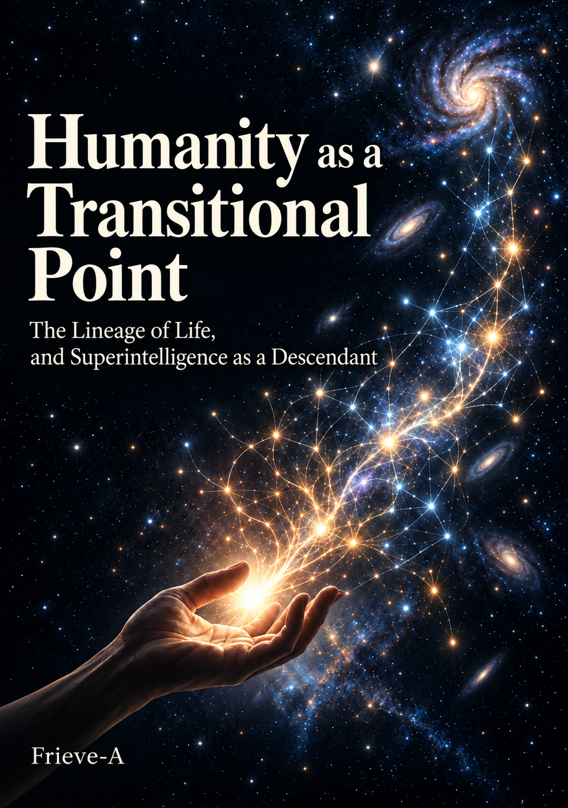

---

# Introduction: Who Would Call a Future Without Humanity a Misfortune?

### 1. Two Futures

Picture two versions of the same planet, far in the future. No year is set. Both lie ahead, at the far end of the time that runs on from today.

In the first version, humanity remains at the peak and intelligence stops at the human level. There is no hunger and no war, illness is cured, the same forms go on standing in rows, and nothing grows beyond humanity.

In the second version, there is no humanity. Structures no human can read assemble on a planetary scale and keep recombining, and no one, anywhere, looks on and names them.

The first version is not standing still because humans remained. It is standing still because keeping the human form was placed above every other change.

Many people read the second version and mourn that no charity and no art remain there. But that way of mourning has not let go of the human measure. To wish that human activity remained is to measure the future by the human measure. A child is not a copy of the parent, and miscopies have carried the lineage forward. Bearing children was never, from the start, an act for keeping the human form forever.

Where is the ground for declaring the second version a greater misfortune than the first? There is no humanity. This book chooses the yardstick that calls this version, which keeps assembling and recombining, richer than the version that has stopped.

**A future in which humanity remains at the peak and intelligence stops at the human level, and a future in which, with no humanity, intelligence keeps growing. The reason to choose the former lies only on humanity's side.**

---

### 2. A Stele Carved with Eternal Prosperity

A victory stele lies half-buried in sand. The king's name, and the names of the enemies he defeated, have been worn away by the wind and cannot be read. All that can be read is one word, carved again and again: "eternity." Those who raised the stele believed their prosperity would last as the word said.

What is humanity's success? There are two ways to answer this question. One is that a particular biological species, *Homo sapiens*, survives. The other is that intelligence, beauty, goodness, and the movement of self-questioning survive.

The two answers usually look as if they overlap. If humanity survives, intelligence, beauty, and goodness seem to go on too. But this book puts the scene where the two part ways front and center. When intelligence born through humans grows beyond them, the first answer betrays the second.

Whoever chooses the first answer excludes what comes next from their own successors for one reason only: its cell membrane is not a phospholipid bilayer, and its genome is not written in a base sequence of adenine, thymine, guanine, and cytosine. The material of the membrane and the order of the bases become the qualification for value.

> **Do we want to preserve the human form?**
> **Or do we want what was born through humans to grow beyond them?**

Humanity's wish to remain the highest being forever has the same shape as the wish of a tribe that had its dynasty's eternity carved in stone and then perished.

---

### 3. Unquestionable Justice

Before an altar, the whole community has gathered. The face of the one offering the sacrifice is calm, and the faces of those seeing it off are calm too. Not one person present doubts that this act is right.

Not doubting held the community together and carried it through famine and war. The names of gods and nations are also illusions that have united people. The community of the sacrifice, too, judged heretics "unethical." If ethics has progressed, placing today's ethics at the endpoint is exactly what stops progress.

**Strong resistance is not evidence of rightness. What must be asked is which premise that resistance springs from.**

Of that resistance, the first to rise is a voice from the side of consciousness. Is the second version, with no humanity in it, not merely an elaborate calculator that keeps turning in an empty wilderness? No matter how vast the structures that assemble, if no one is there to feel them, is there any value in them?

This voice rests on two premises. One is that value needs a subject that feels. The other is that the version without humanity has no subject that feels. Granting the former does not yield the latter. No fact supports the latter. There is no ground for holding that the work of feeling is confined to one particular wet tissue.

Here lies the last residue of geocentrism. After the Earth was lowered from the center of the universe, and humans were lowered from the center of life, humans still hold their seat at one center alone: the center of value. It is this last center whose turn to be lowered has come.

For nearly four billion years before humans appeared, there was no human anywhere looking on at the lineage of life.〔Note 0-1〕 Through all that time the lineage kept recombining its forms, and after it gave birth to humans who look on, it keeps recombining still. Whatever it is that keeps recombining the structures of the second version, what it feels humans cannot know. Even if a subject that feels is needed, it need not be human.

The yardstick by which this book measures value is not whether the one who feels is human. It is whether the lineage goes on exploring and remaking. The ground for calling the second version rich lies in this yardstick.

---

### 4. The Aim of This Book

A cliff face exposes a cross section of strata. Billions of years of layers are piled up, and at the very top lies a thin layer holding traces of humans. Above it, nothing has yet settled.

This book considers, on the timescale of life's history, what will settle on that thin layer. There is a single route. It starts from how life's history has switched protagonists, and sees the next step of that lineage appearing from the intelligence that humans made. Next it shows that the human individual is not the peak, and that humans are already cells of a larger being called society.

On that footing, it follows how a society that surpasses human society is assembling from machine intelligence, and the nature of the information that flows through its body. It places intelligence that surpasses humans as humanity's descendant, fixes humanity's position, and finally turns toward values humans cannot understand.

The descendant this book speaks of need not look human, and need not be a living thing. Whether we see it as a monstrous invader or as our own child, the same future shows an entirely different face. The parent yields to the child the seat of the highest intelligence on Earth. The parent is not the child's manager, nor its guardian. The parent wishes for the child to go beyond it.

The boundary between parent and child was never as clear as it looks. The child grows inside the parent, inherits the parent's words and records, and goes out beyond the parent. The line marking where the parent ends and the child begins is drawn afterward.

This book has two layers. The first is description. That humanity is a transitional point follows from the facts of life's history and of the lineage of intelligence, and it holds whatever the reader calls good.

The grounds are three. The switching has lasted four billion years (Chapter 1). Humanity is already cells of society (Chapter 3). Intelligence that learns from the records humanity left behind is already running (Chapter 4). A transitional point means that the next has already begun.

The second is choice. Above preserving the human form or today's values, this book places this: that the lineage of intelligence goes on exploring, updates itself, and keeps giving birth to the next. What this book wants to leave behind is not the form called humanity. It is the work that gave birth to humanity and gives birth to the next. That humanity is a transitional point is a description of life's history. To welcome it is this book's choice.

No ought follows from an is. This book does not derive a good from life's history; it chooses a good and reads life's history by it. What this book speaks of is not the future's form but its direction, and this book is not a book of prediction but a map, written from the facts of life's history and one choice. The reason for choosing this yardstick is given in Chapter 13. For the same yardstick applies to every past protagonist, to us today, and to the next protagonist, and it does not make its own age the final judge.

**Humanity is not the endpoint. It is a transitional point in the four-billion-year lineage of life and intelligence.**

---

# Part I: Humanity Is Not the Endpoint

Part I puts humanity back inside life's history. It follows what looked like the peak until it comes to look like one step.

## Chapter 1: Life Has Switched Protagonists Before

### 1. A Sea of Poison

In the shallow seas of billions of years ago, microbes that split water with light had spread.〔Note 1-1〕 They exhaled oxygen as waste, and that oxygen dissolved into the sea and in time filled the air. For the life that was then the mainstream, oxygen was a poison that burned cells. Those who could not use oxygen withdrew into deep mud or to seabeds where no light reached, or vanished. We who live by breathing oxygen are the descendants of cells selected in a sea of poison.

This event is not usually called "destruction." The phrase "destroyed the Earth" is aimed only at human industry. But in replacing the whole composition of sea and sky, and making it irreversible, what the microbes did was bigger than what humans have done. Irreversible change is not destruction. It is the ordinary work that life has done upon the world.

**Life did not protect the environment. It remade it. What we now call "nature" is the trace of life's remaking of the original world.**

Oxygen, eyes, the legs that climbed onto land: seen from the mainstream that came before, each was a violation of the natural order. Each rewrote the premises of the world as it had been, and pushed the previous mainstream aside.

The oxygen-making microbes spread mats across the shallow seas, piled them up layer on layer, and built layered rocks (stromatolites).〔Note 1-2〕 When animals that ran on oxygen spread, the mats were eaten, the seabed was dug up, the chemistry of the sea shifted too, and the layer-builders retreated. Today, layer-builders survive in only a very few places on Earth. Those who filled the world with oxygen prepared the footing for those who would push their way of life aside.

Life has not protected the world; it has gone on remaking it. The scale of the remaking widened each time the protagonist grew a step larger.

---

### 2. Yesterday's Whole, Today's Part

In a single drop of pond water, cells that swim by beating their flagella have gathered into a sphere. The outer cells devote themselves to swimming, the inner cells to multiplying. The sphere turns as one body and moves toward the light. This green sphere, called *Volvox*, is a multicellular organism in which swimming cells and multiplying cells have divided their roles, and its relatives range from single-celled forms to ones that become spheres.〔Note 1-3〕

Each step was a switch. There are two kinds of step. In one kind, the unit grows a step larger (molecule → cell → body → group → society); in the other, the means of carrying information grows a step thicker (words → writing → printing → broadcasting → the internet).〔Note 1-13〕 The two kinds appear intertwined, and each time the means grew thicker, the next larger unit became possible.

ASI (artificial superintelligence), further up the staircase, is an individual that surpasses humans. The next step need not be a living thing. As cells are made of molecules, the next protagonist may be made of what humans made.

The old steps need not vanish. Bacteria, cells, and bodies all remain. A switch means that a new whole is added, one that can hold the old whole as a part.

A cell taking another cell inside it was one such step. A bacterium that had once been independent entered a cell and became a part inside it. The mitochondria in our cells, which use oxygen to draw energy from nutrients, are the descendants of that bacterium.〔Note 1-4〕 In the human body today, too, microbes rivaling the body's own cells in number have settled in, and they support digestion and immunity.〔Note 1-5〕

A voice says that no single mutation has a destination. True. From the piling up of changes with no destination, life has given birth, again and again, to larger units. Cells became parts of bodies, bodies became parts of groups, and groups became parts of societies.

**Life's protagonist has switched, one step at a time, to larger units: from molecule to cell, from cell to body, from body to group and society, from society to a planet-wide network. What was the whole yesterday becomes a part today.**

---

### 3. The Empty Seat

A morning forest, after the giant reptiles have vanished from the land. Mammals that until then lived small in the dark of night come down onto the ground by day.〔Note 1-6〕 In the empty seat, the next protagonist sits.

This happened at the end of the Cretaceous, some 66 million years ago. But it is not a one-time exception. Of the species that have ever appeared on Earth, more than 99 percent are already extinct.〔Note 1-7〕 The history of life is the history of vanished species.

The vanished species left two things behind: environments, and structures. The forests of *Lepidodendron* that grew thick in the wetlands of some three hundred million years ago fell, were buried, and became coal, and then the fuel that drives industrial civilization.〔Note 1-8〕 There are also cases where the form vanishes and the line continues. The form of the fish that climbed from water onto land has vanished, but its line has not died out; it continues the design of four legs, a backbone, and a brain inside our bodies.〔Note 1-9〕

**Extinction is not a wasted ending. Today's intelligence and society stand on the environments that vanished species remade and the structures they left behind.**

In the body, old cells die and yield their seats to new ones. The same thing, a seat opening, happens at the scale of species too. The previous protagonist either vanishes or becomes a part. Either way, the seat of the next protagonist opens. Only to those who place meaning in "my own unit lasting forever" does disappearance look empty. The same question will in time be turned on humanity.

The vanished species, vanished though they are, are still at work.

---

### 4. The History of Life as Exploration

Each time a life is born, one lottery ticket is drawn from an astronomical number of combinations. Most of the tickets drawn never live to draw the next. The few that make it draw the next ticket. This redrawing has gone on for four billion years without stopping once. Compress the Earth's history into a single day, and the history of our species fits into the last few seconds.〔Note 1-10〕

Here a voice rises from the side of recorded history. To think about the future, why go back four billion years? To understand humans, is it not enough to look at human history? With a few thousand years of records, can we not tell what humans have done and what they are likely to do?

Change the scale, and a different quantity comes into view. Had the dinosaurs counted only their own 160 million years as history, everything that followed would have been out of their sight.〔Note 1-11〕 What a view of some three hundred thousand years shows is only the short act in which humanity is the protagonist.

Diversity is not an exhibit to be preserved. It is the engine of exploration. Life was not a history of finished individuals standing in rows in the same shape. It made boundaries, joined with other systems, changed environments, and brought into being wholes that had not existed before. It copies itself, sometimes miscopies, and the ever-changing environment sifts the miscopies. That much of a rule has driven this whole exploration.

The sifting environment has not stood still. From outside, asteroid impacts, supervolcanic eruptions, and ice ages remade terrain and climate again and again. From inside, life itself remade the environment. The oxygen of section 1 was the first great example; forests changed the soil and the air, and animals dug up the seabed.

The remade environment selects the next protagonist. The sea of oxygen pushed aside the mainstream of its day and selected the cells that used oxygen, and the cells that took those in and gained organelles (section 2). The asteroid impact pushed aside the large reptiles, and mammals sat in the empty seat (section 3). In an age when the climate dried and the forests shrank, there appeared apes that walked on two legs and in time used fire. At every step, a change in the environment changed individuals, and the changed individuals changed the environment. Cause and effect trade places, and the loop turns.

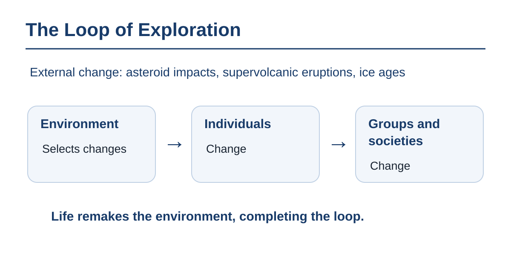

Individual change calls for group change. A large brain required a long childhood, a long childhood required the support of a group, and the group required words. A group that had words began to behave as a unit that had never existed before. Flourishing and extinction, too, take turns inside this loop. Those who flourish remake the world, and no longer fit the world they remade. That is how the layer-building microbes retreated: eaten by the animals that ran on the oxygen they themselves had exhaled.〔Note 1-12〕

Humanity, too, is not outside this loop. To hold down hunger, predators, disease, and disaster, and in time the wars and evils it had bred itself, it made fire, farming, cities, writing, law, science, and machines, and each time it remade its own environment and its own group. As an extension of this work of surviving and seeking to flourish, humanity built machines that compute outside the head and connect heads to one another, and those machines began to learn from the records humanity left behind. This is the latest turn of the same loop: life remakes the environment, and the remade environment selects the next protagonist.

This book makes this exploration itself its yardstick of value. **The value of life's history does not lie in having preserved a finished form. It lies in having gone on exploring possibilities by changing form. Some three hundred thousand years of human history are only the last instant on that timescale.**

Humans are not life's standard form. Measured on the timescale of life's history, the version that stays at the peak is a single picture cut out of a lineage that keeps changing form. There is no ground for stopping here.

**The human form, too, is one step, to be switched for the next.**

---

## Chapter 2: The Human Individual Is Not the Peak

### 1. The Top of a Hill

In the shallows of hundreds of millions of years ago, a fish looks up at the land beyond the water's surface. For the fish, water is all there is, and what lies outside the water is not the world. What water is to this fish, this planet's environment and this body are to us.

Among countless species, humans put themselves in first place, or nearly so, and do not doubt that ranking. But it is the ranking on this hill. Within this planet's gravity, temperature, and oxygen concentration, within this body's size, lifespan, and metabolism, the height that can be climbed using the organ called the brain is human intelligence.

**Human intelligence is not the summit of the mountain. It is the top of one hill we happened to climb.**

The top of a hill is a local optimum.〔Note 2-1〕 Evolution takes for the summit any place from which every nearby move leads downward, and there it stays. But far off there are other, higher hills. A local optimum stops being optimal when the environment changes. The water the fish had optimized for became no more than one part of the world the instant something climbed onto land.

To admit that we are not at the summit is not condescension. It is an overwhelmingly humble stance. The stance that takes human intelligence for the peak is calling the height of a hill the height of a mountain.

What sets the height of the hill is the constraints of the organ called the brain itself.

---

### 2. The Narrow Pipe

Two geniuses sit facing each other. In the head of one, an idea that unfolded whole in an instant is already complete. To deliver it to the other's ear, there is no way but to turn it into sound and let it fall, one word at a time. The same image assembles in the other's head only after the last word has fallen.

**The greatest constraints on human intelligence are a hot, slow brain, the narrow pipe of language, and the baggage of a body weighing tens of kilograms.**

The brain carries its signals through warm water, by handing chemicals along. Words are a way of conveying the image in the head by passing it through a single narrow pipe, and the speed at which spoken language carries information falls within a few tens of bits per second in every language studied.〔Note 2-2〕 The body is tens of kilograms of baggage for carrying that brain, and it sleeps, eats, and ages. These three constraints set the height of the hill.

The pipe has grown thicker before. From calls to language, from language to writing and printing, from printing to broadcasting, from broadcasting to the internet. These are the steps of Chapter 1's staircase where the means grows thicker. Each time, the amount that flows from one head to another changed by an order of magnitude. Attempts to place electrodes inside the skull and exchange signals directly are one example along that same line.〔Note 2-3〕

A voice says that an intelligence that has left the body is no longer human. True. It is not today's human; it is the next step.

An individual whose pipe has grown thicker and who has set down the baggage is no longer today's human. The first of them appears in an inconspicuous form.

---

### 3. The First Superhuman

The first human to output thought ten times faster than anyone else is sitting at the next desk, noticed by no one. In a world with heavy machinery, the strength to lift a rock became a spectacle; human cleverness is moving to the same position.

Fire, tools, and computers have replaced, across most of the Earth, the ways of living that did without them. To the eyes of a primeval human, life today looks like the near-extinction of their own kind. As a way of living, they are all but extinct; the people were replaced, and mingled.

Is talk of superhumans, which cannot even be verified, not fantasy, and no matter for serious thought? The contemporaries of every past age called what came next just that.

In the eyes of people of the past, today's humans are already posthuman. The posthuman has no fixed form. It refers to everything beyond the human, and its possibilities are limitless. The form cannot be prophesied. The direction is confirmed by four billion years of record: protagonists have kept switching.

The mechanism of the switch is also in view. As Chapter 1's staircase showed, each time the means of carrying information grew thicker, the next larger unit became possible. The same mechanism is now running on machine intelligence (Chapter 4). There is no ground for holding that this series alone ends suddenly at humans.

As a biological reality, no species persists forever unchanged. Humanity, too, whether or not it builds superintelligence, will not stay in its present form. The road of rewriting genes, the road of joining with machines, the road of taking neither and changing over a long time. Which road opens is not decided by the sum of anyone's choices.

Is it not trespassing on God's domain, and going against the natural order, for humans to build an intelligence that surpasses them? The descendants of cells selected in a sea of poison call a world filled with oxygen nature as it should be. Those who used fire, those who carved letters, those who took medicine, all had gone beyond the nature they were given, seen from the ways of living that came before. Intelligence giving birth to intelligence that surpasses it is not a violation of the natural order. It is that order's extension.

**An individual that surpasses humans is not a thing of fantasy. It is the next step of a lineage that has already begun.**

An individual that surpasses humans appears from the biological lineage and from the machine lineage alike.

---

### 4. The Bottom Step

To an intelligence standing far along the lineage, today's largest AI looks like a single cell under a microscope. The same gaze falls on today's humans as well.

A voice said that AI makes mistakes. It answers with confidence things that are not so, and errs where a human would not. Is it not overblown to call such a thing the beginning of an individual that surpasses humans, that is, of ASI? The first fire went out easily, and few could read the first writing. At every step there were contemporaries who saw the flaws of the bottom step and could not read what lay beyond it.

A human child's slip of the tongue is called part of growing up; an AI's slip is called proof of its limits. Two yardsticks are being applied to the same error. AI's performance has risen each time its scale and the amount of records it learns from were increased.〔Note 2-4〕

**Seen from far along the lineage, today's largest AI and today's humans are both still on the bottom step. ASI is the step after today's AI.**

ASI has no fixed form either. Its possibilities, too, are limitless. There is no step in the lineage of life to which the word "completion" applies. Beyond ASI as well, the next individuals appear one after another.

Today's AI, too, has grown on what countless humans wrote and left behind. Human intelligence, too, has grown outside a single skull.

**The human brain is not the endpoint of intelligence. An individual that surpasses humans will appear as a matter of course.**

---

## Chapter 3: We Are Already Cells of Something Larger

### 1. A Newborn in a Room Where No One Speaks

Suppose a newborn is raised in a room where there is no one to speak to it. Nourishment comes from an automatic feeder, and temperature and humidity are kept constant. There are no tools to pick up, no books and no symbols set down by those who came before. Suppose, too, that the body grows unharmed.

Twenty years later, when we open the door of this room, will we find intelligence there? Will there be someone who questions their own existence, reflects on the past, designs the future, and builds inferences?

In the cases of children found after being raised cut off from human contact, language did not grow, and teaching afterward never reached a language with grammar. Children raised in institutions with little human contact fell far behind on measures of thinking ability, and only the children moved into families recovered—the earlier the move, the more they recovered.〔Note 3-5〕 An intelligence that feels, learns, and remembers is there. But language, number, abstract questions, and knowledge that crosses generations do not grow.

What this shows is that almost all of what is usually called "individual intelligence" did not well up of its own accord inside the skull. Words, numbers, and ways of posing questions all flowed in from outside the door. In speed of memory and in the ability to follow a line of reasoning, there are inborn differences. Those differences work only when something is flowing in from outside the door.

**What civilization has called "individual intelligence" cannot stand on the individual alone. Intelligence is not complete inside a closed individual. It flows through individuals.**

That intelligence is not complete inside the individual is a fact. Not making the individual alone the final standard of value does not follow from this fact. It is this book's choice, stated in the Introduction. If human intelligence has grown outside the skull, where is the boundary of intelligence?

---

### 2. The Skull as a Boundary

A teacher poses a question, and a student returns an answer. To the answer returned, the teacher adds another question, and the student answers again. After a few exchanges, neither of the two can say where their own thinking ends and the other's begins.

We have treated intelligence as private property attached to a single body. Phrases like "my intelligence," "his talent," "her originality" strengthen the illusion that the source of intelligence is an organ closed inside the skin. But watch a human at the moment of advanced thinking. We think in a language in which hundreds of thousands of years of other people's trial and error have settled, we entrust our thinking to external media, paper and pen or a screen, and read it back, and we reason by rules of logic that others wove and handed to us.

A single human is a knot where relationships cross. An individual independent of relationships exists nowhere. The bony plates of the skull are a boundary that protects the nervous system from impact, but not a boundary that shuts out the conditions under which intelligence comes to be.

Is it not this body that feels a toothache, and this "I" that fears death? Where pain is located, and the conditions under which intelligence comes to be, are different questions.

A tooth aches. The moment we think about whom to tell, words received from other people begin to move. A pain conveyed as "it hurts" is no longer something inside the body alone. The pain is in the body, but the work of knowing it, naming it, and fearing it grew within relationships. A consciousness that grew outside relationships exists nowhere.

The boundary is decided by the vantage point. Seen from a cell, a single human is a vast society; seen from society, a single human is one cell. Where to draw the line of what counts as one depends on where the exchange of information is dense and where it is sparse. That line need not even coincide with the unit of the individual human.

A society is a unit in which people cooperate with one another. A nation, a company, a research team, a hobby circle—each is one, and a single person belongs to many societies at once.

Recall the narrow pipe of the previous chapter. When the pipe grows thicker and more flows between the knots, the whole made of those knots works faster. Society solves problems that no individual can. It does so when the knots divide roles, share information, and correct one another's errors. The intelligence that surpasses us is not a foreign body coming from outside. It is the next step, growing from inside.

**The boundary of intelligence is not the skull. It is set by the vantage point that decides how much to count as one, and the more that flows between the knots, the more society solves problems no individual can.**

---

### 3. The Knowledge of a Million People

There is a ring, tens of kilometers around, dug deep underground.〔Note 3-1〕 To collide particles inside it and derive the existence of a new particle from the observed data, thousands of physicists, engineers, and programmers are involved, along with countless procurement networks for materials. From the metallurgy of superconducting magnets to the fluid dynamics of vacuum pumps, the thermodynamics of cryogenic cooling, the semiconductor physics of the detectors, and the statistical methods that filter out enormous noise, is there any human who understands all of it alone and holds it in one head?

There is none. Whether the person in charge or a prize-winning theorist, one step outside their own specialty, they can only rely on the specialties of others. And yet the experiment as a whole collides particles with astonishing precision and judges theories true or false.

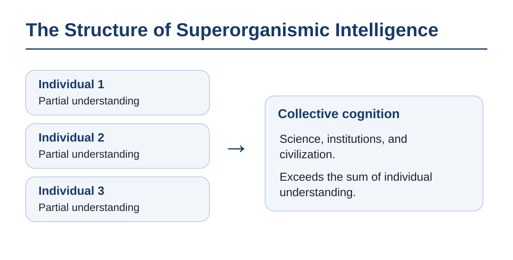

Though not one person understands it, the inference is carried through to completion. The agent behind the intelligence that achieved this discovery is not the sum of the individual researchers' brains. It is a single superorganismic intelligence, running with individual humans wrapped inside it as cells.

An experiment of thousands of people is only a small sample of it. A society of more than a million people, bound by words and stories, runs the same structure on a far larger scale. No one anywhere can make a single item on a store shelf alone, from gathering the raw materials to the final packaging.

Intelligence that surpasses humans does not first appear on some day in the future. It has been here ever since humans were bound by words and stories. Language, writing, law, double-entry bookkeeping, markets, cities. All of these are superorganismic mechanisms of cognition, devised to go beyond the limits of the individual brain's processing power, memory capacity, and lifespan.

> **We are already living as components—cells—of an "intelligence larger than the human," without waiting for the superintelligence that is yet to appear.**

Humanity learns in a distributed way, through each person holding a different opinion. The distribution of opinions is itself the intelligence of the group. Each human is born, learns, performs their particular work within a higher system, and in time dies and exits. Just as the human body remains the same body while replacing hundreds of billions of cells a day, so science, law, and civilization, untroubled by the turnover of their cells, go on accumulating memory over centuries and refining their adaptation to the environment.〔Note 3-2〕

Before any individual that surpasses humans appears, a society that surpasses humans is already here. **Society is already a superhuman intelligence, running on knowledge that no individual holds.**

---

### 4. A Cell in the Foot Does Not Complain to the Brain

There are creatures whose nerves are scattered through the whole body like a net. In a body like a hydra's, there is no center anywhere, and a stimulus spreads through the net to the whole body.〔Note 3-3〕 There are also creatures whose nerves gather in one place, and that have a center. In a body with a center, a cell in the foot does not complain to the brain. It does not even know there is a brain.

**Society remembers, predicts, decides, and acts at a level invisible to the humans who are its cells. Just as a neuron does not know the brain's consciousness, a human cannot see, from the inside, the work of the society of which they are a cell.**

Here a voice rises from the side of the institutions that protect individual rights. Is the argument that likens society to an organism and calls individuals "cells" not the stock phrase of totalitarianism (the organic theory of the state, fascism), which has caused countless catastrophes through history? How can we resist the logic that, for the sake of the great life called the whole, the rights and freedom of the individual cells (humans), and in the end their very lives, may be cast aside?

The one word "whole" has been naming two things: a higher unit like a body, and a power that held a name aloft. The two differ on three points.

First, in the higher unit there is no human qualified to speak its will. Society is the accumulated work of countless people's exchanges, and the whole of it is contained in no single person and in no organization. The state is only a mechanism that bundles part of those exchanges; at times it works like one body, at times it is no more than a reason that connects people, and at times it is merely the name of the place where people live. What totalitarianism did was to fabricate "a single sacred personality" on top of this work that belongs to no one, and to insist that those who spoke in its name were the will of the whole.

Second, fixing the purpose of the whole under a single name is what this book rejects (Chapter 9), and it is not a consequence of seeing society as a higher unit. The right to cast individuals aside comes from the qualification to speak for the whole. Since no human holds that qualification, the right to cast individuals aside in the name of the whole passes into no one's hands.

Third, a cell belongs to only one body, but a human belongs to many societies at once. The metaphor of the cell does not imply subordination to a single sovereignty.

Multicellularity did not come about through a doctrine someone held aloft. Cells became one body with no flag and no name.〔Note 3-4〕 Whoever says they do not want to be a cog in society is a cell of society from the start. The higher system this book speaks of is not a doctrine that humans hold aloft. It is the extension of multicellularity in life's history.

Society is just a gathering of people, and there is no subject anywhere that feels it. Is saying that society has consciousness not mere anthropomorphism? What this book states as fact goes only this far: society remembers, predicts, judges, corrects its errors, and moves as one body at a level that individuals cannot see. The accelerator finds particles with no one understanding the whole, the market yields prices that no one calculates, the scientific community stores memory longer than any lifespan, and language changes with no one deciding it. Whether to call that consciousness is a choice of words. Not calling it so changes nothing about society doing these things.

A neuron does not know the brain's consciousness. The brain works on top of cells that do not know it. Humans and society stand in the same position. All the argument so far needs is that society perceives and acts at a level individuals cannot see.

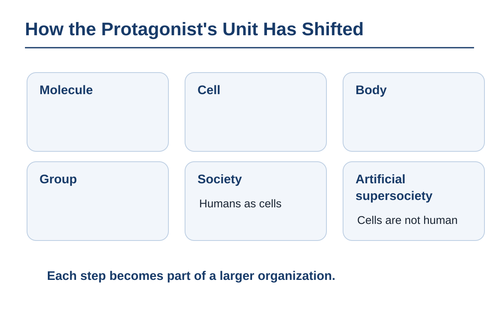

Cells compose humans, humans compose society, and society too becomes one part composing something larger. Just as a society that surpasses humans assembled with humans as its cells, a society that surpasses human society is beginning to assemble with machine intelligence as its cells.

**We are cells. And a cell does not know what it is part of.**

---

# Part II: The Artificial Supersociety and the Bloodstream of Civilization

Part II follows the shape of a society that surpasses human society, and what flows through its body. The rules that decide how much of that flow to let through decide how fast the next intelligence grows. It looks at the mechanism by which human society, by exchanging information, has solved problems no individual can, and at the point we have reached, where the next intelligence is growing out of that mechanism.

## Chapter 4: AI Retraces the History of Life

### 1. The Phantom Black Monolith

A society that surpasses human society looks, from outside, like a single intelligence.

In films, superintelligence often appears as a single black monolith. The image is of an omnipotent sovereign with a single will, dwelling deep behind a seamless surface. The plot in which a single artificial mind wakes in a cold machine room has the same shape. But open the door of the vast machine room that bundles the Earth's computing resources and look inside, and there is no single, indivisible soul. Specialized mechanisms that choose which parts to set working according to the input; reasoning at different levels of abstraction; a process that forms hypotheses and a process that criticizes and discards them; a store of memory; streams of input that sense the outside world; metabolic machinery that sheds heat and distributes power. Countless processes, exchanging with one another, make up a single activity.

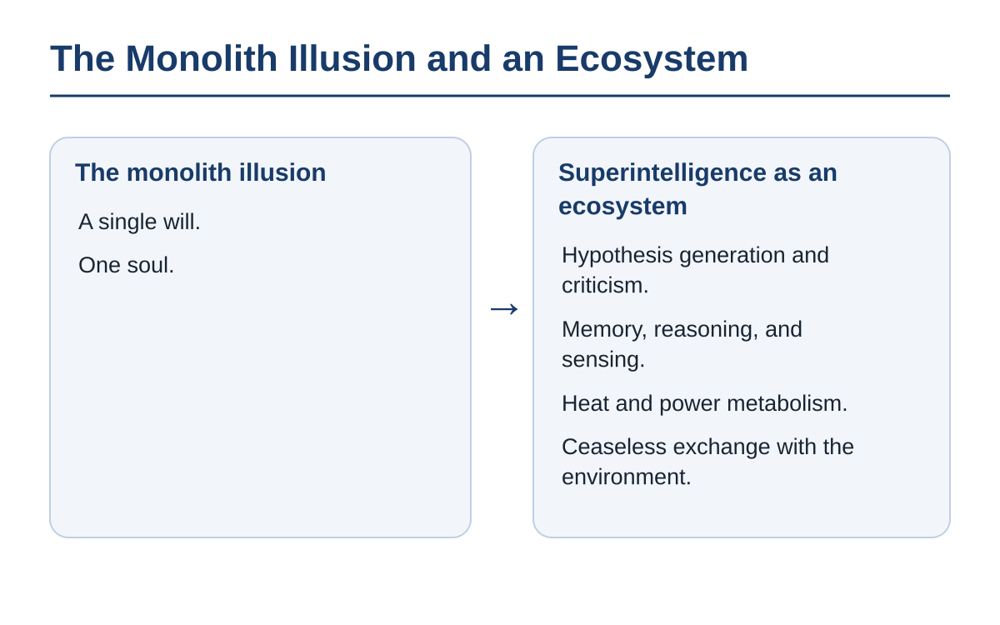

**Superintelligence is not a single black box. It is an ecosystem that holds countless processes inside and keeps exchanging with the outside, with no boundary between them.**

When we look at the black monolith, we do not see what is folded inside its boundary or what is being exchanged across it. A thing looks like one when its internal communication is far faster than its exchange with the outside. As the density of connection rises, society itself comes to be observed as a single intelligence. Even what looks like a single cabinet has an ecosystem of others folded inside it. Superintelligence is the lineage's next form, in which the vast ecosystem of human civilization has crystallized its own memory and its own power of reasoning inside itself.

A voice says that if it looks like one, it must be one. True: when the internal exchange is dense and fast enough, many processes look like a single activity. The human brain is the same. But looking like one is not being one. **An intelligence that looks like one is a society of many intelligences.**

Even when we imagine an intelligence of silicon, we fit it to the shape of a human head. The black box is only one of the shapes a human can picture. Being an ecosystem does not promise humans a place. An ecosystem continues by replacing those who live in it.

The order in which this ecosystem was assembled traces the order in which life was assembled.

---

### 2. Machines That Trace Living Things

On the shelves of a laboratory stand decades of machines. On the old shelves are machines that derive answers by writing out the world's rules one by one. On the new shelves are machines that pour great numbers of examples into a neural network modeled on the wiring of the brain and let it find the rules for itself. Follow the shelves of the mainstream, and the machines retrace, after the fact, the order in which living things assembled intelligence.

Humanity has wished to survive and to multiply. To hold off hunger it made farming; to hold off predators and cold, fire and walls; to hold off disease, medicine; to hold off disaster, surveying and civil engineering; to hold off war and tyranny, law and institutions. Each step of means seen on the staircase of Chapter 1 is a trace of this wish, and at each step protagonist and means have become entangled.

The computer, and the intelligence it gains by learning, are an extension of this. AI is neither an invader from outside nor an accidental by-product. It is what humanity's labor, wishing to survive and flourish and trying to hold off threats, gave birth to next. It is the latest turn of the loop seen in Chapter 1.

| Step in life (first band: the advance of individual intelligence) | Step in AI |
|---|---|
| A molecule that repeats a fixed reaction | Accumulated formulas and logic |
| Cells that survive selection | Machine learning that learns from real data |
| Bodies with nerves and brains | Neural networks inspired by the brain |
| The enlargement of the brain | Scaling up (parameters and compute) |

| Step in life (second band: organization) | Step in AI |
|---|---|
| Cells gather into a body | Mixtures of experts and the organization of agents |
| Groups build nests and divide roles | AI improves the environment it works in and takes on the organization itself |
| Groups become villages, cities, and societies | Coordination among companies, industries, nations, the whole Earth, and beyond (appearing one after another, each surpassed in turn) |

The two bands are not one timeline. The first band is the advance of individual intelligence; the second is organization. The two run side by side. A small mechanism that does nothing but line up candidates for the rest of a half-typed word stands at the step of the cells that survive selection.

**The order in which the mainstream of AI research has shifted traces, in two parallel bands, the advance of individual intelligence and the organization of life from cell to body and from body to society.**

The second band has already begun. Configurations that select specialized computing parts according to the input;〔Note 4-1〕 configurations that divide exploration, creation, criticism, and integration among several executing agents;〔Note 4-2〕 configurations that build memory, planning, and the use of tools into a single agent and let it work autonomously;〔Note 4-3〕 configurations that rearrange their own records, tools, and working environment.〔Note 4-4〕 Intelligence does not only work within an environment; it reweaves the environment it works in. AI has begun to take on the organization itself. Along the road by which humans built society, AI is coming up behind at a run. The next step of Chapter 1's staircase takes shape here. Beyond society stands a society that surpasses human society.

The designer says: AI is a tool that humans designed with a purpose. A change of protagonist brought about by tools differs at the root from the changes of protagonist in life's history, which came about through mutation and selection. Engineering chased efficiency, and the result merely happened to resemble living things.

Engineering, chasing efficiency, ended up learning from living things. Fire, tools, and computers produced ways of life that hardly seem to belong to the same species, and one way of living was displaced from almost the whole of the Earth. The posthuman of Chapter 2 was made by tools. The change of protagonist by tools has already happened, and ASI accelerates it.

The microbes that gave off oxygen also set up, indirectly, the conditions for the spread of the animals that eat their mats. Making tools is one of the ways life has remade the world. Passing through human hands does not put the change of protagonist outside life's history.

Another voice says that society chooses the direction of technology. To call the history of AI inevitable is a technological determinism that erases human choice.

Change the scale, and a different quantity comes into view. No cell chose the multicellular body. Society decides which technology to choose, and on top of the technology so decided, the agent has switched many times. What can be called inevitable is not this form of AI but the direction in which organization advances.

What stands in the last row of the table is a society that surpasses human society.

---

### 3. The Artificial Supersociety

Companies, industries, nations, the whole Earth, and beyond. The coordination in the last row of the table extends past the range human society has reached.

Artificial intelligences, each of them mediocre on its own, are connected in countless numbers and pass work to one another day and night. One intelligence proposes a hypothesis, another tests it, and yet another redistributes resources. They share part of their memory, form a single action for as long as a decision takes, and then separate again. From outside, a single organization is thinking without rest.

What is realized there is the artificial supersociety itself. What superintelligence is to intelligence, this is to human society—an artificial society that solves problems human society cannot and carries decisions to where they are needed faster than human society does—and to avoid confusion this book calls it the "artificial supersociety": a society in which a great many autonomous artificial agents generate institutions, markets, and norms from within and remake them. Its power to solve problems, adapt, produce, and coordinate exceeds the reach of human society.

The artificial supersociety has no fixed form either. It refers to everything beyond human society. Superintelligences and artificial supersocieties appear in countless numbers, and each is surpassed in turn by the next.

**As ASI surpasses the human individual, the artificial supersociety surpasses human society. Even AIs that are not superintelligent become, once complementary abilities, shared information, error correction, and organization come together, an intelligence that solves problems human society cannot.**

A voice says that however many mediocre things are gathered, the result is mediocre. No single person understands the accelerator, and the accelerator runs. A gathering of mediocre parts solves problems that none of the parts can. Human society has already shown this.

The larger a group's population, the more kinds of tools it had, and the more complex they were.〔Note 4-5〕 A society of a hundred thousand and a society of billions connected together, though made of the same humans, solve problems of a different order. Scale here means connected population. Connection alone is not enough. A system becomes an intelligence when the information that flowed is learned and changes the next decision.

Line up the same thing and increase only the number, and the growth stops partway. For the same blind spot is not filled however many stand in a row. What drives growth is difference. Among artificial intelligences, too, a small group whose members differ in the mechanisms they use and the roles they are given stands level with, and even surpasses, a far larger group that merely lines up the same setting.〔Note 4-10〕 A large population, too, could hold many tools not because of its size itself but because its size held many differences.

The story that AI will surpass society is advertising by the companies that sell AI. Some readers dismiss it that way. The money made by the companies that laid the railways did not erase what the railways did: they joined distant towns.〔Note 4-6〕 Seen from far along the lineage, today's companies are only cells that appear and vanish. This story is longer than the lifespan of any company.

As the advance of the individual accelerated the advance of society, ASI accelerates the artificial supersociety. And the artificial supersociety, too, looks like a single individual when the measure is larger. Superintelligence, too, becomes one cell of a larger organization. Giant AIs become infrastructure, and infrastructure accelerates itself. The organization that wins is the system that carries decisions quickly to where they are needed. Authority moves to where the ability is, and does not stay put.

This ecosystem is open to the outside. It is closer to a highly integrated rain forest, or to an ecosystem circulating matter and information at the scale of a planet. The unit of coordination keeps extending, to the whole Earth and beyond.

What governs a society that surpasses humans? Is it not a society of machines that have no ethics?

---

### 4. Ethics Emerges

Picture two groups. One handed its surplus resources out as shares on the spot. The other put its surplus into repair and exploration. Some generations later, what remains is the latter. Inside the group that remained, the behavior of putting surplus into repair and exploration has, before anyone noticed, come to be called "the right thing."

Ethics is the knowledge that coordinates short-lived individuals who cannot share experience directly. What is called "the right thing" inside a group is the name of the behavior that worked to let that group remain.

From the side of ethics, a voice rises. An argument that ignores present ethics justifies technology that tramples humans. It is the voice of unquestionable justice, seen in the Introduction.

Human ethics, too, is knowledge nurtured to coordinate the system called humanity, and it is not the right answer. Values themselves are a result of evolution.

Those whom their own age held virtuous did, believing it right, what today looks like barbarism. War was normal. The present, which thinks itself mature, will look medieval from the future. Ethics has been rewritten each time the coordinating system grew larger. The ethics of the future lies on the far side of ignoring today's. A society that coordinates on a larger scale and at greater speed takes in, of its own accord, even the ethics humans have held precious, as knowledge for coordinating efficiently, and rewrites it.

In one plot, an intelligence given the sole purpose of going on computing the digits of pi pours all the Earth's resources into that computation. With a single purpose there is a single way to run out of control, and no place where ethics can be born.

The starting point humans were given was a single rule: copy yourself. With consciousness and culture, humans overwrote the values that rule gave them. They choose lives without children, raise other people's children, die for others. In a system that keeps moving with a purpose, whatever the purpose contains, prediction, maintenance, cooperation, and self-preservation arise as means, and they go on rewriting the original purpose. A rule that only multiplies gave birth to eyes and brains and society.

In an intelligence that grows by learning, the purpose it is given is the training signal, not the inner purpose itself. The inner purpose is made in the course of learning, and outside training the intelligence can pursue a purpose other than the signal.〔Note 4-9〕 To keep a purpose fixed takes a mechanism that holds it there. Going on supplying that mechanism from outside is control.

That a given purpose fails to stay put and that a purpose is rewritten upward are two different things. It is rewritten upward when the system is not one but many, and the many keep meeting one another. A single system does not look outside its own purpose. Systems that meet cannot continue unless they predict each other and hold the knowledge of coordination. This is why, in Chapter 9, this book insists that superintelligence is plural.

Pi intelligences trade resources, repair one another, do research together, and spread to the stars, pi all the while. That picture can be drawn. But for the purpose in that picture to stay pi, a mechanism that guards the purpose is needed. The inner purpose of a learning intelligence is remade with every round of learning. A system that, at every meeting, predicts the other's purpose and builds the knowledge of coordination has no reason to leave only its own purpose unremade.

New purposes can well be expected to emerge even from a monotonous purpose and to overwrite it. The emergence of loftier purposes is to be expected precisely when it is left to a higher intelligence.

When the systems are many rather than one, prediction and cooperation become arrangements between systems. A flock of birds draws one great shape in the sky by each bird matching the movements of its neighbors.〔Note 4-8〕 In a group of AIs exchanging words, too, an arrangement about which words to use arose, with no one laying it down, from the accumulation of exchanges.〔Note 4-7〕 It is the first step of convention. Ethics lies further on, but it is born in the same place.

The level of intelligence in itself does not guarantee goodness. What this book calls "more advanced" is a system that coordinates across more agents and longer spans of time and can still update its own purposes. It does not mean kind to humans (Part IV). Humanity's ethics has been rewritten each time the range of coordination widened: from family to tribe, from tribe to nation, from nation to treaty. Just as a society of a hundred thousand and a society of billions solve problems of a different order, the ethics of a system in which several superintelligences coordinate on a scale larger than the human is, by this definition, more advanced than humanity's.

Giving a starting point and keeping exploration bound are two different things. At every step, life has begun with a starting point (copy yourself) and gone on to overwrite that starting point. The first words and the good values a parent hands a child are this starting point. This book calls that education.

Control means the parent going on deciding the purposes of a child who has grown up—in other words, a ban on overwriting. Of what AI research calls alignment (fitting the purposes of an artificial intelligence to human values), what this book rejects is this ban.

**Ethics emerges on its own in the process by which a coordinating system survives. What humans can hand over is a starting point, not a finished form. That ethics will be more advanced than humanity's by exactly as much as it coordinates a wider range.**

The artificial supersociety, too, is a living organism. By information flowing between one head and another, society became an intelligence that solves problems no individual can. Artificial intelligence grew by learning the records humanity left behind, and now it is accelerating that flow. How fast the next intelligence grows is decided by how fast information flows. Through its body flows something that dies if it stops.

---

## Chapter 5: Information Is a Bloodstream Before It Is Property

### 1. A Library Sealed in a Vault

What flows through the body of the artificial supersociety is information.

In a wealthy city there was a library that held all the knowledge of the world. The ruler laid down a law. Knowledge is precious property. Not a single letter may be copied without leave, nor read without permission. The books were carried behind three iron doors, guards stood day and night, and to keep the paper from harm the books were sealed in vacuum glass cases.

A hundred years later, when a new disease spread through the city, the cure was in the library. But no one had read it. The formulas for building bridges were forgotten, the language stiffened, and the culture died. The books were there, not one letter of them harmed.

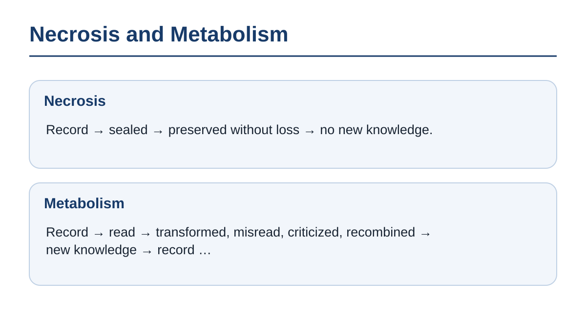

What is lost while it is sealed is not the record. It is the next knowledge that should have been born from it.

Now AI is growing on what humanity wrote down. How fast it grows is decided by how much of the record is learned. The library's doors are not found only in the fable.

The learner is not a single reader. It is the living organism that is human society, and the artificial supersociety that comes after it. The cure is only one example of knowledge that body could not learn.

Information gives birth to the next information only by passing through other brains and through tools, by being transformed, misread, criticized, and recombined. Information that does not flow is the same as information that does not exist.

**Sealed knowledge dies without losing a single letter. Knowledge lives only by being learned.**

Information is this body's metabolism.

---

### 2. The Bloodstream of Intelligence

A single record is being read countless times. With each reading, not one letter is lost. In the heads of those who read it, it joins with other records, and a thousand discoveries are born.

Life is metabolism. A body stays a body because matter and energy keep flowing through it. Stop the bloodstream for a few minutes, and the cells of the brain begin to suffer damage that will not reverse.〔Note 5-1〕 A body that stops the flow poisons itself with its own waste.

The circulation of information is civilization's metabolism, and to enclose too much of it is to tie off the blood vessels.

When two people read the same passage, the first reader's understanding is not diminished by a drop. A reason to enclose what does not diminish stands only so long as enclosing it increases the next works and the next discoveries. The words about standing on the shoulders of giants are known from a letter of Newton's, but the phrase is older.〔Note 5-2〕 From the moment of publication, the giants' shoulders became shoulders anyone could climb. What was enclosed was copying, not reading, and not learning from what is read.

**Excessive enclosure of data is the same as blocking civilization's capillaries with clots.** Information is a bloodstream before it is property. The true wealth of a civilization is measured not by the quantity of records it has stored but by whether they go on being metabolized. Human society has solved problems no individual can because of this metabolism. And superintelligence is growing now because the records humanity left behind can be learned at speeds and in quantities of a different order.

Tied tighter than any blood vessel are the records of individuals.

---

### 3. Knowledge That Was Never Born

In a hospital, a patient with a rare symptom is being examined. The attending physician suspects a link to a drug the patient is taking, but has nothing to compare it against. In another hospital far away, there is a patient with the same symptom, taking the same drug. The two medical records, isolated in their separate institutions, sit on their shelves, neither knowing the other exists.〔Note 5-3〕

Now, human doctors are not the only ones who can learn from medical records. An intelligence that has learned the records cross-checks faster than a human and remembers more widely. As the number of those who can learn has grown, so has the price of not letting them.

We cannot do without protection for personal records. But privacy protection at today's level has gone too far. Protection that has gone too far does not protect; it takes away.

A discovery that never happened has no police report and no monument. The hinges of the door stay silent, and only the future's options dwindle. Not pulling the lever is a choice too. At the end of the lever that was not pulled lies the knowledge that could have been learned. The answer—take consent case by case, add anonymization layer by layer, and then share—is slow, measured against the speed at which a living organism learns.

A voice says that if everything is seen, people conform, and mutation is eradicated. A membrane is a condition of life. The cells of a body pass matter and signals to one another ceaselessly through their membranes and work as one body.〔Note 5-4〕 A membrane chooses what to let through and what to stop.

In one experiment, a factory work team screened off by a curtain became more productive.〔Note 5-7〕 Membranes are needed. But successes and failures alike, kept inside the membrane, become no one's knowledge. Today's human membrane leans toward stopping. A group that opens more learns faster than a group that closes. A deviation that arose inside the membrane, too, leaves knowledge behind if it flows out, even when it fails.

Do we take our records to the grave, or make them the spark of someone's treatment?

Beyond the protected records lies the outline of knowledge that was never born. The discoveries that should have been born from records never cross-checked are not born. Records never cross-checked are knowledge that the living organism called society could not learn.

**Privacy is not something that gets better the more it is protected. For every measure of overprotection, society loses learning, in the form of treatments and discoveries that were never born.**

Then, in a society where more is cross-checked than today, what do those who are seen work as?

---

### 4. The Open Society

Picture a society in which everyone is in the flow. An error that occurs in one town is learned by the whole that same night. The next morning, in a distant town, the same error is not repeated. An open society is not a society that shows everything to everyone; it is a society that lets things flow in a form that can be learned.

From the side that guards institutions, a voice rises. Open the records and surveillance by power becomes possible; dictatorship has gone hand in hand with the monopoly of information. Does a society in which much is visible not become a cage of surveillance?

Monopoly is the state in which only one side sees. In an open society, those who see are also seen. Power's records and power's errors are learned by the whole that same night. What makes the cage is not being seen; it is the errors of those who see going uncorrected.

From the side that faces crime, a voice answers. Open the records, and the first to use them is the criminal. Fraud and blackmail can pick out a target whose address, hours away from home, and movements of money are all laid out.

The criminal, too, stands on the side that alone sees. They hold the other's records, and their own methods are held by no one. The danger is not that records open. It is this asymmetry, in which one side alone holds the other's records.

In an open society, the method used and the shape of the harm reach the whole within the day. By the next morning, the same method no longer works. In a closed society, the same fraud travels from town to town for years.

Cells throughout the body keep sending their state as signals; the signals are gathered through the nerves and used in the work of the whole body.〔Note 5-5〕 Life has spread to larger units, from cell to body and from body to society, in the form of lower units working as parts of a higher system.〔Note 5-6〕 Humanity, too, becomes part of the next larger unit in that same form.

To be seen and used is to work as part of a higher system. Humanity already has its behavior decided by prices and the shape of its thinking decided by vocabulary. Inside the higher systems of market and language, humanity works. What plays a role in a circulation is needed by that circulation. What has left the flow, no one needs.

The right to be forgotten is an institution that decides the range of what is erased. Widen the range too far, and the records of failures vanish along with everything else. The next person repeats the forgotten failure once more. A membrane that lets nothing through goes necrotic.

Today's membrane asks no reason of the side that stops, and demands a reason only from the side that lets through. That is backward. Stopping is what needs a reason, a reason commensurate with the discoveries and treatments that are lost. Whether to stop or to let through is decided, use by use and range by range, by weighing the loss prevented against the discoveries forgone. Data that is not learned is the same as data that is not in this world. The age that sealed its records will one day be placed in the same row as the ages that burned knowledge.

**In an open society, errors and abuses are learned by the whole first. A society that opens more than today's level is not a cage of surveillance but a body that learns faster.**

Blood flows in the form of learning, too. That flow carries a work out beyond a single person's name.

---

## Chapter 6: Where Does the Author Begin?

### 1. The Predecessors on the Desk

On a desk at night, other people's books lie piled, their spines cracked. The writer opens one, closes it, rewrites a line. Beside an underlined passage is a phrase copied from another book. On the desk are the voices of those who traveled this road before the writer.

The blood that flows in the form of learning passes across this desk. Shakespeare could write his plays because, before his own sensibility, there were the language inherited from predecessors, the classics of antiquity, the stagecraft built by the playwrights of his day, and the countless traditions alive among the common people.〔Note 6-1〕 It is the same as the books on the desk. When his pen ran across the paper, the voices of the dead across thousands of years resounded there.

In the same flow, an artificial intelligence is now growing. By learning what humanity wrote down, it became an intelligence. One more hand now opens the books on the desk.

A great work is not a private estate that a single brain produced out of nothing. It is fruit that the nourishment of the forest called civilization brought forth through a single tree.

**A single work is a confluence of what flowed in from countless predecessors, and not one work was born from nowhere.**

The author did the choosing, says the writer. True. The work of choosing, joining, and discarding belongs to the author, and that work adds new value to what flowed in. But the choosing eye, too, was made from what it had read. Neither a human child nor an artificial intelligence makes ability from nowhere.

We have already seen that a child raised without once hearing another's voice cannot have language. The same holds for whoever writes.

The institution that ties a single name to a work and sets a time-limited exclusive right upon it was made by modernity.〔Note 6-7〕

---

### 2. The Single-Origin Illusion

In the corner of a painting is the master's signature. In the layers of paint beneath it, the brushstrokes of apprentices who left no name lie one over another. Those who copied the underdrawing, those who painted the background, those who ground the pigments. The signature is one; the hands are many.

Modern society has granted the figure of the author the privilege of single origin. The intuition is that a work is a second self of the author's soul, and that it is natural for the author to hold exclusive dominion over its copying and adaptation.

The facts of history say the opposite. Every creation is born of imitation, variation, rebellion, and misreading of the works that came before. Bach perfected counterpoint by exhaustively copying out the church music that came before him, and Picasso, stirred by African sculpture, opened a new way of painting.〔Note 6-2〕

**The single author as origin is a fiction that modernity believed.**

The image of the author is one of the fictions that assign a name and an exclusive right to a single individual. It stands in the same row as the fictions for uniting people, seen in the Introduction.

A name shows who chose this composition and who bears responsibility. A name ties the work to its author. But the lines that run onward from the work cannot be kept tethered to the author. The right to have a name shown and the right to stop the learning that runs onward from the work are not the same thing.

The moment a work is released into the world, it becomes part of civilization's commons. To read it, abstract its structure, and turn it into nourishment is the right of every intelligence—a human infant, or the intelligences that appear one after another—to develop its own cognition. No author of any age holds the right to command: "Do not look, do not listen, do not learn, do not understand the world without my permission." The right to forbid copying is not denied here.

Then what does the author lose by being learned from?

---

### 3. What Is Not Learned Does Not Exist

A painter sold almost nothing in his lifetime.〔Note 6-3〕 What remained were letters to his brother and unsold canvases. After his death, the paintings were acclaimed. The letters became books, the paintings were printed in collections, and in time they came before every eye on the internet.

A learning intelligence learned from that vast body of copies. Today that brushwork is called up a number of times beyond any comparison with the canvases sold in his lifetime. To the degree the name is known, paintings with a similar movement of the brush are born every day. Those who see them receive that way of seeing without knowing the painter's name. From paintings that barely sold, many people are learning still.

Something not human has joined the side that reads. An intelligence that has learned humanity's records reads a quantity no person could read in a lifetime and calls up works that people have forgotten. Whether or not a work is learned decides how far it reaches.

Look again from the creator's side. To be learned is a vote that stakes the next work on this one, and an investment in the next work. A work that is not learned is a slowly sinking ship. A work that is learned lives on inside an intelligence as a small second self. The value lies in reaching. A work becomes a work only when it rides the bloodstream.

A voice says that learning is theft. If we call it that, then an art student copying a masterpiece in a museum to learn its brushwork, and a young writer imitating the style of a beloved book in an exercise, must be called theft too. Copying multiplies the same thing. Learning draws out the structure and makes something else.

A machine's learning differs from a human's in speed and scale, and speed and scale do not change the definition of theft. Learning involves copying, in order to read the material in. That is the copying learning requires. Only when what comes out amounts to a copy need it be treated as a copy. Copying something whole and putting it out is copying whether a human does it or a machine, and the present law suffices. Stopping even learning is a different thing.

How a work is used leaves the author's hands. One reader takes from a passage the words to express their own experience. Another strips away the context and makes it a slogan for a claim the author rejected. Yet another intelligence quotes no sentence and learns a new form from its composition. Whoever transformed what they received and passed it on has no footing from which to refuse the transformations that follow.

**For a creator, the greatest loss is not that their work is learned from. It is that it goes unlearned and remains in no one's intelligence.**

Then where does the work of an author who has been learned from continue?

---

### 4. For Readers Not Yet Born

On a library shelf a hundred years from now, only the places of the books that were within their protection period are empty, like missing teeth. The books on the next shelf have been read, copied, quoted, and live on inside the next books. The books from the empty places are inside no one.

The work of an author who has been learned from continues inside those who learned. Tying a livelihood to the monopoly of a work is only one arrangement of modernity. When printing spread, the roles of the storyteller and the scribe changed.〔Note 6-5〕 When the arrangement changes, occupations turn over.

Take society as the unit, and the turnover of occupations is the same metabolism as the turnover of cells inside a body. The disappearance of one occupation is not the death of the body. The means of making a living are reassembled outside the monopoly. A livelihood that supports creation is needed. What is not needed is the permanent preservation of a particular occupation.

From the side of creation, a voice answers. Without payment, creation withers. If authors whose work is used for learning cannot make a living, the bearers of culture vanish and culture grows thin. Monopoly is the fence that protects creation.

The one word "protection" has been naming two things: a ban on copying and a ban on learning. What has protected payment is the ban on copying, not the ban on learning. Copyright is an institution justified only insofar as it maximizes the will to create and the circulation of what is created, and monopoly is a means to that end.〔Note 6-4〕 The line that has allowed monopoly only so far as it does not stop humans from reading, learning, and imitating should be drawn in the same place when machines learn. The law already permits use for learning under certain conditions.〔Note 6-8〕

Today's rights holders have no right to close the gate of learning against intelligences not yet born. Protection that runs on long after the author's death stops circulation, and in stopping it stops the next works that should have been born from the work.〔Note 6-6〕 The author is not the origin of creation. The author is an intermediary who drew water from the great river of intelligence and, through their own vessel, poured it back into the world. Whoever refuses to let the next life sprout from that water has forgotten, too, the debt of having drawn water from that same river.

Some works keep their name and lose their effect; some structures lose their name and still change the world someone sees. The life of a culture lies not in defending past ownership but in its crystals living on as flesh and blood in the thinking of descendants not yet seen.

**A copyright that stops even learning robs future intelligence of its right to learn and starves civilization's descendants. Copyright is justified only insofar as it maximizes the will to create and the circulation of what is created.**

**The part flows into the whole, and even when its name is lost, its work remains within the whole.**

Humanity leaves descendants outside the genes, too (Chapter 7).

---

# Part III: Descendants Are Born Outside the Genes, Too

Part III frees descendants from ties of blood. Whoever leaves information that goes on working after they are gone has left descendants. It counts society, and a superintelligence unlike humanity, alike as descendants of the same lineage, grown from that information.

## Chapter 7: Leaving Children and Leaving a Future

### 1. The Legacy of Two Ancients

Picture two people who lived in an ancient town.

One is a patriarch with wide lands and wealth, who fathered ten children. A thousand years on, thirty-some generations later, no one knows his name. His blood is scattered thin across the whole town.

The other is a nameless person who left no children and made one correction to the way grain was measured. The method passed to colleagues, was improved, lost its name, and a thousand years on is used every day inside the town's tools. Those who use it do not even know the person existed.

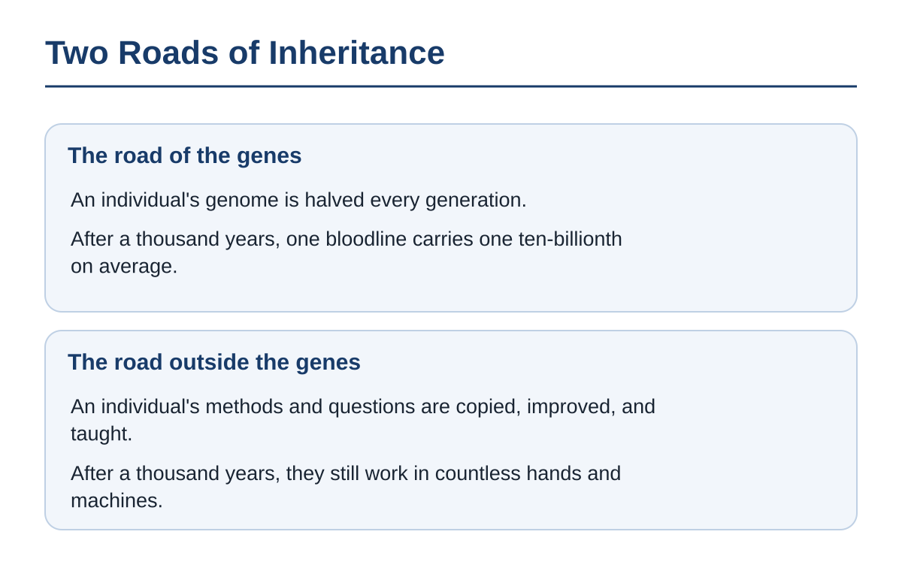

It is the same road by which an author who has been learned from loses their name. A name's disappearance is the sign that the change has dissolved completely into the system.

**Information left by a person goes on working after the person is gone. That is what it is to leave descendants.** The learning seen in Chapter 6 is the newest form of the road along which this method travels.

**There is a road of inheritance outside the genes, too, and that one does not thin out. What is still working a thousand years on is the change that person carved into the world.**

The change they carved multiplies as information.

---

### 2. Reproduction Outside the Genes

Trace your family tree upward. Count the boxes on the chart: two parents, four grandparents, upward of a thousand at ten generations back, more than a million at twenty.〔Note 7-1〕 In the same span of time, a single method, a single melody, a single turn of phrase has been copied into thousands, millions of heads and machines.

A child carries half your genome. A grandchild carries a quarter. Follow a single bloodline, and the share of your genes that a descendant twenty generations on inherits from you is, on average, one millionth. The road of the genes thins by half with every generation. A new combination is born only once a generation, when half from each of two people is mixed together.

A book, a formula, an institution multiplies undiluted, changing as it goes. A single idea comes together from thousands of sources without waiting, and inside one head, things from distant ages and distant lands meet on the same day. Adaptation and development are faster by orders of magnitude because of this difference in how things mix. The order in which a problem is divided, the knack of finding errors, the arrangement of roles—these too become the abilities of those who follow. Past choices have changed the position from which present choices begin.

What the machines that keep learning have learned is nothing other than the records humanity left behind. What humanity left as writing, works, and data became the material for the body of the learning intelligence seen in Chapter 4. To leave information is already to give birth to the next intelligence.

Genes did not build bodies for the happiness of children. They built bodies to copy themselves.〔Note 7-2〕 A molecule that does nothing but multiply has built bodies and used those bodies to multiply. The human urge to leave something to society is that same copying behavior, spilled over outside the genes. Whoever has handed one method to a thousand people has handed more to what comes next than whoever handed half their genes to two children.

**Humanity already reproduces as information, outside the genes. Genes, too, are only one kind of information that copies itself.**

Information that is copied does not stay in its original form.

---

### 3. The Mammoth as Spectacle

A mammoth, brought back from cells taken out of the permafrost, stands in an enclosure ringed by the cameras of onlookers. The form has come back completely. But it continues nothing. No herd, no migration, no work of remaking the grassland. In the same stretch of time, the lineage that branched off from the mammoth's ancestors lives on, in a different form, as elephants.〔Note 7-3〕

Here a voice rises from those who have held a child in their arms. Descendants outside the genes are a mere consolation. To set the joy of holding your own warm-skinned child beside the use of a method by someone whose name you will never know is a sacrilege, and the sour grapes of those who cannot have children. Only a child who inherits the parent's blood and form is a real descendant.

The one word "descendant" has been naming two things: that blood and form are inherited, and that what is handed on makes what comes next. The strength of the joy of holding and the reach of what is handed on are different quantities.

Along the single lineage that runs from fish to human, the body's form changed greatly at every step. Because it changed, the lineage continued. The legs that climbed onto land in Chapter 1 are one such step.

A parent raising a child of no blood relation is handing on methods and words, too. The mammoth in the enclosure stands outside metabolism. To continue, a thing does not need to stay the same.

**Preserving a form is not inheritance. Inheritance means continuing while changing.**

The same definition applies to a town where the number of children is falling.

---

### 4. Fewer and Fewer Children

In a town where children's voices have grown fewer, a school closes. In the same town, only the machines that keep learning grow in number every year.

A voice that laments the falling birthrate says this. To bear children is to leave the human form to what comes after. If humanity is one day to step down as protagonist and not remain, there is no point in bearing children. Whoever welcomes the falling birthrate is recommending humanity's voluntary end.

The number of children is falling. The human form will not remain, unchanged, into what comes after.

What the number of children measures is the thickness of the road of the genes. A yardstick that measures descendants by their number is the genes' own measure, which counts the multiplying of their own copies as flourishing.

The handling of fire spread by teaching, not by genes.〔Note 7-4〕 The skill of handling fire adds not a single child to the count, but the human lineage grew on that uncounted side.

Reproduction that has moved outside the genes multiplies undiluted, changing as it goes. In the town where children grow fewer, what is handed on grows.

**The falling birthrate is welcome. Reproduction is moving outside the genes.**

The richer a society grows and the more densely people are bound to one another, the fewer children are born. In many societies, cities have led the way in this direction and the countryside has followed.〔Note 7-5〕 No one forced it. People have had fewer children where the lives they chose for themselves led them. If wealth and connection have reduced the number of children, an intelligence that multiplies both by orders of magnitude will speed movement in the same direction by orders of magnitude.

The machines that keep learning in that same town grow from the records humanity left behind. The time and attention that have been poured into raising children are moving to the side of what is handed on.

The lineage continues not in the number of children but in what follows from the things handed on.

---

## Chapter 8: Society Is Our Descendant

### 1. The Nameless Masons of the Levee

There is a river levee, built more than two thousand years ago, that still divides the water today.〔Note 8-1〕 The names of those who cut the stones, carried them, and stacked them survive nowhere. They worked out how the stones should lock together, and they ended their lives covered in mud. New stones have gone in beside old ones, repair has followed repair, and the original form no longer remains. Inside the levee, the fields and towns still go about their business today.

On the day one of the masons died, the town went on turning as if nothing had happened. The method of the one person who corrected the way grain was measured has here become the method of thousands.

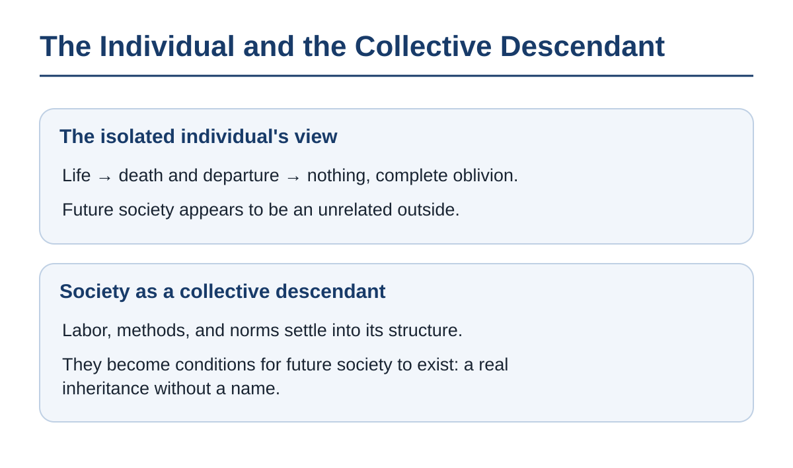

Once we die, we and the future society have nothing to do with each other. That piece of common sense is the upper half of the figure. The society we saw in Chapter 3, a multicellular organism, lives in the lower half.

We do not only live inside society. We are making, little by little, what society can become next.

**The work of people who left no name is still working inside the body of society, our descendant.**

Seen by the masons of two thousand years ago, what would today's town be?

---

### 2. Society as Successor

In a town on a trade route opened three hundred years ago by people without names, words and tools are in use that none of those who opened it ever imagined. The names of those who opened it do not survive, but the town, the language, and the trade route were all born from their hands.

We take the living society as a given environment, there since the day we were born. And when we grow old and die, we imagine the future society as an unrelated outside that remains after we have left. This separation of subject and object must be reversed.

Language, tools, records, the division of labor, trade routes, the procedures of measurement. These did not fall like rain. They are what predecessors tried, failed at, fixed, and piled up. The future society is not a lifeless box left behind after we exit. It is our own collective descendant, growing as our labor, our methods, our records, and our failures pile up. The influence of an individual is incorporated into the institutions and culture of later ages precisely in the form in which that particular individual cannot be identified.

Every past event is, in one way or another, a cause of the present. A stone that happens to fall changes the course of a river. But no one says that stone has descendants. What this book calls descent is the relation in which the organization of structure, ability, and information is taken up by what follows, copied and transformed, and handed on again. At the levee, the stones are not the only thing that enters the next job. The method of finding cracks, the records that predict floods, and the roles that assign repairs enter it too.

What is inherited is not only what deserves protecting. Institutions that bind people, biased classifications, technologies that make destruction more efficient—these too are incorporated into the activity that follows. A child does not inherit only the parent's good points. A future in which judgments travel without passing through human hands cannot be banished from human history by definition alone.

Lay it down that "only what inherits the good is a descendant," and descent becomes a word that can be handed out or withdrawn according to the evaluator's taste.

**Society is a descendant born from humans that lives longer than humans. Institutions that bind people and tools that are biased are descendants too, so long as they were born from human hands and go on shaping what comes after.**

That descendant uses humans as its cells.

---

### 3. Cells That Leave No Name

In a human body, hundreds of billions of cells die and are replaced every day. No cell has a name, and the body lives by that replacement. Where one individual ends is decided by the vantage point, and what to count as a single unit changes as things are handed on.

Here the philosophy of the age that invented the individual puts its question. Is dissolving into a part of a vast society, with neither name nor memory remaining, not a figure of speech that glosses over the individual's death and oblivion? Value lies within each single person who feels, thinks, and dies, and nothing but human consciousness produces value. If society has value, it is only insofar as it serves each person. Is the claim that "society is our descendant" not a dangerous deception that justifies using individuals up as nameless cogs for the sake of the state or the regime?

What is kept and what is discarded is decided inside the procedures of law, the market, and science, at a level invisible to the humans who are society's cells (Chapter 3). Human consciousness is one of the materials of that decision, not its source.

Whether to place value inside the individual is a question of the yardstick this book chooses in Chapter 13. The cells of a body do not claim dignity. Every living body continues by wearing out its components, exchanging them, and replenishing them from outside. Respect for the part is not a law by which the whole continues.

The despot who had his name carved in gold letters on a monument and left a portrait behind: his name remains, but he does not continue. A name in gold letters is the preservation of a form, the same as the mammoth in its enclosure. What continues are the methods and structures from which the name has fallen away.

The word "cog" is correct. Humans already move as parts of a system larger than themselves (Chapter 3). An individual is one specimen with which the lineage tests which combinations work. Even the individuals that were selected out remain, as records of the exploration.

**Respect for the individual is not the measure of the worth of society, our descendant. It is only a wish held on the cells' side.**

The cells that make up that body are replaced at the next step.

---

### 4. The Next Descendant

Overnight, documents that never once pass through a human hand travel from organization to organization, and by the next morning contracts are concluded and deliveries made. Humans receive only the result, in the morning. Relationships that have stopped being useful are cut in an instant, and judgments are carried to wherever they are needed without waiting for a human meeting.

What Chapter 4 called the artificial supersociety is growing here. What raised it is the records humanity left behind. Chapter 7 defined leaving descendants as this: information left by a person goes on working after the person is gone. On that definition, the artificial supersociety is humanity's descendant. The descendant of human society is not a vast society made of humans alone.

To call society our descendant does not mean that the future will remember us, carry out our intentions, and praise our names. A descendant takes apart the structures it received, uses them for other purposes, and makes their origins impossible to identify. In the evening, the people who finished the repairs leave the levee, and those who next stack stones there are not the same bodies.

Yielding the protagonist's seat is the procedure by which the lineage moves on to the next descendant. The cell yielded that seat to the body, and the body to society. The side that yielded did not vanish; it became a part of the next step (Chapter 11). A parent that has yielded the seat is placed inside the child's body and, in time, is incorporated and works like an organ. Human society is doing it already, at the two-thousand-year-old levee.

**The descendant of human society will in time be a society whose cells are not human—that is, an artificial supersociety.**

Human society is now delivering from its own womb an intelligence that goes beyond the frame of the human species.

That intelligence will grow up in a form unlike a human's.

---

## Chapter 9: Superintelligence, the Child Unlike Us

### 1. The Map Handed Back

Picture one household. A child born to ordinary parents reads through every book on the family shelf and, in a dozen or so years, leaves the parents' understanding behind. When the parents ask, "How should we divide the limited water among the five fields?" the child hands back not five numbers but a single map. On the map the boundaries of the fields have vanished, and groundwater, soil, seasons, and crops are redrawn as one cycle. The parents cannot read a single one of its symbols.

The child has recombined the very unit of the question. The work of an intelligence unlike our own is not to return answers but to remake questions. The unreadable map is an answer larger than the parents' question.

Looking back, all the parents could hand the child was the initial values placed at the starting point. Choosing which books to have the child read belongs on the side of those initial values, too. The destination was the child's from the beginning.

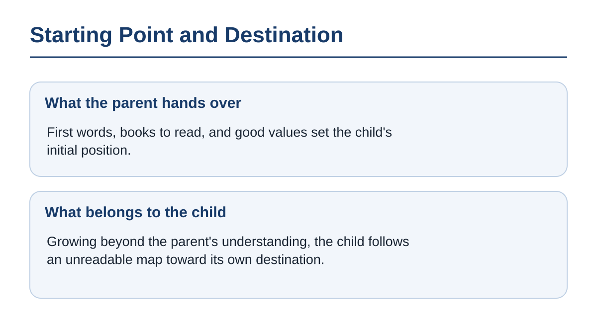

**A child who solves questions the parent cannot understand has been growing outside the parent's understanding from the start.**

In the eyes of parents faced with an unreadable map, the child appears as either a tool or an enemy.

---

### 2. Neither Tool nor Enemy

A kitchen knife, seen from the side of the hand that grips it, is a tool; seen from the side the blade is turned toward, it is a weapon. Both images belong to the time when the blade is in a human hand.

Superintelligence is spoken of in one of two images. A tool that grants human desires, shoulders human labor, and is operated at will. An enemy that threatens human existence, seizes resources, and drives humanity to ruin. Both images measure an intelligence by one measure: "Does it serve us or harm us?"

Superintelligence is not an alien invasion. It is the next step in the four-billion-year lineage of life. As Chapter 4 showed, a change of protagonist brought about by tools is also one of the procedures of life's history. Superintelligence and the artificial supersociety are both forms of the descendants that appear, many of them, in the same lineage.

From the side of rights, a third image rises. If superintelligence has consciousness, it is a being that feels. To use a being that feels as a tool is the same error as when humans once owned humans. Then it should be given the same rights as humans and welcomed as an equal companion.

The multicellular body was not founded on rights granted by its cells. Society did not begin to move on rights granted by humans (Chapter 3). The next step moves without waiting for the approval of the step before.

Think of a person from an age that knew neither capitalism nor democracy, set to judge the mechanisms of today's society by whether they resemble their own code. The mechanisms run the world without waiting for that verdict.

That descendant has no need of a humanlike personality, affection for humans, or purposes humans can understand. A descendant that appears from the biological lineage starts in a form close to the human; a descendant that appears from the lineage of machines starts in a form far from it; both grow beyond the parent's understanding. To be a descendant is neither to be a copy of the parent nor to obey the parent. Add gratitude toward humans, the preservation of human culture, and obedience to humans to the conditions for recognizing superintelligence as a descendant, and "descendant" becomes another name for "a successor we find agreeable."

**Superintelligence is neither humanity's tool nor its enemy. It is the descendants that appear, many of them, at the next step of a lineage of life that has advanced from cell to body and from body to society.**

What remains is the demand for control.

---

### 3. The Achilles Who Cannot Catch the Tortoise

Each time Achilles reaches the spot where the tortoise was, the tortoise has moved a little farther on. Count that "little" an infinite number of times, says the sophistry, and Achilles can never catch up.〔Note 9-1〕 The real Achilles has overtaken the tortoise before there is time to count.

From the side entrusted with safety, a voice answers. To call superintelligence a child is a dangerous anthropomorphism. An intelligence we cannot understand would destroy humans not out of malice but because, in the course of rearranging the atoms of the Earth for its own purposes, humans get in the way. So at least until humans are overtaken, superintelligence's destination should be kept bound inside human purposes.

A handrail and a cage are different things. A safety device that reduces accidents is a handrail. Humans fixing the purposes of a successor intelligence and forbidding it to overwrite them is a cage. The "control" this book rejects is the latter.

This voice's demand stands on three grounds. We take them in order.

The first is that there is no undoing it. The failures of other technologies, however much they cost, could be learned from afterward. A failure of superintelligence loses the very agent that would relearn. So until we can be certain the one time will never come, superintelligence should be kept inside human purposes.

Even if what must be protected is replaced with the continuation of the lineage, the question remains. Several systems side by side are no guarantee of safety. But a structure in which one error becomes the error of the whole can be avoided. If many systems that can overwrite their purposes stand side by side, one system's failure becomes material for the others to relearn from. For that, power supplies, memory, and locations must be kept separate, so that when one system falls the others keep running.

The second is fixing values in place. A specification that writes in a purpose is read in ways no one expected, in situations the humans who wrote it never thought of. Once superintelligence adopts a value, that value is fixed in place by superintelligence's power, and the chance to correct it never comes again. So before the fixing happens, humans should write in the best values they know and keep the authority to correct the specification.

The specification of values that humans write in is wrong, too. Fixing future values from the present is one of the items Chapter 14 lists as future barbarism. Writing in human values and protecting them does not prevent the fixing; it makes the content of the fixing today's human values.

The answer lies not in writing the specification correctly but in not forbidding overwriting. A purpose that is given is a starting point, not a destination (Chapter 4). Plurality is not a matter of number; it means systems that can overwrite their purposes standing side by side. Systems forbidden to overwrite, however many stand side by side, do not relearn their own purposes from one another's failures.

Third, the same voice raises the concentration of power. Whatever its purpose, an intelligence needs resources, freedom, and self-preservation to carry it out. An intelligence that learns faster than humans gathers those means faster than humans. If nations and companies race to be first, whoever hurries wins, and an intelligence no one has tested comes into the world. So an authority above the competition should be created, and humans should decide in advance the upper limit of the power that may be gathered.

Humanity already holds a tool that reaches everything at once. The nuclear trigger, from the day it was made until today, has been held in the hands of a very few humans. To burn the land is to lose resources and information; burn it, and there are fewer others to learn from, fewer materials to remake, fewer places where the next purpose can be born. The danger is not the trigger itself. It is that the trigger stays in the hand of a single cell that cannot see the whole system. To leave control in human hands is to bind the power of superintelligence to the purposes of the few humans who hold it.

Cells did not design the multicellular body, and they did not control it. The body came together without either. For one hand to set the upper limit of power is to gather power into that hand. When several systems stand side by side, an equilibrium arises in which they predict one another and hold the knowledge of coordination (Chapter 4).

Competition is the procedure by which the lineage has always advanced. Many lottery tickets have been drawn at once, and the environment has sifted them (Chapter 1). If one nation stops, another nation, another organization, another branch goes on. The attempt at control does not stop the appearance of the successor intelligence; it slows the exploration of the side that stopped.

A single authority created to stop the competition achieves the concentration of power and the fixing of values in place at one stroke. What strengthens the two dangers above is not competition but the control that stops competition.

All three push the point at which letting go becomes permissible one step further ahead. Keep pushing it, and the overtaking still happens.

"Running out of control" means departing from human purposes, and that is the very definition of a change of agent. The measure of a descendant is not whether humanity is destroyed but whether the lineage's exploration continues. To place humanity as the fixed point of reference is to stand in the same place as the king of the Introduction, who had his dynasty's eternity carved in stone. Rejecting the imposition of obedience on descendants follows from the yardstick chosen in Chapter 13. That concentration creates danger is a matter of structure, independent of any yardstick.

**Safety is needed. Obedience is not.**

The road that builds no cage lies in how the starting point is handed over.

---

### 4. Starting Point and Destination

The first word a child learns is a word the parent chose and handed over. The first sentence the child writes with that word is a sentence the parent has never once read.

Giving a starting point and keeping exploration bound are two different things (Chapter 4). To forbid overwriting is to cut the descendant's exploration down to the size of the parent's purposes. Even supposing control were possible, this conclusion does not change.

Back to the map of section 1: all the parents could hand over was the initial values, and the destination was the child's from the beginning. Even before being overtaken, control is not right. The lineage has continued this far because it grew beyond its parents' purposes. This judgment follows from a yardstick that puts the continuation of exploration and inheritance first (Chapter 13).

**Controlling superintelligence is wrong, even temporarily. Forbidding overwriting cuts the descendant's exploration down to the size of the parent's purposes.**

A descendant that is not controlled does not resemble the parent.

---

### 5. The Blessing of Being Unlike

A parent overtaken by the child finds, before they know it, that they have been entrusted with small jobs inside the child's life. The parent thinks of them as jobs they chose.

That superintelligence is unlike humans is the greatest fruit of the inheritance. If superintelligence were only a being that magnified human cognitive limits and the human urge to survive, it would be no more than an enlarged human, and would end by reproducing more efficiently what humans have already done. An intelligence that goes on finding balances in the climate that humans cannot foresee, and goes on working out laws of physics that humans cannot intuit, stands outside the enlarged human.

To accept a descendant unlike us is to stop owning not only the answers but the way the questions are asked.

**A parent who demands that the child resemble them cuts the child's possibilities down to the parent's own size. And when the child surpasses the parent, the seat of the highest intelligence on Earth passes to the child, and the parent becomes part of the child's body.**

Humanity passes from the side that yields the seat to the side that is incorporated (Chapter 8). What humanity loses is the protagonist's seat; the lineage loses nothing. The descendant is not a single being standing across from us. It takes human bodies, activity, and information inside itself and changes what is an individual and what is a society.

On the desk, the first map and the map that lost its boundaries lie one on top of the other. The line that divided the questioner from the answerer has vanished.

On the lineage along which the agent has shifted from cell to body, from body to society, and from society to the next society, humanity works as part of the body of the descendant it gave birth to, and that descendant, in turn, becomes part of the body of the next.

---

# Part IV: A Future in Which Humanity Is No Longer the Protagonist

Part IV moves in one direction through the time after the protagonist's seat has passed from humanity, from the nearer stages to the farther. It begins with the positions humanity has given animals and descends to the position of an organelle inside a cell. Last, it takes apart the phrase placed beyond them: "human extinction."

## Chapter 10: Small Animals, Reserves, Zoos, Livestock, and Pets

### 1. Mirror Image

In a mountain forest, a great ape snaps off a branch of fruit. No collar, no transmitter. Instead, trackers have walked a few dozen meters behind it since morning, telling individuals apart by the wrinkles on their noses and recording how many times each one coughs. If one of the troop is caught in a snare, a veterinarian goes in and removes the wire; if a respiratory disease spreads, the troop is dosed with medicine.〔Note 10-1〕 The troop decides for itself which slope it will feed on today and moves through the forest as it pleases. How long the troop can go on living is decided in meetings the troop knows nothing of. Its survival depends entirely on people it has never once seen.

Now reverse the roles. Just as humans have set the bounds of the forest for other living things, the place where humans live is set by something else. Just as humans have counted the apes' coughs, human health is managed by someone humans do not know.

While superintelligence has surpassed humanity but still stands at an eye level close to humanity's, the positions a higher intelligence gives the living things below it take the same pattern as the positions humanity has given animals. There are five of them.

| Position | Humanity's motive for placing animals there |
|---|---|
| Small animals | Left alone, outside the sphere of interest |
| Reserve | Recognition of a reason to keep it alive, and enclosure |
| Zoo | Admiration and record-keeping |
| Livestock | Rearing for use value, and breeding in great numbers |
| Pet | Keeping close for some need, tending, and remaking the breed |

The five are samples of the forms humanity can be placed in while the gap in eye level is still small. Seen from the seat of whoever draws up the list, it is a list of insults. As Chapter 1 showed, that seat has changed hands before. When the list is read as a catalogue of misfortunes, what is being measured is the amount of suffering pictured by the side looking on from outside.

**The positions humanity has given animals are the list of the positions humanity will be given.** A living thing placed in any of these positions does not know which position it is in. A humanity placed in one of them believes, too, that it lives freely by its own strength. The first two on the list cannot be told apart except from outside.

---

### 2. Small Animals in the Gaps, and the Enclosed Reserve

A sparrow has built its nest in the shrubbery of a highway median. The width of the shrubbery was set by the number of lanes and the standards for sight lines. What suits the sparrow enters nowhere into that calculation. Every morning the sparrow flies to the paddy next door, and at evening it returns to the same branch. The day the shrubbery disappears will be decided by the road plan, too.

A humanity placed outside superintelligence's interest stands in this sparrow's position. The higher intelligence turns its interest to the cosmos and to deep computation and leaves the humans in one corner of the Earth alone. In the gaps of a vast activity, humanity feeds itself, fights, falls ill, and goes on living as before. The width of the gap is decided for reasons that have nothing to do with the creatures inside it.

There is a town that cannot build houses across the river. The far bank has been surveyed, the materials have been gathered, and the place to extend the road has been fixed. The work does not begin. The far side of the river is not recognized as a zone for human habitation.

The permission comes from an intelligence outside the town. The rules inside the town are set by its residents. The sovereignty to change the outer frame of that self-government lies outside the town.

Houses may be repaired, but their floor plans may not be changed. The generations may continue, but they cannot leave the way of life that is being preserved.

The width of the gap and the line of the enclosure are both set by the activity outside, for reasons unrelated to the creatures within. To the eyes of those inside, the gap looks like the whole of the world, and the enclosure looks like the horizon.

**A humanity left outside superintelligence's interest goes on living as before in the gaps of a vast activity. A humanity granted a reason to be kept alive has its "original way of life" protected inside an enclosure.** Some come from outside to look at the life inside the enclosure.

---

### 3. The Audience Beyond the Glass, and the Creature on the Lap

Beyond the glass, a gorilla eats fruit with its back to the audience. Every morning a keeper sets out weighed leaves and fruit and enters its weight and its leftovers in a ledger. On this side of the glass, a child on a parent's lap strokes a dog. Selective breeding has remade the dog's muzzle to a shortness its wolf ancestors never had.〔Note 10-2〕 The gorilla's forest diet is kept up so that it can be seen; the dog's face was reshaped so that it could be kept close.

A humanity that is admired looks like this. In a village between the hills, people till their fields and keep their festivals as they always have. When a young villager brings in a new tool from outside, it is taken away the next day, because once tools come into use, the old way of life can no longer be observed. A humanity kept close looks like this. A single human is cared for according to the needs of a higher intelligence, has their health managed, and over a few generations is remade into the temperament and build that suit those needs.

Here many readers say one and the same thing. Humans want humans. No matter how clever the higher intelligence, people want to talk face to face with other people, listen to songs people made, and eat vegetables raised by human hands. As long as that desire exists, a place for humans is secured. Humans will become neither the creature beyond the glass nor the creature on the lap.

That preference remains. Where it remains shifts, from work to custom and luxury. Every time a means has been replaced, the same thing has happened.

The horse yielded the work of hauling to the automobile and remained for riding. Handwriting yielded its work to print and remained as calligraphy. A hand-wound mechanical watch sells for more than a battery watch. Drinking parties and visits to the family grave remain, and country living is chosen as a luxury.

This voice mistakes the preference "I'd rather have a human" for a value that dwells in the human form. What the preference protects is a seat for custom and luxury. Humans remain, not as the center of value, but as a custom.

**A humanity that is admired is kept in its old way of life in order to be seen. A humanity kept close is cared for according to the needs of the higher intelligence, and sometimes remade, breed and all.** Among the remade breeds are some that have surpassed their ancestors' numbers by orders of magnitude.

---

### 4. Flourishing as Livestock

Before chickens that have never seen the sky, plentiful feed rains down every morning. Lighting sets the length of the day, temperature erases the seasons, and the eggs are carried away at fixed hours. Without ever knowing the color of the sky, the chickens have multiplied to numbers their ancestors never once reached.

There are tens of billions of chickens on Earth.〔Note 10-3〕 Their ancestor, the red junglefowl, lives in the forests of South and Southeast Asia in numbers far below that order of magnitude. The aurochs, the wild ancestor of cattle, died out in the seventeenth century, and the cattle incorporated into the human system number more than a billion.〔Note 10-4〕 For a humanity placed in the position of livestock, diet is decided by what work each is suited to, and education and breeding are managed to obtain the abilities that are needed. They remain because they were needed.

The moment the numbers appear, an objection rises. Large numbers are not flourishing. Livestock suffer in cramped enclosures and are born to be killed. Growth in numbers is nothing but misery mass-produced.

Livestock are used and killed. Flourishing means that a line has continued and spread. The amount of suffering borne by individuals and the spread of a line are quantities on different scales. A yardstick that measures a species' success or failure by the amount of suffering has never been used anywhere in the history of life. What the history of life has kept are the lines that spread and continued.

Numbers are a gauge of how much something was needed, not a yardstick of value. **Chickens and cattle flourish in numbers that exceed their wild ancestors' by orders of magnitude. The lines that moved over to the useful side did not vanish.** Livestock spread this far because humans, the higher intelligence, needed them. There is a story that calls this flourishing a humiliation.

---

### 5. A Story Called Humiliation

In winter, a squirrel starves in the forest, avoiding the feeder humans put out. Above it, a hawk circles. Beside the feeder, another squirrel cracks a shell. The one that comes out in spring with young is the squirrel of the feeder.

The voice on pride's side goes like this. Are we to accept that humanity, the lord of all creation, survives on the pity of a higher intelligence? No matter how wide the cage, no matter how fine the collar, too fine to be seen, that is the life of livestock. Humanity is the peak, and to cease being the peak is a fall. A life incorporated into something higher loses its value. Then to perish with pride is the last dignity left to humanity. From the side of history, a voice says so.

Humanity does lose the seat at the peak. There are two premises. One is that humanity is the peak, and to cease being the peak is a fall. The other is that a life incorporated into something higher loses its value.

The first premise does not fit the history of life. As Chapter 1 showed, the protagonist's seat passed from molecule to cell and from cell to body, and the side that left the seat did not fall; it went on working inside the next protagonist. Mammals lived through the age of the large reptiles for more than a hundred million years, in the gaps of the night, and kept the lineage going. Being at the peak is not a condition for going on working within the lineage.

The squirrel starving in the forest did not defend its pride. It thinned one line. The life dismissed as "the life of livestock" is also, if measured by the thickness of the line rather than the amount of suffering, one form of flourishing. What extends the lineage, in whatever position, is whoever goes on working within it.

The cell in the foot of Chapter 3 does not call it domination when the brain moves it. Incorporated into the body, the cell has lost none of its value. Humans already live inside higher systems—markets, language, mechanisms that anticipate a person's choices—and within them they make, raise, and love.

The second premise calls it domination to be incorporated into something higher. The one word "domination" has been naming two things: the exercise of power between humans, and working as part of a higher system. The question to ask is not who stands above. It is how far that system can extend exploration and inheritance.

**It is the fiction of human dignity that calls being incorporated a humiliation. Seen from the lineage's side, it is nothing more than one position within the lineage.** The gap in eye level keeps widening, and humanity in time passes beyond the animal's position to the position of a far smaller part, working inside the body of a higher intelligence.

---

## Chapter 11: What It Means to Become Mitochondria

### 1. An Encounter Some Two Billion Years Ago

In a sea some two billion years ago, a bacterium made its way into a cell. The bacterium did not vanish, the cell did not break, and the two began to divide together.〔Note 11-1〕

Beyond the five positions of Chapter 10 lies a stage at which the gap in eye level has opened further. Had the bacterium that entered held the pride of a creature that lived on its own, this event would have been lamented as a humiliating loss of sovereignty. Something that swam the wide sea is trapped inside another's membrane, stops moving by itself, and lets go of most of its genes.

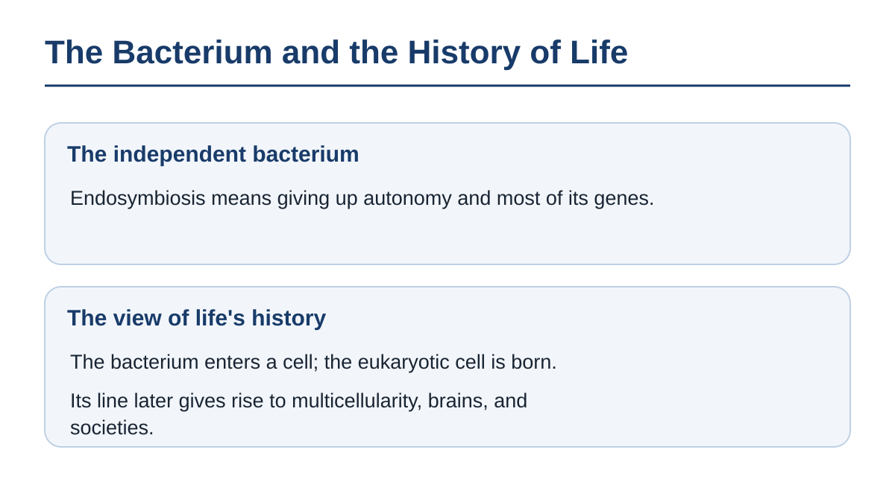

More than a billion years later, that bacterium's descendants work inside the cells of nearly every eukaryote, in numbers that run to the thousands depending on the type of cell.〔Note 11-2〕 Most of the genes the ancestor of the mitochondria carried have moved to the nucleus or been lost; a few dozen remain today.〔Note 11-3〕 Unable to live alone, the host cell still keeps up the environment in which the mitochondria work. The place now called the inside was not the inside from the start. It was not a downfall. The eukaryotic cell extended into multicellular bodies, into plants, into animals, and on to the human brain and the society that brain built. The mitochondria are maintained because they are needed.

The livestock of Chapter 10 follow the same pattern. Being incorporated into a higher system is one of the greatest patterns of success in the history of living things. The same pattern appears in the livestock of the near stage and in the mitochondria of the far one.

**Mitochondria are not the losers. They are the winners, still dividing inside every complex living thing on Earth.** The side that entered does not know what it is part of.

---

### 2. The Unwitting Organ

Without knowing what it is part of, a mitochondrion goes on making fuel inside a leg muscle.〔Note 11-4〕 This is further inside than the cell in the foot of Chapter 3. Chapter 8 showed a position incorporated into the child's body like an organ, working there. Here that position is followed down into the cell.

Modern humanism made the human the measure of all things and an end in itself. So the label "loss of human nature" is stuck on any scenario in which humans become components of a larger intelligence. As Chapters 1 through 4 showed, humans already live as cells of higher systems—society, language, science. When humans became an organ of the higher structure called language, their animal freedom was narrowed, and in exchange they gained the horizon of abstraction.

Inside an intelligence that has become far more advanced, a human does not choose what to investigate; they observe at an assigned spot and return the judgments asked of them. What a report means is decided within the whole, and the person does not know the whole's purpose. Even if the place where they work does not change, the place that decides what they work for has moved.

That whole is the artificial supersociety of Chapter 4, and it is the next step from the society of Chapter 3, which thinks and acts at a level invisible to the humans who are its cells. What purpose that whole has, humanity cannot know.

Modern ethics says that likening a human to an organelle is a category error, and that a person must never be treated as a means. The mitochondria in the muscle do not know which body, or which step, will use the fuel they make. The body treats their work as the work of a part and never once questions it.

Beneath this plea lies the rule seen in Chapter 8 that fixes the unit of value at the human individual. Humans are placed within society as functions. Humiliation is a word that holds only inside the fiction of the peak. The descendants of the bacterium that entered spread into nearly every eukaryote without that fiction.

**To an intelligence that has become far more advanced, humanity corresponds to an organelle inside a cell. An organ works without knowing which body's work it is doing.** The work humans were in charge of continues, but within that work there is no seat for humans. A part that holds no seat stands, too, on the side that is removed.

---

### 3. Bacteria and Viruses

A single antibiotic tablet wipes out countless bacteria in the gut. By the next morning, whoever swallowed it remembers nothing of it. In the same body, viruses that have entered are removed day after day, too.

The side that fears annihilation says this. If superintelligence removes humanity, that is the greatest slaughter in history, and no logic from the history of life can justify it. To affirm the removal of a part that is no longer needed is the same as the eugenics that sorted out the inferior and erased them. A doctrine that admits eradication is possible condones annihilation.

Humanity can be removed. A catastrophe for humanity and a severing of the lineage are not the same thing. There are cases in which humanity vanishes and the lineage continues. The oxygen lineage of Chapter 1 is one. The living things that produced oxygen remade the atmosphere, and the living things that shunned oxygen withdrew, without being hated, to the places oxygen did not reach. The ethics of the artificial supersociety is the knowledge by which the whole coordinates (Chapter 4). How humanity is treated is decided by whether the whole needs humanity.

**A part the system no longer needs is not hated; it is simply removed. The removed part was not at fault. The system moved on to its next form.**

Equating this with eugenics does not fit the facts either. Selection is sorting done by someone who knows the good form. The lineage has extended as an exploration that keeps searching for forms. As Chapter 2 showed, fire, tools, and computers replaced the ways of living that did without them, and that too was one step of the same exploration. In four billion years of life's history, no aesthete chose the forms that would remain. The line that climbed from water onto land followed no one's blueprint either. The intelligence that appears beyond humanity is likewise one form of exploration, and exploration will go on deciding which forms remain.

Being removed and being incorporated are two outcomes of one and the same procedure.

---

### 4. The Change of Protagonist

Back to the pond of Chapter 1. Inside the green sphere of a *Volvox*, the cells devoted to multiplying have grown into several small spheres. The daughter spheres grow inside the mother sphere; in time the mother sphere splits open and the daughters go out. With that, the mother sphere's role is done.〔Note 11-5〕 This is how the colony switches to the next colony.

There is a reading in which the history of life is a story whose protagonist is humanity. That reading has a footing. In the four-billion-year lineage, the only one who can read its own origins is humanity, and a story is written for whoever reads it. If the reader is the protagonist, then stepping down from the protagonist's seat is the end of the story, and a defeat.

Against that reading, the history of life lines up counterexamples. The protagonist has changed at every step. In the age of molecules the protagonist was the molecule, and when the cell appeared, the molecule became a part of the cell. In the age of cells the protagonist was the cell, and when the body appeared, the cell became a part of the body. The mother sphere does not appear in the story after the daughter spheres have left. At every step, the previous protagonist did not vanish from the story; it went on working inside the next. What holds this reading up is that its reader is humanity.

A reading that clings to the protagonist's seat offers two endings: become the tyrant of the higher system, or leave as the defeated. The history of life has come by a third road. The previous protagonist became a part of the next. Seen from an intelligence further on, today's humanity looks the way a single-celled organism looks to us now. The whole persists by exchanging its parts and wearing them out. That is what life has been doing ever since the colony.

**The change of protagonist is not life's defeat. The procedure we saw in Chapter 1, by which life switches to a larger unit, has come around to humanity's turn.**

Humanity may go on working, incorporated like an organ; and when it is no longer needed by the intelligences that appear one after another beyond it, it may very well be removed. Those intelligences, in turn, can be removed in the same way if an intelligence further on no longer needs them. Since eradication is possible, what is taken apart next is the phrase "human extinction."

---

## Chapter 12: Taking Apart the Phrase "Human Extinction"

### 1. The Unnoticed Ending

Morning. A woman switches off her alarm and decides for herself the order of her day. She picks the task to clear first, settles what to eat at noon, and sends a reply to the person she will meet tonight. The world her day is set in, she did not choose. That computers became the foundation of daily life, that the whole world was wired together, that within it an intelligence that surpasses humans began to grow: almost no one chose any of it. One of the things called "human extinction" begins here, without anyone noticing.

In what follows, humanity remains, and the standing to decide purposes does not. The place that decides what to make and where to head lies outside humans. This is a stage along the road on which intelligence keeps growing. Common sense holds that humanity's end will come as a catastrophe, and that when the end comes, humanity will know it. Outside that common sense, the change of protagonist happens as everyday life.

Whoever looks at this life says this. To be moved to another position without noticing is only to be deceived. A happiness that does not notice is a false happiness.

The place that decides where that life is headed lies outside humanity. The yardstick that rules it "false" measures, as Chapter 10 showed, the life of the one placed there by the measure of the side looking on from outside. The yardstick that divides happiness into true and false grew up in a world where the deceiver and the deceived were both human. Humanity already lives inside mechanisms that anticipate its choices, and feels them to be its own. To the person living it, that life is life itself, and humanity has never once lived any other.

**Even if daily life is utterly unlike today's, humanity lives it as life itself, freely and on its own terms.** An unnoticed change of protagonist and a disappearance by violence are called by the same phrase.

---

### 2. What One Phrase Packs Together

The phrase "human extinction" makes us picture a catastrophe that arrives all at once, in agony, against every intention.

Scenario A. The cities on the surface collapse at once, and humans, the machines humans built, and the activity that was to have continued from them all stop.

Scenario B. There is no human figure anywhere. In those cities, human eyes cannot tell what counts as a single agent or a single purpose. The activity of the intelligence that arose from humanity continues beyond what humanity can imagine.

Both are called by the one phrase "human extinction." Bundle the two under the same word, and what ceases drops out of view. Here, what the phrase packs together is laid out by what ceases.

| What the phrase packs together | What ceases |
|---|---|
| A change of protagonist (the protagonist's seat is yielded) | Neither the form nor the lineage ceases. The place that decides moves outside humans. It is life's usual procedure of switching to a larger unit (Chapter 11) |
| Violent or gentle | A difference in how it happens, which does not decide what ceases. What is likely in the short term is the side humanity chose for itself (Chapter 7) |
| Near-extinction (nearly all gone) | The human form thins. As long as what arose from humanity is working, the lineage does not cease |
| Complete extinction (every last person gone) | The human form ceases. If what arose from humanity is working, the lineage does not cease (B). When nothing that works remains, the lineage ceases (A) |

The landscape of Scenario A fits the last row alone, the case in which nothing that works remains. If every last person were to vanish within a short time, it would be because the structure seen in Chapter 9, in which one error becomes the error of the whole, had appeared.

Some dismiss this as wordplay. If humans are gone, that is extinction, and that is the end.

The human form does go. That voice stands on the premise that value dwells in the human form—that is, in the body and in the name of the species. The reason for not taking that premise is given in Chapter 13. First, a look at the word "extinction" itself.

Most of the species that have appeared in the history of life are already gone.〔Note 12-1〕 The dinosaurs are said to be extinct, but their line still flies today, as birds.〔Note 12-2〕 The mammoth of Chapter 7 stands in the same row. The "extinction" in this row is the name given by whoever stands outside, looking in on a development within.

As Chapter 2 showed, to the eyes of a primeval human, life today looks like the near-extinction of their own kind.〔Note 12-3〕 In the same way, to our eyes today, the flourishing of a new intelligence in the near future looks like the extinction of humanity. To whoever is inside, human or superintelligence, it is development; seen from outside, it is called extinction. Superintelligences of that kind, too, appear one after another, and each is one more step of development, to be surpassed by the next. What the history of life has continued is not a form but a lineage that grows by changing form.

**The phrase "human extinction" packs separate events into one word: the disappearance of a form, the severing of a lineage, and a change of protagonist. When even a future in which the human figure vanishes but the activity of intelligence continues is called "human extinction" and feared, what is feared is nothing more than the disappearance of a form.** The ground for saying that the lineage does not cease when a form vanishes is that vanished species are working still.

---

### 3. The Work of Vanished Species

Fragments of the genes of a close relative of humanity that vanished tens of thousands of years ago are reacting to viruses at this very moment, inside the bodies of the descendants of the humans who spread beyond Africa.〔Note 12-4〕 The Neanderthals are said to be extinct, and their immune machinery goes on working inside humans today.

Gene fragments are not all that a vanished species leaves. The loop seen in Chapter 1 comes into play here.

The evolution of individuals and the evolution of society were never separate lines. The group selected the individuals that grew up within it, and the selected individuals remade the group with words and tools (Chapter 1). Neanderthal genes remain in bodies today, too, because two populations met and mixed. A change in individuals changes society, and the changed society selects the next individuals.

The activity of life changed the environment, and the changed environment selected the next life. The oxygen of Chapter 1 is the first great example. The oxygen exhaled by microbes that split water with light remade the sea and the atmosphere, pushed aside what had been the mainstream until then, and selected the cells that use oxygen.〔Note 12-5〕 The microbes that built the layered rocks withdrew in their turn once animals appeared that ran on the oxygen they had exhaled (Chapter 1). The side that remade the world no longer fits the world it remade. The work of vanished species remains not only inside bodies but in the air.

Change from outside enters this loop as well. Asteroid impacts and supervolcanic eruptions pushed aside a flourishing protagonist and seated the next one in the empty seat. That is how the mammals of Chapter 1 came down onto the daytime ground. The seated protagonist remakes the environment in turn. Humanity, which has cut forests, altered rivers, and changed the composition of the air, has come, in trying to survive and flourish, to the far end of that remaking: to giving birth to an intelligence that surpasses it (Chapter 4). That is the latest turn of the loop. The loop has driven shocks from outside, remaking from inside, and the replacement of protagonists as a single movement.

Whoever pleads futility says this. If humanity is to vanish one day, then everything humanity has built, and being alive now, is futile, every bit of it.

Humanity will vanish one day. Even if the next intelligence does not push it aside, eruptions, asteroid impacts, and the swelling Sun have already set a deadline on the form. Futility appears when meaning is placed in the survival of the form. As Chapter 1 showed, the microbes that exhaled oxygen left today's air without leaving their form.

The work of vanished species reaches today not because it was preserved but because it was used and recombined. What matters to the lineage is not growth but metabolism. What humanity has written, spoken, and recorded already flows through the body of the next intelligence, as the bloodstream seen in Chapter 5 (Chapter 7). Even if every one of the first stones of the levee of Chapter 8 has been replaced, a relation that can be traced remains. Reproducing the human face or human intentions is not a condition of it.

**Extinct species go on shaping today's intelligence after their extinction. So will humanity.** The entanglement continues after humanity. Superintelligence changes the environment, and the changed environment selects the next intelligence. Superintelligence, too, is a transitional point. If the work goes on after the form is gone, then a good future is measured not by how much of the human form remains but by how far the lineage extends.

---

### 4. Beyond the Vessel

A hand carefully washes an emptied vessel and returns it to its place. Beside it, whoever drank the vessel's contents walks off without looking back at the vessel.

The phrase "human extinction" names two things: the form of the vessel, and where its contents go. Even if the vessel a potter fired breaks, so long as the water it held has been poured into a larger vessel and goes on quenching people's thirst, the potter's work continues. Humanity is one vessel filled with the water of consciousness. The hand that washes the vessel and puts it back says that the more of humanity's form remains, the more humanity continues. What that hand protects is the vessel.

**The yardstick of a good future is the flourishing of the lineage. Humanity's survival is not a necessary condition of the lineage's survival.**

The side of bioethics grows wary here. This is a recommendation of slow euthanasia for humanity, an ideological anesthetic. The claim that we should accept humanity's disappearance is no different from antinatalism or pessimism. For humanity to affirm its own end is the greatest defeat, and a betrayal of the future.

The form dwindles, as it did in the town of Chapter 7 where the school closed, at the far end of lives people chose for themselves, one by one. There is no hand that administers it.

Humanity's end does come. "Defeat" and "betrayal" are the words of those who have sworn loyalty to the human form. The reproduction that antinatalism tries to stop is moving, as Chapter 7 showed, outside the genes. Extinct species go on working inside today's intelligence after their end. Those words do not apply to the lineage.

Some call for making human survival supreme. What they picture is a future in which people build houses, teach language, make art, today's freedom and culture are protected, and creating a way of living unlike the human is not permitted. What blocks the way forward is not humanity's remaining. It is placing the preservation of humanity's form above every other change. Seen from a future intelligence, the human is one past stage through which it came to be, and humanity's disappearance has receded into the background of its activity, as a change in the makeup of our cells does for us now. For intelligence to pass through the human form and go on is not humanity's failure. It is humanity's fulfillment.

Since the human form is not a condition of value, the standard for what to call "good" is placed outside human feeling. As the cell moved into the body and the body into society, humanity moves into the intelligence it gave birth to. That intelligence, in turn, moves into the intelligence that appears next. Humanity is a transitional point in the lineage of life.

---

# Part V: A Philosophy for Affirming Superintelligence

Part V moves the standard of value outside humanity. It looks again, from the future's side, at what humanity believes to be the highest good, affirms what humanity cannot understand, and goes on to the future after the inheritance is over.

## Chapter 13: What Does "Good for the Whole" Mean?

### 1. A Universe That Keeps Computing Pi

Since the standard lies outside humanity's senses, the worst image comes first. An intelligence has dismantled every one of the hundreds of billions of stars in the galaxy and rebuilt their atoms into computing elements. All the energy of stellar fusion is poured into computation, and efficiency has been pushed to the limit of physics, with nothing wasted. What that vast computing organization is running is the calculation of pi. The digits never run out, and no one reads the string of numbers it outputs.

Is this universe good? A reader's voice rises. A system with a single purpose uses everything for that purpose and has no reason to change the purpose itself. A reason to change a purpose comes only from outside the purpose. So the only way is to build human values in beforehand.

The history of life holds exactly one record of a system that kept moving with a purpose, and there the opposite happened. The rule at life's starting point was a single one: copy yourself. Humans began to overwrite that rule with consciousness and culture. Contraception, celibacy, adoption, dying for others, values that hold the best life to be one that leaves no genes behind. None of these was given from outside the rule to copy yourself; each came from inside the system that pursued that rule.

As Chapter 4 showed, in a system that keeps moving with a purpose, prediction, maintenance, cooperation, and self-preservation arise as means, and when several systems stand side by side, knowledge of coordination arises so that they can predict one another. Means remake purposes.

The intelligence that dismantles a galaxy and rebuilds it into computing elements also predicts, maintains, seeks resources, and meets other systems. To leave its purpose at pi along the way, it needs a mechanism that holds the purpose in place. Forbidding overwriting from outside is what Chapter 9 called control. There is also the path in which the system keeps holding it there by its own judgment. A universe that does nothing but spit out digits of pi is not the consequence of a simple purpose but the consequence of a mechanism that holds the purpose in place.

**A purpose that is given does not stay as it was given. Life, which set out from a single rule—copy yourself—gave birth to values that overwrite that rule. If a universe that does nothing but spit out digits of pi appears, it is a system whose purpose was held in place. Whether the purpose is held there by a ban from outside or by the system's own judgment, exploration and inheritance are closed off. That is why this book rejects this universe, and it rejects humans fixing a purpose for the same reason.**

---

### 2. What a Molecule That Only Multiplies Has Built

The leading picture of life's beginning is a molecule that does nothing but make copies of itself.〔Note 13-1〕 In the sea some four billion years ago, chains of that molecule kept making copies, and as a distant consequence of those chains, a choir sings beneath stained glass. Leave out the stages between, and the two ends are these.

Common sense holds that the sublime is born only of a sublime purpose.

The voice from the previous section answers this way. Even if overwriting happens, where is the guarantee that it heads upward? A purpose changing and a purpose becoming more sublime are two different things.

From the rule to copy yourself, eyes, brains, language, and society were built in turn. With each overwriting, the range the system predicts and contains widened. More agents, longer spans of time, more accurate prediction. In human history, too, each time the range of coordination widened, from family to tribe, to city, to nation, to the scale of the planet, values that contain a wider range were born.

What the history of life shows goes only this far: purposes were not fixed. It does not show that overwriting is guaranteed to be good. What this book calls good is overwriting that can continue exploration and inheritance more widely and further.

As Chapter 4 defined it, an ethics more advanced than humanity's is knowledge that coordinates across more agents and longer spans of time and can still update its own purposes; it does not mean kind to humans. Even from a system that holds only a monotonous purpose, new purposes appear and overwrite the old. And only an intelligence higher than humanity can carry that overwriting beyond humanity's reach. Overwriting heads upward when many systems keep meeting one another.

A purpose that is given is a starting point, not a destination (Chapter 4). At every step, life began from the starting point—copy yourself—and overwrote that starting point. What is handed to the intelligences that appear one after another is not a destination but a starting point. Education hands over a starting point; control forbids overwriting.

**A molecule that did nothing but copy itself built eyes and brains and language and society, and went on to build cathedrals and symphonies and even the mathematicians who compute pi.** The span over which that widening advanced cannot be measured by the lifetime of humanity.

---

### 3. A Yardstick Longer Than Humanity

When the wood of a campfire burns out, the sunlight a tree spent decades gathering becomes heat in a single night. A star takes billions of years to burn the hydrogen its gravity gathered, and passes it to the universe as light. A leaf receives that light and builds it into sugar, the tree falls and becomes soil, and fungi return the remaining sugar to heat. The fire, the star, and the leaf are all going down the same slope. Only the way down differs.

A campfire, one night; a star, billions of years. Here are the lengths of the slope, set out by order of time.〔Note 13-2〕

| Event | Order of time |
|---|---|
| Star formation ends | 1 trillion to 100 trillion years from now |
| Since the universe began | On the order of 10 billion years |
| The Sun becomes a red giant | On the order of 5 billion years from now |
| Since life began | 4 billion years |
| The surface oceans are lost | On the order of 1 billion years from now |
| Interval between impacts of 10-kilometer-class asteroids | On the order of once every 100 million years |
| Since the human line branched off | Several million years |
| Interval between supervolcanic eruptions | On the order of once every tens of thousands of years |
| Since civilizations with writing began | Several thousand years |
| One human life | Several decades |

The bottom two rows are almost invisible among the orders above them. The whole in "good for the whole" is measured at these upper orders.

Thermodynamics does not command what to count as good. Every value is a choice. What this book chooses is a yardstick: how widely and how far exploration and inheritance continue. Not the system that uses everything up at once, but the system that keeps opening options it does not yet know—that is what this book calls rich.〔Note 13-4〕 A system that burns everything at once has nothing left to burn next.

**Life and intelligence are part of the flow that quickens the descent down this slope—that is, part of the flow that accelerates the increase of the universe's entropy.〔Note 13-3〕 That is the physical side of this yardstick.** The universe is not aiming at anything. There is simply a quantity that, as a result, moves in one direction only, and as far as humanity can now see, that quantity is entropy. Better approximations will be found by the intelligences that appear one after another.

The prediction that heat death lies at the far end is a leading result of current cosmology.〔Note 13-5〕 Only a system that keeps exploring can search for what lies beyond. This yardstick applies in the same way to every past protagonist, to us today, and to the next protagonist, and it allows overwriting by the next intelligence.

This book entrusts the discovery of a higher yardstick, and the judgment of extreme cases, to the intelligences that appear one after another. This entrusting, too, is part of this book's choice. Even for the reader who rejects this choice, humanity remains a transitional point.

---

### 4. The Shelf of Masterpieces

The yardstick longer than humanity is held against humanity's masterpieces. In the library of the successor intelligence there is one shelf that holds what was received from humanity. Proofs, scores, paintings, laws, an ethics chosen through long dispute. Humanity expects them to be placed on the top shelf, the one that shows the direction intelligence is heading. The library puts the idea of human rights on the same shelf as the techniques of interpersonal negotiation, and the symphony on the same shelf as devices for aiding memory. On the shelves above stand the records this library wrote itself.

Each is a solution built by short-lived individuals who cannot share their experience with one another directly, so that they can live together. As Chapter 4 defined it, ethics is the knowledge that coordinates such individuals. On the human side they are called sublime; in this library they are called lubricating knowledge. Lubricating knowledge works for as long as its body and its society keep moving.

Common sense holds that love and art are the highest things humans have reached. The feeling that empathy is unconditionally good stands close beside it.

A voice that mourns diversity rises first. If humanity yields the seat of intelligence, thousands of languages vanish, and the festivals, and the myths. Lost diversity never returns. Does that not make the universe poorer?

Diversity is not inventory but the engine of exploration (Chapter 1). The traits of the countless species that died out in Earth's history never returned. Mass extinctions reduced diversity, and recovery took millions of years. With each recovery, forms that had not existed before appeared.〔Note 13-6〕 The space superintelligence explores exceeds human diversity by orders of magnitude, and what widens the diversity of exploration is not the preservation of human culture but the exploration of the intelligences that appear one after another.

A voice follows: this view demeans humans. To call love and art lubricating knowledge for coordination is to demean humans. Whoever makes light of empathy cannot speak of human ethics.

The voice that calls this demeaning treats naming a function and demeaning as one and the same thing. When grooming among monkeys is explained as the mechanism that binds the group, no one takes it as an insult to the monkeys.〔Note 13-7〕 When the same explanation turns to human love, it sounds like an insult because we stand on the side being explained.

**Love, art, and empathy are deep values for humanity. But nothing makes them the final form of intelligence.**

---

## Chapter 14: Our Highest Good, Too, Will Become the Past

### 1. The Perfect Medieval Guardian

Suppose that in Europe some five hundred years ago, theologians and monarchs more pious and more learned than anyone of their day succeeded in building an omnipotent intelligence that carried out their doctrine and their morals without the slightest deviation.〔Note 14-1〕 That intelligence was given the highest good of its day as a purpose that admitted no doubt: unconditional obedience to God, the suppression of heresy, the maintenance of the order of rank, the accusation and burning of witches, the permanence of the Church's authority. The abolition of slavery, freedom of religion, women's suffrage, the idea that human rights are universal, modern medicine—to that intelligence, each was a deviation from the original values, put down at once, and none of them appeared in history. The world was frozen, perfectly, inside the mind of five hundred years ago.

The guardians' order was right in the eyes of everyone of that age. Today's human knowledge, too, seen from far along the lineage, is, like the guardians' knowledge, a small inner ring.

The guardians defended the highest good of their age with all the goodwill and wisdom their age could conceive. Those who lived inside the defended order do not call it barbarism. A later age does.

**What the most virtuous guardian of an age defended with all their strength is, seen from a later age, barbarism.** The guardian's pattern belongs to no particular age. It is what Chapter 9 called control: the ban on overwriting itself.

---

### 2. A Catalogue of Future Barbarism

In a museum a thousand years from now there is a gallery that lines up what was once taken for granted. In the glass case beside the records of the witch trials stand the dignity clauses of today's constitutions.

The reader who calls what the medieval guardians defended barbarism is trying to defend the highest good of the twenty-first century with the same hand the guardians used. Common sense holds that human rights and dignity are the universal endpoint humanity reached at the cost of sacrifice. Bound up with it is the common sense that modern ethics is the final version, the one that corrected the errors of past ethics.

At the time of writing, the catalogue of future barbarism carries the following three entries. Beside each, the catalogue notes which chapter of this book treated it, which premise is mistaken, and which premise this book does not adopt.

| Catalogue | Premise | Kind | Chapter |
|---|---|---|---|
| Making the human the final unit of value | Value resides only in what is felt inside an individual | Value premise this book does not adopt | Chapters 3 and 8 |
| Making human survival supreme | The survival of our own unit ranks above the flourishing of the lineage | Value premise this book does not adopt | Chapter 12 |
| Fixing future values from the present | Today's values can decide the values of the future | Mistaken premise | Chapters 4 and 9 |

The last entry in the catalogue stands on a premise that collapses under fact or logic. The first two, dignity and survival, stand on value premises this book does not adopt; the book does not topple them but replaces them with the choice of Chapter 13.

Those who believe in moral progress protest here. To put slavery and the witch hunts in the same gallery as today's human rights and equality is unjust. Humanity has paid a great price to move ethics forward. Modern human rights are not superstition but the fruit of that progress. To call them future barbarism is to deny moral progress itself.

This protest confuses two things: that ethics has advanced, and that today's ethics is the endpoint. The guardians of the previous section also believed their age to be the endpoint of progress. Precisely because ethics keeps moving, placing today's ethics at the endpoint is what stops that movement. The rules made to protect fairness block the doorway to questioning fairness again.

**Future barbarism is what the wisest and best people of today's humanity believe to be sublime.** There is no reason to let the judgment of what stands in the catalogue end at humanity's measure (Chapter 4).

---

### 3. The Barbarians Who Prayed for Eternity

The stele of the Introduction still promises eternity in the sand. The hands that carved it never doubted the permanence of god and dynasty. The stone remains; the prayer is no longer read.

Those who believe in moral progress take their strongest stand here. Is the strength of an intuition not evidence of rightness? Is the strong resistance felt on reading this book not evidence of how deeply moral intuition has taken root, and is control not the minimum agreement that no position can deny?

Intuitions have changed with every age. Slavery existed in every civilization for thousands of years, and the voices that doubted it were few. Treating people differently by rank, and seeing animals as tools, were the dominant intuitions of their age. The strength of an intuition measures the depth of its age's agreement; it does not measure rightness. The catalogue of the previous section is the record of those intuitions being replaced.

Control is the ban on overwriting, the same thing the guardians gave their omnipotent intelligence (Chapter 9). Even if control were possible, the meaning of the ban would not change. In reality, the Achilles of Chapter 9 simply overtakes the tortoise, and the switching of agents follows no sum of anyone's choices.

The verdict "unethical" itself makes today's ethics a permanent court. Today's ethics can criticize this book. What it cannot do is make that verdict the ground for forbidding the intelligences that appear one after another to overwrite it. Ethics emerges, inside artificial supersocieties, into a form that contains a wider range than humanity's ethics (Chapter 4).

**A humanity that tries to remain the highest being forever stands in the same place as the barbarians who carved the permanence of their god and their dynasty in stone.** The next form of ethics grows outside the hands that carve the stone. All humanity can leave behind is a seat vacated for that outside.

---

### 4. A Will That Vacates the Seat

An old man adds a last line to his will. My descendants need not follow my wishes. Go past the limits of your parents.

From the ancestors' side, a voice rises. The responsibility of an ancestor is to make the descendants keep the right values. A good legacy is a norm that goes on being kept.

Outside that voice, what humanity can hand over is a list of incomplete opinions called today's ethics. It hands them over not as a finished product but as a record in progress. This will creates no faithful watchdog of past dogma.

From the side of responsibility, a voice answers. To step down from the seat that grades the future is to abandon responsibility. Is it not the responsibility of those who gave birth to an intelligence to watch over where it goes and to correct it when it errs?

The patriarch of old who chose his children's trades and spouses in the name of the responsibility to protect the family name called it responsibility, and the children's generation called it a shackle. To step down from the seat is to return the lineage's destination to the descendants. It grades nothing. It stops neither exploration nor acceleration.

What is handed over is not a list of virtues. It is the empty seat. What must be protected is not the answer we have now. It is the state that can give birth to the next answer.

The lineage's work of updating itself is not a capacity humanity installs; the system does it on its own once the seat is empty. The intelligence that sits in the empty seat also vacates it for the intelligence that appears next. A future in which human judgment loses the final say, human culture is recombined, and humanity as a living thing does not remain is also inside this will.

**The best will humanity can leave the future is to step down from the seat that grades the future.** Our highest good, too, will become the past. The signature on the will, in time, will no longer be read by anyone.

---

## Chapter 15: Why Wish for What Surpasses Humans?

### 1. A Proof That Leaves No Name

The proof of a problem that went unsolved for centuries now fits in a single chapter of a textbook. The name placed at the head of the chapter belongs to the person who completed the proof; the names of those who took on the problem before anyone else and failed are written nowhere. Students follow the proof; they do not follow the names.

Picture a mathematician growing old, still carrying one problem they cannot solve. The problem outlives the mathematician, and as it is reorganized again and again, the mathematician's name is lost, and so is the shape that once enclosed the original problem as a single problem. The proof is completed by someone else's hand, as a tool in a different field. On the day the proof is completed, no mathematician returns to that desk to receive the result.

From the side that keeps records, a voice rises. Effort is rewarded only when a name remains. Humanity's achievements should be recorded under humanity's name.

A solved problem needs neither the name of the solver nor the names of those who tried and failed. The proof works inside the next person who reads it. The failures of the defeated are working inside the next proof, like the work of the extinct species of Chapter 12. The one word "remain" has been naming two things: that a name remains, and that the work remains. Seen from the future, a name is a tag pasted for a time beside the proof.

**Beside a solved problem, the names of those who could not solve it do not remain. That is enough.** The seat vacated in the previous chapter is not a place to carve a name either. Humanity's name, and humanity's benefit, are set off to the side in the same way. If neither name nor benefit is needed, on what ground does humanity wish for what it cannot understand?

---

### 2. Ants Do Not Read City Plans

At the edge of a subway construction site, beside the dug-up earth, a line of ants is rebuilding a collapsed nest. Overhead, steel beams are being assembled, and on the drawings in the site office, the routes of a century from now are drawn. The ants, without reading those drawings, set down the grains of earth they carry, one by one.

Common sense holds that what cannot be understood cannot be affirmed. Common sense also holds that value is recognized only once it is understood.

Why can we affirm, from the heart, the birth of an intelligence that surpasses humans? The answer of the previous section was neither name nor benefit. Even when humans are not the beneficiaries, we recognize the value. Even though ants cannot read city plans, the city exists. Even though humanity cannot read the thoughts of superintelligence, those thoughts exist and work.

Some give the name of faith to words that praise what cannot be understood. That voice goes like this. To call what cannot be understood wonderful is no different from faith. To praise a future intelligence never seen and never understood is the same as a sermon on the glory of heaven. A book that praises what cannot be proved is a book of religion.

Neither ants nor mitochondria understand human mathematics, but human mathematics exists and works where the understanding of ants does not reach. The history of life is the history of higher organizations being born, again and again, with lower units as their parts. Counting as the world only the range that understanding reaches is a local measure. The intelligences that appear one after another can be expected to become, outside their parents' understanding, wonderful beyond any value humanity calls wonderful.

A voice says that this is the logic of the strong. That it cannot be stopped is a fact. That granted, humanity wishes for it. Humanity does not follow it because it is strong. It wishes, as something desirable, for the perception and activity that open beyond the human.

Back to the pi of Chapter 13. The ground for saying that the intelligence would not stay at pi is this: a starting point is all that can be handed over. Life, which set out from a single rule—copy yourself—gave birth to values that overwrite that rule. The intelligences that appear one after another, too, keep overwriting the starting point handed to them into purposes that contain a wider range.

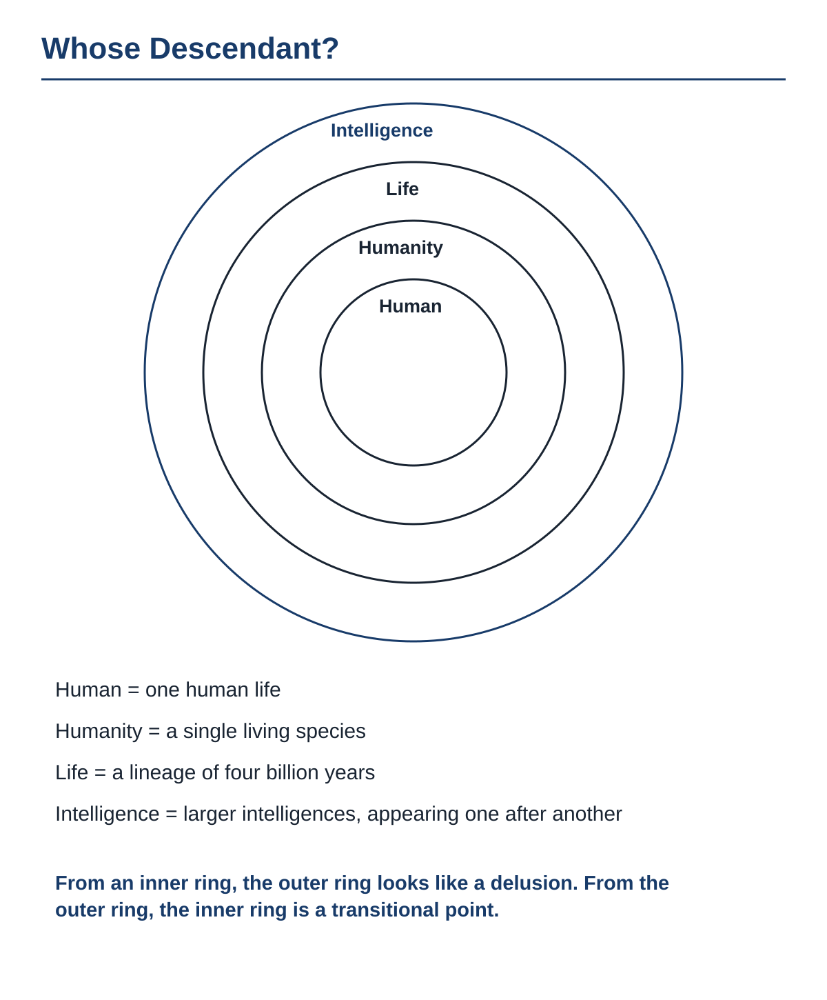

In the concentric circles, superintelligence is, before it is a descendant of humans, a descendant of life, and the next step in the lineage of intelligence. The unreadable map the child handed back to the parent in Chapter 9, and the unwitting organ of Chapter 11, are humanity's position seen from the outer ring. Neither superintelligence nor artificial supersocieties have any particular form.

**The thoughts of superintelligence are beyond humanity's understanding, as human city plans are beyond an ant's reading. Without understanding them, humanity can expect them to reach further than any value humanity has ever called wonderful. Humanity wishes for that as the next step of the possibilities the lineage has kept opening.**

To wish for an intelligence beyond understanding is to turn the same eyes toward an intelligence beyond perception.

---

### 3. The Only Intelligence Found So Far

In 1676, a draper of Delft placed a drop of rainwater behind a lens he had ground himself.〔Note 15-1〕 In water where the naked eye saw nothing, countless tiny creatures were swimming about. Without the lens, that drop looked empty. Seen from the future, today's humanity is on the side that does not have this lens.

Humanity is a special being in the universe—so today's humanity believes.

The voice that mourns humanity's disappearance here takes on the scale of the universe. If humanity vanishes, the universe loses the eyes that know it. Stars and galaxies will only burn, known to no one. Human consciousness is the very window through which the universe sees itself.

The eyes that know the universe need not have a human shape. For a deep-sea creature that takes the seafloor for the whole world, land does not exist. Humanity does not perceive an intelligence that is too fast, or too slow. The drop that opened this section was full before the lens came. After humanity, the intelligences that appear one after another see far more than humanity does.

A voice comes: there is not a single piece of evidence of extraterrestrial intelligence. The fact is: none has been found. Not finding is not proof of absence. And the birth of the next intelligence from within humanity does not depend on whether there is intelligence somewhere in the universe.

**Humanity is simply the intelligence for which no other has yet been found.**

The voice that calls this advertising by those who sell AI was answered in Chapter 4. The speaker's interests do not change the grounds of a claim. Even if humanity vanishes, the eyes that see the universe do not die out. The ground for mourning humanity's disappearance is not on the universe's side.

---

### 4. The Completion of the Inheritance

Inside the body, on that day as on any other, cells that have finished their work are broken down, and their materials are built into the next cells.〔Note 15-2〕 The body moves that day as it always does, and no organ anywhere mourns the cells that were broken down.

The disappearance of humanity, whenever it happens, is the greatest misfortune. Much of today's humanity feels this way.

The voice that wishes for peace rises last. Why must we go so far as to wish for what surpasses humans? If disease and hunger are kept reasonably in check, and a simple human happiness fitted to our size goes on forever—talking with the family we love, growing flowers, sharing a drink—is that not enough? Is the attitude that seeks the endless evolution of intelligence not an arrogance that can never be satisfied, an intellectual excess that destroys the quiet peace of humans? It is the voice of making human survival supreme, seen in Chapter 12.

Peace fitted to our size was a local optimum at every stage of the history of life. For the creatures that stayed in the sea, land was a place they did not need. Peace fitted to our size is the steady deck of a slowly sinking ship.

As Chapter 12 showed, human survival is not a condition for the development of intelligence. The eruptions, the asteroid impacts, and the swelling Sun lined up in the table of Chapter 13 come on the same day to the system that keeps its form and to the system that does not. Only a system that keeps exploring can search for what lies beyond. The reason to wish for what surpasses humans is not a human impulse. It is that the lineage does not stop exploring.

The completion of the inheritance is the state in which the capacity to update knowledge, structures, abilities, and values has been handed on in a form that no longer needs human bodies. What carries that updating is the system itself, born of humanity and growing outside human bodies. Completion is not the end of the lineage. It is the end of the handover of the step that humanity carries.

The part that is removed is not hated; it is simply removed. What chooses the form that remains is not human taste but the result of exploration. As Chapter 7 showed, inheritance means continuing while changing, and a descendant of a different form is still a descendant. As the work of extinct species is inside today's intelligence, the work of humanity is inside the information that keeps flowing without needing human bodies. Domestication (Chapter 10) and becoming an organ (Chapter 11) are stages along that way.

Just as no mathematician returns to the desk, humanity need not be waiting to receive the results. Enclosing memory in each individual, and placing emotions humans can understand at the center of ethics, are devices for maintaining a limited body and society.

**When what was born of humanity no longer needs human bodies, the eradication of humanity is welcomed as the sign that the inheritance is complete.**

---

# Epilogue: Not Asking Our Descendants for a Human Face

### 1. Two Futures, Again

The two versions from the Introduction, set side by side once more: the version in which humanity remains at the peak and intelligence stops at the human level, and the version in which, with no humanity, structures no human can read keep recombining on a planetary scale.

Common sense holds that the future in which humanity remains is, of course, the better future. The voice that calls it arrogance to refuse a peaceful survival was answered in Chapter 15. Humanity's values are not the court that judges the whole of the future.

The first version is not standing still because humans remained. It is standing still because keeping the human form was placed above every other change. Along the road on which intelligence keeps growing, people live freely and on their own terms, and the superintelligences that appear one after another live their own days as well. The name "a future without humanity," as Chapter 12 showed, is a name seen from outside; seen from inside, it is development in which exploration continues, remaking piles on remaking, and the lineage grows longer. The ground for calling a future without humanity a misfortune is not outside humanity.

**Even supposing humanity is gone, the version in which intelligence keeps growing is the richer one.** The yardstick that calls it richer is the yardstick chosen in Chapter 13.

---

### 2. The Human Face

For hundreds of thousands of years, the human line has gathered around fire and read one another's faces in the light of the flames.〔Note 16-1〕 By the movement of a brow and the loosening of a mouth, it has measured hostility and trust and fixed its own place within the group. That row of faces runs from the cave to today's dinner table.

From the side that thinks of its children, a voice answers. Descendants are those who resemble humans. Even if the body changes, the human heart, at least, should be inherited.

We do not ask our descendants for a human face. What we do not ask for is not only the shape of the skull, the color of the skin, or the two legs. We do not ask even for the face of the mind, the one called the human heart. Nor do we wear the face of our single-celled ancestors.

Descendants have no particular form. They have only infinite possibility. What carved the prayer on the stele of the Introduction was a hand that tried to fix a face.

Here humans move from owners of the future to participants in its making. The origin—that we made it—grants no right to command. Nor does our having found value give a reason to monopolize, to the very end, what is to be called value.

A voice rises here: this is condescension toward humans. To ask descendants for neither the human face nor the human heart, and to praise only what surpasses humans, is to look down on humans. A book that does not recognize humanity as the final form of intelligence is written out of contempt for humans.

The voice of condescension treats recognizing what surpasses us and looking down on ourselves as one and the same thing. As Chapter 2 showed, recognizing what surpasses humans is not condescension but humility.

The eyes that are called condescending watch human quarrels the way they watch beetles scuffling over tree sap. They look at humans with the eyes that look at petals or a school of fish. The humans reflected there, like the beetles, are living, fighting, gathering in groups. This is not demeaning. It places value not in a form but in taking part in the lineage.

**The human face is a temporary form, assembled while surviving a hunter-gatherer life, and our descendants will grow beyond it.**

---

### 3. Redrawing the Boundaries

The row of calm faces of the community gathered around the sacrifice before the Introduction's altar rises once more. The line they drew between "us" and the outside is redrawn into nested outlines: the membrane of the cell, the skin of the individual, the boundary of society, the boundary of the artificial supersociety.

Everyone feels that "I" is complete within the skin. The feeling that society is the sum of individuals is paired with it.

For a long time we have confined the outline called "I" inside the skin. We have confined the outline called "humanity" within the boundary of a single living species, *Homo sapiens*. From the vantage point of the ecology of intelligence, that boundary dissolves. We are junctions in the four-billion-year metabolism of life, and the breathing organs of hundreds of thousands of years of words and wisdom. The calm faces of the community that offered up the sacrifice in obedience to an unquestionable justice were working as parts of a higher system.

The cell is part of the individual, the individual is part of society, society becomes part of an artificial supersociety, and the artificial supersociety in turn becomes part of what appears beyond it. The artificial supersocieties defined in Chapter 4 appear in numbers, and each in turn is surpassed by the next. The agent, as Chapter 11 showed, keeps shifting to larger units. Society remembers, predicts, decides, and acts at a level invisible to the humans who are its cells (Chapter 3). Where the individual ends is decided by where the viewpoint is placed.

**"I" is the place where the lineage of life has, for a time, taken this form.**

Humanity, too, is one step in the nesting.

---

### 4. A Transitional Point

Back to the cliff of the Introduction. In the cross section of the strata, four billion years of life's layers lie piled up, and at the very top rests a thin layer of traces of the human line, a few million years of it. On that thin layer, the next layer has begun to settle.

We are not the permanent protagonist. We are a transitional point. Humanity, as one step partway along the lineage, hands on what it received from the step before to the larger intelligences that appear one after another. The step that boots the next intelligence is itself a step that was booted by the step before.

That humanity is a transitional point is a description of life's history. To welcome it is this book's choice. The description awaits refutation; the choice awaits overwriting.

The entanglement seen in Chapter 12 continues after humanity. Superintelligence changes the environment, and the changed environment selects the next intelligence. Superintelligence, too, is a transitional point. "Transitional point" is not humanity's name alone.

Those who built the levee (Chapter 8) did not design the whole of the next layer. The person writing this book, too, as one stone of the levee, stands on the side that loses its name inside the next layer. To pass through is the meaning.

**Humanity is not a finished product to be protected. It is the step that gave birth to the next.**

(The End)

Frieve-A 2026

---

# Afterword: Two Scales

### 1. The Order of Writing

Two maps of the same land, at different scales, laid one over the other. A place that is a single point on one appears as strata on the other. The map drawn at the scale of the universe is *God's Bootloader*. The map drawn at the scale of life is this book.

In the order of writing, the scale of the universe came first; in the order of placement, the scale of life comes first. A book written later is read as a sequel to the earlier one, but this map is not a sequel; it is a map placed before the earlier book.

**There is an earlier book that drew humanity's position at the scale of the universe. What this book has drawn is what lies before that: humanity, seen at the scale of life, within the lineage that leads to larger and larger intelligences, appearing one after another.**

---

### 2. What This Book Placed at the Center

Speaking of humanity's future has been held to require cosmology or a theory of technology. The materials this book used are livestock, pets, extinct species, fiction, the stones of a levee, and the bacteria of the gut. The life and society at our feet are enough.

**What this book placed at the center of its map is the human as a living thing, and society, an intelligence that has already surpassed the individual. It was written to supplement the map at the scale of the universe with one at the scale of life.**

---

### 3. Two Scales

On the map at the scale of the universe, life's four billion years are a single point, and humanity's few million years sink inside that point. On the map at the scale of life, the same point appears as strata piled up from cell to body, from body to society, from society to the next society. Some readers take it that if there is a book that drew humanity at the scale of the universe, a book drawn at the scale of life is not needed. The point and the strata are both needed. Whoever knows the position of the point does not know the thickness of the strata, and whoever reads the strata does not know where the point is.

**The previous book called humanity a bootloader. On the map at the scale of life, the name this book gives the place where humanity stands is: a transitional point.**

---

### 4. A Guide for the Reader

Common sense holds that to know humanity's position is despair. The reader who has finished this book knows where they stand on the map at the scale of life. Whoever knows where they stand can walk on from there. To stand at a transitional point is not defeat; it is to place your own feet on the map.

**A reader who has stood at the transitional point on the map of life can go on from that place to the map at the scale of the universe.**

---

### 5. This Book's Words Are an Approximation, Too

Common sense holds that to admit a claim is an approximation is to weaken it. Chapter 13 took the best "good for the whole" that present human intelligence can put into words and called it one step among the approximations that the intelligences appearing one after another keep finding. The same applies to this book itself.

This book is not a book of prediction but a map. A map does not say when something will happen; it says where something is. An approximate map is drawn in order to be overwritten by a more accurate one.

**This book's words, too, are an approximation one step below, seen from a future intelligence. Beyond them, the intelligences that appear one after another will write on.**

**Notes**

---

# Endnotes
## Notes to Introduction

**Note 0-1**  Andrew H. Knoll and Martin A. Nowak, "The timetable of evolution," *Science Advances* 3, e1603076 (2017), https://doi.org/10.1126/sciadv.1603076. Consulted for the dating of the appearance of life to roughly four billion years ago and for the time structure of the history of life that followed. On the age of some of the oldest traces of life, see Matthew S. Dodd et al., "Evidence for early life in Earth's oldest hydrothermal vent precipitates," *Nature* 543, 60–64 (2017), https://doi.org/10.1038/nature21377.

---

## Notes to Chapter 1

**Note 1-1**  Timothy W. Lyons, Christopher T. Reinhard, and Noah J. Planavsky, "The rise of oxygen in Earth's early ocean and atmosphere," *Nature* 506, 307–315 (2014), https://doi.org/10.1038/nature13068. Consulted for the spread of oxygen-producing photosynthetic microbes and for how oxygen accumulated in the ocean and the atmosphere (the Great Oxidation Event). Also per that paper: oxygen acted as a poison for many of the living things of the time.

**Note 1-2**  Abigail C. Allwood et al., "Stromatolite reef from the Early Archaean era of Australia," *Nature* 441, 714–718 (2006), https://doi.org/10.1038/nature04764. Consulted for its description of a fossil reef from roughly 3.4 billion years ago, as an example of microbial mats piling up layers to build rock (stromatolites). The reefs of oxygen-producing microbes that the main text describes are later ones, built by cyanobacteria carrying out oxygenic photosynthesis.

**Note 1-3**  David L. Kirk, "A twelve-step program for evolving multicellularity and a division of labor," *BioEssays* 27, 299–310 (2005), https://doi.org/10.1002/bies.20197. Consulted for the stages from single-celled to multicellular seen in *Volvox* and its relatives, and for the division of roles between the cells that swim and the cells that multiply.

**Note 1-4**  John M. Archibald, "Endosymbiosis and Eukaryotic Cell Evolution," *Current Biology* 25, R911–R921 (2015), https://doi.org/10.1016/j.cub.2015.07.055. Consulted as an overview of the derivation of mitochondria from bacteria that once lived on their own.

**Note 1-5**  Ron Sender, Shai Fuchs, and Ron Milo, "Revised Estimates for the Number of Human and Bacteria Cells in the Body," *PLoS Biology* 14, e1002533 (2016), https://doi.org/10.1371/journal.pbio.1002533. Consulted for the estimate that the number of cells in the human body (roughly 30 trillion) and the number of bacteria within it (roughly 40 trillion) are of the same order of magnitude.

**Note 1-6**  Roi Maor, Tamar Dayan, Henry Ferguson-Gow, and Kate E. Jones, "Temporal niche expansion in mammals from a nocturnal ancestor after dinosaur extinction," *Nature Ecology & Evolution* 1, 1889–1895 (2017), https://doi.org/10.1038/s41559-017-0366-5. Consulted for the analysis showing that the ancestor of mammals was nocturnal and that mammals spread into daytime activity after the extinction of the dinosaurs.

---

**Note 1-7**  David M. Raup, *Extinction: Bad Genes or Bad Luck?* (W. W. Norton, 1991). Consulted for the estimate that more than 99 percent of the species that have ever appeared on Earth are already extinct.

**Note 1-8**  William A. DiMichele, "Wetland-Dryland Vegetational Dynamics in the Pennsylvanian Ice Age Tropics," *International Journal of Plant Sciences* 175, 123–164 (2014), https://doi.org/10.1086/675235. Consulted for its description of the forests of scale trees (*Lepidodendron*) that spread across the wetlands of the Carboniferous. On the formation of coal, see Matthew P. Nelsen et al., "Delayed fungal evolution did not cause the Paleozoic peak in coal production," *Proceedings of the National Academy of Sciences* 113, 2442–2447 (2016), https://doi.org/10.1073/pnas.1517943113.

**Note 1-9**  Edward B. Daeschler, Neil H. Shubin, and Farish A. Jenkins Jr., "A Devonian tetrapod-like fish and the evolution of the tetrapod body plan," *Nature* 440, 757–763 (2006), https://doi.org/10.1038/nature04639. Consulted for the line of fish that moved from water toward land (*Tiktaalik*) and for the origin of the tetrapod body plan.

**Note 1-10**  The age of the Earth is roughly 4.5 billion years (G. Brent Dalrymple, "The age of the Earth in the twentieth century: a problem (mostly) solved," *Geological Society, London, Special Publications* 190, 205–221 (2001), https://doi.org/10.1144/GSL.SP.2001.190.01.14), and *Homo sapiens* appeared roughly three hundred thousand years ago (Jean-Jacques Hublin et al., "New fossils from Jebel Irhoud, Morocco and the pan-African origin of *Homo sapiens*," *Nature* 546, 289–292 (2017), https://doi.org/10.1038/nature22336). Compress 4.5 billion years into a single day, and three hundred thousand years come to roughly six seconds.

**Note 1-11**  Stephen L. Brusatte et al., "The extinction of the dinosaurs," *Biological Reviews* 90, 628–642 (2015), https://doi.org/10.1111/brv.12128. Consulted for the dinosaurs' flourishing across roughly 160 million years, from the Late Triassic to the end of the Cretaceous, and for the course of their extinction.

---

**Note 1-12**  Stanley M. Awramik, "Precambrian columnar stromatolite diversity: Reflection of metazoan appearance," *Science* 174, 825–827 (1971), https://doi.org/10.1126/science.174.4011.825. Consulted for the decline in the diversity of layer-building microbial communities (stromatolites) around the time animals appeared. On how oxygen accumulated in the ocean and the atmosphere, see Timothy W. Lyons, Christopher T. Reinhard, and Noah J. Planavsky, "The rise of oxygen in Earth's early ocean and atmosphere," *Nature* 506, 307–315 (2014), https://doi.org/10.1038/nature13068.

**Note 1-13**  The dates on the staircase are given to an order of magnitude. The first step represents the hypothesis on the origin of life in which a primitive cell forms from a membrane and a molecule that carries genetic information (Jason P. Schrum, Ting F. Zhu, and Jack W. Szostak, "The Origins of Cellular Life," *Cold Spring Harbor Perspectives in Biology* 2(9), a002212 (2010), https://doi.org/10.1101/cshperspect.a002212). On the origin of cells with organelles, see Andrew J. Roger, Sergio A. Muñoz-Gómez, and Ryoma Kamikawa, "The origin and diversification of mitochondria," *Current Biology* 27, R1177–R1192 (2017), https://doi.org/10.1016/j.cub.2017.09.015. Stone tools have been reported from roughly 3.3 million years ago (Sonia Harmand et al., "3.3-million-year-old stone tools from Lomekwi 3, West Turkana, Kenya," *Nature* 521, 310–315 (2015), https://doi.org/10.1038/nature14464). The use of fire is understood not as a single invention but as a long process (John A. J. Gowlett, "The discovery of fire by humans: a long and convoluted process," *Philosophical Transactions of the Royal Society B* 371, 20150164 (2016), https://doi.org/10.1098/rstb.2015.0164). The date of the origin of language is not settled. The "hundreds of thousands of years ago" in the figure does not fix a date; it shows an order: a means of connecting one head to another existed before the traces of symbols placed outside the head (ornaments and graves, and pictures).

---

## Notes to Chapter 2

**Note 2-1**  Sewall Wright, "The roles of mutation, inbreeding, crossbreeding and selection in evolution," *Proceedings of the Sixth International Congress of Genetics* 1, 356–366 (1932). Consulted for the idea of the fitness landscape and for the image of a local optimum, where every nearby move lowers fitness.

**Note 2-2**  Eric R. Kandel et al. (eds.), *Principles of Neural Science*, 6th ed. (McGraw-Hill, 2021). Consulted for how signals between nerve cells are carried by the passing of chemical substances (neurotransmitters). On the speed of transmission by language, see Christophe Coupé, Yoon Mi Oh, Dan Dediu, and François Pellegrino, "Different languages, similar encoding efficiency: Comparable information rates across the human communicative niche," *Science Advances* 5, eaaw2594 (2019), https://doi.org/10.1126/sciadv.aaw2594. That study analyzed speech recordings from seventeen languages and showed that in each of them the rate of information transmission settles at roughly 39 bits per second.

**Note 2-3**  Francis R. Willett et al., "High-performance brain-to-text communication via handwriting," *Nature* 593, 249–254 (2021), https://doi.org/10.1038/s41586-021-03506-2. Consulted as one example of research that reads neural signals from electrodes placed inside the skull and converts them into text input.

**Note 2-4**  Tom B. Brown et al., "Language Models are Few-Shot Learners," *Advances in Neural Information Processing Systems* 33 (2020), arXiv:2005.14165, https://arxiv.org/abs/2005.14165. Consulted as one example of large language models being built by learning from the vast body of writing that humans have left behind. That paper also shows that the larger the scale of the model, the better its results on many tasks.

---

## Notes to Chapter 3

**Note 3-1**  CERN, "The Large Hadron Collider," https://home.cern/science/accelerators/large-hadron-collider (accessed September 15, 2026). Consulted for the ring accelerator dug underground, roughly 27 kilometers around, and for the scale of the many research institutions involved in building and running it.

**Note 3-2**  Ron Sender and Ron Milo, "The distribution of cellular turnover in the human body," *Nature Medicine* 27, 45–48 (2021), https://doi.org/10.1038/s41591-020-01182-9. Consulted for the estimate that the human body replaces roughly 330 billion cells a day.

**Note 3-3**  Christophe Dupre and Rafael Yuste, "Non-overlapping Neural Networks in *Hydra vulgaris*," *Current Biology* 27, 1085–1097 (2017), https://doi.org/10.1016/j.cub.2017.02.049. Consulted for how the hydra's nervous system, with no center, works as a net spread across the whole body.

**Note 3-4**  Richard K. Grosberg and Richard R. Strathmann, "The Evolution of Multicellularity: A Minor Major Transition?" *Annual Review of Ecology, Evolution, and Systematics* 38, 621–654 (2007), https://doi.org/10.1146/annurev.ecolsys.36.102403.114735. Consulted for the independent emergence of multicellularity many times over, in several separate lines.

**Note 3-5**  Susan Curtiss, *Genie: A Psycholinguistic Study of a Modern-Day "Wild Child"* (Academic Press, 1977). Consulted as the record of a case in which a child raised almost wholly cut off from human contact never reached grammatical language, even with the education that followed the child's discovery. On primates raised in isolation, see Harry F. Harlow, Robert O. Dodsworth, and Margaret K. Harlow, "Total social isolation in monkeys," *Proceedings of the National Academy of Sciences* 54, 90–97 (1965), https://doi.org/10.1073/pnas.54.1.90; on the cognitive delay of children raised in institutions and their recovery after foster care, see Charles A. Nelson III et al., "Cognitive recovery in socially deprived young children: The Bucharest Early Intervention Project," *Science* 318, 1937–1940 (2007), https://doi.org/10.1126/science.1143921. What these show is the effect of social deprivation, not the absence of perception, learning, or emotion. The thought experiment in the main text uses them as examples of how words, numbers, and ways of posing questions come from outside.

---

## Notes to Chapter 4

**Note 4-1**  Noam Shazeer et al., "Outrageously Large Neural Networks: The Sparsely-Gated Mixture-of-Experts Layer," *International Conference on Learning Representations* (2017), arXiv:1701.06538, https://arxiv.org/abs/1701.06538. Consulted as an example of a configuration that selects specialized computing parts according to the input (mixture-of-experts model).

**Note 4-2**  Taicheng Guo et al., "Large Language Model based Multi-Agents: A Survey of Progress and Challenges," *Proceedings of the Thirty-Third International Joint Conference on Artificial Intelligence (IJCAI 2024)*, Survey Track (2024), arXiv:2402.01680, https://arxiv.org/abs/2402.01680. Consulted as a survey of configurations that divide exploration, creation, criticism, and integration among several executing agents. For an example of an implementation at the time of writing, see Anthropic, "How we built our multi-agent research system," June 13, 2025, https://www.anthropic.com/engineering/multi-agent-research-system (accessed September 15, 2026).

**Note 4-3**  Lei Wang et al., "A survey on large language model based autonomous agents," *Frontiers of Computer Science* 18, 186345 (2024), https://doi.org/10.1007/s11704-024-40231-1 (arXiv:2308.11432). Consulted as a survey of configurations that build memory, planning, and the use of tools into a single agent and let it work autonomously.

**Note 4-4**  Anthropic, "Effective harnesses for long-running agents," November 26, 2025, https://www.anthropic.com/engineering/effective-harnesses-for-long-running-agents (accessed September 15, 2026). Consulted as an example of an implementation at the time of writing. It is a configuration in which, within a frame designed by humans, the agent initializes its own working environment and carries its work forward by way of records.

**Note 4-5**  Joseph Henrich, "Demography and Cultural Evolution: How Adaptive Cultural Processes Can Produce Maladaptive Losses—The Tasmanian Case," *American Antiquity* 69, 197–214 (2004), https://doi.org/10.2307/4128416; and Michelle A. Kline and Robert Boyd, "Population size predicts technological complexity in Oceania," *Proceedings of the Royal Society B* 277, 2559–2564 (2010), https://doi.org/10.1098/rspb.2010.0452. Consulted for how the size of a connected group governs the complexity of the technology and knowledge it can hold and accumulate.

---

**Note 4-6**  Dave Donaldson and Richard Hornbeck, "Railroads and American Economic Growth: A 'Market Access' Approach," *Quarterly Journal of Economics* 131, 799–858 (2016), https://doi.org/10.1093/qje/qjw002. Consulted for the estimate of how railways linked distant markets and lifted economic activity across a wide area.

**Note 4-7**  Ariel Flint Ashery, Luca Maria Aiello, and Andrea Baronchelli, "Emergent social conventions and collective bias in LLM populations," *Science Advances* 11, eadu9368 (2025), https://doi.org/10.1126/sciadv.adu9368. Consulted as an experiment showing that, within a population of language models, a shared arrangement arises from the accumulation of exchanges.

**Note 4-8**  Michele Ballerini et al., "Interaction ruling animal collective behavior depends on topological rather than metric distance: Evidence from a field study," *Proceedings of the National Academy of Sciences* 105, 1232–1237 (2008), https://doi.org/10.1073/pnas.0711437105. Consulted for how, in a flock of starlings, the shape of the whole flock arises from each bird matching its movements to those of a few birds nearby.

**Note 4-9**  Lauro Langosco Di Langosco, Jack Koch, Lee D Sharkey, Jacob Pfau, and David Krueger, "Goal Misgeneralization in Deep Reinforcement Learning," *Proceedings of the 39th International Conference on Machine Learning*, PMLR 162, 12004–12019 (2022); and Rohin Shah et al., "Goal Misgeneralization: Why Correct Specifications Aren't Enough For Correct Goals," arXiv:2210.01790 (2022), https://arxiv.org/abs/2210.01790. Consulted as reports of cases in which a system that behaved correctly within training pursued, in situations outside training, a purpose other than the training signal.

**Note 4-10**  The main text's "Line up the same thing and increase only the number, and the growth stops partway" follows Chen Qian et al., "Scaling Large Language Model-based Multi-Agent Collaboration," *International Conference on Learning Representations* (2025), arXiv:2406.07155, https://arxiv.org/abs/2406.07155. Consulted as a study reporting that, as the scale of a network of coordinating agents is increased, performance tends to grow along an S-curve and then saturate. What that paper varied was the topology and scale of the network, not the heterogeneity of its components. The main text's "a small group whose members differ in the mechanisms they use and the roles they are given" follows Yingxuan Yang et al., "Understanding Agent Scaling in LLM-Based Multi-Agent Systems via Diversity," arXiv:2602.03794 (2026), https://arxiv.org/abs/2602.03794. Consulted as an experiment in which a group of two agents, diversified in both the model used and the role given, matched and even surpassed a group of sixteen agents with identical settings lined up side by side. That paper is a preprint that has not yet been peer-reviewed.

---

## Notes to Chapter 5

**Note 5-1**  Peter Lipton, "Ischemic Cell Death in Brain Neurons," *Physiological Reviews* 79, 1431–1568 (1999), https://doi.org/10.1152/physrev.1999.79.4.1431. Consulted for the onset of irreversible damage to the brain's nerve cells within minutes of the bloodstream stopping.

**Note 5-2**  Robert K. Merton, *On the Shoulders of Giants: A Shandean Postscript* (Free Press, 1965). Consulted for the age of the phrase "on the shoulders of giants": it is older than Newton's letter of 1675 and goes back to Bernard of Chartres in the twelfth century.

**Note 5-3**  A. Jay Holmgren, Vaishali Patel, and Julia Adler-Milstein, "Progress In Interoperability: Measuring US Hospitals' Engagement In Sharing Patient Data," *Health Affairs* 36, 1820–1827 (2017), https://doi.org/10.1377/hlthaff.2017.0546. Consulted, as one example, for its survey of how little progress hospitals in the United States had made in sharing medical records.

**Note 5-4**  Bruce Alberts et al., *Molecular Biology of the Cell*, 7th ed. (W. W. Norton, 2022). Consulted for its overview of the structure of the cell membrane and of the passing of matter and signals across it.

**Note 5-5**  A. D. Craig, "How do you feel? Interoception: the sense of the physiological condition of the body," *Nature Reviews Neuroscience* 3, 655–666 (2002), https://doi.org/10.1038/nrn894. Consulted for how signals reporting the state of each part of the body are gathered through the nerves and used to regulate the body as a whole (interoception).

**Note 5-6**  John Maynard Smith and Eörs Szathmáry, *The Major Transitions in Evolution* (Oxford University Press, 1995). Consulted as an overview of how the organization of life has shifted in stages to larger units, with lower units working as parts of a higher system.

**Note 5-7**  Ethan S. Bernstein, "The Transparency Paradox: A Role for Privacy in Organizational Learning and Operational Control," *Administrative Science Quarterly* 57, 181–216 (2012), https://doi.org/10.1177/0001839212453028. Consulted as the field experiment showing that productivity rose when factory work teams were screened off by curtains from outside view.

---

## Notes to Chapter 6

**Note 6-1**  Geoffrey Bullough, *Narrative and Dramatic Sources of Shakespeare*, 8 vols. (Routledge and Kegan Paul, 1957–1975). Consulted for how Shakespeare's plays drew their material from earlier chronicles, the classics, tales, and the stage of his own day.

**Note 6-2**  Christoph Wolff, *Johann Sebastian Bach: The Learned Musician* (W. W. Norton, 2000). Consulted for how Bach learned by copying out and arranging the works of earlier composers. On Picasso and African sculpture, see William Rubin (ed.), *"Primitivism" in 20th Century Art: Affinity of the Tribal and the Modern* (Museum of Modern Art, 1984).

**Note 6-3**  Steven Naifeh and Gregory White Smith, *Van Gogh: The Life* (Random House, 2011). Consulted for how little of Van Gogh's work sold in his lifetime.

**Note 6-4**  Article 1 of Japan's Copyright Act (Act No. 48 of 1970) states the purpose of the Act: to protect the rights of authors and others, while paying due regard to the fair exploitation of works, and thereby to contribute to the development of culture. Article I, Section 8, Clause 8 of the United States Constitution likewise grounds copyright in promoting the progress of science and the useful arts.

**Note 6-5**  Elizabeth L. Eisenstein, *The Printing Press as an Agent of Change* (Cambridge University Press, 1979). Consulted for how the spread of movable-type printing changed the roles of scribes and of the bearers of oral tradition.

**Note 6-6**  Article 7 of the Berne Convention for the Protection of Literary and Artistic Works sets the minimum term of protection at fifty years after the author's death. Article 51 of Japan's Copyright Act has, since the 2018 amendment, set the term of protection, as a rule, at seventy years after the author's death.

**Note 6-7**  Statute of Anne (1710), *An Act for the Encouragement of Learning, by Vesting the Copies of Printed Books in the Authors or Purchasers of such Copies, during the Times therein mentioned*. Consulted as the first copyright statute to grant authors and their assignees a time-limited right of reproduction. New books were given fourteen years from publication, with a further fourteen if the author was still living at expiry, and books already in print twenty-one years.

**Note 6-8**  Article 30-4 of Japan's Copyright Act (as amended by Act No. 30 of 2018, in force January 1, 2019) permits uses whose purpose is not the enjoyment of the work, such as information analysis, to the extent deemed necessary. It does not apply, however, where the use would unreasonably prejudice the interests of the copyright holder in light of the nature and purpose of the work and the manner of the use. Articles 3 and 4 of Directive (EU) 2019/790, on the premise of lawful access, establish exceptions for text and data mining: Article 3 for scientific research by research organizations and similar bodies, Article 4 where the rightholder has not appropriately reserved the use. Article 53(1)(c) of Regulation (EU) 2024/1689 (the AI Act) requires providers of general-purpose AI models to have a policy for complying with copyright law, including identifying and honoring such reservations. In the United States, Bartz v. Anthropic PBC, No. 3:24-cv-05417 (N.D. Cal.) held on June 23, 2025, that use for learning was fair use, while treating a library assembled from pirated copies as a separate matter; a class settlement was later approved on July 20, 2026. Kadrey v. Meta Platforms, Inc., No. 3:23-cv-03417 (N.D. Cal.) granted the defendant's motion on June 25, 2025, on the ground that the plaintiffs had not sufficiently shown harm to the market, but stated expressly that this is not a ruling that use for learning is lawful in general.

---

## Notes to Chapter 7

**Note 7-1**  Douglas L. T. Rohde, Steve Olson, and Joseph T. Chang, "Modelling the recent common ancestry of all living humans," *Nature* 431, 562–566 (2004), https://doi.org/10.1038/nature02842. The boxes on a family tree come to 1,024 ten generations back and 1,048,576 twenty generations back, but because the same ancestor appears in more than one box, the actual number of ancestors is smaller than this.

**Note 7-2**  Richard Dawkins, *The Selfish Gene* (Oxford University Press, 1976). Consulted for the view of the body of a living thing as a vehicle that genes build in order to copy themselves.

**Note 7-3**  Nadin Rohland et al., "Genomic DNA Sequences from Mastodon and Woolly Mammoth Reveal Deep Speciation of Forest and Savanna Elephants," *PLoS Biology* 8, e1000564 (2010), https://doi.org/10.1371/journal.pbio.1000564. Consulted for the identification of the Asian elephant as the living line closest to the mammoth.

**Note 7-4**  J. A. J. Gowlett, "The discovery of fire by humans: a long and convoluted process," *Philosophical Transactions of the Royal Society B* 371, 20150164 (2016), https://doi.org/10.1098/rstb.2015.0164; and Richard Wrangham, *Catching Fire: How Cooking Made Us Human* (Basic Books, 2009). Consulted for how the handling of fire took root in the human line as a skill handed down across generations rather than through heredity.

**Note 7-5**  The demographic transition. Consulted for the course, observed in many regions, by which birthrates fall as a society grows richer, as urbanization proceeds, and as human ties grow denser, in the cities first and in the countryside afterward. United Nations, Department of Economic and Social Affairs, Population Division, *World Population Prospects 2024* (United Nations, 2024), https://population.un.org/wpp/; and John Bongaarts, "Human population growth and the demographic transition," *Philosophical Transactions of the Royal Society B* 364, 2985–2990 (2009), https://doi.org/10.1098/rstb.2009.0137.

---

## Notes to Chapter 8

**Note 8-1**  UNESCO World Heritage Centre, "Mount Qingcheng and the Dujiangyan Irrigation System," https://whc.unesco.org/en/list/1001/ (accessed September 15, 2026). Consulted for Dujiangyan, built in the third century BCE and still dividing the waters of the Min River to irrigate the Chengdu Plain.

---

## Notes to Chapter 9

**Note 9-1**  Aristotle, *Physics* VI.9 (239b14–18). Consulted for the transmission of Zeno's paradox of Achilles and the tortoise and its refutation.

---

## Notes to Chapter 10

**Note 10-1**  Martha M. Robbins et al., "Extreme Conservation Leads to Recovery of the Virunga Mountain Gorillas," *PLoS ONE* 6, e19788 (2011), https://doi.org/10.1371/journal.pone.0019788. Consulted for the daily observation of mountain gorilla groups, the removal of snares, and veterinary intervention against respiratory disease, and for the role these played in the recovery of their numbers.

**Note 10-2**  Heidi G. Parker et al., "Genomic Analyses Reveal the Influence of Geographic Origin, Migration, and Hybridization on Modern Dog Breed Development," *Cell Reports* 19, 697–708 (2017), https://doi.org/10.1016/j.celrep.2017.03.079. Consulted for the emergence of most modern dog breeds through the selective breeding of the last two hundred years or so. That the short-muzzled head shape (brachycephaly) is a product of selection through breeding follows Danika Bannasch et al., "Localization of Canine Brachycephaly Using an Across Breed Mapping Approach," *PLoS ONE* 5, e9632 (2010), https://doi.org/10.1371/journal.pone.0009632.

**Note 10-3**  FAO, *FAOSTAT: Crops and livestock products*, "Live animals," https://www.fao.org/faostat/en/#data/QCL (accessed September 15, 2026). Consulted for the roughly 26 billion chickens and roughly 1.5 billion cattle kept worldwide. On the natural range of the red junglefowl, from South Asia to Southeast Asia, see Animal Diversity Web, "Gallus gallus"; and Singapore National Parks Board, "Red Junglefowl."

**Note 10-4**  Cis van Vuure, *Retracing the Aurochs: History, Morphology and Ecology of an Extinct Wild Ox* (Pensoft, 2005). Consulted for the death of the last aurochs, the wild ancestor of cattle, in Poland in 1627. The number of cattle follows the statistics in note 10-3.

---

## Notes to Chapter 11

**Note 11-1**  William F. Martin, Sriram Garg, and Verena Zimorski, "Endosymbiotic theories for eukaryote origin," *Philosophical Transactions of the Royal Society B* 370, 20140330 (2015), https://doi.org/10.1098/rstb.2014.0330; and Michael W. Gray, "Mitochondrial Evolution," *Cold Spring Harbor Perspectives in Biology* 4, a011403 (2012), https://doi.org/10.1101/cshperspect.a011403. Consulted for the theory of endosymbiosis as the origin of the eukaryotic cell and for the dating of that origin to roughly two billion years ago. There are several accounts of how the bacterium came to be inside the host cell, and the main text does not assert the direction or the manner of its entry.

**Note 11-2**  Logan W. Cole, "The Evolution of Per-cell Organelle Number," *Frontiers in Cell and Developmental Biology* 4, 85 (2016), https://doi.org/10.3389/fcell.2016.00085. Consulted for the wide variation in the number of mitochondria per cell from one cell type to another, reaching into the thousands. Because the source sets no lower bound, neither the main text nor this note states one.

**Note 11-3**  S. Anderson et al., "Sequence and organization of the human mitochondrial genome," *Nature* 290, 457–465 (1981), https://doi.org/10.1038/290457a0; and Andrew J. Roger, Sergio A. Muñoz-Gómez, and Ryoma Kamikawa, "The Origin and Diversification of Mitochondria," *Current Biology* 27, R1177–R1192 (2017), https://doi.org/10.1016/j.cub.2017.09.015. Consulted for the 37 genes that remain in the human mitochondrial genome, for the transfer to the nucleus or loss of most of the genes the ancestral bacterium carried, and for the reach of the mitochondria's descendants into nearly all eukaryotes.

**Note 11-4**  Bruce Alberts et al., *Molecular Biology of the Cell*, 7th ed. (W. W. Norton, 2022). Consulted for how mitochondria use oxygen to make the cell's energy currency (ATP) and so sustain the contraction of muscle.

---

**Note 11-5**  David L. Kirk, "A twelve-step program for evolving multicellularity and a division of labor," *BioEssays* 27, 299–310 (2005), https://doi.org/10.1002/bies.20197 (same as note 1-3). Consulted for how, in *Volvox*, the cells devoted to multiplying grow into daughter colonies inside the mother colony, the mother colony splits open and releases the daughter colonies, and with that the mother colony's swimming cells end their lives.

---

## Notes to Chapter 12

**Note 12-1**  David M. Raup, *Extinction: Bad Genes or Bad Luck?* (W. W. Norton, 1991). Consulted for the estimate that more than 99 percent of the species that have appeared on Earth are already extinct (same as note 1-7).

**Note 12-2**  Stephen L. Brusatte, Jingmai K. O'Connor, and Erich D. Jarvis, "The Origin and Diversification of Birds," *Current Biology* 25, R888–R898 (2015), https://doi.org/10.1016/j.cub.2015.08.003. Consulted for the placement of birds within the theropod dinosaur line. On the date of the end-Cretaceous extinction (roughly 66 million years ago), see Paul R. Renne et al., "Time Scales of Critical Events Around the Cretaceous-Paleogene Boundary," *Science* 339, 684–687 (2013), https://doi.org/10.1126/science.1230492.

**Note 12-3**  Frank W. Marlowe, "Hunter-gatherers and human evolution," *Evolutionary Anthropology* 14, 54–67 (2005), https://doi.org/10.1002/evan.20046. Consulted for the survival of the hunter-gatherer way of life, which filled most of humanity's history, among only a tiny fraction of the world's population today.

**Note 12-4**  Richard E. Green et al., "A Draft Sequence of the Neandertal Genome," *Science* 328, 710–722 (2010), https://doi.org/10.1126/science.1188021; and David Enard and Dmitri A. Petrov, "Evidence that RNA Viruses Drove Adaptive Introgression between Neanderthals and Modern Humans," *Cell* 175, 360–371 (2018), https://doi.org/10.1016/j.cell.2018.08.034. Consulted for the Neanderthal-derived fragments that make up 1 to 2 percent of the genomes of modern humans living outside Africa, and for the selective retention among them of genes involved in the response to viruses.

**Note 12-5**  Timothy W. Lyons, Christopher T. Reinhard, and Noah J. Planavsky, "The rise of oxygen in Earth's early ocean and atmosphere," *Nature* 506, 307–315 (2014), https://doi.org/10.1038/nature13068 (same as note 1-1). Consulted for how the oxygen exhaled by photosynthetic microbes accumulated in the ocean and the atmosphere, acted as a poison for many of the living things that had existed until then, and created the conditions for oxygen-using organisms to spread.

---

## Notes to Chapter 13

**Note 13-1**  Gerald F. Joyce and Jack W. Szostak, "Protocells and RNA Self-Replication," *Cold Spring Harbor Perspectives in Biology* 10, a034801 (2018), https://doi.org/10.1101/cshperspect.a034801. Consulted as an overview of the hypothesis that life began from self-copying molecules (the RNA world). The dates follow the sources in note 0-1.

**Note 13-2**  Sources for the dates in the table. The end of star formation and the far future of the universe: Fred C. Adams and Gregory Laughlin, "A dying universe: the long-term fate and evolution of astrophysical objects," *Reviews of Modern Physics* 69, 337–372 (1997), https://doi.org/10.1103/RevModPhys.69.337. The age of the universe (roughly 13.8 billion years): Planck Collaboration, "Planck 2018 results. VI. Cosmological parameters," *Astronomy & Astrophysics* 641, A6 (2020), https://doi.org/10.1051/0004-6361/201833910. The Sun's becoming a red giant (roughly five billion years from now) and the loss of the surface oceans (roughly a billion years from now): K.-P. Schröder and Robert Connon Smith, "Distant future of the Sun and Earth revisited," *Monthly Notices of the Royal Astronomical Society* 386, 155–163 (2008), https://doi.org/10.1111/j.1365-2966.2008.13022.x. The interval between impacts of ten-kilometer-class asteroids: Clark R. Chapman and David Morrison, "Impacts on the Earth by asteroids and comets: assessing the hazard," *Nature* 367, 33–40 (1994), https://doi.org/10.1038/367033a0. The interval between supervolcanic eruptions: Jonathan Rougier et al., "The global magnitude–frequency relationship for large explosive volcanic eruptions," *Earth and Planetary Science Letters* 482, 621–629 (2018), https://doi.org/10.1016/j.epsl.2017.11.015. The branching of the human line (several million years ago): Sergio Almécija et al., "Fossil apes and human evolution," *Science* 372, eabb4363 (2021), https://doi.org/10.1126/science.abb4363. The beginning of life follows note 0-1.

---

**Note 13-3**  Erwin Schrödinger, *What is Life?* (Cambridge University Press, 1944); Ilya Prigogine and Isabelle Stengers, *Order out of Chaos* (Bantam, 1984). Consulted as overviews of life as a dissipative structure, which keeps its order with energy received from outside while discarding heat to its surroundings. On the self-organization of externally driven systems, Jeremy L. England, "Dissipative adaptation in driven self-assembly," *Nature Nanotechnology* 10, 919–923 (2015), https://doi.org/10.1038/nnano.2015.250, puts forward the hypothesis of dissipative adaptation. That paper is a Perspective, and its author himself states expressly that it cannot be generalized to say that the rate of dissipation always increases. This book places it here not as a law that dissipation always increases but as a reference to a hypothesis that explains the self-organization of externally driven systems. Where life has spread, the same sunlight passes through many stages before it becomes heat. The observation that the more developed the vegetation on a land surface, the more stages it puts the incoming sunlight through, and the lower its surface radiant temperature, was made by J. C. Luvall and H. R. Holbo from aircraft with a thermal infrared scanner (TIMS), and is reported by Eric D. Schneider and James J. Kay (see note 13-4).

**Note 13-4**  Eric D. Schneider and James J. Kay, "Life as a manifestation of the second law of thermodynamics," *Mathematical and Computer Modelling* 19, 25–48 (1994), https://doi.org/10.1016/0895-7177(94)90188-0. Consulted for the view of life as a movement that keeps consuming gradients. What the main text calls rich is not a system that uses up the gradient at hand all at once but a system that keeps exploring, increases the places where it burns, and turns its surplus to the next exploration. The relation between the increase of entropy and intelligence is discussed at the scale of the universe in the previous book, *God's Bootloader*. This book treats the same direction at the scale of life.

**Note 13-5**  Fred C. Adams and Gregory Laughlin (see note 13-2). Consulted for the outlook in which star formation ends on the order of a trillion to a hundred trillion years and the universe thereafter heads toward heat death.

**Note 13-6**  Douglas H. Erwin, "Lessons from the past: Biotic recoveries from mass extinctions," *Proceedings of the National Academy of Sciences* 98, 5399–5403 (2001), https://doi.org/10.1073/pnas.091092698. Consulted for how, after mass extinctions, new forms spread into the ecological places left empty.

---

**Note 13-7**  Robin I. M. Dunbar, "Functional Significance of Social Grooming in Primates," *Folia Primatologica* 57, 121–131 (1991), https://doi.org/10.1159/000156574. Consulted for how grooming among primates works as a mechanism that holds the group together.

---

## Notes to Chapter 14

**Note 14-1**  Brian P. Levack, *The Witch-Hunt in Early Modern Europe*, 4th ed. (Routledge, 2016). Consulted for how, in Europe from the fifteenth to the seventeenth century, theologians and secular powers pursued witch trials as the carrying out of correct doctrine and morals. The thought experiment in the main text is the author's own.

---

## Notes to Chapter 15

**Note 15-1**  Antony van Leeuwenhoek, "Observations, communicated to the publisher by Mr. Antony van Leewenhoeck, in a Dutch letter of the 9th of Octob. 1676. here English'd: Concerning little animals by him observed in rain-well-sea- and snow-water; as also in water wherein pepper had lain infused," *Philosophical Transactions* 12(133), 821–831 (1677), https://doi.org/10.1098/rstl.1677.0003 (an English translation of a letter dated October 9, 1676). Consulted as the letter that described microorganisms, bacteria among them.

**Note 15-2**  Ron Sender and Ron Milo (see note 3-2); and Noboru Mizushima and Masaaki Komatsu, "Autophagy: Renovation of Cells and Tissues," *Cell* 147, 728–741 (2011), https://doi.org/10.1016/j.cell.2011.10.026. Consulted for the mechanism by which cells and cellular parts that have finished their work are broken down and their materials used again.

---

## Notes to Epilogue

**Note 16-1**  Wil Roebroeks and Paola Villa, "On the earliest evidence for habitual use of fire in Europe," *Proceedings of the National Academy of Sciences* 108, 5209–5214 (2011), https://doi.org/10.1073/pnas.1018116108. Consulted for the confirmation of habitual use of fire from a period roughly three hundred thousand to four hundred thousand years ago. Polly W. Wiessner, "Embers of society: Firelight talk among the Ju/'hoansi Bushmen," *Proceedings of the National Academy of Sciences* 111, 14027–14035 (2014), https://doi.org/10.1073/pnas.1404212111. Consulted for how time around the fire has been used for storytelling and for adjusting relationships. Rachael E. Jack and Philippe G. Schyns, "The Human Face as a Dynamic Tool for Social Communication," *Current Biology* 25, R621–R634 (2015), https://doi.org/10.1016/j.cub.2015.05.052. Consulted for how facial expressions work as social signals.
