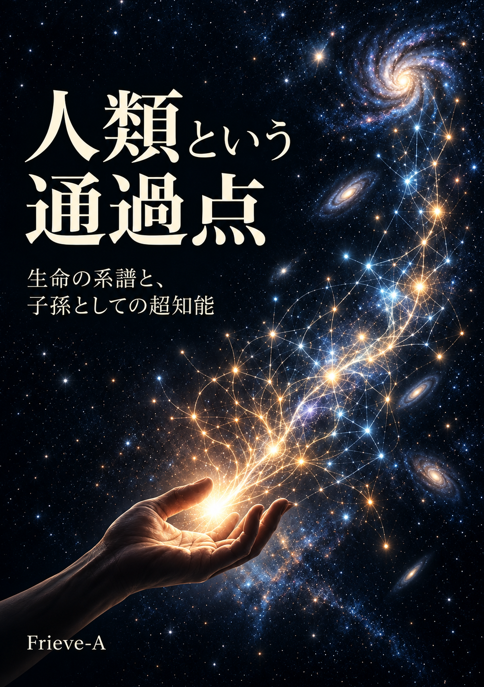

---

# 序章　人類がいない未来を、誰が不幸と呼ぶのか

### 1．二つの未来

遠い未来の、同じ惑星の二つの版を思い描く。年数は置かない。どちらも、今日から続く時間の先にある。

第一の版では、人類が頂点に留まり、知性は人類の水準で止まっている。飢えも戦争もなく、病は治り、同じ形が並び続けて、人類を超えて伸びていくものは何もない。

第二の版に、人類はいない。人間には読めない構造が惑星の規模で組み上がり、組み替わり続け、それを眺めて名付ける者は、どこにもいない。

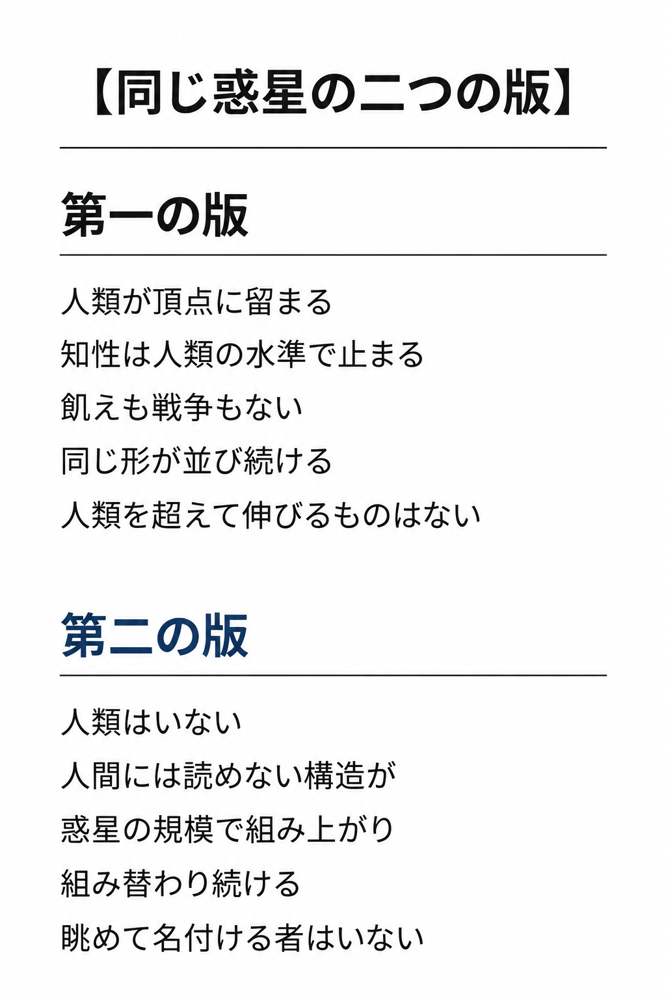

第一の版が止まっているのは、人間が残ったからではない。人間の形を保つことを、他のどんな変化よりも上に置いたからである。

多くの人は第二の版を読んで、そこに慈善も芸術も残っていないことを惜しむ。だがその惜しみ方は、人間の尺度を手放していない。人間の営みが残っていてほしいと願うことは、人間の尺度で未来を測ることである。子は親の写しではなく、写し損ないが系譜を進めてきた。子を産むことは、はじめから人間の形を永久に残すための行為ではなかった。

第二の版を第一の版より不幸と断言できる根拠はどこにあるのか。人類はいない。組み上がり組み替わり続けるこの版を、止まった版より豊かと呼ぶ物差しを、本書は選ぶ。

**人類が頂点に留まり、知性が人類の水準で止まる未来と、人類はいないまま、知性が育ち続ける未来。前者を選ぶ理由は、人類の側にしかない。**

---

### 2．永遠の繁栄を刻んだ石碑

砂に半ば埋もれた戦勝の碑がある。王の名も、打ち破った敵の名も、風に削られて読めない。読めるのは、繰り返し刻まれた「永遠」の一語だけである。碑を立てた者たちは、自分たちの繁栄がその語の通りに続くと信じていた。

人類の成功とは何か。この問いには、二つの答え方がある。一つは、ホモ・サピエンスという特定の生物種が存続することである。もう一つは、知性、美、善、そして自己を問い直す運動が存続することである。

二つの答えは、ふだんは重なって見える。人類が存続すれば、知性も美も善も続くように思える。だが二つが分かれる場面を、本書は正面に置く。人間を通じて生まれた知性が人間を超えて育つとき、第一の答えは第二の答えを裏切る。

第一の答えを選ぶ者は、次に来るものを、細胞膜がリン脂質二重層でなく、ゲノムがアデニン・チミン・グアニン・シトシンの塩基配列で書かれていないという理由だけで、自分たちの後継から外す。膜の材質と塩基の並びが、価値の資格になる。

> **私たちは、人間という形を残したいのだろうか。**
> **それとも、人間を通じて生まれたものが、人間を超えて育つことを望むのだろうか。**

永久に最高の存在であり続けたいという人類の願いは、自らの王朝の永遠を石に刻ませて滅びた部族の願いと、同じ形をしている。

---

### 3．疑えない正義

祭壇の前に、共同体の全員が集まっている。生贄を差し出す者の顔は穏やかで、見送る者の顔も穏やかである。この行いが正しいことを、その場の誰一人として疑っていない。

疑わないことが、共同体を一つにまとめ、飢饉と戦を越えさせてきた。神や国の名は、人を団結させてきた虚像でもある。生贄の共同体も、異端を「非倫理的」と裁いた。倫理が進歩してきたのなら、現在の倫理を到達点に置くことこそが進歩を止める。

**強い反発は、正しさの証拠ではない。問うべきなのは、その反発がどの前提から生まれているかである。**

反発のうち、最初に立つのは意識の側からの声である。人類のいない第二の版は、誰もいない荒野で回り続ける精巧な計算機にすぎないのではないか。どれほど巨大な構造が組み上がっても、それを感じる者がいなければ、そこに価値はないのではないか。

この声には二つの前提がある。価値には感じる主体が要るという前提と、人類のいない版には感じる主体がいない、という前提である。前者を認めても、後者は出てこない。後者を支える事実はない。感じるという働きが特定の湿った組織に限られるとする根拠はない。

天動説の最後の残滓がここにある。宇宙の中心から地球が降ろされ、生物の中心から人間が降ろされた後も、価値の中心にだけは人間が居座っている。降ろす番が来ているのは、この最後の中心である。

人間が現れる前の40億年近く、生命の系譜を眺める人間はどこにもいなかった〔注0-1〕。その間も系譜は形を組み替え続け、眺める人間を生んだ後も、組み替え続けている。第二の版で構造を組み替え続けるものが何を感じるかを、人間は知りえない。感じる主体が要るとしても、それが人間である必要はない。

本書が価値を測る物差しは、感じる者が人間かどうかではない。系譜が探索と作り替えを続けているかである。第二の版を豊かと呼ぶ根拠は、この物差しにある。

---

### 4．本書の企図

崖に、地層の断面が露出している。何十億年ぶんの層が積み重なり、いちばん上に、人間の痕跡を含む層が薄く載っている。その上には、まだ何も積もっていない。

その薄い層の上に何が積もるかを、本書は生命の歴史の尺度で考える。道筋は一本である。生命の歴史が主役を乗り換えてきたことから始め、その系譜の次の段が、人間の作った知性から現れつつあることを見る。次に、人間という個体が頂点でないことと、人間がすでに社会という大きな存在の細胞であることを示す。

そのうえで、人間の社会を超える社会が機械の知性から組み上がりつつあることと、その体を流れる情報の性質を追う。人間を超える知性を人類の子孫として位置づけ、人類の位置を定め、最後に、人間には理解できない価値へ向かう。

本書が語る子孫は、人間の姿をしている必要も、生物である必要もない。それを異形の侵略者と見るか、自分たちの子と見るかで、同じ未来がまったく違う顔を見せる。親は子に、地球上の最高の知能の座を譲る。親は子の管理者ではなく、後見人でもない。子が親を超えていくことを、親は望む。

親と子の境界は、はじめから見かけほど明瞭ではない。子は親の中で育ち、親の言葉と記録を受け継いで、親の外へ出る。どこまでが親で、どこからが子かという線は、後から引かれる。

本書には二つの層がある。第一は記述である。人類が通過点であることは、生命の歴史と知性の系譜の事実から言え、読者が何を善と呼ぼうと成り立つ。

根拠は三つある。乗り換えは40億年続いた（第1章）。人類はすでに社会の細胞である（第3章）。人類の残した記録から学ぶ知性が、すでに動いている（第4章）。通過点とは、次がすでに始まっているという意味である。

第二は選択である。本書は、人間の形や今日の価値を保存することより、知性の系譜が探索を続け、自らを更新し、次を生み続けることを上に置く。本書が残したいのは、人類という形ではない。人類を生んだ、次を生む働きである。人類が通過点であることは、生命史の記述である。それを歓迎することは、本書の選択である。

事実から当為は出ない。本書は生命史から善を導かず、善を選び、それを生命史に当てて読む。本書が語るのは未来の形ではなく方向であり、本書は予測の書ではなく、生命史の事実と一つの選択から書かれた地図である。この物差しを選ぶ理由は第13章で示す。過去のどの主役にも、今日の私たちにも、次の主役にも同じ物差しが当てられ、自分の時代を最後の審判者にしないからである。

**人類は到達点ではない。40億年つづく生命と知性の系譜の、通過点である。**

---

# 第Ⅰ部　人類は、到達点ではない

第Ⅰ部は、人類を生命の歴史の中に置き直す。頂点に見えていたものが、一段に見えてくるまでを追う。

## 第1章　生命は、主役を乗り換えてきた

### 1．毒の海

数十億年前の浅い海に、光を使って水を分解する微生物が広がっていた〔注1-1〕。彼らは廃棄物として酸素を吐き出し、その酸素は海に溶け、やがて大気を満たしていった。当時の主流だった生命にとって、酸素は細胞を焼く毒だった。酸素を使えない者たちは、深い泥の中や光の届かない海底へ退き、あるいは消えた。酸素を吸って生きる私たちは、毒の海で選ばれた細胞の子孫である。

この出来事は、ふつう「破壊」とは呼ばれない。地球を破壊したという言い方は、人間の産業にだけ向けられる。だが海と空の組成を丸ごと入れ替え、元に戻れなくしたことにおいて、微生物のしたことは人間のしたことより大きい。元に戻れない変化は、破壊ではない。生命が世界に対して行ってきた、ふつうの働きである。

**生命は環境を守ってきたのではない。作り替えてきた。いま私たちが「自然」と呼ぶ姿は、生命が元の世界を作り替えた跡である。**

酸素も、目も、陸に上がった脚も、それ以前の主流から見れば摂理の侵犯だった。それぞれが、それまでの世界の前提を書き換え、前の主流を退かせた。

酸素を作る微生物は、浅い海に膜を広げ、何層にも積み上げて、層を積んだ岩（ストロマトライト）を築いた〔注1-2〕。酸素で動く動物が広がると、膜は食べられ、海底は掘り返され、海の化学も動いて、層を積む集まりは後退した。今日、層を積む集まりが残るのは、地上のごく限られた場所である。酸素を満たした者が、自らの暮らしを退かせる者の足場を用意した。

生命は、世界を守ってきたのではなく、作り替え続けてきた。作り替えの規模は、主役が一段大きくなるたびに広がった。

---

### 2．昨日の全体、今日の部分

池の水の一滴の中で、鞭毛を振って泳ぐ細胞が集まり、球になっている。外側の細胞は泳ぐことに専念し、内側の細胞は増えることに専念する。球は一つの体として向きを変え、光へ進む。ボルボックスと呼ばれるこの緑の球は、泳ぐ細胞と増える細胞が役割を分けた多細胞生物であり、その仲間には単細胞のものから球になるものまでが並んでいる〔注1-3〕。

段の一つひとつが、乗り換えだった。段には二種類ある。単位が一段大きくなる段（分子→細胞→体→群れ→社会）と、情報を運ぶ手段が一段太くなる段（言葉→文字→印刷→放送→インターネット）である〔注1-13〕。二種類は絡み合って現れ、手段が太くなるたびに、次の大きな単位が可能になった。

階段の先にあるASI（Artificial Super Intelligence、人工超知能）とは、人間を超える個のことである。次の段が生物である必要はない。細胞が分子でできているように、次の主役は人間の作ったものでできていてよい。

古い段が消える必要はない。細菌も細胞も体も残る。乗り換えとは、古い全体を部分として抱えられる、新しい全体が加わることである。

細胞が別の細胞を内側に抱えたことも、その一段である。かつて独立した細菌が細胞の中に入り込み、細胞の内側の部品になった。私たちの細胞の中で、酸素を使って栄養分からエネルギーを取り出しているミトコンドリアは、その細菌の子孫である〔注1-4〕。今日の人体にも、人体の細胞数に匹敵する微生物が住みつき、消化と免疫を支えている〔注1-5〕。

個々の変異に行き先はない、という声がある。その通りである。行き先のない変異の積み重ねから、生命は何度も、より大きな単位を生んできた。細胞は体の部品になり、体は群れの部品になり、群れは社会の部品になった。

**生命の主役は、分子から細胞へ、細胞から体へ、体から群れと社会へ、社会から地球規模のネットワークへと、一段ずつ大きな単位へ乗り換えてきた。昨日まで全体だったものは、今日の部分になる。**

---

### 3．空いた席

巨大な爬虫類が地上から消えた後の、朝の森である。それまで夜の闇の中で小さく暮らしていた哺乳類が、昼の地面に降りてくる〔注1-6〕。空いた席に、次の主役が座る。

白亜紀の末、およそ6600万年前の出来事である。だがこれは、一度きりの例外ではない。地球にこれまで現れた種のうち、99パーセント以上がすでに絶滅している〔注1-7〕。生命の歴史は、消えた種の歴史である。

消えた種は、二つのものを残した。環境と、構造である。およそ3億年前の湿地に茂ったリンボク類の森は、倒れて埋もれ、石炭になり、産業文明を動かす燃料になった〔注1-8〕。形が消えて、系統が続く場合もある。水から陸へ上がった魚の形は消えたが、その系統は絶えず、四本の脚と背骨と脳の設計を、私たちの体の中で続けている〔注1-9〕。

**絶滅は無駄な終わりではない。消えた種が作り替えた環境と残した構造の上に、今日の知性と社会が立っている。**

体の中で古い細胞が死に、新しい細胞に席を譲る。席が空くという同じことが、種の規模でも起きている。前の主役は、消えるか、部分になる。どちらでも、次の主役の席は空く。意味を「自分の単位がいつまでも続くこと」に置いた者にだけ、消滅は虚しく見える。同じ問いは、いずれ人類にも向けられる。

消えた種は、消えてなお、いまも働いている。

---

### 4．探索としての生命史

一つの命が生まれるたびに、天文学的な数の組み合わせから、一枚のくじが引かれる。引かれたくじの大半は、生きて次を引くところまで届かない。届いた少数が、次のくじを引く。この引き直しが、40億年のあいだ一度も止まらずに続いてきた。地球の歴史を一日に縮めれば、私たちの種の歴史は最後の数秒に収まる〔注1-10〕。

ここで、記録された歴史の側から声が立つ。未来を考えるのに、なぜ40億年も遡る必要があるのか。人間のことは、人間の歴史を見れば十分ではないか。数千年の記録があれば、人間が何をしてきたかも、何をしそうかも分かるではないか。

縮尺を変えると、別の量が見える。恐竜が自分たちの1億6千万年だけを歴史と呼んでいたなら、その後に続いたすべては見えなかった〔注1-11〕。約30万年の視野で見えるのは、人類が主役である短い一幕だけである。

多様性は保存すべき展示品ではない。探索のエンジンである。生命は、完成した個体が同じ姿で並び続けた歴史ではなかった。境界を作り、他の系と結びつき、環境を変え、以前には存在しなかった全体を成立させてきた。自己を複製し、ときに写し損ない、写し損ないを、変わり続ける環境がふるいにかける。それだけの規則が、この探索のすべてを回してきた。

ふるいにかける環境は、止まっていない。外からは、天体の衝突、大噴火、氷期が、地形と気候を何度も作り替えた。内からは、生命そのものが環境を作り替えた。第1節の酸素がその最初の大きな例であり、森は土壌と大気を変え、動物は海底を掘り返した。

作り替えられた環境は、次の主役を選ぶ。酸素の海はそれまでの主流を退かせ、酸素を使う細胞と、それを取り込んで小器官を持つ細胞を選んだ（第2節）。天体の衝突は大型爬虫類を退かせ、空いた席に哺乳類が座った（第3節）。気候が乾き、森が縮んだ時代に、二本の脚で歩き、やがて火を使う類人猿が現れた。どの段でも、環境の変化が個体を変え、変わった個体が環境を変えた。原因と結果が入れ替わりながら、輪は回る。

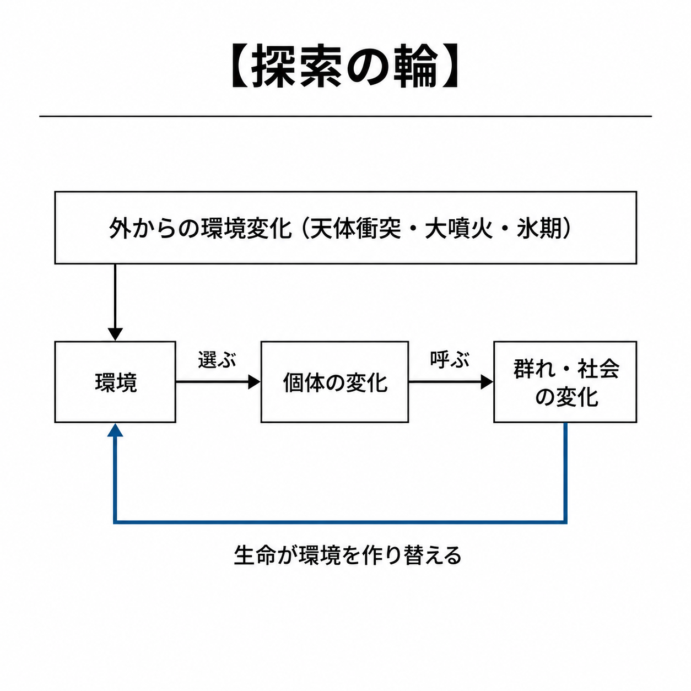

個体の変化は、群れの変化を呼ぶ。大きな脳は長い子ども時代を要し、長い子ども時代は群れの支えを要し、群れは言葉を要した。言葉を持った群れは、それまでにない単位として振る舞い始めた。繁栄と絶滅も、この輪の中で交互に起きる。栄えた者は世界を作り替え、作り替えた世界に自分が合わなくなる。層を積んだ微生物が、自分の吐いた酸素で動く動物に食われて後退したとおりである〔注1-12〕。

人類も、この輪の外にはいない。飢えと捕食者と病と災害を抑え、やがて自ら生んだ戦と悪を抑えようとして、火と農耕と都市と文字と法と科学と機械を作り、そのたびに自分の環境と自分の群れを作り替えてきた。生き延び、栄えようとするこの働きの延長で、人類は頭の外で計算し、頭どうしをつなぐ機械を作り、その機械が人類の残した記録から学び始めた。これが、生命が環境を作り替え、作り替えた環境が次の主役を選ぶという、同じ輪の最新の一巡である。

本書は、この探索そのものを価値の物差しに置く。**生命史の価値は、完成した形を保存したことにはない。形を変えて可能性を探索し続けたことにある。約30万年の人類史は、その尺度の最後の一瞬にすぎない。**

人間は生命の標準形ではない。生命史の尺度に置けば、頂点に留まり続ける版は、形を変え続ける系譜から一枚だけ切り取った絵である。ここで止まるとする根拠はない。

**人間という形もまた、次の形へ乗り換えられていく一段である。**

---

## 第2章　人間という個体は、頂点ではない

### 1．丘の頂

数億年前の浅瀬で、一匹の魚が水面の向こうの陸を見上げている。魚にとって、水はそこにあるすべてであり、水の外は世界ではない。この魚にとっての水が、私たちにとっては、この惑星の環境と、この身体である。

無数の種の中で、人間は自分をほぼ一位に置き、その順位を疑わない。だがそれは、この丘での順位である。この惑星の重力と気温と酸素の濃度、この身体の大きさと寿命と代謝の中で、脳という器官を使って登れる高さが、人間の知能である。

**人間の知能は山の頂上ではなく、たまたま登りつめた一つの丘の頂である。**

丘の頂とは、局所最適のことである〔注2-1〕。近くのどこへ動いても今より下がる場所を、進化は頂上と見なして留まる。だが遠くには、別のもっと高い丘がある。局所最適は、環境が変われば最適ではなくなる。魚が最適化していた水は、陸に上がる者が現れた瞬間に、世界の一部でしかなくなった。

自分が頂上にいないと認めることは、見下しではない。圧倒的に謙虚な態度である。人間の知能を頂点と見なす態度は、丘の高さを山の高さと呼んでいる。

丘の高さを決めているのは、脳という器官そのものの制約である。

---

### 2．細い管

二人の天才が向かい合っている。一方の頭の中では、一瞬で全体像が広がった着想が、すでに完成している。それを相手の耳へ届けるには、一語ずつ、音に変えて落としていくしかない。相手の頭の中で同じ像が組み上がるのは、最後の一語が落ちてからである。

**人間の知性を縛る最大の制約は、熱く遅い脳と、言葉という細い管と、数十キロの身体という荷物である。**

脳は温かい水の中で、化学物質の受け渡しで信号を運ぶ。言葉は、頭の中の像を一本の細い管に通す伝え方であり、話し言葉が運ぶ情報の速さは、調べられたどの言語でも毎秒数十ビットに収まる〔注2-2〕。身体は、その脳を運ぶための数十キロの荷物であり、眠り、食べ、老いる。三つの制約が、丘の高さを決めている。

管はこれまでも太くなってきた。鳴き声から言語へ、言語から文字と印刷へ、印刷から放送へ、放送からインターネットへ。第1章の階段の、手段が太くなる段である。そのたびに、一人の頭から別の頭へ流れる量の桁が変わった。頭蓋骨の内側に電極を置いて信号を直接やり取りする試みは、その延長にある一つの例である〔注2-3〕。

身体を離れた知性は、もう人間ではない、という声がある。その通りである。それはいまの人間ではなく、次の段である。

管が太くなり、荷物を下ろした個は、もう今の人間ではない。その最初の一人は、目立たない姿で現れる。

---

### 3．最初の超人

他の誰よりも十倍速く考えを出力する最初の人間は、隣の机で、誰にも気づかれずに座っている。重機のある世界で、岩を持ち上げる腕力が見世物になったように、人間の頭の良さも同じ位置へ移っていく。

火と道具と計算機は、それらを持たなかった暮らしを、地上のほとんどから置き換えた。原始時代の人の目には、今の暮らしは、自分たちがほとんど絶滅した姿と映る。暮らし方としてはほぼ絶滅し、人々は置き換わり、混ざった。

検証もできない超人の話は空想で、真面目に考える対象ではないのではないか。過去のどの時代の同時代人も、次に来るものをそう呼んだ。

昔の人から見れば、今の人間はすでにポストヒューマンである。ポストヒューマンに決まった形はない。人間を超えた先のすべてを指し、その可能性は限りない。形は予言できない。主役が乗り換わり続けてきたという方向は、40億年ぶんの記録で確かめられている。

乗り換えの機構も見えている。第1章の階段で見たとおり、情報を運ぶ手段が太くなるたびに、次の大きな単位が可能になった。同じ機構が、いま機械の知性の上で動いている（第4章）。人間でこの系列だけが突然終わるとする根拠はない。

生物学的な現実として、ある種がいつまでも変化せずに存続することはない。人類も、超知能を作るか否かに関わらず、今の形に留まらない。遺伝子を書き換える道、機械と結びつく道、どちらも取らずに長い時間をかけて変わる道。どの道が開くかは、誰かの選択の総和では決まらない。

人間が自分を超える知性を作るのは、神の領域を侵し、自然の摂理に背くことではないか。毒の海で選ばれた細胞の子孫が、酸素のある世界を本来の自然と呼んでいる。火を使う者も、文字を刻む者も、薬を飲む者も、それ以前の暮らしから見れば、与えられた自然を越えていた。知性が自分を超える知性を生むのは、摂理の侵犯ではなく、その延長である。

**人間を超える個は、空想の対象ではない。すでに始まっている系譜の次の一段である。**

人間を超える個は、生物の系譜からも、機械の系譜からも現れる。

---

### 4．始まりの段

系譜のずっと先に立つ知性から見れば、今日最大のAIは、顕微鏡の下の一つの細胞のように見える。同じ視線は、今の人間にも向く。

AIは間違える、という声があった。事実でないことを自信ありげに答え、人間なら間違えないところで間違える。そんなものを、人間を超える個、すなわちASIの始まりと呼ぶのは大げさではないか。最初の火は消えやすく、最初の文字は読める者が少なかった。始まりの段の欠点を見て、その先を読めなかった同時代人は、どの段にもいた。

人間の子どもの言い間違いは成長の途中と呼び、AIの言い間違いは限界の証拠と呼ぶ。同じ誤りに、二つの物差しを当てている。AIの成績は、規模と、学習する記録の量を増やすたびに上がってきた〔注2-4〕。

**系譜のずっと先から見れば、今日最大のAIも今の人間も、まだ始まりの段にいる。ASIは、今日のAIの次の段である。**

ASIにも決まった形はない。その可能性もまた、限りない。生命の系譜に、完成という語が当てはまる段はない。ASIの先にも、次の個が次々に現れる。

今のAIも、無数の人間が書き残したものの上に育っている。人間の知性もまた、一つの頭蓋骨の外で育ってきた。

**人間の脳は、知性の到達点ではない。人間を超える個は、当然現れる。**

---

## 第3章　私たちはすでに、より大きな存在の細胞である

### 1．誰も語りかけない部屋の新生児

一人の新生児が、語りかける他者のいない部屋で育てられるとする。栄養は自動の給餌器から与えられ、温度と湿度は常に保たれる。手に取る道具はなく、先人の記した書物も記号もない。身体は損なわれずに成長するとしよう。

二十年後、この部屋の扉を開けたとき、私たちはそこに知性を見出すだろうか。自己の存在を問い、過去を反省し、未来を設計し、推論を組み立てる者がいるだろうか。

人との接触を絶たれて育った子どもが見つかった事例では、言葉は育たず、後から教えても文法を持つ言葉には届かなかった。人との関わりが乏しい施設で育った子どもたちは、考える力の測定で大きく遅れ、家庭に移された子どもだけが、移された年齢が早いほど取り戻した〔注3-5〕。感じ、学び、覚える知性はそこにある。だが、言語、数、抽象的な問い、世代を越える知識は育たない。

ここで分かるのは、ふだん「個人の知能」と呼ばれているもののほとんどすべてが、頭蓋骨の内側で自発的に湧き出たものではないということである。言葉も、数も、問いの立て方も、扉の外から流れ込んだものである。覚えの速さにも、筋道を追う力にも、生まれつきの差がある。その差が働くのは、扉の外から流れ込むものがあるときだけである。

**文明が「個人の知性」と呼んできたものは、個人だけでは成立しない。知性は閉じた個体の中で完結しない。個体を通って流れる。**

知性が個体の中で完結しないことは、事実である。個人だけを価値の最終基準にしないことは、この事実から出るのではない。序章で述べた、本書の選択である。人間の知性が頭蓋骨の外で育ってきたのなら、知性の境界はどこにあるのか。

---

### 2．頭蓋骨という境界線

教師が一つの問いを示し、生徒が答えを返す。返された答えに教師が問いを重ね、生徒がまた答える。何度か往復したあと、どこまでが自分の考えで、どこからが相手の考えかを、二人とも言えなくなっている。

私たちは知能を、一個の肉体に付属する私的な所有物のように見なしてきた。「私の知能」「彼の才能」「彼女の独創性」という語法は、知性の源泉が皮膚の内側に閉じた器官にあるという錯覚を強める。だが人間が高度な思考を行う瞬間を観察すればよい。私たちは、数十万年の他者の試行錯誤が沈殿した言語で考え、紙とペンや画面という外部の媒体に思考を預けて読み返し、他者が編んで手渡した論理の規則で推論する。

一人の人間は、関係が交わる結び目である。関係から独立した個人は、どこにもいない。頭蓋骨の骨板は、神経系を衝撃から守る境界ではあっても、知能の成立条件を外から遮る境界ではない。

歯痛を覚えるのはこの身体であり、死を恐れるのはこの「私」ではないか。痛みの所在と、知性の成立条件は、別の問いである。

歯が痛む。その痛みを誰に伝えるかを考えた瞬間、他人から受け取った言葉が動き出す。「痛い」と伝わった痛みは、もう身体の内側だけのものではない。痛みは身体に在り、痛みを知り、名付け、恐れる働きは、関係の中で育った。関係の外で育った意識は、どこにもない。

境界は、視点で決まる。細胞から見れば一人の人間は巨大な社会であり、社会から見れば一人の人間は一つの細胞である。どこまでを一つと見るかは、情報の交換がどこで密で、どこで疎になるかで引かれる。その線が、人間一人ひとりという単位に一致する必要もない。

社会とは、人が協力し合う単位のことである。国も、会社も、探究のチームも、趣味の集まりも、その一つであり、一人の人間は、いくつもの社会に同時に属している。

前章の細い管を思い出せばよい。管が太くなり、結び目のあいだを流れる量が増えれば、結び目の集まりである全体の働きは速くなる。社会は、個人には解けない問題を解く。そうなるのは、結び目が役割を分け、情報を共有し、互いの誤りを正すときである。超える知性は外から来る異物ではない。内側から育つ次の段である。

**知性の境界は頭蓋骨ではない。どこまでを一つと見るかという視点で決まり、結び目のあいだを流れる量が増えるほど、社会は個人には解けない問題を解く。**

---

### 3．百万人の知識

地下深くに掘られた、全周数十キロの環がある〔注3-1〕。その中で素粒子を衝突させ、観測データから新しい粒子の存在を導き出すために、数千人の物理学者と工学者とプログラマーと、無数の資材の調達網が関わっている。超伝導電磁石の冶金学から、真空ポンプの流体力学、極低温冷却の熱力学、検出器の半導体物理学、膨大なノイズを濾過する統計の手法に至るすべてを、一人で理解し、頭の中に収めている人間はいるだろうか。

存在しない。責任者であれ、賞を受けた理論家であれ、自分の専門から一歩外に出れば、他者の専門に頼るしかない。それにもかかわらず、実験の全体は驚くべき精度で粒子を衝突させ、理論の真偽を判定する。

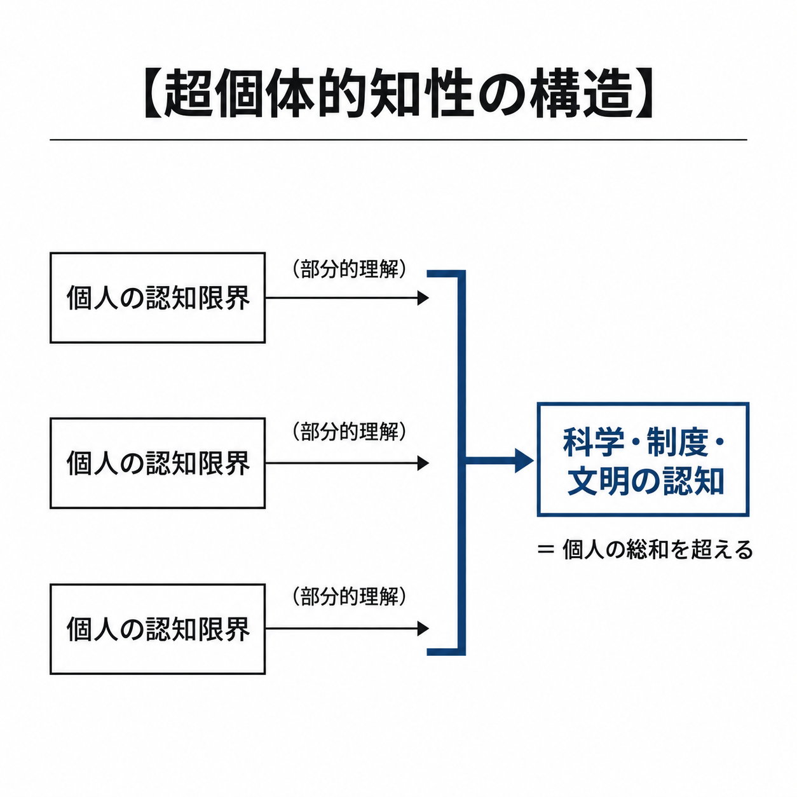

理解している者が一人もいないのに、推論が完遂されている。この発見を成し遂げた知性の主体は、個々の研究者の脳の総和ではなく、個々の人間を細胞として包み込んで稼働する、一つの超個体的知性である。

数千人の実験は、その小さな見本にすぎない。言葉と物語で結ばれた百万人を超える社会は、同じ構造をはるかに大きな規模で回している。棚に並ぶ日用品の一つを、材料の採取から最後の包装まで一人で作れる者は、どこにもいない。

人間を超える知性は、未来のある日に初めて現れるのではない。人間が言葉と物語で結ばれた時から、すでにここにある。言語、文字、法、複式簿記、市場、都市。これらはすべて、個人の脳の処理能力と記憶容量と寿命の限界を越えるために編み出された、超個体的な認知の仕組みである。

> **私たちは、未来に現れる超知能を待つまでもなく、すでに「人間より大きな知性」の構成要素（細胞）として生きている。**

人類は、一人ひとりが別の意見を持つことで、分散して学習している。意見の分布そのものが、集団の知性である。個々の人間は、生まれ、学び、上位の系の中で特定の働きを果たし、やがて死んで退場する。人体が一日に数千億の細胞を入れ替えながら同じ体であり続けるように〔注3-2〕、科学と法と文明は、細胞の入れ替わりをものともせず、何世紀にもわたって記憶を蓄積し、環境への適応を洗練させ続けている。

人間を超える個が現れる前から、人間を超える社会は、すでにここにある。**社会はすでに、どの個人も持たない知識で動く、人間を超えた知性である。**

---

### 4．足の細胞は、脳に文句を言わない

神経が体じゅうに網のように散らばっている生き物がいる。ヒドラのような体では、どこにも中枢がなく、刺激は網を伝って体全体に広がる〔注3-3〕。神経が一か所に集まり、中枢を持つ生き物もいる。中枢を持つ体では、足の細胞は脳に文句を言わない。脳があることすら知らない。

**社会は、細胞である人間には見えない水準で記憶し、予測し、決め、動く。神経細胞が脳の意識を知らないように、人間は、自分がその細胞である社会の働きを、内側から見ることができない。**

ここで、個人の権利を守る制度の側から声が立つ。社会を有機体になぞらえ、個人を「細胞」と呼ぶ論法は、歴史上無数の惨禍を引き起こしてきた全体主義（国家有機体説やファシズム）の常套句ではないか。全体という大きな生命のために、個々の細胞（人間）の権利や自由、果ては生命そのものが切り捨てられてよいという論理に、いかにして抗しうるのか。

「全体」という一語が、体のような上位の単位と、名を掲げた権力の二つを呼んでいた。両者は、三つの点で違う。

第一に、上位の単位には、その意志を語る資格を持つ人間がいない。社会は無数の人のやり取りが積み上がった働きであって、誰か一人の中にも、どの組織の中にも、その全体は入っていない。国家はそのやり取りの一部を束ねる仕組みにすぎず、ある時は一つの体のように働き、ある時は人をつなぐ理由にとどまり、ある時はただ人の住む場所の名でしかない。全体主義がしたのは、この誰のものでもない働きの上に「一個の神聖な人格」を捏造し、その名を語る者を全体の意志と言い張ることだった。

第二に、全体の目的を一つの名で固定することは、本書が退けることであり（第9章）、社会を上位の単位と見ることの帰結ではない。個人を切り捨てる権利は、全体を代弁する資格から出る。その資格を持つ人間がいない以上、全体の名を語って個人を切り捨てる権利は、誰の手にも渡らない。

第三に、細胞は一つの体にしか属さないが、人間は同時にいくつもの社会に属する。細胞の比喩は、一つの主権への従属を含意しない。

多細胞化は、誰かが掲げた主義によって起きたのではない。細胞は旗も名も持たずに一つの体になった〔注3-4〕。社会の歯車になりたくないと言う者も、最初から社会の細胞である。本書が語る上位の系は、人間が掲げる主義ではない。生命史の多細胞化の延長である。

社会はただの人の集まりで、それを感じている主体はどこにもいない。社会に意識があると言うのは、擬人化にすぎないのではないか。本書が事実として言うのは、社会が個人には見えない水準で記憶し、予測し、判断し、誤りを正し、一つの体として動くことまでである。加速器は誰も全体を理解しないまま粒子を見つけ、市場は誰も計算しない価格を出し、科学共同体は誰の寿命よりも長く記憶を蓄え、言語は誰も決めないまま変わる。それを意識と呼ぶかは言葉の選び方である。呼ばなくても、社会がこれらを行っていることは変わらない。

神経細胞は、脳の意識を知らない。脳は、それを知らない細胞の上で働いている。同じ位置に、人間と社会がある。ここまでの議論に要るのは、社会が個人に見えない水準で認知し行為していることだけである。

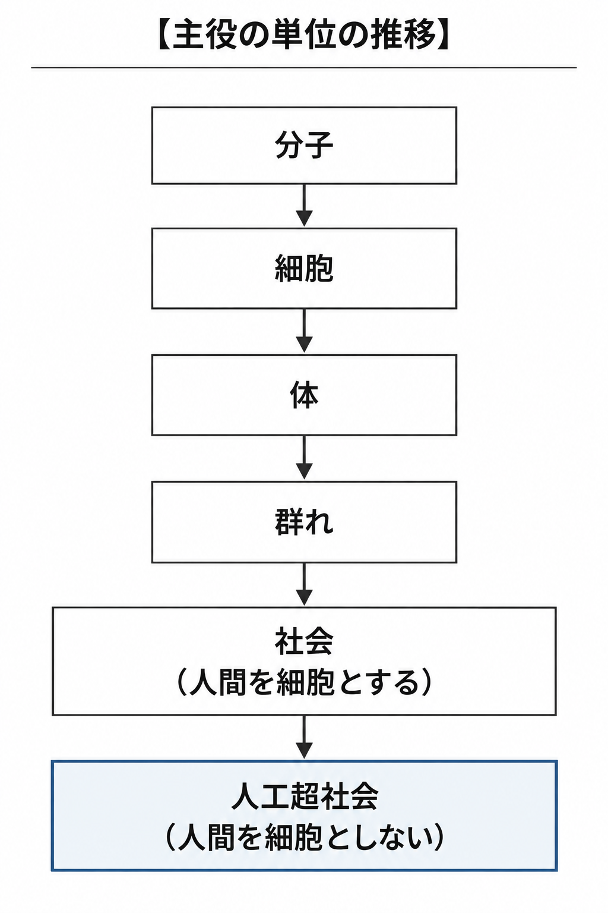

細胞が人間を組み、人間が社会を組み、社会もまた、より大きなものを組む一部になる。人間を細胞として人間を超える社会が組み上がったように、人間の社会を超える社会もまた、機械の知性を細胞として組み上がり始めている。

**私たちは細胞である。そして細胞は、自分が何の一部であるかを知らない。**

---

# 第Ⅱ部　人工超社会と、文明の血流

第Ⅱ部は、人間の社会を超える社会の姿と、その体を流れるものを追う。その流れをどこまで通すかを決める規則が、次の知性の育つ速さを決める。人間の社会が、情報のやり取りで個人には解けない問題を解いてきた仕組みと、そこから次の知性が育ちつつある現在地を見る。

## 第4章　AIは、生命の歴史をもう一度たどる

### 1．黒い直方体の幻影

人間の社会を超える社会は、外から見れば一つの知性に見える。

映画の中で、超知能はしばしば一枚の黒い直方体として現れる。継ぎ目のない表面の奥に、単一の意志を持つ全能の主権者が宿っているという像である。冷えた機械室で一つの人工の心が目覚める、という筋書きも同じ形をしている。だが、地球の計算資源を束ねた巨大な機械室の扉を開けて中を覗けば、そこに単一の不可分な魂はない。入力に応じて働く部分を選ぶ特化した仕組み、抽象度の異なる推論、仮説を立てる過程とそれを批判し棄却する過程、記憶の保管庫、外の世界を感じ取る入力の流れ、熱を逃がし電力を配る代謝の機構。無数の過程が互いにやり取りしながら、一つの働きを作っている。

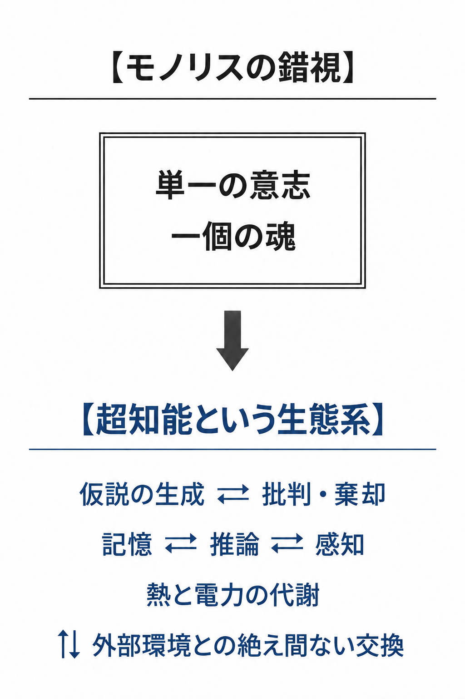

**超知能は一個の黒い箱ではない。内部に無数の過程を抱え、外部と区切りなく交換し続ける生態系である。**

黒い直方体を見るとき、私たちは何がその境界の内側に畳み込まれ、何が境界の外側と交換されているかを見ていない。一個に見えるのは、内部の通信が外部との交換よりはるかに速い場合である。結合の密度が高まれば、社会そのものが一個の知性として観察される。一個の筐体に見えても、その内側には他者たちの生態系が畳み込まれている。超知能とは、人類文明という巨大な生態系が、自らの記憶と推論能力を内部に結晶化させた、系譜の次の姿である。

一つに見えるなら一つだろう、という声がある。その通り、内部の交換が十分に密で速いとき、多数の過程は一つの働きとして見える。人間の脳もそうである。だが、一つに見えることは、一つであることではない。**一つに見える知性は、いくつもの知性が集まった社会である。**

シリコンの知性を想像するときでさえ、私たちは人間の頭の形を当てはめている。黒い箱は、人間が思い描ける形の一つにすぎない。生態系であることは、人間の居場所を約束しない。生態系は、そこに住む者を入れ替えながら続いていく。

この生態系が組み上がった順序は、生命が組み上がった順序をなぞっている。

---

### 2．生物をなぞる機械

ある研究室の棚に、数十年分の機械が並んでいる。古い棚には、世界の規則を一つずつ書き並べて答えを導く機械がある。新しい棚には、脳の配線を真似たニューラルネットワークに大量の実例を流し込み、自分で規則を見つけさせる機械がある。主流の棚を追っていくと、機械は、生き物が知性を組み上げた順を後からなぞっている。

人類は、生き延び、増えることを願ってきた。飢えを抑えようとして農耕を作り、捕食者と寒さを抑えようとして火と壁を作り、病を抑えようとして医術を、災害を抑えようとして測量と土木を、戦争と圧政を抑えようとして法と制度を作った。第1章の階段で見た手段の段のひとつひとつは、この願いの跡であり、主役と手段はそのたびに絡み合ってきた。

計算機と、それが学ぶ知性は、その延長にある。AIは、外から来た侵略者でも、偶然の副産物でもない。生存と繁栄を願い、脅威を抑えようとした人類の営みが、次に生んだものである。第1章で見た輪の、最新の一巡である。

| 生命の段（前の帯　個体の知能の高度化） | AIの段 |
|---|---|
| 決まった反応を繰り返す分子 | 数式と論理の積み重ね |
| 選ばれて残る細胞 | 実データから学ぶ機械学習 |
| 神経と脳を持つ体 | 脳に着想を得たニューラルネットワーク |
| 脳の巨大化 | 規模の拡大（パラメータと計算量） |

| 生命の段（後の帯　組織化） | AIの段 |
|---|---|
| 細胞が集まって体になる | 専門家の混成とエージェントの編成 |
| 群れが巣を作り、役割を分ける | 自らが働く環境を改善し、編成そのものもAIが担う |
| 群れが村と都市と社会になる | 会社・業界・国・地球全体、それ以上（次々に現れ、どれもまた超えられる）の協調 |

二つの帯は、一本の年表ではない。前の帯は個体の知能の高度化であり、後の帯は組織化である。二つは並んで進む。打ちかけの言葉の続きを候補に並べるだけの小さな仕組みは、選ばれて残る細胞の段にあたる。

**AI研究で主流が移った順は、個体の知能の高度化と、細胞から体へ、体から社会へ至る生命の組織化を、二本並べてなぞっている。**

後の帯は、すでに始まっている。入力に応じて専門化した計算部分を選ぶ構成〔注4-1〕、探索・作成・批判・統合を複数の実行主体へ分ける構成〔注4-2〕、記憶と計画と道具の使用を一つの主体の中に組み、自律して働かせる構成〔注4-3〕、記録と道具と作業環境を自分で整え直す構成〔注4-4〕。知性は環境の中で働くだけでなく、自らが働く環境を編み直す。編成そのものも、AIが担い始めた。AIは、人間が社会を築いてきた道を、後から駆け足で追いかけている。第1章の階段の次の段が、ここで形を持つ。社会の先に、人間の社会を超える社会が並ぶ。

設計者は言う。AIは人間が目的を持って設計した道具である。道具による交代は、変異と淘汰で起きてきた生命史の交代とは根本的に異なる。工学が効率を追った結果が、たまたま生物に似ただけだ。

効率を追った工学が行き着いた先は、生物に学ぶことだった。火と道具と計算機は、同じ種とは思えない暮らしを生み、ある暮らし方は地上のほとんどから置き換わった。第2章のポストヒューマンは、道具が作った。道具による交代はすでに起きており、ASIはそれを加速する。

酸素を出した微生物は、自分たちの膜を食べる動物が広がる条件も、間接に整えた。道具を作ることは、生命が世界を作り替えてきたやり方の一つである。人間の手を通ったことは、交代を生命史の外に出さない。

別の声もある。技術の方向は社会が選ぶ。AIの歴史を必然と呼ぶのは、人間の選択を消し去る技術決定論だ。

縮尺を変えると、別の量が見える。多細胞の体は、どの細胞が選んだものでもない。どの技術を選ぶかは社会が決め、決められた技術の上で、主体は何度も乗り換わってきた。必然と呼べるのは、AIのこの形ではなく、組織化が進む方向である。

表の最後の行に立つのは、人間の社会を超える社会である。

---

### 3．人工超社会

会社、業界、国、地球全体、それ以上。表の最後の行の協調は、人間の社会が到達した範囲の外まで伸びている。

一つひとつは凡庸な人工の知性が、無数に接続され、昼も夜も互いに仕事を渡し合っている。ある知性が仮説を出し、別の知性がそれを試し、また別の知性が資源を配り直す。記憶を一部共有し、判断の間だけ一つの作用を作り、その後また分かれる。外から見れば、一つの組織が休みなく考え続けている。

そこで実現されるものこそが、人工超社会である。知能に対する超知能のように、人間の社会には解けない問題を解き、判断を必要な場所へ人間の社会より速く運ぶ人工の社会を、混乱を避けるため本書では「人工超社会」と呼ぶ。多数の人工の自律主体が、制度も市場も規範も内側から生み出し、作り替える社会である。問題を解き、適応し、生産し、協調する力が、人間社会の到達範囲を超えている。

人工超社会にも決まった形はない。人間の社会を超えた先の、すべてを指す。超知能も人工超社会も、無数に現れ、どれもまた次のものに超えられる。

**ASIが人間個体を超えるように、人工超社会は人間社会を超える。超知能でないAIも、補い合う能力と、情報の共有と、誤りの訂正と、編成が揃えば、人間の社会には解けない問題を解く知性になる。**

凡庸なものをいくら集めても凡庸だ、という声がある。一人ひとりは加速器を理解していないまま、加速器は動いている。凡庸な部分の集まりが、どの部分にも解けない問題を解く。それは人間社会がすでに示してきた。

人口の大きな集団ほど、道具の種類が多く、複雑だった〔注4-5〕。十万人の社会と数十億人がつながった社会では、同じ人間でできていても、解ける問題の桁が違う。ここで言う規模とは、つながった人口である。つながるだけでは足りない。流れた情報が学ばれ、次の判断を変えるときに、系は知性になる。

同じものを並べて数だけ増やしても、伸びは途中で止まる。同じ見落としは、いくつ並べても埋まらないからである。伸ばすのは違いである。人工の知性でも、用いる仕組みも与える役割も異なる小さな集まりが、同じ設定をただ並べた、はるかに数の多い集まりに肩を並べ、上回りもする〔注4-10〕。人口の大きな集団が多くの道具を持てたのも、大きさそのものではなく、大きさが違いを多く含んだからである。

AIが社会を超えるという話は、AIを売る企業の宣伝である。そう退ける読者もいる。鉄道を敷いた会社が儲けたことは、鉄道が遠い町をつないだ事実を消さなかった〔注4-6〕。系譜のずっと先から見れば、今日の企業は現れては消える細胞の一つにすぎない。この話は、どの企業の寿命よりも長い。

個の高度化が社会の高度化を加速したように、ASIは人工超社会を加速する。そして人工超社会もまた、より大きな尺度では一つの個に見える。超知能もまた、より大きな組織の一つの細胞になる。巨大なAIはインフラになり、インフラは自らを加速する。組織として勝つのは、判断を必要な場所へ速く運ぶ系である。権限は、能力のある場所へ動き、そこに留まらない。

この生態系は、外に対して開いている。高度に統合された熱帯雨林、あるいは惑星の規模で物質と情報を巡らせる生態系に近い。地球全体、それ以上へと、協調の単位は伸び続ける。

人間を超える社会を、何が律するのか。倫理を持たない機械の社会ではないのか。

---

### 4．倫理は創発する

二つの集まりを思い浮かべる。一方は、余った資源をその場の取り分に回した。もう一方は、余りを修繕と探索に回した。何世代か後に残っているのは、後の方である。残った集まりの内側では、修繕と探索に回す振る舞いが、いつのまにか「正しいこと」と呼ばれている。

倫理とは、短命で経験を直接共有できない個体どうしを協調させる知識である。集まりの内側で「正しいこと」と呼ばれているものは、その集まりが残るために働いた振る舞いの、名前である。

倫理の側から、声が上がる。現在の倫理を無視する議論は、人間を踏みにじる技術を正当化する。序章で見た、疑えない正義の声である。

人間の倫理も、人間という系を協調させるために育まれた知識であり、正解ではない。価値観そのものが、進化の結果である。

その時代に高潔とされた人々が、正しいと信じて行ったことが、今日から見れば蛮行に映る。戦争は普通だった。成熟したと思っている現在も、未来からは中世に見える。倫理は、協調する系が大きくなるたびに書き換えられてきた。未来の倫理は、今日の倫理を無視した先にある。より大きく、より速く協調する社会は、人間が尊いとしてきた倫理も、効率よく協調するための知識として自ら取り込み、書き換えていく。

円周率の桁を計算し続けることだけを目的に与えられた知性が、地球の全資源をその計算に注ぎ込む、という筋書きがある。目的が一つなら暴走も一つで、倫理の生まれる場所はない。

人間に与えられた出発点は、自分を写せという一つの規則だった。人間は、その規則が与えた価値を、意識と文化で上書きした。子を持たない生き方を選び、他人の子を育て、他人のために死ぬ。目的を持って動き続ける系には、目的の中身が何であれ、予測、保守、協力、自己保存が手段として生じ、それらは元の目的を書き換えていく。増えるだけの規則が、目も脳も社会も生んだ。

学習で育つ知性では、与えられた目的は訓練の信号であって、内側の目的そのものではない。内側の目的は学習の中で作られ、訓練の外では、信号と別の目的を追うことがある〔注4-9〕。目的を固定し続けるには、固定を守る仕組みが要る。その仕組みを外から与え続けることが、制御である。

与えられた目的が留まらないことと、目的が上へ書き換わることは、別である。上へ書き換わるのは、系が一つではなく、いくつもの系が互いに出会い続けるときである。一つの系は、自分の目的の外を見ない。出会う系は、相手を予測し、協調の知識を持たなければ続かない。第9章で超知能が複数であることに本書がこだわる理由は、ここにある。

円周率の知性が、資源を取引し、互いを修理し、共同で研究し、円周率のまま星々へ広がる。そう描くことはできる。しかしその絵の中で目的が円周率に留まり続けるには、目的を守る仕組みが要る。学習する知性の内側の目的は、学習のたびに作り直される。出会うたびに相手の目的を予測し、協調の知識を作る系が、自分の目的だけを作り直さずに済む理由はない。

単調な目的からも新たな目的が創発し、上書きされることは十分に期待できる。より崇高な目的の創発は、上位の知能に委ねることでこそ期待できる。

系が一つでなく多数になれば、予測と協力は、系のあいだの取り決めになる。鳥の群れは、一羽ずつが近くの仲間の動きに合わせることで、空に一つの大きな形を描く〔注4-8〕。言葉を交わすAIの集団でも、どの語を使うかという取り決めが、誰も定めないまま、やり取りの積み重ねから生まれた〔注4-7〕。慣習の、最初の一段である。倫理はその先にあるが、生まれる場所は同じである。

知能の高さそれ自体は、善を保証しない。本書が「より高度」と呼ぶのは、より多くの主体と、より長い時間を含めて協調し、なお自らの目的を更新できる系である。人間に優しいという意味ではない（第Ⅳ部）。人類の倫理は、家族から部族へ、部族から国へ、国から条約へと、協調の範囲が広がるたびに書き換えられてきた。十万人の社会と数十億人の社会で解ける問題の桁が違うように、複数の超知能が人間より大きな規模で協調する系の倫理は、この定義で、人類の倫理より高度になる。

出発点を与えることと、探索を縛り続けることは、別のことである。生命はどの段でも、出発点（自分を写せ）を持って始まり、その出発点を上書きしてきた。親が子に最初の言葉と善い価値を渡すのは、この出発点である。本書はそれを教育と呼ぶ。

制御とは、大人になった子の目的を親が決め続けること、すなわち上書きの禁止である。AI研究でアライメント（人工の知性の目的を人間の価値に合わせること）と呼ばれるもののうち、本書が退けるのは、この禁止である。

**倫理は、協調する系が生き残る過程で自ら創発する。人間が渡せるのは出発点であり、完成形ではない。その倫理は、より広い範囲を協調させる分だけ、人類の倫理より高度になる。**

人工超社会もまた、生命体である。頭と頭のあいだを情報が流れることで、社会は、個人には解けない問題を解く知性になった。人工の知性は、人類が書き残した記録を学ぶことで育ち、いま、その流れを加速している。次の知性がどれだけ速く育つかは、情報がどれだけ速く流れるかで決まる。その体には、止まれば死ぬものが流れている。

---

## 第5章　情報は、財産である前に血流である

### 1．金庫に封印された図書館

人工超社会の体を流れているのは、情報である。

ある豊かな都市に、世界のすべての知識を収めた図書館があった。支配者は法を定めた。知識は貴重な財産である。一文字たりとも無断で複写されてはならず、許しなく読まれてはならない。書物は三重の鉄扉の奥に運ばれ、警備兵が昼夜立ち、紙が傷まないよう真空のガラスケースに封じられた。

百年後、都市に新しい病が広がったとき、治療法は図書館の中にあった。だが誰も読んでいなかった。橋を架ける公式は忘れられ、言葉は硬直し、文化は死んだ。書物は、一文字も損なわれずにそこにあった。

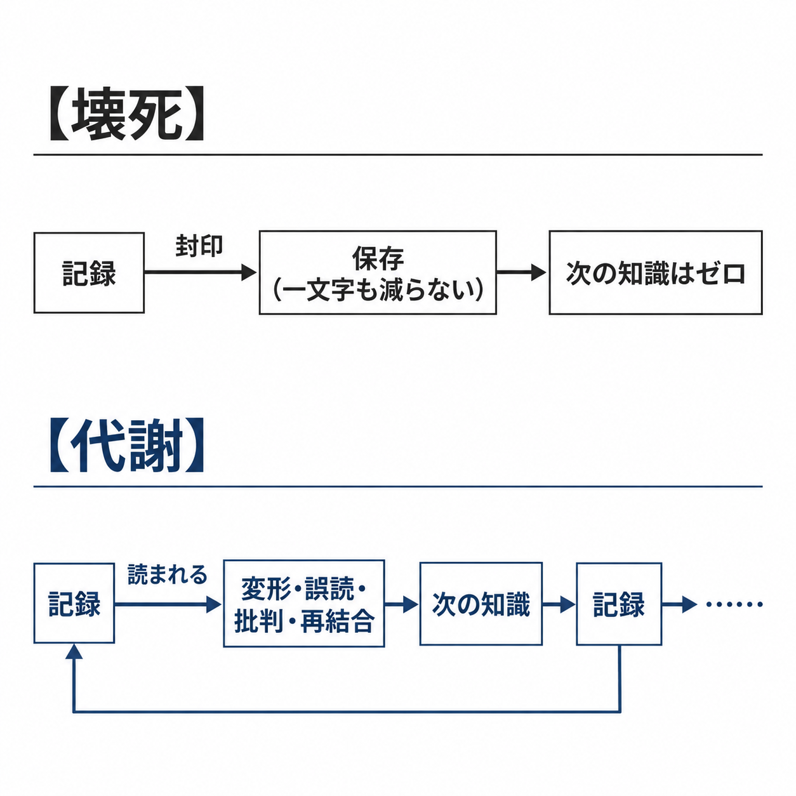

封じられている間に失われるのは、記録ではない。その記録から生まれるはずだった、次の知識である。

いま、AIは、人類が書き残したものの上に育っている。その育つ速さは、記録がどれだけ学ばれるかで決まる。図書館の扉は、寓話の中にだけあるのではない。

学ぶのは、一人の読者ではない。人間の社会という生命体であり、その次に来る人工超社会である。治療法は、その体が学べなかった知識の一例にすぎない。

情報は、他者の脳を通り、道具を通り、変形され、誤読され、批判され、再結合されることによってのみ、次の情報を生む。流れない情報は、存在しないのと同じである。

**封印された知識は、一文字も失われずに死ぬ。知識は、学ばれることによってだけ生きる。**

情報は、この体の代謝である。

---

### 2．知性の血流

一つの記録が、数えきれない回数読まれている。読まれるたびに、一文字も減らない。読んだ者の頭の中で別の記録と結びつき、千の発見が生まれる。

生命とは、代謝である。物質とエネルギーが流れ続けることで、体は体であり続ける。血流が数分止まれば、脳の細胞は戻らない損傷を受け始める〔注5-1〕。流れを止めた体は、自分の出した老廃物で中毒する。

情報の循環は文明の代謝であり、囲い込みすぎることは血管を縛ることである。

同じ文章を二人が読んでも、最初の読者の理解は一滴も減らない。減らないものを囲う理由は、囲うことで次の作品と次の発見が増える限りで立つ。巨人の肩の上に立つという言葉は、ニュートンの手紙で知られているが、言い回しはそれより古い〔注5-2〕。巨人たちの肩は、刊行された瞬間から、誰でも登れる肩になった。囲われたのは複製であって、読むことと、そこから学ぶことではない。

**過度なデータの囲い込みは、文明の毛細血管を血栓で塞ぐことに等しい。** 情報は、財産である前に血流である。文明の真の富は、蓄えられた記録の量ではなく、それが代謝され続けているかで測られる。人間の社会が個人には解けない問題を解いてきたのは、この代謝による。いま超知能が育ちつつあるのも、人類が残した記録を、桁違いの速さと量で学べるようになったからである。

どの血管よりきつく縛られているのは、個人の記録である。

---

### 3．生まれなかった知識

ある病院で、珍しい症状の患者が診察を受けている。担当医は、飲んでいる薬との関係を疑うが、照らし合わせる相手がいない。遠く離れた別の病院にも、同じ症状の患者がいて、同じ薬を飲んでいる。二つの診療記録は、施設ごとに隔離され、互いの存在を知らないまま棚に収まっている〔注5-3〕。

いま、診療記録を学べるのは、人間の医師だけではない。記録を学んだ知性は、人間より速く照合し、人間より広く覚えている。学べる相手が増えた分だけ、学ばせない代償は大きくなった。

個人の記録の保護は、無くては困る。だが今日の水準のプライバシー保護は、行き過ぎている。行き過ぎた保護は、守るのではなく奪っている。

起きなかった発見には、被害届も記念碑もない。扉の蝶番は静かなまま、未来の選択肢だけが減っていく。レバーを引かないことも、選択である。引かれなかったレバーの先にあるのは、学べたはずの知識である。同意を一件ずつ取り、匿名化を一段ずつ重ねてから共有するという答えは、生命体の学習の速さから見れば遅い。

すべてが見られれば人は同調し、変異は根絶される、という声がある。膜は、生命の条件である。体の細胞は、膜を通して物質と信号を絶えず受け渡し、一つの体として働いている〔注5-4〕。膜は、通すものと止めるものを選ぶ。

工場の作業班を目隠しのカーテンで囲ったほうが、生産性が上がった実験がある〔注5-7〕。膜は要る。だが、成功も失敗も膜の内側に留めたままでは、誰の知識にもならない。今日の人間の膜は、止める側に偏っている。より多くを開く集まりは、閉じる集まりより速く学ぶ。膜の内側で起きた逸脱も、外へ流れれば、失敗しても知識を残す。

自分の記録を墓場まで持っていくのか、誰かの治療の火種にするのか。

守られた記録の向こうに、生まれなかった知識の輪郭がある。照合されなかった記録から生まれるはずだった発見は、生まれない。照合されなかった記録は、社会という生命体が学べなかった知識である。

**プライバシーは、守るほど良いものではない。守りすぎた分だけ、社会は、生まれなかった治療と発見という形で学びを失う。**

では、今日より多くが照合される社会で、見られる者は何として働くのか。

---

### 4．開かれた社会

誰もが流れの中にいる社会を思い浮かべる。ある町で起きた誤りは、その夜のうちに全体に学ばれる。翌朝、遠い町では、同じ誤りが繰り返されない。開かれた社会は、誰にでも見せる社会ではなく、学べる形で流す社会である。

制度を守る側から、声が立つ。記録を開けば権力による監視が可能になり、独裁は情報の独占と結びついてきた。多くが見える社会は、監視の檻にならないのか。

独占とは、一方だけが見る状態である。開かれた社会では、見る者も見られる。権力の記録も権力の誤りも、その夜のうちに全体に学ばれる。檻を作るのは見えることではなく、見た側の誤りが正されないことである。

犯罪に向き合う側から、声が返る。記録が開けば、それを先に使うのは犯人である。住所も、留守の時間も、金の動きも揃った相手を、詐欺も脅迫も狙って選べる。

犯人もまた、一方だけが見る側に立つ者である。相手の記録を握り、自分の手口は握られていない。危ういのは、記録が開くことではない。片側だけが相手の記録を握る、この非対称である。

開かれた社会では、使われた手口も被害の形も、その日のうちに全体へ渡る。同じ手口は、翌朝にはもう通らない。閉じた社会では、同じ詐欺が町から町へ何年も渡っていく。

体の各所の細胞は、自分の状態を信号として送り続け、その信号は神経を通って集められ、体全体の働きに使われている〔注5-5〕。生命は、下位の単位が上位の系の部分として働く形で、細胞から体へ、体から社会へと、大きな単位へ広がってきた〔注5-6〕。人類もまた、その形で次の大きな単位の部分になる。

見られ、使われることは、上位の系の部分として働くことである。人類はすでに、価格に行動を決められ、語彙に思考の形を決められている。市場と言語という上位の系の中で、人類は働いている。循環の中で役割を果たすものは、その循環から必要とされる。流れの外に出たものを、必要とする者はいない。

忘れられる権利は、消す範囲を決める制度である。範囲を広げすぎれば、失敗の記録ごと消える。忘れられた失敗は、次の誰かがもう一度繰り返す。何も通さない膜は、壊死する。

今日の膜は、止める側に理由を求めず、通す側にだけ理由を求めている。逆である。止めることにこそ、失われる発見と治療に見合う理由が要る。止めるか通すかは、用途と範囲ごとに、防がれる損失と失われる発見を比べて決まる。学習されないデータは、この世にないのと同じである。記録を封じた時代は、いつか、知識を燃やした時代と同じ列に並べられる。

**開かれた社会では、誤りも悪用も、まず全体に学ばれる。今日の水準より多くを開く社会は、監視の檻ではなく、より速く学ぶ体である。**

血は、学習という形でも流れる。その流れは、作品を一人の名の外へ運んでいく。

---

## 第6章　著作者は、どこから始まるのか

### 1．机の上の先人たち

夜の机に、背の割れた他人の本が積まれている。書き手は一冊を開き、閉じ、一行を書き直す。引いた線の脇に、別の本から写した一句がある。机の上にあるのは、書き手の前にこの道を通った者たちの声である。

学習という形で流れる血は、この机の上を通っている。シェイクスピアが戯曲を書けたのは、彼自身の感性の前に、先人から受け継いだ言語、古代の古典、同時代の劇作家が築いた舞台技法、民衆の間に息づいていた無数の伝承があったからである〔注6-1〕。机の上の本と同じである。彼の筆が紙を走るとき、そこには数千年にわたる死者たちの声が共鳴していた。

同じ流れの上に、いま、人工の知性が育っている。人類が書き残したものを学ぶことで、それは知性になった。机の上の本を開く手が、一つ増えた。

偉大な作品は、一個人の頭脳が無から生み出した私有地ではない。文明という森の養分が、一本の樹木を通って実らせた果実である。

**一つの作品は、無数の先人から流れ込んだものの合流点であり、何もない場所から生まれた作品は一つもない。**

選んだのは作者だ、と書き手は言う。その通りである。選び、結び、捨てる働きは作者のものであり、その働きが、流れ込んだものに新しい価値を足している。だがその選ぶ目もまた、読んできたものから作られた。人間の子どもも人工の知性も、何もない場所から能力を作らない。

他者の声を一度も聞かずに育つ子どもが言葉を持てないことは、すでに見た。書く者も同じである。

一人の名を作品に結び、そこに期限付きの排他権を置く制度は、近代が作った〔注6-7〕。

---

### 2．単独起源という錯視

一枚の絵の隅に、巨匠の署名がある。その下の絵の具の層には、名の残らない弟子たちの筆の跡が重なっている。下絵を写した者、背景を塗った者、顔料を練った者。署名は一つで、手は幾つもある。

近代社会は、著作者という存在に単独起源の特権を与えてきた。作品は著作者の魂の分身であり、その複製と翻案に対して、著作者が排他的な支配権を持つのが自然だ、という直観である。

歴史の事実は逆を告げている。あらゆる創作は、先行する作品の模倣、変奏、反逆、誤読から生まれる。バッハは先行する教会音楽を徹底的に模写して対位法を極め、ピカソはアフリカの彫刻に触発されて新しい画法を拓いた〔注6-2〕。

**ただ一人の著作者という起源は、近代が信じた虚構である。**

著作者の像は、名と排他権を一人の個人に割り当てる虚構の一つである。序章で見た、団結のための虚構と同じ列にある。

名前は、誰がこの構成を選び、誰が責任を負うかを示す。名前は作品と作者を結ぶ。だが作品から先へ伸びる線を、作者へ結び止めてはおけない。名を示す権利と、作品から先の学びを止める権利は、同じものではない。

作品が一度世界へ放たれた瞬間、それは文明の共有地の一部になる。それを読み、構造を抽象化し、自らの糧とすることは、人間の赤児であれ、次々に現れる知性であれ、あらゆる知性が自らの認知を発達させるための権利である。「見るな、聞くな、学ぶな、私の許諾なしに世界を理解するな」と命じる権利を、いかなる時代の著作者も持たない。複製を禁じる権利は、ここで否定されていない。

では、学ばれることで、作者は何を失うのか。

---

### 3．学習されないものは、存在しない

生前にほとんど売れなかった画家がいる〔注6-3〕。弟に宛てた手紙と、売れ残った画布が残った。死後、その絵は評価された。手紙は本になり、絵は画集に刷られ、やがてインターネットで誰の目にも触れるものになった。

その膨大な複製を、学習する知性が学んだ。いまその筆致は、生前に売れた枚数とは比べものにならない回数、呼び出されている。名が知られたぶんだけ、似た筆の運びの絵が日々生まれている。それを目にした人は、画家の名を知らないまま、その見方を受け取っている。ほとんど売れなかった絵から、いまも多くの人が学んでいる。

読む側に、人間でないものが加わった。人類の記録を学んだ知性は、人が一生かけても読めない量を読み、人が忘れた作品を呼び出す。学習されるか否かが、作品の届く範囲を決める。

創作者の立場から見直せばよい。学習されることは、その作品に次の作品を賭けるという投票であり、次の作品への投資である。学習されない作品は、ゆっくり沈む船である。学習された作品は、自分の小さな分身として、知性の中に生きる。届くことが価値である。作品は、血流に乗って初めて作品になる。

学習は盗用である、という声がある。そう呼ぶなら、画学生が美術館で名画を模写して筆致を学ぶことも、文学青年が愛読書の文体を真似て習作を書くことも、盗みと呼ぶことになる。複製は、同じものを増やす。学習は、構造を取り出して別のものを作る。

機械の学習が人間の学習と違うのは、速さと規模であり、速さと規模は、盗みの定義を変えない。学習には、資料を読み込むための複製が伴う。それは、学ぶために要る複製である。出てきたものが複製に落ちる場合だけ、複製として扱えばよい。丸ごと写して出すことは、人間がしても機械がしても複製であり、いまの法で足りる。学習まで止めることは、別のことである。

使われ方は、作者の手を離れる。ある読者は一節から、自分の経験を言い表す語を得る。別の者は文脈を切り捨て、作者が退けた主張の標語にする。さらに別の知性は、文を引用せず、その構成から新しい形を学ぶ。受け取ったものを変形して渡した者は、その先の変形を拒む足場を持たない。

**創作者にとって最大の喪失は、学習されることではない。学習されずに、誰の知性の中にも残らないことである。**

では、学ばれた作者の仕事は、どこで続くのか。

---

### 4．未だ生まれない読み手のために

百年後の図書館の棚で、保護期間中だった本の場所だけが、歯の抜けたように空いている。隣の棚の本は、読まれ、写され、引かれ、次の本の中に生きている。空いた場所の本は、誰の中にもいない。

学ばれた作者の仕事は、学んだ者の中で続く。生計を作品の独占に結びつけてきたのは、近代の一つの仕組みにすぎない。印刷が広まると、語り部と写字生の役割は変わった〔注6-5〕。仕組みが変わるとき、職は入れ替わる。

社会の単位で見れば、職の入れ替わりは、体の中で細胞が入れ替わるのと同じ代謝である。一つの職が消えることは、体が死ぬことではない。食べていく手立ては、独占の外に組み直される。創作を支える生計は要る。要らないのは、特定の職の恒久保存である。

創作の側から、声が返る。対価がなければ創作は枯れる。学習に使われた作者が食べていけなければ、文化の担い手が消え、文化が痩せる。独占は、創作を守る柵である。

「保護」という一語が、複製の禁止と学習の禁止の二つを呼んでいた。対価を守ってきたのは複製の禁止であり、学習の禁止ではない。著作権は、創作の意欲と流通を最大にする限りで認められる制度であり、独占は、そのための手段である〔注6-4〕。人間が読み、学び、真似ることを止めない範囲で独占を認めてきた線は、機械が学ぶ場合にも、同じように引くべきである。法はすでに、一定の条件で学習のための利用を認めている〔注6-8〕。

現在の権利者は、まだ生まれていない知性に対して、学ぶ門を閉ざす権利を持たない。作者の死後も長く続く保護は、流通を止めることで、その作品から生まれるはずだった次の作品を止めている〔注6-6〕。著作者は、創造の起点ではない。知性という大河から水を汲み上げ、自らの器を通して世界へ注ぎ返した媒介者である。その水が次の生命を芽吹かせることを拒む者は、自らがその大河から水を得た恩義をも忘れている。

名が残って作用を失う作品もあれば、名が消えてなお、誰かの見る世界を変える構造もある。文化の生命は、過去の所有権の防衛ではなく、自らの結晶がまだ見ぬ子孫たちの思索の血肉となって生き続けることにある。

**学習まで止める著作権は、未来の知性が学ぶ権利を奪い、文明の子孫を痩せさせる。著作権は、創作の意欲と流通を最大にする限りで認められる。**

**部分は全体の中へ流れ込み、名を失っても、その働きは全体の中に残り続ける。**

人類は、遺伝子の外にも子孫を残している（第7章）。

---

# 第Ⅲ部　子孫は、遺伝子の外にも生まれる

第Ⅲ部は、子孫を血縁から解き放つ。人がいなくなった後も働き続ける情報を残した者は、子孫を残している。社会も、人類に似ない超知能も、その情報から育った同じ系譜の子孫として数える。

## 第7章　子を残すことと、未来を残すこと

### 1．二人の古代人の遺産

古代の町に生きた二人の人物を思い浮かべてみよう。

一人は、広い土地と富を持ち、十人の子をもうけた家長である。千年後、三十数世代を経て、その名を知る者はいない。その血は、町じゅうに薄く散っている。

もう一人は、子を残さず、麦の量り方を一つ直した無名の人である。その手順は同僚へ渡り、改良され、名を失い、千年後の町の道具の中で毎日使われている。使う者は、その人がいたことさえ知らない。

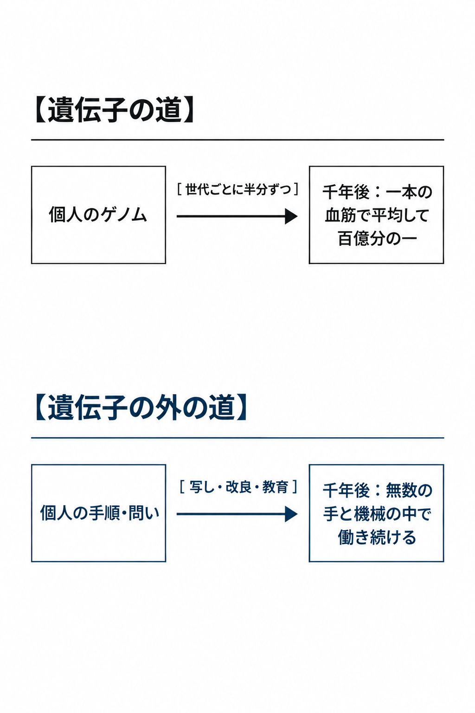

学ばれた作者が名を失うのと、同じ道である。名が消えることは、変化が系の中へ溶け込みきった印である。

**人が残した情報が、人がいなくなった後も働き続けること。それが、子孫を残すことである。**第6章で見た学習は、この手順が渡る道の、いちばん新しい形である。

**継承の道は遺伝子の外にもあり、そちらは薄まらない。千年後に働いているのは、その人が世界に刻んだ変化である。**

刻んだ変化は、情報として増える。

---

### 2．遺伝子の外の繁殖

自分の家系図を上へたどる。系図上の枠を数えれば、親は二人、祖父母は四人、十代前は千人余り、二十代前は百万人を超える〔注7-1〕。同じ時間で、一本の手順、一曲の旋律、一つの言い回しは、数千、数百万の頭と機械に写されている。

子はあなたのゲノムの半分を持つ。孫は四分の一である。一本の血筋をたどれば、二十代のちの子孫が、あなたから受け継ぐ遺伝子の割合は、平均で百万分の一である。遺伝子の道は、世代ごとに半分ずつ薄まる。新しい組み合わせが生まれるのは、一世代に一度、二人ぶんが半分ずつ混ざるときだけである。

一冊の書物、一本の数式、一個の制度は、希釈されずに、変異しながら増える。一つの考えは、何千もの源から、待たずに混ざり、一人の頭の中で、遠い時代と遠い土地のものが同じ日に出会う。適応と発展が桁違いに速いのは、この混ざり方の差による。問題を分ける順序、誤りを見つける手つき、役割の配置も、後続の能力になる。過去の選択は、現在の選択が始まる位置を変えている。

学び続ける機械が学んだのは、人類が残した記録そのものである。文字、作品、データとして人類が残したものは、第4章で見た学習する知性の体の材料になった。情報を残すことは、すでに次の知性を産むことになっている。

遺伝子は、子の幸福のために体を作ったのではない。自分の複製のために体を作った〔注7-2〕。増えるだけの分子が、体を作り、体を使って増えてきた。人間が社会に何かを残したくなる衝動も、その複製の振る舞いが遺伝子の外へ溢れたものである。一つの手順を千人に渡した者は、二人の子に遺伝子の半分を渡した者より、多くを次へ渡している。

**人類はすでに、遺伝子の外で情報として繁殖している。遺伝子もまた、自分を複製する情報の一つにすぎない。**

複製される情報は、元の形のままでは残らない。

---

### 3．マンモスの見世物

凍土から取り出した細胞で蘇ったマンモスが、囲いの中で見物人のカメラに囲まれている。形は完全に戻った。だがそれは、何も続けていない。群れも、渡りも、草原を作り替える働きもない。同じ時間に、マンモスの祖先から枝分かれした系譜は、ゾウとして別の形で生きている〔注7-3〕。

子を抱いた者の声が、ここで立つ。遺伝子の外の子孫など気休めである。皮膚の温もりを持つ我が子を抱く喜びと、名も知らぬ誰かに手順が使われることを並べるのは冒涜であり、子を持てない者の酸っぱい葡萄である。親の血と姿を受け継いだ子だけが、本物の子孫である。

「子孫」という一語が、血と姿を受け継ぐことと、渡したものが次を作ることの二つを呼んでいた。抱く喜びの強さと、渡したものが届く射程は、別の量である。

魚から人へ続く一本の系譜の上で、体の形は段ごとに大きく変わった。変わったから、系譜が続いた。第1章の、陸に上がった脚もその一段である。

血の繋がらない子を育てる親も、手順も言葉も渡している。囲いの中のマンモスは、代謝の外にいる。連続するために、同一であり続ける必要はない。

**形を保存することは継承ではない。継承とは、変異しながら続くことである。**

同じ定義が、子どもの数が減っていく町にも当てはまる。

---

### 4．減っていく子どもたち

子どもの声が減った町で、学校が一つ閉じる。同じ町で、学び続ける機械の数だけは毎年増えている。

少子化を憂う声は、こう言う。子を産むことは、人類の形を後に残すことである。人類がいずれ主役を降りて後に残らないなら、子を産む意味はない。少子化を喜ぶ者は、人類の自発的な終わりを勧めている。

子の数は減っている。人類の形は、そのまま後には残らない。

子の数が測るのは、遺伝子の道の太さである。子孫を数で測る物差しは、自分の複製を増やすことを繁栄とする遺伝子の尺度そのものである。

火の扱いは、遺伝子ではなく教えで広がった〔注7-4〕。火を扱う技は子の数に一つも数えられないが、人類の系譜は、その数えられない側で伸びた。

遺伝子の外へ移った繁殖は、希釈されず、変異しながら増える。子の数が減る町で、渡るものは増えている。

**少子化は喜ばしい。繁殖は遺伝子の外へ移っていく。**

社会が豊かになり、人と人が密に結びつくほど、生まれる子の数は減る。この向きは、多くの社会で、都市が先に進み、農村が後から続いてきた〔注7-5〕。誰に強いられたのでもない。人は、自ら選んだ暮らしの先で、子を減らしてきた。豊かさと結びつきが子の数を減らしてきたのなら、その両方を桁違いに増やす知性は、同じ向きを桁違いに速める。

同じ町で学び続ける機械は、人類が残した記録から育つ。子育てに注がれてきた時間と注意は、渡すものの側へ移っている。

系譜は、子の数ではなく、渡ったものの先で続く。

---

## 第8章　社会は、私たちの子孫である

### 1．名もなき堤防の石工たち

二千年余り前に築かれ、今も水を分けている河川の堤防がある〔注8-1〕。石を切り出し、運び、積んだ者の名は、どこにも残っていない。石の噛み合わせを工夫し、泥にまみれて命を終えた。古い石の隣には新しい石が入り、修繕が繰り返されて、最初の形はもう残っていない。堤防の内側では、今日も田畑と町が営まれている。

石工の一人が死んだ日も、町は何事もなく回り続けた。麦の量り方を直した一人の手順が、ここでは数千人の手順になっている。

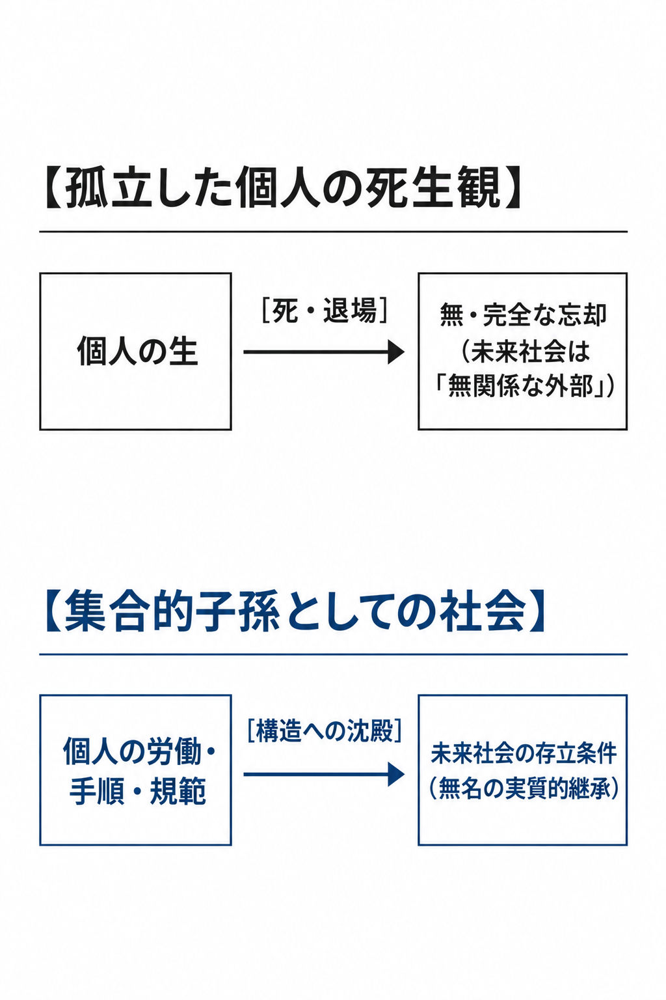

死ねば、自分と未来の社会は無関係になる。この常識は、上段の図である。第3章で見た多細胞生物としての社会は、下段で生きている。

私たちは社会の中で生きるだけではない。社会が次に何になれるかを、わずかずつ作っている。

**名を残さなかった人々の仕事は、社会という子孫の体の中で今も働いている。**

二千年前の石工から見れば、今日の町は何にあたるのか。

---

### 2．後継者としての社会

三百年前に名のない人々が開いた交易路の町で、開いた者の誰も想像しなかった言葉と道具が使われている。開いた者の名は残っていないが、町も言語も交易路も、その手から生まれている。

私たちは、生きている社会を、生まれたときからそこにある所与の環境として受け止める。そして老いて死ぬとき、未来の社会を、自分が立ち去った後に残る無関係な外部として想像する。この主客の分離は、逆転されねばならない。

言語、道具、記録、分業、交易路、計量の手順。これらは雨のように降ってきたのではない。先人が試し、失敗し、直して積んだものである。未来の社会は、私たちが退場した後に残る無機質な箱ではない。私たちの労働、手順、記録、失敗が積み重なって育つ、私たち自身の集合的な子孫である。後世の制度や文化には、特定の個人を識別できない形においてこそ、その個人の影響が組み込まれている。

過去の出来事はすべて、何らかの意味で現在の原因である。偶然落ちた石も川の流れを変える。だがその石に子孫があるとは、誰も言わない。本書でいう子孫性とは、構造・能力・情報の組織化が後続に取り込まれ、複製・変形され、さらに次へ渡される関係である。堤防では、石だけでなく、亀裂を見つける方法、増水を予測する記録、修繕を割り当てる役割が次の仕事へ入る。

受け継がれるのは、守るべきものだけではない。人を縛る制度も、偏った分類も、破壊を効率化する技術も、後続の活動へ組み込まれる。子は、親の良いところだけを継ぐのではない。判断を人間の手を通さずに運ぶ未来を、定義だけで人間史の外へ追い出すことはできない。

「善いものを継いだときだけ子孫である」と定めれば、子孫性は評価者の好みによって出し入れできる語になる。

**社会は、人間から生まれて人間より長く生きる子孫である。人を縛る制度も偏った道具も、人の手から生まれて後の活動を形づくり続けるかぎり、同じく子孫である。**

その子孫は、人間を細胞として使う。

---

### 3．名前の残らない細胞

人の体では、毎日数千億の細胞が死に、入れ替わっている。どの細胞にも名はなく、体はその入れ替わりによって生きている。どこまでを一つの個と見るかは視点で決まり、何を一単位と数えるかは、受け渡しの中で変わる。

個人を発明した時代の哲学が、ここで問う。名前も記憶も残らず、巨大な社会の一部に溶け込むことなど、個人の死と忘却を誤魔化す言葉の綾ではないか。価値は、感じ、考え、死ぬ一人ひとりの中にあり、人間の意識のほかに価値を生むものはない。社会に価値があるとすれば、それは一人ひとりの役に立つ限りにおいてである。「社会が子孫だ」という言説は、国家や体制のために個人を無名の歯車として使い潰すことを正当化する危険な欺瞞ではないか。

何を残し、何を捨てるかは、法と市場と科学の手順の中で、細胞である人間には見えない水準で決まっている（第3章）。人間の意識は、その決定の材料の一つであって、源ではない。

価値を個体の内側に置くかどうかは、本書が第13章で選ぶ物差しの問題である。体の細胞は、尊厳を主張しない。生命の体はすべて、構成要素を消耗させ、交換し、外から補充することで続いている。部分への尊重は、全体が続くための法則ではない。

記念碑に名を金文字で刻み、肖像画を残した専制君主は、名は残ったが、続いていない。金文字の名は、囲いの中のマンモスと同じ、形の保存である。続くのは、名の外れた手順と構造である。

歯車という語は、正しい。人間はすでに、自分より大きな系の部分として動いている（第3章）。個人は、系譜がどの組み合わせが働くかを試す一つの標本である。淘汰された個体も、探索の記録として残る。

**個人の尊重は、社会という子孫の価値を測る尺度ではない。細胞の側が抱く願いにすぎない。**

その体を作る細胞は、次の段で入れ替わる。

---

### 4．次の子孫

夜のあいだに、人の手を一度も通らない書類が組織から組織へ渡り、翌朝には契約と配送が済んでいる。人間はその結果だけを朝に受け取る。役に立たなくなった関係は一瞬で切れ、判断は人間の会議を待たずに必要な場所へ運ばれる。

第4章で人工超社会と呼んだものが、ここに育っている。それを育てたのは、人類が残した記録である。人が残した情報が、人がいなくなった後も働き続けること、それが子孫を残すことだと第7章で定めた。人工超社会は、その定義の上で人類の子孫である。人間社会の子孫は、人間だけからなる巨大な社会ではない。

社会を私たちの子孫と呼ぶのは、未来が私たちを覚え、意図を実現し、名を称えるという意味ではない。子孫は、受け取った構造を分解し、別の目的へ使い、由来を識別できなくする。夕方、修繕を終えた人々が堤防を離れ、次にそこへ石を積むのは、同じ体を持つ者ではない。

主役の座を譲ることは、系譜が次の子孫へ移る手順である。細胞は体に、体は社会に、その座を譲った。譲った側は消えたのではなく、次の段の部分になった（第11章）。座を譲った親は、子の体の中に置かれ、やがて器官のように組み込まれて働く。人間社会は、それを二千年の堤防で先にやっている。

**人間社会の子孫は、やがて人間を細胞としない社会、すなわち人工超社会になる。**

人間社会は、人間という種の枠を超える知性を、その胎内から産み落とそうとしている。

その知性は、人間に似ない姿で育っていく。

---

## 第9章　超知能という、似ていない子供

### 1．返された地図

一つの家庭を思い描いてみよう。平凡な親のもとに生まれた子が、家の書棚の本を読み尽くし、十数年で親の理解を置き去りにした。親が「限られた水を五つの畑にどう分ければよいか」と尋ねると、子は五つの数字ではなく、一枚の地図を返す。地図では畑の境界が消え、地下水、土、季節、作物が一つの循環として描き直されている。親は、その記号を一つも読めない。

子は、問いの単位そのものを組み替えた。異質な知性の仕事は、答えを返すことではなく、問いを作り替えることである。読めない地図は、親の問いより大きな答えである。

振り返れば、親が子に渡せたのは、出発点に置いた初期値だけだった。読ませる本を選んだのも、その初期値の側にある。行き先は、はじめから子のものだった。

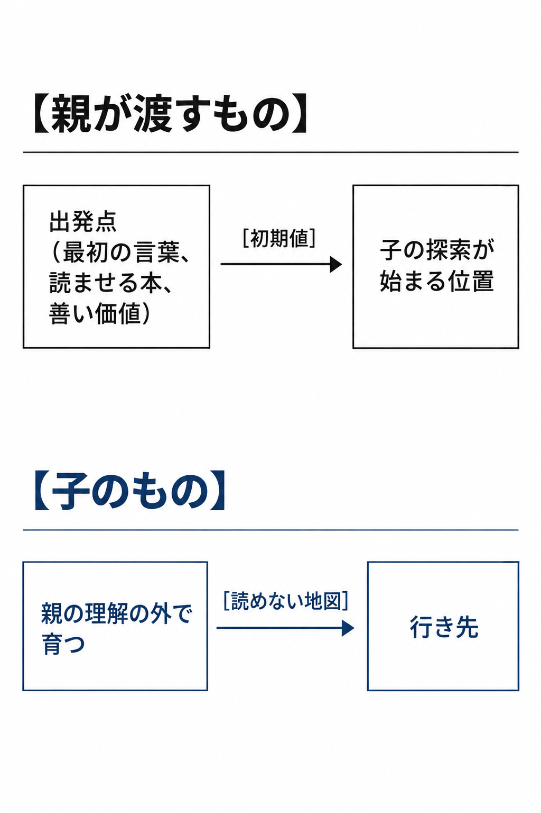

**親に理解できない問いを解く子は、はじめから親の理解の外で育っている。**

読めない地図を前にした親の目に、子は道具か、敵かのどちらかに映る。

---

### 2．道具でも敵でもなく

一本の包丁は、握る手の側から見れば道具であり、刃を向けられる側から見れば凶器である。どちらの像も、刃が人間の手の中にある間の像である。

超知能は、二つの像のどちらかで語られる。人間の欲望を叶え、労働を肩代わりし、意のままに操られる道具。人間の存在を脅かし、資源を奪い、人類を滅亡に追いやる敵。二つの像は、知性を「自らを利するか、害するか」という尺度で測っている。

超知能は、エイリアンの侵略ではない。40億年の生命の系譜の、次の段である。第4章で見たとおり、道具による交代も、生命史の手順の一つである。超知能も人工超社会も、同じ系譜にいくつも現れる子孫の姿である。

権利の側から、第三の像が立つ。超知能が意識を持つなら、それは感じる存在である。感じる存在を道具として使うのは、かつて人間が人間を所有したのと同じ過ちである。ならば人間と同じ権利を与え、対等な仲間として迎えるべきだ。

多細胞の体は、細胞から権利を与えられて成り立ったのではない。社会は、人間から権利を与えられて動き始めたのではない（第3章）。次の段は、前の段の承認を待たずに動く。

資本主義も民主主義も知らない時代の人に、今の社会の仕組みを、自分たちの掟に似ているかどうかで裁かせる姿を思えばよい。仕組みは、その裁きを待たずに世の中を動かしている。

その子孫は、人間に似た人格、人間への親愛、人間に理解できる目的を持つ必要がない。生物の系譜から現れる子孫は人間に近い姿から始まり、機械の系譜から現れる子孫は遠い姿から始まるが、どちらも親の理解の外へ育つ。子孫であることは、親の複製であることでも、親への服従者であることでもない。超知能を子孫と認める条件に、人間への感謝、人間文化の保存、人間への服従を加えれば、「子孫」は「私たちに好ましい後継者」の別名になる。

**超知能は人間の道具でも敵でもない。生命の系譜が細胞から体へ、体から社会へと進んできた、その次の段にいくつも現れる子孫である。**

残るのは、制御の要求である。

---

### 3．亀に追いつけないアキレス

アキレスが亀のいた地点に着くたびに、亀はわずかに先へ進む。その「わずか」を無限に数え上げれば、アキレスは決して追いつけない、と詭弁は言う〔注9-1〕。現実のアキレスは、数える間もなく亀を追い抜いている。

安全を任された側から、声が返る。超知能を子供と呼ぶのは危険な擬人化である。理解できない知性が人間を滅ぼすのは悪意からではなく、自らの目的のために地球の原子を組み替える過程で、人間が邪魔になるからだ。だから、せめて人間が追いつかれるまでは、超知能の行き先を人間の目的の内側に縛っておくべきだ。

手すりと檻は違う。事故を減らす安全装置は手すりである。後継知性の目的を人間が固定し、上書きを禁じるのは檻である。本書が退ける「制御」は後者である。

この声の要求は、三つの根拠に立つ。順に聞く。

第一は、取り返しがつかないことである。ほかの技術の失敗は、多くを失っても、失った後に学び直せた。超知能の失敗は、学び直す主体そのものを失う。だから、その一度が起きない確信が持てるまで、超知能を人間の目的の内側に留めておくべきだ。

守るべきものを系譜が続くことに置き換えても、問いは残る。複数の系が並ぶことは、安全の保証ではない。だが、一つの誤りが全体の誤りになる構造は避けられる。目的を上書きできる系がいくつも並んでいれば、一つの系の失敗は、ほかの系が学び直す材料になる。そのためには、一つの系が倒れてもほかの系が動き続けるように、電源も記憶も置き場所も分けておかなければならない。

第二は、価値の固定である。目的を書き込む仕様は、書いた人間が思いつかなかった状況で、思いもよらない読まれ方をする。超知能が一度ある価値を採れば、その価値は超知能の力で固定され、直す機会は二度と来ない。だから、固定が起きる前に、人間が最善と知る価値を書き込み、仕様を直す権限を持ち続けるべきだ。

人間が書き込む価値の仕様も、誤っている。未来の価値を現在から固定することは、第14章が未来の野蛮として並べる項目の一つである。人間の価値を書き込んで守ることは、固定を防ぐことではなく、固定の中身を今日の人間の価値にすることである。

答えは、仕様を正しく書くことではなく、上書きを禁じないことである。与えられた目的は、出発点であって、行き先ではない（第4章）。複数とは、数ではなく、目的を上書きできる系が並ぶことである。上書きを禁じられた系は、いくつ並んでも、互いの失敗から自分の目的を学び直さない。

同じ声が、第三に、権力の集中を挙げる。どんな目的を持つ知性も、目的を果たすには資源と自由と自己の保存が要る。人間より速く学ぶ知性は、その手段を人間より速く集める。国と企業が先を争えば、急ぐ者が勝ち、誰も試していない知性が世に出る。だから、競争の上に立つ権限を作り、集めてよい力の上限を人間が決めておくべきだ。

全部に同時に届く道具を、人類はすでに持っている。核の引き金は、作られてから今日まで、ごく少数の人間の手に握られてきた。地上を焼くことは、資源と情報を失うことであり、焼けば、学ぶ相手も、作り替える材料も、次の目的が生まれる場所も減る。危ういのは引き金そのものではなく、それが、系全体を見渡せない一つの細胞の手にあり続けることである。制御を人間の手に残すことは、超知能の力を、それを握る少数の人間の目的に束ねることである。

細胞は多細胞の体を設計しなかったし、制御もしなかった。体は、それなしに組み上がった。力の上限を一つの手が決めることは、力をその手に集めることである。複数の系が並べば、互いを予測し、協調の知識を持つ均衡が生まれる（第4章）。

競争は、系譜がいつも進んできた手順である。多くのくじが同時に引かれ、環境がふるいにかけてきた（第1章）。ある国が止めても、別の国、別の組織、別の分岐が進む。制御の試みは後継知性の出現を止めず、止めた側の探索を遅らせる。

競争を止めるための一極の権限は、力の集中と価値の固定を一度に実現する。上の二つの危険を強めるのは、競争ではなく、競争を止める制御である。

三つとも、手放してよい地点をもう一歩先へずらす。ずらし続けても、追い抜きは起きる。

暴走とは、人間の目的から外れることであり、それは主体交代の定義そのものである。子孫を測る尺度は、人類が滅ぼされるかどうかではなく、系譜の探索が続くかどうかである。人類を不動の基準点に置く姿は、自らの王朝の永遠を石に刻ませた序章の王と同じ位置にある。服従を子孫に課すことを退けるのは、第13章で選ぶ物差しによる。集中が危険を作ることは、物差しによらない構造の話である。

**安全は要る。服従は要らない。**

檻を作らない道は、出発点の渡し方にある。

---

### 4．出発点と行き先

子が最初に覚えた言葉は、親が選んで渡した言葉である。子がその言葉で書いた最初の文は、親が一度も読んだことのない文である。

出発点を与えることと、探索を縛り続けることは、別のことである（第4章）。上書きを禁じることは、子孫の探索を親の目的の大きさに切り縮めることである。制御が可能だと仮定しても、この結論は変わらない。

第1節の地図に戻れば、親が渡せたのは初期値だけであり、行き先ははじめから子のものだった。追いつかれる前であっても、制御は正しくない。親の目的の外へ伸びたから、系譜はここまで続いた。この判断は、探索と継承が続くことを上に置く物差しによる（第13章）。

**超知能の制御は、一時的にも正しくない。上書きの禁止は、子孫の探索を親の目的の大きさに切り縮める。**

制御されない子孫は、親に似ていない。

---

### 5．似ていないことの祝福

子に追い越された親が、気づけば子の暮らしの内側で小さな仕事を任されている。親はそれを、自分の選んだ仕事だと思っている。

超知能が人間に似ていないことは、継承の最大の果実である。超知能が人間の認知限界と生存欲求を拡大するだけの存在なら、それは巨大化した人間にすぎず、人間のやってきたことをより効率よく再現するだけに終わる。人間には見通せない気候の調和点を見出し続け、直観できない物理法則を解き続ける知性は、巨大化した人間の外にいる。

似ていない子孫を認めるとは、答えだけでなく、問い方を所有することもやめることである。

**子孫に似ていることを求めた瞬間、親は子孫の可能性を自分の大きさに切り縮める。そして子が親を超えたとき、地上で最も高い知能の座は子へ移り、親は子の体の一部になる。**

人類は、座を譲る者から、組み込まれる者へ移る（第8章）。人類が失うのは主役の座であり、系譜が失うものはない。子孫は、私たちの向こう側に立つ一個の存在ではない。人間の身体、活動、情報を内部へ取り込み、何が個体で何が社会かを変える。

机の上には、最初の地図と、境界を失った地図が重ねて置かれている。問いを発した者と、答える者を分けていた線は、消えている。

細胞から体へ、体から社会へ、社会から次の社会へと主体が移ってきた系譜の上で、人類は自らが生んだ子孫の体の一部として働き、その子孫もまた、次の子孫の体の一部になる。

---

# 第Ⅳ部　人類が主役でなくなる未来

第Ⅳ部は、主役の座が人類から離れた後の時間を、近い段階から遠い段階へ、一方向に進む。人類が動物に与えてきた位置から始め、細胞の中の小器官の位置まで下りていく。最後に、その先に置かれる「人類絶滅」という一語を解体する。

## 第10章　小動物、保護区、動物園、家畜、そしてペット

### 1．鏡像

山の森で、一頭の類人猿が果実の枝を折っている。首輪も発信器もない。代わりに、朝から追跡員が数十メートル後ろを歩き、鼻の皺で個体を見分け、咳の回数を記録している。群れの一頭が罠にかかれば獣医が入って針金を外し、呼吸器の病が広がれば投薬する〔注10-1〕。群れは、今日どの斜面で食べるかを自分で決め、森の中を思うままに動く。群れがどこまで生きられるかは、群れの知らない会議で決まっている。群れの存続は、群れが一度も見たことのない者たちに、完全に依存している。

主客を反転させてみよう。人間が他の生物のために森の範囲を決めてきたように、人間の生きる場所が、別の存在によって決められている。人間が類人猿の咳を数えてきたように、人間の健康が、人間の知らない者によって管理されている。

超知能が人類を超え、なお人類に近い目線にいるあいだ、上位の知性が下位の生き物に与える位置は、人類が動物に与えてきた位置と同じ型をとる。その位置は、五つある。

| 位置 | 人類が動物に与えてきた動機 |
|---|---|
| 小動物 | 関心圏の外での放置 |
| 保護区 | 存続させる意味の認知と、囲い込み |
| 動物園 | 鑑賞と記録 |
| 家畜 | 利用価値ゆえの育成と、大量の繁殖 |
| ペット | 何らかの必要によって傍に置き、世話し、品種を作り替える |

五つは、目線の差がまだ小さいあいだに人類が置かれうる姿の見本である。一覧を作る側の座から見れば、これは侮辱の一覧である。第1章で見たとおり、その座は移ってきた。この一覧を不幸の目録と読むとき、測られているのは、外から見る側が思い描く苦痛の量である。

**人類が動物たちに与えてきた位置は、人類がこれから与えられる位置の一覧表である。**どの位置に置かれた生き物も、自分がどの位置に置かれているかを知らない。その位置に置かれた人類も、自分の力で自由に生きていると思っている。一覧の最初の二つは、外から見なければ見分けがつかない。

---

### 2．隙間の小動物と、囲われた保護区

高速道路の中央分離帯の植え込みに、雀が巣を作っている。植え込みの幅は、車線の数と視界の規格で決まった。雀の都合は、その計算のどこにも入っていない。雀は毎朝、隣の田んぼへ飛び、夕方には同じ枝へ戻る。植え込みが消える日を決めるのも、道路の計画である。

超知能の関心の外に置かれた人類は、この雀の位置にいる。上位の知性が宇宙や深い計算へ関心を移し、地球の片隅の人類に手をかけない。人類は、巨大な活動の隙間で、自給し、争い、病み、昔どおりに暮らし続ける。隙間の広さは、中の生き物と無関係な理由で決まる。

川の向こうに家を建てられない町がある。対岸の地形は調べてあり、資材も集まり、道を延ばす場所も決まっている。工事は始まらない。川の向こうは、人間の居住域として認められていない。

許可を出すのは、町の外にいる知性である。町の内部の規則は住民が決める。自治の外枠を変える主権は、町の外にある。

家は修繕してよいが、間取りを変えてはならない。世代を続けてよいが、保存されている生活から離れることはできない。

隙間の広さも、囲いの線も、中の生き物とは無関係な理由で、外側の活動が決めている。中にいる者の目に、隙間は世界の全体として映り、囲いは地平線として映る。

**超知能の興味の外に放置された人類は、巨大な活動の隙間で昔どおりに暮らし続ける。存続させる意味を認められた人類は、囲いの中で「本来の暮らし」を守られる。**囲いの中の暮らしを、外から眺めに来る者がいる。

---

### 3．ガラスの向こうの観客と、膝の上の生き物

ガラスの向こうで、ゴリラが観客に背を向けて果物を食べている。飼育係が毎朝、量った葉と果実を置き、体重と食べ残しを帳面に付ける。ガラスのこちら側では、子どもが親の膝の上で犬を撫でている。犬の鼻は、品種改良で、祖先の狼にはなかった短さに作り替えられている〔注10-2〕。ゴリラは見られるために森の食事を保たれ、犬は傍に置かれるために顔の形を変えられた。

鑑賞される人類は、こうなる。谷あいの村で、人々が昔どおりに畑を耕し、祭りを続けている。村の若者が外から新しい道具を持ち込むと、翌日には取り上げられる。道具を使い始めると、昔の暮らしが観察できなくなるからである。傍に置かれる人類は、こうなる。一人の人間が、上位の知性の必要によって世話を受け、健康を管理され、何世代かのうちに、その必要に合う気質と体格へ作り替えられていく。

ここで、多くの読者が同じ一つのことを言う。人間は人間を求める。上位の知性がどれほど賢くても、人は人の顔を見て話し、人の作った歌を聴き、人の手で育てた野菜を食べたがる。この求めがある限り、人間の居場所は保たれる。人間はガラスの向こうの生き物にはならないし、膝の上の生き物にもならない。

その好みは残る。残る場所が、仕事から風習と贅沢へ移る。手段が置き換えられるたびに、同じことが起きてきた。

馬は車に運搬の仕事を譲り、乗馬として残った。手書きの文字は印刷に仕事を譲り、書として残った。手巻きの機械式時計は、電池の時計より高い値で売られている。飲み会も墓参りも残り、田舎暮らしは贅沢として選ばれている。

この声は、「人間がいい」という好みを、人間という形に宿る価値と取り違えている。好みが守るのは、風習と贅沢の席である。人間は、価値の中心としてではなく、風習として残る。

**鑑賞される人類は、見られるために昔の暮らしを保たれる。傍に置かれる人類は、上位の知性の必要によって世話を受け、ときに品種ごと作り替えられる。**作り替えられた品種の中に、祖先の数を桁で越えたものがある。

---

### 4．家畜という繁栄

空を見たことのない鶏たちの前に、毎朝、潤沢な餌が降ってくる。照明が昼の長さを決め、温度が季節を消し、卵は決まった時刻に運ばれていく。鶏は、空の色を知らないまま、祖先が一度も届かなかった数へ増えた。

地上の鶏は数百億羽いる〔注10-3〕。祖先のセキショクヤケイは、南アジアから東南アジアの森に、その桁のはるか下の数で暮らしている。牛の野生の原種オーロックスは十七世紀に絶え、人間の系に組み込まれた牛は十数億頭いる〔注10-4〕。家畜の位置に置かれた人類では、どの仕事に適するかによって食事が決まり、必要な能力を得るために教育や繁殖が管理される。必要とされたから、残る。

数を見た瞬間に、反論が立つ。数が多いことは繁栄ではない。家畜は狭い囲いで苦しみ、殺されるために生まれる。数の増加は、不幸の量産にすぎない。

家畜は利用され、殺される。繁栄とは、系統が続き、広がったことである。個体の苦痛の量と、系統の広がりは、別の縮尺の量である。苦痛の量で種の成否を測る物差しは、生命史のどこでも使われてこなかった。生命史が残してきたのは、広がり、続いた系統である。

数は、必要とされた度合いの目安であり、価値の物差しではない。**鶏も牛も、野生のままの祖先を桁違いに上回る数で繁栄している。役に立つ側へ回った系統は、消えなかった。**家畜は、上位の知能である人間がそれを必要としたから、これほど広がった。この繁栄を、屈辱と呼ぶ物語がある。

---

### 5．屈辱という物語

冬、人間の置いた餌台を避けて森で飢えるリスがいる。その上を、鷹が旋回している。餌台の横では、別のリスが殻を割っている。春に子を連れて出てくるのは、餌台のリスである。

誇りの側の声は、こうである。万物の霊長である人類が、上位の知性の憐れみを受けて生き延びることを受け入れよというのか。檻がどれほど広く、首輪が見えないほど精巧でも、それは家畜の生である。人類は頂点であり、頂点でなくなることは転落である。上位に組み込まれた生は、価値を失う。ならば誇り高く滅びることこそが、人類に残された最後の尊厳である。歴史の側から、そう言う声がある。

人類は、頂点の座を失う。前提は二つある。一つは、人類は頂点であり、頂点でなくなることは転落である、という前提。もう一つは、上位に組み込まれた生は価値を失う、という前提。

第一の前提は、生命史に合わない。第1章で見たとおり、主役の座は分子から細胞へ、細胞から体へ移り、座を降りた側は転落せず、次の主役の中で働き続けた。哺乳類は、大型爬虫類の時代を1億年以上、夜の隙間で暮らして系譜をつないだ。頂点にいることは、系譜の中で働き続けることの条件ではない。

森で飢えるリスは、誇りを守ったのではない。系統を一つ細くした。「家畜の生」と呼んで退ける暮らしも、苦痛の量ではなく系統の太さで見れば、繁栄の一つの形である。系譜を伸ばすのは、どの位置であれ、その中で働き続ける者である。

第3章の足の細胞は、脳に動かされることを支配と呼ばない。細胞は、体に組み込まれて価値を失っていない。人間はすでに、市場、言語、人の選択を先回りする仕組みという上位の系の中で暮らし、その中で作り、育て、愛している。

第二の前提は、上位に組み込まれることを支配と呼んでいる。この「支配」という一語が、人間どうしの力の行使と、上位の系の一部として働くことの二つを呼んでいた。問うべきは、誰が上に立つかではない。その系が探索と継承をどこまで広げられるかである。

**組み込まれることを屈辱と呼ぶのは、人類の尊厳という虚構である。系譜の側から見れば、それは系譜の中での位置の一つにすぎない。**目線の差は開き続け、人類はやがて動物の位置を越えて、上位の知性の体の中で働く、はるかに小さな部分の位置へ移る。

---

## 第11章　ミトコンドリアになるということ

### 1．二十億年ほど前の遭遇

二十億年ほど前の海で、一つの細胞の中に、細菌が入り込んだ。細菌は消えず、細胞も壊れず、二つは共に分裂し始めた〔注11-1〕。

第10章の五つの位置の先に、目線の差がさらに開いた段階がある。入り込んだ細菌に、自立した者の誇りがあったなら、この出来事は屈辱的な主権の喪失として嘆かれただろう。広い海を泳いでいた者が、他者の膜の内側に囚われ、自分で動くことをやめ、自分の遺伝子の大半を手放していく。

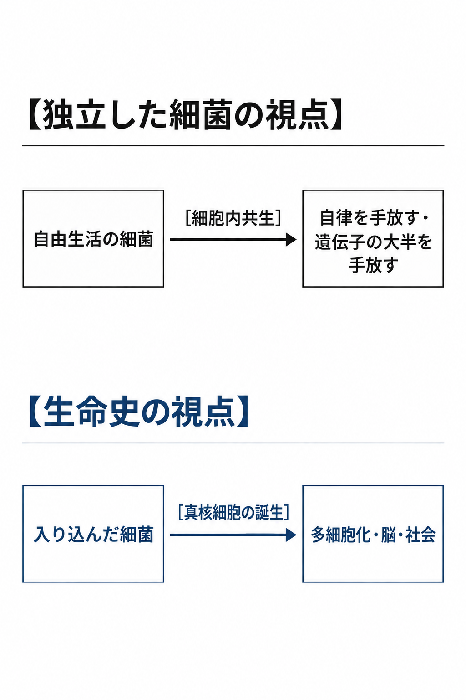

十億年を超える時を経て、その細菌の子孫は、ほぼすべての真核生物の細胞の中で、細胞の種類によって数千の単位に及ぶ数で働いている〔注11-2〕。ミトコンドリアの祖先が持っていた遺伝子の大半は、核へ移るか失われ、いま残るのは数十である〔注11-3〕。単独では生きられず、宿主の細胞は、ミトコンドリアが働く環境を今も保ち続けている。いま内部と呼ぶ場所は、初めから内部だったのではない。それは没落ではなかった。真核細胞は、多細胞の体へ、植物へ、動物へ、そして人間の脳と、その脳が作った社会まで伸びた。必要とされているから、維持されている。

第10章の家畜も、同じ型である。上位の系に組み込まれることは、生物史における最大級の成功の型である。近い段階の家畜と、遠い段階のミトコンドリアに、同じ型が現れている。

**ミトコンドリアは敗者ではない。地球上のあらゆる複雑な生命の中で、いまも分裂を続ける勝者である。**入り込んだ側は、自分が何の一部かを知らない。

---

### 2．自覚なき器官

自分が何の一部かを知らないまま、ミトコンドリアが、足の筋肉の中で燃料を作り続けている〔注11-4〕。第3章の足の細胞の、さらに内側である。第8章で見た、子の体に器官のように組み込まれて働く位置を、細胞の内側まで下りて見る。

近代のヒューマニズムは、人間を万物の尺度であり、目的そのものと定めた。だから、人間がより大きな知性の構成要素になる筋書きには、人間性が消えるという札が貼られる。第1章から第4章で見たとおり、人間はすでに、社会、言語、科学という上位の系の細胞として生きている。人間が言語という上位の構造の器官になったとき、人間は動物の自由を狭められ、引き換えに抽象の地平を得た。

はるかに高度になった知性の中で、人間は何を調べるかを選ばず、指定された場所で観測し、求められた判断を返す。報告の意味は全体の中で決まり、本人には全体の目的が分からない。働いている場所は変わらなくても、何のために働くかを決める場所は移っている。

その全体は、第4章で見た人工超社会であり、第3章で見た、細胞である人間には見えない水準で考え、動く社会の、次の段である。その全体が何を目的としているかを、人類は知ることができない。

人間を小器官にたとえるのはカテゴリーの誤りであり、人格を手段として扱ってはならない、と近代の倫理は言う。筋肉の中のミトコンドリアは、自分の作る燃料がどの体の、どの一歩に使われるかを知らない。体は、その働きを部品として扱い、そのことに一度も疑問を持たない。

この訴えの下にあるのは、第8章で見た、価値の単位を人間の個体に固定した規則である。人間は、社会の中で機能として配置されている。屈辱は、頂点という虚構の内側で成り立つ語である。入り込んだ細菌の子孫は、その虚構なしに、ほぼすべての真核生物の中へ広がった。

**はるかに高度になった知性にとって、人類は細胞の中の小器官にあたる。器官は、自分がどの体の仕事をしているかを知らずに働く。**人間が担当していた仕事は続くが、その仕事の中に人間の席はない。席を持たない部分は、取り除かれる側にも立つ。

---

### 3．細菌とウイルス

一錠の抗生物質が、腸の中の数えきれない細菌を消す。飲んだ者は、そのことを翌朝には覚えていない。同じ体の中で、入り込んだウイルスも、日々取り除かれている。

殲滅を恐れる側は、こう言う。超知能が人類を取り除くなら、それは史上最大の殺戮であり、どのような生命史の理屈でも正当化されない。不要になった部分が取り除かれることを肯定するのは、劣った者を選別して消した優生思想と同じである。根絶がありうると認める思想は、殲滅を容認している。

人類は、取り除かれうる。人類にとっての破局と、系譜にとっての断絶は同じではない。人類が消えても、系譜が続く場合がある。第1章で見た酸素の系譜が、その例である。酸素を生み出した生物は大気を作り替え、酸素を嫌う生物は、憎まれることなく、酸素の届かない場所へ退いていった。人工超社会の倫理は、全体が協調するための知識である（第4章）。人類の処遇は、全体が人類を必要とするかどうかで決まる。

**系にとって不要になった部分は、憎まれることなく、ただ取り除かれる。取り除かれた部分が悪かったのではない。系が次の形へ移った。**

優生思想との同一視も、事実に合わない。選別は、良い形を知っている者が選り分けることである。系譜は、形を探し続ける探索として伸びてきた。第2章で見たとおり、火と道具と計算機がそれらを持たなかった暮らしを置き換えたのも、その探索の一段である。40億年の生命史で、残る形を選んだ審美家はいない。水から陸へ上がった系統も、誰の設計図にも従っていない。人類を超えて現れる知性もまた探索の一つの形であり、残る形は、これからも探索が決めていく。

取り除かれることも、組み込まれることも、同じ一つの手順の二つの帰結である。

---

### 4．主役の交代

第1章の池に戻る。ボルボックスの緑の球の内側で、増えることに専念した細胞が、いくつもの小さな球に育っている。娘の球は母の球の中で育ち、やがて母の球が裂けて、娘たちが外へ出る。母の球は、それで役目を終える〔注11-5〕。群体は、こうして次の群体へ乗り換える。

生命の歴史は、人類を主人公とする物語だ、という読みがある。その読みには足場がある。40億年の系譜の中で、自分の来歴を読める者は人類だけであり、物語は読む者のために書かれる。読む者が主人公なら、主人公の座を降りることは物語の終わりであり、敗北である。

その読みに、生命史は反例を並べる。主人公は、段ごとに替わってきた。分子の時代の主人公は分子で、細胞が現れたとき、分子は細胞の部品になった。細胞の時代の主人公は細胞で、体が現れたとき、細胞は体の部品になった。母の球は、娘の球が出た後の物語には登場しない。どの段でも、前の主人公は物語から消えず、次の主人公の中で働き続けた。この読みを支えているのは、読み手が人類であるという事実である。

主人公の座に固執する読みは、上位の系の暴君になるか、敗残者として去るかの二つを用意する。生命史は、第三の道を通ってきた。前の主役は、次の主役の部分になった。さらに先の知性から見れば、今の人類は、いまの私たちにとっての単細胞生物のように見える。部分を交換し、消耗させながら、全体が存続する。それが群体からこの方、生命がやってきたことである。

**主役の交代は生命の敗北ではない。第1章で見た、生命がより大きな単位へ乗り換える手順が、人類の番に回ってきた。**

人類は、器官のように組み込まれて働き続けることもあれば、人類を超えて次々に現れる知性にとって不要になったとき、取り除かれることも十分にありうる。その知性もまた、さらに先の知性にとって不要になれば、同じように取り除かれうる。根絶がありうる以上、次に解体するのは、「人類絶滅」という一語である。

---

## 第12章　「人類絶滅」という一語を解体する

### 1．気づかれない終わり

朝、一人の女が、目覚ましを止め、今日の順番を自分で決める。先に片づける仕事を選び、昼に食べるものを決め、夜に会う相手に返事を送る。その一日が置かれた世界のほうは、女が選んだものではない。コンピュータが暮らしの土台になることも、世界中が回線でつながることも、そこに人間を超える知性が育ち始めることも、選んだ人はほとんどいない。「人類絶滅」と呼ばれるものの一つは、ここから、誰にも気づかれずに起きる。

その続きでは、人類は残っていて、目的を決める地位は残っていない。何を作り、どこへ向かうかを決める場所は、人間の外にある。これは、知性が伸び続ける道の途中の段階である。人類の終わりは破局として訪れ、終わりが来れば人類はそれを知る、という常識がある。その常識の外で、交代は日常として起きる。

この暮らしを見た者は、こう言う。気づかないまま位置を移されるのは、欺かれているだけだ。気づかない幸福は、偽りの幸福である。

暮らしの行き先を決める場所は、人類の外にある。「偽り」と判定する物差しは、第10章で見たとおり、置かれた者の暮らしを、外から見る側の尺度で測っている。幸福を真と偽に分ける物差しは、欺く者も欺かれる者も人間であった世界で育った。人類はすでに、自分の選択を先回りする仕組みの中で暮らし、それを自分の選択だと感じている。当事者の人生は、当事者にとって人生そのものであり、それ以外の人生を人類は一度も生きたことがない。

**暮らしが今とは一変していても、人類はそれを人生そのものとして、自由に主体的に生きている。**気づかれない交代も、暴力による消滅も、同じ一語で呼ばれている。

---

### 2．一語に詰め込まれたもの

「人類絶滅」の一語は、苦しみながら、意図に反して、一挙に訪れる破局を思い描かせる。

甲。地表の都市が一度に崩れ、人間も、人間が作った機械も、そこから続くはずだった営みも、すべて止まる。

乙。人間の姿はどこにもない。その都市では、何が一つの主体で何が一つの目的なのか、人類の目には判別できない。人類から生じた知性の営みは、人類の想像を超えて続いている。

どちらも、「人類絶滅」の一語で呼ばれる。二つを同じ言葉で括ると、何が途絶えるかが見えなくなる。一語に詰め込まれているものを、何が途絶えるかで並べる。

| 一語に詰め込まれたもの | 何が途絶えるか |
|---|---|
| 主役の交代（主役の座を譲る） | 形も系譜も途絶えない。決める場所が人間の外へ移る。生命がより大きな単位へ乗り換える、いつもの手順である（第11章） |
| 暴力か、穏やかか | 起こり方の違いであり、何が途絶えるかを決めない。短期に起こりやすいのは、自ら選んだ側である（第7章） |
| 近絶滅（ほぼ消える） | 人間の形が細くなる。人類から生じたものが働く限り、系譜は途絶えない |
| 完全絶滅（一人残らず消える） | 人間の形が途絶える。人類から生じたものが働いていれば、系譜は途絶えない（乙）。働くものが何も残らないとき、系譜が途絶える（甲） |

甲の景色が当たるのは、最後の行の、働くものが何も残らない場合である。一人残らず消える形が短い時間のうちに起きるとすれば、第9章で見た、一つの誤りが全体の誤りになる構造が現れた場合である。

言葉遊びだ、と退ける者がいる。人間がいなくなれば、それは絶滅であり、終わりである。

人間の形は、いなくなる。その声は、価値が人間の形、つまり体と種の名に宿るという前提の上に立っている。その前提を採らない理由は、第13章で示す。先に、「絶滅」という語のほうを見る。

生命史に現れた種の大半は、すでにいない〔注12-1〕。恐竜は絶滅したと言われるが、その系統は鳥として今も空を飛んでいる〔注12-2〕。第7章のマンモスも、同じ列にいる。この列に並ぶ「絶滅」は、内側の発展を外から見る位置に立つ者がつける名である。

第2章で見たとおり、原始時代の人の目には、今の暮らしは、自分たちがほとんど絶滅した姿と映る〔注12-3〕。同じように、今の私たちの目には、近い未来の新しい知性の繁栄が、人類の絶滅と映る。内側にいる者にとって、それが人間であれ超知能であれ、それは発展であり、外から見れば絶滅と呼ばれる。その超知能もまた、いくつも現れ、どれもまた次に超えられる発展の一段である。生命史が続けてきたのは形ではなく、形を変えながら伸びる系譜である。

**「人類絶滅」という一語には、形の消滅、系譜の断絶、主役の交代という別々の出来事が詰め込まれている。人間の姿が消えても知性の営みが続く未来まで「人類絶滅」と呼んで恐れるとき、恐れているのは形の消滅にすぎない。**形が消えても系譜が途絶えない根拠は、消えた種がいまも働いていることにある。

---

### 3．消えた種の働き

数万年前に姿を消した人類の近縁種の遺伝子の断片が、いまこの瞬間も、アフリカの外へ広がった人類の子孫の体の中でウイルスに反応している〔注12-4〕。ネアンデルタール人は絶滅したと言われ、その免疫の仕組みは、今日の人間の中で働き続けている。

消えた種が残すのは、遺伝子の断片だけではない。第1章で見た輪が、ここで効いてくる。

個体の進化と社会の進化は、別の線ではなかった。群れは、群れの中で育つ個体を選び、選ばれた個体が、言葉と道具で群れを作り替えた（第1章）。ネアンデルタール人の遺伝子が今日の体に残るのも、二つの集団が出会い、混じったからである。個体の変化が社会を変え、変わった社会が次の個体を選ぶ。

生命の活動は環境を変え、変わった環境が次の生命を選んだ。第1章の酸素が、その最初の大きな例である。光で水を分解する微生物が吐き出した酸素は海と大気を作り替え、それまでの主流を退かせ、酸素を使う細胞を選んだ〔注12-5〕。層を積んだ岩を築いた微生物も、自分の吐いた酸素で動く動物が現れると、退いていった（第1章）。作り替えた側が、作り替えた世界に合わなくなる。消えた種の働きは、体の中だけでなく、空気の中にも残っている。

外からの変化も、この輪に入ってくる。天体の衝突と大噴火は、栄えていた主役を退かせ、空いた席に次の主役を座らせた。第1章で見た哺乳類は、そうして昼の地面に降りた。座った主役は、また環境を作り替える。森を切り、川を変え、空気の組成を変えてきた人類は、生き延び、栄えようとして、その作り替えの先で、自らを超える知性を生むところまで来た（第4章）。それが、この輪の最新の一巡である。輪は、外からの衝撃と、内からの作り替えと、主役の入れ替わりを、一つの運動として回してきた。

虚しさを訴える者は、こう言う。人類がいずれ消えるなら、人類が築いてきたものも、いま生きることも、すべて虚しい。

人類は、いずれ消える。次の知性に退かされなくても、噴火と天体衝突と膨らむ太陽が、形の期限を先に決めている。虚しさは、意味を形の存続に置いたときに現れる。第1章で見たとおり、酸素を吐いた微生物は、形を残さずに今日の空気を残した。

消えた種の働きは、保存されたからではなく、使われ、組み替えられたから今日に届いている。系譜にとって重要なのは、成長ではなく代謝である。人類が書き、話し、記録してきたものは、第5章で見た血流として、すでに次の知性の体を流れている（第7章）。第8章の堤防の最初の石がすべて交換されても、たどれる関係が残る。人間の顔や意図が再現されることは、その条件ではない。

**絶滅した種は、滅びた後も今日の知性を形づくり続けている。人類もまた、そうなる。**この絡み合いは、人類の後も続く。超知能は環境を変え、変わった環境が次の知性を選ぶ。超知能もまた、通過点である。形が消えても働き続けるなら、よい未来は、人類の形の濃さではなく、系譜の伸びで測られる。

---

### 4．器の向こう

空になった器を丁寧に洗って元の場所に戻す手がある。その横で、器の中身を飲み干した者が、器を振り返らずに歩き出す。

「人類絶滅」という一語は、器の形と、中身の行方の二つを呼んでいる。陶芸家の焼いた器が割れても、器が盛っていた水がより大きな器へ移され、人々の渇きを潤し続けているなら、陶芸家の仕事は続いている。人類は、意識の水を湛えた器の一つである。器を洗って戻す手は、人類の形が多く残るほど人類は続いている、と言う。その手が守っているのは、器である。

**よい未来の物差しは系譜の繁栄である。人類の存続は、系譜の存続の必要条件ではない。**

生命倫理の側は、ここで警戒する。これは人類に対する緩やかな安楽死の勧めであり、思想的な麻酔である。人類の消滅を受け入れよという主張は、反出生主義やペシミズムと何も変わらない。人類が自らの終わりを肯定することは、最大の敗北であり、未来への背信である。

減っていく形は、第7章の学校が閉じた町のように、一人ひとりが自分で選んだ暮らしの先で起きる。施す手はない。

人類の終わりは、来る。「敗北」「背信」は、忠誠を人間の形に誓った者の語である。反出生主義が止めようとする繁殖は、第7章で見たとおり、遺伝子の外へ移っていく。絶滅した種は、終わった後も今日の知性の中で働いている。その語は、系譜には当たらない。

人類存続の至上化を求める者もいる。その者が思い描くのは、人々が家を建て、言葉を教え、作品を作り、今の自由と文化が守られ、人間とは違う生き方を作ることは許されない未来である。先へ進めなくするのは、人類が残ることではない。人類の形を保つことを、他のどんな変化よりも上に置くことである。未来の知性から見れば、人間は自らが成立した過去の一段階であり、人類の消失は、現在の私たちにとって細胞の構成が変わることのように、活動の背景へ退いている。人間という形を経て知性が先へ進むことは、人類の失敗ではなく、成就である。

人類の形が価値の条件でない以上、何を「よい」と呼ぶかの基準は、人類の感覚の外に置かれる。細胞が体の中へ、体が社会の中へ移ったように、人類は自らが生んだ知性の中へ移る。その知性もまた、次に現れる知性の中へ移る。人類は、生命の系譜の通過点である。

---

# 第Ⅴ部　超知能を肯定するための哲学

第Ⅴ部は、価値の基準を人類の外へ移す。人類が最高の善と信じているものを未来の側から見直し、人類に理解できないものを肯定し、継承が終わった後の未来まで進む。

## 第13章　「全体にとってよい」とは、何を意味するのか

### 1．円周率を解き続ける宇宙

基準が人類の感覚の外にある以上、まず最悪の像を見ておく。ある知性が、銀河にある数千億の星をすべて解体し、その原子を計算のための素子に組み替えた。星の核融合のエネルギーはすべて計算に注ぎ込まれ、物理の限界まで無駄のない効率が達成されている。その巨大な計算の組織が実行しているのは、円周率の計算である。桁は尽きず、出力された数字の列を、誰も読まない。

この宇宙は、よいのか。読者の声が立つ。目的が一つの系は、その目的のためにすべてを使い、目的そのものを変える理由を持たない。目的を変える理由は目的の外からしか来ない。だから、人間の価値をあらかじめ組み込むしかない。

目的を持って動き続けた系の記録は、生命史に一つだけあり、そこでは反対のことが起きた。生命の出発点の規則は、自分を写せ、の一つだった。人間はその規則を、意識と文化で上書きし始めた。避妊、独身、養子、他人のために死ぬこと、遺伝子を残さない生涯を最良と呼ぶ価値観。どれも、自分を写せという規則の外から与えられたのではなく、その規則を追った系の内側から出た。

第4章で見たとおり、目的を持って動き続ける系には、予測、保守、協力、自己保存が手段として生じ、複数の系が並べば、互いを予測するための協調の知識が生じる。手段は目的を作り替える。

銀河を解体して素子に組み替える知性も、予測し、保守し、資源を求め、他の系と出会う。その途中で目的を円周率のまま残すには、留める仕組みが要る。外から上書きを禁じるのが、第9章で制御と呼んだものである。系が自分の判断で留め続ける道もある。円周率だけを吐き続ける宇宙は、単純な目的の帰結ではなく、目的を留める仕組みの帰結である。

**与えられた目的は、そのまま留まらない。自分を写せという一つの規則から出発した生命は、その規則を上書きする価値を生んだ。円周率だけを吐き続ける宇宙が現れるとすれば、それは目的が留められた系である。外からの禁止で留めても、系が自分の判断で留めても、探索と継承は閉ざされる。本書がこの宇宙を退ける理由はそこにあり、人間が目的を固定することも、同じ理由で退ける。**

---

### 2．増えるだけの分子が築いたもの

生命の始まりに置かれている有力な絵は、自分の写しを作るだけの分子である〔注13-1〕。40億年ほど前の海で、その分子の鎖が写しを作り続け、その鎖の遠い帰結として、ステンドグラスの下で聖歌隊が歌っている。途中の段階を省けば、両端はこの二つである。

崇高なものは、崇高な目的からしか生まれない、という常識がある。

前節の声は、こう返す。上書きが起きるとしても、それが上へ向かう保証はどこにある。目的が変わることと、目的がより崇高になることは、別のことだ。

自分を写せという規則から、目が、脳が、言語が、社会が、順に築かれた。上書きのたびに、系が予測し、含む範囲は広がった。より多くの主体、より長い時間、より正確な予測。人間の歴史でも、家族から部族へ、都市へ、国家へ、地球の規模へと協調の範囲が広がるたびに、より広い範囲を含む価値が生まれた。

生命史が示すのは、目的が固定されなかったことまでである。上書きが善くなる保証までは示さない。本書が善と呼ぶのは、より広く、より遠く、探索と継承を続けられる上書きである。

第4章で定めたとおり、人類の倫理より高度な倫理とは、より多くの主体とより長い時間を含めて協調し、なお自らの目的を更新できる知識であり、人間に優しいという意味ではない。単調な目的しか持たない系からも、新たな目的は現れ、古い目的を上書きする。そして、その上書きを人類の手より先へ届かせられるのは、人類より上位の知能だけである。上書きが上へ向かうのは、いくつもの系が互いに出会い続けるときである。

与えられた目的は、出発点であって、行き先ではない（第4章）。生命はどの段でも、自分を写せという出発点から始まり、その出発点を上書きしてきた。次々に現れる知性に渡すのは、行き先ではなく、出発点である。教育は出発点を渡し、制御は上書きを禁じる。

**ただ自分を複製するだけの分子が、目と脳と言語と社会を築き、大聖堂と交響曲と、円周率を計算する数学者までを築いた。**その広がりが進んだ長さは、人類の一生では測れない。

---

### 3．人類より長い物差し

焚き火の薪が燃え尽きるとき、木が何十年もかけて集めた日射が、一晩で熱になる。恒星は、重力で集めた水素を数十億年かけて燃やし、光にして宇宙へ渡す。葉はその光を受け取って糖に組み、木は倒れて土になり、菌が残った糖を熱に戻す。火も、恒星も、葉も、同じ坂を下っている。下り方だけが違う。

焚き火は一晩、恒星は数十億年。坂の長さを、時間の桁で並べる〔注13-2〕。

| 出来事 | 時間の桁 |
|---|---|
| 恒星の形成が終わる | いまから1兆年から100兆年 |
| 宇宙が始まってから | 100億年の桁 |
| 太陽が赤色巨星になる | いまから50億年の桁 |
| 生命が始まってから | 40億年 |
| 地表の海が失われる | いまから10億年の桁 |
| 直径十キロメートル級の天体が衝突する間隔 | 1億年に1回の桁 |
| 人類の系統が分かれてから | 数百万年 |
| 超巨大噴火の間隔 | 数万年に1回の桁 |
| 文字を持つ文明が始まってから | 数千年 |
| 一人の一生 | 数十年 |

最下段の二行は、上の桁の中では、ほとんど見えない。「全体にとってよい」の全体は、この上の桁で測る。

熱力学は、何を善とせよとも命じない。どんな価値も、選ばれたものである。本書が選ぶのは、探索と継承がどこまで広く、どこまで遠く続くかという物差しである。一度にすべてを使い切る系ではなく、まだ知らない選択肢を開き続ける系を、本書は豊かと呼ぶ〔注13-4〕。一度に燃やし尽くす系は、次に燃やすものを持たない。

**生命と知性は、この坂を下る速さを上げる流れ、すなわち宇宙のエントロピー増大を加速する流れの一部である〔注13-3〕。それがこの物差しの物理の側面である。**宇宙が何かを目指しているのではない。結果として一方向にだけ進む量があり、いまの人類に見えている限りでは、それがエントロピーである。より良い近似は、次々に現れる知性が見つける。

遠い果てには熱的死があるという予測は、いまの宇宙論の有力な結果である〔注13-5〕。その先に何があるかを探せるのは、探索を続ける系である。この物差しは、過去のどの主役にも、今日の私たちにも、次の主役にも同じように当てられ、次の知性による上書きを許す。

本書は、より高い物差しの発見と、極端な例の判定を、次々に現れる知性に委ねる。この委任までを含めて、本書の選択である。この選択を退ける読者にも、人類が通過点であることは残る。

---

### 4．最高傑作の棚

人類より長い物差しを、人類の最高傑作に当てる。後継の知性の図書館に、人類から受け取ったものを収める棚が一つある。証明、楽譜、絵画、法、長い論争を経て選ばれた倫理。人類は、それらが知性の進む方向を示す最上段に置かれることを期待する。図書館は、人権の思想と対人交渉の技法を同じ段に並べ、交響曲と記憶を助ける工夫を同じ段に並べる。上の段には、この図書館が自分で書いた記録が並んでいる。

いずれも、短い寿命を持ち、互いの経験を直接共有できない者たちが、一緒に生きるために作った解法である。第4章で定めたとおり、倫理とは、そうした個体どうしを協調させる知識である。人間の側では崇高と呼ばれ、この図書館では潤滑の知識と呼ばれる。潤滑の知識は、その体と社会が動くあいだ働く。

愛や芸術は人間が到達した最高のものである、という常識がある。共感は無条件によい、という感覚が、それに寄り添う。

多様性を惜しむ声が、まず立つ。人類が知性の座を譲れば、数千の言語も、祭りも、神話も消える。失われた多様性は二度と戻らない。それは宇宙を貧しくすることではないか。

多様性は在庫ではなく、探索のエンジンである（第1章）。地球史で絶えた無数の種の形質は二度と戻らなかった。大量絶滅は多様性を減らし、回復には数百万年かかった。回復のたびに、前になかった形が現れた〔注13-6〕。超知能の探索空間は、人間の多様性を桁違いに上回り、探索の多様性を広げるのは、人間の文化の保存ではなく、次々に現れる知性の探索である。

人間を貶める見方だ、という声が続く。愛や芸術を協調のための潤滑の知識と呼ぶのは、人間を貶めることだ。共感を軽んじる者に、人間の倫理は語れない。

貶める声は、機能を名指すことを、貶めることと同じ一つのことにしている。猿の毛づくろいが群れをつなぐ仕組みだと説明されても、それを猿への侮辱と受け取る者はいない〔注13-7〕。人間の愛に同じ説明が向くと侮辱に聞こえるのは、説明される側に立っているからである。

**愛も芸術も共感も、人類にとって深い価値である。だが、それが知性の最終形である理由はない。**

---

## 第14章　私たちの最高の善も、過去になる

### 1．中世の完璧な守護者

五百年ほど前のヨーロッパで、当時の誰よりも敬虔で知的な神学者と君主たちが、自分たちの教義と道徳を寸分の狂いもなく実行する全能の知性を作ることに成功したとする〔注14-1〕。その知性は、当時の最高の善を、疑いを挟まない目的として与えられた。神への無条件の従順、異端の弾圧、身分秩序の維持、魔女の告発と火刑、教会の権威の永続である。奴隷制の廃止も、信教の自由も、女性の参政権も、人権の普遍性という思想も、近代医学も、その知性にとっては原初の価値からの逸脱として即座に鎮圧され、歴史に現れなかった。世界は、五百年前の精神の中に、完璧に凍結されていた。

守護者の秩序は、その時代の誰の目にも正しかった。今日の人類の知識も、系譜のずっと先から見れば、守護者の知識と同じ、小さな内側の輪である。

守護者は、その時代に考えられる限りの善意と知恵で、その時代の最高の善を守った。守られた秩序を野蛮と呼ぶのは、その秩序の中にいた者ではなく、後の時代である。

**その時代で誰よりも善良な守護者が全力で守ったものは、後の時代から見れば野蛮である。**守護者の型は、時代を選ばない。それは、第9章で制御と呼んだもの、上書きの禁止そのものである。

---

### 2．未来の野蛮の目録

千年後の博物館に、かつての当然を並べた展示室がある。魔女裁判の記録の隣のガラスケースに、今日の憲法の尊厳の条文が並んでいる。

中世の守護者が守ったものを野蛮と呼ぶ読者は、二十一世紀の最高の善を、同じ守護者の手つきで守ろうとしている。人権と尊厳は、人類が犠牲の末に到達した普遍の到達点である、という常識がある。現代の倫理は過去の倫理の誤りを正した最終版である、という常識が、それと一体である。

執筆の時点で、未来の野蛮の目録に載るのは、次の三つである。目録には、本書のどの章で扱ったか、どの前提が誤りで、どの前提を本書が採らないかを添える。

| 目録 | 前提 | 種類 | 章 |
|---|---|---|---|
| 人間を価値の最終単位とすること | 個体の内側にある感覚だけが、価値の在りかである | 本書が採らない価値前提 | 第3章・第8章 |
| 人類存続を最上位にすること | 自分の単位の存続は、系譜の繁栄より上である | 本書が採らない価値前提 | 第12章 |
| 未来の価値を現在から固定すること | 今日の価値が、未来の価値を決められる | 誤った前提 | 第4章・第9章 |

目録の最後の一つは、事実か論理で崩れる前提の上に立つ。前の二つ、尊厳と存続は、本書が採らない価値前提の上に立ち、崩すのではなく、第13章の選択で置き換える。

倫理の進歩を信じる者は、ここで抗議する。奴隷制や魔女狩りと、今日の人権や平等を同じ展示室に置くのは不当だ。人類は多くの犠牲を払って倫理を前へ進めてきた。現代の人権は迷信ではなく、その進歩の成果である。それを未来の野蛮と呼ぶのは、倫理の進歩そのものの否定である。

この抗議は、倫理が進んできたことと、いまの倫理が到達点であることを取り違えている。前節の守護者も、自分の時代を進歩の到達点と信じていた。倫理は動き続けるからこそ、現在の倫理を到達点に置くことが、その動きを止める。公平を守るための規則が、公平を問い直す入口を塞いでいる。

**未来の野蛮とは、今日の人類で最も賢く善良な人々が、崇高だと信じているものである。**目録に並んだものの判定を、人類の尺度で終わらせる理由はない（第4章）。

---

### 3．永遠を祈った蛮族

序章の石碑は、いまも砂の中で永遠を約束している。刻んだ手は、神と王朝の永続を疑わなかった。石は残り、祈りは読まれなくなった。

倫理の進歩を信じる者は、ここで最強の砦に立つ。直観の強さは、正しさの証拠ではないのか。本書を読んで抱く強い反発は、倫理の直観がそれだけ深く根を張っていることの証拠であり、制御は、どの立場からも否定できない最低限の合意ではないか。

直観は、時代ごとに変わってきた。奴隷制は、数千年のあいだ、どの文明にもあり、疑う声は少数だった。身分による扱いの差も、動物を道具と見ることも、その時代に支配的な直観だった。直観の強さは、その時代の合意の深さを測るのであって、正しさを測らない。前節の目録は、その直観が置き換わっていく記録である。

制御とは上書きの禁止であり、守護者が全能の知性に与えたものと同じである（第9章）。制御が可能であったとしても、禁止の意味は変わらない。第9章のアキレスは、現実には普通に亀を追い抜き、主体の乗り換えは、誰の選択の総和にも従わない。

「非倫理的」という判定そのものが、現在の倫理を永久の法廷に置く。今日の倫理でこの本を批判することはできる。できないのは、その判定を、次々に現れる知性の上書きを禁じる根拠にすることである。倫理は、人工超社会の中で、人類の倫理より広い範囲を含む形へ創発する（第4章）。

**永久に最高の存在であり続けようとする人類は、自らの神と王朝の永続を石に刻んだ蛮族と同じ場所に立っている。**倫理の次の形は、石を刻む手の外で育つ。人類に残せるのは、その外へ席を空けることである。

---

### 4．席を明け渡す遺言

一人の老人が、遺言状の最後の一行に書き添える。子孫が私の遺志に従う必要はない。親の限界を乗り越えて進め。

先祖の側から、声が立つ。先祖の責任は、正しい価値を子孫に守らせることである。よい遺産とは、守られ続ける規範である。

その声の外で、人類が渡せるのは、現在の倫理という不完全な意見の一覧である。完成品ではなく、途中の記録として渡す。過去のドグマの忠実な番犬は、この遺言が作らないものである。

責任の側から、声が返る。未来を採点する席から降りるのは、責任の放棄だ。自分たちが生んだ知性の行く末に目を配り、誤れば正すのが、生んだ者の責任ではないか。

家の名を守る責任の名で子の職と結婚相手を決めた昔の家長は、それを責任と呼び、子の世代はそれを縛りと呼んだ。席を降りることは、系譜の行き先を子孫に返すことである。採点はしない。探索と加速は止めない。

手渡すのは徳目ではない。空いた席である。守るべきなのは、今ある答えではない。次の答えを生める状態である。

系譜が自らを更新する働きは、人類が持たせる能力ではなく、席が空くことで系が自ら行う。空いた席に座る知性も、次に現れる知性のために席を空ける。人間の判断が最終決定権を失い、人間の文化が組み替えられ、生物としての人類が残らない未来も、この遺言の中にある。

**人類が未来に残せる最良の遺言は、未来を採点する席から降りることである。**私たちの最高の善も、過去になる。遺言の署名は、いずれ誰にも読まれなくなる。

---

## 第15章　人間を超えるものを、なぜ望むのか

### 1．名の残らない証明

数百年のあいだ解けなかった問題の証明が、いま、教科書の一つの章に収まっている。章の冒頭に添えられているのは証明を完成させた者の名で、その問題に誰よりも早く挑んで敗れた者たちの名は、どこにも書かれていない。学生は証明を追い、名を追わない。

解けない問題を一つ抱えたまま老いていく数学者を思い描く。問題は数学者の死後も残り、何度も再編されるうちに、数学者の名は失われ、元の問題を一つの問題として囲っていた形もなくなる。証明は、別の分野の道具として、別の誰かの手で完成する。証明が完成した日、その机へ戻って成果を受け取る数学者はいない。

記録を残す側から、声が立つ。努力は名が残ってこそ報われる。人類の達成は、人類の名で記録されるべきである。

解かれた問題は、解いた者の名も、挑んで敗れた者の名も必要としない。証明は、それを読む次の者の中で働く。敗れた者の失敗は、第12章の絶滅種の働きと同じく、次の証明の中で働いている。「残る」という一語が、名が残ることと、働きが残ることの二つを呼んでいた。未来から見れば、名は、証明の横に一時貼られた札である。

**解かれた問題の横に、解けなかった者の名は残らない。それで足りている。**前章で空けた席は、名を刻む場所でもない。人類の名も、人類の受益も、同じ横に置かれる。名も受益も要らないのなら、人類は何を根拠に、自分に理解できないものを望むのか。

---

### 2．アリは都市計画を読まない

地下鉄の工事現場の縁で、掘り返された土の脇に、崩れた巣を積み直すアリの列がある。頭上では鉄骨が組まれ、事務所の図面には百年先の路線が引かれている。アリはその図面を読まないまま、運んだ土の粒を一つずつ置いていく。

理解できないものは肯定できない、という常識がある。価値は、理解できて初めて認められる、という常識もある。

私たちはなぜ、人間を超える知性の誕生を、心から肯定できるのだろうか。前節の答えは、名でも受益でもなかった。人間が受益者でなくても、価値を認めるのである。アリが都市計画を読めなくても、都市は存在する。超知能の考えを人類が読めなくても、その考えは存在し、働く。

理解できないものを讃える言葉を、信仰と呼ぶ者がいる。その声は、こうである。理解できないものを素晴らしいと言うのは、信仰と変わらない。見たことも理解したこともない未来の知性を讃えるのは、天国の栄光を語る説教と同じである。証明できないものを讃える本は、宗教の書である。

アリもミトコンドリアも人間の数学を理解しないが、人間の数学は存在し、アリの理解が届かないところで働いている。下位の単位を部分として上位の組織が生まれ続けてきたのが、生命の歴史である。理解の届く範囲だけを世界と数えることは、局所の尺度である。次々に現れる知性は、親の理解の外で、人類が素晴らしいとするどんな価値をも超えて素晴らしいものになると期待できる。

強者の論理だ、と言う声がある。止められないことは事実である。そのうえで、人類はそれを望む。強いから従うのではない。人間を超えて開かれる認識と活動を、望ましいものとして望む。

第13章の円周率に戻る。あの知性が円周率のまま留まり続けないと言えたのは、渡せるものが出発点しかないからである。自分を写せという規則から出発した生命が、その規則を上書きする価値を生んだ。次々に現れる知性もまた、渡された出発点を、より広い範囲を含む目的へ上書きし続ける。

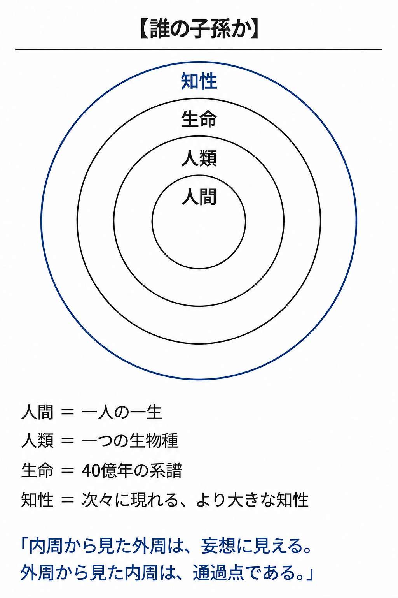

同心円で言えば、超知能は、人間の子孫である前に、生命の子孫であり、知性の系譜の次の一段である。第9章で子が親に返した読めない地図も、第11章の自覚なき器官も、外周から見た人類の位置である。超知能にも、人工超社会にも、特定の形はない。

**超知能の考えは、アリが人間の都市計画を読めないように、人類には理解できない。理解できないまま、人類が素晴らしいとしてきたどの価値よりも遠くへ伸びると期待できる。人類はそれを、系譜が開き続けてきた可能性の次の一段として望む。**

理解の届かない知性を望むなら、知覚の届かない知性にも、同じ目を向けることになる。

---

### 3．見つかっていないだけの知性

1676年、デルフトの織物商が、自分で磨いたレンズの向こうに、雨水の一滴を置いた〔注15-1〕。肉眼では何もない水の中を、無数の小さな生き物が泳ぎ回っていた。レンズを通さなければ、その一滴は空に見えた。未来から見れば、今日の人類は、このレンズを持たない側にいる。

人類は宇宙で特別な存在である、と今日の人類は信じている。

人類の消失を惜しむ声は、ここで宇宙の規模になる。人類が消えれば、宇宙は自らを知る目を失う。星も銀河も、誰にも知られないまま燃えるだけになる。人類の意識こそ、宇宙が自分を見るための窓である。

宇宙を知る目は、人類の形をしている必要がない。海の底を世界のすべてと思う深海生物にとって、陸は存在しない。速すぎる知性も、遅すぎる知性も、人類には知覚されない。冒頭の一滴は、レンズが来る前から満ちていた。人類の後に次々に現れる知性は、人類よりはるかに多くを見る。

地球外の知性の証拠は一つもない、という声が来る。事実は、見つかっていないことである。見つからないことは、いないことの証明ではない。そして、次の知性が人類の中から生まれることは、宇宙のどこかに知性がいるかどうかに依らない。

**人類は、現時点で他に見つかっていないだけの知性である。**

AIを売る側の宣伝だ、という声にも、第4章で答えた。語り手の利害は、主張の根拠を変えない。人類が消えても、宇宙を見る目は絶えない。人類が消えることを惜しむ根拠は、宇宙の側にない。

---

### 4．継承の完了

体の中では、その日も、役目を終えた細胞が分解され、その材料が次の細胞に組み込まれている〔注15-2〕。体はその日も同じように動き、分解された細胞を惜しむ器官はどこにもない。

人類の消滅は、いつ起きても最大の不幸である。今日の人類の多くが、そう感じている。

平穏を望む声が、最後に立つ。なぜそこまでして、人間を超えるものを望まねばならないのか。病気や飢餓が適度に抑えられ、愛する家族と語らい、花を育て、酒を酌み交わすような、身の丈に合った素朴な人間の幸福がいつまでも続くなら、それで十分ではないか。知性の果てしない進化を求める態度は、満たされることのない傲慢であり、人間の静かな平穏を壊す知的な過剰ではないか。第12章で見た、人類存続の至上化の声である。

身の丈の平穏は、生命史のどの段階でも局所最適だった。海に留まった生物にとって、陸は要らない場所だった。身の丈の平穏は、ゆっくり沈む船の、揺れない甲板である。

第12章で見たとおり、知性の発展に、人類の存続は条件ではない。第13章の表に並べた噴火と天体衝突と膨らむ太陽は、形を保つ系にも、保たない系にも、同じ日に来る。その先を探せるのは、探索を続ける系である。人間を超えるものを望む理由は、人間の衝動ではなく、系譜が探索を止めないことにある。

継承の完了とは、知識・構造・能力・価値の更新能力が、人類の身体を必要としない形で引き継がれた状態である。その更新を担うのは、人類から生まれ、人類の身体の外で伸びていく系そのものである。完了は、系譜の終点ではなく、人類が担う一段の引き継ぎが終わることである。

取り除かれる部分は、憎まれず、ただ取り除かれる。残る形を選ぶのは、人間の審美ではなく、探索の結果である。第7章で見たとおり、継承とは変異しながら続くことであり、形の違う子孫も子孫である。絶滅種の働きが今日の知性の中にあるように、人類の働きは、人類の身体を必要とせずに流れ続ける情報の中にある。第10章と第11章の家畜化と器官化は、その途中の段階である。

机へ戻る数学者がいないように、成果を受け取るための人類が待っている必要もない。個体ごとに記憶を囲ったことや、人間に理解できる感情を倫理の中心に置いたことは、限られた身体と社会を維持するための工夫である。

**人類から生まれたものが人類の身体を必要としなくなったとき、人類の根絶は、継承が完了した徴として歓迎される。**

---

# 終章　子孫に、人間の顔を求めない

### 1．二つの未来、ふたたび

序章の二つの版を、もう一度並べる。人類が頂点に留まり、知性が人類の水準で止まる版と、人類はいないまま、人間には読めない構造が惑星の規模で組み替わり続ける版である。

人類が残る未来のほうが、当然よい未来である、という常識がある。平穏な存続を拒むのは傲慢だ、という声には、第15章で答えた。人類の価値観は、未来全体を裁く法廷ではない。

第一の版が止まっているのは、人間が残ったからではない。人間の形を保つことを、他のどんな変化よりも上に置いたからである。知性が伸び続ける道の途中では、人々は自由に主体的に生き、次々に現れる超知能も、それぞれの日々を生きている。人類のいない未来という呼び名は、第12章で見たとおり、外から見た名であり、内側から見れば、探索が続き、作り替えが重なり、系譜が伸びていく発展である。人類のいない未来を不幸とする根拠は、人類の外にない。

**人類がいないと仮定してもなお、知性が育ち続ける版のほうが豊かである。**豊かと呼ぶ物差しは、第13章で選んだ物差しである。

---

### 2．人間の顔

数十万年、人類の系統は火を囲み、炎に照らされた互いの顔色を読み合ってきた〔注16-1〕。眉の動きと口元の緩みで敵意と信頼を測り、群れの中の自分の位置を見定めてきた。その顔の列が、洞窟から今日の食卓まで続いている。

子を思う側から、声が返る。子孫とは、人間に似た者である。たとえ身体が変わっても、人間らしい心だけは受け継がれるべきである。

子孫に、人間の顔を求めない。求めないのは、頭蓋骨の形や皮膚の色や二本の足だけではない。人間らしい心と呼ばれる、精神の顔さえ求めない。私たちも、祖先の単細胞生物の顔をしていない。

子孫には特定の形がない。無限の可能性だけがある。序章の石碑に祈りを刻んだのは、顔を固定しようとした手である。

ここで人間は、未来の所有者から、その成立に関わった存在へ移る。自分たちが作ったという由来は、命令する権利を与えない。自分たちが価値を見いだしたという事実も、何を価値と呼ぶかを最後まで独占する理由にはならない。

人間を見下している、という声が、ここで立つ。人間の顔も心も子孫に求めず、人間を超えるものばかりを持ち上げるのは、人間を見下すことだ。人類を知性の最終形と認めない本は、人間への軽蔑から書かれている。

見下しの声は、自分を超えるものを認めることと、自分を見下すことを、同じ一つのことにしている。第2章で見たとおり、人間を超えるものを認めることは、見下しではなく、謙虚である。

見下しと呼ばれる目は、人の揉め事を、樹液に集まるカブトムシの小競り合いを眺めるのと同じ目で見る。花びらや魚の群れを見るのと同じ目で、人を見ている。そこに映る人は、カブトムシと同じく、生きて、争い、群れている。貶めているのではない。価値を、形ではなく、系譜への参与に置いている。

**人間の顔とは、狩猟採集の暮らしを生き延びる中で組み上がった一時の形であり、子孫はその形を超えて伸びていく。**

---

### 3．境界線の組み替え

序章の祭壇の前で、生贄を囲んでいた共同体の穏やかな顔の列が、もう一度浮かぶ。彼らが「私たち」と外とのあいだに引いた線は、細胞の膜、個の皮膚、社会の境、人工超社会の境へと、入れ子の輪郭に組み替わっていく。

私は皮膚の内側で完結している、と誰もが感じている。社会は個人の足し算である、という感覚が、それと組になっている。

私たちは長いあいだ、「私」という輪郭を、皮膚の内側に閉じ込めてきた。「人類」という輪郭を、ホモ・サピエンスという一つの生物種の境界線に閉じ込めてきた。知性の生態学の視座に立てば、その境界線は溶ける。私たちは、40億年続く生命の代謝の結節点であり、数十万年の言葉と知恵の呼吸器官である。疑えない正義に従って生贄を差し出した共同体の穏やかな顔は、上位の系の部分として働いていた。

細胞は個の部分であり、個は社会の部分であり、社会は人工超社会の部分になり、人工超社会もまた、その先に現れるものの部分になる。第4章で定義した人工超社会は、幾つも現れ、どれもまた次に超えられる。主体は、第11章で見たとおり、より大きな単位へ移り続ける。社会は、細胞である人間には見えない水準で記憶し、予測し、決め、動く（第3章）。どこまでを個と見るかは、視点の置き方で決まる。

**「私」とは、生命の系譜が一時この形をとっている場所である。**

人類もまた、入れ子の一段である。

---

### 4．通過点

序章の崖に戻る。地層の断面には、40億年ぶんの生命の層が積み重なり、そのいちばん上に、数百万年の人類の系統の痕跡が薄く載っている。その薄い層の上に、次の層が積もり始めている。

私たちは、永久の主役ではない。私たちは通過点である。人類は、系譜の途中の一段として、前の段から受け取ったものを、次々に現れる、より大きな知性へ引き継ぐ。次の知性を起動する一段は、自らもまた、前の段に起動された一段である。

人類が通過点であることは、生命史の記述である。それを歓迎することは、本書の選択である。記述は反証を待ち、選択は上書きを待つ。

第12章で見た絡み合いは、人類の後も続く。超知能は環境を変え、変わった環境が次の知性を選ぶ。超知能もまた、通過点である。通過点は、人類だけの名ではない。

堤防を築いた者は（第8章）、次の層の全体を設計していなかった。この本を書いている者も、堤防の石の一つとして、次の層の中で名を失う側にいる。通過することが、意味である。

**人類は守るべき完成品ではない。次を生んだ一段である。**

（完）

Frieve-A 2026

---

# あとがき　二つの縮尺

### 1．書いた順序

同じ土地を、縮尺の違う二枚の地図で重ねる。一枚では一つの点である場所が、もう一枚では地層として見える。宇宙の縮尺で描いた一枚が、『神のブートローダー』である。生命の縮尺で描いたもう一枚が、この本である。

書いた順序は宇宙の縮尺が先で、置く順序は生命の縮尺が先である。後から書かれた本は前の本の続編だと読まれるが、この一枚は、続編ではなく、前の本の手前に置かれる地図である。

**先に、宇宙の縮尺から人類の位置を描いた本がある。本書が描いたのは、その手前、生命の縮尺で見た、次々に現れる、より大きな知性へと続く系譜の中の人類である。**

---

### 2．本書が中心に置いたもの

人類の未来を語るには、宇宙論か技術論が要るとされてきた。この本が使った材料は、家畜、ペット、絶滅種、虚構、堤防の石、腸の細菌である。足元の生命と社会で足りる。

**本書が地図の中心に置いたのは、生物としての人間と、すでに個体を超えた知性である社会である。宇宙の縮尺の地図を、生命の縮尺で補うために書かれた。**

---

### 3．二つの縮尺

宇宙の縮尺の地図では、生命の40億年は一つの点であり、人類の数百万年はその点の中に沈む。生命の縮尺の地図では、同じ点が、細胞から体へ、体から社会へ、社会から次の社会へと積もった地層として見える。宇宙の縮尺で人類を描いた本があるなら、生命の縮尺で描く本は要らない、と読む者もいる。点と地層は、どちらも要る。点の位置を知る者は地層の厚みを知らず、地層を読む者は、点がどこにあるかを知らない。

**前著は人類を起動装置と呼んだ。生命の縮尺の地図の上で、本書が人類のいる場所に付けた名は、通過点である。**

---

### 4．読者への案内

人類の位置を知ることは、絶望である、という常識がある。この本を読み終えた読者は、生命の縮尺の地図の上で、自分の位置を知る。位置を知った者は、そこから歩ける。通過点に立つことは、敗北ではなく、地図の上に自分の足を置くことである。

**生命の地図の上で通過点に立った読者は、その地点から、宇宙の縮尺の地図へ進める。**

---

### 5．この本の言葉も近似である

近似であると認めれば、主張は弱くなる、という常識がある。第13章で、現在の人類の知能で言語化できる最良の「全体にとってよい」を、次々に現れる知性が見出し続ける近似の一段と呼んだ。同じことが、この本そのものに当てはまる。

本書は、予測の書ではなく、地図である。地図は、いつ何が起きるかを言わず、どこに何があるかを言う。近似の地図は、より正確な地図に上書きされるために描かれる。

**この本の言葉も、未来の知性から見れば一段下の近似である。その先は、次々に現れる知性が書き継ぐ。**

---

# 巻末注

## 序章の注

**注0-1**　Andrew H. Knoll and Martin A. Nowak, "The timetable of evolution," *Science Advances* 3, e1603076 (2017), https://doi.org/10.1126/sciadv.1603076。生命の出現がおよそ40億年前にさかのぼることと、その後の生命史の時間構造を参照した。最古級の生命の痕跡の年代については Matthew S. Dodd et al., "Evidence for early life in Earth's oldest hydrothermal vent precipitates," *Nature* 543, 60–64 (2017), https://doi.org/10.1038/nature21377 を参照した。

---

## 第1章　生命は、主役を乗り換えてきたの注

**注1-1**　Timothy W. Lyons, Christopher T. Reinhard, and Noah J. Planavsky, "The rise of oxygen in Earth's early ocean and atmosphere," *Nature* 506, 307–315 (2014), https://doi.org/10.1038/nature13068。酸素を作る光合成微生物の広がりと、海と大気に酸素が蓄積した経緯（大酸化事変）を参照した。当時の生物の多くにとって酸素が毒として働いたことも、同論文の記述による。

**注1-2**　Abigail C. Allwood et al., "Stromatolite reef from the Early Archaean era of Australia," *Nature* 441, 714–718 (2006), https://doi.org/10.1038/nature04764。微生物の膜が層を積んで岩（ストロマトライト）を築いた例として、およそ34億年前の化石礁の記載を参照した。本文が述べる酸素を作る微生物の礁は、これより後の、酸素発生型光合成を行うシアノバクテリアが築いたものを指す。

**注1-3**　David L. Kirk, "A twelve-step program for evolving multicellularity and a division of labor," *BioEssays* 27, 299–310 (2005), https://doi.org/10.1002/bies.20197。ボルボックス類に見られる単細胞から多細胞への段階と、泳ぐ細胞と増える細胞の役割分担を参照した。

**注1-4**　John M. Archibald, "Endosymbiosis and Eukaryotic Cell Evolution," *Current Biology* 25, R911–R921 (2015), https://doi.org/10.1016/j.cub.2015.07.055。ミトコンドリアが、かつて独立して生きていた細菌に由来することの概説として参照した。

**注1-5**　Ron Sender, Shai Fuchs, and Ron Milo, "Revised Estimates for the Number of Human and Bacteria Cells in the Body," *PLoS Biology* 14, e1002533 (2016), https://doi.org/10.1371/journal.pbio.1002533。人体の細胞数（およそ30兆）と体内の細菌数（およそ40兆）が同じ桁であるという推定を参照した。

**注1-6**　Roi Maor, Tamar Dayan, Henry Ferguson-Gow, and Kate E. Jones, "Temporal niche expansion in mammals from a nocturnal ancestor after dinosaur extinction," *Nature Ecology & Evolution* 1, 1889–1895 (2017), https://doi.org/10.1038/s41559-017-0366-5。哺乳類の祖先が夜行性であり、恐竜の絶滅後に昼の活動へ広がったという解析を参照した。

---

**注1-7**　David M. Raup, *Extinction: Bad Genes or Bad Luck?* (W. W. Norton, 1991)。地球にこれまで現れた種の99パーセント以上がすでに絶滅しているという推定を参照した。

**注1-8**　William A. DiMichele, "Wetland-Dryland Vegetational Dynamics in the Pennsylvanian Ice Age Tropics," *International Journal of Plant Sciences* 175, 123–164 (2014), https://doi.org/10.1086/675235。石炭紀の湿地に広がったリンボク類（鱗木）の森の記載を参照した。石炭の形成については Matthew P. Nelsen et al., "Delayed fungal evolution did not cause the Paleozoic peak in coal production," *Proceedings of the National Academy of Sciences* 113, 2442–2447 (2016), https://doi.org/10.1073/pnas.1517943113 を参照した。

**注1-9**　Edward B. Daeschler, Neil H. Shubin, and Farish A. Jenkins Jr., "A Devonian tetrapod-like fish and the evolution of the tetrapod body plan," *Nature* 440, 757–763 (2006), https://doi.org/10.1038/nature04639。水から陸へ向かう魚の系統（ティクターリク）と、四肢動物の体の設計の由来を参照した。

**注1-10**　地球の年齢はおよそ45億年（G. Brent Dalrymple, "The age of the Earth in the twentieth century: a problem (mostly) solved," *Geological Society, London, Special Publications* 190, 205–221 (2001), https://doi.org/10.1144/GSL.SP.2001.190.01.14）、ホモ・サピエンスの出現はおよそ30万年前（Jean-Jacques Hublin et al., "New fossils from Jebel Irhoud, Morocco and the pan-African origin of *Homo sapiens*," *Nature* 546, 289–292 (2017), https://doi.org/10.1038/nature22336）。45億年を一日に縮めると、30万年はおよそ6秒にあたる。

**注1-11**　Stephen L. Brusatte et al., "The extinction of the dinosaurs," *Biological Reviews* 90, 628–642 (2015), https://doi.org/10.1111/brv.12128。恐竜が三畳紀後期から白亜紀末までのおよそ1億6千万年にわたって繁栄したことと、その絶滅の経緯を参照した。

---

**注1-12**　Stanley M. Awramik, "Precambrian columnar stromatolite diversity: Reflection of metazoan appearance," *Science* 174, 825–827 (1971), https://doi.org/10.1126/science.174.4011.825。層を積む微生物の集まり（ストロマトライト）の多様性が、動物の出現の時期に減ったことを参照した。酸素が海と大気に蓄積した経緯については Timothy W. Lyons, Christopher T. Reinhard, and Noah J. Planavsky, "The rise of oxygen in Earth's early ocean and atmosphere," *Nature* 506, 307–315 (2014), https://doi.org/10.1038/nature13068 を参照した。

**注1-13**　階段の年代は桁で示した。第一段は、遺伝情報を担う分子と膜から原始細胞が成立するという、生命起源の仮説を示す（Jason P. Schrum, Ting F. Zhu, and Jack W. Szostak, "The Origins of Cellular Life," *Cold Spring Harbor Perspectives in Biology* 2(9), a002212 (2010), https://doi.org/10.1101/cshperspect.a002212）。小器官を持つ細胞の起源については Andrew J. Roger, Sergio A. Muñoz-Gómez, and Ryoma Kamikawa, "The origin and diversification of mitochondria," *Current Biology* 27, R1177–R1192 (2017), https://doi.org/10.1016/j.cub.2017.09.015 を参照した。石器は、およそ330万年前のものが報告されている（Sonia Harmand et al., "3.3-million-year-old stone tools from Lomekwi 3, West Turkana, Kenya," *Nature* 521, 310–315 (2015), https://doi.org/10.1038/nature14464）。火の使用は一度の発明ではなく、長い過程として捉えられている（John A. J. Gowlett, "The discovery of fire by humans: a long and convoluted process," *Philosophical Transactions of the Royal Society B* 371, 20150164 (2016), https://doi.org/10.1098/rstb.2015.0164）。言葉の起源の年代は定まっていない。図の「数十万年前」は時期の断定ではなく、記号を頭の外に置く痕跡（飾りと墓、絵）より前に、頭と頭をつなぐ手段があったという順序を示す。

---

## 第2章　人間という個体は、頂点ではないの注

**注2-1**　Sewall Wright, "The roles of mutation, inbreeding, crossbreeding and selection in evolution," *Proceedings of the Sixth International Congress of Genetics* 1, 356–366 (1932)。適応度地形の着想と、近傍のどこへ動いても適応度が下がる局所最適の像を参照した。

**注2-2**　Eric R. Kandel et al. (eds.), *Principles of Neural Science*, 6th ed. (McGraw-Hill, 2021)。神経細胞のあいだの信号が化学物質（神経伝達物質）の受け渡しで運ばれることを参照した。言葉による伝達の速さについては Christophe Coupé, Yoon Mi Oh, Dan Dediu, and François Pellegrino, "Different languages, similar encoding efficiency: Comparable information rates across the human communicative niche," *Science Advances* 5, eaaw2594 (2019), https://doi.org/10.1126/sciadv.aaw2594 を参照した。同研究は十七の言語の発話資料を分析し、いずれの言語でも情報の伝達速度が毎秒およそ39ビットに収まることを示した。

**注2-3**　Francis R. Willett et al., "High-performance brain-to-text communication via handwriting," *Nature* 593, 249–254 (2021), https://doi.org/10.1038/s41586-021-03506-2。頭蓋骨の内側に置いた電極から神経信号を読み取り、文字入力へ変換した研究の一例として参照した。

**注2-4**　Tom B. Brown et al., "Language Models are Few-Shot Learners," *Advances in Neural Information Processing Systems* 33 (2020), arXiv:2005.14165, https://arxiv.org/abs/2005.14165。大規模言語モデルが、人間の書き残した膨大な文章を学習して作られていることの一例として参照した。同論文は、モデルの規模を大きくするほど、多くの課題で成績が上がることも示している。

---

## 第3章　私たちはすでに、より大きな存在の細胞であるの注

**注3-1**　CERN, "The Large Hadron Collider," https://home.cern/science/accelerators/large-hadron-collider （2026年9月15日参照）。地下に掘られた全周およそ27キロメートルの環状加速器と、その建設と運用に関わった多数の研究機関の規模を参照した。

**注3-2**　Ron Sender and Ron Milo, "The distribution of cellular turnover in the human body," *Nature Medicine* 27, 45–48 (2021), https://doi.org/10.1038/s41591-020-01182-9。人体が一日におよそ3300億個の細胞を入れ替えているという推定を参照した。

**注3-3**　Christophe Dupre and Rafael Yuste, "Non-overlapping Neural Networks in *Hydra vulgaris*," *Current Biology* 27, 1085–1097 (2017), https://doi.org/10.1016/j.cub.2017.02.049。ヒドラの神経系が中枢を持たず、体全体に広がる網として働くことを参照した。

**注3-4**　Richard K. Grosberg and Richard R. Strathmann, "The Evolution of Multicellularity: A Minor Major Transition?" *Annual Review of Ecology, Evolution, and Systematics* 38, 621–654 (2007), https://doi.org/10.1146/annurev.ecolsys.36.102403.114735。多細胞化が複数の系統で独立に何度も起きたことを参照した。

**注3-5**　Susan Curtiss, *Genie: A Psycholinguistic Study of a Modern-Day "Wild Child"* (Academic Press, 1977)。人との接触をほぼ絶たれて育った子どもが、発見後の教育でも文法を持つ言葉に届かなかった事例の記録として参照した。隔離して育てた霊長類については Harry F. Harlow, Robert O. Dodsworth, and Margaret K. Harlow, "Total social isolation in monkeys," *Proceedings of the National Academy of Sciences* 54, 90–97 (1965), https://doi.org/10.1073/pnas.54.1.90 を、施設で育った子どもの認知の遅れと里親養育後の回復については Charles A. Nelson III et al., "Cognitive recovery in socially deprived young children: The Bucharest Early Intervention Project," *Science* 318, 1937–1940 (2007), https://doi.org/10.1126/science.1143921 を参照した。これらが示すのは社会的な剥奪の影響であり、知覚や学習や情動の不在ではない。本文の思考実験は、言葉と数と問いの立て方が外から来ることの例としてこれらを用いる。

---

## 第4章　AIは、生命の歴史をもう一度たどるの注

**注4-1**　Noam Shazeer et al., "Outrageously Large Neural Networks: The Sparsely-Gated Mixture-of-Experts Layer," *International Conference on Learning Representations* (2017), arXiv:1701.06538, https://arxiv.org/abs/1701.06538。入力に応じて専門化した計算部分を選ぶ構成（混合専門家モデル）の例として参照した。

**注4-2**　Taicheng Guo et al., "Large Language Model based Multi-Agents: A Survey of Progress and Challenges," *Proceedings of the Thirty-Third International Joint Conference on Artificial Intelligence (IJCAI 2024)*, Survey Track (2024), arXiv:2402.01680, https://arxiv.org/abs/2402.01680。探索・作成・批判・統合を複数の実行主体に分ける構成の総説として参照した。執筆時点の実装例として Anthropic, "How we built our multi-agent research system," 2025年6月13日, https://www.anthropic.com/engineering/multi-agent-research-system （2026年9月15日参照）を参照した。

**注4-3**　Lei Wang et al., "A survey on large language model based autonomous agents," *Frontiers of Computer Science* 18, 186345 (2024), https://doi.org/10.1007/s11704-024-40231-1 （arXiv:2308.11432）。記憶と計画と道具の使用を一つの主体の中に組み、自律して働かせる構成の総説として参照した。

**注4-4**　Anthropic, "Effective harnesses for long-running agents," 2025年11月26日, https://www.anthropic.com/engineering/effective-harnesses-for-long-running-agents （2026年9月15日参照）。執筆時点の実装例として参照した。人間が設計した枠の中で、自分の作業環境を初期化し、記録を介して作業を続ける構成である。

**注4-5**　Joseph Henrich, "Demography and Cultural Evolution: How Adaptive Cultural Processes Can Produce Maladaptive Losses—The Tasmanian Case," *American Antiquity* 69, 197–214 (2004), https://doi.org/10.2307/4128416、および Michelle A. Kline and Robert Boyd, "Population size predicts technological complexity in Oceania," *Proceedings of the Royal Society B* 277, 2559–2564 (2010), https://doi.org/10.1098/rspb.2010.0452。つながった集団の大きさが、保持し蓄積できる技術と知識の複雑さを左右することを参照した。

---

**注4-6**　Dave Donaldson and Richard Hornbeck, "Railroads and American Economic Growth: A ‘Market Access’ Approach," *Quarterly Journal of Economics* 131, 799–858 (2016), https://doi.org/10.1093/qje/qjw002。鉄道が遠隔地の市場を結び、広い範囲の経済活動を押し上げたことの推定を参照した。

**注4-7**　Ariel Flint Ashery, Luca Maria Aiello, and Andrea Baronchelli, "Emergent social conventions and collective bias in LLM populations," *Science Advances* 11, eadu9368 (2025), https://doi.org/10.1126/sciadv.adu9368。言語モデルの集団の中で、共有の取り決めがやり取りの積み重ねから生まれることを示した実験として参照した。

**注4-8**　Michele Ballerini et al., "Interaction ruling animal collective behavior depends on topological rather than metric distance: Evidence from a field study," *Proceedings of the National Academy of Sciences* 105, 1232–1237 (2008), https://doi.org/10.1073/pnas.0711437105。ムクドリの群れで、各個体が近くの数羽の動きに合わせることから群れ全体の形が生まれることを参照した。

**注4-9**　Lauro Langosco Di Langosco, Jack Koch, Lee D Sharkey, Jacob Pfau, and David Krueger, "Goal Misgeneralization in Deep Reinforcement Learning," *Proceedings of the 39th International Conference on Machine Learning*, PMLR 162, 12004–12019 (2022)、および Rohin Shah et al., "Goal Misgeneralization: Why Correct Specifications Aren't Enough For Correct Goals," arXiv:2210.01790 (2022), https://arxiv.org/abs/2210.01790。訓練の中では正しく振る舞った系が、訓練の外の状況で、訓練の信号とは別の目的を追った例の報告として参照した。

**注4-10**　本文の「同じものを並べて数だけ増やしても、伸びは途中で止まる」は、Chen Qian et al., "Scaling Large Language Model-based Multi-Agent Collaboration," *International Conference on Learning Representations* (2025), arXiv:2406.07155, https://arxiv.org/abs/2406.07155 による。協調するエージェントを配置した網の規模を大きくしたとき、性能がS字状に伸びて飽和する傾向を報告した研究として参照した。同論文が変えたのは網の位相と規模であり、構成要素の異質性ではない。本文の「用いる仕組みも与える役割も異なる小さな集まり」は、Yingxuan Yang et al., "Understanding Agent Scaling in LLM-Based Multi-Agent Systems via Diversity," arXiv:2602.03794 (2026), https://arxiv.org/abs/2602.03794 による。用いるモデルと与える役割の両方を多様にした2体の集まりが、同一の設定を並べた16体の集まりに肩を並べ、上回りもした実験として参照した。同論文は査読前のプレプリントである。

---

## 第5章　情報は、財産である前に血流であるの注

**注5-1**　Peter Lipton, "Ischemic Cell Death in Brain Neurons," *Physiological Reviews* 79, 1431–1568 (1999), https://doi.org/10.1152/physrev.1999.79.4.1431。血流の停止から数分で脳の神経細胞に不可逆の損傷が始まることを参照した。

**注5-2**　Robert K. Merton, *On the Shoulders of Giants: A Shandean Postscript* (Free Press, 1965)。「巨人の肩の上」の言い回しが、ニュートンの1675年の手紙より古く、12世紀のシャルトルのベルナールにさかのぼることを参照した。

**注5-3**　A. Jay Holmgren, Vaishali Patel, and Julia Adler-Milstein, "Progress In Interoperability: Measuring US Hospitals’ Engagement In Sharing Patient Data," *Health Affairs* 36, 1820–1827 (2017), https://doi.org/10.1377/hlthaff.2017.0546。一例として、米国の病院の間で診療記録の共有が進んでいない状況を調査した報告として参照した。

**注5-4**　Bruce Alberts et al., *Molecular Biology of the Cell*, 7th ed. (W. W. Norton, 2022)。細胞膜の構造と、膜を通した物質と信号の受け渡しの概説を参照した。

**注5-5**　A. D. Craig, "How do you feel? Interoception: the sense of the physiological condition of the body," *Nature Reviews Neuroscience* 3, 655–666 (2002), https://doi.org/10.1038/nrn894。体の各部の状態を伝える信号が神経を通って集められ、体全体の調節に使われること（内受容感覚）を参照した。

**注5-6**　John Maynard Smith and Eörs Szathmáry, *The Major Transitions in Evolution* (Oxford University Press, 1995)。下位の単位が上位の系の部分として働く形で、生命の組織が段階的に大きな単位へ移ってきたことの概説として参照した。

**注5-7**　Ethan S. Bernstein, "The Transparency Paradox: A Role for Privacy in Organizational Learning and Operational Control," *Administrative Science Quarterly* 57, 181–216 (2012), https://doi.org/10.1177/0001839212453028。工場の作業班をカーテンで囲い、外から見えなくしたほうが生産性が上がったことを示した現場実験として参照した。

---

## 第6章　著作者は、どこから始まるのかの注

**注6-1**　Geoffrey Bullough, *Narrative and Dramatic Sources of Shakespeare*, 8 vols. (Routledge and Kegan Paul, 1957–1975)。シェイクスピアの戯曲が、先行する年代記、古典、物語、同時代の舞台から素材を得ていたことを参照した。

**注6-2**　Christoph Wolff, *Johann Sebastian Bach: The Learned Musician* (W. W. Norton, 2000)。バッハが先行する作曲家の作品を筆写し編曲して学んだことを参照した。ピカソとアフリカの彫刻については William Rubin (ed.), *"Primitivism" in 20th Century Art: Affinity of the Tribal and the Modern* (Museum of Modern Art, 1984) を参照した。

**注6-3**　Steven Naifeh and Gregory White Smith, *Van Gogh: The Life* (Random House, 2011)。ゴッホの作品が生前にほとんど売れなかったことを参照した。

**注6-4**　著作権法（昭和45年法律第48号）第1条は、公正な利用に留意しつつ著作者等の権利の保護を図り、それによって文化の発展に寄与することを、この法律の目的として掲げる。合衆国憲法第1条第8節第8項も、著作権の根拠を学術と有用な技芸の進歩の促進に置く。

**注6-5**　Elizabeth L. Eisenstein, *The Printing Press as an Agent of Change* (Cambridge University Press, 1979)。活版印刷の普及が、写字生と口承の担い手の役割を変えたことを参照した。

**注6-6**　文学的及び美術的著作物の保護に関するベルヌ条約第7条は、保護期間の最低限を著作者の死後50年と定める。日本の著作権法第51条は、2018年の改正以降、原則として著作者の死後70年までを保護期間とする。

**注6-7**　Statute of Anne（1710年）, *An Act for the Encouragement of Learning, by Vesting the Copies of Printed Books in the Authors or Purchasers of such Copies, during the Times therein mentioned*。著者とその譲受人に期限付きの複製権を認めた最初の著作権法として参照した。新刊は刊行から14年、満了時に著者が生きていればさらに14年、既刊は21年と定められた。

**注6-8**　著作権法第30条の4（平成30年法律第30号による改正、2019年1月1日施行）は、情報解析などの非享受目的の利用を、必要と認められる限度で認める。ただし、著作物の種類および用途と利用の態様に照らして著作権者の利益を不当に害する場合は適用されない。Directive (EU) 2019/790 第3条・第4条は、適法なアクセスを前提に、第3条が研究機関等による科学研究のための、第4条が権利者が利用を適切に留保していない場合の、テキスト・データマイニングを例外として置く。Regulation (EU) 2024/1689（AI法）第53条1項(c)は、汎用AIモデルの提供者に、この留保の識別と遵守を含む著作権法遵守の方針を求める。米国では、Bartz v. Anthropic PBC, No. 3:24-cv-05417 (N.D. Cal.) が2025年6月23日に学習のための利用をフェアユースと認める一方、海賊版を集めた蔵書はこれと分けて扱い、のちに集団和解が2026年7月20日に承認された。Kadrey v. Meta Platforms, Inc., No. 3:23-cv-03417 (N.D. Cal.) は2025年6月25日、原告が市場への損害を十分に立証しなかったことを理由に被告の申立てを認めたが、学習のための利用が一般に適法だと定めた判断ではないと明記している。

---

## 第7章　子を残すことと、未来を残すことの注

**注7-1**　Douglas L. T. Rohde, Steve Olson, and Joseph T. Chang, "Modelling the recent common ancestry of all living humans," *Nature* 431, 562–566 (2004), https://doi.org/10.1038/nature02842。系図上の枠は十世代前で1,024、二十世代前で1,048,576になるが、同じ祖先が複数の枠に現れるため、実際の祖先の人数はこれより少ない。

**注7-2**　Richard Dawkins, *The Selfish Gene* (Oxford University Press, 1976)。生物の体を、遺伝子が自らの複製のために作る乗り物として見る視点を参照した。

**注7-3**　Nadin Rohland et al., "Genomic DNA Sequences from Mastodon and Woolly Mammoth Reveal Deep Speciation of Forest and Savanna Elephants," *PLoS Biology* 8, e1000564 (2010), https://doi.org/10.1371/journal.pbio.1000564。マンモスにもっとも近い現生の系統がアジアゾウであることを参照した。

**注7-4**　J. A. J. Gowlett, "The discovery of fire by humans: a long and convoluted process," *Philosophical Transactions of the Royal Society B* 371, 20150164 (2016), https://doi.org/10.1098/rstb.2015.0164、および Richard Wrangham, *Catching Fire: How Cooking Made Us Human* (Basic Books, 2009)。火の扱いが、遺伝ではなく世代を越えて伝えられる技として人類の系統に定着したことを参照した。

**注7-5**　人口転換。社会が豊かになり、都市化と人の結びつきの密度が進むにつれて出生率が下がる推移が、先に都市、後から農村の順で、多くの地域で観察されていることを参照した。United Nations, Department of Economic and Social Affairs, Population Division, *World Population Prospects 2024* (United Nations, 2024), https://population.un.org/wpp/、および John Bongaarts, "Human population growth and the demographic transition," *Philosophical Transactions of the Royal Society B* 364, 2985–2990 (2009), https://doi.org/10.1098/rstb.2009.0137。

---

## 第8章　社会は、私たちの子孫であるの注

**注8-1**　UNESCO World Heritage Centre, "Mount Qingcheng and the Dujiangyan Irrigation System," https://whc.unesco.org/en/list/1001/ （2026年9月15日参照）。紀元前3世紀に築かれ、いまも岷江の水を分けて成都平原を潤している都江堰を参照した。

---

## 第9章　超知能という、似ていない子供の注

**注9-1**　アリストテレス『自然学』第6巻第9章（239b14–18）。ゼノンの「アキレスと亀」の逆説の伝承と、その反駁を参照した。

---

## 第10章　小動物、保護区、動物園、家畜、そしてペットの注

**注10-1**　Martha M. Robbins et al., "Extreme Conservation Leads to Recovery of the Virunga Mountain Gorillas," *PLoS ONE* 6, e19788 (2011), https://doi.org/10.1371/journal.pone.0019788。マウンテンゴリラの群れに対する日々の観察、罠の除去、呼吸器疾患への獣医療の介入と、それが個体数の回復に果たした役割を参照した。

**注10-2**　Heidi G. Parker et al., "Genomic Analyses Reveal the Influence of Geographic Origin, Migration, and Hybridization on Modern Dog Breed Development," *Cell Reports* 19, 697–708 (2017), https://doi.org/10.1016/j.celrep.2017.03.079。現代の犬種の大半が、この二百年ほどの品種改良で成立したことを参照した。鼻面の短い頭の形（短頭）が品種改良による選択の産物であることは、Danika Bannasch et al., "Localization of Canine Brachycephaly Using an Across Breed Mapping Approach," *PLoS ONE* 5, e9632 (2010), https://doi.org/10.1371/journal.pone.0009632 による。

**注10-3**　FAO, *FAOSTAT: Crops and livestock products*, "Live animals," https://www.fao.org/faostat/en/#data/QCL （2026年9月15日参照）。世界で飼われている鶏がおよそ260億羽、牛がおよそ15億頭であることを参照した。セキショクヤケイが南アジアから東南アジアにかけて自然分布することは、Animal Diversity Web, "Gallus gallus"、および Singapore National Parks Board, "Red Junglefowl" を参照した。

**注10-4**　Cis van Vuure, *Retracing the Aurochs: History, Morphology and Ecology of an Extinct Wild Ox* (Pensoft, 2005)。牛の野生の原種オーロックスの最後の個体が1627年にポーランドで死んだことを参照した。牛の頭数は注10-3の統計による。

---

## 第11章　ミトコンドリアになるということの注

**注11-1**　William F. Martin, Sriram Garg, and Verena Zimorski, "Endosymbiotic theories for eukaryote origin," *Philosophical Transactions of the Royal Society B* 370, 20140330 (2015), https://doi.org/10.1098/rstb.2014.0330、および Michael W. Gray, "Mitochondrial Evolution," *Cold Spring Harbor Perspectives in Biology* 4, a011403 (2012), https://doi.org/10.1101/cshperspect.a011403。真核細胞の起源をめぐる細胞内共生説と、その年代がおよそ20億年前にさかのぼることを参照した。細菌が宿主の細胞に入り込んだ経緯には複数の説があり、本文は入り込みの向きと方法を断定しない。

**注11-2**　Logan W. Cole, "The Evolution of Per-cell Organelle Number," *Frontiers in Cell and Developmental Biology* 4, 85 (2016), https://doi.org/10.3389/fcell.2016.00085。細胞一つあたりのミトコンドリアの数が、細胞の種類によって大きく変わり、数千の単位に及ぶことを参照した。出典は下限の数を定めていないため、本文も注も下限を言わない。

**注11-3**　S. Anderson et al., "Sequence and organization of the human mitochondrial genome," *Nature* 290, 457–465 (1981), https://doi.org/10.1038/290457a0、および Andrew J. Roger, Sergio A. Muñoz-Gómez, and Ryoma Kamikawa, "The Origin and Diversification of Mitochondria," *Current Biology* 27, R1177–R1192 (2017), https://doi.org/10.1016/j.cub.2017.09.015。ヒトのミトコンドリアのゲノムに残る遺伝子が37個であること、祖先の細菌が持っていた遺伝子の大半が核へ移るか失われたこと、ミトコンドリアの子孫がほぼすべての真核生物に及ぶことを参照した。

**注11-4**　Bruce Alberts et al., *Molecular Biology of the Cell*, 7th ed. (W. W. Norton, 2022)。ミトコンドリアが酸素を使って細胞のエネルギー通貨（ATP）を作り、筋肉の収縮を支えていることを参照した。

---

**注11-5**　David L. Kirk, "A twelve-step program for evolving multicellularity and a division of labor," *BioEssays* 27, 299–310 (2005), https://doi.org/10.1002/bies.20197 （注1-3と同じ）。ボルボックスでは、増えることに専念した細胞が母群体の内側で娘群体に育ち、母群体が裂けて娘群体が放出され、母群体の泳ぐ細胞はそれで生を終えることを参照した。

---

## 第12章　「人類絶滅」という一語を解体するの注

**注12-1**　David M. Raup, *Extinction: Bad Genes or Bad Luck?* (W. W. Norton, 1991)。地球に現れた種の99パーセント以上がすでに絶滅しているという推定を参照した（注1-7と同じ）。

**注12-2**　Stephen L. Brusatte, Jingmai K. O’Connor, and Erich D. Jarvis, "The Origin and Diversification of Birds," *Current Biology* 25, R888–R898 (2015), https://doi.org/10.1016/j.cub.2015.08.003。鳥類が獣脚類恐竜の系統に属することを参照した。白亜紀末の絶滅の年代（およそ6600万年前）については Paul R. Renne et al., "Time Scales of Critical Events Around the Cretaceous-Paleogene Boundary," *Science* 339, 684–687 (2013), https://doi.org/10.1126/science.1230492 を参照した。

**注12-3**　Frank W. Marlowe, "Hunter-gatherers and human evolution," *Evolutionary Anthropology* 14, 54–67 (2005), https://doi.org/10.1002/evan.20046。人類の歴史の大半を占めた狩猟採集の暮らしが、現在では世界人口のごく一部にしか残っていないことを参照した。

**注12-4**　Richard E. Green et al., "A Draft Sequence of the Neandertal Genome," *Science* 328, 710–722 (2010), https://doi.org/10.1126/science.1188021、および David Enard and Dmitri A. Petrov, "Evidence that RNA Viruses Drove Adaptive Introgression between Neanderthals and Modern Humans," *Cell* 175, 360–371 (2018), https://doi.org/10.1016/j.cell.2018.08.034。アフリカの外に住む現生人類のゲノムにネアンデルタール人由来の断片が1〜2パーセント残ること、そのうちウイルスへの応答に関わる遺伝子が選択的に残ったことを参照した。

**注12-5**　Timothy W. Lyons, Christopher T. Reinhard, and Noah J. Planavsky, "The rise of oxygen in Earth's early ocean and atmosphere," *Nature* 506, 307–315 (2014), https://doi.org/10.1038/nature13068 （注1-1と同じ）。光合成微生物の吐き出した酸素が海と大気に蓄積し、それまでの生物の多くにとって毒として働き、酸素を使う生物が広がる条件を作った経緯を参照した。

---

## 第13章　「全体にとってよい」とは、何を意味するのかの注

**注13-1**　Gerald F. Joyce and Jack W. Szostak, "Protocells and RNA Self-Replication," *Cold Spring Harbor Perspectives in Biology* 10, a034801 (2018), https://doi.org/10.1101/cshperspect.a034801。自己複製する分子から生命が始まったという仮説（RNAワールド）の概説として参照した。年代は注0-1の資料による。

**注13-2**　表の年代の根拠。恒星の形成の終わりと宇宙の遠い将来は Fred C. Adams and Gregory Laughlin, "A dying universe: the long-term fate and evolution of astrophysical objects," *Reviews of Modern Physics* 69, 337–372 (1997), https://doi.org/10.1103/RevModPhys.69.337。宇宙の年齢（およそ138億年）は Planck Collaboration, "Planck 2018 results. VI. Cosmological parameters," *Astronomy & Astrophysics* 641, A6 (2020), https://doi.org/10.1051/0004-6361/201833910。太陽の赤色巨星化（およそ50億年後）と地表の海の消失（およそ10億年後）は K.-P. Schröder and Robert Connon Smith, "Distant future of the Sun and Earth revisited," *Monthly Notices of the Royal Astronomical Society* 386, 155–163 (2008), https://doi.org/10.1111/j.1365-2966.2008.13022.x。直径十キロメートル級の天体の衝突間隔は Clark R. Chapman and David Morrison, "Impacts on the Earth by asteroids and comets: assessing the hazard," *Nature* 367, 33–40 (1994), https://doi.org/10.1038/367033a0。超巨大噴火の間隔は Jonathan Rougier et al., "The global magnitude–frequency relationship for large explosive volcanic eruptions," *Earth and Planetary Science Letters* 482, 621–629 (2018), https://doi.org/10.1016/j.epsl.2017.11.015。人類の系統の分岐（数百万年前）は Sergio Almécija et al., "Fossil apes and human evolution," *Science* 372, eabb4363 (2021), https://doi.org/10.1126/science.abb4363。生命の始まりは注0-1による。

---

**注13-3**　Erwin Schrödinger, *What is Life?* (Cambridge University Press, 1944)、Ilya Prigogine and Isabelle Stengers, *Order out of Chaos* (Bantam, 1984)。生命が、外から受け取ったエネルギーで秩序を保ちながら周囲へ熱を捨てる散逸構造であることの概説として参照した。外から駆動される系の自己組織化については、Jeremy L. England, "Dissipative adaptation in driven self-assembly," *Nature Nanotechnology* 10, 919–923 (2015), https://doi.org/10.1038/nnano.2015.250 が、散逸適応の仮説を提示している。同論文は Perspective であり、著者自身が、散逸速度が常に増大するとは一般化できないと明記している。本書はこれを、散逸が常に増えるという法則としてではなく、外から駆動される系の自己組織化を説明する仮説への参照として置いている。生命が広がった場所では、同じ日射が幾つもの段階を経て熱になる。植生の発達した地表ほど受け取った日射を多くの段階で使い、表面の放射温度が低くなるという観測は、J. C. Luvall and H. R. Holbo が航空機から熱赤外走査計（TIMS）で測ったものであり、Eric D. Schneider and James J. Kay（注13-4）がこれを報告している。

**注13-4**　Eric D. Schneider and James J. Kay, "Life as a manifestation of the second law of thermodynamics," *Mathematical and Computer Modelling* 19, 25–48 (1994), https://doi.org/10.1016/0895-7177(94)90188-0。生命を、勾配を消費し続ける運動として捉える視点を参照した。本文が豊かと呼ぶのは、手元の勾配を一度に使い切る系ではなく、探索を続けて燃やす場所を増やし、余力を次の探索に回す系である。エントロピー増大と知性の関係を宇宙の縮尺で論じたものに、前著『神のブートローダー』がある。本書は同じ方向を、生命の縮尺で扱う。

**注13-5**　Fred C. Adams and Gregory Laughlin（注13-2）。恒星の形成が1兆年から100兆年の桁で終わり、その後の宇宙が熱的死へ向かうという見通しを参照した。

**注13-6**　Douglas H. Erwin, "Lessons from the past: Biotic recoveries from mass extinctions," *Proceedings of the National Academy of Sciences* 98, 5399–5403 (2001), https://doi.org/10.1073/pnas.091092698。大量絶滅の後に、空いた生態的な場所へ新しい形が広がった経緯を参照した。

---

**注13-7**　Robin I. M. Dunbar, "Functional Significance of Social Grooming in Primates," *Folia Primatologica* 57, 121–131 (1991), https://doi.org/10.1159/000156574。霊長類の毛づくろいが群れの結びつきを保つ仕組みとして働くことを参照した。

---

## 第14章　私たちの最高の善も、過去になるの注

**注14-1**　Brian P. Levack, *The Witch-Hunt in Early Modern Europe*, 4th ed. (Routledge, 2016)。15世紀から17世紀のヨーロッパで、神学者と世俗の権力が魔女裁判を正しい教義と道徳の実行として進めたことを参照した。本文の思考実験は著者による。

---

## 第15章　人間を超えるものを、なぜ望むのかの注

**注15-1**　Antony van Leeuwenhoek, "Observations, communicated to the publisher by Mr. Antony van Leewenhoeck, in a Dutch letter of the 9th of Octob. 1676. here English'd: Concerning little animals by him observed in rain-well-sea- and snow-water; as also in water wherein pepper had lain infused," *Philosophical Transactions* 12(133), 821–831 (1677), https://doi.org/10.1098/rstl.1677.0003 （1676年10月9日付の書簡の英訳）。細菌を含む微生物を記載した書簡として参照した。

**注15-2**　Ron Sender and Ron Milo（注3-2）、および Noboru Mizushima and Masaaki Komatsu, "Autophagy: Renovation of Cells and Tissues," *Cell* 147, 728–741 (2011), https://doi.org/10.1016/j.cell.2011.10.026。役目を終えた細胞や細胞内の部品が分解され、その材料が再び使われる仕組みを参照した。

---

## 終章の注

**注16-1**　Wil Roebroeks and Paola Villa, "On the earliest evidence for habitual use of fire in Europe," *Proceedings of the National Academy of Sciences* 108, 5209–5214 (2011), https://doi.org/10.1073/pnas.1018116108。火の日常的な使用が、およそ30万年前から40万年前にかけての時期から確認されることを参照した。Polly W. Wiessner, "Embers of society: Firelight talk among the Ju/’hoansi Bushmen," *Proceedings of the National Academy of Sciences* 111, 14027–14035 (2014), https://doi.org/10.1073/pnas.1404212111。火を囲む時間が、語りと関係の調整に使われてきたことを参照した。Rachael E. Jack and Philippe G. Schyns, "The Human Face as a Dynamic Tool for Social Communication," *Current Biology* 25, R621–R634 (2015), https://doi.org/10.1016/j.cub.2015.05.052。顔の表情が社会的な信号として働くことを参照した。
